---
title: "2025年年终总结"
date: 2025-12-29T14:21:07+08:00
summary: "总结完，再出发"
url: "/posts/2025年年终总结/"
categories:
  - "瞎聊些什么"
tags:
  - "2025年年终总结"
draft: false
---

# 开篇

总的来说今年过的还是很充实的，遇见了形形色色的人，认识了很多很厉害的师傅，也发生了很多事情。为了写明白这次年终总结，特意把相片和文章都全部翻了一下（可能废话会有点多哈哈哈）

总结的意义在于：

1. 认可自己的收获和成果（我觉得这个是最重要的）
2.  发现自己的不足和缺陷
3. 给自己的2026年定制几个目标

# 去年十月正式开始

在这里我真的很感谢磊哥以及当时组织我们打省赛的学长，因为我是大一刚开学（23年学校举办百团大战）的时候加入的社团以及工作室，但是当时并没有认真去学，也一直断断续续的，直到24年10月磊哥组织我们来报名打四川省省赛，当时给我们很详细的介绍了这个方向未来的前景以及技术栈，这些描述完全戳到了我以前对心中梦寐以求的所谓”黑客“，也就彻底激发了我对这个领域的热爱

其实记得这么清楚的原因还是因为我记得我是去年10月中旬买的ctfshow会员（好像10月上旬是先做了一下ctfhub吧）

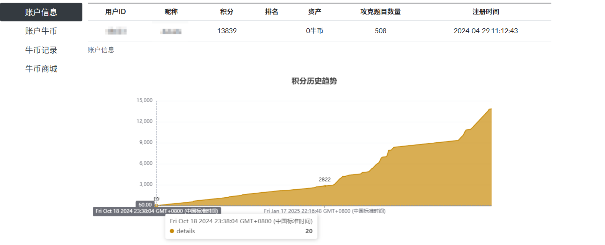

哈哈哈哈想起后来跟包师傅熟络后他一直有骂我为什么当时他买会员的时候喊我我没买（他比我早入半年差不多），这让他一个人承担了大几百的费用哈哈哈哈哈哈哈

很值得，虽然最后省赛只拿到一个省三，但我找到了一个自己热爱的方向去执着

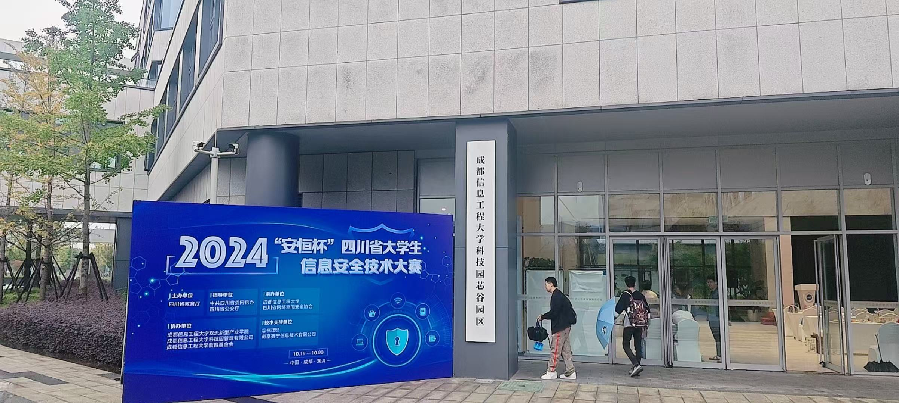

后面几个月的话就是一直刷ctfshow的题以及输出自己的学习成果了

# 1月

寒假还算是过的比较充实，无论是过年前还是过年后都保持着每天都有学东西，我记得很清楚，当时有一个跨年的渗透赛我没去打，当时我记得是在老家吃完饭回楼上坐着看了一下题目，没头绪然后就直接不打了哈哈，大家别学我哈，这状态属实是该骂

有一件事一直有点后悔就是我去外婆家那会，当时我为了学习带着电脑回去的，当时状态比较好，都在全神贯注的刷题，听起来是件很好的事情，为什么会后悔呢？后面我会讲到

# 2月

2月一边是在准备转专业的C语言机考，一方面也在继续学习，其实C语言在高中毕业暑假就学过，但后面为了稳妥还是重新学了一下，然后也写了一篇比较详细的基础知识点在博客

说起这个，我想起来我同学他对象要考C语言还跟我要过我的文章哈哈哈，没想到的是确实得到了好评说是写的很详细

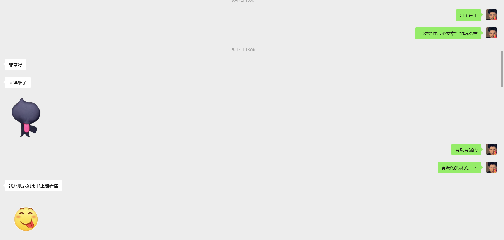

虽然我最后的转专业机考考了九十多，大概前几名吧，但是最后并没有转成功，现在想想其实还是自己的问题，当时大二上的一门专业课理论力学特别难，专业老师最后挂科挂了六七十个人，其中就有我。。。我被他定的期末斩杀线45分斩杀了

当然挂科后就没法正常申请转专业了，我就走了特长生转专业的渠道，但是这个流程很复杂，说白了解释权都在校方，他认为你特长你就算特长，不算就不是，但是我真的很想说的是，网安的比赛（在教育厅白名单的）真的很少，不过我也承认自己拿的奖不够多，技不如人罢了，菜就多练！

我记得2月还打了HGAME2025的比赛，算是有收获的比赛，虽然自己做的题目不多哈哈哈

哎我去，我又漏文章了？

翻了一下当时比赛的wp发现自己忘记复现了emmmm，真该死

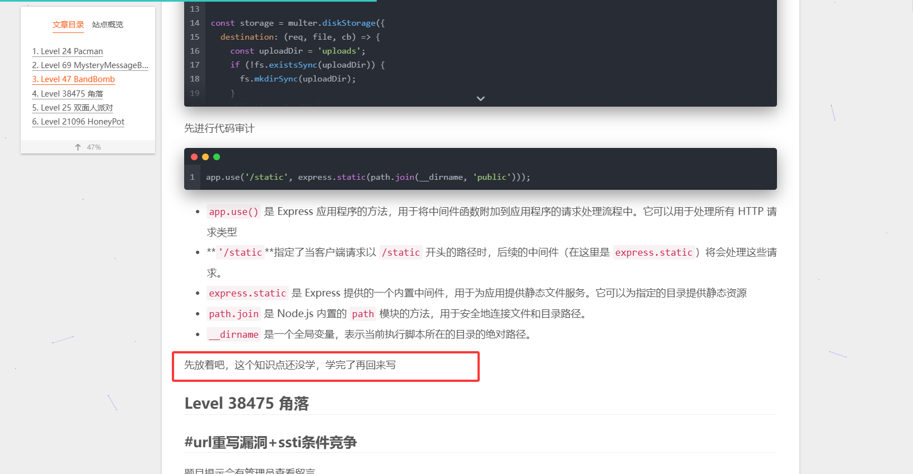

2月份还开始了对java的学习，其实一月份就学了一下java的基础，拖到2月份才开始看java的反序列化，那会的我可谓是对java抗拒但是又想入手学哈哈，不过对java的感情到后面就成”真香定律“了

# 3月

最绷不住的是三月份打的国赛，我们队是在赛方附近民宿住，然后当时和包师傅住一间，我和包师傅赛前晚上在研究怎么做内网代理的搭建，然后当时头脑一热来了一句”第二天五点多起来再学一下“，这下好了，早上是起来了，是研究了，但是比赛的时候困的不行，状态都很差，最后遗憾爆0哈哈哈哈哈哈，心理委员俺不得劲`/(ㄒoㄒ)/~~`

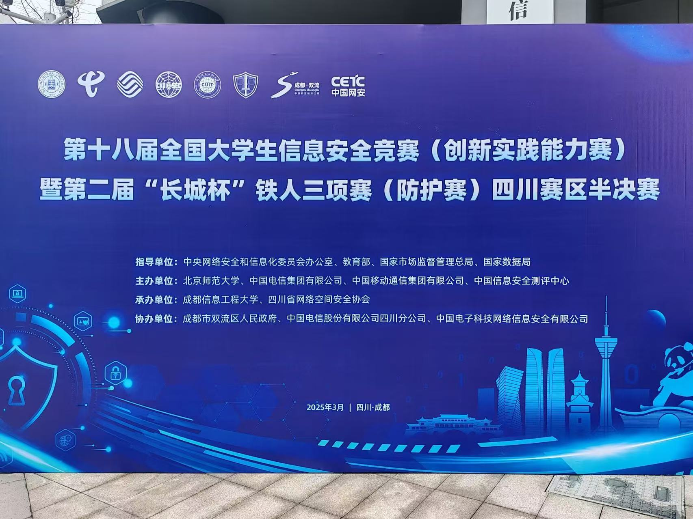

爆0归爆0，但这个月的学习成果还是很多的，整个月输出了十五篇文章吧，一方面是做ctfshow里面的一些赛题和极客大挑战的题，一方面是复现了一些遇到的CVE，以及总结之前的知识点，那个月学到的东西真的很多，爽！

# 4月

这个月打的比赛挺多的，包括XYCTF2025，TGCTF2025等，哈哈哈说起XYCTF2025，我就想起LAMENTXU，因为他出的题目知识点可能对一些师傅来说有点偏（虽然当时我也没做出来），然后遭骂了，我当时还安慰过他说我觉得题目挺好的，其实对于我来说我对CTF题目的要求仅仅只是能学到东西，一个好的题目肯定不是生搬硬套且脱离实际的，在这点上我一直都有一个筛选

好了，说回XYCTF2025，其实我从这个比赛学到一个最多的东西就是要多翻官方手册！！！，我之前就有翻手册的习惯，但python的手册翻的实在是少，主要还是之前入门web的时候接触最多的还是php，php手册我倒是常翻。emmm总结来说还是多翻吧，官方手册的说法肯定是权威的

TGCTF就不说了，大部分知识点自己都学过

四月份刚好一直在准备面试hvv，就大量的刷了玄机和陇剑杯的应急响应的题目，当时还觉得流量分析还挺好玩的，`/(ㄒoㄒ)/~~`说起这个就不得不感谢当时努力学流量分析的自己了，使得我后面的比赛中碰到流量分析的题目也能浅浅做一下

四月底因为转专业失利的事情心情蛮不好的，就买了机票打算回家放松一下，然后也见到了我素未谋面的小侄女（2月份出生的小屁孩，但是当时我上学去了）然后打了一下蓝桥杯，也是做的依托答辩，只出了一个还是两个web？还有一个流量分析，不管了，没有进国赛都只能算是“案底”了

充实而美好，continue！

# 5月

5月份基本上工作室没什么人了，只有我跟包师傅从早到晚坐着学习，整个月跟包师傅吃吃喝喝的，都胖了不少

五月份除了做赛题，也开始入手了一些php框架的代码审计，虽然都是一些框架的反序列化漏洞，但不得不说，审代码的时候还是挺爽的

打了一个pycc，不得不说整个比赛真的很费神，懂的都懂了，虽然队里拿了几个web的血，但还是双拳难敌四手了

必须纪念一个时间！就是五月27号我终于开始入手java的代码审计了[Java反序列化CC1链](https://wanth3f1ag.top/2025/05/27/Java反序列化CC1链/)，时隔三个月才开始学，真得骂自己一顿了。

回顾了一下，想起那会吃java代码的时候吃的真的很痛苦，特别是LazyMap走动态代理的链子，真的看了好久才勉强看明白

五月28号给VN投了个简历面试但是没过，感觉到自己还是有很多不熟的地方，被拷打了一下，问到了一些sql的相对底层的东西当时没答上来，又该好好努力了呜呜呜

五月底去了一趟乐山，进行了一趟“说走就走的旅行”，嗯其实本质上不是旅行，因为乐山之前就去过了，这次去单纯是为了吃乐山的美食，当时早上去晚上回的，一天吃了四五顿哈哈哈

哎当时吃到乐山凉糕的时候真的好难吃（应该是我吃不来），听大家对凉糕的评价各有不同，我头铁去吃了一下，吃了一口完全吃不下去

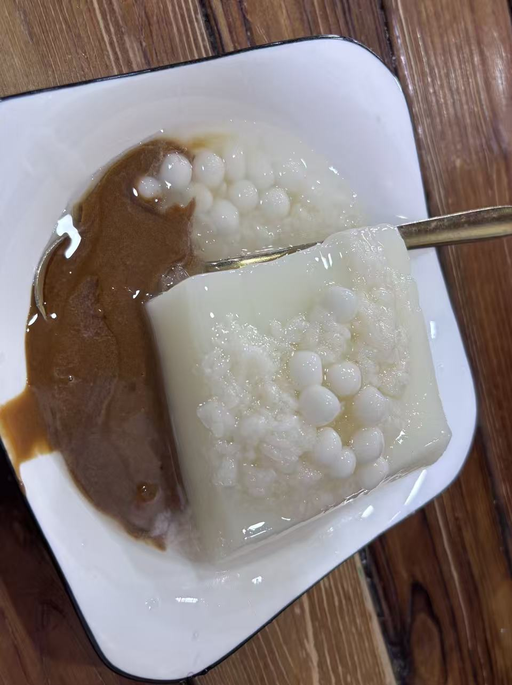

# 6月

杰哥给我介绍了一个墨菲的安全研究的实习，我也认识了人生中第一位工作的技术领导斌哥，印象很深的是我的一面，当时是斌哥作为面试官，当时给我的第一感觉就是：哇，这个领导咋说话这么和蔼可亲的，说话慢条斯理的，脾气还很好，主要是技术真的很强，这些感受一直保持到我十月份实习完，哈哈可能以后也一直是这样想的。

这个月前后打了D3CTF，2025HNCTF，鸿蒙CTF，DASCTF2025上半年赛，DASCTF，D3CTF和鸿蒙CTF是真坐牢啊哈哈哈，跟包师傅一块做都只能做出一个web，希望明年做题能做的更好吧。

五月份的pycc，我们写了无比详细的wp，结果还被ban了，后面跟老师反馈希望重查，结果北理工的老师一直说是他们系统查重查出来的，真的是shi，有些队伍在wp里面放了小说都能过，巨无语！`(ˉ▽ˉ；)...`，主要是包师傅这是第二次被ban了，以后还是不花时间吃这种shi了。

另一方面这个月学java学的是最多的，基本上把整个CC链都审完了，也是对java开始上瘾了，真香定律！

# 7月

终于可以去北京跟方总击剑了！之前面试过了之后就急急忙忙租房子，最后方总合租的房子里有一个小房间在出租，就给我推荐了房东，房东人也很好，没收押金，房租也是让我自己定，不好意思吃大便宜哈哈哈，最后是定的一千五一个月的房租

7月2号早上考完就直奔机场了，一路奔波到晚上才到出租屋，房间比较小，就一张床一个桌子一个衣柜，最后也是给房间收拾的还算不赖

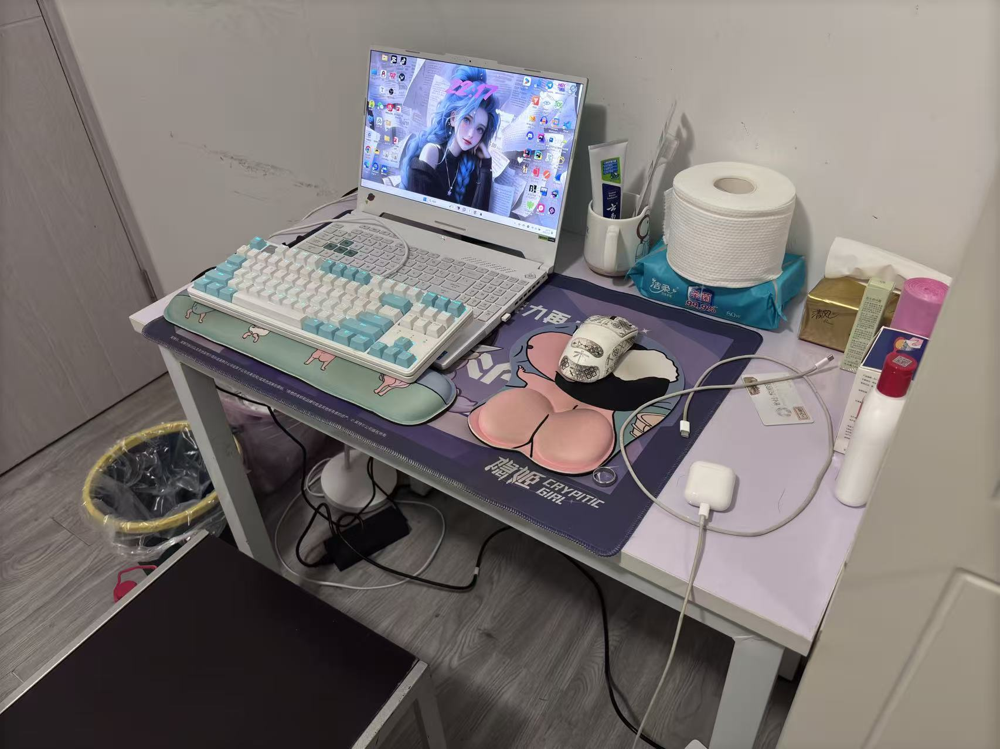

因为是4号才上班，3号自己一个人在北京瞎溜达，不得不说北京的通勤真的很不方便，出门一趟光是通勤都得一个小时起😔

4号第一天上班起了个大早，办理入职后，我坐到工位上有点手足无措的时候，硕哥看到我的窘况主动来跟我唠嗑，带我认识了公司的同事并且给我分配了工作，也是让我找到事情做了`/(ㄒoㄒ)/~~`

七月份在hvv还是比较忙的，那会我早上有生物钟，都会早到公司大概半个小时（当然后面就卡点到了哈哈哈）在第一个月里面陆陆续续认识了很多很好的同事例如乾哥，程杨哥以及轩哥等，真的对我很好，我有问题的时候问他们他们都有很热心的回答我，也很照顾我，教了我很多道理和人情世故，以至于即使我回学校之后依旧跟他们都保持着联系（有点想念那时候每天中午休息时候去公司附近面馆边吃面边吹牛逼的日子了`/(ㄒoㄒ)/~~`）

因为我写日报写的还是比较快的，所以每天自己能学习的时间也很多，又是一顿酷酷学

七月的某个周末参加了L3HCTF，嗯其实去看看题，我也就没组队什么的，这个比赛让我感触很深的是当时做best_profile这道题，我一开始一直死磕着python源码看，但是一直没打出来，然后我去就敲响了方总的门，方总看了不一会就打出来了，他就告诉我要注意看其他文件，当时里面有一个nginx的配置文件，但我一开始没有关注他哈哈哈，原来玄机就在其中。这道题的影响一直延申到后面做题的时候我都会把每个文件都认真的看一遍（甚至前段时间打的ISCTF的附件里面有docker文件我也给认真看了）

月底还打了一个NepCTF，当时复现的时候还把safe_bank给深究了一下，这道题出的真的挺好的

# 8月

一个狠狠的伏笔，就是当时学SpEL表达式注入的时候没深入学bypass，以至于十月份的省赛不会绕过，😫自己气死自己了

8月初就有公司聚餐，简直不要太爽，老板还是带我们吃的比较好的一家自助

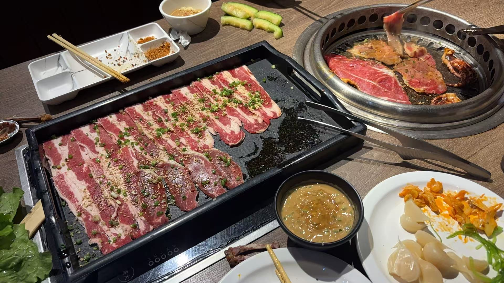

比赛的话就只是打了一个lilctf和春秋杯夏季赛吧，lilctf我记得他的预热赛一道nginx和python的题挺好玩的，并且在后面我们校赛玄武杯我也搬过来用了一下，感谢出题师傅的贡献，春秋杯当时有北京的同学回北京刚好找我出去耍，就赶得上打，赛后也只是复现了两道题

入手学java内存马了，不过只是学了tomcat的几种内存马，因为那会一直卡在学spring上，一直弄不明白spring家族的一些详细的东西，迟迟没有入手spring的内存马，额其实现在也没开始入手，确实是一个需要反思的点

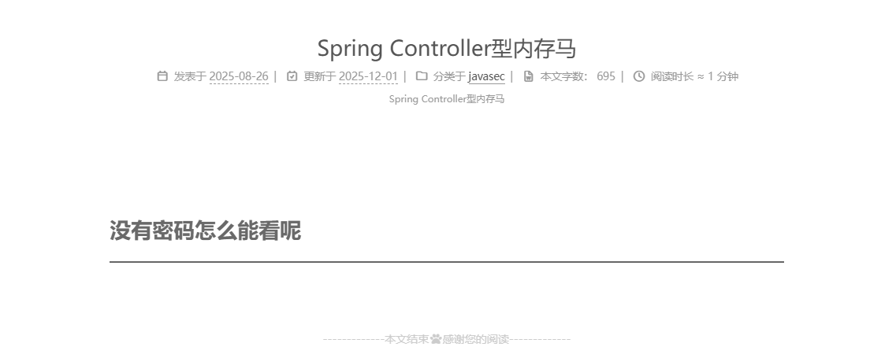

突然想起来8月底拍到一个很好看的夕阳，分享一下

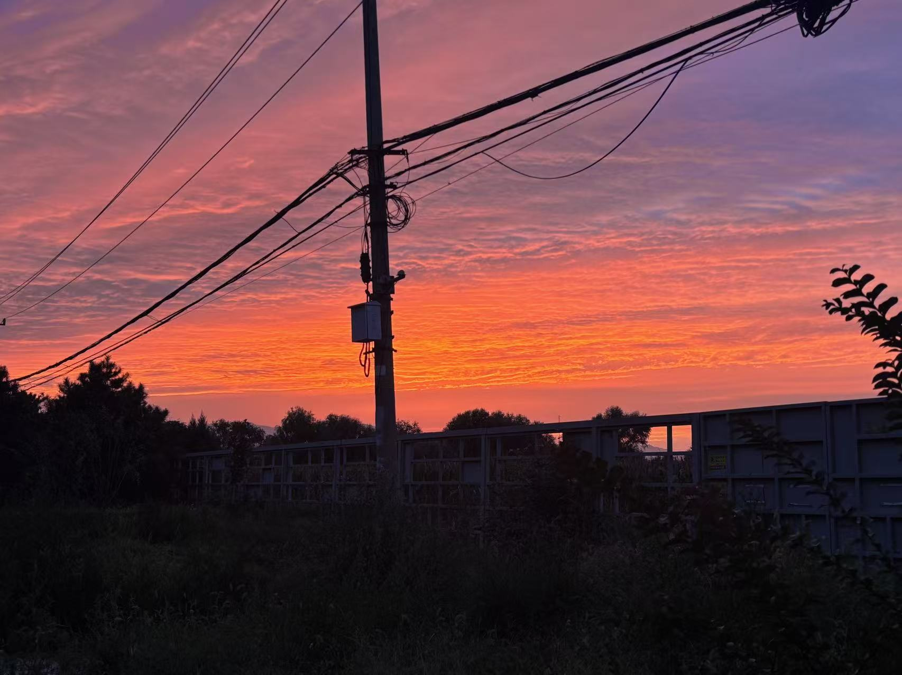

# 9月

我去，jdk8u20的原生链真复杂，触及反序列化的底层逻辑和序列化的机制了，当时也是分析了好几天才勉强弄明白

当时对白象的面情有独钟，看到白象有送小锅的活动，就买了一箱白象的泡面在出租屋吃，简直要给我吃吐了🤮

还去天津玩了一趟（主要是实在不想在北京市内逛），好吃的美食，好看的风景，太治愈一个上班的牛马了

九月份感觉没打什么比赛，这个月出去玩的比较多，翻了一下相册全是吃的哈哈哈哈

特别感谢infer师傅在我学习java的路上提供了很多支持和帮助，因为一开始做java题不会处理jar包，infer师傅手把手教我，真的很感动

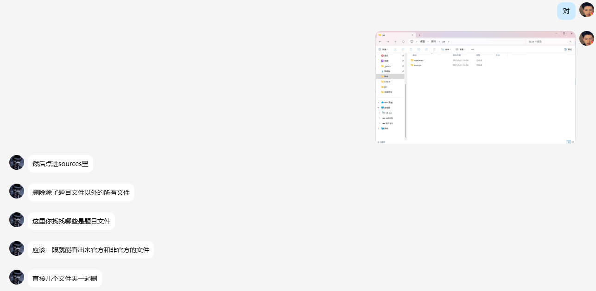

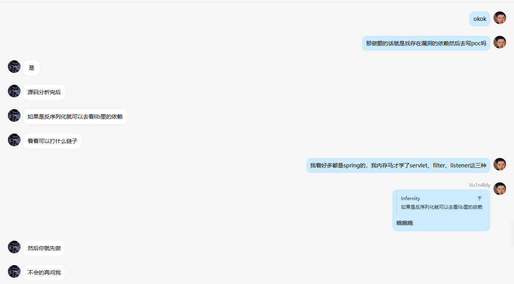

# 10月

本来是很美好的国庆，却发生了一件让我无法接受的事情

10月1号早上起床打开手机，收到了我妈妈给我发的信息

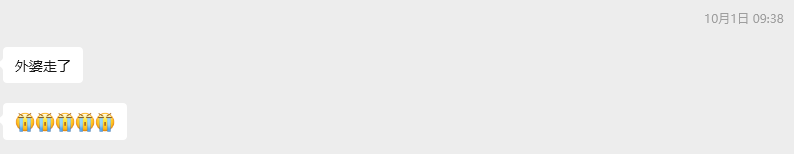

我很清楚的记得当时的感受：是震惊的，是无法置信的，没有像别人那样嚎啕大哭，我始终无法相信这个事实，当时第一时间给我姐姐打电话，听到她在电话里的哭声，我所有安慰的话都如鲠在喉，无法说出口

就这样，平静的心情一直持续到晚上，夜深人静的时候，一个人在出租屋，望着电脑屏幕上跟姐姐对外婆的回忆，我再也绷不住情绪，流下了早就该流下的泪水

在一阵疯狂的翻找相册后，我发现自己手机里存有外婆的照片和视频都寥寥无几，明明前个月才教外婆怎么给我打视频电话，但这通电话还是没有机会打出来。很悔恨，很懊恼，人总是失去了才知道珍惜不是吗？这也是为什么我说后悔的原因了

写到这，情绪再次绷不住了，对不起，我不该在写年终总结的时候把这种情绪带进来，我们继续吧

10月跟BR和SfTian线下面基了，去逛了一下天安门，当时还一起在酒店打了一场酣畅淋漓的强网杯，难度还是太高了，不过这次自己也是能做出题了

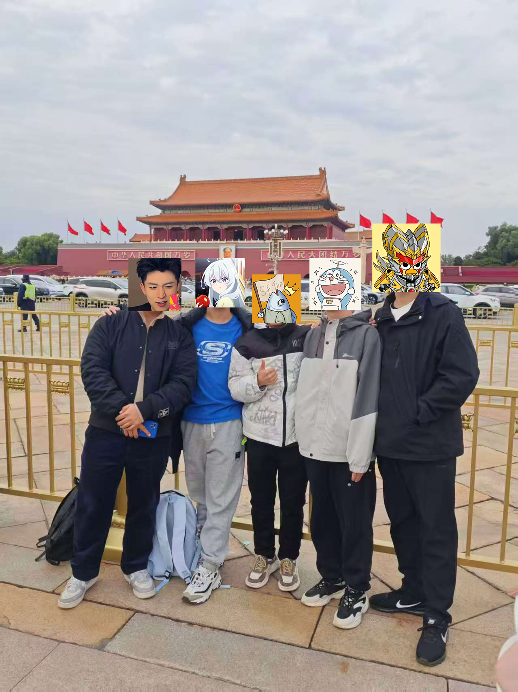

（通报一下BR这小子，大半夜还在想怎么打php的反序列化题，居然大半夜突然爬起来说是有思路了验证一下思路，太狠了）

10月份是实习的最后一个月，因为这个月中旬有省赛，所以就跟领导递交了辞职，当时一起走的还有轩哥，轩哥还陪我去服装店帮我置办了几条衣服，嘿嘿，以后学逆行还得问问他

这次省赛包师傅在实习并不能回来带队，所以责任就落到我身上了，真的压力爆大啊，带一个pwn学弟和我们工作室的运营学妹一队，真的很担心自己没带起来，那段时间很焦虑哈哈哈，不过最后也是比去年好一点，拿了个省二，pwn学弟也狠狠发力了，运营小姐姐的5070真的很香，跑30b的ai都不带声响的，争取明年拿个省一

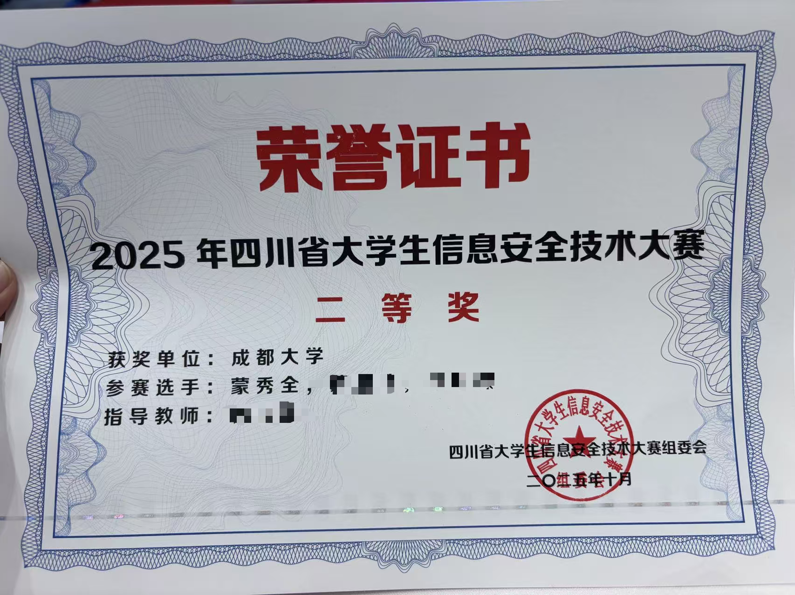

玄武杯自己出了两道题，ez_include题不小心出了一个非预期，赶紧上了一道reverge，其实这道题是之前磊哥拿来考过我的，其实还是有原题的，不过赛后师傅还是点赞了这道题（其实是喷不ez哈哈哈哈哈）

# 11月

月初狠狠的打了一波春秋云镜，对内网渗透的知识点又巩固了一下，哎不过后面十二月份沙砾过期了，没坚持打完，含泪损失100+RMB

后面就是专攻java的反序列化了，前前后后审了ROME原生链，Fastjson反序列化等，我这拖拖拉拉的java学习之路啊，从五月份开始的？一直到现在，简直太拖拉了，另看包师傅才学了几个月就把链子看的差不多了，真得好好改正一下了

# 12月

月初学校举办了学长见面会，见到了涛哥和郭总，听了一下前辈的经验和建议，真的受益匪浅，果然自己还是太菜了哈哈哈

有比赛在四川举办，又面基了BR和SfTian，可惜那几天刚好生病感冒，状态不是很好，招待稍有不周哈哈哈

铁三初赛，这群人太狠了，压根打不过，不过还是比去年坐牢好了，去年全靠包师傅带飞，今年初赛包师傅因为在实习没法打，所以只能我跟另外两个pwn学弟打初赛，最后只出了四个web和四个流量，哎其实重新看这些题考的都不算特别难，但当时做的还是太慢了，基本上都是拿的50分，很遗憾的是dedecms，一个后台漏洞的nday，我连后台都进不去，爆半天admin结果发现是需要爆另一个高权限用户，有点可惜了

# 再见2025

整体来说是学到了很多东西的，但自己的拖延症实在是有点重，真得好好调整一下了，还有就是自己的状态总是飘忽不定的，可能跟熬夜有关吧，真得好好调整一下作息了

# 遇见2026

给自己定几个小小的目标吧：

1. 2026年争取能做1-2份安全的实习，至少一份吧
2. 转专业到计院，哎这个真的是一条很曲折的道路
3. 在javasec的学习上能更全面且精湛
4. 争取明年的大比赛如强网杯，网鼎杯，VNCTF等具有挑战性的比赛能拿到好成绩
5. 内网渗透这方向也需要进一步提升
6. 学一些其他方向例如逆向或者pwn吧，至少简单的漏洞还是得懂的
7. 多陪陪家人，因为今年在学习的时候比较多，给家里人打电话聊天实在是比较少，有机会还是得多陪陪家里人

虽然自己才学了一年左右，但比起同样学龄的师傅，自己学的实在是太少了，希望自己再接再励吧
