配置一下验证码识别插件captcha-killer

# 环境配置

## 安装ddddocr+aiohttp

首先是安装验证码识别需要的库

```bash
pip install -i http://mirrors.aliyun.com/pypi/simple/ --trusted-host mirrors.aliyun.com ddddocr aiohttp
```

ddddocr库地址：https://github.com/sml2h3/ddddocr

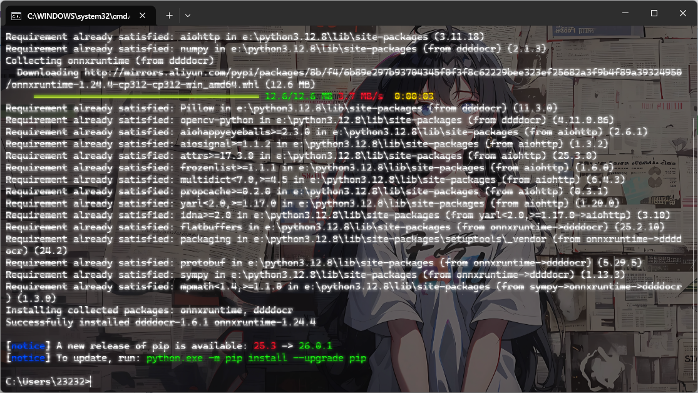

## BP添加插件

新项目地址：

https://github.com/f0ng/captcha-killer-modified

原项目地址：

https://github.com/c0ny1/captcha-killer

下载release项目的jar包

根据JDK环境去选择，我用jdk8更多

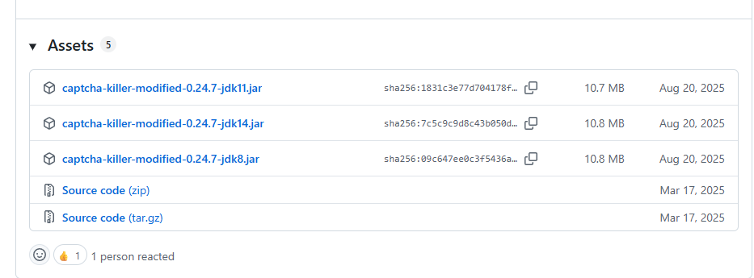

下载后在BurpSuite中导入插件

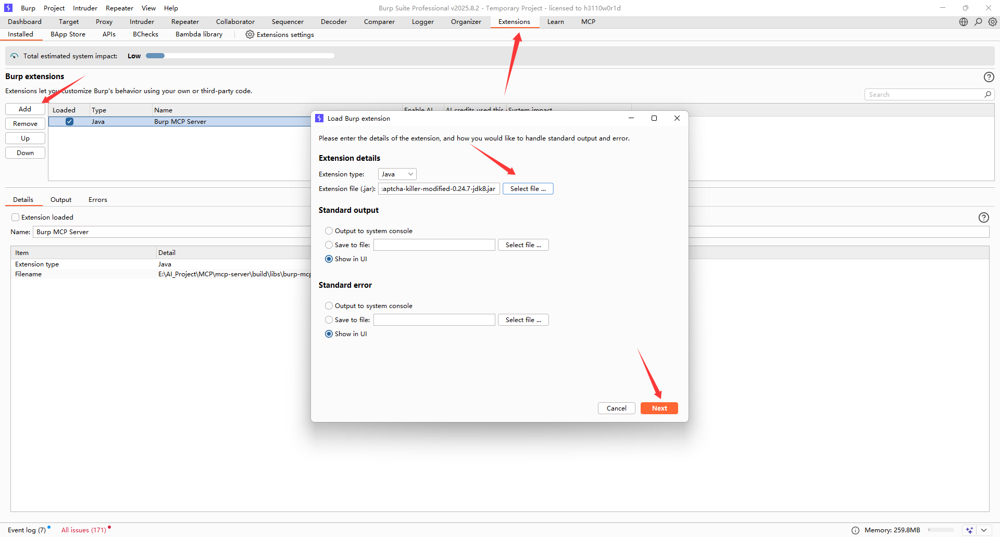

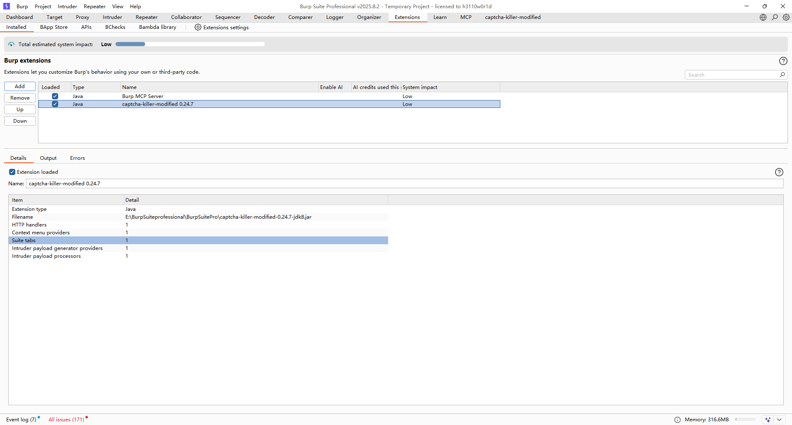

## 启动二维码识别接口

### codereg代码分析

把captcha-killer-modified的Source code源文件下到vps或本机上，打开里面的codereg.py文件

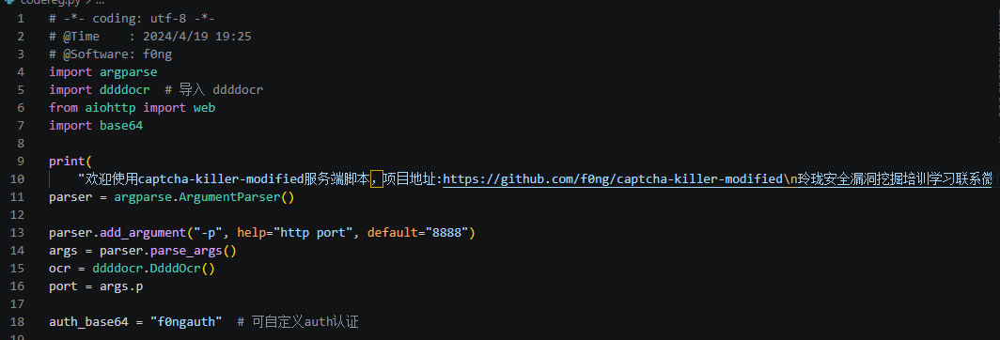

codereg.py 是一个基于 aiohttp + ddddocr 的轻量验证码识别服务，这里的话默认是8888端口，我们也可以传入-p参数指定http监听端口

另外这里有一个自定义auth认证，可以改成你自己想要的认证，这样能避免其他人调用你的服务接口

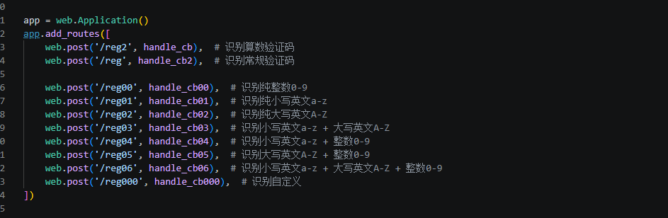

可以看到这里根据不同的验证码类型给了不同的接口

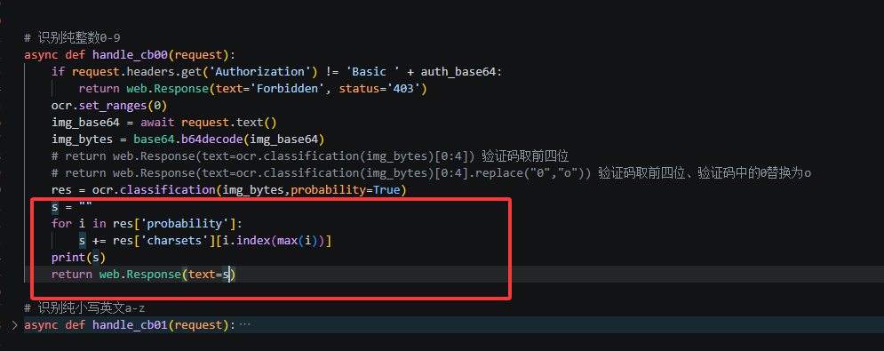

因为我下的是最新的版本的脚本，原先的脚本只能识别四位验证码，也算是作者优化了一下代码逻辑，不需要我们自己手动优化了

我们运行这个python脚本启动服务

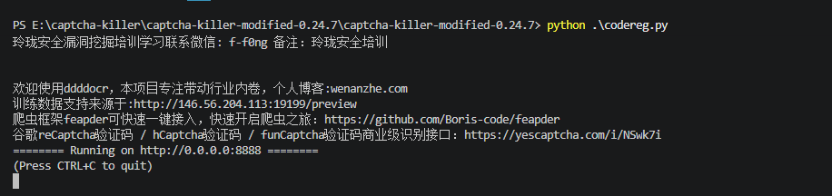

# 测试

环境用pikachu

地址：https://github.com/zhuifengshaonianhanlu/pikachu

```bash
git clone https://github.com/zhuifengshaonianhanlu/pikachu.git
cd pikachu/
docker build -t "pikachu" .
docker run -d -p 8080:80 pikachu
```

我是直接拉取镜像

```bash
docker run -d -p 8765:80 8023/pikachu-expect:latest
```

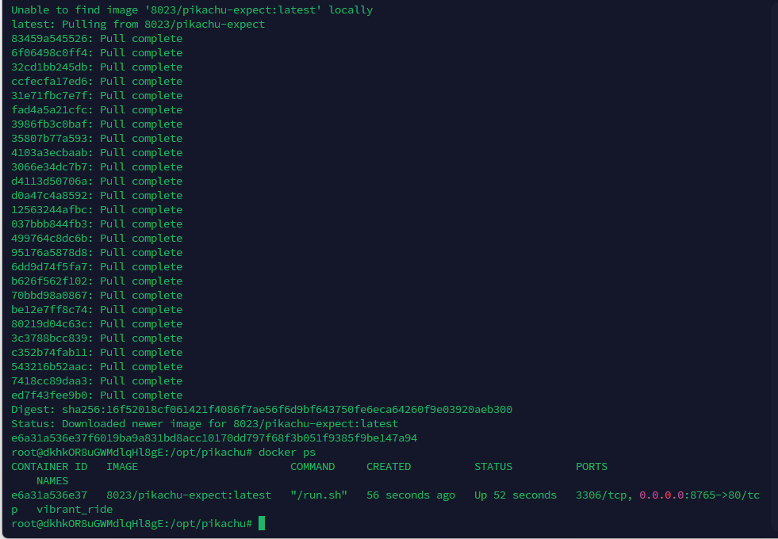

访问8765端口就出来了，这里需要访问`http://xxx:8765/install.php`进行安装和初始化，不然数据库会少配置

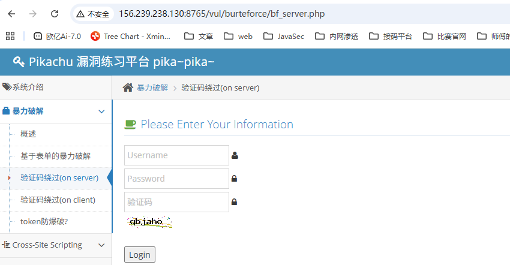

先找到这个验证码接口地址，发现是`http://xxx:8765/inc/showvcode.php`，访问抓个包并将数据包发到验证码识别插件中

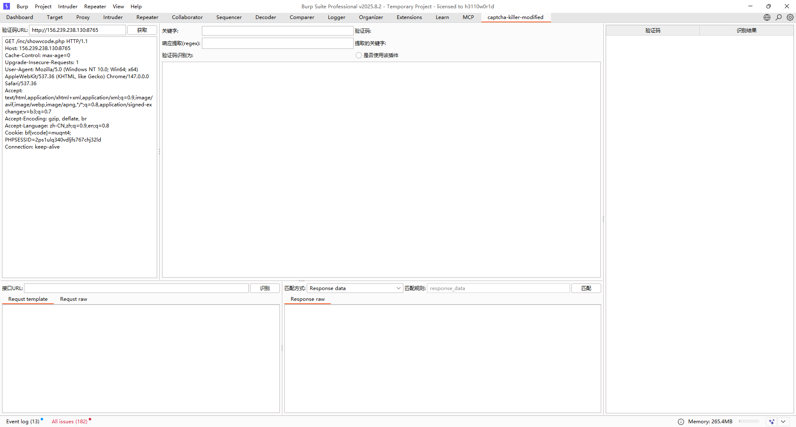

点击获取

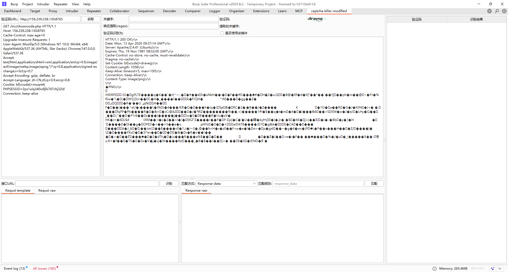

看到右边出现验证码就说明获取成功了

然后我们需要配置我们的验证码识别接口URL，在接口URL中传入`http://127.0.0.1:8888`，Request template中右键在模板库中选择ddddocr

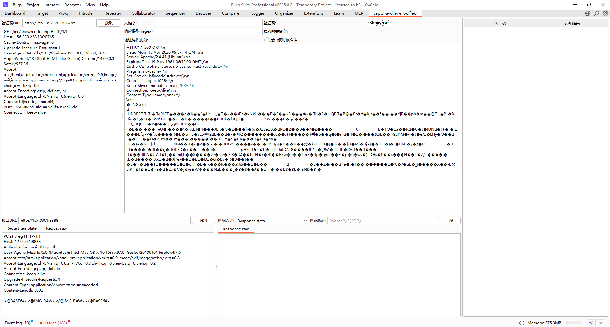

配置完成后点击识别，出现识别结果就是成功了（注意这里要改一下auth认证头的内容，不然就一直是403，我卡了好久emm）

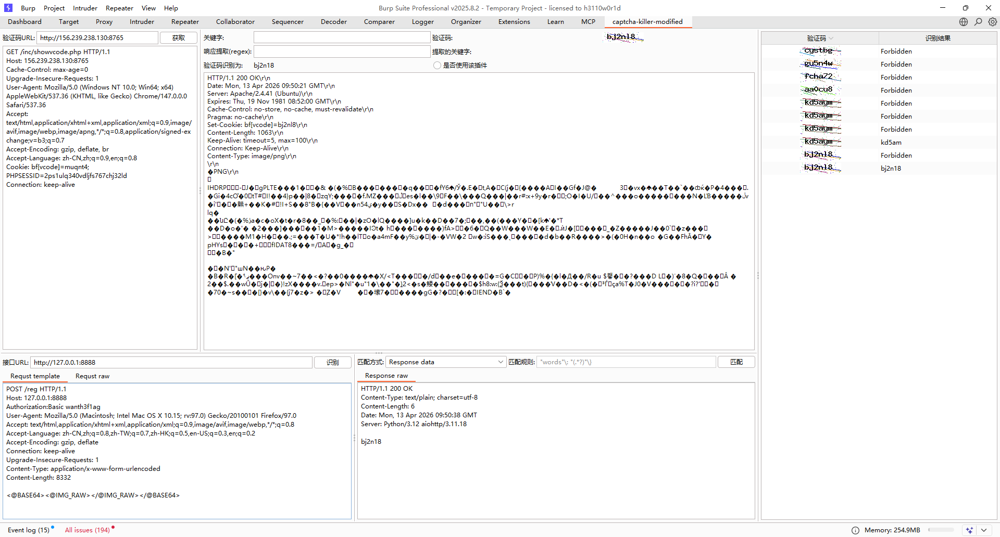

不过换成其他接口的话还有点问题，这几天优化一下代码再重新试试

既然能做验证码识别了，然后我们来尝试intruder爆破（勾选是否使用该插件并且插件中的cookie要和intruder中的cookie相同）

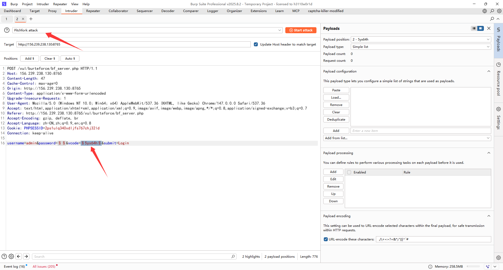

攻击方式选Pitchfork，给password和vcode加上，password正常放密码字典，vcode则需要用我们的拓展

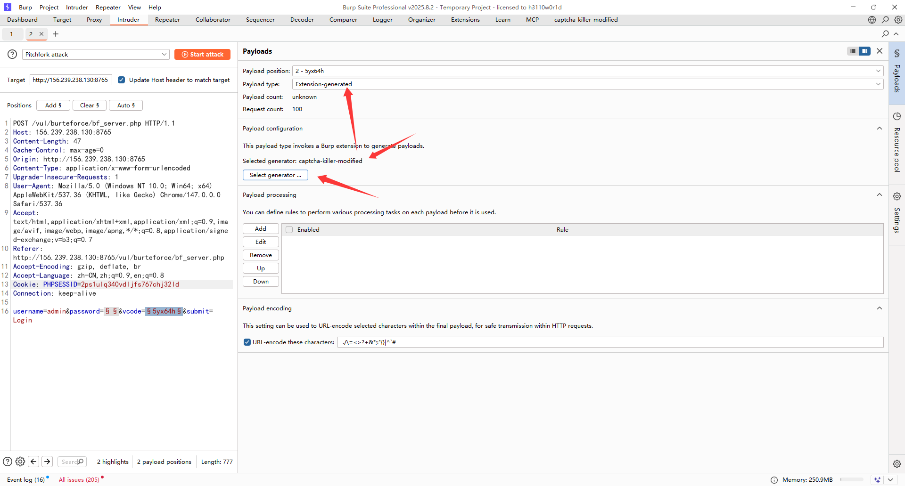

因为验证码加载也是需要时间的，而且验证码的请求也是带着cookie的，所以设置一下线程和并发

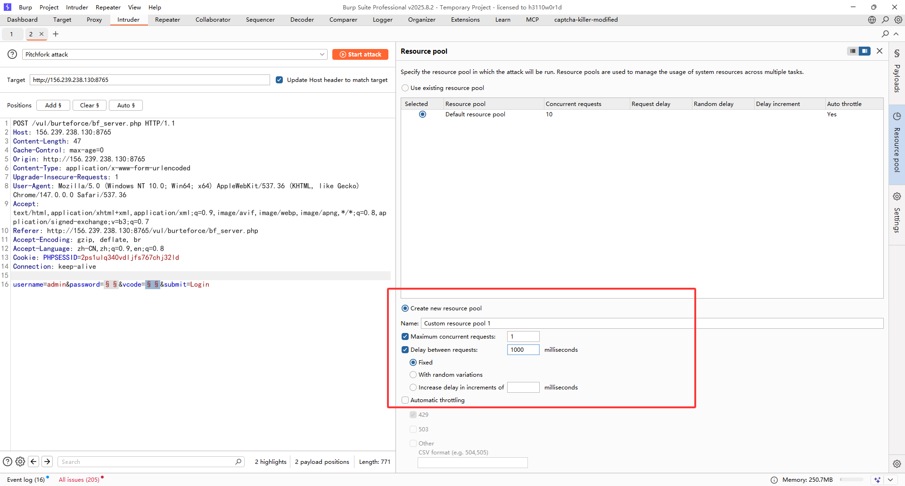

开始爆破

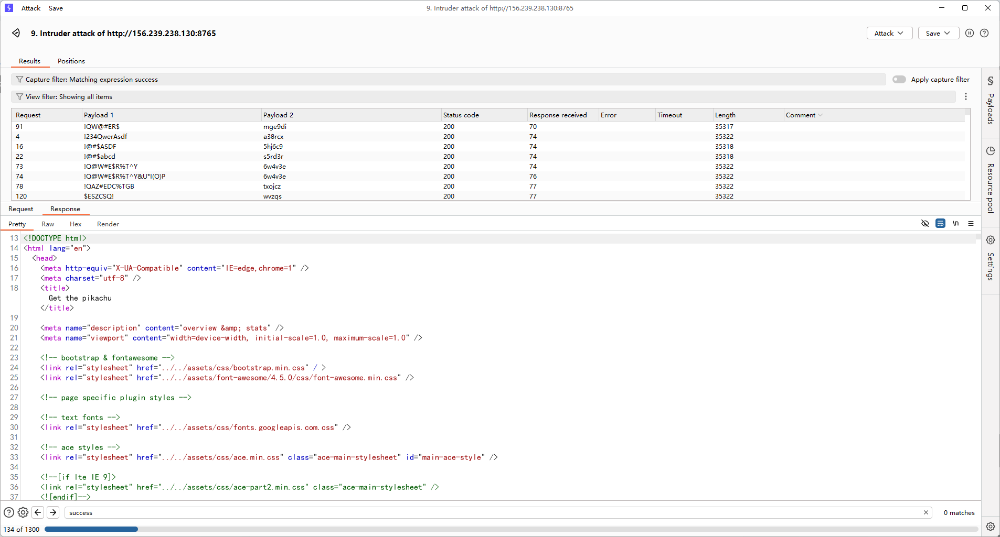

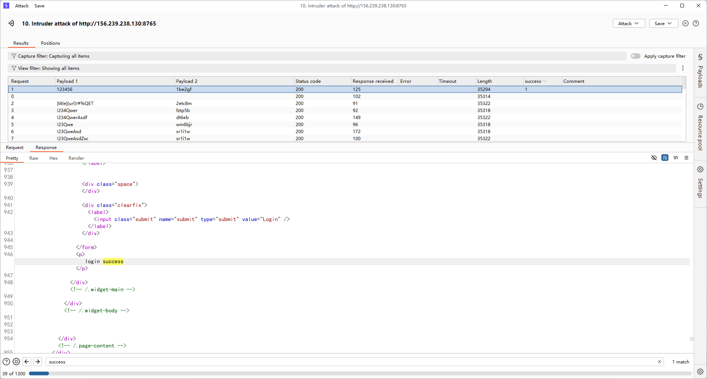

在 Intruder → **Options** 选项卡中找到**Grep - Match** 区域，并Add一个正则匹配关键词，我这里写的是success，所以最后响应出现success就会显示1

个人感觉其实准确率算是不低的了，虽然在测试的时候也经常遇到识别错的情况，但有工具总归还是比手测要好得多

参考文章：

https://www.cnblogs.com/4geek/p/17145385.html

https://gv7.me/articles/2019/burp-captcha-killer-usage
