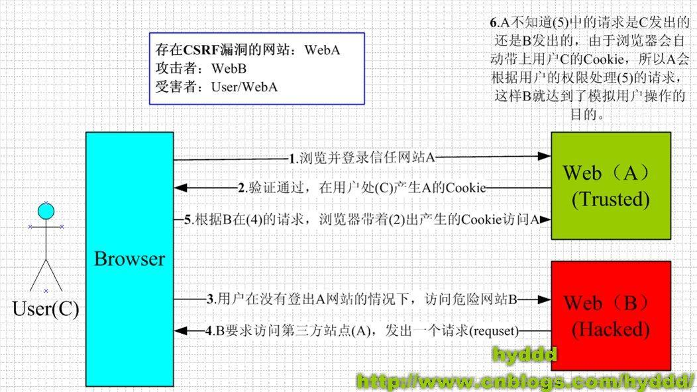

# 0x01前言

因为刷ctfshow的时候没有专门的板块是关于CSRF的，所以这方面的知识一直只是停留在一个浅层，今天做题碰到一个CSRF的题目，刚好赶紧来学习一下

# 0x02正文

参考文章:

[CSRF 攻击详解](https://www.cnblogs.com/54chensongxia/p/11693666.html)

[CSRF详解](https://juejin.cn/post/7008171429845811207)

[csrf漏洞详解](https://blog.csdn.net/2301_80661529/article/details/136383899)

## 什么是CSRF？

CSRF（Cross-Site Request Forgery）的全称是“跨站请求伪造”，通过**伪装**来自受信任用户的请求来攻击受信任的网站。和SSRF(服务器端请求伪造)不同的是，CSRF说的简单点就是钓鱼，是`攻击者诱导受害者进入第三方网站，在第三方网站中，向被攻击网站发送跨站请求。利用受害者在被攻击网站已经获取的注册凭证，绕过后台的用户验证，达到冒充用户对被攻击的网站执行某项操作的目的`。

CSRF攻击其实是利用了web中用户身份认证验证的一个漏洞：简单的身份验证仅仅能保证请求发自某个用户的浏览器，却不能保证请求本身是用户自愿发出的。就比如坏人捡到你丢失的手机，然后用你的手机像你父母发送诈骗短信去进行骗钱

接下来我们用师傅的图来进行讲解一下

## CSRF攻击的流程

由图就可以看到CSRF攻击的流程

1. 用户C打开浏览器，访问受信任网站A，输入用户名和密码请求登录网站A；
2. 在用户信息通过验证后，网站A产生Cookie信息并返回给浏览器，此时用户登录网站A成功，可以正常发送请求到网站A；
3. 用户**未退出网站A之前**，在同一浏览器中，打开一个TAB页访问网站B；
4. 网站B接收到用户请求后，返回一些攻击性代码，并发出一个请求要求访问第三方站点A；
5. 浏览器在接收到这些攻击性代码后，根据网站B的请求，在用户不知情的情况下携带Cookie信息，向网站A发出请求。网站A并不知道该请求其实是由B发起的，所以会根据用户C的Cookie信息以C的权限处理该请求，导致来自网站B的恶意代码被执行。

## CSRF攻击的条件

1.需要登录信任网站，且产生cookie给浏览器

2.在不登出信任网站的情况下，访问或被诱导访问有害网站。

3.CSRF攻击者通过构建一个恶意网页或邮件中的链接，其中包含了对信任网站的请求（如转账、删除账户等敏感操作）。

总而言之就是用户在不知情的情况下访问了这个恶意网页或点击了邮件中的链接，浏览器会自动带上用户的session cookie向信任网站发起请求。信任网站收到请求后，由于请求中携带有有效的session token，服务器误以为这是用户的真实意图，进而执行了请求中的恶意操作。

## CSRF攻击的危害

- 账户操作篡改：

攻击者可以假冒用户身份执行高权限操作，例如：转账、更改密码、删除账户、购买商品等，造成用户的财产损失或个人信息泄露。

- 个人隐私泄露：

如果网站中有涉及个人隐私的功能接口存在CSRF漏洞，攻击者可能借此窃取用户的私人数据，如联系人列表、聊天记录、财务信息等。

- 账户劫持：

利用CSRF漏洞更改用户的账户设置，包括电子邮件地址、密保问题答案等，为进一步接管账户奠定基础。

- 社交网络蠕虫传播：

如前面提到的案例，如果社交网络平台的部分接口存在CSRF漏洞，攻击者可以制作CSRF蠕虫，通过链式反应迅速扩大攻击范围，例如：自动向用户的好友发送包含恶意链接的消息。

- 系统级攻击：

对于企业级应用或者物联网设备，CSRF漏洞可能导致系统级控制命令的非法执行，如改变路由器配置、控制系统设备行为等。

- 组合攻击：

CSRF攻击可以与其他漏洞结合，形成组合拳，比如与XSS（跨站脚本攻击）结合，进一步提升攻击成功率和复杂度。
