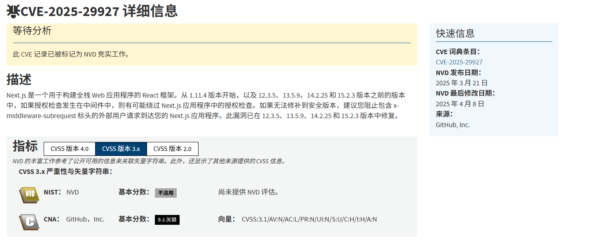
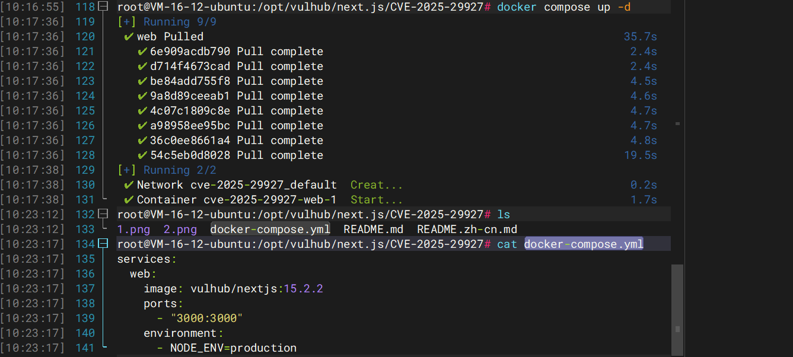
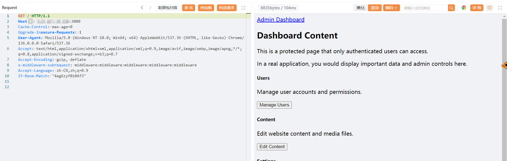

## 0x01漏洞描述

Next.js 是一个基于 React 的流行 Web 应用框架，提供服务器端渲染、静态网站生成和集成路由系统等功能。当使用中间件进行身份验证和授权时，Next.js 14.2.25 和 15.2.3 之前的版本存在授权绕过漏洞。



## 0x02影响版本

根据官方披露推出的影响版本

- **Next.js 11.1.4 ~ 13.5.6**：未修补版本
- **Next.js 14.x**：在 14.2.25 之前均受影响
- **Next.js 15.x**：在 15.2.3 之前均受影响

也可以根据修复版本来看

```
> 对于 Next.js 15.x，此问题已在 15.2.3 中修复
> 对于 Next.js 14.x，此问题已在 14.2.25 中修复
> 对于 Next.js 13.x，此问题已在 13.5.9 中修复
> 对于 Next.js 12.x，此问题已在 12.3.5 中修复
```

## 0x03环境搭建

这个在vulhub靶场中有现成的https://github.com/vulhub/vulhub/blob/master/next.js/CVE-2025-29927/README.zh-cn.md

直接起容器就行

```
docker compose up -d
```

不清楚访问端口的可以看一下docker-compose.yml文件



## 0x04靶场复现

这个其实有两种方法

一是输入默认凭据 `admin:password`，你可以登录成功并访问仪表盘。

二是进行未授权访问，Next.js 在处理用户请求时，会检查 x-middleware-subrequest 以识别内部子请求，防止中间件递归调用。但在受影响版本中，对该头的来源与拼接方式**缺乏严格校验**，导致**外部恶意请求**也能带上此头，从而骗过 Next.js 判断逻辑，完全绕过中间件安全机制。

在请求头中添加 `x-middleware-subrequest: middleware:middleware:middleware:middleware:middleware`。或者`x-middleware-subrequest: src/middleware:src/middleware:src/middleware:src/middleware:src/middleware`


