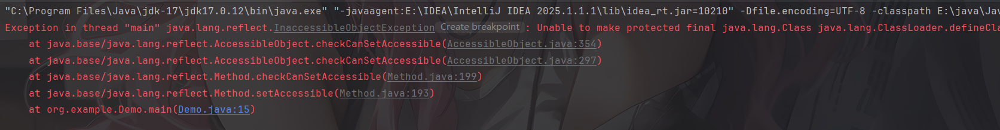
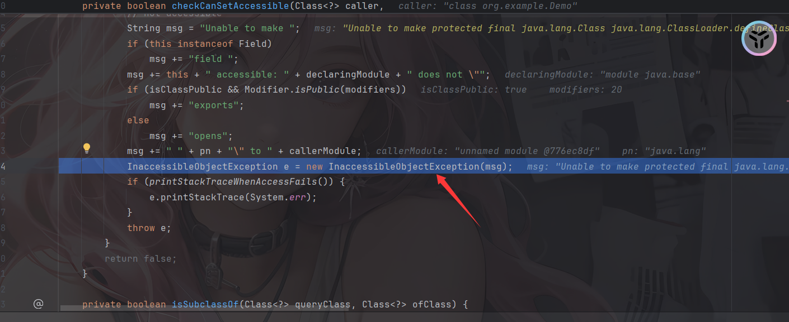
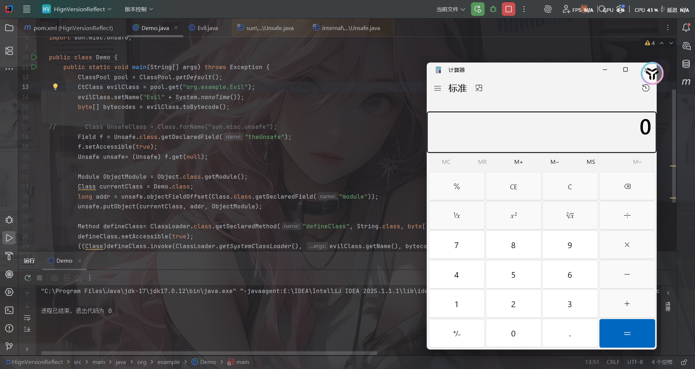

先浅读一下官方文档：https://docs.oracle.com/en/java/javase/17/migrate/migrating-jdk-8-later-jdk-releases.html?utm_source=chatgpt.com#GUID-7744EF96-5899-4FB2-B34E-86D49B2E89B6

在讲17之前先讲讲JDK9之后的模块化

# 0x01 JDK9之后的模块化

只要学过Javasec的都知道jdk8到底有多香，所有 `.class` 都丢进 classpath并且所有代码都能访问任何类，反射犹如一把万能钥匙一样穿梭在不同类之中。

在jdk9之前，Java 项目由一堆 JAR 包组成，而每个jar包里面都会有单独的多个class文件，这些class文件分为两种，一种是用户开发自己项目的class，一种是导入各种依赖的class，JVM并不关系JAR包之间的关系，他仅仅只是用来包装class文件的，而JVM也只负责把他们的class文件放入classpath中。这时候一旦漏传了某个依赖JAR，程序在运行时就会抛出`ClassNotFoundException`报错

为了处理这个问题，JDK9之后推出了模块化，从起初的模块化到最终的封装内部API都有了明确的说明

https://openjdk.org/jeps/200

https://openjdk.org/jeps/260?utm_source=chatgpt.com

模块化具体表现在

- 如果a.jar依赖于b.jar，那么对于a这个jar就需要写一份依赖说明，让a程序编译运行的时候能够直接定位到b.jar。这个功能主要就是通过`module-info.class`中的定义的。
- 模块外的代码只能访问该模块导出的包的公共和保护元素，并且保护元素只能从定义它们的类的子类中访问。

在模块化之后，访问权限被严格限制在模块内部。除非目标模块在 `module-info` 中显式 `exports`或`opens`了某个包，否则外部无法通过反射访问其中的类，甚至连`setAccessible(true)`都会失效。 这直接导致了大量依赖私有属性修改的 Gadget 链在高版本 JDK 中断裂。

并且java启动器选项 `--illegal-access` 在 JDK 9 到 JDK 16 中允许反射访问 JDK 内部。您可以指定以下参数：

- `--illegal-access=permit`：允许类路径上的代码反射访问 JDK 8 中存在的 java.* 包的内部。对任何此类元素的第一次反射访问操作会发出警告，但在此之后不再发出警告。
- `--illegal-access=warn`：对每个非法反射访问操作发出警告消息。
- `--illegal-access=debug`：对每个非法反射访问操作显示警告消息和堆栈跟踪。
- `--illegal-access=deny`：禁用所有非法反射访问操作，除非由其他命令行选项启用，例如 --add-opens。

# 0x02 JDK17的强封装

官方文档中提到了JDK17的Strong Encapsulation，一些工具和库使用反射来访问JDK中仅限于内部使用的部分，JDK的强封装主要是针对java.*API的非公共字段和方法，如果利用反射调用就会抛出InaccessibleObjectException。

**为了帮助迁移，JDK 9至JDK 16允许这种反射继续进行，但会发出关于非法反射访问的警告。JDK 17具有强封装性，因此默认情况下不再允许这种反射。**

写个Demo看看

```java
package org.example;

import javassist.ClassPool;
import javassist.CtClass;
import java.lang.reflect.Method;

public class Demo {
    public static void main(String[] args) throws Exception {
        ClassPool pool = ClassPool.getDefault();
        CtClass evilClass = pool.get("org.example.Evil");
        evilClass.setName("Evil" + System.nanoTime());
        byte[] bytecodes = evilClass.toBytecode();

        Method defineClass= ClassLoader.class.getDeclaredMethod("defineClass", String.class, byte[].class, int.class, int.class);
        defineClass.setAccessible(true);
        defineClass.invoke(ClassLoader.getSystemClassLoader(), "attack", bytecodes, 0, bytecodes.length);
    }
}
```

我们的恶意类

```java
package org.example;

public class Evil {
    static {
        try{
            Runtime.getRuntime().exec("calc");
        }catch(Exception e){
        }
    }
}
```

运行Demo后出现报错



具体问题出现在setAccessible中，我们看看setAccessible的逻辑变成什么样了

```java
    public void setAccessible(boolean flag) {
        AccessibleObject.checkPermission();
        if (flag) checkCanSetAccessible(Reflection.getCallerClass());
        setAccessible0(flag);
    }
```

反观JDK8

```java
    public void setAccessible(boolean flag) throws SecurityException {
        SecurityManager sm = System.getSecurityManager();
        if (sm != null) sm.checkPermission(ACCESS_PERMISSION);
        setAccessible0(this, flag);
    }
```

JDK17的setAccessible0就是将当前反射获取到的变量中`override`属性值设置为true，JDK8和JDK17近乎一样

jdk17

```java
    boolean setAccessible0(boolean flag) {
        this.override = flag;
        return flag;
    }
```

主要问题是在checkCanSetAccessible中

```java
    private boolean checkCanSetAccessible(Class<?> caller,
                                          Class<?> declaringClass,
                                          boolean throwExceptionIfDenied) {
        if (caller == MethodHandle.class) {
            throw new IllegalCallerException();   // should not happen
        }

        //调用者所在模块
        Module callerModule = caller.getModule();
        //被调用的变量所在模块
        Module declaringModule = declaringClass.getModule();

        //如果被调用的变量所在模块和调用者所在模块相同，返回true
        if (callerModule == declaringModule) return true;
        //如果调用者所在模块和object所在模块相同，返回true
        if (callerModule == Object.class.getModule()) return true;
        //做了一个JDK8的兼容，如果被调用的模块是未命名模块，返回true
        if (!declaringModule.isNamed()) return true;

        String pn = declaringClass.getPackageName();
        int modifiers;
        //判断当前反射对象到底是哪一种
        if (this instanceof Executable) {
            //Method 或 Constructor（Executable 是它们的共同父接口，Java 8+ 引入）
            modifiers = ((Executable) this).getModifiers();
        } else {
            //Field字段
            modifiers = ((Field) this).getModifiers();
        }

        // class is public and package is exported to caller
        //如果类是public公共类并且包被exported给调用者
        boolean isClassPublic = Modifier.isPublic(declaringClass.getModifiers());
        if (isClassPublic && declaringModule.isExported(pn, callerModule)) {
            // member is public
            //如果成员是public属性直接返回true
            if (Modifier.isPublic(modifiers)) {
                return true;
            }

            // member is protected-static
            //如果成员是protected和static，并且调用者类是被调用类的子类，则返回true
            if (Modifier.isProtected(modifiers)
                && Modifier.isStatic(modifiers)
                && isSubclassOf(caller, declaringClass)) {
                return true;
            }
        }

        // package is open to caller
        //如果包被open给调用者，直接返回true
        if (declaringModule.isOpen(pn, callerModule)) {
            return true;
        }

        if (throwExceptionIfDenied) {
            // not accessible
            String msg = "Unable to make ";
            if (this instanceof Field)
                msg += "field ";
            msg += this + " accessible: " + declaringModule + " does not \"";
            if (isClassPublic && Modifier.isPublic(modifiers))
                msg += "exports";
            else
                msg += "opens";
            msg += " " + pn + "\" to " + callerModule;
            InaccessibleObjectException e = new InaccessibleObjectException(msg);
            if (printStackTraceWhenAccessFails()) {
                e.printStackTrace(System.err);
            }
            throw e;
        }
        return false;
    }
```

未命名模块就是没有 `module-info.java`，走传统 **classpath**的模块，这是为了兼容java8做的配置

但是传入的throwExceptionIfDenied默认是true



也就是说反射 private 和 protected 被完全堵死了，那么有什么绕过的方法吗？那必然是有的

总结一下返回true的几种方法：

- 被调用的变量所在模块和调用者所在模块相同
- 调用者所在模块和object所在模块相同
- 被调用的模块是未命名模块
- public公共类并且包被exported给调用者，里面分为几种

1. 反射的成员是public属性
2. 反射的成员是protected受保护和static静态，并且调用者类是被调用类的子类
3. 被调用的类所在模块被open给调用者所在模块

后面跟成员有关的方法是我们无法控制的，但对于前面三种方法还是有操作空间的

# 0x03 Unsafe常用类方法

过Unsafe模块进行目标类所在moule进行修改，整体的思路为：获取Object中module属性的内存偏移量，之后再通过unsafe中方法，将Object的module属性set进我们当前操作类的module属性中。

先介绍Unsafe中的几个常见的方法

我们看到sun.misc.Unsafe#objectFieldOffset()

## sun.misc.Unsafe#objectFieldOffset()

```java
    @ForceInline
    public long objectFieldOffset(Field f) {
        if (f == null) {
            throw new NullPointerException();
        }
        Class<?> declaringClass = f.getDeclaringClass();
        if (declaringClass.isHidden()) {
            throw new UnsupportedOperationException("can't get field offset on a hidden class: " + f);
        }
        if (declaringClass.isRecord()) {
            throw new UnsupportedOperationException("can't get field offset on a record class: " + f);
        }
        return theInternalUnsafe.objectFieldOffset(f);
    }
```

传入一个反射的 `Field` 对象（非静态字段），会返回该字段在对象内存布局中的偏移量 (offset)

## sun.misc.Unsafe#staticFieldOffset()

```java
    @ForceInline
    public long staticFieldOffset(Field f) {
        if (f == null) {
            throw new NullPointerException();
        }
        Class<?> declaringClass = f.getDeclaringClass();
        if (declaringClass.isHidden()) {
            throw new UnsupportedOperationException("can't get field offset on a hidden class: " + f);
        }
        if (declaringClass.isRecord()) {
            throw new UnsupportedOperationException("can't get field offset on a record class: " + f);
        }
        return theInternalUnsafe.staticFieldOffset(f);
    }
```

返回静态字段的内存偏移值offet

## sun.misc.Unsafe#getObject()

```java
@ForceInline
public Object getObject(Object o, long offset) {
    return theInternalUnsafe.getReference(o, offset);
}
```

根据对象和偏移值获取到该地址处存放的 **对象引用**

## sun.misc.Unsafe#staticFieldBase()

```java
    @ForceInline
    public Object staticFieldBase(Field f) {
        if (f == null) {
            throw new NullPointerException();
        }
        Class<?> declaringClass = f.getDeclaringClass();
        if (declaringClass.isHidden()) {
            throw new UnsupportedOperationException("can't get base address on a hidden class: " + f);
        }
        if (declaringClass.isRecord()) {
            throw new UnsupportedOperationException("can't get base address on a record class: " + f);
        }
        return theInternalUnsafe.staticFieldBase(f);
    }
```

返回静态字段所属的基准对象（base）

## sun.misc.Unsafe#allocateInstance()

```java
    @ForceInline
    public Object allocateInstance(Class<?> cls)
        throws InstantiationException {
        return theInternalUnsafe.allocateInstance(cls);
    }
```

分配内存并返回一个类的实例，但不执行任何构造函数

## sun.misc.Unsafe#ensureClassInitialized()

```java
    @Deprecated(since = "15", forRemoval = true)
    @ForceInline
    public void ensureClassInitialized(Class<?> c) {
        theInternalUnsafe.ensureClassInitialized(c);
    }
```

强制执行初始化类，会执行里面的`static{}`静态代码块

## sun.misc.Unsafe#getAndSetObject()

```java
@ForceInline
public final Object getAndSetObject(Object o, long offset, Object newValue) {
    return theInternalUnsafe.getAndSetReference(o, offset, newValue);
}
```

根据内存偏移量以及具体值，来给指定对象的内存空间进行变量设置。同时也会返回旧的值

## sun.misc.Unsafe#putObject()

```java
@ForceInline
public void putObject(Object o, long offset, Object x) {
    theInternalUnsafe.putReference(o, offset, x);
}
```

直接把一个对象引用，写到 `o + offset` 指向的内存位置上，有点类似于`Field.set(obj, newValue)`。

## sun.misc.Unsafe#getUnsafe()

```java
    @CallerSensitive
    public static Unsafe getUnsafe() {
        Class<?> caller = Reflection.getCallerClass();
        if (!VM.isSystemDomainLoader(caller.getClassLoader()))
            throw new SecurityException("Unsafe");
        return theUnsafe;
    }
```

在普通应用代码里直接调用`Unsafe.getUnsafe()`会抛出 SecurityException，需要反射调用

# 0x04 Unsafe修改类所属module

根据上面的方法，我们可以试着写一下绕过的步骤

```java
package org.example;

import javassist.ClassPool;
import javassist.CtClass;

import java.lang.reflect.Field;
import java.lang.reflect.Method;
import sun.misc.Unsafe;

public class Demo {
    public static void main(String[] args) throws Exception {
        ClassPool pool = ClassPool.getDefault();
        CtClass evilClass = pool.get("org.example.Evil");
        evilClass.setName("Evil" + System.nanoTime());
        byte[] bytecodes = evilClass.toBytecode();

//        Class UnsafeClass = Class.forName("sun.misc.unsafe");
        Field f = Unsafe.class.getDeclaredField("theUnsafe");
        f.setAccessible(true);
        Unsafe unsafe= (Unsafe) f.get(null);

        Module ObjectModule = Object.class.getModule();
        Class currentClass = Demo.class;
        long addr = unsafe.objectFieldOffset(Class.class.getDeclaredField("module"));
        unsafe.putObject(currentClass, addr, ObjectModule);

        Method defineClass= ClassLoader.class.getDeclaredMethod("defineClass", String.class, byte[].class, int.class, int.class);
        defineClass.setAccessible(true);
        ((Class)defineClass.invoke(ClassLoader.getSystemClassLoader(), evilClass.getName(), bytecodes, 0, bytecodes.length)).newInstance();;
    }

}

```



因为所有的类都是继承自Class类的，并且module属性值不是某一个特定类的特定属性值，而是Class类中定义的，用于给所有类都设置的一段属性值。所以可以先获取Class类在内存中的偏移值，再通过设置将调用类绑定到java.base类的位置上，从而实现伪装的情况

整合成一个工具方法

# 0x05 JDK17-module绕过工具方法

```java
    private static void patchModule(Class<?> classname) {
        try {
            Field f = Unsafe.class.getDeclaredField("theUnsafe");
            f.setAccessible(true);
            Unsafe unsafe= (Unsafe) f.get(null);
            Module ObjectModule = Object.class.getModule();
            long addr = unsafe.objectFieldOffset(Class.class.getDeclaredField("module"));
            unsafe.putObject(classname, addr, ObjectModule);
        } catch (Exception e) {
            e.printStackTrace();
        }
```

给一个更完整的吧：

```java
private static Method getMethod(Class clazz, String methodName, Class[]
            params) {
        Method method = null;
        while (clazz!=null){
            try {
                method = clazz.getDeclaredMethod(methodName,params);
                break;
            }catch (NoSuchMethodException e){
                clazz = clazz.getSuperclass();
            }
        }
        return method;
    }
    private static Unsafe getUnsafe() {
        Unsafe unsafe = null;
        try {
            Field field = Unsafe.class.getDeclaredField("theUnsafe");
            field.setAccessible(true);
            unsafe = (Unsafe) field.get(null);
        } catch (Exception e) {
            throw new AssertionError(e);
        }
        return unsafe;
    }

    public void patchModule(ArrayList<Class> classes){
        try {
            Unsafe unsafe = getUnsafe();
            Class currentClass = this.getClass();
            try {
                Method getModuleMethod = getMethod(Class.class, "getModule", new
                        Class[0]);
                if (getModuleMethod != null) {
                    for (Class aClass : classes) {
                        Object targetModule = getModuleMethod.invoke(aClass, new
                                Object[]{});
                        unsafe.getAndSetObject(currentClass,
                                unsafe.objectFieldOffset(Class.class.getDeclaredField("module")), targetModule);
                    }
                }
            }catch (Exception e) {
            }
        }catch (Exception e){
            e.printStackTrace();
        }
    }
```

参考链接：

https://baozongwi.xyz/p/high-jdk-reflection-templatesimpl/

https://forum.butian.net/share/3748
