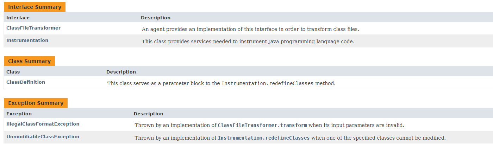
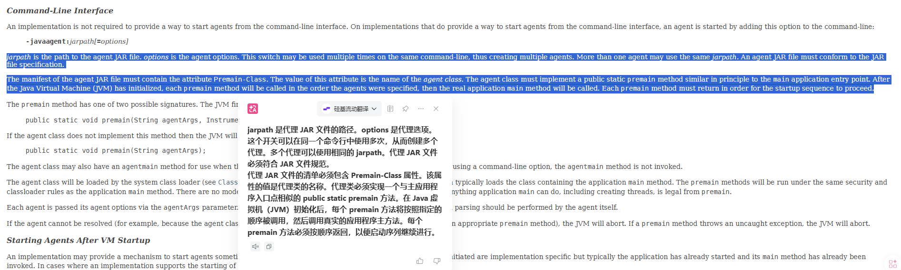
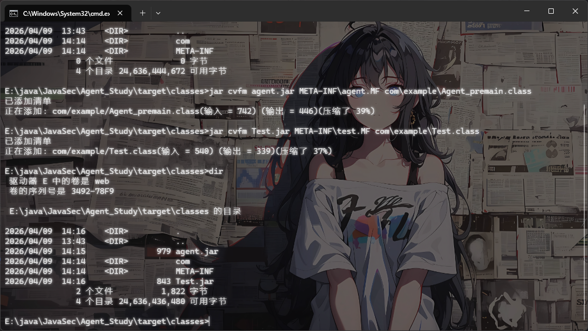
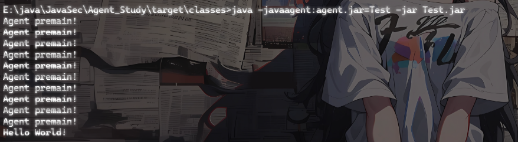
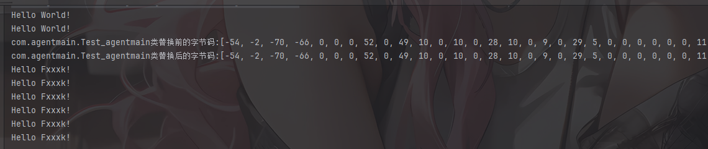

# 前言

JDK1.5开始，Java新增了Instrumentation ( Java Agent API )和 JVMTI ( JVM Tool Interface )功能。Instrumentation本质上是在类加载到 JVM 的过程中，允许开发者拦截并修改字节码；而JVMTI 是 JVM 提供的**原生 C 接口**，比Instrumentation更偏向于底层工作，是 JVM 调试器、分析器、监控工具的底层基石。它直接与 JVM 内部通信，可以监听几乎所有 JVM 级别的事件。

Java Agent 是 JVM 提供的一种**字节码插桩（Bytecode Instrumentation）机制**，允许开发者在 JVM 加载或运行类的时候，动态地修改类的字节码。

Java Agent主要分为两种工作模式：静态加载（premain）和动态挂载（agentmain），静态加载是指在 JVM 启动时通过 `-javaagent:agent.jar` 参数挂载jar，而动态挂载是在JVM运行后，通过 `VirtualMachine.attach()` API 动态地将 Agent 挂载到目标进程

# 关于Agent JAR

一个Agent JAR需要包含以下内容：

- META-INF/MANIFEST.MF配置文件
- Agent Class
- ClassFileTransformer实现类

## MANIFEST文件

和Java Agent相关的属性有以下几种

```java
									   ┌─── Premain-Class
                       ┌─── Basic ─────┤
                       │               └─── Agent-Class
                       │
                       │               ┌─── Can-Redefine-Classes
                       │               │
Manifest Attributes ───┼─── Ability ───┼─── Can-Retransform-Classes
                       │               │
                       │               └─── Can-Set-Native-Method-Prefix
                       │
                       │               ┌─── Boot-Class-Path
                       └─── Special ───┤
                                       └─── Launcher-Agent-Class
```

- 在 [Java 8](https://docs.oracle.com/javase/8/docs/api/java/lang/instrument/package-summary.html) 版本当中，定义的属性有 6 个；
- 在 [Java 9](https://docs.oracle.com/javase/9/docs/api/java/lang/instrument/package-summary.html) 至 [Java 17](https://docs.oracle.com/en/java/javase/17/docs/api/java.instrument/java/lang/instrument/package-summary.html) 版本当中，定义的属性有 7 个。 其中，`Launcher-Agent-Class` 属性，是 Java 9 引入的。

相关的几个属性的介绍

首先是JAR 文件清单中的两个属性指定了将要加载以启动代理的代理类。

- **Premain-Class**: 在JVM启动时指定代理时，此属性指定代理类。也就是说，包含premain方法的类。在JVM启动时指定代理时，此属性是必需的。如果属性不存在，JVM将中止。注意：这是一个类名，不是文件名或路径。
- **Agent-Class**: 如果一个实现支持在虚拟机启动后某个时间点启动代理，那么这个属性指定代理类。也就是说，包含 agentmain 方法的类。如果这个属性不存在，代理将不会被启动。注意：这是一个类名，而不是文件名或路径。

这两个属性其实是可以同时存在的，具体使用哪个取决于我们如何进行挂载agent

然后就是几个能力的属性：

- **Can-Redefine-Classes**: 布尔值（true 或 false，不区分大小写）。这个代理是否需要重新定义类的功能。除 true 以外的值被视为 false。这个属性是可选的，默认值为 false。
- **Can-Retransform-Classes**: 布尔值（true 或 false，不区分大小写）。是否需要此代理重新转换类的能力。除 true 以外的值被视为 false。此属性是可选的，默认为 false。
- **Can-Set-Native-Method-Prefix**: 布尔值（true 或 false，不区分大小写）。是否需要为该代理设置本地方法前缀。除 true 以外的值均被视为 false。此属性是可选的，默认值为 false。

# 源码分析

代码位于包 `java.lang.instrument` 下

参考官方文档：https://docs.oracle.com/javase/8/docs/api/java/lang/instrument/package-summary.html



可以看到包中有这些类和接口：


## ClassDefinition类

```java

package java.lang.instrument;


public final class ClassDefinition {
    /**
     *  重定义的类
     */
    private final Class<?> mClass;

    /*
     *  替换类的字节码，为byte数组
     */
    private final byte[]   mClassFile;


    public
    ClassDefinition(    Class<?> theClass,
                        byte[]  theClassFile) {
        if (theClass == null || theClassFile == null) {
            throw new NullPointerException();
        }
        mClass      = theClass;
        mClassFile  = theClassFile;
    }

    /*
     * 获取需要重定义的类
     */
    public Class<?>
    getDefinitionClass() {
        return mClass;
    }

    /*
     *  获取替换类的字节码
     */
    public byte[]
    getDefinitionClassFile() {
        return mClassFile;
    }
}

```

这个类主要是指定要替换的类和替换进去的类字节码内容，用于给`Instrumentation.redefineClasses()`提供参数

## IllegalClassFormatException异常类

```java
package java.lang.instrument;

public class IllegalClassFormatException extends Exception {
    private static final long serialVersionUID = -3841736710924794009L;

    public
    IllegalClassFormatException() {
        super();
    }

    public
    IllegalClassFormatException(String s) {
        super(s);
    }
}

```

非法字节码格式化异常抛出，具体实现在`ClassFileTransformer.transform()`。当 `ClassFileTransformer.transform()` 返回了格式不合法的字节码时，JVM 会抛出此异常。通常意味着字节码操作出现了 bug，比如 ASM 生成的字节码结构损坏。

## UnmodifiableClassException异常类

```java
package java.lang.instrument;

public class UnmodifiableClassException extends Exception {
    private static final long serialVersionUID = 1716652643585309178L;

    public
    UnmodifiableClassException() {
        super();
    }

    public
    UnmodifiableClassException(String s) {
        super(s);
    }
}

```

调用 Instrumentation的`retransformClasses()` 或 `redefineClasses()` 时，如果目标类不允许被修改，就会抛出此异常。

此外还有一个JDK9新增的异常类UnmodifiableModuleException

## UnmodifiableModuleException异常类（JDK9+）

Java 9 引入模块系统后，`Instrumentation` 新增了操作模块的方法（如 `redefineModule()`）。当尝试修改一个不允许被修改的模块时抛出此异常。

## Instrumentation接口

```java
// 注册一个转换器，canRetransform=true 表示该 transformer 支持 retransform
void addTransformer(ClassFileTransformer transformer, boolean canRetransform);
void addTransformer(ClassFileTransformer transformer); // canRetransform 默认 false

// 移除已注册的转换器
boolean removeTransformer(ClassFileTransformer transformer);

// 对已加载的类重新触发 transform() 流程（不能增删字段/方法）
void retransformClasses(Class<?>... classes) throws UnmodifiableClassException;

// 用全新字节码直接替换已加载类的定义
void redefineClasses(ClassDefinition... definitions) throws ClassNotFoundException, UnmodifiableClassException;


// 返回 JVM 当前已加载的所有类
Class[] getAllLoadedClasses();

// 返回指定类加载器下所有已经初始化的类
Class[] getInitiatedClasses(ClassLoader loader);

// 返回对象在堆上占用的字节数（不含引用对象）
long getObjectSize(Object objectToSize);

// 查询某个类是否可以被 retransform/redefine
boolean isModifiableClass(Class<?> theClass);
boolean isRetransformClassesSupported();
boolean isRedefineClassesSupported();


// 向 Bootstrap ClassLoader 的搜索路径追加 JAR（让 Agent 能拦截 JDK 内部类）
void appendToBootstrapClassLoaderSearch(JarFile jarfile);

// 向 System ClassLoader 的搜索路径追加 JAR
void appendToSystemClassLoaderSearch(JarFile jarfile);
```

Instrumentation接口是整个包的核心

## ClassFileTransformer接口

```java
package java.lang.instrument;

import  java.security.ProtectionDomain;


public interface ClassFileTransformer {

    /**
     * 类文件转换方法，重写transform方法可获取到待加载的类相关信息
     *
     * @param loader              定义要转换的类加载器；如果是引导加载器，则为 null
     * @param className           类名,如:java/lang/Runtime
     * @param classBeingRedefined 如果是被重定义或重转换触发，则为重定义或重转换的类；如果是类加载，则为 null
     * @param protectionDomain    要定义或重定义的类的保护域
     * @param classfileBuffer     类文件格式的输入字节缓冲区（不得修改）
     * @return 返回一个通过ASM修改后添加了防御代码的字节码byte数组。
     */
    byte[]
    transform(  ClassLoader         loader,
                String              className,
                Class<?>            classBeingRedefined,
                ProtectionDomain    protectionDomain,
                byte[]              classfileBuffer)
        throws IllegalClassFormatException;
}

```

该接口为转换类文件的代理接口，提供了transform方法用于修改类，返回值决定行为：返回修改后的字节码数组则替换原始字节码；返回 `null` 则表示不做任何修改，JVM 使用原始字节码继续加载。

在以下三种情形下 `ClassFileTransformer.transform()` 会被执行：

1. 新的 class 被加载。
2. Instrumentation.redefineClasses 显式调用。
3. addTransformer 第二个参数为 true 时，Instrumentation.retransformClasses 显式调用。

# 实现原理

instrument的底层实现是依赖于JVMTI（JVM Tool Interface）的，JVMTI是JVM给用户提供的供用户拓展的接口集合，JVMTI 是基于事件驱动的，JVM每执行一定的逻辑就会调用一些事件的回调接口，这些接口可以给用户自行扩展来实现自己的逻辑。JVMTIAgent 是一个利用 JVMTI 暴露出来的接口提供了代理启动时加载(agent on load)、代理通过 attach 形式加载(agent on attach)和代理卸载(agent on unload)功能的动态库。而 instrument agent 可以理解为一类 JVMTIAgent 动态库，别名是 JPLISAgent (Java Programming Language Instrumentation Services Agent)，也就是专门为 Java 语言编写的插桩服务提供支持的代理。

# 实现方法

## premain静态加载



从官方文档中可以得出，我们最终需要在命令行中添加**-javaagent**来指定一个代理jar文件的路径

我们的代理JAR文件中必须包含Premain-Class 属性（值是代理类名），且代理类需要实现premain方法

### demo测试

创建一个maven项目

先写一个需要修改的类

```java
package com.example;

public class Test {
    public static void main(String[] args) {
        System.out.println("Hello World!");
    }
}
```

可以看到Hello方法会打印输出`Hello World!`

我们编写一个简单的 `premain-Agent`并且实现premain方法

```java
package com.example;

import java.lang.instrument.Instrumentation;

public class Agent_premain {
    public static void premain(String agentArgs, Instrumentation inst) {
        for (int i =0 ; i<10 ; i++){
            System.out.println("Agent premain!");
        }
    }
}
```

然后分别在 `resource/META-INF/` 下创建 `agent.MF` 清单文件和test.MF清单文件

```java
Manifest-Version: 1.0
Premain-Class: com.example.Agent_premain
    
```

```java
Manifest-Version: 1.0
Main-Class: com.example.Test

```

注意这里清单文件结尾需要有换行

构建一下maven项目

接着在target\classes用 jar 命令来打包，此时并指定启动项。运行完命令之后将会生成 agent.jar 文件

```java
jar cvfm agent.jar META-INF\agent.MF com\example\Agent_premain.class
jar cvfm Test.jar META-INF\test.MF com\example\Test.class
```

最后得到两个jar，agent.jar和Test.jar



然后我们运行Test.jar包，并添加`-javaagent`参数

```java
java -javaagent:agent.jar=Test -jar Test.jar
```



可以看到在main方法之前先执行了premain方法，意味着我们的premain成功了

我这个例子相对简单，是参考的drunbaby师傅的，真正做到修改了字节码的demo可以参考su18师傅的，链接在文章结尾引用

## agentmain动态挂载

相较于 premain-Agent 只能在 JVM 启动前加载，agentmain-Agent 能够在JVM启动之后加载并实现相应的修改字节码功能。

JDK 1.6 新增了attach，可以对运行中的 Java 进程附加 Agent。主要相关类就是VirtualMachine类和VirtualMachineDescriptor 类

### VirtualMachine类

VirtualMachine 一般指的是 com.sun.tools.attach.VirtualMachine，属于 jdk.attach 模块。`VirtualMachine`类可以实现获取JVM信息，内存dump、现成dump、类信息统计（例如JVM加载的类）等功能。

该类允许我们通过给 attach 方法传入一个 JVM 的 PID，来远程连接到该 JVM 上 ，从而拿到的一个控制句柄，之后我们就可以对连接的 JVM 进行各种操作，如注入 Agent。

VirtualMachine类的一些功能方法：

- `VirtualMachine.list()`
  列出当前机器上可附加的 JVM
- `VirtualMachine.attach(pid)`
  按进程号附加到目标 JVM
- VirtualMachine.attach(VirtualMachineDescriptor vmd)
  和上面类似，只是改成用 list() 拿到的描述对象去连接。
- `VirtualMachine.loadAgent(String agentJar)`
- `VirtualMachine.loadAgent(String agentJar, String options)`
  把一个 Java Agent JAR 动态加载进目标 JVM
- `loadAgentLibrary(...) / loadAgentPath(...)`
  加载本地 native agent，一般和 JVMTI 相关，前者用的是库名，后者用的是本地agent的完整路径
- `getSystemProperties()`
  读目标 JVM 的系统属性
- `getAgentProperties()`
  读目标 JVM 的 agent 属性
- `detach()`

​	断开附加

简单来说加载Agent的三种就是：

- loadAgent = Java agent JAR
- loadAgentLibrary = 本地库名
- loadAgentPath = 本地库完整路径

### VirtualMachineDescriptor 类

`VirtualMachineDescriptor`类是一个用来描述特定虚拟机的类

VirtualMachineDescriptor 主要保存 3 类信息：

- id()：目标 JVM 的标识，通常就是 pid
- displayName()：展示名，通常是启动主类/命令行
- provider()：底层 attach provider

利用上面两个类我们可以尝试获取到我们的JVM虚拟机PID

JDK8下需要显式加入tools.jar

```xml
<dependency>
    <groupId>com.sun</groupId>
    <artifactId>tools</artifactId>
    <version>1.8</version>
    <scope>system</scope>
    <systemPath>${java.home}/../lib/tools.jar</systemPath>
</dependency>
```

```java
package com.agentmain;

import com.sun.tools.attach.VirtualMachine;
import com.sun.tools.attach.VirtualMachineDescriptor;

import java.util.List;

public class PID_get {
    public static void main(String[] args) {
        List<VirtualMachineDescriptor> list = VirtualMachine.list();

        for (VirtualMachineDescriptor vmd : list) {
            if(vmd.displayName().equals("com.agentmain.PID_get")) {
                System.out.println(vmd.displayName());
                System.out.println(vmd.id());
            }
        }
    }
}
/*
com.agentmain.PID_get
45640
*/
```

然后我们实现一个agentmain的demo

### demo测试

用su18师傅的demo测试一下

先写一个Transformer

```java
package com.agentmain;

import java.lang.instrument.ClassFileTransformer;
import java.lang.instrument.IllegalClassFormatException;
import java.security.ProtectionDomain;

public class Transformer implements ClassFileTransformer {
    @Override
    public byte[] transform(ClassLoader loader, String className,
                            Class<?> classBeingRedefined, ProtectionDomain protectionDomain,
                            byte[] classfileBuffer) throws IllegalClassFormatException {

        // 将常用的类名转换为 JVM 认识的类名
        className = className.replace("/", ".");

        // 如果类名为我们指定的类
        if (className.equals("com.agentmain.Test_agentmain")) {
            // 进一步进行处理，替换掉输出字符串
            return ClassHandler.replaceBytes(className, classfileBuffer);
        }
        return classfileBuffer;
    }
}

```

接着写一个处理逻辑ClassHandler，最后需要返回修改后的字节码数组才能替换字节码

```java
package com.agentmain;

import java.util.Arrays;

public class ClassHandler {

    public static byte[] replaceBytes(String className, byte[] classBuffer) {

        // 将类字节码转换成byte字符串
        String bufferStr = Arrays.toString(classBuffer);
        System.out.println(className + "类替换前的字节码:" + bufferStr);

        bufferStr = bufferStr.replace("[", "").replace("]", "");

        // 查找需要替换的Java二进制内容
        byte[] findBytes = "World!".getBytes();

        // 把搜索的字符串byte转换成byte字符串
        String findStr = Arrays.toString(findBytes).replace("[", "").replace("]", "");

        // 二进制替换后的byte值，注意这个值需要和替换的字符串长度一致，不然会破坏常量池
        byte[] replaceBytes = "Fxxxk!".getBytes();

        // 把替换的字符串byte转换成byte字符串
        String replaceStr = Arrays.toString(replaceBytes).replace("[", "").replace("]", "");

        bufferStr = bufferStr.replace(findStr, replaceStr);

        // 切割替换后的byte字符串
        String[] byteArray = bufferStr.split("\\s*,\\s*");

        // 创建新的byte数组，存储替换后的二进制
        byte[] bytes = new byte[byteArray.length];

        // 将byte字符串转换成byte
        for (int i = 0; i < byteArray.length; i++) {
            bytes[i] = Byte.parseByte(byteArray[i]);
        }

        System.out.println(className + "类替换后的字节码:" + Arrays.toString(bytes));

        // 返回修改后的二进制
        return bytes;
    }

}

```

这里会将`World!`修改成`Fxxxk!`

然后我们写一个需要替换的类

```java
package com.agentmain;

public class Test_agentmain {
    public static void main(String[] args) throws Exception {
        while (true){
            printMessage();
            Thread.sleep(1000 * 3);
        }
    }

    private static void printMessage() {
        System.out.println("Hello World!");
    }
}

```

写个Test类，每过三秒打印一次字符串，模拟正在运行的JVM

然后编写我们的agentmain类

```java
package com.agentmain;


import java.lang.instrument.Instrumentation;

public class Agentmain_main {
    public static void agentmain(String args, Instrumentation inst) throws Exception {
        inst.addTransformer(new Transformer() ,true);
        inst.retransformClasses(Class.forName("com.agentmain.Test_agentmain"));
    }
}
```

我们在 addTransformer 的参数中指定了 true，然后进行了Instrumentation.redefineClasses 显式调用。

写一个MANIFEST.MF文件

```java
Manifest-Version: 1.0
Agent-Class: com.agentmain.Agentmain_main
Can-Retransform-Classes: true

```

需要加一个Can-Retransform-Classes字段

编译后用jar命令打包

```java
jar cvfm agentmain.jar META-INF\MANIFEST.MF com\agentmain\Agentmain_main.class
```

还需要写一个AttachTest类用来将我们的程序 attach 进去

```java
package com.agentmain;

import com.sun.tools.attach.*;

import java.io.IOException;
import java.util.List;

public class AttachTest {
    public static void main(String[] args) throws AgentLoadException, IOException, AgentInitializationException, AttachNotSupportedException {

        //获取正在运行的JVM列表
        List<VirtualMachineDescriptor> list = VirtualMachine.list();

        for(VirtualMachineDescriptor vmd : list) {

            if (vmd.displayName().equals("Test_agentmain")) {
                VirtualMachine vm = VirtualMachine.attach(vmd.id());
                vm.loadAgent("E:\\java\\JavaSec\\Agent_Study\\target\\classes\\agentmain.jar","arg1");
                vm.detach();
            }
        }
    }
}
```

完成后先运行Test_agentmain类，然后运行AttachTest进行注入就可以了



需要注意一点就是agentmain + retransform 并不会把正在执行中的那个方法栈帧替换掉，而是会影响后续的新方法调用，我一开始的Test_agentmain直接写的println打印而不是写成一个printMessage方法，然后替换成功了但是输出仍然不变

可以看到，使用 attach 进行附加进程的方式可以在程序无需重启的情况下进行注入和修改，也是非常之方便

但其实从上面su18师傅的demo不难看出，是通过操作整个类字节码去强行修改的，实际上动态修改字节码还可以借助Javassist去进行处理

# Javassist动态修改字节码

Java字节码是Java 代码编译后存放在`.class`文件中的二进制内容。Javassist 是一个用于 **操作 Java 字节码** 的库，主要作用是在程序运行或编译后可以操作修改已有类的方法、字段、构造器，可以给方法插入代码，甚至可以直接创建一个新的class

## ClassPool&CtClass

ClassPool简单来说就是一个class的`搜索/缓存/解析器`，Javassist不会直接让开发者拿着原始的`.class`字节数组去修改，而是将类表示成一个`CtClass`对象。而ClassPool则可以按类名查找class，从classpath中读取class文件并包装成CtClass

```java
ClassPool pool = ClassPool.getDefault();
CtClass cc = pool.get("com.demo.Test");
```

当然也可以makeClass创建一个新类

```java
ClassPool pool = ClassPool.getDefault();
CtClass cc = pool.makeClass("com.demo.Test");
```

创建一个Test类，但是这个类是只存在于Javassist的表示里，除非我们调用`writeFile`，`toBytecode`或`toClass`才能进行输出或加载

## CtMethod&CtField&CtConstructor

一个表示`Method`对象方法，一个表示`Field`对象字段，一个表示`Constructor`构造器，都可以通过反射进行获取。

```java
ClassPool pool = ClassPool.getDefault();
CtClass cc = pool.get("com.demo.Test");
CtMethod method = cc.getDeclaredMethod("hello");
```

CtMethod类提供了一些方法让我们可以直接修改方法体

```java
public final class CtMethod extends CtBehavior {
}
 
// 父类 CtBehavior
public abstract class CtBehavior extends CtMember {
    // 设置方法体
    public void setBody(String src);
 
    // 插入在方法体最前面
    public void insertBefore(String src);
 
    // 插入在方法体最后面
    public void insertAfter(String src);
 
    // 在方法体的某一行插入内容
    public int insertAt(int lineNum, String src);
 
}
```

不多说，写个demo更方便理解

## 写个demo

先导入Javassist依赖

```xml
<dependency>  
  <groupId>org.javassist</groupId>  
  <artifactId>javassist</artifactId>  
  <version>3.27.0-GA</version>  
</dependency>
```

然后编写demo

```java
package com.JavassistStudy;

import javassist.*;

import java.io.IOException;

public class Demo {
    public static void Creat_class() throws NotFoundException, CannotCompileException, IOException {
        //获取CtClass对象池ClassPool并新建类
        ClassPool pool = ClassPool.getDefault();
        CtClass ctClass = pool.makeClass("com.JavassistStudy.Test");

        //创建一个类字段name
        CtField ctField = new CtField(pool.get("java.lang.String"),"name",ctClass);
        //设置name字段访问符为public
        ctField.setModifiers(Modifier.PUBLIC);
        //将name字段添加到类中并赋初始值为wanth3f1ag
        ctClass.addField(ctField,CtField.Initializer.constant("wanth3f1ag"));

        //创建一个无参构造函数
        CtConstructor constructor = new CtConstructor(new CtClass[]{},ctClass);
        //设置无参构造函数的访问符
        constructor.setModifiers(Modifier.PUBLIC);
        //设置方法体
        constructor.setBody("{name = \"wanth3f1ag\";}");
        //添加构造器
        ctClass.addConstructor(constructor);

        //创建一个有参构造函数
        CtConstructor hasConstructor = new CtConstructor(new CtClass[]{pool.get("java.lang.String")},ctClass);
        //设置有参构造函数的访问符
        hasConstructor.setModifiers(Modifier.PUBLIC);
        //设置方法体
        hasConstructor.setBody("{this.name = $1;}");
        //添加构造器
        ctClass.addConstructor(hasConstructor);

        //创建一个类方法printName
        CtMethod ctMethod = new CtMethod(CtClass.voidType,"printName",new CtClass[]{},ctClass);
        //设置方法访问符
        ctMethod.setModifiers(Modifier.PUBLIC);
        //设置方法体
        ctMethod.setBody("{System.out.println(name);}");
        //添加方法
        ctClass.addMethod(ctMethod);

        //将生成的字节码写入文件
        ctClass.writeFile("E:\\java\\JavaSec\\Agent_Study\\src\\main\\java");

    }
    public static void main(String[] args) throws NotFoundException, CannotCompileException, IOException {
        Creat_class();
    }
}
```

大多常用的方法都已经写在demo中了

运行后可以看到生成的类内容如下

```java
//
// Source code recreated from a .class file by IntelliJ IDEA
// (powered by FernFlower decompiler)
//

package com.JavassistStudy;

public class Test {
    public String name = "wanth3f1ag";

    public Test() {
        this.name = "wanth3f1ag";
    }

    public Test(String var1) {
        this.name = var1;
    }

    public void printName() {
        System.out.println(this.name);
    }
}

```

然后我们使用javassist生成恶意类

## Javassist生成恶意类demo

```java
package com.JavassistStudy;

import javassist.*;

import java.io.File;
import java.io.FileOutputStream;
import java.io.IOException;

public class EvilPayload {
    public static void writeShell(){
        try{
            ClassPool pool = ClassPool.getDefault();
            CtClass ctClass = pool.makeClass("Evil");
            CtClass superClass = pool.get("com.sun.org.apache.xalan.internal.xsltc.runtime.AbstractTranslet");
            ctClass.setSuperclass(superClass);
            CtConstructor ctConstructor = ctClass.makeClassInitializer();
            ctConstructor.setBody(" try {\n" +
                    " Runtime.getRuntime().exec(\"calc\");\n" +
                    " } catch (Exception ignored) {\n" +
                    " }");
            //将生成的字节码写入文件
            ctClass.writeFile("E:\\java\\JavaSec\\Agent_Study\\src\\main\\java");
            byte[] bytes = ctClass.toBytecode();
            ctClass.defrost();
            FileOutputStream fileOutputStream = new FileOutputStream(new File("S"));
            fileOutputStream.write(bytes);
        } catch (NotFoundException e) {
            throw new RuntimeException(e);
        } catch (CannotCompileException e) {
            throw new RuntimeException(e);
        } catch (IOException e) {
            throw new RuntimeException(e);
        }
    }
    public static void main(String[] args) {
        writeShell();
    }
}

```

看看生成的Evil文件

```java
//
// Source code recreated from a .class file by IntelliJ IDEA
// (powered by FernFlower decompiler)
//

import com.sun.org.apache.xalan.internal.xsltc.runtime.AbstractTranslet;

public class Evil extends AbstractTranslet {
    static {
        try {
            Runtime.getRuntime().exec("calc");
        } catch (Exception var1) {
        }

    }
}

```

为什么这里不需要实现父类的方法呢？正常来说，我们的恶意类需要继承`AbstractTranslet`类，并重写两个`transform()`方法。否则编译无法通过，无法生成`.class`文件。但是这里通过Javassist去生成类，是在字节码层面操作的，跳过了恶意类的编译过程，所以就不需要重写方法了

# 参考文章

https://su18.org/post/irP0RsYK1/

https://drun1baby.top/2023/12/07/Java-Agent-%E5%86%85%E5%AD%98%E9%A9%AC%E5%AD%A6%E4%B9%A0/

https://lsieun.github.io/java-agent/s01ch01/agent-jar-three-core-components.html
