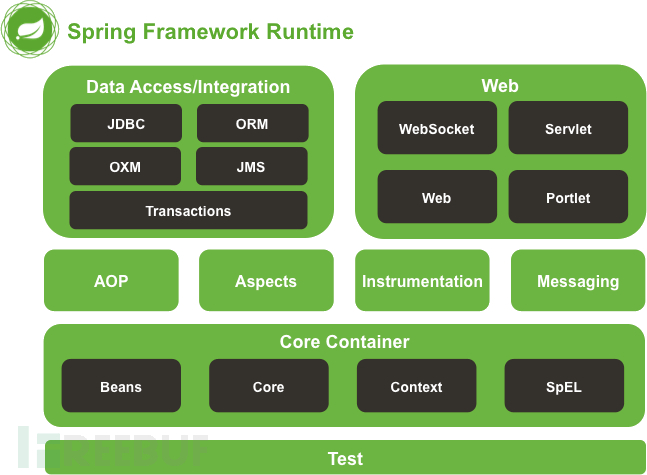
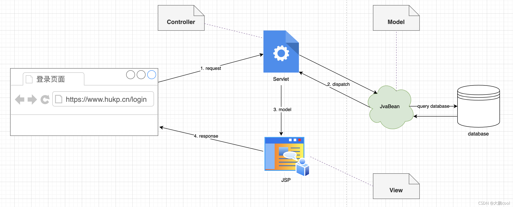
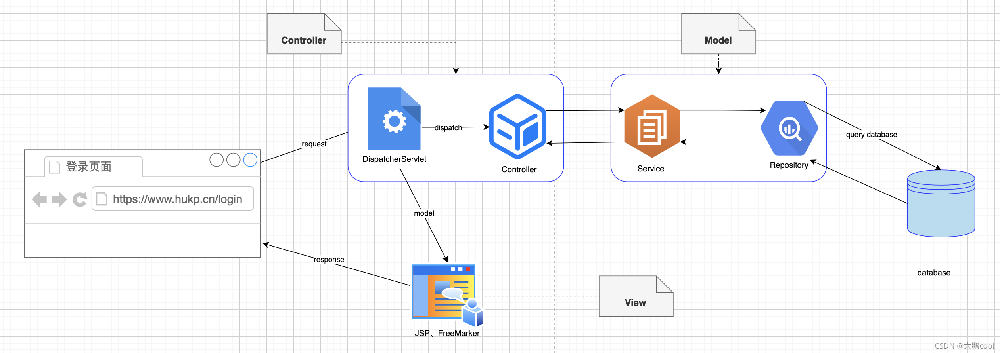

---
title: "Java之Spring基础"
date: 2025-12-02T16:16:47+08:00
summary: "主要是写给自己看的，之前对Spring了解少之甚少"
url: "/posts/Java之Spring基础/"
categories:
  - "javasec"
tags:
  - "javasec"
draft: false
---

# Spring是框架？

其实这个问题困扰了我大几个月，有人说Spring是框架，也有人说Spring是一个生态系统，我更偏向于后者吧，广义上来说Spring不是一个简单的框架，而是构成一个完整的生态体系，但是往往我们口中的Spring都会被特指成Spring Framework，所以也就有极大部分人把Spring看成是一个框架。那我们后面就把他当作是一个框架（Spring Framework）吧

官方文档：https://spring.io/

总结来说：Spring框架是一个开源的轻量级的控制反转（IoC）和面向切面（AOP）的容器框架

# Spring框架的特性

## 控制反转(IoC)和依赖注入(DI)

什么是控制反转呢？

在传统的Java开发中，对象需要自己创建并查找依赖对象建立依赖关系

例如

```java
// 用户服务类
public class UserService {
    // 自己创建依赖对象
    private UserRepository userRepository = new UserRepository();
    
    public User getUser(Long id) {
        return userRepository.findById(id);
    }
}

// 用户数据访问类
public class UserRepository {
    public User findById(Long id) {
        // 从数据库查询用户
        return user;
    }
}
```

这种传统方式下存在的问题：

1. 高耦合度，UserService 和 UserRepository 紧密绑定,UserService 必须知道如何创建 UserRepository
2. 测试困难，当我们需要测试UserService 时，必须实例化一个真实的UserRepository，这样会加大测试的工作量
3. 紧密关联带来的低灵活性，如果我们想改变UserRepository的实现代码，就必须对UserService 代码也进行改变

但是在IoC中，Spring容器会负责创建对象并注入依赖关系，顾名思义就是“控制权发生了反转”

IoC的写法

```java
@Autowired
UserService userService;
```

这样就大大降低了组件之间的耦合度,提高了代码的可测试性和可维护性。

依赖注入(DI)其实就是IoC的具体实现方式，依赖注入的方式包括：

- 构造器注入（推荐）
- 字段注入
- Setter注入
- 接口注入

写个代码

```java
// 方式1: 构造器注入 (推荐)
@Service
public class UserService {
    private final UserRepository userRepository;
    
    // Spring 会自动调用这个构造器,并注入 UserRepository
    public UserService(UserRepository userRepository) {
        this.userRepository = userRepository;
    }
    
    public User getUser(Long id) {
        return userRepository.findById(id);
    }
}

// 方式2: 字段注入
@Service
public class UserService {
    // Spring 直接给这个字段赋值
    @Autowired
    private UserRepository userRepository;
    
    public User getUser(Long id) {
        return userRepository.findById(id);
    }
}

// 方式3: Setter 注入
@Service
public class UserService {
    private UserRepository userRepository;
    
    // Spring 会调用这个 setter 方法注入
    @Autowired
    public void setUserRepository(UserRepository userRepository) {
        this.userRepository = userRepository;
    }
    
    public User getUser(Long id) {
        return userRepository.findById(id);
    }
}

// UserRepository 也交给 Spring 管理
@Repository
public class UserRepository {
    public User findById(Long id) {
        // 从数据库查询
        return user;
    }
}
```

需要注意的是，DI不等于IoC，DI只是IoC里面对依赖和对象的具体处理方式

## 面向切面(AOP)

先了解AOP中的几个关键概念：

1.**横切关注点**：就是一些跟业务逻辑无关但是又必须存在的公共功能

常见的横切关注点包括：

- **日志记录**: 方法执行前后记录日志
- **权限控制**: 检查用户是否有权限
- **事务管理**: 开启、提交、回滚事务
- **性能监控**: 统计方法执行时间
- **异常处理**: 统一处理异常
- **缓存**: 缓存方法结果
- **数据验证**: 验证参数

2.**切面**：横切关注点的模块化

3.**连接点**：可以插入切面的程序执行点，通常是方法的调用或执行点

4.**切入点**：定义在哪些连接点需要切面

5.**通知**：在切入点上要执行的具体操作，例如前置(Before)、后置(After)、返回后(After Returing)、异常后(After Throwing)、环绕(Around)

6.**织入**：将切面应用到目标对象的过程，Spring支持基于代理的运行时织入

7.**代理**：Spring AOP 通过 JDK 动态代理或 CGLIB 代理来实现织入

AOP其实就是一种编程思想，将这些公共功能从业务逻辑中抽离出来统一进行处理，即通过`切面`来封装这些横切关注点，并在运行时或编译时"织入"到目标代码中，从而实现模块化管理，也能提高代码的灵活性。

### AOP的几个核心注解

1. `@Aspect`：声明一个横切关注点切面
2. `@Pointcut`：定义一个切入点
3. `@Before`：前置通知，即在方法执行前执行切面
4. `@After`：后置通知，即在方法执行后执行切面，无论方法是否成功执行
5. `@AfterReturning`：返回后通知，即方法成功返回后执行切面
6. `@AfterThrowing `：异常通知，即方法抛出异常后执行切面
7. `@Around`：环绕通知，是前面几种通知的组合

# Spring框架的组成

Spring Framework作为最核心的框架，主要包含：

- Core Container 核心容器：主要负责IoC控制反转和DI依赖注入

核心容器包含模块：spring-core，spring-beans，spring-context，spring-expression (SpEL)

spring-core和spring-beans是框架最基础的部分，包括控制反转和依赖注入功能

spring-context提供了访问对象的方式，有点类似于JNDI注册

spring-expression提供了一种很强大的表达式，即SpEL表达式，可以在运行时查询和操作对象

- AOP模块：主要负责切面编程的实现

主要包含模块：spring-aop，spring-ascpects，spring-instrument，spring-instrument-tomcat

spring-aop主要是提供了基于代理的AOP实现

spring-ascpects集成了AspectJ，实现更强大的AOP

spring-instrument提供了类工具的支持和类加载器的实现，可以在特定的应用服务器中使用。

spring-instrument-tomcat模块提供针对tomcat的instrument实现。

- Data Access/Integration 数据访问/集成模块：主要负责JDBC数据库操作以及事务管理

主要包含模块：spring-jdbc，spring-tx，spring-orm，spring-oxm，spring-jms

spring-jdbc提供了对JDBC的封装，简化了数据库访问和操作

spring-tx提供了一套统一的事务抽象，让不同数据源的事务用同一种方式集中管理

spring-orm提供与流行的“对象-关系”映射框架无缝集成的 API，包括 JPA、JDO、Hibernate 和 MyBatis 等

spring-oxm提供了一个支持 Object /XML 映射的抽象层实现

spring-jms是对JMS标准的封装，提供发送消息和接收消息等消息服务功能

- Web模块：提供Web模块的功能包括基础Web执行，MVC架构

主要包含：spring-web，spring-webmvc，spring-websocket，spring-webflux

spring-web提供了最基础的web支持例如Servlet，文件上传等

spring-webmvc提供了一个 Spring MVC Web 框架实现。Spring MVC 框架提供了基于注解的请求资源注入、更简单的数据绑定、数据验证等及一套非常易用的 JSP 标签，并且能很好的和其他功能结合协同办公

spring-websocket提供了WebSocket 支持进行实时通讯

spring-webflux是响应式 Web 框架，特点是少量线程处理多个请求，可支持异步大并发请求

- Test测试模块，就是一个测试框架，主要包括spring-test
- Messaging消息模块，统一消息抽象，主要包括spring-messaging

官方的图



总结来说：Spring 框架是一个分层的 Java 应用开发框架，由 6 大模块构成：核心容器（IoC/DI）、AOP 模块、数据访问模块、Web 模块、消息模块和测试模块。这些模块协作支持从底层容器管理，到面向切面编程、数据访问、MVC Web 开发及测试的完整开发体系。

# Spring MVC架构

参考文章：https://blog.csdn.net/zzuhkp/article/details/120685952

Spring MVC架构主要是Web层的框架，MVC（Model View Controller）指的是模型-视图-控制器三个核心组件，MVC架构主要是将用户交互拆分到这三个组件中，接下来我们分开讲讲

1. **模型(Model)**：模型封装了数据及对数据的操作，可以直接对数据库进行访问，不依赖视图和控制器，也就是说模型并不关注数据如何展示，只负责提供数据。GUI 程序模型中数据的变化一般会通过观察者模式通知视图，而在 web 中则不会这样。
2. **视图(View)**：视图从模型中拉取数据，只负责展示，没有具体的程序逻辑。
3. **控制器(Controller)**：控制器用于控制程序的流程，将模型中的数据展示到视图中。

## 为什么MVC好

我觉得这个原因是比较重要的，知道他好在哪里才会喜欢用他嘛

早期的JavaEE项目通常使用Servlet去处理请求，但是Servlet的缺点是会产生大量的冗余代码，不适合输出复杂的HTML，后来Sun公司根

据asp提出了JSP，JSP是基于 Java 的一种 **动态网页技术**。JSP 文件本质上就是一个 **HTML + Java 代码的混合文件**，后缀是 `.jsp`，虽然他很适合进行HTML+Java的开发，但是也不适合编写复杂的Java代码

哎，可以看到这两个其实在优缺点上是互补的，那么是否可以结合这两个从而发挥出其最大的作用呢？

有的兄弟，有的，Web MVC被提出，JavaBean充当模型，而JSP文件作为视图，Servlet作为控制器

借鉴一下师傅的流程图



客户端发送请求后先经过Servlet，Servlet会使用JavaBean查询并存储数据，然后将数据交给JSP进行渲染生成视图，那么这就是早期的Web MVC架构

直到后来出现了Spring MVC结构模式

## Spring MVC架构模式的组成

Spring MVC架构遵循了Servlet规范 ，并对早期的Web MVC加以拓展，将控制器拆Controller分成前端控制器DispatcherServlet，处理器映射器HandlerMapping和后端控制器Controller，将模型拆分成业务层Service和数据访问层Repository，同时也不止支持JSP，还支持入FreeMarker等

具体的请求流程还是借鉴师傅的图



### MVC请求流程

1. 客户端发送请求到前端控制器DispatcherServlet，前端控制器DispatcherServlet根据HandlerMapping找到对应的Controller方法进行分发请求给后端控制器Controller
2. 后端控制器Controller根据请求选择合适的 **Model** 和 **View 名称**
3. `ViewResolver` 根据后端控制器返回的View名称找到真正需要的 View
4. `View` 接收返回的 Model 进行渲染
5. DispatcherServlet前端控制器将渲染的结果返回给客户端用户

# SpringBoot

SpringBoot主要是用来快速构建Spring应用的

在之前我们开发一个Spring Web项目通常需要配置很多东西例如web.xml，Spring MVC，事务管理等，而Spring Boot会根据我们加入我依赖自动配置需要的Bean，并且还内置了Tomcat/Jerry/Netty等服务器，这让我们的Java Web服务启动更加便捷

## Starter依赖

Starter依赖的作用主要是继承了某一类功能所需要的所有依赖，例如spring-boot-starter-web，当我们导入这个依赖后Spring Web开发所需要的依赖都集成在里面可供使用，并且Starter依赖由Spring Boot 统一管理版本，非常的方便和美味

Spring Boot 官方的几种Starter依赖：

| Starter                       | 用途                     |
| ----------------------------- | ------------------------ |
| spring-boot-starter-web       | 构建 Web/MVC/REST API    |
| spring-boot-starter-test      | 测试工具集               |
| spring-boot-starter-data-jpa  | JPA + Hibernate          |
| spring-boot-starter-thymeleaf | Thymeleaf 模板引擎       |
| spring-boot-starter-security  | Spring Security 认证授权 |
| spring-boot-starter-actuator  | 监控与健康检查           |

# Spring Boot Web的一些常见注解

| 分类         | 注解                       | 说明                                              |
| ------------ | -------------------------- | ------------------------------------------------- |
| **类级别**   | `@Controller`              | 标记控制器，返回视图页面                          |
| **类级别**   | `@RestController`          | = `@Controller` + `@ResponseBody`，返回 JSON 数据 |
| **类级别**   | `@RequestMapping("/path")` | 给整个类定义统一的请求路径前缀                    |
| **请求映射** | `@GetMapping`              | 处理 GET 请求，对应查询操作                       |
| **请求映射** | `@PostMapping`             | 处理 POST 请求，对应新增操作                      |
| **请求映射** | `@PutMapping`              | 处理 PUT 请求，对应修改操作                       |
| **请求映射** | `@DeleteMapping`           | 处理 DELETE 请求，对应删除操作                    |
| **参数接收** | `@PathVariable`            | 接收 URL 路径变量，如 `/user/{id}`                |
| **参数接收** | `@RequestParam`            | 接收 URL 查询参数，如 `?page=1`                   |
| **参数接收** | `@RequestBody`             | 接收请求体中的 JSON 数据                          |
| **参数接收** | `@RequestHeader`           | 接收请求头中的数据                                |
| **组件**     | `@Component`               | 通用组件，交给 Spring 容器管理                    |
| **组件**     | `@Service`                 | 标记业务逻辑层                                    |
| **组件**     | `@Repository`              | 标记数据访问层                                    |
| **依赖注入** | `@Autowired`               | 自动注入，优先按类型匹配（Spring）                |
| **依赖注入** | `@Resource`                | 自动注入，优先按名称匹配（JDK）                   |
| **配置**     | `@Configuration`           | 标记这是一个配置类                                |
| **配置**     | `@Bean`                    | 手动声明一个 Bean 交给 Spring 管理                |
| **配置**     | `@Value`                   | 读取配置文件中的值，如 `${server.port}`           |
