---
title: "Java从0到1的学习"
date: 2025-08-26T20:48:35+08:00
summary: "Java从0到1的学习"
url: "/posts/Java从0到1的学习/"
categories:
  - "javasec"
tags:
  - "javasec"
draft: false
---

# 闲话

先来扯一点java的闲话吧

## 扯一点历史

Java之父是一定要记住的，那就是詹姆斯·高斯林！Java最早是由Sun公司(已被Oracle收购)的高斯林在上个世纪90年代初开发的一种编程语言，一开始是被命名为Oak，后面由于该商标已经被人注册了，因此SUN公司就注册了Java这个商标。之后，我们伟大的Java语言就诞生成最重要的编程语言了。

## 编译型语言和解释型语言

- 编译型语言例如C、C++，他们的代码在运行前被预先编译成机器码然后才被执行，具有高效便捷的特点，但是基于不同的平台的CPU指令集的不同，因此编译型语言需要根据不同平台编译出不同的机器码

- 解释型语言例如Python、Ruby，他们是由解释器直接加载源码并逐行执行的，具有灵活、能跨平台运行的特点，不依赖于平台，但是这样的话运行效率就会很低。

Java是介于解释型语言和编译型语言之间的一种语言（Maybe更偏向于编译型语言的解释），Java会将代码编译成一种字节码，就是一种抽象的CPU指令和语法树，之后被JVM虚拟机根据不同的平台将字节码解释执行或编译成机器码

Java的版本一共有三种：

- Java SE：Standard Edition
- Java EE：Enterprise Edition
- Java ME：Micro Edition（无特殊需求不建议学）

最重要的其实就是前面的JavaSE和JavaEE

简单来说，Java SE就是标准版，包含标准的JVM和标准库，而Java EE是企业版，它只是在Java SE的基础上加上了大量的API和库，以便方便开发Web应用、数据库、消息服务等，Java EE的应用使用的虚拟机和Java SE完全相同。

总而言之，Java SE是一整个Java体系学习的基础和核心，而Java EE是为了进一步学习Web应用开发所需要的，所以我们从Java SE开始入手去学习

# JavaSE基础知识

参考文章：https://liaoxuefeng.com/books/java/quick-start/history/index.html、菜鸟教程

先讲讲Java语言的几个重要特性

- Java语言是面向对象的语言(oop)
- Java语言是健壮的，Java 的强类型机制、异常处理、垃圾的自动收集等是 Java 程序健壮性的重要保证。
- Java语言是跨平台型的语言
- Java语言是强类型的语言

然后还有两个特别的名词，JDK和JRE，他们分别是什么呢？

JRE就是运行java字节码的一种虚拟机运行环境，包含 JVM + Java 核心类库；而JDK是java的开发工具包，包含了java的开发，编译的工具

和环境，可以将java代码编译成字节码。

这里放一个师傅的图片

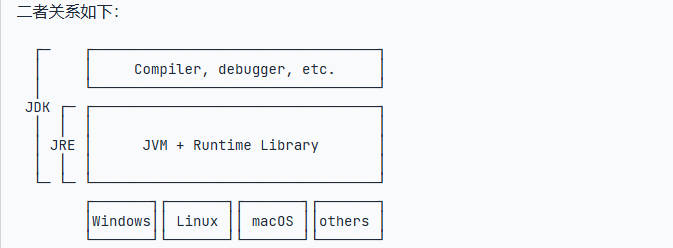


## 关于JDK

安装教程的话这里就不说了，还是很简单的，然后我们关注一个点

在`JAVA_HOME`的`bin`目录下找到很多可执行文件：

- java.exe：这个可执行程序其实就是JVM，运行Java程序，就是启动JVM，然后让JVM执行指定的编译后的代码；
- javac.exe：这是Java的编译器，它用于把Java源码文件（以`.java`后缀结尾）编译为Java字节码文件（以`.class`后缀结尾）；
- jar.exe：用于把一组`.class`文件打包成一个`.jar`文件，便于发布；
- javadoc.exe：用于从Java源码中自动提取注释并生成文档；
- jdb.exe：Java调试器，用于开发阶段的运行调试。

**javac** 是 Java 编译器，它的作用是读取 `.java` 文件并将其编译成 `.class` 文件，一旦生成了 `.class` 文件，就可以使用 `java` 命令来运行程序

## HelloWorld的开始

一个 Java 程序可以认为是一系列对象的集合，而这些对象通过调用彼此的方法来协同工作。

程序员的第一个程序必然就是hello world了，那我们先拿这个代码来分析一下

```java
public class HelloWorld {
    /* 我的第一个Java程序
     * 它将输出字符串 Hello World
     */
    public static void main(String[] args) {
        System.out.println("Hello World"); // 输出 Hello World
    }
}
```

类声明

- **public**：这是一个访问修饰符，表示该类可以被其他类访问。
- **class**：关键字，用于声明一个类。
- **HelloWorld**：这是类的名称，必须与文件名相同（HelloWorld.java）。

main主方法：

- **public**：修饰符，表示该方法可以被任何其他类调用。
- **static**：关键字，表示该方法属于类，而不是类的实例。程序运行时不需要先创建类的对象。
- **void**：表示该方法没有返回值。
- **main**：方法名称，Java 程序的入口点。JVM（Java Virtual Machine）会从这里开始执行程序。
- **String[] args**：这是一个参数，表示可以接收命令行输入的字符串数组。

输出语句

- **System.out**：这是 Java 中的一个输出流对象，用于向控制台打印信息。
- **println**：这是一个方法，用于打印括号内的内容，并在打印后换行。
- **"Hello World"**：这是要输出的字符串。

代码编辑好后运行的话就是在cmd窗口进行操作

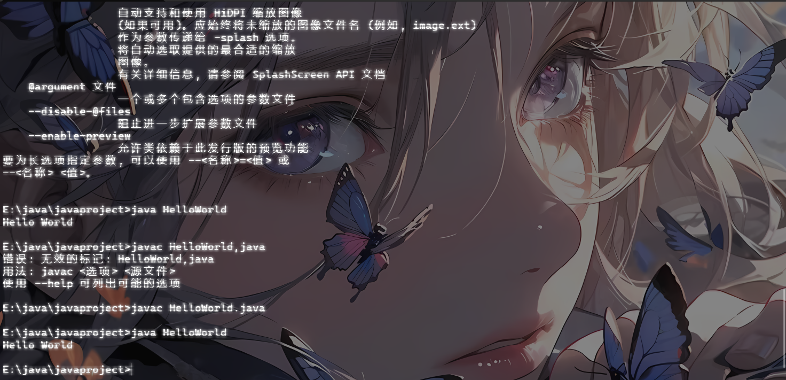

## 如何运行java程序

java源码本质上是一个java类型的文本文件，我们需要先用`javac`把`.java文件`编译成字节码文件`.class文件`，然后，用`java`命令执行这个字节码文件

从图中可以看到一个命令

```java
java HelloWorld
```

为什么这里是HelloWorld呢？其实是因为JVM虚拟机会根据我们传入的类名去查找对应的class文件，这也就涉及到一个类加载机制的问题了，后面再细说。

## Java程序的基本结构

从上面的HelloWorld来分析

```java
public class HelloWorld {
    /* 我的第一个Java程序
     * 它将输出字符串 Hello World
     */
    public static void main(String[] args) {
        System.out.println("Hello World"); // 输出 Hello World
    }
}
```

因为java是面向对象的编程语言，所以一个java程序的基本单位就是class

编写 Java 程序时，应注意以下几点：

- **大小写敏感**：Java 是大小写敏感的，这就意味着标识符 Hello 与 hello 是不同的。
- **类名和接口名**：对于所有的类来说，类名的首字母应该大写。如果类名由若干单词组成，那么每个单词的首字母应该大写，例如 **MyFirstJavaClass** 。
- **变量名和方法名**：所有的方法名都应该以小写字母开头。如果方法名含有若干单词，则后面的每个单词首字母大写。
- **常量名**：所有字母都大写。多单词时每个单词用下划线隔开

常量是特殊的变量！

- **源文件名**：源文件名必须和类名相同。当保存文件的时候，你应该使用类名作为文件名保存（切记 Java 是大小写敏感的），文件名的后缀为 **.java**。（如果文件名和类名不相同则会导致编译错误）。
- **主方法入口**：所有的 Java 程序由 **public static void main(String[] args)** 方法开始执行。

## 标识符命名规则

Java 所有的组成部分都需要名字。类名、变量名以及方法名都被称为标识符

- 开头不能是数字
- 首字符之后可以是字母（A-Z 或者 a-z）,美元符（$）、下划线（_）或数字的任何字符组合
- 关键字不能用作标识符
- 标识符是大小写敏感的
- 合法标识符举例：age、$salary、_value、__1_value
- 非法标识符举例：123abc、-salary

## 修饰符

和php一样，Java可以使用修饰符来修饰类中方法和属性。主要有两类修饰符

- 一种是可访问修饰符:public(公共),protected(受保护),private(私有),default(默认)

1. **public（公共）**
   - 任何其他类都可以访问。没有访问限制。
   - 示例：`public class MyClass {}`
2. **protected（受保护）**
   - 仅限于同一个包中的类以及子类（无论是否在同一个包中）访问。
   - 示例：`protected int myVariable;`
3. **default（默认）**
   - 如果没有指定任何访问修饰符，则为默认访问权限（包私有）。仅限于同一个包中的类访问。
   - 示例：`class MyClass {}`
4. **private（私有）**
   - 仅限于该类内部访问，其他类无法访问。
   - 示例：`private int myVariable;`

- 一种是非访问修饰符:

1. **static（静态）**
   - 表示该成员属于类而不是类的实例，可以通过类名直接访问。
   - 示例：`static int myStaticVariable;`
2. **final（最终）**
   - 用于声明类、方法或变量。
   - - **类**：表示该类不能被继承。
     - 示例：`final class MyFinalClass {}`
   - - **方法**：表示该方法不能被子类重写。
     - 示例：`final void myMethod() {}`
   - - **变量**：表示该变量的值不能被改变（常量）。
     - 示例：`final int MY_CONSTANT = 10;`
3. **abstract（抽象）**
   - 用于类和方法。
   - - **类**：表示该类不能被实例化，通常用于为子类提供模板。
     - 示例：`abstract class MyAbstractClass {}`
   - - **方法**：表示该方法没有实现，子类必须实现该方法。
     - 示例：`abstract void myAbstractMethod();`
4. **synchronized（同步）**
   - 用于方法或代码块，表示该方法或代码块在同一时间只能被一个线程访问，适用于多线程环境下的同步。
   - 示例：`synchronized void myMethod() {}`
5. **volatile（易失性）**
   - 用于变量，表示该变量可能会被多个线程修改，以确保每次读取变量时都从主内存中获取。
   - 示例：`volatile int myVariable;`
6. **transient（瞬态）**
   - 用于变量，表示该变量不应被序列化。当对象被序列化时，瞬态变量的值不会被保存。
   - 示例：`transient int myTransientVariable;`

## 注释

单行注释:以`//`开始

多行注释:以`/*`开始，以`*/`结束

文档注释:以 `/* `开始，每行开头用`*`号开始以 `*/` 结束

关于文档注释的DOS命令

```
javadoc -d 文件夹名 -xx -yy java文件名
```

## 转义字符

常用的转义字符

- `\t`：水平制表符(类似于tab键)
- `\n`：换行符
- `\\`：表示常规字符反斜杠
- `\"`：表示常规字符双引号
- `\'`：表示常规字符单引号
- `\r`：回车符，将光标移到该行开头逐个覆盖字符

## 数据类型

Java 数据类型分为两大类：基本数据类型和引用数据类型。

### 基本数据类型

1. **整数类型**：
   - `byte`：1 字节，范围从 -2^7到2^7-1（-128 到 127）。
   - `short`：2 字节，范围从 -2^15到2^15-1（-32,768 到 32,767）。
   - `int`：4 字节，范围从 -2^31到2^31-1（-2,147,483,648 到 2,147,483,647）。
   - `long`：8 字节，范围为 -2^63 到 2^63-1（-9223372036854775808 到 9223372036854775807）。**定义变量的时候需要在初始值后加上一个L**，例如12345678L
2. **浮点类型**：
   - `float`：单精度浮点型，4 字节，适合表示小数，范围约为 ±3.40282347E+38（有效位数约为 7 位）。**定义变量的时候需要在结尾加上f，例如0.0f**
   - `double`：双精度浮点型，8 字节，适合表示较大或较小的浮点数，范围约为 ±1.79769313486231570E+308（有效位数约为 15 位）。
3. **字符类型**：
   - `char`：2 字节，表示单个字符，用单引号包裹，支持 Unicode 字符集，范围从 `'\u0000'` 到 `'\uffff'`。
4. **布尔类型**：
   - `boolean`：表示两个值之一，`true` 或 `false`，通常用于条件判断。

那java定义的这些基本数据类型有什么区别呢？这就得了解一下计算机内存的基本结构了

计算机内存的最小存储单元是字节（byte），一个字节就是一个8位二进制数，也就是8个bit。它的二进制表示范围从

`00000000`~`11111111`，换算成十进制是0~255，换算成十六进制是`00`~`ff`。

在内存中，内存单元是按内存地址去编号的，每个内存单元就相当于一间房间，而内存地址就是其房间号

```
  0   1   2   3   4   5   6  ...
┌───┬───┬───┬───┬───┬───┬───┐
│   │   │   │   │   │   │   │...
└───┴───┴───┴───┴───┴───┴───┘
```

我们理清一下一些内存单位的大小关系

```java
1K = 1024byte
1M = 1024K
1G = 1024M
1T = 1024G
```

基于上面的定义，我们来看看基本数据类型占用的字节数大小

```
       ┌───┐
  byte │   │
       └───┘
       ┌───┬───┐
 short │   │   │
       └───┴───┘
       ┌───┬───┬───┬───┐
   int │   │   │   │   │
       └───┴───┴───┴───┘
       ┌───┬───┬───┬───┬───┬───┬───┬───┐
  long │   │   │   │   │   │   │   │   │
       └───┴───┴───┴───┴───┴───┴───┴───┘
       ┌───┬───┬───┬───┐
 float │   │   │   │   │
       └───┴───┴───┴───┘
       ┌───┬───┬───┬───┬───┬───┬───┬───┐
double │   │   │   │   │   │   │   │   │
       └───┴───┴───┴───┴───┴───┴───┴───┘
       ┌───┬───┐
  char │   │   │
       └───┴───┘
```

再次感谢师傅的图，实在是真的懒得重新画了

### 引用数据类型

引用数据类型用于存储对象的引用，而不是对象本身。主要包括：

- **类（Class）**：
   - Java 中的类可以定义用户自定义数据类型。通过类的实例化可以创建对象。
- **接口（Interface）**：
   - 接口是抽象的一种类型，可以定义方法的签名，通常用于实现多态。
- **数组（Array）**：
   - 数组是相同类型元素的集合，可以是基本数据类型的数组或引用数据类型的数组。

放个具体的例子来实验一下

```java
public class HelloWorld {
    public static void main(String[] args){
        //byte
        System.out.println("byte的二进制位数:"+Byte.SIZE);
        System.out.println("byte的最小值:"+Byte.MIN_VALUE);
        System.out.println("byte的最大值:"+Byte.MAX_VALUE);
        System.out.println();
        //short
        System.out.println("short的二进制位数:"+Short.SIZE);
        System.out.println("short的最小值:"+Short.MIN_VALUE);
        System.out.println("short的最大值:"+Short.MAX_VALUE);
        System.out.println();
        //int
        System.out.println("int的二进制位数:"+Integer.SIZE);
        System.out.println("int的最小值:" + Integer.MIN_VALUE);  
        System.out.println("int的最大值:" + Integer.MAX_VALUE);  
        System.out.println();  
        // long  
         System.out.println("基本类型：long 二进制位数：" + Long.SIZE);  
         System.out.println("最小值：Long.MIN_VALUE=" + Long.MIN_VALUE);  
         System.out.println("最大值：Long.MAX_VALUE=" + Long.MAX_VALUE);  
         System.out.println();     
        // float  
         System.out.println("基本类型：float 二进制位数：" + Float.SIZE);  
         System.out.println("最小值：Float.MIN_VALUE=" + Float.MIN_VALUE);  
         System.out.println("最大值：Float.MAX_VALUE=" + Float.MAX_VALUE);  
         System.out.println();  
        // double  
         System.out.println("基本类型：double 二进制位数：" + Double.SIZE);  
         System.out.println("最小值：Double.MIN_VALUE=" + Double.MIN_VALUE);  
         System.out.println("最大值：Double.MAX_VALUE=" + Double.MAX_VALUE);  
         System.out.println();     
        // char  
         System.out.println("基本类型：char 二进制位数：" + Character.SIZE);  
        // 将char的最小值转化成整数型进行输出    
         System.out.println("最小值：Character.MIN_VALUE="  
                 + (int) Character.MIN_VALUE);  
        // 将char的最大值转化成整数型进行输出  
         System.out.println("最大值：Character.MAX_VALUE="  
                 + (int) Character.MAX_VALUE);        
    }
}
```

输出结果

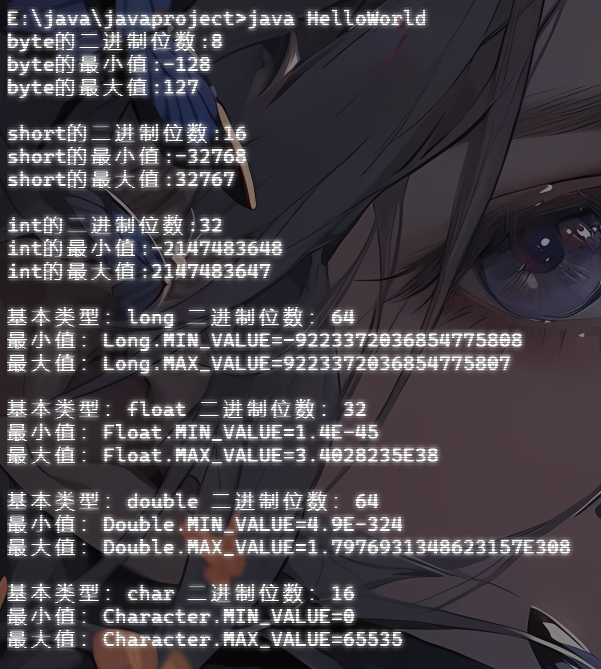

这个代码纯属是为了练练手才一个个打出来的，学编程还是建议多动手哈

特别说明一下啊关于这些数据类型的默认值(也就是当我们并没有给这些数据类型的变量进行赋值的时候的默认值)

- `int`, `short`, `long`, `byte` 的默认值是0。
- `char` 的默认值是 `\u0000`（空字符）。
- `float` 的默认值是 `0.0f`。
- `double` 的默认值是 `0.0d`。
- `boolean` 的默认值是 `false`。
- 引用类型（类、接口、数组）的默认值是 `null`。

说起这个数据类型我们不得不聊到存储的地址，基本数据类型的变量都是直接存储在栈中的，而引用数据类型的变量则分为两个区域，引用(指向堆的地址)存储在栈中，通过访问变量名称读取栈中的地址，进而我们去访问存储的数据

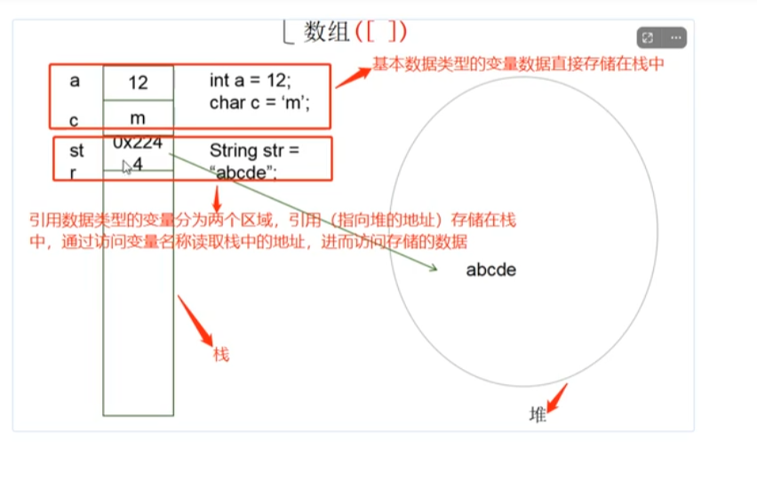

## 数据类型的转化

类型转换主要分为两种：**自动类型转换（隐式转换）和强制类型转换（显式转换）**。

- 自动类型转换

小转大

当将一种较小范围的基本数据类型赋值给较大范围的基本数据类型时，Java 会自动进行转换

```java
byte->short,char—> int —> long—> float —> double 
```

说白了就是大的数据类型的范围可以容纳小的数据类型的所有范围

但是这里的话是没有boolean的，boolean是不能进行转换的

那我们怎么从大的数据类型转化成小的数据类型呢?这就是我们的强制类型转换了

- 强制类型转换

格式:

```
(type)value
```

type就是需要转换的数据类型了，例如从浮点数强制转化成整数，(int)131.4=131,但是要注意我们的值不能超过小类型的范围

### String转化成char

```
System.out.println(gender.charAt(0));
```

### 基本数据类型转化成String

语法：基本类型+ ""即可

```
int n1 = 1;
String s1 = n1 + "";
System.out.println(s1);
//1
```

### String转化成基本数据类型

语法：

```
通过基本类型的包装类调用parsexxx方法进行转化，例如Integer.parseInt()
```

```JAVA
//String转化成基本数据类型的方法
public class StringToBasic {
    public static void main(String[] args) {
        //String -> int
        String s1 = "123";
        int n1 = Integer.parseInt(s1);
        System.out.println(n1);

        //String -> double
        String s2 = "123.456";
        double n2 = Double.parseDouble(s2);
        System.out.println(n2);

        /*
        . 
        . 
        . 
        */
    }
}
```

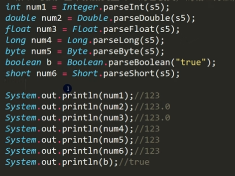

## java变量

变量的概念：

- 内存中的一个存储区域，该区域有自己的名称(变量名)和类型(数据类型)
- 和其他语言一样，变量需要先声明后使用
- Java是强类型语言，每个变量在声明的时候必须声明数据类型
- 变量只能作用在作用域内(最近的一对花括号中)

声明变量的格式

最好变量名是能清晰体现其用途的，比如我的名字的变量就是myName，用小写字母开头，后面的单词首字母大写

```java
static int a;
修饰符+数据类型+变量名
```

声明变量后再给变量赋值，但是也是可以直接对变量进行定义初始化的，格式如下：

```
数据类型 变量名 = 初始值(如果没有的话就是null)
```

变量的分类(按声明的位置分)

- 局部变量

在方法、构造函数或代码块中声明的变量，只能在该特定方法、构造函数或代码块内访问。(方法中声明的变量)

- 类变量(静态变量)

使用 `static` 关键字声明的变量，属于类本身，而不是任何特定的实例。所有对象共享同一个类变量(应该就是类似于define常量)

1. 由于静态变量是与类相关的，因此可以通过类名来访问静态变量，也可以通过实例名来访问静态变量。
2. 常量和静态变量的区别，常量在编译时就已经确定了它的值，而静态变量的值可以在运行时改变。

- 成员变量

在类中声明，但不在方法内的变量，属于类的实例。每个对象都有自己的一份实例变量。(在类中的成员属性)

1. 当一个对象被实例化之后，每个成员变量的值就跟着确定。
2. 成员变量在对象创建的时候创建，在对象被销毁的时候销毁

这个直接理解成php中的对象和类里面的成员变量就可以了

然后我在教程中还发现了一种变量类型

- 参数变量

参数是方法或构造函数声明中的变量，用于接收调用该方法或构造函数时传递的值，参数变量的作用域只限于方法内部。(说白了就是函数的形参嘛)

前面几个比较好理解，最后一个参数变量我们来稍微讲一下

参数变量的值传递方式有两种：**值传递**和**引用传递**。

可以看成是c语言中的函数引用，值传递就是正常的传值，从形参到实参，实参可以是具体的值也可以是一个内存地址，值传递的特点是实参不会变，而引用传递的特点是实参也会改变。下面我会写一个具体的实例去进行讲解

```java
public class HelloWorld{
    public String name="wanth3f1ag";//成员变量
    public static void change(int x ,int y){//参数变量
        int a = x;//局部变量
        int b = y;
        int c = a;
        a = b;
        b = c;
    }
    public static void main(String[] args){
        int a= 20,b=10;
        change(a,b);
        System.out.println("a= " + a + "b= " + b);
    }
}
//a= 20b= 10
```

## java运算符

- 算术运算符

| 操作符 | 描述       |        例子        |
| :----- | :--------- | :----------------: |
| +      | 相加       |   A + B 等于 30    |
| -      | 相减       |   A – B 等于 -10   |
| *      | 相乘       |    A * B等于200    |
| /      | 相除       |     B / A等于2     |
| ％     | 相除后取模 |      B%A等于0      |
| ++     | 自增       | B++ 或 ++B 等于 21 |
| --     | 自减       | B-- 或 --B 等于 19 |
| +      | 字符串拼接 | "He"+"llo"="Hello" |

- 关系运算符

| 运算符 |                             描述                             |       例子       |
| :----: | :----------------------------------------------------------: | :--------------: |
|   ==   |     检查如果两个操作数的值是否相等，如果相等则条件为真。     | （1 == 0）为假。 |
|   !=   |   检查如果两个操作数的值是否相等，如果值不相等则条件为真。   | (1 != 0) 为真。  |
|   >    |  检查左操作数的值是否大于右操作数的值，如果是那么条件为真。  |  （0> 1）为假。  |
|   <    |  检查左操作数的值是否小于右操作数的值，如果是那么条件为真。  | （0 < 1）为真。  |
|   >=   | 检查左操作数的值是否大于或等于右操作数的值，如果是那么条件为真。 | （1> = 0）为假。 |
|   <=   | 检查左操作数的值是否小于或等于右操作数的值，如果是那么条件为真。 | （0 <= 1）为真。 |

- 位运算符

| **＆**  |          **如果相对应位都是1，则结果为1，否则为0**           | **（A＆B），得到12，即0000 1100**  |
| :-----: | :----------------------------------------------------------: | :--------------------------------: |
| **\|**  |         **如果相对应位都是 0，则结果为 0，否则为 1**         | **（A \| B）得到61，即 0011 1101** |
|  **^**  |          **如果相对应位值相同，则结果为0，否则为1**          | **（A ^ B）得到49，即 0011 0001**  |
| **〜**  |   **按位取反运算符翻转操作数的每一位，即0变成1，1变成0。**   |  **（〜A）得到-61，即1100 0011**   |
| **<<**  |   **按位左移运算符。左操作数按位左移右操作数指定的位数。**   |  **A << 2得到240，即 1111 0000**   |
| **>>**  |   **按位右移运算符。左操作数按位右移右操作数指定的位数。**   |      **A >> 2得到15即 1111**       |
| **>>>** | **按位右移补零操作符。左操作数的值按右操作数指定的位数右移，移动得到的空位以零填充。** |     **A>>>2得到15即0000 1111**     |

- 逻辑运算符

| 操作符 |                             描述                             |       例子       |
| :----: | :----------------------------------------------------------: | :--------------: |
|   &    |          称为逻辑与运算符。无论真假都会执行右边运算          | 0<1&x=6结果是x=6 |
|   \|   | 称为逻辑或操作符。如果任何两个操作数任何一个为真，条件为真。 | （1 \| 0）为真。 |
|   !    | 称为逻辑非运算符。用来反转操作数的逻辑状态。如果条件为true，则逻辑非运算符将得到false。 |     !0为真。     |
|   &&   |       AND(短路)当且仅当两个操作数都为真，条件才为真。        |     一真为假     |
|  \|\|  |                           OR(短路)                           |     一真为真     |
|   ^    |                             异或                             |    (1^1)为假     |

&和&&的区别:

- 单&时，左边无论真假，右边都会执行
- 双&时，如果左边为真则执行右边运算，如果为假则不执行
- 和"\|\|"的区别同理，双\|时左边为真右边则不执行

异或("^")"和("\|")不同的是,对御^而言，左右结果为true时，结果为false

- 赋值运算符

| =       | 简单的赋值运算符，将右操作数的值赋给左侧操作数               | C = A + B将把A + B得到的值赋给C          |
| ------- | ------------------------------------------------------------ | ---------------------------------------- |
| + =     | 加和赋值操作符，它把左操作数和右操作数相加赋值给左操作数     | C + = A等价于C = C + A                   |
| - =     | 减和赋值操作符，它把左操作数和右操作数相减赋值给左操作数     | C - = A等价于C = C - A                   |
| * =     | 乘和赋值操作符，它把左操作数和右操作数相乘赋值给左操作数     | C * = A等价于C = C * A                   |
| / =     | 除和赋值操作符，它把左操作数和右操作数相除赋值给左操作数     | C / = A，C 与 A 同类型时等价于 C = C / A |
| （％）= | 取模和赋值操作符，它把左操作数和右操作数取模后赋值给左操作数 | C％= A等价于C = C％A                     |
| << =    | 左移位赋值运算符                                             | C << = 2等价于C = C << 2                 |
| >> =    | 右移位赋值运算符                                             | C >> = 2等价于C = C >> 2                 |
| ＆=     | 按位与赋值运算符                                             | C＆= 2等价于C = C＆2                     |
| ^ =     | 按位异或赋值操作符                                           | C ^ = 2等价于C = C ^ 2                   |
| \| =    | 按位或赋值操作符                                             | C \| = 2等价于C = C \| 2                 |

**值得注意的是，在我们的变量为一个对象的时候，关系运算符比较的是两个变量的地址而不是字符串**

其他运算符:三目运算符

格式

```
布尔表达式?执行语句1:执行语句2
```

若表达式为真则执行语句1，为假则执行语句2

## java键盘输出和输入语句

### 输出语句

在前面的时候就已经介绍过了，我们通常会用`System.out.println()`来向屏幕输出一些内容，但是println是print line的缩写，表示输出并换行，如果不需要换行的话可以用`System.out.print()`

- 格式化输出

| 占位符 | 说明                             |
| ------ | -------------------------------- |
| %d     | 格式化输出整数                   |
| %x     | 格式化输出十六进制整数           |
| %f     | 格式化输出浮点数                 |
| %e     | 格式化输出科学计数法表示的浮点数 |
| %s     | 格式化字符串                     |

C语言里面介绍过，这里就不必多说

### 输入语句

我们可以通过 Scanner 类来获取用户的输入，具体步骤如下

```
1.导入该类所在的包 java.util.*或java.util.Scanner
2.创建该类对象Scanner scanner = new Scanner(System.in)
3.调用里面的功能scanner.next()
```

创建`Scanner`对象并传入`System.in`。`System.out`代表标准输出流，而`System.in`代表标准输入流。

#### 使用next()方法

在处理输入的时候我们需要使用Scanner中的方法，例如next


这里的完整令牌就是字符串，这意味着他只会读取一个字符串，我们先正常演示一下

```java
//如何进行键盘输入
//1.导入Scanner所在的包
import java.util.Scanner;

public class Input {
    public static void main(String[] args) {
        //2.new创建一个实例化对象
        Scanner input = new Scanner(System.in);
        //3.接收用户的输入 需要使用相关的方法
        System.out.println("请输入你的名字");
        String name = input.next();
        System.out.println("你的名字是: " + name);
    }
}
/*
请输入你的名字
wanth3f1ag
你的名字是: wanth3f1ag
*/
```

另外还能根据需要赋值的变量的类型去决定输入的内容被标记为什么类型

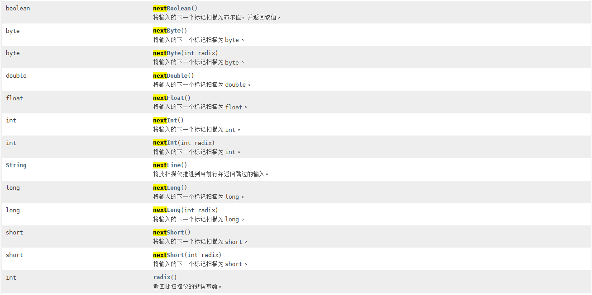

实例操作一下

```java
//如何进行键盘输入
//1.导入Scanner所在的包
import java.util.Scanner;

public class Input {
    public static void main(String[] args) {
        //2.创建一个实例化对象
        Scanner input = new Scanner(System.in);
        
        //3.接收用户的输入 需要使用相关的方法
        //使用next方法标记输入的类型为字符串
        System.out.println("请输入你的名字");
        String name = input.next();
        
        //使用nextint方法标记输入的类型为整型
        System.out.println("请输入你的年龄");
        int age = input.nextInt();
        
        //使用nextdouble方法标记输入的类型为双精度浮点型
        System.out.println("请输入你的身高");
        double heigh = input.nextDouble();
        
        System.out.println("你的身高是: " + heigh);
        System.out.println("你的年龄是: " + age);
        System.out.println("你的名字是: " + name);
    }
}
```

#### 使用nextline()方法

```
//如何进行键盘输入
//1.导入Scanner所在的包
import java.util.Scanner;

public class Input {
    public static void main(String[] args) {
        //2.创建一个实例化对象
        Scanner input = new Scanner(System.in);
        //3.接收用户的输入 需要使用相关的方法
        //使用next方法标记输入的类型为字符串
        System.out.println("请输入你的名字");
        String name = input.nextLine();
        //使用nextint方法标记输入的类型为整型
//        System.out.println("请输入你的年龄");
//        int age = input.nextInt();
//        //使用nextdouble方法标记输入的类型为双精度浮点型
//        System.out.println("请输入你的身高");
//        double heigh = input.nextDouble();
//        System.out.println("你的身高是: " + heigh);
//        System.out.println("你的年龄是: " + age);
        System.out.println("你的名字是: " + name);

    }
}
/*
请输入你的名字
asdhiawda jdsdjsd
你的名字是: asdhiawda jdsdjsd
*/
```

在读取前我们一般需要 使用 hasNext 与 hasNextLine 判断是否还有输入的数据，当然这个判断输入数据的也是有不同类型的

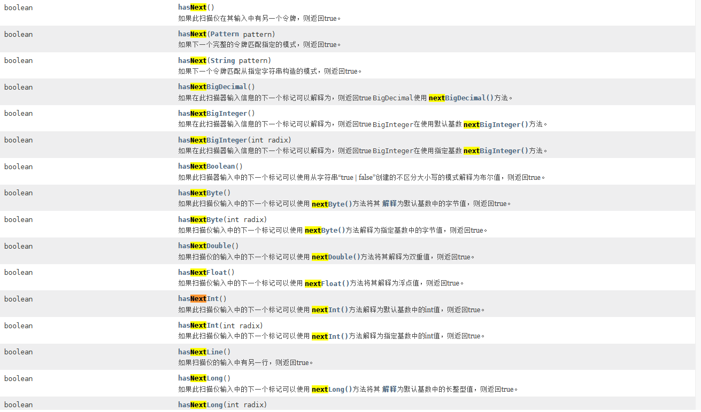

### next() 与 nextLine() 区别

next():

- 1、一定要读取到有效字符后才可以结束输入。
- 2、对输入有效字符之前遇到的空白，next() 方法会自动将其去掉。
- 3、只有输入有效字符后才将其后面输入的空白作为分隔符或者结束符。
- next() 不能得到带有空格的字符串。

nextLine()：

- 1、以Enter为结束符,也就是说 nextLine()方法返回的是输入回车之前的所有字符。
- 2、可以获得空白。

## java循环控制

分为三种：for循环，while循环，do...while循环

### for循环

```
for(变量初始化; 循环条件; 循环变量迭代) {
    //代码语句
}
```

开始循环前有初始化值，每次循环开始前都会进行循环条件的判断，true则进入循环，false则结束循环，每次循环结束都会执行更新语句

需要注意的是

1. 循环条件是可以返回布尔值的表达式
2. 变量初始化可以是多条初始化语句，但要求类型一致，语句之间逗号隔开
3. 循环变量迭代也是可以有多条语句的，并且迭代语句和初始化语句可以为空，但是分号不能少

### while循环

```
while( 循环条件 ) {
  //循环内容
}
```

如果循环的值为 true，则语句块一直执行，直到布尔表达式的值为 false。

### do...while循环

```
do {
       //代码语句
}while(布尔表达式);
```

和while循环语句一样，但是由于布尔表达式在循环体的后面，do...while循环语句在进行进入循环前都会先进行一次代码语句。如果布尔表达式的值为 true，则语句块一直执行，直到布尔表达式的值为 false。

## break关键字

主要在循环语句和控制语句中，可以跳出最里层的循环，并且继续执行该循环下面的语句。

## continue关键字

continue 适用于任何循环控制结构中。作用是让程序立刻跳转到下一次循环的迭代

在for语句中continue会直接结束当前循环进入下一循环而不是跳出循环

在 while 或者 do…while 循环中，continue会立即跳转到布尔表达式的判断语句。

## java分支控制

### if单分支语句

```
if(布尔表达式){
   //如果布尔表达式为true将执行的语句
}
```

如果布尔表达式的值为 true，则执行 if 语句中的代码块，否则不执行

举个例子

```java
//if单分支语句

import java.util.Scanner;

public class IF01 {
    public static void main(String[] args) {
        Scanner scanner = new Scanner(System.in);
        System.out.println("请输入你的年龄");
        int age = scanner.nextInt();//获取输入的年龄
        if(age >= 18) {
            System.out.println("你已经满18岁了");
        }
    }
}
```

### if...else双分支语句

```
if(布尔表达式){
   //如果布尔表达式的值为true
}else{
   //如果布尔表达式的值为false
}
```

如果布尔表达式的值为 true，则执行 if 语句中的代码块，否则执行 else 语句块后面的代码。

```java
//if单分支语句

import java.util.Scanner;

public class IF01 {
    public static void main(String[] args) {
        Scanner scanner = new Scanner(System.in);
        System.out.println("请输入你的年龄");
        int age = scanner.nextInt();//获取输入的年龄
        if(age >= 18) {
            System.out.println("你已经满18岁了");
        }else System.out.println("你还未满18岁");
    }
}
```

### if...else if...else 多分支语句

```
if(布尔表达式 1){
   //如果布尔表达式 1的值为true执行代码
}else if(布尔表达式 2){
   //如果布尔表达式 2的值为true执行代码
}else if(布尔表达式 3){
   //如果布尔表达式 3的值为true执行代码
}else {
   //如果以上布尔表达式都不为true执行代码
}
```

一个if语句只能有一个else语句，else语句都会在末尾，在所有的 else if 语句之后。一个if语句可以有若干个else if语句。一旦其中一个 else if 语句检测为 true，其他的 else if 以及 else 语句都将跳过执行。

### 嵌套的 if…else 语句

```
if(布尔表达式 1){
   ////如果布尔表达式 1的值为true执行代码
   if(布尔表达式 2){
      ////如果布尔表达式 2的值为true执行代码
   }
}
```

当然也可以向上面一样嵌套if ..else if语句

```
if(布尔表达式 1){
   ////如果布尔表达式 1的值为true执行代码
   if(布尔表达式 1){
   //如果布尔表达式 1的值为true执行代码
		}else if(布尔表达式 2){
   //如果布尔表达式 2的值为true执行代码
		}else if(布尔表达式 3){
   //如果布尔表达式 3的值为true执行代码
		}else {
   //如果以上布尔表达式都不为true执行代码
		}
}
```

### switch case语句

switch case 语句判断一个变量与一系列值中某个值是否相等，每个值称为一个分支。

```
switch(表达式){
    case 常量1 :
       //语句 1
       break; //可选
    case 常量2 :
       //语句2
       break; //可选
    //你可以有任意数量的case语句
    default : //可选
       //语句
}
```

在这个语句中需要注意几个细节

1. 表达式数据类型应该和case后的常量类型一致，或者是可以自动转化为可以相互比较的类型，例如表达式的数据类型是字符，而case后的常量是int
2. switch中的表达式的返回值必须是`(byte,short,int,char,enum,String)`
3. case子语句中的值必须是常量或常量表达式而不能是变量
4. 变量的值与 case 语句的值相等时，那么 case 语句之后的语句开始执行，直到 break 语句出现才会跳出 switch 语句。
5. 当遇到 break 语句时，switch 语句终止。程序跳转到 switch 语句后面的语句执行。case 语句不必须要包含 break 语句。如果没有 break 语句出现，程序会继续执行下一条 case 语句，直到出现 break 语句。

关于java的那些结构语句的话其实和c语言差不多，我就不赘述了

## java数组

数组简单来说就是相同类型的数的一个集合

- 先声明数组变量

```
dataType[] arrayRefVar;   // 首选的方法
或
dataType arrayRefVar[];  // 效果相同，但不是首选方法
```

java中声明数组时候不能指定数组长度，例如int class[40]；这样是错误的

数组属于引用类型，数组型数据是对象，数组中每个元素相当于该对象的成员变量，所以数组在使用前需要先创建

- 再创建数组

```
arrayRefVar = new dataType[arraySize];
```

注意:`数组需要声明长度并且长度不可变`

当然，我们声明数组和创建数组可以一起完成

```
dataType[] arrayRefVar = new dataType[arraySize];
or
dataType[] arrayRefVar = {value0, value1, ..., valuek};
```

- 数组的引用

数组的元素是通过索引访问的。数组索引从 0 开始，所以索引值从 0 到 数组名.length-1。

数组的下标可以是整形常量也可以是表达式，但是切记需要在数组长度的取值范围内去引用，不然会导致出错

**可以用length属性去获取数组的长度**，例如class.length可以指向class数组的长度

- 数组初始化


和我们基本数据类型的初始值是一样的

- `int`, `short`, `long`, `byte` 的默认值是0。
- `char` 的默认值是 `\u0000`（空字符）。
- `float` 的默认值是 `0.0f`。
- `double` 的默认值是 `0.0d`。
- `boolean` 的默认值是 `false`。
- 引用类型（类、接口、数组）的默认值是 `null`。

我们定义什么类型的数组，数组的初始化值就是什么样的

接下来我们写个一维数组感受一下

```java
public class HelloWorld{
    public static void main(String[] args) {
        //String[] students;//数组的声明1
        String students[];//数组的声明2
        students = new String[5];//数组的创建方法1
        //String[] students = new String[5]//数组的声明和创建方法1
        //String[] students = {"John","Jane"}//数组的声明和创建方法2
        students[0] = "John";
        students[1] = "Mary";
        students[2] = "Jane";
        students[3] = "Bob";
        students[4] = "Alice";
        for (int i = 0; i < students.length; i++) {
            System.out.println(students[i]);
        }
    }
}
```

打印出的结果就是各个元素的名字

通常我们在处理数组或者引用数组的时候都会搭配循环去进行使用，例如对数组的数据进行赋值，以及操作数组等

```java
import java.util.Scanner;

//输入数组的数据
public class Array01{
    public static void main(String[] args) {
        int[] arr1 = new int[10];
        Scanner scanner = new Scanner(System.in);
        for(int i = 0; i < arr1.length; i++){
            arr1[i] = scanner.nextInt();
            System.out.println(arr1[i]);
        }
    }
}
```

### 数组赋值机制

Java 中的参数传递机制是 **按值传递（Pass by Value）**，但对于对象（包括数组）来说，传递的是对象的引用（即内存地址）的副本

### 值传递和引用传递的区别

基本数据类型的传递方式为值传递，即两个数之间不会互相影响

```java
public class Test01{
    public static void main(String[] args){
    	int n1 = 10;
    	int n2 = n1;
    
    	n2 = 80;
    	System.out.println("n1 = " + n1);
    	System.out.println("n2 = " + n2);
    }
}
//n1 = 10
//n2 = 80
```

数组在默认情况下是引用传递

```java
public class Array01 {
    public static void main(String[] args) {
        int[] arr1 = {1,2,3};
        int[] arr2 = arr1;//arr2指向arr1的地址
        arr2[0] = 10;

        System.out.println(arr1[0]);
    }
}
//10
```

在 Java 中，数组是一个对象。即使数组存储的是基本数据类型（如 `int[]`），数组本身也是一个对象。因此，数组的传递遵循对象的传递规则。

# 面向对象OOP

对象和类的基础知识

- **对象**：对象是类的一个实例，有状态和行为。
- **类**：**类是一种数据类型**，它描述一类对象的行为和状态。
- **方法**：方法就是行为，一个类可以有很多方法。逻辑运算、数据修改以及所有动作都是在方法中完成的。
- **变量**：变量就是状态，一个类可以有很多变量。类的状态都是由变量去决定的
- **实例变量**：每个对象都有独特的实例变量，对象的状态由这些实例变量的值决定。

比如，我们类可以看成是一类动物，行为和状态就指的是动物的一些特点，而对象就可以具体到哪些动物，拿一条狗来举例，它的状态有：名字、品种、颜色，行为有：叫、摇尾巴和跑。这些行为和状态就是可以看成是一个个实例变量和方法，而具体的名字等等就是变量的值，具体的行为就是方法了。在java中状态可以看成是成员属性(变量)，而行为就是方法

因为之前学过php，所以对这些的理解的话其实大致上是一样的。

那我们如何定义一个类并且获得一个实例呢？

举个例子

```java
//定义一个猫类Cat
class Cat{
    //定义猫的名字，年龄，毛色
    String name;
    int age;
    String color;
}
```

在这里我们定义了一个Cat猫的类，其中有猫的名字，年龄，毛色等属性变量（因为是在Object01.java类中另外定义的猫类，所以这里不需要加上修饰符），然后假如我们这里有一只小花猫叫小花，年龄是3岁，毛色为花色，我们如何获得这个猫的实例呢？

> [!IMPORTANT]
>
> 一个Java源文件可以包含多个类的定义，但只能定义一个public类，且public类名必须与文件名一致。如果要定义多个public类，必须拆到多个Java源文件中。

## 访问实例变量和方法

我们需要记得的是，类是一种引用数据类型，跟基本数据类型的使用是一样的

```java
/* 实例化对象 */
类名 对象名 = new 类名();
/* 访问类中的变量 */
对象名.实例属性;
/* 访问类中的方法 */
对象名.类方法();
```

完整的代码

```java
//类和对象学习01

//利用OOP思想定义猫类和实例对象
public class Object01 {

    public static void main(String[] args) {
        //实例化一只猫并赋值给cat1

        Cat cat1 = new Cat();
        cat1.name = "小白";
        cat1.age = 3;
        cat1.color = "花色";

        //输出猫的信息
        System.out.println("小猫的名字是: " + cat1.name + "\n"
                + "小猫的年龄是: " + cat1.age + "\n"
                + "小猫的毛色是: " + cat1.color);
    }
}

//定义一个猫类Cat
class Cat{
    //定义猫的名字，年龄，毛色
    String name;
    int age;
    String color;
}

```

所以我们可以看出：

- 类是抽象的，概念的，代表的是一类事物，也就是说类跟`int`，`double`一样，是自定义的引用数据类型
- 而对象是具体的，实际的，例如`int a = 200`这个变量a是具体的，他有具体的数据类型和值：整型200
- 简单来说类就是对象的模板，而对象则是类的一个实际个体

## 定义方法

定义方法的语法是

```java
修饰符 方法返回类型 方法名(参数列表){
    方法执行语句;
    return方法返回值;(可选)
}
```

方法返回值通过`return`语句实现，如果没有返回值，返回类型设置为`void`，可以省略`return`。

### this变量

在方法内部可以用一个隐含的变量this，它指向的是当前的实例，例如this.field表示访问当前实例的字段

但是如果没有变量命名的冲突的话就没必要使用this

```java
class Person{
    private String name;
    public void setName(String name){
        this.name = name;//因为这里有一个同名变量name，所以需要用this.name表示当前实例的name字段
    }
}
```

## 构造方法

在创建类的实例化对象的时候我们通常需要初始化该对象的字段，这时候就需要用到构造方法了

关于构造方法的特点，**构造方法名就是类名，并且构造方法的参数是无限制的，但是构造方法是没有返回值的**

- 默认构造方法

其实任意一个类都是有构造方法的，如果我们自身在构造类的时候没有给他编写一个构造方法的话，java编译器会自动为我们生成一个默认的空构造方法，大致是这样的

```java
class Person{
    public Person(){
        
    }
}
```

但是需要主意的是，如果我们自身编写了一个构造方法的话，编译器就不会自动创建一个默认的构造方法了

例如以下情况就是报错的

```java
// 构造方法
public class Main {
    public static void main(String[] args) {
        Person p = new Person(); // 编译错误:找不到这个构造方法
    }
}

class Person {
    private String name;
    private int age;

    public Person(String name, int age) {
        this.name = name;
        this.age = age;
    }
    
}

```

这里的话因为我们本身定义了一个构造方法，该构造方法是需要传入参数的，而我们的new Person是无参构造函数，所以这里会报错

如果既要能使用带参数的构造方法，又想保留不带参数的构造方法，那么只能把两个构造方法都定义出来

```java
// 构造方法
public class Main {
    public static void main(String[] args) {
        Person p1 = new Person("Xiao Ming", 15); // 既可以调用带参数的构造方法
        Person p2 = new Person(); // 也可以调用无参数构造方法
    }
}

class Person {
    private String name;
    private int age;

    public Person() {
    }

    public Person(String name, int age) {
        this.name = name;
        this.age = age;
    }
}

```

- 多个构造方法

当一个类有多个构造方法，我们尝试用new去调用的时候，编译器会通过构造方法的参数数量、未知和类型去进行自动的一个区分和选择

举个例子

```java
class Person {
    private String name;
    private int age;

    public Person(String name, int age) {
        this.name = name;
        this.age = age;
    }

    public Person(String name) {
        this.name = name;
        this.age = 20;
    }

    public Person() {
    }
}

```

如果调用`new Person("Xiao Ming", 20);`，会自动匹配到构造方法`public Person(String, int)`。

如果调用`new Person("Xiao Ming");`，会自动匹配到构造方法`public Person(String)`。

如果调用`new Person();`，会自动匹配到构造方法`public Person()`。

当然一个构造方法中可以调用其他的构造方法

具体语法就是this(参数列表)
```java
public Person(String name){
    this(name,18)
}
public Person(String name,int age){
    this.name = name;
    this.age = age;
}
```

## 方法重载

一个类中可以有多个同名方法，这种方法名相同但是参数不同的就叫做方法重载（Overload），而重载方法返回值类型应该相同。

## extends继承

这个可以类似于寄生的过程，在 Java 中，一个类可以由其他类派生。如果你要创建一个类，而且已经存在一个类具有你所需要的属性或方法，那么你可以将新创建的类继承该类。

利用继承的方法，可以重用已存在类的方法和属性，而不用重写这些代码。被继承的类称为超类（super class）或者父类、基类，派生类称为子类（sub class）。

子类自动获得了父类的所有字段，并且严禁定义与父类重名的字段

> [!IMPORTANT]
>
> 需要主意的是，Java只允许一个class继承自一个类并且一个类有且仅有一个类，如果一个类没有明确写明继承什么类的话，他都是继承于object，object是一个特殊的类，他没有继承任何的父类

继承有个特点，就是子类无法访问父类的`private`字段或者`private`方法。但是protected修饰的字段和方法可以被子类所访问。因此，`protected`关键字可以把字段和方法的访问权限控制在继承树内部

举个例子

```java
class Person{
    protected String name;
    protected int age;
}
class Son extends Person{
    public String getName(){
        return "Hello, " + name;
    }
}
```

### super关键字

super关键字通常用于表示当前子类继承的父类（超类），例如用super.field可以访问父类的字段

其实通常情况下使用`super.name`，或者`this.name`，或者`name`，效果都是一样的。编译器会自动定位到父类的`name`字段。

但是在某些情况下就必须用到super了

```java
class Student extends Person {
    protected int score;

    public Student(String name, int age, int score) {
        super(); // 自动调用父类的构造方法
        this.score = score;
    }
}
```

在任何class的构造方法中，第一行语句必须是调用父类的构造方法，所以我们需要加上super()去调用父类的构造方法

## 多态

### Override覆写

在继承关系中如果子类定义了一个跟父类方法签名完全一样的方法，就需要用到Override覆写

Override和Overload不同的是，如果方法签名不同，就是Overload，Overload方法是一个新方法；如果方法签名相同，并且返回值也相同，就是`Override`。

但是需要注意的是，方法名相同，方法参数相同，但方法返回值不同，也是不同的方法。

例如我们举个例子

```java
class Person{
    public void run(){...}
}
class Son extends Person{
    public void run(String s){...}
    public int run(){...}
}
```

在son中的这两种方法都不是Override，第一个run的方法参数和父类的不相同，第二个run的方法返回值类型和父类的不同。

另外可以直接加上@Override去检查是否是覆写，不是的话编译器会报错

那什么是多态呢？

多态就是同一个对象的行为（方法调用）在不同的运行时类型下表现出不同的形式。

举个例子就能明白了

```java
public class Main{
    public static void main(String[] args){
        Person p = new Son();	//关注点1
        p.run();//关注点2
    }
}
class Person{
    public void run() {
        System.out.println("Person.run");
    }
}
class Son extends Person{
    @Override
    public void run(){
        System.out.println("Son run");
    }
}
```

在关注点1中可以看到，此时我们实例化了一个p对象，该对象是一个实际类型为Son，但引用类型为Person的对象，那么实际上这里调用的run方法是Son的run方法

由此我们可以得出：

**父类引用指向子类对象，调用方法时会执行子类的实现。**Java的实例方法调用是基于运行时的实际类型的动态调用，而非变量的声明类型。

但是实现多态的话需要满足下面三个点：

- **继承**（类与类之间有继承关系 / 接口实现）
- **方法重写（Override）**（子类重新实现父类的方法）
- **父类引用指向子类对象**

```java
父类类型 变量名 = new 子类类型();
```

### 覆写Object

在Object中有几个重要的方法：

- `toString()`：把instance输出为`String`；
- `equals()`：判断两个instance是否逻辑相等；
- `hashCode()`：计算一个instance的哈希值。

因此当我们需要重新定义这几个方法的时候需要用到Override

### final关键字

如果一个父类不允许子类对他的某个方法进行覆写的话，可以用final关键字标记该方法，用`final`标记的方法不能被Override

```java
class Person {
    protected String name;
    public final String hello() {
        return "Hello, " + name;
    }
}

class Student extends Person {
    @Override
    public String hello() {
    }
}
```

这里的话会报错

如果一个类不希望其他类继承他的话，也可以用final去标记这个类，用`final`修饰的类不能被继承

```java
final class Person{
}
class Son extends Person{}
```

这里是报错的

如果一个类的字段不希望在初始化后被修改的话，可以用final去标记这个字段，用`final`修饰的字段不能被修改

```java
class Person{
    public final String name = "wanth3f1ag";
}
Person p = new Person();
p.name = "bao";
```

最后的赋值操作会报错

但是在构造方法中可以初始化final修饰的字段

```java
publc class Person{
    public final String name;
    public Person(String name){
        this.name = name;
    }
}
```

但是一样的，在实例化对象之后final修饰的字段就没法被修改了

总结一下

`final`修饰符有多种作用：

- `final`修饰的方法可以阻止被覆写；
- `final`修饰的class可以阻止被继承；
- `final`修饰的field必须在创建对象时初始化，随后不可修改。

### abstract抽象

在Java中，abstract是一个关键字，用来定义抽象类和抽象方法，作用是让类和方法只定义其规范而不提供完整实现，必须由子类去实现

对于抽象类

- 用abstract修饰的抽象类不能通过new去实例化
- 因为抽象类本身被设计成只能用于被继承，因此，抽象类可以强迫子类实现其定义的抽象方法，否则编译会报错。

对于抽象方法：

- 一个类中存在抽象方法的话，这个类也必须用abstract去修饰

## 接口与接入接口

如果一个抽象类中的方法都是抽象方法的话，就可以用inferface去修饰他，也就是声明为一个接口。

接口简单来说就是一个抽象类型，是抽象方法的集合，通常以interface来声明。一个类通过实现继承接口的方式去继承接口的抽象方法。

但是接口和类不同的是，类是用于描述对象的属性和方法，而接口则是包含类要实现的方法，但是接口不提供这些方法的具体实现，无法被实例化。

接口的几个特点

- 接口不能被实例化成对象
- 接口的方法都是抽象方法
- 接口中每个方法都是隐式抽象的，会被隐式的指定为public abstract，非抽象方法可以定义default方法
- 接口中可以含有变量，但是接口中的变量会被隐式的指定为 **public static final** 变量

- 定义接口

```
[修饰符] interface [接口名称] {
	//声明变量
	//抽象方法
}
```

当一个具体的`class`去实现一个`interface`时，需要使用`implements`关键字。

```java
class Son implements Person
```

一个类只能继承于另一个类，但是一个类可以实现多个`interface`

一个interface继承自另一个interface，需要用extends去修饰

```java
interface Hello{}
interface Person extends Hello{}
```

## static静态字段和静态方法

### 静态字段

静态字段和实例字段不同的地方在于，实例字段仅属于该实例，而静态字段是所有实例共享的，

举个简单的例子

```java
class Person{
    public String name;
    public int age;
    public static int number;
    
    public Person(String name, int age){
        this.name = name;
        this.age = age;
    }
}
public class Main{
    public static void main(String[] args){
        Person bao = new Person("bao",20);
        Person meng = new Person("meng",21);
        bao.number = 111;
        System.out.println(bao.number + "和" + meng.number);
        meng.number = 222;
        System.out.println(bao.number + "和" + meng.number);
    }
}
//111和111
//222和222
```

由上面可以看出，对于静态字段，他并不属于某个特定的实例，当我们修改某个实例的静态字段时，其他实例的该静态字段都将被修改

因此，不推荐用`实例变量.静态字段`去访问静态字段，因为在Java程序中，实例对象并没有静态字段。在代码中，实例对象能访问静态字段只是因为编译器可以根据实例类型自动转换为`类名.静态字段`来访问静态对象。

### 静态方法

静态方法和实例方法不同的是，调用实例方法必须要有一个实例对象，而调用静态方法则不需要实例对象，通过`类名.静态方法()`就可以调用

## package包

在java中往往会有很多同名类，这时候就需要用package去解决同名类的名字冲突

搬运师傅的解释：

小明的`Person`类存放在包`ming`下面，因此，完整类名是`ming.Person`；

小红的`Person`类存放在包`hong`下面，因此，完整类名是`hong.Person`；

小军的`Arrays`类存放在包`mr.jun`下面，因此，完整类名是`mr.jun.Arrays`；

JDK的`Arrays`类存放在包`java.util`下面，因此，完整类名是`java.util.Arrays`。

因此在定义`class`的时候，我们需要在第一行声明这个`class`属于哪个包。

### 包作用域

位于一个包的不同类之间是可以相互访问包作用域的字段和方法的，不用`public`、`protected`、`private`修饰的字段和方法就是包作用域。

### import 导入包

如果在一个class中我们需要用到别的包的class的话，可以有以下几种方法

- 完整类名调用，假设有一个Name类位于org.example中

```java
package test;

public class Person{
    public void run(){
        org.example.Name name = new org.example.Name();
    }
}
```

- import导入类所属包

```java
package test;
import org.example.Name;

public class Person{
    public void run(){
        Name name = new Name();
    }
}
```

- 直接导入包中所有类

```java
package test;
import org.example.*;

public class Person{
    public void run(){
        Name name = new Name();
    }
}
```

- `import static`导入类的静态字段和静态方法

```java
package test;
import static java.lang.System.*;

public class Person{
    public void run(){
        out.println("Hello world!");
    }
}
```

## 内部类

Java的内部类可分为Inner Class、Anonymous Class和Static Nested Class三种

### inner内部类

一个类定义在另一个类的内部，这种类就是inner内部类

inner内部类和普通类最大的区别在于，内部类的实例必须依附于外层类的实例

例如

```java
public class Main{
    public static void main(String[] args){
        Outer outer = new Outer();//实例化外层类
        Outer.Inner inner = outer.new Inner()//实例化内部类
    }
}
```

### Anonymous 匿名类

**匿名类** 是 Java 中的一种 **没有名字的内部类**。

具体语法

```java
new 父类/接口(参数...) {
    // 方法重写 / 新的实现
};

```

### static静态内部类

最后一种和Inner Class类似，但是使用`static`修饰，称为静态内部类

## 内存中对象存在的形式

因为类和数组一样都是引用类型，所以他们都是指向栈中的一个地址，而当我们实例化一个对象的上会，JVM会在堆中为对象分配一块连续的内存空间。但是需要注意的是，如果实例属性是基本数据类型，则会直接存放在堆中，如果不是基本数据类型，则会在堆中存放常量池中对应的地址，在常量池中存放数据，例如字符串

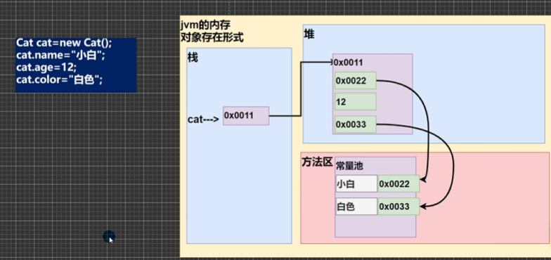

# Java核心类和方法

## String操作字符串

### equals()方法

用于比较两个字符串的内容是否相同

```java
    public boolean equals(Object anObject) {
        if (this == anObject) {
            return true;
        }
        if (anObject instanceof String) {
            String anotherString = (String)anObject;
            int n = value.length;
            if (n == anotherString.value.length) {
                char v1[] = value;
                char v2[] = anotherString.value;
                int i = 0;
                while (n-- != 0) {
                    if (v1[i] != v2[i])
                        return false;
                    i++;
                }
                return true;
            }
        }
        return false;
    }
```

返回值是布尔类型

```java
String s1 = "hello";
String s2 = "hello";
System.out.println(s1.equals(s2));
//true
```

要忽略大小写比较，使用`equalsIgnoreCase()`方法。

### contains()方法

用于搜索某字符串中是否包含子串

```java
    public boolean contains(CharSequence s) {
        return indexOf(s.toString()) > -1;
    }
```

返回值是布尔类型

```java
System.out.println("Hello".contains("H"));
//true
```

需要注意该方法的参数是CharSequence而不是String

其他搜索子串的函数

- indexOf()——检查某个字串在字符串中首次出现的位置
- lastIndexOf()——检查某个字串在字符串中最后出现的位置
- startsWith()——检查字符串是否是以某个字串开始的
- endsWith()——检查字符串是否是以某个字串结尾的

### substring()方法

用于从字符串中提取需要的字符串

```java
    public String substring(int beginIndex, int endIndex) {
        if (beginIndex < 0) {
            throw new StringIndexOutOfBoundsException(beginIndex);
        }
        if (endIndex > value.length) {
            throw new StringIndexOutOfBoundsException(endIndex);
        }
        int subLen = endIndex - beginIndex;
        if (subLen < 0) {
            throw new StringIndexOutOfBoundsException(subLen);
        }
        return ((beginIndex == 0) && (endIndex == value.length)) ? this
                : new String(value, beginIndex, subLen);
    }
```

第一个参数是开始的字符索引号，第二个参数是结尾的字符索引号

```java
"Hello".substring(2); // "llo"
"Hello".substring(2, 4); //"ll"
```

### trim()方法

用于移除字符串结尾的空白字符，空白字符包括空格，`\t`，`\r`，`\n`等

```java
    public String trim() {
        int len = value.length;
        int st = 0;
        char[] val = value;    /* avoid getfield opcode */

        while ((st < len) && (val[st] <= ' ')) {
            st++;
        }
        while ((st < len) && (val[len - 1] <= ' ')) {
            len--;
        }
        return ((st > 0) || (len < value.length)) ? substring(st, len) : this;
    }
```

需要注意的是，这里的话会返回一个新的字符串，而不是改变原来的字符串，所以我们需要将这个函数的返回值赋值给一个新的String

另一个`strip()`方法也可以移除字符串首尾空白字符。它和`trim()`不同的是，类似中文的空格字符`\u3000`也会被移除

### replace()方法

用于在字符串中替换特定的字串

```java
    public String replace(char oldChar, char newChar) {
        if (oldChar != newChar) {
            int len = value.length;
            int i = -1;
            char[] val = value; /* avoid getfield opcode */

            while (++i < len) {
                if (val[i] == oldChar) {
                    break;
                }
            }
            if (i < len) {
                char buf[] = new char[len];
                for (int j = 0; j < i; j++) {
                    buf[j] = val[j];
                }
                while (i < len) {
                    char c = val[i];
                    buf[i] = (c == oldChar) ? newChar : c;
                    i++;
                }
                return new String(buf, true);
            }
        }
        return this;
    }
```

第一个参数是需要替换的字符或字符串，第二个是替换后的字符或字符串

### split()方法

用于根据某个字符去分割选定的字符串

```java
    public String[] split(String regex, int limit) {
        /* fastpath if the regex is a
         (1)one-char String and this character is not one of the
            RegEx's meta characters ".$|()[{^?*+\\", or
         (2)two-char String and the first char is the backslash and
            the second is not the ascii digit or ascii letter.
         */
        char ch = 0;
        if (((regex.value.length == 1 &&
             ".$|()[{^?*+\\".indexOf(ch = regex.charAt(0)) == -1) ||
             (regex.length() == 2 &&
              regex.charAt(0) == '\\' &&
              (((ch = regex.charAt(1))-'0')|('9'-ch)) < 0 &&
              ((ch-'a')|('z'-ch)) < 0 &&
              ((ch-'A')|('Z'-ch)) < 0)) &&
            (ch < Character.MIN_HIGH_SURROGATE ||
             ch > Character.MAX_LOW_SURROGATE))
        {
            int off = 0;
            int next = 0;
            boolean limited = limit > 0;
            ArrayList<String> list = new ArrayList<>();
            while ((next = indexOf(ch, off)) != -1) {
                if (!limited || list.size() < limit - 1) {
                    list.add(substring(off, next));
                    off = next + 1;
                } else {    // last one
                    //assert (list.size() == limit - 1);
                    list.add(substring(off, value.length));
                    off = value.length;
                    break;
                }
            }
            // If no match was found, return this
            if (off == 0)
                return new String[]{this};

            // Add remaining segment
            if (!limited || list.size() < limit)
                list.add(substring(off, value.length));

            // Construct result
            int resultSize = list.size();
            if (limit == 0) {
                while (resultSize > 0 && list.get(resultSize - 1).isEmpty()) {
                    resultSize--;
                }
            }
            String[] result = new String[resultSize];
            return list.subList(0, resultSize).toArray(result);
        }
        return Pattern.compile(regex).split(this, limit);
    }
```

第一个参数可以是一个正则表达式也可以是一个字符，第二个参数是切割结果的个数限制，返回值是一个String字符串数组

```java
"a,b,c".split(",")   // 按逗号切分 → ["a", "b", "c"]
"a.b.c".split(".")   // ❌ 错误，因为 "." 在正则里表示“任意字符”
"a.b.c".split("\\.") // ✅ 正确，要转义，表示字面上的点 → ["a", "b", "c"]
    
"a,b,c,d".split(",", 2) 
// 结果: ["a", "b,c,d"]
```

### join()方法

用于用指定的字符去拼接字符串数组

```java
    public static String join(CharSequence delimiter, CharSequence... elements) {
        Objects.requireNonNull(delimiter);
        Objects.requireNonNull(elements);
        // Number of elements not likely worth Arrays.stream overhead.
        StringJoiner joiner = new StringJoiner(delimiter);
        for (CharSequence cs: elements) {
            joiner.add(cs);
        }
        return joiner.toString();
    }
```

第一个参数是用于拼接字符串数组的分隔符，第二个是需要拼接的多个元素

可以看到最后会用toString将数组转化成字符串并返回

方法还有很多，不过可以总结出一个结论就是我们可以根据想要了解的方法的定义去分析这个方法的作用是什么，根据返回值去确定我们需要用什么类型的变量去接收他


# 异常处理

在我们编写和运行程序的时候往往都有可能会出现各种各样的错误，而一个健壮的java程序需要能处理各种各样的错误，异常处理并不是能让出错消失，而是以一种更合适和方便的方式去处理我们在运行时出现的异常

Java规定：

- 必须捕获的异常，包括`Exception`及其子类，但不包括`RuntimeException`及其子类，这种类型的异常称为Checked Exception。
- 不需要捕获的异常，包括`Error`及其子类，`RuntimeException`及其子类。

## 捕获异常

通常使用`try...catch`语句，把可以产生异常的代码放入try语句中，然后用catch去捕获对应的`Exception`及其子类：

我们举个例子

```java
package org.example;
import java.io.UnsupportedEncodingException;
import java.util.Arrays;

public class Main {
    public static void main(String[] args) {
        byte[] bs = toGBK("中文");
        System.out.println(Arrays.toString(bs));
    }

    static byte[] toGBK(String s) {
        try {
            // 用指定编码转换String为byte[]:
            return s.getBytes("GBK");
        } catch (UnsupportedEncodingException e) {
            // 如果系统不支持GBK编码，会捕获到UnsupportedEncodingException:
            System.out.println(e); // 打印异常信息
            return s.getBytes(); // 尝试使用默认编码
        }
    }
}
```

如果我们不进行异常处理的话

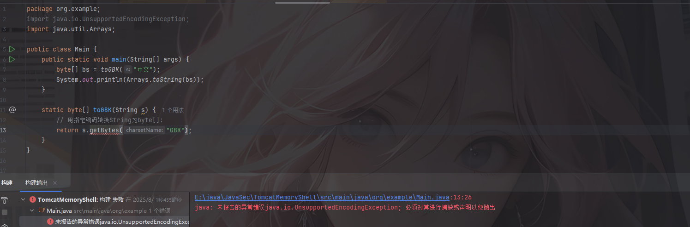

就会出现报错信息导致编译失败

捕获异常的语句可以用多个catch

```java
try{
    a();
    b();
    c();
}catch(IOException e){
    
}catch(NumberFormatException e){
    
}
```


# JavaEE

参考文章：https://liaoxuefeng.com/books/java/web/basic/index.html

## Web基础

Web开发通常是指开发服务器端的Web应用程序。

今天我们访问网站，使用App时，都是基于Web这种Browser/Server模式，简称B/S架构，用户只需要一个浏览器（Browser）作为客户端，通过网络访问服务器（Server）上的应用程序。应用程序的逻辑和数据都存储在服务器端。浏览器只需要请求服务器，获取Web页面，并把Web页面展示给用户即可。

### B/S架构的基本原理

1. 用户在浏览器输入网址或点击网站链接跳转
2. 浏览器通过HTTP/HTTPS协议向服务器发送请求
3. 服务器接收请求后处理业务逻辑，生成结果并返回HTML/JSON/文件流等格式的数据给浏览器
4. 浏览器渲染解析后呈现页面给用户

这个的话其实不陌生了，我们尝试用java去实现一个HTTP Server吧，一个HTTP Server本质上是一个TCP服务器

### 编写HTTP Server

我们先写一个服务器的启动类Server

```java
public class Server {
    public static void main(String[] args) throws IOException {
        // 1. 创建一个 ServerSocket，绑定到 8080 端口
        ServerSocket serverSocket = new ServerSocket(8080);
        System.out.println("----------server is listening on port 8080----------");

        // 2. 循环等待客户端连接
        while (true) {
            // accept() 会阻塞，直到有客户端连接上来
            Socket socket = serverSocket.accept();
            System.out.println("----------client connected----------");

            // 3. 为每个连接创建一个线程来单独处理
            Thread t = new Handler(socket);
            t.start();
        }
    }
}

```

这里的话先是监听8080端口，之后循环等待客户端连接，连接后分线程去处理请求和响应

还需要写一个Handler类，里面包含了具体的请求和响应的处理逻辑

```java
class Handler extends Thread{
    Socket socket;

    public Handler(Socket socket) {
        this.socket = socket;
    }

    public void start() {
        //获取到从客户端发送过来的数据的输入流。
        try{
            InputStream inputStream = this.socket.getInputStream();
            OutputStream outputStream = this.socket.getOutputStream();
            handle(inputStream,outputStream);
        }catch (Exception e){
        }finally {
            try{
                this.socket.close();
            }catch (IOException e){
            }
            System.out.println("----------client disconnected----------");
        }
    }
    private void handle(InputStream inputStream, OutputStream outputStream) throws IOException {    //取客户端发送的数据，并向客户端发送响应
        System.out.println("----------Process new http request----------");

        //定义一个Reader读取请求，一个Writer发送响应
        BufferedReader reader = new BufferedReader(new InputStreamReader(inputStream, StandardCharsets.UTF_8));
        BufferedWriter writer = new BufferedWriter(new OutputStreamWriter(outputStream, StandardCharsets.UTF_8));

        //读取http请求
        boolean requestIsOk = false;
        String requestLine = reader.readLine();
        if (requestLine.startsWith("GET / HTTP/")) {
            requestIsOk = true;
        }
        while(true){
            String header = reader.readLine();
            if (header.isEmpty()){  //当读取到空的时候，请求头读取完毕
                break;
            }
            System.out.println(header); //打印请求头内容
        }
        System.out.println(requestIsOk ? "Response OK" : "Response Error");
        if (requestIsOk){
            //发送成功响应
            String repdata = "<html><body><h1>Hello, world!</h1></body></html>";
            int length = repdata.getBytes(StandardCharsets.UTF_8).length;
            writer.write("HTTP/1.0 200 OK\r\n");
            writer.write("Connection: close\r\n");
            writer.write("Content-Type: text/html\r\n");
            writer.write("Content-Length: " + length + "\r\n");
            writer.write("\r\n");// 空行标识Header和Body的分隔
            writer.write(repdata);
            writer.flush();
        }else {
            //发送错误响应
            writer.write("HTTP/1.0 404 Not Found\r\n");
            writer.write("Content-Length: 0\r\n");
            writer.write("\r\n");
            writer.flush();
        }
    }
}
```

这个类主要是先读取http请求，这里只处理GET /的请求，通过读取空行判断是否读取完毕，读取完毕后发送响应。发送响应的话也是分为成功响应和错误响应，先是逐个发送响应头，最后再将响应头body发送出去

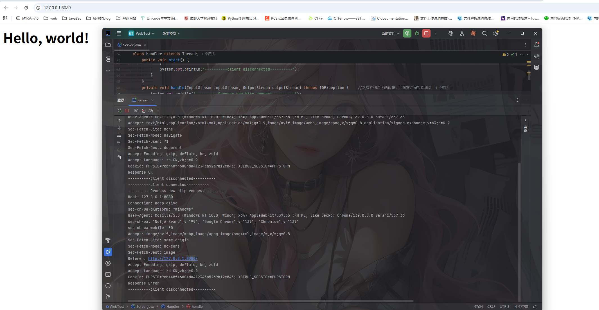

### 关于HTTP的版本

HTTP`0.9`是最早的实验版本，只支持GET请求，并且没有请求头和状态码，服务器返回的只有纯文本内容，该版本早已被淘汰。

HTTP`1.0`是早期版本，加入了请求头、响应头已经状态码等信息，并支持POST请求方式，响应内容也不局限于文本，也可以是图片视频以及html文本等。但是浏览器每个请求都要新建一次 TCP 连接，响应完就关闭，效率低。

HTTP`1.1`是目前使用最广泛的版本，主要优点是一个持久连接，HTTP 1.1允许浏览器和服务器在同一个TCP连接上反复发送、接收多个HTTP请求和响应，这样就大大提高了传输效率。但是缺点是一个慢请求会阻塞后续所有请求。

HTTP `2.0`可以支持浏览器同时发出多个请求，但每个请求需要唯一标识，服务器可以不按请求的顺序返回多个响应，由浏览器自己把收到的响应和请求对应起来。可见，HTTP 2.0进一步提高了传输效率，因为浏览器发出一个请求后，不必等待响应，就可以继续发下一个请求。

## Maven基础

我觉得学习maven还是蛮重要的，因为大部分的java web应用都是用maven去构建的

什么是maven？

**Maven** 是一个 **项目管理和构建工具**，主要是用来进行依赖管理、项目构建和项目规范化的

### 项目结构

一个用Maven管理的常规Java项目的目录结构默认是这样的：

```
a-maven-project
├── pom.xml
├── src
│   ├── main
│   │   ├── java
│   │   └── resources
│   └── test
│       ├── java
│       └── resources
└── target
```

这些目录的配置功能是什么呢？

```java
src/main/java       # 存放源代码的目录
src/main/resources  # 存放资源文件的目录
src/test/java       # 存放单元测试代码的目录
src/test/resources	# 存放测试资源的目录
target/             # 编译、打包输出目录
pom.xml				# 项目描述文件
```

在Maven中有一个很重要的文件，就是pom.xml文件，该文件是用于依赖管理的，只要在该文件中声明依赖：

```xml
  <dependencies>
    <dependency>
      <groupId>jakarta.servlet</groupId>
      <artifactId>jakarta.servlet-api</artifactId>
      <version>5.0.0</version>
      <scope>provided</scope>
    </dependency>
  </dependencies>
```

Maven就会从中央仓库或公司私有仓库自动下载该依赖的JAR和它依赖的其他JAR包文件

- `groupId`类似于java的包名
- `artifactId`类似于java的包中类名

另外我们看一个属性

```xml
	<properties>
        <project.build.sourceEncoding>UTF-8</project.build.sourceEncoding>
		<maven.compiler.release>17</maven.compiler.release>
	</properties>
```

在properties标签中的常用属性有：

- `project.build.sourceEncoding`：表示项目源码的字符编码，通常应设定为`UTF-8`；
- `maven.compiler.release`：表示使用的JDK版本，例如`17`；
- `maven.compiler.source`：表示Java编译器读取的源码版本；
- `maven.compiler.target`：表示Java编译器编译的Class版本。

我们更加推荐于使用`maven.compiler.release`去设置，这样能保证输入源码和输出版本是一致的

### 依赖关系

在Maven中定义了几种依赖关系，也是我之前就有碰到由于这个依赖关系不明确导致的无法编译问题

| compile  |         编译时需要用到该jar包（默认）         | commons-logging |
| :------: | :-------------------------------------------: | :-------------: |
|   test   |           编译Test时需要用到该jar包           |      junit      |
| runtime  |        编译时不需要，但运行时需要用到         |      mysql      |
| provided | 编译时需要用到，但运行时由JDK或某个服务器提供 |   servlet-api   |

### 如何搜索组件

https://central.sonatype.com/ 直接搜索想要的组件，然后复制xml的语法内容放入pom.xml中就可以了

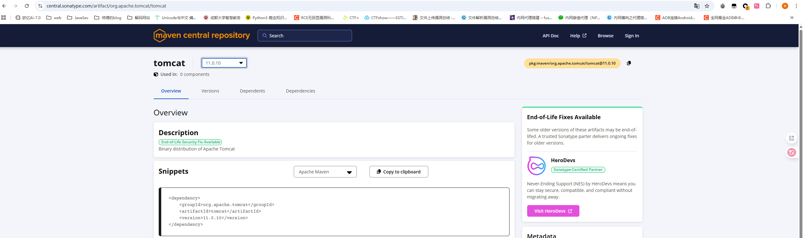

### 常用的命令

Maven的不同生命周期（比如 `clean`、`default`（编译、测试、打包）、`site`）有着不同的阶段和目标，以`default`为例

```java
validate
initialize
generate-sources
process-sources
generate-resources
process-resources
compile
process-classes
generate-test-sources
process-test-sources
generate-test-resources
process-test-resources
test-compile
process-test-classes
test
prepare-package
package
pre-integration-test
integration-test
post-integration-test
verify
install
deploy
```

然后我们常用的命令就是

```java
mvn [生命周期] [插件:目标]
mvn clean package	//清理 + 打包
mvn clean install 	//清理 + 编译 + 测试 + 打包 + 安装到本地仓库
```

## Servlet学习

### 什么是Servlet？

其实从上面的例子可以看出，如果我们要写一个完整的http服务器的话，需要进行很多复杂的工作，包括但不限于识别正确与否的http请求和请求头，如果我们需要输出一个html的页面的话代码量也是很多的，毕竟上面的那种处理方式很死板

因此我们应该用现成的Web服务器去进行处理和解析工作，所以我们只需要让自己的应用程序跑在Web服务器上，就能更方便的实现这一功能

目的，JavaEE提供了Servlet API，我们使用Servlet API编写自己的Servlet来处理HTTP请求，Web服务器实现Servlet API接口，实现底层功能

借一下师傅的图

```
                 ┌───────────┐
                 │My Servlet │
                 ├───────────┤
                 │Servlet API│
┌───────┐  HTTP  ├───────────┤
│Browser│◀──────▶│Web Server │
└───────┘        └───────────┘
```

从图中可以看出，当我们客户端向web服务器发起请求的时候，web服务器会对Servler的API接口进行解析，并由API选择正确的Servlet去处理请求

Servlet是Java Servlet的简称，是使用Java语言编写的运行在服务器端的程序。它是作为来自 HTTP 客户端的请求和 HTTP 服务器上的数据库或应用程序之间的中间层。它负责处理用户的请求，并根据请求生成相应的返回信息提供给用户。

现在问题来了：Servlet API是谁提供？

**Servlet API** 就是 **一组接口和类的集合**，定义了 Servlet 的标准行为，所以我们通常需要导入Servlet API依赖

### Servlet测试

接下来我们测试一下

先是创建一个maven项目

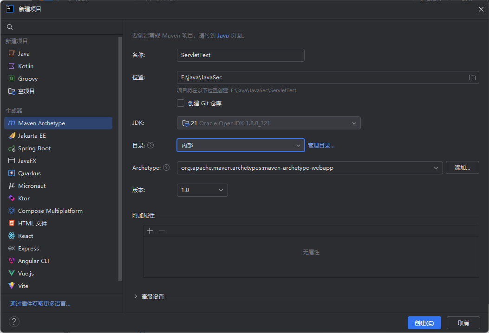

这里工件我们选择webapp，因为最终的要构建一个web项目

**Maven** 是一个 **项目管理和构建工具**，主要用于 **Java 项目**，Maven能很好的管理第三方java依赖，便于很好的编译、打包、测试和部署我们的java项目

创建好后编写pom.xml导入servlet依赖

```java
<project xmlns="http://maven.apache.org/POM/4.0.0" xmlns:xsi="http://www.w3.org/2001/XMLSchema-instance"
  xsi:schemaLocation="http://maven.apache.org/POM/4.0.0 http://maven.apache.org/maven-v4_0_0.xsd">
  <modelVersion>4.0.0</modelVersion>
  <groupId>org.example</groupId>
  <artifactId>ServletTest</artifactId>
  <packaging>war</packaging>
  <version>1.0-SNAPSHOT</version>
  <name>ServletTest Maven Webapp</name>
  <url>http://maven.apache.org</url>

  <properties>
    <maven.compiler.source>8</maven.compiler.source>
    <maven.compiler.target>8</maven.compiler.target>
    <project.build.sourceEncoding>UTF-8</project.build.sourceEncoding>
  </properties>
  <dependencies>
    <dependency>
      <groupId>jakarta.servlet</groupId>
      <artifactId>jakarta.servlet-api</artifactId>
      <version>5.0.0</version>
      <scope>provided</scope>
    </dependency>
  </dependencies>

  <build>
    <finalName>ServletTest</finalName>
  </build>
</project>

```

注意到`<scope>`指定为`provided`，表示编译时使用，但不会打包到`.war`文件中，因为运行期Web服务器本身已经提供了Servlet API相关的jar包。

然后我们实现一个简单的servlet

```java
package org.example;

import jakarta.servlet.ServletException;
import jakarta.servlet.annotation.WebServlet;
import jakarta.servlet.http.HttpServlet;
import jakarta.servlet.http.HttpServletRequest;
import jakarta.servlet.http.HttpServletResponse;

import java.io.IOException;
import java.io.PrintWriter;

@WebServlet(urlPatterns = "/hello")
public class HelloServlet extends HttpServlet {
    @Override
    protected void doGet(HttpServletRequest req, HttpServletResponse resp) throws ServletException, IOException {
        
        //设置响应类型
        resp.setContentType("text/html");
        //获取输出流
        PrintWriter out = resp.getWriter();
        //写入响应
        out.write("<h1>Hello World!</h1>");
        out.flush();
    }
}

```

一个Servlet总是继承自HttpServlet，然后通过覆写doGet()或者doPost()方法去实现我们自己定义的Servlet。

注意到`doGet()`方法传入了`HttpServletRequest`和`HttpServletResponse`两个对象，分别代表HTTP请求和响应。我们使用Servlet 

API时，并不直接与底层TCP交互，也不需要解析HTTP协议，因为`HttpServletRequest`和`HttpServletResponse`就已经封装好了请求

和响应，所以为我们的请求和响应提供了很大的便利。

### web服务器搭建

所以我们的maven整个工程结构如下：

```
ServletTest/
├── pom.xml
└── src/
    └── main/
        ├── java/
        │   └── org/
        │       └── example/
        │           └── HelloServlet.java
        ├── resources/
        └── webapp/
        	└── WEB-INF/
        	│	└── web.xml/
        	│
        	└── index.jsp/
```

因为我这里是直接配置的webapp工程的maven，所以已经自动生成了一个/WEB-INF/web.xml配置文件，但是在高版本的servlet已不再需要在配置文件中配置servlet了

此时我们构建一下maven项目

**运行Maven命令`mvn clean package`，在`target`目录下得到一个`ServletTest.war`文件，这个文件就是我们编译打包后的Web应用程序。**

然后我们需要运行我们的war文件，这时候就需要用到web服务器了

普通的Java程序是通过启动JVM，然后执行`main()`方法开始运行。但是Web应用程序有所不同，我们无法直接运行`war`文件，必须先启动Web服务器，再由Web服务器加载我们编写的`HelloServlet`，这样就可以让`HelloServlet`处理浏览器发送的请求。

所以我们需要找一个支持Servlet API的Web服务器，最常用的就是Tomcat了

先说一下文章中师傅的方法，再说在IDEA中的操作方法

要运行我们生成的war，我们先下载一个Tomcat服务器，然后把war文件放在Tomcat的webapps目录下，我这里选择的是Tomcat10，因为Tomcat10才能完整的支持servlet-api5

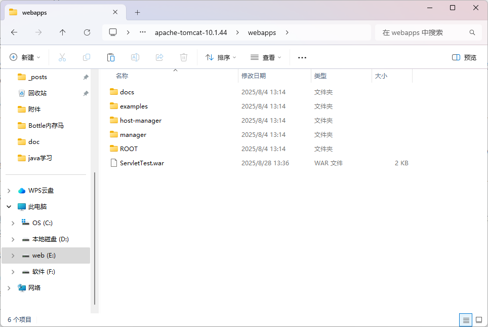

然后切换到`bin`目录，执行`startup.sh`或`startup.bat`启动Tomcat服务器

如果终端日志文件是乱码的话，我们需要找到Tomcat的`conf`目录下`logging.properties`文件，将其中的`java.util.logging.ConsoleHandler.encoding`值改成GBK

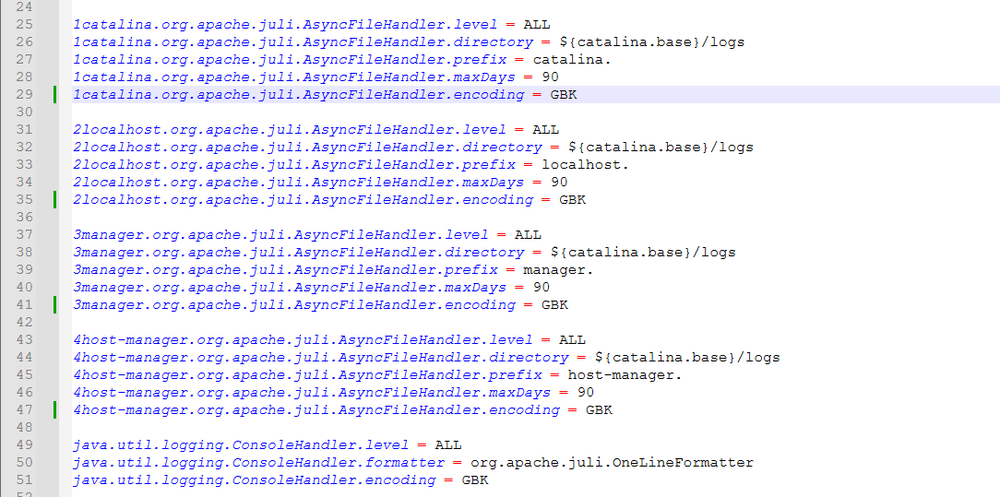

在浏览器输入`http://localhost:8080/ServletTest/hello`即可看到`HelloServlet`的输出

第一个ServletTest是因为一个Web服务器允许同时运行多个Web App，而我们的Web App叫`ServletTest`，后面的`/hello`就是我们注解中设置的映射路径。

实际上，启动Tomcat服务器实际上是启动Java虚拟机，执行Tomcat的`main()`方法，然后由Tomcat负责加载我们的`.war`文件，并创建一个`HelloServlet`实例，最后以多线程的模式来处理HTTP请求。

然后我们来说一下在IDEA中配置Tomcat服务器

我们在IDEA中配置一个Tomcat服务器

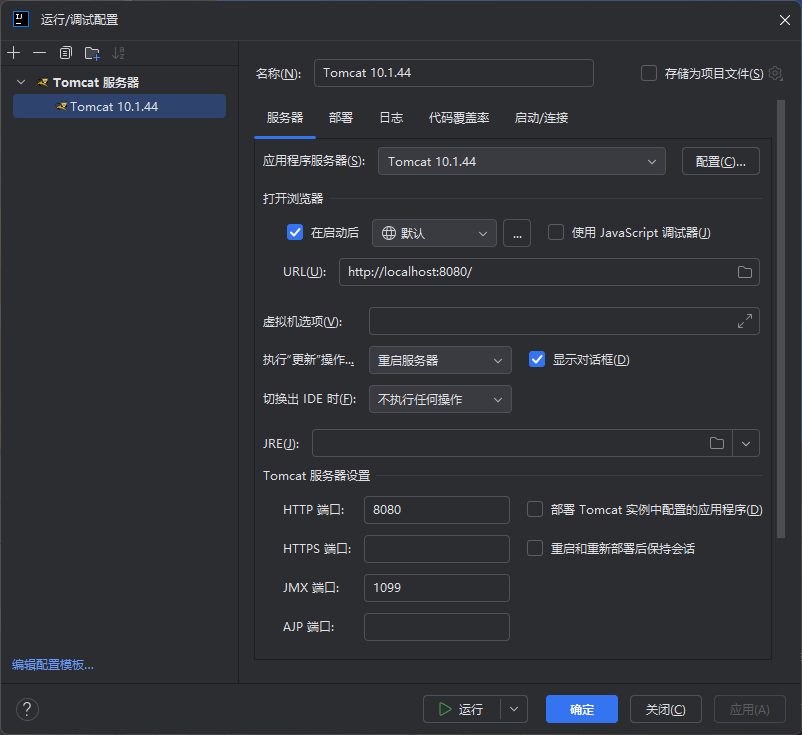

配置工件就是我们刚刚生成的war文件（这里记得配置一下JRE，我环境变量中的是jdk8，tomcat不支持，然后卡了好久，后面换成高版本jdk就好了

运行后访问http://localhost:8080/ServletTest/hello

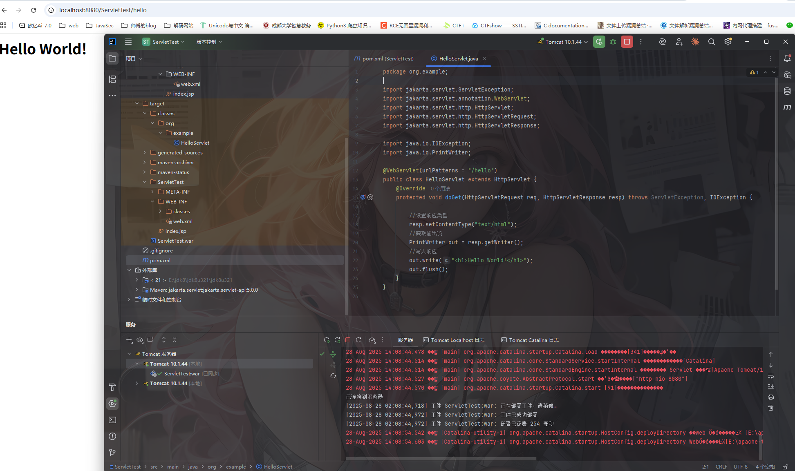

到此我们的web服务器搭建以及servlet测试就完成了

### Tomcat和Servlet API版本

由于Servlet版本分为<=4.0和>=5.0两种，所以，要根据使用的Servlet版本选择正确的Tomcat版本：

- 使用Servlet<=4.0时，选择Tomcat 9.x或更低版本；
- 使用Servlet>=5.0时，选择Tomcat 10.x或更高版本。

在4.0及之前的servlet-api的依赖项是`javax.servlet:javax.servlet-api`，而在5.0及之后的servlet-api的依赖项就变成了`jakarta.servlet:jakarta.servlet-api`。并且有些框架支持的servlet-api的版本也是有限制的，这个需要额外注意。

### 嵌入式Tomcat

所以从上面的项目中我们可以了解到，一个完整的Web应用程序的开发流程就是：

- 需要编写自定义的Servlet并打包为war文件
- 让Servlet容器例如Tomcat服务器去解析运行

一个Tomcat的启动流程：

- 启动JVM去指向Tomcat的main()方法
- main方法中会加载war文件并初始化成Servlet对象

所以启动一个Tomcat服务器其实也是正常的执行某个jar包中的main()方法，由此我们可以引出另一个很方便的启动Tomcat服务器的方法，那就是导入Tomcat的jar包并编写一个main()方法去加载我们的webapp，也就是嵌入式Tomcat。

新建一个maven项目并编写pom.xml

```xml
<?xml version="1.0" encoding="UTF-8"?>
<project xmlns="http://maven.apache.org/POM/4.0.0"
         xmlns:xsi="http://www.w3.org/2001/XMLSchema-instance"
         xsi:schemaLocation="http://maven.apache.org/POM/4.0.0 http://maven.apache.org/xsd/maven-4.0.0.xsd">
    <modelVersion>4.0.0</modelVersion>

    <groupId>org.example</groupId>
    <artifactId>ServletTest</artifactId>
    <version>1.0-SNAPSHOT</version>
    <packaging>war</packaging>

    <properties>
        <maven.compiler.source>8</maven.compiler.source>
        <maven.compiler.target>8</maven.compiler.target>
        <project.build.sourceEncoding>UTF-8</project.build.sourceEncoding>
    </properties>
    <dependencies>
        <dependency>
            <groupId>org.apache.tomcat.embed</groupId>
            <artifactId>tomcat-embed-core</artifactId>
            <version>9.0.108</version>
            <scope>provided</scope>
        </dependency>
        <dependency>
            <groupId>org.apache.tomcat.embed</groupId>
            <artifactId>tomcat-embed-jasper</artifactId>
            <version>9.0.108</version>
            <scope>provided</scope>
        </dependency>
    </dependencies>

</project>
```

其中，`<packaging>`类型仍然为`war`，引入依赖`tomcat-embed-core`和`tomcat-embed-jasper`，这里不必引入Servlet API，因为引入Tomcat依赖后自动引入了Servlet API。

然后我们写一个HelloServlet

```java
package org.example;


import javax.servlet.ServletException;
import javax.servlet.annotation.WebServlet;
import javax.servlet.http.HttpServlet;
import javax.servlet.http.HttpServletRequest;
import javax.servlet.http.HttpServletResponse;
import java.io.IOException;
import java.io.PrintWriter;

@WebServlet(urlPatterns = "/hello")
public class HelloServlet extends HttpServlet {
    @Override
    protected void doGet(HttpServletRequest req, HttpServletResponse resp) throws ServletException, IOException {

        //设置响应类型
        resp.setContentType("text/html");
        //获取输出流
        PrintWriter out = resp.getWriter();
        //写入响应
        out.write("<h1>Hello World!</h1>");
        out.flush();
    }
}
```

然后写一个Main类去加载我们的servlet

```java
package org.example;

import org.apache.catalina.Context;
import org.apache.catalina.WebResourceRoot;
import org.apache.catalina.startup.Tomcat;
import org.apache.catalina.webresources.DirResourceSet;
import org.apache.catalina.webresources.StandardRoot;

import java.io.File;

public class Main {
    public static void main(String[] args) throws Exception {
        // 启动Tomcat:
        Tomcat tomcat = new Tomcat();
        tomcat.setPort(Integer.getInteger("port", 8080));
        tomcat.getConnector();//Tomcat9+版本中需要调用这个方法
        // 创建webapp:
        Context ctx = tomcat.addWebapp("", new File("src/main/webapp").getAbsolutePath());//将 src/main/webapp 目录部署为 Web 应用，此处应用上下文是/
        WebResourceRoot resources = new StandardRoot(ctx);//创建 Web 应用资源根对象
        resources.addPreResources(
                new DirResourceSet(resources, "/WEB-INF/classes", new File("target/classes").getAbsolutePath(), "/"));//把本地目录 target/classes 映射到 /WEB-INF/classes
        ctx.setResources(resources);
        tomcat.start();//启动 Tomcat
        tomcat.getServer().await();//阻塞主线程，等待 HTTP 请求
    }
}
```

这里的话是嵌入式Tomcat的核心代码，先是部署web应用，设置Web 应用访问路径和Web应用指定的目录，随后配置Web应用的类和资源，将资源根绑定到 Web 应用上下文中。这样我们的嵌入式Tomcat就能加载项目编译后的class文件和jsp了。

配置好后直接运行main()方法，但是这里出现了一个报错

```java
E:\jdk8\jdk8u321\jdk8u321\bin\java.exe "-javaagent:E:\IDEA\IntelliJ IDEA 2025.1.1.1\lib\idea_rt.jar=33522" -Dfile.encoding=UTF-8 -classpath E:\jdk8\jdk8u321\jdk8u321\jre\lib\charsets.jar;E:\jdk8\jdk8u321\jdk8u321\jre\lib\deploy.jar;E:\jdk8\jdk8u321\jdk8u321\jre\lib\ext\access-bridge-64.jar;E:\jdk8\jdk8u321\jdk8u321\jre\lib\ext\cldrdata.jar;E:\jdk8\jdk8u321\jdk8u321\jre\lib\ext\dnsns.jar;E:\jdk8\jdk8u321\jdk8u321\jre\lib\ext\jaccess.jar;E:\jdk8\jdk8u321\jdk8u321\jre\lib\ext\jfxrt.jar;E:\jdk8\jdk8u321\jdk8u321\jre\lib\ext\localedata.jar;E:\jdk8\jdk8u321\jdk8u321\jre\lib\ext\nashorn.jar;E:\jdk8\jdk8u321\jdk8u321\jre\lib\ext\sunec.jar;E:\jdk8\jdk8u321\jdk8u321\jre\lib\ext\sunjce_provider.jar;E:\jdk8\jdk8u321\jdk8u321\jre\lib\ext\sunmscapi.jar;E:\jdk8\jdk8u321\jdk8u321\jre\lib\ext\sunpkcs11.jar;E:\jdk8\jdk8u321\jdk8u321\jre\lib\ext\zipfs.jar;E:\jdk8\jdk8u321\jdk8u321\jre\lib\javaws.jar;E:\jdk8\jdk8u321\jdk8u321\jre\lib\jce.jar;E:\jdk8\jdk8u321\jdk8u321\jre\lib\jfr.jar;E:\jdk8\jdk8u321\jdk8u321\jre\lib\jfxswt.jar;E:\jdk8\jdk8u321\jdk8u321\jre\lib\jsse.jar;E:\jdk8\jdk8u321\jdk8u321\jre\lib\management-agent.jar;E:\jdk8\jdk8u321\jdk8u321\jre\lib\plugin.jar;E:\jdk8\jdk8u321\jdk8u321\jre\lib\resources.jar;E:\jdk8\jdk8u321\jdk8u321\jre\lib\rt.jar;E:\java\JavaSec\ServletTest\target\classes org.example.Main
Error: A JNI error has occurred, please check your installation and try again
Exception in thread "main" java.lang.NoClassDefFoundError: org/apache/catalina/WebResourceRoot
	at java.lang.Class.getDeclaredMethods0(Native Method)
	at java.lang.Class.privateGetDeclaredMethods(Class.java:2701)
	at java.lang.Class.privateGetMethodRecursive(Class.java:3048)
	at java.lang.Class.getMethod0(Class.java:3018)
	at java.lang.Class.getMethod(Class.java:1784)
	at sun.launcher.LauncherHelper.validateMainClass(LauncherHelper.java:650)
	at sun.launcher.LauncherHelper.checkAndLoadMain(LauncherHelper.java:632)
Caused by: java.lang.ClassNotFoundException: org.apache.catalina.WebResourceRoot
	at java.net.URLClassLoader.findClass(URLClassLoader.java:387)
	at java.lang.ClassLoader.loadClass(ClassLoader.java:418)
	at sun.misc.Launcher$AppClassLoader.loadClass(Launcher.java:355)
	at java.lang.ClassLoader.loadClass(ClassLoader.java:351)
	... 7 more
```

意思是有一个类没找着，因为引入的Tomcat的scope为`provided`，在Idea下运行时，需要设置`Run/Debug Configurations`，选择`应用程序`，在修改选项中钩上`Include dependencies with "Provided" scope`，这样才能让Idea在运行时把Tomcat相关依赖包自动添加到classpath中。

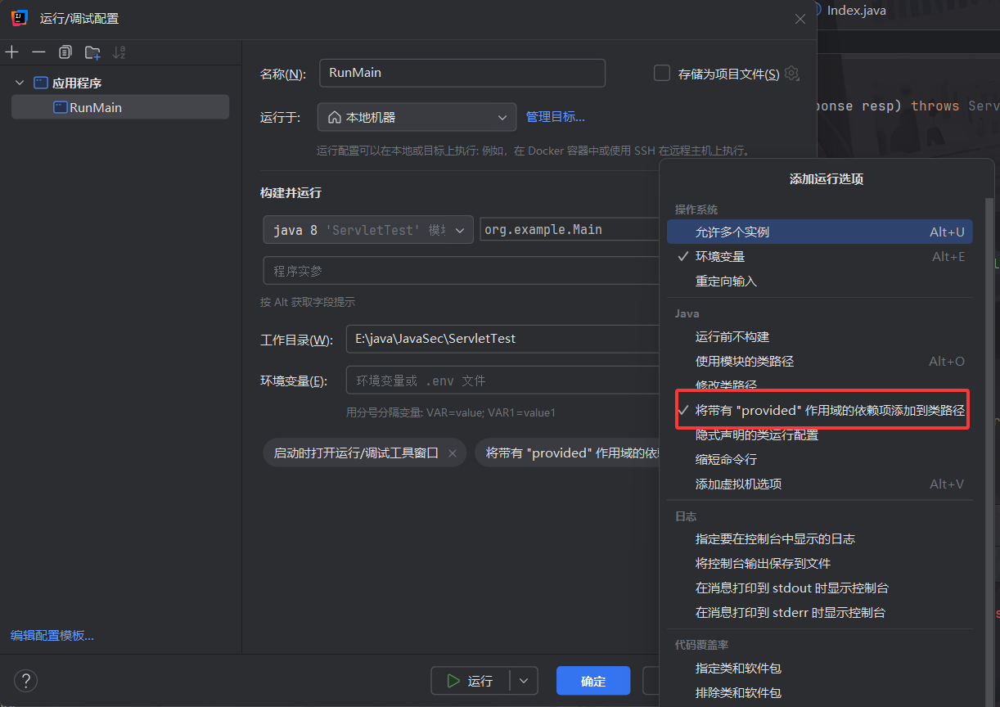

然后访问http://localhost:8080/hello就出现Hello World!了

所以这就是嵌入式Tomcat的过程

通过`main()`方法启动Tomcat服务器并加载我们自己的webapp的好处有：

- 无需配置Tomcat服务器以及下载Tomcat
- 方便调试，可以直接在IDEA中断点调试

## Servlet深入

一个Web App其实就是由很多个Servlet组成的，每个Servlet有自己单独的处理逻辑以及处理的路径

> [!IMPORTANT]
>
> 低版本的Servlet需要在web.xml中配置servlet，而高版本的Servlet可以通过注解的方式去配置servlet

上面的HelloServlet中的通过override覆写doGet方法去实现处理GET请求的，我们看看HttpServlet中doGet方法的逻辑

```java
    protected void doGet(HttpServletRequest req, HttpServletResponse resp) throws ServletException, IOException {
        String msg = lStrings.getString("http.method_get_not_supported");
        this.sendMethodNotAllowed(req, resp, msg);
    }
```

从这个函数中可以看到，这里会返回一个405响应，所以这也意味着，如果我们没有重新覆写doGet方法的话，当客户端发起doGet请求时，Servlet就会调用父类HttpServlet的doGet，也就是返回405错误

接下来我们可以思考一个问题，就是如果我们的Web App中写有多个Servlet的话，当客户端发送HTTP请求到服务器处理的过程是什么样的？

看看文章中师傅给的图

```
               ┌ ─ ─ ─ ─ ─ ─ ─ ─ ─ ─ ─ ─ ─ ─ ─ ─ ─ ─ ─ ┐

               │            /hello    ┌───────────────┐│
                          ┌──────────▶│ HelloServlet  │
               │          │           └───────────────┘│
┌───────┐    ┌──────────┐ │ /signin   ┌───────────────┐
│Browser│───▶│Dispatcher│─┼──────────▶│ SignInServlet ││
└───────┘    └──────────┘ │           └───────────────┘
               │          │ /         ┌───────────────┐│
                          └──────────▶│ IndexServlet  │
               │                      └───────────────┘│
                              Web Server
               └ ─ ─ ─ ─ ─ ─ ─ ─ ─ ─ ─ ─ ─ ─ ─ ─ ─ ─ ─ ┘
```

Dispatcher其实就是一个路径转发器，我们浏览器发送的HTTP请求首先会由Web服务器接收，然后根据Servlet配置的映射规则，将不同路径的请求转发到不同的Servlet去进行处理

这里映射到`/`的`IndexServlet`比较特殊，它实际上会接收所有未匹配的路径，相当于`/*`

接下来我们看看我们的两个对象HttpServletRequest和HttpServletResponse

### HttpServletRequest

HttpServletRequest对象封装了一个HTTP请求，我们通过HttpServletRequest提供的接口方法可以拿到所有的HTTP请求的信息，常用的方法有：

- getMethod()：返回请求方法，例如，`"GET"`，`"POST"`；
- getRequestURI()：返回请求路径，但不包括请求参数，例如，`"/hello"`；
- getQueryString()：返回请求参数，例如，`"name=Bob&a=1&b=2"`；
- getParameter(name)：返回请求参数，GET请求从URL读取参数，POST请求从Body中读取参数；
- getContentType()：获取请求Body的类型，例如，`"application/x-www-form-urlencoded"`；
- getContextPath()：获取当前Webapp挂载的路径，对于ROOT来说，总是返回空字符串`""`；
- getCookies()：返回请求携带的所有Cookie；
- getHeader(name)：获取指定的Header，对Header名称不区分大小写；
- getHeaderNames()：返回所有Header名称；
- getInputStream()：如果该请求带有HTTP Body，该方法将打开一个输入流用于读取Body；
- getReader()：和getInputStream()类似，但打开的是Reader；
- getRemoteAddr()：返回客户端的IP地址；
- getScheme()：返回协议类型，例如，`"http"`，`"https"`；

### HttpServletResponse

`HttpServletResponse`对象封装了一个HTTP响应。由于HTTP响应必须先发送header，再发送body；所有在操作HttpServletResponse对象的时候需要先调用设置header的方法，后调用设置body的方法

常用的设置header的方法有：

- setStatus(sc)：设置响应代码，默认是`200`；
- setContentType(type)：设置Body的类型，例如，`"text/html"`；
- setCharacterEncoding(charset)：设置字符编码，例如，`"UTF-8"`；
- setHeader(name, value)：设置一个Header的值；
- addCookie(cookie)：给响应添加一个Cookie；
- addHeader(name, value)：给响应添加一个Header，因为HTTP协议允许有多个相同的Header；

写入响应时，需要通过`getOutputStream()`获取写入流，或者通过`getWriter()`获取字符流，二者只能获取其中一个。

写入响应前，无需设置`setContentLength()`，因为底层服务器会根据写入的字节数自动设置，如果写入的数据量很小，实际上会先写入缓冲区，如果写入的数据量很大，服务器会自动采用Chunked编码让浏览器能识别数据结束符而不需要设置Content-Length头。

但是，写入完毕后调用`flush()`却是必须的，因为大部分Web服务器都基于HTTP/1.1协议，会复用TCP连接。如果没有调用`flush()`，将导致缓冲区的内容无法及时发送到客户端。此外，写入完毕后千万不要调用`close()`，原因同样是因为会复用TCP连接，如果关闭写入流，将关闭TCP连接，使得Web服务器无法复用此TCP连接。

### Redirect实现重定向

重定向有两种：一种是302响应，称为临时重定向，一种是301响应，称为永久重定向。两者的区别是：如果是301永久重定向的话，当发送请求后浏览器会缓存一对重定向路由的关联，下次再次发送请求就会直接对重定向路由发送请求了

举个例子

我们这里写一个会进行302重定向的路由

方法有两种

- sendRedirect

先看看一个重要的方法sendRedirect

```java
    void sendRedirect(String var1) throws IOException;
```

这里的话会接收一个字符串作为重定向的路由

然后写一个重定向的Servlet

```java
package org.example;

import javax.servlet.ServletException;
import javax.servlet.annotation.WebServlet;
import javax.servlet.http.HttpServlet;
import javax.servlet.http.HttpServletRequest;
import javax.servlet.http.HttpServletResponse;
import java.io.IOException;

@WebServlet(urlPatterns = "/RedirectUrl")
public class RedirectUrl extends HttpServlet {
    @Override
    protected void doGet(HttpServletRequest req, HttpServletResponse resp) throws ServletException, IOException {
        resp.sendRedirect("/hello");
    }
}

```

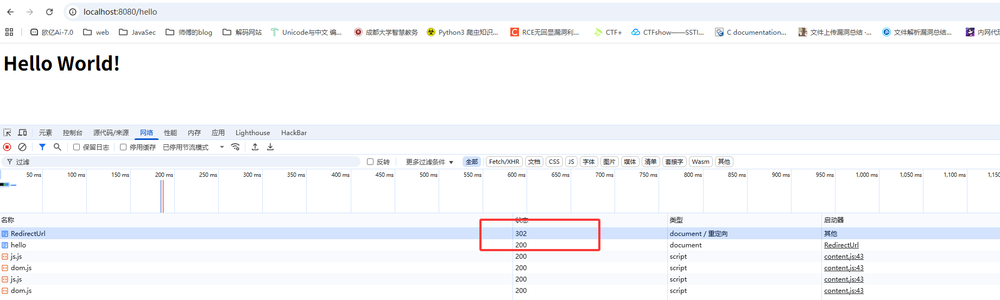

请求该路由后在NetWork中看到有两个请求，一个是302另一个是200

- 手动设置状态码和响应头

对于302临时重定向的话

```java
    resp.setStatus(HttpServletResponse.SC_FOUND); // 302
    resp.setHeader("Location", "/hello");
```

对于301永久重定向的话

```java
    resp.setStatus(HttpServletResponse.SC_MOVED_PERMANENTLY); // 301
    resp.setHeader("Location", "/hello");
```

### Forward内部转发

当一个Servlet处理请求的时候，Servlet可以将请求交给内部另一个Servlet处理，这种叫内部转发

把代码改一下

```java
req.getRequestDispatcher("/hello").forward(req, resp);
```

这里的意思就是把接收到的请求和响应交给/hello去负责处理和返回

转发和重定向的区别在于，转发是在Web服务器内部完成的，对浏览器来说，它只发出了一个HTTP请求

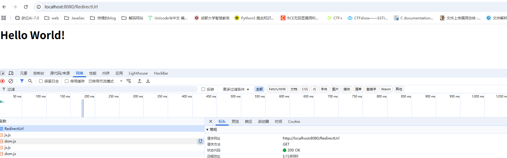

### Session与Cookie

在Web应用中，我们通常需要跟踪用户身份，当用户成功登录之后，如果他需要访问其他页面的话，Web应用是如何去识别不同的用户呢？这就会用到Session和Cookie了

因为HTTP协议是一种无状态协议，每个请求都是独立的。也就是说，Web应用无法去区分出两个HTTP请求是否是来源于一个客户端发出的。基于这种情况，我们可以给用户一个特定的身份ID，用户带着身份ID去访问Web应用的其他页面的时候，Web应用就能准确识别出用户了

#### Session

**Session（会话）** 就是存储在 **服务器端** 的用户会话信息，是服务器用来跟踪用户状态的一种机制。

当用户第一次访问服务器后，服务器会为用户自动生成一个Session ID并返回给用户，这个ID会通过Cookie或者URL返回给用户，用户带着这个Session ID去访问Web服务器的其他服务的时候服务器就能识别出该用户的身份。但是如果用户在一段时间内没有访问服务器，那么Session就会自动失效，这时候就需要重新分配新的ID。

在Servlet中有对Session功能的封装，我们这里写个例子去实现一下

先写一个登录页面，当用户成功登录之后就会将用户的名字放入`HttpSession`对象

```java
package org.example;

import javax.servlet.ServletException;
import javax.servlet.annotation.WebServlet;
import javax.servlet.http.HttpServlet;
import javax.servlet.http.HttpServletRequest;
import javax.servlet.http.HttpServletResponse;
import javax.servlet.http.HttpSession;
import java.io.IOException;
import java.io.PrintWriter;
import java.util.HashMap;
import java.util.Map;

@WebServlet(urlPatterns = "/signin")
public class Signin extends HttpServlet {
    //写一个简单的数据库
    private Map<String, String> users = new HashMap<String, String>() {{
        put("admin", "wanth3f1ag");
        put("test", "123");
    }};

    //GET请求时显示登录页面
    @Override
    protected void doGet(HttpServletRequest req, HttpServletResponse resp) throws ServletException, IOException {
        resp.setContentType("text/html");
        PrintWriter out = resp.getWriter();
        out.write("<h1>Sign In</h1>");
        out.write("<form action=\"/signin\" method=\"post\">");
        out.write("<p>Username: <input name=\"username\"></p>");
        out.write("<p>Password: <input name=\"password\" type=\"password\"></p>");
        out.write("<p><button type=\"submit\">Sign In</button> <a href=\"/\">Cancel</a></p>");
        out.write("</form>");
        out.flush();
    }

    //POST请求时处理用户登录
    @Override
    protected void doPost(HttpServletRequest req, HttpServletResponse resp) throws ServletException, IOException {
        String username = req.getParameter("username");
        String password = req.getParameter("password");
        String expectedPassword = users.get(username.toLowerCase());
        if (expectedPassword != null && expectedPassword.equals(password)) {
            //登录成功逻辑
            HttpSession session = req.getSession();
            session.setAttribute("user", username);
            resp.sendRedirect("/index");
        } else {
            resp.sendError(HttpServletResponse.SC_FORBIDDEN);
        }
    }
}

```

需要注意这行代码

```java
req.getSession().setAttribute("user", username);
```

Servlet 通过 `HttpServletRequest.getSession()` 来获取 Session 对象。在第一次调用getSession()的时候，服务器会自动创建一个新的Session。然后通过setAttribute()向 Session 中存一个 **键值对**，key是user，value是username

然后我们写一个`/index`路由的servlet逻辑，主要是用于从session中取出我们的用户名并返回到页面中

```java
@WebServlet(urlPatterns = "/index")
public class Index extends HttpServlet {
    @Override
    protected void doGet(HttpServletRequest req, HttpServletResponse resp) throws ServletException, IOException {
        //从HttpSession中获取当前用户名
        HttpSession session = req.getSession();
        String user = (String) session.getAttribute("user");
        resp.setContentType("text/html");
        resp.setCharacterEncoding("UTF-8");
        PrintWriter out = resp.getWriter();
        out.write("<h1> Welcome to the myTest, " + (user != null ? user : "Guest" ) + " </h1>");

        if (user == null) {

            //未登录，跳转登录页
            out.write("<h2>You haven't logged in yet</h2>");
            out.write("<p><a href=\\\"/signin\\\">Sign In</a></p>");
        }else {

            //已登录，可点击登出
            out.write("<h2>You have logged in</h2>");
            out.write("<p><a href=\\\"/signout\\\">Sign Out</a></p>");
        }
    }
}

```

如果用户已登录可以访问/signout登出，写一个登出的逻辑，就是从session中移除用户相关信息：

```java
@WebServlet(urlPatterns = "/signout")
public class Signout extends HttpServlet {
    
    @Override
    protected void doGet(HttpServletRequest req, HttpServletResponse resp) throws ServletException, IOException {
        // 从HttpSession移除用户名
        req.getSession().removeAttribute("user");
        resp.sendRedirect("/");
    }
}
```

写完了，我们测试一下

运行RunMain后访问/signin

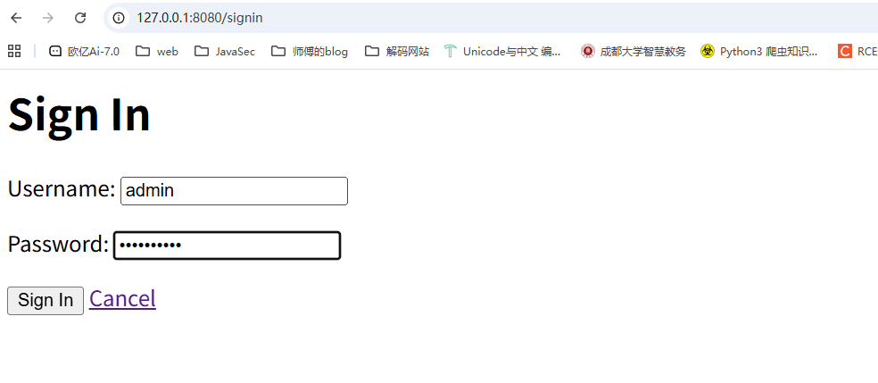

点击登录后

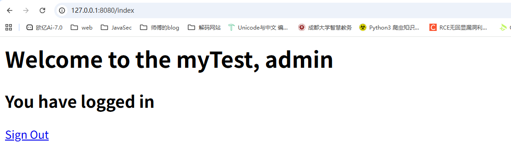

在f12网络中可以看到

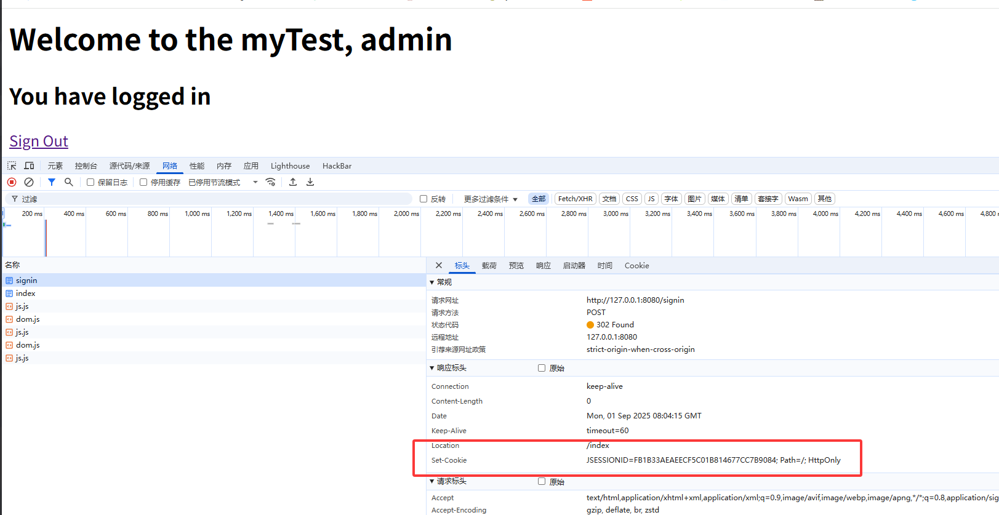

在Servlet中第一次调用`req.getSession()`时，Servlet容器自动创建一个Session ID，然后通过一个名为`JSESSIONID`的Cookie发送给浏览器。而服务器识别Session的关键就是依靠一个名为`JSESSIONID`的Cookie

#### Cookie

Cookie是存储在浏览器客户端的一种键值对数据，由浏览器管理，并且数据是明文存储在客户端的，相对于session来说是不安全的，可以被用户随意查看或篡改

第一次请求时，客户端先向服务器发起一次请求，然后服务器收到请求，服务器发现你曾经还没有来过，因此设置cookie信息并响应。客户端收到服务器的响应保存cookie到本地。而后面发送请求的时候，只要带上cookie就能被服务器识别出来。

cookie和session的区别在于cookie是保存在客户端的，而session是保存在服务器端的

我们写个例子测试一下

```java
@WebServlet(urlPatterns = "/cookie")
public class CookieServlet extends HttpServlet {
    @Override
    protected void doGet(HttpServletRequest req, HttpServletResponse resp) throws ServletException, IOException {
        Cookie cookie = new Cookie("name", "wanth3f1ag");
        cookie.setMaxAge(500);
        cookie.setPath("/");
        resp.addCookie(cookie);
    }
}
```

当我们创建新的cookie时，除了要写明键值对之外，还需要设置生效的路径`setPath("/")`，生效的有效期`setMaxAge(500)`，最后通过`addCookie()`把cookie添加到响应中

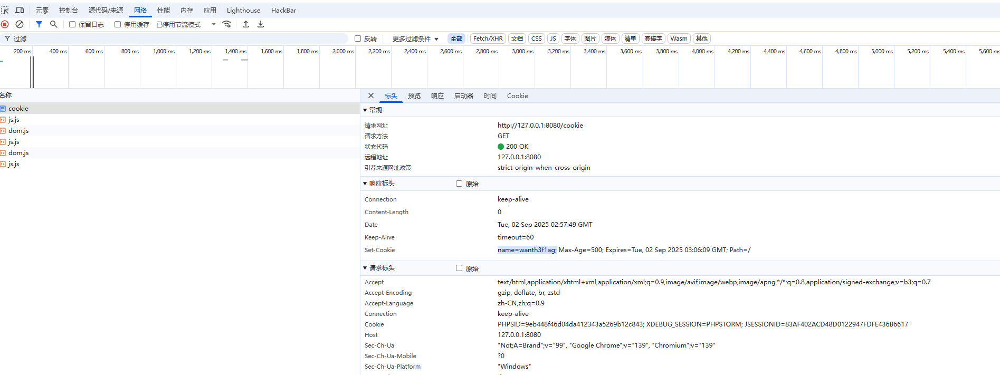

然后我们随便访问一个页面，就会发现在请求头中自动带上cookie了

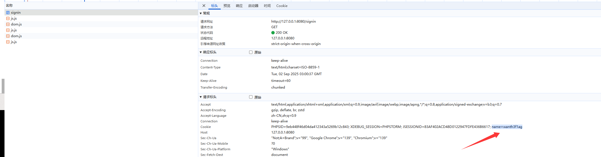

额外需要注意的是，如果我们访问的是https的网页，需要设置`setSecure(true)`，如果设置了secure的话就必须以https去访问了

## JSP学习

**JSP（Java Server Pages）** 是基于 Java 的一种 **动态网页技术**。本质上来说，JSP是一种Java Servlet。JSP会被编译成servlet在服务器端运行，然后生成html页面返回到客户端。

JSP 文件本质上就是一个 **HTML + Java 代码的混合文件**，后缀是 `.jsp`。文件需要存放到/src/main/webapp目录下，jsp文件需要在可解析jsp代码的web服务器上才能被解析执行

例如我们这里写一个hello.jsp

```jsp
<html>
<head>
    <title>Hello JSP!</title>
</head>
<body>
<%-- 这是jsp的注释 --%>
<h1>Hello World!</h1>
<p>
    <%
        out.println("Your IP address is ");
    %>
    <span style="color:red">
        <%= request.getRemoteAddr() %>
    </span>
</p>
</body>
</html>

```

访问后解析成功

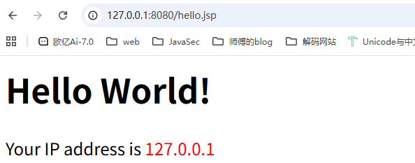

在Tomcat的临时目录work下可以找到一个hello_jsp.java文件

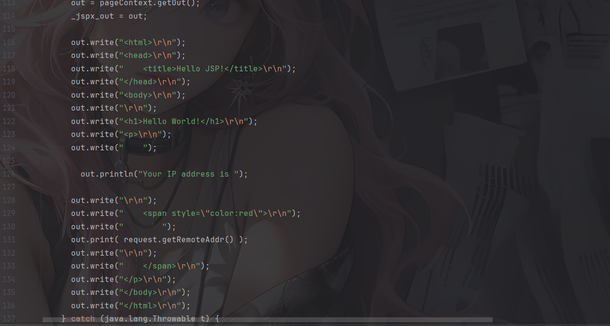

可以看出其实本质上jsp就是servlet，只不过不需要配置路径映射而Web服务器就能通过路径找到对应的jsp文件，也省去了我们一个个进行write和print的复杂流程

### JSP创建流程

1. 用户正常发送请求到服务器
2. 服务器接收请求后根据`.jsp`后缀识别出是一个对jsp网页的请求，随后将请求交给JSP引擎
3. JSP引擎找到jsp文件后将jsp文件转化成Servlet源代码
4. Web服务器将Servlet源代码编译成字节码class文件
5. Web服务器将编译好的Servlet加载到内存中并运行里面的`_jspService`方法
6. 将html解析并渲染到页面中，通过HttpServletResponse返回给浏览器，并执行里面的java代码

### JSP语法

#### JSP中Java书写规范

JSP文件不仅能解析html代码，还能解析java代码，有关java代码的书写格式如下：

- 包含在`<%--`和`--%>`之间的是JSP的注释，它们会被完全忽略；
- 包含在`<%`和`%>`之间的是Java代码，可以编写任意Java代码；
- 如果使用`<%= xxx %>`则可以快捷输出一个变量的值。

JSP页面内置了几个变量：

- out：表示HttpServletResponse的PrintWriter；
- session：表示当前HttpSession对象；
- request：表示HttpServletRequest对象。

#### JSP导入类

JSP能通过`<%@ page import= ...%>`导入java类

```jsp
<%@ page import="java.util.Scanner" %>
```

这样后续的Java代码才能引用简单类名而不是完整类名。

#### JSP引入另一JSP

使用include代码可以引入另一个JSP文件

```jsp
<%@ include file="hello.jsp" %>
```

#### JSP中的taglib

### JSP源码实现

结合我们刚刚写的hello.jsp生成的class文件，我们来分析一下JSP文件是如何被转换成servlet源代码的

首先看到hello_jsp类的继承类和接口

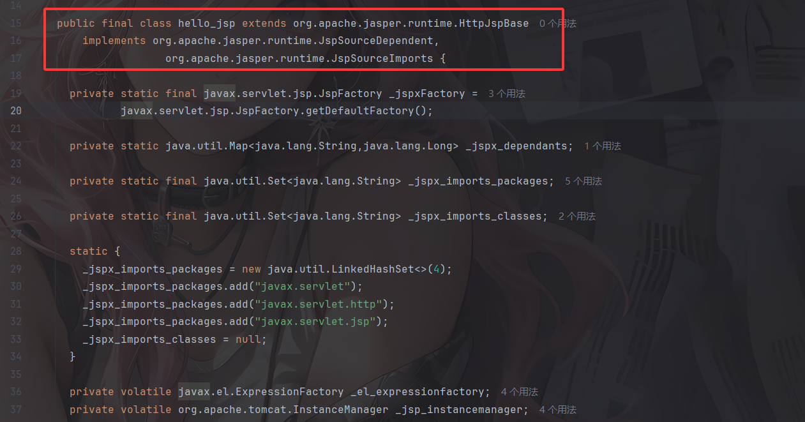

`org.apache.jasper.runtime.HttpJspBase`是Tomcat JSP 引擎 Jasper 提供的JSP Servlet的一个基类，他继承自HttpServlet并封装了很多JSP特有功能

我们跟进这个类看看

在org/apache/jasper/runtime/HttpJspBase中

```java
/*
 * Licensed to the Apache Software Foundation (ASF) under one or more
 * contributor license agreements.  See the NOTICE file distributed with
 * this work for additional information regarding copyright ownership.
 * The ASF licenses this file to You under the Apache License, Version 2.0
 * (the "License"); you may not use this file except in compliance with
 * the License.  You may obtain a copy of the License at
 *
 *      http://www.apache.org/licenses/LICENSE-2.0
 *
 * Unless required by applicable law or agreed to in writing, software
 * distributed under the License is distributed on an "AS IS" BASIS,
 * WITHOUT WARRANTIES OR CONDITIONS OF ANY KIND, either express or implied.
 * See the License for the specific language governing permissions and
 * limitations under the License.
 */
package org.apache.jasper.runtime;

import java.io.IOException;

import javax.servlet.ServletConfig;
import javax.servlet.ServletException;
import javax.servlet.http.HttpServlet;
import javax.servlet.http.HttpServletRequest;
import javax.servlet.http.HttpServletResponse;
import javax.servlet.jsp.HttpJspPage;

import org.apache.jasper.Constants;
import org.apache.jasper.compiler.Localizer;

/**
 * This is the super class of all JSP-generated servlets.
 *
 * @author Anil K. Vijendran
 */
public abstract class HttpJspBase extends HttpServlet implements HttpJspPage {

    private static final long serialVersionUID = 1L;

    protected HttpJspBase() {
    }

    @Override
    public final void init(ServletConfig config) throws ServletException {
        super.init(config);
        jspInit();
        _jspInit();
    }

    @Override
    public String getServletInfo() {
        return Localizer.getMessage("jsp.engine.info", Constants.SPEC_VERSION);
    }

    @Override
    public final void destroy() {
        jspDestroy();
        _jspDestroy();
    }

    @Override
    public final void service(HttpServletRequest request, HttpServletResponse response)
            throws ServletException, IOException {
        _jspService(request, response);
    }

    @Override
    public void jspInit() {
    }

    public void _jspInit() {
    }

    @Override
    public void jspDestroy() {
    }

    protected void _jspDestroy() {
    }

    @Override
    public abstract void _jspService(HttpServletRequest request, HttpServletResponse response)
            throws ServletException, IOException;
}
```

定义了一个servlet的init初始化方法和destroy销毁方法

- 初始化方法里面不仅调用了父类HttpServlet的init进行基本初始化，还调用了`jspInit()`和`_jspInit()`方法，这两个方法里面需要定义具体的初始化代码实现
- 销毁方法的话就是直接调用jspDestroy方法和`_jspDestroy`方法

最重要的就是`_jspService`方法，每个JSP文件必须实现这个方法，JSP页面中的HTML和Java代码会被转化成_jspService中的java代码，此之外这个方法里还会有对请求和响应的处理逻辑

那这里的源码是怎么来的呢？其实就是在`org.apache.jasper.compiler.Compiler#generateJava()`方法中

```java
protected Map<String,SmapStratum> generateJava() throws Exception {

        long t1 = 0;
        long t2 = 0;
        long t3 = 0;
        long t4;

        if (log.isDebugEnabled()) {
            t1 = System.currentTimeMillis();
        }

        // Setup page info area
        pageInfo = new PageInfo(new BeanRepository(ctxt.getClassLoader(), errDispatcher), ctxt.getJspFile(),
                ctxt.isTagFile());

        JspConfig jspConfig = options.getJspConfig();
        JspConfig.JspProperty jspProperty = jspConfig.findJspProperty(ctxt.getJspFile());

        /*
         * If the current uri is matched by a pattern specified in a jsp-property-group in web.xml, initialize pageInfo
         * with those properties.
         */
        if (jspProperty.isELIgnored() != null) {
            pageInfo.setELIgnored(JspUtil.booleanValue(jspProperty.isELIgnored()));
        }
        if (jspProperty.isScriptingInvalid() != null) {
            pageInfo.setScriptingInvalid(JspUtil.booleanValue(jspProperty.isScriptingInvalid()));
        }
        if (jspProperty.getIncludePrelude() != null) {
            pageInfo.setIncludePrelude(jspProperty.getIncludePrelude());
        }
        if (jspProperty.getIncludeCoda() != null) {
            pageInfo.setIncludeCoda(jspProperty.getIncludeCoda());
        }
        if (jspProperty.isDeferedSyntaxAllowedAsLiteral() != null) {
            pageInfo.setDeferredSyntaxAllowedAsLiteral(
                    JspUtil.booleanValue(jspProperty.isDeferedSyntaxAllowedAsLiteral()));
        }
        if (jspProperty.isTrimDirectiveWhitespaces() != null) {
            pageInfo.setTrimDirectiveWhitespaces(JspUtil.booleanValue(jspProperty.isTrimDirectiveWhitespaces()));
        }
        // Default ContentType processing is deferred until after the page has
        // been parsed
        if (jspProperty.getBuffer() != null) {
            pageInfo.setBufferValue(jspProperty.getBuffer(), null, errDispatcher);
        }
        if (jspProperty.isErrorOnUndeclaredNamespace() != null) {
            pageInfo.setErrorOnUndeclaredNamespace(JspUtil.booleanValue(jspProperty.isErrorOnUndeclaredNamespace()));
        }
        if (ctxt.isTagFile()) {
            try {
                double libraryVersion = Double.parseDouble(ctxt.getTagInfo().getTagLibrary().getRequiredVersion());
                if (libraryVersion < 2.0) {
                    pageInfo.setIsELIgnored("true", null, errDispatcher, true);
                }
                if (libraryVersion < 2.1) {
                    pageInfo.setDeferredSyntaxAllowedAsLiteral("true", null, errDispatcher, true);
                }
            } catch (NumberFormatException ex) {
                errDispatcher.jspError(ex);
            }
        }

        ctxt.checkOutputDir();
        String javaFileName = ctxt.getServletJavaFileName();

        try {
            /*
             * The setting of isELIgnored changes the behaviour of the parser in subtle ways. To add to the 'fun',
             * isELIgnored can be set in any file that forms part of the translation unit so setting it in a file
             * included towards the end of the translation unit can change how the parser should have behaved when
             * parsing content up to the point where isELIgnored was set. Arghh! Previous attempts to hack around this
             * have only provided partial solutions. We now use two passes to parse the translation unit. The first just
             * parses the directives and the second parses the whole translation unit once we know how isELIgnored has
             * been set. TODO There are some possible optimisations of this process.
             */
            // Parse the file
            ParserController parserCtl = new ParserController(ctxt, this);

            // Pass 1 - the directives
            Node.Nodes directives = parserCtl.parseDirectives(ctxt.getJspFile());
            Validator.validateDirectives(this, directives);

            // Pass 2 - the whole translation unit
            pageNodes = parserCtl.parse(ctxt.getJspFile());

            // Leave this until now since it can only be set once - bug 49726
            if (pageInfo.getContentType() == null && jspProperty.getDefaultContentType() != null) {
                pageInfo.setContentType(jspProperty.getDefaultContentType());
            }

            if (ctxt.isPrototypeMode()) {
                // generate prototype .java file for the tag file
                try (ServletWriter writer = setupContextWriter(javaFileName)) {
                    Generator.generate(writer, this, pageNodes);
                    return null;
                }
            }

            // Validate and process attributes - don't re-validate the
            // directives we validated in pass 1
            Validator.validateExDirectives(this, pageNodes);

            if (log.isDebugEnabled()) {
                t2 = System.currentTimeMillis();
            }

            // Collect page info
            Collector.collect(this, pageNodes);

            // Compile (if necessary) and load the tag files referenced in
            // this compilation unit.
            tfp = new TagFileProcessor();
            tfp.loadTagFiles(this, pageNodes);

            if (log.isDebugEnabled()) {
                t3 = System.currentTimeMillis();
            }

            // Determine which custom tag needs to declare which scripting vars
            ScriptingVariabler.set(pageNodes, errDispatcher);

            // Optimizations by Tag Plugins
            TagPluginManager tagPluginManager = options.getTagPluginManager();
            tagPluginManager.apply(pageNodes, errDispatcher, pageInfo);

            // Optimization: concatenate contiguous template texts.
            TextOptimizer.concatenate(this, pageNodes);

            // Generate static function mapper codes.
            ELFunctionMapper.map(pageNodes);

            // generate servlet .java file
            try (ServletWriter writer = setupContextWriter(javaFileName)) {
                Generator.generate(writer, this, pageNodes);
            }

            // The writer is only used during compile, dereference
            // it in the JspCompilationContext when done to allow it
            // to be GCed and save memory.
            ctxt.setWriter(null);

            if (log.isTraceEnabled()) {
                t4 = System.currentTimeMillis();
                log.trace("Generated " + javaFileName + " total=" + (t4 - t1) + " generate=" + (t4 - t3) +
                        " validate=" + (t2 - t1));
            }

        } catch (RuntimeException e) {
            // Remove the generated .java file
            File file = new File(javaFileName);
            if (file.exists()) {
                if (!file.delete()) {
                    log.warn(Localizer.getMessage("jsp.warning.compiler.javafile.delete.fail", file.getAbsolutePath()));
                }
            }
            throw e;
        }

        Map<String,SmapStratum> smaps = null;

        // JSR45 Support
        if (!options.isSmapSuppressed()) {
            smaps = SmapUtil.generateSmap(ctxt, pageNodes);
            // Add them to the web application wide cache for future lookup in
            // error handling etc.
            ctxt.getRuntimeContext().getSmaps().putAll(smaps);
        }

        // If any prototype .java and .class files was generated,
        // the prototype .java may have been replaced by the current
        // compilation (if the tag file is self referencing), but the
        // .class file need to be removed, to make sure that javac would
        // generate .class again from the new .java file just generated.
        tfp.removeProtoTypeFiles(ctxt.getClassFileName());

        return smaps;
    }
```

大致逻辑就是通过解析jsp文件中的标签和指令去生成java代码文件，详细的可以直接问ai了解一下
