---
title: "Java反序列化基础"
date: 2026-01-23T11:22:52+08:00
summary: "Java反序列化"
url: "/posts/Java反序列化/"
categories:
  - "javasec"
tags:
  - "javasec"
draft: false
---

因为前面学习了java的一些基础知识，java反序列化也算是搁置了很久的知识点，所以就来学习一下关于这个java反序列化的知识点

参考文章和视频:

[JAVA反序列化漏洞总结-青叶](https://evalexp.top/p/51973/)

[java序列化与反序列化全讲解](https://blog.csdn.net/mocas_wang/article/details/107621010?ops_request_misc=%257B%2522request%255Fid%2522%253A%25220080c4e906041c359da2885ad46d41f6%2522%252C%2522scm%2522%253A%252220140713.130102334..%2522%257D&request_id=0080c4e906041c359da2885ad46d41f6&biz_id=0&utm_medium=distribute.pc_search_result.none-task-blog-2~all~top_positive~default-1-107621010-null-null.142^v101^control&utm_term=mocas_wang&spm=1018.2226.3001.4187)

[Java反序列化漏洞专题-基础篇(21/09/05更新类加载部分)](https://www.bilibili.com/video/BV16h411z7o9/?vd_source=8b5b7b4de91c439593332c8ba167e048)

# 什么是java反序列化

Java 序列化是指把 Java 对象转换为字节序列的过程便于保存在内存或文件中，实现跨平台通讯和持久化存储，而反序列化则指把字节序列恢复为 Java 对象的过程。(这个的话在之前学ctfshow里头的反序列化篇也有详细的介绍过)

# 为什么需要序列化

我们知道，当两个进程进行远程通信时，可以相互发送各种类型的数据，包括文本、图片、音频、视频等， 而这些数据都会以二进制序列的形式在网络上传送。那么当两个Java进程进行通信时，能否实现进程间的对象传送呢？答案是可以的。如何做到呢？这就需要Java序列化与反序列化了。发送方需要把这个Java对象转换为字节序列，然后在网络上传送；另一方面，接收方需要从字节序列中恢复出Java对象。

那么由此可以看出java序列化和反序列化的好处就是一是实现数据的存储二是实现数据的传输

# 序列化和反序列化的实现

## 实现方法

- ObjectOutputStream类的 writeObject() 方法可以实现序列化。

- ObjectInputStream 类的 readObject() 方法用于反序列化。

具体的实现方法

通过 ObjectOutputStream 将需要序列化数据写入到流中，因为 Java IO 是一种装饰者模式，因此可以通过 ObjectOutStream 包装 FileOutStream 将数据**写入到文件中**或者包装 ByteArrayOutStream 将数据**写入到内存中**，这就是序列化的过程。同理，可以通过 ObjectInputStream 将数据从磁盘 FileInputStream 或者内存 ByteArrayInputStream 读取出来然后转化为指定的对象即可，也就是反序列化

我们先写个demo测试一下

## Demo代码分析

先写个简单的类

```java
import java.io.*;
//People类
public class People implements Serializable{

    //类属性
    public String name;
    public int age;
    public String sex;

    //构造方法

    public People(String name,String sex,int age){

        this.name = name;
        this.age = age;
        this.sex = sex;
    }

    @Override
    public String toString(){
        return "People's name is " + name + "\n"
                +"People's age is " + age + "\n"
                +"People's sex is " + sex + "\n";
    }

}
```

然后我们来写序列化和反序列化的实现

```java
class SerializeDemo {

    //序列化操作
    public static void main(String[] args) throws IOException, ClassNotFoundException {
        System.out.println("----------序列化开始----------");
        People p = new People("John", "Male", 30);
        ObjectOutputStream oos = new ObjectOutputStream(new FileOutputStream("People.txt"));
        oos.writeObject(p);
        oos.flush();
        oos.close();

        //反序列化操作
        System.out.println("----------反序列化开始----------");
        ObjectInputStream ois = new ObjectInputStream(new FileInputStream("People.txt"));
        People p1 = (People) ois.readObject();
        ois.close();
        System.out.println(p1);
    }
}
```

先看输出结果

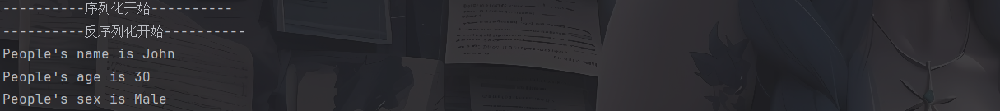

可以看到这里触发了`toString()`方法，是为什么呢？打个断点看看

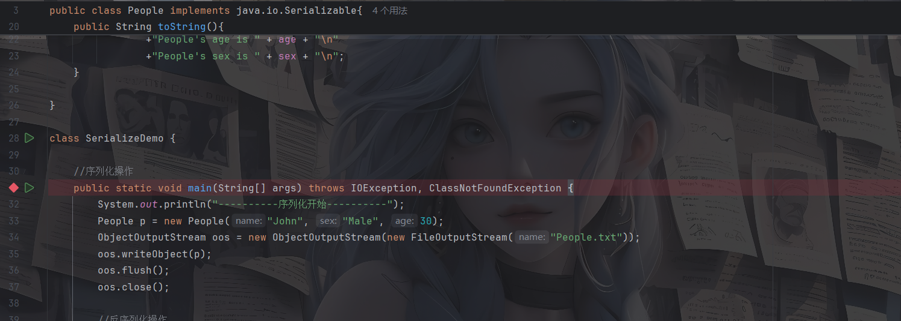

开始调试，可以发现执行到33行代码即实例化对象的时候会同时调用构造方法

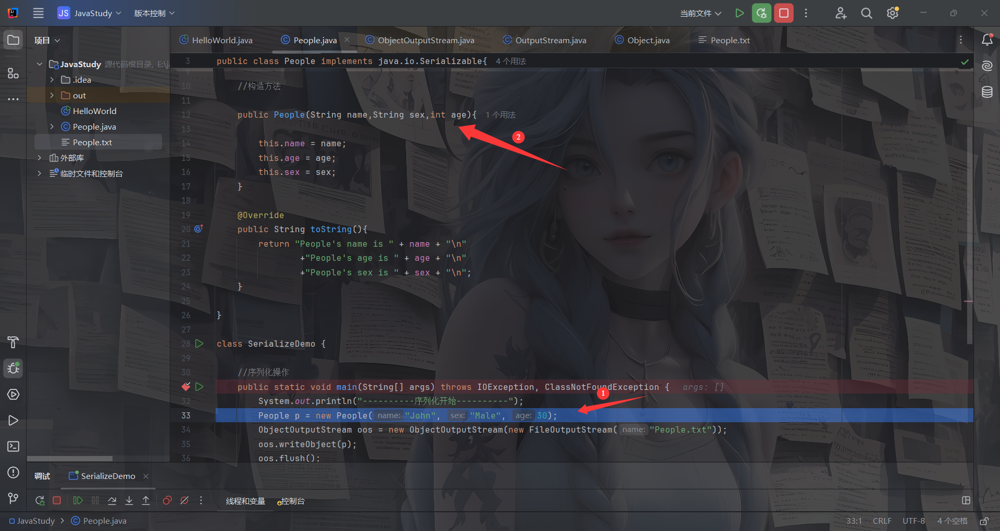

所以构造方法是在实例化对象的时候触发的，我们接下来执行代码

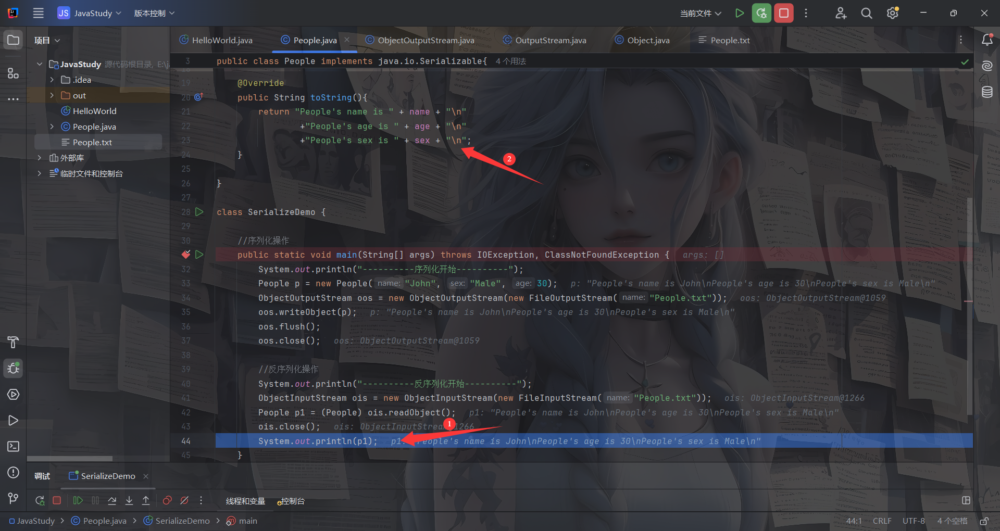

发现代码在第44行的时候触发了`toString()`方法，这是因为我们直接将对象进行打印，这貌似跟PHP反序列化的`__toString()`方法的触发条件一样，假如这里改成`System.out.println(p1.name)`则不会触发`toString()`方法

代码走完了，我们来分析一下序列化和反序列化的操作

## 序列化分析

```java
class SerializeDemo {

    //序列化操作
    public static void main(String[] args) throws IOException, ClassNotFoundException {
        System.out.println("----------序列化开始----------");
        People p = new People("John", "Male", 30);
        ObjectOutputStream oos = new ObjectOutputStream(new FileOutputStream("People.txt"));
        oos.writeObject(p);
        oos.flush();
        oos.close();
    }
}
```

先看看序列化的过程

在main方法中，这里先是实例化了一个有Serializable序列化接口的对象p，然后就开始进行序列化操作

- `new FileOutputStream("People.txt")`

这里是实例化了一个java.io包中的FileOutputStream对象，该类用于将数据写入 `File`或 的输出流`FileDescriptor`，`FileOutputStream`用于写入原始字节流（例如图像数据），并调用了该类的构造方法，用于将数据写入到指定文件中。这是一个写文件的操作，文件File就是我们指定的文件名or文件路径

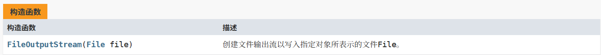

- `new ObjectOutputStream(new FileOutputStream("People.txt"));`

实例化了一个java.io包中的 `ObjectOutputStream` 对象，用于将 Java 对象序列化并写入到输出流中。(只有支持 java.io.Serializable 接口的对象才能写入流。)

- `oos.writeObject(p);`

这里调用了`ObjectOutputStream` 对象中的writeObject方法，用于将指定的对象写入`ObjectOutputStream`

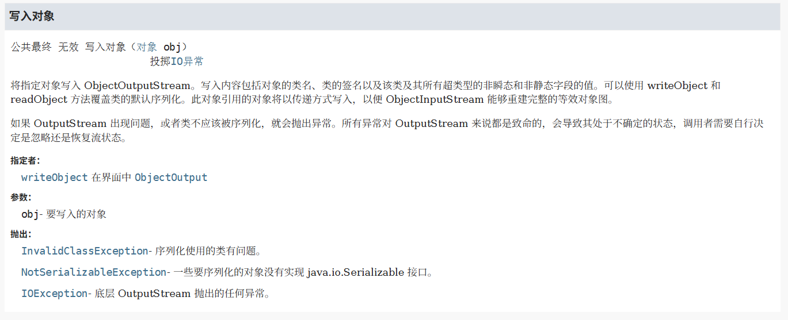

以上就是序列化的过程，ObjectOutputStream代表对象输出流，利用它的writeObject方法可对参数指定的obj对象进行序列化，把得到的字节序列写到一个目标输出流FileInputStream指定的文件中。

然后我们再看看反序列化的过程

## 反序列化分析

```java
//反序列化操作
System.out.println("----------反序列化开始----------");
ObjectInputStream ois = new ObjectInputStream(new FileInputStream("People.txt"));
People p1 = (People) ois.readObject();
ois.close();
System.out.println(p1.name);
```

- `new FileInputStream("People.txt")`：创建一个 `FileInputStream` 对象，用于从文件 `"People.txt"` 中读取字节数据。
- `new ObjectInputStream(...)`：将 `FileInputStream` 包装为 `ObjectInputStream`，使其能够从字节流中反序列化对象。

反序列化的过程是从文件`People.txt`中读取输入流，然后通过`ObjectInputStream`将输入流中的字节码反序列化为对象，最后通过`ois.readObject()`将对象恢复为类的实例。然后我们看看关于readObject()方法

- `People p1 = (People) ois.readObject();`

readObject()方法从 ObjectInputStream 读取一个对象。读取该对象的类、类的签名以及该类及其所有超类型的非瞬态和非静态字段的值。然后返回从流中读取的对象

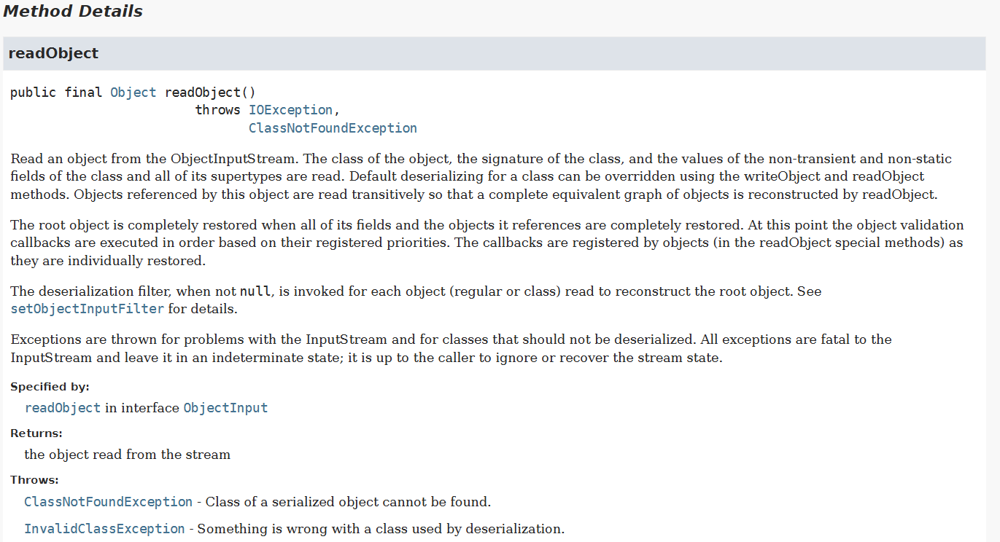

由于返回的对象类型是 `Object`，因此需要强制类型转换为 `People`。

接下来我们看一下几个重要的函数和方法

## 分析函数

- `ObjectOutputStream`构造函数

我们右键跟进该类的声明

```java
public ObjectOutputStream(OutputStream out) throws IOException {
    verifySubclass();
    bout = new BlockDataOutputStream(out);
    handles = new HandleTable(10, (float) 3.00);
    subs = new ReplaceTable(10, (float) 3.00);
    enableOverride = false;
    writeStreamHeader();
    bout.setBlockDataMode(true);
    if (extendedDebugInfo) {
        debugInfoStack = new DebugTraceInfoStack();
    } else {
        debugInfoStack = null;
    }
}
```

- `bout = new BlockDataOutputStream(out);`：创建一个 `BlockDataOutputStream` 对象，用于管理底层输出流。
- `enableOverride = false;`：`enableOverride` 用于控制是否允许子类重写 `writeObject()` 方法。如果为 true ，那么需要重写 writeObjectOverride 方法。但是一般默认为false

然后我们跟进writeStreamHeader()方法

该方法用于写入序列化流的头部信息。

```java
protected void writeStreamHeader() throws IOException {
    bout.writeShort(STREAM_MAGIC);
    bout.writeShort(STREAM_VERSION);
}
```

- STREAM_MAGIC 声明使用了序列化协议，bout 就是一个流，将对应的头数据写入该流中
- STREAM_VERSION 指定序列化协议版本

Java序列化数据通常以十六进制`AC ED 00 05`开头，这是序列化协议的魔数和版本号标识

看完了构造函数，我们接下来看看writeObject()方法都干了啥

```java
public final void writeObject(Object obj) throws IOException {
    if (enableOverride) {
        writeObjectOverride(obj);
        return;
    }
    try {
        writeObject0(obj, false);
    } catch (IOException ex) {
        if (depth == 0) {
            writeFatalException(ex);
        }
        throw ex;
    }
}
```

出现了一个if语句，这让我联想起刚刚写的enableOverride重写writeObject()的问题，但是默认是为false，所以这里是不会执行的

- `writeObject0(obj, false);`这里的话就是执行序列化的方法了，跟进看一下

```java
    private void writeObject0(Object obj, boolean unshared)
        throws IOException
    {
        boolean oldMode = bout.setBlockDataMode(false);
        depth++;
        try {
            // handle previously written and non-replaceable objects
            int h;
            if ((obj = subs.lookup(obj)) == null) {
                writeNull();
                return;
            } else if (!unshared && (h = handles.lookup(obj)) != -1) {
                writeHandle(h);
                return;
            } else if (obj instanceof Class) {
                writeClass((Class) obj, unshared);
                return;
            } else if (obj instanceof ObjectStreamClass) {
                writeClassDesc((ObjectStreamClass) obj, unshared);
                return;
            }

            // check for replacement object
            Object orig = obj;
            Class<?> cl = obj.getClass();
            ObjectStreamClass desc;
            for (;;) {
                // REMIND: skip this check for strings/arrays?
                Class<?> repCl;
                desc = ObjectStreamClass.lookup(cl, true);
                if (!desc.hasWriteReplaceMethod() ||
                    (obj = desc.invokeWriteReplace(obj)) == null ||
                    (repCl = obj.getClass()) == cl)
                {
                    break;
                }
                cl = repCl;
            }
            if (enableReplace) {
                Object rep = replaceObject(obj);
                if (rep != obj && rep != null) {
                    cl = rep.getClass();
                    desc = ObjectStreamClass.lookup(cl, true);
                }
                obj = rep;
            }

            // if object replaced, run through original checks a second time
            if (obj != orig) {
                subs.assign(orig, obj);
                if (obj == null) {
                    writeNull();
                    return;
                } else if (!unshared && (h = handles.lookup(obj)) != -1) {
                    writeHandle(h);
                    return;
                } else if (obj instanceof Class) {
                    writeClass((Class) obj, unshared);
                    return;
                } else if (obj instanceof ObjectStreamClass) {
                    writeClassDesc((ObjectStreamClass) obj, unshared);
                    return;
                }
            }

            // remaining cases
            if (obj instanceof String) {
                writeString((String) obj, unshared);
            } else if (cl.isArray()) {
                writeArray(obj, desc, unshared);
            } else if (obj instanceof Enum) {
                writeEnum((Enum<?>) obj, desc, unshared);
            } else if (obj instanceof Serializable) {
                writeOrdinaryObject(obj, desc, unshared);
            } else {
                if (extendedDebugInfo) {
                    throw new NotSerializableException(
                        cl.getName() + "\n" + debugInfoStack.toString());
                } else {
                    throw new NotSerializableException(cl.getName());
                }
            }
        } finally {
            depth--;
            bout.setBlockDataMode(oldMode);
        }
    }
```

- `desc = ObjectStreamClass.lookup(cl, true);`这里通过调用lookup方法 查找类的描述信息，通过它就可以获取对象及其对象属性的相关信息。

```java
if (obj instanceof Class) {
                writeClass((Class) obj, unshared);
                return;
            } else if (obj instanceof ObjectStreamClass) {
                writeClassDesc((ObjectStreamClass) obj, unshared);
                return;
            }
        }

        // remaining cases
        if (obj instanceof String) {
            writeString((String) obj, unshared);
        } else if (cl.isArray()) {
            writeArray(obj, desc, unshared);
        } else if (obj instanceof Enum) {
            writeEnum((Enum<?>) obj, desc, unshared);
        } else if (obj instanceof Serializable) {
            writeOrdinaryObject(obj, desc, unshared);
        } else {
            if (extendedDebugInfo) {
                throw new NotSerializableException(
                    cl.getName() + "\n" + debugInfoStack.toString());
            } else {
                throw new NotSerializableException(cl.getName());
            }
        }
    }
```

然后这里的话就是根据 obj 的类型去执行序列化操作，如果为class类型则执行**`writeClass`**方法并返回，如果为`ObjectStreamClass` 类型则执行**`writeClassDesc`**方法等等，其最终结果都是往流中写入不同类型的对象

上面就是大致的序列化相干函数的分析，接下来我们看看反序列化的

- `ObjectInputStream`构造函数

```java
public ObjectInputStream(InputStream in) throws IOException {
    verifySubclass();
    bin = new BlockDataInputStream(in);
    handles = new HandleTable(10);
    vlist = new ValidationList();
    streamFilterSet = false;
    serialFilter = Config.getSerialFilterFactorySingleton().apply(null, Config.getSerialFilter());
    enableOverride = false;
    readStreamHeader();
    bin.setBlockDataMode(true);
}
```

这个构造函数是用于初始化反序列化流并对一些基础配置进行设置的，跟上面的其实差不太多，我们跟进readStreamHeader()方法

```java
protected void readStreamHeader()
    throws IOException, StreamCorruptedException
{
    short s0 = bin.readShort();
    short s1 = bin.readShort();
    if (s0 != STREAM_MAGIC || s1 != STREAM_VERSION) {
        throw new StreamCorruptedException(
            String.format("invalid stream header: %04X%04X", s0, s1));
    }
}
```

这里是用于验证序列化流的头部信息的，通过读取序列化流中的序列版本和序列化协议检测头部信息是否有效，如果无效则会抛出异常

然后我们看看readObject方法

```java
public final Object readObject()
    throws IOException, ClassNotFoundException {
    return readObject(Object.class);
}
```

跟进readObject方法，这个方法会从序列化流中读取一个对象，并将其强制转换为 `Object` 类型。

```java
private final Object readObject(Class<?> type)
    throws IOException, ClassNotFoundException
{
    if (enableOverride) {
        return readObjectOverride();
    }

    if (! (type == Object.class || type == String.class))
        throw new AssertionError("internal error");

    // if nested read, passHandle contains handle of enclosing object
    int outerHandle = passHandle;
    try {
        Object obj = readObject0(type, false);
        handles.markDependency(outerHandle, passHandle);
        ClassNotFoundException ex = handles.lookupException(passHandle);
        if (ex != null) {
            throw ex;
        }
        if (depth == 0) {
            vlist.doCallbacks();
            freeze();
        }
        return obj;
    } finally {
        passHandle = outerHandle;
        if (closed && depth == 0) {
            clear();
        }
    }
}
```

前面的重写和判断类型就不说了，直接看后面的

- `Object obj = readObject0(type, false);`这里从流中读取一个对象，进行一些异常处理和检测后返回读取的对象，之后关闭流并清理资源

跟进readObject0

```java
    private Object readObject0(Class<?> type, boolean unshared) throws IOException {
        boolean oldMode = bin.getBlockDataMode();
        if (oldMode) {
            int remain = bin.currentBlockRemaining();
            if (remain > 0) {
                throw new OptionalDataException(remain);
            } else if (defaultDataEnd) {
                /*
                 * Fix for 4360508: stream is currently at the end of a field
                 * value block written via default serialization; since there
                 * is no terminating TC_ENDBLOCKDATA tag, simulate
                 * end-of-custom-data behavior explicitly.
                 */
                throw new OptionalDataException(true);
            }
            bin.setBlockDataMode(false);
        }

        byte tc;
        while ((tc = bin.peekByte()) == TC_RESET) {
            bin.readByte();
            handleReset();
        }

        depth++;
        totalObjectRefs++;
        try {
            switch (tc) {
                case TC_NULL:
                    return readNull();

                case TC_REFERENCE:
                    // check the type of the existing object
                    return type.cast(readHandle(unshared));

                case TC_CLASS:
                    if (type == String.class) {
                        throw new ClassCastException("Cannot cast a class to java.lang.String");
                    }
                    return readClass(unshared);

                case TC_CLASSDESC:
                case TC_PROXYCLASSDESC:
                    if (type == String.class) {
                        throw new ClassCastException("Cannot cast a class to java.lang.String");
                    }
                    return readClassDesc(unshared);

                case TC_STRING:
                case TC_LONGSTRING:
                    return checkResolve(readString(unshared));

                case TC_ARRAY:
                    if (type == String.class) {
                        throw new ClassCastException("Cannot cast an array to java.lang.String");
                    }
                    return checkResolve(readArray(unshared));

                case TC_ENUM:
                    if (type == String.class) {
                        throw new ClassCastException("Cannot cast an enum to java.lang.String");
                    }
                    return checkResolve(readEnum(unshared));

                case TC_OBJECT:
                    if (type == String.class) {
                        throw new ClassCastException("Cannot cast an object to java.lang.String");
                    }
                    return checkResolve(readOrdinaryObject(unshared));

                case TC_EXCEPTION:
                    if (type == String.class) {
                        throw new ClassCastException("Cannot cast an exception to java.lang.String");
                    }
                    IOException ex = readFatalException();
                    throw new WriteAbortedException("writing aborted", ex);

                case TC_BLOCKDATA:
                case TC_BLOCKDATALONG:
                    if (oldMode) {
                        bin.setBlockDataMode(true);
                        bin.peek();             // force header read
                        throw new OptionalDataException(
                            bin.currentBlockRemaining());
                    } else {
                        throw new StreamCorruptedException(
                            "unexpected block data");
                    }

                case TC_ENDBLOCKDATA:
                    if (oldMode) {
                        throw new OptionalDataException(true);
                    } else {
                        throw new StreamCorruptedException(
                            "unexpected end of block data");
                    }

                default:
                    throw new StreamCorruptedException(
                        String.format("invalid type code: %02X", tc));
            }
        } finally {
            depth--;
            bin.setBlockDataMode(oldMode);
        }
    }
```

这个过程基本是跟 writeObject 差不多，我就不过多赘述了，只是介绍一个具体的思路以及分析源码的原理

# 反序列化漏洞原理

其核心在于反序列化的时候如果类实现了自定义的readObject方法，可以通过调用自定义的readObject方法去构造反序列化链，从而导致意外的代码执行

但是反序列化的触发点就只有readObject方法吗？当然不是

# 反序列化的触发点

其实寻找触发点，就是找一下哪些方法会在反序列化的过程中自动调用，这些方法会作为Gadget链的起点或传递节点

常见的触发点包括：

- `readObject()`：反序列化的起点，反序列化自动调用
- `readResolve()`：是 **Java 序列化机制中的一个钩子方法**，在整个对象构造完成后，JVM 会调用 `readResolve()`，并用它的返回值替代原来的反序列化结果。
- `InvocationHandler.invoke()`：动态代理类的方法，在调用代理类任意函数的自动调用invoke方法

还有很多没学到，后面学到了回来补充

这个是我们反序列化攻击的重要思路，下面会详细介绍

# 反序列化中的Gadget链

Gadget在反序列化中通常指可以被链接起来造成反序列化漏洞执行特定功能的类或方法，他们并非恶意代码，但是在链接起来后可以产生危险的行为

所以也可以得出反序列化的原理其实就在于Gadget链的构造

## Gadget链的构成

一个典型的Gadget链通常包含以下几个部分：

1. 入口点（Entry Point）：反序列化的入口例如readObject()方法
2. 触发类（Trigger Class）：包含可直接被反序列化调用方法的类
3. 连接类（Chain Class）：将触发功能转化成目标功能的中间类
4. 执行类（sink Class）：最终造成恶意操作的类（例如Runtime）

# Serializable 接口

Serializable 是java提供的**标记接口**，位于java.io包中，但是这个接口并没有任何内容(没有定义任何方法)，它只是作为一个序列化能力的标识，意味着任何实现该接口的对象都可以实现序列化和反序列化的操作。

只有实现了Serializable或者Externalizable接口的类的对象才能被序列化为字节序列。（不是则会抛出异常） 

Serializable 用来标识当前类可以被 ObjectOutputStream 序列化，以及被 ObjectInputStream 反序列化。如果我们删掉这个接口会是什么样的呢？

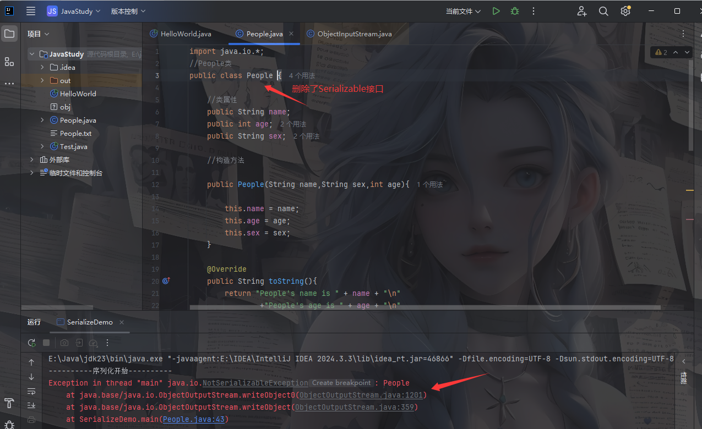

另外我们需要注意的几个地方

- 在反序列化的过程中，如果该类的父类没有实现序列化接口，那么就需要提供无参构造函数来重新创建对象
- 一个实现序列化接口的子类是可以被序列化的
- 静态成员变量不能被序列化（因为序列化是针对对象属性的，而静态成员变量是属于类本身的）
- transient标识的对象成员变量不参与序列化

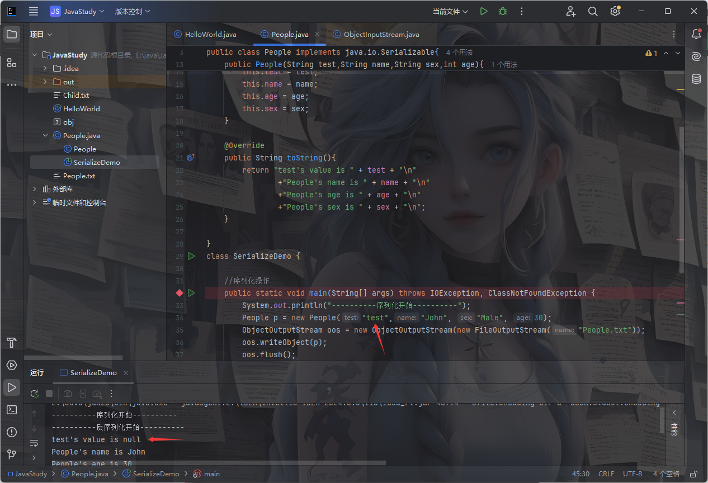

这里可以看到，即使我们利用构造函数给test变量进行了赋值，但是在序列化并且反序列化的输出后发现该变量的值是null，意味着这个变量并没有参与序列化和反序列化的操作

# Java反射

参考文章：

https://www.cnblogs.com/chanshuyi/p/head_first_of_reflection.html

https://pdai.tech/md/java/basic/java-basic-x-reflection.html

在学习Java反射之前，先看看官方对反射的介绍

JAVA反射机制是在程序运行状态中，对于任意一个类，都能够知道这个类的所有属性和方法；对于任意一个对象，都能够调用它的任意一个方法和属性；这种动态获取的信息以及动态调用对象的方法的功能称为java语言的反射机制。

Java 反射（Reflection）是一个强大的特性，它允许程序在运行时查询、访问和修改类、接口、字段和方法的信息。反射提供了一种动态地操作类的能力，这在很多框架和库中被广泛使用

在学习反射之前，我发现很多文章都会从一个很巧妙的角度去进行解释，那就是从正射出发引导反射的概念和利用

什么是正射呢？

很简单，就是我们对类的实例化的过程就是正射

```java
People people = new People();
```

此时我们是知道这个类的信息例如成员变量成员方法，这个类是用来干嘛的，那么我们就可以进行实例化一个对象也就是正射

那如果我们并不知道类的相关信息呢？

所以此时就引出了反射的作用，反射就是当我们不知道我们实例化的对象是什么的时候，我们利用反射技术可以对一个类进行解剖，把个个组成部分映射成一个个对象。讲的官方一点：**Java反射（Reflection）是一种在运行时动态分析或修改类、对象、方法和属性的机制。它允许程序在不需要提前知道类具体结构的情况下，通过名称或对象实例来操作其内部成员。**

Java的反射提供了一系列的类和接口来操作class对象，主要的类包括

- **`java.lang.Class`**：表示类的对象。提供了方法来获取类的字段、方法、构造函数等。
- **`java.lang.reflect.Field`**：表示类的字段（属性）。提供了访问和修改字段的能力。
- **`java.lang.reflect.Method`**：表示类的方法。提供了调用方法的能力。
- **`java.lang.reflect.Constructor`**：表示类的构造函数。提供了创建对象的能力。

## java.lang.Class类

每个java类运行时都在JVM里表现为一个class对象，对每一种对象，JVM 都会实例化一个 java.lang.Class 的实例，java.lang.Class 为我们提供了在运行时访问对象的属性和类型信息的能力

### 获取类对象

Class类一般来说是用来获取类对象的，获取类对象的方法有五种

- 根据类名：`Class<?> clazz = 类名.class`
- 根据对象实例：`Class<?> clazz = 对象.getClass()`
- 根据全限定类名：`Class<?> clazz = Class.forName(全限定类名)`
- 通过类加载器：`Class<?> clazz = ClassLoader.getSystemClassLoader().loadClass("java.lang.String")`
- 基本类型包装类通过静态字段 `TYPE`获取类对象：`Class<?> clazz = Integer.TYPE`

对五个方法分别写个demo

首先是第一种，适用于编译时已知存在的类(比如String类)进行静态引用，直接利用` .class`获取类对象

```java
package TestCode;

public class Reflect_getclass {
    public static void main(String[] args) {

        //第一种:根据类名.class获取类对象
        Class<?> clazz1 = String.class;
        System.out.println(clazz1.getName());
    }
}
java.lang.String
```

第二种适用于反射获取一个存在的对象实例的对应类对象

```java
package TestCode;

public class Reflect_getclass {
    public static void main(String[] args) {
        
        //第二种:根据对象实例getClass()获取类对象
        String str = "test";//实例化一个String对象
        Class<?> clazz2 = str.getClass();
        System.out.println(clazz2.getName());
    }
}
java.lang.String
```

第三种是直接通过引用类的全限定类名字符串进行反射调用

```java
package TestCode;

public class Reflect_getclass {
    public static void main(String[] args) throws Exception {

        //第三种:根据全限定类名Class.forName()获取类对象
        Class<?> clazz3 = Class.forName("java.lang.String");
        System.out.println(clazz3.getName());
    }
}
java.lang.String
```

但是这里的话必须显式抛出报错`throws Exception`，如果不抛出的话就会出现报错

```java
E:\java\JavaSec\JavaSerialize\src\main\java\TestCode\Reflect_getclass.java:7:40
java: 未报告的异常错误java.lang.ClassNotFoundException; 必须对其进行捕获或声明以便抛出
```

其实forName有两个方法

```java
    @CallerSensitive    
    public static Class<?> forName(String className)
                throws ClassNotFoundException {
        Class<?> caller = Reflection.getCallerClass();
        return forName0(className, true, ClassLoader.getClassLoader(caller), caller);
    }

    @CallerSensitive
    public static Class<?> forName(String name, boolean initialize,
                                   ClassLoader loader)
        throws ClassNotFoundException
    {
        Class<?> caller = null;
        SecurityManager sm = System.getSecurityManager();
        if (sm != null) {
            // Reflective call to get caller class is only needed if a security manager
            // is present.  Avoid the overhead of making this call otherwise.
            caller = Reflection.getCallerClass();
            if (sun.misc.VM.isSystemDomainLoader(loader)) {
                ClassLoader ccl = ClassLoader.getClassLoader(caller);
                if (!sun.misc.VM.isSystemDomainLoader(ccl)) {
                    sm.checkPermission(
                        SecurityConstants.GET_CLASSLOADER_PERMISSION);
                }
            }
        }
        return forName0(name, initialize, loader, caller);
    }
```

其实在第一个forName可以看到最后会调用`forName0`，而第二个forName最后也同样会调用，但第二个方法额外多出了两个参数，一个是initialize是否初始化操作，一个是loader类加载器。类加载器也就是说，我们除去正常的forName获取类对象，还能通过自定义类加载器去加载我们指定类，适用于自定义类加载器、复杂模块加载场景，这里也就和我们的第四个方法差不多。

至于类是否初始化，简单来说就是是否在加载类对象的时候调用类中是静态代码块`static{}`

第四个通过类加载器加载类对象

```java
package TestCode;

public class Reflect_getclass {
    public static void main(String[] args) throws ClassNotFoundException {

        //第四种:通过类加载器加载类对象
        Class<?> clazz4 = ClassLoader.getSystemClassLoader().loadClass("java.lang.String");
        System.out.println(clazz4.getName());
    }
}
java.lang.String
```

第五种主要是适用于获取基本类型包装类（`int`, `double` …）的类对象

```java
package TestCode;

public class Reflect_getclass {
    public static void main(String[] args) throws ClassNotFoundException {

        //第四种:通过类加载器加载类对象
        Class<?> clazz5 = Integer.TYPE;
        System.out.println(clazz5.getName());
    }
}
int
```

### 三种代码块

然后我们看看三种在实例化对象时候很常用的代码块，静态初始化块（static block）、实例初始化块（instance initializer block）和构造方法（constructor）

```java
package TestCode;

class Reflect_class {
    Reflect_class() {
        System.out.println("constructor");
    }
    static{
        System.out.println("static");
    }
    {
        System.out.println("instance");
    }
}

public class Reflect_getclass {

    public static void main(String[] args) {
        new Reflect_class();
    }
}
static
instance
constructor
```

- 静态初始化块是在类被加载到 JVM 时执行，该代码块仅执行一次，并且内部只能调用类的静态字段，而且会在每次实例化对象之前执行
- 实例初始化块是在对象实例化之前调用的，每次实例化对象的时候都会调用
- 构造方法也是在对象实例化的时候调用，但优先级低于实例初始化块和静态初始化块


通过反射获取Class类对象后，我们就需要创建对象实例并且反射调用对象的方法了，对于创建对象，我们需要先利用`getConstructor`获取到目标类的类构造器，并调用newInstance()实例化对象就行了，利用这种方法可以在运行时动态创建对象

### 通过反射获取类构造器

- **Class::getConstructor()/Class::getConstructors()方法**

```java
public Constructor<T> getConstructor(Class<?>... parameterTypes)
public Constructor<?>[] getConstructors()
```

这个方法用来获取类的所有公共构造函数，并返回一个`Constructor<?>` 数组,但是需要注意的是这里的参数是class类型的参数，例如我们的有参构造函数的参数是String类型的参数，那么我们在获取的时候就需要传入String.class类型的参数

- **Class::getDeclaredConstructor()/Class::getDeclaredConstructors()方法**

```java
public Constructor<T> getDeclaredConstructor(Class<?>... parameterTypes)
public Constructor<?>[] getDeclaredConstructors()
```

其实和上面不同的是，`getDeclaredConstructor/getDeclaredConstructors`这里能获取所有类型的构造函数（不包括父类），而`getConstructor/getConstructors`只能拿到 **`public` 构造方法**（包括父类）

[一个师傅](https://blog.csdn.net/u011240877/article/details/54604146)的图片

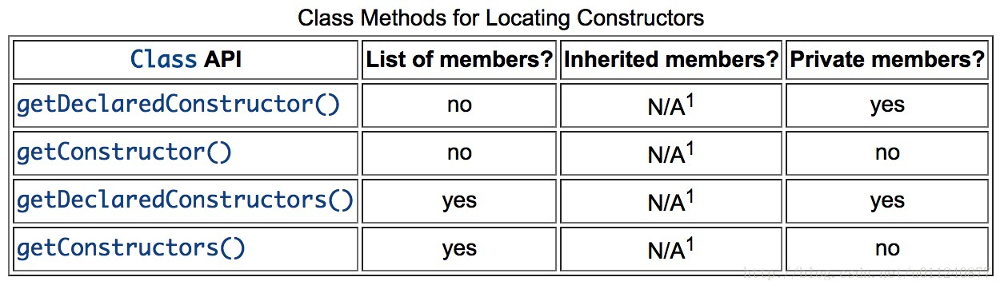

但是一般在获取类构造方法之前，我们需要先获取到构造器需要的类变量，下面我们会讲到

### 通过反射实例化对象

- **类构造器.newInstance()**

在获取类构造器后就可以进行实例化对象了，需要根据类构造器的参数类型分别传入对应类型的实例化字段

### 通过反射获取类变量

首先就是获取类变量

- **Class::getFields()方法/Class::getField()方法**

```java
public Field getField(String name)
public Field[] getFields()
```

返回一个包含某些Field对象的数组/单个Field对象，这些对象反映此Class对象所表示的类或接口的所有可访问公共字段。

- **Class::getDeclaredFields()/Class::getDeclaredField方法**

```java
public Field getDeclaredField(String name)
public Field[] getDeclaredFields()
```

返回 Field 对象的一个数组/单个Field对象，这些对象反映此 Class 对象所表示的类或接口所声明的所有字段。包括公共、保护、默认（包）访问和私有字段，但不包括继承的字段。

继续放大师傅的图片讲的很简单明了

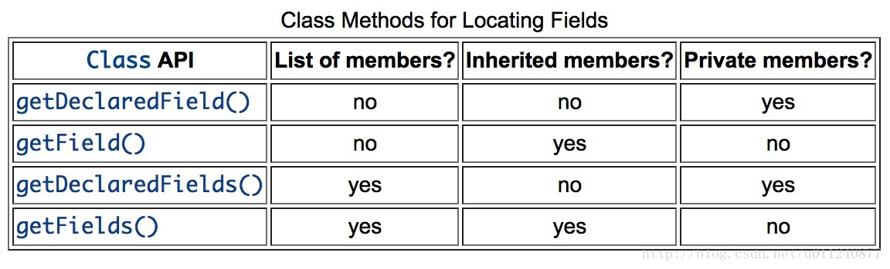

然后就是对类变量的操作

### 通过反射操作类变量

- **Field::set()方法**

其实这个本质上不是Class类中的方法，而是一些Field类的方法，这个方法主要是用来改变属性的值

```java
public void set(Object obj,Object value)
```

这里需要传入一个对象和修改的值，并没有返回值

- **Field::get()方法**

这个方法主要是用来获取属性的值的

```java
public void get(Object obj)
```

- **Field::setAccessible()方法**

和getDeclaredFields()方法一样，这里的话相对于set方法来说权限更大，一般来说private属性的值是不可以被修改的，但是通过这个方法可以允许我们对私有属性设置操作权限

```java
public void setAccessible(boolean flag)
```

例如我们类中age是一个private类型的成员变量

```java
agefield.setAccessible(true);
agefield.set(p, 30);
System.out.println(p);
```

我们写个demo试一下

```java
import java.lang.Class;
import java.lang.reflect.Constructor;
import java.lang.reflect.Field;
import java.lang.reflect.Method;

public class ReflectionTest {
    public static void main(String[] args) throws Exception {
        Class c = Class.forName("People");
        Constructor ctor = c.getDeclaredConstructor(String.class, int.class);
        People p = (People) ctor.newInstance("wang",30);
        System.out.println(p);

        //获取类的成员变量

        //1.通过getFeild获取单个成员变量
        //只能获取公共属性的成员变量
        //Field nameField = c.getField("name");

        //2.通过getFeilds获取所有公共属性的变量数组
        //Field[] fields = c.Fields();

        //3.通过getDeclaredField获取单个属性对象
        //无论是private还是public的属性都能获得
        Field nameField = c.getDeclaredField("name");
        Field ageField = c.getDeclaredField("age");

        //4.通过getDeclaredFields获取所有属性的变量数组
        //Field[] fields = c.getDeclaredFields();

        //操作类的成员变量
        //公共类型可以直接操作
        nameField.set(p,"meng");
        ageField.setAccessible(true);
        ageField.set(p,20);
        System.out.println(p);
    }
}

```

### 通过反射操作类方法

首先就是获取类方法

- **getDeclaredMethod\getDeclaredMethods()**方法

```
public Method getDeclaredMethod(String name,Class<?>... parameterTypes)
public Method[] getDeclaredMethods()
```

返回一个 Method 对象/Method 对象的一个数组，该对象反映此 Class 对象所表示的类或接口的指定已声明方法。name 参数是一个 String，它是方法的名称，parameterTypes 参数是 Class 对象的一个数组，它按声明顺序标识该方法的形参类型。前者是获取单个成员方法，后者是获取一个成员方法数组`Method[]`

- **getMethod\getMethods()**方法

```
Method[] getMethods()
Method getMethod(String name, Class<?>... parameterTypes)
```

返回一个 Method 对象/Method对象数组，它反映此 Class 对象所表示的类或接口的指定**公共成员方法**。前者是获取单个成员方法，后者是获取一个成员方法数组`Method[]`

上面两种的区别依旧和获取类变量的区别差不多

然后就是操作类，调用Method的invoke方法

- **Method::invoke()方法**

```java
public Object invoke(Object obj,Object... args)
```

obj--实例对象 ...args--用于方法调用的实参

对带有指定参数的指定对象调用由此 Method 对象表示的底层方法。

- **Method::setAccessible()方法**

```java
public void setAccessible(boolean flag)
```

接下来我们写个demo

- 操作void返回值的方法

```java
    public void getName(String name) {
        System.out.println("name's = " + name);
    }
```

然后我们调用该方法

```java
import java.lang.Class;
import java.lang.reflect.Constructor;
import java.lang.reflect.Field;
import java.lang.reflect.Method;

public class ReflectionTest {
    public static void main(String[] args) throws Exception {
        Class c = Class.forName("People");
        Constructor ctor = c.getDeclaredConstructor(String.class, int.class);
        People p = (People) ctor.newInstance("wang",30);
        //System.out.println(p);

        //获取类的成员方法
        Method m = c.getDeclaredMethod("getName",String.class);

        m.invoke(p, "wang");
    }
}
//name's = wang
```

- 操作有返回值的方法

```java
    public String getName(String name) {
        return name;
    }
```

然后我们调用该方法

```java
import java.lang.Class;
import java.lang.reflect.Constructor;
import java.lang.reflect.Field;
import java.lang.reflect.Method;

public class ReflectionTest {
    public static void main(String[] args) throws Exception {
        Class c = Class.forName("People");
        Constructor ctor = c.getDeclaredConstructor(String.class, int.class);
        People p = (People) ctor.newInstance("meng",30);
        //System.out.println(p);

        //获取类的成员方法
        Method m = c.getDeclaredMethod("getName",String.class);

        String name = (String) m.invoke(p, "wang");
        System.out.println(name);
        System.out.println(p);
    }
}

```

其实没啥区别，有返回值的话就需要一个变量去接收这个返回值，但是注意这里需要强制类型转化

### 单例模式

既然学会了反射，我们就试着弹一下计算器

参考文章：https://baozongwi.xyz/p/java-reflection/#calc

```java
package TestCode;

public class Reflect_getclass {

    public static void main(String[] args) throws Exception {
        Class<?> clazz = Class.forName("java.lang.Runtime");
        clazz.getDeclaredMethod("exec",String.class).invoke(clazz.newInstance(),"calc");
    }
}
Exception in thread "main" java.lang.IllegalAccessException: Class TestCode.Reflect_getclass can not access a member of class java.lang.Runtime with modifiers "private"
	at sun.reflect.Reflection.ensureMemberAccess(Reflection.java:102)
	at java.lang.Class.newInstance(Class.java:436)
	at TestCode.Reflect_getclass.main(Reflect_getclass.java:7)
```

这里出现了一个报错，是因为Runtime类的构造器是私有（private）的，如果直接newInstance就会报错，但是用反射又无法获取到无参构造器，这就涉及到Java的单例模式了

**单例模式（Singleton Pattern）** 是一种常见的设计模式，它的核心目的是确保一个类 **在整个程序运行期间只有一个实例** ，并提供全局访问点。而单例模式又分为以下几种

饿汉式

```java
public class Singleton {
    private static final Singleton instance = new Singleton();

    private Singleton() {}

    public static Singleton getInstance() {
        return instance;
    }
}
```

构造器私有，但提供了getInstance方法可以自动创建并返回一个实例，类加载时就创建实例，线程安全，但可能浪费资源。

懒汉式

```java
public class Singleton {
    private static volatile Singleton instance;

    private Singleton() {}

    public static Singleton getInstance() {
        if (instance == null) {
             // 加锁防止多线程竞争
            synchronized (Singleton.class) {
                if (instance == null) {
                    instance = new Singleton();
                }
            }
        }
        return instance;
    }
}

```

第一次调用 `getInstance()` 时才创建实例，节省资源，但需额外处理线程安全问题。还有两种是Holder模式和枚举，但是因为`INSTANCE` 是 `final` 的，无法通过反射修改。

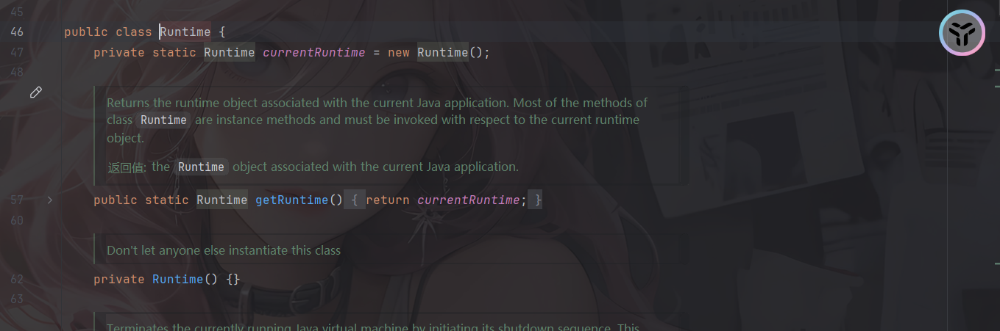

很明显，Runtime就是利用了单例模式中的饿汉式，构造器私有，对外只暴露了一个 `public static Runtime getRuntime()` 方法，用来获取唯一实例。

根据这个我们改一下poc

```java
package TestCode;

public class Reflect_getclass {

    public static void main(String[] args) throws Exception {
        Class<?> clazz = Class.forName("java.lang.Runtime");
        Object runtime = clazz.getDeclaredMethod("getRuntime").invoke(null);
        clazz.getDeclaredMethod("exec",String.class).invoke(runtime,"calc");
    }
}
```

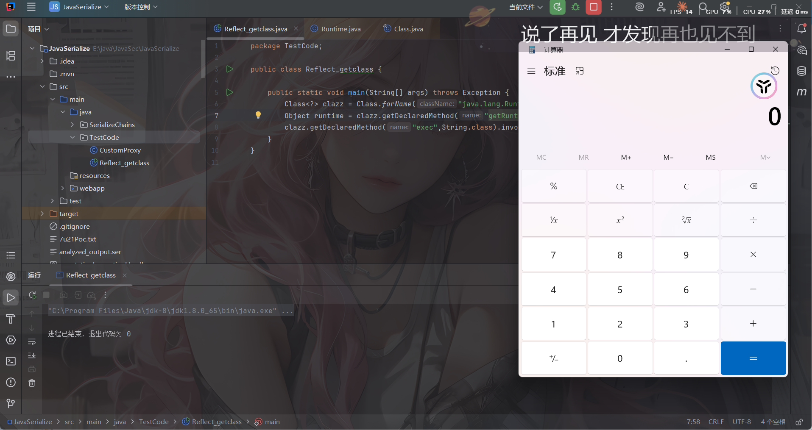

success！

## 反序列化中常用到的姿势

这里的话就是积累的部分了，需要不断更新去写

### 1、动态代理相关类

动态代理是Java反射API的一部分，允许在运行时创建实现特定接口的代理类。主要功能是在不修改目标对象代码的情况下，给目标方法“加功能”。

关键类：

- `java.lang.reflect.Proxy`：这是 JDK 动态代理的核心类。通过生成一个代理对象，代理对象会将方法调用转发给指定的InvocationHandler
- `java.lang.reflect.InvocationHandler`：这是一个 **接口**，代理对象的每个方法调用，都会被转发到 `InvocationHandler.invoke()`。

```java
public interface InvocationHandler {
    public Object invoke(Object proxy, Method method, Object[] args)
        throws Throwable;
}
```

利用原理：

1. 通过调用代理对象的方法进而调用到`InvocationHandler.invoke()`方法
2. 利用这一机制可以拦截和修改代理对象方法的调用

我们举个例子

```java
package TestCode;

import java.io.Serializable;
import java.lang.reflect.InvocationHandler;
import java.lang.reflect.Method;
import java.lang.reflect.Proxy;

//重写恶意的invoke方法
class ProxyHandler implements Serializable, InvocationHandler {
    @Override
    public Object invoke(Object proxy, Method method, Object[] args) throws Throwable {
        Runtime.getRuntime().exec("calc");  // 会执行 calc
        return null;
    }
}

// 随便写一个接口
interface TestInterface {
    void hello();
}

// 实现类
class Test implements TestInterface {
    public void hello() {
        System.out.println("Test");
    }
}

// 创建动态代理
public class ProxyTest {
    public static void main(String[] args) {
        Test test = new Test();

        TestInterface proxy = (TestInterface) Proxy.newProxyInstance(
                test.getClass().getClassLoader(),
                new Class[]{TestInterface.class},
                new ProxyHandler()
        );

        proxy.hello();
    }
}
```

可以看到这里调用hello后会转向调用ProxyHandler#invoke()方法

### 2、命令执行类

命令执行类提供了在Java中执行系统命令的功能

关键类：

- java.lang.Runtime
- java.lang.ProcessBuilder
- javax.script.ScriptEngine

```java

//方法1：Runtime.exec
Runtime.getRuntime().exec("calc.exe");

//方法2：ProcessBuilder
new ProcessBuilder("calc.exe").start();

//方法3：ScriptEngine
ScriptEngineManager manager=new ScriptEngineManager();
ScriptEngine engine =manager.getEngineByName("js");
engine.eval("java.lang.Runtime.getRuntime().exec('calc.exe')");
```

分析源码可以知道，其实exec内部也是通过调用ProcessBuilder的start方法的

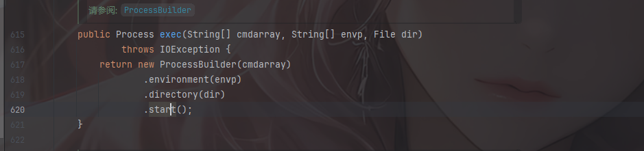

但是这里需要注意的是，exec方法返回的是一个ProcessBuilder对象，并不会返回命令执行结果，所以我们还需要用BufferedReader额外获取命令执行结果并渲染返回到页面上
